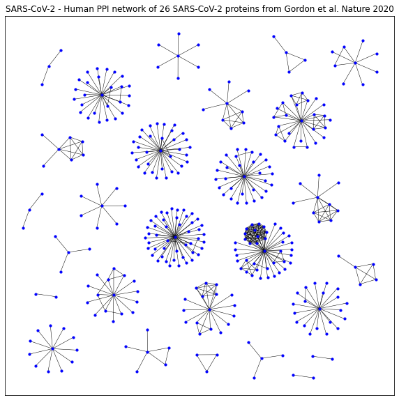
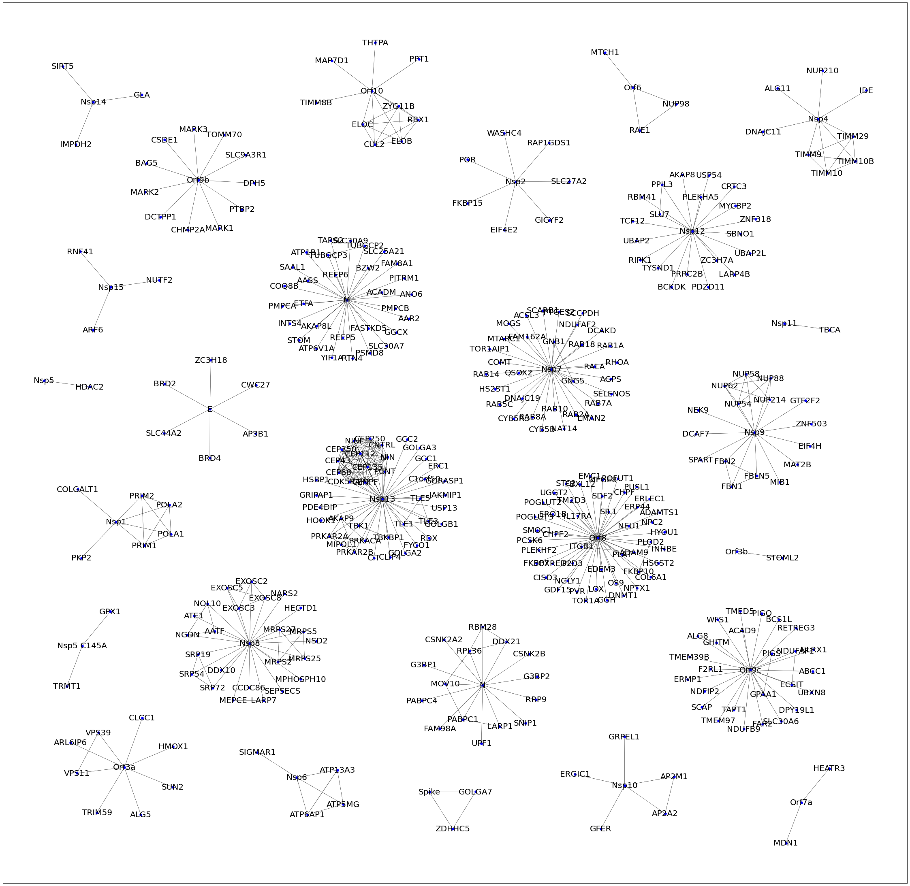

```python
G_Drugs = nx.read_graphml("./Networks/DrugBank - Target drugs.graphml")

# Define position of each node
#pos = nx.nx_agraph.graphviz_layout(G_Drugs,prog='neato')
# # Plot the graph
#plt.figure(figsize=(40, 40))
#nx.draw_networkx_nodes(G_Drugs, pos=pos,node_size=30,  node_color = 'blue')
#nx.draw_networkx_edges(G_Drugs, pos=pos,width=0.5,arrows=False)
# #Uncomment to label by node number
#nx.draw_networkx_labels(G_Drugs,pos=pos, font_size=8, alpha=1)
#plt.title("SARS-CoV-2 - Human PPI network of 26 SARS-CoV-2 proteins from Gordon et al. Nature 2020")
#plt.show()
```


```python
import pandas as pd
import numpy as np
import random
import networkx as nx
from IPython.display import Image
import matplotlib.pyplot as plt
import collections
```

#COVID-Human protein-protein interaction network

Analysis of the COVID-Human protein-protein interaction network (Gordon et al. 2020, *Nature*).

First we need to install pygraphviz to allow for better layouts that can help us visualize the network.


```python
!apt install libgraphviz-dev
!pip install pygraphviz
```

    Reading package lists... Done
    Building dependency tree       
    Reading state information... Done
    The following package was automatically installed and is no longer required:
      libnvidia-common-440
    Use 'apt autoremove' to remove it.
    The following additional packages will be installed:
      libgvc6-plugins-gtk libxdot4
    The following NEW packages will be installed:
      libgraphviz-dev libgvc6-plugins-gtk libxdot4
    0 upgraded, 3 newly installed, 0 to remove and 35 not upgraded.
    Need to get 91.3 kB of archives.
    After this operation, 425 kB of additional disk space will be used.
    Get:1 http://archive.ubuntu.com/ubuntu bionic/universe amd64 libxdot4 amd64 2.40.1-2 [15.7 kB]
    Get:2 http://archive.ubuntu.com/ubuntu bionic/universe amd64 libgvc6-plugins-gtk amd64 2.40.1-2 [18.2 kB]
    Get:3 http://archive.ubuntu.com/ubuntu bionic/universe amd64 libgraphviz-dev amd64 2.40.1-2 [57.3 kB]
    Fetched 91.3 kB in 2s (58.2 kB/s)
    Selecting previously unselected package libxdot4.
    (Reading database ... 144487 files and directories currently installed.)
    Preparing to unpack .../libxdot4_2.40.1-2_amd64.deb ...
    Unpacking libxdot4 (2.40.1-2) ...
    Selecting previously unselected package libgvc6-plugins-gtk.
    Preparing to unpack .../libgvc6-plugins-gtk_2.40.1-2_amd64.deb ...
    Unpacking libgvc6-plugins-gtk (2.40.1-2) ...
    Selecting previously unselected package libgraphviz-dev.
    Preparing to unpack .../libgraphviz-dev_2.40.1-2_amd64.deb ...
    Unpacking libgraphviz-dev (2.40.1-2) ...
    Setting up libxdot4 (2.40.1-2) ...
    Setting up libgvc6-plugins-gtk (2.40.1-2) ...
    Setting up libgraphviz-dev (2.40.1-2) ...
    Processing triggers for man-db (2.8.3-2ubuntu0.1) ...
    Processing triggers for libc-bin (2.27-3ubuntu1) ...
    /sbin/ldconfig.real: /usr/local/lib/python3.6/dist-packages/ideep4py/lib/libmkldnn.so.0 is not a symbolic link
    
    Collecting pygraphviz
    [?25l  Downloading https://files.pythonhosted.org/packages/1e/19/acf3b8dbd378a2b38c6d9aaa6fa9fcd9f7b4aea5fcd3460014999ff92b3c/pygraphviz-1.6.zip (117kB)
         |████████████████████████████████| 122kB 2.7MB/s 
    [?25hBuilding wheels for collected packages: pygraphviz
      Building wheel for pygraphviz (setup.py) ... [?25l[?25hdone
      Created wheel for pygraphviz: filename=pygraphviz-1.6-cp36-cp36m-linux_x86_64.whl size=155444 sha256=05272f02edc1ceef6f5f3384f8e95941ae8db441ed10576cb69886e67cc5ae32
      Stored in directory: /root/.cache/pip/wheels/7c/45/a1/93b830b69fb81d1ae84a248da30e2c0b926a3a6e3435908e6d
    Successfully built pygraphviz
    Installing collected packages: pygraphviz
    Successfully installed pygraphviz-1.6
    

You now need to upload the network files from GitHub (https://github.com/jgtz/CdeCMx2020-NetworkBiology). Create a directory "Networks" using the files tab in Google Colab (upper right corner), and upload the files to this folder.


```python
# #Load the graph
G_sarscov2_original = nx.read_graphml("./Networks/HEK293T_SARS-CoV-2.graphml")

# Define position of each node
pos = nx.nx_agraph.graphviz_layout(G_sarscov2_original,prog='neato')
# # Plot the graph
plt.figure(figsize=(10, 10))
nx.draw_networkx_nodes(G_sarscov2_original, pos=pos,node_size=10,  node_color = 'blue')
nx.draw_networkx_edges(G_sarscov2_original, pos=pos,width=0.5,arrows=False)
# #Uncomment to label by node number
#nx.draw_networkx_labels(G_sarscov2_original,pos=pos, font_size=8, alpha=1)
plt.title("SARS-CoV-2 - Human PPI network of 26 SARS-CoV-2 proteins from Gordon et al. Nature 2020")
plt.show()
plt.savefig('COVID.png')
```





    <Figure size 432x288 with 0 Axes>


Centrality gives an estimation on how important a node or edge is for the connectivity or the information flow of the network. It is a useful parameter in signalling networks and it is often used when trying to find drug targets.

Centrality analysis in PPINs usually aims to answer the following question:

Which protein is the most important and why?

Edge centrality can also be analysed, but this is less common and the concepts can easily be translated from the node-based centralities, so we will focus on the latter in this section.


```python
G_sarscov2=nx.Graph(G_sarscov2_original)
print(nx.info(G_sarscov2))
```

    Name: HEK293T_SARS-CoV-2
    Type: Graph
    Number of nodes: 359
    Number of edges: 481
    Average degree:   2.6797
    

####Labels the nodes


```python
G_sarscov2.nodes(data = 'name')
labels = dict(G_sarscov2.nodes(data = 'name'))
print(labels)
H = nx.relabel_nodes(G_sarscov2, labels, copy=True)
print(H)
```

    {'2634': 'E', '2633': 'AP3B1', '2632': 'BRD4', '2631': 'BRD2', '2630': 'CWC27', '2629': 'ZC3H18', '2628': 'SLC44A2', '2627': 'M', '2626': 'PMPCB', '2625': 'YIF1A', '2624': 'ATP1B1', '2623': 'ACADM', '2622': 'ETFA', '2621': 'STOM', '2620': 'GGCX', '2619': 'ATP6V1A', '2618': 'PSMD8', '2617': 'REEP5', '2616': 'PMPCA', '2615': 'ANO6', '2614': 'PITRM1', '2613': 'SLC30A9', '2612': 'FASTKD5', '2611': 'SLC30A7', '2610': 'TUBGCP3', '2609': 'COQ8B', '2608': 'SAAL1', '2607': 'REEP6', '2606': 'INTS4', '2605': 'SLC25A21', '2604': 'TUBGCP2', '2603': 'TARS2', '2602': 'RTN4', '2601': 'FAM8A1', '2600': 'AASS', '2599': 'AKAP8L', '2598': 'AAR2', '2597': 'BZW2', '2596': 'N', '2595': 'RRP9', '2594': 'PABPC1', '2593': 'CSNK2A2', '2592': 'CSNK2B', '2591': 'G3BP1', '2590': 'PABPC4', '2589': 'LARP1', '2588': 'FAM98A', '2587': 'SNIP1', '2586': 'UPF1', '2585': 'MOV10', '2584': 'G3BP2', '2583': 'DDX21', '2582': 'RBM28', '2581': 'RPL36', '2580': 'Spike', '2579': 'GOLGA7', '2578': 'ZDHHC5', '2577': 'Nsp1', '2576': 'POLA1', '2575': 'PRIM1', '2574': 'PRIM2', '2573': 'POLA2', '2572': 'COLGALT1', '2571': 'PKP2', '2570': 'Nsp10', '2569': 'AP2A2', '2568': 'GFER', '2567': 'ERGIC1', '2566': 'AP2M1', '2565': 'GRPEL1', '2564': 'Nsp11', '2563': 'TBCA', '2562': 'Nsp12', '2561': 'SBNO1', '2560': 'BCKDK', '2559': 'AKAP8', '2558': 'MYCBP2', '2557': 'SLU7', '2556': 'RIPK1', '2555': 'UBAP2L', '2554': 'TYSND1', '2553': 'PDZD11', '2552': 'PRRC2B', '2551': 'UBAP2', '2550': 'ZNF318', '2549': 'CRTC3', '2548': 'USP54', '2547': 'ZC3H7A', '2546': 'LARP4B', '2545': 'RBM41', '2544': 'TCF12', '2543': 'PPIL3', '2542': 'PLEKHA5', '2541': 'Nsp13', '2540': 'TBKBP1', '2539': 'CIT', '2538': 'HSBP1', '2537': 'PCNT', '2536': 'CEP43', '2535': 'PRKAR2A', '2534': 'PRKACA', '2533': 'PRKAR2B', '2532': 'RDX', '2531': 'CENPF', '2530': 'TLE1', '2529': 'TLE3', '2528': 'TLE5', '2527': 'GOLGA3', '2526': 'GOLGA2', '2525': 'GOLGB1', '2524': 'GRIPAP1', '2523': 'CEP350', '2522': 'PDE4DIP', '2521': 'CEP135', '2520': 'CEP68', '2519': 'CNTRL', '2518': 'ERC1', '2517': 'GCC2', '2516': 'CLIP4', '2515': 'NIN', '2514': 'CEP112', '2513': 'MIPOL1', '2512': 'USP13', '2511': 'GCC1', '2510': 'JAKMIP1', '2509': 'CDK5RAP2', '2508': 'AKAP9', '2507': 'GORASP1', '2506': 'FYCO1', '2505': 'C1orf50', '2504': 'CEP250', '2503': 'TBK1', '2502': 'HOOK1', '2501': 'NINL', '2500': 'Nsp14', '2499': 'GLA', '2498': 'IMPDH2', '2497': 'SIRT5', '2496': 'Nsp15', '2495': 'NUTF2', '2494': 'ARF6', '2493': 'RNF41', '2492': 'Nsp2', '2491': 'SLC27A2', '2490': 'EIF4E2', '2489': 'POR', '2488': 'RAP1GDS1', '2487': 'WASHC4', '2486': 'FKBP15', '2485': 'GIGYF2', '2484': 'Nsp4', '2483': 'IDE', '2482': 'TIMM10', '2481': 'ALG11', '2480': 'NUP210', '2479': 'TIMM29', '2478': 'DNAJC11', '2477': 'TIMM10B', '2476': 'TIMM9', '2475': 'Nsp5', '2474': 'HDAC2', '2473': 'Nsp5 C145A', '2472': 'GPX1', '2471': 'TRMT1', '2470': 'Nsp6', '2469': 'ATP5MG', '2468': 'ATP6AP1', '2467': 'SIGMAR1', '2466': 'ATP13A3', '2465': 'Nsp7', '2464': 'AGPS', '2463': 'CYB5B', '2462': 'ACSL3', '2461': 'RALA', '2460': 'COMT', '2459': 'RAB5C', '2458': 'RAB7A', '2457': 'RAB8A', '2456': 'RAB2A', '2455': 'RAB10', '2454': 'RAB14', '2453': 'RHOA', '2452': 'RAB1A', '2451': 'GNB1', '2450': 'GNG5', '2449': 'LMAN2', '2448': 'MOGS', '2447': 'TOR1AIP1', '2446': 'MTARC1', '2445': 'QSOX2', '2444': 'HS2ST1', '2443': 'NDUFAF2', '2442': 'SCCPDH', '2441': 'SCARB1', '2440': 'NAT14', '2439': 'DCAKD', '2438': 'FAM162A', '2437': 'DNAJC19', '2436': 'SELENOS', '2435': 'PTGES2', '2434': 'RAB18', '2433': 'Nsp8', '2432': 'MPHOSPH10', '2431': 'SRP72', '2430': 'ATE1', '2429': 'NSD2', '2428': 'SRP19', '2427': 'SRP54', '2426': 'MRPS25', '2425': 'DDX10', '2424': 'LARP7', '2423': 'MEPCE', '2422': 'NGDN', '2421': 'EXOSC8', '2420': 'NARS2', '2419': 'NOL10', '2418': 'CCDC86', '2417': 'SEPSECS', '2416': 'EXOSC5', '2415': 'EXOSC3', '2414': 'AATF', '2413': 'HECTD1', '2412': 'MRPS2', '2411': 'MRPS5', '2410': 'EXOSC2', '2409': 'MRPS27', '2408': 'Nsp9', '2407': 'GTF2F2', '2406': 'FBN1', '2405': 'FBN2', '2404': 'NUP214', '2403': 'NUP62', '2402': 'DCAF7', '2401': 'EIF4H', '2400': 'NUP54', '2399': 'MIB1', '2398': 'SPART', '2397': 'NEK9', '2396': 'ZNF503', '2395': 'NUP88', '2394': 'NUP58', '2393': 'MAT2B', '2392': 'FBLN5', '2391': 'Orf10', '2390': 'PPT1', '2389': 'CUL2', '2388': 'MAP7D1', '2387': 'THTPA', '2386': 'ZYG11B', '2385': 'TIMM8B', '2384': 'RBX1', '2383': 'ELOC', '2382': 'ELOB', '2381': 'Orf3a', '2380': 'HMOX1', '2379': 'TRIM59', '2378': 'ARL6IP6', '2377': 'VPS39', '2376': 'CLCC1', '2375': 'VPS11', '2374': 'SUN2', '2373': 'ALG5', '2372': 'Orf3b', '2371': 'STOML2', '2370': 'Orf6', '2369': 'NUP98', '2368': 'RAE1', '2367': 'MTCH1', '2366': 'Orf7a', '2365': 'HEATR3', '2364': 'MDN1', '2363': 'Orf8', '2362': 'PLOD2', '2361': 'TOR1A', '2360': 'STC2', '2359': 'PLAT', '2358': 'ITGB1', '2357': 'CISD3', '2356': 'COL6A1', '2355': 'PVR', '2354': 'DNMT1', '2353': 'LOX', '2352': 'PCSK6', '2351': 'INHBE', '2350': 'NPC2', '2349': 'MFGE8', '2348': 'OS9', '2347': 'NPTX1', '2346': 'POGLUT2', '2345': 'POGLUT3', '2344': 'ERO1B', '2343': 'PLD3', '2342': 'FOXRED2', '2341': 'CHPF', '2340': 'PUSL1', '2339': 'EMC1', '2338': 'GGH', '2337': 'ERLEC1', '2336': 'IL17RA', '2335': 'NGLY1', '2334': 'HS6ST2', '2333': 'SDF2', '2332': 'NEU1', '2331': 'GDF15', '2330': 'TM2D3', '2329': 'ERP44', '2328': 'EDEM3', '2327': 'SIL1', '2326': 'POFUT1', '2325': 'SMOC1', '2324': 'PLEKHF2', '2323': 'FBXL12', '2322': 'UGGT2', '2321': 'CHPF2', '2320': 'ADAMTS1', '2319': 'HYOU1', '2318': 'FKBP7', '2317': 'ADAM9', '2316': 'FKBP10', '2315': 'Orf9b', '2314': 'SLC9A3R1', '2313': 'CHMP2A', '2312': 'CSDE1', '2311': 'TOMM70', '2310': 'MARK3', '2309': 'MARK2', '2308': 'DPH5', '2307': 'DCTPP1', '2306': 'MARK1', '2305': 'PTBP2', '2304': 'BAG5', '2303': 'Orf9c', '2302': 'UBXN8', '2301': 'GPAA1', '2300': 'WFS1', '2299': 'ABCC1', '2298': 'F2RL1', '2297': 'SCAP', '2296': 'DPY19L1', '2295': 'TMEM97', '2294': 'SLC30A6', '2293': 'TAPT1', '2292': 'ERMP1', '2291': 'NLRX1', '2290': 'RETREG3', '2289': 'PIGO', '2288': 'FAR2', '2287': 'ECSIT', '2286': 'ALG8', '2285': 'TMEM39B', '2284': 'GHITM', '2283': 'ACAD9', '2282': 'NDFIP2', '2281': 'BCS1L', '2280': 'NDUFAF1', '2279': 'TMED5', '2278': 'NDUFB9', '2277': 'PIGS', '2276': 'CYB5R3'}
    HEK293T_SARS-CoV-2
    


```python
# Define position of each node
pos = nx.nx_agraph.graphviz_layout(H,prog='neato')
# # Plot the graph
plt.figure(figsize=(40, 40))
nx.draw_networkx_nodes(H, pos=pos,node_size=30,  node_color = 'blue')
nx.draw_networkx_edges(H, pos=pos,width=0.5,arrows=False)
# #Uncomment to label by node number
nx.draw_networkx_labels(H,pos=pos, font_size=20, alpha=1)
```


    {'AAR2': Text(601.12, 900.85, 'AAR2'),
     'AASS': Text(442.76, 965.19, 'AASS'),
     'AATF': Text(297.27, 374.44, 'AATF'),
     'ABCC1': Text(1231.8, 307.05, 'ABCC1'),
     'ACAD9': Text(1121.7, 375.37, 'ACAD9'),
     'ACADM': Text(557.92, 945.37, 'ACADM'),
     'ACSL3': Text(784.32, 906.6, 'ACSL3'),
     'ADAM9': Text(952.35, 507.14, 'ADAM9'),
     'ADAMTS1': Text(992.32, 574.61, 'ADAMTS1'),
     'AGPS': Text(915.99, 798.94, 'AGPS'),
     'AKAP8': Text(1028.0, 1142.8, 'AKAP8'),
     'AKAP8L': Text(455.94, 888.27, 'AKAP8L'),
     'AKAP9': Text(494.63, 564.23, 'AKAP9'),
     'ALG11': Text(1176.8, 1288.4, 'ALG11'),
     'ALG5': Text(181.73, 66.0, 'ALG5'),
     'ALG8': Text(1052.2, 366.28, 'ALG8'),
     'ANO6': Text(604.86, 941.87, 'ANO6'),
     'AP2A2': Text(1001.0, 67.79, 'AP2A2'),
     'AP2M1': Text(1015.1, 130.07, 'AP2M1'),
     'AP3B1': Text(361.22, 707.01, 'AP3B1'),
     'ARF6': Text(107.5, 882.0, 'ARF6'),
     'ARL6IP6': Text(72.096, 187.17, 'ARL6IP6'),
     'ATE1': Text(264.85, 400.4, 'ATE1'),
     'ATP13A3': Text(488.83, 140.99, 'ATP13A3'),
     'ATP1B1': Text(440.4, 1012.4, 'ATP1B1'),
     'ATP5MG': Text(498.11, 83.26, 'ATP5MG'),
     'ATP6AP1': Text(441.99, 66.0, 'ATP6AP1'),
     'ATP6V1A': Text(456.37, 850.29, 'ATP6V1A'),
     'BAG5': Text(190.7, 1162.5, 'BAG5'),
     'BCKDK': Text(1010.9, 954.19, 'BCKDK'),
     'BCS1L': Text(1178.8, 394.36, 'BCS1L'),
     'BRD2': Text(219.08, 790.96, 'BRD2'),
     'BRD4': Text(289.66, 666.0, 'BRD4'),
     'BZW2': Text(536.33, 986.32, 'BZW2'),
     'C1orf50': Text(625.36, 630.82, 'C1orf50'),
     'CCDC86': Text(350.73, 279.54, 'CCDC86'),
     'CDK5RAP2': Text(507.75, 626.33, 'CDK5RAP2'),
     'CENPF': Text(532.3, 625.39, 'CENPF'),
     'CEP112': Text(524.61, 673.63, 'CEP112'),
     'CEP135': Text(535.86, 651.1, 'CEP135'),
     'CEP250': Text(540.04, 698.69, 'CEP250'),
     'CEP350': Text(495.27, 680.87, 'CEP350'),
     'CEP43': Text(489.47, 661.87, 'CEP43'),
     'CEP68': Text(491.25, 641.84, 'CEP68'),
     'CHMP2A': Text(255.46, 1050.0, 'CHMP2A'),
     'CHPF': Text(937.27, 608.25, 'CHPF'),
     'CHPF2': Text(829.94, 537.9, 'CHPF2'),
     'CISD3': Text(814.37, 464.87, 'CISD3'),
     'CIT': Text(546.05, 498.0, 'CIT'),
     'CLCC1': Text(184.07, 228.87, 'CLCC1'),
     'CLIP4': Text(571.38, 499.58, 'CLIP4'),
     'CNTRL': Text(558.49, 688.31, 'CNTRL'),
     'COL6A1': Text(978.75, 465.73, 'COL6A1'),
     'COLGALT1': Text(83.145, 613.54, 'COLGALT1'),
     'COMT': Text(742.93, 827.38, 'COMT'),
     'COQ8B': Text(405.89, 956.07, 'COQ8B'),
     'CRTC3': Text(1108.8, 1123.1, 'CRTC3'),
     'CSDE1': Text(219.02, 1201.9, 'CSDE1'),
     'CSNK2A2': Text(655.7, 360.23, 'CSNK2A2'),
     'CSNK2B': Text(788.73, 336.58, 'CSNK2B'),
     'CUL2': Text(547.1, 1194.0, 'CUL2'),
     'CWC27': Text(361.81, 789.05, 'CWC27'),
     'CYB5B': Text(808.61, 714.0, 'CYB5B'),
     'CYB5R3': Text(764.55, 732.48, 'CYB5R3'),
     'DCAF7': Text(1048.9, 706.65, 'DCAF7'),
     'DCAKD': Text(901.85, 880.61, 'DCAKD'),
     'DCTPP1': Text(212.35, 1071.9, 'DCTPP1'),
     'DDX10': Text(307.67, 308.74, 'DDX10'),
     'DDX21': Text(753.0, 356.77, 'DDX21'),
     'DNAJC11': Text(1154.0, 1215.5, 'DNAJC11'),
     'DNAJC19': Text(777.53, 766.83, 'DNAJC19'),
     'DNMT1': Text(935.91, 434.83, 'DNMT1'),
     'DPH5': Text(358.95, 1129.0, 'DPH5'),
     'DPY19L1': Text(1206.4, 242.12, 'DPY19L1'),
     'E': Text(289.83, 748.51, 'E'),
     'ECSIT': Text(1198.9, 284.84, 'ECSIT'),
     'EDEM3': Text(901.22, 478.91, 'EDEM3'),
     'EIF4E2': Text(749.49, 1050.0, 'EIF4E2'),
     'EIF4H': Text(1227.3, 686.23, 'EIF4H'),
     'ELOB': Text(589.11, 1199.6, 'ELOB'),
     'ELOC': Text(528.22, 1227.9, 'ELOC'),
     'EMC1': Text(883.4, 635.53, 'EMC1'),
     'ERC1': Text(647.13, 653.01, 'ERC1'),
     'ERGIC1': Text(860.2, 133.8, 'ERGIC1'),
     'ERLEC1': Text(976.77, 597.47, 'ERLEC1'),
     'ERMP1': Text(1036.0, 293.59, 'ERMP1'),
     'ERO1B': Text(825.25, 571.43, 'ERO1B'),
     'ERP44': Text(957.58, 583.77, 'ERP44'),
     'ETFA': Text(435.89, 925.97, 'ETFA'),
     'EXOSC2': Text(354.92, 458.52, 'EXOSC2'),
     'EXOSC3': Text(334.68, 413.33, 'EXOSC3'),
     'EXOSC5': Text(316.4, 447.35, 'EXOSC5'),
     'EXOSC8': Text(375.69, 430.6, 'EXOSC8'),
     'F2RL1': Text(1072.0, 310.87, 'F2RL1'),
     'FAM162A': Text(785.5, 870.27, 'FAM162A'),
     'FAM8A1': Text(582.24, 993.87, 'FAM8A1'),
     'FAM98A': Text(648.94, 210.75, 'FAM98A'),
     'FAR2': Text(1153.3, 218.29, 'FAR2'),
     'FASTKD5': Text(537.53, 884.54, 'FASTKD5'),
     'FBLN5': Text(1144.4, 636.0, 'FBLN5'),
     'FBN1': Text(1105.1, 618.0, 'FBN1'),
     'FBN2': Text(1094.8, 660.56, 'FBN2'),
     'FBXL12': Text(867.95, 621.95, 'FBXL12'),
     'FKBP10': Text(959.26, 474.67, 'FKBP10'),
     'FKBP15': Text(692.2, 1095.3, 'FKBP15'),
     'FKBP7': Text(799.97, 489.33, 'FKBP7'),
     'FOXRED2': Text(825.12, 488.52, 'FOXRED2'),
     'FYCO1': Text(613.2, 519.11, 'FYCO1'),
     'G3BP1': Text(623.9, 318.27, 'G3BP1'),
     'G3BP2': Text(801.02, 298.41, 'G3BP2'),
     'GCC1': Text(627.62, 665.05, 'GCC1'),
     'GCC2': Text(598.29, 697.69, 'GCC2'),
     'GDF15': Text(833.64, 444.53, 'GDF15'),
     'GFER': Text(900.67, 42.0, 'GFER'),
     'GGCX': Text(581.32, 877.55, 'GGCX'),
     'GGH': Text(909.83, 426.94, 'GGH'),
     'GHITM': Text(1081.2, 355.59, 'GHITM'),
     'GIGYF2': Text(820.22, 1066.8, 'GIGYF2'),
     'GLA': Text(183.51, 1277.5, 'GLA'),
     'GNB1': Text(827.27, 862.05, 'GNB1'),
     'GNG5': Text(857.34, 795.74, 'GNG5'),
     'GOLGA2': Text(594.98, 506.16, 'GOLGA2'),
     'GOLGA3': Text(617.54, 683.31, 'GOLGA3'),
     'GOLGA7': Text(704.7, 104.41, 'GOLGA7'),
     'GOLGB1': Text(652.1, 554.94, 'GOLGB1'),
     'GORASP1': Text(656.45, 627.51, 'GORASP1'),
     'GPAA1': Text(1154.7, 268.34, 'GPAA1'),
     'GPX1': Text(134.1, 407.63, 'GPX1'),
     'GRIPAP1': Text(456.1, 603.6, 'GRIPAP1'),
     'GRPEL1': Text(937.34, 196.97, 'GRPEL1'),
     'GTF2F2': Text(1220.1, 762.78, 'GTF2F2'),
     'HDAC2': Text(101.76, 786.0, 'HDAC2'),
     'HEATR3': Text(1257.5, 143.63, 'HEATR3'),
     'HECTD1': Text(431.56, 413.84, 'HECTD1'),
     'HMOX1': Text(232.33, 180.37, 'HMOX1'),
     'HOOK1': Text(463.22, 561.14, 'HOOK1'),
     'HS2ST1': Text(735.2, 782.34, 'HS2ST1'),
     'HS6ST2': Text(990.5, 489.37, 'HS6ST2'),
     'HSBP1': Text(455.59, 629.58, 'HSBP1'),
     'HYOU1': Text(1000.1, 541.31, 'HYOU1'),
     'IDE': Text(1315.1, 1285.0, 'IDE'),
     'IL17RA': Text(864.22, 568.64, 'IL17RA'),
     'IMPDH2': Text(80.252, 1194.0, 'IMPDH2'),
     'INHBE': Text(999.3, 513.14, 'INHBE'),
     'INTS4': Text(414.52, 892.53, 'INTS4'),
     'ITGB1': Text(870.52, 517.08, 'ITGB1'),
     'JAKMIP1': Text(657.53, 603.91, 'JAKMIP1'),
     'LARP1': Text(742.64, 214.27, 'LARP1'),
     'LARP4B': Text(1109.3, 975.13, 'LARP4B'),
     'LARP7': Text(373.83, 258.0, 'LARP7'),
     'LMAN2': Text(885.75, 733.4, 'LMAN2'),
     'LOX': Text(892.93, 445.42, 'LOX'),
     'M': Text(503.75, 932.25, 'M'),
     'MAP7D1': Text(480.16, 1335.1, 'MAP7D1'),
     'MARK1': Text(304.43, 1053.0, 'MARK1'),
     'MARK2': Text(188.2, 1114.0, 'MARK2'),
     'MARK3': Text(264.21, 1219.7, 'MARK3'),
     'MAT2B': Text(1207.5, 655.22, 'MAT2B'),
     'MDN1': Text(1189.7, 18.0, 'MDN1'),
     'MEPCE': Text(325.82, 258.42, 'MEPCE'),
     'MFGE8': Text(903.85, 629.97, 'MFGE8'),
     'MIB1': Text(1180.4, 625.38, 'MIB1'),
     'MIPOL1': Text(494.87, 520.59, 'MIPOL1'),
     'MOGS': Text(756.17, 892.87, 'MOGS'),
     'MOV10': Text(657.37, 286.09, 'MOV10'),
     'MPHOSPH10': Text(431.44, 293.75, 'MPHOSPH10'),
     'MRPS2': Text(396.16, 323.1, 'MRPS2'),
     'MRPS25': Text(437.66, 328.6, 'MRPS25'),
     'MRPS27': Text(398.32, 377.26, 'MRPS27'),
     'MRPS5': Text(435.64, 374.11, 'MRPS5'),
     'MTARC1': Text(748.91, 867.0, 'MTARC1'),
     'MTCH1': Text(906.9, 1348.7, 'MTCH1'),
     'MYCBP2': Text(1110.6, 1090.7, 'MYCBP2'),
     'N': Text(715.78, 283.63, 'N'),
     'NARS2': Text(406.32, 438.0, 'NARS2'),
     'NAT14': Text(843.18, 715.28, 'NAT14'),
     'NDFIP2': Text(1062.9, 273.42, 'NDFIP2'),
     'NDUFAF1': Text(1204.7, 341.16, 'NDUFAF1'),
     'NDUFAF2': Text(863.82, 890.81, 'NDUFAF2'),
     'NDUFB9': Text(1123.9, 210.0, 'NDUFB9'),
     'NEK9': Text(1052.3, 746.74, 'NEK9'),
     'NEU1': Text(944.36, 551.9, 'NEU1'),
     'NGDN': Text(254.35, 368.34, 'NGDN'),
     'NGLY1': Text(848.74, 459.5, 'NGLY1'),
     'NIN': Text(567.32, 667.38, 'NIN'),
     'NINL': Text(515.26, 695.46, 'NINL'),
     'NLRX1': Text(1232.9, 343.51, 'NLRX1'),
     'NOL10': Text(285.9, 421.11, 'NOL10'),
     'NPC2': Text(980.87, 558.16, 'NPC2'),
     'NPTX1': Text(956.87, 447.25, 'NPTX1'),
     'NSD2': Text(455.96, 358.15, 'NSD2'),
     'NUP210': Text(1246.9, 1318.4, 'NUP210'),
     'NUP214': Text(1164.4, 764.23, 'NUP214'),
     'NUP54': Text(1115.2, 757.5, 'NUP54'),
     'NUP58': Text(1127.4, 807.74, 'NUP58'),
     'NUP62': Text(1093.9, 787.56, 'NUP62'),
     'NUP88': Text(1165.6, 800.42, 'NUP88'),
     'NUP98': Text(1018.1, 1262.3, 'NUP98'),
     'NUTF2': Text(210.76, 965.49, 'NUTF2'),
     'Nsp1': Text(143.08, 558.52, 'Nsp1'),
     'Nsp10': Text(937.77, 114.96, 'Nsp10'),
     'Nsp11': Text(1187.1, 892.64, 'Nsp11'),
     'Nsp12': Text(1043.8, 1048.0, 'Nsp12'),
     'Nsp13': Text(559.54, 597.23, 'Nsp13'),
     'Nsp14': Text(107.63, 1265.7, 'Nsp14'),
     'Nsp15': Text(134.88, 953.71, 'Nsp15'),
     'Nsp2': Text(767.41, 1131.5, 'Nsp2'),
     'Nsp4': Text(1240.1, 1237.1, 'Nsp4'),
     'Nsp5': Text(30.547, 796.64, 'Nsp5'),
     'Nsp5 C145A': Text(90.203, 350.21, 'Nsp5 C145A'),
     'Nsp6': Text(425.43, 128.36, 'Nsp6'),
     'Nsp7': Text(823.35, 815.65, 'Nsp7'),
     'Nsp8': Text(351.73, 354.37, 'Nsp8'),
     'Nsp9': Text(1140.8, 709.16, 'Nsp9'),
     'OS9': Text(924.03, 455.88, 'OS9'),
     'Orf10': Text(542.89, 1284.2, 'Orf10'),
     'Orf3a': Text(156.08, 145.47, 'Orf3a'),
     'Orf3b': Text(1113.1, 508.64, 'Orf3b'),
     'Orf6': Text(950.74, 1289.9, 'Orf6'),
     'Orf7a': Text(1213.7, 86.206, 'Orf7a'),
     'Orf8': Text(896.03, 531.72, 'Orf8'),
     'Orf9b': Text(271.76, 1134.1, 'Orf9b'),
     'Orf9c': Text(1134.3, 309.51, 'Orf9c'),
     'PABPC1': Text(685.23, 226.14, 'PABPC1'),
     'PABPC4': Text(620.85, 257.7, 'PABPC4'),
     'PCNT': Text(562.99, 643.02, 'PCNT'),
     'PCSK6': Text(789.58, 527.23, 'PCSK6'),
     'PDE4DIP': Text(461.06, 583.35, 'PDE4DIP'),
     'PDZD11': Text(1068.5, 954.0, 'PDZD11'),
     'PIGO': Text(1152.2, 404.75, 'PIGO'),
     'PIGS': Text(1167.5, 337.16, 'PIGS'),
     'PITRM1': Text(593.29, 969.19, 'PITRM1'),
     'PKP2': Text(88.693, 498.0, 'PKP2'),
     'PLAT': Text(933.87, 503.62, 'PLAT'),
     'PLD3': Text(856.0, 488.73, 'PLD3'),
     'PLEKHA5': Text(1056.6, 1105.5, 'PLEKHA5'),
     'PLEKHF2': Text(803.51, 510.84, 'PLEKHF2'),
     'PLOD2': Text(978.41, 524.89, 'PLOD2'),
     'PMPCA': Text(402.9, 922.21, 'PMPCA'),
     'PMPCB': Text(579.55, 918.11, 'PMPCB'),
     'POFUT1': Text(927.11, 631.66, 'POFUT1'),
     'POGLUT2': Text(810.06, 591.5, 'POGLUT2'),
     'POGLUT3': Text(797.3, 567.21, 'POGLUT3'),
     'POLA1': Text(228.99, 538.03, 'POLA1'),
     'POLA2': Text(226.25, 587.16, 'POLA2'),
     'POR': Text(692.48, 1168.4, 'POR'),
     'PPIL3': Text(996.01, 1126.8, 'PPIL3'),
     'PPT1': Text(616.5, 1338.0, 'PPT1'),
     'PRIM1': Text(187.08, 518.88, 'PRIM1'),
     'PRIM2': Text(183.03, 602.65, 'PRIM2'),
     'PRKACA': Text(531.98, 527.09, 'PRKACA'),
     'PRKAR2A': Text(476.41, 534.18, 'PRKAR2A'),
     'PRKAR2B': Text(515.93, 507.74, 'PRKAR2B'),
     'PRRC2B': Text(1035.3, 975.68, 'PRRC2B'),
     'PSMD8': Text(539.48, 842.74, 'PSMD8'),
     'PTBP2': Text(339.83, 1085.2, 'PTBP2'),
     'PTGES2': Text(835.16, 912.08, 'PTGES2'),
     'PUSL1': Text(956.61, 617.59, 'PUSL1'),
     'PVR': Text(863.49, 441.23, 'PVR'),
     'QSOX2': Text(772.31, 809.72, 'QSOX2'),
     'RAB10': Text(828.71, 748.98, 'RAB10'),
     'RAB14': Text(721.72, 807.22, 'RAB14'),
     'RAB18': Text(870.85, 857.41, 'RAB18'),
     'RAB1A': Text(915.44, 855.3, 'RAB1A'),
     'RAB2A': Text(861.48, 739.54, 'RAB2A'),
     'RAB5C': Text(742.32, 756.48, 'RAB5C'),
     'RAB7A': Text(896.36, 758.5, 'RAB7A'),
     'RAB8A': Text(793.74, 735.27, 'RAB8A'),
     'RAE1': Text(961.65, 1218.0, 'RAE1'),
     'RALA': Text(890.66, 820.19, 'RALA'),
     'RAP1GDS1': Text(819.61, 1196.8, 'RAP1GDS1'),
     'RBM28': Text(715.89, 381.78, 'RBM28'),
     'RBM41': Text(964.61, 1105.3, 'RBM41'),
     'RBX1': Text(614.9, 1235.6, 'RBX1'),
     'RDX': Text(632.15, 531.14, 'RDX'),
     'REEP5': Text(497.38, 869.07, 'REEP5'),
     'REEP6': Text(485.9, 974.37, 'REEP6'),
     'RETREG3': Text(1205.8, 380.25, 'RETREG3'),
     'RHOA': Text(926.23, 827.08, 'RHOA'),
     'RIPK1': Text(962.07, 999.41, 'RIPK1'),
     'RNF41': Text(86.997, 1013.7, 'RNF41'),
     'RPL36': Text(695.23, 340.99, 'RPL36'),
     'RRP9': Text(799.24, 259.5, 'RRP9'),
     'RTN4': Text(512.27, 834.0, 'RTN4'),
     'SAAL1': Text(418.69, 987.28, 'SAAL1'),
     'SBNO1': Text(1119.0, 1043.2, 'SBNO1'),
     'SCAP': Text(1058.2, 246.7, 'SCAP'),
     'SCARB1': Text(809.99, 914.68, 'SCARB1'),
     'SCCPDH': Text(872.13, 910.18, 'SCCPDH'),
     'SDF2': Text(902.75, 602.3, 'SDF2'),
     'SELENOS': Text(917.35, 774.04, 'SELENOS'),
     'SEPSECS': Text(403.02, 273.82, 'SEPSECS'),
     'SIGMAR1': Text(364.0, 170.91, 'SIGMAR1'),
     'SIL1': Text(912.88, 575.95, 'SIL1'),
     'SIRT5': Text(59.747, 1325.7, 'SIRT5'),
     'SLC25A21': Text(562.07, 1013.9, 'SLC25A21'),
     'SLC27A2': Text(851.02, 1132.1, 'SLC27A2'),
     'SLC30A6': Text(1182.1, 222.91, 'SLC30A6'),
     'SLC30A7': Text(565.62, 854.85, 'SLC30A7'),
     'SLC30A9': Text(509.3, 1031.8, 'SLC30A9'),
     'SLC44A2': Text(218.05, 707.9, 'SLC44A2'),
     'SLC9A3R1': Text(346.28, 1176.4, 'SLC9A3R1'),
     'SLU7': Text(992.47, 1076.4, 'SLU7'),
     'SMOC1': Text(801.11, 544.38, 'SMOC1'),
     'SNIP1': Text(783.08, 219.74, 'SNIP1'),
     'SPART': Text(1056.7, 663.19, 'SPART'),
     'SRP19': Text(271.22, 335.52, 'SRP19'),
     'SRP54': Text(261.5, 302.57, 'SRP54'),
     'SRP72': Text(294.17, 279.32, 'SRP72'),
     'STC2': Text(845.9, 623.63, 'STC2'),
     'STOM': Text(428.74, 864.5, 'STOM'),
     'STOML2': Text(1184.4, 498.0, 'STOML2'),
     'SUN2': Text(231.79, 112.33, 'SUN2'),
     'Spike': Text(632.5, 103.93, 'Spike'),
     'TAPT1': Text(1108.5, 242.58, 'TAPT1'),
     'TARS2': Text(478.52, 1032.5, 'TARS2'),
     'TBCA': Text(1258.3, 882.0, 'TBCA'),
     'TBK1': Text(521.79, 552.14, 'TBK1'),
     'TBKBP1': Text(568.77, 532.44, 'TBKBP1'),
     'TCF12': Text(950.35, 1065.3, 'TCF12'),
     'THTPA': Text(548.26, 1365.6, 'THTPA'),
     'TIMM10': Text(1253.6, 1146.0, 'TIMM10'),
     'TIMM10B': Text(1298.2, 1165.7, 'TIMM10B'),
     'TIMM29': Text(1294.3, 1207.8, 'TIMM29'),
     'TIMM8B': Text(455.45, 1264.2, 'TIMM8B'),
     'TIMM9': Text(1224.5, 1176.9, 'TIMM9'),
     'TLE1': Text(592.54, 555.14, 'TLE1'),
     'TLE3': Text(630.99, 559.64, 'TLE3'),
     'TLE5': Text(618.45, 598.29, 'TLE5'),
     'TM2D3': Text(854.29, 594.73, 'TM2D3'),
     'TMED5': Text(1118.2, 408.41, 'TMED5'),
     'TMEM39B': Text(1039.2, 331.37, 'TMEM39B'),
     'TMEM97': Text(1084.1, 224.16, 'TMEM97'),
     'TOMM70': Text(311.81, 1210.2, 'TOMM70'),
     'TOR1A': Text(876.98, 426.0, 'TOR1A'),
     'TOR1AIP1': Text(726.6, 849.8, 'TOR1AIP1'),
     'TRIM59': Text(113.38, 69.368, 'TRIM59'),
     'TRMT1': Text(66.246, 282.0, 'TRMT1'),
     'TUBGCP2': Text(531.42, 1023.5, 'TUBGCP2'),
     'TUBGCP3': Text(474.45, 1007.6, 'TUBGCP3'),
     'TYSND1': Text(989.76, 986.01, 'TYSND1'),
     'UBAP2': Text(955.76, 1031.6, 'UBAP2'),
     'UBAP2L': Text(1133.4, 1010.6, 'UBAP2L'),
     'UBXN8': Text(1229.8, 271.35, 'UBXN8'),
     'UGGT2': Text(827.59, 607.59, 'UGGT2'),
     'UPF1': Text(714.01, 186.0, 'UPF1'),
     'USP13': Text(655.73, 581.71, 'USP13'),
     'USP54': Text(1069.4, 1142.2, 'USP54'),
     'VPS11': Text(82.041, 135.75, 'VPS11'),
     'VPS39': Text(115.3, 203.95, 'VPS39'),
     'WASHC4': Text(749.45, 1213.1, 'WASHC4'),
     'WFS1': Text(1083.0, 394.03, 'WFS1'),
     'YIF1A': Text(480.28, 835.1, 'YIF1A'),
     'ZC3H18': Text(291.27, 831.07, 'ZC3H18'),
     'ZC3H7A': Text(1081.7, 998.86, 'ZC3H7A'),
     'ZDHHC5': Text(669.09, 42.0, 'ZDHHC5'),
     'ZNF318': Text(1142.2, 1068.3, 'ZNF318'),
     'ZNF503': Text(1229.1, 723.58, 'ZNF503'),
     'ZYG11B': Text(584.51, 1258.4, 'ZYG11B')}





####Degree


```python
# Through some manipulation, you can rank the nodes by degree in a list of tuples
degree_count = sorted(H.degree, key=lambda x: x[1], reverse=True)
# Prepare two tuples that you can plot against each other
node, degree = zip(*degree_count)
print(node)
print(type(node))
print(degree)
print(len(degree))

```

    ('Orf8', 'Nsp13', 'Nsp7', 'M', 'Orf9c', 'Nsp8', 'Nsp12', 'Nsp9', 'N', 'PCNT', 'CEP43', 'CENPF', 'CEP350', 'CEP135', 'CEP68', 'CNTRL', 'NIN', 'CEP112', 'CDK5RAP2', 'CEP250', 'NINL', 'Orf9b', 'Orf10', 'Nsp4', 'Orf3a', 'Nsp2', 'E', 'Nsp1', 'Nsp10', 'NUP214', 'NUP62', 'NUP54', 'NUP88', 'NUP58', 'CUL2', 'ZYG11B', 'RBX1', 'ELOC', 'ELOB', 'RPL36', 'POLA1', 'PRIM1', 'PRIM2', 'POLA2', 'PRKAR2A', 'AKAP9', 'TIMM10', 'TIMM29', 'TIMM10B', 'TIMM9', 'Nsp6', 'MRPS25', 'EXOSC8', 'EXOSC5', 'EXOSC3', 'MRPS2', 'MRPS5', 'EXOSC2', 'MRPS27', 'PABPC1', 'MOV10', 'DDX21', 'RBM28', 'PRKACA', 'PRKAR2B', 'TLE1', 'TLE3', 'TLE5', 'Nsp14', 'Nsp15', 'ATP5MG', 'ATP6AP1', 'ATP13A3', 'SRP72', 'SRP19', 'SRP54', 'NGDN', 'NOL10', 'AATF', 'FBN1', 'FBN2', 'FBLN5', 'Orf6', 'TUBGCP3', 'TUBGCP2', 'LARP1', 'Spike', 'GOLGA7', 'ZDHHC5', 'AP2A2', 'AP2M1', 'SLU7', 'PPIL3', 'TBKBP1', 'TBK1', 'Nsp5 C145A', 'GNB1', 'GNG5', 'LARP7', 'MEPCE', 'VPS39', 'VPS11', 'NUP98', 'RAE1', 'Orf7a', 'PLOD2', 'ITGB1', 'ADAM9', 'FKBP10', 'GPAA1', 'ECSIT', 'NDUFAF1', 'PIGS', 'AP3B1', 'BRD4', 'BRD2', 'CWC27', 'ZC3H18', 'SLC44A2', 'PMPCB', 'YIF1A', 'ATP1B1', 'ACADM', 'ETFA', 'STOM', 'GGCX', 'ATP6V1A', 'PSMD8', 'REEP5', 'PMPCA', 'ANO6', 'PITRM1', 'SLC30A9', 'FASTKD5', 'SLC30A7', 'COQ8B', 'SAAL1', 'REEP6', 'INTS4', 'SLC25A21', 'TARS2', 'RTN4', 'FAM8A1', 'AASS', 'AKAP8L', 'AAR2', 'BZW2', 'RRP9', 'CSNK2A2', 'CSNK2B', 'G3BP1', 'PABPC4', 'FAM98A', 'SNIP1', 'UPF1', 'G3BP2', 'COLGALT1', 'PKP2', 'GFER', 'ERGIC1', 'GRPEL1', 'Nsp11', 'TBCA', 'SBNO1', 'BCKDK', 'AKAP8', 'MYCBP2', 'RIPK1', 'UBAP2L', 'TYSND1', 'PDZD11', 'PRRC2B', 'UBAP2', 'ZNF318', 'CRTC3', 'USP54', 'ZC3H7A', 'LARP4B', 'RBM41', 'TCF12', 'PLEKHA5', 'CIT', 'HSBP1', 'RDX', 'GOLGA3', 'GOLGA2', 'GOLGB1', 'GRIPAP1', 'PDE4DIP', 'ERC1', 'GCC2', 'CLIP4', 'MIPOL1', 'USP13', 'GCC1', 'JAKMIP1', 'GORASP1', 'FYCO1', 'C1orf50', 'HOOK1', 'GLA', 'IMPDH2', 'SIRT5', 'NUTF2', 'ARF6', 'RNF41', 'SLC27A2', 'EIF4E2', 'POR', 'RAP1GDS1', 'WASHC4', 'FKBP15', 'GIGYF2', 'IDE', 'ALG11', 'NUP210', 'DNAJC11', 'Nsp5', 'HDAC2', 'GPX1', 'TRMT1', 'SIGMAR1', 'AGPS', 'CYB5B', 'ACSL3', 'RALA', 'COMT', 'RAB5C', 'RAB7A', 'RAB8A', 'RAB2A', 'RAB10', 'RAB14', 'RHOA', 'RAB1A', 'LMAN2', 'MOGS', 'TOR1AIP1', 'MTARC1', 'QSOX2', 'HS2ST1', 'NDUFAF2', 'SCCPDH', 'SCARB1', 'NAT14', 'DCAKD', 'FAM162A', 'DNAJC19', 'SELENOS', 'PTGES2', 'RAB18', 'MPHOSPH10', 'ATE1', 'NSD2', 'DDX10', 'NARS2', 'CCDC86', 'SEPSECS', 'HECTD1', 'GTF2F2', 'DCAF7', 'EIF4H', 'MIB1', 'SPART', 'NEK9', 'ZNF503', 'MAT2B', 'PPT1', 'MAP7D1', 'THTPA', 'TIMM8B', 'HMOX1', 'TRIM59', 'ARL6IP6', 'CLCC1', 'SUN2', 'ALG5', 'Orf3b', 'STOML2', 'MTCH1', 'HEATR3', 'MDN1', 'TOR1A', 'STC2', 'PLAT', 'CISD3', 'COL6A1', 'PVR', 'DNMT1', 'LOX', 'PCSK6', 'INHBE', 'NPC2', 'MFGE8', 'OS9', 'NPTX1', 'POGLUT2', 'POGLUT3', 'ERO1B', 'PLD3', 'FOXRED2', 'CHPF', 'PUSL1', 'EMC1', 'GGH', 'ERLEC1', 'IL17RA', 'NGLY1', 'HS6ST2', 'SDF2', 'NEU1', 'GDF15', 'TM2D3', 'ERP44', 'EDEM3', 'SIL1', 'POFUT1', 'SMOC1', 'PLEKHF2', 'FBXL12', 'UGGT2', 'CHPF2', 'ADAMTS1', 'HYOU1', 'FKBP7', 'SLC9A3R1', 'CHMP2A', 'CSDE1', 'TOMM70', 'MARK3', 'MARK2', 'DPH5', 'DCTPP1', 'MARK1', 'PTBP2', 'BAG5', 'UBXN8', 'WFS1', 'ABCC1', 'F2RL1', 'SCAP', 'DPY19L1', 'TMEM97', 'SLC30A6', 'TAPT1', 'ERMP1', 'NLRX1', 'RETREG3', 'PIGO', 'FAR2', 'ALG8', 'TMEM39B', 'GHITM', 'ACAD9', 'NDFIP2', 'BCS1L', 'TMED5', 'NDUFB9', 'CYB5R3')
    <class 'tuple'>
    (47, 40, 32, 30, 26, 24, 20, 16, 15, 12, 12, 12, 12, 12, 12, 12, 12, 12, 12, 12, 12, 11, 9, 8, 8, 7, 6, 6, 5, 5, 5, 5, 5, 5, 5, 5, 5, 5, 5, 4, 4, 4, 4, 4, 4, 4, 4, 4, 4, 4, 4, 4, 4, 4, 4, 4, 4, 4, 4, 3, 3, 3, 3, 3, 3, 3, 3, 3, 3, 3, 3, 3, 3, 3, 3, 3, 3, 3, 3, 3, 3, 3, 3, 2, 2, 2, 2, 2, 2, 2, 2, 2, 2, 2, 2, 2, 2, 2, 2, 2, 2, 2, 2, 2, 2, 2, 2, 2, 2, 2, 2, 2, 2, 1, 1, 1, 1, 1, 1, 1, 1, 1, 1, 1, 1, 1, 1, 1, 1, 1, 1, 1, 1, 1, 1, 1, 1, 1, 1, 1, 1, 1, 1, 1, 1, 1, 1, 1, 1, 1, 1, 1, 1, 1, 1, 1, 1, 1, 1, 1, 1, 1, 1, 1, 1, 1, 1, 1, 1, 1, 1, 1, 1, 1, 1, 1, 1, 1, 1, 1, 1, 1, 1, 1, 1, 1, 1, 1, 1, 1, 1, 1, 1, 1, 1, 1, 1, 1, 1, 1, 1, 1, 1, 1, 1, 1, 1, 1, 1, 1, 1, 1, 1, 1, 1, 1, 1, 1, 1, 1, 1, 1, 1, 1, 1, 1, 1, 1, 1, 1, 1, 1, 1, 1, 1, 1, 1, 1, 1, 1, 1, 1, 1, 1, 1, 1, 1, 1, 1, 1, 1, 1, 1, 1, 1, 1, 1, 1, 1, 1, 1, 1, 1, 1, 1, 1, 1, 1, 1, 1, 1, 1, 1, 1, 1, 1, 1, 1, 1, 1, 1, 1, 1, 1, 1, 1, 1, 1, 1, 1, 1, 1, 1, 1, 1, 1, 1, 1, 1, 1, 1, 1, 1, 1, 1, 1, 1, 1, 1, 1, 1, 1, 1, 1, 1, 1, 1, 1, 1, 1, 1, 1, 1, 1, 1, 1, 1, 1, 1, 1, 1, 1, 1, 1, 1, 1, 1, 1, 1, 1, 1, 1, 1, 1, 1, 1, 1, 1, 1, 1, 1, 1, 1, 1, 1, 1, 1, 1, 1)
    359
    


```python
node_list =[]
degree_list = []
i = 0
for degres in degree:
   if degres > 12:
     node_list.append(node[i])
     degree_list.append(degres)
   i= i +1

print(node_list)
print(len(node_list))
print(degree_list)
print(len(degree_list))
```

    ['Orf8', 'Nsp13', 'Nsp7', 'M', 'Orf9c', 'Nsp8', 'Nsp12', 'Nsp9', 'N']
    9
    [47, 40, 32, 30, 26, 24, 20, 16, 15]
    9
    


```python
plt.figure(figsize=(30, 8))
plt.bar(node_list,degree_list, align='center', alpha=0.5)
plt.xticks(node_list)
plt.ylabel('Degree')
plt.title('Degree by Node')
plt.savefig('Degree_COVID.png')
```


```python
plt.figure(figsize=(12, 8))
plt.hist(degree,bins=100)
plt.title('Histogram of node degree')
plt.ylabel('Number of nodes')
plt.xlabel('Degree',labelpad=1)
plt.xticks(list(set(degree)))
#pylab.rcParams['figure.figsize'] = (8, 8)
plt.show()

#matplotlib.rcParams.update({'font.size': 12})

```


####Betweenness centrality

Betweenness centrality is based on communication flow. Betweenness centrality is a way of detecting the amount of influence a node has over the flow of information in a graph. It is often used to find nodes that serve as a bridge from one part of a graph to another.


```python
# You can generate a dictionary containing the node and the BC
betweenness = nx.betweenness_centrality(H)
# Make values into a list
bc = list(betweenness.values())
nm = list(betweenness.keys())
print(bc)
print(nm)
print(len(bc))
```

    [0.00023473076381390543, 0.0, 0.0, 0.0, 0.0, 0.0, 0.0, 0.006791543433015664, 0.0, 0.0, 0.0, 0.0, 0.0, 0.0, 0.0, 0.0, 0.0, 0.0, 0.0, 0.0, 0.0, 0.0, 0.0, 0.0, 0.0, 0.0, 0.0, 0.0, 0.0, 0.0, 0.0, 0.0, 0.0, 0.0, 0.0, 0.0, 0.0, 0.0, 0.0015179256059965885, 0.0, 7.824358793796848e-06, 0.0, 0.0, 0.0, 0.0, 0.0, 0.0, 0.0, 0.0, 7.824358793796848e-06, 0.0, 0.0, 0.0, 1.5648717587593696e-05, 0.0, 0.0, 0.0, 0.00014083845828834326, 0.0, 0.0, 0.0, 0.0, 0.0, 0.0, 0.00014083845828834326, 0.0, 0.0, 0.0, 0.0, 0.0, 0.0, 0.0, 0.0029576076240552087, 0.0, 0.0, 0.0, 0.0, 0.0, 0.0, 0.0, 0.0, 0.0, 0.0, 0.0, 0.0, 0.0, 0.0, 0.0, 0.0, 0.0, 0.0, 0.0, 0.0, 0.011021913420861826, 0.0, 0.0, 0.0, 0.0, 0.0, 5.216239195864565e-06, 0.0, 0.0, 0.0, 0.0, 0.0, 0.0, 0.0, 0.0, 0.0, 0.0, 0.0, 0.0, 0.0, 0.0, 0.0, 0.0, 0.0, 0.0, 0.0, 0.0, 0.0, 0.0, 0.0, 0.0, 0.0, 0.0, 5.216239195864565e-06, 0.0, 0.0, 0.0, 0.0, 0.0, 0.0, 0.0, 4.6946152762781084e-05, 0.0, 0.0, 0.0, 4.6946152762781084e-05, 0.0, 0.0, 0.0, 0.0003286230693394676, 0.0, 0.0, 0.0, 0.0, 0.0, 0.0, 0.0, 0.0003442717869270613, 0.0, 0.0, 0.0, 0.0, 0.0, 0.0, 0.0, 0.0, 0.0, 0.0, 1.5648717587593696e-05, 0.0, 0.0, 4.6946152762781084e-05, 0.0, 0.0, 0.0, 0.0, 0.007746115205858879, 0.0, 0.0, 0.0, 0.0, 0.0, 0.0, 0.0, 0.0, 0.0, 0.0, 0.0, 0.0, 0.0, 0.0, 0.0, 0.0, 0.0, 0.0, 0.0, 0.0, 0.0, 0.0, 0.0, 0.0, 0.0, 0.0, 0.0, 0.0, 0.0, 0.0, 0.0, 0.00402172042001158, 0.0, 0.0, 0.0, 0.0, 0.0, 0.0, 0.0, 0.0, 0.0, 0.0, 0.0, 0.0, 0.0, 0.0, 0.0, 0.0, 0.0, 0.0, 0.0, 0.0, 0.0, 0.0, 0.0, 0.0, 0.0016744127818725254, 0.0, 0.0, 0.0, 0.0, 0.0, 0.0, 0.0, 0.0, 0.0, 0.0, 0.0, 0.0, 0.0, 0.0, 0.0, 0.0, 0.00040686665727743607, 0.0, 0.0, 0.0, 0.0, 0.0, 0.0, 0.0, 0.0, 0.0, 0.0004225153748650298, 0.0, 0.0, 0.0, 0.0, 0.0, 0.0, 0.0, 0.0, 0.0, 0.0, 3.129743517518739e-05, 0.0, 0.0, 0.0, 1.5648717587593696e-05, 0.0, 0.0, 0.016884966277013597, 0.0, 0.0, 0.0, 0.0, 0.0, 0.0, 0.0, 0.0, 0.0, 0.0, 0.0, 0.0, 0.0, 0.0, 0.0, 0.0, 0.0, 0.0, 0.0, 0.0, 0.0, 0.0, 0.0, 0.0, 0.0, 0.0, 0.0, 0.0, 0.0, 0.0, 0.0, 0.0, 0.0, 0.0, 0.0, 0.0, 0.0, 0.0, 0.0, 0.0, 0.0, 0.0, 0.0, 0.0, 0.0, 0.0, 0.0, 0.0008606794673176533, 0.0, 0.0, 0.0, 0.0, 0.0, 0.0, 0.0, 0.0, 0.0, 0.0, 0.0, 0.0050545357807927635, 0.0, 0.0, 0.0, 0.0, 0.0, 0.0, 0.0, 0.0, 0.0, 0.0, 0.0, 0.0, 0.0, 0.0, 0.0, 0.0, 0.0, 0.0, 0.0, 0.0, 0.0, 0.0, 0.0, 0.0, 0.0, 0.0, 0.0]
    ['E', 'AP3B1', 'BRD4', 'BRD2', 'CWC27', 'ZC3H18', 'SLC44A2', 'M', 'PMPCB', 'YIF1A', 'ATP1B1', 'ACADM', 'ETFA', 'STOM', 'GGCX', 'ATP6V1A', 'PSMD8', 'REEP5', 'PMPCA', 'ANO6', 'PITRM1', 'SLC30A9', 'FASTKD5', 'SLC30A7', 'TUBGCP3', 'COQ8B', 'SAAL1', 'REEP6', 'INTS4', 'SLC25A21', 'TUBGCP2', 'TARS2', 'RTN4', 'FAM8A1', 'AASS', 'AKAP8L', 'AAR2', 'BZW2', 'N', 'RRP9', 'PABPC1', 'CSNK2A2', 'CSNK2B', 'G3BP1', 'PABPC4', 'LARP1', 'FAM98A', 'SNIP1', 'UPF1', 'MOV10', 'G3BP2', 'DDX21', 'RBM28', 'RPL36', 'Spike', 'GOLGA7', 'ZDHHC5', 'Nsp1', 'POLA1', 'PRIM1', 'PRIM2', 'POLA2', 'COLGALT1', 'PKP2', 'Nsp10', 'AP2A2', 'GFER', 'ERGIC1', 'AP2M1', 'GRPEL1', 'Nsp11', 'TBCA', 'Nsp12', 'SBNO1', 'BCKDK', 'AKAP8', 'MYCBP2', 'SLU7', 'RIPK1', 'UBAP2L', 'TYSND1', 'PDZD11', 'PRRC2B', 'UBAP2', 'ZNF318', 'CRTC3', 'USP54', 'ZC3H7A', 'LARP4B', 'RBM41', 'TCF12', 'PPIL3', 'PLEKHA5', 'Nsp13', 'TBKBP1', 'CIT', 'HSBP1', 'PCNT', 'CEP43', 'PRKAR2A', 'PRKACA', 'PRKAR2B', 'RDX', 'CENPF', 'TLE1', 'TLE3', 'TLE5', 'GOLGA3', 'GOLGA2', 'GOLGB1', 'GRIPAP1', 'CEP350', 'PDE4DIP', 'CEP135', 'CEP68', 'CNTRL', 'ERC1', 'GCC2', 'CLIP4', 'NIN', 'CEP112', 'MIPOL1', 'USP13', 'GCC1', 'JAKMIP1', 'CDK5RAP2', 'AKAP9', 'GORASP1', 'FYCO1', 'C1orf50', 'CEP250', 'TBK1', 'HOOK1', 'NINL', 'Nsp14', 'GLA', 'IMPDH2', 'SIRT5', 'Nsp15', 'NUTF2', 'ARF6', 'RNF41', 'Nsp2', 'SLC27A2', 'EIF4E2', 'POR', 'RAP1GDS1', 'WASHC4', 'FKBP15', 'GIGYF2', 'Nsp4', 'IDE', 'TIMM10', 'ALG11', 'NUP210', 'TIMM29', 'DNAJC11', 'TIMM10B', 'TIMM9', 'Nsp5', 'HDAC2', 'Nsp5 C145A', 'GPX1', 'TRMT1', 'Nsp6', 'ATP5MG', 'ATP6AP1', 'SIGMAR1', 'ATP13A3', 'Nsp7', 'AGPS', 'CYB5B', 'ACSL3', 'RALA', 'COMT', 'RAB5C', 'RAB7A', 'RAB8A', 'RAB2A', 'RAB10', 'RAB14', 'RHOA', 'RAB1A', 'GNB1', 'GNG5', 'LMAN2', 'MOGS', 'TOR1AIP1', 'MTARC1', 'QSOX2', 'HS2ST1', 'NDUFAF2', 'SCCPDH', 'SCARB1', 'NAT14', 'DCAKD', 'FAM162A', 'DNAJC19', 'SELENOS', 'PTGES2', 'RAB18', 'Nsp8', 'MPHOSPH10', 'SRP72', 'ATE1', 'NSD2', 'SRP19', 'SRP54', 'MRPS25', 'DDX10', 'LARP7', 'MEPCE', 'NGDN', 'EXOSC8', 'NARS2', 'NOL10', 'CCDC86', 'SEPSECS', 'EXOSC5', 'EXOSC3', 'AATF', 'HECTD1', 'MRPS2', 'MRPS5', 'EXOSC2', 'MRPS27', 'Nsp9', 'GTF2F2', 'FBN1', 'FBN2', 'NUP214', 'NUP62', 'DCAF7', 'EIF4H', 'NUP54', 'MIB1', 'SPART', 'NEK9', 'ZNF503', 'NUP88', 'NUP58', 'MAT2B', 'FBLN5', 'Orf10', 'PPT1', 'CUL2', 'MAP7D1', 'THTPA', 'ZYG11B', 'TIMM8B', 'RBX1', 'ELOC', 'ELOB', 'Orf3a', 'HMOX1', 'TRIM59', 'ARL6IP6', 'VPS39', 'CLCC1', 'VPS11', 'SUN2', 'ALG5', 'Orf3b', 'STOML2', 'Orf6', 'NUP98', 'RAE1', 'MTCH1', 'Orf7a', 'HEATR3', 'MDN1', 'Orf8', 'PLOD2', 'TOR1A', 'STC2', 'PLAT', 'ITGB1', 'CISD3', 'COL6A1', 'PVR', 'DNMT1', 'LOX', 'PCSK6', 'INHBE', 'NPC2', 'MFGE8', 'OS9', 'NPTX1', 'POGLUT2', 'POGLUT3', 'ERO1B', 'PLD3', 'FOXRED2', 'CHPF', 'PUSL1', 'EMC1', 'GGH', 'ERLEC1', 'IL17RA', 'NGLY1', 'HS6ST2', 'SDF2', 'NEU1', 'GDF15', 'TM2D3', 'ERP44', 'EDEM3', 'SIL1', 'POFUT1', 'SMOC1', 'PLEKHF2', 'FBXL12', 'UGGT2', 'CHPF2', 'ADAMTS1', 'HYOU1', 'FKBP7', 'ADAM9', 'FKBP10', 'Orf9b', 'SLC9A3R1', 'CHMP2A', 'CSDE1', 'TOMM70', 'MARK3', 'MARK2', 'DPH5', 'DCTPP1', 'MARK1', 'PTBP2', 'BAG5', 'Orf9c', 'UBXN8', 'GPAA1', 'WFS1', 'ABCC1', 'F2RL1', 'SCAP', 'DPY19L1', 'TMEM97', 'SLC30A6', 'TAPT1', 'ERMP1', 'NLRX1', 'RETREG3', 'PIGO', 'FAR2', 'ECSIT', 'ALG8', 'TMEM39B', 'GHITM', 'ACAD9', 'NDFIP2', 'BCS1L', 'NDUFAF1', 'TMED5', 'NDUFB9', 'PIGS', 'CYB5R3']
    359
    


```python
node_list =[]
bet_list = []
i = 0
for degres in bc:
   if degres > 0.001:
     node_list.append(nm[i])
     bet_list.append(degres)
   i= i +1

print(node_list)
print(len(node_list))
print(bet_list)
print(len(bet_list))
```

    ['M', 'N', 'Nsp12', 'Nsp13', 'Nsp7', 'Nsp8', 'Nsp9', 'Orf8', 'Orf9c']
    9
    [0.006791543433015664, 0.0015179256059965885, 0.0029576076240552087, 0.011021913420861826, 0.007746115205858879, 0.00402172042001158, 0.0016744127818725254, 0.016884966277013597, 0.0050545357807927635]
    9
    


```python
plt.figure(figsize=(30, 8))
plt.bar(node_list,bet_list, align='center', alpha=0.5)
plt.xticks(node_list)
plt.ylabel('Betweeness centrality')
plt.title('Betweeness centrality by Node')
plt.savefig('BC_COVID.png')
```


####Degree centrality

Degree centrality is a simple count of the total number of connections linked to a vertex. 


```python
degree_centrality = nx.degree_centrality(H)
degree_cent = list(degree_centrality.values())
degree_cent_names=list(degree_centrality.keys())


```


```python
node_listd =[]
bet_listd = []
i = 0
for degres in degree_cent:
   if degres > 0.020:
     node_listd.append(degree_cent_names[i])
     bet_listd.append(degres)
   i= i +1

print(node_listd)
print(len(node_listd))
print(bet_listd)
print(len(bet_listd))
```

    ['M', 'N', 'Nsp12', 'Nsp13', 'PCNT', 'CEP43', 'CENPF', 'CEP350', 'CEP135', 'CEP68', 'CNTRL', 'NIN', 'CEP112', 'CDK5RAP2', 'CEP250', 'NINL', 'Nsp4', 'Nsp7', 'Nsp8', 'Nsp9', 'Orf10', 'Orf3a', 'Orf8', 'Orf9b', 'Orf9c']
    25
    [0.08379888268156425, 0.04189944134078213, 0.0558659217877095, 0.111731843575419, 0.0335195530726257, 0.0335195530726257, 0.0335195530726257, 0.0335195530726257, 0.0335195530726257, 0.0335195530726257, 0.0335195530726257, 0.0335195530726257, 0.0335195530726257, 0.0335195530726257, 0.0335195530726257, 0.0335195530726257, 0.0223463687150838, 0.0893854748603352, 0.0670391061452514, 0.0446927374301676, 0.025139664804469275, 0.0223463687150838, 0.13128491620111732, 0.030726256983240226, 0.07262569832402235]
    25
    


```python
plt.figure(figsize=(30, 8))
plt.bar(node_listd,bet_listd, align='center', alpha=0.5)
plt.xticks(node_listd,rotation='vertical')
plt.ylabel('Degree Centrality')
plt.title('Degree by Node')
plt.savefig('DC_COVID.png')
```


####comunities

A general, catch-all term that can be defined as a group of nodes that are more connected within themselves than with the rest of the network. The precise definition for a community will depend on the method or algorithm used to define it. When talking about PPINs, communities fall into two categories: functional modules and protein complexes.


```python
from networkx.algorithms import community as nxcommunity

communities_modularity = list(nxcommunity.greedy_modularity_communities(H))
communities_modularity_dictionary_temp={node:i for i,community in enumerate(communities_modularity) for node in community}
communities_modularity_dictionary={node:communities_modularity_dictionary_temp[node] for node in list(H.nodes())}


communities_dictionary=communities_modularity_dictionary
plt.figure(figsize=(20,20))
plt.axis('off')

nx.draw_networkx(H, pos, node_size=600,with_labels=True, cmap=plt.cm.RdYlBu, node_color=list(communities_dictionary.values()))
plt.show(H)
plt.savefig("Graph.png", format="PNG")
#plt.savefig('Com_COVID.png')
```


    <Figure size 432x288 with 0 Axes>


####Clustering

El coeficiente de agrupamiento (mencionado en la literatura también como clustering coefficient) de un vértice en un grafo cuantifica qué tanto está de agrupado (o interconectado) con sus vecinos.
si el vértice está agrupado como un clique (grafo completo) su valor es máximo, mientras que un valor pequeño indica un vértice poco agrupado en la red


```python
C = nx. clustering(H)
values_C = list(C.values())
Keys_C = list(C.keys())
print(values_C)
print(Keys_C)

```

    [0, 0, 0, 0, 0, 0, 0, 0.0022988505747126436, 0, 0, 0, 0, 0, 0, 0, 0, 0, 0, 0, 0, 0, 0, 0, 0, 1.0, 0, 0, 0, 0, 0, 1.0, 0, 0, 0, 0, 0, 0, 0, 0.05714285714285714, 0, 0.6666666666666666, 0, 0, 0, 0, 1.0, 0, 0, 0, 0.6666666666666666, 0, 1.0, 1.0, 0.6666666666666666, 1.0, 1.0, 1.0, 0.4, 1.0, 1.0, 1.0, 1.0, 0, 0, 0.1, 1.0, 0, 0, 1.0, 0, 0, 0, 0.005263157894736842, 0, 0, 0, 0, 1.0, 0, 0, 0, 0, 0, 0, 0, 0, 0, 0, 0, 0, 0, 1.0, 0, 0.09615384615384616, 1.0, 0, 0, 1.0, 1.0, 0.8333333333333334, 1.0, 1.0, 0, 1.0, 1.0, 1.0, 1.0, 0, 0, 0, 0, 1.0, 0, 1.0, 1.0, 1.0, 0, 0, 0, 1.0, 1.0, 0, 0, 0, 0, 1.0, 0.8333333333333334, 0, 0, 0, 1.0, 1.0, 0, 1.0, 0, 0, 0, 0, 0, 0, 0, 0, 0, 0, 0, 0, 0, 0, 0, 0, 0.21428571428571427, 0, 1.0, 0, 0, 1.0, 0, 1.0, 1.0, 0, 0, 0, 0, 0, 0.5, 1.0, 1.0, 0, 1.0, 0.0020161290322580645, 0, 0, 0, 0, 0, 0, 0, 0, 0, 0, 0, 0, 0, 1.0, 1.0, 0, 0, 0, 0, 0, 0, 0, 0, 0, 0, 0, 0, 0, 0, 0, 0, 0.06884057971014493, 0, 1.0, 0, 0, 1.0, 1.0, 1.0, 0, 1.0, 1.0, 1.0, 1.0, 0, 1.0, 0, 0, 1.0, 1.0, 1.0, 0, 1.0, 1.0, 1.0, 1.0, 0.10833333333333334, 0, 1.0, 1.0, 1.0, 1.0, 0, 0, 1.0, 0, 0, 0, 0, 1.0, 1.0, 0, 1.0, 0.2777777777777778, 0, 1.0, 0, 0, 1.0, 0, 1.0, 1.0, 1.0, 0.03571428571428571, 0, 0, 0, 1.0, 0, 1.0, 0, 0, 0, 0, 0.3333333333333333, 1.0, 1.0, 0, 0, 0, 0, 0.0018501387604070306, 1.0, 0, 0, 0, 1.0, 0, 0, 0, 0, 0, 0, 0, 0, 0, 0, 0, 0, 0, 0, 0, 0, 0, 0, 0, 0, 0, 0, 0, 0, 0, 0, 0, 0, 0, 0, 0, 0, 0, 0, 0, 0, 0, 0, 0, 0, 1.0, 1.0, 0, 0, 0, 0, 0, 0, 0, 0, 0, 0, 0, 0, 0.006153846153846154, 0, 1.0, 0, 0, 0, 0, 0, 0, 0, 0, 0, 0, 0, 0, 0, 1.0, 0, 0, 0, 0, 0, 0, 1.0, 0, 0, 1.0, 0]
    ['E', 'AP3B1', 'BRD4', 'BRD2', 'CWC27', 'ZC3H18', 'SLC44A2', 'M', 'PMPCB', 'YIF1A', 'ATP1B1', 'ACADM', 'ETFA', 'STOM', 'GGCX', 'ATP6V1A', 'PSMD8', 'REEP5', 'PMPCA', 'ANO6', 'PITRM1', 'SLC30A9', 'FASTKD5', 'SLC30A7', 'TUBGCP3', 'COQ8B', 'SAAL1', 'REEP6', 'INTS4', 'SLC25A21', 'TUBGCP2', 'TARS2', 'RTN4', 'FAM8A1', 'AASS', 'AKAP8L', 'AAR2', 'BZW2', 'N', 'RRP9', 'PABPC1', 'CSNK2A2', 'CSNK2B', 'G3BP1', 'PABPC4', 'LARP1', 'FAM98A', 'SNIP1', 'UPF1', 'MOV10', 'G3BP2', 'DDX21', 'RBM28', 'RPL36', 'Spike', 'GOLGA7', 'ZDHHC5', 'Nsp1', 'POLA1', 'PRIM1', 'PRIM2', 'POLA2', 'COLGALT1', 'PKP2', 'Nsp10', 'AP2A2', 'GFER', 'ERGIC1', 'AP2M1', 'GRPEL1', 'Nsp11', 'TBCA', 'Nsp12', 'SBNO1', 'BCKDK', 'AKAP8', 'MYCBP2', 'SLU7', 'RIPK1', 'UBAP2L', 'TYSND1', 'PDZD11', 'PRRC2B', 'UBAP2', 'ZNF318', 'CRTC3', 'USP54', 'ZC3H7A', 'LARP4B', 'RBM41', 'TCF12', 'PPIL3', 'PLEKHA5', 'Nsp13', 'TBKBP1', 'CIT', 'HSBP1', 'PCNT', 'CEP43', 'PRKAR2A', 'PRKACA', 'PRKAR2B', 'RDX', 'CENPF', 'TLE1', 'TLE3', 'TLE5', 'GOLGA3', 'GOLGA2', 'GOLGB1', 'GRIPAP1', 'CEP350', 'PDE4DIP', 'CEP135', 'CEP68', 'CNTRL', 'ERC1', 'GCC2', 'CLIP4', 'NIN', 'CEP112', 'MIPOL1', 'USP13', 'GCC1', 'JAKMIP1', 'CDK5RAP2', 'AKAP9', 'GORASP1', 'FYCO1', 'C1orf50', 'CEP250', 'TBK1', 'HOOK1', 'NINL', 'Nsp14', 'GLA', 'IMPDH2', 'SIRT5', 'Nsp15', 'NUTF2', 'ARF6', 'RNF41', 'Nsp2', 'SLC27A2', 'EIF4E2', 'POR', 'RAP1GDS1', 'WASHC4', 'FKBP15', 'GIGYF2', 'Nsp4', 'IDE', 'TIMM10', 'ALG11', 'NUP210', 'TIMM29', 'DNAJC11', 'TIMM10B', 'TIMM9', 'Nsp5', 'HDAC2', 'Nsp5 C145A', 'GPX1', 'TRMT1', 'Nsp6', 'ATP5MG', 'ATP6AP1', 'SIGMAR1', 'ATP13A3', 'Nsp7', 'AGPS', 'CYB5B', 'ACSL3', 'RALA', 'COMT', 'RAB5C', 'RAB7A', 'RAB8A', 'RAB2A', 'RAB10', 'RAB14', 'RHOA', 'RAB1A', 'GNB1', 'GNG5', 'LMAN2', 'MOGS', 'TOR1AIP1', 'MTARC1', 'QSOX2', 'HS2ST1', 'NDUFAF2', 'SCCPDH', 'SCARB1', 'NAT14', 'DCAKD', 'FAM162A', 'DNAJC19', 'SELENOS', 'PTGES2', 'RAB18', 'Nsp8', 'MPHOSPH10', 'SRP72', 'ATE1', 'NSD2', 'SRP19', 'SRP54', 'MRPS25', 'DDX10', 'LARP7', 'MEPCE', 'NGDN', 'EXOSC8', 'NARS2', 'NOL10', 'CCDC86', 'SEPSECS', 'EXOSC5', 'EXOSC3', 'AATF', 'HECTD1', 'MRPS2', 'MRPS5', 'EXOSC2', 'MRPS27', 'Nsp9', 'GTF2F2', 'FBN1', 'FBN2', 'NUP214', 'NUP62', 'DCAF7', 'EIF4H', 'NUP54', 'MIB1', 'SPART', 'NEK9', 'ZNF503', 'NUP88', 'NUP58', 'MAT2B', 'FBLN5', 'Orf10', 'PPT1', 'CUL2', 'MAP7D1', 'THTPA', 'ZYG11B', 'TIMM8B', 'RBX1', 'ELOC', 'ELOB', 'Orf3a', 'HMOX1', 'TRIM59', 'ARL6IP6', 'VPS39', 'CLCC1', 'VPS11', 'SUN2', 'ALG5', 'Orf3b', 'STOML2', 'Orf6', 'NUP98', 'RAE1', 'MTCH1', 'Orf7a', 'HEATR3', 'MDN1', 'Orf8', 'PLOD2', 'TOR1A', 'STC2', 'PLAT', 'ITGB1', 'CISD3', 'COL6A1', 'PVR', 'DNMT1', 'LOX', 'PCSK6', 'INHBE', 'NPC2', 'MFGE8', 'OS9', 'NPTX1', 'POGLUT2', 'POGLUT3', 'ERO1B', 'PLD3', 'FOXRED2', 'CHPF', 'PUSL1', 'EMC1', 'GGH', 'ERLEC1', 'IL17RA', 'NGLY1', 'HS6ST2', 'SDF2', 'NEU1', 'GDF15', 'TM2D3', 'ERP44', 'EDEM3', 'SIL1', 'POFUT1', 'SMOC1', 'PLEKHF2', 'FBXL12', 'UGGT2', 'CHPF2', 'ADAMTS1', 'HYOU1', 'FKBP7', 'ADAM9', 'FKBP10', 'Orf9b', 'SLC9A3R1', 'CHMP2A', 'CSDE1', 'TOMM70', 'MARK3', 'MARK2', 'DPH5', 'DCTPP1', 'MARK1', 'PTBP2', 'BAG5', 'Orf9c', 'UBXN8', 'GPAA1', 'WFS1', 'ABCC1', 'F2RL1', 'SCAP', 'DPY19L1', 'TMEM97', 'SLC30A6', 'TAPT1', 'ERMP1', 'NLRX1', 'RETREG3', 'PIGO', 'FAR2', 'ECSIT', 'ALG8', 'TMEM39B', 'GHITM', 'ACAD9', 'NDFIP2', 'BCS1L', 'NDUFAF1', 'TMED5', 'NDUFB9', 'PIGS', 'CYB5R3']
    


```python
node_listC =[]
bet_listC = []
i = 0
for cluster in values_C:
   if cluster > 0:
     node_listC.append(Keys_C[i])
     bet_listC.append(cluster)
   i= i +1

print(node_listC)
print(len(node_listC))
print(bet_listC)
print(len(bet_listC))
```

    ['M', 'TUBGCP3', 'TUBGCP2', 'N', 'PABPC1', 'LARP1', 'MOV10', 'DDX21', 'RBM28', 'RPL36', 'Spike', 'GOLGA7', 'ZDHHC5', 'Nsp1', 'POLA1', 'PRIM1', 'PRIM2', 'POLA2', 'Nsp10', 'AP2A2', 'AP2M1', 'Nsp12', 'SLU7', 'PPIL3', 'Nsp13', 'TBKBP1', 'PCNT', 'CEP43', 'PRKAR2A', 'PRKACA', 'PRKAR2B', 'CENPF', 'TLE1', 'TLE3', 'TLE5', 'CEP350', 'CEP135', 'CEP68', 'CNTRL', 'NIN', 'CEP112', 'CDK5RAP2', 'AKAP9', 'CEP250', 'TBK1', 'NINL', 'Nsp4', 'TIMM10', 'TIMM29', 'TIMM10B', 'TIMM9', 'Nsp6', 'ATP5MG', 'ATP6AP1', 'ATP13A3', 'Nsp7', 'GNB1', 'GNG5', 'Nsp8', 'SRP72', 'SRP19', 'SRP54', 'MRPS25', 'LARP7', 'MEPCE', 'NGDN', 'EXOSC8', 'NOL10', 'EXOSC5', 'EXOSC3', 'AATF', 'MRPS2', 'MRPS5', 'EXOSC2', 'MRPS27', 'Nsp9', 'FBN1', 'FBN2', 'NUP214', 'NUP62', 'NUP54', 'NUP88', 'NUP58', 'FBLN5', 'Orf10', 'CUL2', 'ZYG11B', 'RBX1', 'ELOC', 'ELOB', 'Orf3a', 'VPS39', 'VPS11', 'Orf6', 'NUP98', 'RAE1', 'Orf8', 'PLOD2', 'ITGB1', 'ADAM9', 'FKBP10', 'Orf9c', 'GPAA1', 'ECSIT', 'NDUFAF1', 'PIGS']
    106
    [0.0022988505747126436, 1.0, 1.0, 0.05714285714285714, 0.6666666666666666, 1.0, 0.6666666666666666, 1.0, 1.0, 0.6666666666666666, 1.0, 1.0, 1.0, 0.4, 1.0, 1.0, 1.0, 1.0, 0.1, 1.0, 1.0, 0.005263157894736842, 1.0, 1.0, 0.09615384615384616, 1.0, 1.0, 1.0, 0.8333333333333334, 1.0, 1.0, 1.0, 1.0, 1.0, 1.0, 1.0, 1.0, 1.0, 1.0, 1.0, 1.0, 1.0, 0.8333333333333334, 1.0, 1.0, 1.0, 0.21428571428571427, 1.0, 1.0, 1.0, 1.0, 0.5, 1.0, 1.0, 1.0, 0.0020161290322580645, 1.0, 1.0, 0.06884057971014493, 1.0, 1.0, 1.0, 1.0, 1.0, 1.0, 1.0, 1.0, 1.0, 1.0, 1.0, 1.0, 1.0, 1.0, 1.0, 1.0, 0.10833333333333334, 1.0, 1.0, 1.0, 1.0, 1.0, 1.0, 1.0, 1.0, 0.2777777777777778, 1.0, 1.0, 1.0, 1.0, 1.0, 0.03571428571428571, 1.0, 1.0, 0.3333333333333333, 1.0, 1.0, 0.0018501387604070306, 1.0, 1.0, 1.0, 1.0, 0.006153846153846154, 1.0, 1.0, 1.0, 1.0]
    106
    


```python
plt.figure(figsize=(50, 40))
plt.axis('off')
nx.draw_networkx(H, pos, node_size=150, cmap=plt.cm.RdYlBu, node_color=list(C.values()))
nx.draw_networkx_labels(H,pos=pos, font_size=20, alpha=1)
plt.show(H)
```


