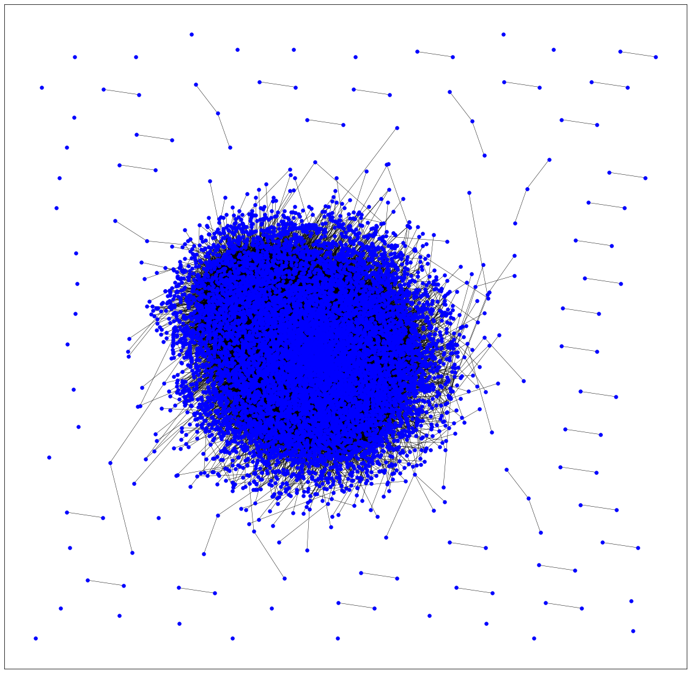
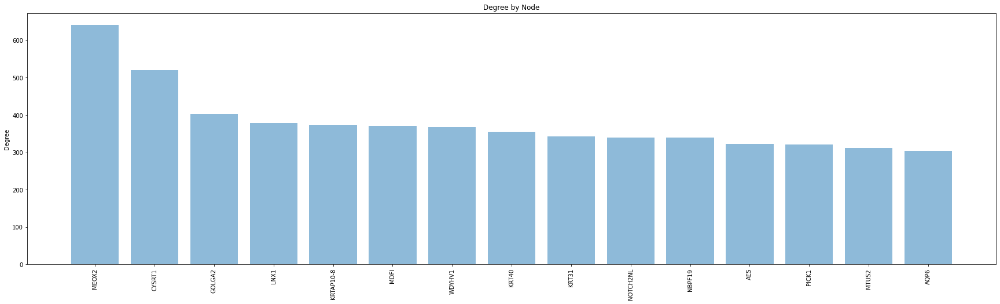
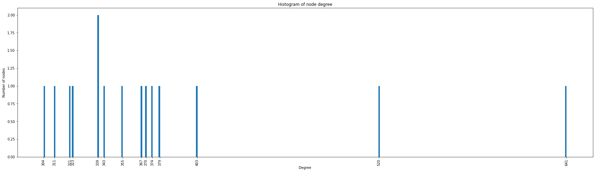
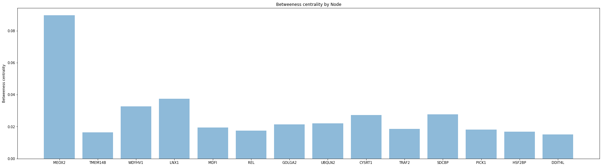
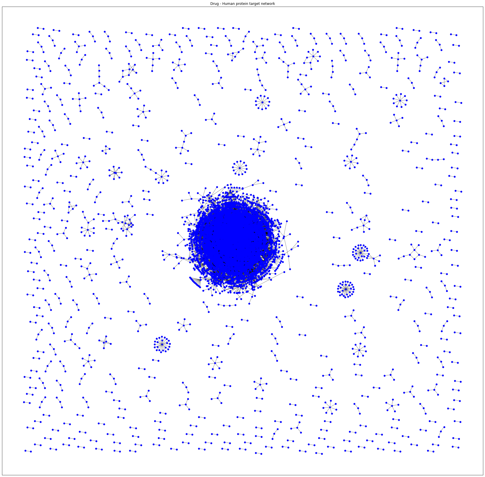
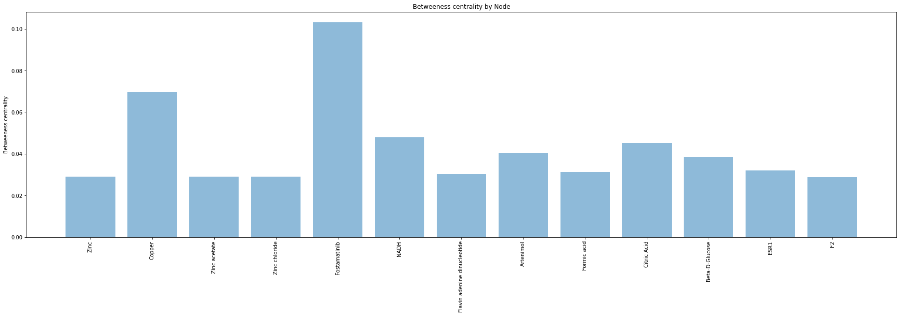
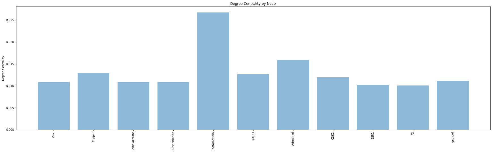

```python
import pandas as pd
import numpy as np
import random
import networkx as nx
from IPython.display import Image
import matplotlib.pyplot as plt
import collections
```

First we need to install pygraphviz to allow for better layouts that can help us visualize the network.


```python
!apt install libgraphviz-dev
!pip install pygraphviz
```

    Reading package lists... Done
    Building dependency tree       
    Reading state information... Done
    The following package was automatically installed and is no longer required:
      libnvidia-common-440
    Use 'apt autoremove' to remove it.
    The following additional packages will be installed:
      libgvc6-plugins-gtk libxdot4
    The following NEW packages will be installed:
      libgraphviz-dev libgvc6-plugins-gtk libxdot4
    0 upgraded, 3 newly installed, 0 to remove and 35 not upgraded.
    Need to get 91.3 kB of archives.
    After this operation, 425 kB of additional disk space will be used.
    Get:1 http://archive.ubuntu.com/ubuntu bionic/universe amd64 libxdot4 amd64 2.40.1-2 [15.7 kB]
    Get:2 http://archive.ubuntu.com/ubuntu bionic/universe amd64 libgvc6-plugins-gtk amd64 2.40.1-2 [18.2 kB]
    Get:3 http://archive.ubuntu.com/ubuntu bionic/universe amd64 libgraphviz-dev amd64 2.40.1-2 [57.3 kB]
    Fetched 91.3 kB in 2s (58.2 kB/s)
    Selecting previously unselected package libxdot4.
    (Reading database ... 144487 files and directories currently installed.)
    Preparing to unpack .../libxdot4_2.40.1-2_amd64.deb ...
    Unpacking libxdot4 (2.40.1-2) ...
    Selecting previously unselected package libgvc6-plugins-gtk.
    Preparing to unpack .../libgvc6-plugins-gtk_2.40.1-2_amd64.deb ...
    Unpacking libgvc6-plugins-gtk (2.40.1-2) ...
    Selecting previously unselected package libgraphviz-dev.
    Preparing to unpack .../libgraphviz-dev_2.40.1-2_amd64.deb ...
    Unpacking libgraphviz-dev (2.40.1-2) ...
    Setting up libxdot4 (2.40.1-2) ...
    Setting up libgvc6-plugins-gtk (2.40.1-2) ...
    Setting up libgraphviz-dev (2.40.1-2) ...
    Processing triggers for man-db (2.8.3-2ubuntu0.1) ...
    Processing triggers for libc-bin (2.27-3ubuntu1) ...
    /sbin/ldconfig.real: /usr/local/lib/python3.6/dist-packages/ideep4py/lib/libmkldnn.so.0 is not a symbolic link
    
    Collecting pygraphviz
    [?25l  Downloading https://files.pythonhosted.org/packages/1e/19/acf3b8dbd378a2b38c6d9aaa6fa9fcd9f7b4aea5fcd3460014999ff92b3c/pygraphviz-1.6.zip (117kB)
         |████████████████████████████████| 122kB 2.7MB/s 
    [?25hBuilding wheels for collected packages: pygraphviz
      Building wheel for pygraphviz (setup.py) ... [?25l[?25hdone
      Created wheel for pygraphviz: filename=pygraphviz-1.6-cp36-cp36m-linux_x86_64.whl size=155444 sha256=05272f02edc1ceef6f5f3384f8e95941ae8db441ed10576cb69886e67cc5ae32
      Stored in directory: /root/.cache/pip/wheels/7c/45/a1/93b830b69fb81d1ae84a248da30e2c0b926a3a6e3435908e6d
    Successfully built pygraphviz
    Installing collected packages: pygraphviz
    Successfully installed pygraphviz-1.6
    

#Human PPIN


Analysis of the COVID-Human protein-protein interaction network (Human PPI network. Luck et al.,2020, *Nature*).


```python
# #Load the graph
HumanPPI = nx.read_graphml("./Networks/HI_union.graphml")

# Define position of each node
#posPPI = nx.nx_agraph.graphviz_layout(HumanPPI,prog='neato')
# # Plot the graph
#plt.figure(figsize=(40, 40))
#nx.draw_networkx_nodes(G_Drug, pos=pos,node_size=30,  node_color = 'blue')
#nx.draw_networkx_edges(G_Drug, pos=pos,width=0.5,arrows=False)
# #Uncomment to label by node number
#nx.draw_networkx_labels(G_Drug,pos=pos, font_size=8, alpha=1)
#plt.title("Human binary Protein Interactome from Luck et al. Nature 2020")
#plt.show()
```


```python
HumanPPI=nx.Graph(HumanPPI)
print(nx.info(HumanPPI))
```

    Name: HI_union
    Type: Graph
    Number of nodes: 9094
    Number of edges: 64006
    Average degree:  14.0765
    

##Labels and position


```python
HumanPPI.nodes(data = 'name')
labels = dict(HumanPPI.nodes(data = 'symobl'))
labels
PPI = nx.relabel_nodes(HumanPPI, labels, copy=True)
print(PPI)
pos2 = nx.nx_agraph.graphviz_layout(PPI,prog='neato')
```

    HI_union
    


```python

# # Plot the graph
plt.figure(figsize=(20, 20))
nx.draw_networkx_nodes(PPI, pos=pos2,node_size=30,  node_color = 'blue')
nx.draw_networkx_edges(PPI, pos=pos2,width=0.5,arrows=False)
# #Uncomment to label by node number
#nx.draw_networkx_labels(PPI,pos=pos2, font_size=20, alpha=1)
```


    <matplotlib.collections.LineCollection at 0x7ff374c30898>





##Degree


```python
# Through some manipulation, you can rank the nodes by degree in a list of tuples
degree_countPPI = sorted(PPI.degree, key=lambda x: x[1], reverse=True)
# Prepare two tuples that you can plot against each other
nodePPI, degreePPI = zip(*degree_countPPI)
print(nodePPI)
print(type(nodePPI))
print(degreePPI)
print(len(degreePPI))
```

    ('MEOX2', 'CYSRT1', 'GOLGA2', 'LNX1', 'KRTAP10-8', 'MDFI', 'WDYHV1', 'KRT40', 'KRT31', 'NOTCH2NL', 'NBPF19', 'AES', 'PICK1', 'MTUS2', 'AQP6', 'TRAF2', 'HSF2BP', 'HOXA1', 'REL', 'TRIM27', 'KRTAP10-7', 'SDCBP', 'KRT34', 'UBQLN2', 'HGS', 'FAM209A', 'TMEM14B', 'MID2', 'USHBP1', 'INCA1', 'CEP70', 'RBPMS', 'ENKD1', 'GOLGA6L9', 'KRTAP10-9', 'DDIT4L', 'TFIP11', 'ERGIC3', 'KIFC3', 'ADAMTSL4', 'GPR152', 'LZTS2', 'KANK2', 'KRTAP5-9', 'ABI2', 'KRTAP1-1', 'CREB3L1', 'KRTAP6-2', 'TCF4', 'BANP', 'TRIM54', 'TRAF1', 'ZNF417', 'EBP', 'TRIM23', 'UBQLN1', 'KRTAP1-3', 'PLEKHF2', 'SCNM1', 'CD79A', 'CCHCR1', 'TMX2', 'LMO2', 'SPG21', 'CALCOCO2', 'KRTAP6-3', 'FAM90A1', 'CREB3', 'SGTA', 'UBE2I', 'ZNF655', 'GPX8', 'DAZAP2', 'PSMA1', 'IKZF3', 'KRTAP4-12', 'CCDC33', 'CCDC57', 'OTX1', 'MKRN3', 'SLC10A6', 'PRKAB2', 'ZRANB1', 'KRTAP12-3', 'POU6F2', 'DVL3', 'TRIM42', 'C1orf109', 'KRT15', 'BYSL', 'KRT27', 'TMEM31', 'PNMA1', 'KRTAP9-2', 'CARD9', 'KRTAP10-1', 'FAM161A', 'FAM9B', 'KRTAP10-5', 'CCDC85B', 'NCK2', 'AGTRAP', 'OIP5', 'FHL3', 'TCEANC', 'CREB5', 'AQP1', 'ARL13B', 'KRTAP9-3', 'ZNF587', 'CCDC136', 'PIN1', 'TEPSIN', 'CMTM5', 'DTX2', 'GORASP2', 'LHFPL5', 'KRT75', 'KRTAP12-2', 'JAGN1', 'SORBS3', 'ARID5A', 'KRTAP4-2', 'TMEM237', 'TRIM41', 'LMO3', 'GJA8', 'TRIP6', 'APPBP2', 'HSD17B13', 'EFEMP2', 'LMO1', 'CATSPER1', 'YPEL3', 'STX1A', 'EHHADH', 'MCRS1', 'SGTB', 'SMARCD1', 'HOMEZ', 'GEM', 'SPERT', 'PRPF31', 'TCEA2', 'GAS8', 'MGAT5B', 'NFKBID', 'TSGA10IP', 'ZNF688', 'RETREG3', 'HOOK2', 'ZNF250', 'TMEM86B', 'CCDC155', 'LMO4', 'POLR1C', 'KPRP', 'FFAR2', 'MFF', 'TTC23', 'PFDN5', 'SCN3B', 'SEC22A', 'GPR42', 'USP2', 'CDC37', 'LASP1', 'TRIP13', 'TEKT4', 'FHL2', 'BLZF1', 'SIAH1', 'KRTAP11-1', 'CCDC120', 'PIBF1', 'CCDC102B', 'SSMEM1', 'REEP4', 'LDOC1', 'VAC14', 'CARD10', 'MAGEA11', 'VPS52', 'TUSC5', 'MUC1', 'PRKAA2', 'EWSR1', 'THAP1', 'PRR20B', 'PRR20A', 'PRR20D', 'PRR20C', 'PRR20E', 'TP53BP2', 'HMBOX1', 'FATE1', 'CEP76', 'GMCL1', 'FRS3', 'SSX2IP', 'VPS37C', 'TMEM60', 'KRTAP19-5', 'CCNDBP1', 'PAX6', 'ELOVL4', 'MAGED1', 'RNF4', 'LZTS1', 'HOXC8', 'KRTAP2-3', 'KRTAP2-4', 'MYO15B', 'TRAF4', 'KCTD9', 'EFHC2', 'FNDC9', 'FXR2', 'WWOX', 'PLSCR1', 'LONRF1', 'BIK', 'VENTX', 'NEK6', 'CRX', 'CPLX4', 'MEOX1', 'TLX3', 'KRTAP26-1', 'TXLNA', 'PSMB1', 'SLC35C2', 'FSD2', 'MFAP1', 'TNS2', 'SLC10A1', 'KRTAP6-1', 'RUSC1', 'PRPF18', 'LCE2C', 'ZNF76', 'IKZF1', 'KLHL38', 'ZNF581', 'NIF3L1', 'KRT35', 'AMOTL2', 'RHOXF2', 'BAG4', 'GPANK1', 'GLRX3', 'AGR2', 'IL16', 'KRTAP9-8', 'MGST3', 'DMRT3', 'YIPF6', 'C1orf94', 'STX11', 'RINT1', 'ANKS1A', 'DISC1', 'AP1M1', 'KRTAP19-7', 'CEP57L1', 'EXOC8', 'SUOX', 'POGZ', 'USP54', 'BEX2', 'ZNF837', 'KRTAP3-1', 'KRTAP5-6', 'PITX1', 'NECAB2', 'FHL5', 'ZNF774', 'PATZ1', 'SPAG8', 'PRR35', 'MTIF3', 'ZMYND12', 'KRTAP13-2', 'ANKRD11', 'LENG1', 'CTNNA3', 'HNRNPK', 'LEPROTL1', 'STK16', 'KRTAP8-1', 'TSGA10', 'HAUS1', 'KRTAP3-3', 'RPRM', 'ZGPAT', 'CTAG1B', 'CTAG1A', 'SLC30A8', 'PPP1R18', 'CWF19L2', 'FAM168A', 'HOMER3', 'ZBTB8A', 'PLP1', 'MAL', 'GUCD1', 'MIPOL1', 'LCE1F', 'CD53', 'FCER1G', 'ZC2HC1C', 'MFSD14B', 'NINJ2', 'EMD', 'STOM', 'KAT5', 'KRTAP3-2', 'SPRY1', 'CCNC', 'TNIP1', 'ZIC1', 'UBASH3A', 'CBX8', 'POU4F2', 'LCE1B', 'COL8A1', 'BEND7', 'KRTAP15-1', 'FKBP7', 'NAB2', 'SH2D4A', 'KRTAP10-6', 'RTP2', 'SMCP', 'PRDM6', 'ZNF620', 'SAR1A', 'CLDN7', 'CDR2', 'TXN2', 'LCE4A', 'PIH1D2', 'MAGEA6', 'CCDC187', 'C3orf52', 'KRT19', 'TRIB3', 'IGFBP5', 'ABI3', 'DDX6', 'FAM161B', 'TMEM218', 'TXLNB', 'TMEM56', 'RUNX1T1', 'PIAS2', 'KRTAP4-11', 'BHLHE40', 'PPP1R32', 'RCOR3', 'MAGOHB', 'NME7', 'ATPAF2', 'C1orf216', 'CCDC146', 'PRKAR1B', 'PDZK1IP1', 'CDC23', 'LCE1A', 'VEZF1', 'RBPMS2', 'TEX11', 'ARL6IP1', 'KRT38', 'LHX3', 'SNRPC', 'FARS2', 'ARMC7', 'SPRY2', 'KRTAP19-6', 'MORF4L1', 'SLC30A2', 'ZNF438', 'CNNM3', 'STX8', 'KRTAP13-3', 'TMEM52B', 'LCE5A', 'TCF12', 'C19orf54', 'YIF1A', 'TIMMDC1', 'CIDEB', 'LCE1C', 'FAM124B', 'CDCA7L', 'NUP62', 'VAMP5', 'TMEM239', 'LCE2B', 'GRB2', 'KRTAP4-4', 'MORN3', 'CCDC125', 'PLP2', 'AL049697.1', 'CFAP206', 'ZNF835', 'ASPH', 'VGLL3', 'PBX4', 'TMEM80', 'MALL', 'MESD', 'NXF1', 'GIMAP5', 'BAG3', 'INO80B', 'TFAP2D', 'PKN1', 'CCDC36', 'PHF1', 'QARS', 'LAT', 'CHIC2', 'TMBIM6', 'C4orf3', 'CDR2L', 'GNE', 'C19orf66', 'FAM210B', 'PLSCR4', 'C17orf62', 'LCE3A', 'FOXH1', 'FAM214B', 'MYOZ3', 'GFAP', 'TAX1BP1', 'HMG20A', 'KIR2DL3', 'FAM46B', 'ZFPL1', 'SMARCE1', 'PPP1R13B', 'ZNF408', 'C10orf55', 'KRTAP4-5', 'LCE1E', 'KIF9', 'TFG', 'HOXB5', 'C2CD6', 'ZNF572', 'MLH1', 'EMP1', 'MS4A13', 'CTBP2', 'ZBTB16', 'CEP55', 'ZNF648', 'PCSK5', 'KRTAP5-7', 'LCN2', 'TMPRSS2', 'COMT', 'GRIPAP1', 'PLEKHG4', 'ANKRD46', 'TMEM97', 'CLDN19', 'ZBTB24', 'PNMA5', 'CTXN3', 'HSD17B11', 'SLC18A1', 'PSMA3', 'TMEM128', 'ERG28', 'CXCL16', 'DTNB', 'LCE1D', 'KRTAP12-1', 'GSC2', 'TSSK3', 'SNRPB', 'CDK18', 'HNRNPF', 'PBX3', 'KRT13', 'CYB561', 'FXYD3', 'TSPO2', 'PMP22', 'ADIPOQ', 'KRTAP5-11', 'BNIP3', 'NUFIP2', 'VWC2', 'SMCO4', 'MBD3', 'AKAP8L', 'BHLHB9', 'NRM', 'ZNF446', 'EFHC1', 'COG6', 'SMIM1', 'PVR', 'LCE2D', 'STX2', 'FAM3C', 'TFCP2', 'MAPKBP1', 'GLYCTK', 'RABAC1', 'KDM1A', 'KRT33B', 'MFSD5', 'SLC38A7', 'CISD2', 'BFSP2', 'PGRMC2', 'PHC2', 'CYB5R3', 'KRT16', 'C14orf119', 'GCC1', 'BMP10', 'MAPK9', 'ABHD16A', 'CDIPT', 'LPAR3', 'ZNF792', 'PLPP6', 'TBC1D22B', 'TMEM120B', 'SLC7A1', 'KCNJ6', 'HSD3B7', 'ATXN1', 'ZNF410', 'NUTM1', 'RHBDD2', 'SDCBP2', 'TSC1', 'KLHL12', 'IQUB', 'LCE3C', 'CXCL9', 'SEC22B', 'BCL2L13', 'QRICH1', 'ACTN3', 'CIB3', 'ZDHHC15', 'MCC', 'SLC39A2', 'VASN', 'TMEM42', 'PRDM14', 'ZNF526', 'ZNF414', 'PLN', 'HDAC4', 'LCE3D', 'RNF8', 'WASHC3', 'CLK2', 'MISP', 'SERP2', 'USP20', 'WASHC1', 'MMGT1', 'SMIM3', 'SAT1', 'FXYD6', 'C16orf58', 'GRN', 'EXOSC8', 'MOS', 'PROP1', 'C11orf57', 'TSG101', 'GPR37L1', 'HOXB9', 'ZNF330', 'ATP6V0C', 'FAM168B', 'YES1', 'ZBED1', 'LHX4', 'EXOSC5', 'GADD45GIP1', 'TMEM179B', 'TCHP', 'RTP5', 'SPANXN2', 'THAP7', 'PDE4DIP', 'UPK1B', 'SH3RF1', 'CEP44', 'PRR13', 'SYNE4', 'TMEM147', 'MAPRE3', 'MAD1L1', 'GOLM1', 'SERTAD3', 'EAF1', 'ZNF124', 'ZBTB42', 'BET1', 'CDKN2D', 'VAMP3', 'LCE3E', 'ZMYND19', 'FAM208B', 'P4HA3', 'KRTAP12-4', 'TRIML2', 'SCAND1', 'KRT36', 'ARFIP2', 'GOSR2', 'PSTPIP1', 'NDEL1', 'L3MBTL3', 'TMEM140', 'CEP19', 'CCDC13', 'CCDC185', 'BCAS2', 'FAM110A', 'SYT17', 'CERS4', 'FNDC3B', 'TSC22D4', 'TRIM37', 'FAM50B', 'BPIFA1', 'GORAB', 'DAB1', 'NDC80', 'ROPN1', 'MORF4L2', 'BCL2L2', 'NUTF2', 'REEP6', 'DVL2', 'BNIP2', 'TOLLIP', 'FAM103A1', 'CEP63', 'AIG1', 'CLEC7A', 'KRT20', 'PLA2G10', 'DEUP1', 'HAPLN2', 'MAL2', 'HEXIM2', 'CCNK', 'KRTAP17-1', 'KRTAP5-2', 'CSNK2A1', 'ZC3H10', 'GJB1', 'LGALS14', 'KRTAP19-1', 'KRTAP19-2', 'TMEM11', 'TRIM69', 'SAXO1', 'TMEM86A', 'SLC7A14', 'CMTM7', 'C14orf180', 'APOD', 'LEUTX', 'PLEKHB2', 'CHRD', 'TTPA', 'LCE2A', 'SPATC1L', 'NFYC', 'PIK3R3', 'NINL', 'TEKT5', 'OXER1', 'NOXA1', 'CKS1B', 'SMUG1', 'ZBTB32', 'SYCE1', 'TRAF3IP3', 'SNRPA', 'ELOA', 'DGAT2L6', 'PLEKHN1', 'CYB5B', 'DWORF', 'CRCT1', 'ZNF34', 'EPM2AIP1', 'RIPPLY1', 'KRT86', 'AMOT', 'KHDRBS2', 'ZNF426', 'TNPO2', 'CAMK2A', 'GOLGA6A', 'TRIM39', 'ZNF165', 'L3MBTL2', 'ATG9A', 'VIM', 'ZBTB14', 'OPRM1', 'STX4', 'FNDC11', 'GLIS2', 'BEGAIN', 'SNW1', 'RGS20', 'FBF1', 'GABARAPL2', 'KRTAP5-3', 'UBL5', 'BAHD1', 'LENG8', 'TEX37', 'TEAD4', 'TMEM243', 'SERP1', 'PLLP', 'FANCL', 'MEIS2', 'GPR151', 'GIMAP1', 'NKG7', 'MBD3L1', 'GPSM3', 'PSCA', 'TNNI1', 'EIF4E2', 'UFSP1', 'ALAS1', 'CEP57', 'KCTD7', 'PDLIM7', 'SPAG5', 'MRFAP1L1', 'FXR1', 'TRAPPC6A', 'UBAP2', 'LIME1', 'KXD1', 'CAMK2B', 'NAA10', 'C22orf39', 'IFT20', 'TMEM229B', 'TMEM107', 'NRF1', 'MRM1', 'NUP54', 'GPATCH2L', 'GAS2L2', 'RNF5', 'BACH2', 'GAD2', 'STX7', 'TMEM254', 'ZNF497', 'TMEM14C', 'TSPAN4', 'KRTAP13-1', 'KEAP1', 'PNLIPRP1', 'PNKP', 'PTPN9', 'ASGR2', 'SUMO1', 'PSME3', 'KRT37', 'PLAGL2', 'BTN2A2', 'KRT76', 'EMP3', 'TMEM106C', 'C12orf10', 'GPKOW', 'AP2M1', 'FCHO1', 'KHDRBS3', 'ESRRG', 'FAM222B', 'MYPOP', 'SLC39A9', 'KLRC1', 'THAP4', 'CABP2', 'KIAA1328', 'BRICD5', 'GOPC', 'CTSA', 'MIP', 'HCK', 'SHC3', 'KRT3', 'RAD51D', 'LCE3B', 'KRT83', 'OSTF1', 'ROR2', 'IGFN1', 'RECK', 'VAMP4', 'IER3IP1', 'AC012254.2', 'PAX5', 'PPP1R16A', 'RNPS1', 'SNAPC5', 'OSGIN1', 'WWP2', 'CINP', 'PEF1', 'SMG9', 'AGXT', 'CCDC167', 'AQP2', 'MAGEB4', 'CYP4F2', 'KRTAP1-5', 'HNRNPLL', 'HNRNPH1', 'BCL6', 'KRTAP10-11', 'RSPH14', 'NEDD9', 'RAD23A', 'TADA2A', 'BORCS6', 'NDUFB7', 'AMIGO1', 'ZCCHC10', 'NDRG4', 'POM121', 'GJB2', 'UBE2J1', 'TMEM139', 'HIVEP1', 'GPS2', 'ERMP1', 'TMEM203', 'AIMP2', 'MFSD6', 'SNAPIN', 'STAC3', 'SMAGP', 'INSIG2', 'AXIN1', 'NR4A3', 'KRTAP5-4', 'DOCK2', 'GJB5', 'TMEM45B', 'TMEM79', 'GABARAPL1', 'BOLL', 'NMI', 'POLR3C', 'KATNBL1', 'KRTAP7-1', 'SCD', 'TMPPE', 'CCDC88B', 'LRRC25', 'TMEM19', 'C2CD2L', 'ZMAT2', 'UBIAD1', 'ORMDL1', 'EXOC5', 'BICD2', 'BLOC1S6', 'CLDN5', 'RBMY1F', 'RBMY1J', 'HIBADH', 'FCHSD2', 'MS4A3', 'KPNA3', 'KLC3', 'UBASH3B', 'JRK', 'MYOG', 'GYS1', 'AP2B1', 'MEI4', 'RABEP1', 'NME4', 'TM4SF18', 'MBIP', 'TTC19', 'PDE9A', 'AEN', 'ZNF564', 'DES', 'SLC16A2', 'POU2AF1', 'TRIM50', 'VPS28', 'BSCL2', 'ASNA1', 'TCL1A', 'ZNF20', 'SYCE1L', 'ALPP', 'TRAF5', 'RGS17', 'EHMT2', 'TBX6', 'AKAP9', 'ITGAM', 'TCAF1', 'CERCAM', 'U2AF2', 'SLAIN1', 'CLK3', 'STX3', 'TMEM242', 'AXIN2', 'RBM10', 'PLPP4', 'ARRDC3', 'C1orf35', 'IGFBP6', 'SYP', 'CRACR2A', 'CADPS', 'FAM174A', 'TSPYL2', 'CHCHD3', 'RIN1', 'CABP5', 'TMEM222', 'GCM2', 'SUFU', 'TRIM35', 'EIF1AD', 'NR1D2', 'SSC4D', 'TMEM51', 'ZFYVE26', 'DYNLL1', 'HDAC7', 'RFX6', 'C11orf1', 'TM4SF19', 'TM4SF19-TCTEX1D2', 'LITAF', 'TMEM167B', 'ITGB4', 'ZBTB26', 'FAM9A', 'DAXX', 'PEX12', 'HPCAL1', 'RABGEF1', 'SLC35A1', 'IFNGR2', 'LDLRAD1', 'TEKT3', 'ZBTB9', 'SGPL1', 'KRT39', 'CCDC24', 'MID1', 'SLC41A1', 'UBE2D4', 'YIPF4', 'CCL4L2', 'UBE2D1', 'ZNF764', 'ZNF552', 'PRPH', 'TMEM100', 'APOL2', 'MS4A1', 'DYDC1', 'ZIM2', 'PLSCR3', 'OTX2', 'COX5B', 'BOLA2B', 'BOLA2', 'MED4', 'CDSN', 'SLC41A2', 'RBMX', 'PHLDA1', 'FXYD6-FXYD2', 'RNF6', 'ZNF24', 'STX12', 'YY1', 'KRT1', 'UBE2K', 'INTS11', 'SMYD1', 'SNX1', 'PRKAA1', 'CPSF7', 'RBM41', 'ZSCAN22', 'NUDT18', 'TMEM65', 'TREX1', 'CT55', 'OLFM4', 'UPK2', 'TRIM14', 'MSX2', 'NEFL', 'GTPBP3', 'GIGYF1', 'RBM39', 'TMED8', 'UNC50', 'CCDC196', 'FAXDC2', 'PNMA2', 'KIAA0408', 'PPL', 'SLC35B4', 'CRY2', 'EVI2B', 'HSF4', 'HGNC:18790', 'SRRM4', 'RASD1', 'RALBP1', 'UTP14C', 'NAPB', 'TNF', 'NOTO', 'RUNDC3A', 'AVPI1', 'NEMP1', 'ZNF35', 'EPN2', 'KLHL42', 'CCDC116', 'PITX2', 'ZNF440', 'YIPF1', 'STX5', 'ZNF696', 'PKNOX2', 'CLEC2D', 'SFTPC', 'ZFHX3', 'KRT24', 'CLIC3', 'RPL9', 'KRT6A', 'MRFAP1', 'NPDC1', 'ING5', 'NDUFAB1', 'ADAM33', 'PRPF3', 'EYA2', 'GPRASP2', 'HNRNPC', 'CCDC6', 'SACM1L', 'GEMIN4', 'WRB', 'CSTF2', 'WDR25', 'MYOZ1', 'TSNAX', 'SELENOK', 'TCF7L2', 'FAM107A', 'SYNGR1', 'SFT2D1', 'UBTFL1', 'C19orf57', 'TMEM14A', 'ATN1', 'SP4', 'GPRC5D', 'MSGN1', 'TSPAN2', 'MAD2L2', 'MRPL11', 'PPP1R16B', 'SRPK2', 'FKBP6', 'DESI1', 'SMARCC1', 'PAK5', 'CFP', 'GNG13', 'KRTAP21-2', 'EIF3F', 'UBXN11', 'TSEN15', 'TMIE', 'PGAP2', 'CGRRF1', 'SKP1', 'HHEX', 'KRTAP9-4', 'VMA21', 'GJA5', 'TSHZ3', 'CHCHD2', 'ECM1', 'FKBP8', 'ADAM12', 'HMOX1', 'EFNA5', 'SH3GLB1', 'SHISA6', 'HMOX2', 'FAM124A', 'PTPMT1', 'MORN4', 'DYNLL2', 'CNIH1', 'GPR25', 'TMEM35A', 'TRIM32', 'ZBTB25', 'SGF29', 'ASGR1', 'SOX5', 'MNS1', 'MSRB3', 'TGM1', 'ZNF474', 'VTI1B', 'MIS18A', 'SLC38A1', 'VAMP1', 'ANAPC11', 'TIAL1', 'SYT6', 'CCNH', 'COIL', 'PARVG', 'NDOR1', 'SYT16', 'TRAF3', 'ZBTB43', 'RAB3IP', 'BIRC7', 'RAD54L2', 'VAPA', 'VAPB', 'COQ9', 'KLHL2', 'NCALD', 'BLK', 'ATXN1L', 'C1GALT1', 'SF3B4', 'POLL', 'CPNE7', 'TBC1D21', 'AGPAT4', 'CFAP53', 'EMILIN1', 'DPY30', 'COL4A5', 'LMNB2', 'FA2H', 'ABI1', 'JOSD1', 'CDKN1A', 'OLIG3', 'ATP23', 'CEACAM6', 'GOLGA8F', 'AQP3', 'DMAP1', 'FUNDC2', 'SFT2D2', 'MAB21L3', 'EFEMP1', 'CLRN1', 'KIAA1644', 'TUBGCP4', 'KCNK5', 'VPS9D1', 'ATP13A1', 'MIEF2', 'CDC7', 'RIMBP3C', 'CTDSP1', 'MYLIP', 'CYTH4', 'PSMB4', 'TSNARE1', 'APOL3', 'VSTM1', 'SLC39A7', 'CD74', 'LNPEP', 'P4HB', 'TEX264', 'KCTD6', 'DTNBP1', 'DGCR6L', 'DCDC2', 'BSND', 'NHSL2', 'FBXW5', 'RBFOX2', 'SREK1IP1', 'RNF19B', 'KRT18', 'MCCD1', 'SERF2', 'CLDND2', 'ZSCAN12', 'CNIH3', 'SPRY3', 'DHRS1', 'SPAG4', 'TPM3', 'XIAP', 'BIRC2', 'TRIP10', 'SUSD3', 'PSORS1C2', 'TEKT1', 'ZFP90', 'EBAG9', 'OPTN', 'RXRB', 'TRAF6', 'ZNF575', 'TRAM1L1', 'SLC7A8', 'TBC1D1', 'DNAJC30', 'C14orf105', 'VBP1', 'VSIR', 'APOC1', 'GOLT1A', 'HR', 'SOHLH1', 'GATA2', 'TMEM248', 'PUF60', 'DMRTB1', 'SERTAD1', 'METTL27', 'CENPP', 'RBAK', 'RBMY1A1', 'NAT8', 'GYPA', 'ZSCAN21', 'STX1B', 'AGR3', 'VWC2L', 'C9orf24', 'SLC13A4', 'MAPK1IP1L', 'RAB3IL1', 'MYF5', 'TMCC2', 'KRTAP4-1', 'POU2F1', 'TRIM29', 'DTX3', 'VPS37B', 'ZBTB48', 'PM20D2', 'MTERF3', 'FAM96A', 'THBD', 'DIABLO', 'KPNA2', 'CDKL3', 'NCKIPSD', 'PRR22', 'LXN', 'NAF1', 'COQ8A', 'PSMC5', 'TECR', 'ZNF490', 'DEF6', 'TSPAN33', 'SPACA1', 'ZBTB2', 'HOOK1', 'UNC93B1', 'GNMT', 'KANSL1', 'RFC5', 'DYNLT1', 'KRT85', 'ZNF329', 'SPRED1', 'RIBC1', 'FAM83A', 'SPRED2', 'TRIM21', 'KRT14', 'CLCNKA', 'BCL6B', 'SEC23A', 'FOXI1', 'ORMDL3', 'MARCH2', 'REEP2', 'DPPA4', 'SMN1', 'SMN2', 'TNFRSF10D', 'CLN6', 'LHX8', 'ACTN2', 'SFN', 'NEBL', 'CRYBA2', 'EIF4A3', 'C1QTNF2', 'FSBP', 'CLEC10A', 'LNX2', 'CSNK2B', 'MIEF1', 'EIF4ENIF1', 'ITGB3BP', 'IL10RA', 'CDC20B', 'BEX3', 'STAMBPL1', 'ZMAT1', 'THSD7B', 'LRRC4C', 'TNNT1', 'CRB3', 'UTP23', 'PEX16', 'TSR2', 'HAP1', 'SPATA8', 'LIMS1', 'GADD45G', 'R3HDM2', 'SS18L1', 'FBLN1', 'FOXD4L1', 'SLC15A2', 'ANKRD55', 'RALY', 'STMN3', 'KLHDC7B', 'DDIT3', 'SEPT1', 'RNF185', 'DOCK8', 'RNASEK', 'YIPF2', 'PRAF2', 'AQP9', 'SLC35E3', 'SYT2', 'NECTIN2', 'SLC35A4', 'FAAP20', 'CYB561A3', 'ZSCAN32', 'MED25', 'TRAPPC2L', 'PRKAG1', 'LYVE1', 'ZNF71', 'EFS', 'SSSCA1', 'TFPT', 'KLHL20', 'TNFRSF10C', 'OSBPL3', 'PLIN3', 'MTURN', 'DERL1', 'VAMP2', 'YAF2', 'MARCH5', 'TCP10L', 'POLDIP3', 'RASAL3', 'CNR2', 'ZBTB7B', 'SH3KBP1', 'ACTN1', 'DUSP21', 'LHX2', 'MGST2', 'PQLC1', 'CEP170', 'FOSB', 'APOC4-APOC2', 'APOC4', 'TNIP3', 'TBRG4', 'KIAA1217', 'SAMD11', 'VCP', 'ATXN7L2', 'TMEM120A', 'GSTP1', 'LURAP1', 'HSD17B14', 'RBM48', 'POLR2G', 'ABHD11', 'NSMF', 'TXK', 'CLEC17A', 'MPP1', 'SNAP47', 'CD81', 'TGFB1', 'RASSF10', 'STX6', 'C2orf82', 'ZNF580', 'KRT6C', 'SLC23A1', 'SEC11C', 'TEX29', 'KRT26', 'KIR3DL3', 'BCL2L1', 'CRYBA1', 'MTMR9', 'EXOC7', 'ZNF19', 'RBM11', 'DCX', 'NUDT22', 'ALS2CR12', 'MRPL28', 'RNF111', 'SH3GL1', 'FAM166B', 'RBFA', 'SYNJ2BP', 'ODF4', 'UBE2D2', 'ZCCHC12', 'ZNF785', 'YOD1', 'C20orf85', 'S100B', 'EIF3D', 'SYTL4', 'TSTD2', 'LRP10', 'GRAP2', 'ZFYVE21', 'PLAC8', 'FAM86C1', 'LSM2', 'GPSM1', 'AP1B1', 'ZFP1', 'CLDN2', 'COX20', 'FRMD6', 'ZNF343', 'IFITM3', 'SLC30A3', 'TMEM50B', 'KRT6B', 'UNC93A', 'STATH', 'HBZ', 'C11orf87', 'TXNDC5', 'TMEM208', 'KRT81', 'PLPPR2', 'KRTAP10-10', 'ZNF439', 'BLOC1S2', 'ATP6V0B', 'LBX1', 'TMEM57', 'KRT25', 'CELF5', 'CSTF2T', 'FBXO17', 'TOX2', 'DPPA2', 'PTPN21', 'TM4SF4', 'MAPRE1', 'LDB2', 'RPIA', 'ABHD5', 'HEMK1', 'LAGE3', 'TMSB4X', 'CMTM3', 'CLCA4', 'RTN4IP1', 'EDDM3B', 'EGLN3', 'TMEM201', 'RTN3', 'TNFAIP1', 'BEND5', 'PPARA', 'TRIM8', 'NDN', 'MEIS3', 'KCTD1', 'RALYL', 'RMDN3', 'MAGEA2B', 'MAGEA2', 'FBXO28', 'MSS51', 'A1CF', 'FBXL18', 'C4orf45', 'LMNTD2', 'PRDM16', 'TVP23B', 'UNKL', 'TGM7', 'PTK6', 'DOLK', 'GPRIN2', 'TRIM3', 'CCDC130', 'GATA1', 'BAG6', 'MAGEA4', 'WASL', 'HSBP1', 'ATF4', 'TMEM54', 'BICRAL', 'GRM2', 'CTSZ', 'GPR61', 'ZSCAN23', 'MIIP', 'KRT4', 'NCS1', 'RPGRIP1', 'TSPAN12', 'DHX57', 'C10orf35', 'PRR3', 'CDS2', 'FBXO34', 'SDC3', 'SPATA3', 'FCGR1A', 'MANBAL', 'EDA', 'CCDC94', 'RBFOX1', 'NUTM2F', 'UBAC1', 'CCDC153', 'MLX', 'SEC14L4', 'TCP11L1', 'RIBC2', 'SRSF11', 'CDK3', 'FAM217B', 'NHLRC4', 'RPRD1B', 'ORMDL2', 'MAGEA12', 'SYS1', 'TBC1D7', 'MGLL', 'SCARF1', 'TACC3', 'AHCYL1', 'GSE1', 'ZNF629', 'TRAPPC2', 'AC003002.1', 'NCAPH2', 'APIP', 'NOC4L', 'GPR101', 'PKP2', 'LPXN', 'TFRC', 'RBCK1', 'FADS6', 'TRIM38', 'CCND3', 'GABPB1', 'ZNF143', 'HSPB2', 'HSPB2-C11orf52', 'SNAP29', 'SF1', 'C3orf36', 'PLEKHA7', 'ITGB5', 'LUZP4', 'CALM3', 'CALM1', 'ZNF319', 'CEP72', 'KIAA0753', 'TRIM7', 'DCTN2', 'TTC23L', 'ZNF48', 'MAPK1', 'RELL2', 'PIMREG', 'ZKSCAN4', 'MCM7', 'ZNF264', 'GAST', 'TRIM73', 'TF', 'MXI1', 'KRT80', 'FAM71C', 'KRT79', 'ERVFRD-1', 'ZNF524', 'PEX5', 'HSPB7', 'C19orf25', 'FIS1', 'SPG7', 'SPATA2', 'NECAB1', 'ANKRD23', 'ELOA2', 'TPRG1', 'TEX12', 'U2AF1', 'U2AF1L5', 'JAKMIP2', 'ZMIZ2', 'CGGBP1', 'KIAA0907', 'CAMK2G', 'CLDN9', 'PLEKHO1', 'SP100', 'FTO', 'SRSF3', 'TRA2B', 'CAVIN1', 'LDB1', 'ARHGEF5', 'NUDT21', 'CERK', 'MMD', 'APH1A', 'TSHZ2', 'ZBTB10', 'ENOX2', 'CCL4', 'RCN1', 'KATNAL1', 'CAMK2D', 'GGN', 'CBFA2T2', 'OTUB2', 'GATAD2B', 'ZNF669', 'TXNDC9', 'GOLGA1', 'BANF2', 'CALM2', 'ZC4H2', 'MRPL12', 'NXT2', 'CSGALNACT2', 'MLLT6', 'UBE2E2', 'PRTFDC1', 'ATRIP', 'NINJ1', 'AQP10', 'CCDC172', 'LRIF1', 'CENPH', 'PPP1CB', 'SNAI1', 'LSMEM2', 'PDCD1LG2', 'HTATIP2', 'SLC16A13', 'SCAMP5', 'ZNF202', 'CNOT2', 'KLC4', 'SLC29A2', 'C1QL4', 'CD40', 'KRT71', 'KRT8', 'MOBP', 'FAM133A', 'EPHB6', 'TRIM59', 'SLC34A2', 'CAPN7', 'YTHDF1', 'KTN1', 'ACY3', 'ZNF263', 'TIFA', 'RANBP3', 'UBXN7', 'INPP5J', 'ACSF2', 'NFU1', 'LRP2BP', 'DHPS', 'TLK1', 'RASSF5', 'SMAD3', 'ZNF177', 'ZNF559-ZNF177', 'CALCOCO1', 'CBLB', 'CREB3L3', 'VTA1', 'DLGAP4', 'PLK4', 'CTBP1', 'SEMA3B', 'ADGRE2', 'TNFSF14', 'SH2B2', 'SORBS2', 'SUV39H1', 'CCNL1', 'ANKS6', 'FAM25A', 'FAM25G', 'FAM25C', 'TRHR', 'NEU1', 'HOMER1', 'CUL3', 'CYB561D2', 'ZMAT5', 'PBX2', 'STAM2', 'FOSL2', 'FOS', 'UBC', 'METTL17', 'ZMYM5', 'RABIF', 'ANKRD10', 'ID3', 'FAM228A', 'HNRNPUL1', 'PLOD3', 'PIH1D1', 'CCDC197', 'ZNF148', 'TSEN54', 'PARD6B', 'UBE2E3', 'CPSF6', 'CYBRD1', 'CUTC', 'INO80E', 'ASF1A', 'PSMC6', 'EPS8', 'LSM3', 'SLC13A5', 'MOSPD3', 'ZFYVE27', 'AGPAT3', 'SPATA24', 'EMC6', 'APOA2', 'TIMM23', 'BMF', 'ZNF473', 'VPS25', 'CLVS2', 'SERTAD2', 'HIST1H2BN', 'ANKRD36B', 'KLF1', 'CYP21A2', 'GKAP1', 'PSMA6', 'BMP7', 'CT45A1', 'CAMLG', 'PIGP', 'ATP6V0E1', 'RNF41', 'TPRX1', 'NTM', 'FOXD2', 'USH1G', 'BLCAP', 'CBX2', 'KRT28', 'NASP', 'BNIP3L', 'CD33', 'TDO2', 'WNT11', 'TPM1', 'KRTAP19-3', 'RAB2A', 'CFHR5', 'SENP2', 'SNIP1', 'CCDC103', 'FAM187A', 'TMUB2', 'NCOA5', 'ALDH3B1', 'FLNA', 'THOC1', 'CIB1', 'WAC', 'KCTD13', 'EVI5', 'SPINT1', 'SLC22A23', 'CAPN3', 'PHF19', 'ZNF398', 'PBXIP1', 'KPNA6', 'CMTM4', 'HERPUD2', 'DZIP3', 'SSC5D', 'ZDHHC1', 'GMEB2', 'HMG20B', 'HEY2', 'ZNF23', 'LIN37', 'ACOT7', 'TTC9C', 'ZDHHC24', 'RNF144B', 'RORB', 'MCM10', 'HSFY2', 'HSFY1', 'PSMB8', 'ZNF670', 'KCTD17', 'DRAP1', 'TRIM62', 'ISCU', 'CDA', 'DUPD1', 'LCA5L', 'DHRSX', 'PRR34', 'MTA1', 'DERL3', 'C8orf33', 'MRPS18B', 'IL3RA', 'TNMD', 'HHLA2', 'FUCA2', 'NFYA', 'KPNA5', 'ALOX5', 'ATG5', 'DOK6', 'PIH1D3', 'BEX5', 'PCBD1', 'PELI2', 'CIAO1', 'C1orf50', 'DIP2A', 'ATP6V0D2', 'SMARCB1', 'XPA', 'THAP6', 'CNFN', 'CDPF1', 'PPIF', 'BEST2', 'BNIP1', 'FZD7', 'HHATL', 'RNF24', 'PCDHB14', 'SH3RF2', 'VKORC1', 'ZNF511', 'FDFT1', 'SLC35B1', 'NUDT16L1', 'SLU7', 'COL8A2', 'TMEM205', 'CATIP', 'CHRNG', 'SERINC2', 'BARD1', 'FAM76B', 'AHNAK2', 'NID2', 'SSX2', 'SSX2B', 'CDKN2B', 'FBLIM1', 'VMAC', 'PTGES', 'NOV', 'USE1', 'HIP1', 'NUP58', 'SNRNP25', 'CYB5R2', 'FAM173A', 'FAM118A', 'PHC1', 'KLF15', 'ATP5O', 'COL4A3BP', 'FAM13C', 'SLC25A46', 'SOCS7', 'M1AP', 'POLR2L', 'MEMO1', 'PLEKHA2', 'IL36RN', 'ZFC3H1', 'ZNF385C', 'RHOJ', 'HMGXB4', 'CREM', 'FOXD4L3', 'SGCB', 'SLC35E4', 'SFXN3', 'ST6GAL2', 'TMEM234', 'CDCA4', 'TTLL10', 'POMC', 'DNAL4', 'TRIM9', 'CMTM6', 'TMEM101', 'PKMYT1', 'NDUFA3', 'NPBWR2', 'KRT72', 'BAZ2B', 'RPP25', 'CACNG1', 'LRRC59', 'LAPTM4B', 'ZRSR2', 'TCF19', 'PPP1CC', 'BTNL9', 'SLPI', 'GALNT15', 'YIPF3', 'RNF208', 'SSX3', 'MRPL38', 'RHOH', 'ZNF317', 'SEPT3', 'MAPRE2', 'SNF8', 'DDI1', 'NAGK', 'APPL1', 'DNAJA3', 'KIF5B', 'STN1', 'PAX9', 'RIC3', 'HPCAL4', 'WBP11', 'RNF216', 'PRB1', 'ARHGEF6', 'SPANXN3', 'PCM1', 'SNRPB2', 'CDC73', 'SAAL1', 'WDR5', 'LMNB1', 'VEZT', 'RTN4', 'AARD', 'DCUN1D1', 'PID1', 'ADARB1', 'AKAP17A', 'TNPO3', 'SCAMP4', 'PAICS', 'NME1', 'ERP29', 'FAM221A', 'STH', 'RUNX1', 'MAP1LC3C', 'PTPN3', 'SNX18', 'FASLG', 'SYNGAP1', 'FAM109A', 'DCTD', 'CPNE2', 'HDX', 'TSPO', 'CLDN4', 'PCYT1A', 'TMEM109', 'SYNDIG1', 'TAP1', 'CCDC106', 'RNF151', 'PGBD1', 'YTHDC1', 'TROAP', 'SCAMP1', 'ARFIP1', 'TMEM189-UBE2V1', 'SFXN1', 'TMEM199', 'ZNF765', 'NIPAL4', 'CDKN2C', 'CEP95', 'RHCG', 'F11R', 'PGRMC1', 'MOB1A', 'LAPTM5', 'ATP5J', 'PPCDC', 'FANCG', 'SLC30A4', 'ARPC3', 'TMEM182', 'MIF4GD', 'FGF12', 'UNC119', 'ENTPD3', 'RSRC2', 'NECTIN3', 'ASB6', 'VAX1', 'SPATA18', 'RAB2B', 'ELOVL5', 'MYO5B', 'BAIAP2', 'ARL6IP6', 'SH3GLB2', 'STAT5B', 'HOXC9', 'VGLL1', 'CLPP', 'JAKMIP1', 'SCARA5', 'SIGLEC12', 'CBS', 'CBSL', 'PPFIA1', 'TYK2', 'TCAP', 'SULT2B1', 'CLK1', 'RING1', 'RAB33A', 'CDC5L', 'IP6K3', 'ZFP64', 'RAP1GDS1', 'NMNAT1', 'ABLIM1', 'ZNF512B', 'KIAA1958', 'PRR5L', 'TBX19', 'METTL15', 'RPH3AL', 'PPP1R12C', 'TMEM121', 'RSPO4', 'ZNHIT1', 'ZNF138', 'ZBTB4', 'MSMO1', 'CHRDL2', 'UBA52', 'PRKRA', 'STK3', 'SLC25A48', 'DOK3', 'SOGA1', 'ESM1', 'TMEM187', 'SELENOV', 'FAM221B', 'RHBDD1', 'TP53BP1', 'MCM6', 'EIF4G1', 'GUCA2A', 'IMP3', 'PDZD4', 'FAM46D', 'UBE2D3', 'MOB3C', 'KRTAP22-1', 'SF3A2', 'ASB13', 'TACO1', 'TRIM68', 'UBTD1', 'LIN7A', 'ZDHHC22', 'MRM3', 'HPCA', 'GRB10', 'BEX1', 'LINGO1', 'RBM3', 'NDUFAF3', 'DAAM2', 'PPP3CA', 'FAM46A', 'FLAD1', 'SLC12A7', 'TOP3B', 'NCK1', 'MITD1', 'TMEM143', 'EIF4A2', 'XAF1', 'RBP3', 'NAP1L2', 'UBB', 'N4BP3', 'TBX15', 'SMPD2', 'UXT', 'KRT78', 'KRT74', 'NAXD', 'UBXN1', 'ZNF286A', 'AC005324.4', 'PRPF40A', 'CD72', 'MAGEA1', 'LSM1', 'RNF40', 'AMMECR1', 'PITPNC1', 'ISY1-RAB43', 'AK8', 'KCNA1', 'P2RY6', 'ADAMTSL3', 'ZSCAN26', 'MS4A4A', 'LELP1', 'NKD1', 'ZNF578', 'WTAP', 'PPIG', 'RPL22', 'ZNF488', 'CTNNBIP1', 'CBX5', 'CBX3', 'ZYX', 'BAG5', 'CHERP', 'ZMYND10', 'RASSF3', 'CAGE1', 'NOL12', 'TXNL4B', 'UBXN2B', 'UBE3A', 'MPC2', 'SLC25A6', 'NEU4', 'TBXA2R', 'POF1B', 'SET', 'STAC', 'NGLY1', 'MRPL53', 'SLC19A3', 'CHMP1A', 'CNTROB', 'CARHSP1', 'TNFAIP3', 'UBTD2', 'DACH1', 'PANX1', 'SAPCD2', 'ZBTB47', 'TSPYL4', 'PAX4', 'GNL3L', 'FCGR2A', 'C5', 'RMDN2', 'FUNDC1', 'ATF2', 'SQSTM1', 'CRACR2B', 'SYNGR3', 'ITGB2', 'SSNA1', 'HNRNPM', 'CLEC14A', 'MB21D2', 'SNRPF', 'CCDC70', 'TFAP4', 'ABHD17A', 'LATS1', 'ARSA', 'FFAR3', 'RACK1', 'TNP2', 'DDX39B', 'ACTB', 'CFL2', 'FADD', 'WDR83', 'ERCC3', 'PPIL1', 'PFKFB1', 'INSC', 'SMAP1', 'MOAP1', 'CSNK1D', 'TNFAIP8L1', 'POLE2', 'SYT1', 'ASB15', 'IKBKG', 'HYI', 'TMEM190', 'FGF14', 'MAGEA3', 'DSCR3', 'RBM47', 'HDHD3', 'PELI1', 'PRKAR1A', 'DDX17', 'DMC1', 'MKRN1', 'ARL6IP4', 'NTN4', 'CRK', 'MAGEA8', 'C21orf58', 'LRCH4', 'TH', 'STRBP', 'ARHGAP9', 'WFDC2', 'DEFB127', 'JPH1', 'SLC35B2', 'ARV1', 'LEMD1', 'TMEM262', 'PLSCR2', 'DPPA3', 'TSPYL1', 'SEPT5', 'CLEC1A', 'SEC23B', 'HLX', 'VSNL1', 'APOA5', 'SLC26A6', 'TYRO3', 'RHBDL1', 'SLC16A7', 'TAPBPL', 'HSPD1', 'SEMA4C', 'MAB21L2', 'KRT5', 'ABLIM3', 'ABT1', 'SBK3', 'TMEM9', 'RUBCN', 'VASP', 'RNF170', 'APOBEC3C', 'TMEM43', 'HIGD1C', 'ZBTB22', 'ZNF618', 'CLCN7', 'NGB', 'DLG2', 'ESRP1', 'NBL1', 'MINOS1-NBL1', 'ALX1', 'TMPRSS4', 'GRAMD2B', 'SYCE2', 'TCL1B', 'RSPO2', 'RAD23B', 'OAZ3', 'CD69', 'SERTM1', 'CTRC', 'NONO', 'RNF38', 'TMEM176A', 'PSMC3', 'POP5', 'GEMIN2', 'THSD7A', 'HSPB8', 'TEX44', 'TUFM', 'LDLRAP1', 'C5orf46', 'FOXN1', 'CRYAB', 'GPBP1', 'LIN7B', 'TARS2', 'C11orf68', 'STMN4', 'CASC4', 'CDK4', 'PRMT5', 'SAMD4A', 'FH', 'MIEN1', 'C10orf67', 'FOSL1', 'ACSL5', 'RNF2', 'ANP32B', 'WIPF1', 'CBY1', 'TEAD2', 'HAT1', 'PBLD', 'METTL21A', 'WT1', 'ZNF17', 'DNAJB13', 'CDC42EP1', 'EEF2KMT', 'EML2', 'VCL', 'GRB7', 'NADSYN1', 'PLA2G6', 'TARBP2', 'CDIP1', 'ELOVL7', 'ZNF69', 'RPS27A', 'DUSP4', 'PRAM1', 'ZBTB1', 'SLIT1', 'ZNF844', 'SPTA1', 'SPRYD7', 'LEPROT', 'FLYWCH1', 'RHPN1', 'TNK2', 'FUBP1', 'LGALS4', 'KLHL26', 'C22orf15', 'WHRN', 'TOMM6', 'MPPED2', 'PAGE1', 'SLC1A1', 'IL1RL1', 'CLRN2', 'WASF1', 'TXN', 'FOXP2', 'PNMA3', 'TRIM10', 'TSN', 'ZNF276', 'TM6SF2', 'MYDGF', 'NAA11', 'NT5C2', 'RAB11FIP2', 'HNF1B', 'C2orf68', 'ZNF496', 'ZNF483', 'CXorf66', 'PAEP', 'SERF1A', 'ZDHHC21', 'SERF1B', 'EPDR1', 'SEPHS1', 'PIGS', 'PPP1CA', 'KCNIP3', 'THAP10', 'GJB3', 'ARID3A', 'TMEM8A', 'KRT82', 'KRT2', 'CCER1', 'BHLHA9', 'CCNG1', 'CAVIN3', 'JUP', 'ABHD4', 'MCEMP1', 'CLP1', 'IRX6', 'CDCA8', 'NOL4', 'SLC14A2', 'LCK', 'SPRY4', 'FRMD3', 'TOX3', 'SKIL', 'TBX3', 'ATP6AP2', 'BATF2', 'ADRA2C', 'RCHY1', 'ZNF114', 'NMU', 'RBM17', 'ADGRG3', 'ZCCHC14', 'NRIP1', 'SELENOM', 'GET4', 'RARA', 'HSPA6', 'S100A1', 'DNAJC9', 'TMEM106A', 'GTF2A1', 'RAD52', 'POU1F1', 'ZBTB39', 'SLIRP', 'MBLAC1', 'ACOT12', 'EIF4EBP1', 'FMNL2', 'TBC1D25', 'MED20', 'LYSMD1', 'FAM136A', 'LZTFL1', 'ARNT2', 'PIP4K2B', 'SIVA1', 'DARS2', 'CMTM2', 'CCDC138', 'XRCC4', 'DESI2', 'BCAR1', 'NACC1', 'RXRG', 'DUSP13', 'ASPSCR1', 'MATR3', 'TMEM154', 'TNS4', 'TMEM88', 'CENPQ', 'SIKE1', 'PEX19', 'C15orf59', 'BTBD3', 'ASPG', 'SPDYE4', 'GSTO2', 'MMP14', 'ARID4B', 'SMAP2', 'UBXN6', 'GCA', 'PHF21A', 'EIF2B1', 'NRDE2', 'ZNF275', 'ZCCHC17', 'HNRNPCL1', 'CCDC184', 'C17orf50', 'EXOSC1', 'DBF4B', 'ZSCAN4', 'GRAMD4', 'PACSIN3', 'IKBIP', 'TRIM72', 'PATL1', 'GIPC2', 'KCNIP1', 'SLC2A5', 'BRMS1L', 'FGA', 'HDDC3', 'CLIP4', 'RCN3', 'ANKRD33', 'RFPL3', 'DPF2', 'AKIRIN2', 'EVI5L', 'RNF125', 'AP3M1', 'MDK', 'WWP1', 'PDCD10', 'ACTG1', 'ZNF212', 'ODAM', 'ZNF451', 'USO1', 'ARHGAP45', 'ZKSCAN7', 'CCDC112', 'TMEM115', 'GKN1', 'DEFB103A', 'DEFB103B', 'TMEM50A', 'MYADML2', 'VKORC1L1', 'HBA2', 'HBA1', 'GNAI2', 'OTUD6A', 'P2RX7', 'PCNA', 'HPRT1', 'C11orf49', 'PPP2R3C', 'NUBP2', 'IGSF8', 'TMEM174', 'SIRPA', 'MXD3', 'CLEC12B', 'PPP1R37', 'ZFP91', 'ANXA11', 'BCCIP', 'MED21', 'UQCC2', 'CCDC158', 'RBM23', 'BTRC', 'PSMD9', 'KRTAP5-1', 'JMJD7', 'SMAD4', 'RNF144A', 'MYADM', 'C9orf72', 'TPM2', 'CXCR2', 'HOXC5', 'DCDC2B', 'C11orf16', 'SLC14A1', 'RWDD2B', 'PTTG2', 'KCTD21', 'SLC41A3', 'ZNF768', 'CD302', 'CLDN8', 'TSPYL6', 'ZNF786', 'C10orf62', 'RNF44', 'H2AFY', 'SETD5', 'SHTN1', 'IL7R', 'NICN1', 'AC104452.1', 'USF1', 'AOC1', 'USP15', 'ZC2HC1A', 'SNX11', 'TNNT2', 'RPRD1A', 'TEX9', 'CCDC14', 'POLR3GL', 'C19orf70', 'ATP6V1G1', 'AJUBA', 'CRLF3', 'SCOC', 'CHAF1A', 'STMN2', 'GTPBP2', 'HOXD12', 'GGT7', 'CBARP', 'TRIM36', 'SFMBT2', 'FYN', 'CACFD1', 'CLDN11', 'SETBP1', 'BRD1', 'MYEF2', 'TBC1D30', 'MAGOH', 'RHOBTB3', 'ZNF775', 'TAB2', 'HSBP1L1', 'TTC32', 'TTC25', 'KAT7', 'SDR16C5', 'LSM5', 'PQLC2', 'CCDC151', 'CXCL5', 'ITPKB', 'SSBP3', 'KLHL3', 'KAZN', 'KPNA4', 'MEAF6', 'PXN', 'ZSCAN9', 'MALSU1', 'FOXP3', 'KLHL8', 'ALKBH4', 'FAM114A2', 'FMR1', 'ZNF3', 'SH2D1B', 'PACSIN2', 'YPEL5', 'DDX39A', 'BLMH', 'SIX1', 'DYNLT3', 'PPP2R1A', 'CD68', 'DEFB121', 'AC106886.5', 'RNF126', 'ZNF341', 'TINAGL1', 'SPART', 'PTS', 'EDC3', 'AIDA', 'KIF24', 'MPP5', 'ZBTB44', 'CLNS1A', 'LHFPL2', 'ZNF638', 'C19orf44', 'DNM2', 'ICAM3', 'CHTOP', 'FAM118B', 'SIT1', 'JOSD2', 'GOLT1B', 'CES1', 'SNAP23', 'DIEXF', 'ZNF266', 'FAM9C', 'ANKRD28', 'ZNF547', 'GYPC', 'FAM105A', 'HBQ1', 'GAD1', 'TNNI2', 'ZCCHC7', 'ASZ1', 'LIMS4', 'LIMS3', 'FBXO44', 'TMEM72', 'ECSIT', 'BCL2L11', 'ZNF503', 'INPP5K', 'HSPA12B', 'GFOD1', 'CRH', 'CCDC17', 'INPP5D', 'ASMTL', 'RPS19BP1', 'RIC8A', 'CCNL2', 'ZNF32', 'HAUS8', 'TCP11', 'PSMB5', 'DUSP23', 'S100Z', 'ZNF558', 'ASB9', 'CLSTN3', 'TMEM130', 'SESTD1', 'OIT3', 'ZG16', 'EDARADD', 'QPRT', 'SNRNP35', 'C7orf31', 'GPX7', 'TACC1', 'PRAP1', 'PPIC', 'SLC18A2', 'ATG12', 'VRTN', 'ODF1', 'RGS19', 'FAM189A2', 'ACY1', 'IMPDH2', 'SYNPR', 'MBD3L2', 'TNFAIP8', 'GLP1R', 'BFSP1', 'SLC10A2', 'DAGLA', 'CHODL', 'MOB2', 'C8orf34', 'COPS4', 'GJB6', 'C16orf92', 'PPP1R27', 'ANKRD29', 'ANKHD1', 'SLC6A20', 'RPS28', 'GGT6', 'NIPAL3', 'LAP3', 'EVX2', 'FEM1A', 'POLI', 'POLR2J', 'PDE4C', 'NEIL2', 'TBC1D23', 'C7orf57', 'PRKAR2B', 'AKAP7', 'RAPGEF3', 'CTNNAL1', 'PCBD2', 'LSM4', 'GGA3', 'TLK2', 'ARIH2', 'VCX2', 'MRNIP', 'OTUD7B', 'HID1', 'RNF183', 'PER2', 'UBE2L6', 'TBX2', 'OOEP', 'MAN2B2', 'LTC4S', 'MCMBP', 'SPN', 'PTCH1', 'PGA4', 'ZNF599', 'CAP2', 'KLHL35', 'RTL8B', 'GRXCR1', 'SNAPC3', 'SNX32', 'ANK1', 'SNX2', 'KCTD10', 'MORN5', 'PAX8', 'PBX1', 'FNTB', 'ZNF639', 'RFT1', 'CA8', 'SUSD6', 'GMPPA', 'JADE2', 'LCP2', 'ZBTB49', 'ZBTB8B', 'MIA3', 'PDCD6', 'CALN1', 'UBE2V1', 'RBM45', 'TSSC4', 'HELT', 'TRAF3IP2', 'GDAP1', 'ACOT11', 'CEP83', 'EIF5A', 'SPATA12', 'LHX6', 'KLHL40', 'TULP3', 'DRG1', 'PPP2R5A', 'IQCB1', 'NELFA', 'GSTZ1', 'ILF2', 'STRA8', 'HYAL2', 'MAP1LC3A', 'FBXL19', 'RBBP8NL', 'PPP2CA', 'MAD2L1BP', 'ADAM15', 'PFDN6', 'MYOZ2', 'PAFAH1B3', 'CIRBP', 'PSMC1', 'ENOX1', 'DCTPP1', 'ZSCAN16', 'CYHR1', 'CTAGE5', 'PSMD2', 'KIFAP3', 'UBL4A', 'AC040162.4', 'QKI', 'PEG10', 'EEF1D', 'NAV2', 'TRIM5', 'KIAA0368', 'CBFA2T3', 'SUCLA2', 'VSTM4', 'CCNB1IP1', 'USP25', 'CHD2', 'RBBP8', 'DLG3', 'ZNF436', 'BIN3', 'KNSTRN', 'TMEM207', 'SEC61G', 'SLC52A1', 'SFXN5', 'PDGFRB', 'FTL', 'SKA1', 'APOL6', 'GINS4', 'LGALS3', 'CTIF', 'NDUFAF2', 'ZFP2', 'ZNF337', 'ADAMTS12', 'GJB4', 'UPRT', 'APEX2', 'OGT', 'PMF1', 'ZNF576', 'TMEM45A', 'RIPPLY2', 'TMEM173', 'STX16', 'TXNRD3NB', 'EFCAB3', 'ZNF80', 'ZNF777', 'ID2', 'ZNF205', 'AEBP2', 'DZIP1L', 'KRTAP10-4', 'SLC13A3', 'NCR3LG1', 'BIVM', 'NPPB', 'RBM42', 'PTPN5', 'PLEKHA3', 'HIF1AN', 'PRPSAP1', 'MRRF', 'MDM4', 'CKMT1A', 'CKMT1B', 'ERP27', 'CD99L2', 'TSPAN18', 'TMEM41A', 'HOXB6', 'BEND2', 'EDA2R', 'AOC3', 'FERD3L', 'ZG16B', 'PPIB', 'PIK3R2', 'PKNOX1', 'CDK6', 'KRTAP13-4', 'NDUFB11', 'COL10A1', 'LRRC6', 'CTNNBL1', 'FIGLA', 'DRAM1', 'STX19', 'PACRGL', 'KRT32', 'CD3G', 'ZNF683', 'UBE2Z', 'ARMC5', 'TADA3', 'NABP1', 'DALRD3', 'GLYR1', 'ZNF491', 'ZNF101', 'SLC25A10', 'AC007192.1', 'C3orf62', 'EMILIN3', 'MED28', 'IFIT3', 'MAP2K5', 'PTTG1IP', 'MED11', 'RTL8C', 'LRFN4', 'CSRNP1', 'LUC7L2', 'MAD2L1', 'TEX33', 'FAM131C', 'ARHGEF15', 'DUSP12', 'CCDC28A', 'BBC3', 'ZNF829', 'CNTF', 'WAS', 'OTULIN', 'UNC45A', 'CACNB3', 'SFMBT1', 'HIST1H4G', 'PCDHB12', 'MARK4', 'GAS7', 'CAVIN2', 'LNPK', 'LARP4', 'BCL2L15', 'WWTR1', 'SYPL1', 'EMC2', 'TMEM159', 'FAM20B', 'MVP', 'RNF20', 'SNX20', 'PTBP2', 'PCBP3', 'MCFD2', 'TSFM', 'MSANTD4', 'ZNF707', 'PSPC1', 'FAIM', 'STK19', 'TBC1D3G', 'TBC1D3B', 'LRRC45', 'EP400', 'HSF2', 'CTTNBP2', 'RAB4A', 'NLK', 'KIF16B', 'TBC1D5', 'TRIM45', 'CCDC91', 'BTBD1', 'BTBD2', 'ZMAT4', 'DEPDC5', 'SOX30', 'CLDN10', 'SPDL1', 'DNAAF4', 'RHOA', 'SEMA4G', 'TUFT1', 'EPN3', 'TRIM26', 'CETN3', 'KCNF1', 'SHMT1', 'ZNF559', 'WBP2', 'PTPRN', 'FAH', 'GLIS3', 'SPATA46', 'LCOR', 'TTC5', 'SLC16A3', 'CST2', 'LONRF3', 'ZNF57', 'ZNF444', 'IMPDH1', 'MYD88', 'HNRNPCL2', 'ROPN1L', 'ICA1L', 'RFX2', 'MPP3', 'ITIH6', 'ISCA2', 'MED19', 'ZMYM6', 'ESS2', 'COL1A2', 'BLOC1S5', 'ARNTL', 'SUMO2', 'ARL4A', 'LARP1B', 'CNKSR3', 'SERPINE1', 'MAP1LC3B', 'OAS1', 'GATAD2A', 'CCDC183', 'EIF3E', 'PRMT1', 'GMNN', 'ACTN4', 'PPIH', 'CCBE1', 'NUDT14', 'LRRC73', 'RNF115', 'DERL2', 'ZWINT', 'IKZF4', 'C10orf82', 'ZFP57', 'ISY1', 'DHX15', 'PCBP1', 'RBM4B', 'ODF3B', 'SPCS1', 'ARL16', 'MLLT10', 'C16orf70', 'HOXB2', 'TXNDC12', 'TRAIP', 'ALG8', 'CLN5', 'C2', 'LGALS8', 'ETNK2', 'EGFL7', 'SFR1', 'PKP1', 'DLGAP2', 'ZSCAN18', 'ZNF232', 'ZNF396', 'ZNF397', 'RASSF8', 'SREK1', 'C20orf202', 'ICMT', 'KCNK1', 'FAM177A1', 'PIGF', 'TLCD1', 'SLC35F6', 'PRH1', 'CTAG2', 'LPCAT2', 'FKBP1B', 'RCBTB2', 'BBS4', 'RUFY1', 'SPNS3', 'BATF3', 'ZNF441', 'CDK2AP1', 'COG3', 'PRPS1', 'CRYAA', 'FP236240.1', 'PIM1', 'KPNA1', 'OTOP3', 'MYOM1', 'KLK8', 'LRRC41', 'ATXN7L1', 'MAP3K7CL', 'PRR19', 'ERH', 'PROSER3', 'UTP14A', 'TPRN', 'LYPD5', 'CD200R1', 'LGALS9B', 'IRAK1BP1', 'IL27RA', 'STXBP1', 'SAP30BP', 'ARHGEF3', 'C4orf46', 'NATD1', 'TMBIM1', 'SHISA4', 'IQCE', 'GATA3', 'SH3BP5L', 'MRGBP', 'BOLA1', 'ZNF77', 'JSRP1', 'CELF4', 'CCDC92', 'THRA', 'PRPS2', 'PPM1K', 'HSFX1', 'HSFX2', 'RELA', 'TMEFF2', 'COG4', 'PUS10', 'IST1', 'LSM7', 'BLOC1S1', 'PSMB2', 'PINX1', 'ZNF79', 'SOD3', 'CSF1', 'KLHL32', 'SLC12A4', 'TMX1', 'ZNF574', 'GSG1', 'APOBEC1', 'OTP', 'AL365205.1', 'PTH1R', 'PRICKLE4', 'IQGAP1', 'ZKSCAN3', 'HRASLS', 'KLF3', 'CT45A10', 'STAU1', 'COPS3', 'APPL2', 'MS4A7', 'TRIM2', 'PKD2', 'ZNF230', 'BRPF1', 'TENM4', 'ZFP41', 'AC138696.1', 'KYNU', 'RNF135', 'POTEB3', 'SMOC1', 'KCNJ2', 'GPR108', 'SEPT2', 'B9D2', 'EMSY', 'SUMO3', 'INS', 'EIF4E', 'EEF1G', 'EIF3B', 'USP5', 'ZNF219', 'TIMM17B', 'GCSH', 'TMEM98', 'USH1C', 'VRK2', 'TNR', 'TARSL2', 'TRAPPC3', 'GINS3', 'SAE1', 'ATP6V1C2', 'PYCR3', 'RYBP', 'AHSP', 'RIPPLY3', 'CYTH3', 'CNKSR1', 'SLC39A1', 'CEP68', 'KIAA1024', 'GRINA', 'UBE2L3', 'SLC48A1', 'ERCC1', 'UBL7', 'DCBLD2', 'SHISA3', 'CLASRP', 'KLC1', 'GNAI3', 'LGALS7B', 'LGALS7', 'KIF1BP', 'POMGNT1', 'PTK2', 'NUP50', 'FCRL3', 'IFNGR1', 'RABGGTB', 'ARMC12', 'C1orf186', 'NPAS2', 'MAT2B', 'STAR', 'RAB4B', 'RAB4B-EGLN2', 'RNF39', 'ARFGAP1', 'IFT88', 'NEDD4', 'TP53INP1', 'ZZZ3', 'GRIP1', 'TBX22', 'RAB27B', 'PSMA4', 'C18orf54', 'RHOQ', 'KIF2A', 'PELO', 'NBPF6', 'GUCA1A', 'ZNF645', 'FAM102A', 'PTGES3L-AARSD1', 'FRMD8', 'ZNF280C', 'GNG5', 'PATJ', 'DPH2', 'GALT', 'TRMT2A', 'TCF25', 'MFSD3', 'MLLT3', 'ETFDH', 'GTF2H5', 'C18orf25', 'ZBTB6', 'BORCS8-MEF2B', 'MTFR1L', 'TEX43', 'UBE2W', 'CUEDC1', 'SP2', 'DYRK2', 'KAT14', 'YWHAE', 'GSTM5', 'REEP1', 'GATA5', 'SPACA9', 'KRTAP23-1', 'CDC42EP2', 'PAK2', 'RAD18', 'ARHGAP32', 'NR5A1', 'VARS2', 'EIF3H', 'PARP11', 'STAMBP', 'LRRC61', 'DDAH2', 'ID1', 'SYNPO2L', 'ZNF213', 'PSME2', 'CCDC114', 'EIF4H', 'THG1L', 'C10orf88', 'DNPEP', 'FBP1', 'C1QTNF1', 'SRGAP2B', 'UQCRB', 'RP9', 'MFSD11', 'TAS2R19', 'SRI', 'TOX4', 'BBS2', 'RBM7', 'ZNF784', 'ITM2A', 'FAM81A', 'TOM1', 'PTCD1', 'OCIAD1', 'IER3', 'WIPI2', 'ZNF121', 'SLC35F1', 'GOLGA7', 'MPP7', 'ATP6V1D', 'HAUS3', 'LAMTOR5', 'FASTK', 'UBXN8', 'ALOX5AP', 'LSS', 'RHD', 'PTPN1', 'EXOC3L1', 'RNF213', 'FTH1', 'NFIL3', 'C5orf60', 'CAPNS2', 'ASAP3', 'FAM212A', 'SLC23A2', 'KCNN4', 'CLDN22', 'FAM114A1', 'CD160', 'SORT1', 'STUB1', 'MAGEB2', 'MYL7', 'C7orf43', 'PIK3IP1', 'ICAM4', 'UACA', 'CLEC18A', 'AQP5', 'GOLGA6L2', 'MRPL40', 'KRT77', 'FGF16', 'C21orf91', 'SMIM5', 'ATP1B4', 'MR1', 'FBLN2', 'ASB12', 'ATP5D', 'TFAM', 'ZNF223', 'S100P', 'RHNO1', 'FAM156B', 'FAM156A', 'CCT3', 'DNTTIP1', 'BOLA3', 'SEPT6', 'RBM15', 'CIB4', 'EVL', 'C9orf16', 'AKT1', 'IL10', 'PRC1', 'ERLIN1', 'ZNF646', 'NRSN1', 'ANKRD40', 'ANKRD36', 'ZNF185', 'EVI2A', 'DNAJC1', 'ESR2', 'LY6G6C', 'SGK494', 'TRIM15', 'SPDEF', 'CDK5R1', 'NRG1', 'SRGN', 'GSDMD', 'ZBTB33', 'KLRG1', 'KLF4', 'ZNF326', 'SPP1', 'CST1', 'PLEKHF1', 'LGALS13', 'MMD2', 'SOX14', 'PRDM5', 'ZNF280A', 'PRMT8', 'COMP', 'TMCO5A', 'FST', 'FOXC2', 'KBTBD7', 'EMC7', 'KCNIP4', 'MED30', 'GLI1', 'PRB3', 'NDUFAF1', 'BCAM', 'SPOP', 'HSPBP1', 'GPA33', 'CLEC4G', 'FTHL17', 'FZD10', 'PCGF2', 'ABCF3', 'C16orf59', 'SMU1', 'STK25', 'HEY1', 'RGL2', 'PRPF38A', 'DLGAP3', 'MAGI2', 'MELTF', 'RPS25', 'HYPM', 'PHOSPHO2', 'ACKR2', 'RAMP3', 'NUDT10', 'SMYD3', 'CCDC28B', 'C11orf24', 'S100A2', 'NOL3', 'ZNF783', 'CCDC87', 'CDX4', 'SLC22A5', 'ALOX15B', 'GCSAML', 'TDRKH', 'HAND2', 'CNOT7', 'GPHB5', 'GSTA4', 'NEK8', 'POC5', 'NKAPL', 'NAA38', 'BEND3', 'NFYB', 'PLK3', 'BAD', 'ARHGEF16', 'MAJIN', 'GLMN', 'NRBF2', 'ARR3', 'CSNK1E', 'Z98749.3', 'ACBD4', 'C11orf65', 'AKAP14', 'MSRA', 'C19orf60', 'AFF4', 'ARRB1', 'GTF2I', 'RAC1', 'UPP2', 'KANK4', 'NCDN', 'SRSF7', 'TEAD3', 'NADK', 'SS18L2', 'MGST1', 'NFIX', 'PAX7', 'RILPL1', 'MILR1', 'SPECC1L', 'MXRA8', 'LCN1', 'GATC', 'GIF', 'C16orf54', 'XAGE1A', 'XAGE1B', 'TBRG1', 'C1orf74', 'TIE1', 'METAP1', 'PBK', 'PLEKHB1', 'SNAPC1', 'TUBB', 'IP6K1', 'C4orf17', 'WDR62', 'BTBD6', 'SLC35G1', 'MGAM', 'S100A10', 'MAT2A', 'MSR1', 'COL17A1', 'SYTL5', 'RIPOR3', 'FAM214A', 'VTN', 'SAMD3', 'CDYL2', 'COPB1', 'RBM22', 'RBM14', 'PRR23B', 'TNK1', 'CBX1', 'RIPK1', 'DEPTOR', 'TEX28', 'MED18', 'RPL11', 'BICDL2', 'CDC42', 'TCF23', 'MED29', 'MARF1', 'CRCP', 'SCML2', 'CREB1', 'ESRRA', 'PSMD5', 'FNDC8', 'USP6', 'FCRL4', 'RNF214', 'CSN3', 'LIN54', 'GPSM2', 'FAM153B', 'ARHGEF9', 'DZIP1', 'ARMC10', 'STOX1', 'UNC5CL', 'DNMT3A', 'ASCL4', 'ROCK1', 'MAPK7', 'LAMTOR3', 'ARMCX1', 'IP6K2', 'PYGB', 'MYH7B', 'IPO13', 'DCTN3', 'CU639417.2', 'SEC13', 'POU4F3', 'ZXDC', 'DVL1', 'BCL11A', 'FAM53C', 'CD3E', 'FAM3A', 'SEC24A', 'TCF3', 'ASCL3', 'IK', 'EXOC4', 'ZNF277', 'MICALL2', 'ARRDC1', 'ZNF346', 'PURB', 'ROBO3', 'TPM4', 'MSC', 'RUVBL2', 'MKRN2', 'OTUB1', 'LIN7C', 'FTCD', 'CRMP1', 'DPYSL2', 'MYOD1', 'BCAR3', 'ETV6', 'IFT74', 'LSM6', 'LRSAM1', 'CASK', 'CYTH1', 'JUNB', 'PTPN23', 'RSPH3', 'CCDC74B', 'CIDEC', 'TPD52', 'POLR2J3', 'MBNL3', 'RARB', 'ZBTB5', 'DYNC1I2', 'ALG10', 'MX1', 'RNF138', 'MARCH7', 'SIRPB1', 'TMEM267', 'LMNA', 'RFX3', 'RANBP3L', 'RPP25L', 'P2RX4', 'ANKRD1', 'BTF3', 'PAQR5', 'BCL2L10', 'TMEM144', 'TMEM74', 'PRRT2', 'TMEM119', 'HBG2', 'PIDD1', 'KIR2DL4', 'FOXR1', 'PHACTR3', 'CASS4', 'MATN4', 'XRN2', 'PKIA', 'TGM5', 'KCNRG', 'GGA2', 'GRPEL1', 'PTPA', 'SSBP4', 'FETUB', 'ZNF85', 'MAP3K20', 'KLHL6', 'FEM1C', 'HEYL', 'MYL6', 'C3', 'PKN3', 'FOXB1', 'BTC', 'RGS8', 'CASTOR1', 'BMI1', 'C11orf45', 'NRIP3', 'KCTD4', 'SAPCD1', 'HACD2', 'TERF1', 'CCDC121', 'SOX10', 'RFC3', 'ALS2CL', 'EXOC3L2', 'HAS3', 'PRR4', 'ETHE1', 'RAB6B', 'NME3', 'SHISA5', 'BAIAP2L2', 'CD46', 'TNKS', 'CCDC150', 'CUL5', 'PSMD3', 'SLC39A13', 'SLC17A9', 'UQCRH', 'LHX9', 'CST9L', 'PNMA6A', 'PRPSAP2', 'STARD4', 'AQP8', 'STAT3', 'ZNF821', 'MTERF4', 'RNASEH1', 'NF2', 'PIN4', 'CAB39', 'PGAM2', 'ITM2C', 'SYPL2', 'MARCH8', 'GABPB2', 'SCYL1', 'ZFYVE19', 'NIP7', 'CENPO', 'OLFM3', 'NUP62CL', 'MS4A14', 'TIMM8A', 'SAMD7', 'SCARB2', 'ISLR2', 'HRASLS2', 'CD300C', 'USP21', 'GTF2H2C', 'LRRC3B', 'CCNJL', 'AL136295.5', 'SERPINI2', 'TWSG1', 'IL6ST', 'ETNK1', 'CYB5R1', 'DMKN', 'WFDC12', 'RNASE10', 'ITPRIPL1', 'WASF3', 'CLDN1', 'ALG3', 'AASDHPPT', 'SLAMF6', 'ZNF668', 'HES7', 'SLC15A3', 'TBC1D10C', 'N4BP2L2', 'CNIH2', 'TSEN2', 'ANKK1', 'ZNF136', 'MEST', 'IFIT2', 'KDM8', 'CDK5', 'HOOK3', 'PRKG1', 'KEL', 'FDPS', 'HSPA8', 'TBP', 'ATF5', 'CAMTA2', 'CLDN6', 'ZNF460', 'LRRC8E', 'CCDC107', 'CDKN1B', 'ASL', 'STOML3', 'SAMD4B', 'SCGB1D1', 'OTUD4', 'TOMM20L', 'FEZF1', 'ADAMTSL5', 'PTK7', 'LRRN4', 'VPS72', 'ZNF433', 'ZNF155', 'BTN2A1', 'CLK4', 'HPGDS', 'OPRD1', 'FAM193B', 'C10orf10', 'SNX7', 'ZNF394', 'SOX13', 'CLDN20', 'METTL12', 'UHMK1', 'RGL3', 'RAB29', 'ECE1', 'CCDC84', 'NDUFA5', 'CENPK', 'SNAP25', 'PDLIM5', 'TMEM71', 'POLM', 'PI16', 'SCEL', 'CDS1', 'LRRC29', 'LYAR', 'SP3', 'NMUR2', 'TAS2R5', 'INIP', 'CEBPG', 'TXNDC11', 'PFKL', 'COPS6', 'ZNF699', 'DCTN4', 'TMEM255B', 'TSPAN31', 'KCTD15', 'AGPAT5', 'HUS1', 'MAGEH1', 'TMCO2', 'PDE6D', 'CD300LG', 'UBA3', 'NR2C2AP', 'PLPP2', 'MT1M', 'LGALS9C', 'SLC43A2', 'ZNF625', 'SCYL3', 'DCP1A', 'RDM1', 'TSC22D3', 'POLD1', 'M6PR', 'ICA1', 'POLDIP2', 'NFE2L2', 'HINFP', 'EIF3M', 'CDR1', 'HMGB3', 'FAM126B', 'PAGE3', 'LHFPL1', 'PRKACA', 'AKAP5', 'LETMD1', 'FAM46C', 'CD2BP2', 'SIGLEC6', 'CXorf38', 'CDC14B', 'NANOS3', 'IFI35', 'IPCEF1', 'VIP', 'CRY1', 'ACAP1', 'SCMH1', 'FMO1', 'PLIN2', 'DGCR6', 'ZFAND2A', 'SLC22A18AS', 'PTBP1', 'SHARPIN', 'SRSF1', 'SRSF10', 'GDF15', 'ARHGDIG', 'IFT57', 'IGF1', 'CREBZF', 'GORASP1', 'CXorf56', 'SNAI2', 'CDC45', 'ZNF175', 'C2orf42', 'MTFR2', 'NR1H3', 'RNMT', 'DCPS', 'NOP2', 'B4GALT7', 'REEP5', 'ARNTL2', 'VMP1', 'HTR2C', 'CERS3', 'BCL2A1', 'NQO2', 'EPS15L1', 'MAGEB6', 'ATG4B', 'SHKBP1', 'BCL2L2-PABPN1', 'MRI1', 'KHDC1', 'HESX1', 'SHANK2', 'AAGAB', 'MAGEC2', 'ATP6V1H', 'SCML1', 'BATF', 'SLC25A18', 'ZNF641', 'DCAF11', 'TBC1D13', 'DUSP10', 'MED12L', 'C1orf105', 'FAM160A2', 'AKR7A3', 'TRAPPC5', 'HNRNPA2B1', 'PILRA', 'RASAL2', 'CDCA3', 'PDE4D', 'CRYGA', 'ZNF662', 'PSMB11', 'ALDH18A1', 'RHAG', 'UBL3', 'BRWD1', 'FAM81B', 'AHCY', 'HGFAC', 'C6orf226', 'ZRSR1', 'SCAF1', 'ISX', 'C1D', 'NKX3-1', 'ZBTB34', 'ZFP42', 'RNF122', 'SGMS2', 'SCN5A', 'ACAT2', 'C8orf46', 'ZNF420', 'PHF24', 'TMEM206', 'ARMC8', 'THRSP', 'NUP93', 'REP15', 'ANKS1B', 'DUSP26', 'DYDC2', 'SERGEF', 'CLEC2A', 'SYT15', 'FO681492.1', 'RAB27A', 'CRYBB1', 'ACSM1', 'CHN2', 'ZC2HC1B', 'FCRL2', 'HOXC4', 'ING3', 'TWIST2', 'TIMM10B', 'ATF7', 'AC084337.2', 'SLC6A15', 'PDLIM4', 'PMEPA1', 'SMAD1', 'PSMF1', 'CEP85', 'CASP6', 'TBCEL', 'ALKBH3', 'MAGEB18', 'S100A3', 'RNF11', 'SPATA6', 'SDCCAG3', 'CD47', 'TP63', 'NOTCH3', 'SNRPD2', 'SNRPG', 'SOCS3', 'TACC2', 'DAPL1', 'DSTN', 'UBL4B', 'CXorf67', 'ZCCHC13', 'DYNLRB1', 'RPP14', 'ARAF', 'NRAS', 'HOXA9', 'TMED9', 'ZMYM4', 'PPP1R3C', 'FAM117B', 'VEGFA', 'CREBRF', 'PSENEN', 'CACNA1S', 'PDZD3', 'APEH', 'HSPB11', 'DLGAP1', 'RNF169', 'TESC', 'LCA5', 'FDXACB1', 'SH3BP2', 'TLE3', 'PEX11G', 'TBC1D20', 'SFXN2', 'UBE2J2', 'SLC35G2', 'IPO11', 'HBB', 'THAP11', 'PRICKLE1', 'ACSF3', 'PPFIA3', 'C12orf40', 'PPP3R2', 'IGBP1', 'GHITM', 'HNRNPH2', 'EID2B', 'NDUFB2', 'PAPD4', 'STX10', 'CSPP1', 'GEMIN6', 'LAYN', 'GPATCH2', 'GPR161', 'LMF2', 'CTSG', 'PSMG2', 'NAV1', 'FADS2', 'COX5A', 'GNG10', 'BCAS3', 'CRTC2', 'EIF5A2', 'SUV39H2', 'IKZF5', 'SNX4', 'SIN3A', 'CD207', 'KCNN3', 'STRA6', 'HACD1', 'CRKL', 'USP53', 'RTP4', 'TEX13A', 'PTGDS', 'ZNF12', 'C8orf48', 'ZNF180', 'ZNF613', 'ZNF239', 'ZSCAN25', 'AL807752.7', 'GGA1', 'SH3BP1', 'LURAP1L', 'AKT2', 'BUD31', 'UTP3', 'TLNRD1', 'MTG1', 'GPATCH11', 'TRIM44', 'ZNF624', 'NXPE3', 'CCDC22', 'TTLL12', 'ATOX1', 'RBX1', 'ZNF467', 'PRR5', 'CCL28', 'EI24', 'C8A', 'NFKBIA', 'ZC3H14', 'TSSK1B', 'SEC24D', 'DIDO1', 'SLA', 'SPEF1', 'PROKR2', 'OTOP2', 'ASH2L', 'STK26', 'FAM60A', 'ZNF383', 'SSX5', 'FIP1L1', 'SNX33', 'MRPL45', 'PCYT1B', 'LSMEM1', 'ARMCX3', 'PHF11', 'TEX35', 'ARL2', 'PRKCI', 'EEF1AKMT3', 'PHYKPL', 'TTR', 'EFCAB2', 'SPTSSA', 'TIGD3', 'VCX', 'ZNF174', 'SCAI', 'SERINC1', 'ADCY4', 'TRAK1', 'SYCE3', 'RASSF4', 'SKAP1', 'ARC', 'MTMR6', 'CRADD', 'TRAPPC12', 'FCGRT', 'PLEKHJ1', 'CD37', 'COA7', 'SDC4', 'KCNA10', 'HSPA13', 'GIP', 'LAIR2', 'WFDC5', 'C1orf56', 'SZT2', 'BOD1L2', 'INTS4', 'ZNF169', 'ZNF664', 'PPP2R5D', 'RAB3A', 'DPM3', 'COG7', 'AANAT', 'ZNF557', 'ZNF479', 'CASP2', 'ARPC4', 'AIMP1', 'FAM126A', 'GNG11', 'EIF3G', 'EFNA3', 'TSPAN7', 'ZBED8', 'OPLAH', 'NSD1', 'BORCS8', 'OSMR', 'CNPY3', 'NRG4', 'SHMT2', 'FRG1', 'PKP4', 'NPM2', 'UGP2', 'ZNF544', 'DRG2', 'TMA16', 'NKRF', 'EAF2', 'RBM24', 'RARG', 'NHLH2', 'ZNF449', 'VDR', 'GNPTAB', 'LDHB', 'PCGF3', 'TMEM236', 'SRSF8', 'CFAP58', 'ENPP7', 'GTF3C5', 'BRD8', 'CCDC115', 'FUT3', 'DEXI', 'ZNF16', 'NRBP1', 'KLF12', 'SEPT14', 'SPOPL', 'AMPD2', 'CTH', 'MRPL10', 'ATP6V1E2', 'TEX45', 'MAX', 'GVQW2', 'PLPPR1', 'ZFAND2B', 'DDA1', 'CD300A', 'GRAP', 'GMPPB', 'TTC7B', 'NR4A1', 'FBXO16', 'NXT1', 'CENPN', 'EXTL1', 'MAPK8IP3', 'OR10AG1', 'SYAP1', 'HBM', 'JMY', 'MTX2', 'PCYT2', 'SSX7', 'ABHD15', 'KIAA1683', 'MATN3', 'PCED1A', 'NELFE', 'MED10', 'IMPA2', 'TMEM258', 'GSTM3', 'CD151', 'SMIM19', 'ADGRB3', 'FLOT1', 'ZNF2', 'IRAK4', 'MINDY3', 'ZFAND3', 'NFIC', 'ZNF41', 'TOX', 'TMEM150A', 'ZNF26', 'SLC10A4', 'NAPRT', 'C6orf15', 'ZNHIT2', 'CYGB', 'MT1B', 'GSTK1', 'TADA2B', 'ZNF672', 'RTN4RL1', 'KRTAP19-4', 'FAM204A', 'SLC4A1', 'EIF1B', 'ARHGEF39', 'MEF2A', 'CDC34', 'UBE2R2', 'PLCD4', 'CNOT11', 'PCP2', 'CIAPIN1', 'MYO1F', 'C2orf88', 'NAALAD2', 'RSAD2', 'ATP1B3', 'NECAP2', 'BAIAP2L1', 'PPM1J', 'GRHL2', 'SPDYC', 'SRSF6', 'ZBTB18', 'CCM2L', 'TTC33', 'TMEM17', 'RACGAP1', 'NBR1', 'CHMP1B', 'CCND1', 'METTL13', 'IFFO1', 'FOXD4', 'ZNF366', 'CAPN15', 'RBP1', 'COG2', 'TBC1D15', 'EHD1', 'MARK1', 'PPP1R11', 'PDCL2', 'ERF', 'VAV3', 'ALDH16A1', 'SAP18', 'TYMP', 'TAF9', 'AQP12B', 'STIM1', 'COQ3', 'TBPL1', 'ESCO2', 'BAK1', 'MCL1', 'IKZF2', 'MSRB1', 'LRRC7', 'UBA5', 'LZTR1', 'SH3YL1', 'SNX17', 'HOXD3', 'RAB19', 'GJC1', 'MLPH', 'MYRIP', 'ING4', 'PHKB', 'UROD', 'CTPS2', 'BRK1', 'STARD3', 'ZSCAN1', 'OSBP2', 'CCSER1', 'ZNF84', 'RFC2', 'PTCD2', 'PPARG', 'C6orf222', 'FRYL', 'HRASLS5', 'STRN3', 'CYP4F22', 'AKR7A2', 'SPANXB1', 'TBX18', 'RIIAD1', 'C5orf30', 'MFSD4B', 'RAP2B', 'RAB26', 'C17orf75', 'RRAS2', 'SH2D1A', 'MUL1', 'CDK16', 'PPP1R8', 'RNF128', 'SELENOI', 'SPDYE2B', 'GCSAM', 'PPIL6', 'CLCN1', 'SPDYE2', 'CALML3', 'MRPL15', 'CASP8', 'SPA17', 'ZNF135', 'RPS21', 'GRAPL', 'XKR3', 'SPSB2', 'HES6', 'SCHIP1', 'THOC7', 'ADGRF5', 'ONECUT3', 'PRR5-ARHGAP8', 'DNTTIP2', 'ARHGAP1', 'YWHAG', 'POLR1A', 'PYGM', 'GAL', 'SCT', 'NUCB2', 'WDR6', 'PYCARD', 'TXNL4A', 'CSNK2A2', 'CHN1', 'BTG1', 'USP32', 'TRMT112', 'SIGLEC5', 'LRR1', 'AC018755.2', 'TMEM55B', 'SPEG', 'FBXL12', 'DCUN1D5', 'YWHAZ', 'EXOSC4', 'RUFY4', 'PPIA', 'ELL2', 'CHFR', 'RNF25', 'ZNRF1', 'NUMB', 'SNTG2', 'DPYSL3', 'NKAP', 'LRMDA', 'FAM84B', 'FAM219B', 'EZH2', 'PPFIBP2', 'STAP2', 'GAS2L3', 'C1orf64', 'ARL8A', 'PARVA', 'CXorf57', 'NCF1', 'MOB1B', 'GPC4', 'SNRPA1', 'MYOT', 'SYN3', 'AMPH', 'PPP3CC', 'MAP2K2', 'TRIM31', 'PDP1', 'MEDAG', 'SNX12', 'OXNAD1', 'SLC1A3', 'ZNF679', 'ICAM1', 'IQCC', 'PTPDC1', 'CPSF4', 'CCDC42', 'FASTKD5', 'CXCR1', 'PPP2R3B', 'SEC23IP', 'ODF2', 'ZNF18', 'ZSCAN30', 'IPO8', 'HYPK', 'CRTAC1', 'CD82', 'CCL3L3', 'RAB33B', 'VPS4B', 'WFS1', 'CORIN', 'SLC16A12', 'LY6D', 'SLCO3A1', 'HBE1', 'HBD', 'TNXB', 'PGLYRP3', 'PER1', 'USP22', 'ADD1', 'FAM167A', 'GAGE12G', 'GAGE12F', 'CKMT2', 'GALNT2', 'CYTIP', 'TFEC', 'PIANP', 'FAM184A', 'FKBP1A', 'DCTN5', 'RASGRP4', 'SHOX', 'PHLDA2', 'MYCL', 'TSNAXIP1', 'EXOC1', 'PRR32', 'PDHX', 'ITGB1BP1', 'ZNF660', 'SULT4A1', 'IFI30', 'NAPA', 'AQP7', 'SEC22C', 'P3H3', 'LIF', 'CA6', 'ACTR10', 'RPUSD3', 'PRF1', 'SLC25A42', 'COA5', 'KRT73', 'TMEM231', 'C5orf49', 'PFKFB4', 'PPP1R26', 'KDF1', 'ERMAP', 'CXCR3', 'CFAP161', 'TMEM30B', 'VWA5A', 'ACBD5', 'EMG1', 'NFKBIB', 'SPATS1', 'CNOT9', 'FRS2', 'STRN', 'RRP7A', 'HOXA5', 'RIMS3', 'PTRH1', 'GTF2E2', 'DMD', 'SLC5A4', 'NFATC2IP', 'LRRC18', 'CACNB2', 'GFM2', 'ADTRP', 'HIF1A', 'MMADHC', 'CASP9', 'TTF2', 'SCRG1', 'ZNF653', 'CHMP4A', 'ACOT8', 'CIR1', 'DMTN', 'WDFY3', 'SALL2', 'TTC21A', 'PLCB1', 'TOB2', 'VSIG1', 'ARL3', 'KCNE5', 'TMEM213', 'ALG13', 'PADI6', 'RIPK2', 'WDFY2', 'GDNF', 'SLC2A13', 'CWC25', 'DECR2', 'RAB3D', 'TNFRSF10B', 'CELA2B', 'EREG', 'CORO1A', 'RAN', 'OPCML', 'SDHAF4', 'CPLX2', 'PSMD14', 'TSPAN8', 'VHLL', 'FARSA', 'GTPBP10', 'PDE6H', 'E2F8', 'CREBL2', 'HOMER2', 'GABPA', 'TDRD7', 'C4orf19', 'POLE3', 'LY6G6D', 'LRCH3', 'FAM109B', 'ASB3', 'TNFRSF19', 'SYT4', 'MRAP2', 'SMIM14', 'RPN1', 'TIMM44', 'PIAS4', 'CLEC4E', 'OR6B1', 'MRPL9', 'CCDC152', 'SNX8', 'SNX15', 'SH3GL3', 'LEMD3', 'FAM110B', 'PLEKHA4', 'TMEM252', 'SLC35A5', 'SLC50A1', 'CCNI', 'ELK3', 'ADAP1', 'RALGDS', 'BRAT1', 'RNF152', 'SSBP1', 'NMRK1', 'PCMT1', 'FBXO2', 'HHIPL1', 'TEX14', 'AHNAK', 'TJAP1', 'RAB41', 'DPH3', 'TRIM17', 'FAM71E2', 'RAB11B', 'PRMT3', 'CLIC1', 'NEUROG3', 'ZFHX2', 'XPOT', 'CDKN2AIPNL', 'OCRL', 'ZNF354C', 'BAG1', 'TSSK2', 'XPNPEP1', 'ASPA', 'DLGAP5', 'PNRC2', 'HNRNPR', 'FTSJ3', 'NAT9', 'CEACAM3', 'ALDOA', 'SMR3A', 'AGGF1', 'APOA4', 'MVK', 'ACCS', 'SLC22A18', 'MCEE', 'GJA4', 'GTF2H1', 'GTF2E1', 'ATP5B', 'GNPDA2', 'RBM8A', 'CCND2', 'RD3', 'ZNF131', 'FOXR2', 'AIPL1', 'PTPN11', 'NR1H2', 'DCAF8', 'AC010323.1', 'TGIF1', 'GABRD', 'RABL6', 'NDUFA7', 'GMDS', 'BTNL8', 'TTC1', 'CSRP2', 'EPGN', 'TAF1D', 'DDX41', 'E2F4', 'PPHLN1', 'PRMT2', 'HGNC:24955', 'EIF2B2', 'EVA1A', 'ZNF224', 'PSMB3', 'FAM166A', 'RAI2', 'KCTD14', 'GNGT1', 'MYOM3', 'RBM46', 'NUDT5', 'TP53RK', 'MIF', 'RDH10', 'FGF11', 'AMPD1', 'SP7', 'TANK', 'VPS16', 'FGD2', 'CCDC89', 'FAM206A', 'TMEM44', 'TMEM47', 'RNF146', 'PSMD4', 'ALKBH7', 'EPC1', 'LRAT', 'TAS2R10', 'ZSCAN5B', 'LPAR6', 'IFNLR1', 'PRM2', 'MKLN1', 'PEX14', 'DOK4', 'PFDN2', 'TAF6L', 'PPP1R2P3', 'RASGEF1B', 'B4GALNT2', 'ZMAT3', 'RERE', 'RAB17', 'NKX2-5', 'NAP1L5', 'TSKS', 'BECN1', 'BCL10', 'PCGF5', 'SSBP2', 'MIDN', 'TCP11L2', 'AAMP', 'SPINK2', 'IGLL1', 'ASB7', 'PRIMPOL', 'LLPH', 'NGDN', 'AATF', 'SLC39A6', 'MAIP1', 'CTTNBP2NL', 'PGPEP1', 'DRICH1', 'FAM200A', 'HACL1', 'RHEBL1', 'GJA1', 'PAXIP1', 'H3F3C', 'CNOT8', 'C19orf18', 'TFF1', 'C1QTNF4', 'NPPA', 'RTL8A', 'GYPB', 'TMUB1', 'GLB1', 'EPHA10', 'GLUL', 'MINOS1', 'ZC3H12A', 'FAM163A', 'PLAA', 'THAP12', 'GGPS1', 'FPR2', 'ELOVL2', 'MFSD13A', 'APH1B', 'ILK', 'SLC51B', 'S100A6', 'LY6E', 'ALDH7A1', 'RANBP10', 'NCR1', 'PADI3', 'NBPF3', 'XCL2', 'GTF2H4', 'TCTA', 'IL2RG', 'KCNS2', 'OCLN', 'COX8A', 'POP7', 'PDIA4', 'MAGED4B', 'TRIM49C', 'PAQR6', 'ZUFSP', 'HLCS', 'CXADR', 'LHX1', 'LTA', 'SLC34A3', 'S100A9', 'ZKSCAN8', 'PATE1', 'ALPI', 'ABHD6', 'SF3A3', 'ABCG4', 'S100A13', 'MRPL23', 'TACSTD2', 'LGALSL', 'SMYD2', 'RBM5', 'WBP1', 'HCCS', 'AKAP10', 'MAOB', 'SNPH', 'ACACA', 'FBXL3', 'LEO1', 'DNAJC11', 'FMO3', 'RWDD2A', 'ARFGAP3', 'ZDHHC7', 'GNG3', 'CSDE1', 'GRAMD2A', 'HCST', 'RSG1', 'TPD52L2', 'PCNX2', 'SLC44A3', 'MPLKIP', 'KHNYN', 'COA6', 'MARCH10', 'CD22', 'CCDC174', 'EOGT', 'RNF14', 'KIZ', 'CDK5RAP3', 'BID', 'NUDCD3', 'SLC35E2', 'RUFY3', 'TEAD1', 'ANKRA2', 'FBXL8', 'ELF5', 'DCXR', 'INTS2', 'PDLIM1', 'SYK', 'SNX6', 'CCDC148', 'EPAS1', 'GAB2', 'ABLIM2', 'GIMAP6', 'BSDC1', 'STAP1', 'ABTB1', 'WDR4', 'CCM2', 'FLI1', 'RTN4R', 'PSMA7', 'RHOC', 'AIFM2', 'ELOVL6', 'PHKA2', 'PHKG2', 'SSX1', 'CTPS1', 'MRPL1', 'LCLAT1', 'SNX31', 'RRM2B', 'TNFRSF17', 'KRBOX4', 'C1QTNF5', 'COL9A2', 'HEXB', 'USP49', 'MLIP', 'SMCO3', 'RTN1', 'LSM14B', 'SMR3B', 'NRIP2', 'DNMT3L', 'TRDN', 'NDUFV2', 'NPFFR2', 'PHF21B', 'EBF2', 'DUS1L', 'VARS', 'APCDD1L', 'CDK17', 'CCAR1', 'RAC3', 'TRMT12', 'CHMP5', 'SNX5', 'SLC9A3R1', 'CNTFR', 'LANCL2', 'SYT11', 'CSNK1G2', 'KHK', 'PRKACB', 'AK3', 'AIM2', 'ZNF747', 'HSPA4', 'KLF11', 'FAM92A', 'HIST1H2AI', 'HIST1H2AG', 'PSAP', 'HIST1H2AK', 'HIST1H2AL', 'HIST1H2AM', 'ISOC2', 'ZNF107', 'EPN1', 'C19orf47', 'CALR', 'MRPS23', 'CCL2', 'ARID3C', 'ZFY', 'ALDOC', 'LETM1', 'SLC9A3R2', 'PDIA5', 'SNAP91', 'TFAP2A', 'PDE4A', 'ANKRD49', 'ADAT2', 'DR1', 'BDH2', 'ARHGAP8', 'KIF26A', 'PLPP1', 'PKM', 'ARHGEF2', 'PARD6A', 'IGFL2', 'VPS35', 'VPS29', 'VPS26A', 'B3GALT5', 'SYTL3', 'EDRF1', 'RAB14', 'NAA50', 'TPP2', 'ARL2BP', 'BMX', 'HYAL3', 'PDCD5', 'ORC2', 'KLHL24', 'GAREM1', 'MBD6', 'HOXD8', 'ZBTB12', 'SCX', 'MS4A12', 'CARD14', 'SELENBP1', 'C11orf54', 'PCMTD2', 'HAND1', 'PDGFA', 'CPSF1', 'EIF2S1', 'WBP1L', 'SYTL2', 'ZNF593', 'CYSLTR2', 'FASN', 'RIOX2', 'MRPS6', 'RNF182', 'TAF1B', 'ZBTB3', 'ZNF8', 'PANX2', 'PICALM', 'SYBU', 'SNRPD3', 'EPB41', 'USF2', 'C14orf39', 'CYTH2', 'ACOT13', 'DUSP6', 'PIK3R1', 'DOK2', 'AAMDC', 'TEX48', 'CFL1', 'EXOSC7', 'NCF2', 'NUDT2', 'SYF2', 'MBD4', 'QDPR', 'AC138969.1', 'AC126755.2', 'CAMSAP3', 'PPARGC1A', 'GTF3C1', 'APBB1IP', 'MX2', 'RNF166', 'ZCWPW1', 'TAF9B', 'TMEM108', 'TCP11X2', 'RHOT2', 'OARD1', 'MTUS1', 'MID1IP1', 'CLDND1', 'HIP1R', 'C5orf22', 'EPB41L3', 'KDELR1', 'ZFAND6', 'ZSCAN29', 'COPS2', 'BTF3L4', 'TAOK2', 'GTF2F2', 'AK6', 'IGSF9', 'CTTN', 'KRTAP5-8', 'RAB18', 'PEMT', 'SCGB1A1', 'TMEM69', 'CD52', 'BSG', 'CYB561D1', 'DEFB108B', 'HSD3B1', 'SNX10', 'ZBP1', 'KLK15', 'HYKK', 'HLA-DPB1', 'ENY2', 'PDCL', 'OGFOD1', 'ZMYM2', 'ZSWIM3', 'CCDC25', 'XAGE2', 'C21orf2', 'EXOC3', 'SULT1E1', 'SULT1B1', 'ZNF566', 'AURKAIP1', 'DIRAS1', 'ZNF710', 'PKIG', 'FGF21', 'NR1D1', 'SWSAP1', 'SATB1', 'CD209', 'TCEAL8', 'SMIM11A', 'SMIM11B', 'LAMB1', 'GNAI1', 'PSME1', 'SLC3A2', 'ACD', 'DPYSL5', 'AVPR2', 'C12orf49', 'ZNF569', 'C19orf73', 'COMMD1', 'RSL24D1', 'RITA1', 'AKTIP', 'HEMGN', 'SPC24', 'RNF186', 'LRCH1', 'STAT5A', 'TSPAN15', 'PORCN', 'FAM26F', 'CRBN', 'MED15', 'ZNF415', 'LGALS2', 'SEZ6L', 'CCDC68', 'GNG4', 'DDX55', 'TCEANC2', 'BCL2L14', 'PDS5A', 'MGME1', 'RRP8', 'SERBP1', 'FAM207A', 'CEP290', 'SEPT12', 'FBXO7', 'PACSIN1', 'MCM5', 'SAMM50', 'SSUH2', 'ZBED4', 'GNPNAT1', 'PWWP2B', 'NDUFA12', 'SSX4', 'SSX4B', 'CLUAP1', 'PRRX1', 'MZT1', 'PPP1R3B', 'RGS2', 'L3MBTL4', 'PMM2', 'DOK5', 'NELFCD', 'NELFB', 'AURKC', 'PTCD3', 'COL20A1', 'LHFPL3', 'PADI4', 'RASSF2', 'SEC24C', 'PQBP1', 'CHMP4B', 'ADGRG7', 'NXF3', 'CAND2', 'BAALC', 'BCOR', 'CKM', 'PPP1R2P9', 'SLC35A2', 'KCNJ8', 'TMEM200A', 'GOLGA7B', 'INS-IGF2', 'IGF2', 'TMEM27', 'CLDN14', 'CTCF', 'SGK1', 'OTOS', 'EIF6', 'INTS10', 'DFFA', 'USP10', 'G3BP2', 'ZNF500', 'SRSF4', 'ZNF597', 'TRIM51', 'NCBP1', 'AP1G1', 'RAB11A', 'EIF3J', 'PAK6', 'BUB1B-PAK6', 'COG8', 'DKK4', 'HSP90B1', 'TSTA3', 'SQLE', 'TVP23A', 'PAQR8', 'TULP2', 'LHB', 'SNRNP70', 'MPP6', 'MPP2', 'RPAP2', 'CLIP3', 'MBNL1', 'IRX2', 'SIX2', 'PRRG2', 'CDH15', 'C1QTNF6', 'EVA1B', 'TFF3', 'LDLRAD4', 'SRL', 'PRB4', 'PCDHGA4', 'OLFM2', 'PLD3', 'SPSB3', 'SLC1A5', 'MRPL4', 'MFSD12', 'NOP53', 'RAMP1', 'SOX3', 'PSMB10', 'NTF4', 'SYCP3', 'C6orf47', 'ZNRF4', 'MIER2', 'CSDC2', 'BIRC8', 'ZNF534', 'SLC5A5', 'KCNN1', 'CDC42EP3', 'UTP6', 'HPN', 'CUTA', 'CD164', 'LMX1B', 'ZNF843', 'CXXC1', 'NUDT1', 'ARHGAP12', 'WIPF2', 'NAIF1', 'SNRPE', 'WDR34', 'HELLS', 'UBA2', 'IGF2BP3', 'DEF8', 'SCRN2', 'HORMAD1', 'INPP1', 'MSI2', 'SCG5', 'VWCE', 'CNTNAP2', 'NOP10', 'RAD51B', 'ARL15', 'C1orf174', 'SPON1', 'VAX2', 'SORL1', 'PPIP5K2', 'EBF1', 'KLHL11', 'PHC3', 'SLF2', 'PRDM4', 'SIGLEC9', 'ITM2B', 'SAR1B', 'MRPL57', 'ANKRD45', 'DNTT', 'PHYH', 'RAB25', 'LARP4B', 'CCNG2', 'PRDX5', 'PEAR1', 'RWDD1', 'HDAC5', 'SMURF2', 'SPATA31A7', 'C14orf2', 'APOC3', 'SIPA1L2', 'COMMD6', 'CEP85L', 'CSRNP2', 'ZNF134', 'TRA2A', 'SYNCRIP', 'SPDYA', 'RFC4', 'STXBP5L', 'CTDSP2', 'SRSF9', 'FGFR1OP2', 'HDDC2', 'CCDC50', 'FAM196A', 'MAFG', 'BAG2', 'TUSC2', 'ZNF251', 'SULT1A4', 'SULT1A3', 'RPA2', 'VHL', 'CNNM1', 'HSPA2', 'MCIDAS', 'SLC16A10', 'CSNK1G3', 'ZNF221', 'DDX19A', 'C4orf26', 'HHLA3', 'ZNF607', 'KIAA0040', 'DCANP1', 'CRABP2', 'MPHOSPH10', 'EAPP', 'LTV1', 'CAVIN4', 'DNPH1', 'GDPD5', 'SUB1', 'EBNA1BP2', 'RARS', 'ERICH2', 'BCAP31', 'PPTC7', 'HGD', 'FCRL5', 'TAT', 'PRKRIP1', 'HIC2', 'BRMS1', 'ZNF555', 'ZNF140', 'E2F6', 'PROSER2', 'PRKAR2A', 'IQCG', 'CCL21', 'SIGLECL1', 'SYT9', 'SCRN1', 'PCGF1', 'MAP7', 'POLE4', 'STAT1', 'NEU2', 'MED22', 'SOCS2', 'NAT6', 'COLGALT2', 'ODC1', 'RGS3', 'PSMD6', 'PRDX3', 'RAB39A', 'RER1', 'RND3', 'PLEKHG5', 'GADD45A', 'UCHL5', 'ZNF628', 'PUDP', 'TTC12', 'PAX3', 'CKS2', 'RSRP1', 'RPA1', 'H2AFB3', 'H2AFB2', 'RAB32', 'TCF21', 'NR0B1', 'PCGF6', 'NFAM1', 'NEUROD4', 'SCAF8', 'TXNDC17', 'TMPO', 'MTERF2', 'LYSMD2', 'ADAT3', 'CENPS', 'CENPS-CORT', 'LAX1', 'GPN1', 'OCM', 'SEPT10', 'ESPNL', 'AMD1', 'GRHL3', 'SNRNP48', 'CTRL', 'BDNF', 'SLC18A3', 'FASTKD3', 'MAP2K1', 'NOL9', 'SEPT9', 'ABL2', 'CT45A3', 'LIX1', 'F10', 'PCID2', 'ATP4B', 'ATG14', 'CLEC4C', 'CMIP', 'COX7C', 'IRF4', 'HENMT1', 'RAP1B', 'AUNIP', 'TAB3', 'RASL11B', 'JDP2', 'C22orf23', 'KRT17', 'CDHR3', 'TSACC', 'SDHAF1', 'RBBP4', 'IVD', 'DUT', 'BBOX1', 'KCNC1', 'SOX15', 'NEXN', 'SAT2', 'CASP7', 'GSDMA', 'ARPC5L', 'ACMSD', 'COPS8', 'CAMSAP1', 'CHIA', 'AFMID', 'FBP2', 'MYBPHL', 'PDE6G', 'C12orf74', 'ZSCAN5A', 'NR0B2', 'SERPINF1', 'C1orf131', 'CCT7', 'H3F3B', 'RIDA', 'SLC16A4', 'PRMT7', 'RHBG', 'ATP1A4', 'H3F3A', 'HIST1H3J', 'HIST1H3D', 'HIST1H3G', 'HIST1H3B', 'HIST1H3E', 'HIST1H3I', 'HIST1H3A', 'HIST1H3F', 'HIST1H3C', 'HIST1H3H', 'FUCA1', 'UBXN2A', 'IMPA1', 'COX16', 'CERS2', 'POMK', 'ARL8B', 'RBMX2', 'TIMM10', 'GGACT', 'ASCL1', 'DEFA6', 'FUT9', 'SDS', 'CLHC1', 'NHLH1', 'NPL', 'DOCK10', 'ARMC9', 'MED7', 'HLA-DPA1', 'ATF7IP2', 'ARL14EP', 'SPAG16', 'ZXDB', 'APTX', 'RIPK4', 'SLC16A9', 'CNIH4', 'TIMM22', 'PLB1', 'KCNH1', 'POLR3K', 'RPS26', 'ZNF485', 'PDIK1L', 'SDSL', 'GTF2B', 'RAB37', 'PLAC9', 'LILRB3', 'DIRAS2', 'SEPT11', 'NFIA', 'ROM1', 'ESD', 'SRP14', 'RPP30', 'NDUFB10', 'SS18', 'TPD52L3', 'AC020915.1', 'UFC1', 'DLK2', 'S100A7L2', 'SPATA17', 'IQGAP3', 'CCDC7', 'CTLA4', 'KIR3DL1', 'NSDHL', 'MBP', 'TMEM55A', 'OR7D4', 'PMVK', 'FHIT', 'PSMB9', 'ARPIN', 'FRA10AC1', 'RBMY1E', 'VSIG4', 'TK1', 'CETN2', 'SGSM1', 'FAM72D', 'CHST1', 'TRIM49', 'ITPRIP', 'GLYAT', 'CACNB4', 'KRCC1', 'SLC7A11', 'MAT1A', 'HIGD2B', 'PLA2G2F', 'KCNE4', 'SLC16A5', 'AGRN', 'PFKM', 'TMEM123', 'RASGRP3', 'CDYL', 'BUB1', 'RAB39B', 'TMEM82', 'LSM12', 'GPBP1L1', 'GABARAP', 'MED8', 'DEFB112', 'HIST1H2BL', 'NOS3', 'SLN', 'FNTA', 'DAGLB', 'SLITRK5', 'CDX2', 'NAP1L3', 'FBN1', 'CLEC4D', 'ZNF260', 'NANOS2', 'TMEM196', 'RRM1', 'GPD1', 'SRR', 'E4F1', 'FDCSP', 'CD300E', 'ZNF543', 'PRRT1', 'PRR30', 'ZNF345', 'RPE', 'TPK1', 'CCDC179', 'SLC17A8', 'SPPL2C', 'S100A14', 'C17orf49', 'DPM1', 'ENPP4', 'MLYCD', 'MTMR7', 'ARF5', 'MYC', 'SPICE1', 'TMEM266', 'RBM6', 'TBX5', 'IFT43', 'UIMC1', 'PPM1F', 'SPIC', 'ANAPC2', 'ROMO1', 'TSR1', 'DYNC1H1', 'NCBP2-AS2', 'MAP3K14', 'MEA1', 'COL3A1', 'TNFRSF12A', 'CCL26', 'GTF2IRD1', 'PAF1', 'ATG4A', 'SLC13A2', 'SF3B5', 'CD79B', 'PPIL4', 'UBE2F', 'LUC7L', 'VGLL4', 'IMPACT', 'MLKL', 'CDKL5', 'CAMK1G', 'YY1AP1', 'MBD5', 'ZNF614', 'NFIB', 'RANBP9', 'EXOC2', 'PHF7', 'ERRFI1', 'ANOS1', 'MLN', 'QPCTL', 'TYROBP', 'NR1H4', 'EHD3', 'PSMC4', 'ZP3', 'PCDH17', 'DPEP1', 'ISL1', 'CHDH', 'RALB', 'HGF', 'XRCC5', 'ARRDC2', 'MPPED1', 'TBC1D3K', 'TBC1D3', 'TBC1D3C', 'RUNX3', 'CBFB', 'TMSB10', 'COBL', 'BCL7A', 'MTSS1L', 'DUSP19', 'RNF168', 'GLRX2', 'DERA', 'RAPGEF4', 'ARHGAP22', 'UBR2', 'NEFM', 'CLOCK', 'IBSP', 'SLC4A7', 'APBA2', 'PEX3', 'RCN2', 'TBC1D9B', 'SH3D19', 'DAPK2', 'BAMBI', 'NUDT3', 'RNF219', 'CCDC43', 'THAP3', 'SCML4', 'BARX2', 'GUCA2B', 'CNTLN', 'GPM6B', 'WDR37', 'RENBP', 'MYLK', 'MUM1', 'DPYD', 'C17orf67', 'ORC4', 'ZIM3', 'TM4SF20', 'NEDD4L', 'FAM84A', 'HSPBAP1', 'DUSP16', 'CDC16', 'MDM1', 'PALLD', 'C1orf116', 'HEBP2', 'PDZD11', 'ALX4', 'CCDC134', 'SECISBP2', 'EIF2AK2', 'CCDC85A', 'ECH1', 'SIK3', 'ZNF627', 'ATP11B', 'SLC2A3', 'ACAA1', 'BCAT1', 'RAC2', 'GNG12', 'IDO2', 'MCOLN1', 'NPRL3', 'RHEB', 'DCD', 'FSTL1', 'RRS1', 'TBL3', 'ERO1A', 'DHX16', 'FXYD7', 'TIPIN', 'DYRK1B', 'GTSF1L', 'KDM6A', 'ORAOV1', 'GALNT11', 'APOBEC3A', 'NVL', 'DLX3', 'ATP6V0D1', 'GCH1', 'CSPG5', 'USP7', 'C9orf152', 'TGS1', 'ALOXE3', 'ANKRD37', 'RGS14', 'FAM153A', 'ME1', 'TNNC2', 'FOXJ2', 'C1orf21', 'ERICH4', 'APOL4', 'CIART', 'POU6F1', 'SREBF2', 'ZNRD1', 'FAM72A', 'CLDN18', 'TRMT11', 'MTFR1', 'TRAM1', 'RIPOR2', 'PRKCZ', 'CSRP1', 'LAPTM4A', 'PSME4', 'PYGL', 'DDX49', 'C9orf57', 'VPS26B', 'KCNAB2', 'RORA', 'MAPK6', 'ANKRD2', 'NPLOC4', 'VWA2', 'DAPP1', 'FXN', 'FGF10', 'EXOC6B', 'JMJD6', 'ASNS', 'CFAP20', 'CWC22', 'GLB1L2', 'PIK3AP1', 'SPATA2L', 'DEFB124', 'PRR16', 'CIPC', 'LMCD1', 'CEP170B', 'SCP2', 'TPT1', 'C4orf33', 'DPYSL4', 'AMDHD2', 'KYAT1', 'MYEOV', 'TBC1D19', 'PKIB', 'FAIM2', 'THOP1', 'FANCM', 'PNMT', 'STAC2', 'GOLPH3L', 'PDE3B', 'UBP1', 'RBM20', 'C1orf159', 'RNF181', 'P4HA2', 'SCARB1', 'MCM2', 'CLASP1', 'EED', 'VPS37A', 'NCBP3', 'SOCS6', 'ABHD8', 'TESMIN', 'PIK3R4', 'CEMP1', 'TMEM131', 'MOCOS', 'SART3', 'MPG', 'MSH3', 'UBOX5', 'ORC6', 'TPD52L1', 'ISYNA1', 'NOS1AP', 'MOB3B', 'XAB2', 'MBNL2', 'MTMR3', 'HTR1B', 'JADE1', 'C11orf84', 'C5orf24', 'KRAS', 'GNB1', 'TOM1L1', 'TOM1L2', 'PRPF39', 'POLR2E', 'ZFP36', 'ZNF430', 'BOC', 'CA3', 'GSG1L', 'MKNK1', 'CDC14A', 'SENP1', 'CHMP7', 'PAFAH1B2', 'SCGN', 'GJC3', 'DDX43', 'PTPRH', 'SMARCA2', 'RLN1', 'KIF13A', 'PSEN1', 'ZDHHC4', 'RBL1', 'IFT27', 'RPS8', 'OLIG2', 'KIF3C', 'GCK', 'RPS14', 'MYNN', 'EFCAB11', 'ORC1', 'ASIC1', 'FIGN', 'ATG16L1', 'OR10G4', 'TOMM22', 'SFRP4', 'AOC2', 'INSIG1', 'PPEF1', 'ZNF541', 'SETDB1', 'PTPN14', 'ATXN7L3', 'DBNL', 'HCLS1', 'C14orf166', 'MAML3', 'GRAMD1A', 'NUMA1', 'MINDY1', 'PTPN7', 'MPPE1', 'XAGE3', 'GAGE2A', 'GAGE1', 'STXBP4', 'FOXN4', 'ACYP2', 'DOCK3', 'ATPIF1', 'CGN', 'MAVS', 'ODF3', 'C17orf47', 'FAM53B', 'RAI1', 'TMEM230', 'PLEKHH2', 'PPP6C', 'PPP4C', 'ZNF302', 'BIRC5', 'NECAP1', 'ANXA10', 'CEPT1', 'ATP5I', 'PLEKHG2', 'DLD', 'BPIFA2', 'C16orf45', 'ZNF567', 'JPH4', 'MYH7', 'OSGEP', 'G2E3', 'RPGR', 'S1PR3', 'ABL1', 'HS6ST1', 'NODAL', 'RADIL', 'SPON2', 'INSR', 'WFDC6', 'NPM3', 'DCLK1', 'SLC52A2', 'ZNF280D', 'NSD3', 'PRR14', 'MAPK3', 'ARCN1', 'PSMC2', 'DEGS1', 'IL11', 'NUBPL', 'USP18', 'GADD45B', 'HSP90AB1', 'SYNPO', 'TSPY3', 'TSPY10', 'PCSK6', 'GNPDA1', 'CNRIP1', 'H2AFY2', 'PSMD8', 'ATP5E', 'AGBL2', 'MTAP', 'MKNK2', 'SMARCC2', 'GNLY', 'ULBP2', 'TMEM92', 'SPOCK1', 'SUSD2', 'PTPRR', 'PEA15', 'CRYBB3', 'FAM47B', 'EIF3A', 'NUP88', 'DDX25', 'CENPU', 'THAP8', 'VPS39', 'CCDC96', 'EIF3L', 'SNU13', 'STK4', 'MAZ', 'PNO1', 'CEP89', 'TEX101', 'ALKBH8', 'TYW3', 'ZNF691', 'HOPX', 'YPEL2', 'SLC39A14', 'TNFAIP8L3', 'AGAP1', 'C7orf25', 'MIOX', 'AP1G2', 'LRRC20', 'EEF1A2', 'PDGFB', 'ADORA2A', 'TAB1', 'ASCC2', 'ARL6IP5', 'MYL9', 'KIAA0930', 'UPK3A', 'RWDD4', 'PMM1', 'NT5C3A', 'UHRF2', 'UBQLNL', 'POLE', 'DDHD1', 'KIRREL2', 'OSR2', 'FAM218A', 'ZDHHC16', 'DHRS7', 'SLC7A3', 'IFITM2', 'CASP8AP2', 'HIST3H2A', 'CPNE6', 'EMC9', 'GSS', 'SGK2', 'SLA2', 'PFDN4', 'GID8', 'RMND5A', 'C20orf27', 'ARMC1', 'NT5E', 'HOXA3', 'PRRC1', 'PLCB4', 'CYB5D2', 'IRGQ', 'TNNI3', 'CAV3', 'CSNK1G1', 'DEAF1', 'NHLRC2', 'ANKRD12', 'SKA3', 'N4BP1', 'CDCA5', 'CDC25A', 'CKB', 'OPN1LW', 'PIM2', 'CAB39L', 'BANF1', 'KCNJ18', 'RP2', 'MAF1', 'STK24', 'SGCG', 'UVSSA', 'COX17', 'TSC22D1', 'TFR2', 'TNFSF11', 'TRADD', 'AP5Z1', 'CD164L2', 'TIGIT', 'DHODH', 'POT1', 'FIG4', 'WRAP53', 'AMT', 'ACSS1', 'CMC2', 'ELOB', 'ELOC', 'HEATR1', 'CSK', 'RASL12', 'SPAG11B', 'RHOV', 'FAM71A', 'TMEM70', 'FAM71F2', 'WISP1', 'CHRAC1', 'TPSG1', 'FAM169A', 'TGFA', 'PNKD', 'NUP35', 'GYG1', 'MAK16', 'BBS5', 'CLEC4M', 'RSPH6A', 'TBC1D17', 'PLAGL1', 'LDLR', 'DMRT2', 'NPVF', 'SGCA', 'SDF2L1', 'RARRES3', 'EDAR', 'FXYD2', 'ADAM21', 'WFDC13', 'GALP', 'PCDHA4', 'TNFSF12', 'ZNF419', 'CLC', 'SLC6A12', 'ALG10B', 'BABAM1', 'SULT2A1', 'NT5C1A', 'LTBR', 'RAB1A', 'ZNF229', 'THEG', 'FBXO43', 'ZFP69B', 'COPE', 'TACR1', 'EFNA4', 'HOXD4', 'ZC3HAV1', 'ATG9B', 'FAAP100', 'IGFL1', 'MARC1', 'ZKSCAN1', 'TAF6', 'CRIP3', 'CLDN15', 'CAPRIN2', 'PAK1IP1', 'BTN1A1', 'RPL23', 'SUSD4', 'ASB10', 'SLC25A31', 'TTC39B', 'KRTCAP3', 'CYCS', 'ETV4', 'CYP4F12', 'H1FNT', 'XRCC2', 'FUT11', 'ZNF772', 'ZNF695', 'CSH2', 'PAM16', 'TICAM2', 'FDX2', 'SMAD5', 'TLX2', 'THADA', 'RBP5', 'APOBEC3B', 'PPM1B', 'BCL7B', 'LIMK1', 'PRUNE2', 'CPNE1', 'TNFSF8', 'CHMP2A', 'SFTPA2', 'CA9', 'FUBP3', 'SCLY', 'CELA3A', 'NDUFB6', 'MFSD7', 'ZDHHC11', 'RGP1', 'AIF1L', 'MAPK8', 'SUPV3L1', 'ARHGAP21', 'CUEDC2', 'ZNF763', 'PEX26', 'MAGEL2', 'FCF1', 'RPL38', 'DKK1', 'EBF3', 'TMEM25', 'SOX7', 'TSPAN1', 'CELF6', 'CRYBB2', 'RAP2A', 'CSF3', 'SEM1', 'CASC3', 'PNPO', 'TRIM47', 'SMARCD2', 'SYNGR2', 'SCARA3', 'PSMD11', 'CCL7', 'RAB5C', 'MYH1', 'CRABP1', 'EEF1E1', 'SNTG1', 'SH3BP5', 'RCAN3', 'C16orf74', 'PHF12', 'WDR20', 'LAMTOR2', 'AREG', 'LDHA', 'UBE2C', 'NSD2', 'UFSP2', 'UGDH', 'FITM2', 'CCDC34', 'MTCH2', 'SPSB1', 'FOLR3', 'RNF141', 'NMB', 'COMMD9', 'TCIRG1', 'PPM1H', 'MYL2', 'KCNA3', 'OAS2', 'RPS6KC1', 'GPS1', 'KRR1', 'GAPDH', 'CTDSPL', 'C12orf57', 'SUDS3', 'FAM159A', 'PRKAB1', 'FRK', 'HIST1H4H', 'HIST1H4C', 'HIST1H4J', 'HIST4H4', 'HIST2H4B', 'HIST2H4A', 'HIST1H4K', 'HIST1H4F', 'HIST1H4L', 'HIST1H4I', 'HIST1H4E', 'HIST1H4D', 'HIST1H4A', 'HIST1H4B', 'PPARD', 'MRPL18', 'IL17A', 'PHACTR1', 'MAFK', 'MT1E', 'ADO', 'SEC31A', 'SNX3', 'HSPA1L', 'PERP', 'MEIG1', 'TOR1A', 'CLPB', 'MAGEC3', 'GREM1', 'FAM129C', 'HASPIN', 'FZD9', 'IFRD2', 'NPEPL1', 'TRIM55', 'KCNAB3', 'NME5', 'TMCO6', 'TARS', 'PRLR', 'FBXO4', 'FBXO46', 'CXCL14', 'ZNF521', 'ZNF622', 'AARS2', 'HRG', 'ANKRD53', 'KRI1', 'GPATCH4', 'HMGB4', 'ZNF860', 'RNF7', 'TFDP2', 'SEC11A', 'PLEKHS1', 'UBAP2L', 'SKA2', 'CNMD', 'ESAM', 'AGER', 'COMMD3', 'CLCN2', 'EEF1B2', 'CD177', 'NCL', 'C2orf50', 'GRB14', 'UBE2G2', 'SRGAP3', 'KIAA2013', 'CCT4', 'CCT2', 'CH25H', 'NDUFAF6', 'CPT2', 'FAM72B', 'MOB4', 'HSPE1', 'PRKAG3', 'CSN2', 'FAM129A', 'SAXO2', 'MIER3', 'PPP1R7', 'EPHB3', 'TPH1', 'CCDC90B', 'TRPT1', 'SURF6', 'SRM', 'AMPD3', 'CRYZ', 'ADPRHL2', 'HMGB2', 'RRAGA', 'TEX13B', 'AQP4', 'UAP1', 'ERAL1', 'GALE', 'PIK3CD', 'SPATA32', 'FAAH', 'NSUN4', 'MAN1C1', 'LY96', 'CCDC105', 'CHCHD1', 'ACBD7', 'COX14', 'ZNF493', 'TNP1', 'CASC1', 'SATB2', 'UBE2B', 'FIGNL1', 'UBE2U', 'FAM220A', 'RBM25', 'ZNF513', 'KCNIP2', 'CCDC170', 'CYSTM1', 'KCNJ15', 'TRIM43', 'DNAJC15', 'UFM1', 'SMAD9', 'TGFBI', 'SIL1', 'CPNE8', 'GLRA1', 'PPP3R1', 'TARDBP', 'LYPLA1', 'PRB2', 'HAVCR2', 'SDHAF2', 'S1PR5', 'QRFPR', 'FABP3', 'ARHGEF40', 'SEPT7', 'NPY', 'PRIM2', 'C7orf49', 'ERCC6L2', 'DDX54', 'SARNP', 'AC023055.1', 'RBM12', 'HOXC11', 'DBH', 'COPS7B', 'TUBA3E', 'G0S2', 'BCAS4', 'CANT1', 'PAQR7', 'GKN2', 'NCR3', 'TMEM141', 'WFDC3', 'RAB30', 'OSBPL2', 'RAB22A', 'VPS45', 'SEMG1', 'AP4B1', 'IRGC', 'SRD5A2', 'CAMK1', 'EML3', 'SORCS3', 'LRRFIP1', 'ATP5S', 'SLC25A35', 'DDX19B', 'NT5C', 'FAM47E-STBD1', 'SPANXA1', 'SPANXA2', 'FGFR1OP', 'ARF4', 'MKKS', 'ITPA', 'DYNC1I1', 'ATCAY', 'KIAA1551', 'MSI1', 'PPCS', 'ASCC1', 'YEATS4', 'SLC35E1', 'RNF187', 'UBXN4', 'GLS2', 'FAM49B', 'YWHAH', 'GNAZ', 'HAUS7', 'MARCH3', 'PODXL', 'NDUFB1', 'NDUFS3', 'MYO1B', 'PSMG1', 'GPHN', 'PUS7L', 'NR4A2', 'TCTEX1D2', 'NOM1', 'LRRIQ1', 'AAR2', 'DUSP7', 'TEP1', 'GIT2', 'GAMT', 'XPO7', 'FBXL7', 'ASS1', 'UCK1', 'TMEM160', 'THEMIS2', 'EPS8L1', 'PDZK1', 'RBSN', 'NAPSA', 'VPS36', 'RAMP2', 'NKX1-2', 'KIDINS220', 'PPP1R1B', 'C7orf50', 'POLR2M', 'CBX4', 'RND1', 'PCLAF', 'AC087632.1', 'HIST3H3', 'RBM38', 'TAAR9', 'FAM104A', 'SRRM1', 'AZIN1', 'SBF2', 'PIGY', 'RAB3C', 'RAB3B', 'MBD2', 'TMEM167A', 'ANXA1', 'GSTM4', 'SLC38A2', 'YWHAQ', 'IAH1', 'RPS15A', 'RUFY2', 'TPGS2', 'PDGFRA', 'SMIM2', 'HSD17B12', 'GHRL', 'HK2', 'SCG2', 'FKBP2', 'PLA2G16', 'C5orf56', 'DEFB115', 'OST4', 'GPR162', 'CCL3', 'PSAT1', 'ADPRH', 'AFG1L', 'CYR61', 'EGR4', 'SMYD5', 'KCNMB4', 'EIF4EBP3', 'ZDHHC17', 'CMPK1', 'TM6SF1', 'FKBPL', 'ACBD6', 'IMP4', 'NFASC', 'ATP6V1G2', 'GRAMD1C', 'GMPR', 'CMTM8', 'TMEM220', 'CBR3', 'ELMO1', 'CENPX', 'WNK3', 'METTL5', 'GUCA1C', 'FUT7', 'CNOT6L', 'INTS12', 'C16orf72', 'UMAD1', 'YARS2', 'NDUFA9', 'RHBDL2', 'UGT2B11', 'C16orf87', 'REM2', 'COX6B2', 'RDH12', 'NEUROD1', 'NEUROG1', 'SORD', 'GTF2A2', 'COMMD8', 'BUB3', 'PTH2R', 'RSPH9', 'PML', 'KCTD19', 'CA13', 'OAZ2', 'GBP7', 'FAM213B', 'SPATA22', 'RAB40B', 'PDCD4', 'SECTM1', 'TMEM18', 'MALT1', 'MVB12A', 'SLAMF8', 'BARHL2', 'ECE2', 'C1orf189', 'UCK2', 'DBI', 'CYP2S1', 'TMBIM4', 'FUK', 'HIST1H2BC', 'HIST1H2BG', 'HIST1H2BE', 'HIST1H2BF', 'HIST1H2BI', 'PHLDB3', 'S100A7', 'PDIA6', 'TPRKB', 'GIPC3', 'BRI3', 'LYG1', 'DYNC1LI1', 'POMGNT2', 'LRIG1', 'ATG3', 'DGKQ', 'ENOPH1', 'TP53I13', 'BHMT', 'NMT2', 'IER2', 'VPS33B', 'KCNMB1', 'LRRTM2', 'ZNF773', 'FAXC', 'S100A7A', 'SHPRH', 'PSPH', 'SAP30L', 'PLPP5', 'TRIAP1', 'TRH', 'HIKESHI', 'LAMTOR1', 'YAE1D1', 'FERMT3', 'TM7SF2', 'GOLGA8K', 'RILPL2', 'DRC7', 'TGIF2LY', 'DNALI1', 'ANKRD50', 'GSTA5', 'HSPA1B', 'HSPA1A', 'SPANXD', 'SPC25', 'CETN1', 'ATXN2L', 'GBP5', 'ADAMTS1', 'PROM2', 'ATP6V1C1', 'ABO', 'BTG2', 'ROBO2', 'RAET1L', 'CARNMT1', 'WIF1', 'ZSWIM7', 'ODF3L1', 'BPIFB3', 'PLCD1', 'B3GNT7', 'UBE2O', 'SYT3', 'RAB28', 'MRPL17', 'AUTS2', 'PTRHD1', 'NPM1', 'OSTC', 'C1QC', 'NOL4L', 'PHYHIPL', 'PAPSS2', 'ZCWPW2', 'S100A4', 'ST6GALNAC6', 'VPS11', 'RBM15B', 'HIST2H2BE', 'SKIV2L', 'FOXO4', 'CCDC74A', 'SGCZ', 'FAM24B', 'DNASE1L3', 'KLHL41', 'UBLCP1', 'ACSL6', 'ERAS', 'ZNF44', 'PPIL3', 'KCNA2', 'FAM219A', 'ALDH1A1', 'KIF27', 'MS4A6E', 'TCF24', 'CBWD1', 'BORCS5', 'IFI27', 'R3HCC1L', 'ZNF778', 'AP1S2', 'TAC3', 'HMGB1', 'COQ4', 'PMF1-BGLAP', 'BRCC3', 'TMC4', 'NDUFV1', 'BEST1', 'CTNND1', 'MTNR1A', 'AP4M1', 'CEND1', 'LGALS9', 'TFDP1', 'GLIS1', 'MUC15', 'DRD5', 'SV2B', 'NIPA1', 'GSTA2', 'RBKS', 'TMEM95', 'SPHAR', 'MAGEE1', 'ZNF554', 'POLR1D', 'CCDC157', 'OVOL1', 'ADCK5', 'C1QA', 'RUVBL1', 'CPT1B', 'LCORL', 'IPO4', 'CDC42EP4', 'LIN52', 'PCED1B', 'TEX19', 'NGRN', 'ISG15', 'OR7A17', 'PLCXD3', 'ZNF320', 'RBM43', 'ARHGEF28', 'PDIA2', 'THEM5', 'LAMP1', 'NAP1L1', 'C9orf153', 'NXPE2', 'ZNF418', 'PNP', 'FAM229B', 'C1orf112', 'KRIT1', 'CD99', 'HECW1', 'TMEM176B', 'SCD5', 'CASP10', 'CFLAR', 'PLXND1', 'FKBP4', 'NBPF26', 'ARHGAP33', 'PDK4', 'CDC27', 'DUSP3', 'KIF20A', 'TAF12', 'GCFC2', 'WDR54', 'KMT2E', 'IL32', 'SLC25A3', 'FMO4', 'SLC25A2', 'MRPL35', 'USP30', 'SCGB3A1', 'IFI27L1', 'MMRN2', 'GAL3ST3', 'MFSD14C', 'GDF5OS', 'SDHD', 'HIST1H2BB', 'GDE1', 'DHX58', 'AP1M2', 'TERF2IP', 'LANCL1', 'ANKS4B', 'DBF4', 'NOX1', 'ADIPOR1', 'ARHGAP44', 'ADIPOR2', 'KIAA0100', 'MATK', 'SLC12A8', 'RHBDF1', 'VGLL2', 'SGSM3', 'PLEKHG6', 'LYPD6', 'EGF', 'MMP25', 'MAPK8IP2', 'UBE3C', 'IYD', 'DYRK4', 'STARD3NL', 'CD9', 'SEMA3G', 'FUZ', 'ZNF200', 'LRRC23', 'LYPLA2', 'CLCN4', 'GRIA4', 'PLIN5', 'MORC3', 'APRT', 'DPF1', 'SYT7', 'ANLN', 'TRMT2B', 'PRICKLE3', 'EXTL3', 'HSD17B1', 'HHIPL2', 'ISOC1', 'UBR7', 'PSMD10', 'NUB1', 'IQCD', 'UFL1', 'CCDC88C', 'CD300LF', 'AGPS', 'PRDM11', 'CBX7', 'ADGRA2', 'MNAT1', 'NRXN3', 'RNH1', 'STRAP', 'SZRD1', 'GCLM', 'SEC63', 'INSRR', 'SLC9A6', 'SH2D2A', 'POU2F2', 'BRD9', 'NUP160', 'DLX2', 'EIPR1', 'FUT8', 'UBA6', 'ATP6V0A1', 'NUDT15', 'RETREG1', 'SIK2', 'MYOC', 'TIMP2', 'STK11', 'TNFAIP2', 'MFAP3', 'METTL1', 'AGA', 'VCAN', 'CTNS', 'RPH3A', 'PARP3', 'CNPY4', 'C2orf83', 'CAPG', 'AP2S1', 'ADAM28', 'PLAU', 'ABRAXAS2', 'RFK', 'MYOCD', 'RALGAPB', 'AKIRIN1', 'CARF', 'DEFB118', 'ERCC8', 'TNFRSF9', 'CLPTM1L', 'JKAMP', 'DKK3', 'ARRB2', 'RASL10B', 'HERPUD1', 'PRCC', 'CCDC141', 'PLEKHA5', 'TRAPPC1', 'PHPT1', 'HHAT', 'KIF1B', 'SYNE2', 'SPO11', 'PSORS1C1', 'KCNH2', 'GINM1', 'MRPL43', 'LRRN1', 'ZNF502', 'TBC1D8', 'GYG2', 'ATG10', 'CCDC12', 'TECPR1', 'TMCC3', 'USP13', 'ZC3H11A', 'RIOK2', 'WNK1', 'RIMBP2', 'MPC1', 'KLF16', 'KRBA2', 'TIAF1', 'FAM71F1', 'CSGALNACT1', 'SUN5', 'ELMO2', 'DOCK4', 'TAF11', 'MSH2', 'PNPLA5', 'DHRS2', 'ST8SIA5', 'UGGT2', 'MSLN', 'CORO2B', 'BIN2', 'WNT5B', 'RNGTT', 'AADAC', 'PYROXD2', 'SLC25A23', 'ARMCX5', 'WFIKKN1', 'WDR24', 'SLC7A10', 'ALDH1L1', 'DPYS', 'HIPK4', 'MGAT4B', 'FAM19A4', 'KIF6', 'GPRC5C', 'RNF34', 'COL24A1', 'CTC1', 'SLC22A6', 'PI4KA', 'EID3', 'MMP28', 'SYNRG', 'RAB7B', 'SEZ6', 'BEST3', 'GUCY1A2', 'ANXA5', 'PTER', 'LIN28A', 'HAGH', 'INTS13', 'MYL6B', 'WISP2', 'TAF2', 'PPP1R1C', 'ECI2', 'SUGP2', 'SNX24', 'DDX20', 'PMS1', 'DAB2IP', 'MYL10', 'PMPCA', 'ZNF623', 'BTBD16', 'VPS33A', 'CNST', 'AKAIN1', 'ANKRD44', 'KARS', 'ZC3H15', 'KLHL10', 'SEC61A2', 'CDK13', 'MTHFD2', 'ELAVL1', 'ELF1', 'TTC29', 'BEX4', 'POMP', 'ATXN3', 'LRRC40', 'DNAL1', 'EML1', 'ISG20L2', 'ACSM2B', 'PFKP', 'IDI1', 'KLF6', 'PHKA1', 'CACNB1', 'TRO', 'ARHGDIA', 'ROGDI', 'MEF2C', 'RASSF1', 'TFE3', 'INPP5A', 'BUD13', 'TCEA1', 'NUAK2', 'FTSJ1', 'PPP2R5B', 'SDK2', 'DNAJA2', 'ABCC9', 'ENTPD8', 'MAPKAPK5', 'SYTL1', 'UFD1', 'LRP6', 'CKLF', 'AKR1C1', 'SMG6', 'ENO2', 'EXOC6', 'MNT', 'CBR4', 'MEPE', 'POLB', 'FRMPD1', 'WDR27', 'AP3M2', 'RALGPS2', 'STK35', 'TRPM5', 'RASSF7', 'SHD', 'SRMS', 'RBM26', 'PAK1', 'LRRIQ3', 'SSH3', 'NET1', 'FAM47A', 'RPL31', 'RPS6KA2', 'VASH1', 'BUD23', 'IL2RB', 'LOXL4', 'TLDC1', 'ARL11', 'PRKN', 'C15orf41', 'TRIB2', 'DAZAP1', 'PDCD2', 'RDH11', 'RPS6KA6', 'MLANA', 'ASIC4', 'BLVRA', 'ARF3', 'KATNAL2', 'CATSPERD', 'TRIM60', 'MVB12B', 'RAD54B', 'GDI1', 'DENND1B', 'SMC1A', 'HMMR', 'ACADVL', 'MTF1', 'NLE1', 'SMCO1', 'FERMT2', 'ABCB11', 'DHRS9', 'NSF', 'FRMD7', 'SNRPD1', 'YAP1', 'EZH1', 'SNCB', 'BRPF3', 'MGRN1', 'MZB1', 'HSH2D', 'NOX3', 'TIMM21', 'MARK3', 'STPG4', 'JUN', 'BCAP29', 'LUC7L3', 'FAN1', 'TSGA13', 'AF130351.1', 'ZBED6', 'ANKRD13A', 'ZC3H12C', 'PPIE', 'ARHGEF1', 'PPP1R12B', 'PAK3', 'CAPN6', 'TRIR', 'PCBP2', 'SIRT6', 'PDLIM3', 'GPR137B', 'UBE2A', 'ALDH3A1', 'TMEM9B', 'BFAR', 'ANKRD54', 'ADCYAP1R1', 'TCP1', 'KRT23', 'CDH17', 'XRCC6', 'SPAG7', 'COX6A1', 'IGSF11', 'YIF1B', 'MCMDC2', 'FCGR3A', 'CIC', 'LIPE', 'MOXD1', 'TMEM241', 'RABL2B', 'PALB2', 'COL1A1', 'IFIH1', 'ETF1', 'COL2A1', 'OXR1', 'NUDT4', 'ERICH5', 'PTMA', 'DPP3', 'DCT', 'NCOA4', 'BTAF1', 'CNOT4', 'EIF5', 'AACS', 'KIAA0141', 'MPP4', 'ELOF1', 'COBLL1', 'DHRS11', 'SERPINB9', 'OPRK1', 'LYRM2', 'NUFIP1', 'ZNHIT3', 'SLC27A5', 'ZNF671', 'CHMP2B', 'NSMCE2', 'NCOA1', 'RAB10', 'GCKR', 'C17orf53', 'PSRC1', 'POU4F1', 'FOXD4L4', 'CD59', 'NDRG1', 'MECOM', 'HACE1', 'WDR47', 'AKR1B1', 'TTC39A', 'TMEM5', 'RAD54L', 'B4GALT1', 'CCL22', 'CGREF1', 'ABCG1', 'AGMO', 'FOLH1', 'DEPDC7', 'TEF', 'RFESD', 'BRIP1', 'OTUD3', 'BAX', 'ZHX3', 'TMPRSS11E', 'RORC', 'CETP', 'MMP2', 'RPS23', 'FAM98A', 'ANKRD13D', 'IL17F', 'MTRR', 'PARP16', 'SHQ1', 'RASA1', 'APLF', 'TRIM13', 'GAGE10', 'GAGE12E', 'GAGE12J', 'GAGE12D', 'GAGE12C', 'GAGE13', 'SF3B2', 'FOXJ1', 'SRP72', 'SULT1C3', 'SULT1A1', 'CNOT3', 'TPX2', 'PDRG1', 'PRMT6', 'SALL1', 'NSFL1C', 'OR7C2', 'RBBP9', 'RPLP0', 'PEBP1', 'BRAP', 'HEPH', 'GMIP', 'DHX32', 'BLVRB', 'SLC9A1', 'IRAK3', 'RPS19', 'RAD51C', 'PDE5A', 'DTX3L', 'DNAJB11', 'HTN3', 'FLT3LG', 'EFNB1', 'SEPSECS', 'HDC', 'BOLA2-SMG1P6', 'WDR7', 'RPL10A', 'RPS15', 'HOXD10', 'ACADL', 'TINF2', 'KLK4', 'EZR', 'ECHDC1', 'LRRFIP2', 'PYROXD1', 'APOL1', 'ANAPC13', 'GTPBP8', 'LRGUK', 'IPP', 'LBHD1', 'TMEM38B', 'SH2D3C', 'TBC1D2', 'CWF19L1', 'TDRD1', 'SORBS1', 'FAM104B', 'KCNK16', 'CRISP3', 'FKBP5', 'MAMDC2', 'CDC37L1', 'CHORDC1', 'IFT81', 'PALMD', 'PRDX6', 'AMELY', 'LGR4', 'TIMM13', 'EMC3', 'SLC35G5', 'TBC1D10A', 'PPIL2', 'CCDC40', 'ZNF10', 'ZNF285', 'GGTLC2', 'EIF3K', 'AP1S1', 'MAP2K6', 'C2CD5', 'HMBS', 'KDELR3', 'HSCB', 'XBP1', 'GTPBP1', 'RAB36', 'SUN2', 'GNA14', 'RASL10A', 'SLC37A4', 'BCL2', 'RASD2', 'DNAJB1', 'EEF1A1', 'CABP7', 'CHCHD6', 'TMOD4', 'RAVER1', 'SLC25A17', 'OR51E1', 'CUL2', 'UBE2M', 'PHF10', 'POLR3H', 'RAB6A', 'KLRF1', 'SMIM21', 'TAS2R41', 'AGFG1', 'VCPKMT', 'SEC14L5', 'CR1L', 'ATP6V1F', 'C14orf159', 'PCOTH', 'DEFB129', 'AMIGO2', 'MRPL41', 'ISM2', 'ITPK1', 'IFITM10', 'SRSF5', 'SLC8A3', 'TRMT61A', 'TELO2', 'RPS6KA5', 'C14orf93', 'NUP155', 'LIMD2', 'ZNF596', 'CADM1', 'GMPR2', 'PNN', 'RABGGTA', 'CLEC1B', 'ZMYND8', 'HIRIP3', 'RIMS4', 'SLCO4A1', 'NKAIN4', 'AVP', 'CDC25B', 'HM13', 'ARHGEF19', 'NOP56', 'MPDU1', 'KLK5', 'OXT', 'CST4', 'ACTR5', 'PIGU', 'APMAP', 'ADNP2', 'CENPI', 'KLHDC4', 'ILVBL', 'RALGPS1', 'KIAA1143', 'KDM4D', 'PDZD7', 'CRYBA4', 'GDAP2', 'RBL2', 'TBL1X', 'RHOXF1', 'NXF2', 'NXF2B', 'MOSPD1', 'TAF7L', 'MRPS11', 'MTMR8', 'WBP2NL', 'ZNF549', 'KCNJ12', 'SOWAHB', 'GPR50', 'JADE3', 'USP11', 'FGD1', 'SMIM29', 'NALCN', 'NDFIP2', 'ARHGEF7', 'SLC5A11', 'DDX21', 'BRD3', 'IL11RA', 'PVRIG', 'HNF4G', 'LONP2', 'POLR2C', 'CCDC113', 'PSMD7', 'PIKFYVE', 'GTF3C2', 'PRADC1', 'CASP1', 'RNASEH2C', 'ZNF720', 'CDRT4', 'SLC7A6', 'UBALD1', 'MRPS27', 'COTL1', 'G3BP1', 'SEZ6L2', 'BCKDK', 'IL21R', 'KNOP1', 'AP1S3', 'AP2A2', 'RPAP1', 'SCG3', 'DNAJC17', 'ABCE1', 'SPG11', 'CORO6', 'EYA1', 'SFRP1', 'IFNAR1', 'SAV1', 'SLMAP', 'PMAIP1', 'FRMD1', 'EMC8', 'FGF6', 'SBSN', 'LMBR1', 'ERICH1', 'ARHGEF10', 'NUCB1', 'CGB3', 'SARS2', 'FARP1', 'ERCC2', 'KLHL21', 'TRMT1', 'RETN', 'FCER2', 'ZFP3', 'SPATA25', 'CCNO', 'NRSN2', 'PYY', 'CTSL', 'SPPL2A', 'TNFRSF21', 'TMPRSS11D', 'PGLYRP2', 'DEFB131A', 'SPINK9', 'TNFRSF13B', 'C7orf73', 'MSMB', 'CASP14', 'CCNE1', 'GMNC', 'URI1', 'FBL', 'NUMBL', 'EBI3', 'CACTIN', 'DMAC2', 'PIAS3', 'SLC46A3', 'RHO', 'HACD4', 'CEACAM5', 'BABAM2', 'STK32A', 'SSR3', 'STOML2', 'PIP4K2A', 'CLEC11A', 'PYCR1', 'WDR83OS', 'CACNG7', 'LILRB5', 'C1QBP', 'KLRK1', 'CRTC1', 'GAPDHS', 'NAMPT', 'CBLL1', 'STEAP1B', 'PTN', 'DFNA5', 'OGDH', 'CAV2', 'PCYOX1', 'MFAP2', 'NELL2', 'SHF', 'SENP8', 'FKBP14', 'CRHR2', 'PDAP1', 'FMNL3', 'DARS', 'PLXDC1', 'TMEM106B', 'TBL2', 'EDF1', 'RND2', 'ATG2A', 'BMP5', 'COX7A2', 'B4GALT2', 'CHRNB4', 'IFNA6', 'NAA60', 'ODF2L', 'SPATA1', 'PMS2', 'RBPJL', 'RPP40', 'HP1BP3', 'DGCR8', 'RPS4Y1', 'OLFM1', 'POMT1', 'RAP1GAP2', 'OSBPL1A', 'RGS5', 'STK11IP', 'ZNF92', 'LRRC27', 'MMP3', 'FAM173B', 'TCTEX1D1', 'ADGRF4', 'NTAN1', 'FANCC', 'PAGE5', 'STC1', 'HK3', 'SCIMP', 'DIRAS3', 'LRRC52', 'RFTN2', 'PDHA2', 'CCNYL1', 'CXCL1', 'CSF2', 'TEX47', 'DEFA5', 'C9orf64', 'ARF6', 'ATP5C1', 'NELL1', 'JAM3', 'HDHD2', 'KIF5C', 'HTR1E', 'SFTPB', 'ZNF556', 'PRL', 'CCL19', 'AHSA2', 'RPL15', 'NDUFA11', 'PQLC2L', 'ZNF404', 'FBXO39', 'LCN15', 'DNAJC22', 'SPTY2D1', 'PXT1', 'WFDC9', 'CHST15', 'LIPF', 'C10orf120', 'NTF3', 'C2orf76', 'SLC24A5', 'EME2', 'SLC9A8', 'DSCR8', 'ZNF248', 'AGPAT1', 'IFNA14', 'OR5K2', 'PAGE2', 'NPIPB5', 'TPTE', 'NKX3-2', 'IRX4', 'ZNF384', 'FABP2', 'CD34', 'RTL4', 'PSMA2', 'MRPL32', 'YKT6', 'HSPA9', 'TLE4', 'AMBP', 'AKNA', 'PLGRKT', 'TYRP1', 'RAB23', 'SLC29A1', 'HVCN1', 'LMBR1L', 'RPS3A', 'PTDSS1', 'KRTCAP2', 'CTSW', 'SPOCK3', 'SH3GL2', 'EXOSC3', 'SPOCK2', 'MINPP1', 'NCBP2', 'GBF1', 'ZYG11B', 'LHPP', 'GTPBP4', 'MRPS9', 'CENPJ', 'TEN1', 'TEN1-CDK3', 'KLHDC9', 'RPL28', 'FBLN5', 'MEGF11', 'FBXL20', 'P2RX1', 'DHX40', 'GALK1', 'NUDT12', 'PGLS', 'MED31', 'MRPL27', 'VAT1', 'PPY', 'DTX1', 'DPH1', 'TMEM33', 'USP46', 'MAPK10', 'GAB1', 'GTF2A1L', 'CDK20', 'HORMAD2', 'RAPGEF2', 'DBX1', 'B3GAT1', 'DNAJC4', 'KMT5B', 'MS4A6A', 'PRPF19', 'CCKBR', 'FOLR1', 'ANAPC15', 'ARHGEF17', 'SELENOS', 'CEP164', 'UBE4A', 'NECTIN1', 'FBXO3', 'SCGB2A2', 'NAA40', 'BST2', 'LBR', 'ELMOD1', 'CALCA', 'PITPNM1', 'PPFIBP1', 'PRPF40B', 'SELPLG', 'DAO', 'IL23A', 'ATP5A1', 'MYF6', 'PSTPIP2', 'ZFP14', 'ZFYVE1', 'FOXM1', 'CCR10', 'GPN3', 'TMCO4', 'RAD51AP1', 'MANSC1', 'GTF2H3', 'ADGRD1', 'GALNT10', 'GIN1', 'MT1F', 'GNB3', 'CHPT1', 'INSL3', 'PTPN6', 'TDP2', 'GCNT2', 'MCM9', 'FBXO5', 'MAPK14', 'ZFP36L1', 'STK38', 'SOD2', 'FBXO9', 'CD83', 'SLC43A1', 'ZNF766', 'CDK8', 'PLEKHO2', 'PTP4A1', 'SIM1', 'HBS1L', 'PACRG', 'DCAF6', 'CC2D1B', 'CHP2', 'ZBBX', 'REG3A', 'MAGEF1', 'FES', 'TCTEX1D4', 'FAM120AOS', 'LAMB3', 'ZNF461', 'FOXD4L6', 'SMOC2', 'CASQ2', 'UBE2H', 'FAM120B', 'GUCA1B', 'TMEM30A', 'LAMA4', 'CLIC5', 'LY86', 'HARS2', 'PFDN1', 'GZMK', 'ACTL8', 'PCDHB3', 'CLINT1', 'POLR3G', 'GOLPH3', 'FAM172A', 'BRIX1', 'FBXO6', 'FBXL5', 'FBXO11', 'FBXO25', 'FBXL2', 'FBXO27', 'FBXO22', 'FBXL14', 'FBXL22', 'FBXO48', 'FGF1', 'PPP1R15B', 'TRAPPC13', 'TXNDC15', 'ERGIC1', 'TRIM63', 'TBCCD1', 'IFNA2', 'C17orf105', 'MACROD1', 'PCCB', 'NBPF14', 'SEC14L1', 'ZNF227', 'NIPSNAP3A', 'NUSAP1', 'RPL13', 'UTP11', 'BCHE', 'TRPM1', 'REEP3', 'RNF150', 'MRGPRX3', 'CHST13', 'ZNRF3', 'ST6GALNAC3', 'TMEM91', 'KLHL18', 'HEATR9', 'TUBGCP5', 'COMMD2', 'VIPR1', 'TNNC1', 'SLC4A3', 'SPRYD4', 'DGUOK', 'LMAN2L', 'IGF1R', 'DNAJC27', 'MPV17', 'EIF2B4', 'PCSK4', 'AUP1', 'FN1', 'ELMOD3', 'CHMP3', 'AKIP1', 'PROC', 'DYRK3', 'TAGLN', 'GNG7', 'MORN2', 'PRKD3', 'QPCT', 'SOS1', 'CACNG2', 'COX7A2L', 'NOB1', 'SOX2', 'FARSB', 'KIAA1324', 'WDR77', 'S100PBP', 'GLRX', 'RAB11FIP4', 'SFI1', 'ADRM1', 'NFRKB', 'TNNI3K', 'ZBTB17', 'NR5A2', 'KIF21B', 'HAO2', 'RRAGC', 'F3', 'RPF1', 'TTBK2', 'VEGFB', 'INMT', 'RBBP5', 'ZFPM2', 'PRDX1', 'IRF3', 'TMED5', 'STMN1', 'ABCG8', 'ZNF827', 'AKNAD1', 'ADAL', 'CYP4F11', 'FCER1A', 'TREX2', 'APOA1', 'MREG', 'CD70', 'UBE3D', 'ANKRD13C', 'MYB', 'PAIP1', 'DCLRE1B', 'MYL12B', 'STBD1', 'HECTD3', 'C6orf141', 'C2orf40', 'RSC1A1', 'SGO2', 'FAM111B', 'REPIN1', 'FBXW2', 'FOXJ3', 'MAPKAP1', 'INVS', 'ZBTB45', 'STK40', 'ESRRB', 'NOSIP', 'TMEM183A', 'LVRN', 'IFIT1', 'IFIT1B', 'GPAM', 'PTP4A2', 'ENTPD5', 'HOXB1', 'RCL1', 'IFNA8', 'FLOT2', 'HIST1H2BO', 'CENPL', 'TNFSF18', 'SEC16B', 'KCNJ5', 'VIL1', 'LRCH2', 'FAM217A', 'LRRC36', 'SOHLH2', 'KCNJ11', 'PAIP2', 'PABPC5', 'NR2C1', 'SPATA33', 'PDLIM2', 'COPS5', 'FZD5', 'TAS2R8', 'DCAF10', 'MRS2', 'CORO1B', 'TRAT1', 'PHB', 'CD7', 'SLC38A4', 'RXFP4', 'P2RY13', 'TMEM39B', 'CCRL2', 'ZSCAN20', 'NOC2L', 'GAS2L1', 'BHLHA15', 'ZC3H7A', 'LDB3', 'OPN4', 'EEPD1', 'HOXA7', 'ZNF704', 'SPINK4', 'EGR2', 'PHOSPHO1', 'CPNE4', 'GIPC1', 'TBC1D10B', 'NEUROG2', 'ATG101', 'ATG13', 'NFE2', 'TUBA1B', 'IL13RA2', 'NDUFAF4', 'DYSF', 'H2BFWT', 'FAM199X', 'MAGEA9', 'POMZP3', 'TUBA3C', 'SLC36A1', 'RAP2C', 'INHA', 'TMEM102', 'OTOR', 'SEMA6C', 'DEFB128', 'SNX21', 'RNF114', 'SNRNP27', 'TRERF1', 'MOSPD2', 'HNRNPDL', 'PGAM1', 'HIST1H2BJ', 'NPFFR1', 'LMBRD1', 'FANCF', 'KLHDC3', 'ENAH', 'COX7B', 'SNRNP200', 'GABRQ', 'GLO1', 'DAZ2', 'DEK', 'RGL1', 'EFNB2', 'VPS37D', 'NUP85', 'MSTO1', 'C1orf61', 'ARL5B', 'BHLHE23', 'IL37', 'CHCHD5', 'PSD4', 'ARHGAP17', 'UTF1', 'EXD1', 'RPL22L1', 'RPL41', 'NKX2-4', 'ZNF133', 'OVOL2', 'MCM8', 'S1PR4', 'NCLN', 'C20orf173', 'AP1AR', 'CAPNS1', 'RRAS', 'SBDS', 'CSN1S1', 'UVRAG', 'PCNX4', 'RGS13', 'MSRB2', 'TIGD4', 'FAM192A', 'AKR1B15', 'TRPV5', 'SUPT5H', 'MARCH6', 'GFER', 'HOXA10', 'TUBA4A', 'SHCBP1L', 'PTPN12', 'MTERF1', 'MAGI1', 'MGAT3', 'EIF1AX', 'MPST', 'CALU', 'OPN1SW', 'HAAO', 'KCNK4', 'EIF2AK4', 'ELL3', 'CCDC32', 'INO80', 'CHAC1', 'ARPP19', 'NAT2', 'AC010132.3', 'RPAIN', 'LCMT1', 'PODN', 'ILF3', 'MTF2', 'HEATR5A', 'RNASE1', 'EIF4E3', 'FGF13', 'RAB24', 'GALNT8', 'KCNA5', 'COX6C', 'FAM69B', 'KCNA4', 'LYRM7', 'CDC26', 'ZSCAN10', 'AFAP1L1', 'CFAP44', 'PLVAP', 'ERMN', 'PYM1', 'MLLT1', 'MAP1S', 'SCO2', 'HRC', 'SAG', 'TUBGCP2', 'PAK4', 'EXOSC2', 'FIBCD1', 'SLC39A3', 'CLIP1', 'ATRAID', 'ACER1', 'ACER2', 'ZNF236', 'PRRG1', 'COX4I1', 'GINS2', 'FCRL6', 'RPS27', 'RPL27', 'CHMP6', 'NDFIP1', 'ING1', 'TRAF7', 'ARMCX2', 'ZCCHC9', 'NUPL2', 'DCAF15', 'FHOD1', 'RAF1', 'TRIM22', 'TBC1D14', 'VPS4A', 'HSPA12A', 'POLR3F', 'CRP', 'APCS', 'HIST2H3D', 'HIST2H3C', 'HIST2H3A', 'MUTYH', 'PPP1R3D', 'AP3B1', 'GAL3ST2', 'CXCL11', 'CCDC60', 'TAF13', 'USPL1', 'XPO4', 'SCO1', 'SCAMP2', 'SYCP2L', 'WDR74', 'FOPNL', 'KRBA1', 'NTS', 'CA1', 'CCDC59', 'SWAP70', 'DHTKD1', 'THUMPD3', 'CARTPT', 'TUT1', 'GSTM2', 'LAMTOR4', 'SPIRE1', 'SAA2', 'KCNK7', 'GRP', 'CCR5', 'TMEM114', 'SPX', 'APLNR', 'C5AR2', 'UBAC2', 'TMEM67', 'COMTD1', 'PCDH18', 'FAM163B', 'GPX3', 'NAA35', 'TRAFD1', 'TTYH1', 'HILPDA', 'MSN', 'LMOD3', 'CD63', 'AMHR2', 'OGDHL', 'DNAJC5B', 'RBMS1', 'EIF5B', 'RPS3', 'REPS1', 'EIF2B5', 'AGT', 'RNASEL', 'MRPL44', 'SERPINE2', 'B3GALNT2', 'PROK2', 'GPR45', 'ARHGEF4', 'RNASEH2B', 'SETDB2', 'ZNF25', 'AOAH', 'DDX56', 'RAD9A', 'SAA4', 'MRPL36', 'C5orf38', 'PISD', 'MTHFS', 'SHC1', 'DBNDD2', 'NMT1', 'CSH1', 'ACTL6A', 'NDUFB5', 'IL1F10', 'STAM', 'CDK9', 'LBX2', 'TXNIP', 'SLC31A2', 'STX17', 'SAMD12', 'BAAT', 'TEX10', 'TRMO', 'PRSS53', 'FOXP4', 'SLC2A6', 'PDPN', 'EPHX4', 'SUCNR1', 'BPHL', 'HMGA1', 'HDAC11', 'PARP15', 'FGFBP1', 'FGFBP2', 'SASS6', 'HCFC1', 'APOC2', 'GGH', 'TKFC', 'CDCP1', 'RRM2', 'SLC47A1', 'SVOP', 'CTDSPL2', 'SLTM', 'HAUS2', 'RPLP1', 'TTLL7', 'FAM19A1', 'ARHGAP29', 'IFI44', 'RTCA', 'PNPT1', 'DYNC2LI1', 'GTF2IRD2B', 'SPZ1', 'PDCD6IP', 'CHRNA1', 'SECISBP2L', 'IL21', 'HRAS', 'GAK', 'ARMT1', 'ZNF705D', 'AGTR1', 'C12orf60', 'CREB3L2', 'FGD4', 'PIK3C2G', 'CD27', 'SIRT3', 'RPL14', 'TOMM7', 'TMTC3', 'MMAB', 'GLTP', 'NMD3', 'MAGEB10', 'C5orf51', 'METTL9', 'TREML1', 'SOAT2', 'HFE2', 'ZNF740', 'RSPH1', 'DENR', 'MCTS1', 'RSRC1', 'METTL21C', 'CCR1', 'OR7D2', 'SLC38A6', 'PTGR2', 'USP12', 'LCN9', 'FAHD1', 'SRP9', 'COMMD4', 'FMNL1', 'TSPAN3', 'WDR61', 'DNAJA4', 'CYP1A1', 'CYP1A2', 'RLBP1', 'CRTC3', 'NTMT1', 'FAM180B', 'RPS2', 'TIGD7', 'PCTP', 'C18orf8', 'C11orf52', 'TMC6', 'TTYH2', 'ZNF750', 'TKTL2', 'ZNF146', 'KLF17', 'SOCS1', 'APP', 'GEMIN7', 'CBLC', 'TM4SF5', 'PSMB6', 'SH3BGRL3', 'KIAA0319L', 'GPN2', 'AZIN2', 'CRNN', 'TRIM48', 'NFKBIL1', 'TMCO1', 'NECTIN4', 'ZNF726', 'HOXC10', 'CASQ1', 'LYPLAL1', 'ZNF687', 'DMXL1', 'TAF1A', 'MTMR14', 'RGMA', 'HIST1H2BH', 'ENTHD1', 'DENND1C', 'HAX1', 'CREB3L4', 'RIT1', 'INTS3', 'PKLR', 'CCAR2', 'ACP1', 'WNT9A', 'PLEKHA6', 'ASXL2', 'ABHD1', 'MMS19', 'FAM96B', 'SLC26A1', 'PLA2G2E', 'RABL2A', 'CNGA3', 'ANKMY1', 'RAB5A', 'SLC22A14', 'IQSEC1', 'NAE1', 'TMF1', 'LRTM1', 'TRMT10A', 'NEK7', 'ASTN1', 'NUDT11', 'RNF175', 'PLK2', 'COMMD10', 'COMMD5', 'YIPF5', 'ARHGAP26', 'NIFK', 'ZNF300', 'NHP2', 'RMND5B', 'BOD1', 'CDKAL1', 'B3GNT5', 'TCTE3', 'PTPRCAP', 'ZNF432', 'CRYGC', 'ZNF780A', 'ABRA', 'PRIM1', 'RPL7L1', 'NFKBIE', 'RGS12', 'ACOX2', 'CCT6A', 'LSM11', 'DENND2A', 'POLR2K', 'ASAP2', 'PSG1', 'GPR119', 'NYX', 'MARVELD2', 'CSF2RA', 'ATP6V1B2', 'SLC25A37', 'ERCC4', 'PMP2', 'LACTB2', 'NDUFB9', 'VLDLR', 'IFNA16', 'SMCR8', 'CBWD5', 'ZNF462', 'REXO4', 'CHRNB1', 'POLR2A', 'PTGES2', 'CLMP', 'IDI2', 'FAM171A1', 'RSU1', 'RGR', 'ADIRF', 'IL18', 'EIF4EBP2', 'RGS10', 'GAS2', 'SERPING1', 'ENDOD1', 'ATM', 'HINT1', 'MS4A2', 'DSN1', 'IFNA4', 'DOC2A', 'CLEC12A', 'MYSM1', 'CTF1', 'CD163', 'EEF1AKMT1', 'LYPD1', 'LYPD6B', 'SPATA4', 'VEGFC', 'ARL4D', 'RNASE2', 'RPF2', 'SERPINB13', 'CCDC83', 'PRSS23', 'CCT5', 'TBATA', 'DSCAM', 'ENKUR', 'CFAP45', 'DCP1B', 'AC005833.1', 'ANK3', 'IPMK', 'PLBD2', 'TWF1', 'ATP6V1G3', 'VIPAS39', 'UPF2', 'THYN1', 'LYPD2', 'PABPC3', 'RIT2', 'PTH', 'TGOLN2', 'FAM151B', 'LIG4', 'ZNF776', 'ZNF256', 'SLC30A6', 'CWC27', 'C8orf58', 'FEZ2', 'HNRNPU', 'ARMC4', 'NRARP', 'CFDP1', 'JAZF1', 'SPHKAP', 'SHCBP1', 'JPH3', 'ROBO4', 'DISP1', 'IQCF2', 'XIRP1', 'ATP5G3', 'TMSB4Y', 'DKK2', 'GTF3C6', 'LARP1', 'CCDC110', 'RMND1', 'CLIC2', 'XDH', 'ADAMTS3', 'ADAM32', 'PYGO2', 'NPTN', 'C3orf38', 'S100A11', 'MTHFD2L', 'RAB42', 'IL31', 'SP6', 'LHFPL4', 'CFAP43', 'ZFYVE9', 'SLC6A1', 'WDR90', 'MSX1', 'TOR1AIP2', 'FOXS1', 'PSG11', 'TMEM171', 'MIER1', 'CLDN12', 'CLDN23', 'IL34', 'HYDIN', 'ADI1', 'MAGEA9B', 'DYRK1A', 'SVOPL', 'SNX22', 'SELL', 'SLC27A4', 'MICU2', 'LAMB2', 'PFKFB3', 'ALAS2', 'FGF17', 'SON', 'ATP5G1', 'ANXA4', 'CELF3', 'ISL2', 'UROC1', 'DFFB', 'COPS9', 'UBD', 'LRRC56', 'TAGAP', 'ANAPC16', 'LEP', 'SART1', 'ODF3L2', 'RRP1', 'C9orf116', 'DEDD2', 'JAML', 'IL6R', 'FAM189B', 'MIS12', 'AZGP1', 'SMAD2', 'CXorf51A', 'CXorf51B', 'TNFSF13', 'SENP3', 'CCDC78', 'API5', 'FLYWCH2', 'ZNF75A', 'BTBD18', 'ELAVL4', 'LZIC', 'RBP7', 'UBXN10', 'CCDC27', 'IL23R', 'C1orf87', 'DNAJB4', 'ATF6B', 'CADM3', 'KCNJ9', 'IFNB1', 'NAT8L', 'DENND2D', 'PRDM10', 'HLA-DOA', 'ZNF550', 'SYNE3', 'PEX13', 'SMC5', 'TSPY2', 'MAATS1', 'FRZB', 'CFAP36', 'ZSWIM2', 'SOCS4', 'NOSTRIN', 'GLRX5', 'CGB5', 'CGB8', 'HIPK1', 'LENEP', 'UNC13B', 'EOMES', 'STT3B', 'FABP1', 'TTC14', 'SLC4A1AP', 'ZDHHC3', 'TPRA1', 'CFAP100', 'RPL39L', 'GNL3', 'LRPAP1', 'SLC51A', 'CLEC19A', 'EMCN', 'SLC9B2', 'ART5', 'CCDC51', 'NAA15', 'AFF1', 'PGGT1B', 'SPINK1', 'ENPP6', 'CASP3', 'THTPA', 'DACT2', 'COG5', 'OXSR1', 'PKP3', 'PRR23D1', 'PRR23D2', 'BPGM', 'RAD21', 'ORC5', 'DEFB1', 'VIRMA', 'TTC4', 'UBAP1', 'DHFR', 'C6orf223', 'KCTD8', 'C7orf34', 'CYBB', 'C2orf15', 'TAX1BP3', 'NOL6', 'TRMT10B', 'BTN3A2', 'MBL2', 'TM2D2', 'RPL36AL', 'OR1L3', 'RNASE11', 'JPT1', 'OR6C1', 'CBWD3', 'STK32C', 'S100G', 'C12orf50', 'EDDM3A', 'TUBA8', 'BRD7', 'DPCD', 'APBB1', 'BNC2', 'TCEA3', 'TMX3', 'GALR1', 'ZNF592', 'RNASE12', 'ZNF443', 'SETD4', 'DND1', 'PLK1', 'NRBP2', 'TCEAL1', 'CFAP65', 'ZNF334', 'ZNF480', 'NOL7', 'TERB2', 'CD200R1L', 'NUDT9', 'MBLAC2', 'EFCAB6', 'ALKBH2', 'HYLS1', 'CD3D', 'AATK', 'LYG2', 'C12orf66', 'SVIP', 'CDK2AP2', 'SRP68', 'IGLL5', 'SOST', 'SMLR1', 'RPSA', 'KCNV2', 'CX3CR1', 'FILIP1L', 'SMTN', 'MFSD2A', 'TXNDC2', 'RAB31', 'C1S', 'MTCL1', 'HEXIM1', 'ZNF789', 'MPZL1', 'SIGLEC7', 'C3orf56', 'FADS3', 'PARM1', 'XPO6', 'ACAD11', 'SHE', 'GP2', 'MUCL1', 'SDC2', 'SPRR1A', 'CLIC4', 'SLC38A11', 'GSX1', 'ROBO1', 'CLVS1', 'CALML6', 'PCP4', 'RRH', 'PWWP2A', 'USP47', 'GON7', 'CDK1', 'EMX2', 'DCLK2', 'KISS1', 'C2orf74', 'SLC26A5', 'LSM10', 'NCCRP1', 'RALGAPA2', 'C8orf74', 'TRMT61B', 'FAM3B', 'ZNF692', 'TMEM126B', 'TPPP', 'CHURC1', 'KSR2', 'PCCA', 'LKAAEAR1', 'ASXL1', 'PPID', 'ATF7IP', 'VAT1L', 'RPS7', 'PRND', 'DRC3', 'C20orf196', 'IL20RB', 'MOB3A', 'CERS6', 'ANXA6', 'INSL5', 'DEFB132', 'DOK7', 'MUS81', 'SLX4', 'EFCAB12', 'KRT222', 'AC073508.2', 'GPR148', 'C1QB', 'MST1', 'XCR1', 'SLC19A1', 'ZNF81', 'DUSP14', 'STUM', 'ZDHHC23', 'ARHGEF38', 'MRPL54', 'BRSK2', 'CST6', 'SCN4B', 'TMEM225B', 'RAB1B', 'C3orf33', 'SLC22A1', 'C6orf201', 'UCP2', 'PRM1', 'EIF4E1B', 'CTDNEP1', 'CALCB', 'EIF3C', 'ANO9', 'KHDC3L', 'DENND2C', 'PTCHD3', 'SLC6A17', 'CIDEA', 'ZBTB8OS', 'TRAF3IP1', 'C8orf59', 'C8G', 'LY6H', 'GJD4', 'RABEP2', 'TBL1XR1', 'ETFRF1', 'KCNJ10', 'SH2B1', 'HOGA1', 'MLF1', 'SLITRK1', 'AMBN', 'KCTD12', 'RFLNA', 'ZBTB7A', 'MT1X', 'ARL14', 'MBD3L3', 'PJA1', 'HOXB7', 'DEFB105A', 'DEFB105B', 'IFITM5', 'ATOH7', 'OR52L1', 'MAB21L1', 'SHISA2', 'NQO1', 'SLC26A11', 'FAM153C', 'OR5AS1', 'ACTL9', 'RELL1', 'UBA7', 'STK38L', 'OR5H1', 'ZAR1', 'EID1', 'CMC4', 'GRID1', 'RBM12B', 'WFDC10B', 'NTNG2', 'ELAVL3', 'SLC22A24', 'ZNF883', 'KTI12', 'FAM43A', 'NPBWR1', 'CCR4', 'ARSI', 'DENND5A', 'CNPY2', 'NPY2R', 'C6orf89', 'RPA4', 'INTS5', 'FAF1', 'YTHDF3', 'AKR1C3', 'KIAA0825', 'NOTUM', 'SPIRE2', 'FAM185A', 'ADH4', 'TAL2', 'RPL36A', 'BCDIN3D', 'TNFRSF18', 'SIAH3', 'POU5F2', 'CCK', 'DACT3', 'ZNF830', 'AMTN', 'FANCA', 'DNER', 'NRN1L', 'CLPSL2', 'EGFL6', 'DDR1', 'SCGB2B2', 'DEFA1', 'IQCF3', 'IFNA13', 'DEFA1B', 'PCDHGA9', 'CCL16', 'MAPK12', 'ZNF563', 'ZNF600', 'ZNF595', 'CFAP77', 'OR2G6', 'OR14I1', 'C19orf38', 'S100A16', 'CATSPER4', 'ASTL', 'KIAA0895L', 'SULT1A2', 'NR2E3', 'GZMM', 'ZNF846', 'ZNF100', 'COL4A6', 'RPL37A', 'ZNF512', 'HLA-DQA2', 'COLQ', 'RPL12', 'ZNF273', 'ZNF667', 'C15orf65', 'BGLAP', 'SCGB1C2', 'RFPL4A', 'HIST2H2AA3', 'MAFB', 'LNP1', 'YJEFN3', 'METTL6', 'MOG', 'FP565260.6', 'ZNF425', 'OR52E6', 'TYW1B', 'ETV3L', 'TNFRSF6B', 'OR4F3', 'HIST2H2AA4', 'HIST1H2AE', 'HIST1H2AB', 'OR4F16', 'OR4F29')
    <class 'tuple'>
    (641, 520, 403, 379, 374, 370, 367, 355, 343, 339, 339, 323, 321, 311, 304, 294, 292, 281, 275, 275, 273, 269, 254, 246, 238, 231, 231, 226, 226, 225, 224, 216, 216, 215, 214, 208, 207, 205, 202, 197, 197, 196, 192, 192, 189, 189, 188, 187, 184, 182, 182, 181, 177, 177, 175, 174, 174, 172, 172, 166, 163, 160, 160, 160, 159, 159, 156, 155, 153, 153, 152, 151, 151, 151, 150, 148, 148, 147, 147, 147, 146, 146, 145, 145, 145, 144, 144, 143, 142, 142, 141, 141, 140, 139, 139, 138, 136, 136, 134, 133, 133, 132, 132, 131, 131, 131, 131, 129, 129, 129, 128, 127, 126, 126, 125, 125, 125, 125, 124, 124, 123, 122, 122, 122, 121, 119, 119, 119, 118, 117, 117, 116, 116, 116, 116, 115, 114, 114, 114, 113, 113, 112, 112, 112, 111, 111, 111, 111, 110, 109, 109, 108, 108, 107, 106, 106, 106, 106, 105, 105, 105, 105, 105, 105, 105, 104, 104, 104, 104, 104, 104, 104, 104, 103, 102, 102, 102, 102, 102, 101, 101, 101, 101, 101, 100, 100, 99, 99, 99, 99, 99, 99, 99, 99, 99, 99, 98, 98, 98, 98, 97, 97, 97, 97, 96, 96, 96, 96, 95, 95, 95, 95, 95, 94, 94, 94, 94, 93, 93, 93, 93, 93, 93, 93, 93, 92, 91, 91, 91, 91, 91, 91, 91, 90, 90, 90, 90, 89, 89, 89, 88, 88, 88, 88, 88, 87, 86, 86, 86, 86, 86, 86, 86, 86, 86, 85, 85, 85, 85, 85, 84, 84, 83, 83, 83, 83, 83, 82, 82, 82, 82, 82, 82, 81, 81, 81, 81, 81, 80, 80, 80, 80, 80, 80, 79, 79, 79, 79, 79, 78, 78, 78, 78, 78, 78, 78, 78, 78, 77, 77, 77, 77, 77, 77, 77, 76, 76, 76, 76, 76, 76, 75, 75, 75, 75, 75, 74, 74, 74, 74, 74, 74, 74, 74, 73, 73, 73, 73, 73, 73, 73, 73, 73, 73, 72, 72, 72, 72, 72, 71, 71, 71, 71, 71, 71, 71, 71, 71, 71, 71, 71, 71, 71, 71, 71, 71, 71, 70, 70, 70, 70, 70, 70, 70, 70, 70, 70, 70, 69, 69, 69, 69, 69, 69, 69, 69, 69, 69, 68, 68, 68, 68, 68, 68, 68, 68, 68, 68, 68, 67, 67, 67, 67, 67, 67, 67, 67, 67, 67, 67, 67, 67, 66, 66, 66, 66, 66, 66, 66, 65, 65, 65, 65, 65, 65, 64, 64, 64, 64, 64, 64, 64, 64, 64, 64, 63, 63, 63, 63, 63, 63, 63, 63, 63, 62, 62, 62, 62, 62, 62, 62, 62, 62, 62, 62, 62, 62, 62, 61, 61, 61, 61, 61, 61, 61, 61, 61, 61, 61, 61, 61, 61, 61, 61, 61, 60, 60, 60, 60, 60, 60, 60, 60, 60, 60, 60, 59, 59, 59, 59, 59, 59, 59, 59, 59, 59, 58, 58, 58, 58, 58, 58, 58, 58, 58, 58, 57, 57, 57, 57, 57, 57, 57, 57, 57, 57, 57, 57, 57, 57, 57, 57, 57, 57, 57, 56, 56, 56, 56, 56, 56, 56, 56, 56, 56, 56, 55, 55, 55, 55, 55, 55, 55, 55, 55, 55, 55, 55, 55, 55, 54, 54, 54, 54, 54, 54, 54, 54, 54, 54, 54, 53, 53, 53, 53, 53, 53, 53, 53, 53, 53, 53, 53, 53, 53, 53, 52, 52, 52, 52, 52, 52, 52, 52, 52, 52, 52, 52, 52, 52, 52, 52, 52, 52, 52, 52, 52, 51, 51, 51, 51, 51, 51, 51, 51, 51, 51, 51, 51, 51, 51, 51, 51, 51, 51, 50, 50, 50, 50, 50, 50, 50, 50, 50, 50, 50, 50, 50, 50, 49, 49, 49, 49, 49, 49, 49, 49, 49, 49, 49, 49, 49, 49, 49, 49, 48, 48, 48, 48, 48, 48, 48, 48, 48, 48, 48, 48, 47, 47, 47, 47, 47, 47, 47, 47, 47, 47, 47, 47, 47, 47, 47, 47, 47, 47, 46, 46, 46, 46, 46, 46, 46, 46, 46, 46, 46, 46, 46, 46, 46, 46, 46, 46, 46, 46, 46, 45, 45, 45, 45, 45, 45, 45, 45, 45, 45, 45, 45, 45, 45, 45, 45, 45, 45, 45, 45, 45, 45, 45, 45, 45, 44, 44, 44, 44, 44, 44, 44, 44, 44, 44, 44, 44, 44, 44, 44, 44, 44, 43, 43, 43, 43, 43, 43, 43, 43, 43, 43, 43, 43, 43, 43, 43, 43, 43, 43, 43, 43, 42, 42, 42, 42, 42, 42, 42, 42, 42, 42, 42, 42, 42, 42, 42, 42, 42, 42, 41, 41, 41, 41, 41, 41, 41, 41, 41, 41, 41, 41, 41, 41, 41, 41, 41, 41, 41, 41, 41, 41, 41, 41, 41, 41, 41, 40, 40, 40, 40, 40, 40, 40, 40, 40, 40, 40, 40, 40, 40, 40, 40, 40, 40, 40, 40, 40, 40, 40, 40, 40, 40, 40, 40, 40, 40, 39, 39, 39, 39, 39, 39, 39, 39, 39, 39, 39, 39, 39, 39, 39, 39, 39, 39, 39, 39, 39, 39, 39, 39, 39, 38, 38, 38, 38, 38, 38, 38, 38, 38, 38, 38, 38, 38, 38, 38, 38, 38, 38, 38, 38, 38, 38, 38, 37, 37, 37, 37, 37, 37, 37, 37, 37, 37, 37, 37, 37, 37, 37, 37, 37, 37, 37, 37, 37, 37, 37, 37, 37, 36, 36, 36, 36, 36, 36, 36, 36, 36, 36, 36, 36, 36, 36, 36, 36, 36, 36, 36, 36, 36, 36, 36, 36, 36, 36, 36, 36, 36, 36, 36, 36, 36, 35, 35, 35, 35, 35, 35, 35, 35, 35, 35, 35, 35, 35, 35, 35, 35, 35, 35, 35, 35, 35, 35, 34, 34, 34, 34, 34, 34, 34, 34, 34, 34, 34, 34, 34, 34, 34, 34, 34, 34, 34, 34, 34, 34, 34, 34, 34, 34, 33, 33, 33, 33, 33, 33, 33, 33, 33, 33, 33, 33, 33, 33, 33, 33, 33, 33, 33, 33, 33, 33, 33, 33, 33, 33, 33, 33, 33, 33, 33, 33, 33, 33, 33, 32, 32, 32, 32, 32, 32, 32, 32, 32, 32, 32, 32, 32, 32, 32, 32, 32, 32, 32, 32, 32, 32, 32, 32, 32, 31, 31, 31, 31, 31, 31, 31, 31, 31, 31, 31, 31, 31, 31, 31, 31, 31, 31, 31, 31, 31, 31, 31, 31, 31, 31, 31, 31, 31, 31, 31, 31, 31, 31, 31, 31, 30, 30, 30, 30, 30, 30, 30, 30, 30, 30, 30, 30, 30, 30, 30, 30, 30, 30, 30, 30, 30, 30, 30, 30, 30, 30, 30, 30, 30, 30, 30, 30, 30, 30, 30, 30, 30, 30, 30, 30, 30, 30, 30, 30, 30, 30, 30, 30, 29, 29, 29, 29, 29, 29, 29, 29, 29, 29, 29, 29, 29, 29, 29, 29, 29, 29, 29, 29, 29, 29, 29, 29, 29, 29, 29, 29, 29, 29, 29, 29, 29, 28, 28, 28, 28, 28, 28, 28, 28, 28, 28, 28, 28, 28, 28, 28, 28, 28, 28, 28, 28, 28, 28, 28, 28, 28, 28, 28, 28, 28, 28, 28, 28, 28, 28, 28, 28, 28, 28, 28, 28, 28, 28, 28, 28, 28, 28, 27, 27, 27, 27, 27, 27, 27, 27, 27, 27, 27, 27, 27, 27, 27, 27, 27, 27, 27, 27, 27, 27, 27, 27, 27, 27, 27, 27, 27, 27, 27, 27, 27, 27, 27, 27, 27, 26, 26, 26, 26, 26, 26, 26, 26, 26, 26, 26, 26, 26, 26, 26, 26, 26, 26, 26, 26, 26, 26, 26, 26, 26, 26, 26, 26, 26, 26, 26, 26, 26, 26, 26, 26, 26, 26, 26, 26, 26, 26, 26, 26, 26, 26, 26, 25, 25, 25, 25, 25, 25, 25, 25, 25, 25, 25, 25, 25, 25, 25, 25, 25, 25, 25, 25, 25, 25, 25, 25, 25, 25, 25, 25, 25, 25, 25, 25, 25, 25, 25, 25, 25, 25, 25, 25, 25, 25, 25, 25, 25, 25, 25, 25, 25, 25, 24, 24, 24, 24, 24, 24, 24, 24, 24, 24, 24, 24, 24, 24, 24, 24, 24, 24, 24, 24, 24, 24, 24, 24, 24, 24, 24, 24, 24, 24, 24, 24, 24, 24, 24, 24, 24, 24, 24, 24, 24, 24, 24, 24, 24, 24, 24, 24, 24, 24, 24, 24, 23, 23, 23, 23, 23, 23, 23, 23, 23, 23, 23, 23, 23, 23, 23, 23, 23, 23, 23, 23, 23, 23, 23, 23, 23, 23, 23, 23, 23, 23, 23, 23, 23, 23, 23, 23, 23, 23, 23, 23, 23, 23, 23, 23, 23, 23, 23, 23, 23, 23, 23, 23, 23, 23, 23, 23, 23, 23, 23, 23, 23, 23, 23, 22, 22, 22, 22, 22, 22, 22, 22, 22, 22, 22, 22, 22, 22, 22, 22, 22, 22, 22, 22, 22, 22, 22, 22, 22, 22, 22, 22, 22, 22, 22, 22, 22, 22, 22, 22, 22, 22, 22, 22, 22, 22, 22, 22, 22, 22, 22, 22, 22, 22, 22, 22, 22, 22, 22, 22, 22, 22, 22, 21, 21, 21, 21, 21, 21, 21, 21, 21, 21, 21, 21, 21, 21, 21, 21, 21, 21, 21, 21, 21, 21, 21, 21, 21, 21, 21, 21, 21, 21, 21, 21, 21, 21, 21, 21, 21, 21, 21, 21, 21, 21, 21, 21, 21, 21, 21, 21, 21, 21, 21, 21, 21, 21, 21, 21, 21, 21, 21, 21, 21, 21, 21, 21, 21, 21, 21, 21, 21, 21, 20, 20, 20, 20, 20, 20, 20, 20, 20, 20, 20, 20, 20, 20, 20, 20, 20, 20, 20, 20, 20, 20, 20, 20, 20, 20, 20, 20, 20, 20, 20, 20, 20, 20, 20, 20, 20, 20, 20, 20, 20, 20, 20, 20, 20, 20, 20, 20, 20, 20, 20, 20, 20, 20, 20, 20, 20, 20, 20, 20, 20, 20, 20, 20, 20, 20, 20, 20, 20, 20, 20, 20, 20, 20, 20, 20, 20, 20, 20, 19, 19, 19, 19, 19, 19, 19, 19, 19, 19, 19, 19, 19, 19, 19, 19, 19, 19, 19, 19, 19, 19, 19, 19, 19, 19, 19, 19, 19, 19, 19, 19, 19, 19, 19, 19, 19, 19, 19, 19, 19, 19, 19, 19, 19, 19, 19, 19, 19, 19, 19, 19, 19, 19, 19, 19, 19, 19, 19, 19, 19, 19, 19, 19, 19, 19, 19, 19, 19, 19, 19, 19, 19, 19, 19, 18, 18, 18, 18, 18, 18, 18, 18, 18, 18, 18, 18, 18, 18, 18, 18, 18, 18, 18, 18, 18, 18, 18, 18, 18, 18, 18, 18, 18, 18, 18, 18, 18, 18, 18, 18, 18, 18, 18, 18, 18, 18, 18, 18, 18, 18, 18, 18, 18, 18, 18, 18, 18, 18, 18, 18, 18, 18, 18, 18, 18, 18, 18, 18, 18, 18, 18, 18, 18, 18, 18, 18, 18, 18, 18, 18, 18, 18, 18, 18, 18, 18, 18, 18, 18, 18, 18, 18, 18, 18, 18, 18, 18, 18, 18, 18, 18, 18, 18, 18, 18, 18, 17, 17, 17, 17, 17, 17, 17, 17, 17, 17, 17, 17, 17, 17, 17, 17, 17, 17, 17, 17, 17, 17, 17, 17, 17, 17, 17, 17, 17, 17, 17, 17, 17, 17, 17, 17, 17, 17, 17, 17, 17, 17, 17, 17, 17, 17, 17, 17, 17, 17, 17, 17, 17, 17, 17, 17, 17, 17, 17, 17, 17, 17, 16, 16, 16, 16, 16, 16, 16, 16, 16, 16, 16, 16, 16, 16, 16, 16, 16, 16, 16, 16, 16, 16, 16, 16, 16, 16, 16, 16, 16, 16, 16, 16, 16, 16, 16, 16, 16, 16, 16, 16, 16, 16, 16, 16, 16, 16, 16, 16, 16, 16, 16, 16, 16, 16, 16, 16, 16, 16, 16, 16, 16, 16, 16, 16, 16, 16, 16, 16, 16, 16, 16, 16, 16, 16, 16, 16, 16, 16, 16, 16, 16, 16, 16, 16, 16, 16, 16, 16, 16, 16, 16, 16, 16, 16, 16, 16, 16, 16, 16, 16, 16, 16, 16, 16, 16, 16, 16, 16, 16, 15, 15, 15, 15, 15, 15, 15, 15, 15, 15, 15, 15, 15, 15, 15, 15, 15, 15, 15, 15, 15, 15, 15, 15, 15, 15, 15, 15, 15, 15, 15, 15, 15, 15, 15, 15, 15, 15, 15, 15, 15, 15, 15, 15, 15, 15, 15, 15, 15, 15, 15, 15, 15, 15, 15, 15, 15, 15, 15, 15, 15, 15, 15, 15, 15, 15, 15, 15, 15, 15, 15, 15, 15, 15, 15, 15, 15, 15, 15, 15, 15, 15, 15, 15, 15, 14, 14, 14, 14, 14, 14, 14, 14, 14, 14, 14, 14, 14, 14, 14, 14, 14, 14, 14, 14, 14, 14, 14, 14, 14, 14, 14, 14, 14, 14, 14, 14, 14, 14, 14, 14, 14, 14, 14, 14, 14, 14, 14, 14, 14, 14, 14, 14, 14, 14, 14, 14, 14, 14, 14, 14, 14, 14, 14, 14, 14, 14, 14, 14, 14, 14, 14, 14, 14, 14, 14, 14, 14, 14, 14, 14, 14, 14, 14, 14, 14, 14, 14, 14, 14, 14, 14, 14, 14, 14, 14, 14, 14, 14, 14, 14, 14, 14, 14, 14, 14, 14, 14, 14, 14, 14, 14, 14, 14, 14, 14, 14, 14, 14, 14, 14, 14, 14, 14, 14, 14, 14, 14, 14, 14, 13, 13, 13, 13, 13, 13, 13, 13, 13, 13, 13, 13, 13, 13, 13, 13, 13, 13, 13, 13, 13, 13, 13, 13, 13, 13, 13, 13, 13, 13, 13, 13, 13, 13, 13, 13, 13, 13, 13, 13, 13, 13, 13, 13, 13, 13, 13, 13, 13, 13, 13, 13, 13, 13, 13, 13, 13, 13, 13, 13, 13, 13, 13, 13, 13, 13, 13, 13, 13, 13, 13, 13, 13, 13, 13, 13, 13, 13, 13, 13, 13, 13, 13, 13, 13, 13, 13, 13, 13, 13, 13, 13, 13, 13, 13, 13, 13, 13, 13, 13, 13, 13, 13, 13, 13, 13, 13, 13, 13, 13, 13, 13, 13, 13, 13, 13, 13, 13, 13, 13, 13, 13, 13, 13, 13, 13, 13, 13, 13, 13, 13, 13, 13, 13, 13, 13, 13, 13, 13, 13, 13, 13, 13, 13, 13, 13, 13, 13, 12, 12, 12, 12, 12, 12, 12, 12, 12, 12, 12, 12, 12, 12, 12, 12, 12, 12, 12, 12, 12, 12, 12, 12, 12, 12, 12, 12, 12, 12, 12, 12, 12, 12, 12, 12, 12, 12, 12, 12, 12, 12, 12, 12, 12, 12, 12, 12, 12, 12, 12, 12, 12, 12, 12, 12, 12, 12, 12, 12, 12, 12, 12, 12, 12, 12, 12, 12, 12, 12, 12, 12, 12, 12, 12, 12, 12, 12, 12, 12, 12, 12, 12, 12, 12, 12, 12, 12, 12, 12, 12, 12, 12, 12, 12, 12, 12, 12, 12, 12, 12, 12, 12, 12, 12, 12, 12, 12, 12, 12, 12, 12, 12, 12, 12, 12, 12, 12, 12, 12, 12, 12, 12, 12, 12, 12, 12, 12, 12, 12, 12, 12, 12, 12, 12, 12, 12, 12, 12, 11, 11, 11, 11, 11, 11, 11, 11, 11, 11, 11, 11, 11, 11, 11, 11, 11, 11, 11, 11, 11, 11, 11, 11, 11, 11, 11, 11, 11, 11, 11, 11, 11, 11, 11, 11, 11, 11, 11, 11, 11, 11, 11, 11, 11, 11, 11, 11, 11, 11, 11, 11, 11, 11, 11, 11, 11, 11, 11, 11, 11, 11, 11, 11, 11, 11, 11, 11, 11, 11, 11, 11, 11, 11, 11, 11, 11, 11, 11, 11, 11, 11, 11, 11, 11, 11, 11, 11, 11, 11, 11, 11, 11, 11, 11, 11, 11, 11, 11, 11, 11, 11, 11, 11, 11, 11, 11, 11, 11, 11, 11, 11, 11, 11, 11, 11, 11, 11, 11, 11, 11, 11, 11, 11, 11, 11, 11, 11, 11, 11, 11, 11, 11, 11, 11, 11, 11, 11, 11, 11, 11, 11, 11, 11, 11, 11, 11, 11, 10, 10, 10, 10, 10, 10, 10, 10, 10, 10, 10, 10, 10, 10, 10, 10, 10, 10, 10, 10, 10, 10, 10, 10, 10, 10, 10, 10, 10, 10, 10, 10, 10, 10, 10, 10, 10, 10, 10, 10, 10, 10, 10, 10, 10, 10, 10, 10, 10, 10, 10, 10, 10, 10, 10, 10, 10, 10, 10, 10, 10, 10, 10, 10, 10, 10, 10, 10, 10, 10, 10, 10, 10, 10, 10, 10, 10, 10, 10, 10, 10, 10, 10, 10, 10, 10, 10, 10, 10, 10, 10, 10, 10, 10, 10, 10, 10, 10, 10, 10, 10, 10, 10, 10, 10, 10, 10, 10, 10, 10, 10, 10, 10, 10, 10, 10, 10, 10, 10, 10, 10, 10, 10, 10, 10, 10, 10, 10, 10, 10, 10, 10, 10, 10, 10, 10, 10, 10, 10, 10, 10, 10, 10, 10, 10, 10, 10, 10, 10, 10, 10, 10, 10, 10, 10, 10, 10, 10, 10, 10, 10, 10, 10, 10, 10, 10, 10, 10, 9, 9, 9, 9, 9, 9, 9, 9, 9, 9, 9, 9, 9, 9, 9, 9, 9, 9, 9, 9, 9, 9, 9, 9, 9, 9, 9, 9, 9, 9, 9, 9, 9, 9, 9, 9, 9, 9, 9, 9, 9, 9, 9, 9, 9, 9, 9, 9, 9, 9, 9, 9, 9, 9, 9, 9, 9, 9, 9, 9, 9, 9, 9, 9, 9, 9, 9, 9, 9, 9, 9, 9, 9, 9, 9, 9, 9, 9, 9, 9, 9, 9, 9, 9, 9, 9, 9, 9, 9, 9, 9, 9, 9, 9, 9, 9, 9, 9, 9, 9, 9, 9, 9, 9, 9, 9, 9, 9, 9, 9, 9, 9, 9, 9, 9, 9, 9, 9, 9, 9, 9, 9, 9, 9, 9, 9, 9, 9, 9, 9, 9, 9, 9, 9, 9, 9, 9, 9, 9, 9, 9, 9, 9, 9, 9, 9, 9, 9, 9, 9, 9, 9, 9, 9, 9, 9, 9, 9, 9, 9, 9, 9, 9, 9, 9, 9, 9, 9, 9, 9, 9, 9, 9, 9, 9, 9, 9, 9, 9, 9, 9, 9, 9, 9, 9, 9, 9, 9, 9, 9, 9, 9, 9, 9, 9, 9, 9, 9, 9, 9, 9, 9, 9, 9, 9, 9, 9, 9, 9, 9, 9, 9, 8, 8, 8, 8, 8, 8, 8, 8, 8, 8, 8, 8, 8, 8, 8, 8, 8, 8, 8, 8, 8, 8, 8, 8, 8, 8, 8, 8, 8, 8, 8, 8, 8, 8, 8, 8, 8, 8, 8, 8, 8, 8, 8, 8, 8, 8, 8, 8, 8, 8, 8, 8, 8, 8, 8, 8, 8, 8, 8, 8, 8, 8, 8, 8, 8, 8, 8, 8, 8, 8, 8, 8, 8, 8, 8, 8, 8, 8, 8, 8, 8, 8, 8, 8, 8, 8, 8, 8, 8, 8, 8, 8, 8, 8, 8, 8, 8, 8, 8, 8, 8, 8, 8, 8, 8, 8, 8, 8, 8, 8, 8, 8, 8, 8, 8, 8, 8, 8, 8, 8, 8, 8, 8, 8, 8, 8, 8, 8, 8, 8, 8, 8, 8, 8, 8, 8, 8, 8, 8, 8, 8, 8, 8, 8, 8, 8, 8, 8, 8, 8, 8, 8, 8, 8, 8, 8, 8, 8, 8, 8, 8, 8, 8, 8, 8, 8, 8, 8, 8, 8, 8, 8, 8, 8, 8, 8, 8, 8, 8, 8, 8, 8, 8, 8, 8, 8, 8, 8, 8, 8, 8, 8, 8, 8, 8, 8, 8, 8, 8, 8, 8, 8, 8, 8, 8, 8, 8, 8, 8, 8, 8, 8, 8, 8, 8, 8, 8, 8, 8, 8, 8, 8, 8, 8, 8, 8, 8, 8, 8, 8, 8, 8, 8, 8, 8, 8, 8, 8, 8, 8, 8, 8, 8, 8, 8, 8, 8, 8, 8, 8, 8, 8, 8, 8, 8, 8, 8, 7, 7, 7, 7, 7, 7, 7, 7, 7, 7, 7, 7, 7, 7, 7, 7, 7, 7, 7, 7, 7, 7, 7, 7, 7, 7, 7, 7, 7, 7, 7, 7, 7, 7, 7, 7, 7, 7, 7, 7, 7, 7, 7, 7, 7, 7, 7, 7, 7, 7, 7, 7, 7, 7, 7, 7, 7, 7, 7, 7, 7, 7, 7, 7, 7, 7, 7, 7, 7, 7, 7, 7, 7, 7, 7, 7, 7, 7, 7, 7, 7, 7, 7, 7, 7, 7, 7, 7, 7, 7, 7, 7, 7, 7, 7, 7, 7, 7, 7, 7, 7, 7, 7, 7, 7, 7, 7, 7, 7, 7, 7, 7, 7, 7, 7, 7, 7, 7, 7, 7, 7, 7, 7, 7, 7, 7, 7, 7, 7, 7, 7, 7, 7, 7, 7, 7, 7, 7, 7, 7, 7, 7, 7, 7, 7, 7, 7, 7, 7, 7, 7, 7, 7, 7, 7, 7, 7, 7, 7, 7, 7, 7, 7, 7, 7, 7, 7, 7, 7, 7, 7, 7, 7, 7, 7, 7, 7, 7, 7, 7, 7, 7, 7, 7, 7, 7, 7, 7, 7, 7, 7, 7, 7, 7, 7, 7, 7, 7, 7, 7, 7, 7, 7, 7, 7, 7, 7, 7, 7, 7, 7, 7, 7, 7, 7, 7, 7, 7, 7, 7, 7, 7, 7, 7, 7, 7, 7, 7, 7, 7, 7, 7, 7, 7, 7, 7, 7, 7, 7, 7, 7, 7, 7, 7, 7, 7, 7, 7, 7, 7, 7, 7, 7, 7, 7, 7, 7, 7, 7, 7, 7, 7, 7, 7, 7, 7, 7, 7, 7, 7, 7, 7, 7, 7, 7, 7, 7, 7, 7, 7, 7, 7, 7, 7, 7, 7, 6, 6, 6, 6, 6, 6, 6, 6, 6, 6, 6, 6, 6, 6, 6, 6, 6, 6, 6, 6, 6, 6, 6, 6, 6, 6, 6, 6, 6, 6, 6, 6, 6, 6, 6, 6, 6, 6, 6, 6, 6, 6, 6, 6, 6, 6, 6, 6, 6, 6, 6, 6, 6, 6, 6, 6, 6, 6, 6, 6, 6, 6, 6, 6, 6, 6, 6, 6, 6, 6, 6, 6, 6, 6, 6, 6, 6, 6, 6, 6, 6, 6, 6, 6, 6, 6, 6, 6, 6, 6, 6, 6, 6, 6, 6, 6, 6, 6, 6, 6, 6, 6, 6, 6, 6, 6, 6, 6, 6, 6, 6, 6, 6, 6, 6, 6, 6, 6, 6, 6, 6, 6, 6, 6, 6, 6, 6, 6, 6, 6, 6, 6, 6, 6, 6, 6, 6, 6, 6, 6, 6, 6, 6, 6, 6, 6, 6, 6, 6, 6, 6, 6, 6, 6, 6, 6, 6, 6, 6, 6, 6, 6, 6, 6, 6, 6, 6, 6, 6, 6, 6, 6, 6, 6, 6, 6, 6, 6, 6, 6, 6, 6, 6, 6, 6, 6, 6, 6, 6, 6, 6, 6, 6, 6, 6, 6, 6, 6, 6, 6, 6, 6, 6, 6, 6, 6, 6, 6, 6, 6, 6, 6, 6, 6, 6, 6, 6, 6, 6, 6, 6, 6, 6, 6, 6, 6, 6, 6, 6, 6, 6, 6, 6, 6, 6, 6, 6, 6, 6, 6, 6, 6, 6, 6, 6, 6, 6, 6, 6, 6, 6, 6, 6, 6, 6, 6, 6, 6, 6, 6, 6, 6, 6, 6, 6, 6, 6, 6, 6, 6, 6, 6, 6, 6, 6, 6, 6, 6, 6, 6, 6, 6, 6, 6, 6, 6, 6, 6, 6, 6, 6, 6, 6, 6, 6, 6, 6, 6, 6, 6, 6, 6, 6, 6, 6, 6, 6, 6, 6, 6, 6, 6, 6, 6, 6, 6, 6, 6, 6, 6, 6, 6, 6, 6, 6, 6, 6, 6, 6, 6, 6, 6, 6, 6, 6, 6, 6, 6, 6, 6, 6, 6, 6, 6, 6, 6, 6, 6, 6, 6, 6, 6, 6, 6, 6, 6, 6, 6, 6, 6, 6, 6, 6, 6, 6, 6, 6, 6, 6, 6, 6, 6, 5, 5, 5, 5, 5, 5, 5, 5, 5, 5, 5, 5, 5, 5, 5, 5, 5, 5, 5, 5, 5, 5, 5, 5, 5, 5, 5, 5, 5, 5, 5, 5, 5, 5, 5, 5, 5, 5, 5, 5, 5, 5, 5, 5, 5, 5, 5, 5, 5, 5, 5, 5, 5, 5, 5, 5, 5, 5, 5, 5, 5, 5, 5, 5, 5, 5, 5, 5, 5, 5, 5, 5, 5, 5, 5, 5, 5, 5, 5, 5, 5, 5, 5, 5, 5, 5, 5, 5, 5, 5, 5, 5, 5, 5, 5, 5, 5, 5, 5, 5, 5, 5, 5, 5, 5, 5, 5, 5, 5, 5, 5, 5, 5, 5, 5, 5, 5, 5, 5, 5, 5, 5, 5, 5, 5, 5, 5, 5, 5, 5, 5, 5, 5, 5, 5, 5, 5, 5, 5, 5, 5, 5, 5, 5, 5, 5, 5, 5, 5, 5, 5, 5, 5, 5, 5, 5, 5, 5, 5, 5, 5, 5, 5, 5, 5, 5, 5, 5, 5, 5, 5, 5, 5, 5, 5, 5, 5, 5, 5, 5, 5, 5, 5, 5, 5, 5, 5, 5, 5, 5, 5, 5, 5, 5, 5, 5, 5, 5, 5, 5, 5, 5, 5, 5, 5, 5, 5, 5, 5, 5, 5, 5, 5, 5, 5, 5, 5, 5, 5, 5, 5, 5, 5, 5, 5, 5, 5, 5, 5, 5, 5, 5, 5, 5, 5, 5, 5, 5, 5, 5, 5, 5, 5, 5, 5, 5, 5, 5, 5, 5, 5, 5, 5, 5, 5, 5, 5, 5, 5, 5, 5, 5, 5, 5, 5, 5, 5, 5, 5, 5, 5, 5, 5, 5, 5, 5, 5, 5, 5, 5, 5, 5, 5, 5, 5, 5, 5, 5, 5, 5, 5, 5, 5, 5, 5, 5, 5, 5, 5, 5, 5, 5, 5, 5, 5, 5, 5, 5, 5, 5, 5, 5, 5, 5, 5, 5, 5, 5, 5, 5, 5, 5, 5, 5, 5, 5, 5, 5, 5, 5, 5, 5, 5, 5, 5, 5, 5, 5, 5, 5, 5, 5, 5, 5, 5, 5, 5, 5, 5, 5, 5, 5, 5, 5, 5, 5, 5, 5, 5, 5, 5, 5, 5, 5, 5, 5, 5, 5, 5, 5, 5, 5, 5, 5, 5, 5, 5, 5, 5, 5, 5, 5, 5, 5, 5, 5, 5, 5, 5, 5, 5, 5, 5, 5, 5, 5, 5, 5, 5, 5, 5, 5, 5, 5, 5, 5, 5, 5, 5, 5, 5, 5, 5, 5, 5, 5, 5, 5, 5, 5, 5, 5, 5, 5, 5, 5, 5, 5, 5, 5, 5, 5, 5, 5, 5, 5, 5, 5, 5, 4, 4, 4, 4, 4, 4, 4, 4, 4, 4, 4, 4, 4, 4, 4, 4, 4, 4, 4, 4, 4, 4, 4, 4, 4, 4, 4, 4, 4, 4, 4, 4, 4, 4, 4, 4, 4, 4, 4, 4, 4, 4, 4, 4, 4, 4, 4, 4, 4, 4, 4, 4, 4, 4, 4, 4, 4, 4, 4, 4, 4, 4, 4, 4, 4, 4, 4, 4, 4, 4, 4, 4, 4, 4, 4, 4, 4, 4, 4, 4, 4, 4, 4, 4, 4, 4, 4, 4, 4, 4, 4, 4, 4, 4, 4, 4, 4, 4, 4, 4, 4, 4, 4, 4, 4, 4, 4, 4, 4, 4, 4, 4, 4, 4, 4, 4, 4, 4, 4, 4, 4, 4, 4, 4, 4, 4, 4, 4, 4, 4, 4, 4, 4, 4, 4, 4, 4, 4, 4, 4, 4, 4, 4, 4, 4, 4, 4, 4, 4, 4, 4, 4, 4, 4, 4, 4, 4, 4, 4, 4, 4, 4, 4, 4, 4, 4, 4, 4, 4, 4, 4, 4, 4, 4, 4, 4, 4, 4, 4, 4, 4, 4, 4, 4, 4, 4, 4, 4, 4, 4, 4, 4, 4, 4, 4, 4, 4, 4, 4, 4, 4, 4, 4, 4, 4, 4, 4, 4, 4, 4, 4, 4, 4, 4, 4, 4, 4, 4, 4, 4, 4, 4, 4, 4, 4, 4, 4, 4, 4, 4, 4, 4, 4, 4, 4, 4, 4, 4, 4, 4, 4, 4, 4, 4, 4, 4, 4, 4, 4, 4, 4, 4, 4, 4, 4, 4, 4, 4, 4, 4, 4, 4, 4, 4, 4, 4, 4, 4, 4, 4, 4, 4, 4, 4, 4, 4, 4, 4, 4, 4, 4, 4, 4, 4, 4, 4, 4, 4, 4, 4, 4, 4, 4, 4, 4, 4, 4, 4, 4, 4, 4, 4, 4, 4, 4, 4, 4, 4, 4, 4, 4, 4, 4, 4, 4, 4, 4, 4, 4, 4, 4, 4, 4, 4, 4, 4, 4, 4, 4, 4, 4, 4, 4, 4, 4, 4, 4, 4, 4, 4, 4, 4, 4, 4, 4, 4, 4, 4, 4, 4, 4, 4, 4, 4, 4, 4, 4, 4, 4, 4, 4, 4, 4, 4, 4, 4, 4, 4, 4, 4, 4, 4, 4, 4, 4, 4, 4, 4, 4, 4, 4, 4, 4, 4, 4, 4, 4, 4, 4, 4, 4, 4, 4, 4, 4, 4, 4, 4, 4, 4, 4, 4, 4, 4, 4, 4, 4, 4, 4, 4, 4, 4, 4, 4, 4, 4, 4, 4, 4, 4, 4, 4, 4, 4, 4, 4, 4, 4, 4, 4, 4, 4, 4, 4, 4, 4, 4, 4, 4, 4, 4, 4, 4, 4, 4, 4, 4, 4, 4, 4, 4, 4, 4, 4, 4, 4, 4, 4, 4, 4, 4, 4, 4, 4, 4, 4, 4, 4, 4, 4, 4, 4, 4, 4, 4, 4, 4, 4, 4, 4, 4, 4, 4, 4, 4, 4, 4, 4, 4, 4, 4, 4, 4, 4, 4, 4, 4, 4, 4, 4, 4, 4, 4, 4, 4, 4, 4, 4, 4, 4, 4, 4, 4, 4, 4, 4, 4, 4, 4, 4, 4, 4, 4, 4, 4, 4, 4, 4, 4, 4, 4, 4, 4, 4, 4, 4, 4, 4, 4, 4, 4, 4, 4, 4, 4, 4, 4, 4, 4, 4, 4, 4, 4, 4, 4, 4, 4, 4, 3, 3, 3, 3, 3, 3, 3, 3, 3, 3, 3, 3, 3, 3, 3, 3, 3, 3, 3, 3, 3, 3, 3, 3, 3, 3, 3, 3, 3, 3, 3, 3, 3, 3, 3, 3, 3, 3, 3, 3, 3, 3, 3, 3, 3, 3, 3, 3, 3, 3, 3, 3, 3, 3, 3, 3, 3, 3, 3, 3, 3, 3, 3, 3, 3, 3, 3, 3, 3, 3, 3, 3, 3, 3, 3, 3, 3, 3, 3, 3, 3, 3, 3, 3, 3, 3, 3, 3, 3, 3, 3, 3, 3, 3, 3, 3, 3, 3, 3, 3, 3, 3, 3, 3, 3, 3, 3, 3, 3, 3, 3, 3, 3, 3, 3, 3, 3, 3, 3, 3, 3, 3, 3, 3, 3, 3, 3, 3, 3, 3, 3, 3, 3, 3, 3, 3, 3, 3, 3, 3, 3, 3, 3, 3, 3, 3, 3, 3, 3, 3, 3, 3, 3, 3, 3, 3, 3, 3, 3, 3, 3, 3, 3, 3, 3, 3, 3, 3, 3, 3, 3, 3, 3, 3, 3, 3, 3, 3, 3, 3, 3, 3, 3, 3, 3, 3, 3, 3, 3, 3, 3, 3, 3, 3, 3, 3, 3, 3, 3, 3, 3, 3, 3, 3, 3, 3, 3, 3, 3, 3, 3, 3, 3, 3, 3, 3, 3, 3, 3, 3, 3, 3, 3, 3, 3, 3, 3, 3, 3, 3, 3, 3, 3, 3, 3, 3, 3, 3, 3, 3, 3, 3, 3, 3, 3, 3, 3, 3, 3, 3, 3, 3, 3, 3, 3, 3, 3, 3, 3, 3, 3, 3, 3, 3, 3, 3, 3, 3, 3, 3, 3, 3, 3, 3, 3, 3, 3, 3, 3, 3, 3, 3, 3, 3, 3, 3, 3, 3, 3, 3, 3, 3, 3, 3, 3, 3, 3, 3, 3, 3, 3, 3, 3, 3, 3, 3, 3, 3, 3, 3, 3, 3, 3, 3, 3, 3, 3, 3, 3, 3, 3, 3, 3, 3, 3, 3, 3, 3, 3, 3, 3, 3, 3, 3, 3, 3, 3, 3, 3, 3, 3, 3, 3, 3, 3, 3, 3, 3, 3, 3, 3, 3, 3, 3, 3, 3, 3, 3, 3, 3, 3, 3, 3, 3, 3, 3, 3, 3, 3, 3, 3, 3, 3, 3, 3, 3, 3, 3, 3, 3, 3, 3, 3, 3, 3, 3, 3, 3, 3, 3, 3, 3, 3, 3, 3, 3, 3, 3, 3, 3, 3, 3, 3, 3, 3, 3, 3, 3, 3, 3, 3, 3, 3, 3, 3, 3, 3, 3, 3, 3, 3, 3, 3, 3, 3, 3, 3, 3, 3, 3, 3, 3, 3, 3, 3, 3, 3, 3, 3, 3, 3, 3, 3, 3, 3, 3, 3, 3, 3, 3, 3, 3, 3, 3, 3, 3, 3, 3, 3, 3, 3, 3, 3, 3, 3, 3, 3, 3, 3, 3, 3, 3, 3, 3, 3, 3, 3, 3, 3, 3, 3, 3, 3, 3, 3, 3, 3, 3, 3, 3, 3, 3, 3, 3, 3, 3, 3, 3, 3, 3, 3, 3, 3, 3, 3, 3, 3, 3, 3, 3, 3, 3, 3, 3, 3, 3, 3, 3, 3, 3, 3, 3, 3, 3, 3, 3, 3, 3, 3, 3, 3, 3, 3, 3, 3, 3, 3, 3, 3, 3, 3, 3, 3, 3, 3, 3, 3, 3, 3, 3, 3, 3, 3, 3, 3, 3, 3, 3, 3, 3, 3, 3, 3, 3, 3, 3, 3, 3, 3, 3, 3, 3, 3, 3, 3, 3, 3, 3, 3, 3, 3, 3, 3, 3, 3, 3, 3, 3, 3, 3, 3, 3, 3, 3, 3, 3, 3, 3, 3, 3, 3, 3, 3, 3, 3, 3, 3, 3, 3, 3, 3, 3, 3, 3, 3, 3, 3, 3, 3, 3, 3, 3, 3, 3, 3, 3, 3, 3, 3, 3, 3, 3, 3, 3, 3, 3, 3, 3, 3, 3, 3, 3, 3, 3, 3, 3, 3, 3, 3, 3, 3, 3, 3, 3, 3, 3, 3, 3, 3, 3, 3, 3, 3, 3, 3, 3, 3, 3, 3, 3, 3, 3, 3, 3, 3, 3, 3, 3, 3, 3, 3, 3, 3, 3, 3, 3, 3, 3, 3, 3, 3, 3, 3, 3, 3, 3, 3, 3, 3, 3, 3, 3, 3, 3, 3, 3, 3, 3, 3, 3, 3, 3, 3, 3, 3, 3, 3, 3, 3, 3, 3, 3, 3, 3, 3, 3, 3, 3, 3, 3, 3, 3, 3, 3, 3, 3, 3, 3, 3, 3, 3, 3, 3, 3, 3, 3, 3, 3, 3, 3, 3, 3, 3, 3, 3, 3, 3, 3, 3, 3, 3, 3, 3, 3, 3, 3, 3, 3, 3, 3, 3, 3, 3, 3, 3, 3, 3, 3, 3, 3, 3, 3, 3, 3, 3, 3, 3, 3, 3, 3, 3, 3, 3, 3, 2, 2, 2, 2, 2, 2, 2, 2, 2, 2, 2, 2, 2, 2, 2, 2, 2, 2, 2, 2, 2, 2, 2, 2, 2, 2, 2, 2, 2, 2, 2, 2, 2, 2, 2, 2, 2, 2, 2, 2, 2, 2, 2, 2, 2, 2, 2, 2, 2, 2, 2, 2, 2, 2, 2, 2, 2, 2, 2, 2, 2, 2, 2, 2, 2, 2, 2, 2, 2, 2, 2, 2, 2, 2, 2, 2, 2, 2, 2, 2, 2, 2, 2, 2, 2, 2, 2, 2, 2, 2, 2, 2, 2, 2, 2, 2, 2, 2, 2, 2, 2, 2, 2, 2, 2, 2, 2, 2, 2, 2, 2, 2, 2, 2, 2, 2, 2, 2, 2, 2, 2, 2, 2, 2, 2, 2, 2, 2, 2, 2, 2, 2, 2, 2, 2, 2, 2, 2, 2, 2, 2, 2, 2, 2, 2, 2, 2, 2, 2, 2, 2, 2, 2, 2, 2, 2, 2, 2, 2, 2, 2, 2, 2, 2, 2, 2, 2, 2, 2, 2, 2, 2, 2, 2, 2, 2, 2, 2, 2, 2, 2, 2, 2, 2, 2, 2, 2, 2, 2, 2, 2, 2, 2, 2, 2, 2, 2, 2, 2, 2, 2, 2, 2, 2, 2, 2, 2, 2, 2, 2, 2, 2, 2, 2, 2, 2, 2, 2, 2, 2, 2, 2, 2, 2, 2, 2, 2, 2, 2, 2, 2, 2, 2, 2, 2, 2, 2, 2, 2, 2, 2, 2, 2, 2, 2, 2, 2, 2, 2, 2, 2, 2, 2, 2, 2, 2, 2, 2, 2, 2, 2, 2, 2, 2, 2, 2, 2, 2, 2, 2, 2, 2, 2, 2, 2, 2, 2, 2, 2, 2, 2, 2, 2, 2, 2, 2, 2, 2, 2, 2, 2, 2, 2, 2, 2, 2, 2, 2, 2, 2, 2, 2, 2, 2, 2, 2, 2, 2, 2, 2, 2, 2, 2, 2, 2, 2, 2, 2, 2, 2, 2, 2, 2, 2, 2, 2, 2, 2, 2, 2, 2, 2, 2, 2, 2, 2, 2, 2, 2, 2, 2, 2, 2, 2, 2, 2, 2, 2, 2, 2, 2, 2, 2, 2, 2, 2, 2, 2, 2, 2, 2, 2, 2, 2, 2, 2, 2, 2, 2, 2, 2, 2, 2, 2, 2, 2, 2, 2, 2, 2, 2, 2, 2, 2, 2, 2, 2, 2, 2, 2, 2, 2, 2, 2, 2, 2, 2, 2, 2, 2, 2, 2, 2, 2, 2, 2, 2, 2, 2, 2, 2, 2, 2, 2, 2, 2, 2, 2, 2, 2, 2, 2, 2, 2, 2, 2, 2, 2, 2, 2, 2, 2, 2, 2, 2, 2, 2, 2, 2, 2, 2, 2, 2, 2, 2, 2, 2, 2, 2, 2, 2, 2, 2, 2, 2, 2, 2, 2, 2, 2, 2, 2, 2, 2, 2, 2, 2, 2, 2, 2, 2, 2, 2, 2, 2, 2, 2, 2, 2, 2, 2, 2, 2, 2, 2, 2, 2, 2, 2, 2, 2, 2, 2, 2, 2, 2, 2, 2, 2, 2, 2, 2, 2, 2, 2, 2, 2, 2, 2, 2, 2, 2, 2, 2, 2, 2, 2, 2, 2, 2, 2, 2, 2, 2, 2, 2, 2, 2, 2, 2, 2, 2, 2, 2, 2, 2, 2, 2, 2, 2, 2, 2, 2, 2, 2, 2, 2, 2, 2, 2, 2, 2, 2, 2, 2, 2, 2, 2, 2, 2, 2, 2, 2, 2, 2, 2, 2, 2, 2, 2, 2, 2, 2, 2, 2, 2, 2, 2, 2, 2, 2, 2, 2, 2, 2, 2, 2, 2, 2, 2, 2, 2, 2, 2, 2, 2, 2, 2, 2, 2, 2, 2, 2, 2, 2, 2, 2, 2, 2, 2, 2, 2, 2, 2, 2, 2, 2, 2, 2, 2, 2, 2, 2, 2, 2, 2, 2, 2, 2, 2, 2, 2, 2, 2, 2, 2, 2, 2, 2, 2, 2, 2, 2, 2, 2, 2, 2, 2, 2, 2, 2, 2, 2, 2, 2, 2, 2, 2, 2, 2, 2, 2, 2, 2, 2, 2, 2, 2, 2, 2, 2, 2, 2, 2, 2, 2, 2, 2, 2, 2, 2, 2, 2, 2, 2, 2, 2, 2, 2, 2, 2, 2, 2, 2, 2, 2, 2, 2, 2, 2, 2, 2, 2, 2, 2, 2, 2, 2, 2, 2, 2, 2, 2, 2, 2, 2, 2, 2, 2, 2, 2, 2, 2, 2, 2, 2, 2, 2, 2, 2, 2, 2, 2, 2, 2, 2, 2, 2, 2, 2, 2, 2, 2, 2, 2, 2, 2, 2, 2, 2, 2, 2, 2, 2, 2, 2, 2, 2, 2, 2, 2, 2, 2, 2, 2, 2, 2, 2, 2, 2, 2, 2, 2, 2, 2, 2, 2, 2, 2, 2, 2, 2, 2, 2, 2, 2, 2, 2, 2, 2, 2, 2, 2, 2, 2, 2, 2, 2, 2, 2, 2, 2, 2, 2, 2, 2, 2, 2, 2, 2, 2, 2, 2, 2, 2, 2, 2, 2, 2, 2, 2, 2, 2, 2, 2, 2, 2, 2, 2, 2, 2, 2, 2, 2, 2, 2, 2, 2, 2, 2, 2, 2, 2, 2, 2, 2, 2, 2, 2, 2, 2, 2, 2, 2, 2, 2, 2, 2, 2, 2, 2, 2, 2, 2, 2, 2, 2, 2, 2, 2, 2, 2, 2, 2, 2, 2, 2, 2, 2, 2, 2, 2, 2, 2, 2, 2, 2, 2, 2, 2, 2, 2, 2, 2, 2, 2, 2, 2, 2, 2, 2, 2, 2, 2, 2, 2, 2, 2, 2, 2, 2, 2, 2, 2, 2, 2, 2, 2, 2, 2, 2, 2, 2, 2, 2, 2, 2, 2, 2, 2, 2, 2, 2, 2, 2, 2, 2, 2, 2, 2, 2, 2, 2, 2, 2, 2, 2, 2, 2, 2, 2, 2, 2, 2, 2, 2, 2, 2, 2, 2, 2, 2, 2, 2, 2, 2, 2, 2, 2, 2, 2, 2, 2, 2, 2, 2, 2, 2, 2, 2, 2, 2, 2, 2, 2, 2, 2, 2, 2, 2, 2, 2, 2, 2, 2, 2, 2, 2, 2, 2, 2, 2, 2, 2, 2, 2, 2, 2, 2, 2, 2, 2, 2, 2, 2, 2, 2, 2, 2, 2, 2, 2, 2, 2, 2, 2, 2, 2, 2, 2, 2, 2, 2, 2, 2, 2, 2, 2, 2, 2, 2, 2, 2, 2, 2, 2, 2, 2, 2, 2, 2, 2, 2, 2, 2, 2, 2, 2, 2, 2, 2, 2, 2, 2, 2, 2, 2, 2, 2, 2, 2, 2, 2, 2, 2, 2, 2, 2, 2, 2, 2, 2, 2, 2, 2, 2, 2, 2, 2, 2, 2, 2, 2, 2, 2, 2, 2, 2, 2, 2, 2, 2, 2, 2, 2, 2, 2, 2, 2, 2, 2, 2, 2, 2, 2, 2, 2, 2, 2, 2, 2, 2, 2, 2, 2, 2, 2, 2, 2, 2, 2, 2, 2, 2, 2, 2, 2, 2, 2, 2, 2, 2, 2, 2, 2, 2, 2, 2, 2, 2, 2, 2, 2, 2, 2, 2, 2, 2, 2, 2, 2, 2, 2, 2, 2, 2, 2, 2, 2, 2, 2, 2, 2, 2, 2, 2, 1, 1, 1, 1, 1, 1, 1, 1, 1, 1, 1, 1, 1, 1, 1, 1, 1, 1, 1, 1, 1, 1, 1, 1, 1, 1, 1, 1, 1, 1, 1, 1, 1, 1, 1, 1, 1, 1, 1, 1, 1, 1, 1, 1, 1, 1, 1, 1, 1, 1, 1, 1, 1, 1, 1, 1, 1, 1, 1, 1, 1, 1, 1, 1, 1, 1, 1, 1, 1, 1, 1, 1, 1, 1, 1, 1, 1, 1, 1, 1, 1, 1, 1, 1, 1, 1, 1, 1, 1, 1, 1, 1, 1, 1, 1, 1, 1, 1, 1, 1, 1, 1, 1, 1, 1, 1, 1, 1, 1, 1, 1, 1, 1, 1, 1, 1, 1, 1, 1, 1, 1, 1, 1, 1, 1, 1, 1, 1, 1, 1, 1, 1, 1, 1, 1, 1, 1, 1, 1, 1, 1, 1, 1, 1, 1, 1, 1, 1, 1, 1, 1, 1, 1, 1, 1, 1, 1, 1, 1, 1, 1, 1, 1, 1, 1, 1, 1, 1, 1, 1, 1, 1, 1, 1, 1, 1, 1, 1, 1, 1, 1, 1, 1, 1, 1, 1, 1, 1, 1, 1, 1, 1, 1, 1, 1, 1, 1, 1, 1, 1, 1, 1, 1, 1, 1, 1, 1, 1, 1, 1, 1, 1, 1, 1, 1, 1, 1, 1, 1, 1, 1, 1, 1, 1, 1, 1, 1, 1, 1, 1, 1, 1, 1, 1, 1, 1, 1, 1, 1, 1, 1, 1, 1, 1, 1, 1, 1, 1, 1, 1, 1, 1, 1, 1, 1, 1, 1, 1, 1, 1, 1, 1, 1, 1, 1, 1, 1, 1, 1, 1, 1, 1, 1, 1, 1, 1, 1, 1, 1, 1, 1, 1, 1, 1, 1, 1, 1, 1, 1, 1, 1, 1, 1, 1, 1, 1, 1, 1, 1, 1, 1, 1, 1, 1, 1, 1, 1, 1, 1, 1, 1, 1, 1, 1, 1, 1, 1, 1, 1, 1, 1, 1, 1, 1, 1, 1, 1, 1, 1, 1, 1, 1, 1, 1, 1, 1, 1, 1, 1, 1, 1, 1, 1, 1, 1, 1, 1, 1, 1, 1, 1, 1, 1, 1, 1, 1, 1, 1, 1, 1, 1, 1, 1, 1, 1, 1, 1, 1, 1, 1, 1, 1, 1, 1, 1, 1, 1, 1, 1, 1, 1, 1, 1, 1, 1, 1, 1, 1, 1, 1, 1, 1, 1, 1, 1, 1, 1, 1, 1, 1, 1, 1, 1, 1, 1, 1, 1, 1, 1, 1, 1, 1, 1, 1, 1, 1, 1, 1, 1, 1, 1, 1, 1, 1, 1, 1, 1, 1, 1, 1, 1, 1, 1, 1, 1, 1, 1, 1, 1, 1, 1, 1, 1, 1, 1, 1, 1, 1, 1, 1, 1, 1, 1, 1, 1, 1, 1, 1, 1, 1, 1, 1, 1, 1, 1, 1, 1, 1, 1, 1, 1, 1, 1, 1, 1, 1, 1, 1, 1, 1, 1, 1, 1, 1, 1, 1, 1, 1, 1, 1, 1, 1, 1, 1, 1, 1, 1, 1, 1, 1, 1, 1, 1, 1, 1, 1, 1, 1, 1, 1, 1, 1, 1, 1, 1, 1, 1, 1, 1, 1, 1, 1, 1, 1, 1, 1, 1, 1, 1, 1, 1, 1, 1, 1, 1, 1, 1, 1, 1, 1, 1, 1, 1, 1, 1, 1, 1, 1, 1, 1, 1, 1, 1, 1, 1, 1, 1, 1, 1, 1, 1, 1, 1, 1, 1, 1, 1, 1, 1, 1, 1, 1, 1, 1, 1, 1, 1, 1, 1, 1, 1, 1, 1, 1, 1, 1, 1, 1, 1, 1, 1, 1, 1, 1, 1, 1, 1, 1, 1, 1, 1, 1, 1, 1, 1, 1, 1, 1, 1, 1, 1, 1, 1, 1, 1, 1, 1, 1, 1, 1, 1, 1, 1, 1, 1, 1, 1, 1, 1, 1, 1, 1, 1, 1, 1, 1, 1, 1, 1, 1, 1, 1, 1, 1, 1, 1, 1, 1, 1, 1, 1, 1, 1, 1, 1, 1, 1, 1, 1, 1, 1, 1, 1, 1, 1, 1, 1, 1, 1, 1, 1, 1, 1, 1, 1, 1, 1, 1, 1, 1, 1, 1, 1, 1, 1, 1, 1, 1, 1, 1, 1, 1, 1, 1, 1, 1, 1, 1, 1, 1, 1, 1, 1, 1, 1, 1, 1, 1, 1, 1, 1, 1, 1, 1, 1, 1, 1, 1, 1, 1, 1, 1, 1, 1, 1, 1, 1, 1, 1, 1, 1, 1, 1, 1, 1, 1, 1, 1, 1, 1, 1, 1, 1, 1, 1, 1, 1, 1, 1, 1, 1, 1, 1, 1, 1, 1, 1, 1, 1, 1, 1, 1, 1, 1, 1, 1, 1, 1, 1, 1, 1, 1, 1, 1, 1, 1, 1, 1, 1, 1, 1, 1, 1, 1, 1, 1, 1, 1, 1, 1, 1, 1, 1, 1, 1, 1, 1, 1, 1, 1, 1, 1, 1, 1, 1, 1, 1, 1, 1, 1, 1, 1, 1, 1, 1, 1, 1, 1, 1, 1, 1, 1, 1, 1, 1, 1, 1, 1, 1, 1, 1, 1, 1, 1, 1, 1, 1, 1, 1, 1, 1, 1, 1, 1, 1, 1, 1, 1, 1, 1, 1, 1, 1, 1, 1, 1, 1, 1, 1, 1, 1, 1, 1, 1, 1, 1, 1, 1, 1, 1, 1, 1, 1, 1, 1, 1, 1, 1, 1, 1, 1, 1, 1, 1, 1, 1, 1, 1, 1, 1, 1, 1, 1, 1, 1, 1, 1, 1, 1, 1, 1, 1, 1, 1, 1, 1, 1, 1, 1, 1, 1, 1, 1, 1, 1, 1, 1, 1, 1, 1, 1, 1, 1, 1, 1, 1, 1, 1, 1, 1, 1, 1, 1, 1, 1, 1, 1, 1, 1, 1, 1, 1, 1, 1, 1, 1, 1, 1, 1, 1, 1, 1, 1, 1, 1, 1, 1, 1, 1, 1, 1, 1, 1, 1, 1, 1, 1, 1, 1, 1, 1, 1, 1, 1, 1, 1, 1, 1, 1, 1, 1, 1, 1, 1, 1, 1, 1, 1, 1, 1, 1, 1, 1, 1, 1, 1, 1, 1, 1, 1, 1, 1, 1, 1, 1, 1, 1, 1, 1, 1, 1, 1, 1, 1, 1, 1, 1, 1, 1, 1, 1, 1, 1, 1, 1, 1, 1, 1, 1, 1, 1, 1, 1, 1, 1, 1, 1, 1, 1, 1, 1, 1, 1, 1, 1, 1, 1, 1, 1, 1, 1, 1, 1, 1, 1, 1, 1, 1, 1, 1, 1, 1, 1, 1, 1, 1, 1, 1, 1, 1, 1, 1, 1, 1, 1, 1, 1, 1, 1, 1, 1, 1, 1, 1, 1, 1, 1, 1, 1, 1, 1, 1, 1, 1, 1, 1, 1, 1, 1, 1, 1, 1, 1, 1, 1, 1, 1, 1, 1, 1, 1, 1, 1, 1, 1, 1, 1, 1, 1, 1, 1, 1, 1, 1, 1, 1, 1, 1, 1, 1, 1, 1, 1, 1, 1, 1, 1, 1, 1, 1, 1, 1, 1, 1, 1, 1, 1, 1, 1, 1, 1, 1, 1, 1, 1, 1, 1, 1, 1, 1, 1, 1, 1, 1, 1, 1, 1, 1, 1, 1, 1, 1, 1, 1, 1, 1, 1, 1, 1, 1, 1, 1, 1, 1, 1, 1, 1, 1, 1, 1, 1, 1, 1, 1, 1, 1, 1, 1, 1, 1, 1, 1, 1, 1, 1, 1, 1, 1, 1, 1, 1, 1, 1, 1, 1, 1, 1, 1, 1, 1, 1, 1, 1, 1, 1, 1, 1, 1, 1, 1, 1, 1, 1, 1, 1, 1, 1, 1, 1, 1, 1, 1, 1, 1, 1, 1, 1, 1, 1, 1, 1, 1, 1, 1, 1, 1, 1, 1, 1, 1, 1, 1, 1, 1, 1, 1, 1, 1, 1, 1, 1, 1, 1, 1, 1, 1, 1, 1, 1, 1, 1, 1, 1, 1, 1, 1, 1, 1, 1, 1, 1, 1, 1, 1, 1, 1, 1, 1, 1, 1, 1, 1, 1, 1, 1, 1, 1, 1, 1, 1, 1, 1, 1, 1, 1, 1, 1, 1, 1, 1, 1, 1, 1, 1, 1, 1, 1, 1, 1, 1, 1, 1, 1, 1, 1, 1, 1, 1, 1, 1, 1, 1, 1, 1, 1, 1, 1, 1, 1, 1, 1, 1, 1, 1, 1, 1, 1, 1, 1, 1, 1, 1, 1, 1, 1, 1, 1, 1, 1, 1, 1, 1, 1, 1, 1, 1, 1, 1, 1, 1, 1, 1, 1, 1, 1, 1, 1, 1, 1, 1, 1, 1, 1, 1, 1, 1, 1, 1, 1, 1, 1, 1, 1, 1, 1, 1, 1, 1, 1, 1, 1, 1, 1, 1, 1, 1, 1, 1, 1, 1, 1, 1, 1, 1, 1, 1, 1, 1, 1, 1, 1, 1, 1, 1, 1, 1, 1, 1, 1, 1, 1, 1, 1, 1, 1, 1, 1, 1, 1, 1, 1, 1, 1, 1, 1, 1, 1, 1, 1, 1, 1, 1, 1, 1, 1, 1, 1, 1, 1, 1, 1, 1, 1, 1, 1, 1, 1, 1, 1, 1, 1, 1, 1, 1, 1, 1, 1, 1, 1, 1, 1, 1, 1, 1, 1, 1, 1, 1, 1, 1, 1, 1, 1, 1, 1, 1, 1, 1, 1, 1, 1, 1, 1, 1, 1, 1, 1, 1, 1, 1, 1, 1, 1, 1, 1, 1, 1, 1, 1, 1, 1, 1, 1, 1, 1, 1, 1, 1, 1, 1, 1, 1, 1, 1, 1, 1, 1, 1, 1, 1, 1, 1, 1, 1, 1, 1, 1, 1, 1, 1, 1, 1, 1, 1, 1, 1, 1, 1, 1, 1, 1, 1, 1, 1, 1, 1, 1, 1, 1, 1, 1, 1, 1, 1, 1, 1, 1, 1, 1, 1, 1, 1, 1, 1, 1, 1, 1, 1, 1, 1, 1, 1, 1, 1, 1, 1, 1, 1, 1, 1, 1, 1, 1, 1, 1, 1, 1, 1, 1, 1, 1, 1, 1, 1, 1, 1, 1, 1, 1, 1, 1, 1, 1, 1, 1, 1, 1, 1, 1, 1, 1, 1, 1, 1, 1, 1, 1, 1, 1, 1, 1, 1, 1, 1, 1, 1, 1, 1, 1, 1, 1, 1, 1, 1, 1, 1, 1, 1, 1, 1, 1, 1, 1, 1, 1, 1, 1, 1, 1, 1, 1, 1, 1, 1, 1, 1, 1, 1, 1, 1, 1, 1, 1, 1, 1, 1, 1, 1, 1, 1, 1, 1, 1, 1, 1, 1, 1, 1, 1, 1, 1, 1, 1, 1, 1, 1, 1, 1, 1, 1, 1, 1, 1, 1, 1, 1, 1, 1, 1, 1, 1, 1, 1, 1, 1, 1, 1, 1, 1, 1, 1, 1, 1, 1, 1, 1, 1, 1, 1, 1, 1, 1, 1, 1, 1, 1, 1, 1, 1, 1, 1, 1, 1, 1, 1, 1, 1, 1, 1, 1, 1, 1, 1, 1, 1, 1, 1, 1, 1, 1, 1, 1, 1, 1, 1, 1, 1, 1, 1, 1, 1, 1, 1, 1, 1, 1, 1, 1, 1, 1, 1, 1, 1, 1, 1, 1, 1, 1, 1, 1, 1, 1, 1, 1, 1, 1, 1, 1, 1, 1, 1, 1, 1, 1, 1, 1, 1, 1, 1, 1, 1, 1, 1, 1, 1, 1, 1, 1, 1, 1, 1, 1, 1, 1, 1, 1, 1, 1, 1, 1, 1, 1, 1, 1, 1, 1, 1, 1, 1, 1, 1, 1, 1, 1, 1, 1, 1, 1, 1, 1, 1, 1, 1, 1, 1, 1, 1, 1, 1, 1, 1, 1, 1, 1, 1, 1, 1, 1, 1, 1, 1, 1, 1, 1, 1, 1, 1, 1, 1, 1, 1, 1, 1, 1, 1, 1, 1, 1, 1, 1, 1, 1, 1, 1, 1, 1, 1, 1, 1, 1, 1, 1, 1, 1, 1, 1, 1, 1, 1, 1, 1, 1, 1, 1, 1, 1, 1, 1, 1, 1, 1, 1, 1, 1, 1, 1, 1, 1, 1, 1, 1, 1, 1, 1, 1, 1, 1, 1, 1, 1, 1, 1, 1, 1, 1, 1, 1, 1, 1, 1, 1, 1, 1, 1, 1, 1, 1, 1, 1, 1, 1, 1, 1, 1, 1, 1, 1, 1, 1, 1, 1, 1, 1, 1, 1, 1, 1, 1, 1, 1, 1, 1, 1, 1, 1, 1, 1, 1, 1, 1, 1, 1, 1, 1, 1, 1, 1, 1, 1, 1, 1, 1, 1, 1, 1, 1, 1, 1, 1, 1, 1, 1, 1, 1, 1, 1, 1, 1, 1, 1, 1, 1, 1, 1, 1, 1, 1, 1, 1, 1, 1, 1, 1, 1, 1, 1, 1, 1, 1, 1, 1, 1, 1, 1, 1, 1, 1, 1, 1, 1, 1, 1, 1, 1, 1, 1, 1, 1, 1, 1, 1, 1, 1, 1, 1, 1, 1, 1, 1, 1, 1, 1, 1, 1, 1, 1, 1, 1, 1, 1, 1, 1, 1, 1, 1, 1, 1, 1, 1, 1, 1, 1, 1, 1, 1, 1, 1, 1, 1, 1, 1, 1, 1, 1, 1, 1, 1, 1, 1, 1, 1, 1, 1, 1, 1, 1, 1, 1, 1, 1, 1, 1, 1, 1, 1, 1, 1, 1, 1, 1, 1, 1, 1, 1, 1, 1, 1, 1, 1, 1, 1, 1, 1, 1, 1, 1, 1, 1, 1, 1, 1, 1, 1, 1, 1, 1, 1, 1, 1)
    9091
    


```python
node_listPPI =[]
degree_listPPI= []
i = 0
for degres in degreePPI:
   if degres > 300:
     node_listPPI.append(nodePPI[i])
     degree_listPPI.append(degres)
   i= i +1

print(node_listPPI)
print(len(node_listPPI))
print(degree_listPPI)
print(len(degree_listPPI))
```

    ['MEOX2', 'CYSRT1', 'GOLGA2', 'LNX1', 'KRTAP10-8', 'MDFI', 'WDYHV1', 'KRT40', 'KRT31', 'NOTCH2NL', 'NBPF19', 'AES', 'PICK1', 'MTUS2', 'AQP6']
    15
    [641, 520, 403, 379, 374, 370, 367, 355, 343, 339, 339, 323, 321, 311, 304]
    15
    


```python
plt.figure(figsize=(30, 8))
plt.bar(node_listPPI,degree_listPPI, align='center', alpha=0.5)
plt.xticks(node_listPPI, rotation ='vertical')
plt.ylabel('Degree')
plt.title('Degree by Node')
plt.savefig('Degree_PPI.png')
```





```python
plt.figure(figsize=(30, 8))
plt.hist(degree_listPPI,bins=350)
plt.title('Histogram of node degree')
plt.ylabel('Number of nodes')
plt.xlabel('Degree',labelpad=1)
plt.xticks(list(set(degree_listPPI)),rotation='vertical')
plt.show()
```





##BC


```python
 
#You can generate a dictionary containing the node and the BC
betweennessPPI = nx.betweenness_centrality(PPI)
# Make values into a list
bcPPI = list(betweennessPPI.values())
nmPPI = list(betweennessPPI.keys())
print(bcPPI)
print(nmPPI)
print(len(bcPPI))
```

    [4.402418871417591e-05, 0.0004725644207323022, 0.0006844423870143705, 0.00023898911714771468, 0.0006432865630241897, 3.101124773609622e-05, 0.007036961885704461, 0.0020649904338804403, 0.00023986004239579225, 0.004912723184633946, 0.0003235463328645708, 5.1232722178349755e-05, 0.001955217488260348, 0.0009403495686487562, 0.0006930493533949289, 1.582708775856956e-05, 0.00016968782067481434, 2.32771459350989e-06, 0.08973571591058918, 0.00010144286274124106, 1.0578129061548503e-05, 0.002187670884692253, 0.0026877136626704975, 0.0014675801417663537, 0.0003679712804745449, 0.0005819669535817207, 0.0, 0.0011933185360721592, 2.6793109992736706e-05, 7.48275844416334e-05, 0.0008938275108619227, 0.009129604604680498, 0.0008212244646220461, 0.006930485008880072, 0.0015024751845627744, 0.0001816383349306611, 0.00028636840086525414, 0.000197278369210068, 0.0009145307832664475, 7.413275200452404e-05, 0.00027055276484790785, 0.00015904143354555892, 0.001938656162269183, 0.0013029390465422064, 0.00021076522073034236, 0.011200375035887855, 0.0012037824417817596, 0.0007251790535052687, 0.00012757790732471788, 0.001985242967552413, 0.0007212054380169707, 0.001274295457833601, 0.0003484028091064895, 0.0017889597490434947, 0.00024350536387694735, 0.004502366446688992, 8.55582761467646e-05, 0.009347851628749607, 0.0014148707256410001, 0.0007682819910724532, 1.3181011109211586e-05, 0.0005775278454157841, 0.003157983938557343, 0.01649048470112275, 4.887853688663531e-05, 0.0002788980030951161, 0.0027746121524618275, 0.0046493782733478, 0.0011923453670952136, 0.0001544674338467856, 3.1323530519831633e-07, 0.0008297560456152847, 0.002868364945632342, 0.0, 0.001429871339798863, 0.0001127423550663065, 0.002876776787909147, 0.0009591076813721489, 0.00022379825501026035, 0.00033553795631441406, 0.00010369430212181185, 9.761129843895618e-06, 3.6061102448817206e-06, 7.519804253800551e-05, 0.0003545175931955081, 0.013695843116882324, 0.0012387963190133623, 0.0007705449874783466, 0.0006197677334526594, 0.010490801325016468, 3.390851585892985e-05, 0.0030624823390316656, 0.001881765326940036, 0.00018409956414399117, 0.000847694518270314, 0.0005176140650770348, 0.0019177631257268118, 2.946269932835156e-05, 3.2818559077920023e-05, 0.0, 0.011548564507360738, 3.867580725428969e-05, 0.00013748343137226932, 0.03268753229115462, 0.00043518913826563635, 0.0001247981030946716, 0.002061223515463251, 0.0010014717008075135, 0.005388846062955326, 0.0006588645897834937, 0.0, 0.0002740660151126981, 0.00039141102501937853, 0.0005898499083536855, 0.0048079502011245745, 0.0007568482223272876, 0.0014372658522293033, 0.03744460006055338, 0.0001678393849324541, 0.0013814446189073844, 0.0008577203430960767, 0.0006090391679627402, 0.000802041037448857, 0.0005286716162702041, 0.0031669729418741716, 0.0011660523916520737, 0.0015843833956551317, 0.001599306581185919, 0.0003780378729576802, 1.6060672155312607e-06, 0.0017985564928552683, 0.00028442272489749695, 0.0053920006534961245, 0.00012078630554353262, 8.821149075925256e-05, 1.8294543578434968e-05, 0.0003834205837231936, 7.434502331412347e-05, 0.0006400537511933302, 0.001995708389599094, 0.0002519091662259288, 0.0003900454933842748, 0.0022563133706313093, 0.0002544955299930115, 0.0021819435461049026, 7.065109861776003e-05, 0.0013770530038008225, 0.0012308264837713745, 4.0700937950764054e-05, 0.00014157942867086093, 2.33634717619922e-05, 3.763824946289632e-05, 8.05244006341942e-05, 0.003375865170900543, 0.005720962692671417, 0.003196933759541257, 3.74102707848633e-06, 6.975492422019148e-05, 0.003969457644127409, 0.0020639783308259896, 0.001028482730707331, 4.6118369628854295e-06, 0.0014081201031800163, 3.0029457154827977e-05, 0.0017432413562474183, 0.0007688826921410825, 0.00036922677156433554, 0.005261362132062143, 6.746152715665498e-05, 4.1096263891240126e-05, 0.0053735627474373335, 9.881903883634568e-05, 0.0015695614550626743, 0.0008555096907098094, 0.004687041711539134, 0.00011349711467525988, 7.168451676542216e-05, 0.005774348806590359, 0.0002897352877091485, 0.0007830330069706381, 0.01939692630907288, 0.0005424059275934829, 0.0020200780883581587, 0.0004337118777002232, 0.00013435440820634307, 0.00011823488274705203, 0.00267491903401218, 2.9340120573869214e-07, 0.0020493283542919, 0.002156515881922842, 0.0011398705474520753, 0.0012388340323733593, 3.0405612003121346e-06, 0.0007632403777370809, 0.0002820182818583033, 0.0035210493987835297, 2.239464008723645e-05, 9.533933887569156e-05, 0.0002862325250550328, 0.00022236851959694451, 0.0032060928904372433, 0.007275148791280622, 0.0015297323933012295, 0.0010421237975228753, 0.00011411853919235459, 0.01751731198106569, 0.0016416735897426715, 7.617178844167604e-05, 0.021381019838483693, 0.00044446864598091156, 0.0004937443268217554, 0.001448708670994451, 0.0014979499129835316, 0.0006492219676550464, 1.6517274917231993e-05, 0.0015119378293908428, 0.0016046159148630436, 0.0005598631561965527, 0.00020397801220800151, 0.0036944097030976483, 0.0015416332012313139, 0.00220154524266916, 0.008583680087361472, 0.011957564180753865, 0.0009165366275501565, 0.00030957331176807257, 0.0036779812627841394, 7.683537713627322e-07, 0.012013954067667398, 0.021996014593158548, 0.001461756089459143, 0.0009265420982559686, 0.0005662744619390755, 0.008547196453787688, 0.0020655152627482394, 0.027228724898088922, 0.0005388819832160237, 3.801473066908521e-05, 0.010480511129731007, 0.0009321497998854481, 0.0009321497998854481, 0.00031097714317962835, 0.000935569263593678, 0.0005867640877150503, 0.00031746691678041084, 0.000587289375725694, 0.00028537706501378376, 0.0009321497998854481, 0.0009321497998854481, 0.0009321497998854481, 9.248811875456938e-05, 0.0012974678658243671, 0.00019583359860117578, 0.0001920673696370483, 0.0003309852065859461, 0.0033889351890031617, 0.0021538813790570677, 0.0004332478388633526, 0.0003807731576290013, 5.9235855638101105e-06, 0.00022888221435885336, 0.003987887977720257, 0.003479886678300109, 0.0034204082094726387, 0.0004392088147016574, 0.0002741438221890293, 0.0, 0.0012293450430997464, 0.002474492616695476, 0.0009549079023351898, 0.0028284263123494954, 0.0, 0.0005022885291060685, 0.00015162291926958015, 0.00010470185769152526, 0.002462637007704056, 1.677060262480684e-05, 0.00028043761085160966, 0.0005091529475664639, 0.001663673457073054, 0.0009592907198620843, 0.0005964818026801703, 3.444964952481252e-06, 2.8783869033225087e-05, 0.0014674288639477204, 0.0007808397901782727, 0.0004256681461051503, 0.0002494218886935878, 0.0, 0.0003818025298868104, 0.0, 0.005758849158546359, 0.00043618214567578526, 0.0002174075917878949, 2.932684587400285e-07, 0.0007066500227027647, 0.0007628894529849433, 1.1164532419493307e-07, 0.0004742601611336307, 0.00021918727765054974, 3.379977391329165e-05, 0.0009133436217023575, 0.0003267562229339576, 0.00028365479346390763, 0.010101713086200372, 0.009341356699084567, 0.0, 0.001002322113101168, 0.0, 0.00022725875989298527, 0.0012892840136763328, 0.003078865021421924, 0.002002451993827005, 0.0028811310309017216, 0.0015708172289160592, 0.006494214976395985, 0.004559699670528125, 0.002238611672479722, 0.0031481899434271316, 0.0005708623611973609, 0.014653346022075155, 0.001307539189402201, 0.00044613210651159524, 8.711073630169079e-06, 0.000925011304747581, 1.3973829518004253e-05, 0.0007234262225384868, 0.0002133043469537834, 0.002505714442534122, 0.0009330747182403984, 0.0003536368054676938, 7.303713854694395e-07, 0.005524789825247126, 0.00018543815304065942, 0.005076455481876018, 0.005873494599474464, 3.678306782937472e-05, 0.004111344888003125, 3.866495570630175e-05, 0.00023543183682394779, 0.00012559077734367903, 0.0005546445628460467, 0.0003363511312304418, 3.1697223233789606e-05, 6.414720174895624e-07, 3.309604964240945e-05, 4.98044190162425e-06, 3.766627461495661e-05, 0.00022913855405668184, 7.15113536012088e-05, 1.571761837966501e-05, 0.003510714455473383, 0.0019169755709531964, 0.0004808423294053604, 5.584270174071994e-05, 0.0006390770297653488, 0.0005899360472334256, 5.105724728243602e-05, 0.0005260205919159937, 0.0009844062927636746, 0.011840817096648687, 0.0024577761046959703, 0.0002574900291045397, 0.0, 2.0513980966759874e-05, 0.0003160813350523391, 0.0010929036880254351, 0.0, 0.0002687050047815471, 0.0013217961786508305, 0.0016531210296172564, 0.002489134763653709, 6.77639959094928e-05, 9.530748489003284e-06, 0.0006106716801966537, 0.0002273478532268206, 0.0014076524612472042, 9.026606274936455e-05, 0.008112401246402941, 0.0011639056644054903, 0.0005705500856541371, 0.00018598914058950636, 0.00036813674210974326, 0.00046062153320084755, 0.00012066953685755667, 3.506227238933275e-06, 0.00010104492690569852, 6.882608689725845e-06, 6.605348278588001e-05, 1.7614039778192785e-05, 0.0010003234466410943, 0.0, 0.014176912231168829, 3.539777069437446e-07, 9.753088130088133e-07, 0.00013578710735414966, 6.400994396276414e-06, 0.0014022070453084449, 1.4213510125907085e-05, 0.0010045467346192793, 5.7624275043297026e-05, 8.502265537665579e-06, 0.0, 0.0029808124742242664, 4.5980378373990587e-07, 0.0002466112863410841, 0.0010216773227859945, 0.0006435214311325012, 0.0006134557748290796, 3.0044460152730925e-06, 0.0005381148201079006, 0.004718512870909066, 0.0001726960990516288, 0.0006503197179267134, 0.00012765182320149645, 0.00011972754946207771, 0.00021656383225387489, 0.0025856076852243423, 2.3038964949205956e-07, 3.6942653447071267e-05, 0.001481759470795945, 3.24813278434282e-05, 4.8867733497246495e-06, 0.0005966629191117817, 4.149894312625846e-05, 0.002739117048120228, 0.008350159256372553, 0.018553236592962805, 0.00037910236788036574, 0.00013911722153325503, 1.567694322296801e-06, 0.00033416646506410344, 0.000598272870346207, 0.0013382356551751037, 3.2187387684602556e-05, 0.00016406053877675755, 0.001068648191276514, 0.0019749175053424325, 0.0014797098029588306, 7.126221489549148e-05, 0.00011682658894746157, 0.00011875118360670004, 0.0006416654090414829, 0.004305245502637394, 0.0033943928839058808, 0.0011783251552346032, 0.0008402624087140704, 0.00029726346483270876, 0.000602357334843987, 0.00030885697376257593, 4.419572690611338e-06, 2.8202764576937805e-05, 4.419572690611338e-06, 2.415505231460816e-05, 0.0004915381002969061, 0.027614635313287658, 0.002125923782469719, 0.0009197278010193389, 8.372939826248542e-05, 5.414961371109904e-06, 0.00010458181762010314, 0.0021447360884624743, 0.0023982936140070268, 1.6333965226745493e-05, 0.0002117663185803545, 0.009356850674021493, 0.00315896695859686, 0.00019817906937753338, 0.0002811440373884199, 3.1714951108657295e-05, 4.035394528504698e-06, 0.000779198942835505, 0.0006976190401149732, 0.005962133234921505, 0.0005941527148673889, 0.0002812527029337442, 6.095269264829878e-05, 0.0008879833865367723, 0.0, 0.0051921285377920096, 1.9880941222359972e-05, 0.003488176495312485, 9.015963407580796e-05, 0.00029782613401620385, 0.0009355752752495836, 0.0003626967113431201, 0.0009278216410847851, 0.0003660060080404267, 0.002320349396491642, 9.851190466823685e-05, 0.00024230374518121052, 0.0009725532028499443, 0.0008052175279394095, 0.0014459639197272529, 0.000875991132009934, 0.0026510536109184213, 0.0005265483552142575, 0.002612169209397984, 0.002534015344292234, 6.766814402451729e-05, 0.0006154009999278499, 0.00010778190158103665, 0.00141699604779274, 0.0010930018142952772, 6.40400219553284e-06, 0.0005059846458787482, 0.0005424709667080421, 3.093254278168951e-07, 0.00028736134906073846, 0.0005184583127017516, 3.1402590478974407e-05, 6.094399291767533e-05, 0.0009981539049491186, 1.985387809241617e-05, 0.0010424852992649539, 1.6958269946852973e-06, 0.0053242425782861775, 0.001113555539839852, 1.1373144375765139e-05, 0.00022477360992188378, 0.00017943311279769013, 0.0029020959978585787, 0.0002642793733875042, 0.0006393785441669526, 0.006307420059336192, 0.0003869865016015681, 8.4424448333069e-05, 0.002251857981666015, 0.00028736134906073846, 0.0004628477592727442, 0.0008927397110727616, 2.0037358714540495e-05, 3.6794139736382144e-06, 0.010873490379251052, 0.0008455590450589661, 0.001183252421347339, 0.0001546871374050526, 0.0020897126040205355, 8.175676882114961e-07, 1.8057383882956558e-05, 0.002328658221291212, 0.0012393081828315942, 0.00029853124006159825, 0.0033056629536120322, 0.00024012938300581684, 0.0005148907304934535, 0.00011880245303620034, 0.0020179227674827923, 0.00033751567855432626, 0.0002723312464778855, 0.018083112251094612, 0.00013001487988369926, 0.0010851449500792127, 0.0, 0.008963488911578353, 0.003979958833303973, 0.0005897933585087297, 0.008100148815019397, 0.005538347574602613, 0.009121924996589726, 0.00017426672188961898, 4.4760954166909484e-05, 2.927292972973371e-05, 0.01682353070452649, 5.6680079522859075e-05, 0.00023684395498431204, 0.0004934898878849589, 4.182949645298649e-06, 5.996367953135459e-06, 7.395197049594185e-05, 0.004210462751811446, 0.00028751361739666795, 0.0036813459978460215, 0.0007844480431250249, 0.0009219841761773795, 0.0019669231256802975, 0.001549253584323792, 0.0010661472220218763, 0.0006282714342773414, 0.005398905268059221, 0.0005941444325462451, 0.0008655185998244169, 0.00268022142559315, 0.00024159342826124888, 1.7213123022292263e-05, 1.9272220347471952e-05, 7.877648230844934e-05, 0.0, 0.0005294122115728767, 0.0002364382421673193, 1.3288569015656922e-05, 3.120615573516803e-05, 7.802328853498016e-06, 0.0, 0.0, 0.00034051015284727496, 0.0, 0.0005773082851755941, 0.004074595310273517, 0.0, 4.1530814048096415e-06, 1.0292305286805605e-06, 0.0, 0.0, 8.039787256207851e-06, 1.2852644848763402e-05, 0.0007728131005441182, 0.00022047435479641926, 0.0006385303037507545, 0.0, 0.0, 3.4602414144181085e-05, 0.0, 1.2614152961470459e-06, 0.0, 0.001129188416451731, 0.0007355948869937463, 0.0001366988664875787, 0.0002910334403069606, 0.002306430074227253, 0.00016235746737117295, 0.0, 0.0, 0.0005990965450524633, 0.0029222306607761097, 0.00016763227483039653, 0.0, 0.00048298022322980084, 0.0, 1.2446141562322473e-05, 0.0, 0.0008100065745507563, 0.00034257912460621204, 0.00019691944559087983, 0.0002008321214305976, 0.00033014046403793593, 9.219924304436926e-05, 0.0, 4.5946620923526513e-07, 0.0, 0.0, 0.0013156856937877077, 4.5946620923526513e-07, 4.953027649607428e-05, 0.0, 7.30340520688915e-07, 0.0013717634190158613, 2.951246081667553e-05, 0.00044773243561603093, 0.0, 0.0009206868425104634, 2.201606526237994e-05, 0.0004178872653323872, 0.0022839820966664534, 0.006363746581254516, 0.0036547872288580576, 0.0022839820966664534, 2.0114414221202627e-05, 4.5793142257139e-07, 0.01046432653303696, 0.001165399194115839, 0.00028701519909111886, 0.00019038082924610527, 0.001158761212670371, 3.110304058910595e-07, 0.0002879969074260867, 0.0009537389572087875, 3.3221590085700964e-05, 0.0024026531964956416, 1.61831708976952e-05, 0.0, 0.0, 9.554035510013641e-05, 0.0, 9.991400266049013e-05, 1.2216468682425285e-05, 0.00039868789998711397, 9.33239430609986e-05, 0.0025527632596067957, 8.79913181491747e-06, 2.9659422602162962e-05, 0.0002763458537134722, 0.00027703336598853824, 0.0, 1.9031319735041005e-06, 2.8603460464571417e-05, 0.00038762295313338554, 7.84456485994477e-06, 0.0002758470237571476, 0.001003569562603694, 4.287379382904592e-05, 0.0012883608301974827, 0.0009538665286491109, 2.0140482942722438e-05, 0.00027703336598853824, 0.0014715804853215973, 0.0002950526509309889, 0.013210066204289285, 0.0007771956170000315, 0.0008490892994620505, 0.0022867528518204752, 0.0024044057389407915, 0.0038078116433305476, 0.0002273186900664424, 0.0015342396137397398, 0.0009469751701669775, 0.00015897484569369667, 2.7042651417771377e-06, 0.001132283805450762, 0.00022491194435599138, 0.0, 0.000127156405269472, 7.385681932896115e-06, 0.0024143163139607187, 0.001026888506109194, 0.004211823332013055, 0.0024636438498363963, 0.0013124678592913027, 0.0047504229738545055, 0.007925488375876411, 0.007925488375876411, 0.01079302303991694, 3.856622666179528e-05, 0.0031576771922925146, 0.003130895718808219, 0.00022843056517265518, 2.8256858776076627e-05, 0.0002261141391110217, 2.4282476127869704e-05, 0.0008835640446939071, 0.0035527552673311714, 0.0, 0.0, 0.0013565530783741235, 0.0004389576734247195, 0.0, 1.4235714192908457e-05, 0.0006229570842734778, 0.0003545637897814631, 0.002424306068590037, 0.0, 0.0006973795391042865, 9.01822612739566e-05, 2.6440183654390223e-05, 8.821442142200049e-05, 0.0003787384272000527, 0.0009694233304331815, 0.0003026734135232157, 0.0008212757141582599, 0.0003352738622285605, 8.606061276032838e-05, 0.00021900969581477233, 0.005246461198049214, 0.00048615660718974755, 0.005451820159043489, 1.4693074627027575e-05, 0.0016482727194706043, 2.1078053750793862e-05, 0.0013829043116156032, 2.066784623943592e-05, 0.0004677705007563709, 0.0011383116190227013, 0.00013553355698141988, 0.0039138172581380665, 0.015159059047116796, 0.0003950696665997145, 7.42764578104565e-05, 1.3807406088404607e-06, 0.0003301252089057687, 0.003655761989683651, 0.0029239269107806283, 0.0001363060038193925, 0.0003916674109773229, 0.0019432802096557191, 9.474512448688391e-05, 1.741572965259918e-05, 6.364545073098998e-05, 0.0010308137472278163, 0.0006633053619512273, 0.0008585847166455613, 0.000214715434241192, 0.0003297914683054403, 1.2924013707934973e-06, 0.005543924648187903, 0.0015187559727780028, 9.118473079628299e-06, 0.0002197998441983143, 0.0, 0.0, 0.00034702225838738554, 0.00020385092493837467, 2.00919839646931e-07, 0.0005902686304022572, 2.991465019082153e-05, 0.000475004195350869, 0.006789454502303713, 0.0014407880458020526, 0.00021105246822517276, 0.0008880141976458926, 0.0015286487871337608, 3.935931689959623e-05, 0.0003032125296116431, 0.009504055162636377, 1.3062381636951985e-05, 2.7468683560548885e-05, 0.00024853037112685533, 0.001616696278227953, 0.0, 1.1693968710387944e-07, 0.0028222054138398885, 5.8275805419521706e-05, 1.3067576972046966e-05, 0.0003078610211271905, 0.0006356549003002445, 0.00023727519790313443, 0.0020289776599386054, 0.0005919276846247237, 0.0005455829185082357, 0.001298975710762813, 3.1710724551362104e-05, 1.218644661782613e-05, 0.0023097693898035446, 0.00013540432607861823, 0.00012423438497844488, 3.93841666008597e-05, 0.00023723836814016857, 1.0030508754059292e-05, 0.0005983340677441889, 0.00015574706010012876, 0.00024855209024156956, 0.0008991791417876448, 1.561612227135511e-05, 0.00022622063815657407, 7.05593667470942e-08, 0.0006971944352182806, 2.6009458429943764e-05, 0.0006489458341779695, 0.0001562832827711403, 0.009991296035217402, 5.7359980821409514e-05, 0.00015351062505764197, 0.0, 0.0, 0.005826525312512216, 3.5522930883371883e-06, 6.745209004433122e-05, 0.0018467845637599159, 1.1513977521166227e-06, 0.0006701267896591139, 0.0007410434112791216, 0.0011456044386813189, 0.0007739082401755397, 0.0010935933210482283, 0.00019747093862979793, 7.853452166286617e-05, 0.00037828586097818974, 0.00024066170821923522, 0.0007158061364587618, 0.008019228183341501, 3.2566441514462414e-05, 2.3957658690187038e-05, 4.282316810346779e-05, 0.00010222029296567995, 0.001530470813290282, 6.869744474054178e-05, 0.0007706332155130392, 1.5289252964657236e-05, 0.00013714873737148564, 0.0002799674134563999, 0.0002453103707106419, 1.1169388112516534e-05, 3.1884886781209e-05, 0.00020437105040571523, 2.4552922686089186e-05, 0.001231438975500383, 0.0002587534484498142, 4.005261413284315e-05, 2.3412123408712867e-05, 1.1803081028435543e-06, 4.799223184405383e-05, 0.0007061880682019681, 0.0006250709252422428, 0.00019067452518123517, 0.0007645344614338064, 0.002330084473434156, 0.00022055011503506884, 0.0003018869408646141, 0.0008931609128657916, 0.0011951505403513518, 0.0, 0.00047897192663289554, 0.0008280979654197364, 0.0, 0.0013236309816558507, 2.5073030974389136e-07, 0.00019950782573142453, 2.5342308591400492e-05, 0.00029651591439735066, 4.9321837063166005e-05, 0.00015963733508346343, 3.435522375761284e-07, 0.0, 0.0018155665984308717, 1.3510383517825947e-05, 0.0032993348661916806, 0.00021745828616305516, 0.0, 0.0002466222776464557, 0.00044126966037977196, 0.0002105450128966125, 0.0007973160890046146, 0.005645231818854243, 0.0013847134152371507, 0.0007952803531009508, 0.0007182928600783485, 0.0005495891302754591, 0.004265281651778548, 0.00032277266257096297, 0.004910714926484483, 0.00015406510737090017, 3.1751746610010257e-06, 0.0006406034660902102, 5.247810930971356e-05, 2.2789986729608545e-05, 4.142992808131589e-05, 0.0009998447330640085, 0.002266701411564124, 0.00015281834509965235, 3.196234152698194e-06, 5.308931118123916e-05, 6.802996758675836e-05, 0.0010257630499656033, 0.0009255786153536143, 3.178511783954548e-06, 0.0002181830497412515, 0.00040102979416717767, 0.0004483739849792964, 2.742494582195891e-06, 0.0001528469972910832, 0.0006395895243500614, 0.00012525775162368108, 1.483596530435912e-05, 0.00040180533257579425, 0.00010154900549135014, 2.433196719758747e-06, 4.3967584978181856e-05, 0.00019049135165741273, 0.0001749737826272615, 0.0007960814555075578, 0.00044079818529510907, 0.000274391498230852, 0.0018779356997455164, 0.0007267416928577285, 9.644583596897394e-05, 5.160573266605276e-05, 3.654486523726559e-06, 0.0002522210125808611, 5.9752696032808985e-05, 1.913031066923744e-05, 3.411434618641256e-05, 0.001804130395563165, 0.0002904434088718694, 0.0001701703510350747, 1.5381668297295992e-06, 0.00027973551929348883, 0.00024170119866249944, 0.00039798399722262406, 0.00023385884382958987, 0.00027696051306078866, 6.19829343795978e-05, 0.0005842796855491419, 0.0007814797420468962, 4.743963477193704e-05, 0.00015182882480634083, 0.0004517475201512749, 3.9220076862104225e-06, 0.0001709129079457523, 0.0004297125742381261, 0.00183659288121167, 0.00012263365575064213, 0.000730833576681616, 0.002451537499409017, 0.0005790840885075616, 0.0007924790476585176, 1.9915161931969673e-05, 0.0001709129079457523, 7.152821606967743e-05, 2.430262685824771e-05, 2.514382171259907e-06, 0.0, 7.805052419824966e-06, 0.0003771731019219532, 0.000854067400217835, 0.0005038113819870164, 0.00039328667481332893, 8.720219361388546e-05, 1.4595628328974454e-05, 4.9595232444442345e-05, 1.311593123112434e-05, 0.0023026493476470244, 0.00045568336513506267, 0.0006256476161416609, 0.0009422378327863185, 2.9367474170708806e-05, 0.0003093664862251361, 0.0007236076192466968, 0.000912372553825346, 3.285896767040873e-05, 0.0001724995635225247, 0.0015251508193428191, 0.00042701271888297723, 2.6249635065366867e-05, 0.0003591686274334991, 0.0003591686274334991, 9.758749381350642e-05, 0.0012700200720384145, 1.5269603740035154e-05, 0.0003086373962584812, 1.1153457559083622e-05, 1.1220665932871227e-05, 0.0016185871578173678, 1.7910418041985095e-05, 0.002049854416834433, 0.000957976001677079, 0.00010761585243030972, 0.00015864170716205464, 0.0004129065297584704, 0.00020294020677489292, 4.550170339989248e-06, 0.0004988303775641566, 1.1171613264819207e-05, 0.00061948672938316, 0.00012950153089316853, 0.001601890128393141, 0.00010061946261092539, 0.0002396254013130623, 0.0008863631400953028, 0.0002969464899818137, 0.0015953108891467122, 0.0014561623118709015, 0.007727383424616166, 0.0004746502594995416, 0.00047722183751899166, 1.0150414460333252e-05, 0.00985526081599748, 8.369510648132776e-06, 0.005050187375392075, 8.347538347803117e-06, 0.00025245966770345765, 0.003983686292793421, 4.404717672818978e-06, 0.00045181203671376826, 0.0003589070138322677, 1.1519270996141608e-05, 0.00022261617226618593, 3.4444567855887515e-06, 0.002255173748218222, 0.0011940053226022092, 1.3844397554016475e-07, 7.389363071160494e-05, 0.00013039168280999287, 0.0022643964204054324, 0.00047561048762130955, 9.278752178766778e-05, 0.00021385157151544061, 0.0003730855068941877, 0.005230275649160724, 0.000666229667962023, 6.206277613427962e-05, 0.0006267245294729528, 0.0013779978889335782, 0.0001719680138157947, 0.0014156022046201394, 0.0004868223573935561, 0.000536528343586021, 0.00035975145940724803, 0.0010499992082611868, 2.332995714561418e-05, 0.0003712051243752251, 0.0006659156320896626, 0.0, 0.0013399547157379242, 0.0002252491154811857, 0.00047875891290522095, 0.00010728003196087027, 2.1175655222103777e-05, 0.00018383460306696712, 0.0, 2.361214139706058e-05, 0.0002217344323606818, 0.00043935758892668517, 0.0, 0.0003063093792649603, 0.00030154753155400366, 0.0001330549844278577, 2.933639060350432e-05, 7.031039099775916e-06, 0.00010048294014592922, 0.00010184307567249249, 9.226853077161426e-06, 7.131625664360392e-07, 0.0, 0.0, 7.358020271931025e-06, 0.0002414248027768951, 0.0003056668007830214, 0.008636927636754515, 0.0, 1.3292105134858446e-05, 0.00042132269528516355, 0.0008103124328930225, 0.0, 0.00177993311022405, 0.0016482654619624883, 2.654503037503877e-05, 5.9972209482443884e-05, 0.00011395556583859952, 0.0005070426122261617, 9.13594200541082e-05, 0.0005190949770169373, 0.00013417922920388605, 8.604346749186654e-05, 0.00018364421312470243, 0.0008150187088458614, 0.006348361278470797, 0.002597727150635263, 0.00034659589299844065, 0.0017007696670107689, 0.0013880591090975926, 0.006153146644286902, 9.982628101332702e-05, 2.6435027631463202e-05, 4.4652070769366404e-06, 1.8298047229472716e-05, 0.0014010768598660107, 6.381749126072195e-05, 0.0008664397821715987, 0.0007230572357668962, 0.00029328168145598837, 0.00013090318792664517, 7.79124226806808e-05, 0.0031680315073096743, 7.803917565884238e-07, 0.00022190398338874714, 0.0001812483036940989, 0.00019571753136094912, 0.00019873153040006881, 0.0053823265659634694, 0.0008207840014563533, 0.0005499783656148014, 0.00030233861682657764, 0.0001110652024154826, 0.002561815760813435, 0.00014115290216184834, 0.0003013175682647378, 0.0005337558876448955, 0.0002715705162635325, 3.4078391000795436e-05, 5.3696003730575394e-05, 1.100087495897659e-05, 0.0005368111775082967, 3.087891470093244e-05, 3.4078391000795436e-05, 9.119953373083443e-07, 0.0002095214183770966, 9.039696483564528e-06, 5.354677157182683e-06, 0.0014906988894015211, 0.0, 0.0, 0.00021813804151116472, 0.0, 0.0008430667019854729, 3.4924662515147865e-05, 0.003172387147809136, 0.0018553968271672763, 0.0004587390766447794, 0.0034933135193694663, 0.0008479192555226056, 0.0020367330461327888, 4.60374041287914e-06, 5.7746909101470545e-06, 1.3045173175941941e-05, 0.00039702139044819977, 0.0004846318793556338, 0.00034438967800625353, 3.060958273082953e-08, 0.0011210471713604376, 0.00026216150154322287, 0.0, 0.0002626744753021982, 0.0, 0.00021842420211107388, 0.0, 0.0, 3.420614709793946e-05, 0.0006871146879224169, 7.051617239916303e-05, 0.00040189764986603676, 8.455010537346455e-05, 5.0600191992720696e-05, 0.00030789222785282584, 0.00015243398877914599, 1.5842522500180594e-07, 2.361412258484913e-06, 0.003043086379137024, 0.0017568644561225966, 0.0017155883896517782, 0.00011461884386794437, 0.0003926862342201834, 9.914799852040856e-05, 0.0005385932575867748, 2.22808728977232e-06, 6.693381229490311e-05, 0.0009336658150528766, 0.0004961263501340475, 0.0007312547049895011, 0.0007019315071450343, 4.044346402797238e-05, 2.2911947187100198e-05, 0.00011278482145953007, 0.0004074806520641618, 0.0022351458871483205, 3.147955255775206e-05, 0.0012109254135925292, 0.00022978026822583454, 3.4898563760056735e-05, 0.001905725544824348, 0.0007120727588628735, 0.0016730189695330106, 0.0042626184454149455, 0.0, 0.0009885673701473538, 0.0, 0.00043302880262844636, 0.000572633541929721, 0.0, 0.000599718066745917, 0.0003714851028332816, 1.853474393961282e-06, 0.0006576743113845672, 0.0003267462549847821, 2.0755186326350796e-05, 0.0, 0.00037573367553560147, 0.0008678287789498715, 0.005723141226970686, 0.00015501065705359965, 0.00062283585626323, 0.0, 8.488584900901368e-07, 0.0009581281646063239, 8.90017740952003e-05, 0.0005279521989988652, 0.0007447050840800314, 0.000261006509146275, 0.00018519993842698376, 0.000124426394912794, 0.000611180609916972, 5.036478451674146e-05, 0.0006310732299416538, 0.0007696691894080689, 0.00038497148652671964, 0.0011104679998324514, 0.00165325562327051, 0.0008587514246310796, 0.00011713533705105836, 0.0003499501101095334, 5.1445037224652715e-05, 0.0009782014725671034, 0.0005410853226901903, 2.6709958754636255e-06, 0.0010641460271856803, 0.000320416716837623, 2.696919953557882e-06, 0.0025700537756036604, 0.0004551317224059215, 0.0033929870897995693, 0.0005588500974230675, 8.837992237893673e-05, 0.00023436820552579532, 3.595119429277628e-06, 2.8606460678959615e-06, 0.00032370308639692043, 0.0012576644708125317, 0.0005563845770236602, 0.00016291115753630793, 6.3559437046304e-05, 0.00024965843465036045, 3.120612745012484e-06, 2.3818074494682976e-05, 4.272814898490883e-05, 0.0007490029159280487, 1.1625086474141278e-05, 0.0, 0.0018896438699934133, 1.4004751042331847e-05, 0.00030621798647619306, 0.00044756908133102447, 1.7805949819429667e-05, 0.0006112500189908457, 4.91591155826564e-05, 1.2315626406497605e-05, 0.0019312760759132132, 0.0009558536732551073, 0.005661628745958695, 6.560129397802141e-06, 9.38250940526077e-05, 0.00018022822830176573, 0.001894867073254687, 6.886272382714875e-05, 7.613368521181518e-06, 6.97416360744018e-07, 0.0002762355918954454, 0.0006682168511741342, 0.00012018005325249126, 0.0010433534050067052, 0.000134721669458546, 0.0005423210526794514, 0.0, 3.89957117635121e-06, 1.4765733911230014e-06, 0.0007317297249569724, 0.0, 0.0011681115729752817, 0.0, 0.0, 0.00021952127005903682, 2.3455629385771404e-07, 0.0008406466576416239, 0.00043361082126358694, 3.4107809392383826e-06, 6.951975400320838e-05, 0.0006694419929060271, 0.001821067232614148, 0.0005724320684063412, 5.9137333907762686e-05, 0.001575346281124369, 0.0008110215690813244, 6.150469111836188e-07, 0.0009156699529632353, 0.0003028776118976704, 0.003602779450682923, 0.0009156699529632353, 2.064076694590466e-08, 0.000515818445211882, 1.3510345629517776e-05, 0.00020196354390763168, 0.0007560116282376929, 2.038820027864585e-05, 0.00022309902142452547, 0.0002355684198587432, 0.0002239959714112438, 0.0, 6.0360764129617354e-05, 0.000705615262297173, 0.00010607948442592754, 0.0023034191980523524, 0.002656222266094319, 0.0, 0.0010903979010209223, 0.0, 2.6868218208591997e-07, 8.616627779130594e-05, 0.0007099984886485004, 0.0001620407659439637, 0.000491588812636771, 4.0003741736601355e-05, 0.0005590891858085253, 0.0001276451877175745, 0.0004023063659763117, 0.00018759594307340573, 0.0, 0.0, 0.000123113899139374, 1.5045391704401975e-06, 4.2786584626488096e-05, 5.520535090553159e-05, 0.0006456427437470557, 1.8676526303189515e-05, 1.4943136557331397e-05, 0.0, 2.8657249494957558e-05, 0.0005475433761314526, 1.5146045041378035e-06, 0.0002672576993647013, 0.0005401293451084581, 0.0031093783325117086, 3.857011998584922e-05, 0.0, 0.0007093862403993385, 1.2877303498618434e-05, 6.292326187083993e-07, 0.0002174075917878948, 0.0008542660099318987, 0.0, 9.245919242317592e-05, 0.00027956364869279184, 1.1100935206981008e-05, 0.000331193805659403, 0.0005773221269541301, 0.00012517186346177366, 5.6642084656002e-05, 5.227228425027815e-05, 0.00011399563673900374, 3.2032348814545025e-06, 8.941417311178124e-05, 0.0001138274877614542, 0.00023777338135871437, 0.00010792296363737958, 1.2304309942348794e-06, 0.0004212979827733803, 0.0004056864414311815, 9.497797784944528e-05, 0.0004634236863306537, 0.0005039565941761245, 1.1950783136915984e-07, 0.010016741773367635, 1.5702329413731667e-05, 8.846184858093995e-05, 0.00032419341267861206, 0.001032351029223571, 0.009191810082481445, 4.035518479246261e-05, 0.0007792982855161066, 0.0010460596605894924, 1.3407217253702644e-06, 6.730323326264014e-05, 0.00029346671209109435, 0.0002996933598020687, 2.9285162451560733e-05, 0.00017715521117966332, 9.211292146960888e-05, 0.00030207190097827826, 0.0011177282687691392, 0.00039834160585830214, 4.075446372055252e-06, 2.991995834889402e-07, 0.0014113435606875173, 1.2163991324009473e-05, 0.0003315075976608713, 0.0, 0.0006821041587006451, 0.00020439138284818648, 0.0002417926866028026, 0.00010372048052179934, 0.00024509137714488055, 7.393915306690385e-05, 1.0119349540670673e-05, 3.817136983002454e-05, 0.0005613533746960189, 0.0007993876557736881, 9.920650867231835e-05, 0.0016120668784940285, 5.975823188126207e-06, 8.626739940484072e-07, 0.0008359978327828973, 4.465658508360157e-05, 0.0002879158161907086, 0.0006994024581724526, 1.0661136211501566e-05, 0.0002895448175783068, 2.008509819213115e-05, 0.0012377527861819463, 1.826205508646518e-05, 0.0004245517440405403, 0.0, 0.0001575770383544174, 4.955892159381737e-05, 4.248662306134882e-05, 0.001604313329177176, 3.838703931509037e-06, 0.0, 0.00021759913628302636, 0.0, 0.00024114584876406498, 0.0003738196247477364, 1.9713919885084604e-05, 1.1149543584329488e-05, 1.449382055686322e-06, 1.959108727362878e-05, 0.00034710949305168483, 0.0002517178753654148, 4.580544068002215e-05, 0.0001433835881627659, 0.0, 0.00011898999282191461, 5.480870924461583e-05, 1.0607964233858598e-05, 1.0607964233858598e-05, 7.941947404493641e-06, 0.0001433835881627659, 0.0023100169534789297, 0.009109581167272991, 0.002053868339408452, 0.0002980277178337443, 6.6338539151147e-05, 1.362341650560953e-05, 0.0002514914455170718, 4.461414865941609e-06, 0.00034408926974749106, 1.7656060261087886e-05, 0.0003574984740556676, 1.2941358145358156e-05, 2.6652548580108905e-05, 9.99232883280797e-05, 0.00011910926098049976, 0.0018909445008144844, 0.0006947007777615223, 0.000502436457710814, 0.0002572587516902922, 5.602072762536796e-06, 0.010362582493625384, 0.004703654804764639, 1.2686026266800738e-07, 0.00023752140538630987, 0.000579521804375742, 7.140856583429483e-11, 6.81271102306912e-05, 3.9045177104470595e-06, 0.0003724093472353413, 0.0008109365573808619, 0.0009066997704138272, 0.0007808934260877703, 0.0010768473466049773, 0.00014803097640460949, 3.156027175514093e-05, 0.00011850996305484275, 0.00040043883138009083, 1.2474681561293298e-05, 0.00010617311115485485, 2.86843346826018e-07, 1.1881367832811179e-05, 0.0041922456632236, 0.00016552889480651574, 0.0009071148909698772, 3.724401317454001e-05, 0.0010672818663047317, 5.752668952868906e-05, 7.301753016014217e-05, 5.7685493526632e-05, 0.0002898510649876178, 0.0012068410226528062, 9.246379197036524e-07, 4.687319829936102e-06, 4.485987981751853e-05, 5.591699975091972e-05, 0.0014721466661431508, 6.009311392335072e-05, 0.00018102571086731095, 0.000682074411472332, 1.0735885335978439e-06, 0.00016910428357931143, 0.0005269883012620387, 0.0008901759830437938, 0.0009576880115391773, 2.544595764111454e-05, 9.711043771798446e-07, 0.0, 0.00023019819431901464, 3.7793612935765974e-05, 0.00018025456384557936, 0.00021767858006034333, 0.0, 3.3065196610768493e-06, 0.0019993668407595863, 0.0002878040208707529, 0.00025019511607165526, 1.8653367021758365e-05, 0.0002918532207702356, 0.00028672709000152394, 0.0003440712462029768, 0.00043417273108134897, 0.0002516065561419834, 0.001408655852675719, 0.00010005708740062409, 0.0007460285476985635, 0.00069614287143084, 0.002220308720623573, 0.00042347343043911014, 0.00011790334278023178, 0.0005437457597325769, 8.92497537205126e-05, 0.0008483601295959013, 0.000886860712790786, 7.394622325198457e-05, 9.889331037635842e-06, 2.770911881838374e-07, 0.00185091549402895, 0.00035465554340105207, 5.382594521734561e-06, 0.00021740759178789478, 1.831554028688237e-05, 0.0001245340311249386, 0.0003433945107408942, 0.0, 8.6464800575333e-05, 3.847451185781368e-05, 0.0001392219966726813, 0.0004393377136041967, 0.00042229512559346986, 2.7455132769738553e-05, 8.897900999040247e-05, 0.002029570743324091, 1.014499409224138e-06, 6.175766838677505e-06, 3.549445536380153e-05, 0.001245129241065076, 9.647118460074253e-06, 0.0012397180849471803, 0.0005953255914874025, 5.574749667088495e-05, 4.405019121467734e-05, 0.0025421776198382615, 0.0007721647164138913, 1.7899771201907676e-05, 0.0009268739377111916, 0.0003997213468151782, 7.185276521506299e-05, 1.2909661499251638e-06, 0.00025497717502558065, 0.0010409109561345974, 0.0005743471237000634, 0.001495767358043778, 0.0005563205615857171, 7.42158939965637e-05, 0.0028632182728177244, 0.0006548170344511604, 2.7603135139533397e-05, 0.0010852427883840242, 0.00018997384734051773, 0.00017976204636281393, 2.9930609833173912e-05, 0.0002802465776680186, 4.5065593312080594e-05, 5.534714743437005e-06, 0.0012768741423654915, 0.002406305667220228, 0.0021084168149564427, 0.0006608260208697408, 0.0002921034862877393, 0.0018182618479651725, 3.6312500578084606e-05, 0.00017942885483023026, 0.002095406023663033, 0.005049263431333939, 0.0013402484910951767, 0.00040501680975648817, 0.0006851048803583748, 0.00043476345809004784, 0.00022161166935287768, 0.00047474326813696046, 0.0006785019923824905, 0.00018938260745498254, 0.0009132184477247246, 0.0009335999755921507, 5.9539372140820194e-05, 2.52339989303902e-05, 7.663251072748662e-07, 0.00016498250512403566, 0.00015547752522990411, 0.002046777903082542, 0.0002664508577760499, 2.639084871426532e-05, 0.00024172597807301828, 0.004204253508845899, 0.0012299433537335494, 8.40531051621666e-06, 0.00024172597807301828, 3.091603818215302e-05, 5.665241053357515e-07, 5.665241053357515e-07, 3.091603818215302e-05, 5.665241053357515e-07, 0.0018137008809880162, 0.00013467210920248152, 0.0, 3.463305946906661e-05, 2.009280653937795e-05, 0.00013480142149009582, 5.626878003563067e-06, 0.00021554727459419684, 0.0003938931224038552, 0.0, 0.00695287471878394, 8.520582732865836e-08, 0.001035907083451942, 2.7867680315114955e-05, 6.230875242981069e-07, 4.855884899317431e-05, 0.0007405956382804811, 8.201304923734181e-05, 0.00035700286525861756, 0.0, 0.00031310500491683104, 0.0, 5.16951398178273e-07, 0.00022084385790251089, 6.58065339242565e-05, 5.2500408430536745e-06, 3.912647059358478e-07, 9.898730944163324e-06, 9.519437727684242e-06, 1.0543202131660477e-05, 0.00015637708766225064, 0.00010703013491886042, 5.60713472822712e-07, 0.00013569482202051132, 2.2888236822758813e-05, 8.875990314400853e-06, 0.00020524512217076144, 2.9688428021610517e-07, 3.3604261614162364e-07, 0.00012886064782034095, 3.959390715135733e-05, 2.268410623333647e-05, 0.00011260013685778007, 9.097122526208235e-05, 0.00010373014357956338, 0.0004395726799773604, 0.00017529671012797294, 0.00021740759178789487, 0.0006521259453484133, 0.0, 1.4185085201403989e-05, 0.0010337731144285309, 0.00023988014680657188, 0.0006347043268122839, 1.9916552042973304e-07, 0.00018502090660418795, 6.779000288454753e-05, 0.0, 0.0, 0.00043953911484035816, 1.2583158367178978e-06, 1.825100697342104e-06, 0.00026984541555077684, 1.8054869822920433e-06, 4.086219116788238e-06, 0.0003937229383462323, 0.0004594719996410345, 0.00024098196465314255, 9.036325584915099e-06, 0.00023595755480781898, 2.9420258361985742e-05, 0.0002837589476335845, 0.0004452342908332173, 6.748179555143757e-05, 0.0006592096017867564, 4.4057409073208496e-05, 5.305123751597201e-05, 0.00044470437922977825, 0.00021480994253935, 0.000552972541430798, 0.00019295796928334936, 0.0002700927397559518, 0.0, 1.2647717692596126e-07, 0.003994036676572429, 0.001230193657887666, 0.0012128499185019342, 0.0006352581490171014, 0.0017606756675743757, 9.983579707762526e-06, 2.1500485689417386e-06, 0.0006656261032638888, 0.00019517359092824965, 0.000542923460951441, 0.0005801970328539368, 0.0033610223564923152, 2.595218652816081e-05, 0.00024278623285227657, 3.616269145436912e-05, 5.271424909060707e-05, 0.0007435138722078587, 0.0, 0.0001870395820283449, 1.6579161981256934e-05, 3.956294008864737e-06, 1.6448904993332496e-07, 0.00022056766590477234, 0.00017280332523468038, 0.002886262588054726, 0.00013256002587613315, 0.002246684901086702, 3.230205554316988e-06, 0.001589971374345944, 2.3046620386566198e-05, 1.454766691079778e-08, 0.00016518146047111442, 4.725360704038325e-07, 0.0010154996535311094, 8.214254449968835e-05, 7.112002889550865e-06, 0.0002552826665023613, 0.0012856528115037038, 0.00010849647734665508, 0.0006660144143977079, 0.00015533374241835163, 0.00024097025951343629, 0.00017309890480956552, 0.0032779071178023335, 0.0004569526092501887, 0.00021766515880339063, 0.0003076087677363226, 0.0011819999924142415, 8.657386643431182e-05, 4.635931936364085e-06, 1.629698737748398e-05, 0.0019903248142527493, 7.020144887506642e-07, 0.0001200812706399664, 0.0004885147869561976, 0.00031658708828303633, 0.0, 0.000222823677761711, 0.0006800848215074653, 0.002435944853733878, 0.0013345421140033712, 6.330853157439053e-06, 0.0, 0.00021801721730797628, 0.0004844982697609257, 0.0, 0.00021772424734221356, 1.1433731010950293e-05, 4.038591598349705e-06, 1.6729207392258733e-05, 0.0002299798143095339, 4.602819414529123e-05, 0.00011683147075379091, 0.0008093959587814231, 0.0011050412549001142, 4.342550751326763e-05, 0.0003073291704795906, 0.0, 0.0003093555346263955, 0.0, 0.0003007831146481177, 0.00010220836316955088, 0.0008056813428619337, 0.00024199346954712798, 0.0001129371492938574, 4.518840133521217e-06, 2.503872662955222e-06, 4.659758532369559e-07, 0.000292057119909349, 4.577898854201989e-06, 1.8800910071239725e-05, 1.632239757955085e-05, 3.66484360770264e-05, 5.733958556412249e-05, 0.00023597193169380337, 0.00023597193169380337, 0.0001948294606656787, 0.003674804254267489, 0.000637845887485949, 1.0778546977802914e-05, 0.00023597193169380337, 6.6459906496805e-06, 0.0002134525075473893, 5.637397190311622e-05, 0.00021799469822112133, 3.0553897621709794e-05, 8.852499343526071e-06, 7.403876144227148e-07, 5.6303350800794954e-05, 7.522283374367161e-06, 8.837214022665829e-05, 0.00041296669944087096, 0.0008687803490640474, 0.00013136142743055347, 0.00011400896328267377, 0.00010355081620435976, 0.00044173425102779783, 8.44456265370408e-05, 1.8454550976554405e-06, 5.3468703625652965e-06, 2.3521956995532936e-05, 2.102672548785977e-05, 0.0010716695798238713, 2.6842327920527258e-05, 9.566427498665597e-06, 0.0007355239286538517, 0.00010581912973283862, 0.0005098334899182431, 1.0792220075951201e-05, 0.00016697178782264046, 5.700240579996861e-05, 0.0005970365412102893, 0.0010657558881851876, 6.0383053797641046e-05, 3.9806408052660764e-05, 5.517640540590383e-06, 0.00041507636767451064, 2.1026652486367946e-06, 5.517640540590383e-06, 0.00011260767438872179, 6.475575878487078e-05, 0.00017478764450188045, 6.502964998499231e-06, 8.529135490936835e-06, 0.0013544329433765397, 0.0, 3.4474144594258524e-06, 4.782345760083807e-05, 8.629484962684694e-06, 5.86703694700482e-06, 0.0131971538652919, 0.0007656533701956728, 1.8102469844419393e-05, 0.00022036623404467125, 9.099455744075417e-06, 0.0019472789819168516, 0.00032956387991974373, 0.0003489266046564371, 0.0, 5.860735712625033e-06, 9.130472158320687e-05, 0.0007014359309840777, 7.626732853508501e-05, 0.0001676331247990122, 0.0011838938821436293, 1.2790389857139738e-05, 0.0003124345220830009, 0.00036307335122855194, 0.00023409344173955555, 8.668735690002003e-05, 0.0001382084845214016, 0.0006456709858948512, 0.00010713845621282582, 0.0008533363125681679, 4.478131065411697e-05, 0.0004408989404603449, 5.284742970796048e-05, 2.6474371976385384e-05, 4.070445616796449e-05, 0.001360471738099208, 4.5979598739514255e-05, 0.0005754526062075184, 0.00034066344728641396, 0.00015903034897016648, 0.00011416965721452565, 4.771754699459399e-05, 6.473560048192084e-05, 0.0010775110136360165, 0.00025769727659073185, 0.0, 0.0012493475794694484, 7.480994901101522e-06, 9.50042240240924e-05, 0.0005327661088965121, 0.00015738250026783765, 8.165501123672888e-06, 9.920886543210833e-06, 2.3490249097189538e-05, 2.149297997702118e-06, 0.0, 0.0002816086443156924, 0.0, 1.3159924767750083e-06, 0.0003881891906718206, 0.0019183568318047294, 0.0, 0.00021977992449463942, 4.748055841423661e-07, 0.0004196498642929518, 8.959699346057452e-06, 0.00022848497230425105, 1.7633092176635796e-06, 0.0001521269347311399, 0.0008363650418390629, 2.5596198216214194e-05, 1.6483864324710217e-05, 3.175770765515898e-05, 1.8166046724646415e-06, 1.711020024887295e-07, 0.0005281198835375108, 8.52293394313135e-06, 9.952891413760105e-05, 0.0, 0.0, 0.0012686885139890237, 1.9085279217552954e-06, 0.00011575090606683596, 0.00034133786723140153, 0.0001110787639971121, 0.00012540900420126902, 3.6646113484404805e-06, 0.0, 4.665753660923202e-05, 0.0009006428577803382, 0.0002671638487004489, 1.1291408685727151e-06, 3.960952619558093e-05, 0.0014378299315780112, 0.0, 1.4707667528776036e-05, 9.386966507835676e-07, 0.00026579658507053195, 0.002638253337834342, 0.0021410157811490886, 0.0005411805633825404, 0.0007319671326380923, 8.068910046749695e-06, 0.0024042917647479644, 0.0002002025734896877, 0.00015326149031098986, 9.245037639106261e-07, 6.470573285526649e-05, 1.2443759945647603e-05, 0.0007415950340599766, 0.0, 1.172916634656328e-05, 0.0, 5.8606579220598596e-05, 0.00029891454826908877, 6.178120320665927e-05, 0.0026992746404946332, 6.36112035198891e-05, 1.7313365744334096e-05, 2.5066816783273995e-05, 5.8910711183886375e-05, 5.629213277200018e-05, 1.7717558038808315e-05, 6.32887092394669e-06, 2.9732024065019304e-06, 0.000601665632161321, 1.7131692341762103e-05, 5.4377072347489315e-06, 0.00021745978223172582, 0.0002824143992812994, 0.0002535036624280947, 0.0008764410546226695, 8.538426597856091e-05, 0.00034765220395761696, 0.0012131518635085804, 6.280276773032616e-05, 0.00013693571718928748, 0.0008752383342280001, 0.00010612211825653732, 0.00014799820580833046, 0.00017640047585376143, 0.002089152551379064, 0.0005200897305018012, 3.85752244066555e-07, 0.0008426628671794528, 5.1695645665459776e-05, 0.0006668349961252482, 0.00011035660013909345, 0.0021130738421537096, 4.0310309337966314e-07, 3.7623685290298394e-05, 0.0011555087725715403, 0.00045723812533579264, 4.82779196260448e-05, 0.0007583981190887345, 0.00011018032955475231, 0.00010395976456605145, 0.0008014997647020745, 0.00023133897744946958, 0.00014200176424280416, 5.3840477289998105e-05, 0.00014044941369896548, 0.0004036110911580231, 0.0005170474762251271, 0.00028404371351401457, 0.00028517820486813865, 0.0004066022490446564, 3.198111447032564e-05, 0.00041451374665984873, 9.433566306391809e-05, 0.003948453739267427, 0.0004676197746272758, 0.00047111574523515807, 0.0001051740404195798, 0.0, 8.119753431216784e-06, 0.00018951290215910084, 0.00017870916693226883, 4.830031452060979e-05, 1.6637830121305608e-05, 1.050379954337303e-05, 0.0001779189574923588, 0.0002634153204165866, 0.0, 0.0007625176561200779, 7.338186211164595e-06, 0.0, 0.00022087860525723648, 0.000230701665023265, 0.0003714519274079731, 0.0007662339458238741, 0.0003202869568817588, 3.4555117111694105e-05, 0.0002963134648324063, 1.0003139617586846e-05, 2.541603062147499e-06, 1.0419062133378903e-05, 0.00013837243920079959, 4.492977871303723e-07, 1.7757671736062194e-06, 1.931323553250683e-06, 9.609537280097274e-05, 1.5834198778749613e-05, 1.6187546481894064e-06, 3.453608519948651e-05, 1.710738255991268e-05, 0.0002777540269981852, 9.281669279267789e-06, 0.00016434875530387517, 0.00017972773642736665, 8.006559636037012e-05, 0.0002707039534929216, 0.0006372994727997115, 0.001092565414727758, 0.0, 0.0002189195954527561, 6.847245980000951e-05, 7.010781271199349e-05, 0.0, 0.00043773923978260347, 2.8973785689509306e-06, 0.00039482031713542387, 0.0006171702772706862, 0.00017196830919136396, 5.445048227953353e-06, 1.0255914967773651e-05, 3.2224513245251436e-06, 0.0013239546239835777, 3.0435751405442376e-05, 0.0002073053797972224, 0.0002191009888595536, 1.1789467599151424e-05, 4.5693901645058845e-05, 6.240484193386606e-05, 1.2338324550920807e-07, 0.00033073729533296685, 3.377490440899382e-07, 6.061225460900002e-05, 0.0006698518069983427, 6.001101435490862e-05, 8.310267348526846e-06, 6.696545771009359e-06, 0.0008874028941325609, 0.00036398070431147386, 4.721661123602011e-06, 5.640325151982165e-05, 1.388477324093244e-05, 0.00027459542768524625, 0.00010550664104132495, 0.0, 0.001161758032507898, 2.2015524358352684e-08, 0.00023421709553173134, 0.0, 7.884610980166164e-06, 0.00016290761698838863, 4.846977021390656e-05, 0.0001018061614653047, 3.6119304782148715e-05, 7.900359067377301e-07, 0.00024300651547911532, 0.0, 1.746740216944305e-07, 0.00020480746008374586, 0.000462001671667094, 1.3713862393150114e-06, 8.498675251711479e-06, 8.362076773260596e-06, 0.00021774037307097752, 0.0, 0.0, 0.0, 0.0, 0.0006533696165230095, 0.0, 0.0, 1.3588177905042715e-06, 0.0003113489951952255, 7.674327983309033e-05, 0.0001094407234044013, 0.0017334705145421842, 0.00022506670192719703, 0.0, 0.00020339053547179073, 2.025454618609626e-05, 9.530400501594158e-07, 2.1358613388197207e-05, 0.00016073555579219692, 0.00023065248906112444, 0.0012434260304137472, 4.143840482763292e-06, 0.0, 9.536265188370624e-07, 0.00011302770191907084, 8.847975978259611e-05, 3.3819356695056375e-05, 0.0002174075917878948, 0.0, 0.0004474993263128025, 1.9117910989913558e-07, 1.767524324111669e-05, 5.084437487588136e-06, 8.911191067396576e-05, 8.911191067396576e-05, 9.342658635154624e-05, 0.0002174075917878948, 0.0, 8.633276328406585e-06, 7.435475730040522e-05, 0.00029508946411462033, 7.426008203468615e-06, 0.0015612185627126645, 0.00021725816268144916, 0.0006305989770377499, 0.0008759659266262344, 0.0003491267038286298, 9.570791912833583e-05, 0.00022521821259187969, 0.0007759507770773391, 0.0010487977372019175, 0.0007168695679584531, 2.7731604379570864e-05, 0.00015990943293580316, 0.0006287065590879411, 6.443695339602051e-07, 6.167295476308294e-05, 3.759668718863379e-07, 0.0003165839750906331, 1.7579950534270877e-05, 0.00043943592614034644, 0.00025168105649229686, 0.00028219378481741567, 0.00046053031488868914, 0.00017280303627813842, 3.67502080490095e-05, 0.0012011025193249926, 5.642907100109331e-05, 0.0, 0.0004544824364752446, 7.681758756214844e-06, 7.314244220271723e-05, 2.0661642963945487e-05, 2.7106756653837904e-05, 8.452274392319537e-07, 7.211092740384797e-05, 4.397937363519875e-06, 0.0, 7.158219870839481e-06, 5.460057002636035e-06, 0.0, 5.734715378365471e-05, 5.31002539690666e-06, 6.744953028764397e-05, 0.0002780266110395854, 5.159768971051942e-06, 3.1238721442864935e-07, 0.0, 0.0002174075917878948, 5.922561714513971e-07, 0.0005447452915707515, 6.98574072788029e-06, 9.945152050978921e-05, 3.3151415407460913e-05, 0.0001098368804598261, 0.00028059050037672367, 0.0002914159107128204, 0.00022098217752689064, 0.0005176283717436501, 0.000441865505358506, 8.053729176295946e-05, 0.0012285776408388657, 2.271795827965721e-05, 0.0, 1.1175938693996454e-06, 2.325069911034597e-05, 0.0003142960815327792, 0.0020232502226340023, 4.1026716438832127e-07, 0.00025873449039728235, 0.0007438899773421878, 0.0002689732138633968, 0.002078147151409994, 1.8328878724441632e-06, 7.93639170120522e-06, 5.6626539349753826e-05, 1.2791332653379844e-06, 0.0007288209692037006, 0.00046055514993116576, 0.0002806002852644401, 5.1493499201664086e-05, 0.00014125525093589496, 0.00041022935746590114, 0.0008507783620581546, 3.5518764350644584e-06, 0.0003059655363553879, 0.0005235297852549511, 0.0001202591775243832, 0.00029526624691790407, 4.358610871361939e-06, 2.085865620270043e-05, 5.1493499201664086e-05, 0.00034504878407586476, 0.00026209525993531156, 0.0033576885476373024, 0.0005756137357306006, 0.0, 0.001606913605698639, 6.086295201951468e-06, 6.443239188364859e-05, 0.0, 0.00028183259856436895, 0.00047925310419620246, 0.0005149621005894939, 0.0001468811240893639, 0.00021379991174540132, 9.43996259557961e-05, 3.441371013537177e-05, 3.596989431264159e-05, 2.8856018182810725e-05, 0.001326096038988402, 0.00020115246927344951, 0.0002539556030569019, 6.622063628161298e-05, 0.0019205688178494094, 8.911933526990851e-09, 6.14175616539463e-05, 1.764551432115916e-05, 0.00079573918393305, 3.596989431264159e-05, 0.0, 2.056558252800452e-05, 2.8213083656839332e-05, 0.0005903987048434706, 2.389208816689144e-05, 4.345490208850835e-06, 0.0006620772113651373, 0.0008528745270997722, 0.0008099935181055621, 0.00021699107937293735, 0.0018807145831028012, 0.005116740801372884, 2.607136309644651e-06, 0.0, 0.00027821960565594024, 1.7270301961346075e-07, 1.1894831421362347e-06, 0.0001329264631412109, 1.3839817266834458e-05, 1.8656927731551885e-05, 0.0010976003041276098, 0.0002179575192221346, 0.0, 0.0, 1.0429611481491679e-05, 4.675058196498032e-06, 1.4348235658499593e-07, 0.0010217723167653759, 3.4511293370990575e-05, 0.0009858719174200142, 0.00020671704726775303, 0.000579523625133861, 0.000579523625133861, 0.00014783626862766586, 1.8544733806037558e-05, 0.0004669354671254645, 0.00038428468661409705, 0.0004669354671254645, 0.00040312634715320545, 4.343233762625678e-05, 0.0001681082513453992, 2.5816670951592047e-05, 0.0012412764640333067, 0.00019926627640343795, 0.0002174075917878948, 3.216858611598288e-06, 0.0, 0.0015931892682451896, 0.00019611656293541535, 2.76325632020229e-06, 0.00028511711175054755, 0.00025462780469215725, 0.000887714433942116, 1.36703236556601e-05, 4.270603869292477e-05, 4.309317113782868e-06, 1.3461660430811248e-05, 1.1640749942824587e-05, 1.5277288564644107e-05, 0.00020397625996573297, 0.0008715347190023614, 0.0, 0.0006528211207647766, 4.6552169411304894e-05, 2.9974845343001326e-05, 5.817003433373472e-06, 1.4453930631561375e-05, 0.0, 2.3186929237364625e-05, 7.955461133343437e-06, 2.4010999155990256e-07, 8.840546565689673e-07, 4.95294949062397e-05, 0.00041752696238537857, 0.00015280195478326492, 0.00042453383998581983, 0.0, 0.0003351379964848307, 6.124738279922e-07, 2.592823062613012e-05, 0.0, 0.002541209374708463, 6.68552902508559e-05, 2.3032463700789116e-05, 0.00019968299482181744, 1.128537841107544e-05, 0.0009498112135502784, 7.10503343138516e-05, 0.00018295339518250875, 0.0, 6.545819906113939e-06, 5.229476988811778e-06, 1.3044661831036829e-05, 0.0, 0.0002174075917878948, 0.00032385766294420315, 0.001660686506879753, 1.5354576220761345e-05, 1.0790065854287803e-05, 0.00021746907544625482, 6.605182494361021e-07, 0.00017470184336422802, 1.8689500081106929e-07, 1.531297461739988e-07, 0.00016713780868799714, 6.591461530320598e-05, 0.00046068438574647713, 0.0005042306894796644, 5.7848882250582383e-05, 2.2691524904526888e-06, 0.0, 1.2513083766615094e-05, 0.0, 0.0002177238384529607, 0.00012638490627906235, 7.110387717039475e-06, 4.173944570336513e-05, 0.0013714439868670334, 8.60241197539984e-06, 6.735443483724177e-06, 0.00010047250198986742, 3.825645379149771e-07, 4.638157076074482e-06, 0.0, 0.0, 0.0, 0.0, 2.874902381419644e-05, 0.00012429885683302143, 2.029399925650434e-05, 9.9743415705774e-06, 0.0012159118769989297, 0.0009382298279466753, 3.756173234486399e-06, 0.0004767102801141312, 0.00021395935457494664, 0.0003402150038803725, 0.0005310410729171383, 0.00015004373817757062, 4.423532636326975e-05, 0.0004938637738034753, 0.00015400791749842349, 2.9682584975562485e-05, 3.3864380626744658e-06, 0.0005150766879465908, 5.1953515498716124e-05, 6.394031902491198e-05, 1.209979578746721e-06, 0.0, 0.000659235491235595, 3.388680746070629e-05, 0.00023990575810918171, 0.0, 0.0002772637893758127, 6.182120502490352e-05, 1.4725804855180794e-05, 0.0004450006743502656, 0.0018208084676178628, 0.0003367473165364009, 7.592286534774348e-06, 7.849420811149372e-05, 0.0, 0.0, 0.0003111347439283488, 0.00045445679974050115, 3.2843718387178113e-06, 0.0, 4.3429278025636856e-05, 8.850157770128616e-06, 0.0007220912902653493, 2.0170644539934954e-06, 5.3258399847202085e-06, 0.0033155545091602015, 8.08364398315839e-05, 1.9600847184884784e-05, 7.393606574015326e-05, 9.687354175463726e-05, 0.0003716818864450564, 0.0010039175437734423, 0.0008602040718686873, 1.6975885396943587e-06, 0.0002537709199342619, 2.2124851013144872e-05, 0.00018527260730202364, 4.25999083207314e-06, 8.063702611872379e-06, 0.0007617213816108001, 3.6906472100637766e-05, 0.0002915645875387037, 0.0007533501183388104, 0.0001406063395777326, 0.00012555231609995558, 0.0002704300765708454, 4.070034254933932e-05, 2.3734705320945194e-05, 0.00023245421625738458, 2.033081608799099e-06, 0.00012586279079832165, 0.00012960783197766087, 0.0001743850863309203, 2.251543670314894e-05, 4.204062186941764e-05, 0.001372808849297475, 0.0006754007877620075, 7.538260795986129e-05, 0.00033639410376162305, 0.00016505483499285829, 0.00010358329850912074, 0.00023102691600667926, 0.00010403674710503015, 1.2383595095152084e-07, 0.0003894910244481368, 0.0001509262908790469, 0.00014326108877140694, 0.00023843336573658262, 0.00027490310706037777, 0.0001087809127208339, 0.0002000903213152053, 0.00011814288905891586, 2.0033749832731082e-05, 0.00014581577016294352, 3.243437396522663e-05, 4.6171558534074604e-05, 0.0, 7.463726937632069e-05, 3.677410625033542e-06, 8.184419754291734e-05, 2.140364754898131e-06, 6.971941897865614e-06, 5.404203805573078e-05, 8.449208881138804e-05, 9.284049340318784e-05, 9.372423905431603e-05, 1.7796989020124773e-05, 5.0608278937935474e-05, 0.0008391557955710289, 0.00010962962122470495, 0.0, 7.466859388244558e-05, 1.1751517097773787e-06, 0.0, 1.4108459398240228e-05, 6.245778707226709e-05, 0.00013220500730389226, 2.317645671670131e-05, 0.0017475141450314033, 0.0, 1.56819634596575e-05, 0.00033441598228680204, 7.365517660041673e-07, 0.0021962666774778465, 0.0002303095542494385, 0.0002364097071175102, 0.0, 0.0, 0.0007284007094963419, 7.498528848429694e-05, 0.0, 7.413169801628728e-06, 0.0, 0.00021979733694315207, 0.0, 0.0, 0.003929894293570997, 0.0006131277114135984, 0.00033606316776413185, 2.779678870279607e-05, 0.00012528212537231105, 0.0008573119806209765, 0.0001884610291079062, 0.0007438427719418027, 1.6743117434432813e-05, 8.283647426557778e-05, 1.3906079025769812e-05, 1.7706429233320815e-05, 2.118481891691335e-06, 0.0003418555171457454, 0.0007165998425255951, 2.327602754365943e-05, 9.085658473286343e-07, 5.272784818518798e-05, 0.0, 0.0, 0.0005713483703268812, 0.00012623157035487485, 8.302134982238726e-05, 0.0005590303442315087, 0.00013444096734495443, 0.00028655005359955866, 0.0005381471338823318, 1.3583053399770937e-05, 1.9736840584597258e-07, 8.933880254474875e-06, 2.7690690582852656e-05, 0.0001573164582359544, 8.171155539246993e-05, 0.0002006312203176596, 0.0001857073142849753, 3.0452706409429216e-07, 1.617159366557437e-05, 0.0012089018316224105, 2.7768139258881486e-06, 0.0002432157497224341, 2.499193432743739e-07, 0.0, 4.039147497614091e-06, 2.4576054186229385e-06, 0.0006593286461618031, 0.0, 0.0, 2.666231046860654e-06, 9.08345131176376e-06, 7.044157009953922e-06, 4.8580407654389675e-06, 7.966097959472683e-05, 1.0347354715710217e-05, 8.092506293684181e-07, 0.0, 1.3548759210588524e-05, 3.0654305543384256e-05, 0.0002461924716899898, 2.2158260758922674e-05, 4.434662015894979e-05, 5.112638986239065e-05, 1.9517070103326596e-06, 1.014459096235708e-06, 0.0, 5.228678390596874e-06, 9.224996605033764e-05, 0.0, 0.0019405127862004861, 0.0013992669299891505, 0.00016325744034071133, 0.0006725783642937413, 0.0, 0.00036884989799393857, 3.2710820323931312e-06, 1.668714909076416e-05, 0.0005060646378704126, 0.0018555594574034882, 1.593578048037708e-05, 0.00015987253476333548, 2.194708139708059e-05, 0.0005636909111691027, 0.0008722859573985362, 4.7010406839227006e-07, 0.0006685516490315574, 6.386873819194879e-05, 0.00014872499205986688, 0.000773641634515023, 0.00014406718942449435, 0.00019935930573415346, 0.00011114341626484536, 0.00036879907437306863, 5.148338632735144e-05, 0.0, 0.0, 0.000950025701426022, 2.0466525887686388e-05, 0.00017040070553727218, 0.00020753688170768272, 0.00029372093134265705, 7.28851840705842e-05, 8.798640026386767e-05, 6.111897415088523e-06, 6.82240380319736e-05, 0.00022574729139371143, 0.001995887260303762, 0.0005541115301197872, 0.0, 0.0, 0.00023787666352384596, 0.0, 0.0003455312264630786, 0.00025836855877731004, 1.6804200539771906e-05, 0.00019141983267619434, 4.2548163265047125e-05, 2.8103977475163028e-05, 2.577984615665357e-05, 0.0, 0.0010316473883808222, 0.0025836195917751078, 0.00030634963826297224, 0.0, 0.0, 2.8507615102514576e-06, 0.0, 0.00042213831988073276, 2.8555911744726745e-05, 0.0, 0.0, 2.4414568621008274e-05, 0.0, 0.0, 3.7164200037074936e-05, 0.000134928559714326, 0.0, 0.0, 0.0, 0.0, 5.103801891533931e-05, 0.0, 1.5358277527488093e-05, 0.0, 0.0, 0.0, 0.0, 0.0, 7.333972119484981e-05, 0.00038611484875195425, 7.666787266252903e-05, 0.00012889061984606913, 3.745056809477265e-05, 0.00010394189164685513, 1.1063761509142212e-05, 0.00011963154851584526, 1.2382659635046163e-05, 0.0005578070998325787, 0.0, 0.0, 1.5209797506954458e-05, 0.0006806670579176603, 0.0, 0.0, 4.8366036911967e-05, 0.0, 3.326428202006892e-05, 2.4530234431180635e-05, 0.0, 0.00023287416425105925, 4.0544578061762123e-05, 7.147031941178883e-05, 0.0, 7.594952865090485e-05, 0.0, 0.0, 4.111543402699076e-05, 1.9902741095823076e-05, 1.5837264973569146e-05, 6.613366965627845e-05, 0.0009335278779040999, 0.00011921359102978501, 0.00010930089919278531, 0.0, 3.254981758660157e-05, 8.654049158923857e-06, 4.961628618137097e-05, 0.0003249804118820285, 0.0001604182913939656, 1.6437444547325036e-05, 1.536159547926469e-05, 1.536159547926469e-05, 4.4645083045099054e-05, 0.0, 2.0868481536303488e-05, 0.0006806670579176603, 1.8519928848896313e-05, 1.5837264973569146e-05, 9.998246288625586e-05, 3.326428202006892e-05, 0.0, 0.0, 0.0, 0.0, 1.536159547926469e-05, 0.0, 1.536159547926469e-05, 1.536159547926469e-05, 0.0, 0.0, 0.0002178876965908659, 0.0008939634328668045, 0.0005199435885703864, 4.861032339224732e-06, 0.0013512641962597984, 0.00023121931523288554, 2.3282616342665583e-05, 0.00014902159219813875, 9.644418168039928e-05, 1.3422598507751997e-05, 0.0010752000976691914, 0.00017642091167982681, 1.2091093096825008e-06, 0.00031834352902131114, 8.174706540446085e-06, 0.00014902159219813875, 1.1498392329871086e-07, 4.33115198596571e-06, 5.373313395616491e-05, 4.2578769345976647e-05, 2.5761628478759773e-06, 0.0010946041402225477, 0.0001298942588150912, 6.482451804941939e-07, 2.0765897372455765e-05, 9.189656900328558e-07, 0.0001253261382655215, 0.0, 3.50398176331731e-05, 4.540554705099168e-06, 1.0275068445867593e-05, 0.0, 6.43408084234395e-06, 9.766718586369451e-05, 0.0, 0.0, 8.012014800323265e-05, 2.1272353864593727e-05, 9.098506793928414e-06, 1.2669120862489217e-05, 7.347809250966651e-06, 1.3745181631981658e-05, 4.738670387329999e-06, 0.00022576580266557745, 3.4902093659626345e-05, 4.399113152365472e-05, 9.39926170005529e-05, 0.00022208150760646685, 0.0, 0.00018362101026300057, 0.0, 0.0002174075917878948, 0.00023278525187956335, 0.0008032674872102891, 0.0005503931528304233, 0.0012959029889368396, 0.00019574839143910336, 2.411492100070784e-05, 6.798672822716802e-06, 9.855310689017767e-05, 0.0008187228170603503, 0.00022674732835063538, 0.00016674352667255934, 0.00015956775001192913, 8.088143701766586e-05, 8.249170275079195e-05, 0.0, 1.3027544263980577e-05, 0.0002611342575024682, 7.386414127434697e-05, 0.00027140655173803067, 9.054733499644278e-05, 0.0002490893975231871, 6.406917919461116e-05, 3.911196466862722e-05, 1.2007203812950926e-05, 1.2338595312651588e-05, 1.5622278252847915e-05, 0.0007482604048097464, 0.00020786616646039068, 2.0632588281524804e-05, 0.00021047822097481077, 0.0004706889818038301, 4.439542169073847e-05, 0.0009959023029430638, 2.0268198169503488e-05, 3.076806803059492e-06, 1.2657188607812647e-06, 0.0, 7.091619858302633e-07, 0.0002183877261096527, 2.1937233201825187e-05, 0.0, 0.0, 5.843011584226864e-07, 0.00091538479235083, 4.979325033033781e-08, 8.047065887670884e-05, 0.00013566076308695347, 0.0, 0.00048718819531390855, 3.3009665146118376e-07, 0.0, 3.282472379493452e-05, 0.0, 9.13752788900239e-05, 2.3107271382664368e-05, 0.0007923106367419565, 0.00032627164147453614, 1.6108280696989439e-07, 4.55616729993956e-06, 5.708258613588623e-05, 2.1507303187066796e-07, 0.0001351104101519552, 0.0, 0.0, 0.0002627649302428945, 0.0002738108392949687, 0.00023669376382170207, 2.2336916281767167e-05, 0.0, 7.711918506659316e-05, 4.1213433828929046e-05, 0.0, 0.00045058558339115443, 0.0016648574596055499, 0.00029844794290966335, 5.9479907549745056e-05, 0.0002192853002672616, 0.0004347667685681538, 0.00037799310626899656, 0.00011890790292224972, 0.0, 0.00020306239419085002, 0.0005276862966115031, 3.825878410649969e-05, 0.00015611737601242863, 2.538161565770297e-05, 0.0003466006898379656, 1.8051952437660655e-05, 0.0001633863857902511, 0.0011583886674715266, 3.062549011551266e-07, 1.3554784528859812e-05, 0.00011747775736332311, 1.7604795268651293e-05, 1.9297663766215387e-07, 0.00018118159463502903, 5.076366892451219e-07, 3.9972404048946186e-05, 0.00044447579379383215, 1.0944584023621958e-05, 0.0002220970335227766, 0.00030860866811740725, 0.0, 2.3141199600934685e-05, 0.0005548169164172063, 0.0001737165781736059, 2.29964153401331e-06, 5.651829702994219e-05, 0.0005384041656432257, 7.388879356179262e-05, 6.973316461817334e-06, 2.2012658847473892e-07, 1.8429794443077617e-05, 0.0008857731774530978, 8.796754026150408e-05, 1.5382341865072447e-05, 4.9133005089508654e-05, 0.0, 8.91100457204454e-06, 2.0299220240910777e-06, 1.0432409590252678e-05, 0.0001372329063068683, 0.00036710268384953257, 4.1670848940678605e-05, 7.424018781565342e-05, 7.419614600738795e-05, 1.6841585372345302e-07, 0.0, 0.00036710268384953257, 6.424859063907966e-06, 4.735857464577087e-05, 0.0016385827869106857, 1.3621397855806201e-05, 8.099328814901945e-06, 1.4239800045557712e-05, 2.0740122332024666e-05, 7.728380933948519e-05, 6.562200970271102e-05, 0.0005015283129268807, 8.461093697750957e-07, 0.0004870920351270934, 0.000225048272624794, 4.7513340366685165e-05, 3.2852883905727925e-05, 6.688869321693037e-05, 0.00023136483136776629, 4.441950780566147e-05, 1.4784291500691365e-05, 0.0002458571920323379, 3.604173910343961e-05, 4.037055553597563e-05, 0.00035320556926471234, 0.0, 0.0, 3.434446995932896e-05, 0.0, 3.341111823498002e-05, 1.3613706464139923e-06, 6.375620372217687e-05, 1.4280933875292381e-05, 0.00016832697762066633, 7.375074107301397e-05, 0.0, 0.0, 0.0, 8.592525046833266e-07, 0.0006725437336543735, 0.0004652229024585424, 0.00012523244345800098, 8.669741302098667e-07, 0.0008510786359007184, 0.0010179159079319589, 4.42951827568267e-05, 0.0, 0.0003355481467955553, 1.3614786653872357e-06, 1.4632383091870152e-07, 0.00033789445325053475, 9.8940897787455e-05, 5.983712733484397e-05, 6.675085498074415e-07, 0.0, 0.0001876600598965287, 0.0, 0.0003007449029198182, 0.0, 5.141831065363803e-06, 0.00017962571227911204, 0.0, 0.0015553323102061054, 0.0, 1.0948501044662876e-07, 8.302152694585947e-06, 0.0002678781865190908, 0.00019526908201509735, 2.204054855828488e-06, 5.315334893759827e-06, 2.874378858422467e-06, 0.0, 9.526781488112729e-05, 1.297635937858728e-05, 0.00033000255690615403, 0.0002691832552786047, 0.0001581470428594305, 2.611775363116837e-06, 0.00010351398698869834, 0.00021502622927365258, 0.0003167924322681436, 1.1826270129956035e-05, 0.00010688524348304754, 1.7359776984395872e-06, 2.95091877043073e-07, 0.00011363217084906116, 0.00024145459289587768, 2.4819098008206955e-05, 0.0001354055835278825, 4.8358501856251025e-06, 3.673218563347418e-05, 0.0002693819204243347, 9.51648540254889e-05, 5.200082722494179e-05, 6.439134987479269e-05, 2.291265794591569e-05, 0.00010091662208591138, 0.00034542623896797716, 9.675796714209611e-06, 0.00024162826868100016, 1.2252839014204265e-05, 0.0015892793581083913, 2.349161934151315e-05, 5.2585525487347614e-06, 4.2697845817833615e-06, 0.002013606003300811, 4.786321678694647e-05, 6.524312649725652e-06, 0.0, 6.950654269391819e-05, 0.0005088921596575288, 1.8281456785896389e-07, 0.0, 2.2817580669879996e-05, 8.614893602275842e-06, 0.000170732450490471, 0.000170732450490471, 4.3607248652260057e-07, 1.1103639652396244e-06, 6.336377540731474e-05, 9.126082383748044e-05, 0.00021912801508955056, 0.0008840365801543864, 0.0002934885193592733, 0.0, 0.00029283774452958116, 0.0011762927324986039, 3.072825715839223e-05, 3.379973092569257e-07, 0.00020535494671640293, 0.00013672806406512085, 3.863987746901667e-05, 0.0006723469711642842, 0.00011361579734053293, 0.0005508777727906528, 6.60870881174521e-06, 1.6899884201140828e-05, 3.090834916490199e-05, 2.0265101850465592e-07, 0.0004900578856041742, 0.0, 2.351883906393161e-05, 0.0, 0.0001574276034862956, 7.624182156389135e-06, 1.7405093239894689e-06, 0.0, 0.0013507212221183524, 0.0, 0.0, 0.0, 0.0, 3.857166530039964e-06, 1.984365543918864e-06, 0.0, 1.0372369020315402e-07, 0.0, 0.0, 6.287843465733358e-05, 6.4131979258775785e-06, 0.0005368633748926738, 2.2709416979677362e-05, 3.538455847037818e-05, 0.0, 0.001483144437149155, 3.26670008883139e-07, 1.157775600916417e-06, 0.00022574062286076662, 0.0, 0.0, 6.362944435019297e-06, 3.291755629008072e-05, 1.8751001668337394e-06, 5.609368362080032e-05, 3.847959772574338e-05, 3.3234508103362967e-06, 0.000428803050401631, 0.0007143525184846711, 3.0837822564675372e-06, 0.0, 1.9539528361004508e-06, 3.647238599182359e-06, 0.0, 0.00010797885294428618, 2.240944441727459e-05, 1.689358461426659e-06, 5.286320717007022e-06, 0.0003670124958654914, 1.6180717956231397e-05, 4.045443008399496e-06, 0.0003747627104979935, 0.00011920005680236733, 0.0, 0.0004027368378415448, 1.7809755604805763e-05, 2.2737410166317642e-06, 0.0002701059378655369, 2.2393261646843735e-05, 0.0, 4.644189821491887e-06, 0.0007765689068598462, 7.074594556358791e-06, 6.381892842903317e-07, 0.0, 2.942548289004401e-05, 0.0, 0.00022942214332552887, 5.541504727639217e-05, 0.00029006939284408404, 0.000342747904642794, 0.0, 3.5177516053618136e-06, 0.00046401056536758776, 0.0, 8.426108175859763e-06, 7.83809086937542e-05, 0.0, 5.10845959856602e-05, 1.790739765810157e-06, 0.0, 0.0005160535078829746, 0.0, 0.0005012965137813668, 0.000101610869169769, 1.6596694086556579e-06, 0.00010384062448480098, 1.0565470279211084e-05, 2.5271281607403157e-07, 0.0009173341527595307, 3.110057493530903e-05, 0.00013562091983132513, 1.7355632282910436e-07, 0.0, 0.0002504163397866465, 0.00021117483974125107, 0.0, 5.797859930581959e-05, 0.00013390168616275725, 3.408278327446321e-07, 0.0001734729776356756, 1.1194233287418913e-05, 4.373922622824297e-06, 1.724087486441836e-05, 6.458655102363233e-05, 0.00010874692898982976, 4.481526603731742e-05, 4.051765014408577e-06, 6.2850476279175874e-06, 7.835904579434064e-05, 0.00033719533017902446, 2.8749363761409075e-05, 2.2656070974503498e-07, 5.687303872670359e-07, 2.799950853109333e-05, 0.00045106455246110956, 0.0, 0.000656987410997227, 0.0002538101419595466, 0.0008381081062240378, 0.000434766768568154, 0.0, 0.0, 0.0, 1.2373871385815182e-05, 0.000470922754337598, 1.1694839626429645e-05, 0.00010959308948842731, 0.0008239783232963935, 6.476429242188843e-05, 0.0010609839574093687, 0.0009044094838500814, 2.600470882468351e-07, 5.623169685001889e-07, 0.0, 1.109005886824186e-06, 0.00023134978131965364, 5.846382552988102e-06, 1.109005886824186e-06, 0.00015306644583052084, 0.00016114381813561715, 0.0001213569951231691, 0.0003652208272538034, 0.0005495262198309001, 2.04908267664513e-07, 4.550128453097033e-06, 4.1631438690381874e-05, 0.0006847939254228543, 0.0001344005226722962, 3.3338690201358196e-05, 0.0004393328729446689, 0.00021740759178789487, 0.0, 0.00043476676856815406, 0.00022099144260471012, 0.0, 1.8160268206867027e-05, 0.0, 0.0002174075917878948, 0.0, 0.0, 2.5587428423511468e-06, 6.5351987271737526e-06, 0.0007596338023480703, 7.636241756281978e-06, 0.00031333896100694663, 0.00043919663703965604, 0.0, 3.191628439483239e-05, 1.2635965091420062e-07, 4.411425046520263e-05, 0.0, 0.0002953526154607659, 0.0, 3.256962307171404e-05, 1.4611525743426009e-05, 3.02964512509658e-05, 2.7430564528425768e-06, 2.8472646713125756e-06, 0.0, 2.024468789176605e-06, 0.0, 0.0007069885676295544, 1.243493647726889e-05, 1.4486748714291253e-06, 2.9350334897457095e-05, 0.00023022985560673296, 0.00023884069030265256, 9.383658078364347e-05, 0.0005028284732938205, 1.4648428555637916e-05, 6.077739439644076e-05, 0.0002037977463921155, 0.00018604903150746553, 0.0004805887784490022, 0.0007370306928715521, 0.0, 0.00044307025486484375, 0.0, 0.0, 1.4443889342751656e-06, 2.1017651848281538e-05, 0.0, 0.00021866376310311958, 0.0, 0.0002174075917878948, 0.0, 0.0, 1.8090541287427994e-05, 2.3683540287109823e-06, 2.850879525193838e-06, 0.00015446471922120255, 0.0005173849671089968, 1.073411442850616e-06, 0.0001437024889810427, 0.0002522981339709579, 3.4393380593325415e-07, 0.000926339135074463, 4.1419344937735714e-05, 3.4048971761866586e-07, 3.118475279133613e-05, 0.00017273095534979405, 1.0289123155555776e-07, 2.1107224765135035e-05, 8.397026935531758e-07, 0.00023232817197558467, 1.6457395235013658e-05, 0.0, 0.0, 1.983281546138743e-05, 8.671081440858618e-05, 4.276035355224274e-05, 3.4528625785646686e-06, 1.4181961897280874e-06, 0.0004952588323945284, 0.0, 0.00029486261501795113, 6.111590035567557e-05, 0.0, 0.000371210754661703, 0.0001700774816499917, 0.0, 0.0004542559590388873, 0.00026365162063077057, 1.6574827924295474e-05, 0.0003638399294763916, 4.106328300909098e-05, 3.826150097809187e-06, 5.433999938933342e-05, 6.182475722119167e-05, 1.2971408633825857e-05, 5.865063984484196e-05, 0.0, 3.560106233451811e-05, 0.00011816682034786007, 4.664360168836973e-05, 7.429364222330403e-05, 0.00015842105388347627, 1.7607981318589355e-05, 5.3568906086913107e-05, 3.394506018296485e-05, 0.0, 1.2038684715874818e-06, 4.996787531934131e-06, 7.054205313403483e-05, 0.0, 3.0852377738743314e-07, 3.479328647231066e-07, 0.000920193316004213, 0.0, 0.00021792782889654697, 1.730725415860689e-05, 0.0, 0.0, 0.0005175840160487557, 7.53984506223247e-06, 7.519126242584577e-06, 0.0, 0.0, 0.0003073995240678779, 5.0278168383576385e-05, 0.00017738072964492425, 6.1497201548248625e-06, 0.00017776888948023317, 1.0167053642276415e-06, 1.0692551310273586e-06, 1.2747989117627238e-06, 7.899560177406456e-05, 0.0, 7.621283818623291e-07, 0.00013167591425195928, 0.0, 0.0007917783807822973, 5.546542743748176e-06, 0.0, 7.09567805906934e-07, 0.0, 0.0005703650947476624, 0.0, 0.0, 1.1017583473278566e-05, 2.2684234985507413e-05, 4.761408529038311e-05, 1.4671362848751803e-05, 0.0004266783917199936, 0.00022441353936170343, 2.894010275644683e-05, 1.614360395925758e-05, 0.0006598347821087439, 3.5930310573572844e-05, 7.170702473889344e-05, 1.140931383686264e-05, 6.969271680309584e-06, 0.0, 0.0, 1.6590896159675937e-06, 1.8346040362803046e-05, 1.8410513780446086e-05, 4.422501566391135e-05, 4.0817428090250693e-07, 0.0, 0.0, 0.0003561021901461307, 6.652612961469176e-07, 0.00039691870095732404, 8.535811528995607e-06, 0.0007596862542925071, 4.0817428090250693e-07, 8.281668210178744e-07, 0.0003364477825044846, 2.18972707120795e-06, 0.0, 0.0, 0.00010998341519770382, 0.0005497174106858085, 5.243688080253488e-06, 0.0014324871546153276, 6.733681475258246e-06, 1.1017583473278566e-05, 4.217598294991595e-06, 4.3791626510562105e-06, 9.280215301237678e-06, 1.913632017624164e-05, 1.0836318558621587e-05, 0.0, 0.0, 5.228349738652074e-07, 7.975140837756726e-06, 0.0002191419719954698, 2.05441241735027e-06, 7.866154370593113e-05, 0.0001327714447902326, 0.00013285311180343386, 0.00023221281793437077, 8.074197666542122e-05, 1.507302955403642e-05, 9.458985161165663e-05, 6.8824974161035325e-06, 2.05441241735027e-06, 0.0007198274036329284, 2.787061067647157e-06, 2.9737176971081002e-05, 0.0, 8.490715598504017e-07, 0.00018032689919584725, 0.0, 0.00035076134162621343, 1.2548466298203687e-06, 3.46192892291304e-05, 5.057260890751162e-06, 0.0002920692270807652, 1.1480538645873148e-05, 1.094715837919687e-05, 4.0618322107545196e-05, 0.0001927854989969428, 0.0, 0.00038563967299380257, 3.213333183685049e-05, 0.00024832719052326807, 0.0, 2.8421026611246458e-05, 2.430510018795957e-05, 3.95597395532743e-06, 1.5444094424186175e-05, 1.7205226424331974e-05, 1.4943433150314769e-05, 4.533466802037305e-06, 2.334810370045875e-06, 8.967206434947162e-06, 0.0, 2.072509607835956e-05, 6.888063061793845e-05, 0.0016146061125302026, 0.00022012074122151944, 1.4880823786011406e-05, 0.0007020061819554939, 1.4234131807555048e-06, 2.281106496506166e-05, 6.790483298185937e-05, 0.00017841371707900307, 0.00022645737815379336, 2.732407529269709e-05, 0.000595173015034061, 0.0, 0.00014474634783924505, 0.000933108170041887, 3.549172120962501e-05, 0.0002403902953687754, 5.483693311108432e-05, 0.00048206806324050863, 2.3539424731420556e-05, 0.00020213847723142065, 2.3743034209822325e-05, 1.8700049433333915e-05, 3.0204965735946708e-05, 0.0004078052425195593, 0.00010656645970770758, 7.872120835901684e-05, 3.39851524509047e-05, 7.763554768445426e-06, 0.0004936250245696889, 0.0006136502400936931, 5.9504578265011136e-05, 0.0, 6.65212338394592e-05, 0.00011943407762170691, 4.013222900647435e-05, 3.293640364376443e-05, 1.1869883783761033e-05, 3.821304969950168e-05, 0.0019693836667574126, 0.0006836379808443027, 1.9360414169029992e-05, 3.1632065006195627e-07, 2.273871015799355e-05, 3.6982354379834507e-06, 2.3923254481577564e-06, 7.44915465196505e-05, 9.910766790515256e-05, 0.0004944748841501002, 4.4283304553871396e-05, 2.0028134279778228e-07, 3.4751948089089726e-05, 1.1011203030503046e-06, 0.00011822072033471183, 6.513990634563222e-06, 0.00012698626717658456, 0.00015280209456877285, 0.00018420288657352147, 0.0002231111996800195, 0.0004483161113189189, 7.625382177176464e-05, 7.3613572644618485e-06, 0.0, 1.959972000589841e-05, 1.4763457735161287e-05, 0.001073960953442408, 0.001137388568079795, 8.921965206338423e-05, 4.053488454064652e-05, 0.0, 6.793137632949556e-05, 0.00013114600525570338, 0.0, 0.0006409980987262133, 8.006328709296057e-06, 0.0, 8.536413865618874e-05, 7.962354334552713e-06, 0.0006782379121237338, 2.04767794946937e-05, 0.0004450000864611132, 0.000604372891229019, 2.1796195394161476e-05, 9.870045722368529e-06, 0.0002906217841762037, 0.00028035452149923764, 1.2852378011182142e-05, 3.9693180846086385e-05, 6.4758850639407654e-06, 0.0002825400825868319, 6.7323238236062355e-06, 0.000621505433628146, 0.0, 0.0, 1.1141567291368726e-06, 0.0, 1.512091346457229e-05, 2.194872920499352e-05, 3.850813926894747e-05, 0.0, 0.00031938165907961953, 4.8495034662856856e-05, 3.757441365551947e-06, 1.1713099161837954e-07, 0.0002503812005979997, 1.68934245077862e-06, 1.2223836502674034e-07, 1.45259844224565e-05, 2.5735310635487212e-05, 2.272141226344795e-06, 5.926329125973966e-05, 0.0002996066961935589, 1.631298613241584e-05, 4.8552070537244345e-05, 3.9280176908017864e-07, 2.3377235873560944e-08, 1.2659264531817296e-06, 3.8563628957116595e-07, 5.838548006680402e-06, 4.876953038966497e-05, 0.00040802633615537087, 2.2451539792275225e-05, 1.7907980539805275e-05, 4.972720957352292e-05, 1.6294287825406444e-06, 1.6862960324253152e-05, 0.0, 0.0, 1.800168381583658e-05, 0.0, 0.00024273543254758428, 6.0685627363393026e-05, 1.6484416268813056e-05, 0.00013299050635271167, 8.080407160971746e-06, 0.00022165215926739118, 7.589565950849564e-05, 0.001180202985693492, 1.063093795162943e-06, 0.00015646276343648515, 0.0004373372942919483, 0.00031917332648808945, 8.902712921475366e-06, 5.746523630804731e-07, 2.329866272945985e-06, 8.418071807365226e-06, 5.686871537836436e-06, 7.826320312380695e-05, 6.052291582739124e-06, 3.7846254995548786e-06, 2.5703290440874697e-05, 5.078890776763383e-06, 2.2537156896793085e-05, 5.555019919089053e-07, 0.0, 1.7330863018417287e-05, 2.2214366601367272e-05, 7.016887849269446e-06, 2.267994702800908e-05, 0.0003343580554955586, 6.421063850225009e-05, 0.00019674165265170778, 0.00029022029981137234, 1.6299595580155084e-05, 0.0005498658909124565, 0.00018128574798927143, 7.972178016675661e-05, 3.5173840762720414e-05, 2.2159242972643846e-06, 0.00021791137302459263, 0.00021985728735557554, 3.403622692164956e-06, 0.0, 1.9920375338951125e-06, 0.0001879315292146677, 1.5220724245513803e-06, 1.1261194392475105e-05, 0.0, 0.0002192120098314813, 0.00036561310940014214, 4.1115801897005993e-05, 9.53570961217836e-05, 0.000153692928451616, 0.0, 0.0, 0.0, 0.0, 6.6035887857674e-07, 0.0, 1.7685449615251505e-06, 1.5723295596688252e-05, 0.0, 0.0004525427858471478, 3.373973947267622e-05, 2.723312866743442e-05, 0.0014846160329124655, 6.851211362606348e-05, 5.918272263493765e-06, 4.925817042787858e-05, 0.0, 0.0, 0.00035819923304345543, 1.6217130760863902e-05, 0.0008849825835674818, 0.0, 0.00021792928752583437, 0.0002174075917878948, 0.0004357072068264226, 0.0, 0.0, 0.0, 0.0, 0.00025363806102003894, 3.070544212287193e-06, 0.0033539570420981586, 3.2718325453070805e-05, 1.806515095142908e-07, 2.304801453371162e-06, 0.0, 0.0, 6.023807474118304e-07, 0.00011339916666582318, 3.956503466093084e-05, 4.6935257925474395e-06, 3.600384013483263e-05, 0.000459830065077156, 5.386054732123892e-06, 0.0003118051138131055, 6.488228527632096e-05, 1.6385898698210903e-06, 5.830499921115848e-06, 0.0, 0.0013595165370434011, 0.00017027750398799745, 6.030532837444883e-06, 0.0006583832085698007, 0.00011120334126544997, 0.0006276143950714618, 6.48650453080464e-05, 8.738344851869323e-06, 6.0408453166970364e-06, 3.0984544611835816e-06, 4.474938487764495e-06, 0.00010353284843650054, 2.883942187617163e-07, 7.4356148622604325e-06, 2.0068752378689017e-06, 8.613301087155032e-06, 1.1073738087664098e-05, 5.878807740547221e-05, 3.904985973869216e-05, 0.0, 1.401768583547999e-05, 1.0864961435122108e-06, 0.00024519837524546206, 9.521814656080786e-05, 0.00020930683363761034, 0.0, 2.417732013747563e-05, 0.00011378237015542674, 1.334910903662385e-05, 1.8634140420529183e-07, 9.421906442026671e-08, 3.0215271443413797e-06, 7.351635554725195e-06, 1.9740557220553333e-05, 1.6870993704321284e-06, 4.2343523304389595e-07, 0.0001761505142604224, 1.458388237933101e-07, 6.695446255160496e-06, 0.0, 0.0005877807802537407, 6.9166165368028736e-06, 0.0, 6.751897285861157e-05, 3.132077651752071e-06, 3.2972297860717223e-06, 0.0, 0.0001175180847574577, 8.846755246376504e-07, 0.0008325897745044168, 0.0001411858220850524, 0.0, 1.0559493584735895e-07, 2.614271969351917e-06, 2.005211320639808e-05, 4.120237770687396e-05, 6.128923770256397e-06, 6.809335144915984e-05, 0.00039904274140451147, 1.6471702729571825e-05, 3.973189764687762e-06, 4.207914456813818e-05, 9.417143629069322e-07, 0.0, 3.066979360814583e-06, 8.91084296947773e-06, 0.00021896571446987598, 2.7550870940976794e-05, 1.0300130130691878e-05, 1.1842092753447998e-05, 0.000393166211310903, 0.0007281938150135421, 4.135528944090091e-05, 1.3837503115965825e-06, 0.0, 2.693180616317193e-05, 0.0, 0.0004432644945917848, 0.0, 0.0, 0.0012395320886521156, 0.0003060058753505474, 0.0002686226777716586, 1.6268233015650656e-05, 0.00014228160066967452, 8.195704713005426e-06, 3.311106885610469e-07, 0.00035501493440700523, 2.9508674023125866e-05, 0.00039268346810942097, 0.000767111664220913, 0.0008341157376151475, 2.976096939127651e-05, 2.1606305226768305e-05, 0.0, 0.0, 3.279535217943368e-05, 5.185964567659999e-07, 3.1974233419539654e-05, 0.0002200854982056746, 5.363979319386743e-07, 6.777647872570678e-05, 0.0, 3.006423486759298e-06, 8.326958205360027e-05, 4.804353609261229e-05, 5.465652776606142e-06, 2.2927580960127088e-05, 2.5830722138550992e-05, 9.489520387503047e-07, 1.107568021013479e-06, 2.2927580960127088e-05, 9.750733076547985e-06, 4.396753836594293e-06, 1.655030637853945e-05, 0.0001537335804723834, 3.011725993209655e-07, 5.015667599940311e-06, 3.0828615919561535e-06, 0.0, 2.50378002988851e-06, 5.256682714502152e-05, 0.0002174075917878948, 0.0, 0.0, 9.168675804935427e-05, 3.15261248945044e-07, 0.0, 0.0011826474385562013, 1.4992647087330943e-05, 0.0, 0.0003699574001934127, 0.0, 0.0003021262259352836, 8.64014522185483e-06, 5.156763981221398e-05, 0.0, 3.340081085376833e-06, 0.0, 5.118514125319357e-05, 8.264102498879985e-06, 5.956978143404158e-06, 0.0003289052063297295, 1.030579093044856e-05, 0.0, 6.104305236411627e-08, 0.0004337455672095092, 0.0001578624490139558, 2.6623083376869166e-05, 2.940953358805333e-05, 4.019679145258565e-05, 7.559129265500881e-06, 3.488133447355726e-06, 0.00022999699928907447, 2.6585534046809905e-05, 0.00019739318853989198, 0.0002434813337791999, 0.0, 1.740212384649062e-06, 0.00023221082627896466, 1.3224766448365122e-06, 0.0, 4.156942640737815e-06, 2.3479609204116078e-05, 0.0, 1.1842789400308661e-05, 5.9249723610908344e-08, 0.0, 0.0005809809798870795, 0.0002546126989419868, 0.00012393817681400054, 0.0, 0.0, 8.322089906570196e-06, 0.00020193273033960088, 3.5637083566736164e-05, 0.0005874212574379545, 4.825102911870109e-05, 3.2303260668654805e-05, 6.393853229650682e-07, 0.0004415323587336826, 2.5188517257694243e-07, 1.4966852050020022e-06, 3.286856545434198e-06, 6.792028948331303e-05, 8.640537350414314e-05, 0.00022257179488943023, 0.0006292094329787206, 0.00013098625611058278, 9.218849872482642e-05, 9.694798959486529e-06, 1.5651019538287047e-06, 0.0002387149884383258, 0.0, 0.00018349979442192855, 6.657193158781653e-06, 9.180312327683307e-06, 1.364297184276535e-06, 0.00022425562600908374, 0.0, 8.591797790394056e-05, 0.00011049595683178856, 6.088230521940278e-05, 1.6333362332231141e-06, 9.301799531084395e-07, 1.4441803061416029e-05, 3.9625405573299616e-05, 4.119873669970139e-05, 1.8192836114582472e-06, 0.0, 0.00019514230428030918, 6.243166536912794e-06, 2.570200864175832e-06, 1.827485184406728e-05, 1.591671428909937e-05, 0.0, 1.2227898288010902e-05, 2.0454792114698796e-05, 1.4591170631908266e-05, 3.5719750974091345e-05, 6.832900674396577e-06, 0.00017112419306365112, 5.482146602675563e-06, 1.8283167647152103e-07, 3.018720950591037e-06, 4.4626189671449825e-07, 1.3403014380145003e-07, 0.0001382952653335852, 0.0, 4.092610473797906e-05, 2.6714362683057475e-07, 2.5951236587293277e-05, 5.151241439868337e-06, 1.8808285828243437e-06, 0.0, 0.00037142121992379313, 1.0852638901602229e-05, 2.4546171502737025e-05, 1.1281320720714349e-05, 5.6431298581957596e-05, 7.145481369276125e-05, 2.2060599265527974e-05, 5.9902019489251606e-05, 1.4327504692516916e-05, 5.68531233656762e-07, 5.867305343704875e-06, 3.6815386637385026e-06, 0.0003189580810038255, 5.879997451765181e-05, 3.4053889033437784e-05, 4.982577348914092e-06, 1.871536186017544e-07, 0.0, 0.0, 0.0, 1.3210996278279468e-05, 2.168580107334428e-05, 0.0, 1.220364952726324e-05, 3.094043601518446e-06, 0.0, 1.3840138140718797e-05, 0.0, 3.387857730286252e-05, 0.0002645925691921638, 4.769483025912916e-05, 0.0, 4.6000399311421707e-07, 0.00010122097927020062, 4.980096079428218e-05, 1.3594950672831188e-05, 0.0005020592291896866, 0.00023805621669307952, 0.0001445888375454115, 0.00010630840737955201, 2.1357646056339002e-07, 0.0003888644743496053, 2.919867033187291e-05, 1.1277512182338805e-06, 1.2856182761855316e-06, 0.00025394739624793504, 0.0001938769032633782, 8.493433020631597e-05, 8.029520853817172e-05, 0.0005515019977843559, 0.0003377111609666952, 0.0001481497591843647, 4.88223665797861e-07, 4.70449199616734e-05, 4.852990526841082e-06, 7.866420333059718e-07, 1.3866733915103108e-05, 0.0, 0.0, 6.430695656026721e-06, 9.15389633712338e-06, 6.876719995613435e-07, 0.0, 7.412378399376828e-05, 0.0001826657458371413, 0.0, 2.5352023972461593e-05, 0.0, 3.114496673620575e-05, 8.269308647670914e-08, 0.000275649390207613, 0.0002948554123937415, 0.0, 0.0, 6.170697698606365e-05, 2.4383516930390593e-05, 0.0, 0.0, 0.0, 4.019493396070564e-05, 0.0, 1.1869102631112968e-05, 0.0, 9.044158788786829e-05, 0.0, 0.0, 0.0, 1.2332958829990093e-05, 0.0, 0.0, 1.5457318941219477e-06, 0.0, 0.0003792563600595812, 2.3033144533269804e-05, 1.2401644302490938e-05, 8.7467602594411e-05, 3.9314594160386876e-05, 0.00017229739794603525, 0.0003352293291207559, 2.624777600247119e-06, 0.00035563092349213916, 0.00012367296955155706, 7.548540187393948e-05, 5.564662565086657e-06, 3.515527372734765e-05, 0.00019067135140741259, 0.00040976851311295276, 2.790511343679949e-05, 0.0, 2.9081480667616107e-05, 4.254616188314798e-05, 0.0007222897238217803, 7.953020720783116e-08, 0.00015769379130413385, 0.00014582220926493715, 0.00010479225066232431, 0.0001517896147746963, 4.280790561593202e-05, 6.954032282956385e-05, 0.00033888391875296645, 1.190686015712098e-05, 0.000702019708049853, 1.1154063176406686e-05, 1.5103358398489073e-06, 3.1947433312812436e-06, 1.3887670655217871e-05, 3.5821189978657305e-05, 1.412819906177774e-06, 7.15034730375139e-05, 0.0003461603646336825, 0.00019557600865228103, 1.3953054810469443e-05, 1.8139585503194095e-05, 1.2961866745104134e-05, 0.00025180512241006924, 3.2883695918158884e-06, 0.0, 0.0, 1.0289033833105145e-05, 4.6644900257095725e-07, 0.00037595696201937447, 0.0005183854381719962, 0.0, 0.0, 1.007407410062709e-05, 2.740197097226625e-07, 3.207933761811889e-05, 0.00012705230579795632, 8.136880350296135e-05, 1.6249273812271718e-07, 0.0002942741952644657, 0.0002252192797338778, 7.536620707471601e-05, 0.00025550719330178433, 3.000733232931841e-07, 1.0411936597683301e-05, 3.641538362505643e-05, 1.8500180391454164e-05, 0.00014136048299496126, 0.0002191902130629967, 0.0001526075116335794, 3.1197698924989336e-05, 4.139198105954438e-06, 0.0, 0.00045340642805197484, 8.806312858108952e-05, 0.0, 0.0, 1.6144277726953258e-05, 5.152818299530529e-06, 1.4812725874489154e-05, 0.0, 0.00021835069259527236, 0.0, 8.093063738420316e-06, 0.0, 0.0003207828345652513, 5.894165325689903e-05, 3.679000441810015e-07, 9.397664892689377e-05, 0.00038540224450864024, 0.0, 0.0, 3.34449468018601e-06, 0.0, 0.0, 0.0, 1.7094201435938126e-05, 0.0003503960488091413, 2.609170653145731e-06, 0.000450729648058428, 2.732930779877299e-05, 0.0004558791934390272, 0.0002355013839090648, 0.0, 0.0, 0.0, 0.0, 1.1020219571748934e-05, 8.79990136261774e-05, 8.00133784927118e-06, 1.1560106097444452e-05, 1.7574253211312346e-06, 2.7674659098724227e-05, 2.0867300306031536e-05, 0.00015016288665090386, 1.8890994916045586e-05, 9.88077131355806e-05, 1.536661954127835e-05, 8.530140144383855e-06, 1.4112806324607465e-06, 0.00039839399040458477, 0.00016898084914865262, 8.609885848548344e-05, 4.620036961950243e-07, 4.2381188668984386e-05, 0.0, 1.4639795604720202e-05, 0.0006051812051816098, 0.00025025517605435134, 4.20596025790468e-05, 1.5784253322825202e-06, 0.0009269303983802537, 3.1522140634077355e-05, 3.9494634556909385e-06, 0.0, 0.0005894143823939595, 1.9944356000369152e-05, 3.7010614198290195e-05, 0.0004445998397452122, 4.2242441750768034e-07, 1.0551918109099288e-05, 0.00021887669581413687, 0.0, 2.9304420628074546e-07, 0.0, 0.0, 0.0002174075917878948, 1.1904351827249729e-05, 0.0, 1.1960524891095907e-05, 0.0, 0.00012184381552904668, 1.5587635006039025e-05, 0.0, 4.468443459510435e-06, 0.0, 3.312757311363447e-06, 1.0140809002307756e-05, 0.0, 1.4524067799208768e-06, 0.0002724439033974596, 0.0, 0.0007485957184981125, 3.4504084400144353e-06, 1.9638697492611637e-07, 7.88086789586295e-05, 0.0, 0.001041677289308069, 5.780772053967085e-05, 0.0002983076488082066, 0.0, 0.0, 1.76764053926277e-07, 1.4848002530529632e-05, 0.0, 0.0002174075917878948, 6.34424463649846e-06, 5.369941498817871e-06, 0.00034063926749227437, 0.00018441480603146283, 0.0005873215049967136, 6.13158090554594e-08, 0.0, 2.1138329912761862e-07, 3.433030973497224e-08, 2.6013691873362292e-05, 0.00013953319164879967, 3.57677511675219e-05, 9.65932863316249e-06, 1.4179612022833163e-06, 4.235207275176136e-05, 5.892773204223042e-07, 2.7250102685178194e-07, 3.972553336405204e-05, 0.0, 5.910379487959058e-05, 0.0, 0.0, 2.4207503817825945e-08, 6.918913192329631e-06, 0.0002297658099720598, 3.980034063344542e-05, 1.960671609608409e-05, 0.0002538685637434721, 1.1035691440322048e-05, 6.418755891074202e-06, 0.0, 0.00031199686253853174, 0.00017259153051781145, 5.86765849605256e-07, 4.1457456519842336e-08, 6.722426863989283e-06, 9.07142871473952e-07, 0.0002041464516865416, 7.862247584233492e-05, 4.150768237532284e-05, 1.0494977754178596e-05, 0.0003226799426270385, 2.3086165041946065e-05, 2.3515225537969964e-05, 3.1318070335735707e-06, 5.9207196105842235e-05, 4.4881364445666346e-05, 9.243748347762215e-06, 0.00035043188310304724, 2.5939981683606645e-08, 5.088984079642338e-05, 3.3732969142315995e-06, 3.169047082891932e-06, 1.5336704045506293e-07, 2.573026776258169e-06, 0.0005678266975806872, 2.1861644405263118e-05, 0.0, 0.00013972652085201382, 0.00011135160544112826, 1.4145500685494088e-06, 0.0002844420375230005, 5.727880609199426e-07, 2.6072816751194652e-06, 4.389027055781033e-06, 2.534885058351962e-05, 1.3491339468286198e-05, 4.879041160306763e-07, 4.3807962027699493e-07, 3.905642936417188e-05, 0.00015489128681225352, 1.3602617021607663e-06, 2.4890558409424658e-05, 2.7046238095537055e-05, 0.0, 0.000100567003968337, 1.8902431688676358e-06, 9.836820227016512e-06, 2.293466272624287e-06, 3.503892344043686e-05, 8.552301119794129e-06, 0.00011047800393439707, 5.869041312492157e-06, 2.777254780620075e-07, 2.3676459349879737e-07, 0.0003477012582894122, 2.2248467907308026e-06, 4.9466386351710565e-06, 3.41897453810924e-05, 8.920497270394874e-06, 1.6750881624272258e-05, 4.911859091426027e-06, 1.365904468514912e-06, 0.00021540236357024946, 1.3988158294814884e-05, 2.158179480582182e-06, 8.595766015398447e-05, 8.595766015398447e-05, 0.0012230931543679867, 2.8663958933613562e-05, 8.741665123594318e-07, 0.00015337992719033168, 1.6234183341869756e-07, 0.00020572117839253544, 6.643350063239792e-06, 0.00021354372159132715, 6.07840920931781e-08, 9.834971557991115e-05, 1.1533684818508763e-06, 1.1005709376994571e-05, 0.0, 3.894167034611367e-06, 5.4757627411652266e-05, 0.00011574743944328858, 7.993758695353779e-08, 8.920497270394874e-06, 0.00023305081007954525, 0.00022163673792062377, 0.00012205200341189992, 0.00027419664758073176, 6.268393292995385e-05, 3.810873559145182e-05, 7.830888749643408e-06, 0.0001621484510046855, 0.0, 1.873967144316642e-05, 9.770711785931386e-07, 0.00022717642876297103, 0.0, 0.0003020302132166099, 0.0002788232511815007, 5.655379986790838e-05, 0.0, 0.00029947016308887165, 0.0005046059935752765, 0.0, 0.00014514314505700756, 9.549228509510111e-06, 0.00014514314505700756, 2.8707274739716425e-08, 2.8707274739716425e-08, 2.1948514427798645e-07, 1.8487271878429539e-06, 0.00022479917336571382, 0.0, 0.0, 6.838494031378902e-05, 0.0, 1.319704960683642e-05, 2.8506082222833713e-06, 1.7149507025554443e-05, 6.576909818612801e-05, 0.00013742654624333982, 2.0851737053448883e-07, 5.661152768158133e-06, 4.117022324153926e-05, 0.0003251131326032321, 3.781246519141318e-07, 7.233617776974846e-08, 9.651686302234389e-05, 5.455155537397512e-06, 1.8853486442542715e-06, 4.64973323186039e-06, 1.5705613277297363e-05, 2.8712090120324505e-06, 5.3505471963165805e-05, 9.440284423223252e-05, 3.5229633439638927e-06, 0.00018063649153017572, 4.4663520563191405e-05, 1.0434545794111306e-05, 0.0, 0.0, 0.00046443800859204923, 0.0, 2.2443754095350975e-06, 4.7564165885514e-06, 0.00021836097156630006, 2.9041106530694678e-05, 1.3888688901429868e-06, 0.0, 4.338279812961126e-05, 0.0, 0.0, 2.8758398798083472e-06, 0.00021770991320141868, 9.169646521479981e-05, 0.0, 6.84814114208423e-06, 6.84814114208423e-06, 1.9773412637553234e-06, 0.0002174075917878948, 0.0, 0.0, 2.446480883998416e-07, 1.2598343392797987e-05, 3.264476766564836e-05, 0.00040075982130754876, 0.0, 3.166416775089453e-05, 1.1739825218547925e-06, 0.0, 3.0308852043914463e-06, 8.024112539827902e-07, 0.0, 6.959021285122126e-06, 8.024112539827902e-07, 0.0, 0.0, 7.305161410336341e-06, 1.4339890417638631e-05, 2.5644256517905326e-07, 0.0002192216557746249, 1.9620739199350705e-05, 1.1884637110960035e-05, 0.0, 4.5596037255669513e-07, 5.6434292714603216e-05, 1.7700742564422552e-06, 3.8038953513333167e-06, 1.3716847036658762e-05, 0.0, 9.872518639711137e-06, 4.848070103786657e-05, 0.0, 0.0, 0.00030417143999834657, 0.0, 0.0, 4.848070103786657e-05, 0.0, 0.0, 0.0, 0.00013124609765938626, 4.6090238023296745e-06, 1.566497598210776e-07, 2.715415311705328e-05, 4.108927200708294e-05, 2.459994921181593e-05, 0.0, 5.762457928130599e-07, 2.4874533556825152e-06, 9.83538443332117e-07, 3.7032970859863966e-05, 0.0, 0.0, 0.0, 0.0, 0.0006879981707975294, 0.00011164030211709078, 0.0, 0.0, 3.253326466757889e-06, 9.969279430400047e-07, 0.0002514296044181444, 5.3929169782628945e-06, 2.444645498096084e-07, 2.962385053925602e-07, 9.962646716195531e-06, 0.0002184411540875748, 1.6959243906445426e-07, 0.0, 8.027724073380229e-07, 4.5369803704859404e-05, 2.6454794838543057e-06, 1.2462314692423472e-05, 0.0, 1.195761085865118e-06, 2.009146269093109e-05, 1.7043265703747785e-07, 0.00022727479747647518, 2.6305209580963583e-05, 0.00018211552091202665, 2.330125748415183e-05, 2.557477332214099e-05, 9.93678075651562e-07, 0.00014090735532770648, 1.4244885074162837e-05, 0.0, 0.00016767538191471702, 1.8360235974404154e-05, 0.0002773057528674631, 8.698946516615537e-06, 0.00031972597707907084, 0.00038738537573802025, 0.0, 8.68281735463111e-05, 5.693298321647576e-06, 3.383971096148353e-05, 9.49496411008315e-06, 1.0803918077002328e-05, 2.1644094499295773e-05, 0.0002174075917878948, 1.0041646104279319e-05, 2.3225888864722664e-07, 0.00013758596216871145, 3.362730719021284e-05, 9.262705221435928e-06, 0.00045324494693335876, 6.04784151332371e-06, 4.3316163744629465e-05, 0.0, 0.0002262029194139488, 1.2459576920321238e-06, 9.885940922974199e-06, 0.00024353216183077824, 8.542084660808638e-06, 0.0, 6.315614272329647e-08, 1.5624374262779745e-05, 0.0, 0.0, 6.842324580824082e-06, 4.746984728871163e-06, 1.0449562314471122e-05, 8.686425177108684e-06, 1.3803920170198927e-06, 6.890550859485658e-05, 1.884233105323181e-06, 2.117165478605988e-06, 0.0010400139172617097, 1.1729881608076996e-06, 0.0, 0.00013949557131692823, 0.0, 1.4680915824088019e-05, 1.7466753964192185e-06, 9.602816850210874e-07, 2.165855434137948e-06, 0.0, 0.00023235726119021107, 7.23850319573509e-06, 2.2079269971382767e-05, 0.00024625386839304783, 4.514756501629424e-05, 8.680982213586164e-05, 0.0, 0.0002174075917878948, 0.0, 7.785075142925168e-06, 2.6320565296016407e-05, 0.00021780770511825717, 1.0091100225671638e-05, 0.00019658113959866009, 3.032985252805099e-05, 0.00014437678031837363, 0.00013241298171111704, 0.00010641083818022077, 0.0001265548344886189, 0.0001265548344886189, 1.7727052069921615e-05, 0.0, 0.0001612619977439935, 0.00014971208237307622, 0.00018573675167048252, 2.4896398462211706e-06, 2.338444766522378e-05, 0.0, 0.0, 1.3870280310967445e-05, 1.83135147094966e-05, 4.295603900720492e-05, 3.1000772214581347e-06, 1.968209661997542e-05, 0.00042820655304827166, 0.00039974702517435896, 0.00017483321921836774, 6.192092724542158e-05, 4.3137607913966815e-06, 3.253378785214517e-05, 0.0, 0.00013253813173243683, 4.977750666666329e-05, 1.7941795731376546e-05, 0.0, 4.965608975051852e-05, 9.980077011047412e-05, 2.9112031854942676e-05, 0.00012602283708241239, 0.0, 0.00016979803734287015, 0.0001722601443164142, 0.00010227402826301735, 1.0998248462524872e-05, 0.00021027269040346612, 6.89495263363271e-05, 1.7941795731376546e-05, 1.8425678969118574e-06, 0.0, 0.0, 8.080057129247997e-05, 0.0001734588157905964, 0.0, 1.6354536644556344e-05, 1.8374959259959803e-05, 0.0004558224966908035, 0.00022845377757020006, 6.05870316473118e-05, 0.0007224028097733249, 0.0002756990018070521, 0.00024191379002818847, 1.1484215281099209e-05, 0.0004558224966908035, 1.1484215281099209e-05, 0.0, 5.190797733862979e-07, 0.00022628374237828748, 3.336828117083696e-05, 0.00018993822686601334, 1.2513738052087674e-05, 0.0004098791485078203, 0.0, 6.538654571094495e-05, 1.9869751525705154e-05, 0.0, 8.590229317016778e-05, 0.00021485788402244194, 0.0003794237720622217, 2.298908788574848e-06, 2.2347238331304028e-06, 2.7506669389219927e-05, 1.4562516844883255e-06, 0.0, 2.3220760647121344e-05, 9.208227766258696e-07, 0.00018061921984371468, 0.00012967472901773778, 0.0, 0.00040134856487264307, 0.0003064389536294319, 2.031860117779055e-05, 2.333281941667644e-07, 4.162135473755019e-06, 4.5350089044001925e-06, 2.109579818201771e-05, 4.0239535322406975e-06, 0.000262869526663113, 5.755830323013416e-05, 0.00021279001371772544, 0.00028853773365317636, 2.477965862714033e-05, 4.381424933518456e-06, 2.3276292872201902e-05, 4.974557091375187e-06, 1.757787314311742e-05, 1.6857068309427218e-06, 7.927451110249273e-05, 0.0, 0.00016311980170408003, 1.1114923810371856e-05, 3.212141338070581e-06, 2.0673781525482266e-05, 1.179391328585803e-05, 0.0, 3.932588351049195e-05, 0.0, 3.6320299642325596e-06, 0.0014422408632899714, 5.6053522586440084e-05, 1.1658638231096508e-05, 1.7435442406159378e-07, 0.0002174075917878948, 0.0, 6.342848069253012e-05, 2.1473330195470568e-05, 3.154471071685036e-06, 0.00019528786308926454, 2.1476658503683696e-05, 0.0002887601749959107, 2.0851293216868113e-07, 9.922932297550527e-06, 0.00010698877545603855, 0.0002605158292283482, 0.0, 0.0002533059037790107, 0.0002533059037790107, 0.0001454365163480839, 0.0, 0.00016152365045676934, 4.36875412070872e-07, 0.00023298391451489936, 3.700363888626098e-06, 4.394235656401473e-06, 5.844652089138423e-07, 0.0, 0.00031037559529230324, 0.00023704939762778188, 0.0, 9.70945180143251e-07, 0.0, 8.410432165209096e-05, 7.87988769047275e-05, 0.00014695691818789538, 1.1254123727126114e-05, 1.2260400143313712e-06, 1.331351816551501e-06, 1.6566626751619954e-05, 0.0002281941746543253, 0.0002329700842848662, 7.235406903345229e-06, 6.375348924979843e-07, 1.2897439748365642e-06, 0.0004945388784047839, 1.087637175672116e-06, 3.55643772489144e-05, 6.60932944972731e-05, 3.1204275263534015e-06, 0.00012313845467327607, 6.648303026539708e-06, 7.28803803755452e-07, 0.0, 0.0, 2.6534353855139404e-05, 1.5646462542233023e-05, 2.4055294520136167e-06, 5.083054012640402e-06, 4.198016121272727e-06, 0.00011017114453637514, 1.4566836830833094e-07, 7.655542786678908e-05, 0.00011319062287048974, 0.0003382992540333889, 8.24255506280164e-05, 5.2940415412117395e-05, 1.766371594623491e-05, 9.787222684299183e-05, 2.8248445312525483e-05, 4.254549932093397e-05, 1.2593733648766176e-06, 1.5511482214582996e-05, 5.618646410135892e-07, 5.539951396890148e-06, 2.9576647127044836e-06, 6.113873525913078e-05, 0.00022504501779263257, 0.0008510963339093822, 1.193216425978959e-05, 1.5122200489707184e-06, 1.520013229741651e-07, 0.00010864798433679043, 2.5529865139565475e-05, 1.4505722104452516e-05, 2.9229778686959044e-05, 4.838649998741195e-05, 2.1151381813290387e-05, 3.992584781239838e-06, 3.476139551498964e-05, 7.223915489864491e-08, 4.625468476254914e-07, 1.2194999717425577e-06, 8.157573362396635e-06, 8.41909061107266e-06, 2.207575781843059e-06, 4.122554123977006e-06, 0.00010400662284072922, 2.047231814643205e-05, 0.0003602508088735457, 0.00010025621912316648, 0.0006011971530911948, 3.243036454166066e-05, 3.5349783613534226e-06, 1.4478961081731484e-05, 1.324406321123674e-05, 1.0083234395503447e-05, 2.774470174599584e-05, 3.706106492681381e-05, 6.8542458026188265e-06, 9.477755717277674e-06, 2.1435854099200506e-06, 1.4074015275462566e-06, 3.302616751771069e-06, 9.573361886687685e-06, 6.640731084831168e-05, 1.25655273060203e-05, 0.0004063305900105242, 2.708120455190714e-07, 9.154890124371892e-07, 0.00028545039359318704, 0.0002448659725659934, 2.696961807036386e-06, 2.3433151501421445e-05, 2.3718689948077964e-05, 2.7651672201528133e-07, 1.0578684554091343e-05, 3.588368227109249e-05, 4.328426197930544e-05, 3.818939751246398e-06, 1.0731343493394645e-05, 2.199955117684041e-05, 9.505388911030736e-06, 9.798666439957623e-05, 5.618646410135892e-07, 0.0005500561018618226, 0.00010091975157907668, 7.545840952748055e-05, 4.5403305267829e-05, 0.00036330687033293954, 3.241619320718811e-06, 6.986926054215097e-06, 1.9882184275894404e-06, 1.5268667770950498e-06, 0.0006007108261905792, 0.0003559240497873082, 1.1328486737042264e-06, 0.0, 1.1283639203406073e-05, 0.0, 3.322769301142374e-06, 0.0, 2.8297642987202193e-07, 5.6455705717148254e-05, 2.5331410088775443e-05, 8.049220255273862e-06, 1.1351675085514115e-05, 7.703378553553917e-06, 0.0, 1.2986832497616185e-05, 2.2721925974949242e-05, 7.062146135295344e-08, 7.284128340166428e-07, 4.5450437271073e-05, 7.062146135295344e-08, 8.355144646337126e-06, 1.540957545980138e-05, 1.1828433798509844e-05, 0.0, 4.959291595800763e-06, 8.138725270981576e-07, 6.568404377124781e-06, 1.3669757996805558e-06, 0.0, 4.6701214223418585e-05, 0.00021740759178789478, 0.0, 0.0, 9.379771357454402e-07, 2.7291808223041096e-06, 0.0, 0.0, 2.3548957733005297e-06, 4.178149043496803e-06, 1.9713841156324657e-05, 0.0006642459882870564, 0.0, 4.084330443988472e-07, 0.00012191501104910961, 9.085645399080151e-07, 0.0, 0.0, 1.4707605794057498e-05, 5.460591277127323e-05, 8.613193007656817e-08, 0.0004469990284692993, 7.173669171750353e-07, 7.183020362848643e-06, 0.0, 0.0, 0.0, 0.0, 1.0319904137744449e-05, 1.1536965979304703e-05, 0.000434766768568154, 2.369368585306959e-06, 3.1922355165519214e-06, 0.00013456583326520313, 0.0002387907875134092, 0.0, 2.6992805659751788e-05, 3.119626768785037e-05, 5.634568463021605e-06, 1.360989145780362e-05, 2.4207503817825945e-08, 0.0, 0.0, 7.968526222261932e-08, 0.0, 0.00011070376173258173, 1.9599368043183742e-05, 5.2738579501037125e-05, 3.2886165352056656e-06, 0.00016566430574697404, 4.7490844225846275e-05, 6.874869239252564e-05, 1.5097205686048018e-06, 1.5097205686048018e-06, 8.478532592735425e-08, 4.857967775925137e-06, 0.00045186658296604207, 1.0771089127786424e-07, 6.493830957523242e-06, 2.3838163251044398e-06, 1.2989992426766962e-05, 5.400773716969324e-06, 5.018497721948167e-06, 0.00011001745893243352, 1.4262392627398379e-05, 2.3210293966439132e-05, 3.24396900379182e-06, 7.734529534268986e-05, 0.00021086346440026688, 8.196418876793986e-07, 1.4539446048768894e-06, 2.5170749433987194e-06, 1.2770386455368835e-05, 0.0, 0.0003538841194378515, 1.8287601606376609e-06, 0.0019107664317323833, 0.0, 0.00033351960786756016, 0.0010178860544312366, 0.00021740759178789478, 0.0, 3.956114308967644e-07, 0.00037711662671129526, 2.7265576290270174e-07, 6.691824644042057e-07, 5.530488990009353e-06, 3.662343554186394e-05, 5.050962506356141e-05, 2.8669923556774478e-06, 1.6425159229692788e-06, 9.035383621171813e-07, 0.0, 3.885127374457733e-05, 0.00020981318972545794, 7.402100868855762e-05, 0.0003060579827749934, 0.0, 4.1283543255716265e-06, 0.00046164662312564713, 1.8336358813512872e-06, 1.719313406787326e-07, 9.007014107232904e-05, 4.75424259040351e-05, 7.166152571684838e-05, 3.673083936595894e-05, 1.2780272742605869e-06, 8.143672979912614e-06, 1.3605101417512917e-06, 0.0, 0.0002174075917878948, 0.0, 8.639769335048372e-07, 1.9409979557524138e-05, 0.00014688499649645123, 6.927182199165238e-07, 1.224885945289846e-05, 5.558821326920291e-06, 1.5897301897351218e-06, 0.00030464253973383633, 1.9803437709600004e-05, 3.1236530937712403e-06, 2.6044776299021532e-05, 1.516142859952377e-07, 0.0005130084422784707, 5.554029608626079e-06, 1.3617463381254847e-07, 1.1207255020721165e-07, 1.2287788473892366e-05, 4.999920914273269e-05, 1.5708096383525382e-07, 6.206931009781482e-08, 0.0, 0.0, 0.00021895053412580886, 0.0, 1.2045906210860959e-05, 0.0, 4.135066935629143e-05, 1.5359087138770094e-06, 2.802068849320507e-06, 3.9166401068077276e-06, 6.775418151342155e-08, 0.0, 3.152384755829623e-05, 2.8051038720788006e-05, 1.2863474011832261e-05, 3.949415322440006e-06, 2.4155213589839454e-06, 1.4351232765726072e-05, 2.462428113685268e-07, 0.00011083788866145018, 5.4257610348560036e-05, 5.85576155699219e-06, 1.7973211711621015e-06, 1.0249207227949774e-05, 2.6388062649554658e-05, 1.5823823142862068e-07, 5.203246899701298e-06, 4.090927981822507e-06, 2.6388062649554658e-05, 0.0, 0.0, 3.152384755829623e-05, 9.017897330402539e-06, 1.1726076666662207e-06, 4.661255396399618e-06, 1.2925823578855124e-05, 2.121351481588133e-05, 0.00024927847076149166, 0.00022073827388364656, 7.55790140989677e-07, 1.7623044276078112e-07, 0.0, 1.9554513271326906e-05, 2.6743798034440283e-05, 8.284792730382551e-05, 1.7623044276078112e-07, 1.0207557266746723e-06, 6.009966791343004e-05, 2.3311197653237748e-05, 4.234780861149966e-06, 4.856165371402388e-06, 2.0583646974160154e-06, 5.064192361789483e-05, 1.4460067298710044e-05, 4.0764416810148434e-07, 2.9294163352489886e-06, 1.5520412903125574e-05, 2.893764887380507e-06, 2.26169225631545e-05, 1.5520412903125574e-05, 0.0, 0.0002174075917878948, 0.0, 0.0, 2.31956531611191e-06, 0.00035732824236594016, 2.1902251037344437e-05, 1.6810353704012438e-06, 1.7094564190703077e-05, 5.593996048418428e-07, 1.9899985246466027e-05, 5.534405034374393e-06, 1.0880505402351548e-05, 0.0, 0.0, 1.332185999774439e-05, 0.0, 1.0916707324830761e-05, 0.0002174075917878949, 1.1888674434771296e-05, 0.00011504926445819776, 3.0094955509060393e-06, 3.155097191058613e-06, 7.092308219317027e-06, 8.52098406667162e-05, 2.166653721229807e-05, 1.1364043584455682e-05, 3.5404664843628505e-06, 8.192724992215798e-06, 4.35521643984739e-05, 1.8260592172438678e-07, 1.7315819526599495e-05, 5.6146657326857846e-06, 0.0, 7.744372638620457e-05, 0.00022617471532087387, 0.00029183776139201517, 1.1470376210643124e-06, 1.6810353704012438e-06, 0.0002649364559317145, 6.193665436306026e-05, 2.2614654801816136e-07, 2.4989148938795383e-05, 1.4131375307952693e-06, 0.0, 0.00012757112826130665, 7.108782566416671e-05, 8.615938204587486e-05, 1.2882360479294108e-05, 0.00018905528820571186, 7.586976721713897e-05, 6.52117685353895e-05, 2.2700383978284225e-06, 2.741474130410398e-05, 3.2326845558565337e-06, 1.7176032697463558e-05, 2.415459591989477e-05, 0.0, 8.53880021208826e-06, 3.2931743237442873e-07, 7.997607312152111e-05, 1.5978558548126115e-05, 1.854546553813829e-06, 0.00044267368652805644, 0.0, 9.833493998187445e-06, 0.0, 1.1301577723433572e-05, 2.4470053777474396e-06, 1.070777867286586e-06, 0.0001798574529097427, 0.00023914070844437664, 0.00033811458289757226, 0.0, 4.87992563876965e-06, 1.0932212823900314e-06, 0.0, 0.0002174075917878948, 0.00022963538567249633, 0.0, 0.0, 3.3915851114711317e-06, 1.845273430174856e-06, 0.00027644137683659995, 0.0, 2.3952944989660655e-06, 0.0, 7.224964151065196e-06, 0.0, 8.171201420279809e-07, 1.361228415913157e-06, 8.825597006659753e-06, 0.0004382814657909361, 0.0001944479116208691, 0.0, 0.00025917342796329525, 0.0, 0.0004572803270085998, 2.1525963025288745e-06, 5.669570034896488e-06, 3.650944238908937e-05, 1.5762723531818066e-05, 2.4480169594748694e-06, 0.0, 0.0006292043444769326, 8.705692664287122e-07, 0.0, 0.0, 2.4338392862062055e-05, 0.0014603775963183887, 0.0, 0.00012991918121779778, 8.491539592372446e-07, 2.9418698208690455e-08, 0.0001471782070853059, 3.458214831117992e-09, 2.2192641441265223e-07, 2.3127371473762972e-05, 3.445886394154315e-07, 2.6903198558498002e-05, 5.5700772074955616e-05, 0.0003916072003291638, 0.00021844200097795243, 0.0, 3.7019103325116506e-07, 2.468857626382666e-06, 1.7407870078002317e-05, 2.067627765345903e-05, 0.00011758311658957807, 1.5205129548686544e-06, 0.0, 0.0009421188051297593, 0.0, 1.3656950007740213e-07, 0.0, 0.0, 3.4103811367034297e-06, 7.0039409465773225e-06, 0.0, 1.0608840110689196e-07, 0.000448496736468676, 0.0, 0.0, 1.292776517385561e-06, 0.0, 1.8238330644024696e-05, 0.0004966416688616048, 3.657630622238524e-06, 0.0, 0.0002174075917878948, 0.0005556549141969105, 0.0, 1.6373634307519965e-05, 0.0, 6.969946481368337e-07, 0.0, 7.040018031862704e-05, 5.501480913779551e-05, 1.5865102264309443e-06, 9.242829723292115e-06, 4.795893192018279e-05, 0.0, 0.0, 2.2254810904783294e-05, 0.0, 3.611206609903855e-05, 3.188259770115281e-05, 0.0002971743885705536, 3.668351359822176e-06, 1.5308212337454395e-05, 0.0, 4.554753749682913e-06, 0.0, 0.000297426943792755, 3.748828348783149e-06, 0.0002680081052404372, 6.578699927728398e-06, 0.0, 7.647616508973765e-05, 0.0, 0.0002174075917878948, 0.0, 5.7137326585373374e-05, 9.805984726382703e-06, 8.688374264850609e-05, 0.00026132625364235184, 0.0, 0.00022550382786511668, 0.0007936170224645117, 2.1764189015024447e-05, 1.7181223899577312e-05, 9.647619815210664e-05, 6.646203158458772e-06, 7.598808648570508e-07, 0.0, 1.8372785977583757e-05, 1.316391503885244e-07, 0.0007013032568988544, 2.6078108644676154e-06, 0.00025575218651154605, 0.0, 4.562813927386924e-06, 3.740741068721937e-06, 1.9611174441973544e-05, 0.00033617966528928144, 0.0006602501949824512, 8.680245814103234e-06, 0.0, 0.0, 8.474465933050658e-06, 8.466033050497778e-07, 0.0, 2.0716654385494027e-05, 0.00022935436323388508, 0.0, 0.0, 2.0780619706386316e-08, 0.0, 6.438509950368409e-06, 5.515670115962498e-06, 5.515670115962498e-06, 0.0, 0.00028609060281094116, 2.2443561506431837e-05, 2.134299694110084e-07, 4.5707891392526565e-08, 6.049687139022948e-06, 0.0, 1.1491459948289734e-05, 5.137567409048978e-07, 4.963641486004662e-05, 0.0, 0.00017074511355275778, 7.58349939267029e-07, 2.2414016944556356e-05, 0.0, 0.0, 0.0, 5.9709412183760736e-05, 1.0019866168440095e-05, 0.0003445769971414318, 7.854148935439814e-05, 8.656727602152709e-07, 0.0001888781633169651, 0.0, 0.00017971085957645144, 4.435955089578743e-06, 4.496764320724784e-06, 1.2922412473010858e-06, 0.00018859764775944324, 1.1696460449285287e-05, 4.461736267591919e-06, 0.00018106471572367262, 0.00014845140540440107, 0.0, 0.0, 0.0, 3.1143423525028673e-07, 0.00013163999811351474, 8.510796440373421e-06, 1.7268608545295154e-05, 0.0, 0.0, 0.0, 0.0, 1.3537339825944379e-06, 0.00012550269005994784, 7.909263652266907e-06, 3.011031337257577e-06, 0.0, 6.0540801325477815e-05, 5.775104349303843e-05, 0.00010769840782025814, 0.0, 0.0002174075917878949, 0.00043867586999112604, 0.0, 1.0442208366040999e-07, 0.0, 1.930163321640413e-07, 6.937591629592745e-06, 2.935468820455781e-05, 1.3257111329734198e-05, 2.39645692714646e-06, 0.0, 8.375785557588929e-06, 4.876203339517899e-06, 4.392643191095295e-08, 0.00013353197729900246, 6.978732865932804e-06, 3.515089392527601e-06, 2.323069085767624e-06, 2.2172530573542684e-06, 6.167839433308352e-06, 0.0, 0.0, 1.023779941616933e-05, 2.5874395285719207e-06, 3.954488572493306e-06, 1.114578663591181e-06, 2.354828881822385e-05, 0.0, 6.851003124379612e-06, 1.173225836294207e-06, 1.901482451194867e-05, 0.000871007582079147, 5.398808111060312e-07, 6.31566497825023e-05, 0.00021752493305373066, 0.0001274899040244955, 0.0003918823898788319, 0.0004571254484967949, 1.6211485896130434e-05, 5.15670284956918e-06, 3.902832528554929e-05, 2.147816026826187e-05, 0.0002335631449043296, 9.01306860753972e-05, 6.713275634775446e-06, 5.9423177032632006e-05, 6.171887728917565e-05, 1.3129350549280085e-06, 0.0, 4.3750517027971787e-07, 2.3312162052156487e-06, 2.1361936089440014e-06, 2.992362905802849e-06, 1.0242253689348518e-06, 0.0, 0.0, 0.0, 2.7267296729843094e-05, 0.0, 4.652883148108433e-06, 1.5720342003413675e-06, 3.3865554611121175e-06, 0.0, 6.250451689021437e-05, 7.736452149180454e-06, 1.567409561118796e-05, 7.292281147225013e-06, 0.00021884211541319345, 0.0, 0.0, 3.643745864094852e-05, 2.663889785481041e-07, 0.0002599507271958089, 0.0, 1.5687428553853331e-06, 2.5119812569208843e-05, 0.0010864659478402167, 0.0, 2.3285077699324193e-06, 0.0, 1.7036366774412346e-07, 0.0003066503345284681, 9.03725694558953e-07, 6.906479205899741e-05, 0.0, 0.0, 0.0, 1.0934115300337766e-05, 0.00015541158885880272, 0.00023834679786214821, 4.851586906324325e-05, 1.0208176550291975e-05, 0.0, 2.4424822861864788e-06, 1.1530501536055751e-05, 2.6216141070965688e-05, 8.305904037045586e-06, 1.2423856477935755e-05, 0.0, 2.792530338685229e-05, 6.166626523309361e-05, 2.194092814892908e-06, 0.0002029501859936791, 1.3122744731970518e-06, 1.0900809572770608e-05, 0.00011689282386344705, 0.0, 0.0, 0.0, 0.0, 4.099166533800007e-07, 1.0586349059343616e-05, 3.6519106674792224e-06, 4.039938948620051e-05, 0.00024203114275007755, 0.0003106268537342739, 3.501464749298272e-07, 3.080363867331306e-06, 0.0, 1.7110114923877319e-06, 0.0, 0.00024044154322386453, 0.00032311600245973654, 4.012429811932362e-06, 0.00016897589356229087, 4.193600758810827e-07, 0.00013528352233938972, 0.0, 1.9155601779422104e-06, 0.0, 0.0, 1.2559050010423923e-06, 5.997353291117529e-05, 1.8518711016657201e-06, 4.9947173760639186e-05, 0.0, 2.562359123343601e-05, 5.450080837038224e-06, 1.099382470773695e-06, 1.6664842680683078e-05, 1.3611329069385033e-06, 2.1531206476979256e-05, 9.519605140765911e-05, 4.16215939809081e-05, 3.3593965058169827e-05, 1.2271614109171025e-05, 1.792127899727265e-06, 2.574942032922649e-05, 2.574942032922649e-05, 1.0033218221496165e-06, 2.4127799114827187e-06, 2.7807484868386547e-05, 5.004082878946678e-06, 2.373921700630682e-06, 4.4437602658776393e-05, 0.00019066513009205715, 0.0, 0.00010141156466060275, 6.083546094639264e-07, 6.083546094639264e-07, 1.4732615330773621e-05, 4.1494797088354925e-06, 0.0, 4.7607553253515134e-06, 3.110323828766693e-05, 0.0, 0.00016313840129298792, 2.689722646425105e-09, 2.8565286365524045e-05, 0.00014999392992523405, 0.0002535874427723544, 7.963382799610855e-05, 7.963382799610855e-05, 9.850175052500481e-07, 0.0006828272700224571, 4.150440076530987e-07, 0.0, 6.5905220731717475e-06, 1.9689532614718898e-07, 2.5248535947292273e-05, 1.8157104963709008e-07, 1.1791931157525458e-06, 0.0010377141965847874, 1.9686359662497836e-06, 0.0, 4.579672376474609e-05, 2.053743470842937e-05, 2.2130078263183277e-05, 8.259715807803701e-07, 0.0, 0.0, 8.346038859927433e-06, 2.0553760035461433e-06, 1.8154769894012423e-05, 0.00034062078547179966, 0.00015126703136344053, 0.0, 1.6267712734004953e-07, 0.0, 0.0, 0.00021839386600811062, 3.8298264615108534e-07, 0.0, 3.5057644900240184e-05, 0.0, 1.4361651500995968e-06, 5.64156844981652e-06, 0.00014376007991553664, 1.9323560116994183e-05, 0.00019747467493735554, 1.548279772949156e-06, 2.338090101496351e-05, 5.1546662724867366e-05, 9.295395658154908e-07, 0.0, 7.05136345182782e-05, 0.0, 3.899582439652606e-07, 0.00020982246920282722, 0.0, 5.5397702433841966e-08, 8.775601595253402e-06, 0.0, 1.164013725919485e-06, 0.0, 0.0, 2.2718453552925778e-06, 0.00021941833575476265, 1.5476502874349425e-06, 2.794506271864336e-05, 2.794506271864336e-05, 8.560404948723811e-07, 5.4653458171188495e-08, 6.094631097025305e-07, 4.811856874811104e-05, 0.0, 4.9029785733620545e-06, 5.212518920438999e-07, 7.797306168215792e-06, 4.468048234832899e-06, 0.0, 0.0, 1.1982342296157747e-05, 7.139908331990381e-07, 0.0006553765685585888, 6.404021179537574e-06, 2.334080797373077e-05, 6.069617355695559e-06, 1.3880629732916208e-05, 3.895237280270863e-06, 3.3003695451118354e-05, 1.4429242677972224e-05, 0.0, 0.00040482066443213666, 6.2555177864593955e-06, 6.199255258298703e-07, 1.341069951142615e-06, 3.1803518099843516e-07, 1.0325419733471854e-06, 6.039076773924109e-06, 4.230779756834245e-07, 0.0, 0.00010309956758904675, 3.5681505976332544e-06, 0.00010216279729623616, 2.4364493739631644e-05, 0.00022725498168713995, 3.906926796538309e-06, 0.0, 1.4806423292603727e-05, 4.229187598206525e-06, 0.0, 0.0002698502403929996, 2.0032287094088073e-05, 8.19581121403767e-07, 0.00010336316256268821, 4.5239440268601397e-07, 4.866302239712685e-06, 0.0, 0.0, 1.8193781392399566e-05, 0.0, 0.0, 1.0356685190156612e-05, 1.8439174884871477e-07, 2.10226587056448e-05, 7.638617028864353e-07, 0.0, 5.4571196999242436e-05, 3.899641715013157e-05, 0.0, 7.4784716778269686e-06, 5.956576695324433e-06, 1.3841760581259631e-06, 0.0, 0.0, 3.2114057413364693e-06, 2.1210355508974623e-05, 5.924627446441646e-05, 0.0002245253962281471, 0.0, 0.0010382022978071908, 2.3210108764166655e-07, 1.1030020795129087e-05, 2.7850688553984523e-05, 0.0002258126029606976, 0.0, 5.3934792590463254e-06, 1.7032950809783665e-06, 0.0, 7.8217503111372e-06, 0.00011302516208970504, 2.2949068099209085e-06, 8.99133839576102e-06, 0.00022401907829660493, 0.00044242972829352097, 0.0, 0.00043551150288541666, 0.000218181353535983, 6.0574978356569126e-05, 0.0, 3.519539761513489e-07, 2.2791760755604333e-06, 3.781885241189256e-05, 3.997925672578431e-05, 3.899964468926025e-05, 7.431560151178809e-06, 3.254566316458202e-05, 0.00027624206938825675, 7.009128823354601e-06, 0.00019290760010178047, 6.849275841535551e-06, 8.52474855081914e-05, 2.2132008798416287e-07, 0.000434766768568154, 0.0002174075917878948, 0.00024654602340521114, 0.0, 0.000127743962586967, 2.150246089603877e-05, 5.237892483489795e-06, 2.4228741679303323e-05, 1.8917600232759307e-06, 6.695445630853203e-05, 0.0, 0.0, 1.040545645527176e-05, 2.82030677808179e-05, 1.269822442024821e-05, 5.579391927600612e-05, 1.53739159791039e-06, 6.684828094091561e-07, 0.0, 2.003242635322668e-06, 0.0008357624458784771, 0.0, 3.5313414361520646e-05, 0.0, 3.3280626247481993e-06, 1.3588177905042715e-06, 4.6799351286660235e-07, 6.244375048161853e-06, 2.2371747899443138e-05, 1.8388850101399908e-06, 0.0, 1.0799288254639992e-05, 0.0006392262277038302, 2.5677014954579242e-06, 3.3749468531253127e-07, 0.0002998093171549923, 0.0, 0.0, 0.0, 0.0, 0.0, 8.069167939275315e-09, 0.00010980864816190486, 0.00010980864816190486, 3.876166378389126e-06, 7.024148952639771e-05, 2.0592475486239343e-05, 0.00041984140786537175, 4.009929426886663e-07, 1.5612634699059327e-05, 2.910873127789016e-05, 9.845472510093372e-06, 0.0, 2.6901703552757013e-05, 4.001444593183275e-06, 6.277873952398753e-07, 6.18105365452297e-07, 0.0, 0.0, 1.3362947035512003e-06, 0.0, 1.4710116963499075e-06, 3.580928227088842e-06, 3.193107367575328e-08, 2.4172610503362116e-05, 0.0, 0.0, 0.0, 0.0, 1.9401853456330485e-07, 1.169933775119259e-05, 1.9401853456330485e-07, 1.0813618858120485e-05, 0.0, 1.7807024483448076e-05, 2.5520718019009603e-06, 2.2015524358352684e-08, 1.1686031625319459e-05, 7.911485387246932e-06, 0.0, 0.0003455216512038936, 1.099830874923804e-07, 6.981719727219362e-05, 2.6234750117435387e-05, 0.00025010664531346347, 0.0, 4.073492963841997e-05, 0.00025010664531346347, 4.415419065867329e-05, 1.8492838460387924e-05, 0.0, 0.001106443640599049, 1.492590655575798e-07, 5.4587222747913245e-06, 0.0002537290268897129, 6.025386154366218e-06, 6.800390813054513e-06, 3.933053706012318e-07, 0.0, 4.125553514770093e-06, 4.343058094755603e-06, 2.107044840608199e-05, 7.37932045218692e-07, 2.883971469480979e-06, 0.0, 0.0, 0.0039659867521686905, 1.8264340660147808e-06, 5.278099629768006e-07, 0.00022279925616124416, 8.185261702711867e-08, 3.369208254316629e-05, 2.5544536956540264e-05, 0.00011543293067207555, 0.0, 2.3595045484961504e-05, 9.63051562636308e-06, 7.095215779619047e-06, 3.8343278288854616e-07, 1.1762255519317593e-05, 1.4300906639251603e-05, 0.00043156389178838634, 0.0, 0.0, 5.967485892202196e-07, 1.245879122634623e-06, 1.245879122634623e-06, 1.750320592669269e-05, 8.487236989031366e-07, 7.068474014784116e-07, 2.53514448948904e-05, 0.0, 1.3672166467040208e-06, 0.0, 0.0008727293951275458, 4.065389329408716e-05, 1.7350144865084471e-06, 0.0, 2.740763445051599e-07, 5.820119459515649e-07, 3.567338281481209e-06, 4.871336223236539e-06, 0.0, 0.0, 0.0, 5.815560803099289e-06, 2.5117764534328544e-07, 4.0750394585957277e-07, 0.0, 2.2073334297776432e-05, 5.201713324254152e-06, 0.00022398945637116223, 6.896823341926387e-07, 0.0, 9.967748840220321e-06, 7.808112324793847e-05, 4.1897654134946045e-06, 7.642122767851674e-05, 0.0, 4.4562440226178725e-07, 0.0, 0.0002241588407821291, 4.729395992475559e-06, 1.2794354847124847e-07, 7.864918560167768e-06, 5.447743168232849e-08, 1.4116218670732063e-05, 2.3105790735256442e-06, 0.0, 0.0, 6.520183891003165e-05, 0.00018589043603310095, 9.171678301597762e-06, 0.00015340887261077442, 0.00040699331557318187, 3.695054003127165e-05, 0.0, 1.0454889960469279e-05, 1.6269174941807154e-05, 0.0, 1.907201977423182e-05, 1.697668514663176e-06, 2.8414322455545466e-05, 0.0, 2.484562726962529e-05, 2.099148550026734e-05, 1.1137858828644445e-05, 5.619225882772805e-07, 8.187476826405515e-05, 0.0, 1.1039675987746852e-05, 1.916793874039384e-06, 2.9690989016422066e-06, 0.0, 2.6945480853284908e-05, 3.2851654714909455e-06, 2.6318297934996896e-05, 2.3805337756325648e-05, 0.0, 0.0002933383224136149, 0.00013113520797885164, 0.0, 1.4208158224802325e-05, 5.1311444043601704e-05, 3.734826967501435e-05, 6.203986531649887e-06, 0.0, 2.20049667165916e-05, 0.0001538522655471736, 1.0082050738331914e-05, 1.4356373291800428e-05, 0.0005836846729529646, 0.00033109896020115296, 1.7390746658077862e-05, 4.1710979266328534e-05, 5.18476123796522e-06, 2.5772608661012104e-05, 0.0003253961511249602, 9.170351800588863e-05, 0.00014349242158506149, 4.43742080101049e-05, 0.00010640243660898794, 6.950531037185144e-06, 0.0, 0.0, 7.420980206812286e-05, 0.0, 1.1907153224690798e-06, 2.002483022782789e-06, 1.123203680882035e-05, 0.0, 0.0, 7.878815999376047e-06, 0.0, 1.5611674375791294e-05, 0.0002327006520560807, 2.415253149138322e-05, 4.1106018660936735e-08, 1.9558344374830598e-06, 0.0, 0.0, 0.0, 0.0, 0.0, 2.3841238478330175e-06, 0.0, 0.0, 2.0062973335521314e-07, 5.569854970255209e-06, 0.0, 0.00022034582938513565, 0.0, 6.730062609886839e-07, 0.0, 0.0, 0.0, 1.1879907283018801e-06, 2.2138895727751293e-05, 1.3547996757017493e-06, 0.0, 1.7782680011110373e-07, 1.5692334448898955e-06, 0.0, 4.915386366237939e-08, 1.0102163930853573e-05, 0.0, 1.7997783007435746e-06, 9.6828605122905e-07, 5.956382805947568e-07, 1.0787043761428995e-05, 2.957886939523985e-07, 1.908226765981564e-05, 0.0, 4.3900334335469293e-07, 2.905485403100192e-05, 0.00020678020877632752, 0.0003115077079663291, 4.55484851701977e-05, 2.0545883933620222e-05, 2.2303518360414677e-05, 4.4612847305813994e-06, 1.6000676091661123e-05, 7.006714187013892e-06, 5.512688626978005e-07, 1.914333212203384e-05, 0.0002174075917878948, 0.0, 0.0002806330857601179, 1.7442502293098317e-06, 2.9671786437912687e-07, 1.039717519240217e-06, 5.54030543360075e-06, 0.00017920746497654118, 8.683101172027034e-05, 0.0, 2.1054849691658592e-06, 9.705455752223456e-06, 4.6991715929280863e-07, 1.0256535779845916e-06, 0.0, 3.138139182821785e-06, 4.288332637046861e-06, 8.333115476351061e-06, 0.0, 6.213544760361243e-05, 3.885219405021505e-06, 4.541609830281912e-06, 0.0, 4.296034371235887e-06, 6.914435855777482e-05, 0.00022998536328318458, 9.232235995026316e-05, 0.0, 2.8631617941388432e-05, 8.79164853930124e-06, 3.975295829155214e-06, 1.7555135624018954e-07, 0.0001296674108268433, 2.1250948781651533e-06, 1.5017339038288192e-06, 7.946550229709835e-07, 1.260273058307585e-05, 1.9000364805771386e-06, 3.937292195817819e-05, 1.2257273768911147e-05, 6.058475231882157e-06, 0.0, 0.0, 0.00021843364477701143, 0.0, 0.0, 0.0, 0.0002502803791629555, 6.180671683913713e-06, 1.567379507265122e-06, 1.0582269810069514e-05, 0.0, 5.5344512152214326e-05, 7.140856583429483e-11, 8.771148266179937e-09, 4.664912597698993e-06, 9.028786382143469e-06, 0.0, 0.0, 0.00015127945818408829, 0.0002174075917878948, 0.0, 1.5437933877381337e-07, 7.506332545892591e-07, 1.052302309514462e-05, 1.0786695278872082e-05, 1.1460401558799855e-05, 2.4761487359327953e-07, 0.0, 1.3132601558684745e-06, 2.519555535420416e-06, 0.00022320334093004035, 1.4372934061442014e-07, 4.427136998536874e-05, 1.380158693581433e-07, 3.11345127529457e-05, 3.1908892045086e-05, 2.4263538612145036e-05, 5.2440709766433e-05, 3.4357443954888866e-05, 3.2257234672768366e-05, 2.5981770483712205e-05, 3.551554368761789e-06, 0.00032415668864464427, 5.337522545405868e-05, 0.0, 2.016133603327386e-06, 0.0, 0.0, 0.0, 0.0, 1.140742840171109e-06, 0.0, 1.5398427902765135e-05, 0.0, 9.462990165471022e-07, 6.4744791344162e-05, 0.0, 0.0, 9.826789610250196e-07, 5.9573400240641865e-06, 7.140856583429483e-11, 4.958485384601573e-06, 3.979951577494521e-05, 5.075443846132128e-05, 3.736790875680709e-05, 1.2853315956918532e-05, 1.814741980017446e-06, 0.0004913162649178095, 1.2303846720495205e-05, 0.0004920945732561481, 4.162204124617957e-05, 2.2810117463704997e-06, 6.521372726786045e-06, 3.5291672181986685e-05, 0.0, 2.2015524358352684e-08, 0.0, 7.842581884984506e-06, 1.3331082765890819e-05, 2.916344070393794e-08, 1.0344043956446294e-05, 4.9324395165298627e-05, 9.34385395328743e-05, 4.84552399280596e-05, 1.0512984686125121e-05, 9.826789610250196e-07, 0.00057445845615302, 5.557690161796879e-06, 1.4328979050717374e-05, 5.644247287782927e-07, 4.7903665623857095e-06, 3.6737875772993283e-06, 9.336974932392178e-07, 5.16237864827781e-06, 0.00030740127457978914, 4.140006782840493e-05, 6.016487850403468e-06, 6.52648176997446e-05, 0.00022872439739701582, 0.00014647107076037403, 0.0, 0.0, 0.00046654341173345005, 0.0002204677572147193, 0.0, 1.4997071125031443e-05, 1.5594825193413956e-05, 2.968216334195836e-05, 0.0, 6.53584290439475e-07, 3.481104066559834e-06, 0.00022777686478269628, 0.00023554664149042068, 0.0, 1.3519462353053427e-06, 0.00021751486754718291, 0.0, 0.0002661061285326151, 0.0, 6.694569775999777e-06, 8.423866866699517e-06, 1.1076692228265618e-05, 0.0, 2.7687163380086427e-06, 3.471934509676771e-05, 3.051650643151493e-05, 5.6486192692702085e-06, 0.0006341713757588233, 3.5425865212278693e-07, 2.7219994585234912e-06, 1.3592792690401345e-06, 6.068708188083411e-08, 0.0002140048173265749, 0.0, 3.974557841036187e-06, 0.0, 1.3932685852172025e-05, 0.0, 0.0, 0.0, 0.0, 2.2736648447729757e-05, 1.8760019057363777e-05, 0.0, 0.0, 0.0, 0.0, 2.8742185115998245e-06, 0.00016464163933748788, 3.78653445259417e-05, 0.0, 5.499452302910556e-05, 1.2916250467713965e-05, 0.0, 0.0, 0.0, 0.0, 5.0429480011550135e-05, 0.0, 0.00021740759178789487, 0.0, 1.2916656305809778e-05, 0.00011503454720226108, 3.923671549941174e-06, 0.0, 5.952796273396415e-05, 0.0, 0.00036770701211978835, 0.0, 0.0, 0.0, 2.8220742341799618e-05, 0.0, 0.00010305019970014036, 3.879722709316363e-06, 1.4500285119153746e-05, 2.926938334789442e-06, 6.839655831335222e-05, 0.0, 2.8764680960921505e-05, 0.0, 0.0, 4.1736468963607356e-05, 3.82646821057249e-05, 4.141625544456792e-06, 0.0, 0.0, 6.498729715511256e-06, 3.39430245343625e-05, 0.0, 0.0, 0.0, 0.0, 1.7127713898178014e-05, 0.0, 0.0, 1.6296950713885114e-05, 1.8492578166648558e-05, 1.1389449810418873e-05, 0.00012702396004823593, 0.00032279652671257945, 0.00011814422689431115, 0.0, 1.937346948615289e-05, 0.0, 0.0, 0.0, 0.0, 0.0, 0.0, 0.0, 1.752132932520714e-05, 0.0, 0.0, 0.0, 0.0, 0.00031254803056728704, 0.0, 0.0, 0.0, 8.380909332655472e-05, 0.0, 0.0, 0.00022798817443239627, 0.0, 0.0, 0.0, 6.443239188364859e-05, 0.0, 2.3430808170740902e-06, 1.3767431956774812e-05, 0.0, 0.0, 0.0, 0.0, 1.0970299393496077e-06, 0.0, 0.0, 0.0, 5.640728190898359e-05, 1.1429980933416375e-05, 0.0, 0.0, 0.0, 7.189896243436753e-06, 0.0, 0.0, 0.0, 0.0, 0.0, 0.0, 5.291538259011435e-06, 0.0, 0.0, 0.0002225067718292481, 0.00022924834470071316, 0.0, 0.0, 2.0982007744638962e-05, 0.00022137520027927963, 7.404203265825999e-05, 2.246690233344651e-05, 0.0, 0.00028810891377538487, 0.0, 2.5180747167786432e-05, 5.135455036673327e-05, 0.0, 3.6620326032435565e-05, 0.0, 2.992362905802849e-06, 2.2736648447729757e-05, 0.0002174075917878948, 0.0, 0.0, 0.0, 0.0, 6.865927023105302e-05, 0.0, 3.3969002055822444e-05, 9.076465784534095e-05, 1.2591456765957355e-05, 1.5723742236020274e-05, 0.0, 0.0, 0.0, 7.831060653810091e-06, 0.0, 5.969444183383871e-06, 7.195405991647297e-06, 0.0, 0.0, 0.0, 3.001128914586828e-06, 3.495828720708088e-07, 5.477024258698118e-07, 4.7617094792966504e-07, 4.677658209590299e-06, 0.0, 2.119643938843773e-05, 2.347676018937398e-06, 3.38978404682877e-06, 0.00044438181850770425, 9.59355537134475e-07, 2.7925403324354865e-06, 7.229657901657985e-06, 0.00021863543093841544, 1.8600270336995317e-05, 3.98608394046165e-06, 0.0, 0.00028487729393381544, 8.966749255526258e-06, 7.876848081115434e-06, 0.0, 3.809446260088008e-06, 0.0, 4.0668629809827357e-07, 2.7429942831744854e-05, 1.5157293054944222e-05, 0.0, 0.0, 2.441559279849953e-07, 9.857129518508632e-07, 0.0, 0.0, 2.532037211501439e-07, 2.271689074826675e-05, 5.709684779864028e-05, 3.799337835729143e-05, 3.254571531517079e-06, 4.027604178167621e-06, 9.715824792675356e-05, 0.0, 9.099150029371311e-05, 1.524381283369835e-05, 8.647652598875442e-07, 0.0, 0.0, 3.984400040352691e-08, 0.0, 2.680163077891325e-07, 1.5635363874515177e-05, 0.0002066891108607511, 7.110213887956381e-07, 2.668540572349553e-06, 1.077467703259847e-06, 0.000119554171335017, 6.175805243769323e-08, 0.0, 0.0, 0.0, 0.0004217300369502931, 0.0, 1.9510451426723823e-05, 6.809461501078122e-05, 2.716108647718585e-06, 2.73938427486709e-06, 0.0, 2.5662256585533503e-06, 0.0, 5.515657928333649e-06, 0.0, 2.1265527906274495e-05, 0.0, 1.9061743946430063e-07, 1.9061743946430063e-07, 2.1378607471351724e-06, 0.0, 7.570124447292529e-06, 3.881739687847646e-05, 0.0, 0.0, 6.453648312771083e-05, 8.928365865016572e-05, 9.451943792627552e-08, 2.3377536492577475e-05, 9.964254509111375e-08, 1.692613324316888e-06, 1.2882879022386034e-06, 1.7051689173764823e-05, 9.070137211617358e-06, 0.0, 0.0, 1.4230808851542042e-06, 6.334010869944586e-06, 5.402214504313386e-07, 3.0941562700950217e-07, 0.0, 0.0, 8.648093561913824e-06, 5.2230846098333526e-05, 0.0, 3.075639789755023e-06, 1.5493597766684044e-05, 8.49631948717889e-05, 7.902639192250633e-05, 0.00022528593766911478, 0.0, 0.0, 1.3448613232125525e-09, 3.381362395565627e-06, 0.00010712970640476941, 6.042470970600911e-06, 0.00026268588836023446, 3.463705725587246e-05, 7.275607619217236e-07, 2.845594168241486e-06, 7.388814479116372e-07, 0.0, 2.5344277067383097e-06, 0.0, 8.662668259078617e-07, 0.0, 0.0, 0.0006520775303407775, 0.0, 0.0, 1.1324400574065644e-07, 5.805781773886057e-07, 4.504149273844186e-05, 9.489717942412055e-06, 1.2218865342957725e-05, 0.0, 8.224151551654045e-06, 1.009211089342263e-06, 6.6298029534142834e-06, 2.6470679620956375e-07, 4.880795220509185e-05, 1.660663196688568e-05, 0.00018292267017920856, 1.719126704352899e-07, 7.801593126948967e-06, 0.0, 6.040551666139592e-05, 3.035954385872944e-07, 2.2803947195764712e-07, 1.264831487260088e-06, 0.0, 0.0, 6.037710534769813e-08, 0.0, 0.0002174075917878948, 2.9547800758558298e-05, 1.74395758753059e-07, 8.625127467053188e-07, 1.4924447249241529e-06, 1.1254842473757488e-07, 1.6648102027022042e-06, 0.0, 0.0, 2.7277143841171784e-07, 0.0, 0.00022495853129692194, 1.1832799814286879e-05, 1.3589647837648605e-06, 0.0, 0.0, 1.463690354744375e-06, 0.0, 1.8415882221104732e-05, 7.905088900521061e-07, 2.4291918790671255e-06, 7.140856583429483e-11, 9.026002709761082e-05, 2.983969680156493e-06, 7.500281653867233e-05, 9.243253221157038e-06, 0.0, 3.5412533656658056e-06, 1.9947359846653614e-07, 0.0003283997702493999, 8.56480452932933e-06, 0.0, 0.0, 0.0, 0.0, 2.7486776353415016e-06, 0.0, 0.0, 1.0544129614562223e-07, 1.5028565983863344e-06, 6.772463438566313e-07, 1.9400632960018255e-05, 4.78159572933215e-07, 1.9532800762612618e-07, 9.687454691585576e-05, 2.091468376852287e-05, 1.433528833212295e-05, 3.981223224283573e-06, 9.27766213201544e-06, 1.8796433149143926e-07, 6.823334693380576e-07, 0.0009993466356600206, 8.571333151583094e-06, 0.0, 0.00021740759178789473, 2.474079390452154e-07, 0.0, 0.0, 2.4207503817825945e-08, 2.3469917790484893e-06, 5.267352057023406e-07, 3.5214148537355686e-05, 2.0106150790111004e-06, 0.0, 0.0, 0.0002174075917878948, 5.846609863886574e-05, 1.2111912511830952e-05, 2.824002477811952e-06, 3.1575858650791242e-06, 0.0, 0.0, 1.998681777725664e-06, 4.792168763015001e-05, 6.439071646113053e-05, 0.00012245710300996492, 2.5599581198365186e-06, 8.050840568929539e-07, 0.00022881484354040618, 0.0, 2.6544859030798824e-05, 0.0002174075917878948, 0.0, 0.0, 1.385182059100508e-06, 0.0, 0.0, 1.1829493397535671e-08, 2.5430310095055717e-07, 9.42900140596586e-06, 0.0, 5.30296741493858e-06, 0.0, 4.265433471660384e-05, 1.297853596761351e-06, 0.0, 1.4479084061947946e-06, 0.0, 0.0, 3.2685822970451534e-05, 6.059838030730974e-06, 7.028767491832377e-05, 0.0, 0.0, 1.4201594609651744e-05, 0.0002708862730582109, 0.0, 0.0, 3.807475829793187e-06, 0.0, 0.0, 1.9239653305497736e-05, 9.690296885126691e-08, 0.0, 1.0411426418536786e-06, 4.367112105331586e-05, 7.24074923453845e-06, 2.322382231931616e-06, 5.308421013607521e-07, 0.0, 1.5158488608750921e-06, 4.9184928938325105e-06, 2.35520318889826e-06, 1.251697162558882e-05, 0.0, 0.0, 1.8430643768766368e-05, 7.836958994038085e-06, 3.4643890503707367e-06, 0.0, 0.0, 2.401019657383239e-05, 4.009567017990092e-06, 0.0, 0.0, 9.35330188468509e-07, 0.0, 0.0, 0.0, 1.1352643440761652e-07, 0.00010403774231756277, 0.00021855939726372924, 5.945454456890474e-06, 3.3913866549393716e-05, 3.496825172913641e-06, 1.548282958161474e-06, 0.0, 0.0, 0.0, 0.0, 9.850175052500481e-07, 0.0, 0.00022080061605809131, 0.0, 0.0002500845288328975, 1.6215871163322703e-05, 0.0, 4.749434734666322e-06, 1.7901066939902088e-05, 0.0, 1.123310277382171e-05, 1.0742089664740396e-07, 0.0, 0.0, 2.5876414242655546e-05, 1.8249742752690342e-06, 0.0, 6.175874129501443e-06, 2.4919985845895226e-06, 0.0, 7.973620245302929e-07, 8.533981269257818e-05, 0.0, 0.0, 0.0, 2.712941575883835e-07, 0.0, 0.0, 0.0, 6.626514167303729e-07, 5.096441649222884e-06, 8.969225173083276e-05, 4.8365583002606e-07, 0.0, 6.750670033879554e-06, 1.4797570127623247e-06, 9.869924857761079e-05, 3.359050530907381e-07, 1.900662096152115e-05, 9.018763761178265e-06, 5.866289058595271e-07, 5.7628910294301274e-06, 3.9396772983008954e-05, 0.0, 1.2716380867607348e-05, 0.0, 7.954695951469951e-07, 0.0, 0.00016572485860307244, 0.0, 0.0, 0.0, 1.4546141447289365e-07, 4.056480907068038e-06, 0.0, 1.3843155444993797e-05, 1.085750477834933e-06, 5.978200234089758e-05, 0.0002174075917878948, 0.0, 0.0, 9.024527558808075e-08, 4.265656735250471e-08, 0.000447297048815483, 0.0, 8.203919008127322e-06, 1.6821392627593472e-07, 2.1922466951417343e-07, 0.0, 8.359489221117095e-06, 0.0, 0.0006949432056424261, 5.296085703917836e-06, 5.296085703917836e-06, 5.296085703917836e-06, 5.296085703917836e-06, 5.296085703917836e-06, 5.296085703917836e-06, 5.296085703917836e-06, 5.296085703917836e-06, 5.296085703917836e-06, 5.296085703917836e-06, 5.296085703917836e-06, 5.296085703917836e-06, 5.296085703917836e-06, 5.296085703917836e-06, 0.0, 1.5130494931514902e-06, 0.0, 0.0, 6.159477116884031e-07, 0.0002255769398459395, 0.0, 0.0, 0.0, 3.162879815264762e-06, 0.0, 2.7522212799860098e-06, 3.224930561273005e-07, 2.36959050176931e-06, 2.280191435538271e-05, 3.470449429711301e-07, 0.0, 0.0, 6.998783240875087e-07, 6.651891178668749e-06, 0.0, 4.452981429527927e-06, 1.201540486176832e-06, 3.8320151431719505e-06, 5.405880687470992e-07, 5.765951956156778e-06, 3.911456669953662e-06, 0.0, 1.9700500878896794e-05, 1.2730485653496563e-06, 2.739371247099004e-06, 3.7492943496066336e-07, 5.389068956776905e-06, 5.955314291927601e-07, 0.0, 2.439077562858034e-07, 7.38070526025873e-05, 1.4822105584615042e-05, 1.4130027150484141e-06, 1.4130027150484141e-06, 2.155684889651719e-06, 0.0, 3.796243604031454e-06, 0.00022880980913435426, 1.1151769165813745e-06, 0.0, 0.0, 0.000434790976071972, 0.0, 8.974028608810446e-07, 2.75558214809938e-06, 1.4101243841218626e-07, 0.0, 1.0385347762981247e-06, 2.843232307514895e-07, 2.32176319616944e-07, 1.0940463093741008e-06, 3.5918900863399953e-07, 1.4068953766081195e-05, 0.0, 0.0002174075917878948, 3.093404815064211e-06, 2.4799711149806487e-05, 1.4534474726657051e-05, 2.321543233034275e-05, 5.155192591262386e-06, 5.236272855262839e-07, 2.2023339436512195e-05, 0.0, 1.5086049299736303e-06, 5.709260014031906e-06, 0.0, 0.00017929691416815316, 1.1106423440445695e-05, 4.93555650043547e-06, 8.049396587819793e-06, 1.504769449225528e-05, 1.137305942391025e-06, 2.7660198962970773e-05, 7.244897287777433e-05, 1.0183282345768861e-05, 0.0, 2.4552485776687365e-07, 0.0, 2.9294059747511908e-05, 4.2701287067331415e-06, 0.0, 0.0, 2.0023417523494834e-05, 0.0, 0.00022286028108673575, 1.168482719565871e-05, 1.5696144494443886e-06, 2.684318514700235e-05, 1.8862925394461496e-05, 0.0, 3.814251576231736e-06, 3.688380504596345e-05, 0.0, 7.671945052832779e-06, 0.0, 3.5208592514664353e-06, 0.0, 1.5283561353963316e-05, 1.2982842504935434e-05, 3.840402974747738e-06, 0.0, 1.9261304930527295e-06, 0.0004733434977998711, 1.9455709303610854e-05, 1.0504704620107651e-05, 6.264136302912253e-07, 5.6476912328470386e-06, 1.5723242996999166e-06, 6.827734713107984e-07, 2.6796321700231435e-05, 2.9294059747511908e-05, 0.0, 0.0, 9.161782705841696e-06, 0.0, 1.4458688656334492e-06, 8.947657164000354e-06, 0.00011927189652663054, 0.00021753437381741796, 4.079085435771188e-05, 5.575142996674228e-07, 1.222016462424988e-06, 0.0, 0.0, 0.0, 0.0, 0.0, 1.479379470204103e-05, 3.956916851867013e-06, 1.733349423264188e-06, 0.0, 2.2427173317912766e-06, 0.0, 0.0, 0.0, 3.955330730499839e-06, 4.410790176806957e-06, 0.0, 0.0, 3.856023759337093e-06, 1.7932973469433173e-05, 0.0, 0.0, 5.784260799684126e-05, 0.0, 0.00022882208125739176, 5.054555719310197e-07, 6.225664588543697e-06, 0.0, 0.00013179524671696436, 0.0, 0.0, 0.0, 0.000434766768568154, 0.0, 0.00021900636006257348, 3.3215312615860983e-08, 2.9048747454586236e-06, 0.0, 0.0, 0.0, 0.0, 0.00021740759178789487, 0.0, 0.0, 0.0, 0.0, 2.081658719610287e-05, 0.0, 0.0, 0.0, 6.206432553599674e-07, 2.3638682201095998e-05, 0.0, 2.1143319912544986e-06, 4.797863160493226e-06, 4.664912597698993e-06, 0.0, 0.0, 9.830608669721555e-07, 0.00017889666023223445, 1.8379590708174014e-05, 0.00016469894263237592, 1.5709592835852355e-07, 5.852179412697924e-06, 0.0, 2.1280777481685144e-06, 0.0, 0.0, 2.6809327967874433e-06, 1.0593468634314733e-05, 0.0, 8.638867321475442e-08, 7.412054321291784e-08, 9.872842098296293e-06, 0.0, 0.0, 8.764525590049216e-07, 0.0, 0.0, 0.0, 0.0, 6.980707287775496e-05, 5.834849830826074e-06, 4.1513255088451414e-05, 0.0, 0.0, 0.0, 0.0, 4.404548594986191e-05, 9.421850042395764e-06, 4.150252110544738e-06, 5.302194664526332e-06, 0.0, 1.9212326576499714e-05, 1.1538346711131155e-06, 3.6091582486080683e-06, 9.956256965350335e-07, 1.276984385861927e-05, 0.0, 3.290140733308176e-06, 1.0037751602651477e-06, 3.609805234381903e-07, 3.38837948970628e-06, 4.464112290018206e-08, 0.000186299775216799, 0.0002489377005707111, 0.0, 0.0002174075917878948, 1.3119383270206622e-05, 2.797726609823757e-06, 1.8604869613373337e-06, 0.0, 5.454459346658797e-07, 9.300409169900506e-08, 1.0912777368154916e-05, 9.763119003733302e-07, 8.771148266179937e-09, 4.406342250707135e-05, 4.833450387714211e-06, 4.119823661987436e-06, 1.3792123150958362e-05, 1.0004408384377472e-06, 0.0, 0.000217984812128054, 0.0, 0.00022083238743789146, 2.030072828772828e-07, 0.0, 0.0, 3.9792792938446994e-05, 0.0, 0.0, 1.7766928877578547e-07, 1.0072051576520476e-05, 0.0, 8.03346089718351e-07, 0.0, 9.927209899959236e-07, 0.0, 0.0, 0.0, 0.00021740759178789478, 0.0002268113254452496, 0.0, 2.0620668841590357e-05, 8.233327850865048e-06, 0.0, 8.888065945933219e-06, 0.0, 0.00021740759178789478, 0.0, 0.0, 0.0, 0.0, 1.0074930075737645e-05, 3.025937977228243e-09, 0.00020814055577604, 0.00020814055577604, 0.0, 0.0, 0.0, 0.00021967965029340639, 6.738242835168356e-05, 1.900401238704043e-07, 0.0, 4.4628277361897215e-06, 5.104604999030818e-06, 2.184966374843488e-07, 2.3578993307818582e-06, 0.0, 0.0002174075917878948, 1.0221813008065763e-05, 8.354953799907693e-06, 1.144267688070296e-07, 1.1736356752332434e-06, 9.608699064682821e-06, 0.0, 1.6963034861428687e-06, 0.0, 1.922607898796027e-08, 1.2978024032364698e-05, 4.163448234117041e-06, 4.620010683370333e-06, 2.0642378795915775e-06, 7.140856583429483e-11, 0.0, 5.548941749521967e-08, 0.0, 1.306468315703859e-06, 0.0, 3.4501423938091737e-06, 6.870745120594795e-06, 9.80308054062709e-07, 3.5155228280886956e-06, 0.0, 8.135760252607364e-08, 1.3232166672926695e-06, 1.2148392235099988e-05, 5.538570574255714e-05, 1.5300448056541094e-05, 0.0, 0.0, 4.6754581300488085e-07, 1.7079306074326758e-06, 0.0, 1.8644980427403785e-07, 4.099272427565836e-07, 5.437195356865358e-07, 1.7622189867655942e-06, 0.0, 2.9915518528613797e-06, 1.5867522765874522e-06, 3.675922878919871e-06, 4.450954690969573e-06, 1.2369275591963165e-05, 2.60543467184308e-06, 5.4016334008483265e-06, 4.4469781340552024e-06, 1.3209367486833727e-05, 0.0, 0.0, 0.0, 5.404787815205374e-06, 6.635994924103729e-06, 4.1923100024317684e-05, 2.498172406916311e-07, 1.0171295191917916e-05, 1.1063066196773226e-05, 0.0, 2.4447029581548333e-07, 1.5719292033936736e-05, 0.0, 1.1852985998586883e-05, 1.5476502874349425e-06, 0.0, 0.0, 4.901568720515533e-07, 1.847350869524693e-05, 0.0, 7.823708552480299e-06, 5.54519687573499e-06, 0.0, 0.0, 0.0, 3.993015502895227e-05, 4.216789628621063e-06, 3.928958234801862e-06, 0.0, 0.0, 0.00010884584503045822, 6.094741281170268e-07, 4.519636510548055e-07, 0.0, 0.00023129484160265074, 8.964487790787332e-06, 0.0, 0.0, 3.7319506855994822e-06, 0.0, 0.00019522018822184863, 0.0004692384354793895, 0.0, 0.0, 0.0, 6.194982980644257e-05, 0.000615309705937055, 3.324252209442912e-06, 7.256978163175825e-06, 0.0004347909760719718, 0.0, 0.0, 1.0332025651865886e-05, 2.387490741846668e-06, 0.0, 0.0, 0.0, 0.0, 0.0, 4.258514877108903e-07, 0.0, 7.163855080286238e-06, 1.5336923474350924e-05, 2.444629851807781e-07, 1.2723202613446655e-06, 8.194203607997797e-06, 2.503392802619156e-06, 0.0006044895215894513, 0.0, 0.0002174075917878948, 0.0, 1.430467619975481e-07, 3.13347715406903e-05, 0.0, 0.0, 0.0, 9.860863842003375e-06, 1.869639161056862e-05, 0.0, 0.00044728459450191785, 0.0, 5.871917476442497e-08, 0.0, 1.739240234112206e-05, 4.829557918436749e-06, 0.0, 0.0, 1.0256419773480995e-06, 0.0, 0.0, 2.486563631778656e-06, 1.7848769182179701e-06, 1.5796118911962663e-06, 1.056706090000843e-06, 7.140856583429483e-11, 0.0, 0.0, 4.976036948612292e-07, 0.0, 5.219508853947797e-07, 2.7736825059729115e-05, 2.6375049928980323e-05, 0.0, 0.0, 3.4345420669819765e-06, 1.20834604896063e-05, 0.0, 8.310071212481177e-05, 0.0, 0.0, 3.852909555351928e-06, 3.7028791633725438e-06, 3.387955175534807e-05, 0.0, 0.0, 3.1322502623899914e-05, 0.0, 1.9352327745415138e-05, 1.2280542015360983e-05, 1.2280542015360983e-05, 0.0, 5.387436964310851e-06, 0.0, 5.48148480171558e-07, 0.00013512179289128565, 4.1609384447858885e-07, 0.0, 3.7485219632730917e-07, 0.0, 1.083981019077554e-06, 0.0, 2.108637949953661e-05, 7.861384413827247e-06, 0.0, 0.0, 2.1003394699226274e-05, 9.709994612884355e-06, 0.0, 0.0, 0.0, 1.2060145617825928e-06, 0.0, 0.0, 2.4263937092193784e-05, 2.4350590549346505e-07, 1.5819857649106297e-05, 0.0, 7.716379786782086e-07, 7.242053664805918e-06, 0.0, 1.339983707176413e-05, 0.0, 0.0, 0.0, 1.5365897436972631e-06, 0.0, 1.7580646466461741e-06, 6.515308521825554e-08, 1.3044812907241196e-06, 0.0, 0.0, 5.637759395070914e-06, 0.0, 0.0, 0.0, 2.728813128472953e-06, 0.0, 1.494982362078833e-05, 0.0, 3.1739346969430983e-07, 7.482976497386392e-06, 0.0008702350355823455, 0.0, 0.0, 0.0, 0.0, 0.0, 0.0, 4.237904761427946e-05, 0.0, 5.906807506570763e-07, 0.00048055343587407137, 0.0, 0.0, 0.0, 1.3723285868247793e-07, 2.502900569755481e-06, 0.0, 0.00011199219819547123, 2.3485130147544082e-06, 0.00012308560192390782, 0.0, 0.0, 0.0, 0.0, 0.0, 0.0002174075917878948, 0.0, 0.0, 0.0, 0.0, 1.5858103976961688e-06, 2.5903852805018524e-06, 1.786132259747038e-06, 1.568050745317108e-07, 0.0, 8.452984871112325e-06, 9.070053680297525e-07, 1.3535163050264732e-06, 4.4074132770858164e-06, 0.0, 1.3777805837079065e-06, 2.4933805167798062e-06, 1.196560429836502e-06, 0.0, 0.0, 4.5413029509189197e-07, 0.0, 0.00037646731026364123, 2.6689123389569644e-05, 2.0313222078429565e-07, 5.391923768985116e-05, 2.2437611135506035e-06, 1.709528302094529e-05, 0.00021795392568944703, 5.514827082575395e-07, 9.162038677745184e-08, 1.586056291331963e-05, 0.0, 3.1447703151306243e-06, 0.0, 2.304571335910682e-06, 3.833845755728645e-05, 6.414393297952806e-06, 0.0, 4.653596308010549e-05, 1.5291573306414444e-05, 0.0, 1.868993052144118e-07, 0.0, 1.0162449297208754e-06, 1.1081436149435185e-06, 1.9341170204815337e-06, 0.0, 0.0, 0.0, 2.37629084074325e-06, 2.37629084074325e-06, 4.168361262903226e-06, 0.0004907119431405337, 3.181164743498845e-07, 6.73202100148446e-07, 0.0, 2.6308794540228644e-05, 0.0, 9.315493559278789e-06, 1.8064944132559373e-05, 2.1496599227644108e-07, 0.0, 1.1988872084135188e-05, 4.883649471160228e-06, 1.7496246102247118e-06, 0.0, 1.532820890665049e-06, 0.0, 7.638586515439352e-08, 0.0, 8.505438142362517e-06, 0.0003111705856470681, 1.9723611345146295e-06, 0.0, 0.0, 0.0, 0.0, 1.824309591181885e-05, 0.0, 3.242083888173469e-07, 0.0, 1.035210561145573e-06, 0.0, 3.630695935234671e-06, 0.0, 0.0, 0.0002194980304222783, 3.609141518586438e-05, 3.8018310037021034e-05, 6.983613799122392e-07, 0.0, 6.6412824145114895e-06, 3.0618731450521287e-06, 0.0, 2.5691114508567377e-06, 7.626750289785017e-08, 0.0002174075917878948, 0.0, 0.0, 3.4227703572115004e-07, 0.00015234103196203584, 6.536042185394446e-05, 2.0276762468585794e-05, 0.0, 1.3438207885119056e-06, 0.0, 0.0, 0.0, 0.0, 1.8917797607721604e-06, 0.0, 0.0, 9.966760574681072e-06, 1.5093065155221993e-06, 5.959757179192646e-06, 2.7686305521793356e-05, 0.00022047072762513417, 1.888510544974757e-06, 1.9576533584427006e-05, 0.0, 1.78915579052495e-06, 2.21947969488989e-06, 0.0, 0.0, 0.0, 0.0, 7.140856583429483e-11, 0.0, 0.0, 0.0, 0.0, 2.9341346705162113e-06, 2.2116140222920582e-05, 0.0, 0.00021839260929314508, 0.0, 0.0, 8.451726942378044e-06, 2.306131089381292e-07, 0.0, 3.1094285082798155e-06, 0.0, 4.2866015518162035e-06, 2.8918265675730757e-05, 0.0, 9.818636376080434e-08, 0.0, 2.2427778881916094e-05, 0.0, 0.0, 3.948070522632777e-06, 1.03195841297961e-06, 5.515100368134384e-06, 7.061276822687668e-07, 0.0, 5.494826365926956e-07, 0.0, 1.5404880264988894e-06, 2.624640819073928e-05, 8.553843341312345e-07, 1.4091382674663846e-07, 2.7447809911638273e-06, 3.6843225083899034e-08, 7.494229543025865e-08, 0.0, 3.505019628002701e-05, 0.0, 3.6843225083899034e-08, 0.0, 1.0245500285265782e-06, 1.7358557215772254e-05, 3.999658688906851e-06, 1.061492528481269e-06, 7.231389411092498e-07, 1.9947359846653614e-07, 9.735694747629825e-06, 1.0262583318218482e-05, 2.5574265975265283e-05, 0.0, 1.4425675807343074e-05, 1.2774740932494566e-05, 0.0, 6.217377199682376e-07, 9.097123058122761e-05, 6.135977419985306e-07, 0.0, 0.0, 1.6829183626382477e-07, 0.0, 0.0, 0.0, 0.0, 0.0, 2.518478096115914e-05, 0.0, 0.0, 0.0, 0.0, 0.0, 0.0, 2.3876322688297793e-06, 0.0, 1.140060467138573e-06, 9.008693127579484e-06, 0.0002174075917878948, 0.0, 2.647806726434034e-05, 0.0, 4.342663054442265e-08, 9.243129007643074e-06, 6.1589838526756605e-06, 1.0939713336845645e-05, 0.0, 0.0, 3.884640310101918e-06, 5.268548992403739e-07, 1.2103751908912974e-09, 0.0, 0.0, 0.0, 0.0, 0.0, 0.0, 0.0002174075917878948, 0.0, 0.0, 0.0, 0.0, 0.0, 9.987964706387587e-06, 0.0, 1.753198822778685e-06, 0.0, 1.5801285660110096e-05, 4.329292060335773e-06, 0.0, 1.9709094402850926e-07, 1.9709094402850926e-07, 2.827422589200641e-05, 1.7273865924063052e-06, 2.987327021203475e-06, 0.0, 1.7048359063127756e-06, 0.0, 3.4835032968964034e-06, 0.0, 7.979600956425161e-06, 0.0, 0.0, 1.8484789185759263e-07, 1.5360586121004668e-06, 0.0, 0.0, 3.5970969328976175e-06, 0.0, 0.0, 4.566983878620401e-06, 0.0, 2.180148428840402e-06, 0.0, 3.349659453627833e-05, 2.741376979883695e-06, 1.8688669636651737e-05, 0.00010421753284120887, 0.0, 1.4440792737043815e-05, 3.4662587521033866e-07, 0.0, 4.905397374287743e-06, 0.0, 7.418129273546801e-06, 0.0, 0.0, 0.00021981628177647052, 5.630723064677902e-06, 0.0, 0.0, 9.875814955683663e-07, 2.7789469693638984e-07, 1.7669962318309151e-06, 0.0, 0.0, 1.0156205748861276e-05, 6.268021455131355e-06, 2.512514287150091e-06, 3.110304058910595e-07, 3.366742564789065e-07, 0.0, 2.9444645563727835e-06, 0.0, 0.0, 2.8179260967069527e-05, 0.00024361218077875377, 0.0, 4.268688616943494e-06, 1.2388410436788126e-06, 9.088039143487538e-07, 0.0, 1.788075339521468e-06, 1.7217664226154708e-05, 8.312929366665596e-07, 0.0, 8.331195419284054e-06, 0.0, 1.7345557431102436e-07, 0.0, 9.719102213680634e-06, 0.0, 0.0, 0.00043704964607555255, 2.963364376657683e-06, 0.0, 4.452048594828122e-08, 1.0466401423166044e-05, 3.775393605972817e-07, 3.1535687566173865e-07, 0.0, 0.0, 8.270470024326806e-07, 7.140856583429483e-11, 0.0002244844578017694, 0.0, 9.653029792298401e-06, 5.751836706553737e-07, 0.0, 0.0, 1.956966139430133e-06, 8.250991819952956e-06, 2.3676952239363917e-07, 0.0, 0.0, 8.283029371461838e-06, 2.442859502769778e-07, 8.340759240765428e-06, 9.879434741216372e-07, 2.859233485410588e-07, 1.697668514663176e-06, 3.4427189576746708e-06, 0.0, 2.1209684789891262e-05, 1.5826430023477663e-05, 3.0884280832708594e-06, 4.055777797355806e-06, 0.0, 3.192841165143502e-07, 2.7388678081451004e-05, 0.0, 0.0, 4.967927101855898e-07, 7.357160558939585e-07, 0.0, 0.0, 0.0, 0.0, 6.972947471769693e-07, 4.304844372695186e-06, 0.0, 0.0, 0.0, 6.665062470266774e-05, 4.480495267213696e-06, 6.805313726585289e-07, 2.7841302863754898e-05, 0.0, 0.0, 2.125322474142748e-06, 2.784862604564188e-07, 0.0, 9.567657049031086e-07, 0.0, 0.0, 5.460946394050296e-06, 1.7594995737663025e-07, 4.386029990098683e-06, 0.0, 0.0, 0.0002174075917878948, 5.155669808721509e-07, 2.5782553317434485e-05, 4.384641073077224e-07, 9.424276988007497e-06, 2.7054223983478897e-06, 2.5750442668959374e-06, 1.5513774380866074e-06, 0.0, 5.3497318546738625e-06, 1.9661101292354954e-07, 0.0, 0.0, 0.0, 3.490363313260579e-07, 0.0, 0.00021740759178789487, 0.0, 0.0, 0.0, 6.877368230552523e-05, 0.0, 0.0, 0.0, 1.0927351178212306e-06, 4.0512702467299115e-06, 0.0, 0.0, 0.0, 0.0, 1.2372452857560256e-06, 6.430565848874206e-07, 2.8625271423187212e-06, 0.0, 0.0, 5.67447064938108e-07, 2.2537742727169683e-06, 0.0, 2.352682241990414e-06, 7.3474918556058074e-06, 1.9529979861431196e-05, 1.7935048891556797e-06, 0.00011654544597609362, 2.0128914406330153e-05, 1.0641216056687151e-05, 0.0, 0.0, 0.0, 1.6424071254112458e-06, 0.0, 0.0, 1.0246342005315586e-05, 0.00017605221067561194, 0.0, 0.0002231517452357475, 4.789543270644666e-07, 0.0, 0.0, 0.0, 1.3255361293258473e-05, 0.0, 0.0, 0.0, 0.0, 0.0, 1.423953458446927e-07, 5.151288352861168e-06, 7.140856583429483e-11, 0.0, 1.908845896811183e-05, 1.5337681140348188e-06, 0.0, 0.0, 0.0, 0.0, 0.0, 0.0, 6.96904382885597e-07, 6.371217583990419e-06, 3.1380573123863836e-06, 2.8851777621237756e-06, 0.0, 0.0, 2.9705851140843234e-06, 4.43838430312243e-06, 2.4904889814377126e-06, 0.0, 8.69340826870193e-10, 0.0, 0.0, 0.0, 0.0, 8.042928770022826e-06, 4.158004163553468e-06, 0.0, 0.0, 0.0, 0.0, 1.069042702487354e-07, 0.0, 4.4823409710687303e-07, 0.0, 1.7092945530911032e-05, 2.85995253152072e-05, 2.675698376137338e-06, 1.3784318095596559e-05, 1.0684201117847885e-05, 5.41451531876355e-07, 3.206748014833597e-07, 4.377359840035057e-06, 3.7960773098178354e-06, 2.5449485664304193e-07, 3.85666764521962e-06, 1.2977673602243418e-05, 0.0, 4.49698632585738e-06, 0.0, 5.56449662545899e-07, 0.0, 1.3519392766273997e-06, 3.721757713483621e-06, 0.0, 0.0006638488425608918, 1.597330103615614e-05, 0.0, 7.665149219484942e-08, 1.6882424061035045e-05, 7.607803525498767e-07, 3.776913337626999e-06, 0.0001862104265216346, 0.0, 1.393454512863393e-07, 7.996650475013758e-06, 0.0, 0.0, 5.281246553776838e-07, 8.531322118178158e-07, 8.531322118178158e-07, 8.211252461684128e-06, 0.0, 5.661711600880604e-09, 8.493632274227876e-07, 0.0, 0.0, 0.0001862104265216346, 0.000238061554152619, 0.0, 0.0001136676725254278, 5.823459919774e-06, 5.823459919774e-06, 0.0, 0.0, 5.823459919774e-06, 5.823459919774e-06, 5.823459919774e-06, 5.823459919774e-06, 5.823459919774e-06, 5.823459919774e-06, 5.823459919774e-06, 5.823459919774e-06, 0.0, 1.2915833706804674e-07, 0.0, 0.0, 0.0, 0.0, 0.0, 0.0, 6.831331091430437e-05, 0.0, 0.00023753467261069047, 0.0, 0.0, 0.0, 6.384812378502737e-07, 0.0, 0.0, 1.9816142988727103e-07, 0.0, 0.0, 1.9536273074268964e-05, 1.9149813655848253e-05, 0.0, 0.0, 3.645928488887309e-05, 4.868893718507008e-06, 0.0, 0.00021865372360080628, 0.0, 0.0, 0.0, 6.723567598369037e-07, 0.0, 9.045971766726679e-07, 9.040559492519546e-08, 1.2511131581548043e-07, 1.2511131581548043e-07, 4.034583969637657e-09, 9.865664504478035e-08, 1.4439188855394673e-05, 5.664709157405685e-07, 6.051875954456487e-10, 2.5584634752219734e-06, 1.1394822637627024e-07, 0.0, 1.3235311946268465e-06, 4.7178706714540376e-07, 0.0, 0.0, 2.8568652143614374e-06, 1.68545774270634e-05, 0.0, 0.0, 0.0, 0.0, 2.852493005765347e-05, 8.984572048512691e-08, 0.0, 0.0, 0.0, 0.0008693398771057655, 0.0, 5.040913978301747e-06, 0.0, 0.0, 3.4993252477981056e-05, 0.0, 6.364916040194224e-05, 2.7250102685178194e-07, 3.40624003178377e-07, 9.569489498408281e-06, 5.506535915158319e-06, 0.0, 0.0, 0.0, 1.2073418955510624e-06, 0.0, 5.874158636613328e-06, 0.0, 0.0, 2.3339892848342384e-05, 0.0, 3.3056290410779083e-06, 1.804120703420341e-05, 2.894228944499681e-06, 0.0, 0.0, 2.7654218315309456e-06, 1.6998056925206098e-05, 0.0, 5.014071052606317e-05, 4.2957501123540846e-05, 0.0, 0.0, 0.0, 1.3219161700995894e-05, 9.496934444113408e-06, 0.0, 0.0, 1.7110486480978678e-06, 2.9393044838153093e-05, 0.0, 0.0, 0.0, 1.9222153099457333e-05, 5.971668238586959e-07, 3.344978710655797e-05, 0.0, 5.795789274369197e-06, 0.0, 0.0, 0.0, 1.8470928767237124e-05, 0.0, 1.681749479169419e-06, 0.0, 0.0, 0.0, 0.0, 1.342886076950122e-05, 0.0, 0.0, 0.0, 1.0370440631710985e-05, 0.0, 1.2856425160249438e-05, 4.475444325069339e-06, 0.0, 0.0, 4.429018007266548e-06, 3.7696924330827465e-07, 0.0, 2.382345001965983e-07, 0.0, 1.7917850893353945e-06, 0.0, 0.0, 0.0, 1.2346584187060826e-06, 0.0, 0.0, 0.0, 1.2713771825798537e-07, 5.712192964708114e-05, 3.7955785303825425e-06, 2.341315441131738e-06, 5.133941890523709e-06, 0.0, 0.0, 0.0, 1.165757128188451e-06, 2.2643098230879908e-07, 1.5574624375489912e-08, 0.0, 0.00021871528461584876, 0.0, 0.0, 0.0, 0.00032574007312019944, 0.0, 0.0, 1.5978661563552595e-05, 0.0, 1.7569538219040168e-06, 0.0, 0.0, 0.0, 8.79347075615501e-06, 0.0, 1.0493027721005722e-06, 0.0, 0.0, 0.0002174075917878948, 3.268580896738737e-06, 0.0, 0.0, 0.0, 4.985451318809064e-06, 9.896986063337836e-06, 0.0, 6.570200152352601e-07, 0.0, 6.920224826575684e-06, 0.0, 0.0, 0.0, 0.0, 0.0, 0.0, 1.3578155424908335e-05, 0.0, 8.303817964054477e-07, 4.261506964975378e-06, 0.0, 0.0, 0.0, 9.380564107299563e-06, 0.0, 1.2664218506242797e-06, 1.8053351894970585e-07, 6.44096040014853e-08, 0.0, 5.494504472660326e-07, 3.926228350530312e-06, 0.0, 1.9889978251317585e-06, 0.0, 0.0, 4.32552783539246e-06, 0.0, 2.2371714040084506e-05, 3.3605757011217753e-06, 0.0, 3.686676752311888e-07, 0.0, 0.0, 0.0, 0.0, 0.0, 0.0, 0.0, 6.538978546228097e-06, 0.0, 0.0, 0.0, 6.01611320366449e-06, 5.718277218801933e-05, 0.0, 1.071974453866599e-05, 8.972287238176649e-07, 6.4356789389521325e-06, 0.0, 0.0, 1.993684826826247e-05, 2.7890927861874484e-05, 1.3418568601667643e-05, 0.0, 0.0, 3.2491357642225743e-07, 3.384744895270793e-07, 0.0, 0.00021957251198882313, 0.0, 0.0, 0.0, 0.0, 0.0, 1.7327532624499143e-06, 4.092229334724053e-05, 0.0, 0.0, 0.0, 0.0, 0.0, 0.0, 5.402578630947776e-07, 2.812568216743317e-07, 2.821710990822658e-07, 0.0, 0.0, 2.8986479675809794e-07, 1.0013451970308983e-06, 0.00010106315095582868, 0.0, 2.387501695369764e-07, 0.0, 0.0004347909760719718, 1.254612989547956e-06, 0.0, 2.038824919157201e-06, 0.0, 8.948065481667228e-06, 0.0, 4.52541453760813e-08, 7.987415847012932e-07, 4.536719761385058e-07, 0.0005320852508137626, 0.0, 1.2865626799049953e-06, 6.394393530946542e-06, 0.0, 0.0, 5.457677007988808e-06, 0.0, 0.0, 0.00013168566900095946, 0.0, 1.967087613466574e-06, 4.566904205147734e-06, 0.0, 0.0, 4.726230382657682e-06, 0.0, 0.0, 0.0, 4.6280580039425715e-05, 0.0, 0.0, 3.1942553675616803e-06, 0.00023009624891120678, 8.491371669521361e-07, 0.0, 0.0, 0.0, 0.0, 0.0, 0.0, 1.306080031693518e-06, 2.187181329848104e-06, 0.0, 1.3591510214793865e-07, 0.00013120486699707163, 0.0, 0.0, 0.0, 7.66568912459877e-05, 5.2800492570939035e-06, 0.0, 0.0, 0.0, 0.0, 0.0, 9.77607350324589e-07, 0.0, 0.0, 0.0, 0.0, 6.587705304528036e-07, 0.0, 0.0, 1.0127860261002089e-06, 0.0, 0.0, 1.0120956575981157e-05, 3.282354144287198e-07, 3.282354144287198e-07, 0.0, 0.0, 0.0, 1.0076116484220407e-06, 0.00021768021417891485, 0.0, 0.0, 0.0002174075917878948, 7.804804420294177e-06, 6.188300522038606e-07, 3.6901217376554536e-06, 1.7192017198297383e-07, 0.0, 0.0, 0.0, 0.0, 0.0, 0.0, 3.2710396746124846e-07, 0.0, 0.0, 0.0, 0.0002174075917878948, 0.0, 1.6276863305978366e-06, 0.00033291919913065607, 1.383000702996746e-06, 0.0, 0.0, 6.932302581264215e-06, 0.0, 0.000372507455427798, 9.070618753160359e-07, 4.447155333165015e-06, 0.0, 5.940190495202306e-07, 0.0, 0.0, 0.0, 0.0, 1.794395231635764e-05, 0.0, 4.513088405876719e-07, 1.5404593450848394e-07, 6.719486211418323e-08, 0.0, 6.007680272339539e-08, 0.0, 0.00010620116302299613, 6.612335375128334e-05, 2.969824636326364e-07, 1.0414057294023322e-06, 0.0, 0.0, 0.0, 3.0629662031893216e-07, 0.0, 2.1417628401671548e-08, 0.0, 0.0, 0.0, 0.0, 0.0, 4.571233250250662e-07, 0.0, 0.0, 0.0, 5.3354315918015275e-06, 0.0, 2.799090609299739e-06, 0.0, 4.18663865387487e-06, 1.3814004850614433e-07, 0.0, 0.0002174075917878948, 0.0, 0.0, 0.0, 4.1106018660936735e-08, 0.0, 6.861999931326745e-06, 9.427357991172393e-06, 0.0, 0.0, 0.0, 0.0, 0.0, 4.373868361524806e-06, 2.385874987133734e-07, 0.0, 7.140856583429483e-11, 0.0, 1.8801606332900633e-06, 4.898728125845069e-06, 1.5578307188140524e-05, 5.4837116590937685e-08, 1.1352643440761652e-07, 0.0, 1.5578307188140524e-05, 0.0, 0.0, 1.021149922977625e-06, 0.0, 1.0535268126972368e-05, 1.021149922977625e-06, 1.021149922977625e-06, 0.0, 1.021149922977625e-06, 1.021149922977625e-06, 7.974971526520101e-07, 0.0, 0.0, 2.0078279558760857e-06, 2.2636471701963322e-05, 0.0, 0.0, 0.0, 0.0, 0.0, 0.0, 0.0, 0.0, 0.0, 9.085129097101079e-07, 0.00023527579601814844, 8.771148266179937e-09, 8.771148266179937e-09, 0.0, 0.0, 0.0, 0.0, 2.1952340612167776e-05, 1.8712776073777002e-06, 0.0, 3.778875361720606e-06, 1.9546000302797648e-07, 1.9524522152049275e-07, 0.0, 0.0, 0.0, 2.2409164892517975e-06, 1.7877611136119107e-07, 3.0064599022471265e-07, 0.0, 0.0, 5.47077313883971e-05, 2.1941323990350568e-06, 5.205188799579563e-05, 7.140856583429483e-11, 6.498922319776989e-05, 0.0, 0.0, 0.0, 0.0, 1.8621156782943035e-09, 0.0, 3.7392325464841807e-07, 2.3443422891439195e-07, 7.140856583429483e-11, 2.681027371361836e-07, 3.1958517630066693e-07, 3.939914001378012e-05, 3.611164749790543e-07, 0.0, 2.3055085312420332e-06, 0.0, 0.0, 2.574907769404624e-06, 0.0, 0.0, 1.7363066429752368e-05, 7.899018100314384e-06, 2.3107711216854306e-06, 0.0, 0.0, 0.0, 0.000434766768568154, 0.0, 0.0, 2.719808065250873e-06, 0.0, 0.0, 0.0, 0.0002174075917878948, 0.0, 0.0, 0.0, 0.0, 1.3033123746036474e-05, 0.0, 6.241362778580178e-08, 0.0, 0.0, 0.0, 0.0, 0.0, 1.03917446620114e-05, 5.832354914036034e-07, 0.0, 0.0, 0.0, 0.0, 0.0, 0.0, 0.0, 2.0078279558760857e-06, 8.173759492946892e-08, 0.0, 0.0, 0.0, 0.0, 0.0, 0.0, 0.0, 0.0, 6.807969992548999e-08, 0.0, 0.0, 0.0, 0.0, 3.29101218932678e-07, 4.3460504522159755e-05, 9.66222926887783e-07, 0.0, 7.811400036764768e-07, 6.667543086264827e-05, 6.244029140266986e-05, 5.670408829225201e-06, 0.0, 1.3243278891479196e-07, 0.0, 0.0, 6.989613887771505e-06, 7.489753589711198e-08, 0.0, 0.0, 0.0, 2.1118848436325248e-05, 0.0, 0.0, 1.2486603340318763e-06, 0.0, 0.0, 0.0, 1.362089150690882e-05, 0.0, 0.0, 0.0, 0.0, 2.1650780461368644e-06, 0.0, 5.333814036037423e-06, 7.766521542622797e-07, 4.6627026803802104e-05, 0.0, 0.0, 1.284116368928342e-06, 1.4794470233927787e-06, 0.0, 0.0, 0.0, 0.0, 0.0, 0.0002420143736893514, 7.210855713459331e-06, 0.0, 0.0, 7.140856583429483e-11, 0.0, 1.1758239695810467e-06, 0.0, 0.0, 0.0, 0.0, 0.0, 0.0, 5.133991826722062e-06, 3.1354178114565973e-06, 5.6157578048928e-07, 0.0, 0.0, 0.0, 0.0, 0.0, 0.0, 0.0, 0.0, 0.0, 0.0, 0.0, 0.0, 0.0, 7.504213035100686e-07, 0.0, 0.0, 0.0, 0.0, 0.0, 0.0, 0.0, 0.0, 7.977609613578465e-07, 1.2327950486512499e-05, 0.0002174075917878948, 0.0, 3.354661019916797e-05, 0.0, 0.0, 0.0, 0.0, 0.0, 0.0, 0.0, 0.0, 0.0, 2.5572197801987673e-07, 1.212603514993414e-07, 3.075755143556114e-06, 0.0, 0.0, 1.0261232260566322e-05, 0.0, 0.0, 4.5543076374033565e-06, 3.924465537769021e-07, 0.0, 5.001167047682667e-07, 1.0117945334839059e-06, 0.0, 2.3752938322984286e-07, 2.3752938322984286e-07, 7.797591539470053e-06, 2.3880010159050236e-06, 0.0, 4.553179306636712e-07, 8.117408240801756e-06, 0.0, 0.0, 2.0179908910263653e-06, 0.0, 0.0, 4.111632748842563e-08, 7.448586854856201e-07, 0.0, 0.0, 0.0, 3.2990472978123004e-05, 0.0, 7.201760438526501e-06, 5.725422003765757e-05, 0.0, 0.0, 0.0, 0.0, 0.0, 0.0, 0.0, 0.0, 0.0, 0.0, 0.00022072751828388344, 0.0, 3.303428772220601e-06, 0.0, 0.0, 0.0, 0.0, 0.0, 0.0, 2.3125941153532555e-06, 0.0, 0.0, 8.007843946308054e-05, 1.1311627849467271e-07, 0.0, 1.639689035331816e-07, 0.0, 0.0, 1.1252013893200829e-07, 0.0, 4.536719761385058e-07, 2.804036483139339e-06, 0.0, 8.102545915819418e-06, 0.0, 0.0, 6.078788773146365e-08, 5.620985401258702e-06, 0.0, 0.0, 1.2740791483066287e-09, 0.0, 0.0, 0.0, 0.0, 4.5112148225877016e-07, 0.0, 0.0, 5.325754788658849e-07, 9.252287178674107e-08, 3.6320020222917406e-06, 0.0, 0.0, 3.867552897209955e-06, 2.1558097524176215e-06, 0.0, 0.0, 0.0, 0.0, 6.394139574232801e-07, 0.0, 0.0, 0.0, 0.0, 0.0, 0.0, 3.618542244089882e-06, 0.0, 0.0, 0.0, 0.0, 0.0, 0.0, 0.0, 0.0, 6.737689546231199e-07, 0.0, 0.0, 0.0, 1.5653425708023384e-07, 0.0, 0.0, 3.344107920795639e-06, 0.0, 1.7236792920717492e-07, 0.0, 0.0, 0.0, 4.504051443707479e-05, 1.2365463822337032e-06, 0.0, 0.0002174075917878948, 0.0, 0.0, 2.3741011626109022e-06, 1.2446530146115444e-06, 0.0, 0.0, 0.00025586274613607164, 0.0, 0.0, 0.0, 6.964276807070411e-07, 0.0, 0.0, 0.0, 0.0, 3.390719418014187e-07, 0.0, 2.3305961476747286e-07, 3.5480540931793946e-06, 0.0, 0.0, 0.0, 0.0, 0.0, 0.0, 2.045788767956991e-06, 0.0, 8.244068922406678e-06, 8.205797497475875e-07, 1.6039712350854746e-05, 0.0, 0.00014399405846788282, 8.620981881567958e-06, 0.0, 0.0, 1.485958930039387e-07, 0.0, 0.0, 1.0573357681840565e-05, 0.0, 0.0, 0.0, 0.0, 0.0, 2.98474139371872e-05, 1.8453863587739213e-06, 1.5291270369042908e-06, 5.724406405317172e-06, 0.0, 0.0, 4.592363593083361e-06, 4.0118047022863325e-06, 6.864479740202667e-07, 0.0, 0.0, 0.0, 0.0, 0.0, 0.0, 0.0, 0.0, 1.823141142538197e-06, 4.59790459216297e-07, 0.0, 0.0, 0.0, 0.0, 0.0, 0.0, 0.0, 0.0, 0.0, 0.0, 0.0, 0.0, 0.0, 0.0, 2.7128736150325045e-06, 2.820558309842259e-06, 0.0, 0.0, 0.0, 0.0, 0.0, 0.0, 1.581828661789937e-05, 0.0, 0.0, 0.0, 0.0, 4.372427412708926e-06, 0.0, 0.0, 0.0, 0.0, 5.419461104825522e-07, 0.0, 0.0, 7.140856583429483e-11, 0.0, 0.0, 0.0, 0.0, 0.0, 0.0, 5.0675607109745526e-08, 4.999664174250995e-07, 0.0, 0.0, 1.2970802108467604e-07, 0.0, 0.0, 0.0, 0.0, 0.0, 0.0, 0.0, 0.0, 0.0, 0.0, 0.0, 0.0, 0.0, 0.0, 0.0, 0.0, 0.0006521259453484132, 0.0, 0.0, 0.0, 1.8946750681445663e-06, 3.2968946288190056e-06, 5.374910280189638e-07, 4.7328976482930583e-07, 0.0, 0.0, 5.539399511978791e-06, 0.0, 5.423184515979352e-07, 4.697585774352617e-07, 0.0, 0.0, 0.0, 0.0, 0.0, 0.0, 0.0, 0.0, 0.0, 2.420750381782595e-09, 0.0, 0.0, 0.0, 0.0, 9.857129518508632e-07, 0.0, 0.0, 0.0, 0.0, 0.0, 0.0, 0.0, 0.0, 6.010529743332014e-08, 0.0, 0.0, 3.404096312966537e-08, 0.0, 0.0, 4.761436495821257e-06, 1.2395482783274052e-07, 4.962380378879895e-07, 0.0, 0.0, 0.0, 0.0, 1.4294808879947837e-06, 5.870182759323831e-07, 0.0, 0.0, 0.0, 0.0, 0.0, 1.0525001659924323e-09, 1.423970812813291e-09, 0.0, 2.1583996159448824e-05, 0.0, 0.0, 0.0, 9.585044109945115e-07, 0.0, 0.0, 0.0, 2.108077499939453e-07, 0.0, 3.3357368990892594e-07, 0.0, 0.0, 3.7865343706829325e-05, 0.0, 0.0, 0.0, 0.0, 1.3461376323922237e-08, 0.0, 0.0, 0.0, 3.561843633935465e-06, 7.328009233857554e-06, 7.680100865661795e-06, 0.0, 0.0, 0.0, 0.0, 0.0, 0.0, 0.0, 0.0, 0.0, 0.0, 0.0, 1.1527382770393306e-09, 6.996964303172456e-07, 0.0, 0.0, 0.0, 0.0, 1.0038564584569616e-06, 3.7403711365983246e-07, 4.034583969637657e-09, 0.0, 3.962973854688963e-07, 0.0, 3.985665769889071e-07, 0.0, 1.6374435681226362e-05, 0.0, 0.0, 0.0, 0.0, 2.803343820629941e-06, 4.784730441990467e-08, 0.0, 0.0, 0.0, 7.514513000531442e-07, 0.0, 0.0, 0.0, 0.0, 0.0, 0.0, 0.0, 0.0, 0.0, 0.0, 0.0, 0.0002174075917878948, 2.3315483782842077e-05, 9.756431368413545e-06, 0.0, 2.2495619828681178e-07, 0.0, 4.464112290018206e-08, 0.0, 0.0, 0.0, 0.0, 0.0, 0.0, 0.0, 0.0, 0.0, 0.0, 2.4207503817825945e-08, 0.0, 0.0, 2.4344564519865046e-07, 7.140856583429483e-11, 0.0, 0.0, 0.0, 0.0, 0.0, 1.423970812813291e-09, 0.0, 5.624904131757693e-07, 0.0, 0.0, 2.0085552510524564e-06, 0.0, 6.324159663523099e-07, 0.0, 0.0, 0.0, 0.0, 0.0, 0.0, 0.0, 2.3643559547537834e-06, 0.0, 0.0, 0.0, 0.0, 0.0, 0.000150547034934708, 9.417731070924204e-07, 0.0, 0.0, 0.0, 3.5496230336925742e-06, 1.0128991153007407e-06, 0.0, 0.0, 0.0, 0.0, 1.5705902733796669e-06, 8.336540065000717e-07, 0.0, 7.880779148585911e-08, 1.1730737355421362e-06, 0.0, 0.0, 0.0, 8.961839853363281e-06, 0.0, 4.7304107125865386e-08, 0.0, 0.0, 0.0, 0.0, 0.0, 0.0, 0.0, 0.0, 0.0, 0.0, 7.835133335167318e-05, 0.0, 0.0, 0.0, 1.4167400488581387e-06, 0.0, 0.0, 0.0, 0.0, 0.0, 7.140856583429483e-11, 0.0, 0.0, 1.697668514663176e-06, 0.0, 0.0, 0.0, 0.0, 0.0, 0.0, 3.460422478766625e-07, 0.0, 0.0, 0.0, 1.3285986973651787e-07, 0.0, 0.0, 0.0, 0.0, 0.0, 0.0, 0.0, 4.415707229234312e-06, 0.0, 0.0, 0.0, 0.0, 0.0, 0.0, 0.0, 0.0, 2.205230089022571e-05, 0.0, 0.0, 0.0, 3.476548239919749e-06, 0.0, 0.0, 0.0, 0.0, 0.0, 0.0, 1.0124891012490637e-06, 0.0, 0.0, 7.967104452633172e-05, 0.0, 0.0, 0.0, 0.0, 0.0, 0.0, 0.0, 0.0, 0.0, 0.0, 2.186387781222157e-06, 0.0, 0.0, 0.0, 0.0, 0.0, 0.0, 0.0, 6.3424042653531545e-06, 0.0, 0.0, 0.0, 0.0, 0.0, 1.9111050824708574e-07, 7.140856583429483e-11, 0.0, 9.763012424044681e-09, 0.0, 0.0, 1.9630945529081402e-07, 0.0, 0.0, 0.0, 0.0, 0.0, 0.0, 0.0, 0.0, 0.0002174075917878948, 0.0, 0.0, 0.0, 0.0, 0.0, 0.0, 0.0, 8.492181229888262e-07, 0.0, 0.0, 0.0, 0.0, 0.0, 0.0, 3.2895628378909057e-07, 0.0, 0.0, 0.0, 0.0, 0.0, 0.0, 0.0, 0.0, 0.0, 1.1378593043312958e-08, 0.0, 0.0, 0.0, 0.0, 0.0, 0.0, 0.0, 0.0, 4.686222499756581e-06, 0.0, 0.0, 7.140856583429483e-11, 0.0, 0.0, 0.0, 4.562192590188355e-07, 9.56886006493667e-08, 0.0, 0.0, 2.1291572762191498e-07, 0.0, 0.0, 0.0, 0.0, 0.0, 0.0, 0.0, 0.0, 0.0, 0.0, 3.252016310341288e-06, 5.91870426215419e-07, 0.0, 0.0, 0.0, 0.0, 0.0, 0.0, 0.0, 0.0, 0.0, 0.0, 0.0, 0.0, 0.0, 0.0, 0.0, 3.642670267910667e-07, 0.0, 0.0, 0.0, 0.0, 0.0, 0.0, 0.00022021773730189346, 0.0, 0.0, 0.0, 0.0, 0.0, 0.0, 0.0, 0.0, 0.0, 0.0, 0.0, 0.0, 0.0, 0.0, 0.0, 0.0, 0.0, 0.0, 0.0, 0.0, 0.0, 1.5069904717394465e-07, 0.0, 0.0, 0.0, 0.0, 0.0, 0.0, 0.0, 0.0, 0.0, 0.0, 0.0, 0.0, 0.0, 0.0, 0.0, 0.0, 0.0, 0.0, 0.0]
    ['TNMD', 'SPAG4', 'BCL2L13', 'BNIP3L', 'CD33', 'HHLA2', 'FAM209A', 'C12orf10', 'FCGR1A', 'CREB3L1', 'TMEM79', 'GGT6', 'ARL13B', 'BNIP3', 'AMIGO1', 'TMEM106A', 'KIR3DL3', 'DPM1', 'MEOX2', 'TDO2', 'SCYL3', 'GABARAPL2', 'TXN2', 'GABARAPL1', 'LHX8', 'TCAF1', 'C1orf112', 'P4HA3', 'FUCA2', 'WNT11', 'TNPO2', 'HOXA1', 'NUFIP2', 'PIN1', 'GUCD1', 'LCE1E', 'LCE1A', 'LCE4A', 'VWC2', 'KRTAP5-3', 'LCE1B', 'KRTAP5-2', 'KRTAP4-12', 'KRTAP10-1', 'NFYA', 'APPBP2', 'NFYC', 'CSNK2A1', 'NFYB', 'ATXN1', 'ZC3H10', 'VEZF1', 'POU2F1', 'POGZ', 'LUC7L2', 'DVL3', 'GTF2A1', 'BANP', 'QRICH1', 'UBL5', 'NIPAL3', 'MANBAL', 'CD79A', 'TMEM14B', 'EDA', 'VMA21', 'GPX8', 'MFF', 'ATP6V0C', 'GJA5', 'ENPP4', 'TMEM147', 'TMBIM6', 'KRIT1', 'UBE2K', 'RAD52', 'MEOX1', 'KPNA3', 'PLK3', 'PAX5', 'KPNA5', 'DCP1A', 'RDM1', 'BAD', 'ACTN2', 'KRT31', 'BCL2L2', 'BCL2L1', 'SFN', 'EWSR1', 'LAP3', 'ZNF76', 'MAPRE3', 'CBX5', 'PIK3R3', 'CBX3', 'PIH1D2', 'USF1', 'ZYX', 'CD99', 'UBQLN1', 'AOC1', 'TIAL1', 'WDYHV1', 'FOXH1', 'CYB561A3', 'TLX3', 'RBPMS2', 'DAZAP2', 'KRTAP8-1', 'HECW1', 'VAX1', 'MAD1L1', 'ALOX5', 'LMO3', 'ATG5', 'GPKOW', 'LNX1', 'NEBL', 'PIBF1', 'KIF9', 'NINL', 'SYT17', 'CCDC94', 'CDC37', 'LENG1', 'RNF8', 'AMOTL2', 'CDK18', 'LGALSL', 'TEX11', 'TSHZ3', 'PSMA1', 'CAPN7', 'SYT6', 'USP15', 'TSGA10', 'TRIM29', 'TUBGCP4', 'MFAP1', 'TPM1', 'ZSCAN32', 'GAS8', 'TPM3', 'PPP1R18', 'NONO', 'HAUS1', 'CWF19L2', 'TSC22D3', 'SPATA2', 'SPATA18', 'MAD2L1', 'BAG5', 'LMO1', 'FAM90A1', 'CCDC57', 'TEX33', 'FAM131C', 'CCHCR1', 'LASP1', 'FAM168A', 'POLD1', 'DMRT3', 'POU1F1', 'ANKS1A', 'PITX1', 'CAMK2A', 'TRIP13', 'RBFOX1', 'CHERP', 'DTX2', 'SEPT3', 'PSMA3', 'NUTF2', 'VAC14', 'ZC2HC1A', 'MED25', 'LZTS2', 'CRYBA1', 'TNS2', 'MDFI', 'TFG', 'OTX1', 'GCM2', 'TEKT3', 'INTS11', 'FXR2', 'ARHGEF16', 'RHOXF2', 'THAP1', 'BHLHE40', 'SPRY2', 'RNF38', 'SPAG8', 'BAHD1', 'LMO4', 'YTHDF1', 'FAM168B', 'BOLL', 'TEKT5', 'BAG4', 'RBPMS', 'PRR35', 'PPP1R32', 'OXER1', 'REL', 'TEKT4', 'CRYBA2', 'GOLGA2', 'CERCAM', 'LENG8', 'MGAT5B', 'VPS37C', 'HNRNPF', 'EVX2', 'CATSPER1', 'YES1', 'UFSP1', 'CSTF2T', 'MKRN3', 'C14orf119', 'CTNNA3', 'FHL3', 'HGS', 'WWOX', 'KRTAP19-6', 'KRTAP6-2', 'KRTAP19-4', 'KRTAP10-8', 'UBQLN2', 'PLSCR1', 'C19orf54', 'NOXA1', 'TCF4', 'ARID5A', 'CYSRT1', 'KRTAP26-1', 'ARHGEF15', 'TRIM27', 'PRR20B', 'PRR20A', 'DOK6', 'VGLL3', 'KRTAP3-3', 'KRTAP3-2', 'KRTAP12-4', 'ZBTB9', 'PRR20D', 'PRR20C', 'PRR20E', 'KRTAP19-3', 'KRTAP4-2', 'FBXO17', 'SNX11', 'ZMYND10', 'RABAC1', 'REEP6', 'SMYD1', 'NECAB1', 'SMYD2', 'MAJIN', 'ARL6IP1', 'YIF1A', 'RPRM', 'TMEM176A', 'CERS4', 'TMEM176B', 'TIMMDC1', 'MTIF3', 'GOLM1', 'RETREG3', 'SCD5', 'MFSD14B', 'KCNK5', 'SGPL1', 'TMX2', 'M6PR', 'DUSP12', 'KTN1', 'SMCO4', 'NINJ2', 'GIMAP5', 'ICA1', 'CCDC28A', 'MBD3', 'RAB2A', 'RAB2B', 'ING5', 'CASP10', 'XIAP', 'CFLAR', 'TRAF1', 'RBM5', 'MLYCD', 'MTMR7', 'MTMR9', 'CCNH', 'ARF5', 'ACY3', 'DTX3', 'POLDIP2', 'ALAS1', 'PIH1D3', 'CHCHD2', 'MTUS2', 'AGTRAP', 'PLXND1', 'HOXB5', 'FKBP4', 'GLMN', 'KDM1A', 'HOMER3', 'LZTS1', 'TRAF4', 'CARD10', 'TFIP11', 'CEP76', 'NECAB2', 'TTC23', 'KLC3', 'AES', 'PBX4', 'BIRC2', 'NFE2L2', 'RCOR3', 'TNNT2', 'WASHC3', 'COIL', 'PFDN5', 'NMI', 'KRT33B', 'MYC', 'TRIM54', 'VPS37B', 'CCDC33', 'KIFC3', 'RPRD1A', 'TP53BP2', 'NRBF2', 'TEX9', 'RASSF3', 'UBASH3B', 'GOLGA6A', 'ANKRD23', 'SPICE1', 'CAGE1', 'FAM204A', 'PSMC3', 'CEP57', 'ZBTB39', 'TMEM266', 'FAM161A', 'KRT15', 'KRT38', 'CCDC14', 'GCC1', 'EXOC7', 'KRT39', 'KRT35', 'TRIM39', 'KRT40', 'ZBED1', 'JRK', 'NBPF26', 'RBM6', 'MAPRE2', 'EEF1G', 'ARHGAP33', 'NDUFAB1', 'FNDC3B', 'OIP5', 'KCTD9', 'BBC3', 'EIF3B', 'NRF1', 'SLIRP', 'ZNF410', 'TOX2', 'LMO2', 'MORN3', 'FEM1A', 'ZNF19', 'CCDC24', 'PPP1R16A', 'POP5', 'HINFP', 'BEX5', 'ZNF829', 'MBLAC1', 'CNTF', 'ACTN3', 'PDK4', 'PLEKHF2', 'TBX5', 'IFT43', 'NUTM2F', 'EIF3M', 'TSC22D4', 'CDR1', 'NUTM1', 'RBM11', 'WBP1', 'CDC27', 'COMT', 'SLC4A1', 'CFHR5', 'TMEM60', 'ADAM33', 'BMP10', 'HCCS', 'SNX1', 'CIDEB', 'SENP2', 'DVL2', 'ZNF263', 'WAS', 'U2AF2', 'AP1M1', 'UIMC1', 'POLI', 'MAGOHB', 'USP5', 'EIF1B', 'PRPF3', 'ARR3', 'SORBS3', 'ENKD1', 'TRAF2', 'UBAC1', 'PRKAA1', 'ARHGEF39', 'TIFA', 'CPSF7', 'BAG3', 'OTULIN', 'SNF8', 'ZBTB8A', 'RUSC1', 'AP2M1', 'DPPA2', 'SNIP1', 'PCBD1', 'DDI1', 'MCRS1', 'ZNF250', 'ZGPAT', 'ZNF165', 'ZBTB48', 'RNPS1', 'ELOA2', 'CSNK1E', 'NOL12', 'Z98749.3', 'POLR2J', 'MYOG', 'SDCBP', 'POLR1C', 'SNAPC5', 'CCDC153', 'HMGB3', 'RANBP3', 'HOXC8', 'MAPK9', 'MEF2A', 'DCX', 'MID2', 'TXLNA', 'RBM41', 'GEMIN2', 'CDC34', 'PPM1F', 'L3MBTL2', 'MID1', 'EMD', 'GYS1', 'PDE4C', 'UBE2R2', 'MLX', 'DUSP3', 'BYSL', 'PLCD4', 'C1orf109', 'POLR3GL', 'NAGK', 'TRIP10', 'SEC14L4', 'PARVG', 'PELI2', 'BNIP2', 'UNC45A', 'TXNL4B', 'OSGIN1', 'EIF4A3', 'CIB3', 'CIAO1', 'TRIM41', 'PM20D2', 'HMBOX1', 'CCDC102B', 'NEIL2', 'ZCCHC10', 'FAM126B', 'C2CD6', 'APPL1', 'CNOT11', 'UBXN7', 'C1orf50', 'SPIC', 'CCDC103', 'TRAPPC2L', 'CACNB3', 'ACOT12', 'CKS1B', 'PCP2', 'TCP11L1', 'ANAPC2', 'TCEANC', 'TRIML2', 'ACBD4', 'PRKAG1', 'INPP5J', 'MORF4L1', 'EIF4EBP1', 'NDOR1', 'KANK2', 'ATG9A', 'PAGE3', 'GPANK1', 'FAM187A', 'UBXN2B', 'KCTD7', 'THSD7A', 'ELOVL5', 'AQP6', 'LYVE1', 'SCN3B', 'TMUB2', 'HSD17B13', 'LHFPL1', 'CIAPIN1', 'GLRX3', 'FAM214B', 'AKAP8L', 'ZRANB1', 'TBC1D23', 'PRDM6', 'EYA2', 'ZMYND12', 'PTPN21', 'VPS9D1', 'PICK1', 'DNAJA3', 'FHL5', 'KIF20A', 'CEP70', 'FHL2', 'NCOA5', 'KRT34', 'CALCOCO2', 'ABI2', 'SLAIN1', 'MYO1F', 'HSPB8', 'HSF2BP', 'DIP2A', 'SFMBT1', 'MYOZ3', 'C7orf57', 'ZNF219', 'C11orf65', 'TEPSIN', 'MYO5B', 'CCDC85B', 'ZNF572', 'CCDC125', 'EFHC2', 'IKZF1', 'KRTAP19-5', 'PDLIM7', 'ZNF655', 'WWP2', 'BHLHB9', 'KRTAP6-3', 'PRKAR2B', 'PRKACA', 'AKAP10', 'AKAP7', 'TAF12', 'ECM1', 'KIF5B', 'AKAP5', 'AKAP14', 'C2orf88', 'GCFC2', 'WDR54', 'NUDT22', 'KMT2E', 'ATP13A1', 'RHBDD2', 'IL32', 'LETMD1', 'MAOB', 'SLC25A3', 'FMO4', 'NAALAD2', 'SNPH', 'NDRG4', 'FKBP8', 'UBE3A', 'SLC25A2', 'ROMO1', 'TIMM17B', 'MRPL35', 'RSAD2', 'USP30', 'NRM', 'SYT16', 'GCSH', 'MPC2', 'COL8A1', 'MTERF3', 'SCGB3A1', 'IFI27L1', 'FAM96A', 'PBX3', 'ACSF2', 'TSR1', 'NFU1', 'MMRN2', 'C19orf70', 'GAL3ST3', 'MIEF2', 'TEX44', 'THBD', 'TUFM', 'DIABLO', 'TPRG1', 'MFSD14C', 'DYNC1H1', 'GDF5OS', 'SDHD', 'ABHD16A', 'NCBP2-AS2', 'HIST1H4G', 'HIST1H2BB', 'ACACA', 'MRM1', 'FBXL3', 'MSRA', 'GDE1', 'SLC10A1', 'C19orf60', 'GPRASP2', 'CTAG1B', 'MAGEA11', 'MAGEA6', 'CTAG1A', 'TMEM98', 'ATP1B3', 'SGTA', 'STOM', 'SUSD3', 'GJB1', 'MUC1', 'MAP3K14', 'TRAF3', 'AP2B1', 'AFF4', 'MLH1', 'RAPGEF3', 'DHX58', 'MEA1', 'RIBC2', 'AP1M2', 'ATP6V1G1', 'ARRB1', 'NUP54', 'TEX12', 'LONRF1', 'NECAP2', 'FMNL2', 'LDLRAP1', 'U2AF1', 'TERF2IP', 'COL3A1', 'SLC25A6', 'KPNA2', 'FAM46C', 'KIAA0408', 'POM121', 'NEU4', 'PSORS1C2', 'CCDC187', 'GTF2I', 'U2AF1L5', 'ZNF446', 'GPATCH2L', 'SPG21', 'SUFU', 'PPL', 'NME7', 'SCAND1', 'EFEMP2', 'JAKMIP2', 'CLK2', 'CLK3', 'ZSCAN22', 'TNFRSF12A', 'SLC30A2', 'BAIAP2L1', 'LANCL1', 'BAIAP2', 'ALDH3B1', 'KRTAP1-1', 'KRTAP12-3', 'KRTAP10-9', 'KRTAP1-3', 'KRTAP10-5', 'KRTAP5-9', 'NOTCH2NL', 'NBPF19', 'KRTAP10-7', 'CCL26', 'PAX6', 'C3orf52', 'USH1C', 'CTNNAL1', 'PCDHB12', 'RAC1', 'MIPOL1', 'PRKAA2', 'ANKS4B', 'DBF4', 'CDC7', 'TBXA2R', 'NOX1', 'VRK2', 'ZDHHC15', 'SLC41A1', 'EMP1', 'ADIPOR1', 'GJB2', 'TM4SF4', 'ARL6IP6', 'C5orf46', 'MFSD5', 'MS4A13', 'SLC35B4', 'LGALS14', 'VIM', 'TBC1D25', 'SPAG5', 'AGR2', 'STN1', 'TRIM23', 'TNR', 'BLZF1', 'POF1B', 'SDCBP2', 'AJUBA', 'FCHO1', 'GFAP', 'PCBD2', 'ADAMTSL4', 'DDIT4L', 'C1QTNF2', 'SH3GLB2', 'PPM1J', 'ALS2CR12', 'IKZF3', 'NFKBID', 'TEKT1', 'KRT19', 'IL16', 'STAT5B', 'CRLF3', 'RIMBP3C', 'ZNF438', 'TARSL2', 'FLNA', 'ZNF71', 'MEI4', 'GTF2IRD1', 'GORASP2', 'MRFAP1L1', 'PAF1', 'LEO1', 'ARHGAP44', 'ADIPOR2', 'CDKL3', 'RABEP1', 'ATG4A', 'TRIM37', 'LRP2BP', 'FXR1', 'CCDC155', 'DISC1', 'ZBTB43', 'MCC', 'ZBTB14', 'UPP2', 'MRPL28', 'SIAH1', 'MARK4', 'MED20', 'KHDRBS3', 'HNRNPK', 'KIAA0100', 'SLC13A2', 'GJA8', 'GAS7', 'LSM4', 'NCKIPSD', 'TRAPPC6A', 'TRAPPC3', 'YPEL3', 'EFS', 'TRIM35', 'TAX1BP1', 'FOXN1', 'CRYAB', 'LHX4', 'ZMIZ2', 'SMUG1', 'GGA3', 'RAB3IP', 'KANK4', 'UBAP2', 'CTDSP1', 'SCOC', 'SERTAD3', 'CAVIN2', 'CD2BP2', 'SF3B5', 'SSSCA1', 'GINS3', 'KRTAP13-2', 'ZFP90', 'INCA1', 'PRR22', 'FSBP', 'MATK', 'CD79B', 'SGTB', 'NCDN', 'THOC1', 'LXN', 'GRHL2', 'HNRNPC', 'DHPS', 'EFHC1', 'MISP', 'CINP', 'MAPRE1', 'SIGLEC6', 'CCDC6', 'SRSF11', 'SET', 'USHBP1', 'PPIL4', 'SAE1', 'ATP6V1C2', 'LNPK', 'EAF1', 'STAC', 'FAM50B', 'TLK2', 'ATP6V0D2', 'NGLY1', 'RNF111', 'LARP4', 'LYSMD1', 'CGGBP1', 'CHAF1A', 'EIF1AD', 'ARIH2', 'VCX2', 'HOXC9', 'UBE2F', 'CXorf38', 'POLR3C', 'KRTAP9-8', 'BCL2L15', 'ZNF124', 'ESRRG', 'TLK1', 'SPDYC', 'MRPL53', 'KRTAP9-3', 'SLC12A8', 'CDK3', 'GAS2L2', 'RHBDF1', 'LHX3', 'LUC7L', 'SRSF7', 'SRSF6', 'TEAD3', 'WWTR1', 'VGLL1', 'VGLL4', 'VGLL2', 'CTBP2', 'DNAJC11', 'VPS52', 'FMO3', 'SGSM3', 'CLEC10A', 'SACM1L', 'MYLIP', 'EXOSC5', 'GMCL1', 'HOOK2', 'ZBTB16', 'INO80B', 'LNX2', 'SCNM1', 'TSC1', 'ZNF417', 'NR1D2', 'ZBTB18', 'ZBTB42', 'FAM217B', 'PAX9', 'NHLRC4', 'RASSF5', 'PSMB1', 'ZBTB32', 'RWDD2A', 'FAM136A', 'GPBP1', 'GRIPAP1', 'TOLLIP', 'CDC14B', 'SMARCB1', 'CYTH4', 'BIRC7', 'CCM2L', 'RPRD1B', 'NME4', 'STMN2', 'PYCR3', 'LIN7B', 'TFPT', 'TTC33', 'CLPP', 'KRT36', 'KIAA0907', 'COG6', 'KATNBL1', 'XPA', 'HMG20A', 'SH3GL1', 'CAMK2G', 'JAKMIP1', 'IMPACT', 'PSMB4', 'MRNIP', 'RYBP', 'LZTFL1', 'BEND7', 'SMAD3', 'SCARA5', 'MLKL', 'LDB2', 'AHSP', 'KRT13', 'ARNT2', 'GTPBP2', 'THAP6', 'GADD45GIP1', 'GEMIN4', 'RIPPLY3', 'KRTAP19-1', 'KRTAP15-1', 'NANOS3', 'ZNF177', 'PLEKHG4', 'ZNF774', 'LCE1C', 'BPIFA1', 'ZNF688', 'LCE1F', 'KRTAP19-7', 'OTUD7B', 'ZNF559-ZNF177', 'KRTAP7-1', 'PIP4K2B', 'CDKL5', 'CAMK1G', 'NADK', 'CRY2', 'FAM124B', 'NUDT18', 'TFAP2D', 'KLHL20', 'CNFN', 'SSC4D', 'ADAM12', 'TRIM42', 'SPRY1', 'RAD54L2', 'USP54', 'HOXD12', 'TEX37', 'KRTAP11-1', 'KRTAP6-1', 'SIVA1', 'KRTAP19-2', 'KPRP', 'CSNK2B', 'CDPF1', 'KRTAP2-3', 'KRTAP2-4', 'FAM166B', 'KRTAP9-2', 'CYTH3', 'CALCOCO1', 'IFI35', 'IPCEF1', 'ARFIP2', 'CNKSR1', 'CCDC120', 'SYCE1', 'SYPL1', 'RBFA', 'PPIF', 'TARS2', 'ARFGAP3', 'CYB561', 'BEST2', 'SLC35C2', 'SCD', 'BIK', 'HMOX1', 'VAPA', 'PLP2', 'SLC38A7', 'CDIPT', 'BET1', 'CREB3', 'GOSR2', 'OPRM1', 'BNIP1', 'EHHADH', 'DARS2', 'SEC22A', 'ORMDL2', 'VAPB', 'ERGIC3', 'GGT7', 'TMEM128', 'ERG28', 'SLC19A3', 'CMTM2', 'SLC39A1', 'EBP', 'SERP2', 'ZDHHC7', 'TM4SF18', 'TMEM65', 'SSMEM1', 'SLC39A2', 'STX3', 'TSNARE1', 'LPAR3', 'GPR152', 'TMEM11', 'EFNA5', 'TMEM179B', 'ANKRD46', 'TMPPE', 'LHFPL5', 'UBE2J1', 'RNF5', 'SYNJ2BP', 'TREX1', 'CLDN9', 'TMEM242', 'SMIM1', 'PLEKHG6', 'CEP55', 'SS18L2', 'EMC2', 'GNG3', 'YY1AP1', 'TMEM17', 'LYPD6', 'MBD5', 'MGST1', 'FXYD3', 'EGF', 'VIP', 'FZD7', 'TNFRSF10C', 'SIGLEC12', 'CRY1', 'CBLB', 'NFIX', 'ZNF614', 'NFIB', 'MMP25', 'MAPK8IP2', 'CSDE1', 'HID1', 'C11orf68', 'FAM9B', 'UBE3C', 'PAX7', 'CT55', 'CIB1', 'IYD', 'TRIM69', 'TRAF3IP3', 'CEP68', 'STMN4', 'PLEKHO1', 'CREB3L3', 'SP100', 'OSBPL3', 'COQ9', 'WAC', 'CBARP', 'STX4', 'STX1A', 'CCNC', 'GORAB', 'CCDC136', 'PSTPIP1', 'FATE1', 'EBAG9', 'TRIM36', 'RACGAP1', 'CCDC138', 'CDCA7L', 'RIC3', 'CPLX4', 'NDEL1', 'CASC4', 'CCDC88B', 'KIAA1024', 'KRT27', 'GRAMD2A', 'LRRC25', 'TMEM139', 'EVI2B', 'RILPL1', 'GOLGA6L9', 'L3MBTL3', 'LIME1', 'KIR2DL3', 'VTA1', 'KLHL12', 'CHMP1A', 'CDK4', 'MBIP', 'RPIA', 'CBS', 'KCTD13', 'NBR1', 'TEAD4', 'CHMP1B', 'CBSL', 'RANBP9', 'CCND1', 'EXOC2', 'METTL13', 'SNRPA', 'DYRK4', 'STARD3NL', 'HCST', 'CD9', 'ODF4', 'HHATL', 'PVR', 'FKBP7', 'CISD2', 'CXCL16', 'C4orf3', 'FNDC9', 'MILR1', 'IFFO1', 'ACAP1', 'TCHP', 'XRCC4', 'RNF183', 'PHF7', 'UBE2D4', 'UBE2D2', 'SEMA3G', 'DESI2', 'FUZ', 'RSG1', 'ZNF200', 'LRRC23', 'SCMH1', 'HPCAL4', 'SFMBT2', 'MAGEA12', 'FYN', 'BCAR1', 'DLGAP4', 'WBP11', 'ERRFI1', 'FMO1', 'LEPROTL1', 'SLC10A6', 'REEP4', 'GRINA', 'ELOA', 'EVI5', 'HIVEP1', 'SPECC1L', 'PRMT5', 'KXD1', 'CDR2L', 'KLHL2', 'BACH2', 'PPFIA1', 'PER2', 'PLK4', 'NAF1', 'TNIP1', 'NACC1', 'NAB2', 'AXIN2', 'CNTROB', 'SPERT', 'ZNF792', 'CEP57L1', 'HOMEZ', 'LYPLA2', 'ABHD5', 'CLCN4', 'SH3GLB1', 'MIEF1', 'TPD52L2', 'RNF24', 'PLIN3', 'PCNX2', 'GAD2', 'SLC44A3', 'PLIN2', 'GRIA4', 'COQ8A', 'ZCCHC12', 'TMEM31', 'WRB', 'DGAT2L6', 'PLIN5', 'ANOS1', 'NCALD', 'SAMD4A', 'PATZ1', 'TRIB3', 'CSTF2', 'HSF4', 'TYK2', 'HEMK1', 'PCDHB14', 'PKN1', 'SNRPC', 'GPS2', 'FRS3', 'CREB5', 'ZIC1', 'CARHSP1', 'SAXO1', 'SH3RF2', 'FAM46B', 'PEF1', 'MPLKIP', 'CNNM3', 'FAM103A1', 'FOXD4', 'ATPAF2', 'FAM222B', 'TSGA10IP', 'MYPOP', 'WDR25', 'MYOZ1', 'ZNF366', 'DGCR6', 'PLEKHN1', 'RTP5', 'LAGE3', 'ZNF785', 'TMSB4X', 'RNF216', 'KHNYN', 'CAPN15', 'TNFAIP3', 'OPTN', 'UBE2L6', 'MORC3', 'UBASH3A', 'ZFAND2A', 'MTURN', 'YOD1', 'UBE2L3', 'TTC19', 'FH', 'MLN', 'SH2D4A', 'SMG9', 'POU6F2', 'RBP1', 'TBX2', 'C20orf85', 'USP20', 'FTO', 'MXRA8', 'COA6', 'AGXT', 'CCDC36', 'TCAP', 'WASHC1', 'EIF4ENIF1', 'SHISA6', 'APRT', 'SLC22A18AS', 'PTBP1', 'RBM10', 'DPF1', 'PHF1', 'SYT7', 'ANLN', 'MARCH10', 'QPCTL', 'OLFM4', 'TSNAX', 'COG2', 'CTBP1', 'CAMK2B', 'CDKN2D', 'BLK', 'MIEN1', 'VENTX', 'DAB1', 'SHARPIN', 'AL049697.1', 'ATXN1L', 'MYO15B', 'CFAP206', 'TYROBP', 'TMEM86A', 'TMEM159', 'TMEM19', 'S100B', 'CACFD1', 'SLC48A1', 'ERCC1', 'UBL7', 'TRMT2B', 'CD22', 'TMEM140', 'SEMA3B', 'NAA10', 'KRTAP12-2', 'PRICKLE3', 'SULT2B1', 'EXTL3', 'NR1H4', 'RXRG', 'RXRB', 'SLC39A9', 'STX7', 'HMOX2', 'IGFBP5', 'TMEM243', 'C2CD2L', 'SYS1', 'HSD17B1', 'HHIPL2', 'TBC1D7', 'CCDC174', 'LCN1', 'C10orf67', 'CEP63', 'OOEP', 'GATC', 'ISOC1', 'DUSP13', 'NDC80', 'TBC1D15', 'ZMAT2', 'BFSP2', 'CEP19', 'FOSL1', 'UBR7', 'ITGB3BP', 'EHD3', 'EHD1', 'PSMC4', 'PSMC5', 'PSMD10', 'MAN2B2', 'SLC7A14', 'DCBLD2', 'MGLL', 'SCARF1', 'ERMP1', 'TECR', 'C1GALT1', 'IL10RA', 'FAM20B', 'YIPF4', 'UBIAD1', 'ADGRE2', 'APOL3', 'GIF', 'DERL1', 'CD53', 'AIG1', 'FCER1G', 'ZFPL1', 'EOGT', 'CMTM5', 'VKORC1', 'HGNC:18790', 'MMGT1', 'YIPF6', 'TUSC5', 'ACSL5', 'CCDC167', 'PLPP6', 'LTC4S', 'VAMP2', 'PRB1', 'CCL4L2', 'CLDN11', 'TNFSF14', 'KLRC1', 'SPINT1', 'TMEM80', 'SHISA3', 'C16orf54', 'ZP3', 'SMIM3', 'MVP', 'UBTD2', 'NUB1', 'SF3B4', 'ARHGEF6', 'MCMBP', 'CLK1', 'CLASRP', 'SRSF3', 'SRSF1', 'TRA2B', 'SRRM4', 'PDE9A', 'SH2B2', 'KRTAP10-6', 'SRSF10', 'RNF14', 'UBE2D1', 'DACH1', 'TACC3', 'TBC1D22B', 'KIZ', 'KLC1', 'GDF15', 'BEX2', 'RNF20', 'CDC20B', 'IQCD', 'BEX3', 'SNX20', 'ASPSCR1', 'KLHL38', 'ARHGDIG', 'UFL1', 'CDK5RAP3', 'CCDC88C', 'GNAI3', 'YAF2', 'IFT57', 'MARK1', 'PCDH17', 'RNF2', 'ANP32B', 'SETBP1', 'CAVIN1', 'LGALS7B', 'CD300LF', 'SPANXN3', 'RING1', 'XAGE1A', 'XAGE1B', 'PPP1R11', 'LGALS7', 'SPANXN2', 'NCK2', 'ABI3', 'WIPF1', 'SORBS2', 'DPEP1', 'KIF1BP', 'BID', 'AHCYL1', 'MATR3', 'RASD1', 'PTBP2', 'PCBP3', 'SELENOK', 'CMTM3', 'MALL', 'STX8', 'VSTM1', 'MARCH5', 'NUDCD3', 'UBE2I', 'CCNDBP1', 'ISL1', 'ZNF511', 'LDB1', 'CHDH', 'CLCA4', 'PANX1', 'SLC39A7', 'ELOVL4', 'GPR42', 'SLC22A23', 'MGST3', 'AQP2', 'TMEM154', 'TMEM51', 'THAP4', 'MCFD2', 'SPN', 'SLC35E2', 'IGF1', 'MESD', 'RALBP1', 'SMARCE1', 'PCM1', 'PPP1R13B', 'CBY1', 'TSFM', 'GSE1', 'CREBZF', 'C1orf216', 'RALB', 'TBRG1', 'MSANTD4', 'ZNF707', 'LDOC1', 'SAPCD2', 'TCP10L', 'CCDC13', 'RUFY3', 'CAPN3', 'RAB33A', 'TEAD2', 'RTN4IP1', 'C1orf74', 'TEAD1', 'AGPS', 'GORASP1', 'CXorf56', 'HAT1', 'PDCL2', 'PRDM11', 'SNAI2', 'SAT1', 'CABP2', 'CD74', 'FDFT1', 'POMGNT1', 'TMEM97', 'UPK2', 'SERP1', 'SLC35B1', 'PLP1', 'TMEM254', 'FXYD6', 'CMTM7', 'CLDN19', 'CLEC7A', 'EDDM3B', 'C14orf180', 'PTCH1', 'TMEM120B', 'RTP2', 'PLPP4', 'PGA4', 'HGF', 'USP2', 'ARHGEF5', 'TIE1', 'XRCC5', 'CDC45', 'CDC5L', 'POLDIP3', 'CBX7', 'EIF3D', 'BRD1', 'SUV39H1', 'SYTL4', 'ZNF629', 'MYEF2', 'RASAL3', 'PRPF31', 'ARRDC2', 'ERF', 'PBLD', 'DDX6', 'TBC1D30', 'ZBTB24', 'ARRDC3', 'ZBTB47', 'PHF19', 'NEK6', 'MAGEB4', 'PSPC1', 'FNDC11', 'GLIS2', 'TNS4', 'VAV3', 'TSTD2', 'DTNB', 'STAMBPL1', 'CBX8', 'C1orf35', 'METTL21A', 'FARS2', 'ZNF837', 'ZNF599', 'FAM161B', 'FAIM', 'IP6K3', 'MAGOH', 'CCNL1', 'METAP1', 'RHOBTB3', 'IQUB', 'GEM', 'PRPF18', 'POLL', 'NUDT21', 'ANKRD11', 'NUDT16L1', 'ZNF764', 'ZNF581', 'TCEA2', 'QARS', 'ZNF497', 'TRAF6', 'ZNF408', 'ZNF575', 'CCDC185', 'CPNE7', 'ZNF552', 'ZNF648', 'THAP7', 'WT1', 'ZNF17', 'MPPED1', 'TSPYL4', 'DNAJB13', 'CARD9', 'ZNF490', 'ZNF775', 'TRAPPC2', 'ZNF587', 'PNMA5', 'STK19', 'AC003002.1', 'TBC1D3G', 'TBC1D3K', 'TBC1D3', 'TBC1D3B', 'TBC1D3C', 'KRT75', 'ZNF398', 'ADGRA2', 'ZFP64', 'TAB2', 'FAM124A', 'PBK', 'AEN', 'BEGAIN', 'MNAT1', 'PRKAB2', 'ANKRA2', 'TBC1D21', 'RUNX3', 'CBFB', 'PLEKHB1', 'RAP1GDS1', 'TCF7L2', 'C10orf55', 'NRXN3', 'PAX4', 'RNH1', 'TMSB10', 'ZFYVE26', 'CERK', 'ZNF175', 'COBL', 'BCL7A', 'CAP2', 'C2orf42', 'SNRPB2', 'GNL3L', 'MTSS1L', 'CDC73', 'FBXL8', 'MTFR2', 'KLHL35', 'DUSP19', 'RNF168', 'ZMAT1', 'LRRC45', 'EP400', 'RTL8B', 'GRXCR1', 'HSBP1L1', 'ZNF564', 'UTP14C', 'GLRX2', 'ELF5', 'DCXR', 'SNAPC1', 'EXOC8', 'SNAPC3', 'SAAL1', 'DERA', 'HSF2', 'ALDH16A1', 'STRAP', 'SZRD1', 'DEF6', 'RAPGEF4', 'INTS2', 'CDC42EP1', 'ARHGAP22', 'SAP18', 'KIAA1328', 'PBXIP1', 'SLU7', 'PTK2', 'VAMP3', 'MMD', 'TSPO2', 'NAPB', 'THSD7B', 'TMEM218', 'TSPAN33', 'COL8A2', 'TRAM1L1', 'BRICD5', 'CYP4F2', 'LRP10', 'TNF', 'GCLM', 'UBR2', 'SUOX', 'DYNLL1', 'IGFBP6', 'WDR5', 'NUP62', 'NR1H3', 'TYMP', 'NCAPH2', 'TMEM14C', 'EGLN3', 'VAMP5', 'MAL', 'TTC32', 'APOD', 'TUBB', 'TTC25', 'CTXN3', 'SEC63', 'KPNA6', 'NUP50', 'RNMT', 'DCPS', 'NOP2', 'LMNB1', 'KAT5', 'NMNAT1', 'MAGED1', 'TAF9', 'GOPC', 'ABLIM1', 'NEFM', 'TRIM14', 'PDLIM1', 'ARMC7', 'PRPH', 'KAT7', 'APIP', 'TXLNB', 'FAM107A', 'KRT20', 'DES', 'IP6K1', 'NOC4L', 'NIF3L1', 'AGPAT4', 'SLC7A8', 'SPACA1', 'FFAR2', 'FCGR2A', 'FCRL3', 'GPR101', 'JAGN1', 'AQP12B', 'CNR2', 'HSD17B11', 'LEUTX', 'INSRR', 'IFNGR1', 'C16orf58', 'TMEM237', 'TMEM100', 'STIM1', 'SLC9A6', 'B4GALT7', 'RABGGTB', 'SH2D2A', 'SYK', 'TMEM205', 'TMEM88', 'VEZT', 'C5', 'RMDN2', 'LRRC4C', 'TMEM56', 'PGRMC2', 'ANKS6', 'TMEM201', 'POU2F2', 'MSX2', 'BRD9', 'CATIP', 'FUNDC1', 'SYNGR1', 'SYP', 'RTN4', 'SNX6', 'REEP5', 'COQ3', 'RTN3', 'CCDC148', 'ARMC12', 'SDR16C5', 'SNX32', 'CMTM4', 'FAM25A', 'FAM25G', 'CHRNG', 'TMEM239', 'SFT2D1', 'C1orf186', 'FAM25C', 'TBPL1', 'TNNT1', 'LSM5', 'ARNTL2', 'CTTNBP2', 'EPAS1', 'CLOCK', 'NPAS2', 'PQLC2', 'VMP1', 'CYB5B', 'LNPEP', 'APH1A', 'HERPUD2', 'CRB3', 'SLC7A1', 'SLC16A2', 'HTR2C', 'CERS3', 'SERINC2', 'TRHR', 'TMEM86B', 'NEU1', 'ANK1', 'SLC30A8', 'TMEM203', 'DWORF', 'IBSP', 'MAT2B', 'PKP2', 'SNW1', 'AIMP2', 'BARD1', 'STAR', 'RAB4B', 'RAB4A', 'ESCO2', 'RAB4B-EGLN2', 'CFAP53', 'TSHZ2', 'ZNF512B', 'CCDC151', 'RNF39', 'UBTFL1', 'NUP160', 'BAK1', 'BCL2A1', 'MCL1', 'IKZF2', 'AQP1', 'GRN', 'FAM76B', 'NLK', 'ARFGAP1', 'PLLP', 'PTPMT1', 'FANCL', 'DLX2', 'C4orf17', 'UTP23', 'POU4F2', 'LCE2B', 'GNE', 'SMCP', 'CXCL5', 'VASN', 'CRCT1', 'LCE1D', 'P4HB', 'LCE3E', 'KRTAP12-1', 'LCE2D', 'TSPAN4', 'KRTAP1-5', 'C22orf39', 'LCE3C', 'CENPQ', 'SIKE1', 'HDAC7', 'ATF2', 'C19orf57', 'EMILIN1', 'HOMER1', 'AARD', 'SNX2', 'RGS20', 'MORN4', 'KRTAP13-1', 'EIPR1', 'NOTO', 'IFT88', 'EEF2KMT', 'EML2', 'ITPKB', 'MSRB1', 'LRRC7', 'NQO2', 'EPS15L1', 'FUT8', 'ZBTB10', 'UBA6', 'GAB2', 'GRAP2', 'GRB2', 'ATP6V0A1', 'ABLIM2', 'SLC4A7', 'KRTAP4-5', 'APBA2', 'MAGEB6', 'PEX3', 'PEX16', 'PEX19', 'NEDD4', 'UBA5', 'KIF16B', 'LZTR1', 'RCN2', 'TBC1D5', 'GIMAP6', 'TRIM45', 'NUDT15', 'RETREG1', 'TSR2', 'BSDC1', 'SQSTM1', 'TEX264', 'TP53INP1', 'KIAA1958', 'ATG4B', 'SIK2', 'HAP1', 'ZBTB2', 'AHNAK2', 'TBC1D9B', 'C15orf59', 'DYNLL2', 'MYOC', 'SH3YL1', 'SH3D19', 'ZBTB7B', 'SMARCD1', 'RUNX1T1', 'MEIS2', 'DPY30', 'VCL', 'TRIP6', 'LPXN', 'ENOX2', 'DAPK2', 'CCDC91', 'STAP1', 'SH3KBP1', 'TIMP2', 'WDR62', 'STK11', 'SSBP3', 'CUL3', 'BTBD1', 'KEAP1', 'TNFAIP1', 'KCTD10', 'ABTB1', 'BTBD3', 'BTBD2', 'KLHL3', 'SHKBP1', 'ZMAT4', 'KCTD6', 'BTBD6', 'ZZZ3', 'SLC18A1', 'CTSA', 'TFRC', 'TMEM14A', 'CNIH1', 'PMP22', 'STX2', 'CYB561D2', 'APOL2', 'ORMDL1', 'MIP', 'MFSD6', 'MS4A1', 'TMEM42', 'GPR151', 'SLC35G1', 'PNLIPRP1', 'COL4A5', 'FAM3C', 'GIMAP1', 'LAT', 'MGAM', 'CCL4', 'EXOC5', 'ACTN1', 'DEPDC5', 'RUNDC3A', 'POU2AF1', 'ATN1', 'EXOSC8', 'CRACR2A', 'HOOK1', 'PRR5L', 'GRB7', 'TRIM50', 'PRDM14', 'VPS28', 'BEND5', 'CADPS', 'ASPG', 'DYDC1', 'LMNB2', 'PNMA1', 'CRACR2B', 'SPDYE4', 'RFX6', 'TNFAIP2', 'MORN5', 'BICD2', 'DUSP21', 'KAZN', 'S100A10', 'BCL2L2-PABPN1', 'ZIM2', 'NEFL', 'MFAP3', 'GRIP1', 'MRI1', 'METTL1', 'WDR4', 'GSTO2', 'TBC1D1', 'PLA2G10', 'NID2', 'ZMAT5', 'LHX2', 'SNX17', 'TBX22', 'PAX8', 'RBCK1', 'HOXD3', 'KHDC1', 'CCM2', 'C11orf1', 'TBX19', 'HESX1', 'METTL15', 'NADSYN1', 'PDE4DIP', 'PBX1', 'PPARA', 'ZNF34', 'DZIP3', 'PBX2', 'KRTAP13-3', 'FNTB', 'AGA', 'MAT2A', 'PLA2G6', 'KPNA4', 'VCAN', 'RAB19', 'MSR1', 'FA2H', 'NKG7', 'SOX30', 'BAMBI', 'FLI1', 'NUDT3', 'PNKP', 'COL17A1', 'MGST2', 'SP4', 'ZNF639', 'SYNGR3', 'TARBP2', 'RNF219', 'FADS6', 'CCDC43', 'UNC93B1', 'UPK1B', 'PQLC1', 'CLDN10', 'RFT1', 'GPR25', 'DNAJC30', 'SPDL1', 'CA8', 'DNAAF4', 'GPRC5D', 'GJC1', 'CTNS', 'GNMT', 'RTN4R', 'RAB27B', 'RPH3A', 'MLPH', 'SYTL5', 'MYRIP', 'RPH3AL', 'PSMA4', 'PSMA7', 'TRIM38', 'PARP3', 'THAP3', 'RIPOR3', 'RHOA', 'SCML4', 'RHOC', 'SHANK2', 'AIFM2', 'CNPY4', 'C2orf83', 'CAPG', 'AP2S1', 'AAGAB', 'ADAM28', 'PLAU', 'BARX2', 'DCUN1D1', 'CDIP1', 'SUSD6', 'PLEKHB2', 'GMPPA', 'ABRAXAS2', 'TRIM8', 'JADE2', 'ING4', 'MEAF6', 'LCP2', 'STAM2', 'SH3RF1', 'ELOVL6', 'GUCA2B', 'PHKA2', 'PHKB', 'UROD', 'PHKG2', 'CNTLN', 'RFK', 'C18orf54', 'GPM6B', 'MAGEC2', 'SSX1', 'SSX2', 'SSX2B', 'WDR37', 'CTPS2', 'CTPS1', 'ATP6V1H', 'PPP1R12C', 'CDKN2B', 'FAM214A', 'SSX2IP', 'DTNBP1', 'BLOC1S6', 'IFT20', 'CCND3', 'KANSL1', 'DGCR6L', 'C19orf66', 'CCDC146', 'SNAPIN', 'ELOVL7', 'SSC5D', 'NDN', 'BRK1', 'SCML1', 'RENBP', 'ITGB2', 'MYLK', 'FOSL2', 'SEMA4G', 'C14orf105', 'HCK', 'VTN', 'RHOQ', 'ZNF835', 'STARD3', 'MYOCD', 'HNRNPLL', 'ZSCAN1', 'PID1', 'BATF', 'ZDHHC1', 'MUM1', 'ZBTB49', 'MRPL1', 'RALGAPB', 'LCLAT1', 'SNX31', 'AKIRIN1', 'SSNA1', 'SLC25A18', 'OSBP2', 'SPATA8', 'DPYD', 'C17orf67', 'RRM2B', 'ORC4', 'TNFRSF17', 'RCN1', 'KIF2A', 'PXN', 'HNRNPM', 'GMEB2', 'GABPB1', 'MEIS3', 'RFC5', 'BCAS2', 'AVPI1', 'KCTD1', 'PHC2', 'ZSCAN9', 'CARF', 'ZIM3', 'TUFT1', 'CEP170', 'DCDC2', 'KRBOX4', 'PELO', 'VBP1', 'MALSU1', 'FBLIM1', 'SAMD3', 'CDYL2', 'ZNF143', 'ZNF641', 'ZNF526', 'HNRNPH1', 'LIMS1', 'HSPB2', 'FOS', 'MBD3L1', 'ZNF620', 'CCSER1', 'RALYL', 'TMEM121', 'NBPF6', 'VMAC', 'ZNF84', 'ZNF69', 'HSPB2-C11orf52', 'ZBTB8B', 'GUCA1A', 'GSC2', 'KATNAL1', 'DEFB118', 'PRKAR1B', 'C1QTNF5', 'COL9A2', 'ERCC8', 'CAMK2D', 'SAR1A', 'SNAP29', 'VSIR', 'FAM210B', 'TMEM35A', 'RMDN3', 'TM4SF19', 'PTGES', 'PDZK1IP1', 'BSND', 'TMEM52B', 'NEMP1', 'BSCL2', 'TM4SF20', 'FAM174A', 'CLEC14A', 'CLDN7', 'TM4SF19-TCTEX1D2', 'TNFRSF9', 'EPN3', 'RPS27A', 'LITAF', 'TRIM26', 'DCAF11', 'FAM110A', 'GADD45G', 'GTPBP3', 'CETN3', 'ASNA1', 'ASPH', 'RFC2', 'CLPTM1L', 'KCNF1', 'NEDD4L', 'FOXP3', 'FOSB', 'HEXB', 'PTCD2', 'TRIM32', 'USP49', 'JKAMP', 'DKK3', 'TBC1D13', 'FAM84A', 'HSPBAP1', 'EPM2AIP1', 'MB21D2', 'APOC1', 'TMEM167B', 'APOC4-APOC2', 'APOC4', 'TNIP3', 'NOV', 'MAGEA2B', 'PLSCR3', 'MAGEA2', 'ZBTB25', 'RSPO4', 'ZNHIT1', 'DUSP16', 'ZC2HC1C', 'DUSP4', 'CDC16', 'PPARG', 'ARRB2', 'C1orf94', 'DUSP10', 'MED12L', 'KLHL8', 'MLIP', 'CEP44', 'ZNF645', 'SHMT1', 'SMCO3', 'C1orf105', 'ZNF559', 'C6orf222', 'ZNF138', 'NHSL2', 'RASL10B', 'COPB1', 'PRAM1', 'FAM102A', 'FAM160A2', 'RTN1', 'HERPUD1', 'FRYL', 'RBM22', 'MDM1', 'PALLD', 'WBP2', 'ZNF414', 'ABI1', 'SNRPF', 'PRCC', 'FBXO28', 'LSM14B', 'MIA3', 'CCDC141', 'OTX2', 'MSS51', 'HRASLS5', 'ZNF35', 'SMR3B', 'MOS', 'ZBTB4', 'GGN', 'C1orf116', 'RBM14', 'HEBP2', 'PDCD6', 'PLEKHA5', 'PDZD11', 'CBFA2T2', 'STX11', 'STRN3', 'MSMO1', 'MMP14', 'CYP4F22', 'GOLT1A', 'ALX4', 'AKR7A2', 'ZBTB1', 'AKR7A3', 'USE1', 'CCDC70', 'CALN1', 'NRIP2', 'TRAPPC1', 'TRAPPC5', 'PHPT1', 'DNMT3L', 'ARID4B', 'PTGES3L-AARSD1', 'HNRNPA2B1', 'DYNLT1', 'PRR23B', 'SPANXB1', 'PTPRN', 'CCDC134', 'TRDN', 'HHAT', 'KIF1B', 'SYNE2', 'SPO11', 'CHRDL2', 'CHRD', 'FAH', 'SLIT1', 'GPSM3', 'EPN2', 'SMAP2', 'KLHL42', 'OTUB2', 'HIP1', 'UBC', 'FBXW5', 'ALKBH4', 'UBXN6', 'SF1', 'HR', 'TNK1', 'PROP1', 'R3HDM2', 'SS18L1', 'SECISBP2', 'PSORS1C1', 'KRTAP3-1', 'UBA52', 'UBE2V1', 'KCNH2', 'FRMD8', 'FAM114A2', 'PILRA', 'TBRG4', 'TTPA', 'PTPN9', 'NDUFV2', 'KRT85', 'GINM1', 'EIF2AK2', 'PRKRA', 'ADARB1', 'CCDC85A', 'MRPL43', 'ZNF280C', 'CBX1', 'TSPYL2', 'NPFFR2', 'PHF21B', 'TFCP2', 'HMG20B', 'RASAL2', 'TFAP4', 'JOSD1', 'ZFYVE21', 'TCL1A', 'STK3', 'ECH1', 'CHCHD3', 'GLIS3', 'CDCA3', 'TBX18', 'PDE4D', 'BCL6', 'GCA', 'KIAA1217', 'CDKN1A', 'ABHD17A', 'LATS1', 'ZNF20', 'PHF21A', 'HEY2', 'COX5B', 'RIPK1', 'NUP58', 'GATAD2B', 'PLAC8', 'SLC25A48', 'DOK3', 'RIPPLY1', 'SHC3', 'A1CF', 'MSGN1', 'FBXL18', 'RBM45', 'DEPTOR', 'FAM86C1', 'SIK3', 'CCDC116', 'SNRNP25', 'PITX2', 'C4orf45', 'SOHLH1', 'METTL17', 'CYB5R2', 'ZNF23', 'CRYGA', 'ZNF440', 'SPATA46', 'GNG5', 'LRRN1', 'OLIG3', 'RIIAD1', 'GATA2', 'C5orf30', 'ZNF662', 'TSSC4', 'LMNTD2', 'KRT3', 'SAMD11', 'HELT', 'ZNF669', 'FBF1', 'LCOR', 'ZNF502', 'AKAP17A', 'ZNF627', 'TBC1D8', 'EBF2', 'ZNF844', 'LIN37', 'TRAF3IP2', 'STK16', 'GYG2', 'GDAP1', 'TSPAN2', 'MFSD4B', 'ROPN1', 'SPTA1', 'FMR1', 'ATG10', 'CCDC12', 'VCP', 'ATP23', 'TECPR1', 'PSMB11', 'TMCC3', 'TEX28', 'USP13', 'ATP11B', 'RNF4', 'TNPO3', 'ACOT7', 'ARSA', 'RBFOX2', 'MAD2L2', 'SPRYD7', 'MORF4L2', 'MED18', 'ZMYM5', 'TTC5', 'RPL11', 'DUS1L', 'KRT86', 'MRPL11', 'RAP2B', 'VARS', 'KRTAP10-11', 'ZC3H11A', 'RIOK2', 'PRDM16', 'YIPF1', 'TMEM248', 'KCNJ6', 'ASGR2', 'TVP23B', 'CLDN5', 'FFAR3', 'APCDD1L', 'LEPROT', 'FLYWCH1', 'PPP1R16B', 'UNKL', 'FBLN1', 'TGM7', 'RAB26', 'ALDH18A1', 'SYCE1L', 'CDK17', 'BICDL2', 'SLC2A3', 'WNK1', 'CCAR1', 'RHAG', 'STX5', 'RIMBP2', 'MPC1', 'ACAA1', 'BCAT1', 'C17orf75', 'CDC42', 'FAM173A', 'UBL3', 'RAC2', 'KLF16', 'PATJ', 'RRAS2', 'SLC16A3', 'SOGA1', 'ACOT11', 'ESM1', 'RAC3', 'GNG12', 'KRBA2', 'BRWD1', 'C3orf36', 'TIAF1', 'CDC23', 'RSPH14', 'TXNDC9', 'AMOT', 'FAM71F1', 'GOLGA1', 'FAM81B', 'RHPN1', 'TTC9C', 'ZMYND19', 'ZNF3', 'PLEKHA7', 'CEP83', 'SGF29', 'RABIF', 'IDO2', 'LSM2', 'PTK6', 'BANF2', 'TSSK3', 'ATXN7L2', 'TRMT12', 'FOXD4L1', 'RAD51D', 'ASGR1', 'CSGALNACT1', 'SUN5', 'ZDHHC24', 'TMEM187', 'TMEM120A', 'PLN', 'SCAMP4', 'TNK2', 'DPH2', 'SH2D1A', 'SH2D1B', 'GALT', 'NXF1', 'RACK1', 'ELMO2', 'DOCK4', 'CYB5R3', 'TAF11', 'ITGB5', 'GSTP1', 'CHMP5', 'ANKRD10', 'SNX5', 'MUL1', 'MCOLN1', 'MSH2', 'PCSK5', 'HSD3B7', 'TRMT2A', 'PNPLA5', 'DHRS2', 'AHCY', 'ST8SIA5', 'LUZP4', 'CDK16', 'UGGT2', 'MSLN', 'NPRL3', 'CORO2B', 'RHEB', 'SLC9A3R1', 'HGFAC', 'BIN2', 'WNT5B', 'RNGTT', 'AADAC', 'PPP1R8', 'PYROXD2', 'CNTFR', 'SLC25A23', 'ARMCX5', 'WFIKKN1', 'WDR24', 'SLC7A10', 'LANCL2', 'ITGB4', 'SYT11', 'RNF128', 'CSNK1G2', 'SELENOI', 'KHK', 'TCF25', 'PRKACB', 'CALM2', 'ALDH1L1', 'DPYS', 'AK3', 'CALM3', 'HIPK4', 'MGAT4B', 'DCD', 'FAM19A4', 'FSTL1', 'AIM2', 'KIF6', 'MFSD3', 'ZNF747', 'CST2', 'GPRC5C', 'HSPA4', 'RNF34', 'COL24A1', 'MLLT3', 'KLF11', 'SPDYE2B', 'GCSAM', 'DOLK', 'LONRF3', 'TNP2', 'CTC1', 'RRS1', 'TBL3', 'PPIL6', 'SELENOV', 'CLCN1', 'FAM92A', 'HIST1H2AI', 'HIST1H2AG', 'PSAP', 'SLC22A6', 'ERO1A', 'CALM1', 'DHX16', 'SPDYE2', 'C6orf226', 'FXYD7', 'PI4KA', 'EID3', 'MMP28', 'SYNRG', 'HIST1H2AK', 'RAB7B', 'HIST1H2AL', 'HIST1H2AM', 'SEZ6', 'ISOC2', 'CALML3', 'CHIC2', 'SRPK2', 'MRPL15', 'C11orf57', 'FUBP1', 'TCF23', 'RBMY1F', 'LURAP1', 'ZNF57', 'PUF60', 'STAC3', 'ZNF107', 'DDX39B', 'ZRSR1', 'RBMY1J', 'EPN1', 'MED29', 'EIF2B1', 'NRDE2', 'TIPIN', 'FKBP6', 'PACSIN2', 'DYRK1B', 'YPEL5', 'GTSF1L', 'SCAF1', 'BEST3', 'EIF5A', 'KDM6A', 'ORAOV1', 'GUCY1A2', 'C19orf47', 'ALPP', 'ANXA5', 'PTER', 'MARF1', 'ZNF444', 'ETFDH', 'ISX', 'GALNT11', 'CALR', 'MRPS23', 'C1D', 'FAM221B', 'CRCP', 'GTF2H5', 'ZNF275', 'LIN28A', 'ZNF329', 'HAGH', 'APOBEC3A', 'ACTB', 'TRAF5', 'FAM118A', 'DESI1', 'SCML2', 'IMPDH1', 'CCL2', 'PHC1', 'SUMO1', 'CREB1', 'ZCCHC17', 'DDX39A', 'PAICS', 'SOX5', 'NVL', 'C18orf25', 'CFL2', 'ZNF319', 'NKX3-1', 'FADD', 'ZBTB26', 'MYD88', 'ESRRA', 'ZBTB34', 'ZFP42', 'HNRNPCL1', 'FAM9A', 'ZNF696', 'ZBTB6', 'LCE5A', 'LCE2C', 'LCE3B', 'DAXX', 'ARID3C', 'HNRNPCL2', 'CASP8', 'INTS13', 'DLX3', 'SPA17', 'ROPN1L', 'MYL6B', 'WISP2', 'ZFY', 'PSME3', 'ATP6V0D1', 'GPSM1', 'KRTAP5-7', 'TAF2', 'BLMH', 'GCH1', 'PPP1R1C', 'ICA1L', 'ECI2', 'NME1', 'BORCS8-MEF2B', 'HDAC4', 'HIBADH', 'CSPG5', 'RNF122', 'RHBDD1', 'SGMS2', 'PSCA', 'SUGP2', 'SNX24', 'RFX2', 'SIX1', 'DMRTB1', 'LGALS4', 'DDX20', 'PSMD5', 'MPP3', 'PMS1', 'DYNLT3', 'PIAS2', 'ERP29', 'TP53BP1', 'ITIH6', 'ALDOC', 'NEDD9', 'ID3', 'DAB2IP', 'RNF144B', 'FCHSD2', 'SLC15A2', 'ANKRD55', 'ISCA2', 'SPRED1', 'KLHL26', 'KRT83', 'RIN1', 'ZNF135', 'CCDC184', 'SCN5A', 'SPATA12', 'USP7', 'FAM221A', 'C9orf152', 'RORB', 'GPRIN2', 'C17orf50', 'FNDC8', 'CEACAM6', 'MYL10', 'LHX6', 'FAM208B', 'MTFR1L', 'ACAT2', 'WDR83', 'RALY', 'ZC4H2', 'USP6', 'TGS1', 'MED19', 'TNNI1', 'FCRL4', 'ZMYM6', 'KLF15', 'PMPCA', 'RNF214', 'LETM1', 'C8orf46', 'C22orf15', 'BOLA2B', 'CSN3', 'EXOSC1', 'RPS21', 'ALOXE3', 'ZNF623', 'BOLA2', 'ANKRD37', 'FAM228A', 'FSD2', 'GRAPL', 'LIN54', 'TEX43', 'ZNF420', 'STMN3', 'ATP5O', 'MRPL12', 'SLC9A3R2', 'RGS17', 'GPSM2', 'PHF24', 'RGS14', 'MCM10', 'MCM6', 'CEP72', 'KLHL40', 'TULP3', 'UBE2W', 'HNRNPUL1', 'TRIM3', 'BTBD16', 'VPS33A', 'DBF4B', 'CNST', 'ERCC3', 'FAM153A', 'XKR3', 'FAM153B', 'SERTAD1', 'KIAA0753', 'AKAIN1', 'ANKRD44', 'KARS', 'PDIA5', 'HSD17B14', 'AP1B1', 'RBM48', 'ARHGEF9', 'CDR2', 'DEUP1', 'ZSCAN4', 'ZC3H15', 'DRG1', 'TMEM206', 'SNAP91', 'WHRN', 'PLOD3', 'PPIL1', 'TFAP2A', 'KLHL10', 'SMARCC1', 'SEC61A2', 'TOMM6', 'ME1', 'TNNC2', 'ZFP1', 'CDK13', 'TRIM7', 'MTHFD2', 'FOXJ2', 'PDE4A', 'PFKFB1', 'PPP2R5A', 'C1orf21', 'DZIP1', 'ERICH4', 'ELAVL1', 'GRAMD4', 'ESS2', 'PIH1D1', 'CCDC130', 'KRT37', 'SPSB2', 'EIF4G1', 'PLAGL2', 'MED4', 'HES6', 'GIGYF1', 'SCHIP1', 'THOC7', 'COL1A2', 'PKNOX2', 'PACSIN3', 'IKBIP', 'ANKRD49', 'ARMC10', 'IQCB1', 'DCTN2', 'CCDC197', 'TRIM72', 'CUEDC1', 'NELFA', 'KRT16', 'BLOC1S5', 'INSC', 'ADAT2', 'CDSN', 'STH', 'ADGRF5', 'APOL4', 'CRX', 'SMAP1', 'DR1', 'ELF1', 'KLHDC7B', 'OSTF1', 'CIART', 'BDH2', 'STOX1', 'SP2', 'HSFY2', 'HSFY1', 'POU6F1', 'SREBF2', 'GSTZ1', 'ARMC8', 'UNC5CL', 'HAPLN2', 'ARNTL', 'TTC29', 'MNS1', 'ILF2', 'STRA8', 'THRSP', 'ZNF148', 'MOAP1', 'PATL1', 'MSRB3', 'TSEN54', 'PSMB8', 'ONECUT3', 'ARHGAP8', 'PRR5-ARHGAP8', 'ZNRD1', 'MPPED2', 'BEX4', 'NUP93', 'POMP', 'RIBC1', 'FAM72A', 'CLDN18', 'ATXN3', 'RAD23A', 'LRRC40', 'DNAL1', 'EML1', 'ISG20L2', 'TRMT11', 'KIF26A', 'ACSM2B', 'MTFR1', 'PFKP', 'IDI1', 'DNMT3A', 'DYRK2', 'RBM39', 'GIPC2', 'SUMO2', 'KLF6', 'EHMT2', 'PLPP1', 'TRAM1', 'GUCA2A', 'PHKA1', 'CACNB1', 'ARL4A', 'CSNK1D', 'REP15', 'IMP3', 'TNFAIP8L1', 'PKM', 'POLE2', 'NXT2', 'DNTTIP2', 'TRO', 'RIPOR2', 'ARHGEF2', 'ARHGDIA', 'ARHGAP1', 'ANKS1B', 'PRKCZ', 'PARD6A', 'PARD6B', 'KAT14', 'SYT1', 'BTN2A2', 'CSGALNACT2', 'ROGDI', 'PDZD4', 'ASCL4', 'ROCK1', 'RUNX1', 'HYAL2', 'MEF2C', 'YWHAE', 'RINT1', 'ASB15', 'YWHAG', 'RASSF1', 'MAPK7', 'TFE3', 'LAMTOR3', 'LARP1B', 'KCNIP1', 'MAP1LC3C', 'INPP5A', 'ARMCX1', 'GSTM5', 'BUD13', 'CNKSR3', 'POLR2G', 'TCEA1', 'IKBKG', 'DUSP26', 'NUAK2', 'MLLT6', 'FTSJ1', 'COL4A3BP', 'REEP1', 'CSRP1', 'POLR1A', 'DYDC2', 'LAPTM4A', 'TMED8', 'IP6K2', 'FAM13C', 'PSME4', 'PPP2R5B', 'PPP2R1A', 'PYGM', 'PYGL', 'PYGB', 'PAGE1', 'DDX49', 'SLC1A1', 'SLC2A5', 'MYH7B', 'GATA1', 'ABHD11', 'SERPINE1', 'IPO13', 'SERGEF', 'DCTN3', 'METTL27', 'ROR2', 'HYI', 'C9orf57', 'IGFL2', 'CU639417.2', 'SEC13', 'SDK2', 'VPS35', 'VPS29', 'VPS26A', 'VPS26B', 'DNAJA2', 'KCNAB2', 'ABCC9', 'GAL', 'CLEC2D', 'IL1RL1', 'CD68', 'CXCL9', 'TMEM190', 'CLDN2', 'ADIPOQ', 'B3GALT5', 'CLEC2A', 'ENTPD8', 'SYT15', 'DEFB121', 'CLRN2', 'FO681492.1', 'MAP1LC3A', 'MAP1LC3B', 'SLC25A46', 'FGF14', 'COX20', 'RORA', 'POU4F3', 'GATA5', 'MAPKBP1', 'TBX6', 'LCE2A', 'SMAGP', 'MAPK6', 'MAPKAPK5', 'ANKRD2', 'RAB27A', 'SYTL1', 'SYTL3', 'UFD1', 'NPLOC4', 'LRP6', 'CKLF', 'SCT', 'NUCB2', 'PTPN3', 'VWA2', 'FAM46D', 'WDR6', 'AKR1C1', 'AC106886.5', 'DAPP1', 'FXN', 'FGF10', 'SREK1IP1', 'SMG6', 'OAS1', 'CRYBB1', 'BRMS1L', 'PYCARD', 'EDRF1', 'ENO2', 'RAB14', 'EXOC6', 'FRMD6', 'TXNL4A', 'EXOC6B', 'SPACA9', 'FGA', 'HDDC3', 'TTC23L', 'MAGEA3', 'RNF126', 'UBE2D3', 'UBE2E3', 'UBE2E2', 'CENPP', 'BAG6', 'MNT', 'ZXDC', 'CBR4', 'MEPE', 'JMJD6', 'NAA50', 'POLB', 'TPP2', 'FRMPD1', 'ASNS', 'WDR27', 'AP3M2', 'CFAP20', 'ARL2BP', 'CSNK2A2', 'ZNF670', 'PAK5', 'BMX', 'MOB3C', 'DSCR3', 'CWC22', 'NSMF', 'SNX18', 'GLB1L2', 'RBM47', 'KRT76', 'HYAL3', 'KRTAP22-1', 'KRTAP23-1', 'CDC42EP2', 'PAK2', 'RALGPS2', 'STK35', 'ACSM1', 'ZNF48', 'RAD18', 'PDCD5', 'ORC2', 'MAGEA4', 'TRPM5', 'TXK', 'FBXL19', 'RASSF7', 'KCTD17', 'SF3A2', 'SHD', 'CHN2', 'WASL', 'DVL1', 'CPSF6', 'WASF1', 'KLHL24', 'FASLG', 'ZC2HC1B', 'BCL11A', 'FAM53C', 'SRMS', 'CHN1', 'RBBP8NL', 'ZNF341', 'FCRL2', 'BTG1', 'ARHGAP32', 'NR5A1', 'VARS2', 'RBM26', 'GAREM1', 'EIF3H', 'FAM83A', 'PAK1', 'PIK3AP1', 'SPATA2L', 'SPATC1L', 'LRRIQ3', 'MBD6', 'USP32', 'SSH3', 'NET1', 'DRAP1', 'HOXD8', 'DEFB124', 'PRR16', 'FAM47A', 'CLEC17A', 'SYNGAP1', 'FAM109A', 'HOXC4', 'CD3E', 'CIPC', 'ZBTB12', 'SCX', 'SOCS7', 'RPL31', 'MS4A12', 'FAM3A', 'RPS6KA2', 'MAPK1', 'ING3', 'VASH1', 'LMCD1', 'BUD23', 'TRMT112', 'CEP170B', 'IL2RB', 'SIGLEC5', 'PARP11', 'PPP2CA', 'SEC24A', 'PLSCR4', 'CLIP4', 'SCP2', 'HDHD3', 'STAMBP', 'MAD2L1BP', 'CFP', 'LRRC61', 'TPT1', 'LOXL4', 'TLDC1', 'CARD14', 'TINAGL1', 'SELENBP1', 'ADAM15', 'C4orf33', 'DPYSL4', 'ARL11', 'M1AP', 'AMDHD2', 'IGFN1', 'LRR1', 'GLYCTK', 'KYAT1', 'MYEOV', 'POLR2L', 'C11orf54', 'PRKN', 'C15orf41', 'ASB13', 'PELI1', 'PCMTD2', 'PRR13', 'DDAH2', 'AC018755.2', 'TCF3', 'HAND1', 'ID1', 'ASCL3', 'TWIST2', 'TRIB2', 'DAZAP1', 'TBC1D19', 'IK', 'EXOC4', 'TIMM10B', 'RCN3', 'GATAD2A', 'ANKRD33', 'ATF7', 'PDGFA', 'ZNF277', 'PFDN6', 'CCDC183', 'AC084337.2', 'MAL2', 'CPSF1', 'CYBRD1', 'PDCD2', 'SLC6A15', 'SLC41A2', 'RDH11', 'PRKAR1A', 'PKIB', 'PDLIM4', 'EIF2S1', 'TXN', 'MICALL2', 'SYNPO2L', 'MYOZ2', 'TADA2A', 'RPS6KA6', 'SPRED2', 'EIF3E', 'TRIM62', 'MLANA', 'PMEPA1', 'SPART', 'FAIM2', 'TMEM55B', 'WBP1L', 'SMAD1', 'THOP1', 'FANCM', 'ARRDC1', 'ASIC4', 'SPEG', 'PRMT1', 'TSG101', 'PAFAH1B3', 'ZNF213', 'PRTFDC1', 'CIRBP', 'DDX17', 'DMC1', 'PSMC1', 'PSME2', 'CCDC114', 'CABP5', 'BLVRA', 'EIF4H', 'KHDRBS2', 'GMNN', 'THG1L', 'ZNF346', 'CUTC', 'C10orf88', 'ENOX1', 'DNPEP', 'PSMF1', 'FBXL12', 'RFPL3', 'FOXP2', 'DCTD', 'ACTN4', 'CEP85', 'ZNF426', 'TRIM21', 'DPF2', 'ARF3', 'AKIRIN2', 'ISCU', 'TACO1', 'SYTL2', 'DCUN1D5', 'CASP6', 'TCF12', 'CPNE2', 'PNMT', 'STAC2', 'EVI5L', 'ZNF593', 'GOLPH3L', 'RBAK', 'PURB', 'RBMX', 'PTS', 'CYSLTR2', 'PDE3B', 'UBP1', 'TBCEL', 'ROBO3', 'CDA', 'MEMO1', 'ATRIP', 'YWHAZ', 'FBP1', 'HDX', 'ALKBH3', 'KATNAL2', 'TRIM68', 'TPM4', 'HEXIM2', 'PLEKHA2', 'INO80E', 'FASN', 'RIOX2', 'PPIH', 'C1QTNF1', 'CATSPERD', 'DDIT3', 'MAGEB18', 'TRIM60', 'MSC', 'EXOSC4', 'EDC3', 'DCTPP1', 'SEPT1', 'RUVBL2', 'CCBE1', 'NUDT14', 'PNMA3', 'AIDA', 'KIF24', 'S100A3', 'RUFY4', 'DUPD1', 'PPIA', 'BORCS6', 'MVB12B', 'RAD54B', 'RBM20', 'GDI1', 'LRRC73', 'TRIM10', 'TSN', 'DENND1B', 'HSBP1', 'RBMY1A1', 'MRPS6', 'C1orf159', 'RELL2', 'ELL2', 'CHFR', 'MKRN2', 'RNF125', 'RNF11', 'MKRN1', 'RNF185', 'RNF25', 'UBTD1', 'OTUB1', 'RNF181', 'RNF182', 'ZNRF1', 'RNF115', 'MPP5', 'LIN7A', 'NUMB', 'LIN7C', 'FTCD', 'SNTG2', 'SRGAP2B', 'SMC1A', 'HMMR', 'P4HA2', 'ACADVL', 'TAF1B', 'UQCRB', 'CRMP1', 'DPYSL2', 'DPYSL3', 'AP3M1', 'DERL2', 'MPP1', 'NKAP', 'MDK', 'RNF19B', 'ATF4', 'MYOD1', 'SPATA6', 'BCAR3', 'ETV6', 'LRMDA', 'ZNF276', 'RP9', 'SDCCAG3', 'FAM84B', 'FAM219B', 'ARL6IP4', 'ZBTB3', 'MTF1', 'ZBTB44', 'ZSCAN16', 'ZNF8', 'MFSD11', 'TSPO', 'TMEM54', 'INSIG2', 'NINJ1', 'AQP10', 'SNAP47', 'SFTPC', 'ZDHHC22', 'CYHR1', 'CD47', 'TMEM229B', 'TAS2R19', 'TM6SF2', 'SCARB1', 'MCM2', 'ASF1A', 'PANX2', 'TP63', 'NLE1', 'IFT74', 'PSMC6', 'EPS8', 'CCDC172', 'KRT14', 'SMCO1', 'FERMT2', 'ABCB11', 'DHRS9', 'PICALM', 'NSF', 'CLASP1', 'SYBU', 'NOTCH3', 'CLNS1A', 'SNRPD3', 'SNRPD2', 'SNRPB', 'SNRPG', 'EPB41', 'LSM6', 'FRMD7', 'SNRPD1', 'LSM3', 'USF2', 'GNG13', 'YAP1', 'C14orf39', 'EED', 'EZH2', 'EZH1', 'SNCB', 'BRPF3', 'MGRN1', 'KRT18', 'ZWINT', 'LCN2', 'LRSAM1', 'VPS37A', 'PPFIBP2', 'MZB1', 'HSH2D', 'NCBP3', 'PEX12', 'NTN4', 'CASK', 'KRTAP21-2', 'TGM1', 'LHFPL2', 'GPR37L1', 'MRM3', 'CYTH2', 'CYTH1', 'NOX3', 'C17orf62', 'MYDGF', 'ACOT13', 'HPCAL1', 'HPCA', 'EIF3F', 'GRB10', 'IKZF4', 'DUSP6', 'PIK3R1', 'DOK2', 'CRK', 'SOCS6', 'STAP2', 'SOCS3', 'SRI', 'TACC2', 'ZNF638', 'WWP1', 'TIMM21', 'CTAGE5', 'AAMDC', 'AKAP9', 'UBXN11', 'PSMD2', 'MARK3', 'TOX4', 'BICRAL', 'BBS2', 'ABHD8', 'TESMIN', 'GAS2L3', 'DAPL1', 'C10orf82', 'C1orf64', 'PIK3R4', 'MCCD1', 'CEMP1', 'TEX48', 'STPG4', 'LRIF1', 'JUNB', 'JUN', 'PDCD10', 'TMEM131', 'DSTN', 'CFL1', 'ACTG1', 'MOCOS', 'ARL8A', 'PARVA', 'BCAP29', 'SART3', 'EXOSC7', 'KIFAP3', 'C19orf44', 'NCF2', 'NAA11', 'IL36RN', 'NUDT2', 'RBM7', 'PTPN23', 'MPG', 'LUC7L3', 'MSH3', 'SYF2', 'MBD4', 'RSPH3', 'CXorf57', 'CCDC74B', 'MAGEA8', 'ZNF474', 'ZNF212', 'UBOX5', 'FAN1', 'ZFP57', 'TSGA13', 'ISY1', 'AF130351.1', 'ZBED6', 'RECK', 'BEX1', 'SLC13A5', 'C21orf58', 'CLCNKA', 'CIDEC', 'ORC6', 'PIMREG', 'ZFC3H1', 'EIF4E2', 'CENPH', 'GOLGA8F', 'LINGO1', 'ZNF385C', 'ANKRD13A', 'QDPR', 'TPD52', 'TPD52L1', 'DNM2', 'UBL4A', 'ISYNA1', 'PHLDA1', 'ZC3H12C', 'NCF1', 'BCL6B', 'POLR2J3', 'ZNF784', 'AC138969.1', 'UBL4B', 'CXorf67', 'NOS1AP', 'AC126755.2', 'AC040162.4', 'ICAM3', 'CLDN4', 'NT5C2', 'MOB3B', 'MOB1B', 'GPC4', 'MBNL3', 'CAMSAP3', 'DHX15', 'XAB2', 'PPIE', 'ARHGEF1', 'RARB', 'PPARGC1A', 'PPP1R12B', 'PPP1CB', 'GTF3C1', 'PAK3', 'RHOJ', 'CAPN6', 'ZBTB5', 'RBM3', 'QKI', 'TRIR', 'SNRPA1', 'MBNL2', 'CHTOP', 'PCBP1', 'RBM4B', 'NDUFAF3', 'ZCCHC13', 'PCBP2', 'MTMR3', 'DOCK8', 'DAAM2', 'LCA5L', 'PEG10', 'DYNC1I2', 'DYNLRB1', 'APBB1IP', 'LRCH4', 'RNASEK', 'KRTAP5-11', 'KRTAP4-11', 'SIRT6', 'MYOT', 'SNAI1', 'HTR1B', 'PDLIM3', 'RPP14', 'ODF3B', 'GPR137B', 'SPCS1', 'JADE1', 'UBE2A', 'CCNK', 'EEF1D', 'RAB11FIP2', 'ALDH3A1', 'TMEM9B', 'ALG10', 'LCE3A', 'HMGXB4', 'SEC23A', 'MX1', 'NAV2', 'C11orf84', 'TH', 'C5orf24', 'MX2', 'SYN3', 'FAM118B', 'AMPH', 'PPP3CC', 'PPP3CA', 'ARL16', 'ARAF', 'MAP2K2', 'KRAS', 'NRAS', 'BFAR', 'TRIM5', 'RNF138', 'MARCH7', 'RNF166', 'TRIM31', 'ANKRD54', 'SIRPB1', 'SERF2', 'STRBP', 'GNB1', 'HOXA9', 'MLLT10', 'FOXI1', 'HNF1B', 'ZCWPW1', 'ADCYAP1R1', 'ITM2A', 'SIT1', 'TMED9', 'KIAA0368', 'FAM81A', 'TCP1', 'C16orf70', 'CBFA2T3', 'PDP1', 'TOM1', 'MEDAG', 'ODAM', 'FAM46A', 'TOM1L1', 'TOM1L2', 'PRPF39', 'POLR2E', 'ZNF343', 'KRT23', 'ARHGAP9', 'ZFP36', 'ZMYM4', 'HOXB2', 'TAF9B', 'CDH17', 'RABGEF1', 'WFDC2', 'PTCD1', 'OCIAD1', 'TXNDC12', 'SUCLA2', 'IER3', 'IFITM3', 'TMEM108', 'SNX12', 'OXNAD1', 'WIPI2', 'PCYT1A', 'JOSD2', 'VSTM4', 'TCP11X2', 'SLC1A3', 'XRCC6', 'SPAG7', 'COX6A1', 'ZNF430', 'PPP1R3C', 'IGSF11', 'BOC', 'CA3', 'YIF1B', 'GSG1L', 'MCMDC2', 'TRAIP', 'ZKSCAN4', 'ZNF679', 'FCGR3A', 'MKNK1', 'CREM', 'MOSPD3', 'TMEM109', 'CD81', 'GOLT1B', 'UNC50', 'VAMP4', 'RHOT2', 'EMP3', 'NAT8', 'TMEM267', 'ALG8', 'CLDND2', 'GRM2', 'SLC35A1', 'AQP3', 'GYPA', 'TMEM107', 'CES1', 'CDC14A', 'TGFB1', 'OARD1', 'SENP1', 'LMNA', 'CIC', 'LIPE', 'CLN5', 'CHMP7', 'PAFAH1B2', 'SCGN', 'SNAP23', 'FLAD1', 'MOXD1', 'MTUS1', 'TMEM241', 'ZFYVE27', 'GJC3', 'LSMEM2', 'TMPRSS2', 'RABL2B', 'PALB2', 'ICAM1', 'CCNB1IP1', 'COL1A1', 'IFIH1', 'ETF1', 'FAM117B', 'COL2A1', 'IQCC', 'OXR1', 'C2orf68', 'NUDT4', 'ERICH5', 'PTMA', 'ZNF121', 'DPP3', 'DDX43', 'PTPRH', 'DCT', 'VTI1B', 'SYNDIG1', 'VEGFA', 'SLC12A7', 'SLC30A3', 'TMEM50B', 'AGPAT3', 'C2', 'TAP1', 'ITGAM', 'ORMDL3', 'SLC35F1', 'PDCD1LG2', 'FXYD6-FXYD2', 'SEC22B', 'RFX3', 'SMARCA2', 'TOP3B', 'CTSZ', 'AXIN1', 'RLN1', 'ZNF451', 'LGALS8', 'DIEXF', 'RNF6', 'ETNK2', 'GOLGA7', 'USP25', 'PTPDC1', 'ZSCAN12', 'CPSF4', 'CCDC42', 'RANBP3L', 'CREBRF', 'RPP25L', 'MID1IP1', 'SPATA24', 'HOXB9', 'ZNF24', 'EGFL7', 'CHD2', 'ZNF266', 'FOXD4L3', 'FASTKD5', 'NCOA4', 'BTAF1', 'P2RX4', 'KIF13A', 'MCM7', 'TSEN15', 'CNOT4', 'PSEN1', 'PSENEN', 'CLDND1', 'ZDHHC4', 'GPR61', 'CXCR1', 'RBL1', 'RBBP8', 'MPP7', 'NCK1', 'ATP6V1D', 'HIP1R', 'SFR1', 'KRT6B', 'FAM9C', 'CACNA1S', 'PDZD3', 'CCDC106', 'PKP1', 'APEH', 'EIF5', 'USO1', 'PPP2R3B', 'AACS', 'KIAA0141', 'HSPB11', 'IFT27', 'SEC23IP', 'MPP4', 'C5orf22', 'ELOF1', 'EPB41L3', 'COBLL1', 'DLG3', 'KDELR1', 'RPS8', 'DLGAP1', 'DLGAP2', 'DHRS11', 'ZFAND6', 'ODF2', 'SERPINB9', 'OPRK1', 'LYRM2', 'ZNF436', 'ZFHX3', 'RNF169', 'DMAP1', 'RNF151', 'ARHGAP45', 'ANKRD28', 'NUFIP1', 'ZNHIT3', 'SLC27A5', 'ZNF671', 'ZSCAN18', 'PGBD1', 'ZSCAN29', 'ANKRD1', 'ZNF18', 'ZNF496', 'COPS2', 'ZSCAN21', 'ZNF232', 'ZNF483', 'ZNF396', 'ZNF397', 'ZSCAN30', 'ZSCAN23', 'ZKSCAN7', 'ZNF264', 'IPO8', 'YTHDC1', 'CHMP2B', 'TESC', 'STX1B', 'RASSF8', 'BTF3L4', 'LCA5', 'BTF3', 'BIN3', 'SREK1', 'NSMCE2', 'MIS18A', 'CCDC112', 'KRT24', 'CCDC196', 'OLIG2', 'HAUS3', 'HYPK', 'NCOA1', 'KIF3C', 'RAB10', 'GCKR', 'GCK', 'CRTAC1', 'C17orf53', 'KNSTRN', 'PSRC1', 'TROAP', 'TAOK2', 'POU4F1', 'ZNF547', 'FOXD4L4', 'GTF2F2', 'C20orf202', 'CD59', 'CD82', 'AK6', 'NDRG1', 'LAMTOR5', 'RPS14', 'MYNN', 'FDXACB1', 'MECOM', 'CLIC3', 'SCAMP1', 'ARFIP1', 'HACE1', 'WDR47', 'IGSF9', 'PAQR5', 'AKR1B1', 'EFCAB11', 'CTTN', 'SH3BP2', 'RPL9', 'KRTAP17-1', 'RASSF10', 'KRTAP5-8', 'TTC39A', 'ORC1', 'ASIC1', 'BCL2L10', 'SGCB', 'TMEM207', 'CCL3L3', 'TLE3', 'FASTK', 'FIGN', 'ATG16L1', 'RAB33B', 'TMEM5', 'CXorf66', 'RAD54L', 'B4GALT1', 'OR10G4', 'VPS4B', 'MITD1', 'DEFB127', 'RAB18', 'MARCH2', 'SLC35E4', 'TOMM22', 'CCL22', 'JPH1', 'UBXN8', 'PEX11G', 'SFRP4', 'SFXN3', 'WFS1', 'HTATIP2', 'SLC38A1', 'UNC93A', 'ICMT', 'STX12', 'PAEP', 'TMEM189-UBE2V1', 'TBC1D20', 'TMEM115', 'STATH', 'EMC6', 'YIPF2', 'AOC2', 'SEC61G', 'SLC52A1', 'ALOX5AP', 'PEMT', 'KCNK1', 'STX6', 'GYPC', 'CGREF1', 'VAMP1', 'CNIH3', 'SFXN5', 'ST6GAL2', 'CORIN', 'FAM105A', 'SCGB1A1', 'FAM177A1', 'PIGF', 'SLC16A12', 'SFXN2', 'SLC35B2', 'APOA2', 'TMEM69', 'TMEM234', 'UBE2J2', 'ABCG1', 'LSS', 'TLCD1', 'TMEM143', 'TMEM144', 'SFXN1', 'TMEM74', 'FUNDC2', 'PRRT2', 'LY6D', 'SLC35G2', 'DHRSX', 'CD52', 'GKN1', 'FAXDC2', 'SERF1A', 'BSG', 'ARV1', 'CYB561D1', 'SLC16A13', 'ZDHHC21', 'SLCO3A1', 'DEFB103A', 'DEFB103B', 'TMIE', 'C2orf82', 'TMEM119', 'TMEM50A', 'DEFB108B', 'GAST', 'MYADML2', 'LEMD1', 'INSIG1', 'TMEM222', 'RHD', 'TMEM262', 'AGMO', 'PTPN1', 'VKORC1L1', 'SCAMP5', 'HSD3B1', 'SERF1B', 'SFT2D2', 'SLC35F6', 'PRH1', 'PRAF2', 'TMEM199', 'TIMM23', 'IPO11', 'EIF4A2', 'FOLH1', 'EPDR1', 'SNX10', 'SEPHS1', 'DEPDC7', 'XAF1', 'ZNF202', 'CDCA4', 'TEF', 'HBQ1', 'HBZ', 'RFESD', 'HBA2', 'HBG2', 'HBA1', 'HBE1', 'HBD', 'HBB', 'TNXB', 'EXOC3L1', 'PPEF1', 'BRIP1', 'PGLYRP3', 'OTUD3', 'PIDD1', 'PIGS', 'PDGFRB', 'GNAI2', 'MIIP', 'ZNF541', 'ZBP1', 'CTAG2', 'GAD1', 'SETDB1', 'PTPN14', 'TTLL10', 'RNF213', 'KLK15', 'PER1', 'C11orf87', 'HYKK', 'KIR2DL4', 'ZNF580', 'HLA-DPB1', 'TXNDC5', 'FTL', 'FTH1', 'BAX', 'ZHX3', 'KRTAP5-6', 'TMPRSS11E', 'ATXN7L3', 'ENY2', 'USP22', 'TNNI2', 'PDCL', 'RORC', 'SKA1', 'CETP', 'MMP2', 'LPCAT2', 'OGFOD1', 'THAP11', 'RPS23', 'DBNL', 'HCLS1', 'ADD1', 'C14orf166', 'FAM98A', 'ANKRD13D', 'MAML3', 'RBP3', 'GRAMD1A', 'YY1', 'IL17F', 'FKBP1B', 'ZMYM2', 'MTRR', 'ZSWIM3', 'NUMA1', 'PARP16', 'MINDY1', 'PTPN7', 'SHQ1', 'RASA1', 'CCDC25', 'FAM167A', 'MPPE1', 'XAGE2', 'C21orf2', 'NFIL3', 'APLF', 'XAGE3', 'FOXR1', 'EXOC3', 'GAGE2A', 'C5orf60', 'TRIM13', 'GAGE1', 'GAGE12G', 'GAGE10', 'GAGE12E', 'APOL6', 'GAGE12J', 'GAGE12D', 'GAGE12F', 'GAGE12C', 'GAGE13', 'SF3B2', 'POMC', 'CKMT2', 'STXBP4', 'PHACTR3', 'CAPNS2', 'CASS4', 'FOXJ1', 'FOXN4', 'SULT1E1', 'ACYP2', 'SULT1B1', 'SRP72', 'SULT1C3', 'SULT1A1', 'CNOT3', 'CNOT2', 'ASAP3', 'TPX2', 'PDRG1', 'DOCK3', 'GALNT2', 'PLSCR2', 'CYTIP', 'ATPIF1', 'PRICKLE1', 'ZCCHC7', 'FAM212A', 'ZNF566', 'PRMT6', 'TFEC', 'PIANP', 'ASZ1', 'AURKAIP1', 'SALL1', 'FAM184A', 'MATN4', 'CGN', 'GINS4', 'KRT4', 'PPP1CA', 'DIRAS1', 'ACSF3', 'PPFIA3', 'NAP1L2', 'FKBP1A', 'NSFL1C', 'KLC4', 'MAVS', 'KCNIP3', 'XRN2', 'DNAL4', 'BMF', 'OR7C2', 'THAP10', 'ZNF710', 'DCTN5', 'PKIG', 'PKIA', 'RASGRP4', 'ODF3', 'C12orf40', 'C17orf47', 'DPPA3', 'PPP3R2', 'FAM53B', 'OTUD6A', 'RAI1', 'P2RX7', 'RBBP9', 'RCBTB2', 'SLC23A2', 'TMEM230', 'BBS4', 'RUFY1', 'RPLP0', 'PLEKHH2', 'LGALS3', 'PEBP1', 'BRAP', 'IGBP1', 'PPP6C', 'PPP4C', 'SHOX', 'ZNF302', 'AQP9', 'KCNN4', 'GHITM', 'AGR3', 'SPNS3', 'HEPH', 'UBB', 'GMIP', 'TGM5', 'BIRC5', 'PHLDA2', 'NECAP1', 'DHX32', 'NDUFB7', 'BATF3', 'ZNF473', 'MAB21L3', 'TSPYL1', 'PNMA2', 'BLVRB', 'ANXA10', 'SLC9A1', 'MYCL', 'HNRNPH2', 'KCNRG', 'FGF21', 'VWC2L', 'EID2B', 'TRIM73', 'ZNF765', 'ZNF441', 'LIMS4', 'LIMS3', 'NDUFB2', 'IRAK3', 'TRIM9', 'REEP2', 'CMTM6', 'TSNAXIP1', 'GGA2', 'RPS19', 'RAD51C', 'GRPEL1', 'CDK2AP1', 'PTPA', 'NR1D1', 'SSBP4', 'VPS25', 'PCNA', 'FBXO44', 'CTIF', 'CEPT1', 'COG3', 'PDE5A', 'N4BP3', 'PRPS1', 'CRYAA', 'DTX3L', 'NDUFAF2', 'C9orf24', 'HPRT1', 'TMEM208', 'ATP5I', 'SWSAP1', 'SLC35E3', 'CLDN22', 'SATB1', 'SEPT5', 'FAM114A1', 'FP236240.1', 'FETUB', 'DNAJB11', 'HTN3', 'NR4A3', 'SPRY3', 'FLT3LG', 'CD209', 'TCEAL8', 'IER3IP1', 'CLEC1A', 'SLC13A4', 'SLC29A2', 'C1QL4', 'TMEM72', 'SMIM11A', 'AC012254.2', 'SMIM11B', 'EFNB1', 'PLEKHG2', 'EXOC1', 'TBX15', 'SEC23B', 'ZNF85', 'NCS1', 'SEPSECS', 'ECSIT', 'HLX', 'HDC', 'ANAPC11', 'BCL2L11', 'VSNL1', 'PAPD4', 'ZNF503', 'PRR34', 'PRR32', 'BOLA2-SMG1P6', 'LAMB1', 'DLD', 'PDHX', 'ITGB1BP1', 'WDR7', 'CD40', 'APOA5', 'CD160', 'BPIFA2', 'C16orf45', 'MAP3K20', 'ZNF660', 'ZNF567', 'ZFP2', 'PIM1', 'C11orf49', 'KLHL6', 'TF', 'SORT1', 'SYT2', 'SLC26A6', 'STUB1', 'GNAI1', 'LCE3D', 'RPL10A', 'KRTAP5-4', 'TMEM101', 'STX10', 'PKMYT1', 'NDUFA3', 'PSME1', 'PPP2R3C', 'JPH4', 'MYH7', 'CLVS2', 'SMPD2', 'SLC3A2', 'OSGEP', 'G2E3', 'RPS15', 'RPGRIP1', 'MAGEB2', 'CSPP1', 'DPPA4', 'ZNF337', 'FEM1C', 'RPGR', 'HEYL', 'MYL7', 'GEMIN6', 'HOXD10', 'SMN1', 'SMN2', 'NUBP2', 'ACADL', 'NECTIN2', 'SULT4A1', 'DOCK2', 'C7orf43', 'IGSF8', 'IFI30', 'TINF2', 'ACD', 'TYRO3', 'KLK4', 'NAPA', 'EZR', 'MYL6', 'ADAMTS12', 'PIK3IP1', 'GJB3', 'LAYN', 'DPYSL5', 'GPATCH2', 'KPNA1', 'RHBDL1', 'SLC16A7', 'AVPR2', 'GPR161', 'PGAP2', 'AQP7', 'NIPAL4', 'SLC35A4', 'OTOP3', 'GJB5', 'GJB4', 'S1PR3', 'ECHDC1', 'LRRFIP2', 'SEC22C', 'ABL1', 'LMF2', 'CTSG', 'MYOM1', 'ICAM4', 'P3H3', 'C12orf49', 'ARID3A', 'MXI1', 'CDKN2C', 'NPBWR2', 'C3', 'UXT', 'LIF', 'PSMG2', 'KLK8', 'TMEM8A', 'CA6', 'ACTR10', 'LRRC41', 'INPP5K', 'HSPA12B', 'TMEM106C', 'NAV1', 'FADS2', 'HS6ST1', 'UACA', 'TAPBPL', 'KRT71', 'HSPD1', 'GFOD1', 'ATXN7L1', 'CRH', 'MAP3K7CL', 'NODAL', 'RPUSD3', 'CLEC18A', 'RADIL', 'CCDC17', 'SPON2', 'PKN3', 'AQP5', 'KRT82', 'TMEM174', 'KRT80', 'KRT1', 'SEMA4C', 'INPP5D', 'ASMTL', 'KRT8', 'KRT78', 'KRT6C', 'SLC23A1', 'KRT74', 'KRT72', 'INSR', 'FOXB1', 'KRT2', 'GOLGA6L2', 'BTC', 'COX5A', 'FAM71C', 'PRF1', 'SLC25A42', 'MAB21L2', 'MTA1', 'COA5', 'MRPL40', 'KRT79', 'KRT73', 'KRT5', 'RPS19BP1', 'PRR19', 'KRT77', 'ZNF569', 'FGF16', 'CCER1', 'SIRPA', 'TMEM231', 'KRT6A', 'KRT81', 'BHLHA9', 'MXD3', 'NAXD', 'C5orf49', 'C19orf73', 'GNG10', 'WFDC6', 'UPRT', 'ERH', 'NPM3', 'PYROXD1', 'COMMD1', 'APOL1', 'PFKFB4', 'ANAPC13', 'DCLK1', 'RSL24D1', 'BCAS3', 'C21orf91', 'CRTC2', 'EIF5A2', 'GTPBP8', 'PROSER3', 'SLC52A2', 'ZNF280D', 'NSD3', 'SUV39H2', 'PRR14', 'MAPK3', 'RGS8', 'RITA1', 'LRGUK', 'UTP14A', 'AKTIP', 'APEX2', 'PPP1R26', 'IPP', 'CEP95', 'ARCN1', 'LBHD1', 'TMEM38B', 'PSMC2', 'CASTOR1', 'SH2D3C', 'TBC1D2', 'HEMGN', 'SPC24', 'BMI1', 'TPRN', 'CWF19L1', 'DEGS1', 'TNFRSF10D', 'IKZF5', 'TDRD1', 'SORBS1', 'IL11', 'MOBP', 'NUBPL', 'OGT', 'KDF1', 'RNF186', 'FAM104B', 'KCNK16', 'CRISP3', 'FKBP5', 'LRCH1', 'ERMAP', 'USP18', 'CXCR3', 'GADD45B', 'CFAP161', 'PMF1', 'MAMDC2', 'C11orf45', 'NRIP3', 'KCTD4', 'SAPCD1', 'HSP90AB1', 'CDC37L1', 'CHORDC1', 'SYNPO', 'IFT81', 'UBXN1', 'SNX4', 'ZNF576', 'SIN3A', 'RIC8A', 'SMIM5', 'SERTAD2', 'TSPY3', 'TSPY10', 'PCSK6', 'CD207', 'SEC11C', 'TMEM30B', 'CLEC12B', 'ATP1B4', 'RHCG', 'KCNN3', 'MR1', 'IFNGR2', 'LYPD5', 'CD200R1', 'TMEM45A', 'ERVFRD-1', 'VWA5A', 'GNPDA1', 'CNRIP1', 'STAT5A', 'LGALS9B', 'PALMD', 'ABLIM3', 'TSPAN15', 'SYNE4', 'H2AFY2', 'FAM133A', 'HIST1H2BN', 'PSMD8', 'PRDX6', 'ACBD5', 'EFEMP1', 'EMG1', 'FBLN2', 'ASB12', 'CCNL2', 'ATP5D', 'ATP5E', 'PORCN', 'FAM26F', 'AMELY', 'PLPPR2', 'TSPAN12', 'F11R', 'LDLRAD1', 'LGR4', 'NFKBIB', 'ZNF330', 'STRA6', 'AGBL2', 'ANKRD36B', 'RIPPLY2', 'KRTAP10-10', 'TFAM', 'HACD1', 'TMEM173', 'HACD2', 'TIMM13', 'MTAP', 'EMC3', 'CRBN', 'IRAK1BP1', 'TERF1', 'SPATS1', 'CNOT9', 'MKNK2', 'MED15', 'STX16', 'TXNRD3NB', 'CRKL', 'USP53', 'SMARCC2', 'DERL3', 'IL27RA', 'GNLY', 'ULBP2', 'RTP4', 'TEX29', 'TMEM92', 'SPOCK1', 'SLC35G5', 'TBC1D10A', 'TEX13A', 'SUSD2', 'EFCAB3', 'PPIL2', 'STXBP1', 'PTPRR', 'PEA15', 'FRS2', 'CRYBB3', 'CCDC40', 'PTGDS', 'DHX57', 'ZNF12', 'C8orf48', 'ZNF180', 'ZNF32', 'ZNF415', 'ZNF439', 'ZNF524', 'ZNF80', 'ZNF613', 'ZNF223', 'ZNF286A', 'FAM47B', 'ZNF239', 'ZSCAN25', 'AC005324.4', 'ZNF10', 'ZNF285', 'AL807752.7', 'LGALS2', 'GGA1', 'SH3BP1', 'SEZ6L', 'PPP1R37', 'KLF1', 'LURAP1L', 'EIF3A', 'NUP88', 'DDX25', 'CCNG1', 'STRN', 'BAZ2B', 'CENPU', 'THAP8', 'SAP30BP', 'S100P', 'CCDC68', 'VPS39', 'GNG4', 'CAVIN3', 'RHNO1', 'CCDC96', 'CCDC121', 'FAM156B', 'RRP7A', 'ZNF777', 'FAM156A', 'GGTLC2', 'EIF3L', 'EIF3K', 'SNU13', 'SOX10', 'PGRMC1', 'CCT3', 'STK4', 'DNTTIP1', 'MAZ', 'AKT2', 'HOXA5', 'BUD31', 'AP1S1', 'MAP2K6', 'DDX55', 'C2CD5', 'ID2', 'PNO1', 'TCEANC2', 'RIMS3', 'CEP89', 'BCL2L14', 'PDS5A', 'ZNF205', 'MGME1', 'TEX101', 'RRP8', 'UTP3', 'RFC3', 'ALKBH8', 'AEBP2', 'TLNRD1', 'SERBP1', 'ABT1', 'MTG1', 'GPATCH11', 'FAM207A', 'TYW3', 'BOLA3', 'ARHGEF3', 'ZNF691', 'TRIM44', 'HOPX', 'YPEL2', 'RPP25', 'C8orf33', 'ZFP91', 'PTRH1', 'BLOC1S2', 'PRPF40A', 'GTF2E2', 'ZNF624', 'CEP290', 'DMD', 'C4orf46', 'CYP21A2', 'HMBS', 'NATD1', 'SLC39A14', 'MOB1A', 'SEPT6', 'SLC5A4', 'MS4A3', 'KDELR3', 'RBM15', 'HSCB', 'DZIP1L', 'TNFAIP8L3', 'SEPT12', 'AGAP1', 'JUP', 'ALS2CL', 'XBP1', 'KRTAP10-4', 'FBXO7', 'GTPBP1', 'C7orf25', 'SBK3', 'RAB36', 'SUN2', 'NXPE3', 'SLC13A3', 'LAPTM5', 'GNA14', 'NFATC2IP', 'MIOX', 'PACSIN1', 'RASL10A', 'AP1G2', 'LRRC20', 'CACNG1', 'TMBIM1', 'CD72', 'SLC37A4', 'C10orf35', 'BCL2', 'EXOC3L2', 'MCM5', 'CCDC22', 'ANXA11', 'TMEM9', 'NCR3LG1', 'RASD2', 'TTLL12', 'EEF1A2', 'DNAJB1', 'EEF1A1', 'PDGFB', 'BCCIP', 'CABP7', 'MAPK1IP1L', 'HAS3', 'ADORA2A', 'TMEM45B', 'TAB1', 'ASCC2', 'PRR4', 'ARL6IP5', 'MED21', 'ATP5J', 'MAGEA1', 'SAMM50', 'CHCHD6', 'MYL9', 'ETHE1', 'HAUS8', 'UQCC2', 'PPCDC', 'CIB4', 'TMOD4', 'MRFAP1', 'RAVER1', 'KIAA0930', 'SLC25A17', 'UPK3A', 'ATOX1', 'LRRC18', 'OR51E1', 'RWDD4', 'RBX1', 'CUL2', 'UBE2M', 'SSUH2', 'PHF10', 'BIVM', 'GKAP1', 'ZNF467', 'POLR3H', 'PMM1', 'RAB6B', 'RAB6A', 'NME3', 'NT5C3A', 'UHRF2', 'KLRF1', 'CCDC158', 'SHISA5', 'UBQLNL', 'PRR5', 'SHISA4', 'SMIM21', 'TAS2R41', 'RUBCN', 'ZBED4', 'ABHD4', 'RBM23', 'EPHB6', 'CACNB2', 'BAIAP2L2', 'AGFG1', 'POLE', 'VCPKMT', 'VASP', 'GFM2', 'BTRC', 'EVL', 'SEC14L5', 'PSMD9', 'GNPNAT1', 'DDHD1', 'CR1L', 'LRRC59', 'MCEMP1', 'CGRRF1', 'LAPTM4B', 'ATP6V1F', 'C9orf16', 'PSMA6', 'IQCE', 'GATA3', 'NPPB', 'RBM42', 'KIRREL2', 'C14orf159', 'CCL28', 'OSR2', 'RAB3IL1', 'PWWP2B', 'PRR3', 'PCOTH', 'FAM218A', 'PTPN5', 'CD46', 'TRIM59', 'TCP11', 'ADTRP', 'DEFB129', 'AMIGO2', 'EI24', 'ZDHHC16', 'MRPL41', 'NDUFA12', 'MRPS18B', 'ISM2', 'ITPK1', 'DHRS7', 'IFITM10', 'HIF1A', 'SSX4', 'SSX4B', 'SRSF5', 'ZRSR2', 'ATP6V0B', 'C8A', 'SLC7A3', 'IFITM2', 'SLC8A3', 'NFKBIA', 'CASP8AP2', 'AKT1', 'TRMT61A', 'TNKS', 'HIST3H2A', 'ZC3H14', 'TELO2', 'RPS6KA5', 'C14orf93', 'PSMB5', 'CCDC150', 'CLP1', 'LSM1', 'IL10', 'CUL5', 'NUP155', 'TSSK1B', 'CLUAP1', 'PRRX1', 'MMADHC', 'PRC1', 'MZT1', 'CPNE6', 'PSMD3', 'RNF170', 'LIMD2', 'ZNF596', 'CADM1', 'EMC9', 'DUSP23', 'ERLIN1', 'SEC24D', 'GMPR2', 'PNN', 'RABGGTA', 'GSS', 'PPP1R3B', 'RNF40', 'RGS2', 'L3MBTL4', 'CLEC1B', 'ZNF646', 'SH3BP5L', 'SLC39A13', 'ZMYND8', 'SGK2', 'PMM2', 'HIRIP3', 'SLA2', 'RIMS4', 'PFDN4', 'DOK5', 'BMP7', 'NELFCD', 'NELFB', 'SLCO4A1', 'MRGBP', 'DIDO1', 'GID8', 'RMND5A', 'SLC17A9', 'AURKC', 'PTCD3', 'CASP9', 'BOLA1', 'NKAIN4', 'AVP', 'COL20A1', 'SLA', 'TTF2', 'C20orf27', 'SPEF1', 'CDC25B', 'ARMC1', 'NT5E', 'NRSN1', 'UQCRH', 'LHFPL3', 'TCF19', 'PADI4', 'IRX6', 'FAAP20', 'KRT26', 'APOBEC3C', 'RASSF2', 'S100Z', 'LHX9', 'ZNF558', 'CT45A1', 'ZNF77', 'CDS2', 'JSRP1', 'PROKR2', 'HM13', 'HOXA3', 'PRRC1', 'SEC24C', 'PLCB4', 'CYB5D2', 'ARHGEF19', 'NOP56', 'MPDU1', 'SCRG1', 'KLK5', 'OTOP2', 'PQBP1', 'ZNF653', 'OXT', 'CDCA8', 'CHMP4B', 'CHMP4A', 'CST9L', 'KRTAP5-1', 'CST4', 'ACTR5', 'ANKRD40', 'IRGQ', 'TMEM43', 'PIGU', 'TNNI3', 'ACOT8', 'PEX5', 'APMAP', 'CELF4', 'ADNP2', 'CAV3', 'HIGD1C', 'ADGRG7', 'ZBTB22', 'CENPI', 'KLHDC4', 'ILVBL', 'CCDC92', 'THRA', 'ASH2L', 'STK26', 'ANKRD36', 'RALGPS1', 'CIR1', 'FAM60A', 'ZNF185', 'DMTN', 'WDFY3', 'KIAA1143', 'SALL2', 'TTC21A', 'CSNK1G1', 'HSPB7', 'DEAF1', 'PLCB1', 'TOB2', 'KDM4D', 'PDZD7', 'CRYBA4', 'GDAP2', 'NHLRC2', 'PLEKHA3', 'PNMA6A', 'ANKRD12', 'HIF1AN', 'NOL4', 'SKA3', 'ZNF383', 'RBL2', 'VSIG1', 'TBL1X', 'ARL3', 'CAMLG', 'KCNE5', 'TMEM213', 'N4BP1', 'ZNF618', 'RHOXF1', 'NXF3', 'NXF2', 'NXF2B', 'ALG13', 'PRPS2', 'PRPSAP2', 'PRPSAP1', 'MOSPD1', 'AMMECR1', 'PADI6', 'RIPK2', 'PPM1K', 'WDFY2', 'CAND2', 'MRRF', 'PITPNC1', 'STARD4', 'SSX5', 'GDNF', 'HSFX1', 'HSFX2', 'AQP8', 'EVI2A', 'SLC14A2', 'DNAJC1', 'SLC2A13', 'PIGP', 'STAT3', 'TAF7L', 'FIP1L1', 'CDCA5', 'CDC25A', 'BAALC', 'SNX33', 'MRPS11', 'BCOR', 'MDM4', 'MTMR8', 'ASB9', 'CKM', 'CKB', 'RELA', 'LCK', 'CKMT1A', 'CKMT1B', 'PPP1R2P9', 'PPP1CC', 'OPN1LW', 'WBP2NL', 'CWC25', 'PIM2', 'ZNF821', 'CAB39L', 'SLC35A2', 'NPDC1', 'KCNJ8', 'ZNF549', 'MTERF4', 'TMEM200A', 'RNASEH1', 'BANF1', 'KCNJ12', 'SOWAHB', 'NF2', 'KCNJ18', 'MRPL45', 'ERP27', 'CD99L2', 'GPR50', 'RP2', 'JADE3', 'USP11', 'DECR2', 'PCYT1B', 'FGD1', 'PIN4', 'SMIM29', 'RAB3D', 'TNFRSF10B', 'TMEFF2', 'GOLGA7B', 'CLRN1', 'LSMEM1', 'CELA2B', 'ARMCX3', 'MAF1', 'NALCN', 'FBXO34', 'NDFIP2', 'STK24', 'CAB39', 'ARHGEF7', 'SGCG', 'ESR2', 'SLC5A11', 'UVSSA', 'DDX21', 'BRD3', 'COX17', 'PGAM2', 'TSC22D1', 'INS-IGF2', 'IGF2', 'TFR2', 'TNFSF11', 'EREG', 'ITM2C', 'IL11RA', 'CLSTN3', 'TMEM27', 'TSPAN18', 'TMEM130', 'PVRIG', 'HNF4G', 'ISY1-RAB43', 'TRADD', 'SESTD1', 'CORO1A', 'RAN', 'PHF11', 'SPRY4', 'TEX35', 'OPCML', 'AP5Z1', 'LONP2', 'ARL2', 'SYPL2', 'CLDN14', 'CD164L2', 'TIGIT', 'DHODH', 'CTCF', 'POT1', 'POLR2C', 'PRKCI', 'SDHAF4', 'TMEM41A', 'MARCH8', 'BTNL9', 'FRMD3', 'CCDC113', 'SGK1', 'CPLX2', 'PSMD7', 'PSMD14', 'CLCN7', 'TSPAN8', 'KIAA1644', 'LY6G6C', 'FIG4', 'PIKFYVE', 'GTF3C2', 'EEF1AKMT3', 'PRADC1', 'CASP1', 'OIT3', 'WRAP53', 'GABPB2', 'AMT', 'ACSS1', 'NGB', 'SGK494', 'RNASEH2C', 'PHYKPL', 'OTOS', 'VHLL', 'ZNF720', 'CDRT4', 'EIF6', 'JMJD7', 'COG4', 'FARSA', 'SLC7A6', 'DLG2', 'CMC2', 'SCYL1', 'ZFYVE19', 'TRIM15', 'UBALD1', 'INTS10', 'GTPBP10', 'MRPS27', 'TTR', 'C19orf25', 'NIP7', 'CENPO', 'DFFA', 'PUS10', 'COTL1', 'PDE6H', 'USP10', 'G3BP2', 'G3BP1', 'ZNF500', 'EFCAB2', 'OLFM3', 'E2F8', 'SPTSSA', 'CREBL2', 'SRSF4', 'SMAD4', 'TIGD3', 'ZG16', 'VCX', 'EDARADD', 'ZNF174', 'ELOB', 'ELOC', 'TOX3', 'SEZ6L2', 'IST1', 'NUP62CL', 'QPRT', 'ATP6V0E1', 'MS4A14', 'SCAI', 'BCKDK', 'IL21R', 'LSM7', 'AK8', 'ZNF597', 'SNRNP35', 'TRIM51', 'NCBP1', 'KNOP1', 'SERINC1', 'HEATR1', 'AP1S3', 'AP1G1', 'AP2A2', 'CSK', 'RASL12', 'RAB11A', 'SPDEF', 'ADCY4', 'SPAG11B', 'RPAP1', 'HOMER2', 'RNF41', 'GABPA', 'TDRD7', 'FANCG', 'SCG3', 'DNAJC17', 'EIF3J', 'ABCE1', 'SPG11', 'RHOV', 'PAK6', 'BUB1B-PAK6', 'TIMM8A', 'SKIL', 'C7orf31', 'TPRX1', 'SAMD7', 'SLC30A4', 'CLN6', 'BLOC1S1', 'CORO6', 'CDK5R1', 'TRAK1', 'SYCE3', 'COG8', 'EYA1', 'SFRP1', 'SCARB2', 'IFNAR1', 'NRG1', 'ISLR2', 'DKK4', 'RASSF4', 'SAV1', 'SLMAP', 'PMAIP1', 'FRMD1', 'FAM71A', 'TMEM70', 'FAM71F2', 'C4orf19', 'EMC8', 'HSP90B1', 'ESRP1', 'WISP1', 'CHRAC1', 'POLE3', 'FGF6', 'GPX7', 'TPSG1', 'SRGN', 'HRASLS2', 'NBL1', 'SBSN', 'LY6G6D', 'MINOS1-NBL1', 'GSDMD', 'ZBTB33', 'TSTA3', 'ALX1', 'SQLE', 'SKAP1', 'TACC1', 'ARC', 'MTMR6', 'FAM169A', 'LMBR1', 'KLRG1', 'TGFA', 'TVP23A', 'CD300C', 'PAQR8', 'ERICH1', 'ARHGEF10', 'SKP1', 'PSMB2', 'PNKD', 'USP21', 'NUP35', 'CRADD', 'TMPRSS4', 'TULP2', 'NUCB1', 'HOXB6', 'KLF4', 'ZNF326', 'GYG1', 'PINX1', 'LHB', 'NTM', 'CGB3', 'SARS2', 'SNRNP70', 'MPP6', 'MPP2', 'TRAPPC12', 'MAK16', 'FCGRT', 'RPAP2', 'FARP1', 'LRCH3', 'ERCC2', 'GTF2H2C', 'PLEKHJ1', 'FAM109B', 'KLHL21', 'BBS5', 'CD37', 'LRRC3B', 'BEND2', 'TRMT1', 'RETN', 'FCER2', 'CLEC4M', 'RSPH6A', 'TBC1D17', 'ZFP3', 'ZNF79', 'CLIP3', 'MYF5', 'ASB3', 'PLAGL1', 'LDLR', 'TMCC2', 'CCNJL', 'TBX3', 'SPATA25', 'MBNL1', 'CCNO', 'HHEX', 'COA7', 'IRX2', 'SIX2', 'DMRT2', 'FOXD2', 'AL136295.5', 'NPVF', 'SGCA', 'SOD3', 'KCNA1', 'SERPINI2', 'SPP1', 'SLPI', 'SDC4', 'NRSN2', 'PRRG2', 'TNFRSF19', 'SDF2L1', 'TWSG1', 'CDH15', 'EDA2R', 'PYY', 'AOC3', 'SYT4', 'RARRES3', 'C1QTNF6', 'IL6ST', 'CTSL', 'MRAP2', 'EDAR', 'FXYD2', 'SPPL2A', 'ETNK1', 'ADAM21', 'EVA1B', 'KCNA10', 'TNFRSF21', 'FERD3L', 'RNF144A', 'TMPRSS11D', 'HSPA13', 'GIP', 'CYB5R1', 'TFF3', 'PGLYRP2', 'DMKN', 'ZG16B', 'SMIM14', 'RPN1', 'PRAP1', 'PPIB', 'LAIR2', 'WFDC13', 'LDLRAD4', 'WFDC12', 'PPIC', 'CST1', 'WFDC5', 'RNASE10', 'CSF1', 'SRL', 'DEFB131A', 'GALP', 'ITPRIPL1', 'SPINK9', 'PCDHA4', 'PRB4', 'TNFSF12', 'TNFRSF13B', 'C7orf73', 'PCDHGA4', 'MSMB', 'TIMM44', 'GALNT15', 'PLEKHF1', 'OLFM2', 'WASF3', 'ZNF419', 'CASP14', 'CCNE1', 'GMNC', 'URI1', 'LGALS13', 'FBL', 'CLC', 'PLD3', 'PIAS4', 'NUMBL', 'SPSB3', 'EBI3', 'SLC1A5', 'CACTIN', 'DMAC2', 'PIAS3', 'MRPL4', 'SLC6A12', 'MMD2', 'SLC46A3', 'MFSD12', 'CLDN1', 'RHO', 'ALG10B', 'MYADM', 'HACD4', 'ALG3', 'NOP53', 'RAMP1', 'SLC18A2', 'CLEC4E', 'ATP6AP2', 'CEACAM5', 'SOX3', 'C1orf56', 'ATG12', 'C9orf72', 'AASDHPPT', 'SOX14', 'KLHL32', 'SZT2', 'PSMB10', 'OR6B1', 'NTF4', 'BOD1L2', 'BABAM1', 'BABAM2', 'PRDM5', 'SULT2A1', 'NT5C1A', 'SYCP3', 'MRPL9', 'GRAMD2B', 'SYCE2', 'STK32A', 'CCDC152', 'SNX8', 'SNX15', 'LTBR', 'SSR3', 'RAB1A', 'SH3GL3', 'SLAMF6', 'STOML2', 'LEMD3', 'C6orf47', 'INTS4', 'PIP4K2A', 'FAM110B', 'TCL1B', 'SLC12A4', 'ZNRF4', 'CLEC11A', 'ZNF280A', 'ZNF169', 'ZNF664', 'ZNF229', 'VRTN', 'THEG', 'MIER2', 'PLEKHA4', 'PPP2R5D', 'FBXO43', 'CSDC2', 'PRMT8', 'BIRC8', 'PYCR1', 'WDR83OS', 'ZNF534', 'CACNG7', 'LILRB5', 'C1QBP', 'LBX1', 'ZNF668', 'HES7', 'USH1G', 'ZFP69B', 'TPM2', 'SLC5A5', 'KCNN1', 'PIK3R2', 'RAB3A', 'KLRK1', 'CRTC1', 'COMP', 'COPE', 'CDC42EP3', 'TACR1', 'DPM3', 'CXCR2', 'TMEM252', 'IL3RA', 'EFNA4', 'GAPDHS', 'UTP6', 'SLC35A5', 'TMX1', 'HPN', 'PKNOX1', 'HOXD4', 'HOXC5', 'ZNF574', 'DCDC2B', 'GSG1', 'SLC50A1', 'CDK6', 'APOBEC1', 'CCNI', 'OTP', 'TMCO5A', 'NAMPT', 'ELK3', 'CBLL1', 'STEAP1B', 'PTN', 'DFNA5', 'ZC3HAV1', 'OGDH', 'ADAP1', 'CAV2', 'SLC15A3', 'CUTA', 'PCYOX1', 'MFAP2', 'AL365205.1', 'FST', 'CD164', 'LMX1B', 'YIPF3', 'RSPO2', 'ODF1', 'RALGDS', 'PTH1R', 'BLCAP', 'BATF2', 'KRTAP4-4', 'P2RY6', 'RGS19', 'TBC1D10C', 'C11orf16', 'ZNF843', 'ATG9B', 'NELL2', 'FAAP100', 'KRTAP13-4', 'IGFL1', 'KRTAP4-1', 'TMEM57', 'RNF208', 'KRTAP9-4', 'N4BP2L2', 'PRICKLE4', 'ARPC3', 'BRAT1', 'TMEM182', 'RNF152', 'SSBP1', 'NDUFB11', 'CNIH2', 'NMRK1', 'RAD23B', 'FAM189A2', 'TSEN2', 'CXXC1', 'COG7', 'FOXC2', 'SHF', 'SENP8', 'ANKK1', 'AANAT', 'FKBP14', 'ZNF557', 'ZNF479', 'ZNF136', 'CRHR2', 'MARC1', 'CASP2', 'MIF4GD', 'ADRA2C', 'PDAP1', 'ZKSCAN1', 'NUDT1', 'FMNL3', 'ACY1', 'TAF6', 'ARHGAP12', 'WIPF2', 'ARPC4', 'DARS', 'PCMT1', 'AIMP1', 'FBXO2', 'NAIF1', 'IMPDH2', 'SNRPE', 'SLC14A1', 'CRIP3', 'CLDN15', 'COL10A1', 'PLXDC1', 'HHIPL1', 'TMEM106B', 'MEST', 'TBL2', 'EDF1', 'RND2', 'ATG2A', 'CAPRIN2', 'PAK1IP1', 'BMP5', 'COX7A2', 'B4GALT2', 'CHRNB4', 'WDR34', 'IFIT2', 'HELLS', 'IFNA6', 'KBTBD7', 'TEX14', 'NAA60', 'ODF2L', 'SPATA1', 'PMS2', 'FAM126A', 'RBPJL', 'BTN1A1', 'RPP40', 'AHNAK', 'RPL23', 'UBA2', 'HP1BP3', 'GNG11', 'DGCR8', 'LRRC6', 'RPS4Y1', 'OLFM1', 'POMT1', 'EIF3G', 'RAP1GAP2', 'CTNNBL1', 'EMC7', 'IGF2BP3', 'TJAP1', 'IQGAP1', 'DEF8', 'SCRN2', 'OSBPL1A', 'RGS5', 'HORMAD1', 'SUSD4', 'EFNA3', 'STK11IP', 'ZNF92', 'ASB10', 'RAB41', 'LRRC27', 'MMP3', 'FAM173B', 'SLC25A31', 'INPP1', 'TCTEX1D1', 'ADGRF4', 'MSI2', 'DPH3', 'TTC39B', 'KDM8', 'RWDD2B', 'TSPAN7', 'NTAN1', 'KRTCAP3', 'FANCC', 'PAGE5', 'STC1', 'HK3', 'SCIMP', 'DIRAS3', 'LRRC52', 'TRIM17', 'RFTN2', 'PDHA2', 'CCNYL1', 'CXCL1', 'RCHY1', 'CSF2', 'TEX47', 'DEFA5', 'CDK5', 'C9orf64', 'ARF6', 'SSX3', 'ATP5C1', 'NELL1', 'JAM3', 'SCG5', 'HDHD2', 'VWCE', 'HOOK3', 'KIF5C', 'HTR1E', 'SFTPB', 'ZNF556', 'CYCS', 'PRL', 'CCL19', 'AHSA2', 'CBX2', 'CNTNAP2', 'RPL15', 'NDUFA11', 'PQLC2L', 'ETV4', 'ZNF404', 'FBXO39', 'LCN15', 'DNAJC22', 'SPTY2D1', 'PXT1', 'FAM71E2', 'WFDC9', 'CHST15', 'NOP10', 'RAD51B', 'LIPF', 'C10orf120', 'RAB11B', 'PRMT3', 'ARL15', 'PRKG1', 'NTF3', 'KCNIP4', 'C2orf76', 'CYP4F12', 'H1FNT', 'SLC24A5', 'ZKSCAN3', 'XRCC2', 'FUT11', 'ZNF772', 'ZNF695', 'EME2', 'SLC9A8', 'DSCR8', 'ZNF248', 'C1orf174', 'AGPAT1', 'CSH2', 'CLIC1', 'PAM16', 'ZBED8', 'IFNA14', 'OR5K2', 'PAGE2', 'TICAM2', 'NPIPB5', 'SPON1', 'FDX2', 'TPTE', 'NKX3-2', 'IRX4', 'SMAD5', 'TLX2', 'THADA', 'VAX2', 'NEUROG3', 'ZNF384', 'HRASLS', 'ZFHX2', 'SORL1', 'OAZ3', 'PPIP5K2', 'EBF1', 'KLHL11', 'OPLAH', 'XPOT', 'RBP5', 'FABP2', 'SDC3', 'NSD1', 'PHC3', 'CD34', 'APOBEC3B', 'RTL4', 'CDKN2AIPNL', 'PTTG2', 'BORCS8', 'PSMA2', 'MRPL32', 'PPM1B', 'BCL7B', 'YKT6', 'HSPA9', 'LIMK1', 'SYNPR', 'OSMR', 'KCTD21', 'PRUNE2', 'SLF2', 'KEL', 'TLE4', 'KLF3', 'FIGLA', 'CPNE1', 'AMBP', 'AKNA', 'TNFSF8', 'PLGRKT', 'CHMP2A', 'MED30', 'MRPL38', 'PRDM4', 'SIGLEC9', 'SFTPA2', 'CA9', 'FUBP3', 'TYRP1', 'RAB23', 'SLC29A1', 'SLC41A3', 'HVCN1', 'SCLY', 'DRAM1', 'ITM2B', 'CNPY3', 'LMBR1L', 'CELA3A', 'RPS3A', 'SAR1B', 'PTDSS1', 'FDPS', 'KRTCAP2', 'NDUFB6', 'MFSD7', 'NRG4', 'CTSW', 'MRPL57', 'SHMT2', 'ZDHHC11', 'SPOCK3', 'FIS1', 'CT45A10', 'RGP1', 'OCRL', 'AIF1L', 'ZNF354C', 'ANKRD45', 'BAG1', 'HSPA8', 'SH3GL2', 'EXOSC3', 'DNTT', 'PHYH', 'RAB25', 'MAPK8', 'SPOCK2', 'MINPP1', 'FRG1', 'FGF12', 'NCBP2', 'PKP4', 'SUPV3L1', 'SPG7', 'TSSK2', 'NPM2', 'GBF1', 'ZYG11B', 'ARHGAP21', 'CUEDC2', 'TBP', 'GLI1', 'ZNF114', 'STX19', 'ZNF763', 'PEX26', 'MAGEL2', 'LHPP', 'LARP4B', 'GTPBP4', 'FCF1', 'MRPS9', 'CENPJ', 'RPL38', 'TEN1', 'TEN1-CDK3', 'DKK1', 'EBF3', 'STAU1', 'TMEM25', 'ADAMTSL3', 'KLHDC9', 'UGP2', 'SOX7', 'ZNF544', 'CCNG2', 'PACRGL', 'XPNPEP1', 'RHOH', 'TSPAN1', 'ATF5', 'RPL28', 'PRB3', 'CELF6', 'CRYBB2', 'PRDX5', 'FBLN5', 'MEGF11', 'PEAR1', 'FBXL20', 'RAP2A', 'MBD3L2', 'CSF3', 'SEM1', 'CASC3', 'ASPA', 'DLGAP5', 'P2RX1', 'DHX40', 'PNPO', 'GALK1', 'PNRC2', 'CAMTA2', 'HNRNPR', 'NUDT12', 'PGLS', 'TRIM47', 'MED31', 'DRG2', 'RWDD1', 'FTSJ3', 'SMARCD2', 'SYNGR2', 'SCARA3', 'COPS3', 'PSMD11', 'CCL7', 'KRT32', 'RAB5C', 'APPL2', 'KRT28', 'MRPL27', 'VAT1', 'HDAC5', 'PPY', 'SMURF2', 'DTX1', 'DPH1', 'MYH1', 'CRABP1', 'NAT9', 'EEF1E1', 'SNTG1', 'SH3BP5', 'NDUFAF1', 'ZSCAN26', 'CD69', 'CD3G', 'MS4A7', 'CEACAM3', 'CLDN6', 'UNC119', 'RCAN3', 'C16orf74', 'ALDOA', 'PHF12', 'TMEM33', 'USP46', 'WDR20', 'SPATA31A7', 'SMR3A', 'NMU', 'LAMTOR2', 'AREG', 'MAPK10', 'LDHA', 'ZNF768', 'SPATA3', 'ZNF683', 'ZNF460', 'GAB1', 'GTF2A1L', 'UBE2C', 'BCAM', 'TMA16', 'RBM17', 'AGGF1', 'NKRF', 'TRIM2', 'CDK20', 'LRRC8E', 'NSD2', 'HORMAD2', 'RAPGEF2', 'UFSP2', 'UGDH', 'DBX1', 'FITM2', 'CCDC34', 'SPOP', 'MTCH2', 'C14orf2', 'B3GAT1', 'HSPBP1', 'SPSB1', 'DNAJC4', 'CCDC107', 'KMT5B', 'MS4A6A', 'MS4A4A', 'SERTM1', 'CDKN1B', 'PRPF19', 'CCKBR', 'ASL', 'UBE2Z', 'FOLR1', 'ANAPC15', 'FOLR3', 'ARHGEF17', 'SELENOS', 'APOA4', 'APOC3', 'CEP164', 'RNF141', 'MVK', 'CD302', 'EAF2', 'NMB', 'UBE4A', 'SIPA1L2', 'STOML3', 'GPA33', 'ADGRG3', 'NECTIN1', 'FBXO3', 'COMMD9', 'COMMD6', 'ACCS', 'SCGB2A2', 'NAA40', 'SLC22A18', 'MCEE', 'BST2', 'LBR', 'GJA4', 'ELMOD1', 'CALCA', 'PITPNM1', 'TCIRG1', 'GTF2H1', 'GTF2E1', 'RBM24', 'ENTPD3', 'CLEC4G', 'CEP85L', 'PPFIBP1', 'PRPF40B', 'SELPLG', 'DAO', 'CSRNP2', 'IL23A', 'ATP5B', 'ATP5A1', 'RSRC2', 'SAMD4B', 'MYF6', 'RARG', 'NHLH2', 'PSTPIP2', 'ZCCHC14', 'ZNF134', 'PPM1H', 'ZFP14', 'GNPDA2', 'TRA2A', 'ZFYVE1', 'ZNF449', 'RBM8A', 'FOXM1', 'SYNCRIP', 'NRIP1', 'CCR10', 'GPN3', 'TMCO4', 'MYL2', 'RAD51AP1', 'MANSC1', 'KCNA3', 'CCND2', 'SPDYA', 'FTHL17', 'OAS2', 'GTF2H3', 'RD3', 'SCGB1D1', 'VDR', 'RPS6KC1', 'OTUD4', 'FZD10', 'RFC4', 'STXBP5L', 'PCGF2', 'ADGRD1', 'ARMC5', 'GALNT10', 'GPS1', 'GIN1', 'KRR1', 'GAPDH', 'MT1F', 'GNB3', 'CTDSPL', 'CTDSP2', 'CHPT1', 'TADA3', 'GNPTAB', 'TNFAIP8', 'C12orf57', 'INSL3', 'PTPN6', 'SUDS3', 'FAM159A', 'LDHB', 'PRKAB1', 'PCGF3', 'SRSF9', 'FGFR1OP2', 'TDP2', 'FRK', 'GCNT2', 'NASP', 'HIST1H4H', 'HIST1H4C', 'HIST1H4J', 'HIST4H4', 'HIST2H4B', 'HIST2H4A', 'HIST1H4K', 'HIST1H4F', 'HIST1H4L', 'HIST1H4I', 'HIST1H4E', 'HIST1H4D', 'HIST1H4A', 'HIST1H4B', 'MCM9', 'HDDC2', 'FBXO5', 'PPARD', 'TMEM236', 'CLDN8', 'MAPK14', 'ZFP36L1', 'STK38', 'SRSF8', 'SOD2', 'MRPL18', 'IL17A', 'CCDC50', 'TOMM20L', 'PHACTR1', 'FBXO9', 'CD83', 'GLP1R', 'CFAP58', 'SLC43A1', 'ENPP7', 'FAM196A', 'MAFG', 'MAFK', 'MT1E', 'ADO', 'BAG2', 'SLC34A2', 'TUSC2', 'FEZF1', 'SEC31A', 'ZNF131', 'ADAMTSL5', 'ZNF766', 'ZNF251', 'NABP1', 'DALRD3', 'SULT1A4', 'SULT1A3', 'RPA2', 'CDK8', 'VHL', 'GLYR1', 'FOXR2', 'PLEKHO2', 'PTP4A1', 'CNNM1', 'SIM1', 'AIPL1', 'PTPN11', 'SNX3', 'HBS1L', 'HSPA2', 'HSPA1L', 'MCIDAS', 'PERP', 'SLC16A10', 'LELP1', 'PACRG', 'MEIG1', 'PTK7', 'PKD2', 'LRRN4', 'NR1H2', 'DCAF8', 'TOR1A', 'NKD1', 'DCAF6', 'GTF3C5', 'CSNK1G3', 'CC2D1B', 'DHRS1', 'ZNF230', 'ZNF221', 'ABCF3', 'C16orf59', 'CLPB', 'CTRC', 'VPS72', 'MAGEC3', 'CHP2', 'GREM1', 'FAM129C', 'AC010323.1', 'DDX19A', 'ZBBX', 'REG3A', 'C4orf26', 'MAGEF1', 'TGIF1', 'ZNF491', 'HASPIN', 'TSPYL6', 'ZNF101', 'FES', 'SLC25A10', 'GABRD', 'TCTEX1D4', 'FZD9', 'FAM120AOS', 'RABL6', 'LAMB3', 'ZNF786', 'HHLA3', 'ZNF433', 'ZNF461', 'ZNF607', 'SELENOM', 'C10orf62', 'ZNF155', 'IFRD2', 'NPEPL1', 'KIAA0040', 'DCANP1', 'ZNF578', 'NDUFA7', 'FOXD4L6', 'SMOC2', 'CRABP2', 'CASQ2', 'MPHOSPH10', 'BFSP1', 'EAPP', 'LTV1', 'WTAP', 'TRIM55', 'CAVIN4', 'UBE2H', 'FAM120B', 'GUCA1B', 'DNPH1', 'TMEM30A', 'GMDS', 'KCNAB3', 'BTN2A1', 'LAMA4', 'RNF44', 'CLIC5', 'LY86', 'HARS2', 'NME5', 'BRD8', 'PFDN1', 'GZMK', 'TMCO6', 'SMU1', 'ACTL8', 'PCDHB3', 'CLK4', 'CLINT1', 'GDPD5', 'BTNL8', 'TTC1', 'POLR3G', 'HPGDS', 'GOLPH3', 'SUB1', 'FAM172A', 'TARS', 'BRIX1', 'EBNA1BP2', 'PRLR', 'OPRD1', 'FBXO6', 'FBXL5', 'FBXO11', 'FBXO25', 'FBXO4', 'FBXL2', 'FBXO27', 'FBXO22', 'FBXL14', 'FBXO46', 'FBXL22', 'FBXO48', 'FGF1', 'CXCL14', 'FAM193B', 'PPP1R15B', 'C10orf10', 'CSRP2', 'AC007192.1', 'TRAPPC13', 'TXNDC15', 'RARS', 'CCDC115', 'ZNF521', 'H2AFY', 'ZNF622', 'ERICH2', 'ERGIC1', 'AARS2', 'TRIM63', 'TBCCD1', 'EPGN', 'BCAP31', 'IFNA2', 'HRG', 'ANKRD53', 'PPTC7', 'C17orf105', 'HGD', 'FCRL5', 'MACROD1', 'PCCB', 'TAT', 'NBPF14', 'STK25', 'PRKRIP1', 'KRI1', 'SEC14L1', 'ZNF227', 'NIPSNAP3A', 'NUSAP1', 'PPIG', 'BRPF1', 'GPATCH4', 'TAF1D', 'RPL13', 'SETD5', 'HIC2', 'BRMS1', 'HMGB4', 'DDX41', 'UTP11', 'ZNF555', 'ZNF140', 'ZNF860', 'RNF7', 'TFDP2', 'E2F6', 'E2F4', 'BCHE', 'SEC11A', 'PROSER2', 'PLEKHS1', 'PRKAR2A', 'TRPM1', 'PPHLN1', 'UBAP2L', 'PRMT2', 'SKA2', 'IQCG', 'SNX7', 'SLC10A2', 'CNMD', 'CCL21', 'ESAM', 'REEP3', 'HGNC:24955', 'RNF150', 'FUT3', 'SIGLECL1', 'MRGPRX3', 'CHST13', 'DEXI', 'ZNRF3', 'ST6GALNAC3', 'AGER', 'DAGLA', 'TMEM91', 'SYT9', 'KLHL18', 'TENM4', 'HEATR9', 'TUBGCP5', 'COMMD2', 'COMMD3', 'SCRN1', 'VIPR1', 'ZNF394', 'ZNF16', 'TNNC1', 'CLCN2', 'SLC4A3', 'EEF1B2', 'SPRYD4', 'DGUOK', 'LMAN2L', 'IGF1R', 'CD177', 'NCL', 'ZFP41', 'AC138696.1', 'DNAJC27', 'MPV17', 'EIF2B4', 'EIF2B2', 'NRBP1', 'C2orf50', 'PCSK4', 'SOX13', 'PCGF1', 'GRB14', 'MAP7', 'AUP1', 'UBE2G2', 'POLE4', 'EVA1A', 'SRGAP3', 'ZNF224', 'PSMB3', 'FN1', 'STAT1', 'ELMOD3', 'KIAA2013', 'CHODL', 'CLDN20', 'CCT4', 'CCT2', 'NEU2', 'CH25H', 'NDUFAF6', 'CPT2', 'NECTIN3', 'FAM72B', 'MED22', 'C3orf62', 'MOB4', 'HSPE1', 'CHMP3', 'PRKAG3', 'FAM166A', 'KLF12', 'RAI2', 'CSN2', 'FAM129A', 'AKIP1', 'SAXO2', 'SOCS2', 'KCTD14', 'MIER3', 'METTL12', 'NAT6', 'PPP1R7', 'PROC', 'EPHB3', 'COLGALT2', 'ODC1', 'HEY1', 'GNGT1', 'TPH1', 'CCDC90B', 'RGS3', 'MYOM3', 'DYRK3', 'TAGLN', 'TRPT1', 'RBM46', 'SEPT14', 'PSMD6', 'NUDT5', 'PRDX3', 'TP53RK', 'GNG7', 'RAB39A', 'EMILIN3', 'MORN2', 'RGL2', 'MIF', 'PRKD3', 'QPCT', 'RDH10', 'PRPF38A', 'SOS1', 'KYNU', 'RER1', 'CACNG2', 'COX7A2L', 'NOB1', 'RND3', 'PLEKHG5', 'SPOPL', 'SOX2', 'FARSB', 'RPL22', 'SURF6', 'FGF11', 'KIAA1324', 'AMPD2', 'AMPD1', 'WDR77', 'S100PBP', 'SP7', 'GLRX', 'DLGAP3', 'MAGI2', 'SRM', 'RAB11FIP4', 'SFI1', 'MED28', 'MOB2', 'GADD45A', 'AMPD3', 'UCHL5', 'ADRM1', 'NFRKB', 'TANK', 'CTH', 'TNNI3K', 'CRYZ', 'ZBTB17', 'NR5A2', 'KIF21B', 'ADPRHL2', 'HAO2', 'ZNF628', 'VPS16', 'HMGB2', 'PUDP', 'TTC12', 'UHMK1', 'GET4', 'RRAGC', 'RRAGA', 'F3', 'TEX13B', 'AQP4', 'RPF1', 'UAP1', 'TTBK2', 'FGD2', 'MRPL10', 'VEGFB', 'RGL3', 'INMT', 'ERAL1', 'RBBP5', 'RAB29', 'ECE1', 'GALE', 'ZFPM2', 'PAX3', 'PRDX1', 'IRF3', 'PIK3CD', 'CCDC89', 'SPATA32', 'CKS2', 'FAAH', 'NSUN4', 'TMED5', 'RSRP1', 'STMN1', 'MAN1C1', 'RPA1', 'FAM206A', 'ABCG8', 'ZNF827', 'LY96', 'CCDC105', 'AKNAD1', 'MELTF', 'ADAL', 'CYP4F11', 'CHCHD1', 'ACBD7', 'COX14', 'FCER1A', 'TREX2', 'CCDC84', 'ZNF493', 'ATP6V1E2', 'H2AFB3', 'H2AFB2', 'APOA1', 'RPS25', 'MREG', 'TNP1', 'NDUFA5', 'CASC1', 'CD70', 'TMEM44', 'UBE3D', 'TMEM47', 'ANKRD13C', 'C8orf34', 'RAB32', 'MYB', 'PAIP1', 'RNF146', 'TCF21', 'DCLRE1B', 'MYL12B', 'STBD1', 'NR0B1', 'HECTD3', 'C6orf141', 'KRT25', 'SATB2', 'UBE2B', 'C2orf40', 'FIGNL1', 'PSMD4', 'RSC1A1', 'RNF135', 'SGO2', 'FAM111B', 'REPIN1', 'UBE2U', 'FBXW2', 'POTEB3', 'FAM220A', 'TEX45', 'FOXJ3', 'MAPKAP1', 'SMOC1', 'INVS', 'ZBTB45', 'STK40', 'RBM25', 'ESRRB', 'PCGF6', 'NOSIP', 'ZNF513', 'NFAM1', 'IFIT3', 'TMEM183A', 'LVRN', 'IFIT1', 'IFIT1B', 'GPAM', 'PTP4A2', 'MAX', 'ENTPD5', 'KCNIP2', 'ASB6', 'HOXB1', 'RCL1', 'IFNA8', 'CCDC170', 'NEUROD4', 'FLOT2', 'HYPM', 'CYSTM1', 'COPS4', 'HIST1H2BO', 'CENPL', 'TNFSF18', 'SEC16B', 'KCNJ5', 'KCNJ15', 'VIL1', 'LRCH2', 'FAM217A', 'LRRC36', 'SCAF8', 'ALKBH7', 'EPC1', 'TRIM43', 'SOHLH2', 'DNAJC15', 'UFM1', 'SMAD9', 'TXNDC17', 'KCNJ11', 'GVQW2', 'TGFBI', 'SIL1', 'PAIP2', 'PABPC5', 'PLPPR1', 'NR2C1', 'RARA', 'TMPO', 'MTERF2', 'CENPK', 'SNAP25', 'PHOSPHO2', 'LYSMD2', 'CPNE8', 'GLRA1', 'ADAT3', 'SPATA33', 'PPP3R1', 'PDLIM2', 'TARDBP', 'ZFAND2B', 'LYPLA1', 'COPS5', 'DDA1', 'PDLIM5', 'FZD5', 'LRAT', 'TAS2R8', 'TAS2R10', 'PRB2', 'ZSCAN5B', 'DCAF10', 'MRS2', 'CORO1B', 'CENPS', 'CENPS-CORT', 'GJB6', 'KCNJ2', 'HAVCR2', 'LPAR6', 'TRAT1', 'TMEM71', 'PHB', 'C16orf92', 'CD300A', 'SDHAF2', 'CD7', 'GRAP', 'GMPPB', 'GPR108', 'SLC38A4', 'ACKR2', 'RXFP4', 'S1PR5', 'P2RY13', 'QRFPR', 'SHTN1', 'FABP3', 'TMEM39B', 'CCRL2', 'ZSCAN20', 'NOC2L', 'ARHGEF40', 'GAS2L1', 'IFNLR1', 'BHLHA15', 'LAX1', 'ZC3H7A', 'PRM2', 'LDB3', 'OPN4', 'GPN1', 'OCM', 'SEPT7', 'SEPT10', 'EEPD1', 'NPY', 'TTC7B', 'HOXA7', 'POLM', 'RAMP3', 'PRIM2', 'ZNF704', 'SPINK4', 'C7orf49', 'MKLN1', 'ERCC6L2', 'NUDT10', 'EGR2', 'DDX54', 'PHOSPHO1', 'CPNE4', 'SARNP', 'AC023055.1', 'SMYD3', 'GIPC1', 'TBC1D10B', 'PEX14', 'RBM12', 'DOK4', 'MAP2K5', 'PFDN2', 'ESPNL', 'TAF6L', 'NEUROG2', 'NR4A1', 'HOXC11', 'ATG101', 'ATG13', 'NFE2', 'TUBA1B', 'DBH', 'IL13RA2', 'AMD1', 'NDUFAF4', 'DYSF', 'PI16', 'FBXO16', 'H2BFWT', 'PPP1R2P3', 'FAM199X', 'MAGEA9', 'SCEL', 'COPS7B', 'POMZP3', 'TUBA3E', 'TUBA3C', 'RASGEF1B', 'SEPT2', 'SLC36A1', 'G0S2', 'RAP2C', 'B9D2', 'INHA', 'TMEM102', 'BCAS4', 'GRHL3', 'CCDC28B', 'SNRNP48', 'OTOR', 'CTRL', 'SEMA6C', 'CDS1', 'B4GALNT2', 'C11orf24', 'CANT1', 'BDNF', 'PAQR7', 'GKN2', 'DEFB128', 'S100A2', 'NCR3', 'TMEM141', 'SNX21', 'WFDC3', 'IL7R', 'RAB30', 'OSBPL2', 'SLC18A3', 'RAB22A', 'NXT1', 'ZMAT3', 'VPS45', 'RNF114', 'SEMG1', 'FASTKD3', 'SNRNP27', 'AP4B1', 'PPP1R27', 'IRGC', 'TRERF1', 'MOSPD2', 'RERE', 'HNRNPDL', 'PGAM1', 'HIST1H2BJ', 'NPFFR1', 'LMBRD1', 'MAP2K1', 'FANCF', 'KLHDC3', 'ENAH', 'COX7B', 'SNRNP200', 'GABRQ', 'SRD5A2', 'GLO1', 'CAMK1', 'EML3', 'SORCS3', 'DAZ2', 'ZNF488', 'DEK', 'LRRFIP1', 'RAB17', 'NOL9', 'LRRC29', 'RGL1', 'EFNB2', 'SEPT9', 'ATP5S', 'SLC25A35', 'VPS37D', 'NUP85', 'DDX19B', 'NT5C', 'MSTO1', 'C1orf61', 'FAM47E-STBD1', 'ARL5B', 'BHLHE23', 'IL37', 'CHCHD5', 'PSD4', 'CENPN', 'ARHGAP17', 'ABL2', 'UTF1', 'NKX2-5', 'PTTG1IP', 'EXD1', 'SPANXA1', 'SPANXA2', 'NOL3', 'FGFR1OP', 'LYAR', 'RPL22L1', 'ARF4', 'RPL41', 'CT45A3', 'NKX2-4', 'SP3', 'ZNF133', 'OVOL2', 'MKKS', 'NAP1L5', 'ITPA', 'MCM8', 'LIX1', 'S1PR4', 'NCLN', 'DYNC1I1', 'C20orf173', 'EXTL1', 'AP1AR', 'MAPK8IP3', 'ATCAY', 'F10', 'PCID2', 'CAPNS1', 'ATP4B', 'OR10AG1', 'KIAA1551', 'SYAP1', 'RRAS', 'TSKS', 'SBDS', 'CSN1S1', 'BECN1', 'ATG14', 'UVRAG', 'PCNX4', 'CLEC4C', 'MSI1', 'CMIP', 'RGS13', 'PPCS', 'COX7C', 'NMUR2', 'IRF4', 'ASCC1', 'BCL10', 'MSRB2', 'HENMT1', 'TIGD4', 'FAM192A', 'PCGF5', 'HBM', 'AKR1B15', 'RAP1B', 'YEATS4', 'TAS2R5', 'TRPV5', 'AUNIP', 'SSBP2', 'TAB3', 'SUPT5H', 'ZNF783', 'MARCH6', 'SLC35E1', 'GFER', 'MIDN', 'HOXA10', 'TUBA4A', 'TCP11L2', 'AAMP', 'SHCBP1L', 'RNF187', 'UBXN4', 'GLS2', 'FAM49B', 'PTPN12', 'MTERF1', 'JMY', 'SPINK2', 'RASL11B', 'MAGI1', 'INIP', 'YWHAH', 'GNAZ', 'MGAT3', 'JDP2', 'CEBPG', 'HAUS7', 'EIF1AX', 'MPST', 'IGLL1', 'MARCH3', 'C22orf23', 'KRT17', 'CDHR3', 'PODXL', 'TSACC', 'CALU', 'ASB7', 'SDHAF1', 'NDUFB1', 'NDUFS3', 'OPN1SW', 'MYO1B', 'MTX2', 'HAAO', 'KCNK4', 'RBBP4', 'PSMG1', 'EIF2AK4', 'ELL3', 'CCDC32', 'INO80', 'IVD', 'DUT', 'CHAC1', 'ARPP19', 'NAT2', 'EMSY', 'PRIMPOL', 'GPHN', 'PCYT2', 'AC010132.3', 'BBOX1', 'KCNC1', 'SOX15', 'RPAIN', 'NEXN', 'LCMT1', 'PODN', 'SSX7', 'PUS7L', 'LLPH', 'ILF3', 'MTF2', 'NR4A2', 'TCTEX1D2', 'NGDN', 'NOM1', 'AATF', 'TXNDC11', 'LRRIQ1', 'SLC39A6', 'HEATR5A', 'AAR2', 'DUSP7', 'RNASE1', 'TEP1', 'EIF4E3', 'GIT2', 'FGF13', 'GAMT', 'RAB24', 'GALNT8', 'KCNA5', 'ANKRD29', 'SAT2', 'COX6C', 'FAM69B', 'CASP7', 'ABHD15', 'KCNA4', 'LYRM7', 'CDC26', 'ZSCAN10', 'MAIP1', 'GSDMA', 'ARPC5L', 'AFAP1L1', 'CFAP44', 'XPO7', 'PFKL', 'PLVAP', 'CTTNBP2NL', 'ACMSD', 'MED11', 'COPS6', 'CTNNBIP1', 'CCDC87', 'COPS8', 'ERMN', 'PYM1', 'MLLT1', 'FBXL7', 'MAP1S', 'SCO2', 'PGPEP1', 'KIAA1683', 'HRC', 'ZNF699', 'CAMSAP1', 'SAG', 'TUBGCP2', 'PAK4', 'CHIA', 'ASS1', 'EXOSC2', 'UCK1', 'FIBCD1', 'SLC39A3', 'TMEM160', 'AFMID', 'THEMIS2', 'CLIP1', 'ZNF317', 'DRICH1', 'ATRAID', 'ACER1', 'ACER2', 'ZNF236', 'FBP2', 'PRRG1', 'EPS8L1', 'FAM200A', 'PDZK1', 'MYBPHL', 'COX4I1', 'GINS2', 'CDX4', 'HACL1', 'RBSN', 'FCRL6', 'NAPSA', 'RPS27', 'RPL27', 'VPS36', 'CHMP6', 'RAMP2', 'ANKHD1', 'NDFIP1', 'ING1', 'TRAF7', 'ARMCX2', 'NKX1-2', 'ZCCHC9', 'KIDINS220', 'NUPL2', 'SLC22A5', 'ALOX15B', 'PPP1R1B', 'RHEBL1', 'GCSAML', 'PDE6G', 'C12orf74', 'ZSCAN5A', 'NR0B2', 'C7orf50', 'POLR2M', 'DCTN4', 'DCAF15', 'MATN3', 'FHOD1', 'CBX4', 'RAF1', 'RND1', 'TMEM255B', 'TRIM22', 'HSPA6', 'SERPINF1', 'TBC1D14', 'GJA1', 'TDRKH', 'C1orf131', 'CCT7', 'H3F3B', 'RIDA', 'SLC16A4', 'PRMT7', 'VPS4A', 'HSPA12A', 'PCED1A', 'PCLAF', 'AC087632.1', 'PAXIP1', 'POLR3F', 'RHBG', 'ATP1A4', 'CRP', 'APCS', 'H3F3A', 'HIST3H3', 'HIST2H3D', 'H3F3C', 'HIST1H3J', 'HIST1H3D', 'HIST2H3C', 'HIST2H3A', 'HIST1H3G', 'HIST1H3B', 'HIST1H3E', 'HIST1H3I', 'HIST1H3A', 'HIST1H3F', 'HIST1H3C', 'HIST1H3H', 'MUTYH', 'RBM38', 'PPP1R3D', 'AP3B1', 'GAL3ST2', 'CXCL11', 'CCDC60', 'TAF13', 'NELFE', 'USPL1', 'SUMO3', 'XPO4', 'SCO1', 'SCAMP2', 'TAAR9', 'SYCP2L', 'FAM104A', 'SRRM1', 'WDR74', 'FOPNL', 'MED10', 'FUCA1', 'KRBA1', 'NTS', 'CNOT8', 'UBXN2A', 'IMPA1', 'IMPA2', 'CA1', 'CCDC59', 'SWAP70', 'AZIN1', 'DHTKD1', 'SBF2', 'PIGY', 'RAB3C', 'RAB3B', 'COX16', 'MBD2', 'TMEM258', 'CERS2', 'TMEM167A', 'C19orf18', 'POMK', 'THUMPD3', 'ARL8B', 'ANXA1', 'CARTPT', 'TUT1', 'TSPAN31', 'GSTM3', 'GSTM4', 'GSTM2', 'LAMTOR4', 'SPIRE1', 'SLC38A2', 'YWHAQ', 'IAH1', 'SAA2', 'KCNK7', 'RPS15A', 'GRP', 'KCTD15', 'CCR5', 'TMEM114', 'CD151', 'SPX', 'RTL8C', 'RUFY2', 'RBMX2', 'TPGS2', 'TIMM10', 'APLNR', 'C5AR2', 'PDGFRA', 'GGACT', 'UBAC2', 'ASCL1', 'SMIM2', 'HSD17B12', 'AGPAT5', 'GHRL', 'HK2', 'TFF1', 'DEFA6', 'TMEM67', 'COMTD1', 'SCG2', 'C1QTNF4', 'FKBP2', 'NPPA', 'SMIM19', 'PLA2G16', 'PCDH18', 'FAM163B', 'C5orf56', 'RTL8A', 'GPX3', 'DEFB115', 'OST4', 'GYPB', 'GPR162', 'CCL3', 'NAA35', 'TMUB1', 'GLB1', 'FUT9', 'PSAT1', 'SDS', 'TRAFD1', 'TTYH1', 'HILPDA', 'ADGRB3', 'MSN', 'CLHC1', 'LMOD3', 'CD63', 'AMHR2', 'OGDHL', 'ADPRH', 'DNAJC5B', 'RBMS1', 'EIF5B', 'EPHA10', 'RPS3', 'AFG1L', 'CYR61', 'REPS1', 'EIF2B5', 'NHLH1', 'EGR4', 'SMYD5', 'KCNMB4', 'AGT', 'GLUL', 'RNASEL', 'NPL', 'MRPL44', 'DOCK10', 'SERPINE2', 'B3GALNT2', 'PROK2', 'EIF4EBP3', 'ARMC9', 'MED7', 'FLOT1', 'ZNF2', 'GPR45', 'ARHGEF4', 'RNASEH2B', 'HLA-DPA1', 'ATF7IP2', 'ZDHHC17', 'SETDB2', 'ARL14EP', 'ZNF25', 'AOAH', 'DDX56', 'HUS1', 'RAD9A', 'SAA4', 'CMPK1', 'MRPL36', 'MINOS1', 'C5orf38', 'PISD', 'MTHFS', 'TM6SF1', 'SHC1', 'FKBPL', 'DBNDD2', 'NMT1', 'ACBD6', 'SPAG16', 'CSH1', 'ACTL6A', 'NDUFB5', 'ZC3H12A', 'IRAK4', 'IL1F10', 'IMP4', 'STAM', 'FAM163A', 'NFASC', 'CDK9', 'LBX2', 'TXNIP', 'SLC31A2', 'STX17', 'HAND2', 'SAMD12', 'ZXDB', 'ATP6V1G2', 'BAAT', 'TEX10', 'TRMO', 'PLAA', 'PRSS53', 'APTX', 'RIPK4', 'GRAMD1C', 'FOXP4', 'SLC16A9', 'MAGEH1', 'GMPR', 'CNIH4', 'SLC2A6', 'PDPN', 'CMTM8', 'EPHX4', 'TIMM22', 'TMEM220', 'SUCNR1', 'PLB1', 'BPHL', 'HMGA1', 'HDAC11', 'PARP15', 'FGFBP1', 'FGFBP2', 'SASS6', 'THAP12', 'HCFC1', 'APOC2', 'GGH', 'KCNH1', 'MINDY3', 'TKFC', 'GGPS1', 'CBR3', 'POLR3K', 'CDCP1', 'RRM2', 'TMCO2', 'RPS26', 'ZNF485', 'SLC47A1', 'SVOP', 'FPR2', 'ELOVL2', 'CTDSPL2', 'PDIK1L', 'SLTM', 'HAUS2', 'RPLP1', 'SDSL', 'TTLL7', 'GTF2B', 'RAB37', 'FAM19A1', 'ARHGAP29', 'IFI44', 'RTCA', 'PNPT1', 'DYNC2LI1', 'PLAC9', 'ELMO1', 'CENPX', 'GTF2IRD2B', 'SPZ1', 'MFSD13A', 'WNK3', 'PDE6D', 'PDCD6IP', 'METTL5', 'CHRNA1', 'LILRB3', 'GUCA1C', 'SECISBP2L', 'APH1B', 'IL21', 'DIRAS2', 'HRAS', 'FUT7', 'SEPT11', 'CNOT6L', 'CNOT7', 'GAK', 'INTS12', 'C16orf72', 'ARMT1', 'ZNF705D', 'ILK', 'AGTR1', 'C12orf60', 'NFIA', 'CREB3L2', 'UMAD1', 'YARS2', 'FGD4', 'PIK3C2G', 'SLC51B', 'NDUFA9', 'CD27', 'SIRT3', 'ZFAND3', 'RPL14', 'TOMM7', 'S100A6', 'NFIC', 'LY6E', 'TMTC3', 'MMAB', 'GLTP', 'NMD3', 'MAGEB10', 'C5orf51', 'ROM1', 'ALDH7A1', 'METTL9', 'RHBDL2', 'CD300LG', 'TREML1', 'SOAT2', 'HFE2', 'GPHB5', 'UGT2B11', 'ZNF740', 'ESD', 'RSPH1', 'DENR', 'MCTS1', 'C16orf87', 'RSRC1', 'METTL21C', 'REM2', 'CCR1', 'COX6B2', 'OR7D2', 'SLC38A6', 'RDH12', 'PTGR2', 'USP12', 'ZNF41', 'NEUROD1', 'NEUROG1', 'SORD', 'LCN9', 'FAHD1', 'GTF2A2', 'SRP14', 'SRP9', 'COMMD4', 'COMMD8', 'BUB3', 'PTH2R', 'RPP30', 'RSPH9', 'FMNL1', 'TSPAN3', 'WDR61', 'DNAJA4', 'PML', 'CYP1A1', 'KCTD19', 'CYP1A2', 'RLBP1', 'CRTC3', 'CA13', 'NTMT1', 'OAZ2', 'UBA3', 'GBP7', 'FAM180B', 'RPS2', 'NDUFB10', 'TIGD7', 'GSTA4', 'FAM213B', 'RANBP10', 'PCTP', 'SPATA22', 'SS18', 'C18orf8', 'C11orf52', 'TMC6', 'NR2C2AP', 'TTYH2', 'RAB40B', 'PDCD4', 'SECTM1', 'ZNF750', 'TMEM18', 'TKTL2', 'TPD52L3', 'PLPP2', 'MALT1', 'MVB12A', 'ZNF146', 'KLF17', 'SOCS1', 'NCR1', 'APP', 'SLAMF8', 'GEMIN7', 'CBLC', 'AC020915.1', 'TM4SF5', 'PSMB6', 'PADI3', 'SH3BGRL3', 'KIAA0319L', 'GPN2', 'NBPF3', 'AZIN2', 'TOX', 'CRNN', 'BARHL2', 'ECE2', 'TRIM48', 'C1orf189', 'NFKBIL1', 'UCK2', 'TMCO1', 'XCL2', 'NECTIN4', 'UFC1', 'DBI', 'ZNF726', 'HOXC10', 'CASQ1', 'LYPLAL1', 'ZNF687', 'NEK8', 'SLC6A20', 'CYP2S1', 'TMEM150A', 'DLK2', 'LRFN4', 'INS', 'NICN1', 'TMBIM4', 'FUK', 'DMXL1', 'AC104452.1', 'TAF1A', 'MTMR14', 'HIST1H2BC', 'RGMA', 'ZNF26', 'HIST1H2BG', 'HIST1H2BE', 'HIST1H2BH', 'HIST1H2BF', 'HIST1H2BI', 'PHLDB3', 'ENTHD1', 'DENND1C', 'S100A7', 'S100A7L2', 'HAX1', 'CREB3L4', 'RIT1', 'INTS3', 'PKLR', 'CCAR2', 'ACP1', 'WNT9A', 'PLEKHA6', 'PDIA6', 'POC5', 'SPATA17', 'IQGAP3', 'ASXL2', 'ABHD1', 'MMS19', 'FAM96B', 'CCDC7', 'TPRKB', 'SLC26A1', 'GIPC3', 'CTLA4', 'BRI3', 'PLA2G2E', 'RABL2A', 'CNGA3', 'LYG1', 'KIR3DL1', 'NSDHL', 'ANKMY1', 'RAB5A', 'MBP', 'GTF2H4', 'DYNC1LI1', 'POMGNT2', 'CSRNP1', 'SLC22A14', 'IQSEC1', 'NAE1', 'TMF1', 'LRIG1', 'LRTM1', 'ATG3', 'TCTA', 'DGKQ', 'SLC10A4', 'TMEM55A', 'OR7D4', 'ENOPH1', 'TRMT10A', 'TP53I13', 'NEK7', 'ASTN1', 'PMVK', 'FHIT', 'NUDT11', 'MT1M', 'PSMB9', 'ARPIN', 'RNF175', 'PLK2', 'BHMT', 'NMT2', 'COMMD10', 'COMMD5', 'IER2', 'YIPF5', 'ARHGAP26', 'NIFK', 'VPS33B', 'ZNF300', 'NHP2', 'RMND5B', 'BOD1', 'KCNMB1', 'CDKAL1', 'LRRTM2', 'B3GNT5', 'TCTE3', 'PTPRCAP', 'ZNF432', 'CRYGC', 'FRA10AC1', 'ZNF773', 'ZNF780A', 'ABRA', 'PRIM1', 'RPL7L1', 'NFKBIE', 'FAXC', 'RGS12', 'S100A7A', 'SHPRH', 'ACOX2', 'CCT6A', 'PSPH', 'LSM11', 'DENND2A', 'POLR2K', 'ASAP2', 'PSG1', 'IL2RG', 'GPR119', 'NYX', 'RBMY1E', 'MARVELD2', 'VSIG4', 'KCNS2', 'OCLN', 'CSF2RA', 'TK1', 'COX8A', 'CETN2', 'SGSM1', 'ATP6V1B2', 'SAP30L', 'SLC25A37', 'ERCC4', 'FAM72D', 'PLPP5', 'PMP2', 'LACTB2', 'NDUFB9', 'NAPRT', 'VLDLR', 'IFNA16', 'POP7', 'SMCR8', 'CBWD5', 'ZNF462', 'CHST1', 'REXO4', 'CHRNB1', 'POLR2A', 'PTGES2', 'PDIA4', 'CLMP', 'TRIAP1', 'TRH', 'MAGED4B', 'IDI2', 'FAM171A1', 'TRIM49', 'TRIM49C', 'RSU1', 'RGR', 'ADIRF', 'IL18', 'EIF4EBP2', 'EIF4E', 'ITPRIP', 'RGS10', 'GAS2', 'GLYAT', 'SERPING1', 'HIKESHI', 'ENDOD1', 'ATM', 'LAMTOR1', 'HINT1', 'MS4A2', 'DSN1', 'C6orf15', 'YAE1D1', 'FERMT3', 'TM7SF2', 'IFNA4', 'DOC2A', 'CLEC12A', 'MYSM1', 'CTF1', 'CD163', 'EEF1AKMT1', 'LYPD1', 'LYPD6B', 'SPATA4', 'VEGFC', 'ARL4D', 'CACNB4', 'RNASE2', 'RPF2', 'SERPINB13', 'CCDC83', 'PRSS23', 'CCT5', 'TBATA', 'DSCAM', 'KRCC1', 'NKAPL', 'GOLGA8K', 'RILPL2', 'SLC7A11', 'ENKUR', 'CFAP45', 'DCP1B', 'AC005833.1', 'ANK3', 'IPMK', 'PLBD2', 'MAT1A', 'TWF1', 'DRC7', 'TGIF2LY', 'DNALI1', 'ATP6V1G3', 'VIPAS39', 'ANKRD50', 'UPF2', 'THYN1', 'GSTA5', 'HIGD2B', 'LYPD2', 'PLA2G2F', 'PAQR6', 'PABPC3', 'HSPA1B', 'HSPA1A', 'KCNE4', 'SLC16A5', 'RIT2', 'SPANXD', 'SPC25', 'PTH', 'TGOLN2', 'CETN1', 'FAM151B', 'LIG4', 'ATXN2L', 'AGRN', 'ZNF776', 'ZNF256', 'PFKM', 'TMEM123', 'SLC30A6', 'RASGRP3', 'ZNHIT2', 'CWC27', 'C8orf58', 'CDYL', 'FEZ2', 'HNRNPU', 'ARMC4', 'NRARP', 'CFDP1', 'JAZF1', 'SPHKAP', 'ZUFSP', 'SHCBP1', 'HLCS', 'JPH3', 'ROBO4', 'DISP1', 'IQCF2', 'XIRP1', 'GBP5', 'BUB1', 'ATP5G3', 'TMSB4Y', 'CXADR', 'ADAMTS1', 'DKK2', 'PROM2', 'ATP6V1C1', 'GTF3C6', 'ABO', 'LARP1', 'BTG2', 'LHX1', 'ROBO2', 'LTA', 'CCDC110', 'RMND1', 'RAET1L', 'RAB39B', 'CLIC2', 'XDH', 'CARNMT1', 'WIF1', 'ADAMTS3', 'ADAM32', 'PYGO2', 'ZSWIM7', 'NPTN', 'C3orf38', 'ODF3L1', 'TMEM82', 'LSM12', 'S100A11', 'MTHFD2L', 'BPIFB3', 'PLCD1', 'RAB42', 'IL31', 'SP6', 'LHFPL4', 'B3GNT7', 'CFAP43', 'ZFYVE9', 'SLC6A1', 'WDR90', 'MSX1', 'TOR1AIP2', 'LGALS9C', 'FOXS1', 'PSG11', 'TMEM171', 'MIER1', 'CLDN12', 'CLDN23', 'IL34', 'HYDIN', 'UBE2O', 'ADI1', 'MAGEA9B', 'DYRK1A', 'SYT3', 'SVOPL', 'SNX22', 'RAB28', 'SELL', 'MRPL17', 'SLC27A4', 'MICU2', 'AUTS2', 'GPBP1L1', 'GABARAP', 'LAMB2', 'PTRHD1', 'PFKFB3', 'ALAS2', 'NPM1', 'OSTC', 'FGF17', 'SON', 'C1QC', 'ATP5G1', 'ANXA4', 'CELF3', 'MED8', 'ISL2', 'UROC1', 'NOL4L', 'DFFB', 'SLC34A3', 'COPS9', 'PHYHIPL', 'NAA38', 'UBD', 'LRRC56', 'TAGAP', 'ANAPC16', 'LEP', 'SART1', 'DEFB112', 'ODF3L2', 'PAPSS2', 'ZCWPW2', 'RPS28', 'RRP1', 'S100A1', 'S100A9', 'S100A4', 'C9orf116', 'ST6GALNAC6', 'DEDD2', 'JAML', 'VPS11', 'IL6R', 'FAM189B', 'MIS12', 'AZGP1', 'SMAD2', 'CELF5', 'RBM15B', 'HIST2H2BE', 'HIST1H2BL', 'CXorf51A', 'CXorf51B', 'NOS3', 'CYGB', 'SLN', 'TNFSF13', 'SENP3', 'CCDC78', 'API5', 'FLYWCH2', 'ZNF75A', 'BTBD18', 'ELAVL4', 'ZKSCAN8', 'SKIV2L', 'LZIC', 'RBP7', 'UBXN10', 'CCDC27', 'IL23R', 'C1orf87', 'DNAJB4', 'ATF6B', 'CADM3', 'KCNJ9', 'IFNB1', 'NAT8L', 'DENND2D', 'PRDM10', 'PATE1', 'FOXO4', 'HLA-DOA', 'ZNF550', 'SYNE3', 'PEX13', 'SMC5', 'TSPY2', 'BEND3', 'MAATS1', 'FRZB', 'CFAP36', 'ZSWIM2', 'CCDC74A', 'SOCS4', 'SGCZ', 'NOSTRIN', 'GLRX5', 'MT1B', 'CGB5', 'CGB8', 'ALPI', 'HIPK1', 'LENEP', 'UNC13B', 'EOMES', 'STT3B', 'FABP1', 'FAM24B', 'ABHD6', 'DNASE1L3', 'TTC14', 'KLHL41', 'SLC4A1AP', 'ZDHHC3', 'TPRA1', 'CFAP100', 'RPL39L', 'GNL3', 'LRPAP1', 'SLC51A', 'CLEC19A', 'EMCN', 'SLC9B2', 'ART5', 'CCDC51', 'NAA15', 'AFF1', 'PGGT1B', 'FNTA', 'SPINK1', 'ENPP6', 'CASP3', 'UBLCP1', 'ACSL6', 'ERAS', 'ZNF44', 'THTPA', 'DACT2', 'DAGLB', 'COG5', 'PPIL3', 'KCNA2', 'OXSR1', 'PKP3', 'PRR23D1', 'PRR23D2', 'BPGM', 'RAD21', 'ORC5', 'DEFB1', 'VIRMA', 'FAM219A', 'TTC4', 'UBAP1', 'ALDH1A1', 'DHFR', 'KIF27', 'C6orf223', 'KCTD8', 'C7orf34', 'CYBB', 'C2orf15', 'TAX1BP3', 'NOL6', 'TRMT10B', 'SLITRK5', 'BTN3A2', 'MBL2', 'MS4A6E', 'TM2D2', 'RPL36AL', 'TCF24', 'CDX2', 'CBWD1', 'OR1L3', 'RNASE11', 'JPT1', 'OR6C1', 'NAP1L3', 'BORCS5', 'CBWD3', 'STK32C', 'S100G', 'C12orf50', 'EDDM3A', 'IFI27', 'R3HCC1L', 'TUBA8', 'FBN1', 'BRD7', 'DPCD', 'APBB1', 'ZNF778', 'BNC2', 'TCEA3', 'TMX3', 'CLEC4D', 'GALR1', 'ZNF260', 'ZNF592', 'RNASE12', 'AP1S2', 'ZNF443', 'SETD4', 'DND1', 'PLK1', 'TAC3', 'NRBP2', 'TCEAL1', 'CFAP65', 'NANOS2', 'HMGB1', 'GSTK1', 'ZNF334', 'ZNF480', 'NOL7', 'TERB2', 'CD200R1L', 'NUDT9', 'TMEM196', 'MBLAC2', 'EFCAB6', 'ALKBH2', 'HYLS1', 'COQ4', 'PMF1-BGLAP', 'CD3D', 'AATK', 'LYG2', 'RRM1', 'TADA2B', 'BRCC3', 'GPD1', 'C12orf66', 'TMC4', 'SVIP', 'SLC43A2', 'SRR', 'NDUFV1', 'CDK2AP2', 'SRP68', 'IGLL5', 'SOST', 'E4F1', 'BEST1', 'SMLR1', 'RPSA', 'KCNV2', 'CTNND1', 'CX3CR1', 'FILIP1L', 'SMTN', 'MFSD2A', 'MTNR1A', 'TXNDC2', 'RAB31', 'C1S', 'MTCL1', 'HEXIM1', 'ZNF789', 'AP4M1', 'FDCSP', 'CEND1', 'MPZL1', 'LGALS9', 'SIGLEC7', 'TFDP1', 'C3orf56', 'FADS3', 'PARM1', 'XPO6', 'ACAD11', 'SHE', 'GP2', 'MUCL1', 'SDC2', 'SPRR1A', 'GLIS1', 'CLIC4', 'SLC38A11', 'MUC15', 'DRD5', 'GSX1', 'ROBO1', 'CLVS1', 'CALML6', 'PCP4', 'SV2B', 'RRH', 'NIPA1', 'PWWP2A', 'USP47', 'SF3A3', 'GON7', 'CD300E', 'CDK1', 'EMX2', 'DCLK2', 'KISS1', 'C2orf74', 'SLC26A5', 'LSM10', 'GSTA2', 'NCCRP1', 'RALGAPA2', 'C8orf74', 'TRMT61B', 'FAM3B', 'DNAJC9', 'ZNF672', 'ZNF692', 'RBKS', 'TMEM126B', 'TMEM95', 'SPHAR', 'TPPP', 'CHURC1', 'KSR2', 'PCCA', 'ZNF543', 'MAGEE1', 'LKAAEAR1', 'ZNF554', 'POLR1D', 'ASXL1', 'PPID', 'ATF7IP', 'CCDC157', 'VAT1L', 'OVOL1', 'RPS7', 'PRND', 'DRC3', 'C20orf196', 'IL20RB', 'PRRT1', 'PRR30', 'MOB3A', 'CERS6', 'ANXA6', 'ABCG4', 'INSL5', 'DEFB132', 'DOK7', 'ZNF345', 'MUS81', 'SLX4', 'EFCAB12', 'KRT222', 'AC073508.2', 'ADCK5', 'GPR148', 'C1QB', 'C1QA', 'MST1', 'XCR1', 'SLC19A1', 'ZNF81', 'DUSP14', 'STUM', 'RUVBL1', 'ZDHHC23', 'ARHGEF38', 'MRPL54', 'CPT1B', 'BRSK2', 'CST6', 'SCN4B', 'TMEM225B', 'RAB1B', 'C3orf33', 'SLC22A1', 'LCORL', 'C6orf201', 'UCP2', 'PRM1', 'EIF4E1B', 'CTDNEP1', 'CALCB', 'EIF3C', 'ANO9', 'S100A13', 'RPE', 'KHDC3L', 'DENND2C', 'IPO4', 'PTCHD3', 'SLC6A17', 'CIDEA', 'ZBTB8OS', 'TRAF3IP1', 'C8orf59', 'MRPL23', 'C8G', 'LY6H', 'CDC42EP4', 'GJD4', 'RABEP2', 'TBL1XR1', 'ETFRF1', 'KCNJ10', 'SH2B1', 'HOGA1', 'MLF1', 'SLITRK1', 'AMBN', 'LIN52', 'KCTD12', 'TPK1', 'RFLNA', 'ZBTB7A', 'MT1X', 'ARL14', 'MBD3L3', 'CCDC179', 'PJA1', 'HOXB7', 'DEFB105A', 'DEFB105B', 'IFITM5', 'SLC17A8', 'PCED1B', 'ATOH7', 'TEX19', 'OR52L1', 'MAB21L1', 'NGRN', 'SHISA2', 'NQO1', 'SLC26A11', 'FAM153C', 'OR5AS1', 'ACTL9', 'RELL1', 'UBA7', 'ISG15', 'STK38L', 'OR5H1', 'ZAR1', 'OR7A17', 'EID1', 'CMC4', 'GRID1', 'PLCXD3', 'RBM12B', 'WFDC10B', 'NTNG2', 'ELAVL3', 'SLC22A24', 'ZNF320', 'RBM43', 'ZNF883', 'KTI12', 'FAM43A', 'NPBWR1', 'CCR4', 'ARSI', 'DENND5A', 'ARHGEF28', 'CNPY2', 'TACSTD2', 'PDIA2', 'NPY2R', 'C6orf89', 'RPA4', 'INTS5', 'FAF1', 'YTHDF3', 'AKR1C3', 'THEM5', 'KIAA0825', 'NOTUM', 'SPPL2C', 'SPIRE2', 'FAM185A', 'ADH4', 'LAMP1', 'RTN4RL1', 'TAL2', 'RPL36A', 'NAP1L1', 'BCDIN3D', 'TNFRSF18', 'SIAH3', 'POU5F2', 'CCK', 'DACT3', 'ZNF830', 'AMTN', 'FANCA', 'C9orf153', 'ZNF625', 'NXPE2', 'DNER', 'NRN1L', 'CLPSL2', 'EGFL6', 'DDR1', 'SCGB2B2', 'DEFA1', 'IQCF3', 'IFNA13', 'DEFA1B', 'PCDHGA9', 'CCL16', 'MAPK12', 'ZNF563', 'ZNF600', 'ZNF418', 'ZNF595', 'CFAP77', 'OR2G6', 'OR14I1', 'C19orf38', 'S100A16', 'S100A14', 'CATSPER4', 'ASTL', 'KIAA0895L', 'SULT1A2', 'NR2E3', 'GZMM', 'ZNF846', 'ZNF100', 'COL4A6', 'RPL37A', 'ZNF512', 'HLA-DQA2', 'COLQ', 'RPL12', 'ZNF273', 'ZNF667', 'C15orf65', 'BGLAP', 'SCGB1C2', 'RFPL4A', 'PNP', 'FAM229B', 'HIST2H2AA3', 'MAFB', 'LNP1', 'YJEFN3', 'METTL6', 'MOG', 'FP565260.6', 'ZNF425', 'OR52E6', 'TYW1B', 'ETV3L', 'TNFRSF6B', 'C17orf49', 'OR4F3', 'HIST2H2AA4', 'HIST1H2AE', 'HIST1H2AB', 'OR4F16', 'OR4F29']
    9091
    


```python
node_listPPI =[]
bet_listPPI = []
i = 0
for degres in bcPPI:
   if degres > 0.015:
     node_listPPI.append(nmPPI[i])
     bet_listPPI.append(degres)
   i= i +1

print(node_listPPI)
print(len(node_listPPI))
print(bet_listPPI)
print(len(bet_listPPI))
```

    ['MEOX2', 'TMEM14B', 'WDYHV1', 'LNX1', 'MDFI', 'REL', 'GOLGA2', 'UBQLN2', 'CYSRT1', 'TRAF2', 'SDCBP', 'PICK1', 'HSF2BP', 'DDIT4L']
    14
    [0.08973571591058918, 0.01649048470112275, 0.03268753229115462, 0.03744460006055338, 0.01939692630907288, 0.01751731198106569, 0.021381019838483693, 0.021996014593158548, 0.027228724898088922, 0.018553236592962805, 0.027614635313287658, 0.018083112251094612, 0.01682353070452649, 0.015159059047116796]
    14
    


```python
plt.figure(figsize=(30, 8))
plt.bar(node_listPPI,bet_listPPI, align='center', alpha=0.5)
plt.xticks(node_listPPI)
plt.ylabel('Betweeness centrality')
plt.title('Betweeness centrality by Node')
plt.savefig('BC_COVID.png')
```





#Drug Banck Interaction Repository


```python
G_Drugs = nx.read_graphml("./Networks/DrugBank - Target drugs.graphml")

# Define position of each node
#pos = nx.nx_agraph.graphviz_layout(G_Drugs,prog='neato')
# # Plot the graph
#plt.figure(figsize=(40, 40))
#nx.draw_networkx_nodes(G_Drugs, pos=pos,node_size=30,  node_color = 'blue')
#nx.draw_networkx_edges(G_Drugs, pos=pos,width=0.5,arrows=False)
# #Uncomment to label by node number
#nx.draw_networkx_labels(G_Drugs,pos=pos, font_size=8, alpha=1)
#plt.title("SARS-CoV-2 - Human PPI network of 26 SARS-CoV-2 proteins from Gordon et al. Nature 2020")
#plt.show()
```


```python
G_Drug=nx.Graph(G_Drugs)
print(nx.info(G_Drugs))
```

    Name: DrugBank - Target drugs
    Type: MultiDiGraph
    Number of nodes: 11407
    Number of edges: 19650
    Average in degree:   1.7226
    Average out degree:   1.7226
    


```python
G_Drug.nodes(data = 'name')
labels = dict(G_Drug.nodes(data = 'name'))
labels
D = nx.relabel_nodes(G_Drug, labels, copy=True)
print(D)
pos4 = nx.nx_agraph.graphviz_layout(D,prog='neato')
```

    DrugBank - Target drugs
    


```python

# # Plot the graph
plt.figure(figsize=(30, 30))
nx.draw_networkx_nodes(D, pos=pos4,node_size=30,  node_color = 'blue')
nx.draw_networkx_edges(D, pos=pos4,width=0.5,arrows=False)
# #Uncomment to label by node number
#nx.draw_networkx_labels(D,pos=pos4, font_size=20, alpha=1)
plt.title("Drug - Human protein target network")
```


    Text(0.5, 1.0, 'Drug - Human protein target network')





##Degree


```python
# Through some manipulation, you can rank the nodes by degree in a list of tuples
degree_countD = sorted(D.degree, key=lambda x: x[1], reverse=True)
# Prepare two tuples that you can plot against each other
nodeD, degreeD = zip(*degree_countD)
print(nodeD)
print(type(nodeD))
print(degreeD)
print(len(degreeD))
```

    ('Fostamatinib', 'Artenimol', 'Copper', 'NADH', 'CDK2', 'gag-pol', 'Zinc', 'Zinc acetate', 'Zinc chloride', 'ESR1', 'F2', 'ADRA1A', 'HTR2A', 'DRD2', 'HRH1', 'CHRM1', 'CA2', 'PRSS1', 'ADRA2A', 'ADRA1B', 'CHRM2', 'HTR1A', 'GABRA1', 'CHRM3', 'PTGS2', 'ADRB2', 'PTGS1', 'AR', 'ADRA2B', 'Beta-D-Glucose', 'GABRA2', 'GABRA3', 'ADRB1', 'PPARG', 'Flavin adenine dinucleotide', 'HTR2C', 'ADRA2C', 'GABRA5', 'Glutamic Acid', 'ADRA1D', 'SLC6A2', 'SLC6A4', 'GABRA4', 'GABRA6', 'NR1I2', 'F10', 'DRD1', 'OPRM1', 'Citric Acid', 'GABRG2', 'NR3C1', 'ACHE', 'CHRM4', 'GABRB3', 'Pyridoxal phosphate', 'ESR2', 'PTPN1', "2'-Monophosphoadenosine 5'-Diphosphoribose", 'GABRB1', 'GABRB2', 'GABRG1', 'MAPK14', 'GABRG3', 'DPP4', 'GABRD', 'GABRE', 'GABRP', 'Ethanol', "Guanosine-5'-Diphosphate", 'CHRM5', 'DRD3', 'OPRK1', 'PYGM', 'Phosphoaminophosphonic Acid-Adenylate Ester', 'GABRQ', 'HSP90AA1', 'Olanzapine', 'SRC', 'Formic acid', 'ampC', 'KCNH2', 'SLC6A3', 'PPARA', 'Phenethyl Isothiocyanate', 'OPRD1', 'Amoxapine', 'Flavin mononucleotide', 'HTR3A', 'PRKACA', 'CHRNA7', 'HTR1B', 'ATP', 'GRIA2', 'HTR2B', 'Glutathione', 'NOS3', 'Coenzyme A', 'CHRNA4', 'NOS2', 'pol', 'TNF', '2-(N-Morpholino)-Ethanesulfonic Acid', 'Lauryl Dimethylamine-N-Oxide', 'N-Formylmethionine', 'HTR7', 'PGR', 'TOP2A', 'HTR1D', 'pbpA', 'CACNA1C', 'DRD4', 'KDR', 'MAOB', 'Lamotrigine', 'Prasterone', 'CHEK1', 'AKR1B1', 'DRD5', 'PLAU', 'Myristic acid', 'ADRB3', 'Calcium Citrate', 'Calcium Phosphate', 'Calcium phosphate dihydrate', 'S-adenosyl-L-homocysteine', 'CCNA2', 'GRIN3A', 'SCN5A', 'Caffeine', 'Loxapine', 'Halothane', 'Amitriptyline', 'BCHE', 'Zonisamide', 'Ergoloid mesylate', 'Dihydroergocristine', 'Glycine', 'DHFR', 'EGFR', 'NCOA2', 'PKIA', 'Isopropyl alcohol', 'Quercetin', 'CALM1', 'HTR6', 'thyA', 'BACE1', 'bla', 'CA1', 'CACNA1S', 'Pentobarbital', 'MAOA', 'PDE4B', 'RNASE1', 'SHBG', 'Clozapine', 'Spironolactone', 'CACNA1D', 'HBA1', 'Imidazole', 'Cannabidiol', 'Chlorpromazine', 'Quetiapine', 'Succinic acid', 'CSNK2A1', 'DHODH', 'GSTP1', 'map', 'PDE4D', 'Glycerin', 'Ziprasidone', 'Imipramine', 'Nortriptyline', 'Trimipramine', 'Aripiprazole', 'Dihydroergocornine', 'Aripiprazole lauroxil', 'Resveratrol', 'Trimebutine', 'CHRNA2', 'cobT', 'GRIN1', 'NOS1', 'PPARD', 'ABCB1', '1,4-Dithiothreitol', 'Tiapride', 'Ascorbic acid', 'ATP1A1', 'Isoflurane', 'Ketamine', 'Butamben', 'Medical Cannabis', 'Nabiximols', 'CACNB2', 'Acamprosate', 'GLRA1', 'GRIN2B', 'GSK3B', 'IGHG1', 'Valproic Acid', 'Dasatinib', 'Cholic Acid', 'Doxepin', 'Mianserin', 'Enflurane', 'Topiramate', 'Taurine', 'E', 'PIM1', 'SLC18A2', 'L-Aspartic Acid', 'Mirtazapine', 'ALOX5', 'Methoxyflurane', 'Desflurane', 'Sevoflurane', 'UBIQUINONE-2', 'Proline', 'ERG11', 'GRIN2A', 'LTA4H', 'Marimastat', 'MMP3', 'pbp3', 'tgt', 'TYMS', 'VDR', 'Desipramine', 'Dexfosfoserine', '(Hydroxyethyloxy)Tri(Ethyloxy)Octane', 'C1R', 'Dextromethorphan', 'CTSK', 'FCGR1A', 'GRIK2', 'IGF1R', 'NCOA1', 'PARP1', 'Trapidil', 'penA', 'PNP', "2-METHYLTHIO-N6-ISOPENTENYL-ADENOSINE-5'-MONOPHOSPHATE", 'RXRA', 'ACE', 'Cabergoline', 'Pseudoephedrine', 'Asenapine', 'Calcium', 'C1QC', 'CACNA1H', 'CACNB1', 'Butabarbital', 'Butalbital', 'Talbutal', 'Metharbital', 'Primidone', 'FCGR3A', 'Temazepam', 'Diazepam', 'Triazolam', 'Nitrazepam', 'gyrA', 'HSD11B1', 'NA', 'parC', 'PDE4A', 'REN', 'Silver', 'Amphetamine', 'Verapamil', 'Methotrimeprazine', 'Setiptiline', 'AHR', 'Tretinoin', 'Gilteritinib', 'APP', 'C1QB', 'Amlodipine', 'CACNA1F', 'CES1', 'FCGR2A', 'FCGR2B', 'FCGR3B', 'fhuA', 'Flurazepam', 'Halazepam', 'Oxazepam', 'Estazolam', 'Bromazepam', 'Prazepam', 'Quazepam', 'GRIN2D', 'GRIN3B', 'HBB', 'NR3C2', 'SCN10A', 'TK', "Guanosine-5'-Triphosphate", 'ABL1', 'Regorafenib', 'Galantamine', 'ADH1C', 'Lauric acid', 'ADORA2A', 'Bromocriptine', 'Dronedarone', 'Yohimbine', 'Acetylsalicylic acid', 'Vitamin A', 'CACNA1G', 'CACNA1I', '2-NONYL-4-HYDROXYQUINOLINE N-OXIDE', 'Propofol', 'Clonazepam', 'Stiripentol', 'Thiocolchicoside', 'GRIN2C', 'HDAC8', 'HRH2', 'HTR4', 'MAPK1', 'MAPK10', 'METAP2', 'PDE5A', 'ADORA1', 'Maprotiline', 'Carvedilol', 'Pergolide', 'Etomidate', 'Lanoteplase', 'Apalutamide', 'AURKA', 'Ellagic Acid', 'Fish oil', 'CELA1', 'Secobarbital', 'CHRNB2', 'F7', 'FCGR2C', 'FGA', 'FLT1', 'ftsI', 'Lorazepam', 'Eszopiclone', 'Clorazepic acid', 'GABRR1', 'INSR', 'KIT', 'mrcA', 'mrcB', 'pbp1b', 'PLA2G2A', 'TF', 'TRPV1', 'VEGFA', 'ADA', 'Ergotamine', 'Pizotifen', 'Dosulepin', 'Tamoxifen', 'S,S-(2-Hydroxyethyl)Thiocysteine', 'C1QA', 'CA4', 'Cinnarizine', 'CACNA2D1', 'CACNB3', 'CACNB4', 'Heme C', 'Meperidine', 'Benzoic Acid', 'Procaine', 'CTRB1', 'Miconazole', 'FKBP1A', 'Ethchlorvynol', 'Clobazam', 'Meprobamate', 'Alprazolam', 'Chlordiazepoxide', 'Adinazolam', 'Methyprylon', 'Flumazenil', 'Glutethimide', 'Clotiazepam', 'Fludiazepam', 'Cinolazepam', 'Brexanolone', 'GNRHR', 'HMGCR', 'HRVBgp1', 'HTR1E', 'Dalfampridine', 'MMP12', 'MMP9', 'PIK3CG', 'TPI1', 'Ponatinib', '2-Hexyloxy-6-Hydroxymethyl-Tetrahydro-Pyran-3,4,5-Triol', 'Adenosine phosphate', 'Sucrose', 'Pidolic Acid', 'Nicardipine', 'Risperidone', 'Paliperidone', 'Lisuride', 'Apomorphine', 'AGTR1', 'aspC', 'N-acetyl-alpha-neuraminic acid', 'Muromonab', 'Hyaluronic acid', 'C1S', 'camC', 'Alpha-Hydroxy-Beta-Phenyl-Propionic Acid', 'Dopamine', 'ESRRG', 'F11', 'folP', 'GABRR2', 'GABRR3', 'HSP90AB1', 'HTR1F', 'LCK', 'MB', 'MET', 'MMP13', 'MMP8', 'NME1', 'pbp2a', 'PLA2G2E', 'PYGL', 'RARG', 'RXRB', 'Brivaracetam', 'SERPINC1', 'SIGMAR1', 'CYT997', 'TUBB', 'Pyruvic acid', "Uridine-5'-Diphosphate", 'Theophylline', 'Promazine', 'Propiomazine', 'Etoperidone', 'Pramipexole', 'Lysine Nz-Carboxylic Acid', 'Ornithine', "Adenosine-5'-[Beta, Gamma-Methylene]Triphosphate", 'BCL2', 'Etanercept', 'Abciximab', 'Insulin Pork', 'CHRNA3', 'CTSB', 'ctxB', 'def', 'EDNRA', 'fabH', 'FLT3', 'folA', 'GRIA1', 'Fluciclovine (18F)', 'IGKC', 'IL1B', 'IL2', 'LYZ', 'mrdA', 'PDPK1', 'PNMT', '(3AR,6R,6AS)-6-((S)-((S)-CYCLOHEX-2-ENYL)(HYDROXY)METHYL)-6A-METHYL-4-OXO-HEXAHYDRO-2H-FURO[3,2-C]PYRROLE-6-CARBALDEHYDE', 'ribH', 'rpsL', 'Dichlorobenzyl alcohol', 'THRB', 'TOP1', 'L-Alanine', 'Puromycin', 'ABCC8', 'ABO', 'ACTA1', 'Gabapentin', 'Ephedra sinica root', 'Iron', 'Ferrous gluconate', 'Ferrous succinate', 'Ferrous ascorbate', 'Ferrous fumarate', 'Ferrous glycine sulfate', 'Genistein', 'Tromethamine', 'AMY2A', 'apr', 'ARG1', 'L-Citrulline', 'Menadione', 'Trastuzumab', 'Basiliximab', 'CA3', 'Felodipine', 'L-Cysteine', 'Staurosporine', 'CFTR', 'Nicotine', 'Phenobarbital', 'CNR1', 'CPA1', 'CTSS', 'deoD', 'FGFR1', 'FGFR2', 'FLT4', 'GGPS1', 'GSR', 'HPGDS', 'IL6', 'inhA', 'NFKB1', 'NQO2', 'NR1I3', 'PDE3A', 'PDGFRB', 'PLG', 'RHO', 'Anisomycin', 'trpA', "Adenosine-3'-5'-Diphosphate", 'B-nonylglucoside', 'Ranolazine', 'Norepinephrine', 'Epicept NP-1', 'Cefotaxime', 'Uridine monophosphate', '2-Phosphoglycolic Acid', '3-Sulfinoalanine', "Guanosine-5'-Monophosphate", 'Dexibuprofen', 'Cetuximab', 'Gemtuzumab ozogamicin', 'Ibritumomab tiuxetan', 'Natalizumab', 'Daclizumab', 'Bioallethrin', 'Benidipine', 'Levomenthol', 'CASP3', 'Alvocidib', 'Chlorprothixene', 'Thiopental', 'Drotrecogin alfa', 'CP', 'Foreskin keratinocyte (neonatal)', 'CYP19A1', 'Cefoxitin', 'ERBB2', 'Heparin', 'FDPS', 'FGF1', 'FNTA', 'HDAC1', 'HDAC2', 'KIF11', 'lacZ', 'npr', 'nprS', 'NR1H4', 'PDE10A', 'PDGFRA', 'PLA2G1B', 'SCN1A', 'TACR1', 'trpB', 'TSPO', 'TUBB1', 'Adenine', 'accC', 'Deoxycholic Acid', 'Icosapent', 'Promethazine', 'Iloperidone', 'Ocaperidone', 'Metamfetamine', 'ALB', 'Tetrahydrofolic acid', 'Diacerein', 'ANXA1', 'Tenecteplase', 'Antihemophilic factor, human recombinant', 'Lonoctocog alfa', 'Moroctocog alfa', 'Benzamidine', 'D-tartaric acid', "Adenosine 5'-[γ-thio]triphosphate", 'bglA', 'Cysteinesulfonic Acid', 'BRAF', 'Tositumomab', 'Alemtuzumab', 'Alefacept', 'Efalizumab', 'Palivizumab', 'Bevacizumab', 'Immune Globulin Human', 'CACNA1B', 'Mibefradil', 'Manidipine', 'Levocarnitine', 'alpha-D-Xylopyranose', 'CHRNA10', 'Methylphenobarbital', 'COMT', 'Foreskin fibroblast (neonatal)', 'Palmitic Acid', 'UBIQUINONE-1', 'EPHB4', 'F8', 'F9', 'fabI', 'fabZ', 'FBP1', 'Farnesyl diphosphate', 'FNTB', 'Belinostat', 'Panobinostat', 'HSD11B2', 'HSD3B1', 'IFNAR1', 'IFNAR2', 'KCNJ11', 'KCNMA1', 'MME', 'NFKB2', 'NQO1', 'purA', 'shc', 'SLC12A1', 'TOP2B', 'Epothilone D', 'Patupilone', 'tyrB', 'xylA', 'Bosutinib', 'Sulfasalazine', 'Acetylcysteine', 'Nefazodone', 'Droxidopa', 'Lorpiprazole', 'Aranidipine', 'Pipamperone', 'Nimodipine', 'AKT1', 'Arsenic trioxide', 'Vitamin E', 'alpha-Tocopherol succinate', 'D-alpha-Tocopherol acetate', 'Progesterone', 'Melatonin', 'Bepridil', 'Phosphatidyl serine', 'Phosphonothreonine', 'AVPR1A', 'azu', 'Ibuprofen', 'Esketamine', 'Estradiol', 'Estradiol acetate', 'Estradiol benzoate', 'Estradiol cypionate', 'Estradiol dienanthate', 'Estradiol valerate', 'blaCTX-M-9a', 'Sorafenib', 'Ibutilide', 'Isavuconazole', 'CACNA2D2', 'CACNG1', 'CALR', 'Cocaine', 'Tramadol', 'Amobarbital', 'Aprobarbital', 'Butobarbital', 'Heptabarbital', 'Hexobarbital', 'Barbital', 'Barbituric acid derivative', '5-n-undecyl-6-hydroxy-4,7-dioxobenzothiazole', 'METHYL (2Z)-2-(2-{[6-(2-CYANOPHENOXY)PYRIMIDIN-4-YL]OXY}PHENYL)-3-METHOXYACRYLATE', '(5S)-3-ANILINO-5-(2,4-DIFLUOROPHENYL)-5-METHYL-1,3-OXAZOLIDINE-2,4-DIONE', 'FAMOXADONE', 'METHYL (2Z)-3-METHOXY-2-{2-[(E)-2-PHENYLVINYL]PHENYL}ACRYLATE', 'DPYD', 'Mercaptoethanol', 'Adenosine-5-Diphosphoribose', 'EGLN1', 'Alpha-Linolenic Acid', 'Lindane', 'Phthalic Acid', 'Thrombin', 'Pazopanib', 'Nintedanib', 'folB', 'GABBR1', 'GPI', 'GRIA3', 'Atomoxetine', 'Ketobemidone', 'HRH4', 'ITGAL', 'KCNA1', 'kdsA', 'Urokinase', 'MAP2K1', 'MT-CYB', 'ORM2', 'PRKCA', 'RET', 'RXRG', 'SLC12A3', 'udp', 'ABAT', 'Glyburide', 'Imatinib', 'Brigatinib', 'Biotin', 'N-acetyl-alpha-D-glucosamine', 'Minaprine', 'Troglitazone', 'Ropinirole', 'Mephentermine', 'Racepinephrine', 'DL-Methylephedrine', 'Isoprenaline', "N'-Pyridoxyl-Lysine-5'-Monophosphate", 'alpha-D-glucose 6-phosphate', 'AKR1C3', 'Indometacin', 'Rifampicin', 'Minocycline', 'alr', "Pyridoxamine-5'-Phosphate", 'Hydroxocobalamin', 'AMY2B', 'ANXA5', 'Amiloride', 'Diethylstilbestrol', 'L-Arginine', 'Tetrafluoroaluminate Ion', 'AVPR2', 'Cilnidipine', 'Nifedipine', 'CASR', 'Antithymocyte immunoglobulin (rabbit)', 'CDK1', 'cel5A', 'chiB', 'cslA', 'CYC1', 'Alitretinoin', 'dacB', 'DHFR2', '2-HEPTYL-4-HYDROXY QUINOLINE N-OXIDE', 'EPHX2', 'Flunitrazepam', 'Adipiplon', '5,7,2′-trihydroxy-6,8-dimethoxyflavone', 'GGCX', 'Milnacipran', 'HAO1', 'HMOX1', 'HSD17B1', 'HSP90B1', 'HTR3B', 'IGHG2', 'IKBKB', 'IMPDH2', 'JAK2', 'KCNJ1', 'LCT', 'MAN2A1', 'mecA', 'MIF', 'MTOR', "Thymidine-5'-Triphosphate", 'ODC1', 'P2RY12', 'PDE4C', 'Cladribine', 'POLB', 'PTGDR2', 'puhA', 'RARA', 'RARB', 'S100B', 'SCN4A', 'SERPINE1', 'TLR4', 'TUBA1A', 'UQCR10', 'UQCRB', 'UQCRC1', 'UQCRFS1', 'VWF', 'XDH', 'A2M', 'S-Hydroxycysteine', 'Cocarboxylase', 'Choline', 'Choline salicylate', 'ADAM17', 'ADH1B', 'Dyphylline', 'Prazosin', 'Epinephrine', 'Fenoldopam', 'Phenoxybenzamine', 'Sertindole', 'Perospirone', 'ADSSL1', 'AKR1C1', 'Naringenin', 'Inositol 1,3,4,5-Tetrakisphosphate', 'Enzastaurin', 'ALAD', 'ALDOA', 'ALK', 'Mesalazine', 'Diclofenac', 'Ademetionine', 'Acetazolamide', 'B-2-Octylglucoside', 'aroQ', 'Hydroflumethiazide', 'N-Acetylglucosamine', 'Uridine diphosphate glucose', 'S-Mercaptocysteine', 'C3', 'CACNA1A', 'Nitrendipine', 'Lacidipine', 'CANX', 'CASP1', 'CCR5', 'Disopyramide', 'Atropine', 'Paroxetine', 'Scopolamine', 'CHRNB4', "Cytidine-5'-Monophosphate", 'CNR2', 'S-(Dimethylarsenic)Cysteine', 'CPB1', 'Sunitinib', 'cslB', 'CTSF', 'CYCS', 'Cefoperazone', 'DAO', 'Thymidine monophosphate', 'Zotepine', 'DTYMK', 'Lactose', 'env', 'Anti-inhibitor coagulant complex', 'Human Thrombin', 'Thrombin Alfa', 'fabB', 'FGF2', 'Lenvatinib', 'Polaprezinc', 'folK', 'FTH1', 'Ceftazidime', 'Cefazolin', 'GAPDHS', 'GLO1', 'GLRA3', 'GPER1', 'GSTA1', 'HDAC4', 'Methysergide', 'MMDA', 'icd', 'IFNG', 'IMPDH1', 'ispF', 'ITGB3', 'KCNJ8', 'KLK1', 'KLKB1', 'linB', 'Tetracycline', 'Oxacillin', 'murD', 'NEIL1', 'PAH', 'PAPS', 'Ampicillin', 'PDE2A', '3-isobutyl-1-methyl-7H-xanthine', 'Iloprost', 'Dibromothymoquinone', 'phaA', 'PKM', 'PRKCB', 'PRSS2', 'PRSS3', 'pufC', 'pufL', 'pufM', 'RAF1', 'rmlA', 'rpoB', 'rpsI', 'RRM1', 'SCN2A', 'SERPINA1', 'SLC15A1', 'SOD1', 'TFRC', 'THRA', 'TNNC1', 'TRPA1', 'TUBA4A', 'UQCRC2', 'UQCRH', 'UQCRQ', 'WEE1', 'Phenelzine', 'Celecoxib', 'Acetoacetyl-CoA', 'Rosiglitazone', 'N-[2-(2-methyl-1H-indol-3-yl)ethyl]thiophene-2-carboxamide', '(2S)-2-(3-bromophenyl)-3-(5-chloro-2-hydroxyphenyl)-1,3-thiazolidin-4-one', 'ADAM28', 'Trazodone', 'Quinidine', '4-Methoxyamphetamine', 'Zuclopenthixol', 'Indigotindisulfonic Acid', 'Propiverine', 'Bethanidine', 'Esmirtazapine', 'Rotigotine', 'Agmatine', 'Amiodarone', 'Inosinic Acid', 'Maltose', 'AGXT', 'Serine', 'Sulindac', 'Exisulind', 'Guanidine', 'APCS', 'Ketoconazole', 'Triclosan', 'ARF1', 'ATIC', 'ATP2C1', 'Triglyme', 'AVPR1B', 'BCAT2', 'BLVRB', 'Pentaglyme', 'Human C1-esterase inhibitor', 'Conestat alfa', 'Suramin', 'C5', 'Loperamide', 'Isradipine', "Alpha,Beta-Methyleneadenosine-5'-Triphosphate", 'CBR1', "Cytidine-5'-Triphosphate", 'Seliciclib', 'CDK5', 'Naloxone', 'Epibatidine', 'Terfenadine', 'Cyproheptadine', 'Methadone', 'Fluoxetine', 'Memantine', 'Tenocyclidine', 'CHRNA9', 'Tetrahydrocannabivarin', 'Thalidomide', 'CS', 'cumD', 'CYB5A', 'Isoniazid', 'CYSLTR1', '1D-myo-inositol 1,4,5-trisphosphate', 'dacA', 'Carbenicillin', 'Carindacillin', 'dacC', 'DCPS', 'DFR1', 'Uracil', 'Haloperidol', 'EDNRB', 'Lidocaine', 'eltB', 'Afimoxifene', 'ESRRA', 'Uridine-Diphosphate-N-Acetylglucosamine', 'Coagulation Factor IX (Recombinant)', 'Kappadione', 'Coagulation Factor IX Human', 'F12', 'F13A1', 'F13B', 'F5', 'FAAH', 'Capric acid', 'L-Phenylalanine', 'Geranylgeranyl diphosphate', 'FGB', 'FGFR3', 'GAPDH', 'glmS', 'GLP1R', 'GLRB', 'Oleic Acid', 'Orphenadrine', 'Gavestinel', 'Magnesium acetate tetrahydrate', 'Magnesium carbonate', 'GSS', 'gyrB', 'HSD17B2', 'Eletriptan', 'Midomafetamine', 'HTR3C', 'HTR3D', 'HTR3E', 'Apremilast', 'ispU', 'ITGA4', 'KCNN4', 'LDHA', 'LHCGR', 'LRP1', 'LTF', 'Nomifensine', 'MAPK3', 'MAPKAPK2', 'MBL2', 'MGMT', 'MS4A1', 'MT-ND1', 'mtnN', 'murA', 'MYH14', 'NEIL2', 'nfsB', 'S-oxy-L-cysteine', 'NPR1', 'Bezafibrate', 'onr', 'opd', 'ORM1', 'PDCD6', 'PIK3CD', 'PLAT', 'PLAUR', 'PPIA', 'PREP', 'PTGER1', 'Adapalene', 'PVgp1', 'qacR', 'Acitretin', 'rpoC', 'rpsD', 'S100A13', 'SCN3A', 'SCN9A', 'SERPIND1', 'SHMT1', 'soxA', 'SSTR2', 'SYK', 'TGFBR1', 'tmk', 'TP53', 'TPO', 'TRPM8', 'TRPV3', 'TUBB4B', 'TXNRD1', 'tynA', 'TYR', 'UL30', 'UQCR11', 'YARS', 'Nadph Dihydro-Nicotinamide-Adenine-Dinucleotidephosphate', 'Uridine-Diphosphate-N-Acetylgalactosamine', 'acdS', 'Carbamoylcholine', 'Acetylcholine', 'Vorinostat', 'Dipyridamole', 'Pentoxifylline', 'Enprofylline', 'Clonidine', 'Doxazosin', 'Thioridazine', 'Epinastine', 'Tolazoline', 'Trifluoperazine', 'Dobutamine', 'Oxymetazoline', 'Terazosin', 'Escitalopram', 'Dextroamphetamine', 'Acepromazine', 'Thioproperazine', 'Lofexidine', 'Xylometazoline', 'Cirazoline', 'Moxisylyte', 'Phenylpropanolamine', 'Celiprolol', 'Lurasidone', 'Spermine', 'Vortioxetine', "Indirubin-3'-Monoxime", 'AHSP', 'AKR1B10', 'Flufenamic Acid', 'Levamisole', 'Cefalotin', 'Cloxacillin', 'ansB', 'Fluocinolone acetonide', 'N,O6-Disulfo-Glucosamine', 'Benzylsulfinic Acid', '5-O-phosphono-alpha-D-ribofuranosyl diphosphate', 'Fluphenazine', 'Danazol', 'Gestrinone', 'Phosphoenolpyruvate', 'arsC', 'Asparagine', 'Diazoxide', 'ATP4A', 'ATP5F1A', 'ATP5F1B', 'ATP5F1D', 'B4GALT1', 'Phenylpyruvic acid', 'BCAT1', 'L-Leucine', 'Paclitaxel', 'Docetaxel', 'BDKRB1', 'BECN1', 'bphC', 'BTK', 'Benzthiazide', 'CA7', 'CA9', 'Magnesium sulfate', 'Nilvadipine', 'Glycyrrhizic acid', 'Cholecystokinin', 'Catumaxomab', 'Purvalanol', 'CDK4', 'CDK6', 'L-methionine (S)-S-oxide', 'celCCG', 'cex', 'CFB', 'CHIT1', 'Benzquinamide', 'Brompheniramine', 'Thonzylamine', 'RPI-78M', 'Amantadine', 'Creatine', 'Phosphocreatine', 'Niflumic Acid', 'Malate Ion', 'CSF1R', 'ABT-869', 'CSF2RA', 'CTSD', 'Malonic acid', 'CYP1B1', 'CYP51A1', 'Pranlukast', 'Cefmetazole', 'Ertapenem', 'Cefpiramide', 'Omega-3-carboxylic acids', 'DNMT1', 'Cariprazine', "2'-deoxyuridylic acid", 'EEF1A1', 'EEF2', 'ELANE', 'Ribavirin', 'Coagulation factor VIIa Recombinant Human', 'Nafamostat', 'F3', 'Phosphoglycolohydroxamic Acid', 'Sarilumab', 'Geranyl Diphosphate', 'ISOPENTENYL PYROPHOSPHATE', 'FEN1', 'Palifermin', 'XL999', 'Pyrophosphoric acid', 'Midostaurin', 'Amuvatinib', 'L-erythro-7,8-dihydrobiopterin', 'FSHR', 'FXN', 'GABBR2', 'Midazolam', 'Ginkgo biloba', 'Ketazolam', 'Ganaxolone', 'GALE', 'galE', 'Xanthinol', 'GATM', 'S-Hexylglutathione', 'GM2A', 'GOT1', '3-phospho-D-glyceric acid', 'GSTM1', 'GSTM4', 'Clomipramine', 'GUCY1A2', 'Ciprofloxacin', 'HDAC6', 'HPRT1', 'Olopatadine', 'Tapentadol', 'idi', 'IL12B', 'JAK1', 'Vinblastine', 'ksi', 'LCN2', 'lpxC', 'LYN', 'malE', 'Phentermine', 'MAPK8', 'Meticillin', 'metG', 'Cyanocobalamin', 'MMP1', 'MMP2', 'MPL', 'Amdinocillin', 'MT-ATP6', 'N-(2,2,2-TRIFLUOROETHYL)-N-{4-[2,2,2-TRIFLUORO-1-HYDROXY-1-(TRIFLUOROMETHYL)ETHYL]PHENYL}BENZENESULFONAMIDE', 'NR1H2', 'NR1H3', 'NTRK1', 'Etorphine', 'P', 'P4HB', 'Dicloxacillin', 'pbpC', 'PDE1B', 'PIK3CA', 'PLK1', 'pobA', 'Doconexent', 'Carfilzomib', 'PTGER3', 'PTGFR', 'PTGIR', 'Etretinate', 'rep', 'Deoxythymidine', 'ROCK1', 'S100A2', 'S100A7', 'SDHA', 'Potassium chloride', 'SLC25A4', 'SLC7A11', 'SSTR5', 'TEK', 'tetX', 'TH', 'thiE', 'TLR7', 'ZEN-012', 'TPI', 'S-PALMITOYL-L-CYSTEINE', 'TUBB3', 'VKORC1', 'Spermidine', 'ABCC1', 'Romidepsin', 'Curcumin', 'Curcumin sulfate', 'ABL2', '5-AMINO-3-{[4-(AMINOSULFONYL)PHENYL]AMINO}-N-(2,6-DIFLUOROPHENYL)-1H-1,2,4-TRIAZOLE-1-CARBOTHIOAMIDE', 'ACACB', 'Isoleucine', 'Captopril', '1-(3-Mercapto-2-Methyl-Propionyl)-Pyrrolidine-2-Carboxylic Acid', 'Dipivefrin', 'Gallamine Triethiodide', 'Metoclopramide', 'Isocitric Acid', 'ACO2', 'Dequalinium', 'Batimastat', 'Oxtriphylline', 'ADORA2B', 'ADORA3', 'Labetalol', 'Flupentixol', 'Arotinolol', 'Brexpiprazole', 'Propranolol', 'Pindolol', 'Clenbuterol', 'Putrescine', 'Bopindolol', 'alpha-D-glucose-1-phosphate', 'AGT', 'AHCY', 'beta-Naphthoflavone', 'AKR1C2', 'Azelaic acid', 'ALDH2', 'algC', 'Aminosalicylic Acid', 'Meclofenamic acid', 'AMY1A', 'Dexamethasone', '1,4-Diethylene Dioxide', 'Levonorgestrel', 'Mitotane', 'Estrone', 'Fluoxymesterone', 'N-Omega-Hydroxy-L-Arginine', 'Urea', 'Manganese', '(6R)-Folinic acid', 'aroH', 'Trichlormethiazide', 'ATP5F1C', 'Alendronic acid', 'ATP6V1A', 'Gallium nitrate', 'AURKB', '3-Indolebutyric Acid', 'CX717', 'Duvoglustat', 'Methionine', 'bioD1', 'Benzylpenicillin', 'blaZ', 'Imipenem', '2-Methyl-2-Propanol', 'Dabrafenib', 'BST1', 'Nicotinamide', 'C4B_2', 'C8G', 'Ethoxzolamide', 'Bendroflumethiazide', 'Cyclothiazide', 'Methazolamide', 'Diclofenamide', 'Brinzolamide', 'Quinethazone', 'CA12', 'Nisoldipine', 'Flunarizine', 'CALCA', 'CALY', 'Camphor', 'celA1', 'celCCF', 'Bumetanide', 'Succinylcholine', 'Benzatropine', 'Metixene', 'Trihexyphenidyl', 'Darifenacin', 'Triflupromazine', 'Homatropine methylbromide', 'Cryptenamine', 'Tolterodine', 'Tiotropium', 'Solifenacin', 'ALKS 27', 'Fesoterodine', 'Aclidinium', 'Umeclidinium', 'Homatropine', 'Revefenacin', 'Chloroprocaine', 'Varenicline', 'Cytisine', 'CHRNA6', 'N~2~,N~2~-DIMETHYL-N~1~-(6-OXO-5,6-DIHYDROPHENANTHRIDIN-2-YL)GLYCINAMIDE', "Cytidine-5'-Diphosphate", 'CMPK1', 'COL1A1', '2-Methoxyestradiol', 'Cyclic adenosine monophosphate', 'Propylene glycol', 'Sargramostim', 'CSF3R', 'Glucosamine', 'CTH', 'CXCR4', '5-HEPTYL-6-HYDROXY-1,3-BENZOTHIAZOLE-4,7-DIONE', 'cycA', 'CYP2A6', 'CYP3A4', 'Nedocromil', 'CYTH2', 'Cefonicid', 'dapD', '2-(1,1-DIMETHYLETHYL)9-FLUORO-3,6-DIHYDRO-7H-BENZ[H]-IMIDAZ[4,5-F]ISOQUINOLIN-7-ONE', 'DDC', "2'deoxy-Thymidine-5'-Diphospho-Alpha-D-Glucose", 'dfrB', 'Orotic Acid', 'DHRS4L1', '10-Propargyl-5,8-Dideazafolic Acid', 'Radicicol', 'Levodopa', 'Epicriptine', 'Remoxipride', 'dut', 'Hexane-1,6-Diol', 'ECHS1', 'Sucralfate', 'Vandetanib', 'EIF4E', 'N-cyclohexyltaurine', 'ENO1', 'Taribavirin', 'EPCAM', 'EPOR', 'EPRS', 'Phenolphthalein', 'Pyrroloquinoline Quinone', 'Acetaminophen', 'Fructose-6-Phosphate', 'fccA', 'fhuD', 'FN1', 'FOLH1', 'FTL', 'Carisoprodol', 'Picrotoxin', 'Zopiclone', 'Quinidine barbiturate', 'Etizolam', 'Lormetazepam', 'GAMT', 'Guanine', 'GCK', 'GLRA2', 'GLT6D1', 'GLTP', 'GLUD1', 'GPR55', 'GRIA4', 'GSN', 'gudD', 'HCK', 'HDAC3', 'hemB', 'HGF', 'HIF1A', 'HINT1', 'HN', 'HNMT', 'HPN', 'HRAS', 'Histamine', 'HRH3', 'HS3ST3A1', 'Rifabutin', 'HSPA5', 'Ondansetron', 'Serotonin', 'Andrographolide', 'Binimetinib', 'IL3', 'IMPA1', 'INS', '3,5-Diiodotyrosine', 'JAK3', 'JUN', 'L-Lysine', 'KCND3', 'KCNH6', 'KCNH7', 'ICA-105665', 'KCNQ2', 'KCNQ3', 'kpsU', 'KRT2', 'KYAT1', 'LCN9', 'LCTL', 'LDHB', 'lef', 'ligA', 'lip', 'luxS', 'LY96', '1,4-Butanediol', 'MAPK8IP1', "TRW3-(2-AMINO-3-HYDROXY-PROPYL)-6-(N'-CYCLOHEXYL-HYDRAZINO)OCTAHYDRO-INDOL-7-OL", 'MDM2', 'ME2', 'Endostatin', 'Fenofibrate', 'Fenofibric acid', 'MPO', 'Doripenem', 'MT1A', 'MTAP', 'MTHFD1', 'MTNR1A', 'MTNR1B', 'SF1126', 'XL765', 'MTR', 'murI', 'nadE', 'Arachidonic Acid', 'Phenytoin', 'dATP', 'NS3/4A', 'NS5b', 'OAT', 'Oxycodone', 'Dihydromorphine', 'otsA', 'pac', 'PADI4', 'panC', 'Probenecid', 'PARP2', 'PARP3', 'Cephalexin', 'Nafcillin', 'Hetacillin', 'Cephalosporin C', 'Azidocillin', 'PDE1A', 'Ibudilast', 'PDE3B', 'PDE7A', 'PDXK', 'Ceftriaxone', 'PFKFB1', 'PGD', 'PNLIP', 'polA', 'PON1', '2,6,8-Trimethyl-3-Amino-9-Benzyl-9-Methoxynonanoic Acid', 'PPP2CA', 'PRDX1', 'PRKAA1', 'PRKCQ', 'PROC', 'Dinoprostone', 'PTGER2', 'PTGER4', 'PTK2B', 'purT', 'ROCK2', 'RPL3', 'RPL37', 'rplJ', 'Myxopyronin B', 'Methyl [(1E,5R)-5-{3-[(2E,4E)-2,5-dimethyl-2,4-octadienoyl]-2,4-dioxo-3,4-dihydro-2H-pyran-6-yl}hexylidene]carbamate', 'Chlortetracycline', 'Omadacycline', 'rpsG', 'Tigecycline', 'rpsN', 'rpsS', 'RRM2', 'N-Carboxymethionine', 'S100A8', 'SAP2', 'SCN11A', 'SCN1B', 'SKP1', 'SLC18A1', 'SLC22A8', 'SMO', 'SQLE', 'SRD5A1', 'Somatostatin', 'Lutetium Lu 177 dotatate', '2-MERCAPTO-N-[1,2,3,10-TETRAMETHOXY-9-OXO-5,6,7,9-TETRAHYDRO-BENZO[A]HEPTALEN-7-YL]ACETAMIDE', 'TAAR1', 'TLR9', 'topA', 'TRPV2', 'TTR', 'TUBA3C', 'TUBB4A', 'UCK2', 'ulaD', 'VTN', 'xynY', 'A1BG', 'Cisplatin', 'Aaar', 'AASS', 'aauA', 'aauB', 'Fentanyl', 'Sulfinpyrazone', 'ABL', 'XL228', 'Tubocurarine', 'Decamethonium', 'Ephedrine', 'Monoisopropylphosphorylserine', 'acpP', 'Heptyl 1-Thiohexopyranoside', 'Emodin', 'actVA 6', 'Colforsin', 'ADH1A', 'Fomepizole', '4-Iodopyrazole', 'ADH5', "Bis(Adenosine)-5'-Pentaphosphate", 'Adenosine', 'Aminophylline', 'Alfuzosin', 'Phentolamine', 'Benzphetamine', 'Periciazine', 'Dihydroergotamine', 'Tizanidine', 'Alprenolol', 'Propafenone', 'Penbutolol', '2-HYDROXYMETHYL-6-OCTYLSULFANYL-TETRAHYDRO-PYRAN-3,4,5-TRIOL', 'S-[(1-Hydroxy-2,2,5,5-tetramethyl-2,5-dihydro-1H-pyrrol-3-yl)methyl] methanesulfonothioate', 'AGXT2', 'AHSG', 'Cacodylic acid', 'Hexestrol', 'Chenodeoxycholic acid', 'Bimatoprost', 'Androstenedione', 'AKR1D1', '(5BETA)-PREGNANE-3,20-DIONE', 'AKT2', '4-(4-CHLOROPHENYL)-4-[4-(1H-PYRAZOL-4-YL)PHENYL]PIPERIDINE', 'ISOQUINOLINE-5-SULFONIC ACID (2-(2-(4-CHLOROBENZYLOXY)ETHYLAMINO)ETHYL)AMIDE', '(2S)-1-(1H-INDOL-3-YL)-3-{[5-(3-METHYL-1H-INDAZOL-5-YL)PYRIDIN-3-YL]OXY}PROPAN-2-AMINE', 'Amsacrine', 'Phenol', 'ALDH1A1', 'ALDH5A1', 'Dihydroxyacetone phosphate', '3-Phosphoglycerol', 'Balsalazide', 'Morniflumate', 'D-[3-hydroxy-2-methyl-5-phosphonooxymethyl-pyridin-4-ylmethyl]-N,O-cycloserylamide', 'Propanoic acid', 'AMD1', 'Acarbose', 'alpha-D-quinovopyranose', 'Hydrocortisone', 'Hydrocortisone aceponate', 'Hydrocortisone acetate', 'Hydrocortisone butyrate', 'Hydrocortisone cypionate', 'Hydrocortisone phosphate', 'Hydrocortisone probutate', 'Hydrocortisone valerate', 'ANXA2', 'Diminazene', 'APLP1', 'APOA1', 'APOA2', 'APOA4', 'APOBR', 'APOE', 'Aluminium', 'Aluminium phosphate', 'Aluminum acetate', 'Diisopropylphosphono Group', 'APRT', 'aqpZ', '(1S)-2-{[{[(2S)-2,3-DIHYDROXYPROPYL]OXY}(HYDROXY)PHOSPHORYL]OXY}-1-[(PENTANOYLOXY)METHYL]ETHYL OCTANOATE', 'Oxybenzone', 'Stanolone', 'Metribolone', 'Eugenol', 'Enzacamene', 'Stanolone acetate', 'araF', "5'-Guanosine-Diphosphate-Monothiophosphate", 'argG', 'aroA', 'ASNS', 'ASPA', 'Maleic Acid', 'ASS1', 'Pemetrexed', 'Etacrynic acid', 'ATP2A1', 'Atosiban', 'alpha-Ketoisovalerate', 'Mivacurium', 'BDNF', 'Chondroitin sulfate', '2-deoxy-2-fluoro-α-D-glucose', 'BGLAP', 'Avibactam', 'botB', 'bphD', 'Nicotinamide Mononucleotide', 'Phosphorylisopropane', 'O2-Sulfo-Glucuronic Acid', 'C4BPA', 'C8B', 'Methyclothiazide', 'Dorzolamide', 'Hydrochlorothiazide', 'Sodium carbonate', 'Sulpiride', 'CA5A', 'Dotarizine', 'Seletracetam', 'Clevidipine', 'CACNA2D3', 'CALB2', 'CALCB', 'Pramlintide', 'Pimozide', 'CAMK2A', 'Ciclosporin', 'Selenocysteine', 'CASQ1', 'CBS', 'CCKAR', 'CD19', 'CD80', 'Lenalidomide', 'Olomoucine', 'CDK7', '4-Thio-beta-D-glucopyranose', 'Oseltamivir', 'Dextropropoxyphene', 'Diamorphine', 'CFH', 'CFI', 'cgt', 'CHRFAM7A', 'Procyclidine', 'Hyoscyamine', 'Tropicamide', 'Bethanechol', 'Pilocarpine', 'Molindone', 'Hexocyclium', 'Mecamylamine', 'Carbamazepine', 'Tetraethylammonium', 'CHUK', 'Nitrofural', 'CKM', 'Cholesterol', 'CLK1', 'CLU', 'CMA1', 'cmk', 'Propacetamol', 'Collagenase clostridium histolyticum', 'Clove oil', 'Prothrombin', 'CPN1', 'CPN2', 'CRx-139', 'Farnesyl thiopyrophosphate', 'Oxaloacetate Ion', 'CSK', 'TG-100801', 'CSNK1G3', 'Cystine', 'Aprotinin', 'CTSH', 'ABT-510', 'CXCL8', 'Tapinarof', 'cyp158a2', 'Flavone', 'CYP2B6', 'CYP2C9', 'Phenoxymethylpenicillin', 'Latamoxef', 'Cannabidivarin', 'DAPK1', 'DAPK3', "Deoxyuridine-5'-Triphosphate", "2'-Deoxycytidine 5'-triphosphate", '2-[(Formyl-Hydroxy-Amino)-Methyl]-Heptanoic Acid [1-(2-Hydroxymethyl-Pyrrolidine-1-Carbonyl)-2-Methyl-Propyl]-Amide', '5-[3-(2,5-dimethoxyphenyl)prop-1-yn-1-yl]-6-ethylpyrimidine-2,4-diamine', 'dgdA', 'Gentamicin', 'Decylamine-N,N-Dimethyl-N-Oxide', '3,6,9,12,15-PENTAOXATRICOSAN-1-OL', 'Dihydrolipoic Acid', 'Hexachlorophene', '4-Iodo-L-phenylalanine', 'draA', 'Pipotiazine', 'Dihydro-alpha-ergocryptine', 'Aniracetam', 'Amisulpride', 'Pardoprunox', 'Tianeptine', 'DSP', "Deoxyuridine-5'-Diphosphate", 'dxr', 'EGF', 'Alpha-Aminobutyric Acid', 'Thiodigalactoside', '2-phospho-D-glyceric acid', 'ENO3', 'ENPP1', 'EPHA2', 'Clotrimazole', 'Sinefungin', 'Raloxifene', 'Trilostane', 'Estramustine', 'estA', 'ethR', '6-Chloro-2-(2-Hydroxy-Biphenyl-3-Yl)-1h-Indole-5-Carboxamidine', 'F2R', 'Cerulenin', 'fabF', 'Aetiocholanolone', 'S-Acetyl-Cysteine', 'fadH', 'Fumaric Acid', 'fcbC', 'Alteplase', 'Reteplase', 'Anistreplase', 'Amlexanox', 'FGFR4', 'FGG', '3-Hydroxy-Myristic Acid', 'Nadroparin', 'fpgS', 'frdA', '2-[1-(4-CHLORO-PHENYL)-ETHYL]-4,6-DINITRO-PHENOL', 'FTCD', 'Iron Dextran', 'Ferric pyrophosphate citrate', 'Ceftizoxime', 'Cefepime', 'Ceftibuten', 'ftsZ', 'fumC', 'G6PD', 'Miglitol', 'Zolpidem', 'galM', 'GBA', 'glcB', 'glmU', 'D-Serine', 'Sphingosine', 'N-Pyridoxyl-Glycine-5-Monophosphate', 'GNMT', 'GOT2', 'GP1BA', 'GPR18', 'GPT', 'gpt', 'GPT2', 'Talampanel', 'Lithium cation', 'Lithium citrate', 'Lithium succinate', 'Lithium carbonate', 'GRM5', 'Chloroquine', 'Glutathione Sulfonic Acid', 'GSTM2', 'Pefloxacin', 'Gatifloxacin', 'HADH', 'Histidine', 'HASPIN', 'Oxygen', 'Niacin', 'Pracinostat', 'Bufexamac', 'HEXB', 'HGPRTase', 'hisD', 'HK1', '2-Deoxy-2,3-Dehydro-N-Acetyl-Neuraminic Acid', 'HP0602', 'HPR', 'Mercaptopurine', 'Astemizole', 'Chlorphenamine', 'HSPA8', 'Zolmitriptan', 'Sumatriptan', 'Naratriptan', 'Fenfluramine', 'Cisapride', 'Tegaserod', 'para-Coumaric Acid', 'IDH3A', 'Mecasermin', 'IGF2R', 'IGFALS', '5-BETA-ANDROSTANE-3,17-DIONE', 'IGKV3-20', 'Ertiprotafib', 'Talmapimod', 'VX-702', 'IL1R1', 'IL23A', 'IL2RA', 'IL2RB', 'IL4I1', 'ilvE', 'IMPA2', 'ITGA2B', 'ITIH2', 'Tofacitinib', 'Baricitinib', 'LGD-1550', 'Vernakalant', 'Clarithromycin', 'Pentoxyverine', 'Levosimendan', 'KCNMB2', 'KCNQ1', 'Ezogabine', 'XL820', 'Mifepristone', 'KNG1', 'KRT1', 'KRT10', 'KRT9', 'Oxamic Acid', 'LGALS1', 'Morphine', 'lytA', 'MAN1B1', 'manA', 'Pioglitazone', 'MAP2K2', '2,6-Dihydroanthra/1,9-Cd/Pyrazol-6-One', 'KC706', 'MAPK12', 'MAPT', 'mdlB', 'METAP1', 'N-ISOBUTYL-N-[4-METHOXYPHENYLSULFONYL]GLYCYL HYDROXAMIC ACID', 'MMP7', '2-(3,4-Dihydroxyphenyl)Acetic Acid', 'MPG', 'MT2A', 'MT3', 'Hesperetin', 'MTTP', 'mutY', 'mvaA', 'mvaS', 'nadC', 'Deamido-Nad+', 'nagB', 'Indeglitazar', 'ncsA', 'nedA', 'NEU2', 'Triflusal', 'SC-236', 'NMT2', 'NNT', 'nos', 'Sapropterin', 'Peptide YY (3-36)', 'Fluticasone propionate', 'nrdD', 'NTRK2', 'Naltrexone', 'Buprenorphine', 'Diprenorphine', 'OTC', 'OXTR', 'P4HA1', 'Piperacillin', 'Cefadroxil', 'pbpB', 'PCK1', 'PDCD1', 'Tofisopam', 'Roflumilast', 'Piclamilast', 'Crisaborole', 'PDE9A', 'PDIA3', 'petA', 'petB', 'petC', 'PGK1', 'pgl', 'PGLYRP2', 'Sertraline', 'phoA', 'PHYH', 'Wortmannin', 'PIK3R1', 'Fasudil', '(R)-TRANS-4-(1-AMINOETHYL)-N-(4-PYRIDYL) CYCLOHEXANECARBOXAMIDE', 'PLA2G4A', 'PMP2', 'POLA1', 'ponB', 'Fenoprofen', 'PPIF', 'PRKAB1', 'PRKAR1A', 'PRKCD', 'PROS1', 'PSPH', 'ptd', 'Limaprost', 'Grn163l', 'PTK2', 'PTPRB', 'PTR1', '2-CHLORO-4-ISOPROPYLAMINO-6-ETHYLAMINO -1,3,5-TRIAZINE', '(2S)-2-{[4-chloro-6-(ethylamino)-1,3,5-triazin-2-yl]amino}-2-methylbutanenitrile', '(2R)-2-{[4-chloro-6-(ethylamino)-1,3,5-triazin-2-yl]amino}-2-methylbutanenitrile', '2-T-BUTYLAMINO-4-ETHYLAMINO-6-METHYLTHIO-S-TRIAZINE', 'punA', 'purN', 'pyrC', 'qheDH', 'Tazarotene', 'recA', 'rmlC', 'rpiA', 'RPL23A', 'rpoA', 'rpsC', 'rpsH', 'RYR1', 'S100A9', 'Tetrodotoxin', 'SCN2B', 'SCN3B', 'SCN4B', 'SCN8A', 'Triamterene', 'Atpenin A5', '2-[1-METHYLHEXYL]-4,6-DINITROPHENOL', 'SDHD', 'SEC14L2', 'SELP', 'Dalteparin', 'SERPINA4', 'SERPINA5', 'SERPINA6', 'SHMT2', 'SIRT5', 'SLC12A2', 'SLC15A2', 'Mazindol', 'SLC22A11', 'SLC5A2', 'Guvacine', 'SLC7A3', 'SLCO1B3', 'spoII', 'SPR', 'SRD5A2', 'SSTR1', 'Pasireotide', 'stxB', 'sufS', 'SULT1E1', 'SULT2A1', 'SULT2B1', 'TAT', 'L-Tyrosine', 'TBXAS1', 'TGFB1', 'TGFBR2', 'TGM3', 'thyX', 'TLR2', 'Golotimod', 'TNFSF11', 'Aluminium monostearate', 'tonB', 'TPR', 'TPSB2', '(S)-camphor', 'trpS', 'TUBA1B', 'TUBA1C', 'TUFM', 'UCKL1', 'VCAM1', 'VDAC1', 'XIAP', 'yicI', 'zipA', 'UNDECYLAMINE-N,N-DIMETHYL-N-OXIDE', 'Becaplermin', 'Ocriplasmin', 'aac', 'Ribostamycin', 'AANAT', 'ABCA1', 'ABCB11', 'ABCB5', 'Biricodar', 'Leukotriene C4', 'Glimepiride', 'ABCC9', 'ABCG2', 'Avatrombopag', "Galactose-uridine-5'-diphosphate", 'Octanoyl-Coenzyme A', 'ACADM', 'ACADS', 'GM6001', 'Tacrine', 'Pyridostigmine', 'Isoflurophate', 'Ranitidine', 'Physostigmine', '3,6,9,12,15-Pentaoxaheptadecane', 'Methylphosphinic Acid', 'Phenserine', '1-ETHOXY-2-(2-ETHOXYETHOXY)ETHANE', 'ACPP', 'acpS', 'acrB', 'ACSL4', 'LATRUNCULIN B', 'actIII', '7-[4-(Dimethylamino)Phenyl]-N-Hydroxy-4,6-Dimethyl-7-Oxo-2,4-Heptadienamide', 'ACVR1', 'ACY1', 'ADAMTS5', 'ADCY1', 'Aurothioglucose', 'ADCY2', "2',5'-DIDEOXY-ADENOSINE 3'-MONOPHOSPHATE", 'ADCY5', 'Pyrazole', 'ADK', 'Theobromine', 'Defibrotide', 'Doxofylline', 'Midodrine', 'Dapiprazole', 'Phenylephrine', 'Tamsulosin', 'Methoxamine', 'Apraclonidine', 'Bevantolol', 'Phendimetrazine', 'R450', 'Silodosin', 'Synephrine', 'Brimonidine', 'Levonordefrin', 'Pirlindole', 'Xylazine', 'OPC-28326', 'Timolol', 'Sotalol', 'Terbutaline', 'Salmeterol', 'Formoterol', 'Salbutamol', 'Arbutamine', 'Fenoterol', 'Oxprenolol', 'Bufuralol', 'Bupranolol', 'Hadacidin', 'Adss', 'Alanosine', 'aguA', 'Flutamide', 'Atorvastatin', 'Leflunomide', 'Ginseng', 'Epigallocatechin gallate', 'Tolrestat', 'AKR1A1', 'Pimagedine', 'Salicylic acid', 'Finasteride', 'Perifosine', 'Norelgestromin', 'ALDH1A2', 'ALDOB', 'alpha-D-mannose 6-phosphate', 'algQ1', 'algQ2', 'Hyperforin', 'Licofelone', 'Rhein', 'ALOX5AP', 'Tris(Hydroxyethyl)Aminomethane', 'Mersalyl', "N-(5'-phosphopyridoxyl)-L-alanine", '4-Deoxy-D-Glucuronic Acid', 'PCNOTAXIME Group', '3-{(R)-(Dihydroxyboryl)[(2-thienylacetyl)amino]methyl}benzoic acid', 'Vaborbactam', 'ams', 'AMT', '5-Hydroxymethyl-Chonduritol', '4,6-Dideoxyglucose', 'amyE', '6-Amino-4-Hydroxymethyl-Cyclohex-4-Ene-1,2,3-Triol', 'Ezetimibe', 'ANXA3', '1,4-Dideoxy-5-Dehydro-O2-Sulfo-Glucuronic Acid', 'AOC1', 'AOC3', 'Eniluracil', 'Lucanthone', "2'-Deoxycytidine", 'APLP2', 'APOL1', 'L-methionine (R)-S-oxide', 'AQP1', 'Testosterone', 'Fludrocortisone', 'Norgestimate', 'Acetophenazine', 'Drospirenone', 'Ulipristal', 'Norethynodrel', 'Norgestrel', 'Homosalate', 'Testosterone cypionate', 'Testosterone enanthate', 'Testosterone undecanoate', 'Segesterone acetate', 'Alpha-L-Arabinose', 'ARF6', 'ARG2', 'argB', "2'-Monophosphoadenosine-5'-Diphosphate", 'aroE', 'Erythose-4-Phosphate', '(1R,3S,5S,8R)-8-Hydroxy-2-oxabicyclo[3.3.1]non-6-ene-3,5-dicarboxylic acid', 'arsA', 'asd', 'ASGR2', 'ASL', '3-phenylpropionic acid', 'Indolylpropionic Acid', 'Glutaric Acid', 'Isovaleric Acid', 'AT687_RS08085', 'ATOX1', 'Ouabain', '1-ACETYL-2-CARBOXYPIPERIDINE', 'AUROVERTIN B', 'PICEATANNOL', 'N1-(2-AMINO-4-METHYLPENTYL)OCTAHYDRO-PYRROLO[1,2-A] PYRIMIDINE', 'Desmopressin', 'Vasopressin', 'Terlipressin', 'Lypressin', 'azoR', 'Bishydroxy[2h-1-Benzopyran-2-One,1,2-Benzopyrone]', 'Tris-Hydroxymethyl-Methyl-Ammonium', 'B2M', 'UDP-alpha-D-glucuronic acid', 'Di(N-Acetyl-D-Glucosamine)', 'Navitoclax', 'L-Valine', 'Isosorbide', 'BCL2L1', 'BCR', 'BDKRB2', 'Afegostat', 'Gamma-Carboxy-Glutamic Acid', 'BHMT', 'bioA', 'D-Dethiobiotin', 'Reserpine', 'BIRC5', 'blm', 'Riboflavin', 'Biliverdine IX Alpha', 'botA', 'BRCC3', 'Streptozocin', 'BT_4395', '3-Oxo-Pentadecanoic Acid', 'btuB', 'budB', 'Triethylene glycol', 'C3L', 'C4BPB', 'C8A', 'Chlorothiazide', 'CA14', 'Valdecoxib', '4-Methylimidazole', 'CA6', 'Levamlodipine', 'Fluspirilene', 'CADPS', 'CADPS2', 'Calcium levulinate', 'Telcagepant', 'CALCRL', 'Cinchocaine', 'Perphenazine', 'N-(6-Aminohexyl)-5-Chloro-1-Naphthalenesulfonamide', 'CALM2', 'CALM3', 'CALR3', 'N-Butyl Isocyanide', '[4-({4-[(5-CYCLOPROPYL-1H-PYRAZOL-3-YL)AMINO]QUINAZOLIN-2-YL}IMINO)CYCLOHEXA-2,5-DIEN-1-YL]ACETONITRILE', 'CAMK2D', 'CAMK2G', 'CAPN1', 'CAPS', 'Emricasan', 'CASQ2', 'Fusidic Acid', 'cbh', 'cc4', 'Mimosine', 'CCL2', 'CCR2', 'Ibalizumab', 'CCS', 'CD22', 'CD274', 'CD4', 'Chloramphenicol', 'CD86', 'cdd', 'scyllo-inositol', 'Hymenialdisine', 'SU9516', 'Alsterpaullone', 'CDK15', 'cefE', 'Taurocholic Acid', 'O1-Methyl-Glucose', 'celB', '(1R)-1,2,2-trimethylpropyl (R)-methylphosphinate', 'CFL1', 'cheA', 'CHEK2', 'cheY', 'Aspartate Beryllium Trifluoride', 'N-Acetyl-D-Allosamine', 'chiA', 'Allosamizoline', 'CHP1', 'Ipratropium', 'Doxylamine', 'Oxyphencyclimine', 'Profenamine', 'Methscopolamine bromide', 'Tridihexethyl', 'Anisotropine methylbromide', 'Glycopyrronium', 'Oxybutynin', 'Diphenidol', 'ACP-104', 'Imidafenacin', 'Rocuronium', 'Pancuronium', 'Pipecuronium', 'Pentolinium', 'Lobeline', 'Bupropion', 'Levacetylmethadol', 'CHRNA5', 'CHRNB3', 'CIB1', 'CIB2', 'N-Octyl-2-Hydroxyethyl Sulfoxide', 'O-Benzylsulfonyl-Serine', 'Talniflumate', 'CLEC3B', 'CLK3', 'CLPS', 'Gemcitabine', 'Ricinoleic Acid', 'Lasofoxifene', 'coaA', 'coaD', 'Nialamide', 'COMTD1', 'L-BENZYLSUCCINIC ACID', 'CPT1A', 'Perhexiline', 'CRAT', 'CRBN', 'Pomalidomide', 'CRH', 'CROT', 'N,N,N-Trimethyl-2-(phosphonooxy)ethanaminium', 'crtM', 'Dicoumarol', 'cs1', 'CSF2RB', 'CSNK1G2', '5-iodotubercidin', 'Purvalanol A', 'L-Glutamine', 'CTSL', 'CXCL10', 'Tinzaparin', 'Ketoprofen', 'cyaC', 'CYB5R3', 'cyp102A1', 'Palmitoleic Acid', 'CYP11B1', 'cyp130', 'CYP17A1', 'CYP1A2', 'Alfacalcidol', 'CYP2C8', 'CYSLTR2', 'DAND5', 'DBH', 'DCD', 'Fludarabine', 'DCK', "7n-Methyl-8-Hydroguanosine-5'-Diphosphate", 'DCXR', 'DGKA', 'Biopterin', 'Atovaquone', 'DLAT', 'Procainamide', 'doxG', 'Thiethylperazine', 'Carphenazine', 'Thiothixene', 'Quinagolide', 'Bicifadine', 'Amitifadine', 'Sarizotan', 'Sumanirole', 'Blonanserin', 'Captodiame', 'Flibanserin', "P1-(5'-Adenosyl)P5-(5'-Thymidyl)Pentaphosphate", 'EFL1', 'Tesevatinib', 'Afatinib', 'Roxadustat', 'Ethambutol', 'entB', 'ERBB4', 'Oxiconazole', 'eryF', 'Ethinylestradiol', 'Estriol', 'Permethrin', 'Custirsen', '[5-HYDROXY-2-(4-HYDROXYPHENYL)-1-BENZOFURAN-7-YL]ACETONITRILE', 'Estriol tripropionate', 'ESRRB', 'EXTL2', 'rNAPc2', 'Turoctocog alfa', 'Bemiparin', 'Protein S human', 'Coagulation factor VII human', 'Nonacog beta pegol', 'Turoctocog alfa pegol', 'Proflavine', "2-{2-hydroxy-[1,1'-biphenyl]-3-yl}-1H-1,3-benzodiazole-5-carboximidamide", 'Beta-(2-Naphthyl)-Alanine', '2-(2-Hydroxy-Phenyl)-3h-Benzoimidazole-5-Carboxamidine', '4-Iodobenzo[B]Thiophene-2-Carboxamidine', 'CRA_8696', '3-(4-HYDROXY-PHENYL)PYRUVIC ACID', 'Gabexate', 'Caprylic acid', 'FABP6', 'fadR', 'FAH', 'Orlistat', 'FBN2', 'FBN3', 'P-Hydroxybenzoic Acid', 'Albendazole', 'FCER1A', 'FCN3', 'Dimethylallyl Diphosphate', 'Isopentyl Pyrophosphate', 'Heptane-1,2,3-Triol', 'FFAR4', 'Pentosan Polysulfate', 'Sirolimus', 'FGF4', 'FHIT', 'fksA', 'Vatalanib', 'Denibulin', 'IMC-1C11', 'Axitinib', '4-[(5-{[4-(3-CHLOROPHENYL)-3-OXOPIPERAZIN-1-YL]METHYL}-1H-IMIDAZOL-1-YL)METHYL]BENZONITRILE', '[(3,7,11-TRIMETHYL-DODECA-2,6,10-TRIENYLOXYCARBAMOYL)-METHYL]-PHOSPHONIC ACID', 'Sulfacetamide', 'Sulfamethoxazole', 'folC', '(5r)-5-Amino-6-Hydroxyhexylcarbamic Acid', 'Folic Acid', 'FOLR1', 'Vintafolide', 'fprA', '2,3-DIMETHYL-1,4-NAPHTHOQUINONE', 'frdB', 'frdC', 'FRK', 'Ferric pyrophosphate', 'Sodium ferric gluconate complex', 'Ceftobiprole', 'Faropenem medoxomil', 'Thimerosal', 'FYN', 'GAA', 'gamma-Aminobutyric acid', 'Thiamylal', 'Muscimol', 'gag', 'galT', 'ganB', 'Glyceraldehyde-3-Phosphate', 'GART', 'Glycinamide Ribonucleotide', 'GCA', 'Glucagon', 'GCSH', 'gdhB', 'gfo', 'GHR', 'GIG18', 'Glyoxylic acid', 'Bicine', '2-Deoxy-2-Amino Glucitol-6-Phosphate', 'glpG', 'glyA', 'GNAT1', '3[N-Morpholino]Propane Sulfonic Acid', 'GNPDA1', 'GNRHR2', '6-phospho-D-gluconic acid', 'GPBAR1', 'GPHN', 'GPR12', 'Carboxylic PRPP', 'GRIK1', 'Felbamate', 'GST', 'Gamma-Glutamyl[S-(2-Iodobenzyl)Cysteinyl]Glycine', 'GSTZ1', 'Nitric Oxide', 'Moxifloxacin', 'Enoxacin', 'Trovafloxacin', 'Lomefloxacin', 'Norfloxacin', 'Levofloxacin', 'Ofloxacin', 'Sparfloxacin', 'Fleroxacin', 'Finafloxacin', 'N-[2-(4-BROMOCINNAMYLAMINO)ETHYL]-5-ISOQUINOLINE SULFONAMIDE', 'Nitrous acid', 'HCAR2', 'Phosphonotyrosine', 'Cyclic GMP', 'HCN2', 'Mocetinostat', 'HDAC10', 'Lovastatin', 'HDAC7', '7-AMINO-4-METHYL-CHROMEN-2-ONE', 'HDAC9', 'hheC', 'ENMD-1198', 'hisC', 'HLA-A', 'HLA-B', 'Simvastatin', '(S)-Hmg-Coa', 'N-acetyl-beta-neuraminic acid', 'D-norleucine', 'HNF4A', 'Butriptyline', 'HRNR', 'Corticosterone', 'HSD17B10', 'Geldanamycin', 'HSPB1', 'Lysergic acid diethylamide', 'Dapoxetine', 'Cinitapride', 'Rizatriptan', 'NXN-188', 'Dimethyltryptamine', 'Htr2c', 'Agomelatine', 'HTR5A', '3,4-Dihydroxycinnamic Acid', 'ICAM1', 'IDH1', 'N-Dodecyl-N,N-Dimethyl-3-Ammonio-1-Propanesulfonate', 'Insulin Human', 'Mecasermin rinfabate', 'IGFBP3', 'IGHA1', '4-(4-STYRYL-PHENYLCARBAMOYL)-BUTYRIC ACID', 'IGHM', 'IGHV1-2', 'IGKV1-17', 'IGLV3-21', 'Rilonacept', 'Dilmapimod', 'Denileukin diftitox', 'Aldesleukin', 'IL2RG', 'IL5', '[4-({5-(AMINOCARBONYL)-4-[(3-METHYLPHENYL)AMINO]PYRIMIDIN-2-YL}AMINO)PHENYL]ACETIC ACID', 'ipdC', 'Dimethylallyl S-Thiolodiphosphate', 'ispA', 'ispD', '4-Diphosphocytidyl-2-C-Methyl-D-Erythritol', 'ISYNA1', 'R1295', 'ITIH1', 'ITIH3', 'ITIH4', 'ITK', 'ITPKA', 'ITPR1', 'JCHAIN', 'JUP', 'kaiB', 'KAT2B', 'katA', 'katG', 'KCNA5', 'KCND2', 'Azimilide', 'Dofetilide', 'Flecainide', 'Minoxidil', 'KCNJ12', 'KCNJ3', 'KCNJ6', 'KCNK1', 'KCNMB1', 'KCNMB3', 'KCNMB4', 'KCNN1', 'KCNN2', 'KCNN3', 'kcsA', 'Cabozantinib', 'Ribose-5-phosphate', 'Griseofulvin', 'Anthralin', 'KRT14', 'KRT16', 'KRT5', 'KRT6A', 'KRT8', 'Indoleacetic acid', 'KYNU', 'Isopropyl beta-D-thiogalactopyranoside', 'lacA', 'LAP3', '1-Tert-Butyl-3-(4-Chloro-Phenyl)-1h-Pyrazolo[3,4-D]Pyrimidin-4-Ylamine', 'Nojirimycine Tetrazole', 'lecB', 'lepB', 'Lipoic Acid', 'limA', 'LMAN1', 'Aminocaproic Acid', 'LPL', 'LRP2', 'LSM6', 'LTB4R', 'Leukotriene B4', 'Nimesulide', '2-Amino-4-Mercapto-Butyric Acid', 'M6PR', 'malP', 'Kifunensine', 'Zimelidine', 'MAP2', 'MAP3K1', 'MAP4', 'MAT1A', 'MC2R', 'MCFD2', 'mdh', 'MDH1', 'MDH2', 'mdlA', 'Cyclacillin', 'menC', 'metK', 'MGAM', 'mgsA', '[2(R,S)-2-Sulfanylheptanoyl]-Phe-Ala', 'AE-941', 'Cefdinir', 'Mezlocillin', 'mrsA', 'MT-CO1', 'MT-CO2', 'MTRR', 'murC', 'murE', 'mutL', '4-[4-(2,5-DIOXO-PYRROLIDIN-1-YL)-PHENYLAMINO]-4-HYDROXY-BUTYRIC ACID', 'nagZ', 'nahD', 'NCAN', 'Aleglitazar', '2-chloro-5-nitro-N-phenylbenzamide', '(2E,4E)-11-METHOXY-3,7,11-TRIMETHYLDODECA-2,4-DIENOIC ACID', '2-[(2,4-DICHLOROBENZOYL)AMINO]-5-(PYRIMIDIN-2-YLOXY)BENZOIC ACID', 'NCS1', 'NFKBIA', 'NFS1', 'Nitrofurantoin', 'NGF', 'nir', 'nirS', 'NISCH', 'NMNAT3', 'NMT1', 'S-Ethylisothiourea', '3-Bromo-7-Nitroindazole', 'N-(3-(Aminomethyl)Benzyl)Acetamidine', 'Nesiritide', 'NPY', 'NPY2R', 'NPY4R', 'Myrrh', 'Troleandomycin', 'nrdE', 'NRXN1', 'Telaprevir', 'NT5C2', 'Larotrectinib', 'NUCB1', 'NUCB2', 'OGDH', 'opdA', 'Codeine', 'Hydromorphone', 'Butorphanol', 'Sufentanil', 'Nalbuphine', 'Levorphanol', 'Remifentanil', '3-Methylthiofentanyl', 'Carfentanil', '3-Methylfentanyl', 'Nalmefene', 'Alvimopan', 'Morphine glucuronide', 'Pholcodine', 'Eluxadoline', 'Opium', 'Naldemedine', 'Loxicodegol', 'Pentazocine', 'OPRL1', 'orf1ab', 'Treprostinil', 'Epoprostenol', 'P2RY2', 'P3H1', 'P3H2', 'P3H3', 'Naproxen', 'PAEP', 'PAM', 'PAPOLA', 'PAPSS1', 'parE', 'Olaparib', 'Rucaparib', 'pbp', 'Cefprozil', 'pbpX', 'PC', '5-(HEXAHYDRO-2-OXO-1H-THIENO[3,4-D]IMIDAZOL-6-YL)PENTANAL', 'Liothyronine', 'pcp', 'Tyrosinal', 'PDE11A', 'Amrinone', 'PDE4', '4-[8-(3-nitrophenyl)-1,7-naphthyridin-6-yl]benzoic acid', 'Sildenafil', 'Vardenafil', 'PDE6G', 'PDE7B', 'PDE8A', 'PDK2', 'Rbt205 Inhibitor', 'pdxJ', 'PEF1', 'pflB', 'Aflibercept', 'PGGT1B', 'pgmB', 'PGRMC1', 'phnX', 'pikAIV', 'pilE1', 'pip', 'Hydroxyfasudil', '(S)-2-METHYL-1-[(4-METHYL-5-ISOQUINOLINE)SULFONYL]-HOMOPIPERAZINE', 'PKLR', 'pknB', 'PLA2G10', 'N-Tridecanoic Acid', 'Quinacrine', 'PLD1', 'PNPO', 'POLK', 'POMC', 'por', 'POR', 'Elafibranor', 'Clinofibrate', 'Omega-3 fatty acids', 'PPAT', 'PPP1CC', '(2S,3S,4E,6E,8S,9S)-3-amino-9-methoxy-2,6,8-trimethyl-10-phenyldeca-4,6-dienoic acid', 'PPP2CB', 'PRDX2', 'PRDX5', 'PRDX6', 'Dithioerythritol', 'prfA', 'PRKAB2', 'PRKCE', 'PRKCI', 'PROCR', 'Phenethylamine', 'PSMB1', 'PSMB5', 'PTAFR', 'Alprostadil', 'Misoprostol', 'Phenylbutazone', 'PTGIS', 'PTGR1', 'Etodolac', 'PTH1R', 'Trodusquemine', 'purF', 'putA', 'pyrD', 'pyrF', 'pyrR', 'PZP', 'QPCT', 'RAB5A', 'RABGGTA', 'RABGGTB', 'RAC1', 'rbsK', 'rdmB', 'RGN', "Adenosine-2'-5'-Diphosphate", 'RNASE3', 'RPL10L', 'RPL11', 'RPL13A', 'RPL15', 'RPL19', 'RPL23', 'RPL26L1', 'RPL8', 'rplD', 'Rifamycin', 'rpsJ', 'motexafin gadolinium', 'rsbQ', 'RSL24D1', 'rsrIM', 'rsuA', 'Bexarotene', 'S100A16', 'S100A6', 'Lacosamide', 'SCN7A', 'sdhA', 'SDHB', 'sdhB', 'SDHC', 'sdhC', 'sdhD', 'SEC14L3', 'SEC14L4', 'SELE', 'SELENOP', 'SEMG1', 'PPL-100', 'SERPINA3', 'SERPINB2', 'SGK1', 'SGR_RS28980', 'SIVA1', 'SLC22A6', 'Clodronic acid', 'SLC29A1', 'Venlafaxine', 'Methylphenidate', 'Duloxetine', 'Sibutramine', 'Tesofensine', 'Dexmethylphenidate', 'Dasotraline', 'SLC7A1', 'SLC7A4', 'SLC8A1', 'SLC9A1', 'SLCO1B1', 'SLK', 'SMPD1', 'SPARC', 'SREBF1', 'SRI', 'SRPK2', 'Octreotide', 'Vapreotide', 'SSTR3', 'SV2A', 'synC', 'Botulinum Toxin Type B', 'TACR3', 'L-Threonine', 'Aspartame', 'TBXA2R', 'TERT', 'tesA', 'TFPI', 'Hexylresorcinol', 'THBD', 'thiO', 'Dextrothyroxine', 'thrS', "5-Fluoro-2'-Deoxyuridine-5'-Monophosphate", 'TK2', 'TM0857', 'TM1744', 'TNFSF13B', 'TNK2', 'TNNC2', 'Podofilox', 'TP73', 'TPH1', 'TPT1', 'TRAPPC3', 'TRDMT1', 'TRIM13', 'Letermovir', 'L-Tryptophan', 'TRPV4', 'ttgR', 'tvaI', 'tvaII', 'TYK2', 'tyrS', 'UL80', 'UNG', 'ureB', 'ureC', 'UTRN', 'vatD', 'VMAT2', 'WARS', 'xlnA', 'xly', 'zwf', 'A103R', 'Bacitracin', 'N-Acetylmethionine', 'O-Succinylbenzoate', "3'-Phosphate-Adenosine-5'-Diphosphate", 'aacC1', 'AADACL2', 'AADAT', '(1S)-1-AMINO-2-(1H-INDOL-3-YL)ETHANOL', '2-(1H-INDOL-3-YL)ACETAMIDE', '2-(1H-INDOL-3-YL)ETHANAMINE', '2-(4-METHOXYPHENYL)ACETAMIDE', 'Vigabatrin', 'Probucol', 'Roxithromycin', 'Tesmilifene', 'Dofequidar', 'ABCC2', 'ABCC5', 'Nateglinide', 'Tolazamide', 'Repaglinide', 'Glipizide', 'Gliclazide', 'Tolbutamide', 'Gliquidone', 'Mitiglinide', 'Glymidine', 'abfA', 'N-[4-Methyl-3-[[4-(3-Pyridinyl)-2-Pyrimidinyl]Amino]Phenyl]-3-Pyridinecarboxamide', 'Nilotinib', 'ACAD8', 'ACADSB', 'ACAT2', 'Vinylglycine', 'Ramipril', 'Candoxatril', 'Moexipril', 'Perindopril', 'Omapatrilat', 'Enalaprilat', 'ACE2', 'SPP1148', 'Pralidoxime', 'Donepezil', 'Demecarium', 'Rivastigmine', 'Edrophonium', 'beta-L-fucose', 'Itopride', 'Methylthioninium', 'Tyrothricin', 'Aconitate Ion', 'ACOX1', 'ACP1', '4-Nitrophenyl Phosphate', 'Rhodamine 6G', 'acs', 'ACSL1', 'ACSS1', 'ACSS2', 'Latrunculin A', 'ACTB', 'ACTG1', 'ACTN1', 'ACTR2', 'ACTR3', '2-(2-{2-[2-(2-Methoxy-Ethoxy)-Ethoxy]-Ethoxy}-Ethoxy)-Ethanol', 'acuC1', '6-[4-(2-piperidin-1-ylethoxy)phenyl]-3-pyridin-4-ylpyrazolo[1,5-a]pyrimidine', 'ACVR1B', 'Onapristone', 'Ronacaleret', 'adh', 'Trifluoroethanol', 'Cyclohexylformamide', 'ADH4', 'Mefloquine', 'Droperidol', 'Isometheptene', 'Naphazoline', 'Modafinil', 'Guanabenz', 'Methyldopa', 'Guanfacine', 'Moxonidine', 'Betaxolol', 'Isoetarine', 'Metoprolol', 'Atenolol', 'Carteolol', 'Bisoprolol', 'Acebutolol', 'Nadolol', 'Levobunolol', 'Metipranolol', 'Pirbuterol', 'Nebivolol', 'Befunolol', '(2S)-1-(9H-Carbazol-4-yloxy)-3-(isopropylamino)propan-2-ol', 'ADSS', '6-O-Phosphoryl Inosine Monophosphate', 'Sparsentan', 'Telmisartan', 'Irbesartan', 'Tasosartan', 'CYT006-AngQb', 'AGTR2', 'beta-D-glucuronic acid', '4-O-methyl-alpha-D-glucuronic acid', 'Omeprazole', 'Mexiletine', 'BENZOTHIAZOLE', 'Kynurenic Acid', 'Indirubin', 'AIFM1', 'AK2', 'Fidarestat', '3,4-DIHYDRO-4-OXO-3-((5-TRIFLUOROMETHYL-2-BENZOTHIAZOLYL)METHYL)-1-PHTHALAZINE ACETIC ACID', '2-HYDROXY-3,5-DIIODOBENZOIC ACID', 'Epitestosterone', 'Ursodeoxycholic acid', 'Rutin', 'Prostaglandin D2', 'N-[2-(5-methyl-4H-1,2,4-triazol-3-yl)phenyl]-7H-pyrrolo[2,3-d]pyrimidin-4-amine', '5-(5-chloro-7H-pyrrolo[2,3-d]pyrimidin-4-yl)-4,5,6,7-tetrahydro-1H-imidazo[4,5-c]pyridine', 'N-[(1S)-2-amino-1-phenylethyl]-5-(1H-pyrrolo[2,3-b]pyridin-4-yl)thiophene-2-carboxamide', 'Delta-Amino Valeric Acid', '4-Oxosebacic Acid', '4,7-Dioxosebacic Acid', 'ALAS1', 'ALAS2', 'Aniline', 'ALDH1A3', 'Disulfiram', 'ALDH3B2', 'Chlormerodrin', 'ALDH7A1', '1,6-Fructose Diphosphate (Linear Form)', 'algD', 'D-Mannuronic Acid', '4-Deoxy-D-Mannuronic Acid', 'beta-D-Galactopyranuronic acid', 'Crizotinib', 'ALOX15', 'Masoprocol', 'Montelukast', 'Diethylcarbamazine', 'ALPG', 'Amifostine', 'alpha-LP', 'ALPP', 'METHYL-PHOSPHONIC ACID MONO-(4-NITRO-PHENYL) ESTER', 'Cycloserine', 'amiC', 'Aztreonam', '4-iodo-acetamido phenylboronic acid', 'Acylated Ceftazidime', '(7R)-7-(6,7-Dihydro-5H-cyclopenta[d]imidazo[2,1-b][1,3]thiazol-2-yl)-2,7-dihydro-1,4-thiazepine-3,6-dicarboxylic acid', 'Pinacol[[2-Amino-Alpha-(1-Carboxy-1-Methylethoxyimino)-4-Thiazoleacetyl]Amino]Methaneboronate', '(2S)-2-[(3aR,4R,7S,7aS)-1,3-dioxooctahydro-2H-4,7-methanoisoindol-2-yl]propanoic acid', '4-ethyl-5-methyl-2-(1H-tetrazol-5-yl)-1,2-dihydro-3H-pyrazol-3-one', 'amtB', 'amy', '4,6-dideoxy-4-amino-alpha-D-glucose', 'N-[4-hydroxymethyl-cyclohexan-6-yl-1,2,3-triol]-4,6-dideoxy-4-aminoglucopyranoside', 'Acarbose Derived Hexasaccharide', 'alpha-maltotriose', 'P-Nitrophenol', 'amyA', 'amyM', 'Maltotetraose', 'amyP', 'ANG', 'Crofelemer', 'ANPEP', 'Icatibant', 'D-Aspartic Acid', 'MDX-1303', 'Amcinonide', 'Ethanolamine', 'Difluocortolone', 'ANXA4', '1,4-Dideoxy-O2-Sulfo-Glucuronic Acid', 'Hydralazine', '6-hydroxydopa quinone', 'E-2012', 'aphA', 'APOD', 'APOH', 'Cyproterone acetate', 'Oxymetholone', 'Methyltestosterone', 'Dienogest', 'araC', 'Beta-D-Fucose', 'Alpha-D-Fucose', '1,3-Propandiol', 'Brefeldin A', 'S-2-(Boronoethyl)-L-Cysteine', "argF'", 'Argininosuccinate', 'Tagraxofusp', 'ARL3', 'arnA', 'arnB', 'Glyphosate', 'aroC', 'Cobalt Hexammine Ion', 'aroD', '3-Dehydroshikimate', 'aroF', 'aroG', 'Malonate Ion', 'ARPC1B', 'ARPC2', 'ARPC3', 'ARPC4', 'ARPC5', 'N,4-Dihydroxy-N-Oxo-3-(Sulfooxy)Benzenaminium', 'ARSA', 'Arsenous acid', '5-Mercapto-2-Nitro-Benzoic Acid', 'S-Arsonocysteine', 'ASIC1', 'ASPH', 'ASRGL1', 'ASS', 'astB', '5--Monophosphate-9-Beta-D-Ribofuranosyl Xanthine', 'Istaroxime', 'Lansoprazole', 'Dexlansoprazole', 'ATP5MG', 'Etidronic acid', 'Tiludronic acid', 'ATP6V1B2', '4-(2-Aminoethyl)Benzenesulfonyl Fluoride', 'ATP6V1C1', 'atpE', 'AT9283', 'CYC116', 'SNS-314', '4-(4-METHYLPIPERAZIN-1-YL)-N-[5-(2-THIENYLACETYL)-1,5-DIHYDROPYRROLO[3,4-C]PYRAZOL-3-YL]BENZAMIDE', 'N-[3-(1H-BENZIMIDAZOL-2-YL)-1H-PYRAZOL-4-YL]BENZAMIDE', 'N~6~-cyclohexyl-N~2~-(4-morpholin-4-ylphenyl)-9H-purine-2,6-diamine', 'AURKC', 'Conivaptan', 'PH-284', 'Tolvaptan', 'Relcovaptan', 'AXL', 'AZ49_RS06490', 'AZGP1', 'AZIN2', 'B3GAT1', 'B3GAT3', '(2R,3R,4S,5R)-2-[6-amino-8-[(3,4-dichlorophenyl)methylamino]purin-9-yl]-5-(hydroxymethyl)oxolane-3,4-diol', 'Vidarabine', 'BAMF_RS28815', 'BBOX1', 'BC1747', 'Diethylphosphono Group', 'Butyric Acid', 'Ethyl Dihydrogen Phosphate', 'Dichlorvos', 'Rasagiline', 'S-8184', 'Eribulin', 'BCR/ABL fusion', 'Tetrahydrooxazine', 'Phylloquinone', 'bgt', 'bioB', 'Berberine', '[[N-(Benzyloxycarbonyl)Amino]Methyl]Phosphate', '[(2-Ethoxy-1-Naphthoyl)Amino]Methylboronic Acid', 'blaIMP-1', 'Penicillin G Acyl-Serine', 'blaR1', 'Degraded Cephaloridine', '7,8-dimethylalloxazine', 'Dibotermin alfa', 'BMPR2', 'Bis(5-Amidino-Benzimidazolyl)Methane', '1,2-Dihydroxybenzene', 'Biphenyl-2,3-Diol', '(3E)-2,6-DIOXO-6-PHENYLHEX-3-ENOATE', '2-hydroxy-6-oxo-6-phenyl-2,4-hexadienoic acid', 'L-Tyrosinamide', 'Di-Stearoyl-3-Sn-Phosphatidylcholine', 'XL281', 'RAF-265', 'Encorafenib', 'Etheno-Nad', '[[(3R,4R,5S,6R)-3-(butanoylamino)-4,5-dihydroxy-6-(hydroxymethyl)oxan-2-ylidene]amino] N-phenylcarbamate', 'buk2', 'c-des', 'C1QBP', 'Chlorthalidone', 'Ethinamate', 'N-{2-[4-(AMINOSULFONYL)PHENYL]ETHYL}ACETAMIDE', '3-[4-(AMINOSULFONYL)PHENYL]PROPANOIC ACID', 'ETHYL 3-[4-(AMINOSULFONYL)PHENYL]PROPANOATE', 'Sodium sulfate', 'CA13', 'Furosemide', 'Irosustat', 'Cyanamide', 'Mercuribenzoic Acid', '6-HYDROXY-1,3-BENZOTHIAZOLE-2-SULFONAMIDE', 'CA5B', 'WX-G250', 'Levetiracetam', 'Drotaverine', 'Efonidipine', 'Nylidrin', 'Cyclandelate', 'Gabapentin enacarbil', 'CAD', 'Sparfosic acid', 'caiB', 'Olcegepant', 'Eptinezumab', 'Fremanezumab', 'Galcanezumab', 'CALCR', 'Aprindine', 'N-Trimethyllysine', 'Prenylamine', '(3Z)-N,N-DIMETHYL-2-OXO-3-(4,5,6,7-TETRAHYDRO-1H-INDOL-2-YLMETHYLIDENE)-2,3-DIHYDRO-1H-INDOLE-5-SULFONAMIDE', 'Metyrapone', 'CAMK1D', 'CAMK1G', 'Hexatantalum Dodecabromide', "(2Z,3E)-2,3'-BIINDOLE-2',3(1H,1'H)-DIONE 3-{O-[(3R)-3,4-DIHYDROXYBUTYL]OXIME}", 'CAMK2B', 'CAMK4', "3-({[(3S)-3,4-dihydroxybutyl]oxy}amino)-1H,2'H-2,3'-biindol-2'-one", 'CANT1', 'N-[N-[1-Hydroxycarboxyethyl-Carbonyl]Leucylamino-Butyl]-Guanidine', 'carA', '9H-CARBAZOLE', 'CASK', 'LAX-101', 'VX-765', 'CASP7', 'Neomycin', 'CAST', 'cat', 'catA', '4-Methyl-1,2-Benzenediol', '2-(2-{2-[2-(2-{2-[2-(2-Ethoxy-Ethoxy)-Ethoxy]-Ethoxy}-Ethoxy)-Ethoxy]-Ethoxy}-Ethoxy)-Ethanol, Polyethyleneglycol Peg400', 'CCKBR', 'CCL5', '4-(2,4-Dimethyl-Thiazol-5-Yl)-Pyrimidin-2-Ylamine', '6-O-Cyclohexylmethyl Guanine', '[4-(2-Amino-4-Methyl-Thiazol-5-Yl)-Pyrimidin-2-Yl]-(3-Nitro-Phenyl)-Amine', '4-(2,4-Dimethyl-1,3-thiazol-5-yl)-N-[4-(trifluoromethyl)phenyl]-2-pyrimidinamine', '4-[(7-OXO-7H-THIAZOLO[5,4-E]INDOL-8-YLMETHYL)-AMINO]-N-PYRIDIN-2-YL-BENZENESULFONAMIDE', 'N-(3-cyclopropyl-1H-pyrazol-5-yl)-2-(2-naphthyl)acetamide', '2-ANILINO-6-CYCLOHEXYLMETHOXYPURINE', "O6-CYCLOHEXYLMETHOXY-2-(4'-SULPHAMOYLANILINO) PURINE", '(2S)-N-[(3Z)-5-CYCLOPROPYL-3H-PYRAZOL-3-YLIDENE]-2-[4-(2-OXOIMIDAZOLIDIN-1-YL)PHENYL]PROPANAMIDE', 'N-cyclopropyl-4-pyrazolo[1,5-b]pyridazin-3-ylpyrimidin-2-amine', "6-CYCLOHEXYLMETHOXY-2-(3'-CHLOROANILINO) PURINE", '5-[5,6-BIS(METHYLOXY)-1H-BENZIMIDAZOL-1-YL]-3-{[1-(2-CHLOROPHENYL)ETHYL]OXY}-2-THIOPHENECARBOXAMIDE', '4-{5-[(Z)-(2-IMINO-4-OXO-1,3-THIAZOLIDIN-5-YLIDENE)METHYL]-2-FURYL}-N-METHYLBENZENESULFONAMIDE', '4-{5-[(Z)-(2-IMINO-4-OXO-1,3-THIAZOLIDIN-5-YLIDENE)METHYL]FURAN-2-YL}BENZENESULFONAMIDE', '4-{5-[(Z)-(2-IMINO-4-OXO-1,3-THIAZOLIDIN-5-YLIDENE)METHYL]FURAN-2-YL}-2-(TRIFLUOROMETHYL)BENZENESULFONAMIDE', '4-{5-[(Z)-(2-IMINO-4-OXO-1,3-THIAZOLIDIN-5-YLIDENE)METHYL]FURAN-2-YL}BENZOIC ACID', "N-[4-(2,4-DIMETHYL-THIAZOL-5-YL)-PYRIMIDIN-2-YL]-N',N'-DIMETHYL-BENZENE-1,4-DIAMINE", '4-{[5-(CYCLOHEXYLOXY)[1,2,4]TRIAZOLO[1,5-A]PYRIMIDIN-7-YL]AMINO}BENZENESULFONAMIDE', '1-(3,5-DICHLOROPHENYL)-5-METHYL-1H-1,2,4-TRIAZOLE-3-CARBOXYLIC ACID', '4-(4-methoxy-1H-pyrrolo[2,3-b]pyridin-3-yl)pyrimidin-2-amine', '4-(4-propoxy-1H-pyrrolo[2,3-b]pyridin-3-yl)pyrimidin-2-amine', 'HYDROXY(OXO)(3-{[(2Z)-4-[3-(1H-1,2,4-TRIAZOL-1-YLMETHYL)PHENYL]PYRIMIDIN-2(5H)-YLIDENE]AMINO}PHENYL)AMMONIUM', '4-METHYL-5-{(2E)-2-[(4-MORPHOLIN-4-YLPHENYL)IMINO]-2,5-DIHYDROPYRIMIDIN-4-YL}-1,3-THIAZOL-2-AMINE', "6-CYCLOHEXYLMETHYLOXY-2-(4'-HYDROXYANILINO)PURINE", '4-(6-CYCLOHEXYLMETHOXY-9H-PURIN-2-YLAMINO)--BENZAMIDE', '3-(6-CYCLOHEXYLMETHOXY-9H-PURIN-2-YLAMINO)-BENZENESULFONAMIDE', '(2R)-2-{[4-(benzylamino)-8-(1-methylethyl)pyrazolo[1,5-a][1,3,5]triazin-2-yl]amino}butan-1-ol', '3-({2-[(4-{[6-(CYCLOHEXYLMETHOXY)-9H-PURIN-2-YL]AMINO}PHENYL)SULFONYL]ETHYL}AMINO)PROPAN-1-OL', '1-methyl-8-(phenylamino)-4,5-dihydro-1H-pyrazolo[4,3-h]quinazoline-3-carboxylic acid', '(2R)-2-({9-(1-methylethyl)-6-[(4-pyridin-2-ylbenzyl)amino]-9H-purin-2-yl}amino)butan-1-ol', '1-[4-(AMINOSULFONYL)PHENYL]-1,6-DIHYDROPYRAZOLO[3,4-E]INDAZOLE-3-CARBOXAMIDE', '4-{[4-AMINO-6-(CYCLOHEXYLMETHOXY)-5-NITROSOPYRIMIDIN-2-YL]AMINO}BENZAMIDE', "9-amino-5-(2-aminopyrimidin-4-yl)pyrido[3',2':4,5]pyrrolo[1,2-c]pyrimidin-4-ol", 'CCND1', 'ccpA', 'AMD-070', 'CCT3', 'Tetrachlorodecaoxide', 'Blinatumomab', 'CD2', 'Moxetumomab Pasudotox', 'Durvalumab', 'CD33', 'CD3D', 'CD3E', 'CD40', 'CD44', 'Abatacept', 'Belatacept', 'C31G', 'CDC42', 'CDH5', 'AT-7519', 'CDK16', '(3R)-3-(aminomethyl)-9-methoxy-1,2,3,4-tetrahydro-5H-[1]benzothieno[3,2-e][1,4]diazepin-5-one', 'Palbociclib', 'Ribociclib', 'Abemaciclib', '6-PHENYL[5H]PYRROLO[2,3-B]PYRAZINE', 'CDK5R1', 'SNS-032', 'CDK9', 'CDO1', 'ceaC', 'Cellobiose', 'N,N-dimethylformamide', 'Mdl 101,146', 'Freselestat', 'Thenoyltrifluoroacetone', 'CFD', 'Lonidamine', 'S-Phosphocysteine', 'Epirubicin', 'XL844', '3-Aminosuccinimide', 'Allosamidin', '2-Acetamido-2-Deoxy-D-Glucono-1,5-Lactone', 'Argifin', 'chiB1', 'Argadin', 'choA', 'choB', 'Cevimeline', 'Buclizine', 'Dicyclomine', 'Biperiden', 'Methantheline', 'Flavoxate', 'Arecoline', 'Mepenzolate', 'Pyrantel', 'Diphenhydramine', 'Doxacurium', 'Metocurine', 'Dimetindene', 'Butylscopolamine', 'Isopropamide', 'CHRNA1', 'ATG003', 'Pozanicline', 'Rivanicline', 'cirA', 'cit', 'citA', 'CKB', 'CKMT1A', 'CKMT2', 'CKS1B', '2,8-bis[oxido(oxo)vanadio]-1,1,1,3,5,5,7,7,9,9,9-undecaoxopentavanadoxane-2,8-diium', 'CLC', 'Para-Mercury-Benzenesulfonic Acid', 'clcA', 'clcD', 'CLCN2', 'CLCNKA', 'CLIC1', 'Debromohymenialdisine', 'ethyl 3-[(E)-2-amino-1-cyanoethenyl]-6,7-dichloro-1-methyl-1H-indole-2-carboxylate', 'METHOXYUNDECYLPHOSPHINIC ACID', '2-[3-({Methyl[1-(2-Naphthoyl)Piperidin-4-Yl]Amino}Carbonyl)-2-Naphthyl]-1-(1-Naphthyl)-2-Oxoethylphosphonic Acid', 'Cetrimonium', 'cmaA2', 'Dronabinol', 'Nabilone', 'Rimonabant', 'coaBC', 'cobD', 'Namn', 'Indole', 'cocE', 'codA', 'Halofuginone', 'Vonicog Alfa', 'Von Willebrand Factor Human', 'COX4I1', 'COX5A', 'COX5B', 'COX6A2', 'COX6B1', 'COX6C', 'COX7A1', 'COX7B', 'COX7C', 'COX8A', 'CPB2', 'ORE-1001', 'cpo', 'CPT2', '(3-Carboxy-2-(R)-Hydroxy-Propyl)-Trimethyl-Ammonium', 'CREB1', 'Corticotropin', 'D-Phenylalanine', 'Alpha-Aminoisobutyric Acid', 'Indirubin-5-Sulphonate', 'CRK2', 'CRP', 'NRP409', 'CRYZ', 'CSAD', 'KB002', 'Resatorvid', 'Pegfilgrastim', 'Filgrastim', '2-deoxy-2-acetamido-beta-D-galactose-4-sulfate', '2-O-methyl fucose', 'alpha-L-methyl-fucose', '2-(2-HYDROXYETHYLAMINO)-6-(3-CHLOROANILINO)-9-ISOPROPYLPURINE', 'CSNK2A2', 'CSNK2B', 'Cupric Chloride', 'ctaC', 'CTDSP1', 'L-2-amino-3-butynoic acid', 'N-[1-Hydroxycarboxyethyl-Carbonyl]Leucylamino-2-Methyl-Butane', 'S-Methylcysteine', 'CTSG', 'Para-Toluene Sulfonate', '3-amino-5-phenylpentane', 'CTSV', '4-Methylpiperazin-1-Yl Carbonyl Group', 'Metanitrophenyl-Alpha-D-Galactoside', 'CXCL12', 'Framycetin', 'cybC', 'Protoporphyrin Ix Containing Co', 'Aminoglutethimide', 'Levoketoconazole', 'cyp121', '1-[(2S)-2-[(4-CHLOROBENZYL)OXY]-2-(2,4-DICHLOROPHENYL)ETHYL]-1H-IMIDAZOLE', 'CYP1A1', 'CTA018', 'CYP26A1', 'CYP26C1', 'Bifonazole', 'CYP2C19', 'Benzbromarone', 'Casopitant', 'Metronidazole', 'Tioconazole', 'Itraconazole', 'cysE', 'cysG', 'cysJ', 'Leukotriene D4', 'CYTH3', 'Phenylalanine Amide', 'D-Lysine', 'dadX', 'Anthranilic acid', 'dapB', "(4R)-7,8-dichloro-1',9-dimethyl-1-oxo-1,2,4,9-tetrahydrospiro[beta-carboline-3,4'-piperidine]-4-carbonitrile", 'DBI', 'Hexadecanal', 'dcd', '7-methyl-GpppA', "7-methyl-guanosine-5'-triphosphate-5'-guanosine", 'Dihydrogenphosphate', 'ddh', '2,6-Diaminopimelic Acid', 'DDR1', 'DDR2', 'DDX39B', 'DECR1', '6-METHYL-2(PROPANE-1-SULFONYL)-2H-THIENO[3,2-D][1,2,3]DIAZABORININ-1-OL', 'Bb-3497', 'Thymine', 'Formycin B', 'Inosine', '5-Chloryl-2,4,6-Quinazolinetriamine', '5-[4-Tert-Butylphenylsulfanyl]-2,4-Quinazolinediamine', '5-(4-Morpholin-4-Yl-Phenylsulfanyl)-2,4-Quinazolinediamine', '5-(4-Methoxyphenoxy)-2,4-Quinazolinediamine', '5-Phenylsulfanyl-2,4-Quinazolinediamine', '5-[(4-Methylphenyl)Sulfanyl]-2,4-Quinazolinediamine', '5-[(3R)-3-(5-methoxybiphenyl-3-yl)but-1-yn-1-yl]-6-methylpyrimidine-2,4-diamine', "5-[(3R)-3-(5-methoxy-3',5'-dimethylbiphenyl-3-yl)but-1-yn-1-yl]-6-methylpyrimidine-2,4-diamine", 'DGAT2', 'dhaK', '2,3-Dihydroxy-Benzoic Acid', 'Pyrimethamine', 'Trimethoprim', '2,4-Diamino-5-(3,4,5-Trimethoxy-Benzyl)-Pyrimidin-1-Ium', 'Pralatrexate', 'dhlB', '2,4,6-Triaminoquinazoline', 'DLD', 'dld', 'DLG4', 'dmg', '3-[1-(3-Aminopropyl)-1h-Indol-3-Yl]-4-(1-Methyl-1h-Indol-3-Yl)-1h-Pyrrole-2,5-Dione', 'dmsA', 'Flucytosine', 'dnrK', 'Tegafur-uracil', 'Lactic Acid', 'Methylergometrine', 'Pipradrol', 'Tetrahydropalmatine', 'Buspirone', 'Mesoridazine', 'Domperidone', 'Rolicyclidine', 'Tetrabenazine', 'Bifeprunox', 'Pimavanserin', 'BL-1020', 'Lumateperone', 'AS-8112', 'Piribedil', 'dsbB', "3'-Azido-3'-Deoxythymidine-5'-Monophosphate", 'DUT', '1-{(2S,5S)-4-FLUORO-5-[(TRITYLOXY)METHYL]TETRAHYDROFURAN-2-YL}PYRIMIDINE-2,4(1H,3H)-DIONE', '1-Deoxy-D-xylulose 5-phosphate', 'DYRK1A', '2-Hydroxyethyl Disulfide', 'ECI1', "3'-THIO-THYMIDINE-5'-PHOSPHATE", 'Bosentan', 'Sitaxentan', 'Ambrisentan', 'Enrasentan', 'Tezosentan', 'Macitentan', 'Erlotinib', 'Lapatinib', 'IGN311', 'Varlitinib', 'AV-412', 'N-[4-(3-BROMO-PHENYLAMINO)-QUINAZOLIN-6-YL]-ACRYLAMIDE', 'Depatuxizumab mafodotin', 'FG-2216', 'EGLN2', 'EGLN3', 'Elafin', 'Rofecoxib', 'ELOVL4', 'engB', 'Polyethylene glycol 400', 'Alpha-L-Fucose', 'Biphenylalanine', 'Technetium Tc-99m nofetumomab merpentan', 'EPHA5', 'EPHA7', 'EPHB2', 'EPN1', 'Econazole', "ermC'", 'ERN1', '1-Ethyl-Pyrrolidine-2,5-Dione', 'ERO1B', 'Conjugated estrogens', 'Etonogestrel', 'Desogestrel', 'Toremifene', 'Medroxyprogesterone acetate', 'Ethynodiol diacetate', 'Clomifene', 'Dienestrol', 'Allylestrenol', 'Benzophenone', 'Equilin', 'Compound 19', 'Estrone sulfate', 'CHF 4227', 'TAS-108', 'Arzoxifene', 'Bazedoxifene', '17-METHYL-17-ALPHA-DIHYDROEQUILENIN', '4-(2-amino-1-methyl-1H-imidazo[4,5-b]pyridin-6-yl)phenol', '4-[(1S,2S,5S)-5-(HYDROXYMETHYL)-8-METHYL-3-OXABICYCLO[3.3.1]NON-7-EN-2-YL]PHENOL', '4-[(1S,2S,5S,9R)-5-(HYDROXYMETHYL)-8,9-DIMETHYL-3-OXABICYCLO[3.3.1]NON-7-EN-2-YL]PHENOL', '4-[(1S,2S,5S)-5-(HYDROXYMETHYL)-6,8,9-TRIMETHYL-3-OXABICYCLO[3.3.1]NON-7-EN-2-YL]PHENOL', '(3AS,4R,9BR)-2,2-DIFLUORO-4-(4-HYDROXYPHENYL)-1,2,3,3A,4,9B-HEXAHYDROCYCLOPENTA[C]CHROMEN-8-OL', '(9ALPHA,13BETA,17BETA)-2-[(1Z)-BUT-1-EN-1-YL]ESTRA-1,3,5(10)-TRIENE-3,17-DIOL', '(9BETA,11ALPHA,13ALPHA,14BETA,17ALPHA)-11-(METHOXYMETHYL)ESTRA-1(10),2,4-TRIENE-3,17-DIOL', '3-CHLORO-2-(4-HYDROXYPHENYL)-2H-INDAZOL-5-OL', '3-ETHYL-2-(4-HYDROXYPHENYL)-2H-INDAZOL-5-OL', 'dimethyl (1R,4S)-5,6-bis(4-hydroxyphenyl)-7-oxabicyclo[2.2.1]hepta-2,5-diene-2,3-dicarboxylate', 'Erteberel', '(3AS,4R,9BR)-4-(4-HYDROXYPHENYL)-6-(METHOXYMETHYL)-1,2,3,3A,4,9B-HEXAHYDROCYCLOPENTA[C]CHROMEN-8-OL', '4-[1-allyl-7-(trifluoromethyl)-1H-indazol-3-yl]benzene-1,3-diol', '4-(6-HYDROXY-1H-INDAZOL-3-YL)BENZENE-1,3-DIOL', 'DIETHYL (1R,2S,3R,4S)-5,6-BIS(4-HYDROXYPHENYL)-7-OXABICYCLO[2.2.1]HEPT-5-ENE-2,3-DICARBOXYLATE', '2-Amino-1-methyl-6-phenylimidazo(4,5-b)pyridine', '4-[(1S,2R,5S)-4,4,8-TRIMETHYL-3-OXABICYCLO[3.3.1]NON-7-EN-2-YL]PHENOL', 'RALOXIFENE CORE', 'Octocrylene', 'Zeranol', '2-Methoxy-6-{(E)-[(4-methylphenyl)imino]methyl}phenol', '2-(3-FLUORO-4-HYDROXYPHENYL)-7-VINYL-1,3-BENZOXAZOL-5-OL', '3-(3-FLUORO-4-HYDROXYPHENYL)-7-HYDROXY-1-NAPHTHONITRILE', '2-(5-HYDROXY-NAPHTHALEN-1-YL)-1,3-BENZOOXAZOL-6-OL', '1-CHLORO-6-(4-HYDROXYPHENYL)-2-NAPHTHOL', '4-(4-HYDROXYPHENYL)-1-NAPHTHALDEHYDE OXIME', '5-HYDROXY-2-(4-HYDROXYPHENYL)-1-BENZOFURAN-7-CARBONITRILE', '3-BROMO-6-HYDROXY-2-(4-HYDROXYPHENYL)-1H-INDEN-1-ONE', '3-(6-HYDROXY-NAPHTHALEN-2-YL)-BENZO[D]ISOOXAZOL-6-OL', '17alpha-Estriol', 'Equol', "4-HYDROXY-N'-(4-ISOPROPYLBENZYL)BENZOHYDRAZIDE", 'estB', 'eta', 'EZH2', 'F', 'Fondaparinux', 'Enoxaparin', '(2R)-2-(5-CHLORO-2-THIENYL)-N-{(3S)-1-[(1S)-1-METHYL-2-MORPHOLIN-4-YL-2-OXOETHYL]-2-OXOPYRROLIDIN-3-YL}PROPENE-1-SULFONAMIDE', '2-(5-CHLORO-2-THIENYL)-N-{(3S)-1-[(1S)-1-METHYL-2-MORPHOLIN-4-YL-2-OXOETHYL]-2-OXOPYRROLIDIN-3-YL}ETHANESULFONAMIDE', '2-(5-CHLORO-2-THIENYL)-N-{(3S)-1-[(1S)-1-METHYL-2-MORPHOLIN-4-YL-2-OXOETHYL]-2-OXOPYRROLIDIN-3-YL}ETHENESULFONAMIDE', 'Protamine sulfate', 'Antithrombin Alfa', 'Antihemophilic factor human', 'Emicizumab', 'Hemi-Babim', 'Thrombomodulin Alfa', 'methyl L-phenylalaninate', '(S)-N-(4-carbamimidoylbenzyl)-1-(2-(cyclopentylamino)ethanoyl)pyrrolidine-2-carboxamide', '(S)-N-(4-carbamimidoylbenzyl)-1-(2-(cyclohexylamino)ethanoyl)pyrrolidine-2-carboxamide', 'N-cycloheptylglycyl-N-(4-carbamimidoylbenzyl)-L-prolinamide', 'N-cyclooctylglycyl-N-(4-carbamimidoylbenzyl)-L-prolinamide', '(S)-N-(4-carbamimidoylbenzyl)-1-(2-(cyclopentyloxy)ethanoyl)pyrrolidine-2-carboxamide', '(S)-N-(4-carbamimidoylbenzyl)-1-(2-(cyclohexyloxy)ethanoyl)pyrrolidine-2-carboxamide', '(S)-N-(4-carbamimidoylbenzyl)-1-(3-cyclopentylpropanoyl)pyrrolidine-2-carboxamide', '(S)-N-(4-carbamimidoylbenzyl)-1-(3-cyclohexylpropanoyl)pyrrolidine-2-carboxamide', '5-(DIMETHYLAMINO)-1-NAPHTHALENESULFONIC ACID(DANSYL ACID)', '2-NAPHTHALENESULFONIC ACID', 'Streptokinase', 'SR-123781A', '2-(4-HYDROXY-5-PHENYL-1H-PYRAZOL-3-YL)-1H-BENZOIMIDAZOLE-5-CARBOXAMIDINE', "[2'-HYDROXY-3'-(1H-PYRROLO[3,2-C]PYRIDIN-2-YL)-BIPHENYL-3-YLMETHYL]-UREA", "[5-(5-Amino-1H-pyrrolo[3,2-b]pyridin-2-yl)-6-hydroxy-3'-nitro-3-biphenylyl]acetic acid", '1-DODECANOL', '4-Hydroxy-3,5-Dimethyl-5-(2-Methyl-Buta-1,3-Dienyl)-5h-Thiophen-2-One', 'Dodecyl-Coa', 'FABP2', 'fadL', 'FADS1', 'FASN', 'fbpA', 'fbpC', 'Omalizumab', 'Benzylpenicilloyl Polylysine', 'Porfimer sodium', 'Benralizumab', 'Acetylphosphate', 'fcl', 'TAK-475', 'Zoledronic acid', 'Minodronic acid', 'FDXR', 'fecA', 'ffh', 'Alfimeprase', 'Sucrosofate', 'SU4984', 'FGR', 'Fructose', 'Delta-2-Albomycin A1', 'Ferric cation', 'Tetraferric tricitrate decahydrate', '1-Methylimidazole', 'fixL', 'Pimecrolimus', 'Heptyl-Beta-D-Glucopyranoside', 'flA', 'OSI-930', 'Tandutinib', 'AZD3409', 'Lonafarnib', '2-CHLORO-5-(3-CHLORO-PHENYL)-6-[(4-CYANO-PHENYL)-(3-METHYL-3H-IMIDAZOL-4-YL)- METHOXYMETHYL]-NICOTINONITRILE', '(11S)-8-CHLORO-11-[1-(METHYLSULFONYL)PIPERIDIN-4-YL]-6-PIPERAZIN-1-YL-11H-BENZO[5,6]CYCLOHEPTA[1,2-B]PYRIDINE', 'ALPHA-HYDROXYFARNESYLPHOSPHONIC ACID', '2-[METHYL-(5-GERANYL-4-METHYL-PENT-3-ENYL)-AMINO]-ETHYL-DIPHOSPHATE', '(20S)-19,20,21,22-TETRAHYDRO-19-OXO-5H-18,20-ETHANO-12,14-ETHENO-6,10-METHENO-18H-BENZ[D]IMIDAZO[4,3-K][1,6,9,12]OXATRIAZA-CYCLOOCTADECOSINE-9-CARBONITRILE', '(20S)-19,20,22,23-TETRAHYDRO-19-OXO-5H,21H-18,20-ETHANO-12,14-ETHENO-6,10-METHENOBENZ[D]IMIDAZO[4,3-L][1,6,9,13]OXATRIAZACYCLONOADECOSINE-9-CARBONITRILE', 'Dihydrofolic Acid', 'Levoleucovorin', '6-Hydroxymethyl-7,8-Dihydropterin', '[Pterin-6-Yl Methanyl]-Phosphonophosphate', 'Pterin-6-Yl-Methyl-Monophosphate', 'Dapsone', 'folP1', 'FOLR2', 'FOLR3', 'FOS', 'FPGS', 'Raltitrexed', '5,10-Methylene-6-Hydrofolic Acid', 'fpr', 'frc', 'frdD', 'Menotropins', 'Choriogonadotropin alfa', 'D-Myo-Inositol-Hexasulphate', 'Cefmenoxime', 'fucA', 'fucO', 'FURIN', 'fusA', 'FXYD2', 'Glycolic acid', 'Baclofen', 'Progabide', 'SGS-742', 'Tezampanel', 'Arbaclofen', 'Arbaclofen Placarbil', 'Zaleplon', 'Pagoclone', 'AZD-7325', 'gamma-Hydroxybutyric acid', 'Fospropofol', 'Ivermectin', 'gabT', "4'-Deoxy-4'-Acetylyamino-Pyridoxal-5'-Phosphate", 'GAD1', 'GAD2', 'GAD65', 'Tl-3-093', '3-{[(5R,6R)-5-Benzyl-6-hydroxy-2,4-bis(4-hydroxybenzyl)-3-oxo-1,2,4-triazepan-1-yl]sulfonyl}benzonitril', 'gapA', 'gapN', 'Norvaline', 'Vitamin D', 'GCAT', 'GCDH', 'GCH1', 'GCLC', 'GCLM', 'gcvT', '[2-(3-DIBENZOFURAN-4-YL-PHENYL)-1-HYDROXY-1-PHOSPHONO-ETHYL]-PHOSPHONIC ACID', 'Somatotropin', 'Somatrem', 'GHRHR', 'GHSR', 'glbN', 'Sorbitol', 'GLDC', 'glf', 'Glucosamine 6-Phosphate', 'Glucose-6-Phosphate', 'Phosphoaspartate', 'S-Benzyl-Glutathione', 'GLP2R', "Gamma-Arsono-Beta, Gamma-Methyleneadenosine-5'-Diphosphate", 'glpK', 'beta-D-fructofuranose 1,6-bisphosphate', 'glsA1', 'gltA', 'GLUD2', 'GLUL', 'Platelet Activating Factor', 'Lpc-Ether', 'GMDS', 'GNAI1', 'GNAS', 'N-acetyl-D-glucosamine-6-phosphate', 'Goserelin', 'Cetrorelix', 'Gonadorelin', 'Nafarelin', 'Buserelin', 'gntK', 'gor', 'Egaptivon pegol', 'Quinine', 'GPD1', 'Metformin', '5-Phosphoarabinonic Acid', 'gpmI', 'GPR35', 'Xanthine', 'GRB2', 'Quisqualate', 'Ifenprodil', 'EVT-101', 'Phencyclidine', '1-Monohexanoyl-2-Hydroxy-Sn-Glycero-3-Phosphate', 'GRM1', 'LY2140023', 'Rufinamide', 'Glutathione disulfide', 'Hypericin', 'GSTA2', 'GSTA3', 'GSTK1', '(9R,10R)-9-(S-glutathionyl)-10-hydroxy-9,10-dihydrophenanthrene', 'S-(2,4-dinitrophenyl)glutathione', '5-fluorotryptophan', 'Cibacron Blue', 'Dinitrochlorobenzene', 'Dichloroacetic acid', 'Desvancosaminyl Vancomycin', 'guaB', 'Methylene blue', 'GYG1', 'Grepafloxacin', 'Gemifloxacin', 'Temafloxacin', 'Besifloxacin', 'Delafloxacin', 'Ozenoxacin', 'Rosoxacin', 'Novobiocin', 'Technetium Tc-99m ciprofloxacin', 'HAGH', '3-(INDOL-3-YL) LACTATE', '(2S)-2-HYDROXYOCTANOIC ACID', 'hasB', 'HAVgp1', '4-Carboxycinnamic Acid', 'Pentaerythritol tetranitrate', '2-[(2-methoxy-5-methylphenoxy)methyl]pyridine', '4-[(5-methoxy-2-methylphenoxy)methyl]pyridine', 'SEBACIC ACID', '2-[4-({[(3,5-DICHLOROPHENYL)AMINO]CARBONYL}AMINO)PHENOXY]-2-METHYLPROPANOIC ACID', '2,6-dicarboxynaphthalene', 'Efaproxiral', '1,3,5-BENZENETRICARBOXYLIC ACID', 'Inositol nicotinate', 'HCAR3', '1-Ter-Butyl-3-P-Tolyl-1h-Pyrazolo[3,4-D]Pyrimidin-4-Ylamine', 'hcp', 'Suvorexant', 'Fingolimod', 'HDAC11', 'Tixocortol', 'HDAC5', 'hdaH', 'HDC', 'hemH', 'Gabaculine', 'hemL', '3ar,5r,6s,7r,7ar-5-Hydroxymethyl-2-Methyl-5,6,7,7a-Tetrahydro-3ah-Pyrano[3,2-D]Thiazole-6,7-Diol', '(2r,3r,4s,5r)-2-Acetamido-3,4-Dihydroxy-5-Hydroxymethyl-Piperidinium', 'Foretinib', '(R)-1-Para-Nitro-Phenyl-2-Azido-Ethanol', 'HIF1AN', "8-Bromo-Adenosine-5'-Monophosphate", "Pyridoxyl-Glutamic Acid-5'-Monophosphate", 'Histidinol', 'hisS', 'Coccidioides immitis spherule', 'Abacavir', 'hldD', 'Ethyl pyruvate', 'Stannsoporfin', 'HMOX2', 'hmp', 'HNRNPA2B1', 'HNRNPK', 'Calcitriol', 'HPD', 'CRA_1144', 'Azathioprine', 'Citalopram', 'Loratadine', 'Meclizine', 'Ketotifen', 'Levocabastine', 'Diphenylpyraline', 'Cyclizine', 'Pheniramine', 'HY10275', 'OBE101', 'Betahistine', 'Rupatadine', 'Pitolisant', 'Prednisone', 'Androstanedione', 'HSD17B4', 'HSD17B8', 'HSD3B2', '9-Butyl-8-(3,4,5-Trimethoxybenzyl)-9h-Purin-6-Amine', 'Tanespimycin', 'SNX-5422', '4-[4-(2,3-DIHYDRO-1,4-BENZODIOXIN-6-YL)-3-METHYL-1H-PYRAZOL-5-YL]-6-ETHYLBENZENE-1,3-DIOL', '8-(6-BROMO-BENZO[1,3]DIOXOL-5-YLSULFANYL)-9-(3-ISOPROPYLAMINO-PROPYL)-ADENINE', 'METHYL 3-CHLORO-2-{3-[(2,5-DIHYDROXY-4-METHOXYPHENYL)AMINO]-3-OXOPROPYL}-4,6-DIHYDROXYBENZOATE', '2-(3-AMINO-2,5,6-TRIMETHOXYPHENYL)ETHYL 5-CHLORO-2,4-DIHYDROXYBENZOATE', 'LI-301', '5-methoxy-N,N-dimethyltryptamine', 'Almotriptan', 'Frovatriptan', '4-Bromo-2,5-dimethoxyphenethylamine', 'Deramciclane', 'Sarpogrelate', 'Eplivanserin', '2,5-Dimethoxy-4-ethylthioamphetamine', 'Dexfenfluramine', 'Renzapride', 'DDP-225', 'Ticalopride', 'hutH', 'iadA', '(R)-Propylene glycol', '3-Isopropylmalic Acid', '(S)-propane-1,2-diol', 'IDE', 'IDH2', 'IDH3G', 'Peginterferon alfa-2a', 'Interferon alfa-n1', 'Interferon alfa-n3', 'Peginterferon alfa-2b', 'Interferon Alfa-2a, Recombinant', 'Interferon beta-1a', 'Interferon beta-1b', 'Interferon alfacon-1', 'Interferon alfa-2b', 'omega interferon', 'Olsalazine', 'Interferon gamma-1b', 'N,N-Bis(3-(D-gluconamido)propyl)deoxycholamide', 'IGF1', 'Insulin Lispro', 'Insulin glargine', 'Insulin Aspart', 'Insulin Detemir', 'Insulin Glulisine', 'Insulin Degludec', 'Methyl Nonanoate (Ester)', '3-{[(9-CYANO-9,10-DIHYDRO-10-METHYLACRIDIN-9-YL)CARBONYL]AMINO}PROPANOIC ACID', '(1S,2S,5S)2-(4-GLUTARIDYLBENZYL)-5-PHENYL-1-CYCLOHEXANOL', '2-(4-HYDROXY-3-NITROPHENYL)ACETIC ACID', '4-NITRO-BENZYLPHOSPHONOBUTANOYL-GLYCINE', 'Methylecgonine', '4-HYDROXY-5-IODO-3-NITROPHENYLACETYL-EPSILON-AMINOCAPROIC ACID ANION', '4-HYDROXY-3-NITROPHENYLACETYL-EPSILON-AMINOCAPROIC ACID ANION', 'IGHV3-30', 'Tetrabutylammonium Ion', '(2S)-2-(BUTYRYLOXY)-3-HYDROXYPROPYL NONANOATE', 'IGKV2-30', 'IGLV7-43', 'Auranofin', 'IKBKG', 'IL10', 'Briakinumab', 'Ustekinumab', 'Tildrakizumab', 'IL13', 'AER001', 'IL17A', 'SD118', 'OMS-103HP', 'TG4010', 'IL3RA', 'IL4R', 'YSIL6', 'Atiprimod', 'IL6R', 'ileS', 'Mycophenolate mofetil', 'Mycophenolic acid', "6-Chloropurine Riboside, 5'-Monophosphate", 'VX-148', 'Ethionamide', 'IRAK4', 'IRGC', 'ispDF', 'ispE', 'ispH', 'Tirofiban', 'Lefradafiban', 'Fradafiban', 'Vedolizumab', 'ITGB7', 'IVD', 'Myricetin', 'Ruxolitinib', 'N,N,N-trimethylglycinium', 'KAT5', 'KCNA4', 'KCNH1', 'Fluvoxamine', 'Erythromycin', 'KCNJ10', 'KCNJ14', 'KCNJ15', 'KCNJ5', 'Phenformin', 'KCNJ9', 'KCNK2', 'Doxapram', 'KCNK3', 'KCNK6', 'KCNK9', 'Cromoglicic acid', 'KCNQ4', 'KCNQ5', 'Arabinose-5-phosphate', 'Cmp-2-Keto-3-Deoxy-Octulosonic Acid', 'Dimethyl fumarate', 'Phosphoramidon', 'KHSRP', 'KIF1A', 'KLK3', 'KRAS', 'KRT12', 'Primaquine', 'KRT7', 'Verpasep caltespen', 'KRTAP5-2', 'KYAT3', 'L', '4-nitrophenyl-beta-D-galactoside', 'lacI', 'LACZ', 'lamB', '1-{2-[2-(2-Methoxyethoxy)Ethoxy]Ethoxy}-4-(1,1,3,3-Tetramethylbutyl)Benzene', 'LEPR', 'LGALS3', 'LGALS7', 'lgtC', 'Bleomycin', 'LIMK1', 'LIP3', 'LIPF', 'lpxA', 'Uridine', 'LSS', "N-[3-[(1-Aminoethyl)(Hydroxy)Phosphoryl]-2-(1,1'-Biphenyl-4-Ylmethyl)Propanoyl]Alanine", '3-(Benzyloxy)Pyridin-2-Amine', 'N-(pyridin-3-ylmethyl)aniline', 'Tosedostat', 'Amelubant', 'LTB4R2', '(R)-Atenolol', 'Parecoxib', 'lysA', "2,2':6',2''-Terpyridine Platinum(Ii)", 'Dodecyl sulfate', 'M', 'maf', 'Betadex', 'Tranylcypromine', 'Selegiline', 'Procarbazine', 'Moclobemide', 'Isocarboxazid', 'Pargyline', 'Farnesol', 'Methionine Phosphonate', 'Trifluoromethionine', 'Methionine Phosphinate', 'K-252a', 'Trametinib', 'MAP3K2', 'MAP3K20', 'MAP3K9', 'SB220025', 'N-BENZYL-4-[4-(3-CHLOROPHENYL)-1H-PYRAZOL-3-YL]-1H-PYRROLE-2-CARBOXAMIDE', '4-[5-(4-FLUORO-PHENYL)-2-(4-METHANESULFINYL-PHENYL)-3H-IMIDAZOL-4-YL]-PYRIDINE', 'Ulixertinib', 'MAPK11', 'MAPK13', '1-[1-(3-aminophenyl)-3-tert-butyl-1H-pyrazol-5-yl]-3-naphthalen-1-ylurea', '6-CHLORO-9-HYDROXY-1,3-DIMETHYL-1,9-DIHYDRO-4H-PYRAZOLO[3,4-B]QUINOLIN-4-ONE', 'N-(4-AMINO-5-CYANO-6-ETHOXYPYRIDIN-2-YL)-2-(4-BROMO-2,5-DIMETHOXYPHENYL)ACETAMIDE', '5-CYANO-N-(2,5-DIMETHOXYBENZYL)-6-ETHOXYPYRIDINE-2-CARBOXAMIDE', 'MAPK9', '2-[2-(2-FLUOROPHENYL)PYRIDIN-4-YL]-1,5,6,7-TETRAHYDRO-4H-PYRROLO[3,2-C]PYRIDIN-4-ONE', '2-(2-QUINOLIN-3-YLPYRIDIN-4-YL)-1,5,6,7-TETRAHYDRO-4H-PYRROLO[3,2-C]PYRIDIN-4-ONE', 'MAPKAPK3', 'MARCO', 'mauC', 'MC1R', '(R)-Mandelic acid', 'mdlC', 'ME1', 'Tartronate', 'ME3', 'Becocalcidiol', 'menB', 'MERTK', 'Ovalicin', 'D-Methionine', 'metE', 'mglB', 'MLNR', 'Bulgecin A', 'mltB', 'MMAA', 'mmaA2', 'MMACHC', 'mmoX', 'N-HYDROXY-2(R)-[[(4-METHOXYPHENYL)SULFONYL](3-PICOLYL)AMINO]-3-METHYLBUTANAMIDE HYDROCHLORIDE', 'METHYLAMINO-PHENYLALANYL-LEUCYL-HYDROXAMIC ACID', 'MMP10', 'MMP11', 'Acetohydroxamic acid', '3-Methylpyridine', 'Hydroxyaminovaline', '1-Methyloxy-4-Sulfone-Benzene', 'MMP16', 'MMP20', 'MMP25', 'MMUT', 'mobA', 'mop', 'moxC', '5-Hydroxymethylene-6-Hydrofolic Acid', 'Cefacetrile', 'MSDC', 'MST', 'MT-CO3', 'MT-ND5', '(1s)-1-(9-Deazaadenin-9-Yl)-1,4,5-Trideoxy-1,4-Imino-5-Methylthio-D-Ribitol', 'Formycin', "5'-Deoxy-5'-Methylthioadenosine", "5'-Deoxy-5'-(Methylthio)-Tubercidin", 'MTHFD2', 'MTHFR', 'Ramelteon', 'Tasimelteon', 'Aminomethylcyclohexane', '1-Anilino-8-Naphthalene Sulfonate', 'murB', "Uridine-5'-Diphosphate-N-Acetylmuramoyl-L-Alanine", "Uridine-5'-Diphosphate-N-Acetylmuramoyl-L-Alanine-D-Glutamate", 'MYLK2', 'Zanamivir', 'nadD', 'NAMPT', '3-Hydroxypyruvic Acid', 'narG', 'narH', 'narI', '(2S)-3-(1-{[2-(2-CHLOROPHENYL)-5-METHYL-1,3-OXAZOL-4-YL]METHYL}-1H-INDOL-5-YL)-2-ETHOXYPROPANOIC ACID', '2-METHYL-2-(4-{[({4-METHYL-2-[4-(TRIFLUOROMETHYL)PHENYL]-1,3-THIAZOL-5-YL}CARBONYL)AMINO]METHYL}PHENOXY)PROPANOIC ACID', '(1R,3R)-5-[(2E)-3-{(1S,3R)-2,2,3-trimethyl-3-[6,6,6-trifluoro-5-hydroxy-5-(trifluoromethyl)hex-3-yn-1-yl]cyclopentyl}prop-2-en-1-ylidene]cyclohexane-1,3-diol', '(8alpha,10alpha,13alpha,17beta)-17-[(4-hydroxyphenyl)carbonyl]androsta-3,5-diene-3-carboxylic acid', '1,3-CYCLOHEXANEDIOL, 4-METHYLENE-5-[(2E)-[(1S,3AS,7AS)-OCTAHYDRO-1-(5-HYDROXY-5-METHYL-1,3-HEXADIYNYL)-7A-METHYL-4H-INDEN-4-YLIDENE]ETHYLIDENE]-, (1R,3S,5Z)', 'tributylstannanyl', '(1R, 2S)-cis 1,2 dihydroxy-1,2-dihydronaphthalene', 'NDUFA9', 'NDUFC2', 'NDUFV3', 'Ubidecarenone', 'ndx4', 'NEK11', 'NEK2', 'HE3286', 'P54', 'NOX-700', 'SGN-30', 'nfsA', 'Tretazicar', 'Radezolid', "2'-Deoxyguanosine-5'-Triphosphate", 'NMNAT1', 'Myristoyl-Coa', 'Mifamurtide', 'Doxorubicin', '(6S)-5,6,7,8-tetrahydrofolate', 'L-N(Omega)-Nitroarginine-2,4-L-Diaminobutyric Amide', "N-{(4s)-4-Amino-5-[(2-Aminoethyl)Amino]Pentyl}-N'-Nitroguanidine", 'L-N(omega)-Nitroarginine-(4R)-Amino-L-Proline Amide', 'N-Omega-Propyl-L-Arginine', 'N-(4-(2-((3-Chlorophenylmethyl)Amino)Ethyl)Phenyl)-2-Thiophecarboxamidine', 'S-Ethyl-N-Phenyl-Isothiourea', 'Nitroarginine', "N-{(3S,4S)-4-[(6-AMINO-4-METHYLPYRIDIN-2-YL)METHYL]PYRROLIDIN-3-YL}-N'-(4-CHLOROBENZYL)ETHANE-1,2-DIAMINE", "N-{(3R,4S)-4-[(6-amino-4-methylpyridin-2-yl)methyl]pyrrolidin-3-yl}-N'-(3-chlorobenzyl)ethane-1,2-diamine", 'N,N-dimethylarginine', '7-Nitroindazole', '6-Nitroindazole', '5-Nitroindazole', 'ETHYL 4-[(4-METHYLPYRIDIN-2-YL)AMINO]PIPERIDINE-1-CARBOXYLATE', 'Dipyrithione', '5-{4-[(3,5-DIFLUOROBENZYL)AMINO]PHENYL}-6-ETHYLPYRIMIDINE-2,4-DIAMINE', 'Ecabet', 'NPEPPS', 'NPPB', '3-{[(1r)-1-Benzyl-2-Sulfanylethyl]Amino}-3-Oxopropanoic Acid', 'RB106', 'Phenylbutyric acid', 'Erythrityl tetranitrate', 'NPR2', 'Cysteamine', 'Obinepitide', 'NR0B1', 'SR-9009', 'NR1D1', 'SR-9011', 'NR1D2', "N-(TERT-BUTYL)-3,5-DIMETHYL-N'-[(5-METHYL-2,3-DIHYDRO-1,4-BENZODIOXIN-6-YL)CARBONYL]BENZOHYDRAZIDE", '1-BENZYL-3-(4-METHOXYPHENYLAMINO)-4-PHENYLPYRROLE-2,5-DIONE', 'Ritonavir', 'Mephenytoin', 'Warfarin', 'Ethotoin', 'Rifaximin', 'Pregnenolone', 'Rilpivirine', 'Megestrol acetate', 'Mometasone', 'Fluocinonide', 'Aldosterone', 'Mometasone furoate', 'NR5A1', 'nrdB', 'nrfA', 'NRP1', 'NS5A', 'NT5M', 'ntpK', 'NTRK3', 'S,S-Propylthiocysteine', 'nuc', "Thymidine-3',5'-Diphosphate", 'nudF', 'NUDT9', 'beta-D-Ribose-5-phosphate', 'Cysteine-S-Acetamide', "Guanosine-5',3'-Tetraphosphate", 'Pyridoxine phosphate', 'ompC', 'ompF', 'ompG', 'ompW', 'Triethyl Phosphate', 'NAPHTHALEN-2-YL-3-ALANINE', 'Hydrocodone', 'Diphenoxylate', 'Oxymorphone', 'Dimethylthiambutene', 'Dezocine', 'V1003', 'Methylnaltrexone', '2-[(2,4-DICHLORO-5-METHYLPHENYL)SULFONYL]-1,3-DINITRO-5-(TRIFLUOROMETHYL)BENZENE', 'S-[5-(TRIFLUOROMETHYL)-4H-1,2,4-TRIAZOL-3-YL] 5-(PHENYLETHYNYL)FURAN-2-CARBOTHIOATE', 'NALPHA-[(BENZYLOXY)CARBONYL]-N-[(1R)-4-HYDROXY-1-METHYL-2-OXOBUTYL]-L-PHENYLALANINAMIDE', 'OXCT1', 'Ethylmercurithiosalicylic acid', 'Oxytocin', 'Tenofovir disoproxil', 'Lamivudine', 'P2RX4', 'P4HA2', 'pab', 'Streptomycin', 'pagA', 'pagP', 'paiA', 'panB', 'panD', 'papC', "Adenosine 5'-phosphosulfate", 'Veliparib', 'Talazoparib', 'Niraparib', 'PB1', 'Loracarbef', 'Cefaclor', 'Cefditoren', 'Ceftolozane', 'pbpG', 'pcaB', 'PCCB', 'PCTP', 'PCYT1A', 'PCYT1B', 'Papaverine', 'Tadalafil', 'PDE1C', '(4R)-4-(3-butoxy-4-methoxybenzyl)imidazolidin-2-one', 'Rolipram', '3,5-Dimethyl-1-(3-Nitrophenyl)-1h-Pyrazole-4-Carboxylic Acid Ethyl Ester', '(S)-Rolipram', 'Cilomilast', '(R)-Rolipram', 'PDE6A', 'PDE6B', 'PDE6C', 'PDE6H', 'PDE8B', 'PDF', 'PDGFD', 'pdh', 'PDHB', 'PDK1', 'PDK3', 'PDK4', 'pdxH', 'penP', 'pep', 'petD', 'petG', 'petH', 'petL', 'petM', 'petN', 'MT-Immucillin-H', 'PF3D7_0513300', 'PF3D7_0907900', 'PF4', 'pfkA', 'PFKFB4', 'PFN1', 'PFN2', 'PGAM1', 'PGAM2', 'Dacarbazine', 'pgiB', 'Alpha-D-Glucose 1,6-Bisphosphate', 'PGM1', 'Capsaicin', 'pheA', '1-{3-[(4-pyridin-2-ylpiperazin-1-yl)sulfonyl]phenyl}-3-(1,3-thiazol-2-yl)urea', 'Ethanesulfonic Acid', 'phoQ', 'PHOSPHO1', 'phr', 'PHYKPL', 'phzD1', 'phzF', 'N-(5-{4-Chloro-3-[(2-hydroxyethyl)sulfamoyl]phenyl}-4-methyl-1,3-thiazol-2-yl)acetamide', 'Copanlisib', 'PIK3CB', 'TG100-115', '2-((9H-PURIN-6-YLTHIO)METHYL)-5-CHLORO-3-(2-METHOXYPHENYL)QUINAZOLIN-4(3H)-ONE', 'Duvelisib', 'LY-294002', '3-[4-AMINO-1-(1-METHYLETHYL)-1H-PYRAZOLO[3,4-D]PYRIMIDIN-3-YL]PHENOL', 'PIK3R2', 'PIK3R3', 'PIN1', 'PITPNA', '(2S)-1-(3H-Indol-3-yl)-3-{[5-(6-isoquinolinyl)-3-pyridinyl]oxy}-2-propanamine', '(1S)-2-(1H-INDOL-3-YL)-1-[({5-[(E)-2-PYRIDIN-4-YLVINYL]PYRIDIN-3-YL}OXY)METHYL]ETHYLAMINE', '(1S)-1-(1H-INDOL-3-YLMETHYL)-2-(2-PYRIDIN-4-YL-[1,7]NAPHTYRIDIN-5-YLOXY)-EHYLAMINE', "(4R,2S)-5'-(4-(4-CHLOROBENZYLOXY)PYRROLIDIN-2-YLMETHANESULFONYL)ISOQUINOLINE", 'N-METHYL-1-[4-(9H-PURIN-6-YL)PHENYL]METHANAMINE', '(S)-1-PHENYL-1-[4-(9H-PURIN-6-YL)PHENYL]METHANAMINE', '6-{4-[4-(4-CHLOROPHENYL)PIPERIDIN-4-YL]PHENYL}-9H-PURINE', '(2R)-2-(4-chlorophenyl)-2-[4-(1H-pyrazol-4-yl)phenyl]ethanamine', '(2S)-2-(4-chlorophenyl)-2-[4-(1H-pyrazol-4-yl)phenyl]ethanamine', '(2R)-2-(4-CHLOROPHENYL)-2-PHENYLETHANAMINE', '5-(2-methylpiperazine-1-sulfonyl)isoquinoline', 'N-[2-(METHYLAMINO)ETHYL]-5-ISOQUINOLINESULFONAMIDE', '2-[4-(3-METHYL-1H-PYRAZOL-4-YL)PHENYL]ETHANAMINE', '3-pyridin-4-yl-1H-indazole', '5-benzyl-1,3-thiazol-2-amine', '1-[4-(4-chlorophenyl)-1-(7H-pyrrolo[2,3-d]pyrimidin-4-yl)piperidin-4-yl]methanamine', '1-[4-(4-chlorobenzyl)-1-(7H-pyrrolo[2,3-d]pyrimidin-4-yl)piperidin-4-yl]methanamine', '4-(4-chlorobenzyl)-1-(7H-pyrrolo[2,3-d]pyrimidin-4-yl)piperidin-4-aminium', '(2S)-1-{[5-(3-METHYL-1H-INDAZOL-5-YL)PYRIDIN-3-YL]OXY}-3-PHENYLPROPAN-2-AMINE', '3-PYRIDIN-4-YL-2,4-DIHYDRO-INDENO[1,2-.C.] PYRAZOLE', 'Varespladib methyl', 'P-Anisic Acid', 'PLA2G2D', 'Stearic acid', 'PLA2G7', '2-(2-Hydroxy-5-Methoxy-Phenyl)-1h-Benzoimidazole-5-Carboxamidine', 'CRA_10655', 'Thieno[2,3-B]Pyridine-2-Carboxamidine', 'Fibrinolysin', '6-fluoro-2-(2-hydroxy-3-isobutoxy-phenyl)-1H-benzoimidazole-5-carboxamidine', 'plc', 'PLCD1', 'PLD2', 'PLIN3', 'PLOD1', 'PLOD3', 'PLPBP', 'Didanosine', 'Guanosine', 'Ribose-1-Phosphate', '(3R,4R)-3-Hydroxy-4-(hydroxymethyl)-1-[(4-oxo-4,4a,5,7a-tetrahydro-3H-pyrrolo[3,2-d]pyrimidin-7-yl)methyl]pyrrolidinium', 'Zidovudine', '1,2,3-TRIHYDROXY-1,2,3,4-TETRAHYDROBENZO[A]PYRENE', 'Clofarabine', "1-[2-DEOXYRIBOFURANOSYL]-2,4-DIFLUORO-5-METHYL-BENZENE-5'MONOPHOSPHATE", 'ponA', 'pox5', '4-(DIMETHYLAMINO)BENZOIC ACID', 'ppa', 'PPA_RS05235', 'Reglitazar', 'Cardarine', 'Muraglitazar', 'Ragaglitazar', 'Tesaglitazar', 'Isoflavone', 'PPBP', 'PPCDC', 'PPIB', 'PPP2R1A', 'PPP2R5C', 'PPP3R1', 'Voclosporin', 'PPP3R2', 'PPT1', 'pptA', 'N-(4-MORPHOLINE)CARBONYL-B-(1-NAPHTHYL)-L-ALANINE-L-LEUCINE BORONIC ACID', 'PRG2', 'PRKAA2', 'PRKACB', 'PRKAG1', 'PRKAG2', 'PRKAG3', 'GEM-231', 'Ingenol mebutate', 'PRKCG', 'PRKDC', 'PRLR', 'prmC', 'PRNP', 'Sodium Tetradecyl Sulfate', 'Phosphatidylethanolamine', 'proX', 'prs', 'Phosphomethylphosphonic Acid Adenosyl Ester', 'Benzylamine', '3-Phenylpropylamine', '4-PIPERIDIN-4-YLBUTANAL', 'PSAT1', 'PSMA3', 'PSMA7', 'Bortezomib', 'PSMB2', 'pstS', 'Bupivacaine', 'Gemeprost', 'Castor oil', 'PTGES3', 'Dinoprost tromethamine', '(5E,13E)-11-HYDROXY-9,15-DIOXOPROSTA-5,13-DIEN-1-OIC ACID', 'PTGR2', 'Dihomo-gamma-linolenic acid', 'Nabumetone', 'Ketorolac', 'Tenoxicam', 'Tolmetin', 'Piroxicam', 'Flurbiprofen', 'Mefenamic acid', 'Meloxicam', 'Carprofen', 'Diflunisal', 'Suprofen', 'Bromfenac', 'Oxaprozin', 'Lumiracoxib', 'Magnesium salicylate', 'Salsalate', 'Choline magnesium trisalicylate', 'Antrafenine', 'Antipyrine', 'Tiaprofenic acid', 'Lornoxicam', 'Aceclofenac', 'Nepafenac', 'Loxoprofen', 'Dexketoprofen', 'Droxicam', 'Tolfenamic Acid', 'Phenyl salicylate', 'Trolamine salicylate', 'Menthyl salicylate', 'Glycol salicylate', 'Bendazac', 'Acemetacin', 'PTH', 'Parathyroid hormone', 'PTK6', 'PARA-(BENZOYL)-PHENYLALANINE', 'PTPRS', 'ptr2', 'ptsH', "Guanosine 5'-Diphosphate 2':3'-Cyclic Monophosphate", 'Tetrahydrofuran-2-Carboxylic Acid', 'PVR', 'PYCR1', 'PYCR2', 'PYGB', '1-N-Acetyl-Beta-D-Glucosamine', 'pyp', 'pyrB', 'pyrDA', 'pyrE', "6-Hydroxyuridine-5'-Phosphate", 'QDPR', 'R', 'RAB11A', 'RAB8B', 'RAB9A', 'RAD51', 'radh', 'RANBP1', 'RAP2A', 'Tamibarotene', 'RB1', 'rbmD', 'RBP1', 'RBP3', 'beta-D-Ribopyranose', 'rbsD', 'RDH5', 'rdmC', 'REG1A', 'relA', 'RELA', '1-Hydroxy-2-Amino-3-Cyclohexylpropane', "2'-Deoxy-Thymidine-Beta-L-Rhamnose", 'rfbG', 'RFK', 'rhaA', 'RHD', 'RHEB', 'Botulinum toxin type A', '5-Nitro-6-Ribityl-Amino-2,4(1h,3h)-Pyrimidinedione', 'rimL', "Thymidine-5'-Diphospho-Beta-D-Xylose", 'rmlB', 'rnaSA', "2'-Deoxyuridine 3'-Monophosphate", 'RNASE2', 'Ripasudil', 'Netarsudil', 'RORA', 'rpiB', 'Omacetaxine mepesuccinate', 'rplC', 'Quinupristin', '8-Hydroxy-4-(1-Hydroxyethyl)Quinoline-2-Carboxylic Acid', 'rplK', '(4s)-2-[(1e)-1-Aminoprop-1-Enyl]-4,5-Dihydro-1,3-Thiazole-4-Carboxylic Acid', 'Tagetitoxin', 'rpoZ', 'RPS6KA1', 'RPS6KA3', 'RPSA', 'Lymecycline', 'Clomocycline', 'Oxytetracycline', 'Demeclocycline', 'rpsK', 'Plazomicin', 'rpsM', 'Imexon', 'ruvB', 'Rv1086', 'Tetracaine', 'S100A12', 'S100A4', 'S1PR1', 'Siponimod', 'S1PR5', 'Hexylcaine', 'Riluzole', 'SCNN1A', 'SCNN1B', 'SCNN1D', 'SCNN1G', 'SCO5089', 'SDS', 'sdsA1', 'SERPINB3', 'Ardeparin', 'Sulodexide', 'SERPINF2', 'SERPING1', 'SFPQ', 'SFRP4', 'SI', 'sigA', 'SIGLEC1', 'SIK1', 'SIRT1', 'Torasemide', 'SLC12A4', 'SLC12A5', 'SLC16A1', 'Propylhexedrine', 'Thiamine', 'SLC1A1', 'SLC1A5', 'Lesinurad', 'SLC22A12', 'SLC2A1', 'SLC36A1', 'SLC38A3', 'Canagliflozin', 'SLC5A6', 'SLC6A1', 'Protriptyline', 'Phenmetrazine', 'Diethylpropion', 'Amineptine', 'CRx-119', 'Desvenlafaxine', 'Levomilnacipran', 'Solriamfetol', 'SLC6A8', 'SLC7A2', 'SLC7A8', 'SLCO2B1', 'SMARCA5', 'Smp_095360.1', 'SNCA', 'snf', 'SNU13', 'SOAT1', '5-fluorouridine', 'SOD2', 'SORD', 'soxB', 'SPTBN1', 'SPTLC1', 'SPTLC2', 'Dutasteride', 'SRR', 'srtB', 'Lanreotide', 'SSTR4', 'ST14', 'staP', 'STK17B', 'STK26', 'STM4066', 'STMN4', 'STS', 'SUCLG2', 'sulI', 'SULT1A1', 'T7p22', 'tagD', 'TAOK2', 'taqIM', 'TAS1R2', 'Tb927.5.1360', 'Ridogrel', '4-Amino-5-Hydroxymethyl-2-Methylpyrimidine', 'TFF1', 'TGM2', 'THNSL1', 'Levothyroxine', 'Liotrix', 'KB-141', 'Eprotirome', "2'-Deoxyuridine", 'THYA', 'Penciclovir', 'Valaciclovir', 'Acyclovir', 'Ganciclovir', 'TK1', 'Imiquimod', 'Hydroxychloroquine', 'Resiquimod', 'TLR8', 'TM0306', 'TMLHE', 'TNFRSF10B', 'TNFRSF1A', 'Tasonermin', 'TNFRSF1B', 'Irinotecan', 'Topotecan', 'Elsamitrucin', 'TOP1MT', 'Dexrazoxane', 'Daunorubicin', 'Etoposide', 'Dactinomycin', 'Amonafide', 'Becatecarin', 'Declopramide', 'tpdA', 'Telotristat ethyl', 'TPK1', 'Hydroxyphenyl Propionic Acid', 'TPM1', 'TPSAB1', '3-OXO-OCTANOIC ACID (2-OXO-TETRAHYDRO-FURAN-3-YL)-AMIDE', 'treZ', 'Indole-3-Propanol Phosphate', 'Indole-3-Glycerol Phosphate', '2-[(2-NAPHTHYLSULFONYL)AMINO]ETHYL DIHYDROGEN PHOSPHATE', '2-{[4-(TRIFLUOROMETHOXY)BENZOYL]AMINO}ETHYL DIHYDROGEN PHOSPHATE', '2-({[4-(TRIFLUOROMETHOXY)PHENYL]SULFONYL}AMINO)ETHYL DIHYDROGEN PHOSPHATE', '5-FLUOROINDOLE PROPANOL PHOSPHATE', '4-(2-HYDROXYPHENYLTHIO)-1-BUTENYLPHOSPHONIC ACID', '4-(2-HYDROXY-4-FLUOROPHENYLTHIO)-BUTYLPHOSPHONIC ACID', '4-(2-HYDROXYPHENYLSULFINYL)-BUTYLPHOSPHONIC ACID', 'N-[1H-INDOL-3-YL-ACETYL]ASPARTIC ACID', 'N-[1H-INDOL-3-YL-ACETYL]GLYCINE ACID', 'N-[1H-INDOL-3-YL-ACETYL]VALINE ACID', '1-(O-Carboxy-Phenylamino)-1-Deoxy-D-Ribulose-5-Phosphate', 'TRPM7', "Tryptophanyl-5'amp", 'L-Tryptophanamide', 'trxB', 'tsx', 'TTHA0940', 'TTK', 'Mebendazole', 'Vincristine', 'Cabazitaxel', 'TUBA8', 'Colchicine', 'Milataxel', 'TUBB2A', 'TUBB2B', 'TUBB6', 'tuf', 'tufB', 'tufA', 'tyrA', 'uao', 'UAP1', 'UBA1', 'ubiC', 'UBR4', 'PCL-016', '1-((2-HYDROXYETHOXY)METHYL)-5-BENZYLPYRIMIDINE-2,4(1H,3H)-DIONE', 'UGCG', 'UGDH', 'UGT1A9', 'UGT3A1', 'Foscarnet', 'UL54', 'uppS', 'UROD', 'V-SRC', 'VCP', 'VDAC2', 'PRLX 93936', 'VDAC3', 'VIM', 'wecB', 'xapA', 'xecC', 'xynA', 'xynC', 'Ferulic acid', 'YES1', 'yopH', 'YWHAB', 'YWHAE', 'ZAP70', 'ZFY', 'A1', "Diguanosine-5'-Triphosphate", 'N-Succinyl Phenylglycine', 'N-Succinyl Methionine', "aac(6')-Ii", 'Gibberellic acid', 'GIBBERELLIN A4', 'AAK1', 'Coa-S-Trimethylene-Acetyl-Tryptamine', 'Coa-S-Acetyl Tryptamine', 'Coa-S-Acetyl 5-Bromotryptamine', 'AARS', 'AARS2', 'N-(5-Amino-5-Carboxypentyl)Glutamic Acid', 'aat', '(4e)-4-Aminohex-4-Enoic Acid', '4-Amino Hexanoic Acid', 'Voacamine', 'Elacridar', 'FM-VP4', 'Zosuquidar', 'Tariquidar', 'Miltefosine', 'Tocofersolan', 'Hycanthone', 'Concanamycin A', 'Dexverapamil', 'Emopamil', 'Lomerizine', 'Tetrandrine', 'Dexniguldipine', 'ONT-093', 'HM-30181', 'Desmethylsertraline', 'Reversin 121', 'Clofazimine', 'ABCC4', 'ABCC6', 'Chlorpropamide', 'Nicorandil', 'ABCG1', '4-Nitrophenyl-Ara', 'Ara-Alpha(1,3)-Xyl', 'abfD', 'PD173955', 'ACA 125', '2-{[(6-OXO-1,6-DIHYDROPYRIDIN-3-YL)METHYL]AMINO}-N-[4-PROPYL-3-(TRIFLUOROMETHYL)PHENYL]BENZAMIDE', '1-[4-(PYRIDIN-4-YLOXY)PHENYL]-3-[3-(TRIFLUOROMETHYL)PHENYL]UREA', '6-(2,6-DICHLOROPHENYL)-2-{[3-(HYDROXYMETHYL)PHENYL]AMINO}-8-METHYLPYRIDO[2,3-D]PYRIMIDIN-7(8H)-ONE', '5-[3-(2-METHOXYPHENYL)-1H-PYRROLO[2,3-B]PYRIDIN-5-YL]-N,N-DIMETHYLPYRIDINE-3-CARBOXAMIDE', '2-amino-5-[3-(1-ethyl-1H-pyrazol-5-yl)-1H-pyrrolo[2,3-b]pyridin-5-yl]-N,N-dimethylbenzamide', 'Radotinib', '2-Hexyloxy-6-Hydroxymethyl-Tetrahydro-Pyran-3,5-Diol', 'H TYPE II TRISACCHARIDE', 'H TYPE I TRISACCHARIDE', 'GALACTOSE GREASE', 'BETA-METHYLLACTOSIDE', 'octyl 3-amino-3-deoxy-2-O-(2,6-dideoxy-alpha-L-lyxo-hexopyranosyl)-beta-D-galactopyranoside', '4-AMINO-2-HEXYLOXY-6-HYDROXYMETHYL-TETRAHYDRO-PYRAN-3,5-DIOL', '4-AMINO-2-OCTYLOXY-6-HYDROXYMETHYL-TETRAHYDRO-PYRAN-3,5-DIOL', 'octyl 3-deoxy-2-O-(6-deoxy-alpha-L-galactopyranosyl)-beta-D-xylo-hexopyranoside', 'Trimetazidine', 'ACAA1', 'ACACA', 'Soraphen A', '2-[4-(2,4-Dichlorophenoxy)Phenoxy]Propanoic Acid', '(2S)-2-(4-{[3-CHLORO-5-(TRIFLUOROMETHYL)PYRIDIN-2-YL]OXY}PHENOXY)PROPANOIC ACID', 'Methacrylyl-Coenzyme A', '3-Thiaoctanoyl-Coenzyme A', 'ACAN', 'ACAT1', '3-(3-methylbut-2-en-1-yl)-3H-purin-6-amine', '4-(2-amino-1,3-thiazol-4-yl)pyrimidin-2-amine', '4-[1-(2,6-dichlorobenzyl)-2-methyl-1H-imidazol-4-yl]pyrimidin-2-amine', '6-(2,6-dibromophenyl)pyrido[2,3-d]pyrimidine-2,7-diamine', '6-(2,6-DIMETHOXYPHENYL)PYRIDO[2,3-D]PYRIMIDINE-2,7-DIAMINE', '7-(2,5-dihydropyrrol-1-yl)-6-phenyl-pyrido[6,5-d]pyrimidin-2-amine', '(2-AMINO-1,3-OXAZOL-5-YL)-(3-BROMOPHENYL)METHANONE', '2-AMINO-N,N-BIS(PHENYLMETHYL)-1,3-OXAZOLE-5-CARBOXAMIDE', '4-amino-7,7-dimethyl-7,8-dihydroquinazolin-5(6H)-one', '5-methyl-6-phenylquinazoline-2,4-diamine', '6-(2-phenoxyethoxy)-1,3,5-triazine-2,4-diamine', 'ACCS', '3-Chloroalaninate', '2-Ammoniobut-3-Enoate, 2-Amino-3-Butenoate', '1-Aminocyclopropanecarboxylic Acid', '1-Aminocyclopropylphosphonate', '2-Iminiopropanoate', '2-Oxobutanoic Acid', 'Fosinopril', 'Trandolapril', 'Benazepril', 'Enalapril', 'Lisinopril', 'Quinapril', 'Rescinnamine', 'Cilazapril', 'Spirapril', 'Temocapril', 'Zofenopril', 'aceE', 'Ambenonium', 'Neostigmine', 'Propidium', '3,8-Diamino-6-Phenyl-5-[6-[1-[2-[(1,2,3,4-Tetrahydro-9-Acridinyl)Amino]Ethyl]-1h-1,2,3-Triazol-4-Yl]Hexyl]-Phenanthridinium', '1-Deoxy-1-Thio-Heptaethylene Glycol', '(4ar,6s,8ar)-11-[8-(1,3-Dioxo-1,3-Dihydro-2h-Isoindol-2-Yl)Octyl]-6-Hydroxy-3-Methoxy-5,6,9,10-Tetrahydro-4ah-[1]Benzofuro[3a,3,2-Ef][2]Benzazepin-11-Ium', 'Methylphosphonic Acid Ester Group', '3,8-Diamino-6-Phenyl-5-[6-[1-[2-[(1,2,3,4-Tetrahydro-9-Acridinyl)Amino]Ethyl]-1h-1,2,3-Triazol-5-Yl]Hexyl]-Phenanthridinium', 'Huperzine B', 'M-(N,N,N-Trimethylammonio)-2,2,2-Trifluoro-1,1-Dihydroxyethylbenzene', 'MF268', '3-Chloro-9-Ethyl-6,7,8,9,10,11-Hexahydro-7,11-Methanocycloocta[B]Quinolin-12-Amine', '3-[(1s)-1-(Dimethylamino)Ethyl]Phenol', '(R)-tacrine(10)-hupyridone', '(S)-tacrine(10)-hupyridone', 'TACRINE(8)-4-AMINOQUINOLINE', '(9S)-9-[(8-AMMONIOOCTYL)AMINO]-1,2,3,4,9,10-HEXAHYDROACRIDINIUM', 'Zanapezil', 'Huperzine A', 'Ganstigmine', 'Hydroxy(oxo)(2-{(1S)-2,2,2-trifluoro-1-[2-(trimethylarsonio)ethoxy]ethyl}phenyl)ammonium', '1-BENZYL-4-[(5,6-DIMETHOXY-1-INDANON-2-YL)METHYL]PIPERIDINE', '1-[3-({[(4-AMINO-5-FLUORO-2-METHYLQUINOLIN-3-YL)METHYL]THIO}METHYL)PHENYL]-2,2,2-TRIFLUOROETHANE-1,1-DIOL', '1S,3AS,8AS-TRIMETHYL-1-OXIDO-1,2,3,3A,8,8A-HEXAHYDROPYRROLO[2,3-B]INDOL-5-YL 2-ETHYLPHENYLCARBAMATE', '2-[4-(DIMETHYLAMINO)PHENYL]-6-HYDROXY-3-METHYL-1,3-BENZOTHIAZOL-3-IUM', 'Dimetacrine', 'DERIVATIVE OF AKLANONIC ACID METHYL ESTER (AAME)', 'acma', 'acnB', '4-Hydroxy-Aconitate Ion', 'Alpha-Methylisocitric Acid', 'Tricarballylic Acid', 'undecan-2-one', 'ACOT13', '(3R)-3-HYDROXYDODECANOIC ACID', 'ACP5', 'N-Propyl-Tartramic Acid', 'Alpha-Benzyl-Aminobenzyl-Phosphonic Acid', 'Sipuleucel-T', 'S-(2-{[N-(2-HYDROXY-4-{[HYDROXY(OXIDO)PHOSPHINO]OXY}-3,3-DIMETHYLBUTANOYL)-BETA-ALANYL]AMINO}ETHYL) HEXANETHIOATE', 'S-(2-{[N-(2-HYDROXY-4-{[HYDROXY(OXIDO)PHOSPHINO]OXY}-3,3-DIMETHYLBUTANOYL)-BETA-ALANYL]AMINO}ETHYL) HEPTANETHIOATE', "Adenosine-5'-Propylphosphate", '2-(6-HYDROXY-1,3-BENZOTHIAZOL-2-YL)-1,3-THIAZOL-4(5H)-ONE', 'ACSBG1', 'ACSL3', 'Ulapualide A', 'Kabiramide C', 'Jaspisamide A', 'Tmr', '4-Methyl-Histidine', 'Aplyronine A', 'Reidispongiolide A', 'Reidispongiolide C', 'Sphinxolide B', 'ACTA2', '[(3S)-9-hydroxy-1-methyl-10-oxo-4,10-dihydro-3H-benzo[g]isochromen-3-yl]acetic acid', 'actII', 'Human calcitonin', 'Nanaomycin D', 'Acetyl Dithranol', 'Oxidized Acetyl Dithranol', 'Sotatercept', 'ACVR2A', 'ACVRL1', 'ACY3', 'ACYP2', 'Pentostatin', 'FR221647', '6-Hydroxy-7,8-Dihydro Purine Nucleoside', 'FR117016', 'FR236913', '6-Hydroxy-1,6-Dihydro Purine Nucleoside', 'FR233623', 'FR239087', 'FR230513', '1-Deaza-Adenosine', 'Nebularine', '(2S,3R)-3-(6-amino-9H-purin-9-yl)nonan-2-ol', '1-((1R)-1-(HYDROXYMETHYL)-3-{6-[(3-PHENYLPROPANOYL)AMINO]-1H-INDOL-1-YL}PROPYL)-1H-IMIDAZOLE-4-CARBOXAMIDE', '1-{(1R,2S)-2-HYDROXY-1-[2-(2-NAPHTHYLOXY)ETHYL]PROPYL}-1H-IMIDAZONE-4-CARBOXAMIDE', '1-((1R,2S)-1-{2-[2-(4-CHLOROPHENYL)-1,3-BENZOXAZOL-7-YL]ETHYL}-2-HYDROXYPROPYL)-1H-IMIDAZOLE-4-CARBOXAMIDE', 'XL784', 'ADAM10', '(3S)-1-{[4-(but-2-yn-1-yloxy)phenyl]sulfonyl}pyrrolidine-3-thiol', '3-{[4-(but-2-yn-1-yloxy)phenyl]sulfonyl}propane-1-thiol', '4-({4-[(4-AMINOBUT-2-YNYL)OXY]PHENYL}SULFONYL)-N-HYDROXY-2,2-DIMETHYLTHIOMORPHOLINE-3-CARBOXAMIDE', '(2R)-N-HYDROXY-2-[(3S)-3-METHYL-3-{4-[(2-METHYLQUINOLIN-4-YL)METHOXY]PHENYL}-2-OXOPYRROLIDIN-1-YL]PROPANAMIDE', 'methyl (1R,2S)-2-(hydroxycarbamoyl)-1-{4-[(2-methylquinolin-4-yl)methoxy]benzyl}cyclopropanecarboxylate', '(1S,3R,6S)-4-oxo-6-{4-[(2-phenylquinolin-4-yl)methoxy]phenyl}-5-azaspiro[2.4]heptane-1-carboxylic acid', 'N-{[4-(but-2-yn-1-yloxy)phenyl]sulfonyl}-5-methyl-D-tryptophan', '(3S)-4-{[4-(BUT-2-YNYLOXY)PHENYL]SULFONYL}-N-HYDROXY-2,2-DIMETHYLTHIOMORPHOLINE-3-CARBOXAMIDE', 'N-[(Furan-2-Yl)Carbonyl]-(S)-Leucyl-(R)-[1-Amino-2(1h-Indol-3-Yl)Ethyl]-Phosphonic Acid', 'Furoyl-Leucine', '2-(Thiomethylene)-4-Methylpentanoic Acid', '(2R,3R)-N^1^-[(1S)-2,2-DIMETHYL-1-(METHYLCARBAMOYL)PROPYL]-N^4^-HYDROXY-2-(2-METHYLPROPYL)-3-{[(1,3-THIAZOL-2-YLCARBONYL)AMINO]METHYL}BUTANEDIAMIDE', 'INCB7839', 'ADAM9', '(2R)-N~4~-hydroxy-2-(3-hydroxybenzyl)-N~1~-[(1S,2R)-2-hydroxy-2,3-dihydro-1H-inden-1-yl]butanediamide', 'N-hydroxy-4-({4-[4-(trifluoromethyl)phenoxy]phenyl}sulfonyl)tetrahydro-2H-pyran-4-carboxamide', '2,6-Diamino-Hexanoic Acid Amide', 'ADCYAP1', 'ADGRD1', 'ADGRF1', '2-Butanol', 'N-Cyclopentyl-N-Cyclobutylformamide', 'N-Benzylformamide', 'Cyclohexanol', 'N-Heptylformamide', '2,3,4,5,6-Pentafluorobenzyl Alcohol', 'N-1-Methylheptylformamide', '2-Ethoxyethanol', 'Para-Bromobenzyl Alcohol', '3-Butylthiolane 1-Oxide', '5-Beta-D-Ribofuranosylnicotinamide Adenine Dinucleotide', '(R)-N-(1-Methyl-Hexyl)-Formamide', 'Cpad', 'N-Formylpiperidine', '2,3-Difluorobenzyl Alcohol', '2,4-Difluorobenzyl Alcohol 2,4-Difluoro-1-(Hydroxymethyl)Benzene', '12-Hydroxydodecanoic Acid', 'S-Hydroxymethyl Glutathione', 'ADH7', 'ADI1', 'adiC', 'adk', '7-(5-DEOXY-BETA-D-RIBOFURANOSYL)-5-IODO-7H-PYRROLO[2,3-D]PYRIMIDIN-4-AMINE', '5-[4-(DIMETHYLAMINO)PHENYL]-6-[(6-MORPHOLIN-4-YLPYRIDIN-3-YL)ETHYNYL]PYRIMIDIN-4-AMINE', 'Tecadenoson', 'Naxifylline', 'Tonapofylline', 'Rolofylline', 'Binodenoson', 'Apadenoson', 'Atl146e', 'Regadenoson', '4-{2-[(7-amino-2-furan-2-yl[1,2,4]triazolo[1,5-a][1,3,5]triazin-5-yl)amino]ethyl}phenol', '8-chlorotheophylline', 'CVT-6883', 'Piclidenoson', 'Metaraminol', 'Nicergoline', 'Ergometrine', 'Tetryzoline', 'Indoramin', 'Niguldipine', 'Dexmedetomidine', 'Flupirtine', 'Rilmenidine', 'Esmolol', 'Practolol', '4-{[(2S)-3-(tert-butylamino)-2-hydroxypropyl]oxy}-3H-indole-2-carbonitrile', 'Levobetaxolol', 'Xamoterol', 'Orciprenaline', 'Ritodrine', 'Bitolterol', 'Arformoterol', 'Procaterol', 'Bambuterol', 'Indacaterol', 'Bedoradrine', 'NCX 950', 'Protokylol', 'Olodaterol', 'Vilanterol', 'Etafedrine', 'Tulobuterol', 'Levosalbutamol', 'Amibegron', 'Solabegron', 'Mirabegron', 'Adenylosuccinic Acid', 'afaE3', '(5R)-2-SULFANYL-5-[4-(TRIFLUOROMETHYL)BENZYL]-1,3-THIAZOL-4-ONE', 'AFDN', 'AFG3L2', 'AFM', 'METHYL (3R)-3-{[(3R)-3-{[(3R)-3-HYDROXYBUTANOYL]OXY}BUTANOYL]OXY}BUTANOATE', 'AFUA_4G03560', 'aglA', 'agp', 'Valsartan', 'Olmesartan', 'Losartan', 'Candesartan cilexetil', 'Eprosartan', 'Forasartan', 'Saprisartan', 'Azilsartan medoxomil', 'Fimasartan', 'Angiotensin II', 'Candesartan', '4-O-methyl-beta-D-glucuronic acid', 'Aminooxyacetic acid', '4-(2-AMINOPHENYL)-4-OXOBUTANOIC ACID', "(1'R,2'S)-9-(2-Hydroxy-3'-Keto-Cyclopenten-1-yl)Adenine", "3'-Oxo-Adenosine", 'D-Eritadenine', "5'-S-ethyl-5'-thioadenosine", 'ahcY', 'ahpF', 'Diosmin', 'Cantharidin', 'MCC', 'AK1', 'AK8', 'Inhibitor Idd 384', 'Alrestatin', '(S,R)-fidarestat', 'Zenarestat', 'N-Acetylalanine', 'Sorbinil', 'IDD552', 'Ranirestat', 'QR-333', '(2-{[(4-BROMO-2-FLUOROBENZYL)AMINO]CARBONYL}-5-CHLOROPHENOXY)ACETIC ACID', '(5-CHLORO-2-{[(3-NITROBENZYL)AMINO]CARBONYL}PHENOXY)ACETIC ACID', '{3-[(4,5,7-TRIFLUORO-1,3-BENZOTHIAZOL-2-YL)METHYL]-1H-INDOL-1-YL}ACETIC ACID', '{3-[(5-CHLORO-1,3-BENZOTHIAZOL-2-YL)METHYL]-2,4-DIOXO-3,4-DIHYDROPYRIMIDIN-1(2H)-YL}ACETIC ACID', '3-[5-(3-nitrophenyl)thiophen-2-yl]propanoic acid', '6-[(5-CHLORO-3-METHYL-1-BENZOFURAN-2-YL)SULFONYL]PYRIDAZIN-3(2H)-ONE', '(R)-minalrestat', '4-[3-(3-NITROPHENYL)-1,2,4-OXADIAZOL-5-YL]BUTANOIC ACID', '{4-[(CARBOXYMETHOXY)CARBONYL]-3,3-DIOXIDO-1-OXONAPHTHO[1,2-D]ISOTHIAZOL-2(1H)-YL}ACETIC ACID', '2-(CARBOXYMETHYL)-1-OXO-1,2-DIHYDRONAPHTHO[1,2-D]ISOTHIAZOLE-4-CARBOXYLIC ACID 3,3-DIOXIDE', 'IDD594', '{[5-(5-nitro-2-furyl)-1,3,4-oxadiazol-2-yl]thio}acetic acid', '2-(3-((4,5,7-trifluorobenzo[d]thiazol-2-yl)methyl)-1H-pyrrolo[2,3-b]pyridin-1-yl)acetic acid', "3-CARBOXAMIDO-1,3,5(10)-ESTRATRIEN-17(R)-SPIRO-2'(5',5'-DIMETHYL-6'OXO)TETRAHYDROPYRAN", 'AKR1C4', '5beta-dihydrotestosterone', 'Archexin', 'Aminolevulinic acid', 'Laevulinic Acid', 'Porphobilinogen', '3-(2-Aminoethyl)-4-(Aminomethyl)Heptanedioic Acid', '5-hydroxyvaleric acid', 'Guaiacol', 'Patent Blue', 'aldA', 'aldH', 'ALDH18A1', 'ALDH1B1', 'ALDH1L1', 'Daidzin', 'Crotonaldehyde', 'ALDH3A1', 'ALDH3A2', 'ALDH3B1', 'Calcium carbimide', 'ALDH4A1', 'ALDH6A1', 'ALDH9A1', '1,6-DI-O-PHOSPHONO-D-MANNITOL', 'N-(4-CHLOROPHENYL)-3-(PHOSPHONOOXY)NAPHTHALENE-2-CARBOXAMIDE', 'D-Mannose 1-Phosphate', "Guanosine 5'-(Trihydrogen Diphosphate), P'-D-Mannopyranosyl Ester", 'Ceritinib', 'Alectinib', 'Lorlatinib', 'ALKBH2', 'ALKBH3', 'Allantoate', 'allC', '(2E)-3-(2-OCT-1-YN-1-YLPHENYL)ACRYLIC ACID', 'Zileuton', 'MLN-977', 'DG031', 'AM103', 'Fiboflapon', 'PHENYLALANINE BORONIC ACID', 'ALPL', "N-(5'-Phosphopyridoxyl)-D-Alanine", 'Pmp-Hydroxyisoxazole, Pyridoxamine-5-Phosphate-Hydroxyisoxazole', '{1-[(3-Hydroxy-Methyl-5-Phosphonooxy-Methyl-Pyridin-4-Ylmethyl)-Amino]-Ethyl}-Phosphonic Acid', 'D-Allopyranose', 'alsB', 'aly', "5'-{[4-(aminooxy)butyl](methyl)amino}-5'-deoxy-8-ethenyladenosine", 'AMHR2', 'Butyramide', 'Acetamide', 'AMN', "Formycin-5'-Monophosphate", 'amn', 'M-Aminophenylboronic Acid', 'N-2-Thiophen-2-Yl-Acetamide Boronic Acid', 'Hydrolyzed Cephalothin', '4-(Carboxyvin-2-Yl)Phenylboronic Acid', 'Moxalactam Derivative', "4,4'-Biphenyldiboronic Acid", '3-Nitrophenylboronic Acid', '7-(1-Methyl-1,2,3-Triazol-4-Yl)-6-Formyl-2,7-Dihydro-[1,4]Thiazepine-3-Carboxylic Acid, Brl42715, C6-(N1-Methyl-1,2,3-Triazolylmethylene)Penem', '3-(4-Benzenesulfonyl-Thiophene-2-Sulfonylamino)-Phenylboronic Acid', '3-(4-Carbamoyl-1-Carboxy-2-Methylsulfonyl-Buta-1,3-Dienylamino)-Indolizine-2-Carboxylic Acid', '4-Carboxyphenylboronic Acid', '2-{1-[2-(2-Amino-Thiazol-4-Yl)-2-Methoxyimino-Acetylamino]-2-Oxo-Ethyl}-5,5-Dimethyl-Thiazolidine-4-Carboxylic Acid', '2-{1-[2-Amino-2-(4-Hydroxy-Phenyl)-Acetylamino]-2-Oxo-Ethyl}-5,5-Dimethyl-Thiazolidine-4-Carboxylic Acid', '(P-Iodophenylacetylamino)Methylphosphinic Acid', '7-(2-Amino-2-Phenyl-Acetylamino)-3-Chloro-8-Oxo-1-Aza-Bicyclo[4.2.0]Oct-2-Ene-2-Carboxylic Acid', 'Benzo[B]Thiophene-2-Boronic Acid', '2-[(1R)-1-carboxy-2-naphthalen-1-ylethyl]-1,3-dioxo-2,3-dihydro-1H-isoindole-5-carboxylic acid', '(3S)-1-(2-hydroxyphenyl)-5-oxopyrrolidine-3-carboxylic acid', '4-[(METHYLSULFONYL)AMINO]BENZOIC ACID', '4-(dihydroxyboranyl)-2-({[4-(phenylsulfonyl)thiophen-2-yl]sulfonyl}amino)benzoic acid', '2-[(1R)-1-CARBOXY-2-(4-HYDROXYPHENYL)ETHYL]-1,3-DIOXOISOINDOLINE-5-CARBOXYLIC ACID', '2-phenyl-1H-imidazole-4-carboxylic acid', '(3S)-1-(4-acetylphenyl)-5-oxopyrrolidine-3-carboxylic acid', '(1R,2S)-2-(5-thioxo-4,5-dihydro-1H-1,2,4-triazol-3-yl)cyclohexanecarboxylic acid', '3-[(4-Carboxy-2-hydroxyphenyl)sulfamoyl]-2-thiophenecarboxylic acid', '(1S,4R,7AR)-4-BUTOXY-1-[(1R)-1-FORMYLPROPYL]-2,4,5,6,7,7A-HEXAHYDRO-1H-ISOINDOLE-3-CARBOXYLIC ACID', '(1R,4S,7AS)-1-(1-FORMYLPROP-1-EN-1-YL)-4-METHOXY-2,4,5,6,7,7A-HEXAHYDRO-1H-ISOINDOLE-3-CARBOXYLIC ACID', '3-[(3-Nitrophenyl)sulfamoyl]-2-thiophenecarboxylic acid', '2-Methyl-2-propanyl [(1R)-2-methyl-1-(1,3,4-oxadiazol-2-yl)propyl]carbamate', '2-Methyl-2-propanyl [(1S)-2-methyl-1-(1,3,4-oxadiazol-2-yl)propyl]carbamate', '(1R)-1-(2-thienylacetylamino)-1-phenylmethylboronic acid', '3-[(4-CHLOROANILINO)SULFONYL]THIOPHENE-2-CARBOXYLIC ACID', '2-[CARBOXY-(2-THIOPHEN-2-YL-ACETYLAMINO)-METHYL]-5-METHYLENE-5,6-DIHYDRO-2H-[1,3]THIAZINE-4-CARBOXYLIC ACID', '2-[(1R)-2-carboxy-1-(naphthalen-1-ylmethyl)ethyl]-1,3-dioxo-2,3-dihydro-1H-isoindole-5-carboxylic acid', '5-methyltetrahydrofolic acid', 'Methylamine', '1,4-Deoxy-4-((5-Hydroxymethyl-2,3,4-Trihydroxycyclohex-5-Enyl)Amino)Fructose', 'Maltosyl-Alpha (1,4)-D-Gluconhydroximo-1,5-Lactam', '4-O-(4,6-Dideoxy-4-{[4,5,6-Trihydroxy-3-(Hydroxymethyl)Cyclohex-2-En-1-Yl]Amino}-Beta-D-Lyxo-Hexopyranosyl)-Alpha-D-Erythro-Hexopyranose', '4,6-Dideoxy-4-{[4,5,6-Trihydroxy-3-(Hydroxymethyl)Cyclohex-2-En-1-Yl]Amino}-Alpha-D-Lyxo-Hexopyranosyl-(1->4)-Alpha-D-Threo-Hexopyranosyl-(1->6)-Alpha-L-Threo-Hexopyranose', '4-O-(4,6-Dideoxy-4-{[4-[(4-O-Hexopyranosylhexopyranosyl)Oxy]-5,6-Dihydroxy-3-(Hydroxymethyl)Cyclohex-2-En-1-Yl]Amino}Hexopyranosyl)Hexopyranose', '4,6-DIDEOXY-4-{[4-[(4-O-HEXOPYRANOSYLHEXOPYRANOSYL)OXY]-5,6-DIHYDROXY-3-(HYDROXYMETHYL)CYCLOHEX-2-EN-1-YL]AMINO}HEXOPYRANOSYL-(1->4)HEXOPYRANOSYL-(1->4)HEXOPYRANOSE', '1,4-dithio-alpha-D-glucopyranose', '4-Methylthio-Alpha-D-Mannose', 'ANKK1', 'ANO1', 'Threonine-Aspartic Ester', '6-hydroxy-D-norleucine', '2-Amino-6-Oxo-Hexanoic Acid', '6-hydroxy-L-norleucine', '4-Carboxy-4-Aminobutanal', 'ANTXR1', 'ANTXR2', 'L-Alpha-Glycerophosphorylserine', 'L-thioproline', 'K201', 'L-Alpha-Glycerophosphorylethanolamine', 'AOX1', 'APAF1', 'Methyl 4,6-O-[(1r)-1-Carboxyethylidene]-Beta-D-Galactopyranoside', 'BIS-1,2-{[(Z)-2-CARBOXY-2-METHYL-1,3-DIOXANE]-5-YLOXYCARBAMOYL}-ETHANE', 'BIS-1,2-{[(Z)-2CARBOXY-2-METHYL-1,3-DIOXANE]-5-YLOXYCARBONYL}-PIPERAZINE', 'APEX1', 'APH1A', 'APOC2', 'APOC3', 'LJP 1082', 'Deferoxamine', 'Tetrathiomolybdate', 'CAD106', 'Mito-4509', 'Edonerpic', 'Dimercaprol', 'Florbetaben (18F)', 'Florbetapir (18F)', 'Flutemetamol (18F)', 'N-DODECYL-N,N-DIMETHYLGLYCINATE', 'appA', 'Dioxyselenocysteine', '[(1S)-1-acetamido-2-(4-chlorophenyl)ethyl]-[(2S)-2-amino-3-hydroxy-3-oxo-propoxy]-dihydroxy-boron', 'D-naphthyl-1-acetamido boronic acid alanine', 'L-naphthyl-1-acetamido boronic acid alanine', '[(1R)-1-acetamido-2-(4-chlorophenyl)ethyl]-[(2S)-2-amino-3-hydroxy-3-oxo-propoxy]-dihydroxy-boron', 'N-BENZYLOXYCARBONYL-ALA-PRO-3-AMINO-4-PHENYL-BUTAN-2-OL', '9-Deazaadenine', 'octyl alpha-L-altropyranoside', 'octyl beta-D-galactopyranoside', 'Oxandrolone', 'Nilutamide', 'Drostanolone', 'Nandrolone phenpropionate', 'Bicalutamide', 'Testosterone propionate', '1-Testosterone', 'Boldenone', 'Calusterone', '(R)-Bicalutamide', '(3AALPHA,4ALPHA,7ALPHA,7AALPHA)- 3A,4,7,7A-TETRAHYDRO-2-(4-NITRO-1-NAPHTHALENYL)-4,7-ETHANO-1H-ISOINDOLE-1,3(2H)-DIONE', 'LGD2941', 'Dimethylcurcumin', '17-HYDROXY-18A-HOMO-19-NOR-17ALPHA-PREGNA-4,9,11-TRIEN-3-ONE', '(2S)-N-(4-cyano-3-iodophenyl)-3-(4-cyanophenoxy)-2-hydroxy-2-methylpropanamide', 'BMS-564929', 'S-23', '4-{[(1R,2S)-1,2-dihydroxy-2-methyl-3-(4-nitrophenoxy)propyl]amino}-2-(trifluoromethyl)benzonitrile', '(2S)-2-hydroxy-2-methyl-N-[4-nitro-3-(trifluoromethyl)phenyl]-3-(pentafluorophenoxy)propanamide', '(2S)-3-[4-(acetylamino)phenoxy]-2-hydroxy-2-methyl-N-[4-nitro-3-(trifluoromethyl)phenyl]propanamide', '(R)-3-BROMO-2-HYDROXY-2-METHYL-N-[4-NITRO-3-(TRIFLUOROMETHYL)PHENYL]PROPANAMIDE', '(5S,8R,9S,10S,13R,14S,17S)-13-{2-[(3,5-DIFLUOROBENZYL)OXY]ETHYL}-17-HYDROXY-10-METHYLHEXADECAHYDRO-3H-CYCLOPENTA[A]PHENANTHREN-3-ONE', 'S-3-(4-FLUOROPHENOXY)-2-HYDROXY-2-METHYL-N-[4-NITRO-3-(TRIFLUOROMETHYL)PHENYL]PROPANAMIDE', '1-TERT-BUTYL-3-(2,5-DIMETHYLBENZYL)-1H-PYRAZOLO[3,4-D]PYRIMIDIN-4-AMINE', '4-[(7R,7AS)-7-HYDROXY-1,3-DIOXOTETRAHYDRO-1H-PYRROLO[1,2-C]IMIDAZOL-2(3H)-YL]-1-NAPHTHONITRILE', '2-chloro-4-{[(1R,3Z,7S,7aS)-7-hydroxy-1-(trifluoromethyl)tetrahydro-1H-pyrrolo[1,2-c][1,3]oxazol-3-ylidene]amino}-3-methylbenzonitrile', 'LGD-2226', '3-[(4-AMINO-1-TERT-BUTYL-1H-PYRAZOLO[3,4-D]PYRIMIDIN-3-YL)METHYL]PHENOL', 'Nandrolone decanoate', 'Enzalutamide', 'Mibolerone', 'Phenothiazine', 'Esculin', 'Ligandrol', 'Boldenone undecylenate', 'ARAF', 'Beta-L-Arabinose', 'L-CYSTEIN-S-1-(IMINOMETHYL)-L-ORNITHINE', 'arcA', "Guanosine-3'-Monophosphate-5'-Diphosphate", 'ARF4', '2(S)-Amino-6-Boronohexanoic Acid', 'nor-NOHA', 'Dinor-N(Omega)-Hydroxy-L-Arginine', 'S-{2-[Amino(Dihydroxy)-Lambda~4~-Sulfanyl]Ethyl}-D-Cysteine', 'Descarboxy-nor-N(Omega)-Hydroxy-L-Arginine', 'DEHYDRO-2(S)-AMINO-6-BORONOHEXANOIC ACID', 'S-propylamine-L-cysteine', 'N-Acetyl-L-Glutamate', 'N-Acetyl-L-Citrulline', 'N-(3-carboxypropanoyl)-L-norvaline', "Ndelta-(N'-Sulphodiaminophosphinyl)-L-Ornithine", 'argI', 'ARL1', 'ARL2', 'ARL5A', 'ARL5B', '5-(1-Carboxy-1-Phosphonooxy-Ethoxyl)-Shikimate-3-Phosphate', 'Shikimate-3-Phosphate', 'Carbaphosphonate', 'aroB', '3-Amino-4,5-Dihydroxy-Cyclohex-1-Enecarboxylate', 'PREPHENIC ACID', '2-Anhydro-3-Fluoro-Quinic Acid', '2,3-Anhydro-quinic acid', '3-Hydroxyimino Quinic Acid', '3-Dehydroquinic Acid', '1,3,4-TRIHYDROXY-5-(3-PHENOXYPROPYL)-CYCLOHEXANE-1-CARBOXYLIC A CID', 'N-(1,4-DIHYDRO-5H-TETRAZOL-5-YLIDENE)-9-OXO-9H-XANTHENE-2-SULFONAMIDE', '(1S,4S,5S)-1,4,5-TRIHYDROXY-3-[3-(PHENYLTHIO)PHENYL]CYCLOHEX-2-ENE-1-CARBOXYLIC ACID', 'Trihydroxyantimonite(Iii)', '2-Amino-3-Hydroxy-3-Phosphonooxy-Propionic Acid', 'Thiarsahydroxy-Cysteine', 'Perchlorate', 'Thiarsa Dihydroxy Cysteine', '5-Bromonicotinamide', 'ART1', 'AS3MT', '(4s)-4-{[(2s)-2-Amino-3-Oxopropyl]Sulfanyl}-L-Homoserinate', 'Aspartate Semialdehyde', 'ASIC2', 'ASIC3', 'ASMT', 'ASNA1', 'aspA', "N-Methyl-Pyridoxal-5'-Phosphate", 'Vitamin B6 Complexed with 2-Amino-Hexanoic Acid', "Pyridoxal-5'-Phosphate-N-Oxide", 'Vitamin B6 Complexed with 2-Amino-Pentanoic Acid', "N-PYRIDOXYL-D-GLUTAMIC ACID-5'-MONOPHOSPHATE", "N-PYRIDOXYL-2-METHYL-L-GLUTAMIC ACID-5'-MONOPHOSPHATE", 'Oxogluric acid', "Aspartyl-Adenosine-5'-Monophosphate", 'aspS', 'Hymecromone', 'assT', 'astA', 'N~2~-Succinylarginine', 'N~2~-Succinylornithine', 'SALOPHEN-10-PROPIONATE IRON CHELATE', 'Salophen-10-carboxylate iron chelate', 'Salophen iron chelate', 'ATF1', 'ATF2', 'ATF3', 'ATF4', 'ATF5', 'ATF6', 'ATF7', 'AICA ribonucleotide', '2-[5-Hydroxy-3-Methyl-1-(2-Methyl-4-Sulfo-Phenyl)-1h-Pyrazol-4-Ylazo]-4-Sulfo-Benzoic Acid', 'Beta-Dadf, Msa, Multisubstrate Adduct Inhibitor', 'ATM', 'Digoxin', 'Acetyldigitoxin', 'Deslanoside', 'Bretylium', 'Ciclopirox', 'Potassium cation', 'Magnesium cation', 'Digitoxin', 'Almitrine', 'Magnesium acetate', 'Potassium acetate', 'Potassium sulfate', 'Magnesium levulinate', 'Magnesium lactate', 'ATP1A2', 'ATP1A3', '2,5-DI-(TERT-BUTYL)-1,4,BENZOHYDROQUINONE', "(6AR,11AS,11BR)-10-ACETYL-9-HYDROXY-7,7-DIMETHYL-2,6,6A,7,11A,11B-HEXAHYDRO-11H-PYRROLO[1',2':2,3]ISOINDOLO[4,5,6-CD]INDOL-11-ONE", 'ATP2A2', 'Pantoprazole', 'Esomeprazole', 'Rabeprazole', 'ATP4B', 'ATP5ME', 'ATP5PO', 'ATP6', 'Bafilomycin A1', 'Bafilomycin B1', 'Thonzonium', 'ATP8A1', 'Nonan-1-Ol', 'Bedaquiline', '4-Amido-4-Carbamoyl-Butyric Acid', 'atpF', 'atpH', '2-Aminopropanedioic Acid', 'atsA', '(2R)-2-ETHYL-1-HEXANESULFONIC ACID', 'atsK', 'Atu1372', 'Basifungin', 'AUR1', 'Alisertib', 'Cenisertib', "8-ethyl-3,10,10-trimethyl-4,5,6,8,10,12-hexahydropyrazolo[4',3':6,7]cyclohepta[1,2-b]pyrrolo[2,3-f]indol-9(1H)-one", '1-{5-[2-(thieno[3,2-d]pyrimidin-4-ylamino)ethyl]-1,3-thiazol-2-yl}-3-[3-(trifluoromethyl)phenyl]urea', '1-(5-{2-[(1-methyl-1H-pyrazolo[4,3-d]pyrimidin-7-yl)amino]ethyl}-1,3-thiazol-2-yl)-3-[3-(trifluoromethyl)phenyl]urea', 'N-{3-[(4-{[3-(TRIFLUOROMETHYL)PHENYL]AMINO}PYRIMIDIN-2-YL)AMINO]PHENYL}CYCLOPROPANECARBOXAMIDE', 'N-butyl-3-{[6-(9H-purin-6-ylamino)hexanoyl]amino}benzamide', '2-(1H-pyrazol-3-yl)-1H-benzimidazole', 'MLN8054', 'Hesperidin', 'Felypressin', 'SR 121463', 'M0002', 'OPC-51803', 'AXIN1', '2-(4-DIMETHYLAMINOPHENYL)DIAZENYLBENZOIC ACID', 'azoR1', 'azr', '4,7-Dimethyl-[1,10]Phenanthroline', "lambda-bis(2,2'-bipyridine)imidazole osmium (II)", 'Tetra(Imidazole)Diaquacopper (Ii)', "lambda-bis(2,2'-bipyridine)imidazole ruthenium (II)", '1-[Pyrrol-1-Yl-2,5-Dione-Methoxymethyl]-Pyrrole-2,5-Dione', '(1,10 Phenanthroline)-(Tri-Carbon Monoxide) Rhenium (I)', 'Tetra(Imidazole)Diaquacopper (I)', "1,1'-HEXANE-1,6-DIYLBIS(1H-IMIDAZOLE)", 'B1', "6-Aminohexyl-Uridine-C1,5'-Diphosphate", 'B4GALT2', 'B4GALT3', 'B4GALT4', 'BAAT', 'bacB', 'MMI-175', 'CTS-21166', 'N-[amino(imino)methyl]-2-(2,5-diphenyl-1H-pyrrol-1-yl)acetamide', 'N-[(5R,14R)-5-AMINO-5,14-DIMETHYL-4-OXO-3-OXA-18-AZATRICYCLO[15.3.1.1~7,11~]DOCOSA-1(21),7(22),8,10,17,19-HEXAEN-19-YL]-N-METHYLMETHANESULFONAMIDE', 'N-[amino(imino)methyl]-2-[2-(2-chlorophenyl)-4-(4-propoxyphenyl)-3-thienyl]acetamide', '4-(4-FLUOROBENZYL)PIPERIDINE', 'N-{2-methyl-5-[(6-phenylpyrimidin-4-yl)amino]phenyl}methanesulfonamide', '6-[2-(1H-INDOL-6-YL)ETHYL]PYRIDIN-2-AMINE', "6-[2-(3'-METHOXYBIPHENYL-3-YL)ETHYL]PYRIDIN-2-AMINE", 'N~3~-BENZYLPYRIDINE-2,3-DIAMINE', 'N~3~-(3-PYRIDIN-3-YLBENZYL)PYRIDINE-2,3-DIAMINE', 'N~3~-[3-(5-METHOXYPYRIDIN-3-YL)BENZYL]PYRIDINE-2,3-DIAMINE', '4-(2-aminoethyl)-2-cyclohexylphenol', '4-(2-aminoethyl)-2-ethylphenol', '4-[(1S)-1-(3-fluoro-4-methoxyphenyl)-2-(2-methoxy-5-nitrophenyl)ethyl]-1H-imidazol-2-amine', "(6R)-2-amino-6-[2-(3'-methoxybiphenyl-3-yl)ethyl]-3,6-dimethyl-5,6-dihydropyrimidin-4(3H)-one", '2-amino-6-[2-(1H-indol-6-yl)ethyl]pyrimidin-4(3H)-one', '(2S)-1-(2,5-dimethylphenoxy)-3-morpholin-4-ylpropan-2-ol', 'N-(1-benzylpiperidin-4-yl)-4-sulfanylbutanamide', 'N-[1-(2,6-dimethoxybenzyl)piperidin-4-yl]-4-sulfanylbutanamide', '(2S)-4-(4-fluorobenzyl)-N-(2-sulfanylethyl)piperazine-2-carboxamide', '(2S)-4-(4-fluorobenzyl)-N-(3-sulfanylpropyl)piperazine-2-carboxamide', 'N-[1-(5-bromo-2,3-dimethoxybenzyl)piperidin-4-yl]-4-sulfanylbutanamide', "(6S)-2-amino-6-(3'-methoxybiphenyl-3-yl)-3,6-dimethyl-5,6-dihydropyrimidin-4(3H)-one", 'N~3~-[3-(1H-INDOL-6-YL)BENZYL]PYRIDINE-2,3-DIAMINE', 'N~3~-[5-(1H-INDOL-6-YL)-2-(PYRIDIN-2-YLMETHOXY)BENZYL]PYRIDINE-2,3-DIAMINE', '3-(2-AMINO-6-BENZOYLQUINAZOLIN-3(4H)-YL)-N-CYCLOHEXYL-N-METHYLPROPANAMIDE', 'Verubecestat', 'BAD', 'BAG1', 'BALF5', 'BC1844', 'BC2038', 'BC2969', 'bca', "N'-(5-CHLOROBENZOFURAN-2-CARBONYL)-2-(TRIFLUOROMETHYL)BENZENESULFONOHYDRAZIDE", 'N-[O-Phosphono-Pyridoxyl]-Isoleucine', 'Malathion', 'Hexafluronium', 'Echothiophate', '9-N-Phenylmethylamino-Tacrine', 'Butyrylthiocholine', 'DODECANESULFONATE ION', '9-(3-IODOBENZYLAMINO)-1,2,3,4-TETRAHYDROACRIDINE', '(1R)-menthyl hexyl phosphonate group', '(1S)-menthyl hexyl phosphonate group', 'ETHYL HYDROGEN DIETHYLAMIDOPHOSPHATE', 'BCKDK', 'Paclitaxel docosahexaenoic acid', 'Apoptone', 'Glycine betaine', 'Venetoclax', 'Obatoclax', "4'-FLUORO-1,1'-BIPHENYL-4-CARBOXYLIC ACID", 'Gossypol', 'BCL2L2', 'Naphthalene-2,6-disulfonic acid', 'bcp', 'CMLVAX100', 'BDH1', 'Anatibant', 'Labradimil', 'benC', 'BEVgp1', 'bfr', 'bfrA', 'bgl3', '2,4-Dinitrophenyl 2-Deoxy-2-Fluoro-Beta-D-Allopyranoside', 'L-Gluconic Acid', '(1S,2R,3S,4R,5S)-8-AZABICYCLO[3.2.1]OCTANE-1,2,3,4-TETROL', '(3Z,5S,6R,7S,8S,8aR)-3-(octylimino)hexahydro[1,3]oxazolo[3,4-a]pyridine-5,6,7,8-tetrol', '(3Z,5S,6R,7S,8R,8aS)-3-(octylimino)hexahydro[1,3]thiazolo[3,4-a]pyridine-5,6,7,8-tetrol', '(3Z,5S,6R,7S,8R,8aR)-3-(octylimino)hexahydro[1,3]oxazolo[3,4-a]pyridine-5,6,7,8-tetrol', '(1S,2R,3S,4R,5R)-2,3,4-trihydroxy-N-octyl-6-oxa-8-azabicyclo[3.2.1]octane-8-carbothioamide', 'bglT', 'S-(D-Carboxybutyl)-L-Homocysteine', 'BHMT2', '7-Keto-8-Aminopelargonic Acid', '2-Amino-4-(4-Amino-Cyclohexa-2,5-Dienyl)-Butyric Acid', 'bioD', '7,8-Diamino-Nonanoic Acid', 'Mixed Carbamic Phosphoric Acid Anhydride of 7,8-Diaminononanic Acid', '3-(1-Aminoethyl)Nonanedioic Acid', '7-(Carboxyamino)-8-Amino-Nonanoic Acid', "N-Pyridoxyl-7-Keto-8-Aminopelargonic Acid-5'-Monophosphate", 'bioF', '3-Hydroxy-Propanoic Acid', 'bioH', 'bioI', 'BIOTINOL-5-AMP', 'birA', 'LY2181308', 'Tazobactam', 'Acrylic Acid', '1(R)-1-Acetamido-2-(3-Carboxyphenyl)Ethyl Boronic Acid', 'Malonaldehyde', '(3S)-3-(dioxidosulfanyl)-N-[(1E)-3-oxoprop-1-en-1-yl]-4-(1H-1,2,3-triazol-1-yl)-D-valine', 'Cephalothin Group', 'Cyclohexyl-Hexyl-Beta-D-Maltoside', 'Beta-Hydroxyaspartic Acid', '(3S)-3-(dioxidosulfanyl)-N-[(1Z)-3-oxoprop-1-en-1-yl]-4-(1H-1,2,3-triazol-1-yl)-D-valine', 'N,N-Bis(4-Chlorobenzyl)-1h-1,2,3,4-Tetraazol-5-Amine', '7-((Carboxy(4-Hydroxyphenyl)Acetyl)Amino)-7-Methoxy-(3-((1-Methyl-1h-Tetrazol-5-Yl)Thio)Methyl)-8-Oxo-5-Oxa-1-Azabicyclo[4.2.0]Oct-2-Ene-2-Carboxylic Acid', '3-(4-Phenylamino-Phenylamino)-2-(1h-Tetrazol-5-Yl)-Acrylonitrile', '(3R)-4-{[(3,4-dihydroxyphenyl)acetyl]oxy}-N-(2-formylindolizin-3-yl)-3-sulfino-D-valine', '1(R)-1-ACETAMIDO-2-(3-CARBOXY-2-HYDROXYPHENYL)ETHYL BORONIC ACID', '(1R)-2-PHENYLACETAMIDO-2-(3-CARBOXYPHENYL)ETHYL BORONIC ACID', '[(2-AMINO-ALPHA-METHOXYIMINO-4-THIAZOLYLACETYL)AMINO]METHYLBORONIC ACID', 'blaB', 'blaB1', '3-(1H-tetrazol-5-ylmethyl)-5,6,7,8-tetrahydro[1]benzothieno[2,3-d]pyrimidin-4(3H)-one', '2-[2-(1H-tetrazol-5-yl)ethyl]-1H-isoindole-1,3(2H)-dione', '3-fluoro-N-[3-(1H-tetrazol-5-yl)phenyl]benzamide', '(1S,2R)-2-[(2,5-difluorophenyl)carbamoyl]cyclopropanecarboxylic acid', '3-(1H-tetrazol-5-ylamino)cyclohex-2-en-1-one', 'blaFEZ-1', '2,3-Bis-Benzo[1,3]Dioxol-5-Ylmethyl-Succinic Acid', '2-Benzo[1,3]Dioxol-5-Ylmethyl-3-Benzyl-Succinic Acid', 'blaUOE-1', 'blaVIM-2', 'Clavulanic acid', 'Sulbactam', 'BLK', 'Docosanol', 'BLLF1', 'Chlorophyll A', 'BLVRA', 'Mesobiliverdin Iv Alpha', 'BMP2K', 'BMP4', 'BMPR1A', 'BMPR1B', 'BMX', '(2E)-3-(2,4-DICHLOROPHENYL)-N-HYDROXYACRYLAMIDE', '(2E)-3-(4-CHLOROPHENYL)-N-HYDROXYACRYLAMIDE', 'Equine Botulinum Neurotoxin A Immune FAB2', 'Equine Botulinum Neurotoxin B Immune FAB2', 'Equine Botulinum Neurotoxin D Immune FAB2', 'botD', 'Equine Botulinum Neurotoxin E Immune FAB2', 'botE', 'Equine Botulinum Neurotoxin F Immune FAB2', 'botF', 'Equine Botulinum Neurotoxin G Immune FAB2', 'botG', 'bphA4', "2'-Chloro-Biphenyl-2,3-Diol", "2',6'-Dichloro-Biphenyl-2,6-Diol", '3-methyl-benzene-1,2-diol', '3-fluoro-6-(4-fluorophenyl)-2-hydroxy-6-oxohexa-2,4-dienoic acid', '(2Z,4E)-3-chloro-2-hydroxy-6-oxo-6-phenylhexa-2,4-dienoic acid', '(2E,4E)-2-Hydroxy-6-oxo-6-phenyl-2,4-hexadienoic acid', 'bphK', 'BPHL', 'BPI', 'bpuJIR', 'N-{3-[(5-chloro-1H-pyrrolo[2,3-b]pyridin-3-yl)carbonyl]-2,4-difluorophenyl}propane-1-sulfonamide', 'N-{2,4-difluoro-3-[(5-pyridin-3-yl-1H-pyrrolo[2,3-b]pyridin-3-yl)carbonyl]phenyl}ethanesulfonamide', '(1E)-5-(1-piperidin-4-yl-3-pyridin-4-yl-1H-pyrazol-4-yl)-2,3-dihydro-1H-inden-1-one oxime', 'Vemurafenib', 'TETRAHEDRAL INTERMEDIATE OF BLASTICIDIN S', 'bsd', 'Etheno-Nadp', '2,4-DINITROPHENYL 2-DEOXY-2-FLUORO-BETA-D-MANNOPYRANOSIDE', 'BT_0458', '(3AR,5R,6S,7R,7AR)-5-(HYDROXYMETHYL)-2-PROPYL-5,6,7,7A-TETRAHYDRO-3AH-PYRANO[3,2-D][1,3]THIAZOLE-6,7-DIOL', 'XL418', 'Ibrutinib', 'Acalabrutinib', '2-{(9as)-9a-[(1s)-1-Hydroxyethyl]-2,7-Dimethyl-9a,10-Dihydro-5h-Pyrimido[4,5-D][1,3]Thiazolo[3,2-a]Pyrimidin-8-Yl}Ethyl Trihydrogen Diphosphate', 'budC', 'BVRF2', 'BXE_RS00860', 'Tecovirimat', 'C17L', '2-(2-Hydroxy-1,1-Dihydroxymethyl-Ethylamino)-Ethanesulfonic Acid', 'Cyclo-Tetrametavanadate', 'Mirococept', 'C4A', 'Eculizumab', 'Ravulizumab', 'C9', 'Methocarbamol', 'CA10', 'CA11', 'N-(4-chlorobenzyl)-N-methylbenzene-1,4-disulfonamide', '4-(Hydroxymercury)Benzoic Acid', 'N-Benzyl-4-Sulfamoyl-Benzamide', '4-Flourobenzenesulfonamide', 'AL5424', 'N-(2-Flouro-Benzyl)-4-Sulfamoyl-Benzamide', '3,5-Difluorobenzenesulfonamide', 'AL7089A', '4-(Aminosulfonyl)-N-[(2,4,6-Trifluorophenyl)Methyl]-Benzamide', '4-(Aminosulfonyl)-N-[(4-Fluorophenyl)Methyl]-Benzamide', '(R)-N-(3-Indol-1-Yl-2-Methyl-Propyl)-4-Sulfamoyl-Benzamide', 'Aminodi(Ethyloxy)Ethylaminocarbonylbenzenesulfonamide', 'AL7182', 'N-(2,3,4,5,6-Pentaflouro-Benzyl)-4-Sulfamoyl-Benzamide', '4-(Aminosulfonyl)-N-[(3,4,5-Trifluorophenyl)Methyl]-Benzamide', 'Dansylamide', 'Sulfamic Acid 2,3-O-(1-Methylethylidene)-4,5-O-Sulfonyl-Beta-Fructopyranose Ester', 'N-(2-Thienylmethyl)-2,5-Thiophenedisulfonamide', '4-(Aminosulfonyl)-N-[(2,5-Difluorophenyl)Methyl]-Benzamide', 'AL7099A', 'Al-6619, [2h-Thieno[3,2-E]-1,2-Thiazine-6-Sulfonamide,2-(3-Hydroxyphenyl)-3-(4-Morpholinyl)-, 1,1-Dioxide]', '2,6-Difluorobenzenesulfonamide', '1-Methyl-3-Oxo-1,3-Dihydro-Benzo[C]Isothiazole-5-Sulfonic Acid Amide', '(4-sulfamoyl-phenyl)-thiocarbamic acid O-(2-thiophen-3-yl-ethyl) ester', 'AL5927', '1,2,4-Triazole', 'N-[2-(1h-Indol-5-Yl)-Butyl]-4-Sulfamoyl-Benzamide', 'Al-6629, [2h-Thieno[3,2-E]-1,2-Thiazine-6-Sulfonamide,2-(3-Methoxyphenyl)-3-(4-Morpholinyl)-, 1,1-Dioxide]', '4-Sulfonamide-[1-(4-Aminobutane)]Benzamide', 'N-(2,6-Diflouro-Benzyl)-4-Sulfamoyl-Benzamide', 'AL4623', '(S)-N-(3-Indol-1-Yl-2-Methyl-Propyl)-4-Sulfamoyl-Benzamide', '4-Sulfonamide-[4-(Thiomethylaminobutane)]Benzamide', '(4s-Trans)-4-(Methylamino)-5,6-Dihydro-6-Methyl-4h-Thieno(2,3-B)Thiopyran-2-Sulfonamide-7,7-Dioxide', 'AL5300', '4-(Aminosulfonyl)-N-[(2,4-Difluorophenyl)Methyl]-Benzamide', '3-Mercuri-4-Aminobenzenesulfonamide', 'AL6528', '3-Nitro-4-(2-Oxo-Pyrrolidin-1-Yl)-Benzenesulfonamide', '4-(Aminosulfonyl)-N-[(2,3,4-Trifluorophenyl)Methyl]-Benzamide', '4-[(3-BROMO-4-O-SULFAMOYLBENZYL)(4-CYANOPHENYL)AMINO]-4H-[1,2,4]-TRIAZOLE', '4-[(4-O-SULFAMOYLBENZYL)(4-CYANOPHENYL)AMINO]-4H-[1,2,4]-TRIAZOLE', '1-N-(4-SULFAMOYLPHENYL-ETHYL)-2,4,6-TRIMETHYLPYRIDINIUM', '5-{[(4-AMINO-3-CHLORO-5-FLUOROPHENYL)SULFONYL]AMINO}-1,3,4-THIADIAZOLE-2-SULFONAMIDE', '2-(cycloheptylmethyl)-1,1-dioxido-1-benzothiophen-6-yl sulfamate', 'N-[(2R)-5-(aminosulfonyl)-2,3-dihydro-1H-inden-2-yl]-2-propylpentanamide', '5-[(phenylsulfonyl)amino]-1,3,4-thiadiazole-2-sulfonamide', 'THIOPHENE-2,5-DISULFONIC ACID 2-AMIDE-5-(4-METHYL-BENZYLAMIDE)', '4-chloro-N-[(2S)-2-methyl-2,3-dihydro-1H-indol-1-yl]-3-sulfamoylbenzamide', 'N-[4-(AMINOSULFONYL)PHENYL]-2-MERCAPTOBENZAMIDE', '(17beta)-17-(cyanomethyl)-2-methoxyestra-1(10),2,4-trien-3-yl sulfamate', '5-(2-chlorophenyl)-1,3,4-thiadiazole-2-sulfonamide', 'PHENYLALANYLAMINODI(ETHYLOXY)ETHYL BENZENESULFONAMIDEAMINOCARBONYLBENZENESULFONAMIDE', 'N-(2,3-DIFLUORO-BENZYL)-4-SULFAMOYL-BENZAMIDE', '2-chloro-5-[(1S)-1-hydroxy-3-oxo-2H-isoindol-1-yl]benzenesulfonamide', '2-(1,3-thiazol-4-yl)-1H-benzimidazole-5-sulfonamide', 'indane-5-sulfonamide', '4-({[(4-METHYLPIPERAZIN-1-YL)AMINO]CARBONOTHIOYL}AMINO)BENZENESULFONAMIDE', 'N-({[4-(AMINOSULFONYL)PHENYL]AMINO}CARBONYL)-4-METHYLBENZENESULFONAMIDE', 'Sulthiame', '(9BETA,13ALPHA,14BETA,17ALPHA)-2-METHOXYESTRA-1,3,5(10)-TRIENE-3,17-DIYL DISULFAMATE', '(4aS,4bR,10bS,12aS)-12a-methyl-1,3-dioxo-2-(pyridin-3-ylmethyl)-1,2,3,4,4a,4b,5,6,10b,11,12,12a-dodecahydronaphtho[2,1-f]isoquinolin-8-yl sulfamate', '6-CHLORO-3-(DICHLOROMETHYL)-3,4-DIHYDRO-2H-1,2,4-BENZOTHIADIAZINE-7-SULFONAMIDE 1,1-DIOXIDE', '2-(hydrazinocarbonyl)-3-phenyl-1H-indole-5-sulfonamide', '4-(2-AMINOETHYL)BENZENESULFONAMIDE', 'Saccharin', 'Mafenide', 'CA8', 'Contulakin-G', 'Barnidipine', 'CACNA1E', 'Trimethadione', 'Ethosuximide', 'Methsuximide', 'Paramethadione', 'Pinaverium', 'Pregabalin', 'Azelnidipine', 'Diltiazem', 'Lercanidipine', 'CACNG2', 'cag-alfa', 'C-1027 Aromatized Chromophore', 'cagA', "O5'-(4-(3-{2-[2-((R)-3-Hydroxy-4-(Trimethylammonio)-1-Oxo-Butyl)Sulfanyl-Ethylcarbamoyl]-Ethylcarbamoyl}-(R)-3-Hydroxy-2,2-Dimethyl-Propyl)-1-Hydroxy-3-Oxido-1,3-Dioxo-2,4-Dioxa-1,3-Diphosphabut-1-Yl) 3'-Phospho-Adenosine", 'Salmon Calcitonin', 'Erenumab', "3''-(Beta-Chloroethyl)-2'',4''-Dioxo-3, 5''-Spiro-Oxazolidino-4-Deacetoxy-Vinblastine", 'ADX-10061', 'DAS-431 IV', 'camA', "Lambda-Bis(2,2'-Bipyridine)-(5-Methyl-2-2'-Bipyridine)-C9-Adamantane Ruthenium (II)", 'N-(2-Ferrocenylethyl)Maleimide', 'Adamantanone', '1-(N-Imidazolyl)-2-Hydroxy-2-(2,3-Dichlorophenyl)Octane', '5-Exo-Hydroxycamphor', 'Thiocamphor', 'Adamantane-1-Carboxylic Acid-5-Dimethylamino-Naphthalene-1-Sulfonylamino-Octyl-Amide', 'Norcamphor', 'Adamantane', '1,3,5-Trichloro-Benzene', 'Adamantane-1-Carboxylic Acid-5-Dimethylamino-Naphthalene-1-Sulfonylamino-Butyl-Amide', 'Camphane', '(2s,4s)-Alpha-Campholinic Acid', 'camK', 'CAMK1', 'N-(5-METHYL-1H-PYRAZOL-3-YL)-2-PHENYLQUINAZOLIN-4-AMINE', '5-[(E)-(5-CHLORO-2-OXO-1,2-DIHYDRO-3H-INDOL-3-YLIDENE)METHYL]-N-[2-(DIETHYLAMINO)ETHYL]-2,4-DIMETHYL-1H-PYRROLE-3-CARBOXAMIDE', '[4-({4-[(5-cyclopropyl-1H-pyrazol-3-yl)amino]-6-(methylamino)pyrimidin-2-yl}amino)phenyl]acetonitrile', '1-tert-butyl-3-(3-methylbenzyl)-1H-pyrazolo[3,4-d]pyrimidin-4-amine', 'CAMKK1', 'CAMKK2', 'CAMLG', 'CAMP', 'Phosphomethylphosphonic Acid Guanosyl Ester', 'CBZ-LEU-LEU-TYR-CH2F', '(2S)-4-METHYL-2-(3-PHENYLTHIOUREIDO)-N-((3S)-TETRAHYDRO-2-HYDROXY-3-FURANYL)PENTANAMIDE', 'L-aminocarnityl-succinyl-leucyl-argininal-diethylacetal', 'CAPN3', 'PD150606', 'CAPNS1', '(2s,5s)-5-Carboxymethylproline', 'carAa', 'carAc', 'N-Acetylproline', 'carC', 'CARS', 'CARS2', 'CARTPT', 'Pralnacasan', '1-METHYL-3-TRIFLUOROMETHYL-1H-THIENO[2,3-C]PYRAZOLE-5-CARBOXYLIC ACID (2-MERCAPTO-ETHYL)-AMIDE', 'Z-Val-Ala-Asp fluoromethyl ketone', '3-{6-[(8-HYDROXY-QUINOLINE-2-CARBONYL)-AMINO]-2-THIOPHEN-2-YL-HEXANOYLAMINO}-4-OXO-BUTYRI ACID', '5-[4-(1-Carboxymethyl-2-Oxo-Propylcarbamoyl)-Benzylsulfamoyl]-2-Hydroxy-Benzoic Acid', '2-HYDROXY-5-(2-MERCAPTO-ETHYLSULFAMOYL)-BENZOIC ACID', 'methyl (3S)-3-[(tert-butoxycarbonyl)amino]-4-oxopentanoate', '1-METHYL-5-(2-PHENOXYMETHYL-PYRROLIDINE-1-SULFONYL)-1H-INDOLE-2,3-DIONE', '[N-(3-DIBENZYLCARBAMOYL-OXIRANECARBONYL)-HYDRAZINO]-ACETIC ACID', '4-[5-(2-CARBOXY-1-FORMYL-ETHYLCARBAMOYL)-PYRIDIN-3-YL]-BENZOIC ACID', '(1S)-2-oxo-1-phenyl-2-[(1,3,4-trioxo-1,2,3,4-tetrahydroisoquinolin-5-yl)amino]ethyl acetate', '(1S)-1-(3-chlorophenyl)-2-oxo-2-[(1,3,4-trioxo-1,2,3,4-tetrahydroisoquinolin-5-yl)amino]ethyl acetate', "N-[3-(2-fluoroethoxy)phenyl]-N'-(1,3,4-trioxo-1,2,3,4-tetrahydroisoquinolin-6-yl)butanediamide", 'Fica', 'Bardoxolone', 'CASP8', 'Cinacalcet', 'NPS-2143', 'Etelcalcetide', 'CAT', 'Desulfo-Coenzyme A', 'cat3', 'cbaA', 'cbaB', 'cbaD', 'Cellotetraose', 'cbhA', 'cbiD', 'cbiF', '3-(4-Amino-1-Tert-Butyl-1h-Pyrazolo[3,4-D]Pyrimidin-3-Yl)Phenol', 'CBX5', 'cca', 'Ceruletide', 'Dexloxiglumide', 'Lintitript', 'Pentagastrin', 'CAT-213', 'CCL11', 'ROX-888', 'CCL3', 'Heparin Disaccharide I-S', 'Heparin Disaccharide Iii-S', 'CCL8', 'CCN3', '2-Phenylamino-Ethanesulfonic Acid', 'INCB3284', 'CCX915', 'Plozalizumab', 'Maraviroc', 'CCR5 mAb', 'Leronlimab', 'Aplaviroc', 'Vicriviroc', 'INCB-9471', 'CCX282', 'CCR9', '7,8-Dihydroxy-1-Methoxy-3-Methyl-10-Oxo-4,10-Dihydro-1h,3h-Pyrano[4,3-B]Chromene-9-Carboxylic Acid', 'ccrA', '((2r,3s,5r)-3-Hydroxy-5-(4-Hydroxy-2-Oxo-3,4-Dihydropyrimidin-1(2h)-Yl)-Tetrahydrofuran-2-Yl)Methyldihydrogen Phosphate', 'CD', 'CD163', 'Coltuximab ravtansine', 'Tisagenlecleucel', 'Axicabtagene ciloleucel', 'CD1A', 'Cis-tetracosenoyl sulfatide', 'CD1D', 'Siplizumab', 'Epratuzumab', 'Inotuzumab ozogamicin', 'CD247', 'Atezolizumab', 'Avelumab', 'AVE9633', 'Daratumumab', 'CD38', 'CD3G', 'Clenoliximab', 'Lucatumumab', 'Dacetuzumab', 'Ruplizumab', 'CD40LG', 'Bivatuzumab', 'CD52', 'CD55', 'Galiximab', 'CD9', '1-Beta-Ribofuranosyl-1,3-Diazepinone', 'CDA', 'CDC25B', 'Aminophosphonic Acid-Guanylate Ester', 'CDC42BPG', 'Tavaborole', 'CDC60', 'Zebularine', 'Tetrahydrodeoxyuridine', '3-Deazacytidine', 'FX06', 'CDIPT', 'CDK17', '4-[5-(Trans-4-Aminocyclohexylamino)-3-Isopropylpyrazolo[1,5-a]Pyrimidin-7-Ylamino]-N,N-Dimethylbenzenesulfonamide', '4-[(4-Imidazo[1,2-a]Pyridin-3-Ylpyrimidin-2-Yl)Amino]Benzenesulfonamide', '2-Amino-6-Chloropyrazine', 'N-[4-(2-Methylimidazo[1,2-a]Pyridin-3-Yl)-2-Pyrimidinyl]Acetamide', '1-Amino-6-Cyclohex-3-Enylmethyloxypurine', 'N-(5-Cyclopropyl-1h-Pyrazol-3-Yl)Benzamide', '5-{[(2-Amino-9h-Purin-6-Yl)Oxy]Methyl}-2-Pyrrolidinone', '(5-Chloropyrazolo[1,5-a]Pyrimidin-7-Yl)-(4-Methanesulfonylphenyl)Amine', '4-(5-Bromo-2-Oxo-2h-Indol-3-Ylazo)-Benzenesulfonamide', '4-(2,5-Dichloro-Thiophen-3-Yl)-Pyrimidin-2-Ylamine', '4-[(6-Amino-4-Pyrimidinyl)Amino]Benzenesulfonamide', '4-[3-Hydroxyanilino]-6,7-Dimethoxyquinazoline', '3-Pyridin-4-Yl-2,4-Dihydro-Indeno[1,2-.C.]Pyrazole', "(2e,3s)-3-Hydroxy-5'-[(4-Hydroxypiperidin-1-Yl)Sulfonyl]-3-Methyl-1,3-Dihydro-2,3'-Biindol-2'(1'h)-One", '1-[(2-Amino-6,9-Dihydro-1h-Purin-6-Yl)Oxy]-3-Methyl-2-Butanol', '4-((3r,4s,5r)-4-Amino-3,5-Dihydroxy-Hex-1-Ynyl)-5-Fluoro-3-[1-(3-Methoxy-1h-Pyrrol-2-Yl)-Meth-(Z)-Ylidene]-1,3-Dihydro-Indol-2-One', '[2-Amino-6-(2,6-Difluoro-Benzoyl)-Imidazo[1,2-a]Pyridin-3-Yl]-Phenyl-Methanone', "N-[4-(2,4-Dimethyl-1,3-Thiazol-5-Yl)Pyrimidin-2-Yl]-N'-Hydroxyimidoformamide", "N'-(Pyrrolidino[2,1-B]Isoindolin-4-On-8-Yl)-N-(Pyridin-2-Yl)Urea", '2-[Trans-(4-Aminocyclohexyl)Amino]-6-(Benzyl-Amino)-9-Cyclopentylpurine', '4-[4-(4-Methyl-2-Methylamino-Thiazol-5-Yl)-Pyrimidin-2-Ylamino]-Phenol', '3-[4-(2,4-Dimethyl-Thiazol-5-Yl)-Pyrimidin-2-Ylamino]-Phenol', 'PHENYLAMINOIMIDAZO(1,2-ALPHA)PYRIDINE', 'OLOMOUCINE II', 'TRIAZOLOPYRIMIDINE', '(13R,15S)-13-METHYL-16-OXA-8,9,12,22,24-PENTAAZAHEXACYCLO[15.6.2.16,9.1,12,15.0,2,7.0,21,25]HEPTACOSA-1(24),2,4,6,17(25),18,20-HEPTAENE-23,26-DIONE', '1-(5-OXO-2,3,5,9B-TETRAHYDRO-1H-PYRROLO[2,1-A]ISOINDOL-9-YL)-3-(5-PYRROLIDIN-2-YL-1H-PYRAZOL-3-YL)-UREA', '(5-phenyl-7-(pyridin-3-ylmethylamino)pyrazolo[1,5-a]pyrimidin-3-yl)methanol', '2-(3,4-DIHYDROXYPHENYL)-8-(1,1-DIOXIDOISOTHIAZOLIDIN-2-YL)-3-HYDROXY-6-METHYL-4H-CHROMEN-4-ONE', '(2R)-1-(DIMETHYLAMINO)-3-{4-[(6-{[2-FLUORO-5-(TRIFLUOROMETHYL)PHENYL]AMINO}PYRIMIDIN-4-YL)AMINO]PHENOXY}PROPAN-2-OL', '5-(2,3-dichlorophenyl)-N-(pyridin-4-ylmethyl)-3-thiocyanatopyrazolo[1,5-a]pyrimidin-7-amine', '5-[(2-AMINOETHYL)AMINO]-6-FLUORO-3-(1H-PYRROL-2-YL)BENZO[CD]INDOL-2(1H)-ONE', '3-((3-bromo-5-o-tolylpyrazolo[1,5-a]pyrimidin-7-ylamino)methyl)pyridine 1-oxide', '3-bromo-5-phenyl-N-(pyridin-4-ylmethyl)pyrazolo[1,5-a]pyrimidin-7-amine', 'N-[5-(1,1-DIOXIDOISOTHIAZOLIDIN-2-YL)-1H-INDAZOL-3-YL]-2-(4-PIPERIDIN-1-YLPHENYL)ACETAMIDE', "(2Z)-5'-BROMO-2,3'-BIINDOLE-2',3(1H,1'H)-DIONE AMMONIATE", '(2S)-1-{4-[(4-Anilino-5-bromo-2-pyrimidinyl)amino]phenoxy}-3-(dimethylamino)-2-propanol', '(2R)-1-{4-[(4-Anilino-5-bromo-2-pyrimidinyl)amino]phenoxy}-3-(dimethylamino)-2-propanol', '2-IMINO-5-(1-PYRIDIN-2-YL-METH-(E)-YLIDENE)-1,3-THIAZOLIDIN-4-ONE', '4-{5-[(Z)-(2,4-DIOXO-1,3-THIAZOLIDIN-5-YLIDENE)METHYL]FURAN-2-YL}BENZENESULFONAMIDE', '4-{5-[(1Z)-1-(2-IMINO-4-OXO-1,3-THIAZOLIDIN-5-YLIDENE)ETHYL]-2-FURYL}BENZENESULFONAMIDE', '(5Z)-5-(3-BROMOCYCLOHEXA-2,5-DIEN-1-YLIDENE)-N-(PYRIDIN-4-YLMETHYL)-1,5-DIHYDROPYRAZOLO[1,5-A]PYRIMIDIN-7-AMINE', '6-(3,4-DIHYDROXYBENZYL)-3-ETHYL-1-(2,4,6-TRICHLOROPHENYL)-1H-PYRAZOLO[3,4-D]PYRIMIDIN-4(5H)-ONE', '6-(3-AMINOPHENYL)-N-(TERT-BUTYL)-2-(TRIFLUOROMETHYL)QUINAZOLIN-4-AMINE', '2-(4-(AMINOMETHYL)PIPERIDIN-1-YL)-N-(3_CYCLOHEXYL-4-OXO-2,4-DIHYDROINDENO[1,2-C]PYRAZOL-5-YL)ACETAMIDE', '1-(3-(2,4-DIMETHYLTHIAZOL-5-YL)-4-OXO-2,4-DIHYDROINDENO[1,2-C]PYRAZOL-5-YL)-3-(4-METHYLPIPERAZIN-1-YL)UREA', '4-{[5-(CYCLOHEXYLMETHOXY)[1,2,4]TRIAZOLO[1,5-A]PYRIMIDIN-7-YL]AMINO}BENZENESULFONAMIDE', '4-{[5-(CYCLOHEXYLAMINO)[1,2,4]TRIAZOLO[1,5-A]PYRIMIDIN-7-YL]AMINO}BENZENESULFONAMIDE', '4-({5-[(4-AMINOCYCLOHEXYL)AMINO][1,2,4]TRIAZOLO[1,5-A]PYRIMIDIN-7-YL}AMINO)BENZENESULFONAMIDE', '4-[(E)-(3,5-DIAMINO-1H-PYRAZOL-4-YL)DIAZENYL]PHENOL', '(2R)-1-[4-({4-[(2,5-Dichlorophenyl)amino]-2-pyrimidinyl}amino)phenoxy]-3-(dimethylamino)-2-propanol', '(2S)-1-[4-({6-[(2,6-Difluorophenyl)amino]-4-pyrimidinyl}amino)phenoxy]-3-(dimethylamino)-2-propanol', '(2S)-1-[4-({4-[(2,5-Dichlorophenyl)amino]-2-pyrimidinyl}amino)phenoxy]-3-(dimethylamino)-2-propanol', '(2R)-1-[4-({6-[(2,6-Difluorophenyl)amino]-4-pyrimidinyl}amino)phenoxy]-3-(dimethylamino)-2-propanol', 'N-(2-METHOXYETHYL)-4-({4-[2-METHYL-1-(1-METHYLETHYL)-1H-IMIDAZOL-5-YL]PYRIMIDIN-2-YL}AMINO)BENZENESULFONAMIDE', '4-{[4-(1-CYCLOPROPYL-2-METHYL-1H-IMIDAZOL-5-YL)PYRIMIDIN-2-YL]AMINO}-N-METHYLBENZENESULFONAMIDE', '(2S)-1-(Dimethylamino)-3-(4-{[4-(2-methylimidazo[1,2-a]pyridin-3-yl)-2-pyrimidinyl]amino}phenoxy)-2-propanol', 'N-(4-{[(3S)-3-(dimethylamino)pyrrolidin-1-yl]carbonyl}phenyl)-5-fluoro-4-[2-methyl-1-(1-methylethyl)-1H-imidazol-5-yl]pyrimidin-2-amine', '2-{4-[4-({4-[2-methyl-1-(1-methylethyl)-1H-imidazol-5-yl]pyrimidin-2-yl}amino)phenyl]piperazin-1-yl}-2-oxoethanol', '(4-AMINO-2-{[1-(METHYLSULFONYL)PIPERIDIN-4-YL]AMINO}PYRIMIDIN-5-YL)(2,3-DIFLUORO-6-METHOXYPHENYL)METHANONE', 'N-METHYL-4-{[(2-OXO-1,2-DIHYDRO-3H-INDOL-3-YLIDENE)METHYL]AMINO}BENZENESULFONAMIDE', 'N-METHYL-{4-[2-(7-OXO-6,7-DIHYDRO-8H-[1,3]THIAZOLO[5,4-E]INDOL-8-YLIDENE)HYDRAZINO]PHENYL}METHANESULFONAMIDE', '3-{[(2,2-DIOXIDO-1,3-DIHYDRO-2-BENZOTHIEN-5-YL)AMINO]METHYLENE}-5-(1,3-OXAZOL-5-YL)-1,3-DIHYDRO-2H-INDOL-2-ONE', '4-{[(2-OXO-1,2-DIHYDRO-3H-INDOL-3-YLIDENE)METHYL]AMINO}-N-(1,3-THIAZOL-2-YL)BENZENESULFONAMIDE', '3-{[4-([AMINO(IMINO)METHYL]AMINOSULFONYL)ANILINO]METHYLENE}-2-OXO-2,3-DIHYDRO-1H-INDOLE', '5-hydroxynaphthalene-1-sulfonamide', 'N-(4-sulfamoylphenyl)-1H-indazole-3-carboxamide', '4-[(6-chloropyrazin-2-yl)amino]benzenesulfonamide', 'N-phenyl-1H-pyrazole-3-carboxamide', '4-(acetylamino)-N-(4-fluorophenyl)-1H-pyrazole-3-carboxamide', '(4E)-N-(4-fluorophenyl)-4-[(phenylcarbonyl)imino]-4H-pyrazole-3-carboxamide', '{[(2,6-difluorophenyl)carbonyl]amino}-N-(4-fluorophenyl)-1H-pyrazole-3-carboxamide', '5-chloro-7-[(1-methylethyl)amino]pyrazolo[1,5-a]pyrimidine-3-carbonitrile', '5-[(4-AMINOCYCLOHEXYL)AMINO]-7-(PROPAN-2-YLAMINO)PYRAZOLO[1,5-A]PYRIMIDINE-3-CARBONITRILE', '4-{[(2,6-difluorophenyl)carbonyl]amino}-N-[(3S)-piperidin-3-yl]-1H-pyrazole-3-carboxamide', '6-(CYCLOHEXYLMETHOXY)-8-ISOPROPYL-9H-PURIN-2-AMINE', '6-CYCLOHEXYLMETHYLOXY-5-NITROSO-PYRIMIDINE-2,4-DIAMINE', '6-BROMO-13-THIA-2,4,8,12,19-PENTAAZATRICYCLO[12.3.1.1~3,7~]NONADECA-1(18),3(19),4,6,14,16-HEXAENE 13,13-DIOXIDE', '5-(2,3-dichlorophenyl)-N-(pyridin-4-ylmethyl)pyrazolo[1,5-a]pyrimidin-7-amine', '6-(2-fluorophenyl)-N-(pyridin-3-ylmethyl)imidazo[1,2-a]pyrazin-8-amine', '3-methyl-N-(pyridin-4-ylmethyl)imidazo[1,2-a]pyrazin-8-amine', '5-(2-fluorophenyl)-N-(pyridin-4-ylmethyl)pyrazolo[1,5-a]pyrimidin-7-amine', '3-bromo-5-phenyl-N-(pyridin-3-ylmethyl)pyrazolo[1,5-a]pyrimidin-7-amine', '3-bromo-5-phenyl-N-(pyrimidin-5-ylmethyl)pyrazolo[1,5-a]pyridin-7-amine', '3-bromo-6-phenyl-N-(pyrimidin-5-ylmethyl)imidazo[1,2-a]pyridin-8-amine', 'N-((2-aminopyrimidin-5-yl)methyl)-5-(2,6-difluorophenyl)-3-ethylpyrazolo[1,5-a]pyrimidin-7-amine', '3-cyclopropyl-5-phenyl-N-(pyridin-3-ylmethyl)pyrazolo[1,5-a]pyrimidin-7-amine', '4-[(5-ISOPROPYL-1,3-THIAZOL-2-YL)AMINO]BENZENESULFONAMIDE', 'N-(5-ISOPROPYL-THIAZOL-2-YL)-2-PYRIDIN-3-YL-ACETAMIDE', 'N-(3-METHYLBUT-2-EN-1-YL)-9H-PURIN-6-AMINE', '(2S)-2-({6-[(3-amino-5-chlorophenyl)amino]-9-isopropyl-9H-purin-2-yl}amino)-3-methylbutan-1-ol', 'Fisetin', 'CDK8', 'CDKL1', 'CDKL2', 'CDKN1A', 'Technetium Tc-99m arcitumomab', 'CEACAM1', 'CEACAM5', 'ceaS', 'CEBPB', '2-Oxo-4-Methylpentanoic Acid', 'Deacetoxycephalosporin-C', 'CEL', 'Deoxy-2-Fluoro-B-D-Cellotrioside', 'Imidazole-Derived Cellobiose', "2',4'-Dinitrophenyl-2deoxy-2-Fluro-B-D-Cellobioside", 'celA', 'Para-Isopropylaniline', '2-[5-Methanesulfonylamino-2-(4-Aminophenyl)-6-Oxo-1,6-Dihydro-1-Pyrimidinyl]-N-(3,3,3-Trifluoro-1-Isopropyl-2-Oxopropyl)Acetamide', '2-[4-[[(S)-1-[[(S)-2-[[(Rs)-3,3,3-Trifluoro-1-Isopropyl-2-Oxopropyl]Aminocarbonyl]Pyrrolidin-1-Yl-]Carbonyl]-2-Methylpropyl]Aminocarbonyl]Benzoylamino]Acetic Acid', '(Tert-Butyloxycarbonyl)-Alanyl-Alanyl-Amine', 'N-[2-(1-Formyl-2-Methyl-Propyl)-1-(4-Piperidin-1-Yl-but-2-Enoyl)-Pyrrolidin-3-Yl]-Methanesulfonamide', '(3R)-3-ethyl-N-[(4-methylphenyl)sulfonyl]-L-aspartic acid', '(TERT-BUTYLOXYCARBONYL)-ALANYL-AMINO ETHYL-FORMAMIDE', "(2-BROMOETHYL)(2-'FORMYL-4'-AMINOPHENYL) ACETATE", '[1-(3-CHLORO-2-FORMYL-PHENYLCARBAMOYL)-2-METHYL-PROPYL]-CARBAMIC ACID TERT-BUTYL ESTER', 'METHYL(2-ACETOXY-2-(2-CARBOXY-4-AMINO-PHENYL))ACETATE', '(2R)-3-{[(BENZYLAMINO)CARBONYL]AMINO}-2-HYDROXYPROPANOIC ACID', '3-[[(METHYLAMINO)SULFONYL]AMINO]-2-OXO-6-PHENYL-N-[3,3,3-TRIFLUORO-1-(1-METHYLETHYL)-2-OXOPHENYL]-1(2H)-PYRIDINE ACETAMIDE', '(2S,3S)-3-FORMYL-2-({[(4-METHYLPHENYL)SULFONYL]AMINO}METHYL)PENTANOIC ACID', '(2S,3S)-3-FORMYL-2-({[(4-NITROPHENYL)SULFONYL]AMINO}METHYL)PENTANOIC ACID', '2-(2-HYDROXY-CYCLOPENTYL)-PENT-4-ENAL', 'CELA2A', 'celC307', 'Iodophenyl', '1,4-dithio-beta-D-glucopyranose', 'S-Methyl Thiocysteine Group', '1-Thio-Beta-D-Glucopyranose', 'celD', '4-METHYL-2H-CHROMEN-2-ONE', 'celH', 'celS', 'cenC', 'GSK-923295', 'CENPE', 'Hydroxy-Phenyl-Acetic Acid 8-Methyl-8-Aza-Bicyclo[3.2.1]Oct-3-Yl Ester', '4-Piperidino-Piperidine', 'N-Methylnaloxonium', 'Avasimibe', '(1S,7S,8S,8AR)-1,2,3,7,8,8A-HEXAHYDRO-7-METHYL-8-[2-[(2R,4R)-TETRAHYDRO-4-HY DROXY-6-OXO-2H-PYRAN-2-YL]ETHYL]-1-NAPHTHALENOL', '1,1,1-TRIFLUORO-3-(OCTYLTHIO)ACETONE', 'CES1P1', 'Torcetrapib', 'CETP', 'Xylose-Derived Lactam Oxime', 'Xylose-Derived Imidazole', '3-Hydroxy-4-(3,4,5-Trihydroxy-Tetrahydro-Pyran-2-Yloxy)-Piperidin-2-One', '4-Guanidinobenzoic Acid', 'MLN2222', '2-Aminobenzyl alcohol', '3,4-Dichloroisocoumarin', 'Inulin', 'cft', 'Ivacaftor', 'Lumacaftor', 'Tezacaftor', '3,6-Anhydro-D-Galactose-2-Sulfate', 'cgiA', 'CHAT', 'chb', 'chbB', 'CHD1', "2',3'-O-{4-[Hydroxy(oxido)-λ5-azanylidene]-2,6-dinitro-2,5-cyclohexadiene-1,1-diyl}adenosine 5'-(tetrahydrogen triphosphate)", '4-[(3S)-1-AZABICYCLO[2.2.2]OCT-3-YLAMINO]-3-(1H-BENZIMIDAZOL-2-YL)-6-CHLOROQUINOLIN-2(1H)-ONE', 'N-{5-[4-(4-METHYLPIPERAZIN-1-YL)PHENYL]-1H-PYRROLO[2,3-B]PYRIDIN-3-YL}NICOTINAMIDE', '3-(5-{[4-(AMINOMETHYL)PIPERIDIN-1-YL]METHYL}-1H-INDOL-2-YL)QUINOLIN-2(1H)-ONE', "2,2'-{[9-(HYDROXYIMINO)-9H-FLUORENE-2,7-DIYL]BIS(OXY)}DIACETIC ACID", '(2S)-1-AMINO-3-[(5-NITROQUINOLIN-8-YL)AMINO]PROPAN-2-OL', '2-(cyclohexylamino)benzoic acid', '3-(5-{[4-(AMINOMETHYL)PIPERIDIN-1-YL]METHYL}-1H-INDOL-2-YL)-1H-INDAZOLE-6-CARBONITRILE', '(3Z)-6-(4-HYDROXY-3-METHOXYPHENYL)-3-(1H-PYRROL-2-YLMETHYLENE)-1,3-DIHYDRO-2H-INDOL-2-ONE', '5-ETHYL-3-METHYL-1,5-DIHYDRO-4H-PYRAZOLO[4,3-C]QUINOLIN-4-ONE', '(5-{3-[5-(PIPERIDIN-1-YLMETHYL)-1H-INDOL-2-YL]-1H-INDAZOL-6-YL}-2H-1,2,3-TRIAZOL-4-YL)METHANOL', '1-(5-CHLORO-2-METHOXYPHENYL)-3-{6-[2-(DIMETHYLAMINO)-1-METHYLETHOXY]PYRAZIN-2-YL}UREA', '(3-ENDO)-8-METHYL-8-AZABICYCLO[3.2.1]OCT-3-YL 1H-PYRROLO[2,3-B]PYRIDINE-3-CARBOXYLATE', '18-CHLORO-11,12,13,14-TETRAHYDRO-1H,10H-8,4-(AZENO)-9,15,1,3,6-BENZODIOXATRIAZACYCLOHEPTADECIN-2-ONE', '1-(5-CHLORO-2,4-DIMETHOXYPHENYL)-3-(5-CYANOPYRAZIN-2-YL)UREA', '4-(6-{[(4-METHYLCYCLOHEXYL)AMINO]METHYL}-1,4-DIHYDROINDENO[1,2-C]PYRAZOL-3-YL)BENZOIC ACID', '4-[3-(1H-BENZIMIDAZOL-2-YL)-1H-INDAZOL-6-YL]-2-METHOXYPHENOL', '(2R)-1-[(5,6-DIPHENYL-7H-PYRROLO[2,3-D]PYRIMIDIN-4-YL)AMINO]PROPAN-2-OL', '(2R)-3-{[(4Z)-5,6-DIPHENYL-6,7-DIHYDRO-4H-PYRROLO[2,3-D]PYRIMIDIN-4-YLIDENE]AMINO}PROPANE-1,2-DIOL', 'N-(5,6-DIPHENYLFURO[2,3-D]PYRIMIDIN-4-YL)GLYCINE', '(5,6-DIPHENYL-FURO[2,3-D]PYRIMIDIN-4-YLAMINO)-ACETIC', '3-AMINO-3-BENZYL-[4.3.0]BICYCLO-1,6-DIAZANONAN-2-ONE', '3-(1H-BENZIMIDAZOL-2-YL)-1H-INDAZOLE', '2-[5,6-BIS-(4-METHOXY-PHENYL)-FURO[2,3-D]PYRIMIDIN-4-YLAMINO]-ETHANOL', '2-[(5,6-DIPHENYLFURO[2,3-D]PYRIMIDIN-4-YL)AMINO]ETHANOL', "REL-(9R,12S)-9,10,11,12-TETRAHYDRO-9,12-EPOXY-1H-DIINDOLO[1,2,3-FG:3',2',1'-KL]PYRROLO[3,4-I][1,6]BENZODIAZOCINE-1,3(2H)-DIONE", '1-[(2S)-4-(5-phenyl-1H-pyrazolo[3,4-b]pyridin-4-yl)morpholin-2-yl]methanamine', 'N-(4-OXO-5,6,7,8-TETRAHYDRO-4H-[1,3]THIAZOLO[5,4-C]AZEPIN-2-YL)ACETAMIDE', '5,6,7,8-TETRAHYDRO[1]BENZOTHIENO[2,3-D]PYRIMIDIN-4(3H)-ONE', '[4-amino-2-(tert-butylamino)-1,3-thiazol-5-yl](phenyl)methanone', '2-(methylsulfanyl)-5-(thiophen-2-ylmethyl)-1H-imidazol-4-ol', '6-MORPHOLIN-4-YL-9H-PURINE', '1-[(2S)-4-(5-BROMO-1H-PYRAZOLO[3,4-B]PYRIDIN-4-YL)MORPHOLIN-2-YL]METHANAMINE', 'cheR', 'S-Methyl Phosphocysteine', '(3s,8ar)-3-(1h-Imidazol-5-Ylmethyl)Hexahydropyrrolo[1,2-a]Pyrazine-1,4-Dione', 'N-[(Aminooxy)Carbonyl]Aniline', "N''-{3-[(3s,8ar)-1,4-Dioxooctahydropyrrolo[1,2-a]Pyrazin-3-Yl]Propyl}Guanidine", '(3s,8ar)-3-(4-Hydroxybenzyl)Hexahydropyrrolo[1,2-a]Pyrazine-1,4-Dione', '(8ar)-Hexahydropyrrolo[1,2-a]Pyrazine-1,4-Dione', '2-(Acetylamino)-2-Deoxy-6-O-Methyl-Alpha-D-Allopyranose', 'Flavin-N7 Protonated-Adenine Dinucleotide', 'chqB', '(3-EXO)-3-(10,11-DIHYDRO-5H-DIBENZO[A,D][7]ANNULEN-5-YLOXY)-8,8-DIMETHYL-8-AZONIABICYCLO[3.2.1]OCTANE', '{(2Z)-3-[(6-chloropyridin-3-yl)methyl]-1,3-thiazolidin-2-ylidene}cyanamide', 'Imidacloprid', 'Trospium', 'Oxyphenonium', 'Pirenzepine', 'Clidinium', 'Propantheline', 'Cycrimine', 'Cyclopentolate', 'NGX267', 'Rapacuronium', 'Methacholine', 'Diphemanil', 'Trimethaphan', 'Metocurine Iodide', 'Cisatracurium', 'Atracurium besylate', 'Vecuronium', 'Hexamethonium', 'Gantacurium', 'GTS-21', 'Bradanicline', 'Encenicline', 'CHRNB1', 'CHRND', 'CHRNE', 'CHRNG', 'chxA', 'cia', '1-ACETYL-2-LYSO-SN-GLYCERO-3-PHOSPHOETHANOLAMINE', 'cinA', 'CIT', 'Heptamolybdate', 'Dihydroxy(oxo)molybdenum(6+)', 'citC', 'citE', '(Diaminomethyl-Methyl-Amino)-Acetic Acid', 'D-Arginine', 'CLASP1', 'N-Ethylmaleimide', 'Lubiprostone', 'Cobiprostone', 'CLEC14A', 'CLEC4E', 'CHGN111', 'CLK2', 'CLK4', 'clpB', 'CLPP', 'N~2~-[(BENZYLOXY)CARBONYL]-N-[(1S,2S)-2-HYDROXY-1-(4-HYDROXYBENZYL)PROPYL]-L-LEUCINAMIDE', 'clpP', 'Bismuth subcitrate potassium', 'clpX', '[(1S)-1-(5-CHLORO-1-BENZOTHIEN-3-YL)-2-(2-NAPHTHYLAMINO)-2-OXOETHYL]PHOSPHONIC ACID', 'cmaA1', 'Didecyldimethylammonium', "Cytidine-5'-Monophosphate-5-N-Acetylneuraminic Acid", 'CMAS', "Aracytidine 5'-monophosphate", "2',3'-Dideoxycytidine-5'-Monophosphate", 'S-Adenosyl-L-Homoselenocysteine', 'cmoA', 'UP5', 'CMTR1', 'CNGA1', 'SLV319', 'V24343', 'CP-945598', 'AVE-1625', 'Pantothenic acid', 'Dephospho Coenzyme A', "4'-Phosphopantetheine", "Bis(Adenosine)-5'-Triphosphate", 'coaE', 'cobA', '{3-[(3-Hydroxy-2-Methyl-5-Phosphonooxymethyl-Pyridin-4-Ylmethyl)-Amino]-2-Methyl-Propyl}-Phosphonic Acid', 'Hydrogenobyrinic Acid', 'cobH', 'P-Cresol', '2-Aminophenol', "Alpha-Ribazole-5'-Phosphate", '2,5-Xylidine', '5,6-Dimethylbenzimidazole', "7-Alpha-D-Ribofuranosyl-2-Aminopurine-5'-Phosphate", 'Mono-[3,4-Dihydroxy-5-(5-Methyl-Benzoimidazol-1-Yl)-Tetrahydor-Furan-2-Ylmethyl] Ester', 'Phosphoric Acid Mono-[3,4-Dihydroxy-5-(5-Hydroxy-Benzoimidazol-1-Yl)Tetrahydro-Furan-2-Ylmethyl] Ester', 'Benzimidazole', '3,4-Dimethylaniline', "Alpha-Ribazole-5'-Phosphate Derivative", '5-methylbenzimidazole', '4,5-Dimethyl-1,2-Phenylenediamine', "7-Alpha-D-Ribofuranosyl-Purine-5'-Phosphate", 'Alpha-Adenosine Monophosphate', '3,4-Dimethylphenol', '5-Methoxybenzimidazole', 'Phosporic Acid Mono-[3,4-Dihydroxy-5-(5-Methoxy-Benzoimidazol-1-Yl)-Tetrahydro-Furan-2-Ylmethyl] Ester', '2-Amino-P-Cresol', 'cobU', 'Phenyl Boronic Acid', '4-Hydroxy-3,4-Dihydro-1h-Pyrimidin-2-One', '5-Fluoro-4-(S)-Hydroxy-3,4-Dihydropyrimidine', 'COL1A2', 'COL2A1', 'COL3A1', 'TRC093', 'COL4A4', '(R)-2-Hydroxy-3-Sulfopropanoic Acid', 'comB', 'COMP', 'Tolcapone', 'Entacapone', '3,5-Dinitrocatechol', 'BIA', 'N-{3-[5-(6-Amino-Purin-9-Yl)-3,4-Dihydroxy-Tetrahydro-Furan-2-Yl]-Allyl}-2,3-Dihydroxy-5-Nitro-Benzamide', '(3,4-DIHYDROXY-2-NITROPHENYL)(PHENYL)METHANONE', '7,8-dihydroxy-4-phenyl-2H-chromen-2-one', 'Opicapone', 'Sinapoyl Coenzyme A', 'Feruloyl Coenzyme A', 'COPG1', 'COQ8A', 'COQ8B', 'L-[(N-Hydroxyamino)Carbonyl]Phenylalanine', 'Phenylalanine-N-Sulfonamide', 'D-Cysteine', '2-Benzyl-3-Iodopropanoic Acid', 'D-[(Amino)Carbonyl]Phenylalanine', 'D-[(N-Hydroxyamino)Carbonyl]Phenylalanine', '(2R)-2-benzyl-3-nitropropanoic acid', 'O-(((1R)-((N-(PHENYL-METHOXY-CARBONYL)-ALANYL)-AMINO)METHYL)HYDROXYPHOSPHINYL)3-L-PHENYLLACTATE', '(2R)-4,4-dihydroxy-5-nitro-2-(phenylmethyl)pentanoic acid', 'OCTANE-1,3,5,7-TETRACARBOXYLIC ACID', 'O-(((1R)-((N-PHENYLMETHOXYCARBONYL-L-ALANYL)AMINO)ETHYL)HYDROXYPHOSPHONO)-L-BENZYLACETIC ACID', '2-(3-GUANIDINOPHENYL)-3-MERCAPTOPROPANOIC ACID', '(2S)-2-[3-(AMINOMETHYL)PHENYL]-3-{(S)-HYDROXY[(1R)-2-METHYL-1-{[(2-PHENYLETHYL)SULFONYL]AMINO}PROPYL]PHOSPHORYL}PROPANOIC ACID', '(2S)-2-[3-(AMINOMETHYL)PHENYL]-3-[(R)-HYDROXY{(1R)-2-METHYL-1-[(PHENYLSULFONYL)AMINO]PROPYL}PHOSPHORYL]PROPANOIC ACID', '(2S)-2-[3-(AMINOMETHYL)PHENYL]-3-{(R)-HYDROXY[(1R)-2-METHYL-1-{[(3-PHENYLPROPYL)SULFONYL]AMINO}PROPYL]PHOSPHORYL}PROPANOIC ACID', '(5R,6S,8S)-8-[3-(AMINOMETHYL)PHENYL]-6-HYDROXY-5-ISOPROPYL-3-OXO-1-PHENYL-2,7-DIOXA-4-AZA-6-PHOSPHANONAN-9-OIC ACID 6-OXIDE', '(2S)-2-(3-{[AMINO(IMINO)METHYL]AMINO}PHENYL)-3-[(S)-HYDROXY(3-PHENYLPROPYL)PHOSPHORYL]PROPANOIC ACID', '(2S)-2-[3-(AMINOMETHYL)PHENYL]-3-[(R)-[(1R)-1-{[(BENZYLOXY)CARBONYL]AMINO}-2-METHYLPROPYL](HYDROXY)PHOSPHORYL]PROPANOIC ACID', 'AZD-9684', 'Guanidinoethylmercaptosuccinic acid', 'CPD', 'CPE', 'cphA', 'CPK1', 'CPK4', 'CPNE1', 'CPQ', 'Carglumic acid', 'CPS1', '1-{[(1E)-(3-HYDROXY-2-METHYL-5-{[(TRIHYDROXY-LAMBDA^5^-PHOSPHANYL)OXY]METHYL}PYRIDIN-4-YL)METHYLIDENE]AMINO}UNDECAN-2-ONE', 'cqsA', '9-ACETYL-2,3,4,9-TETRAHYDRO-1H-CARBAZOL-1-ONE', 'CREBBP', 'Corticorelin ovine triflutate', 'CRHR1', '3-Carboxy-N,N,N-Trimethyl-2-(Octanoyloxy)Propan-1-Aminium', 'crp', 'CRT', '(1R)-4-(3-phenoxyphenyl)-1-phosphonobutane-1-sulfonic acid', 'tripotassium (1R)-4-biphenyl-4-yl-1-phosphonatobutane-1-sulfonate', 'cry', 'CRYM', 'Trifluoroacetonyl Coenzyme A', 'Alpha-Fluoro-Carboxymethyldethia Coenzyme a Complex', 'Nitromethyldethia Coenzyme A', 'N-Alpha-L-Acetyl-Arginine', 'Deoxyguanidinoproclavaminic acid', "3'-O-N-Octanoyl-a-D-Glucopyranosyl-B-D-Fructofuranoside", 'csd', '5-CYANO-FURAN-2-CARBOXYLIC ACID [5-HYDROXYMETHYL-2-(4-METHYL-PIPERIDIN-1-YL)-PHENYL]-AMIDE', '6-CHLORO-3-(3-METHYLISOXAZOL-5-YL)-4-PHENYLQUINOLIN-2(1H)-ONE', 'CSF2', 'recombinant human GM-CSF', 'NPI 32101', 'FavId', 'Lenograstim', 'Lipegfilgrastim', 'N-Acetyl-D-Galactosamine 6-Sulfate', '4,5-Dehydro-D-Glucuronic Acid', 'alpha-L-iduronic acid', '4,5-Dehydro-L-Iduronic Acid', '2-(acetylamino)-2-deoxy-4-O-sulfo-alpha-D-galactopyranose', '6-deoxy-2-O-methyl-alpha-L-galactopyranose', 'csn', 'CSN3', 'CSNK1A1', 'CSNK1E', 'CSNK1G1', 'IC261', 'N-(2-Aminoethyl)-5-Chloroisoquinoline-8-Sulfonamide', '{(2Z)-4-AMINO-2-[(4-METHOXYPHENYL)IMINO]-2,3-DIHYDRO-1,3-THIAZOL-5-YL}(4-METHOXYPHENYL)METHANONE', '4-Amino-2-[(3-chlorophenyl)amino]-5-(4-fluorobenzoyl)-1,3-thiazol-3-ium', '(5-Oxo-5,6-Dihydro-Indolo[1,2-a]Quinazolin-7-Yl)-Acetic Acid', '1,8-Di-Hydroxy-4-Nitro-Xanthen-9-One', '1,8-Di-Hydroxy-4-Nitro-Anthraquinone', '5,8-Di-Amino-1,4-Dihydroxy-Anthraquinone', 'Tetrabromo-2-Benzotriazole', 'DIMETHYL-(4,5,6,7-TETRABROMO-1H-BENZOIMIDAZOL-2-YL)-AMINE', 'S-METHYL-4,5,6,7-TETRABROMO-BENZIMIDAZOLE', 'N1,N2-ETHYLENE-2-METHYLAMINO-4,5,6,7-TETRABROMO-BENZIMIDAZOLE', '3,8-DIBROMO-7-HYDROXY-4-METHYL-2H-CHROMEN-2-ONE', '19-(cyclopropylamino)-4,6,7,15-tetrahydro-5H-16,1-(azenometheno)-10,14-(metheno)pyrazolo[4,3-o][1,3,9]triazacyclohexadecin-8(9H)-one', "N,N'-DIPHENYLPYRAZOLO[1,5-A][1,3,5]TRIAZINE-2,4-DIAMINE", '4-(2-(1H-IMIDAZOL-4-YL)ETHYLAMINO)-2-(PHENYLAMINO)PYRAZOLO[1,5-A][1,3,5]TRIAZINE-8-CARBONITRILE', '2-(CYCLOHEXYLMETHYLAMINO)-4-(PHENYLAMINO)PYRAZOLO[1,5-A][1,3,5]TRIAZINE-8-CARBONITRILE', '2-(4-CHLOROBENZYLAMINO)-4-(PHENYLAMINO)PYRAZOLO[1,5-A][1,3,5]TRIAZINE-8-CARBONITRILE', '2-(4-ETHYLPIPERAZIN-1-YL)-4-(PHENYLAMINO)PYRAZOLO[1,5-A][1,3,5]TRIAZINE-8-CARBONITRILE', 'N-(3-(8-CYANO-4-(PHENYLAMINO)PYRAZOLO[1,5-A][1,3,5]TRIAZIN-2-YLAMINO)PHENYL)ACETAMIDE', '5,6-dichloro-1-beta-D-ribofuranosyl-1H-benzimidazole', '1,2,5,8-tetrahydroxyanthracene-9,10-dione', '[1-(6-{6-[(1-methylethyl)amino]-1H-indazol-1-yl}pyrazin-2-yl)-1H-pyrrol-3-yl]acetic acid', 'CSRP1', 'cst-II', 'Equine Botulinum Neurotoxin C Immune FAB2', 'CST086', 'CSTB', 'ctaD', 'ctaDII', 'CTBP1', '2-[(3-Hydroxy-2-Methyl-5-Phosphonooxymethyl-Pyridin-4-Ylmethyl)-Imino]-5-Phosphono-Pent-3-Enoic Acid', 'Carboxymethylthio-3-(3-Chlorophenyl)-1,2,4-Oxadiazol', 'Ipilimumab', 'CTLA4', 'CTNNB1', 'CTNS', 'CTPS1', 'Trans-O-Hydroxy-Alpha-Methyl Cinnamate', '2,4-Dihydroxy-Trans Cinnamic Acid', 'Phenylethane Boronic Acid', '1,1,1-TRIFLUORO-3-ACETAMIDO-4-PHENYL BUTAN-2-ONE(N-ACETYL-L-PHENYLALANYL TRIFLUOROMETHYL KETONE)', 'N-(1-BENZYL-3,3,3-TRIFLUORO-2,2-DIHYDROXY-PROPYL)-ACETAMIDE', '3-(4-DIETHYLAMINO-2-HYDROXY-PHENYL)-2-METHYL-PROPIONIC ACID', '2-ACETYLAMINO-4-METHYL-PENTANOIC ACID (1-FORMYL-2-PHENYL-ETHYL)-AMIDE', '(2S) N-acetyl-L-alanyl-αL-phenylalanyl-chloroethylketone', '1,1,1-TRIFLUORO-3-((N-ACETYL)-L-LEUCYLAMIDO)-4-PHENYL-BUTAN-2-ONE(N-ACETYL-L-LEUCYL-L-PHENYLALANYL TRIFLUOROMETHYL KETONE)', 'Phenylalanylmethylchloride', 'L-1-naphthyl-2-acetamido-ethane boronic acid', 'D-1-naphthyl-2-acetamido-ethane boronic acid', 'D-1-(4-chlorophenyl)-2-(acetamido)ethane boronic acid', 'L-1-(4-chlorophenyl)-2-(acetamido)ethane boronic acid', '2-Aminoethanimidic Acid', '3-Amino-4-Oxybenzyl-2-Butanone', '3-Methylphenylalanine', 'N-(3-Propylcarbamoyloxirane-2-Carbonyl)-Isoleucyl-Proline', '2-Pyridinethiol', 'Diphenylacetic Acid', 'N-{[(2S,3S)-3-(ETHOXYCARBONYL)OXIRAN-2-YL]CARBONYL}-', 'N-{[(2S,3S)-3-(ETHOXYCARBONYL)OXIRAN-2-YL]CARBONYL}-L-ISOLEUCINE', 'BENZYL N-({(2S,3S)-3-[(PROPYLAMINO)CARBONYL]OXIRAN-2-YL}CARBONYL)-L-ISOLEUCYL-L-PROLINATE', 'METHYL N-({(2S,3S)-3-[(PROPYLAMINO)CARBONYL]OXIRAN-2-YL}CARBONYL)-L-ISOLEUCYL-L-PROLINATE', 'N-{[(2S,3S)-3-(ETHOXYCARBONYL)OXIRAN-2-YL]CARBONYL}-L-ISOLEUCYL-L-ALANINE', 'N-{[(2S,3S)-3-(ETHOXYCARBONYL)OXIRAN-2-YL]CARBONYL}-L-ISOLEUCYL-L-ISOLEUCINE', 'N-({(2S,3S)-3-[(BENZYLAMINO)CARBONYL]OXIRAN-2-YL}CARBONYL)-L-ISOLEUCYL-L-PROLINE', '1h-Benoximidazole-2-Carboxylic Acid', 'N-Aminoethylmorpholine', '5-AMINO-6-CYCLOHEXYL-4-HYDROXY-2-ISOBUTYL-HEXANOIC ACID', 'CYCLOHEXYLMETHYL-2,3-DIHYDROXY-5-METHYL-HEXYLAMIDE', '[1-(1-Methyl-4,5-Dioxo-Pent-2-Enylcarbamoyl)-2-Phenyl-Ethyl]-Carbamic Acid Benzyl Ester', '[1-(1-Benzyl-3-Hydroxy-2-Oxo-Propylcarbamoyl)-2-Phenyl-Ethyl]-Carbamic Acid Benzyl Ester', '4-Morpholin-4-Yl-Piperidine-1-Carboxylic Acid [1-(3-Benzenesulfonyl-1-Propyl-Allylcarbamoyl)-2-Phenylethyl]-Amide', 'Benzoyl-Arginine-Alanine-Methyl Ketone', 'WRR-99', 'WRR-112', 'HOMOPHENYLALANINYLMETHANE', 'Nα-[(Benzyloxy)carbonyl]-N-[(2S)-4-fluoro-3-oxo-2-butanyl]-L-tyrosinamide', 'Bis-Napthyl Beta-Ketophosphonic Acid', 'N1-(1-Dimethylcarbamoyl-2-Phenyl-Ethyl)-2-Oxo-N4-(2-Pyridin-2-Yl-Ethyl)-Succinamide', 'CARBOBENZYLOXY-(L)-LEUCINYL-(L)LEUCINYL METHOXYMETHYLKETONE', '[1-(4-Fluorobenzyl)Cyclobutyl]Methyl (1s)-1-[Oxo(1h-Pyrazol-5-Ylamino)Acetyl]Pentylcarbamate', 'N2-[(Benzyloxy)carbonyl]-N-[(3R)-1-{N-[(benzyloxy)carbonyl]-L-leucyl}-4-oxo-3-pyrrolidinyl]-L-leucinamide', 'N2-[(benzyloxy)carbonyl]-n1-[(3S)-1-cyanopyrrolidin-3-yl]-l-leucinamide', 'Benzofuran-2-Carboxylic Acid {(S)-3-Methyl-1-[3-Oxo-1-(Pyridin-2-Ylsulfonyl)Azepan-4-Ylcarbamoyl]Butyl}Amide', '1,5-Bis(N-Benzyloxycarbonyl-L-Leucinyl)Carbohydrazide', 'N2-({[(4-Bromophenyl)Methyl]Oxy}Carbonyl)-N1-[(1s)-1-Formylpentyl]-L-Leucinamide', '(2R)-2-(3-Biphenylyl)-N-{(2R)-2-hydroxy-3-[(2-pyridinylsulfonyl)amino]propyl}-4-methylpentanamide', 'Tert-Butyl(1s)-1-Cyclohexyl-2-Oxoethylcarbamate', 'MIV-701', 'Relacatib', 'Odanacatib', '1-{7-cyclohexyl-6-[4-(4-methylpiperazin-1-yl)benzyl]-7H-pyrrolo[2,3-d]pyrimidin-2-yl}methanamine', '(2R)-3-Methyl-1-phenyl-2-butanyl [(2S)-1-oxo-2-hexanyl]carbamate', '1-(PHENYLMETHYL)CYCLOPENTYL[(1S)-1-FORMYLPENTYL]CARBAMATE', '6-(cyclohexylamino)-9-[2-(4-methylpiperazin-1-yl)-ethyl]-9H-purine-2-carbonitrile', '9-CYCLOPENTYL-6-[2-(3-IMIDAZOL-1-YL-PROPOXY)-PHENYLAMINO]-9H-PURINE-2-CARBONITRILE', "N-(2-AMINOETHYL)-N~2~-{(1S)-1-[4'-(AMINOSULFONYL)BIPHENYL-4-YL]-2,2,2-TRIFLUOROETHYL}-L-LEUCINAMIDE", '(1R,2R)-N-(2-Aminoethyl)-2-{[(4-methoxyphenyl)sulfonyl]methyl}cyclohexanecarboxamide', 'TERT-BUTYL 2-CYANO-2-METHYLHYDRAZINECARBOXYLATE', 'Felbinac', 'Morpholine-4-Carboxylic Acid [1s-(2-Benzyloxy-1r-Cyano-Ethylcarbamoyl)-3-Methyl-Butyl]Amide', 'Morpholine-4-Carboxylic Acid (1-(3-Benzenesulfonyl-1-Phenethylallylcarbamoyl)-3-Methylbutyl)-Amide', 'Morpholine-4-Carboxylic Acid [1-(2-Benzylsulfanyl-1-Formyl-Ethylcarbamoyl)-2-Phenyl-Ethyl]-Amide', 'N-[1-(AMINOMETHYL)CYCLOPROPYL]-3-(MORPHOLIN-4-YLSULFONYL)-N~2~-[(1S)-2,2,2-TRIFLUORO-1-(4-FLUOROPHENYL)ETHYL]-L-ALANINAMIDE', 'N-(1-CYANOCYCLOPROPYL)-3-({[(2S)-5-OXOPYRROLIDIN-2-YL]METHYL}SULFONYL)-N~2~-[(1S)-2,2,2-TRIFLUORO-1-(4-FLUOROPHENYL)ETHYL]-L-ALANINAMIDE', 'N-[1-(AMINOMETHYL)CYCLOPROPYL]-3-(BENZYLSULFONYL)-N~2~-[(1S)-2,2,2-TRIFLUORO-1-(4-HYDROXYPHENYL)ETHYL]-L-ALANINAMIDE', 'N~2~-1,3-BENZOXAZOL-2-YL-3-CYCLOHEXYL-N-{2-[(4-METHOXYPHENYL)AMINO]ETHYL}-L-ALANINAMIDE', 'N-[(1S)-1-{1-[(1R,3E)-1-ACETYLPENT-3-EN-1-YL]-1H-1,2,3-TRIAZOL-4-YL}-1,2-DIMETHYLPROPYL]BENZAMIDE', '(1R)-2-[(CYANOMETHYL)AMINO]-1-({[2-(DIFLUOROMETHOXY)BENZYL]SULFONYL}METHYL)-2-OXOETHYL MORPHOLINE-4-CARBOXYLATE', "2-[(2',3',4'-TRIFLUOROBIPHENYL-2-YL)OXY]ETHANOL", 'N-[(1S)-2-[(4-cyano-1-methylpiperidin-4-yl)amino]-1-(cyclohexylmethyl)-2-oxoethyl]morpholine-4-carboxamide', 'N-[(1S)-2-{[(1R)-2-(benzyloxy)-1-cyano-1-methylethyl]amino}-1-(cyclohexylmethyl)-2-oxoethyl]morpholine-4-carboxamide', 'Bmsc-0013', 'BV4', 'BV2', '5-Aminocarbonyl-3-Nitrophenyl-Alpha-D-Galactopyranose', 'BV3', '3-Amino-4-{3-[2-(2-Propoxy-Ethoxy)-Ethoxy]-Propylamino}-Cyclobut-3-Ene-1,2-Dione', 'N-{3-[4-(3-aminopropyl)piperazin-1-yl]propyl}-3-(alpha-D-galactopyranosyloxy)-5-nitrobenzamide', 'N-{3-[4-(3-Amino-Propyl)-Piperazin-1-Yl]-Propyl}-3-(2-Thiophen-2-Yl-Acetylamino)-5-(3,4,5-Trihydroxy-6-Hydroxymethyl-Tetrahydro-Pyran-2-Yloxy)-Benzamide', 'N-{3-[4-(3-aminopropyl)piperazin-1-yl]propyl}-3-(beta-D-galactopyranosyloxy)-5-nitrobenzamide', 'BV1', 'CUBN', 'N-Valeric Acid', 'Isobutyric Acid', '2-Methylbutanoic Acid', 'cutA', 'N-Methylleucine', 'Eldelumab', 'CTCE-0214', 'MDX-018', 'CXCR1', 'Plerixafor', 'Mogamulizumab', 'cyaB2', "Adenosine-5'-Rp-Alpha-Thio-Triphosphate", '2-Hydroxyestradiol', 'Dimethyl Propionate Ester Heme', 'Chromium', 'Chromic citrate', 'Chromic nitrate', 'Chromium gluconate', 'Chromium nicotinate', 'Chromous sulfate', 'CYB5B', 'CYB5R1', 'CYBA', 'CYBB', 'Hybrid Between B and C Type Hemes (Protoporphyrin Ixcontaining Fe)', 'N-1,10-phenanthrolin-5-ylacetamide', '2-Acetyl-Protoporphyrin Ix', '2-Formyl-Protoporphryn Ix', 'cycM', 'cycP', 'Protoporphyrin Ix Containing Zn', 'Zinc Substituted Heme C', 'cyd', 'N-Hexadecanoylglycine', 'N-[12-(1H-imidazol-1-yl)dodecanoyl]-L-leucine', 'CYP11A1', 'CYP11B2', '(3S,6S)-3,6-bis(4-hydroxybenzyl)piperazine-2,5-dione', '5-AMINO-2-{4-[(4-AMINOPHENYL)SULFANYL]PHENYL}-1H-ISOINDOLE-1,3(2H)-DIONE', '1-(3-METHYLPHENYL)-1H-BENZIMIDAZOL-5-AMINE', '2,5,7-Trihydroxynaphthoquinone', '4-Phenyl-1h-Imidazole', 'Abiraterone', 'Testolactone', 'Exemestane', 'Letrozole', 'Anastrozole', 'MPI-674', '2-PHENYL-4H-BENZO[H]CHROMEN-4-ONE', 'CYP21A2', 'CYP24A1', 'Talarozole', 'CYP26B1', 'CYP27B1', 'Coumarin', 'N,N-DIMETHYL(5-(PYRIDIN-3-YL)FURAN-2-YL)METHANAMINE', 'N-METHYL(5-(PYRIDIN-3-YL)FURAN-2-YL)METHANAMINE', '(5-(PYRIDIN-3-YL)FURAN-2-YL)METHANAMINE', "4,4'-DIPYRIDYL DISULFIDE", '4-(4-Chlorophenyl)Imidazole', 'Cyclohexyl-pentyl-maltoside', '1-(biphenyl-4-ylmethyl)-1H-imidazole', '4-METHYL-N-METHYL-N-(2-PHENYL-2H-PYRAZOL-3-YL)BENZENESULFONAMIDE', 'CYP2C18', '(5R)-5-(4-{[(2R)-6-HYDROXY-2,5,7,8-TETRAMETHYL-3,4-DIHYDRO-2H-CHROMEN-2-YL]METHOXY}BENZYL)-1,3-THIAZOLIDINE-2,4-DIONE', '4-Hydroxy-3-[(1s)-3-Oxo-1-Phenylbutyl]-2h-Chromen-2-One', 'CYP2D6', 'CYP2E1', 'Pradefovir Mesylate', 'CYP3A43', 'CYP3A5', 'CYP3A7', 'CYP4A11', 'cypC', 'Siroheme', 'cysI', 'Zafirlukast', 'Cinalukast', 'cytc3', 'Inositol-(1,3,4,5,6)-Pentakisphosphate', 'daaA', '(2R)-2-{(1R)-2-oxo-1-[(2-thienylacetyl)amino]ethyl}-5,6-dihydro-2h-1,3-thiazine-4-carboxylic acid', 'dac', 'BOC-GAMMA-D-GLU-L-LYS(CBZ)-D-BOROALA', 'Meropenem', 'DAGLA', 'DAM', '3,4-Dihydro-2h-Pyrrolium-5-Carboxylate', 'Imino-Tryptophan', 'D-Tryptophan', 'Flavin-Adenine Dinucleotide-N5-Isobutyl Ketone', '(2E)-3-(3,4-DIHYDROXYPHENYL)-2-IMINOPROPANOIC ACID', 'Nz-(1-Carboxyethyl)-Lysine', 'dapA', '3-Acetylpyridine Adenine Dinucleotide', 'Dipicolinic Acid', 'Pimelic Acid', '2-Aminopimelic Acid', 'Succinyl-Coenzyme A', 'Succinamide-Coa', '5,6-Dihydro-Benzo[H]Cinnolin-3-Ylamine', '6-(3-AMINOPROPYL)-4,9-DIMETHYLPYRROLO[3,4-C]CARBAZOLE-1,3(2H,6H)-DIONE', 'DAPK2', '4-(6-{[(1R)-1-(hydroxymethyl)propyl]amino}imidazo[1,2-b]pyridazin-3-yl)benzoic acid', 'DAPP1', 'DARS', 'DARS2', 'dat', 'Elacytarabine', 'DCLK1', 'DCLK2', 'DCLK3', 'DCN', "N7-Methyl-Guanosine-5'-Monophosphate", '5-{[1-(2-fluorobenzyl)piperidin-4-yl]methoxy}quinazoline-2,4-diamine', '5-{[1-(2,3-dichlorobenzyl)piperidin-4-yl]methoxy}quinazoline-2,4-diamine', '5-[(1S)-1-(3-chlorophenyl)ethoxy]quinazoline-2,4-diamine', 'dctD', 'DDAH1', 'DDAH2', 'Carbidopa', 'CHF-1512', 'Benserazide', 'L-2-Amino-6-Methylene-Pimelic Acid', '3-CHLORO-2,2-DIMETHYL-N-[4-(TRIFLUOROMETHYL)PHENYL]PROPANAMIDE', 'ddl', 'ddlA', 'DDX5', 'DDX6', '2-(3,4-Dihydro-3-Oxo-2h-Benzo[B][1,4]Thiazin-2-Yl)-N-Hydroxyacetamide', '(S)-2-(Phosphonoxy)Caproyl-L-Leucyl-P-Nitroanilide', 'N-(2-Acetamido)Iminodiacetic Acid', 'N-[(2R)-2-{[(2S)-2-(1,3-benzoxazol-2-yl)pyrrolidin-1-yl]carbonyl}hexyl]-N-hydroxyformamide', '[HYDROXY(3-PHENYLPROPYL)AMINO]METHANOL', '2-(3-BENZOYLPHENOXY)ETHYL(HYDROXY)FORMAMIDE', 'HYDROXY[3-(6-METHYLPYRIDIN-2-YL)PROPYL]FORMAMIDE', '4-{(1E)-3-OXO-3-[(2-PHENYLETHYL)AMINO]PROP-1-EN-1-YL}-1,2-PHENYLENE DIACETATE', '(2E)-3-(3,4-DIHYDROXYPHENYL)-N-[2-(4-HYDROXYPHENYL)ETHYL]ACRYLAMIDE', 'def1', 'def2', '(S)-4-Nitrostyrene oxide', 'dehB', 'deoA', "Open Form of 2'-Deoxy-Ribofuranose-5'-Phosphate", 'deoC', 'N7-Methyl-Formycin A', '6-Methylpurine', 'Methylthioinosine', '9-(6-deoxy-alpha-L-talofuranosyl)-6-methylpurine', "2-Fluoro-2'-Deoxyadenosine", 'Tubercidin', '9-Beta-D-Xylofuranosyl-Adenine', '9-(2-Deoxy-Beta-D-Ribofuranosyl)-6-Methylpurine', '9-(6-deoxy-beta-D-allofuranosyl)-6-methylpurine', '6-Methyl-Formycin A', '2-Fluoroadenosine', 'der', 'desIV', 'dfrA', '5-[(3S)-3-(2-methoxybiphenyl-4-yl)but-1-yn-1-yl]-6-methylpyrimidine-2,4-diamine', '6-methyl-5-[3-methyl-3-(3,4,5-trimethoxyphenyl)but-1-yn-1-yl]pyrimidine-2,4-diamine', 'N-Pyridoxyl-1-Amino-Cyclopropanecarboxylic Acid-5-Monophosphate', '[5-hydroxy-6-methyl-4-({[(4E)-3-oxo-1,2-oxazolidin-4-ylidene]amino}methyl)pyridin-3-yl]methyl dihydrogen phosphate', 'N-Pyridoxyl-2-Methylalanine-5-Phosphate', 'DGKD', 'DGKG', 'dhaB1', 'Dihydroxyacetone', 'dhbE', 'DHCR7', 'Methotrexate', 'Proguanil', 'Trimetrexate', '2,4-Diamino-5-Methyl-6-[(3,4,5-Trimethoxy-N-Methylanilino)Methyl]Pyrido[2,3-D]Pyrimidine', "2,4-Diamino-6-[N-(2',5'-Dimethoxybenzyl)-N-Methylamino]Quinazoline", '6-(Octahydro-1h-Indol-1-Ylmethyl)Decahydroquinazoline-2,4-Diamine', 'N6-(2,5-Dimethoxy-Benzyl)-N6-Methyl-Pyrido[2,3-D]Pyrimidine-2,4,6-Triamine', "2,4-Diamino-6-[N-(3',4',5'-Trimethoxybenzyl)-N-Methylamino]Pyrido[2,3-D]Pyrimidine", 'Sri-9662', 'Sri-9439', 'Piritrexim', "2,4-Diamino-6-[N-(3',5'-Dimethoxybenzyl)-N-Methylamino]Pyrido[2,3-D]Pyrimidine", 'Iclaprim', "5-[(3R)-3-(5-methoxy-4'-methylbiphenyl-3-yl)but-1-yn-1-yl]-6-methylpyrimidine-2,4-diamine", "5-[(3R)-3-(5-methoxy-2',6'-dimethylbiphenyl-3-yl)but-1-yn-1-yl]-6-methylpyrimidine-2,4-diamine", '[N-(2,4-DIAMINOPTERIDIN-6-YL)-METHYL]-DIBENZ[B,F]AZEPINE', '(4aS)-5-[(2,4-diaminopteridin-6-yl)methyl]-4a,5-dihydro-2H-dibenzo[b,f]azepin-8-ol', '(2R,6S)-6-{[methyl(3,4,5-trimethoxyphenyl)amino]methyl}-1,2,5,6,7,8-hexahydroquinazoline-2,4-diamine', '7-(1-ETHYL-PROPYL)-7H-PYRROLO-[3,2-F]QUINAZOLINE-1,3-DIAMINE', '7-[2-METHOXY-1-(METHOXYMETHYL)ETHYL]-7H-PYRROLO[3,2-F] QUINAZOLINE-1,3-DIAMINE', 'Aspartic Acid-4-Carboxymethyl Ester', 'Brequinar Analog', 'Brequinar', '2-[4-(4-Chlorophenyl)Cyclohexylidene]-3,4-Dihydroxy-1(2h)-Naphthalenone', "5-Carbamoyl-1,1':4',1''-terphenyl-3-carboxylic acid", 'SC12267', 'Manitimus', '(2Z)-N-biphenyl-4-yl-2-cyano-3-hydroxybut-2-enamide', "(2Z)-2-cyano-N-(2,2'-dichlorobiphenyl-4-yl)-3-hydroxybut-2-enamide", "(2Z)-2-cyano-N-(3'-ethoxybiphenyl-4-yl)-3-hydroxybut-2-enamide", "2-({[3,5-DIFLUORO-3'-(TRIFLUOROMETHOXY)BIPHENYL-4-YL]AMINO}CARBONYL)CYCLOPENT-1-ENE-1-CARBOXYLIC ACID", "3-{[(3-FLUORO-3'-METHOXYBIPHENYL-4-YL)AMINO]CARBONYL}THIOPHENE-2-CARBOXYLIC ACID", "3-({[3,5-DIFLUORO-3'-(TRIFLUOROMETHOXY)BIPHENYL-4-YL]AMINO}CARBONYL)THIOPHENE-2-CARBOXYLIC ACID", "2-({[2,3,5,6-TETRAFLUORO-3'-(TRIFLUOROMETHOXY)BIPHENYL-4-YL]AMINO}CARBONYL)CYCLOPENTA-1,3-DIENE-1-CARBOXYLIC ACID", 'N-anthracen-2-yl-5-methyl[1,2,4]triazolo[1,5-a]pyrimidin-7-amine', '5-methyl-N-[4-(trifluoromethyl)phenyl][1,2,4]triazolo[1,5-a]pyrimidin-7-amine', '(2Z)-N-biphenyl-4-yl-2-cyano-3-cyclopropyl-3-hydroxyprop-2-enamide', "(2Z)-N-(3-chloro-2'-methoxybiphenyl-4-yl)-2-cyano-3-hydroxybut-2-enamide", 'Teriflunomide', '1-Guanidinium-7-Aminoheptane', 'DHPS', 'DHRS11', 'DHRS3', 'DHRS4', 'METHYL 1-(4-{[(2,4-DIAMINOPTERIDIN-6-YL)METHYL]AMINO}BENZOYL)PIPERIDINE-4-CARBOXYLATE', 'METHYL 1-(4-{[(2,4-DIAMINOPTERIDIN-6-YL)METHYL](METHYL)AMINO}BENZOYL)PIPERIDINE-4-CARBOXYLATE', 'Matairesinol', 'DHRS4L2', 'DIABLO', 'Iopodic acid', 'DIO3', 'DKFZp686P18130', 'dkgA', 'dlgD', 'DMC1', 'DMPK', '[(5R)-5-(2,3-dibromo-5-ethoxy-4-hydroxybenzyl)-4-oxo-2-thioxo-1,3-thiazolidin-3-yl]acetic acid', 'dnaN', 'Edoxudine', 'DNApol', 'dnaQ', 'dnaX', 'Azacitidine', 'Decitabine', 'Palifosfamide', 'DNPEP', '4-Methoxy-E-Rhodomycin T', "2',3'-Dideoxyadenosine-5'-Triphosphate", 'DNTT', "1,1'-BIPHENYL-3,4-DIOL", 'NAPHTHALENE-1,2-DIOL', 'Cilastatin', 'DPEP1', 'DPH5', 'Sitagliptin', '2-Amino-3-Methyl-1-Pyrrolidin-1-Yl-Butan-1-One', '5-(Aminomethyl)-6-(2,4-Dichlorophenyl)-2-(3,5-Dimethoxyphenyl)Pyrimidin-4-Amine', '(2s)-Pyrrolidin-2-Ylmethylamine', '1-(1-phenylcyclopentyl)methylamine', '(S)-2-[(R)-3-amino-4-(2-fluorophenyl)butyryl]-1,2,3,4-tetrahydroisoquinoline-3-carboxamide', 'Vildagliptin', 'PSN9301', 'AMG-222', 'Bisegliptin', 'Alogliptin', 'Saxagliptin', '(1S)-2-[(2S,5R)-2-(AMINOMETHYL)-5-PROP-1-YN-1-YLPYRROLIDIN-1-YL]-1-CYCLOPENTYL-2-OXOETHANAMINE', 'N-(TRANS-4-{(1S,2S)-2-AMINO-3-[(3S)-3-FLUOROPYRROLIDIN-1-YL]-1-METHYL-3-OXOPROPYL}CYCLOHEXYL)-N-METHYLACETAMIDE', '(2S,3S)-4-cyclopropyl-3-{(3R,5R)-3-[2-fluoro-4-(methylsulfonyl)phenyl]-1,2,4-oxadiazolidin-5-yl}-1-[(3S)-3-fluoropyrrolidin-1-yl]-1-oxobutan-2-amine', '(2S,3S)-3-{3-[2-chloro-4-(methylsulfonyl)phenyl]-1,2,4-oxadiazol-5-yl}-1-cyclopentylidene-4-cyclopropyl-1-fluorobutan-2-amine', '(3R,4R)-4-(pyrrolidin-1-ylcarbonyl)-1-(quinoxalin-2-ylcarbonyl)pyrrolidin-3-amine', "(7R,8R)-8-(2,4,5-trifluorophenyl)-6,7,8,9-tetrahydroimidazo[1,2-a:4,5-c']dipyridin-7-amine", '(2S,3S)-3-{3-[4-(METHYLSULFONYL)PHENYL]-1,2,4-OXADIAZOL-5-YL}-1-OXO-1-PYRROLIDIN-1-YLBUTAN-2-AMINE', '(1S,2R,5S)-5-[3-(TRIFLUOROMETHYL)-5,6-DIHYDRO[1,2,4]TRIAZOLO[4,3-A]PYRAZIN-7(8H)-YL]-2-(2,4,5-TRIFLUOROPHENYL)CYCLOHEXANAMINE', '(2R)-4-[(8R)-8-METHYL-2-(TRIFLUOROMETHYL)-5,6-DIHYDRO[1,2,4]TRIAZOLO[1,5-A]PYRAZIN-7(8H)-YL]-4-OXO-1-(2,4,5-TRIFLUOROPHENYL)BUTAN-2-AMINE', '(2S,3S)-3-AMINO-4-(3,3-DIFLUOROPYRROLIDIN-1-YL)-N,N-DIMETHYL-4-OXO-2-(TRANS-4-[1,2,4]TRIAZOLO[1,5-A]PYRIDIN-6-YLCYCLOHEXYL)BUTANAMIDE', '(2S,3S)-3-AMINO-4-[(3S)-3-FLUOROPYRROLIDIN-1-YL]-N,N-DIMETHYL-4-OXO-2-(TRANS-4-[1,2,4]TRIAZOLO[1,5-A]PYRIDIN-5-YLCYCLOHEXYL)BUTANAMIDE', '(3R)-4-[(3R)-3-AMINO-4-(2,4,5-TRIFLUOROPHENYL)BUTANOYL]-3-METHYL-1,4-DIAZEPAN-2-ONE', "4'-[(1R)-1-amino-2-(2,5-difluorophenyl)ethyl]biphenyl-3-carboxamide", '(2R,3R)-7-(methylsulfonyl)-3-(2,4,5-trifluorophenyl)-1,2,3,4-tetrahydropyrido[1,2-a]benzimidazol-2-amine', '7-(aminomethyl)-6-(2-chlorophenyl)-1-methyl-1H-benzimidazole-5-carbonitrile', '4-[(3R)-3-Amino-4-(2,4,5-trifluorophenyl)butanoyl]-3-(2,2,2-trifluoroethyl)-1,4-diazepan-2-one', 'METHYL 4-{[({[(2R,5S)-5-{[(2S)-2-(AMINOMETHYL)PYRROLIDIN-1-YL]CARBONYL}PYRROLIDIN-2-YL]METHYL}AMINO)CARBONYL]AMINO}BENZOATE', '(1S)-2-[(2S,5R)-2-(AMINOMETHYL)-5-ETHYNYLPYRROLIDIN-1-YL]-1-CYCLOPENTYL-2-OXOETHANAMINE', '1-biphenyl-2-ylmethanamine', '(1S,3S,5S)-2-{(2S)-2-amino-2-[(1R,3S,5R,7S)-3-hydroxytricyclo[3.3.1.1~3,7~]dec-1-yl]acetyl}-2-azabicyclo[3.1.0]hexane-3-carbonitrile', '(2R)-N-[(2R)-2-(DIHYDROXYBORYL)-1-L-PROLYLPYRROLIDIN-2-YL]-N-[(5R)-5-(DIHYDROXYBORYL)-1-L-PROLYLPYRROLIDIN-2-YL]-L-PROLINAMIDE', '(3R,4S)-1-{6-[3-(METHYLSULFONYL)PHENYL]PYRIMIDIN-4-YL}-4-(2,4,5-TRIFLUOROPHENYL)PYRROLIDIN-3-AMINE', 'N-({(2S)-1-[(3R)-3-AMINO-4-(2-FLUOROPHENYL)BUTANOYL]PYRROLIDIN-2-YL}METHYL)BENZAMIDE', '(4R,5R)-5-AMINO-1-[2-(1,3-BENZODIOXOL-5-YL)ETHYL]-4-(2,4,5-TRIFLUOROPHENYL)PIPERIDIN-2-ONE', '(3R,4S)-1-(3,4-DIMETHOXYPHENYL)-3-(3-METHYLPHENYL)PIPERIDIN-4-AMINE', '1-[2-(S)-AMINO-3-BIPHENYL-4-YL-PROPIONYL]-PYRROLIDINE-2-(S)-CARBONITRILE', 'ABT-341', '(2R)-4-(2-BENZOYL-1,2-DIAZEPAN-1-YL)-4-OXO-1-(2,4,5-TRIFLUOROPHENYL)BUTAN-2-AMINE', '(3R,4R)-1-{6-[3-(METHYLSULFONYL)PHENYL]PYRIMIDIN-4-YL}-4-(2,4,5-TRIFLUOROPHENYL)PIPERIDIN-3-AMINE', 'Gosogliptin', 'N-({(2S)-1-[(3R)-3-amino-4-(3-chlorophenyl)butanoyl]pyrrolidin-2-yl}methyl)-3-(methylsulfonyl)benzamide', '(3R,4S)-1-[6-(6-METHOXYPYRIDIN-3-YL)PYRIMIDIN-4-YL]-4-(2,4,5-TRIFLUOROPHENYL)PYRROLIDIN-3-AMINE', '6-(4-{(1S,2S)-2-AMINO-1-[(DIMETHYLAMINO)CARBONYL]-3-[(3S)-3-FLUOROPYRROLIDIN-1-YL]-3-OXOPROPYL}PHENYL)-1H-[1,2,4]TRIAZOLO[1,5-A]PYRIDIN-4-IUM', '7-BENZYL-1,3-DIMETHYL-8-PIPERAZIN-1-YL-3,7-DIHYDRO-PURINE-2,6-DIONE', '2-({2-[(3R)-3-AMINOPIPERIDIN-1-YL]-4-OXOQUINAZOLIN-3(4H)-YL}METHYL)BENZONITRILE', '4-[(3R)-3-{[2-(4-FLUOROPHENYL)-2-OXOETHYL]AMINO}BUTYL]BENZAMIDE', '2-({8-[(3R)-3-AMINOPIPERIDIN-1-YL]-1,3-DIMETHYL-2,6-DIOXO-1,2,3,6-TETRAHYDRO-7H-PURIN-7-YL}METHYL)BENZONITRILE', 'Linagliptin', 'Dutogliptin', 'dps', '(5s)-5-Iododihydro-2,4(1h,3h)-Pyrimidinedione', '6-Carboxymethyluracil', '5-Iodouracil', 'Gimeracil', 'DPYSL2', 'DR_0842', 'DR_1240', '1,6-Diaminohexane', 'DR_A0149', 'DR_A0214', 'Bromamphenicol', 'Chloramphenicol succinate', 'Thiamphenicol', 'Dihydrexidine', 'Prochlorperazine', 'Alizapride', 'Brasofensine', 'Bromopride', 'Melperone', 'Raclopride', 'JNJ-37822681', 'dsbA', 'dsbC', 'DSTN', "2',3'-Dideoxythymidine-5'-Monophosphate", 'Phosphoric Acid Mono-[3-Fluoro-5-(5-Methyl-2,4-Dioxo-3,4-Dihydro-2h-Pyrimidin-1-Yl)-Tetrahyro-Furan-2-Ylmethyl] Ester', 'Phosphoric Acid Mono-[3-Amino-5-(5-Methyl-2,4-Dioxo-3,4-Dihydro-2h-Pyrimidin-1-Yl)-Tetrahydro-Furan-2-Ylmethyl] Ester', "P1-(5'-Adenosyl)P5-(5'-(3'azido-3'-Deoxythymidyl))Pentaphosphate", 'DUSP23', "2'-Deoxyuridine 5'-Alpha,Beta-Imido-Triphosphate", "2'-deoxyuridine 5'-alpha,beta-imido-diphosphate", 'DVU0624', 'DVU2680', 'Fosmidomycin', '[{(5-Chloro-2-Pyridinyl)Amino} Methylene]-1,1-Bisphosphonate', 'N-(5-{[(2S)-4-amino-2-(3-chlorophenyl)butanoyl]amino}-1H-indazol-3-yl)benzamide', 'DYRK1B', '5-Methylpyrrole', '3-Chlorophenol', '3-Fluoro-2-Methyl-Aniline', '2-Fluoroaniline', '2-Allylphenol', 'N-Allyl-Aniline', '2-Propyl-Aniline', '3,5-Difluoroaniline', '2-Allyl-6-Methyl-Phenol', '4-Fluorophenethyl Alcohol', '2-Chloro-6-Methyl-Aniline', 'Benzofuran', '(1R)-3-chloro-1-phenylpropan-1-ol', 'S-[(1-Hydroxy-2,2,5,5-tetramethyl-4-phenyl-2,5-dihydro-1H-pyrrol-3-yl)methyl] methanesulfonothioate', 'Bilh 434', 'E2', 'EARS2', 'Lactulose', 'ebgA', 'EBP', 'ecdB', '5-(2-hydroxyethyl)nonane-1,9-diol', 'ECE1', 'Hexanoyl-CoA', '4-(N,N-Dimethylamino)Cinnamoyl-Coa', 'ECI2', 'eco', 'ecoRVR', 'eda', 'TBC-3711', 'EDN1', 'Darusentan', 'SPP 301', 'Actelion-1', 'Atrasentan', 'Clazosentan', 'IRL-1620', 'Inositol 1,3-Bisphosphate', 'EEA1', 'EEF1A1L14', 'Diphthamide', 'S-(Methylmercury)-L-Cysteine', 'Gefitinib', 'Panitumumab', 'Matuzumab', 'Rindopepimut', 'Canertinib', 'Pelitinib', 'S-{3-[(4-ANILINOQUINAZOLIN-6-YL)AMINO]-3-OXOPROPYL}-L-CYSTEINE', 'Osimertinib', 'Necitumumab', 'Icotinib', 'Neratinib', 'Dacomitinib', 'Zalutumumab', 'Olmutinib', 'N-[(4-HYDROXY-8-IODOISOQUINOLIN-3-YL)CARBONYL]GLYCINE', 'EHHADH', 'EIF2AK1', 'EIF2AK2', 'EIF2AK4', 'EIF2S3', 'EIF3F', 'EIF4A1', "7-Methyl-Guanosine-5'-Triphosphate", 'LY2275796', 'EIF6', 'Alpha-1-proteinase inhibitor', 'ELN', 'ELSPBP1', 'P-Aminophenyl-Alpha-D-Galactopyranoside', '2-Phenethyl-2,3-Dihydro-Phthalazine-1,4-Dione', 'N-Benzyl-3-(alpha-D-galactopyranosyloxy)benzamide', 'N-(2-Morpholin-4-Yl-1-Morpholin-4-Ylmethyl-Ethyl)-3-Nitro-5-(3,4,5-Trihydroxy-6-Hydroxymethyl-Tetrahydro-Pyran-2-Yloxy)-Benzamide', 'embA', 'embB', 'embC', 'EN2', 'engF', 'eno', 'ENO', 'ENO2', 'Phosphonoacetohydroxamic Acid', '2-OXOHEPTYLPHOSPHONIC ACID', 'ENOPH1', 'Idronoxil', 'ENOX2', 'ENPEP', 'Beta-3-Cysteine', 'Beta-3-Serine', '3-Amino-Alanine', '2,4-Diaminobutyric Acid', 'Astodrimer', 'envZ', 'Oportuzumab monatox', 'ING-1', 'Hypromellose', 'EPHA1', 'EPHA3', 'EPHA4', 'EPHA6', '5-[(2-methyl-5-{[3-(trifluoromethyl)phenyl]carbamoyl}phenyl)amino]pyridine-3-carboxamide', 'EPHA8', 'EPHB1', 'N-(5-chloro-1,3-benzodioxol-4-yl)-6-methoxy-7-(3-piperidin-1-ylpropoxy)quinazolin-4-amine', "N'-(5-CHLORO-1,3-BENZODIOXOL-4-YL)-N-(3,4,5- TRIMETHOXYPHENYL)PYRIMIDINE-2,4-DIAMINE", "N'-(3-CHLORO-4-METHOXY-PHENYL)-N-(3,4,5-TRIMETHOXYPHENYL)-1,3,5-TRIAZINE-2,4-DIAMINE", '3-({4-[(5-chloro-1,3-benzodioxol-4-yl)amino]pyrimidin-2-yl}amino)benzenesulfonamide', "N'-(5-chloro-1,3-benzodioxol-4-yl)-N-(3-methylsulfonylphenyl)pyrimidine-2,4-diamine", 'N-[3-[[4-[(5-CHLORO-1,3-BENZODIOXOL-4-YL)AMINO]PYRIMIDIN-2-YL]AMINO]PHENYL]METHANESULFONAMIDE', "N'-(5-CHLORO-1,3-BENZODIOXOL-4-YL)-N-(3-MORPHOLIN-4-YLPHENYL)PYRIMIDINE-2,4-DIAMINE", '3-({4-[(5-CHLORO-1,3-BENZODIOXOL-4-YL)AMINO]PYRIMIDIN-2-YL}AMINO)BENZAMIDE', 'EPHB6', "N-Cyclohexyl-N'-(4-Iodophenyl)Urea", "N-Cyclohexyl-N'-Decylurea", "N-Cyclohexyl-N'-(Propyl)Phenyl Urea", 'AR-9281', 'N-[(CYCLOHEXYLAMINO)CARBONYL]GLYCINE', '4-{[(CYCLOHEXYLAMINO)CARBONYL]AMINO}BUTANOIC ACID', '6-{[(CYCLOHEXYLAMINO)CARBONYL]AMINO}HEXANOIC ACID', '7-{[(CYCLOHEXYLAMINO)CARBONYL]AMINO}HEPTANOIC ACID', 'Ebselen', 'epiD', 'Darbepoetin alfa', 'Erythropoietin', 'Dibromotyrosine', 'Peginesatide', 'Methoxy polyethylene glycol-epoetin beta', "'5'-O-(N-(L-Prolyl)-Sulfamoyl)Adenosine", "5'-O-(N-(L-Cysteinyl)-Sulfamoyl)Adenosine", "'5'-O-(N-(L-Alanyl)-Sulfamoyl)Adenosine", 'epsE', 'EPX', 'Trastuzumab emtansine', 'Pertuzumab', 'Tucatinib', 'Tolnaftate', 'ERG1', 'Fluconazole', 'Terconazole', 'Voriconazole', 'Sertaconazole', 'Posaconazole', '(2R)-2-PHENYL-N-PYRIDIN-4-YLBUTANAMIDE', 'N-[(1S)-2-methyl-1-(pyridin-4-ylcarbamoyl)propyl]cyclohexanecarboxamide', '(2S)-2-[(2,1,3-BENZOTHIADIAZOL-4-YLSULFONYL)AMINO]-2-PHENYL-N-PYRIDIN-4-YLACETAMIDE', 'CIS-4-METHYL-N-[(1S)-3-(METHYLSULFANYL)-1-(PYRIDIN-4-YLCARBAMOYL)PROPYL]CYCLOHEXANECARBOXAMIDE', '3-{[(4-methylphenyl)sulfonyl]amino}propyl pyridin-4-ylcarbamate', 'bis(4-hydroxyphenyl)methanone', 'Luliconazole', 'Efinaconazole', 'ERG7', 'N~2~-1H-benzimidazol-5-yl-N~4~-(3-cyclopropyl-1H-pyrazol-5-yl)pyrimidine-2,4-diamine', '9-Aminophenanthrene', '6-Deoxyerythronolide B', 'ESD', 'Chlorotrianisene', 'Fulvestrant', 'Mestranol', 'Compound 18', 'Compound 4-D', '1-[4-(Octahydro-Pyrido[1,2-a]Pyrazin-2-Yl)-Phenyl]-2-Phenyl-1,2,3,4-Tetrahydro-Isoquinolin-6-Ol', '2-Phenyl-1-[4-(2-Piperidin-1-Yl-Ethoxy)-Phenyl]-1,2,3,4-Tetrahydro-Isoquinolin-6-Ol', 'Quinestrol', 'Ospemifene', 'AP1081', 'NP-50301', 'Elacestrant', '(2R,3R,4S)-3-(4-HYDROXYPHENYL)-4-METHYL-2-[4-(2-PYRROLIDIN-1-YLETHOXY)PHENYL]CHROMAN-6-OL', 'N-[(1R)-3-(4-HYDROXYPHENYL)-1-METHYLPROPYL]-2-(2-PHENYL-1H-INDOL-3-YL)ACETAMIDE', '(3AS,4R,9BR)-4-(4-HYDROXYPHENYL)-1,2,3,3A,4,9B-HEXAHYDROCYCLOPENTA[C]CHROMEN-9-OL', 'Tibolone', 'Synthetic Conjugated Estrogens, A', 'Synthetic Conjugated Estrogens, B', 'Polyestradiol phosphate', 'Propyl Gallate', 'N-Butyl-11-[(7r,8r,9s,13s,14s,17s)-3,17-Dihydroxy-13-Methyl-7,8,9,11,12,13,14,15,16,17-Decahydro-6h-Cyclopenta[a]Phenanthren-7-Yl]-N-Methylundecanamide', '5-Alpha-Androstane-3-Beta,17beta-Diol', '4-(2-{[4-{[3-(4-Chlorophenyl)Propyl]Sulfanyl}-6-(1-Piperazinyl)-1,3,5-Triazin-2-Yl]Amino}Ethyl)Phenol', 'MF101', '4-(6-HYDROXY-BENZO[D]ISOXAZOL-3-YL)BENZENE-1,3-DIOL', '2-(4-HYDROXY-PHENYL)BENZOFURAN-5-OL', '(3aS,4R,9bR)-2,2-difluoro-4-(4-hydroxyphenyl)-6-(methoxymethyl)-1,2,3,3a,4,9b-hexahydrocyclopenta[c]chromen-8-ol', '(9aS)-4-bromo-9a-butyl-7-hydroxy-1,2,9,9a-tetrahydro-3H-fluoren-3-one', '1-CYCLOHEXYL-N-{[1-(4-METHYLPHENYL)-1H-INDOL-3-YL]METHYL}METHANAMINE', '4-(1-methyl-1-phenylethyl)phenol', "4,4'-PROPANE-2,2-DIYLDIPHENOL", "4,4'-cyclohexane-1,1-diyldiphenol", 'Propyl acetate', 'est', '[(4R)-2,2-dimethyl-1,3-dioxolan-4-yl]methyl hydrogen hex-5-enylphosphonate', '[(4S)-2,2-dimethyl-1,3-dioxolan-4-yl]methyl hydrogen hex-5-enylphosphonate', 'ETFDH', 'Hexadecyl Octanoate', 'tert-butyl 4-(3-thiophen-2-yl-1,2,4-oxadiazol-5-yl)piperidine-1-carboxylate', '3-(4-fluorophenyl)-5-phenyl-4H-1,2,4-triazole', '1-(thiophen-2-ylacetyl)-4-(3-thiophen-2-yl-1,2,4-oxadiazol-5-yl)piperidine', 'exaA', 'Artesunate', 'EXP-1', 'Tazemetostat', 'CPI-1205', 'BTA9881', '4-[(5-CHLOROINDOL-2-YL)SULFONYL]-2-(2-METHYLPROPYL)-1-[[5-(PYRIDIN-4-YL)PYRIMIDIN-2-YL]CARBONYL]PIPERAZINE', 'SSR-126517E', 'LY-517717', 'Rivaroxaban', 'Idraparinux', 'Apixaban', 'Otamixaban', 'Eribaxaban', 'THIENO[3,2-B]PYRIDINE-2-SULFONIC ACID [1-(1-AMINO-ISOQUINOLIN-7-YLMETHYL)-2-OXO-PYRROLDIN-3-YL]-AMIDE', '2-({4-[(5-CHLORO-1H-INDOL-2-YL)SULFONYL]PIPERAZIN-1-YL}CARBONYL)THIENO[3,2-B]PYRIDINE 4-OXIDE', 'N-((1R,2S)-2-(5-CHLORO-1H-INDOLE-2-CARBOXAMIDO)CYCLOHEXYL)-5-METHYL-4,5,6,7-TETRAHYDROTHIAZOLO[5,4-C]PYRIDINE-2-CARBOXAMIDE', 'N-((1R,2R)-2-(5-CHLORO-1H-INDOLE-2-CARBOXAMIDO)CYCLOHEXYL)-5-METHYL-4,5,6,7-TETRAHYDROTHIAZOLO[5,4-C]PYRIDINE-2-CARBOXAMIDE', 'N-(2-(((5-CHLORO-2-PYRIDINYL)AMINO)SULFONYL)PHENYL)-4-(2-OXO-1(2H)-PYRIDINYL)BENZAMIDE', '5-(5-CHLORO-2-THIENYL)-N-{(3S)-1-[(1S)-1-METHYL-2-MORPHOLIN-4-YL-2-OXOETHYL]-2-OXOPYRROLIDIN-3-YL}-1H-1,2,4-TRIAZOLE-3-SULFONAMIDE', '5-CHLORO-N-{(3S)-1-[(1S)-1-METHYL-2-MORPHOLIN-4-YL-2-OXOETHYL]-2-OXOPYRROLIDIN-3-YL}-1-BENZOTHIOPHENE-2-SULFONAMIDE', '6-CHLORO-N-{(3S)-1-[(1S)-1-METHYL-2-MORPHOLIN-4-YL-2-OXOETHYL]-2-OXOPYRROLIDIN-3-YL}-1-BENZOTHIOPHENE-2-SULFONAMIDE', '6-CHLORO-N-{(3S)-1-[(1S)-1-METHYL-2-(4-MORPHOLINYL)-2-OXO ETHYL]-2-OXO-3-PYRROLIDINYL}-2-NAPHTHALENESULFONAMIDE', '5-Chloro-N-{(3S)-1-[(2S)-1-(4-morpholinyl)-1-oxo-2-propanyl]-2-oxo-3-pyrrolidinyl}-1H-indole-2-sulfonamide', '5-chloro-N-[(3R)-1-(2-{[2-fluoro-4-(2-oxopyridin-1(2H)-yl)phenyl]amino}-2-oxoethyl)pyrrolidin-3-yl]thiophene-2-carboxamide', '5-Chloro-thiophene-2-carboxylic acid ((3S,4S)-1-{[2-fluoro-4-(2-oxo-2H-pyridin-1-yl)-phenylcarbamoyl]-methyl}-4-hydroxy-pyrrolidin-3-yl)-amide', 'N-(1-ISOPROPYLPIPERIDIN-4-YL)-1-(3-METHOXYBENZYL)-1H-INDOLE-2-CARBOXAMIDE', '1-{2-[(4-CHLOROPHENYL)AMINO]-2-OXOETHYL}-N-(1-ISOPROPYLPIPERIDIN-4-YL)-1H-INDOLE-2-CARBOXAMIDE', '5-CHLORO-THIOPHENE-2-CARBOXYLIC ACID ((3S,4S)-4-FLUORO- 1-{[2-FLUORO-4-(2-OXO-2H-PYRIDIN-1-YL)-PHENYLCARBAMOYL]-METHYL}-PYRROLIDIN-3-YL)-AMIDE', '5-CHLORO-N-(2-(4-(2-OXOPYRIDIN-1(2H)-YL)BENZAMIDO)ETHYL)THIOPHENE-2-CARBOXAMIDE', '5-CHLORO-N-((1R,2S)-2-(4-(2-OXOPYRIDIN-1(2H)-YL)BENZAMIDO) CYCLOPENTYL)THIOPHENE-2-CARBOXAMIDE', 'THIENO[3,2-B]PYRIDINE-2-SULFONIC ACID [2-OXO-1-(1H-PYRROLO[2,3-C]PYRIDIN-2-YLMETHYL)-PYRROLIDIN-3-YL]-AMIDE', '3-({4-[(6-CHLORO-1-BENZOTHIEN-2-YL)SULFONYL]-2-OXOPIPERAZIN-1-YL}METHYL)BENZENECARBOXIMIDAMIDE', '4-{[(E)-2-(5-CHLOROTHIEN-2-YL)VINYL]SULFONYL}-1-(1H-PYRROLO[3,2-C]PYRIDIN-2-YLMETHYL)PIPERAZIN-2-ONE', '4-({4-[(6-CHLORO-1-BENZOTHIEN-2-YL)SULFONYL]-2-OXOPIPERAZIN-1-YL}METHYL)BENZENECARBOXIMIDAMIDE', '4-[[(1E)-2-(4-CHLOROPHENYL)ETHENYL]SULFONYL]-1-[[1-(4-PYRIDINYL)-4-PIPERIDINYL]METHYL]PIPERAZINONE', '1-[[(1E)-2-(4-CHLOROPHENYL)ETHENYL]SULFONYL]-4-[[1-(4-PYRIDINYL)-4-PIPERIDINYL]METHYL]PIPERAZINE', 'Edoxaban', 'Betrixaban', 'Albutrepenonacog alfa', '3-Hydroxypropyl 3-[(7-carbamimidoyl-1-naphthyl)carbamoyl]benzenesulfonate', '(1R)-2-{[AMINO(IMINO)METHYL]AMINO}-1-{4-[(4R)-4-(HYDROXYMETHYL)-1,3,2-DIOXABOROLAN-2-YL]PHENYL}ETHYL NICOTINATE', '(R)-1-(4-(4-(HYDROXYMETHYL)-1,3,2-DIOXABOROLAN-2-YL)PHENETHYL)GUANIDINE', '6-CARBAMIMIDOYL-4-(3-HYDROXY-2-METHYL-BENZOYLAMINO)-NAPHTHALENE-2-CARBOXYLIC ACID METHYL ESTER', '(R)-1-(4-(4-(HYDROXYMETHYL)-1,3,2-DIOXABOROLAN-2-YL)PHENYL)GUANIDINE', 'N-(7-CARBAMIMIDOYL-NAPHTHALEN-1-YL)-3-HYDROXY-2-METHYL-BENZAMIDE', '4-METHYL-PENTANOIC ACID {1-[4-GUANIDINO-1-(THIAZOLE-2-CARBONYL)-BUTYLCARBAMOYL]-2-METHYL-PROPYL}-AMIDE', '(R)-1-(4-(4-(HYDROXYMETHYL)-1,3,2-DIOXABOROLAN-2-YL)BENZYL)GUANIDINE', 'Ethanolamine oleate', 'N-Acetyl-Serine', 'Catridecacog', 'Lepirudin', 'Bivalirudin', 'Argatroban', '4-Oxo-2-Phenylmethanesulfonyl-Octahydro-Pyrrolo[1,2-a]Pyrazine-6-Carboxylic Acid [1-(N-Hydroxycarbamimidoyl)-Piperidin-4-Ylmethyl]-Amide', 'Lysophosphotidylserine', 'N-{2,2-DIFLUORO-2-[(2R)-PIPERIDIN-2-YL]ETHYL}-2-[2-(1H-1,2,4-TRIAZOL-1-YL)BENZYL][1,3]OXAZOLO[4,5-C]PYRIDIN-4-AMINE', 'TRANS-4-(GUANIDINOMETHYL)-CYCLOHEXANE-L-YL-D-3-CYCLOHEXYLALANYL-L-AZETIDINE-2-YL-D-TYROSINYL-L-HOMOARGININAMIDE', '2-(3-CHLORO-6-{[2,2-DIFLUORO-2-(1-OXIDOPYRIDIN-2-YL)ETHYL]AMINO}-1-OXIDOPYRIDIN-2-YL)-N-[1-(3-CHLOROPHENYL)ETHYL]ACETAMIDE', '1-GUANIDINO-4-(N-NITRO-BENZOYLAMINO-L-LEUCYL-L-PROLYLAMINO)BUTANE', '1-GUANIDINO-4-(N-PHENYLMETHANESULFONYL-L-LEUCYL-L-PROLYLAMINO)BUTANE', 'Ximelagatran', 'Flovagatran', 'Dabigatran etexilate', 'D-phenylalanyl-N-[(1S)-4-{[amino(iminio)methyl]amino}-1-(chloroacetyl)butyl]-L-prolinamide', 'N-ALLYL-5-AMIDINOAMINOOXY-PROPYLOXY-3-CHLORO-N-CYCLOPENTYLBENZAMIDE', '6-(2-HYDROXY-CYCLOPENTYL)-7-OXO-HEPTANAMIDINE', '6-CARBAMIMIDOYL-2-[2-HYDROXY-6-(4-HYDROXY-PHENYL)-INDAN-1-YL]-HEXANOIC ACID', '6-CARBAMIMIDOYL-2-[2-HYDROXY-5-(3-METHOXY-PHENYL)-INDAN-1-YL]-HEXANOIC ACID', 'N-(3-chlorobenzyl)-1-(4-methylpentanoyl)-L-prolinamide', '1-[2-AMINO-2-CYCLOHEXYL-ACETYL]-PYRROLIDINE-3-CARBOXYLIC ACID 5-CHLORO-2-(2-ETHYLCARBAMOYL-ETHOXY)-BENZYLAMIDE', '1-[(2R)-2-aminobutanoyl]-N-(3-chlorobenzyl)-L-prolinamide', 'D-leucyl-N-(3-chlorobenzyl)-L-prolinamide', 'D-phenylalanyl-N-(3-chlorobenzyl)-L-prolinamide', '1-butanoyl-N-(4-carbamimidoylbenzyl)-L-prolinamide', 'N-(4-carbamimidoylbenzyl)-1-(4-methylpentanoyl)-L-prolinamide', 'N-(4-carbamimidoylbenzyl)-1-(3-phenylpropanoyl)-L-prolinamide', '1-[(2R)-2-aminobutanoyl]-N-(4-carbamimidoylbenzyl)-L-prolinamide', 'D-leucyl-N-(4-carbamimidoylbenzyl)-L-prolinamide', 'D-phenylalanyl-N-{4-[amino(iminio)methyl]benzyl}-L-prolinamide', '(3R)-8-(dioxidosulfanyl)-3-methyl-1,2,3,4-tetrahydroquinoline', 'D-phenylalanyl-N-(3-fluorobenzyl)-L-prolinamide', 'beta-phenyl-D-phenylalanyl-N-propyl-L-prolinamide', '2-[2-(4-CHLORO-PHENYLSULFANYL)-ACETYLAMINO]-3-(4-GUANIDINO-PHENYL)-PROPIONAMIDE', 'N4-(N,N-DIPHENYLCARBAMOYL)-AMINOGUANIDINE', 'N7-BUTYL-N2-(5-CHLORO-2-METHYLPHENYL)-5-METHYL[1,2,4]TRIAZOLO[1,5-A]PYRIMIDINE-2,7-DIAMINE', 'D-phenylalanyl-N-(3-methylbenzyl)-L-prolinamide', 'D-phenylalanyl-N-benzyl-L-prolinamide', 'N-(5-CHLORO-BENZO[B]THIOPHEN-3-YLMETHYL)-2-[6-CHLORO-OXO-3-(2-PYRIDIN-2-YL-ETHYLAMINO)-2H-PYRAZIN-1-YL]-ACETAMIDE', '3-cyclohexyl-D-alanyl-N-(3-chlorobenzyl)-L-prolinamide', 'N-ETHYL-N-ISOPROPYL-3-METHYL-5-{[(2S)-2-(PYRIDIN-4-YLAMINO)PROPYL]OXY}BENZAMIDE', '4-(2,5-DIAMINO-5-HYDROXY-PENTYL)-PHENOL', "2-[N'-(4-AMINO-BUTYL)-HYDRAZINOCARBONYL]-PYRROLIDINE-1-CARBOXYLIC ACID BENZYL ESTER", '1-ETHOXYCARBONYL-D-PHE-PRO-2(4-AMINOBUTYL)HYDRAZINE', '4-TERT-BUTYLBENZENESULFONIC ACID', '3-AMINO-3-BENZYL-9-CARBOXAMIDE[4.3.0]BICYCLO-1,6-DIAZANONAN-2-ONE', '4-(5-BENZENESULFONYLAMINO-1-METHYL-1H-BENZOIMIDAZOL-2-YLMETHYL)-BENZAMIDINE', '1-(2-{[(6-AMINO-2-METHYLPYRIDIN-3-YL)METHYL]AMINO}ETHYL)-6-CHLORO-3-[(2,2-DIFLUORO-2-PYRIDIN-2-YLETHYL)AMINO]-1,4-DIHYDROPYRAZIN-2-OL', '6-CHLORO-1-(2-{[(5-CHLORO-1-BENZOTHIEN-3-YL)METHYL]AMINO}ETHYL)-3-[(2-PYRIDIN-2-YLETHYL)AMINO]-1,4-DIHYDROPYRAZIN-2-OL', 'N-[(2R,3S)-3-AMINO-2-HYDROXY-4-PHENYLBUTYL]NAPHTHALENE-2-SULFONAMIDE', 'N-[(2R,3S)-3-AMINO-2-HYDROXY-4-PHENYLBUTYL]-4-METHOXY-2,3,6-TRIMETHYLBENZENESULFONAMIDE', '2-(6-CHLORO-3-{[2,2-DIFLUORO-2-(2-PYRIDINYL)ETHYL]AMINO}-2-OXO-1(2H)-PYRAZINYL)-N-[(2-FLUORO-6-PYRIDINYL)METHYL]ACETAMIDE', '2-(6-CHLORO-3-{[2,2-DIFLUORO-2-(2-PYRIDINYL)ETHYL]AMINO}-2-OXO-1(2H)-PYRAZINYL)-N-[(2-FLUORO-3-METHYL-6-PYRIDINYL)METHYL]ACETAMIDE', '2-(6-CHLORO-3-{[2,2-DIFLUORO-2-(1-OXIDO-2-PYRIDINYL)ETHYL]AMINO}-2-OXO-1(2H)-PYRAZINYL)-N-[(2-FLUOROPHENYL)METHYL]ACETAMIDE', '3-(7-DIAMINOMETHYL-NAPHTHALEN-2-YL)-PROPIONIC ACID ETHYL ESTER', 'AC-(D)PHE-PRO-BOROLYS-OH', 'AC-(D)PHE-PRO-BOROHOMOLYS-OH', 'AC-(D)PHE-PRO-BOROHOMOORNITHINE-OH', 'N-[2-(carbamimidamidooxy)ethyl]-2-{6-cyano-3-[(2,2-difluoro-2-pyridin-2-ylethyl)amino]-2-fluorophenyl}acetamide', '4-(1R,3AS,4R,8AS,8BR)-[1-DIFLUOROMETHYL-2-(4-FLUOROBENZYL)-3-OXODECAHYDROPYRROLO[3,4-A]PYRROLIZIN-4-YL]BENZAMIDINE', '(3ASR,4RS,8ASR,8BRS)-4-(2-(4-FLUOROBENZYL)-1,3-DIOXODEACAHYDROPYRROLO[3,4-A] PYRROLIZIN-4-YL)BENZAMIDINE', '4-({[4-(3-METHYLBENZOYL)PYRIDIN-2-YL]AMINO}METHYL)BENZENECARBOXIMIDAMIDE', '1-(HYDROXYMETHYLENEAMINO)-8-HYDROXY-OCTANE', '[[CYCLOHEXANESULFONYL-GLYCYL]-3[PYRIDIN-4-YL-AMINOMETHYL]ALANYL]PIPERIDINE', 'N-{3-METHYL-5-[2-(PYRIDIN-4-YLAMINO)-ETHOXY]-PHENYL}-BENZENESULFONAMIDE', 'N-[2-({[amino(imino)methyl]amino}oxy)ethyl]-2-{6-chloro-3-[(2,2-difluoro-2-phenylethyl)amino]-2-fluorophenyl}acetamide', '4-[3-(4-CHLOROPHENYL)-1H-PYRAZOL-5-YL]PIPERIDINE', '3-(4-CHLOROPHENYL)-5-(METHYLTHIO)-4H-1,2,4-TRIAZOLE', '{(2S)-1-[N-(tert-butoxycarbonyl)glycyl]pyrrolidin-2-yl}methyl (3-chlorophenyl)acetate', 'METHYL-PHE-PRO-AMINO-CYCLOHEXYLGLYCINE', '[PHENYLALANINYL-PROLINYL]-[2-(PYRIDIN-4-YLAMINO)-ETHYL]-AMINE', '4-[(3AS,4R,7R,8AS,8BR)-2-(1,3-BENZODIOXOL-5-YLMETHYL)-7-HYDROXY-1,3-DIOXODECAHYDROPYRROLO[3,4-A]PYRROLIZIN-4-YL]BENZENECARBOXIMIDAMIDE', 'Vorapaxar', 'F2RL3', '(2R)-({4-[AMINO(IMINO)METHYL]PHENYL}AMINO){5-ETHOXY-2-FLUORO-3-[(3R)-TETRAHYDROFURAN-3-YLOXY]PHENYL}ACETICACID', '3-({1-[3-CARBAMIMIDOYL-1-(4-CARBAMIMIDOYL-BENZYLCARBAMOYL)-PROPYLCARBAMOYL]-2-METHYL-BUTYLSULFAMOYL}-METHYL)-BENZOIC ACID', '2-[2-ETHANESULFONYLAMINO-3-(5-PROPOXY-1H-INDOL-3-YL)-PROPIONYLAMINO]-PENTANEDIOIC ACID 5-AMIDE 1-(4-CARBAMIMIDOYL-BENZYLAMIDE)', '2-[2-ETHANESULFONYLAMINO-3-(1H-INDOL-3-YL)-PROPIONYLAMINO]-PENTANEDIOIC ACID 5-AMIDE 1-(4-CARBAMIM IDOYL-BENZYLAMIDE)', 'N-[1-(4-CARBAMIMIDOYL-BENZYLCARBAMOYL)-3-METHYLSULFANYL-PROPYL]-3-HYDROXY-2-PROPOXYAMINO-BUTYRAMID', 'Damoctocog alfa pegol', 'TTP889', 'Methoxy arachidonyl fluorophosphonate', '4-(quinolin-3-ylmethyl)piperidine-1-carboxylic acid', '4-(3-{[5-(trifluoromethyl)pyridin-2-yl]oxy}benzyl)piperidine-1-carboxylic acid', '2-Decenoyl N-Acetyl Cysteamine', 'fabA', '2-PHENYLAMINO-4-METHYL-5-ACETYL THIAZOLE', '(5R)-4-HYDROXY-3,5-DIMETHYL-5-[(1E,3E)-2-METHYLPENTA-1,3-DIENYL]THIOPHEN-2(5H)-ONE', '(5R)-5-[(1E)-BUTA-1,3-DIENYL]-4-HYDROXY-3,5-DIMETHYLTHIOPHEN-2(5H)-ONE', '3-({3-[(1S,4aS,6S,7S,9S,9aR)-1,6-dimethyl-2-oxodecahydro-6,9-epoxy-4a,7-methanobenzo[7]annulen-1-yl]propanoyl}amino)-2,4-dihydroxybenzoic acid', 'PLATENSIMYCIN', 'fabG', 'fabG3', '1-(5-Carboxypentyl)-5-[(2,6-Dichlorobenzyl)Oxy]-1 H-Indole-2-Carboxylic Acid', 'Malonyl-CoA', '2-({[4-bromo-3-(diethylsulfamoyl)phenyl]carbonyl}amino)benzoic acid', 'DECANE-1-THIOL', 'DECYL FORMATE', '11-MERCAPTOUNDECANOIC ACID', 'O-Decyl Hydrogen Thiocarbonate', '11-[(MERCAPTOCARBONYL)OXY]UNDECANOIC ACID', 'Indole Naphthyridinone', '3-(6-Aminopyridin-3-Yl)-N-Methyl-N-[(1-Methyl-1h-Indol-2-Yl)Methyl]Acrylamide', '4-(2-Thienyl)-1-(4-Methylbenzyl)-1h-Imidazole', '3-[(Acetyl-Methyl-Amino)-Methyl]-4-Amino-N-Methyl-N-(1-Methyl-1h-Indol-2-Ylmethyl)-Benzamide', '1,3,4,9-Tetrahydro-2-(Hydroxybenzoyl)-9-[(4-Hydroxyphenyl)Methyl]-6-Methoxy-2h-Pyrido[3,4-B]Indole', 'Soneclosan', '2-(TOLUENE-4-SULFONYL)-2H-BENZO[D][1,2,3]DIAZABORININ-1-OL', 'Triclocarban', '2-(4-(2-((3-(5-(PYRIDIN-2-YLTHIO)THIAZOL-2-YL)UREIDO)METHYL)-1H-IMIDAZOL-4-YL)PHENOXY)ACETIC ACID', 'fabK', 'Glycocholic acid', "N'-[(1E)-(3,5-dibromo-2,4-dihydroxyphenyl)methylidene]naphthalene-2-carbohydrazide", "4-chloro-N'-[(1E)-(3,5-dibromo-2,4-dihydroxyphenyl)methylidene]benzohydrazide", "N'-[(1E)-(3,5-dibromo-2,4-dihydroxyphenyl)methylidene]-4-methoxybenzohydrazide", "3-bromo-N'-[(1E)-(3,5-dibromo-2,4-dihydroxyphenyl)methylidene]benzohydrazide", "4-tert-butyl-N'-[(1E)-(3,5-dibromo-2,4-dihydroxyphenyl)methylidene]benzohydrazide", "4-bromo-N'-[(1E)-(3,5-dibromo-2,4-dihydroxyphenyl)methylidene]benzohydrazide", 'Apigenin', "N'-[(1E)-(3,5-DIBROMO-2,4-DIHYDROXYPHENYL)METHYLENE]NICOTINOHYDRAZIDE", '(2S)-5-hydroxy-2-(4-hydroxyphenyl)-7-methoxy-2,3-dihydro-4H-chromen-4-one', 'fadA', 'fadB', '5-Mercaptoethanol-2-Decenoyl-Coenzyme A', 'FADS2', '5,10-Dimethylene Tetrahydromethanopterin', 'fae', 'Acetoacetic Acid', '4-[Hydroxy-[Methyl-Phosphinoyl]]-3-Oxo-Butanoic Acid', 'FARS2', 'FARSA', 'FARSB', 'fbaA', '2,5-Anhydroglucitol-1,6-Biphosphate', '{4-[3-(6,7-Diethoxy-Quinazolin-4-Ylamino)-Phenyl]-Thiazol-2-Yl}-Methanol', 'Mdl-29951', 'MB-07803', 'Managlinat dialanetil', 'N-[7-(3-AMINOPHENYL)-5-METHOXY-1,3-BENZOXAZOL-2-YL]-2,5-DICHLOROBENZENESULFONAMIDE', '2,5-DICHLORO-N-(5-CHLORO-1,3-BENZOXAZOL-2-YL)BENZENESULFONAMIDE', '2,5-DICHLORO-N-[5-METHOXY-7-(6-METHOXYPYRIDIN-3-YL)-1,3-BENZOXAZOL-2-YL]BENZENESULFONAMIDE', '4-AMINO-N-[(2-SULFANYLETHYL)CARBAMOYL]BENZENESULFONAMIDE', 'FBXO41', '4-hydroxybenzoyl-CoA', 'fcbB', '4-Hydroxyphenacyl Coenzyme A', '4-Hydroxybenzyl Coenzyme A', 'Malate Like Intermediate', 'Citraconic acid', 'TNX-901', 'FCER1G', 'Lumiliximab', 'FCER2', 'Methyl aminolevulinate', 'FCGR1B', 'FDFT1', 'fdhF', 'fdnG', 'fdnH', 'fdnI', 'Pamidronic acid', 'Ibandronate', 'Risedronic acid', 'FDX1', 'FECH', 'FER', 'FES', 'FFAR1', 'BMS-488043', 'PRO-542', 'Ancrod', 'EP-2104R', 'Naphthalene Trisulfonate', '5-AMINO-NAPHTALENE-2-MONOSULFONATE', 'FGF19', 'Burosumab', 'FGF23', 'TP-508', '3-(3-methoxybenzyl)-1H-pyrrolo[2,3-b]pyridine', '(E)-[4-(3,5-difluorophenyl)-3H-pyrrolo[2,3-b]pyridin-3-ylidene](3-methoxyphenyl)methanol', '3-[(3-(2-CARBOXYETHYL)-4-METHYLPYRROL-2-YL)METHYLENE]-2-INDOLINONE', '4-[4-(1-Amino-1-Methylethyl)Phenyl]-5-Chloro-N-[4-(2-Morpholin-4-Ylethyl)Phenyl]Pyrimidin-2-Amine', 'Adenosine Monotungstate', 'Ado-P-Ch2-P-Ps-Ado', '2-Tridecanoyloxy-Pentadecanoic Acid', 'Phenylferricrocin-Iron', '3-Deoxy-D-Glucosamine', 'Glucosamine 4-Phosphate', '2-Amino-Vinyl-Phosphate', 'Glucosamine 1-Phosphate', '3-deoxy-α-D-manno-oct-2-ulopyranosonic acid', 'Ferricrocin-Iron', 'CGP 4832', 'L-Glycero-D-Manno-Heptopyranose', 'Coprogen', 'Gallichrome', 'fkbI', 'Tacrolimus', '(3r)-4-(P-Toluenesulfonyl)-1,4-Thiazane-3-Carboxylicacid-L-Phenylalanine Ethyl Ester', '{3-[3-(3,4-Dimethoxy-Phenyl)-1-(1-{1-[2-(3,4,5-Trimethoxy-Phenyl)-Butyryl]-Piperidin-2yl}-Vinyloxy)-Propyl]-Phenoxy}-Acetic Acid', 'Gpi-1046', 'Methyl Methylsulfinylmethyl Sulfide', 'FKB-001', 'L-709,587', '(3r)-4-(P-Toluenesulfonyl)-1,4-Thiazane-3-Carboxylicacid-L-Leucine', '4-Hydroxy-2-Butanone', 'GPI-1485', '(21S)-1AZA-4,4-DIMETHYL-6,19-DIOXA-2,3,7,20-TETRAOXOBICYCLO[19.4.0] PENTACOSANE', 'Anidulafungin', 'Caspofungin', 'Micafungin', "5'-Fluoro-5'-Deoxyadenosine", "5'-FLUORO-2',5'-DIDEOXYADENOSINE", 'fldA', 'FLNA', 'N-(4-chlorophenyl)-2-[(pyridin-4-ylmethyl)amino]benzamide', 'Lestaurtinib', 'Quizartinib', 'Bacteriochlorophyll A', 'fmoA', 'fmt', 'fni', 'Tipifarnib', 'FOL1', 'Brodimoprim-4,6-Dicarboxylate', 'Bromo-WR99210', '1-{[N-(1-IMINO-GUANIDINO-METHYL)]SULFANYLMETHYL}-3-TRIFLUOROMETHYL-BENZENE', '5-[[(2R)-2-cyclopropyl-7,8-dimethoxy-chroman-5-yl]methyl]pyrimidine-2,4-diamine', '5-[[(2R)-2-cyclopropyl-7,8-dimethoxy-2H-chromen-5-yl]methyl]pyrimidine-2,4-diamine', 'Lometrexol', '8-Amino-1,3-Dimethyl-3,7-Dihydropurine-2,6-Dione', '3-(5-Amino-7-Hydroxy-[1,2,3]Triazolo[4,5-D]Pyrimidin-2-Yl)-Benzoic Acid', '9-Methylguanine', '3-(5-Amino-7-oxo-3,7-dihydro-2H-[1,2,3]triazolo[4,5-d]pyrimidin-2-yl)-N-(2-{[2-(hydroxymethyl)phenyl]sulfanyl}benzyl)benzamide', '3-(5-Amino-7-Hydroxy-[1,2,3]Triazolo[4,5-D]Pyrimidin-2-Yl)-N-(3,5-Dichlorobenzyl)-Benzamide', '2-Amino-5-Bromo-6-Phenylpyrimidin-4-Ol', '7,8-Dihydroneopterin', '2-AMINO-4-HYDROXYPYRIMIDINE-5-CARBOXYLIC ACID ETHYL ESTER', 'Phosphorylated Dihydropteroate', 'folE', 'Capromab pendetide', '(2S)-2-{[HYDROXY(4-IODOBENZYL)PHOSPHORYL]METHYL}PENTANEDIOIC ACID', 'N-({(1R)-1-carboxy-2-[(4-fluorobenzyl)sulfanyl]ethyl}carbamoyl)-L-glutamic acid', 'Spaglumic Acid', '7,8-Dihydro-7,7-Dimethyl-6-Hydroxypterin', '6-Hydroxymethylpterin', '6-(Adenosine Tetraphosphate-Methyl)-7,8-Dihydropterin', '7,8-dihydro-6-hydroxymethyl-7-methyl-7-[2-phenylethyl]-pterin', 'Sulfanilamide', 'Sulfisoxazole', 'Sulfamethizole', 'Sulfacytine', 'Sulfamerazine', 'Sulfamethazine', '6-Methylamino-5-Nitroisocytosine', 'Pteroic Acid', 'Sulfaphenazole', 'Sulfameter', 'Acetyl sulfisoxazole', 'folP2', 'Farletuzumab', 'fox-7', "Adenosine-5'-[Beta, Gamma-Methylene]Tetraphosphate", 'FPR1', '4-Oxo-Nicotinamide-Adenine Dinucleotide Phosphate', 'fptA', 'fpvA', 'Oxidized Coenzyme A', 'Thiabendazole', 'frp', 'Decyloxy-Methanol', 'frr', 'Follitropin', 'Urofollitropin', 'Corifollitropin alfa', 'FST', 'Protoporphyrin', 'FTO', 'Cefpodoxime', 'ftsY', 'Phosphomethylphosphonic Acid Guanylate Ester', 'Irofulven', 'FUBP1', 'Fucitol', 'fucI', 'Pyromellitic Acid', '3-Trimethylsilylsuccinic Acid', 'Pirfenidone', '16-Bromoepiandrosterone', 'AT2220', 'Methohexital', 'Dihydroquinidine barbiturate', 'Clomethiazole', 'Piperazine', 'gadA', 'GADL1', 'PA-1050040', 'Analogue of Indinavir Drug', '(4r,5s,6s,7r)-1,3-Dibenzyl-4,7-Bis(Phenoxymethyl)-5,6-Dihydroxy-1,3 Diazepan-2-One', '(3s)-Tetrahydrofuran-3-Yl (1r,2s)-3-[4-((1r)-2-{[(S)-Amino(Hydroxy)Methyl]Oxy}-2,3-Dihydro-1h-Inden-1-Yl)-2-Benzyl-3-Oxopyrrolidin-2-Yl]-1-Benzyl-2-Hydroxypropylcarbamate', 'Inhibitor BEA369', 'L-756,423', 'N-(3-Cyclopropyl(5,6,7,8,9,10-Hexahydro-2-Oxo-2h-Cycloocta[B]Pyran-3-Yl)Methyl)Phenylbenzensulfonamide', '(3,4-Dihydroxy-Phenyl)-Triphenyl-Arsonium', 'DMP450', '2-(11-{2-[Benzenesulfonyl-(3-Methyl-Butyl)-Amino]-1-Hydroxy-Ethyl}-6,9-Dioxo-2-Oxa-7,10-Diaza-Bicyclo[11.2.2]Heptadeca-1(16),13(17),14-Trien-8-Yl)-Acetamide, Inhibitor 2', 'Hydroxyethylcysteine', 'Quinaldic Acid', 'Inhibitor Bea403', 'Je-2147, Ag1776, Kni-764', 'Inhibitor Bea428', 'XV638', "(2r,3r,4r,5r)-3,4-Dihydroxy-N,N'-Bis[(1s,2r)-2-Hydroxy-2,3-Dihydro-1h-Inden-1-Yl]-2,5-Bis(2-Phenylethyl)Hexanediamide", 'SD146', 'Tert-Butyloxycarbonyl Group', 'N-[2(S)-Cyclopentyl-1(R)-Hydroxy-3(R)Methyl]-5-[(2(S)-Tertiary-Butylamino-Carbonyl)-4-(N1-(2)-(N-Methylpiperazinyl)-3-Chloro-Pyrazinyl-5-Carbonyl)-Piperazino]-4(S)-Hydroxy-2(R)-Phenylmethyl-Pentanamide', 'A-98881', '1-Benzyl-(R)-Propylamine', 'AHA047', '1-(5-Chloroindol-3-Yl)-3-Hydroxy-3-(2h-Tetrazol-5-Yl)-Propenone', 'Cystein-S-Yl Cacodylate', 'N-[2-Hydroxy-2-(8-Isopropyl-6,9-Dioxo-2-Oxa-7,10-Diaza-Bicyclo[11.2.2]Heptadeca-1(16),13(17),14-Trien-11-Yl)-Ethyl]-N-(3-Methyl-Butyl)-Benzenesulfonamide,Inhibitor 3', 'Inhibitor Msa367', 'Inhibitor Bea322', '2-[4-(Hydroxy-Methoxy-Methyl)-Benzyl]-7-(4-Hydroxymethyl-Benzyl)-1,1-Dioxo-3,6-Bis-Phenoxymethyl-1lambda6-[1,2,7]Thiadiazepane-4,5-Diol', 'Inhibitor Bea425', 'Skf 107457', 'Inhibitor Bea388', '{(1s)-1-Benzyl-4-[3-Carbamoyl-1-(1-Carbamoyl-2-Phenyl-Ethylcarbamoyl)-(S)-Propylcarbamoyl]-2-Oxo-5-Phenyl-Pentyl}-Carbamic Acid Tert-Butyl Ester', '3-(Mercaptomethylene)Pyridine', 'Inhibitor Bea409', 'INHIBITOR Q8467 OF DUPONT MERCK', 'Calanolide A', 'RDEA806', 'VGV-1', 'KP-1461', 'UC-781', 'Etravirine', 'Bevirimat', '(6-[4-(AMINOMETHYL)-2,6-DIMETHYLPHENOXY]-2-{[4-(AMINOMETHYL)PHENYL]AMINO}-5-BROMOPYRIMIDIN-4-YL)METHANOL', '[4-R-(4-ALPHA,6-BETA,7-BETA]-HEXAHYDRO-5,6-DI(HYDROXY)-1,3-DI(ALLYL)-4,7-BISPHENYLMETHYL)-2H-1,3-DIAZEPINONE', '5-ETHYL-3-[(2-METHOXYETHYL)METHYLAMINO]-6-METHYL-4-(3-METHYLBENZYL)PYRIDIN-2(1H)-ONE', '(2E)-3-{3-[(5-ETHYL-3-IODO-6-METHYL-2-OXO-1,2-DIHYDROPYRIDIN-4-YL)OXY]PHENYL}ACRYLONITRILE', '6-(cyclohexylsulfanyl)-1-(ethoxymethyl)-5-(1-methylethyl)pyrimidine-2,4(1H,3H)-dione', '(2-ACETYL-5-METHYLANILINO)(2,6-DIBROMOPHENYL)ACETAMIDE', 'ALPHA-(2,6-DICHLOROPHENYL)-ALPHA-(2-ACETYL-5-METHYLANILINO)ACETAMIDE', '4-[4-AMINO-6-(5-CHLORO-1H-INDOL-4-YLMETHYL)-[1,3,5]TRIAZIN-2-YLAMINO]-BENZONITRILE', '4-[4-AMINO-6-(2,6-DICHLORO-PHENOXY)-[1,3,5]TRIAZIN-2-YLAMINO]-BENZONITRILE', '1-(5-BROMO-PYRIDIN-2-YL)-3-[2-(6-FLUORO-2-HYDROXY-3-PROPIONYL-PHENYL)-CYCLOPROPYL]-UREA', '(R)-(+)9B-(3-METHYL)PHENYL-2,3-DIHYDROTHIAZOLO[2,3-A]ISOINDOL-5(9BH)-ONE', '(R)-(+) 5(9BH)-OXO-9B-PHENYL-2,3-DIHYDROTHIAZOLO[2,3-A]ISOINDOL-3-CARBOXYLIC ACID METHYL ESTER', "N-(4-{[amino(imino)methyl]amino}butyl)-2,4'-bi-1,3-thiazole-4-carboxamide", 'N-({(3R,4R)-4-[(benzyloxy)methyl]pyrrolidin-3-yl}methyl)-N-(2-methylpropyl)benzenesulfonamide', '2,4-DIAMINO-1,5-DIPHENYL-3-HYDROXYPENTANE', '3-[4-(2-METHYL-IMIDAZO[4,5-C]PYRIDIN-1-YL)BENZYL]-3H-BENZOTHIAZOL-2-ONE', '5-AMINO-6-CYCLOHEXYL-4-HYDROXY-2-ISOPROPYL-HEXANOIC ACID', '(2,6-DIMETHYL-PHENOXY)-ACETIC ACID', '(9S,12S)-9-(1-methylethyl)-7,10-dioxo-2-oxa-8,11-diazabicyclo[12.2.2]octadeca-1(16),14,17-triene-12-carboxylic acid', "N-[[3-FLUORO-4-ETHOXY-PYRID-2-YL]ETHYL]-N'-[5-NITRILOMETHYL-PYRIDYL]-THIOUREA", "N-[[3-FLUORO-4-ETHOXY-PYRID-2-YL]ETHYL]-N'-[5-CHLORO-PYRIDYL]-THIOUREA", '(2R,4S)-2-[(R)-BENZYLCARBAMOYL-PHENYLACETYL-METHYL]-5,5-DIMETHYL-THIAZOLIDINE-4-CARBOXYLIC ACID', "6-(3',5'-DIMETHYLBENZYL)-1-ETHOXYMETHYL-5-ISOPROPYLURACIL", '2-[4-chloro-2-(phenylcarbonyl)phenoxy]-N-phenylacetamide', '4-[(CYCLOPROPYLETHYNYL)OXY]-6-FLUORO-3-ISOPROPYLQUINOLIN-2(1H)-ONE', '6-CHLORO-4-(CYCLOHEXYLOXY)-3-PROPYLQUINOLIN-2(1H)-ONE', '6-CHLORO-4-(CYCLOHEXYLSULFANYL)-3-PROPYLQUINOLIN-2(1H)-ONE', '6-CHLORO-4-(CYCLOHEXYLSULFINYL)-3-PROPYLQUINOLIN-2(1H)-ONE', '6-CHLORO-4-(CYCLOHEXYLOXY)-3-ISOPROPYLQUINOLIN-2(1H)-ONE', 'ISOPROPYL (2S)-2-ETHYL-7-FLUORO-3-OXO-3,4-DIHYDROQUINOXALINE-1(2H)-CARBOXYLATE', 'Talviraline', '1-(2-HYDROXYETHYLOXYMETHYL)-6-PHENYL THIOTHYMINE', '(2S)-2-amino-3-phenylpropane-1,1-diol', '1-(4-CYANO-PHENYL)-3-[2-(2,6-DICHLORO-PHENYL)-1-IMINO-ETHYL]-THIOUREA', '1-(3-chloro-4-methylphenyl)-3-{2-[({5-[(dimethylamino)methyl]-2-furyl}methyl)thio]ethyl}urea', "(E)-3,4-DIHYDROXY-N'-[(2-METHOXYNAPHTHALEN-1-YL)METHYLENE]BENZOHYDRAZIDE", '3-BENZYLOXYCARBONYLAMINO-2-HYDROXY-4-PHENYL-BUTYRIC ACID', '2-aminoethyl naphthalen-1-ylacetate', '3-chloro-5-[2-chloro-5-(1H-indazol-3-ylmethoxy)phenoxy]benzonitrile', 'Emivirine', '5-bromo-3-(pyrrolidin-1-ylsulfonyl)-1H-indole-2-carboxamide', '1-[2-(3-ACETYL-2-HYDROXY-6-METHOXY-PHENYL)-CYCLOPROPYL]-3-(5-CYANO-PYRIDIN-2-YL)-THIOUREA', '6,7,8,9-TETRAHYDRO-4-HYDROXY-3-(1-PHENYLPROPYL)CYCLOHEPTA[B]PYRAN-2-ONE', 'O-[2-(1,3-dioxo-1,3-dihydro-2H-isoindol-2-yl)ethyl] (4-bromophenyl)thiocarbamate', 'O-[2-(1,3-dioxo-1,3-dihydro-2H-isoindol-2-yl)ethyl] (4-chlorophenyl)thiocarbamate', 'O-[2-(1,3-dioxo-1,3-dihydro-2H-isoindol-2-yl)ethyl] (4-iodophenyl)thiocarbamate', 'NAPHTHYLOXYACETIC ACID', "N-1H-imidazol-2-yl-N'-[4-(1H-imidazol-2-ylamino)phenyl]benzene-1,4-diamine", '1-[2-(4-ETHOXY-3-FLUOROPYRIDIN-2-YL)ETHYL]-3-(5-METHYLPYRIDIN-2-YL)THIOUREA', '6-(4-chloro-2-fluoro-3-phenoxybenzyl)pyridazin-3(2H)-one', '6-CHLORO-2-(1-FURO[2,3-C]PYRIDIN-5-YL-ETHYLSULFANYL)-PYRIMIDIN-4-YLAMINE', 'PIPERIDINE-2-CARBOXYLIC ACID TERT-BUTYLAMIDE', '3(S)-AMINO-4-PHENYL-BUTAN-2(S)-OL', '3-[2-bromo-4-(1H-pyrazolo[3,4-c]pyridazin-3-ylmethyl)phenoxy]-5-methylbenzonitrile', '3-[6-bromo-2-fluoro-3-(1H-pyrazolo[3,4-c]pyridazin-3-ylmethyl)phenoxy]-5-chlorobenzonitrile', '4-(3,5-DIMETHYLPHENOXY)-5-(FURAN-2-YLMETHYLSULFANYLMETHYL)-3-IODO-6-METHYLPYRIDIN-2(1H)-ONE', '3-chloro-5-[2-chloro-5-(1H-pyrazolo[3,4-b]pyridin-3-ylmethoxy)phenoxy]benzonitrile', '3-{5-[(6-amino-1H-pyrazolo[3,4-b]pyridin-3-yl)methoxy]-2-chlorophenoxy}-5-chlorobenzonitrile', '3-(CARBOXYAMIDE(2-CARBOXYAMIDE-2-TERTBUTYLETHYL))PENTAN', 'S-{2-[(2-chloro-4-sulfamoylphenyl)amino]-2-oxoethyl} 6-methyl-3,4-dihydroquinoline-1(2H)-carbothioate', 'Capravirine', '2-AMINO-6-(3,5-DIMETHYLPHENYL)SULFONYLBENZONITRILE', '4-CHLORO-8-METHYL-7-(3-METHYL-BUT-2-ENYL)-6,7,8,9-TETRAHYDRO-2H-2,7,9A-TRIAZA-BENZO[CD]AZULENE-1-THIONE', '5-CHLORO-8-METHYL-7-(3-METHYL-BUT-2-ENYL)-6,7,8,9-TETRAHYDRO-2H-2,7,9A-TRIAZA-BENZO[CD]AZULENE-1-THIONE', '4-(4-CHLORO-PHENYL)-1-{3-[2-(4-FLUORO-PHENYL)-[1,3]DITHIOLAN-2-YL]-PROPYL}-PIPERIDIN-4-OL', '6-BENZYL-1-BENZYLOXYMETHYL-5-ISOPROPYL URACIL', 'Dapivirine', '3-[1-(4-BROMO-PHENYL)-2-METHYL-PROPYL]-4-HYDROXY-CHROMEN-2-ONE', '4-HYDROXY-7-METHOXY-3-(1-PHENYL-PROPYL)-CHROMEN-2-ONE', '({3-[1-(4-HYDROXY-2-OXO-2H-CHROMEN-3-YL)-PROPYL]-PHENYLCARBAMOYL}-METHYL)-CARBAMIC ACID TERT-BUTYL ESTER', '6,11-DIHYDRO-11-ETHYL-6-METHYL-9-NITRO-5H-PYRIDO[2,3-B][1,5]BENZODIAZEPIN-5-ONE', 'N-{3-[(E)-(tert-butoxyimino)methyl]-4-chlorophenyl}-2-methylfuran-3-carbimidothioic acid', '1-METHYL ETHYL 2-CHLORO-5-[[[(1-METHYLETHOXY)THIOOXO]METHYL]AMINO]-BENZOATE', '1-METHYL ETHYL 1-CHLORO-5-[[(5,6DIHYDRO-2-METHYL-1,4-OXATHIIN-3-YL)CARBONYL]AMINO]BENZOATE', '5,6,7,8,9,10-HEXAHYDRO-4-HYDROXY-3-(1-PHENYLPROPYL)CYCLOOCTA[B]PYRAN-2-ONE', 'GSK-364735', 'GAK', "Uridine-5'-Diphosphate-Mannose", "Phenyl-Uridine-5'-Diphosphate", 'Tetramethylammonium Ion', "Uridine-5'-Diphosphate-4-Deoxy-4-Fluoro-Alpha-D-Galactose", 'GALK1', 'Glycocyamine', 'GANAB', 'beta-D-galactopyranosyl-(1->4)-beta-D-galactopyranose', 'beta-(1->4)-galactotriose', 'GANC', 'gap', 'Thionicotinamide-Adenine-Dinucleotide', '6-(1,1-Dimethylallyl)-2-(1-Hydroxy-1-Methylethyl)-2,3-Dihydro-7h-Furo[3,2-G]Chromen-7-One', "N-Naphthalen-1-Ylmethyl-2'-[3,5-Dimethoxybenzamido]-2'-Deoxy-Adenosine", "N-1,2,3,4-Tetrahydronaphth-1-Yl-2'-[3,5-Dimethoxybenzamido]-2'-Deoxy-Adenosine", 'GARS', 'N-({4-[(1R)-4-[(2R,4S,5S)-2,4-diamino-6-oxohexahydropyrimidin-5-yl]-1-(2,2,2-trifluoro-1,1-dihydroxyethyl)butyl]phenyl}carbonyl)-L-glutamic acid', 'Oxetacaine', 'GAST', 'GATB', 'Velaglucerase alfa', '(2R,3R,4R,5S)-2-(HYDROXYMETHYL)-1-NONYLPIPERIDINE-3,4,5-TRIOL', 'GBP', 'GC', 'gcdA', 'S-4-Nitrobutyryl-Coa', 'GCGR', '2-amino-N-(4-methyl-1,3-thiazol-2-yl)-5-[(4-methyl-4H-1,2,4-triazol-3-yl)sulfanyl]benzamide', '3-[(4-fluorophenyl)sulfanyl]-N-(4-methyl-1,3-thiazol-2-yl)-6-[(4-methyl-4H-1,2,4-triazol-3-yl)sulfanyl]pyridine-2-carboxamide', '2-(methylamino)-N-(4-methyl-1,3-thiazol-2-yl)-5-[(4-methyl-4H-1,2,4-triazol-3-yl)sulfanyl]benzamide', '2-AMINO-4-FLUORO-5-[(1-METHYL-1H-IMIDAZOL-2-YL)SULFANYL]-N-(1,3-THIAZOL-2-YL)BENZAMIDE', '6-(Hydroxyethyldithio)-8-(Aminomethylthio)Octanoic Acid', 'GDF5', 'Methyldiazene', 'GDNF', 'GFER', 'GGACT', 'Anisindione', '(1-HYDROXYHEPTANE-1,1-DIYL)BIS(PHOSPHONIC ACID)', '(1-HYDROXYNONANE-1,1-DIYL)BIS(PHOSPHONIC ACID)', '(2,2-DIPHOSPHONOETHYL)(DODECYL)DIMETHYLPHOSPHONIUM', 'Lauryl alcohol diphosphonic acid', '(6E,11E)-HEPTADECA-6,11-DIENE-9,9-DIYLBIS(PHOSPHONIC ACID)', 'GGT1', 'Pegvisomant', 'Sermorelin', 'Tesamorelin', 'Ulimorelin', 'Macimorelin', 'GJA1', 'Migalastat', 'GLA', 'SOT-107', 'GLIPR1', 'GLIPR2', 'glk', 'Glutamine hydroxamate', 'F-Loop of Vitamin B12', '4-chloro-N-(3-methoxypropyl)-N-[(3S)-1-(2-phenylethyl)piperidin-3-yl]benzamide', '2-Amino-4-(Hydroxymethyl-Phosphinyl)Butanoic Acid', 'glnA', 'glnA1', 'glnG', 'S-P-Nitrobenzyloxycarbonylglutathione', 'S-(N-Hydroxy-N-Iodophenylcarbamoyl)Glutathione', 'methyl 4-(2,3-dihydroxy-5-methylphenoxy)-2-hydroxy-6-methylbenzoate', 'Exenatide', 'Liraglutide', 'Albiglutide', 'Dulaglutide', 'Lixisenatide', 'Semaglutide', 'Teduglutide', 'glpE', 'glpF', '(R)-2-(FORMYLOXY)-3-(PHOSPHONOOXY)PROPYL PENTANOATE', 'GW 468816', 'GLRX', 'GLRX2', 'GLS', 'GLS2', 'gltS', 'Moxidectin', 'GluClX', 'Aluminum chloride', 'glvA', 'GLYAT', 'GLYATL1', 'GLYATL2', 'Choline alfoscerate', 'gmd', "Guanosine-5'-Diphosphate-Rhamnose", 'D-Glycero-D-Mannopyranose-7-Phosphate', 'gmhA', 'gmk', 'gmm', 'GMPR', 'GMPS', 'GNG2', 'GNLY', 'Leuprolide', 'Abarelix', 'Teverelix', 'Sufugolix', 'Degarelix', 'Ganirelix', 'Histrelin', 'Triptorelin', 'Elagolix', 'liposomal prostaglandin E1', 'Enfuvirtide', 'gp41', 'GP9', 'MK-0354', '5-Phospho-D-Arabinohydroxamic Acid', 'D-glucitol 6-phosphate', 'gpmA', 'Glembatumumab vedotin', 'GPNMB', 'APD668', 'GPR119', 'GPRC5A', 'GPX1', 'GPX2', 'GPX3', 'GPX4', 'GPX5', 'GPX6', 'GPX7', 'GPX8', 'GR2', 'Pegademase', '4-[(10s,14s,18s)-18-(2-Amino-2-Oxoethyl)-14-(1-Naphthylmethyl)-8,17,20-Trioxo-7,16,19-Triazaspiro[5.14]Icos-11-En-10-Yl]Benzylphosphonic Acid', 'CX516', 'Perampanel', '(S)-DES-ME-AMPA', '(S)-AMPA', '2-Amino-3-(5-Tert-Butyl-3-(Phosphonomethoxy)-4-Isoxazolyl)Propionic Acid', 'Iodo-Willardiine', 'Fluoro-Willardiine', '(S)-2-Amino-3-(1,3,5,7-Pentahydro-2,4-Dioxo-Cyclopenta[E]Pyrimidin-1-Yl) Proionic Acid', '(2S)-2-Ammonio-3-[5-(2-methyl-2-propanyl)-3-oxido-1,2-oxazol-4-yl]propanoate', 'FG-9041', 'Bromo-Willardiine', 'Willardiine', '2-Amino-3-(3-Hydroxy-7,8-Dihydro-6h-Cyclohepta[D]-4-Isoxazolyl)Propionic Acid', 'THIO-ATPA', "N,N'-[biphenyl-4,4'-diyldi(2R)propane-2,1-diyl]dimethanesulfonamide", '2,3,6A,7,8,9-HEXAHYDRO-11H-[1,4]DIOXINO[2,3-G]PYRROLO[2,1-B][1,3]BENZOXAZIN-11-ONE', '(3S)-3-cyclopentyl-6-methyl-7-[(4-methylpiperazin-1-yl)sulfonyl]-3,4-dihydro-2H-1,2,4-benzothiadiazine 1,1-dioxide', '(3R)-3-cyclopentyl-7-[(4-methylpiperazin-1-yl)sulfonyl]-3,4-dihydro-2H-1,2-benzothiazine 1,1-dioxide', '(3R)-3-cyclopentyl-6-methyl-7-[(4-methylpiperazin-1-yl)sulfonyl]-3,4-dihydro-2H-1,2-benzothiazine 1,1-dioxide', 'GRID1', 'GRID2', 'Domoic Acid', '2s,4r-4-Methylglutamate', 'GRIK3', 'GRIK4', 'GRIK5', 'Dcka, 5,7-Dichlorokynurenic Acid', 'Cycloleucine', 'CNS-5161', 'Neramexane', 'GRK2', 'GRK3', 'grlR', '4-(1-Amino-1-Carboxy-Ethyl)-Benzoic Acid', 'GRM2', 'GRM3', 'GRM4', 'ADX10059', 'Dipraglurant', 'GRM7', 'GRM8', 'gshA', 'GSK3A', '3-[3-(2,3-Dihydroxy-Propylamino)-Phenyl]-4-(5-Fluoro-1-Methyl-1h-Indol-3-Yl)-Pyrrole-2,5-Dione', 'SB-409513', "N-(4-Methoxybenzyl)-N'-(5-Nitro-1,3-Thiazol-2-Yl)Urea", "(3e)-6'-Bromo-2,3'-Biindole-2',3(1h,1'h)-Dione 3-Oxime", '2-(1,3-benzodioxol-5-yl)-5-[(3-fluoro-4-methoxybenzyl)sulfanyl]-1,3,4-oxadiazole', '5-[1-(4-methoxyphenyl)-1H-benzimidazol-6-yl]-1,3,4-oxadiazole-2(3H)-thione', '(7S)-2-(2-aminopyrimidin-4-yl)-7-(2-fluoroethyl)-1,5,6,7-tetrahydro-4H-pyrrolo[3,2-c]pyridin-4-one', 'Tideglusib', 'GSPT1', 'Carmustine', '3,6-Dihydroxy-Xanthene-9-Propionic Acid', 'Glutathionylspermidine Disulfide', '3-(Prop-2-Ene-1-Sulfinyl)-Propene-1-Thiol', 'Meta-Nitro-Tyrosine', '2-(2-PHENYL-3-PYRIDIN-2-YL-4,5,6,7-TETRAHYDRO-2H-ISOPHOSPHINDOL-1-YL)PYRIDINE', '6-(3-METHYL-1,4-DIOXO-1,4-DIHYDRONAPHTHALEN-2-YL)HEXANOIC ACID', 'gamma-Glutamylcysteine', 'gstA', 'N-(4-Aminobutanoyl)-S-(4-Methoxybenzyl)-L-Cysteinylglycine', 'GSHNA', 'GSTA4', 'GSTA5', 'GLUTATHIONE SULFINATE', 'Zinc Trihydroxide', '(9S,10S)-9-(S-glutathionyl)-10-hydroxy-9,10-dihydrophenanthrene', 'S-METHYL-GLUTATHIONE', 'GSTM3', 'S-Octylglutathione', '1-Hydroxy-2-S-Glutathionyl-3-Para-Nitrophenoxy-Propane', 'GSTM5', 'GSTO1', 'GSTO2', 'S-(P-Nitrobenzyl)Glutathione', 'Carbocisteine', 'Canfosfamide', 'Ezatiostat', 'S-NONYL-CYSTEINE', 'S-(4-BROMOBENZYL)CYSTEINE', 'GSTT1', 'GSTT2', 'GSU1007', 'gtfA', 'gtfD', 'guaA', 'Merimepodib', 'guaD', 'GUCA1A', 'Isosorbide Mononitrate', 'Riociguat', 'Molsidomine', 'Plecanatide', 'Linaclotide', 'GUCY2C', '4-Deoxyglucarate', '2,3-Dihydroxy-5-Oxo-Hexanedioate', 'Glucaric acid', 'Xylarohydroxamate', 'GUK1', 'Cinoxacin', 'Clorobiocin', 'H6PD', '2-tert-butylbenzene-1,4-diol', 'HA', 'HABP2', 'HABP4', '3-Hydroxybutyryl-Coenzyme A', 'HADHA', 'S-(N-Hydroxy-N-Bromophenylcarbamoyl)Glutathione', 'HAL', 'N-Sulfo-Flavin Mononucleotide', 'Benzoylformic Acid', '3-Decyl-2,5-Dioxo-4-Hydroxy-3-Pyrroline', '4-Carboxy-5-(1-Pentyl)Hexylsulfanyl-1,2,3-Triazole', '5-(dodecylthio)-1H-1,2,3-triazole-4-carboxylic acid', 'HAO2', 'HAPLN1', 'HAPLN3', 'HAPLN4', 'HARS', 'Udp-Alpha-D-Xylopyranose', '3-(3-aminophenyl)-N-(3-chlorophenyl)pyrazolo[1,5-a]pyrimidin-5-amine', '(2S)-2-{[3-(3-aminophenyl)imidazo[1,2-b]pyridazin-6-yl]amino}-3-methylbutan-1-ol', 'N-BENZYLOXYCARBONYL-L-SERINE-BETALACTONE', 'Iron saccharate', 'Ivabradine', 'HCRT', 'HCRTR1', 'HCRTR2', 'Abexinostat', 'N-hydroxy-5-[(3-phenyl-5,6-dihydroimidazo[1,2-a]pyrazin-7(8H)-yl)carbonyl]thiophene-2-carboxamide', '2,2,2-TRIFLUORO-1-{5-[(3-PHENYL-5,6-DIHYDROIMIDAZO[1,2-A]PYRAZIN-7(8H)-YL)CARBONYL]THIOPHEN-2-YL}ETHANE-1,1-DIOL', '4-Dimethylamino-N-(6-Hydroxycarbamoyethyl)Benzamide-N-Hydroxy-7-(4-Dimethyla Minobenzoyl)Aminoheptanamide', 'N-Hydroxy-4-(Methyl{[5-(2-Pyridinyl)-2-Thienyl]Sulfonyl}Amino)Benzamide', '(2E)-N-hydroxy-3-[1-methyl-4-(phenylacetyl)-1H-pyrrol-2-yl]prop-2-enamide', "5-(4-METHYL-BENZOYLAMINO)-BIPHENYL-3,4'-DICARBOXYLIC ACID 3-DIMETHYLAMIDE-4'-HYDROXYAMIDE", '9,9,9-TRIFLUORO-8-OXO-N-PHENYLNONANAMIDE', 'methyl 4-bromo-N-[8-(hydroxyamino)-8-oxooctanoyl]-L-phenylalaninate', 'HDGF', 'Glycochenodeoxycholic Acid', 'hdhA', '5-Fluorolevulinic Acid', 'Dipyrromethane Cofactor', 'hemC', 'N-Methylmesoporphyrin', 'N-Methylmesoporphyrin Containing Copper', 'Acifluorfen', 'hemY', 'HEPHL1', 'hex', 'HGS', 'hhaIM', 'R-Styrene Oxide', '(R)-4-Nitrostyrene oxide', 'HI0827', 'HI1317', 'hia', 'HIBADH', 'HIBCH', 'PX-478', 'N-(carboxycarbonyl)-D-phenylalanine', "5'-O-(N-Ethyl-Sulfamoyl)Adenosine", "Adenosine-5'-Ditungstate", 'HIPK2', 'HIPK3', 'L-histidinol phosphate', '1-(5-phospho-D-ribosyl)-ATP', 'hisG', 'Histidyl-Adenosine Monophosphate', 'HIST1H1E', 'HIST1H2BC', 'Nelfinavir', 'HIV-1 protease', 'HK', 'Nelipepimut-S', 'HLA-DQA2', 'HLA-DQB1', 'Glatiramer', 'HLA-DRB1', 'HLCS', 'hld', "Adenosine-5'-Monophosphate Glucopyranosyl-Monophosphate Ester", 'hlgB', 'HM13', 'hmcA', 'HMGB1', '3-hydroxyglutaric acid', 'HMGCL', 'Pravastatin', 'Cerivastatin', 'Fluvastatin', 'Rosuvastatin', 'Meglutol', 'Mevastatin', 'Pitavastatin', '(7R,12R,13R)-13-formyl-12,14-dihydroxy-3,5,7-trimethyltetradeca-2,4-dienoic acid', 'HMGCS1', 'HMMR', '12-Phenylheme', '2-Phenylheme', 'Verdoheme', '1-({2-[2-(4-CHLOROPHENYL)ETHYL]-1,3-DIOXOLAN-2-YL}METHYL)-1H-IMIDAZOLE', '1-(adamantan-1-yl)-2-(1H-imidazol-1-yl)ethanone', '1-[Glycerolylphosphonyl]-2-[8-(2-Hexyl-Cyclopropyl)-Octanal-1-Yl]-3-[Hexadecanal-1-Yl]-Glycerol', 'hmuO', 'Methyl(6s)-1-Thio-L-Manno-Hexodialdo-6,2-Pyranoside', 'HNF1A', 'AVI-4557', 'HNF4G', 'Amodiaquine', 'Metoprine', '4-(DIMETHYLAMINO)BUTYL IMIDOTHIOCARBAMATE', 'Harmaline', 'HNRNPD', 'HNRNPF', 'HNRNPH1', 'HNRNPH3', 'HNRNPL', 'HOXA10', '1,N6-Ethenoadenine', '3,9-Dimethyladenine', 'HP1BP3', 'Nitisinone', "(1-Tert-Butyl-5-Hydroxy-1h-Pyrazol-4-Yl)-(6-Methanesulfonyl-4'-Methoxy-2-Methyl-Biphenyl-3-Yl)-Methanone", '2-{HYDROXY[2-NITRO-4-(TRIFLUOROMETHYL)PHENYL]METHYLENE}CYCLOHEXANE-1,3-DIONE', 'hpd', 'HPGD', '2-(2f-Benzothiazolyl)-5-Styryl-3-(4f-Phthalhydrazidyl)Tetrazolium Chloride', '3-phenyl-5-(1H-pyrazol-3-yl)isoxazole', 'PHENYL-5-(1H-PYRAZOL-3-YL)-1,3-THIAZOLE', 'Tranilast', '4-{[4-(4-fluoro-3-methylphenyl)-1,3-thiazol-2-yl]amino}-2-hydroxybenzoic acid', '4-(BENZHYDRYLOXY)-1-[3-(1H-TETRAAZOL-5-YL)PROPYL]PIPERIDINE', 'nocodazole', '3-(4-nitrophenyl)-1H-pyrazole', '1-PHENYL-1H-PYRAZOLE-4-CARBOXYLIC ACID', 'Bentiromide', '3h-Pyrazolo[4,3-D]Pyrimidin-7-Ol', '9-Deazaguanine', 'hpt', "N,N'-DIMETHYL-N-(ACETYL)-N'-(7-NITROBENZ-2-OXA-1,3-DIAZOL-4-YL)ETHYLENEDIAMINE", 'Clemastine', 'Cetirizine', 'Dexbrompheniramine', 'Triprolidine', 'Hydroxyzine', 'Azatadine', 'Carbinoxamine', 'Tripelennamine', 'Methdilazine', 'Fexofenadine', 'Desloratadine', 'Azelastine', 'Dimenhydrinate', 'Mequitazine', 'Emedastine', 'Bromodiphenhydramine', 'Alimemazine', 'Aceprometazine', 'Phenindamine', 'Clofedanol', 'Bepotastine', 'SO-101', 'Levocetirizine', 'Mepyramine', 'Alcaftadine', 'Antazoline', 'Chloropyramine', 'Isothipendyl', 'Chlorcyclizine', 'Acrivastine', 'Dexchlorpheniramine maleate', 'Phenyltoloxamine', 'Hrh1', 'Bilastine', 'Betazole', 'Cimetidine', 'Nizatidine', 'Famotidine', 'HZT-501', 'Metiamide', 'Roxatidine acetate', 'REV131', 'Rupintrivir', '3-METHOXY-6-[4-(3-METHYLPHENYL)-1-PIPERAZINYL]PYRIDAZINE', '1-[6-(2-CHLORO-4-METHYXYPHENOXY)-HEXYL]-IMIDAZOLE', '2-[4-(2H-1,4-BENZOTHIAZINE-3-YL)-PIPERAZINE-1-LY]-1,3-THIAZOLE-4-CARBOXYLIC ACID ETHYLESTER', '1-[2-HYDROXY-3-(4-CYCLOHEXYL-PHENOXY)-PROPYL]-4-(2-PYRIDYL)-PIPERAZINE', '5-(5-(6-CHLORO-4-(4,5-DIHYDRO-2-OXAZOLYL)PHENOXY)PENTYL)-3-METHYL ISOXAZOLE', '5-(5-(4-(4,5-dihydro-2-oxazoly)phenoxy)pentyl)-3-methyl osoxazole', '5-(5-(2,6-dichloro-4-(4,5-dihydro-2-oxazolyl)phenoxy)pentyl)-3-(hydroxyethyl oxymethyleneoxymethyl) isoxazole', '5-(7-(6-chloro-4-(5-hydro-4-methyl-2-oxazolyl)phenoxy)heptyl)-3-methyl isoxazole', '5-(5-(2,6-DICHLORO-4-(4,5-DIHYDRO-2-OXAZOLY)PHENOXY)PENTYL)-3-METHYL ISOXAZOLE', '5-(5-(4-(5-hydro-4-methyl-2-oxazolyl)phenoxy)pentyl)-3-methyl isoxazole', '(S)-5-(7-(4-(4-Ethyl-4,5-dihydro-2-oxazolyl)phenoxy)heptyl)-3-methylisoxazole', '5-(7-(4-(4,5-dihydro-2-oxazolyl)phenoxy)heptyl)-3-methyl isoxazole', '3-Methyl-5-(7-{4-[(4R)-4-methyl-4,5-dihydro-1,3-oxazol-2-yl]phenoxy}heptyl)-1,2-oxazole', '5-(3-(2,6-dichloro-4-(4,5-dihydro-2-oxazolyl)phenoxy)propyl)-3-methyl isoxazole', 'HS3ST1', '3,4-dihydroxy-9,10-secoandrosta-1(10),2,4-triene-9,17-dione', 'hsaC', 'hsaD', 'Carbenoxolone', 'INCB13739', '(3,3-dimethylpiperidin-1-yl)(6-(3-fluoro-4-methylphenyl)pyridin-2-yl)methanone', '(5S)-2-{[(1S)-1-(4-fluorophenyl)ethyl]amino}-5-(1-hydroxy-1-methylethyl)-5-methyl-1,3-thiazol-4(5H)-one', '(2R)-1-[(4-tert-butylphenyl)sulfonyl]-2-methyl-4-(4-nitrophenyl)piperazine', '2-(6-{[(3-chloro-2-methylphenyl)sulfonyl]amino}pyridin-2-yl)-N,N-diethylacetamide', '(5S)-2-{[(1S)-1-(2-fluorophenyl)ethyl]amino}-5-methyl-5-(trifluoromethyl)-1,3-thiazol-4(5H)-one', 'N-{1-[(1-carbamoylcyclopropyl)methyl]piperidin-4-yl}-N-cyclopropyl-4-[(1S)-2,2,2-trifluoro-1-hydroxy-1-methylethyl]benzamide', 'N-cyclopropyl-N-(trans-4-pyridin-3-ylcyclohexyl)-4-[(1S)-2,2,2-trifluoro-1-hydroxy-1-methylethyl]benzamide', '1-{[(3R)-3-methyl-4-({4-[(1S)-2,2,2-trifluoro-1-hydroxy-1-methylethyl]phenyl}sulfonyl)piperazin-1-yl]methyl}cyclopropanecarboxamide', '(5S)-2-(cyclooctylamino)-5-methyl-5-propyl-1,3-thiazol-4(5H)-one', '2-(2-CHLORO-4-FLUOROPHENOXY)-2-METHYL-N-[(1R,2S,3S,5S,7S)-5-(METHYLSULFONYL)-2-ADAMANTYL]PROPANAMIDE', '(1S,3R,4S,5S,7S)-4-{[2-(4-METHOXYPHENOXY)-2-METHYLPROPANOYL]AMINO}ADAMANTANE-1-CARBOXAMIDE', '(5R)-2-[(2-fluorophenyl)amino]-5-(1-methylethyl)-1,3-thiazol-4(5H)-one', 'Formebolone', 'EM-1745', '1-Azepan-1-Yl-2-Phenyl-2-(4-Thioxo-1,4-Dihydro-Pyrazolo[3,4-D]Pyrimidin-5-Yl)Ethanone Adduct', 'HSD17B11', 'HSD17B3', '3r-Hydroxydecanoyl-Coa', 'HSD17B6', 'HSD17B7', 'Bimoclomol', 'HSF1', 'hslO', 'hslU', '9-Butyl-8-(2,5-Dimethoxy-Benzyl)-9h-Purin-6-Ylamine', '8-(2-Chloro-3,4,5-Trimethoxy-Benzyl)-2-Fluoro-9-Pent-4-Ylnyl-9h-Purin-6-Ylamine', '4-(1,3-Benzodioxol-5-Yl)-5-(5-Ethyl-2,4-Dihydroxyphenyl)-2h-Pyrazole-3-Carboxylic Acid', '8-(2,5-Dimethoxy-Benzyl)-2-Fluoro-9h-Purin-6-Ylamine', '8-(2,5-Dimethoxy-Benzyl)-2-Fluoro-9-Pent-9h-Purin-6-Ylamine', '9-Butyl-8-(2-Chloro-3,4,5-Trimethoxy-Benzyl)-9h-Purin-6-Ylamine', '4-(1h-Imidazol-4-Yl)-3-(5-Ethyl-2,4-Dihydroxy-Phenyl)-1h-Pyrazole', '9-Butyl-8-(3-Methoxybenzyl)-9h-Purin-6-Amine', '9-Butyl-8-(4-Methoxybenzyl)-9h-Purin-6-Amine', '9-Butyl-8-(2,5-Dimethoxy-Benzyl)-2-Fluoro-9h-Purin-6-Ylamine', '8-Benzo[1,3]Dioxol-,5-Ylmethyl-9-Butyl-2-Fluoro-9h-Purin-6-Ylamine', '8-(2-Chloro-3,4,5-Trimethoxy-Benzyl)-9-Pent-4-Ylnyl-9h-Purin-6-Ylamine', 'N-[4-(AMINOSULFONYL)BENZYL]-5-(5-CHLORO-2,4-DIHYDROXYPHENYL)-1H-PYRAZOLE-4-CARBOXAMIDE', 'N-(4-ACETYLPHENYL)-5-(5-CHLORO-2,4-DIHYDROXYPHENYL)-1H-PYRAZOLE-4-CARBOXAMIDE', '4-CHLORO-6-(4-{4-[4-(METHYLSULFONYL)BENZYL]PIPERAZIN-1-YL}-1H-PYRAZOL-5-YL)BENZENE-1,3-DIOL', '5-(5-CHLORO-2,4-DIHYDROXYPHENYL)-N-ETHYL-4-PIPERAZIN-1-YL-1H-PYRAZOLE-3-CARBOXAMIDE', '5-(5-chloro-2,4-dihydroxyphenyl)-N-ethyl-4-[4-(morpholin-4-ylmethyl)phenyl]isoxazole-3-carboxamide', '5-(5-CHLORO-2,4-DIHYDROXYPHENYL)-N-ETHYL-4-(4-METHOXYPHENYL)ISOXAZOLE-3-CARBOXAMIDE', '2-amino-4-[2,4-dichloro-5-(2-pyrrolidin-1-ylethoxy)phenyl]-N-ethylthieno[2,3-d]pyrimidine-6-carboxamide', '4-CHLORO-6-(4-PIPERAZIN-1-YL-1H-PYRAZOL-5-YL)BENZENE-1,3-DIOL', '(3E)-3-[(phenylamino)methylidene]dihydrofuran-2(3H)-one', '6-(3-BROMO-2-NAPHTHYL)-1,3,5-TRIAZINE-2,4-DIAMINE', '3-({2-[(2-AMINO-6-METHYLPYRIMIDIN-4-YL)ETHYNYL]BENZYL}AMINO)-1,3-OXAZOL-2(3H)-ONE', 'N-[(2-AMINO-6-METHYLPYRIMIDIN-4-YL)METHYL]-3-{[(E)-(2-OXODIHYDROFURAN-3(2H)-YLIDENE)METHYL]AMINO}BENZENESULFONAMIDE', '5-(5-CHLORO-2,4-DIHYDROXYPHENYL)-N-ETHYL-4-(4-METHOXYPHENYL)-1H-PYRAZOLE-3-CARBOXAMIDE', '4-bromo-6-(6-hydroxy-1,2-benzisoxazol-3-yl)benzene-1,3-diol', '4-chloro-6-{5-[(2-morpholin-4-ylethyl)amino]-1,2-benzisoxazol-3-yl}benzene-1,3-diol', '4-methyl-7,8-dihydro-5H-thiopyrano[4,3-d]pyrimidin-2-amine', '(5E,7S)-2-amino-7-(4-fluoro-2-pyridin-3-ylphenyl)-4-methyl-7,8-dihydroquinazolin-5(6H)-one oxime', '8-BENZO[1,3]DIOXOL-,5-YLMETHYL-9-BUTYL-9H-', '4-{[(2R)-2-(2-methylphenyl)pyrrolidin-1-yl]carbonyl}benzene-1,3-diol', '2-(1H-pyrrol-1-ylcarbonyl)benzene-1,3,5-triol', '2-[(2-methoxyethyl)amino]-4-(4-oxo-1,2,3,4-tetrahydro-9H-carbazol-9-yl)benzamide', '4-(2-methoxyethoxy)-6-methylpyrimidin-2-amine', '4-(2,4-dichlorophenyl)-5-phenyldiazenyl-pyrimidin-2-amine', '3,6-DIAMINO-5-CYANO-4-(4-ETHOXYPHENYL)THIENO[2,3-B]PYRIDINE-2-CARBOXAMIDE', '2-AMINO-4-(2,4-DICHLOROPHENYL)-N-ETHYLTHIENO[2,3-D]PYRIMIDINE-6-CARBOXAMIDE', 'Alvespimycin', '4-{4-[4-(3-AMINOPROPOXY)PHENYL]-1H-PYRAZOL-5-YL}-6-CHLOROBENZENE-1,3-DIOL', '(5E)-14-CHLORO-15,17-DIHYDROXY-4,7,8,9,10,11-HEXAHYDRO-2-BENZOXACYCLOPENTADECINE-1,12(3H,13H)-DIONE', '(5Z)-12-CHLORO-13,15-DIHYDROXY-4,7,8,9-TETRAHYDRO-2-BENZOXACYCLOTRIDECINE-1,10(3H,11H)-DIONE', '(5E)-12-CHLORO-13,15-DIHYDROXY-4,7,8,9-TETRAHYDRO-2-BENZOXACYCLOTRIDECINE-1,10(3H,11H)-DIONE', '(5Z)-13-CHLORO-14,16-DIHYDROXY-3,4,7,8,9,10-HEXAHYDRO-1H-2-BENZOXACYCLOTETRADECINE-1,11(12H)-DIONE', '2-Chlorodideoxyadenosine', 'Diglyme', "N-Ethyl-5'-Carboxamido Adenosine", 'HSPA13', 'HSPA2', 'HSPA4', 'Apatorsen', 'HSPD1', 'HSPE1', 'HSPG2', 'HSPH1', 'HTATIP2', 'Alverine', 'Lesopitron', 'MN-305', 'Naluzotan', 'Xaliproden', 'Repinotan', 'Robalzotan', 'Vilazodone', 'Cyclobenzaprine', 'APD791', 'Amperozide', 'Ketanserin', 'Nelotanserin', 'Ritanserin', 'N-(2-hydroxybenzyl)-2,5-dimethoxy-4-cyanophenylethylamine', 'PRX-08066', 'Lorcaserin', 'm-Chlorophenylpiperazine', 'Palonosetron', 'Dolasetron', 'Granisetron', 'Alosetron', 'Cilansetron', 'DDP733', 'Ramosetron', 'Tropisetron', 'Piboserod', 'Naronapride', 'TD-2749', 'Prucalopride', 'Velusetrag', 'SGS518', 'PRX-07034', 'SUVN-502', 'SB-269970', 'HTT', 'L-Histidine Beta Naphthylamide', 'hutP', 'trans-urocanic acid', 'hutU', 'hxpB', 'hylB', 'hyuA', 'IAPP', 'IARS', 'IARS2', '(S)-oxalosuccinic acid', 'ICK', 'icl', 'Ivosidenib', 'Enasidenib', 'IDH3B', '4-Hydroxy-3-Methyl Butyl Diphosphate', '(S)-4-bromo-3-hydroxy-3-methylbutyl diphosphate', '2-Dimethylamino-Ethyl-Diphosphate', '4-bromo-3-hydroxy-3-methyl butyl diphosphate', 'IDI1', 'IDO1', 'ifcA', 'Sifalimumab', 'IFNA2', 'Interferon alfa', 'IFNB1', 'VIR201', 'Fontolizumab', 'Emapalumab', 'IFNGR1', 'IFNGR2', 'ATL1101', 'rhIGFBP-3', 'Linsitinib', 'Teprotumumab', '(4Z)-6-bromo-4-({[4-(pyrrolidin-1-ylmethyl)phenyl]amino}methylidene)isoquinoline-1,3(2H,4H)-dione', '3-[5-(1H-IMIDAZOL-1-YL)-7-METHYL-1H-BENZIMIDAZOL-2-YL]-4-[(PYRIDIN-2-YLMETHYL)AMINO]PYRIDIN-2(1H)-ONE', 'Cixutumumab', 'Cerliponase alfa', 'IGFBP7', 'Dansyllysine', 'IGHA2', '3-(10-methyl-9-anthryl)propanoic acid', 'TRANS-2-(DIMETHYLPHENYLSILYL)-PIPERIDINE-N-OXIDE', 'FLUORESCIN', "N-(P-CYANOPHENYL)-N'-DIPHENYLMETHYL-GUANIDINE-ACETIC ACID", 'N-{[2-({[1-(4-CARBOXYBUTANOYL)AMINO]-2-PHENYLETHYL}-HYDROXYPHOSPHINYL)OXY]ACETYL}-2-PHENYLETHYLAMINE', '(2-AMINO-3-PHENYL-BICYCLO[2.2.1]HEPT-2-YL)-PHENYL-METHANONE', '5-(PARA-NITROPHENYL PHOSPHONATE)-PENTANOIC ACID', '9-(2-carboxyethyl)-10-methylanthracene endoperoxide', 'N-[4-(4-nitrophenylphospho)butanoyl]-D-alanine', 'PARA-NITROPHENYLPHOSPHONOBUTANOYL-GLYCINE', 'PARA-NITROBENZYL GLUTARYL GLYCINIC ACID', 'N-[4-(4-nitrophenylphospho)butanoyl]-L-alanine', '6-{4-[HYDROXY-(4-NITRO-PHENOXY)-PHOSPHORYL]-BUTYRYLAMINO}-HEXANOIC ACID', "1-[N-4'-NITROBENZYL-N-4'-CARBOXYBUTYLAMINO]METHYLPHOSPHONIC ACID", '3-OXO-N-[(3S)-2-OXOPYRROLIDIN-3-YL]DODECANAMIDE', '5-ALPHA-PREGNANE-3-BETA-OL-HEMISUCCINATE', 'PROGESTERONE-11-ALPHA-OL-HEMISUCCINATE', '3-(HYDROXY-PHENYL-PHOSPHINOYLOXY)-8-METHYL-8-AZA-BICYCLO[3.2.1]OCTANE-2-CARBOXYLIC ACID METHYL ESTER', 'IGHG4', 'IGHV3-23', '4-{[(Z)-(5-OXO-2-PHENYL-1,3-OXAZOL-4(5H)-YLIDENE)METHYL]AMINO}BUTANOIC ACID', "N-(TRANS-4'-NITRO-4-STILBENYL)-N-METHYL-5-AMINO-PENTANOIC ACID", '(4Z)-2,8:7,12:11,15:14,18:17,22-PENTAANHYDRO-4,5,6,9,10,13,19,20,21-NONADEOXY-D-ARABINO-D-ALLO-D-ALLO-DOCOSA-4,9,20-TRIENITOL', '[4-(4-ACETYLAMINO-PHENYL)-3,5-DIOXO-4-AZA-TRICYCLO[5.2.2.0 2,6]UNDEC-1-YLCARBAMOYLOXY]-ACETIC ACID', '4-{4-[2-(1A,7A-DIMETHYL-4-OXY-OCTAHYDRO-1-OXA-4-AZA-CYCLOPROPA[A]NAPHTHALEN-4-YL) -ACETYLAMINO]-PHENYLCARBAMOYL}-BUTYRIC ACID', 'PHENYL[1-(N-SUCCINYLAMINO)PENTYL]PHOSPHONATE', 'N-(PARA-GLUTARAMIDOPHENYL-ETHYL)-PIPERIDINIUM-N-OXIDE', 'TRAZEOLIDE', 'IGKV1D-33', 'Fluorescein', 'IGKV2D-28', 'IGKV4-1', 'IGLC1', 'IGLL1', 'IGLV2-8', 'IGSF10', 'MLN0415', 'IKBKE', 'AGRO100', 'Tarenflurbil', 'LLL-3348', 'Oprelvekin', 'IL11RA', 'humanized SMART Anti-IL-12 Antibody', 'Cintredekin Besudotox', 'Lebrikizumab', 'IL13RA2', 'IL15', 'Secukinumab', 'Ixekizumab', 'IL1A', 'VP025', 'Etiprednol dicloacetate', 'Canakinumab', 'Gevokizumab', 'Anakinra', 'IL1RN', 'SP4160', '5-[2,3-Dichloro-4-(5-{1-[2-(2-Guanidino-4-Methyl-Pentanoylamino)-Acetyl]-Piperidin-4-Yl}-1-Methyl-1h-Pyrazol-3-Yl)-Phenoxymethyl]-Furan-2-Carboxylic Acid', '3-Mercapto-1-(1,3,4,9-Tetrahydro-B-Carbolin-2-Yl)-Propan-1-One', '(R)—N[2-[1-(aminoiminomethyl)-3-piperidinyl]-1-oxoethyl]-4-(phenylethynyl)-l-phenylalanine methylester', '(1H-indol-3-yl)-(2-mercapto-ethoxyimino)-acetic acid', 'SP2456', '2-[2-(2-Cyclohexyl-2-Guanidino-Acetylamino)-Acetylamino]-N-(3-Mercapto-Propyl)-Propionamide', 'keyhole limpet hemocyanin', 'Guselkumab', 'Pascolizumab', 'IL4', 'Dupilumab', 'Reslizumab', 'Mepolizumab', 'IL5RA', 'Siltuximab', 'Tocilizumab', 'Mupirocin', "N-[Isoleucinyl]-N'-[Adenosyl]-Diaminosufone", '4-Methyl Valeric Acid', '2-Methylleucine', 'L-Myo-Inositol-1-Phosphate', 'Selenazole-4-Carboxyamide-Adenine Dinucleotide', 'IMPG2', 'INCENP', 'C16-Fatty-Acyl-Substrate-Mimic', 'Genz-10850', '(3S)-N-(3-CHLORO-2-METHYLPHENYL)-1-CYCLOHEXYL-5-OXOPYRROLIDINE-3-CARBOXAMIDE', 'N-(4-METHYLBENZOYL)-4-BENZYLPIPERIDINE', '(3S)-1-CYCLOHEXYL-5-OXO-N-PHENYLPYRROLIDINE-3-CARBOXAMIDE', '5-PENTYL-2-PHENOXYPHENOL', '(3S)-1-CYCLOHEXYL-N-(3,5-DICHLOROPHENYL)-5-OXOPYRROLIDINE-3-CARBOXAMIDE', '(3S)-N-(3-BROMOPHENYL)-1-CYCLOHEXYL-5-OXOPYRROLIDINE-3-CARBOXAMIDE', '(3S)-N-(5-CHLORO-2-METHYLPHENYL)-1-CYCLOHEXYL-5-OXOPYRROLIDINE-3-CARBOXAMIDE', '2-(2,4-DICHLOROPHENOXY)-5-(PYRIDIN-2-YLMETHYL)PHENOL', 'D-Myo-Inositol-1,4-Bisphosphate', 'INPP5B', 'M-Cresol', 'NN344', 'AT1391', 'Chromic chloride', 'INSRR', 'iolS', '5-phenyl-2-keto-valeric acid', 'IQGAP1', 'IRAK1', 'IRAK3', '1-(3-HYDROXYPROPYL)-2-[(3-NITROBENZOYL)AMINO]-1H-BENZIMIDAZOL-5-YL PIVALATE', 'IRS1', 'ISG20', 'isiB', 'Pentane-1,5-Diamine', '4-Diphosphocytidyl-2-C-Methyl-D-Erythritol 2-Phosphate', '2c-Methyl-D-Erythritol 2,4-Cyclodiphosphate', "(1-HYDROXY-1-PHOSPHONO-2-[1,1';3',1'']TERPHENYL-3-YL-ETHYL)-PHOSPHONIC ACID", "(1-HYDROXY-1-PHOSPHONO-2-[1,1';4',1'']TERPHENYL-3-YL-ETHYL)-PHOSPHONIC ACID", "[1-HYDROXY-2-(1,1':3',1''-TERPHENYL-3-YLOXY)ETHANE-1,1-DIYL]BIS(PHOSPHONIC ACID)", '2-Deoxy-D-Glucitol 6-(E)-Vinylhomophosphonate', '2-Deoxy-Glucitol-6-Phosphate', 'ITEVIR', 'ATL1102', 'CDP323', 'R411', 'ITGA5', '1-Acetyl-4-(4-{4-[(2-Ethoxyphenyl)Thio]-3-Nitrophenyl}Pyridin-2-Yl)Piperazine', 'LFA703', '(S)-2-((S)-3-ISOBUTYL-2,5-DIOXO-4-QUINOLIN-3-YLMETHYL-[1,4]DIAZEPAN-1YL)-N-METHYL-3-NAPHTALEN-2-YL-PROPIONAMIDE', '7A-[(4-cyanophenyl)methyl]-6-(3,5-dichlorophenyl)-5-oxo-2,3,5,7A-tetrahydro-1H-pyrrolo[1,2-A]pyrrole-7-carbonitrile', '3-({4-[(1E)-3-morpholin-4-yl-3-oxoprop-1-en-1-yl]-2,3-bis(trifluoromethyl)phenyl}sulfanyl)aniline', 'Lifitegrast', 'ITGAV', 'ITGB1', 'ITGB2', 'Eptifibatide', 'LM-609', 'ITGB4', 'ITPA', 'ITPR2', 'ITPR3', 'Coenzyme a Persulfide', 'IYD', 'XL019', '5-phenyl-1H-indazol-3-amine', '4-(3-amino-1H-indazol-5-yl)-N-tert-butylbenzenesulfonamide', '4-[(2-{4-[(CYCLOPROPYLCARBAMOYL)AMINO]-1H-PYRAZOL-3-YL}-1H-BENZIMIDAZOL-6-YL)METHYL]MORPHOLIN-4-IUM', 'R-348', 'JDP2', 'KANSL3', 'KARS', 'kasA', 'KAT2A', '(3E)-4-(1-METHYL-1H-INDOL-3-YL)BUT-3-EN-2-ONE', 'N-(3-AMINOPROPYL)-2-NITROBENZENAMINE', 'S-Dioxymethionine', '2-AMINO-3-(1-HYDROPEROXY-1H-INDOL-3-YL)PROPAN-1-OL', 'kbaY', '2-Amino-3-Ketobutyric Acid', 'kbl', 'Amifampridine', 'KCNA10', 'KCNA2', 'KCNA3', 'Arginineamide', 'KCNA6', 'KCNA7', 'KCNB1', 'KCNB2', 'KCNC1', 'KCNC2', 'KCNC3', 'KCNC4', 'KCND1', 'KCNE1', 'Halofantrine', 'Tecastemizole', 'Potassium nitrate', 'Chlorobutanol', 'Acetohexamide', 'KCNJ4', 'Glisoxepide', 'Chlorzoxazone', 'Kcnma1', 'KDM5D', 'kdpB', "N-(4-{4-AMINO-6-[4-(METHYLOXY)PHENYL]FURO[2,3-D]PYRIMIDIN-5-YL}PHENYL)-N'-[2-FLUORO-5-(TRIFLUOROMETHYL)PHENYL]UREA", 'Cediranib', 'Ramucirumab', 'Pegdinetanib', 'Semaxanib', '4-[[2-[[4-chloro-3-(trifluoromethyl)phenyl]amino]-3H-benzimidazol-5-yl]oxy]-N-methyl-pyridine-2-carboxamide', 'N-(4-phenoxyphenyl)-2-[(pyridin-4-ylmethyl)amino]nicotinamide', 'N-cyclopropyl-6-[(6,7-dimethoxyquinolin-4-yl)oxy]naphthalene-1-carboxamide', '6-chloro-N-pyrimidin-5-yl-3-{[3-(trifluoromethyl)phenyl]amino}-1,2-benzisoxazole-7-carboxamide', 'N-(CYCLOPROPYLMETHYL)-4-(METHYLOXY)-3-({5-[3-(3-PYRIDINYL)PHENYL]-1,3-OXAZOL-2-YL}AMINO)BENZENESULFONAMIDE', 'N-[5-(ETHYLSULFONYL)-2-METHOXYPHENYL]-5-[3-(2-PYRIDINYL)PHENYL]-1,3-OXAZOL-2-AMINE', '3-(2-aminoquinazolin-6-yl)-1-(3,3-dimethylindolin-6-yl)-4-methylpyridin-2(1H)-one', '3-(2-aminoquinazolin-6-yl)-4-methyl-1-[3-(trifluoromethyl)phenyl]pyridin-2(1H)-one', "N'-(6-aminopyridin-3-yl)-N-(2-cyclopentylethyl)-4-methyl-benzene-1,3-dicarboxamide", 'N~4~-methyl-N~4~-(3-methyl-1H-indazol-6-yl)-N~2~-(3,4,5-trimethoxyphenyl)pyrimidine-2,4-diamine', 'N~4~-(3-methyl-1H-indazol-6-yl)-N~2~-(3,4,5-trimethoxyphenyl)pyrimidine-2,4-diamine', '{[(2,2-Dihydroxy-Ethyl)-(2,3,4,5-Tetrahydroxy-6-Phosphonooxy-Hexyl)-Amino]-Methyl}-Phosphonic Acid', '1-Deoxy-6-O-Phosphono-1-[(Phosphonomethyl)Amino]-L-Threo-Hexitol', '3-Fluoro-2-(Phosphonooxy)Propanoic Acid', '2-(Phosphonooxy)Butanoic Acid', "1-Deoxy-Ribofuranose-5'-Phosphate", 'kdsB', 'KEAP1', 'KEL', '3-[(5s)-1-Acetyl-3-(2-Chlorophenyl)-4,5-Dihydro-1h-Pyrazol-5-Yl]Phenol', 'Monastrol', 'Filanesib', '(4R)-4-(3-HYDROXYPHENYL)-N,N,7,8-TETRAMETHYL-3,4-DIHYDROISOQUINOLINE-2(1H)-CARBOXAMIDE', 'N,N-DIETHYL-2-[(2-THIENYLCARBONYL)AMINO]-4,5,6,7-TETRAHYDRO-1-BENZOTHIOPHENE-3-CARBOXAMIDE', '(5R)-N,N-DIETHYL-5-METHYL-2-[(THIOPHEN-2-YLCARBONYL)AMINO]-4,5,6,7-TETRAHYDRO-1-BENZOTHIOPHENE-3-CARBOXAMIDE', '(2S)-4-(2,5-difluorophenyl)-N-[(3R,4S)-3-fluoro-1-methylpiperidin-4-yl]-2-(hydroxymethyl)-N-methyl-2-phenyl-2,5-dihydro-1H-pyrrole-1-carboxamide', '[(4R)-4-(3-HYDROXYPHENYL)-1,6-DIMETHYL-2-THIOXO-1,2,3,4-TETRAHYDROPYRIMIDIN-5-YL](PHENYL)METHANONE', '(2S)-4-(2,5-DIFLUOROPHENYL)-N-METHYL-2-PHENYL-N-PIPERIDIN-4-YL-2,5-DIHYDRO-1H-PYRROLE-1-CARBOXAMIDE', '(1S)-1-CYCLOPROPYL-2-[(2S)-4-(2,5-DIFLUOROPHENYL)-2-PHENYL-2,5-DIHYDRO-1H-PYRROL-1-YL]-2-OXOETHANAMINE', '(2S)-4-(2,5-DIFLUOROPHENYL)-N,N-DIMETHYL-2-PHENYL-2,5-DIHYDRO-1H-PYRROLE-1-CARBOXAMIDE', '(5S)-5-(3-AMINOPROPYL)-3-(2,5-DIFLUOROPHENYL)-N-ETHYL-5-PHENYL-4,5-DIHYDRO-1H-PYRAZOLE-1-CARBOXAMIDE', 'KIF2C', 'ANZ-100', 'KISS1R', 'Ancestim', 'KLK6', 'L-alanyl-N-[(1S,2R)-1-benzyl-2-hydroxypropyl]-L-alaninamide', 'KLK7', 'Ecallantide', 'Lanadelumab', 'KRTAP5-3', 'Equilenin', '(13S)-13-METHYLDODECAHYDRO-1H-CYCLOPENTA[A]PHENANTHRENE-3,17(2H,4H)-DIONE', 'SUCCINIC ACID MONO-(13-METHYL-3-OXO-2,3,6,7,8,9,10,11,12,13,14,15,16,17-TETRADECAHYDRO-1H-CYCLOPENTA[A]PHENANTHREN-17-YL) ESTER', 'kynU', '3-Hydroxyhippuric acid', 'L1', 'L1CAM', 'L2', 'L3', 'L3HYPDH', 'L3MBTL1', 'L5', 'beta-D-galactose 6-phosphate', 'lacG', 'ORTHONITROPHENYL-BETA-D-FUCOPYRANOSIDE', 'lacY', 'D-Galctopyranosyl-1-On', '1-O-[O-Nitrophenyl]-Beta-D-Galactopyranose', '(1s)-1(9-Deazahypoxanthin-9yl)1,4-Dideoxy-1,4-Imino-D-Ribitol-5-Phosphate', '2-deoxy-2-fluoro-β-D-galactose', '(5R,6S,7S,8S)-5-hydroxymethyl-6,7,8-trihydroxy-tetrazolo[1,5-A]piperidine', 'Allolactose', '2-Fluoro-2-Deoxy-Beta-D-Galactopyranosyl-Beta-D-Glucopyranose', '2-Deoxy-Beta-D-Galactose', 'LALBA', 'LAMA1', 'LAMA3', 'LAMA5', 'LAMB1', 'LAMC1', 'Leucine Phosphonic Acid', '(2S)-3-[(R)-[(1S)-1-amino-3-phenylpropyl](hydroxy)phosphoryl]-2-benzylpropanoic acid', 'Zofenoprilat', 'LARS', 'LARS2', 'N-(1-Carboxy-3-Phenylpropyl)Phenylalanyl-Alpha-Asparagine', 'lasB', 'N-3-OXO-DODECANOYL-L-HOMOSERINE LACTONE', 'lasR', '(2S)-1-methyl-2-[(2S,4R)-2-methyl-4-phenylpentyl]piperidine', 'lat', 'LATS1', 'LAYN', '{4-[2-Acetylamino-2-(3-Carbamoyl-2-Cyclohexylmethoxy-6,7,8,9-Tetrahydro-5h-Benzocyclohepten-5ylcarbamoyl)-Ethyl]-2-Phosphono-Phenyl}-Phosphonic Acid', '{4-[(2S)-2-Acetamido-3-({(1S)-1-[3-carbamoyl-4-(cyclohexylmethoxy)phenyl]ethyl}amino)-3-oxopropyl]-2-phosphonophenoxy}acetic acid', '3-(2-AMINOQUINAZOLIN-6-YL)-4-METHYL-N-[3-(TRIFLUOROMETHYL)PHENYL]BENZAMIDE', '2,3-DIPHENYL-N-(2-PIPERAZIN-1-YLETHYL)FURO[2,3-B]PYRIDIN-4-AMINE', '5,6-DIPHENYL-N-(2-PIPERAZIN-1-YLETHYL)FURO[2,3-D]PYRIMIDIN-4-AMINE', 'N-(2-chlorophenyl)-5-phenylimidazo[1,5-a]pyrazin-8-amine', 'N-(2,6-dimethylphenyl)-5-phenylimidazo[1,5-a]pyrazin-8-amine', 'N-(2-chloro-6-methylphenyl)-8-[(3S)-3-methylpiperazin-1-yl]imidazo[1,5-a]quinoxalin-4-amine', 'LCMT1', 'LCMT2', 'LCN1', 'Carboxymycobactin S', '2,3,-Dihydroxybenzoylserine', 'Carboxymycobactin T', 'Trencam-3,2-Hopo', '2-Methoxy-3-Isopropylpyrazine', '(4R)-limonene 1α,2α-epoxide', '2-(Sec-Butyl)Thiazole', '6-Hydroxy-6-Methyl-Heptan-3-One', '2-Isobutyl-3-Methoxypyrazine', 'D-gluconhydroximo-1,5-lactam', 'Gluconolactone', '(1S,2S,3R,4S,5S)-2,3,4-TRIHYDROXY-5-(HYDROXYMETHYL)CYCLOHEXYL (1E)-2-PHENYL-N-(SULFOOXY)ETHANIMIDOTHIOATE', 'ETHYL (1E)-2-PHENYL-N-(SULFOOXY)ETHANIMIDOTHIOATE', '2,4-Dihydroxy-7-(Methyloxy)-2h-1,4-Benzoxazin-3(4h)-One', '(2s)-Hydroxy(4-Hydroxyphenyl)Ethanenitrile', 'PARA-NITROPHENYL 1-THIO-BETA-D-GLUCOPYRANOSIDE', 'ldh', 'LDHAL6A', 'LDHAL6B', '4-Hydroxy-1,2,5-Oxadiazole-3-Carboxylic Acid', 'LDHC', 'LDLR', 'Beta-D-Fructopyranose', 'N-(Sulfanylacetyl)Tyrosylprolylmethioninamide', 'Aminoquinuride', '(2R)-2-{[(4-FLUORO-3-METHYLPHENYL)SULFONYL]AMINO}-N-HYDROXY-2-TETRAHYDRO-2H-PYRAN-4-YLACETAMIDE', '(E)-3-(5((5-(4-CHLOROPHENYL)FURAN-2-YL)METHYLENE)-4-OXO-2-THIOXOTHIAZOLIDIN-3-YL)PROPANOIC ACID', 'LEF1', 'N-Methyl-N-(10-Methylundecanoyl)-D-Seryl-L-Alanyl-N~1~-[(7s,10s,13s)-13-Carboxy-3,18-Dihydroxy-10-Methyl-8,11-Dioxo-9,12-Diazatricyclo[13.3.1.1~2,6~]Icosa-1(19),2(20),3,5,15,17-Hexaen-7-Yl]-N~1~-Methylglycinamide', '(5S,6S)-6-[(R)ACETOXYETH-2-YL]-PENEM-3-CARBOXYLATEPROPANE', 'Leptin', 'Metreleptin', 'leuA', 'leuB', 'lev-1', 'lfrR', 'LGALS2', '2,3,5,6-Tetrafluoro-4-Methoxy-Benzamide', '2-Deoxy-2-Aminogalactose', 'LGALS9', 'LGSN', '4-Deoxylactose', "Uridine-5'-monophosphate 2-deoxy-2-fluoro-galactopyranosyl-monophosphate ester", 'Lutropin alfa', 'Chorionic Gonadotropin (Human)', 'lhyD', 'LIAS', 'Citicoline', 'licC', 'licT', 'LIG1', 'LIG3', '2-amino-7-fluoro-5-oxo-5H-chromeno[2,3-b]pyridine-3-carboxamide', 'N-[2-(2,4-diaminopyrido[2,3-d]pyrimidin-7-yl)-2-methylpropyl]-4-phenoxybenzamide', '7-amino-2-tert-butyl-4-{[2-(1H-imidazol-4-yl)ethyl]amino}pyrido[2,3-d]pyrimidine-6-carboxamide', '7-amino-2-tert-butyl-4-(4-pyrimidin-2-ylpiperazin-1-yl)pyrido[2,3-d]pyrimidine-6-carboxamide', 'Heptanamide', 'Valpromide', 'LIMK2', '1,2-Dichloro-Propane', 'Butyl alcohol', 'N3, N4-Dimethylarginine', '1-Bromopropane-2-Ol', 'Ethylene Dichloride', '2-Bromo-2-Propene-1-Ol', 'Butylphosphonate', 'Hexylphosphonic acid (R)-2-methyl-3-phenylpropyl ester', 'Hexylphosphonic acid (S)-2-methyl-3-phenylpropyl ester', '(RP,SP)-O-(2R)-(1-PHENOXYBUT-2-YL)-METHYLPHOSPHONIC ACID CHLORIDE', '(1S)-1-(PHENOXYMETHYL)PROPYL METHYLPHOSPHONOCHLORIDOATE', '1-Hexadecanosulfonic Acid', 'LIP1', 'Cholesteryl Linoleate', 'Tricosanoic Acid', 'lipB', 'Undecyl-Phosphinic Acid Butyl Ester', 'lipJ', 'LIPT1', 'lolB', 'LPA', 'lpd', 'lpdA', 'lpdV', 'Tyloxapol', 'Tu-514', '3-(heptyloxy)benzoic acid', 'N-{(1S,2R)-2-hydroxy-1-[(hydroxyamino)carbonyl]propyl}-4-{[4-(morpholin-4-ylmethyl)phenyl]ethynyl}benzamide', '(2R)-N-hydroxy-3-naphthalen-2-yl-2-[(naphthalen-2-ylsulfonyl)amino]propanamide', 'LRAT', 'LRG1', 'LRRK2', '(2r,4s)-2-Methyl-2,3,3,4-Tetrahydroxytetrahydrofuran', 'lsrB', 'R048-8071', 'Lanosterol', 'LTA', 'Ubenimex', 'DG051', '5-[2-(1H-pyrrol-1-yl)ethoxy]-1H-indole', '(4-fluorophenyl)(pyridin-4-yl)methanone', "1-(2,2'-bithiophen-5-yl)methanamine", 'N-[4-(benzyloxy)phenyl]glycinamide', '(2S)-2-amino-5-oxo-5-[(4-phenylmethoxyphenyl)amino]pentanoic acid', '4-amino-N-[4-(benzyloxy)phenyl]butanamide', 'N-methyl-1-(2-thiophen-2-ylphenyl)methanamine', '{4-[(2R)-pyrrolidin-2-ylmethoxy]phenyl}(4-thiophen-3-ylphenyl)methanone', '(R)-pyridin-4-yl[4-(2-pyrrolidin-1-ylethoxy)phenyl]methanol', '1-(4-thiophen-2-ylphenyl)methanamine', 'N-benzyl-4-[(2R)-pyrrolidin-2-ylmethoxy]aniline', '4-(2-amino-1,3-thiazol-4-yl)phenol', 'N-[(2R)-2-benzyl-4-(hydroxyamino)-4-oxobutanoyl]-L-alanine', '5-[2-(4-hydroxyphenyl)ethyl]benzene-1,3-diol', 'LTC4S', '3h-Indole-5,6-Diol', 'Nitrilotriacetic Acid', 'LTK', 'LUM', 'luxF', '5-(3-Amino-4,4-Dihyroxy-Butylsulfanylmethyl)-Tetrahydro-Furan-2,3,4-Triol', '(S)-2-Amino-4-[(2s,3r)-2,3,5-Trihydroxy-4-Oxo-Pentyl]Mercapto-Butyric Acid', 'Lyar', 'D-Levofloxacin', '4-Methylumbelliferyl Chitobiose', 'Arsanilic acid', 'Propyl alcohol', 'Cu-Cyclam', 'Chitotriose', 'Methylumbelliferyl Chitotriose', 'UNDECA-3,7-DIENE-1,3,7,11-TETRACARBALDEHYDE', 'Rimantadine', 'm-6', 'Alglucosidase alfa', '1-3 Sugar Ring of Pentamannosyl 6-Phosphate', 'MAEA', '1-(1-HYDROXY-2,2,6,6-TETRAMETHYLPIPERIDIN-4-YL)PYRROLIDINE-2,5-DIONE', 'malT', 'Methyl-2-S-(Alpha-D-Mannopyranosyl)-2-Thio-Alpha-D-Mannopyranoside', 'Tridolgosir', '2-deoxy-2-fluoro-alpha-D-mannosyl fluoride', 'Ghavamiol', '5-fluoro-beta-L-gulosyl fluoride', '5-Thio-a/B-D-Mannopyranosylamine', '1-deoxymannojirimycin', '(1R,2R,3R,4S,5R)-4-(BENZYLAMINO)-5-(METHYLTHIO)CYCLOPENTANE-1,2,3-TRIOL', '(1S,2S,3R,6R)-4-(hydroxymethyl)-6-(octylamino)cyclohex-4-ene-1,2,3-triol', 'Dinitrophenylene', '2-deoxy-2-fluoro-α-D-mannose', '2-deoxy-2-fluoro-β-D-mannose', 'Clorgiline', 'Posizolid', 'CX157', 'Decyl(dimethyl)phosphine oxide', '7-METHOXY-1-METHYL-9H-BETA-CARBOLINE', 'Toloxatone', 'Brofaromine', 'Isatin', 'N-Methyl-N-Propargyl-1(R)-Aminoindan', 'N-Propargyl-1(S)-Aminoindan', '5-Hydroxy-N-Propargyl-1(R)-Aminoindan', 'N-METHYL-N-[(1R)-1-METHYL-2-PHENYLETHYL]PROP-2-EN-1-AMINE', 'Safinamide', '7-[(3-CHLOROBENZYL)OXY]-2-OXO-2H-CHROMENE-4-CARBALDEHYDE', '7-[(3-CHLOROBENZYL)OXY]-4-[(METHYLAMINO)METHYL]-2H-CHROMEN-2-ONE', 'N-(2-AMINOETHYL)-P-CHLOROBENZAMIDE', '(1Z)-4-(4-FLUOROPHENYL)-2-METHYLIDENEBUTAN-1-IMINE', '4-HYDROXY-N-PROPARGYL-1(R)-AMINOINDAN', '(S)-(+)-2-[4-(FLUOROBENZYLOXY-BENZYLAMINO)PROPIONAMIDE]', '(2s)-2-Amino-4-(Methylsulfanyl)-1-Pyridin-2-Ylbutane-1,1-Diol', 'Norleucine Phosphonate', '(3s)-3-Amino-1-(Cyclopropylamino)Heptane-2,2-Diol', '5-(2-Chlorophenyl)Furan-2-Carboxylic Acid', '5-[2-(TRIFLUOROMETHOXY)PHENYL]-2-FUROIC ACID', '5-(2-CHLORO-4-NITROPHENYL)-2-FUROIC ACID', '5-(2-CHLOROBENZYL)-2-FUROIC ACID', '5-(2-METHOXYPHENYL)-2-FUROIC ACID', '5-(2-NITROPHENYL)-2-FUROIC ACID', 'N1-CYCLOPENTYL-N2-(THIAZOL-2-YL)OXALAMIDE', '5-(2,5-DICHLOROPHENYL)-2-FUROIC ACID', '5-[2-(TRIFLUOROMETHYL)PHENYL]-2-FUROIC ACID', '(2S)-2-AMINO-4-(METHYLSULFANYL)-1-(1,3-THIAZOL-2-YL)BUTANE-1,1-DIOL', 'N-(QUINOLIN-8-YL)METHANESULFONAMIDE', '5-imino-4-(3-trifluoromethyl-phenylazo)-5H-pyrazol-3-ylamine', '4-(4-fluoro-phenylazo)-5-imino-5H-pyrazol-3-ylamine', '3-(5-amino-3-imino-3H-pyrazol-4-ylazo)-benzoic acid', 'METHYL N-[(2S,3R)-3-AMINO-2-HYDROXY-3-(4-METHYLPHENYL)PROPANOYL]-D-ALANYL-D-LEUCINATE', 'METHYL N-[(2S,3R)-3-AMINO-2-HYDROXY-3-(4-ISOPROPYLPHENYL)PROPANOYL]-D-ALANYL-D-LEUCINATE', '5-IMINO-4-(2-TRIFLUOROMETHYL-PHENYLAZO)-5H-PYRAZOL-3-YLAMINE', '4-(3-ethylthiophen-2-yl)benzene-1,2-diol', '5-(2-chlorophenyl)furan-2-carbohydrazide', 'IMIDAZO[2,1-A]ISOQUINOLINE-2-CARBOHYDRAZIDE', 'MAP1A', '5-Bromo-N-(2,3-Dihydroxypropoxy)-3,4-Difluoro-2-[(2-Fluoro-4-Iodophenyl)Amino]Benzamide', 'Cobimetinib', '(5S)-4,5-difluoro-6-[(2-fluoro-4-iodophenyl)imino]-N-(2-hydroxyethoxy)cyclohexa-1,3-diene-1-carboxamide', '2-[(2-chloro-4-iodophenyl)amino]-N-{[(2R)-2,3-dihydroxypropyl]oxy}-3,4-difluorobenzamide', 'PD-0325901', 'N-(5-{3,4-difluoro-2-[(2-fluoro-4-iodophenyl)amino]phenyl}-1,3,4-oxadiazol-2-yl)ethane-1,2-diamine', '2-[(4-ETHYNYL-2-FLUOROPHENYL)AMINO]-3,4-DIFLUORO-N-(2-HYDROXYETHOXY)BENZAMIDE', 'MAP2K3', 'MAP2K5', 'MAP2K6', 'AZD-8330', 'MAP3K10', 'MAP3K11', 'MAP3K12', 'MAP3K13', 'MAP3K15', 'MAP3K19', 'MAP3K3', 'MAP3K4', 'MAP3K6', '12-(2-hydroxyethyl)-2-(1-methylethoxy)-13,14-dihydronaphtho[2,1-a]pyrrolo[3,4-c]carbazol-5(12H)-one', 'MAP4K1', 'MAP4K2', 'MAP4K3', 'MAP4K4', 'MAP4K5', 'N,N-DIMETHYL-4-(4-PHENYL-1H-PYRAZOL-3-YL)-1H-PYRROLE-2-CARBOXAMIDE', '(S)-N-(1-(3-CHLORO-4-FLUOROPHENYL)-2-HYDROXYETHYL)-4-(4-(3-CHLOROPHENYL)-1H-PYRAZOL-3-YL)-1H-PYRROLE-2-CARBOXAMIDE', '(3R,5Z,8S,9S,11E)-8,9,16-TRIHYDROXY-14-METHOXY-3-METHYL-3,4,9,10-TETRAHYDRO-1H-2-BENZOXACYCLOTETRADECINE-1,7(8H)-DIONE', '5-(2-PHENYLPYRAZOLO[1,5-A]PYRIDIN-3-YL)-1H-PYRAZOLO[3,4-C]PYRIDAZIN-3-AMINE', '(1aR,8S,13S,14S,15aR)-5,13,14-trihydroxy-3-methoxy-8-methyl-8,9,13,14,15,15a-hexahydro-6H-oxireno[k][2]benzoxacyclotetradecine-6,12(1aH)-dione', 'Turpentine', 'Cyclohexyl-{4-[5-(3,4-Dichlorophenyl)-2-Piperidin-4-Yl-3-Propyl-3h-Imidazol-4-Yl]-Pyrimidin-2-Yl}Amine', 'Cyclopropyl-{4-[5-(3,4-Dichlorophenyl)-2-[(1-Methyl)-Piperidin]-4-Yl-3-Propyl-3h-Imidazol-4-Yl]-Pyrimidin-2-Yl}Amine', '9-(4-Hydroxyphenyl)-2,7-Phenanthroline', 'N-(tert-butyl)-4-[5-(pyridin-2-ylamino)quinolin-3-yl]benzenesulfonamide', 'N-(3-cyano-4,5,6,7-tetrahydro-1-benzothien-2-yl)-2-fluorobenzamide', '4-{[5-chloro-4-(1H-indol-3-yl)pyrimidin-2-yl]amino}-N-ethylpiperidine-1-carboxamide', '(3Z)-1-[(6-fluoro-4H-1,3-benzodioxin-8-yl)methyl]-4-[(E)-2-phenylethenyl]-1H-indole-2,3-dione 3-oxime', '(3E)-5-fluoro-1-[(6-fluoro-4H-1,3-benzodioxin-8-yl)methyl]-1H-indole-2,3-dione 3-oxime', '(3Z)-1-[(6-fluoro-4H-1,3-benzodioxin-8-yl)methyl]-4-phenyl-1H-indole-2,3-dione 3-oxime', '5-bromo-N-(3-chloro-2-(4-(prop-2-ynyl)piperazin-1-yl)phenyl)furan-2-carboxamide', 'N-cyclohexyl-4-imidazo[1,2-a]pyridin-3-yl-N-methylpyrimidin-2-amine', "N-{2'-[(4-FLUOROPHENYL)AMINO]-4,4'-BIPYRIDIN-2-YL}-4-METHOXYCYCLOHEXANECARBOXAMIDE", '2-{4-[(4-imidazo[1,2-a]pyridin-3-ylpyrimidin-2-yl)amino]piperidin-1-yl}-N-methylacetamide', '1-(3-bromophenyl)-7-chloro-6-methoxy-3,4-dihydroisoquinoline', 'CEP-1347', '4-[5-[2-(1-Phenyl-Ethylamino)-Pyrimidin-4-Yl]-1-Methyl-4-(3-Trifluoromethylphenyl)-1h-Imidazol-2-Yl]-Piperidine', "N-[(3z)-5-Tert-Butyl-2-Phenyl-1,2-Dihydro-3h-Pyrazol-3-Ylidene]-N'-(4-Chlorophenyl)Urea", '1-(2,6-Dichlorophenyl)-5-(2,4-Difluorophenyl)-7-Piperidin-4-Yl-3,4-Dihydroquinolin-2(1h)-One', 'Inhibitor of P38 Kinase', '6((S)-3-Benzylpiperazin-1-Yl)-3-(Naphthalen-2-Yl)-4-(Pyridin-4-Yl)Pyrazine', '3-(4-Fluorophenyl)-1-Hydroxy-2-(Pyridin-4-Yl)-1h-Pyrrolo[3,2-B]Pyridine', '1-(5-Tert-Butyl-2-Methyl-2h-Pyrazol-3-Yl)-3-(4-Chloro-Phenyl)-Urea', '1-(2,6-Dichlorophenyl)-5-(2,4-Difluorophenyl)-7-Piperazin-1-Yl-3,4-Dihydroquinazolin-2(1h)-One', '4-[3-Methylsulfanylanilino]-6,7-Dimethoxyquinazoline', '1-(5-Tert-Butyl-2-P-Tolyl-2h-Pyrazol-3-Yl)-3-[4-(2-Morpholin-4-Yl-Ethoxy)-Naphthalen-1-Yl]-Urea', '2-Chlorophenol', '4-(Fluorophenyl)-1-Cyclopropylmethyl-5-(2-Amino-4-Pyrimidinyl)Imidazole', '4-(2-HYDROXYBENZYLAMINO)-N-(3-(4-FLUOROPHENOXY)PHENYL)PIPERIDINE-1-SULFONAMIDE', 'Triazolopyridine', 'R-1487', 'N-ethyl-4-{[5-(methoxycarbamoyl)-2-methylphenyl]amino}-5-methylpyrrolo[2,1-f][1,2,4]triazine-6-carboxamide', 'N-[2-methyl-5-(methylcarbamoyl)phenyl]-2-{[(1R)-1-methylpropyl]amino}-1,3-thiazole-5-carboxamide', 'Neflamapimod', 'N-cyclopropyl-4-methyl-3-[1-(2-methylphenyl)phthalazin-6-yl]benzamide', '4-PHENOXY-N-(PYRIDIN-2-YLMETHYL)BENZAMIDE', '4-[5-(3-IODO-PHENYL)-2-(4-METHANESULFINYL-PHENYL)-1H-IMIDAZOL-4-YL]-PYRIDINE', "N-cyclopropyl-2',6-dimethyl-4'-(5-methyl-1,3,4-oxadiazol-2-yl)biphenyl-3-carboxamide", '4-[3-(4-FLUOROPHENYL)-1H-PYRAZOL-4-YL]PYRIDINE', '4-{4-[(5-hydroxy-2-methylphenyl)amino]quinolin-7-yl}-1,3-thiazole-2-carbaldehyde', "N-(3-cyanophenyl)-2'-methyl-5'-(5-methyl-1,3,4-oxadiazol-2-yl)-4-biphenylcarboxamide", "N-(cyclopropylmethyl)-2'-methyl-5'-(5-methyl-1,3,4-oxadiazol-2-yl)biphenyl-4-carboxamide", "N~3~-cyclopropyl-N~4~'-(cyclopropylmethyl)-6-methylbiphenyl-3,4'-dicarboxamide", 'PH-797804', '2-fluoro-4-[4-(4-fluorophenyl)-1H-pyrazol-3-yl]pyridine', '2-{4-[5-(4-chlorophenyl)-4-pyrimidin-4-yl-1H-pyrazol-3-yl]piperidin-1-yl}-2-oxoethanol', "N-(3-TERT-BUTYL-1H-PYRAZOL-5-YL)-N'-{4-CHLORO-3-[(PYRIDIN-3-YLOXY)METHYL]PHENYL}UREA", 'N-[4-CHLORO-3-(PYRIDIN-3-YLOXYMETHYL)-PHENYL]-3-FLUORO-', '3-FLUORO-5-MORPHOLIN-4-YL-N-[3-(2-PYRIDIN-4-YLETHYL)-1H-INDOL-5-YL]BENZAMIDE', '3-fluoro-N-1H-indol-5-yl-5-morpholin-4-ylbenzamide', '3-(1-NAPHTHYLMETHOXY)PYRIDIN-2-AMINE', '3-(2-CHLOROPHENYL)-1-(2-{[(1S)-2-HYDROXY-1,2-DIMETHYLPROPYL]AMINO}PYRIMIDIN-4-YL)-1-(4-METHOXYPHENYL)UREA', '8-(2-CHLOROPHENYLAMINO)-2-(2,6-DIFLUOROPHENYLAMINO)-9-ETHYL-9H-PURINE-1,7-DIIUM', '2-(2,6-DIFLUOROPHENOXY)-N-(2-FLUOROPHENYL)-9-ISOPROPYL-9H-PURIN-8-AMINE', 'N,4-dimethyl-3-[(1-phenyl-1H-pyrazolo[3,4-d]pyrimidin-4-yl)amino]benzamide', 'N-cyclopropyl-3-{[1-(2,4-difluorophenyl)-7-methyl-6-oxo-6,7-dihydro-1H-pyrazolo[3,4-b]pyridin-4-yl]amino}-4-methylbenzamide', 'N-cyclopropyl-4-methyl-3-{2-[(2-morpholin-4-ylethyl)amino]quinazolin-6-yl}benzamide', '6-[4-(2-fluorophenyl)-1,3-oxazol-5-yl]-N-(1-methylethyl)-1,3-benzothiazol-2-amine', '2-(ETHOXYMETHYL)-4-(4-FLUOROPHENYL)-3-[2-(2-HYDROXYPHENOXY)PYRIMIDIN-4-YL]ISOXAZOL-5(2H)-ONE', '[5-AMINO-1-(4-FLUOROPHENYL)-1H-PYRAZOL-4-YL][3-(PIPERIDIN-4-YLOXY)PHENYL]METHANONE', '[5-AMINO-1-(4-FLUOROPHENYL)-1H-PYRAZOL-4-YL](3-{[(2R)-2,3-DIHYDROXYPROPYL]OXY}PHENYL)METHANONE', '4-(4-FLUOROPHENYL)-1-CYCLOROPROPYLMETHYL-5-(4-PYRIDYL)-IMIDAZOLE', '3-FLUORO-5-MORPHOLIN-4-YL-N-[1-(2-PYRIDIN-4-YLETHYL)-1H-INDOL-6-YL]BENZAMIDE', 'MAPK15', 'MAPK4', 'MAPK7', '2-({2-[(3-HYDROXYPHENYL)AMINO]PYRIMIDIN-4-YL}AMINO)BENZAMIDE', '2-fluoro-6-{[2-({2-methoxy-4-[(methylsulfonyl)methyl]phenyl}amino)-7H-pyrrolo[2,3-d]pyrimidin-4-yl]amino}benzamide', 'N-{3-[5-(1H-1,2,4-triazol-3-yl)-1H-indazol-3-yl]phenyl}furan-2-carboxamide', '3-{[(1R)-1-phenylethyl]amino}-4-(pyridin-4-ylamino)cyclobut-3-ene-1,2-dione', '(4R)-N-[4-({[2-(DIMETHYLAMINO)ETHYL]AMINO}CARBONYL)-1,3-THIAZOL-2-YL]-4-METHYL-1-OXO-2,3,4,9-TETRAHYDRO-1H-BETA-CARBOLINE-6-CARBOXAMIDE', "(10R)-10-methyl-3-(6-methylpyridin-3-yl)-9,10,11,12-tetrahydro-8H-[1,4]diazepino[5',6':4,5]thieno[3,2-f]quinolin-8-one", 'MAPKAPK5', 'Titanium dioxide', 'Silicon dioxide', 'MARK1', 'MARK2', 'MARK3', 'MARK4', 'Beta-Hydroxyasparagine', 'MASP2', 'MAST1', '3-Oxiran-2ylalanine', 'L-2-amino-4-methoxy-cis-but-3-enoic acid', 'MAT2A', 'MATK', 'mauA', 'mauB', 'Porphyrin Fe(III)', 'Methylethylamine', 'Tetrazolyl Histidine', 'Nitrosoethane', 'Ethyl Isocyanide', 'N-Propyl Isocyanide', 'Methyl Isocyanide', 'Carbon monoxide', 'O3-Sulfonylgalactose', 'Methyl alpha-D-mannoside', 'O4-Sulfonylgalactose', 'beta-L-methyl-fucose', 'Alpha-Methyl-N-Acetyl-D-Glucosamine', 'Afamelanotide', 'CZEN 002', 'Tetracosactide', 'Seractide acetate', '3,6,9,12,15-PENTAOXAHEPTADECAN-1-OL', 'MCAT', 'MCCC1', 'MCCC2', 'MCHR1', 'MCL1', 'mdeA', 'mdfA', '(S)-Mandelic acid', '(S)-atrolactic acid', 'Cis-[4,5-Bis-(4-Bromophenyl)-2-(2-Ethoxy-4-Methoxyphenyl)-4,5-Dihydroimidazol-1-Yl]-[4-(2-Hydroxyethyl)Piperazin-1-Yl]Methanone', 'Cis-[4,5-Bis-(4-Chlorophenyl)-2-(2-Isopropoxy-4-Methoxyphenyl)-4,5-Dihyd Roimidazol-1-Yl]-Piperazin-1-Yl-Methanone', 'MDR1', 'mdtK', 'Alpha-Ketomalonic Acid', 'Ticarcillin', 'MED1', 'MEF-1', 'MELK', 'Aceglutamide', '2-(3-CARBOXYPROPIONYL)-6-HYDROXY-CYCLOHEXA-2,4-DIENE CARBOXYLIC ACID', 'mepA', 'SGX-523', '1-(4-fluorophenyl)-N-[3-fluoro-4-(1H-pyrrolo[2,3-b]pyridin-4-yloxy)phenyl]-2-oxo-1,2-dihydropyridine-3-carboxamide', 'N-({4-[(2-aminopyridin-4-yl)oxy]-3-fluorophenyl}carbamoyl)-2-(4-fluorophenyl)acetamide', '2-(4-fluorophenyl)-N-{[3-fluoro-4-(1H-pyrrolo[2,3-b]pyridin-4-yloxy)phenyl]carbamoyl}acetamide', 'N-(3-chlorophenyl)-N-methyl-2-oxo-3-[(3,4,5-trimethyl-1H-pyrrol-2-yl)methyl]-2H-indole-5-sulfonamide', '3-[3-(4-methylpiperazin-1-yl)-7-(trifluoromethyl)quinoxalin-5-yl]phenol', '6-{[6-(1-methyl-1H-pyrazol-4-yl)[1,2,4]triazolo[4,3-b]pyridazin-3-yl]sulfanyl}quinoline', '1-[(2-NITROPHENYL)SULFONYL]-1H-PYRROLO[3,2-B]PYRIDINE-6-CARBOXAMIDE', 'Tivantinib', '5-CHLORO-6-METHYL-N-(2-PHENYLETHYL)-2-PYRIDIN-2-YLPYRIMIDIN-4-AMINE', 'TERT-BUTYL {2-[(1,3-THIAZOL-2-YLAMINO)CARBONYL]PYRIDIN-3-YL}CARBAMATE', '3-[(2,2-DIMETHYLPROPANOYL)AMINO]-N-1,3-THIAZOL-2-YLPYRIDINE-2-CARBOXAMIDE', 'Nitroxoline', '3,5,6,8-Tetramethyl-N-Methyl Phenanthrolinium', 'Fumagillin', "N'-(2s,3r)-3-Amino-4-Cyclohexyl-2-Hydroxy-Butano-N-(4-Methylphenyl)Hydrazide", '(E)-(2r,3r,4s,5r)-3,4,5-Trihydroxy-2-Methoxy-8,8-Dimethyl-Non-6-Enoic Acid ((3s,6r)-6-Hydroxy-2-Oxo-Azepan-3-Yl)-Amide', '(2s,3r)-3-Amino-2-Hydroxy-5-(Ethylsulfanyl)Pentanoyl-((S)-(-)-(1-Naphthyl)Ethyl)Amide', 'PPI-2458', '5-BROMO-2-{[(4-CHLOROPHENYL)SULFONYL]AMINO}BENZOIC ACID', '5-METHYL-2-[(PHENYLSULFONYL)AMINO]BENZOIC ACID', '2-[(PHENYLSULFONYL)AMINO]-5,6,7,8-TETRAHYDRONAPHTHALENE-1-CARBOXYLIC ACID', '2-[({2-[(1Z)-3-(DIMETHYLAMINO)PROP-1-ENYL]-4-FLUOROPHENYL}SULFONYL)AMINO]-5,6,7,8-TETRAHYDRONAPHTHALENE-1-CARBOXYLIC ACID', "N'-((2S,3R)-3-AMINO-2-HYDROXY-5-(ISOPROPYLSULFANYL)PENTANOYL)-N-3-CHLOROBENZOYL HYDRAZIDE", '3-ETHYL-6-{[(4-FLUOROPHENYL)SULFONYL]AMINO}-2-METHYLBENZOIC ACID', 'TNP-470', 'metB', 'Meso-Erythritol', 'metF', "5'-O-[(L-methionyl)-sulphamoyl]adenosine", 'Difluoromethionine', 'REP8839', 'Methylcobalamin', 'metH', '(Diphosphono)Aminophosphonic Acid', "8-Bromoadenosine-5'-Diphosphate", 'mexA', 'Voglibose', 'MGAT1', 'Benzylcysteine', 'MGP', 'MGST1', 'MGST2', 'MGST3', 'Modified Acarbose Pentasaccharide', 'mgtA', 'miaA', '7-Hydroxy-2-Oxo-Chromene-3-Carboxylic Acid Ethyl Ester', '3-(4-HYDROXYPHENYL)-4,5-DIHYDRO-5-ISOXAZOLE-ACETIC ACID METHYL ESTER', '4-HYDROXYBENZALDEHYDE O-(CYCLOHEXYLCARBONYL)OXIME', '3-FLUORO-4-HYDROXYBENZALDEHYDE O-(CYCLOHEXYLCARBONYL)OXIME', '4-HYDROXYBENZALDEHYDE O-(3,3-DIMETHYLBUTANOYL)OXIME', 'MINK1', 'MIP', 'MKNK1', 'MKNK2', 'Mitemcinal', "5'-S-[2-(decylamino)ethyl]-5'-thioadenosine", 'mmaA4', 'MMAB', 'N-(3-Phenyl-2-Sulfanylpropanoyl)Phenylalanylalanine', 'Daglutril', '2-[(1S)-1-BENZYL-2-SULFANYLETHYL]-1H-IMIDAZO[4,5-C]PYRIDIN-5-IUM', 'Thiorphan', 'Sacubitril', 'Candoxatrilat', '3-Bromo-3-buten-1-ol', '6-Bromo-1-hexanol', "N-[3-(N'-HYDROXYCARBOXAMIDO)-2-(2-METHYLPROPYL)-PROPANOYL]-O-TYROSINE-N-METHYLAMIDE", '[[1-[N-HYDROXY-ACETAMIDYL]-3-METHYL-BUTYL]-CARBONYL-LEUCINYL]-ALANINE ETHYL ESTER', 'N-HYDROXY-2-[4-(4-PHENOXY-BENZENESULFONYL)-TETRAHYDRO-PYRAN-4-YL]-ACETAMIDE', 'Nα-[(2S)-2-{[(S)-[(1S)-1-{[(Benzyloxy)carbonyl]amino}-2-phenylethyl](hydroxy)phosphoryl]methyl}-5-phenylpentanoyl]-L-tryptophanamide', 'CP-271485', 'PF-00356231', "2-[2-(1,3-Dioxo-1,3-Dihydro-2h-Isoindol-2-Yl)Ethyl]-4-(4'-Ethoxy-1,1'-Biphenyl-4-Yl)-4-Oxobutanoic Acid", '(1S,5S,7R)-N~7~-(BIPHENYL-4-YLMETHYL)-N~3~-HYDROXY-6,8-DIOXA-3-AZABICYCLO[3.2.1]OCTANE-3,7-DICARBOXAMIDE', 'N-(biphenyl-4-ylsulfonyl)-D-leucine', 'N-(dibenzo[b,d]thiophen-3-ylsulfonyl)-L-valine', 'N-oxo-2-[(4-phenylphenyl)sulfonylamino]ethanamide', '2-[(4-fluorophenyl)sulfonylamino]-N-oxo-ethanamide', 'N-oxo-2-(phenylsulfonylamino)ethanamide', 'N-[(4-methoxyphenyl)sulfonyl]-D-alanine', '2-{4-[4-(4-Chloro-Phenoxy)-Benzenesulfonyl]-Tetrahydro-Pyran-4-Yl}-N-Hydroxy-Acetamide', 'WAY-151693', 'PYRIMIDINE-4,6-DICARBOXYLIC ACID BIS-(3-METHYL-BENZYLAMIDE)', 'PYRIMIDINE-4,6-DICARBOXYLIC ACID BIS-(4-FLUORO-3-METHYL-BENZYLAMIDE)', 'PYRIMIDINE-4,6-DICARBOXYLIC ACID BIS-[(PYRIDIN-3-YLMETHYL)-AMIDE]', 'TERT-BUTYL 4-({[4-(BUT-2-YN-1-YLAMINO)PHENYL]SULFONYL}METHYL)-4-[(HYDROXYAMINO)CARBONYL]PIPERIDINE-1-CARBOXYLATE', '4-{[1-METHYL-2,4-DIOXO-6-(3-PHENYLPROP-1-YN-1-YL)-1,4-DIHYDROQUINAZOLIN-3(2H)-YL]METHYL}BENZOIC ACID', '5-(2-ETHOXYETHYL)-5-[4-(4-FLUOROPHENOXY)PHENOXY]PYRIMIDINE-2,4,6(1H,3H,5H)-TRIONE', 'CTS-1027', 'BENZYL 6-BENZYL-5,7-DIOXO-6,7-DIHYDRO-5H-[1,3]THIAZOLO[3,2-C]PYRIMIDINE-2-CARBOXYLATE', 'MMP14', 'MMP15', 'MMP17', 'MMP19', 'SC-74020', 'MMP21', 'MMP23B', 'MMP24', 'MMP26', 'MMP27', 'MMP28', 'N-Hydroxy 1n(4-Methoxyphenyl)Sulfonyl-4-(Z,E-N-Methoxyimino)Pyrrolidine-2r-Carboxamide', 'A Disubstituted Succinyl Caprolactam Hydroxymate Mmp3inhibitor', 'N-Hydroxy-4-[(4-Methoxylphenyl)Sulfonyl]-2,2-Dimethyl-Hexahydro-1,4-Thiazepine-3(S)-Carboxamide', '(1n)-4-N-Butoxyphenylsulfonyl-(2r)-N-Hydroxycarboxamido-(4s)-Methanesulfonylamino-Pyrrolidine', '3-(1h-Indol-3-Yl)-2-[4-(4-Phenyl-Piperidin-1-Yl)-Benzenesulfonylamino]-Propionic Acid', '5-Methyl-5-(4-Phenoxy-Phenyl)-Pyrimidine-2,4,6-Trione', '1-Benzyl-3-(4-Methoxy-Benzenesulfonyl)-6-Oxo-Hexahydro-Pyrimidine-4-Carboxylic Acid Hydroxyamide', 'N-Hydroxy-1-(4-Methoxyphenyl)Sulfonyl-4-Benzyloxycarbonyl-Piperazine-2-Carboxamide', "R-2-{[4'-Methoxy-(1,1'-Biphenyl)-4-Yl]-Sulfonyl}-Amino-6-Methoxy-Hex-4-Ynoic Acid", '2-[3-(5-MERCAPTO-[1,3,4]THIADIAZOL-2-YL)-UREIDO]-N-METHYL-3-PHENYL-PROPIONAMIDE', '[4-(4-PHENYL-PIPERIDIN-1-YL)-BENZENESULFONYLAMINO]-ACETIC ACID', '[2-(5-MERCAPTO-[1,3,4]THIADIAZOL-2-YLCARBAMOYL)-1-PHENYL-ETHYL]-CARBAMIC ACID BENZYL ESTER', '2-[3-(5-MERCAPTO-[1,3,4]THIADIAZOL-2YL)-UREIDO]-N-METHYL-3-PENTAFLUOROPHENYL-PROPIONAMIDE', 'N~2~-(biphenyl-4-ylsulfonyl)-N-hydroxy-N~2~-(2-hydroxyethyl)glycinamide', "3-[(4'-cyanobiphenyl-4-yl)oxy]-N-hydroxypropanamide", 'N-[[2-METHYL-4-HYDROXYCARBAMOYL]BUT-4-YL-N]-BENZYL-P-[PHENYL]-P-[METHYL]PHOSPHINAMID', '2-(2-{2-[(BIPHENYL-4-YLMETHYL)-AMINO]-3-MERCAPTO-PENTANOYLAMINO}-ACETYLAMINO)-3-METHYL-BUTYRIC ACID METHYL ESTER', '(1R)-N,6-DIHYDROXY-7-METHOXY-2-[(4-METHOXYPHENYL)SULFONYL]-1,2,3,4-TETRAHYDROISOQUINOLINE-1-CARBOXAMIDE', 'N4-HYDROXY-2-ISOBUTYL-N1-(9-OXO-1,8-DIAZA-TRICYCLO[10.6.1.013,18]NONADECA-12(19),13,15,17-TETRAEN-10-YL)-SUCCINAMIDE', '5-METHYL-3-(9-OXO-1,8-DIAZA-TRICYCLO[10.6.1.013,18]NONADECA-12(19),13,15,17-TETRAEN-10-YLCARBAMOYL)-HEXANOIC ACID', '1-Hydroxyamine-2-Isobutylmalonic Acid', '2-Thiomethyl-3-Phenylpropanoic Acid', '2-(Biphenyl-4-Sulfonyl)-1,2,3,4-Tetrahydro-Isoquinoline-3-Carboxylic Acid', '2-Hydroxy-5-[4-(2-Hydroxy-Ethyl)-Piperidin-1-Yl]-5-Phenyl-1h-Pyrimidine-4,6-Dione', 'Glycinamid', "N-{2-[(4'-CYANO-1,1'-BIPHENYL-4-YL)OXY]ETHYL}-N'-HYDROXY-N-METHYLUREA", '(5S)-5-(2-amino-2-oxoethyl)-4-oxo-N-[(3-oxo-3,4-dihydro-2H-1,4-benzoxazin-6-yl)methyl]-3,4,5,6,7,8-hexahydro[1]benzothieno[2,3-d]pyrimidine-2-carboxamide', "(1S)-1-{[(4'-methoxy-1,1'-biphenyl-4-yl)sulfonyl]amino}-2-methylpropylphosphonic acid", "(1R)-1-{[(4'-methoxy-1,1'-biphenyl-4-yl)sulfonyl]amino}-2-methylpropylphosphonic acid", '3-FORMYL-2-HYDROXY-5-METHYL-HEXANOIC ACID HYDROXYAMIDE', 'BUT-3-ENYL-[5-(4-CHLORO-PHENYL)-3,6-DIHYDRO-[1,3,4]THIADIAZIN-2-YLIDENE]-AMINE', '3-AMINO-AZACYCLOTRIDECAN-2-ONE', '2-Amino-N,3,3-Trimethylbutanamide', '2-{[Formyl(Hydroxy)Amino]Methyl}-4-Methylpentanoic Acid', 'PG-530742', '5-(4-PHENOXYPHENYL)-5-(4-PYRIMIDIN-2-YLPIPERAZIN-1-YL)PYRIMIDINE-2,4,6(2H,3H)-TRIONE', '(2R)-2-AMINO-3,3,3-TRIFLUORO-N-HYDROXY-2-{[(4-PHENOXYPHENYL)SULFONYL]METHYL}PROPANAMIDE', '(3R)-4,4-DIFLUORO-3-[(4-METHOXYPHENYL)SULFONYL]BUTANOIC ACID', 'mndD', 'moaA', 'moaB', 'moaE', 'MOCOS', 'Pterin Cytosine Dinucleotide', 'MOD', 'Molybdenum cofactor', 'morB', 'Factor IIIm', 'Moth_1208', 'moxG', 'Romiplostim', 'SB-559448', 'Eltrombopag', 'Thrombopoietin', 'Lusutrombopag', 'MPN348', 'MR1', 'Technetium Tc-99m tilmanocept', 'MRC1', 'Cefradine', 'Cefroxadine', 'Cefixime', '2-Thioethenamine', '2,3-Didehydroalanine', 'mrsD', 'MRTFA', 'Rituximab', 'Ofatumumab', 'Obinutuzumab', 'Ocrelizumab', 'MS4A2', 'mshD', 'Amatuximab', 'MSLN', 'MSMO1', 'MSP-1', 'msrA', 'MSRA', 'msrC', 'msrP', 'MST1R', 'MYO-029', 'MSTN', 'MT-ND2', 'MT-ND3', 'MT-ND4', 'MT-ND4L', 'Iodine', 'MT-ND6', 'MT1B', 'MT1DP', 'MT1E', 'MT1F', 'MT1G', 'MT1H', 'MT1HL1', 'MT1L', 'MT1M', 'MT1X', 'MT4', 'mtdA', 'MTF1', 'MTFMT', 'LY374571', 'LY249543', '(3R,4S)-1-[(4-amino-5H-pyrrolo[3,2-d]pyrimidin-7-yl)methyl]-4-[(butylsulfanyl)methyl]pyrrolidin-3-ol', '(3R,4S)-1-[(4-amino-5H-pyrrolo[3,2-d]pyrimidin-7-yl)methyl]-4-[(benzylsulfanyl)methyl]pyrrolidin-3-ol', '(3R,4S)-1-[(4-AMINO-5H-PYRROLO[3,2-D]PYRIMIDIN-7-YL)METHYL]-4-[(METHYLSULFANYL)METHYL]PYRROLIDIN-3-OL', '(1Z)-2-HYDROXY-3-OXOHEX-1-EN-1-YL DIHYDROGEN PHOSPHATE', 'mtnW', 'Everolimus', 'AP1903', 'Ridaforolimus', 'Temsirolimus', 'Implitapide', 'SLx-4090', 'Lomitapide', 'MUC1', 'Oregovomab', 'MUC16', 'MUC2', 'Fosfomycin', '(S)-2-{Methyl-[2-(Naphthalene-2-Sulfonylamino)-5-(Naphthalene-2-Sulfonyloxy)-Benzoyl]-Amino}-Succinicacid', 'Cyclohexylammonium Ion', "3'-1-Carboxy-1-Phosphonooxy-Ethoxy-Uridine-Diphosphate-N-Acetylglucosamine", '(5Z)-3-(4-CHLOROPHENYL)-4-HYDROXY-5-(1-NAPHTHYLMETHYLENE)FURAN-2(5H)-ONE', 'N-[(6-butoxynaphthalen-2-yl)sulfonyl]-L-glutamic acid', 'N-[(6-butoxynaphthalen-2-yl)sulfonyl]-D-glutamic acid', 'N-{[6-(PENTYLOXY)NAPHTHALEN-2-YL]SULFONYL}-D-GLUTAMIC ACID', 'N-({6-[(4-CYANOBENZYL)OXY]NAPHTHALEN-2-YL}SULFONYL)-D-GLUTAMIC ACID', 'N-({6-[(4-CYANO-2-FLUOROBENZYL)OXY]NAPHTHALEN-2-YL}SULFONYL)-D-GLUTAMIC ACID', '2-CHLORO-N-(3-CYANO-5,6-DIHYDRO-4H-CYCLOPENTA[B]THIOPHEN-2-YL)-5-DIETHYLSULFAMOYL-BENZAMIDE', 'murF', 'murG', 'D-Glutamine', '2-butoxy-9-(2,6-difluorobenzyl)-N-(2-morpholin-4-ylethyl)-9H-purin-6-amine', '(4S)-4-(2-NAPHTHYLMETHYL)-D-GLUTAMIC ACID', '1-[(3S)-5-PHENYL-3-THIOPHEN-2-YL-3H-1,4-BENZODIAZEPIN-2-YL]AZETIDIN-3-OL', 'MUSK', "8-Oxo-2'-Deoxy-Guanosine-5'-Monophosphate", 'mutT', 'Mevalonic acid', '(3r,5r)-7-((1r,2r,6s,8r,8as)-2,6-Dimethyl-8-{[(2r)-2-Methylbutanoyl]Oxy}-1,2,6,7,8,8a-Hexahydronaphthalen-1-Yl)-3,5-Dihydroxyheptanoic Acid', 'MVK', 'mxiM', 'MYC', 'MYH11', '(S)-blebbistatin', 'Mant-Adp', '(3aS)-3a-hydroxy-5-methyl-1-phenyl-1,2,3,3a-tetrahydro-4H-pyrrolo[2,3-b]quinolin-4-one', '(3aS)-3a-hydroxy-7-methyl-1-phenyl-1,2,3,3a-tetrahydro-4H-pyrrolo[2,3-b]quinolin-4-one', '(3aS)-3a-hydroxy-1-phenyl-1,2,3,3a-tetrahydro-4H-pyrrolo[2,3-b]quinolin-4-one', 'trifluoro-[hydroxy-[hydroxy-[2-(N-methyl-2-nitro-anilino)ethoxy]phosphoryl]oxy-phosphoryl]oxy-beryllium(1-)', 'MYH7', 'MYH9', 'MYL12A', 'MYL6B', 'MYLK', 'MYLK3', 'MYLK4', 'MYO1E', 'MYO3A', '4-(Acetylamino)-3-Amino Benzoic Acid', '5-N-Acetyl-4-Amino-6-Diethylcarboxamide-4,5-Dihydro-2h-Pyran-2-Carboxylic Acid', 'Oseltamivir acid', '4-(Acetylamino)-3-[(Aminoacetyl)Amino]Benzoic Acid', '5-[1-(Acetylamino)-3-Methylbutyl]-2,5-Anhydro-3,4-Dideoxy-4-(Methoxycarbonyl)Pentonic Acid', '4-Amino-2-Deoxy-2,3-Dehydro-N-Neuraminic Acid', '4-(Acetylamino)-3-Guanidinobenzoic Acid', '2,4-Deoxy-4-Guanidino-5-N-Acetyl-Neuraminic Acid', "1-[4-Carboxy-2-(3-Pentylamino)Phenyl]-5,5'-Di(Hydroxymethyl)Pyrrolidin-2-One", '4-Acetyl-4-Guanidino-6-Methyl(Propyl)Carboxamide-4,5-Dihydro-2h-Pyran-2-Carboxylic Acid', '9-Amino-2-Deoxy-2,3-Dehydro-N-Acetyl-Neuraminic Acid', '4-(Acetylamino)-3-[(Hydroxyacetyl)Amino]Benzoic Acid', 'Peramivir', '4-(N-ACETYLAMINO)-3-[N-(2-ETHYLBUTANOYLAMINO)]BENZOIC ACID', '4-(ACETYLAMINO)-3-HYDROXY-5-NITROBENZOIC ACID', '4-(ACETYLAMINO)-5-AMINO-3-HYDROXYBENZOIC ACID', 'nadB', 'Quinolinic Acid', '5-Phosphoribosyl-1-(Beta-Methylene) Pyrophosphate', 'NADSYN1', 'NAE1', 'nagA', 'NAGA', 'Fructose -6-Phosphate', 'gamma-butyrolactone', 'nagJ', 'NAGK', 'NAGLU', 'NAGPA', 'NAGS', '[[(3R,4R,5S,6R)-4,5-dihydroxy-6-(hydroxymethyl)-3-(pentanoylamino)oxan-2-ylidene]amino] N-phenylcarbamate', '(2S)-2-HYDROXY-2H-CHROMENE-2-CARBOXYLIC ACID', '2-Hydroxybenzalpyruvate', '4-(2-METHOXYPHENYL)-2-OXOBUT-3-ENOIC ACID', 'GMX1777', 'Daporinad', 'nanA', 'nanC', '4-Acetamido-2,4-Didexoy-D-Glycero-Beta-D-Galacto-Octopyranosylphosphonic Acid', 'nanH', 'NARS', 'NARS2', 'nat', '2-AMINO-4-CHLORO-3-HYDROXYBENZOIC ACID', 'nbaC', 'NCF1', 'NCF2', 'NCF4', 'NCgl2523', 'NCOA5', 'Ncs-Chromophore', '2-hydroxy-7-methoxy-5-methyl-naphthalene-1-carboxylic acid meso-2,5-dihydroxy-cyclopent-3-enyl ester', 'Testosterone succinate', 'ndoA', 'ndoB', 'ndoC', 'NDST1', 'NDUFA1', 'NDUFA10', 'NDUFA11', 'NDUFA12', 'NDUFA13', 'NDUFA2', 'NDUFA3', 'NDUFA4', 'NDUFA4L2', 'NDUFA5', 'NDUFA6', 'NDUFA7', 'NDUFA8', 'NDUFAB1', 'NDUFB1', 'NDUFB10', 'NDUFB2', 'NDUFB3', 'NDUFB4', 'NDUFB5', 'NDUFB6', 'NDUFB7', 'NDUFB8', 'NDUFB9', 'NDUFC1', 'NDUFS1', 'NDUFS2', 'NDUFS3', 'NDUFS4', 'NDUFS5', 'NDUFS6', 'NDUFS7', 'NDUFS8', 'NDUFV1', 'NDUFV2', "Adenosine-5'-Pentaphosphate", 'ndx1', 'nef', 'NEK1', '5-[(Z)-(5-Chloro-2-oxo-1,2-dihydro-3H-indol-3-ylidene)methyl]-N,2,4-trimethyl-1H-pyrrole-3-carboxamide', 'NEK3', 'NEK4', 'NEK5', 'NEK9', 'NEU1', '5-ACETAMIDO-5,6-DIHYDRO-4-HYDROXY-6-ISOBUTOXY-4H-PYRAN-2-CARBOXYLIC ACID', 'neuA', 'NFATC1', 'NFE2L1', 'Bardoxolone methyl', 'Astaxanthin', '5-[Bis-2(Chloro-Ethyl)-Amino]-2,4-Dintro-Benzamide', "2,4-Dinitro,5-[Bis(2-Bromoethyl)Amino]-N-(2',3'-Dioxopropyl)Benzamide", 'RI 624', 'NID1', 'nikA', 'NIM1K', 'ninB', 'NIP7', 'nirK', 'nirM', 'Heme D', 'nisZ', 'nlpI', "2',3'-Dehydro-2',3'-Deoxy-Thymidine 5'-Diphosphate", 'Adenosine Phosphonoacetic Acid', "2',3'-Dehydro-2',3'-Deoxy-Thymidine 5'-Triphosphate", "Thymidine-5'- Diphosphate", "2'-Deoxyguanosine-5'-Diphosphate", 'Fudp', "3'-Deoxy 3'-Amino Adenosine-5'-Diphosphate", "3'-Azido-3'-Deoxythymidine-5'-Diphosphate", 'NME2', '2-(4-CHLORO-PHENYLAMINO)-NICOTINIC ACID', 'NMRAL1', '[Cyclohexylethyl]-[[[[4-[2-Methyl-1-Imidazolyl-Butyl]Phenyl]Acetyl]-Seryl]-Lysinyl]-Amine', '(1-Methyl-1h-Imidazol-2-Yl)-(3-Methyl-4-{3-[(Pyridin-3-Ylmethyl)-Amino]-Propoxy}-Benzofuran-2-Yl)-Methanone', 'S-(2-Oxo)Pentadecylcoa', '1-(CYCLOHEXYLAMINO)-3-(6-METHYL-3,4-DIHYDRO-1H-CARBAZOL-9(2H)-YL)PROPAN-2-OL', '(Z)-3-BENZYL-5-(2-HYDROXY-3-NITROBENZYLIDENE)-2-THIOXOTHIAZOLIDIN-4-ONE', 'NNMT', '7-thionicotinamide-adenine-dinucleotide phosphate', 'NOD2', 'NOLC1', 'NOMO1', "N-Isopropyl-N'-Hydroxyguanidine", "N-Butyl-N'-Hydroxyguanidine", 'S-Ethyl-N-[4-(Trifluoromethyl)Phenyl]Isothiourea', 'N5-(1-Imino-3-Butenyl)-L-Ornithine', '5-N-Allyl-Arginine', '4r-Fluoro-N6-Ethanimidoyl-L-Lysine', 'Thiocoumarin', 'L-Thiocitrulline', 'KD7040', 'Fenoxaprop-ethyl', "5-(4'-AMINO-1'-ETHYL-5',8'-DIFLUORO-1'H-SPIRO[PIPERIDINE-4,2'-QUINAZOLINE]-1-YLCARBONYL)PICOLINONITRILE", 'N-[2-(1,3-BENZODIOXOL-5-YL)ETHYL]-1-[2-(1H-IMIDAZOL-1-YL)-6-METHYLPYRIMIDIN-4-YL]-D-PROLINAMIDE', '4-({4-[(4-methoxypyridin-2-yl)amino]piperidin-1-yl}carbonyl)benzonitrile', '(2S)-2-methyl-2,3-dihydrothieno[2,3-f][1,4]oxazepin-5-amine', '(3R)-3-[(1,2,3,4-tetrahydroisoquinolin-7-yloxy)methyl]-2,3-dihydrothieno[2,3-f][1,4]oxazepin-5-amine', '4-(1,3-BENZODIOXOL-5-YLOXY)-2-[4-(1H-IMIDAZOL-1-YL)PHENOXY]PYRIMIDINE', '(3S)-1-(1,3-BENZODIOXOL-5-YLMETHYL)-3-[4-(1H-IMIDAZOL-1-YL)PHENOXY]PIPERIDINE', '4-(1,3-BENZODIOXOL-5-YLOXY)-2-[4-(1H-IMIDAZOL-1-YL)PHENOXY]-6-METHYLPYRIMIDINE', 'ETHYL 4-[(4-CHLOROPYRIDIN-2-YL)AMINO]PIPERIDINE-1-CARBOXYLATE', 'N-[2-(4-AMINO-5,8-DIFLUORO-1,2-DIHYDROQUINAZOLIN-2-YL)ETHYL]-3-FURAMIDE', 'N-[2-(6-AMINO-4-METHYLPYRIDIN-2-YL)ETHYL]-4-CYANOBENZAMIDE', "1-(6-CYANO-3-PYRIDYLCARBONYL)-5',8'-DIFLUOROSPIRO[PIPERIDINE-4,2'(1'H)-QUINAZOLINE]-4'-AMINE", '4-(1H-IMIDAZOL-1-YL)PHENOL', "1-[4-(AMINOMETHYL)BENZOYL]-5'-FLUORO-1'H-SPIRO[PIPERIDINE-4,2'-QUINAZOLIN]-4'-AMINE", 'L-2-Amino-4-(Guanidinooxy)Butyric Acid', '1,2,4-Triazole-Carboxamidine', "S,S'-(1,4-Phenylene-Bis(1,2-Ethanediyl))Bis-Isothiourea", '2-Aminothiazoline', 'Se-Ethyl-Isoselenourea', '2,4-Diamino-6-Phenyl-5,6,7,8,-Tetrahydropteridine', 'N1,N14-Bis((S-Methyl)Isothioureido)Tetradecane', '7-Nitroindazole-2-Carboxamidine', 'N5-Iminoethyl-L-Ornithine', '5,6-Cyclic-Tetrahydropteridine', "S,S'-(1,3-Phenylene-Bis(1,2-Ethanediyl))Bis-Isothiourea", '6S-5,6,7,8-Tetrahydrobiopterin', 'L-Homoarginine', 'S-Isopropyl-Isothiourea', "N-(Chlorophenyl)-N'-Hydroxyguanidine", '(3S,5E)-3-propyl-3,4-dihydrothieno[2,3-f][1,4]oxazepin-5(2H)-imine', '(Mu-4-Sulfido)-Tetra-Nuclear Copper Ion', 'nosZ', 'nox', 'NOX1', 'NOXO1', 'NPC1L1', 'nplT', 'NPM1', '2-(4-METHYLPHENOXY)ETHYLPHOSPHINATE', 'HONH-BENZYLMALONYL-L-ALANYLGLYCINE-P-NITROANILIDE', '(6-METHYL-3,4-DIHYDRO-2H-CHROMEN-2-YL)METHYLPHOSPHINATE', 'DEAMINO-METHYL-PHENYLALANINE', '2-(ACETYL-HYDROXY-AMINO)-4-METHYL-PENTANOIC ACID METHYL ESTER', 'Nitroprusside', 'Nitroglycerin', 'Isosorbide dinitrate', 'Amyl Nitrite', 'Ularitide', 'NPR3', 'D-Alanine', 'D-Glutamic Acid', 'L-Leucyl-Hydroxylamine', 'D-Threonine', '(2-Sulfanyl-3-Phenylpropanoyl)-Phe-Tyr', 'Formic Acid Benzyl Ester', 'NPSR1', 'NPY1R', 'TM30339', 'NPY5R', 'Duroquinone', '3-Hydroxymethyl-5-Aziridinyl-1methyl-2-[1h-Indole-4,7-Dione]-Propanol', '5-Methoxy-1,2-Dimethyl-3-(4-Nitrophenoxymethyl)Indole-4,7-Dione', '5-Methoxy-1,2-Dimethyl-3-(Phenoxymethyl)Indole-4,7-Dione', 'RH-1', '3-(HYDROXYMETHYL)-1-METHYL-5-(2-METHYLAZIRIDIN-1-YL)-2-PHENYL-1H-INDOLE-4,7-DIONE', '(3S)-3-hydroxy-1-methyl-2,3-dihydro-1H-indole-5,6-dione', 'N-[2-(2-iodo-5-methoxy-1H-indol-3-yl)ethyl]acetamide', '5,8-dimethoxy-1,4-dimethylquinolin-2(1H)-one', '6-methoxy-9-methyl[1,3]dioxolo[4,5-h]quinolin-8(9H)-one', '(3-{3-[[2-Chloro-3-(Trifluoromethyl)Benzyl](2,2-Diphenylethyl)Amino]Propoxy}Phenyl)Acetic Acid', 'Benzenesulfinic acid', '1,1,1,3,3,3-HEXAFLUORO-2-{4-[(2,2,2-TRIFLUOROETHYL)AMINO]PHENYL}PROPAN-2-OL', 'Fexaramine', 'Obeticholic acid', 'Cyclophosphamide', 'Ifosfamide', 'SR12813', 'Dovitinib', 'Pyrethrum extract', 'Piperine', '16,17-Androstene-3-Ol', 'NR2F1', 'Flunisolide', 'Diflorasone', 'Alclometasone', 'Medrysone', 'Fluorometholone', 'Beclomethasone dipropionate', 'Betamethasone', 'Desoximetasone', 'Ulobetasol', 'Triamcinolone', 'Flumethasone', 'Hydrocortamate', 'Clocortolone', 'Flurandrenolide', 'Prednisolone', 'Loteprednol etabonate', 'Rimexolone', 'Methylprednisolone', 'Clobetasol propionate', 'Prednicarbate', 'Budesonide', 'Desonide', 'Cortisone acetate', 'Paramethasone', 'Ciclesonide', 'ORG-34517', 'Difluprednate', 'Fluticasone furoate', 'Cortivazol', 'Clobetasone', 'Eplerenone', 'Desoxycorticosterone pivalate', 'Desoxycorticosterone acetate', 'NR4A3', '(2R)-3-{[{[(2S)-2,3-DIHYDROXYPROPYL]OXY}(HYDROXY)PHOSPHORYL]OXY}-2-[(9E)-HEXADEC-9-ENOYLOXY]PROPYL (9E)-OCTADEC-9-ENOATE', 'Phosphatidyl ethanol', 'nrdF', 'nrdI', 'nrfC', 'NRIP1', 'Pegaptanib', 'Boceprevir', 'Paritaprevir', 'Grazoprevir', 'Voxilaprevir', 'Ledipasvir', 'Ombitasvir', 'R1626', '(2S,4S,5R)-1-(4-TERT-BUTYLBENZOYL)-2-ISOBUTYL-5-(1,3-THIAZOL-2-YL)PYRROLIDINE-2,4-DICARBOXYLIC ACID', '(2S,4S,5R)-2-ISOBUTYL-5-(2-THIENYL)-1-[4-(TRIFLUOROMETHYL)BENZOYL]PYRROLIDINE-2,4-DICARBOXYLIC ACID', 'Sofosbuvir', 'Dasabuvir', 'NSDHL', 'NSF', 'nspA', 'NT5E', 'Dpb-T', "cyclic 3',5'-thymidine monophosphate", "5-Methyl-2'-Deoxypseudouridine", 'ntd', '1,2-Dipalmitoyl-Phosphatidyl-Glycerole', 'Undecyl-Beta-D-Maltopyranoside', 'Cenegermin', 'NTSR2', 'NUAK1', 'NUAK2', 'NUDC', 'nudE', 'AMPCPR', 'nusB', 'nusG', 'OAS1', 'Canaline', 'OAZ1', 'OAZ2', 'OAZ3', 'obg', 'Icaridin', 'OBP-1', 'OBP2A', 'ocd', 'L-Eflornithine', 'Geneticin', 'Eflornithine', 'odcI', 'OGA', 'OGFOD1', 'OGFOD2', 'ohr', 'ompA', 'N-(6,7,9,10,17,18,20,21-octahydrodibenzo[b,k][1,4,7,10,13,16]hexaoxacyclooctadecin-2-yl)acetamide', 'ompX', 'Trinitrotoluene', 'Cyclohexanone', 'Picric acid', '2,4-Dinitrophenol', 'ANDROSTA-1,4-DIENE-3,17-DIONE', 'Methylphosphonic Acid Diisopropyl Ester', 'Diethyl 4-Methylbenzylphosphonate', 'Phenylethyl alcohol', 'DIMETHYL THIOPHOSPHATE', 'O,O-DIETHYL HYDROGEN THIOPHOSPHATE', 'DIETHYL 4-METHOXYPHENYL PHOSPHATE', 'opdK', 'OPLAH', 'opmA', 'oppA', 'oprD', 'ADL5859', 'Asimadoline', 'CR665', 'ADL 10-0101', 'Levallorphan', 'Alfentanil', 'Anileridine', 'Methadyl acetate', 'Ethylmorphine', 'Naloxegol', 'oprP', 'ORF', 'N-(Phosphonoacetyl)-L-Ornithine', 'otnI', "Uridine-5'-diphosphate-2-deoxy-2-fluoro-alpha-D-galactose", 'OXA-48', 'OXCT2', 'oxdC', '2-OXOQUINOLINE', 'oxoO', 'OXSR1', 'OXT', 'Carbetocin', 'oxyR', 'Adefovir Dipivoxil', 'Telbivudine', 'ANA380', 'Adefovir', 'P/V', 'P2', 'Eslicarbazepine acetate', 'Eslicarbazepine', 'P2RY11', 'Ticlopidine', 'Clopidogrel', 'Regrelor', 'Prasugrel', 'Elinogrel', 'Cangrelor', 'Ticagrelor', 'Denufosol', 'INS 316', 'P4HTM', 'P5CR2', 'N-[(1R,2R,3E)-2-hydroxy-1-(hydroxymethyl)heptadec-3-en-1-yl]acetamide', 'PA0845', 'PA3270', 'PA4589', 'pabB', 'pabC', '2-(4-NITROPHENYL)ACETIC ACID', '2-(3-NITROPHENYL)ACETIC ACID', '2-(3,6-DIHYDROXYPHENYL)ACETIC ACID', 'N-[(2S,4S,6R)-2-(dihydroxymethyl)-4-hydroxy-3,3-dimethyl-7-oxo-4lambda~4~-thia-1-azabicyclo[3.2.0]hept-6-yl]-2-phenylacetamide', 'PADI1', 'PADI2', 'PADI3', 'Azithromycin', 'N-[(1S)-1-(AMINOCARBONYL)-4-(ETHANIMIDOYLAMINO)BUTYL]BENZAMIDE', 'PADI6', '12-Bromododecanoic Acid', 'PAFAH1B3', 'Raxibacumab', 'Anthrax immune globulin human', 'Quinonoid 7,8-Tetrahydrobiopterin', 'Beta(2-Thienyl)Alanine', 'PAICS', 'PAK1', 'PAK2', 'PAK3', 'PAK4', 'PAK5', 'PAK6', 'Chymostatin', 'pam', 'N-Alpha-Acetyl-3,5-Diiodotyrosylglycine', 'Threonine Derivative', 'pamO', '2-Dehydropantoate', '2,4-Dihydroxy-3,3-Dimethyl-Butyrate', 'Pantoyl Adenylate', 'Beta-Alanine', 'PANX1', 'Cordycepin Triphosphate', 'Triphosphoric acid', 'PAPPA', '7,9-Dimethylguanine', '6-Amino-1-Methylpurine', "7n-Methyl-8-Hydroguanosine-5'-Triphosphate", '7-Methylguanosine', '3-Methylcytosine', '1-Methylcytosine', "Adenosine-5'-Diphosphate-2',3'-Vanadate", 'PARK7', 'Carba-Nicotinamide-Adenine-Dinucleotide', 'NU1025', '2-{3-[4-(4-Fluorophenyl)-3,6-Dihydro-1(2h)-Pyridinyl]Propyl}-8-Methyl-4(3h)-Quinazolinone', '3-Methoxybenzamide', '2-(4-Chlorophenyl)-5-Quinoxalinecarboxamide', '3,4-Dihydro-5-Methyl-Isoquinolinone', "2-(3'-Methoxyphenyl) Benzimidazole-4-Carboxamide", '6-AMINO-BENZO[DE]ISOQUINOLINE-1,3-DIONE', 'trans-4-(7-carbamoyl-1H-benzimidazol-2-yl)-1-propylpiperidinium', '5-FLUORO-1-[4-(4-PHENYL-3,6-DIHYDROPYRIDIN-1(2H)-YL)BUTYL]QUINAZOLINE-2,4(1H,3H)-DIONE', 'Iniparib', 'PARP15', '2-methyl-3,5,7,8-tetrahydro-4H-thiopyrano[4,3-d]pyrimidin-4-one', '4-[3-(1,4-diazepan-1-ylcarbonyl)-4-fluorobenzyl]phthalazin-1(2H)-one', 'PARS2', 'Methicillin Acyl-Serine', 'Nitrocefin Acyl-Serine', '(2E)-2-({(2S)-2-CARBOXY-2-[(PHENOXYACETYL)AMINO]ETHOXY}IMINO)PENTANEDIOIC ACID', 'N-BENZOYL-D-ALANINE', 'pbp2', 'Cefotetan', 'pbp4', 'Cefotiam', 'Flucloxacillin', 'Ceforanide', 'Amoxicillin', 'Azlocillin', 'Cefuroxime', 'Cefapirin', 'Cefamandole', 'Bacampicillin', 'Pivampicillin', 'Pivmecillinam', 'N-Octanoyl-B-D-Fructofuranosyl-a-D-Glucopyranoside,Sucrose Monocaproylate', 'pcaA', 'pcaG', 'pcaH', 'pcap', 'PCBD1', 'PCCA', 'Propanoyl-CoA', 'pccB', 'PCDH19', 'pchF', '1-(2-Fluorobenzyl)-3-Butyl-8-(N-Acetyl-4-Aminobenzyl)-Xanthine', '1-Allyl-3-Butyl-8-(N-Acetyl-4-Aminobenzyl)-Xanthine', 'Phosphomethylphosphonic Acid-Guanylate Ester', 'pcm', 'PCMT1', 'PCNA', 'KB001', 'pcrV', 'PCSK1', 'PCSK2', 'Alirocumab', 'PCSK9', 'Palmitoyl-Linoleoyl Phosphatidylcholine', 'Di-Linoleoyl-3-Sn-Phosphatidylcholine', 'pdaA', 'pdc', 'CT-011', 'Nivolumab', 'Pembrolizumab', 'Cemiplimab', '4,5-bis(4-methoxyphenyl)-2-thiophen-2-yl-1H-imidazole', '2-({4-[4-(pyridin-4-ylmethyl)-1H-pyrazol-3-yl]phenoxy}methyl)quinoline', '2-{[4-(4-pyridin-4-yl-1H-pyrazol-3-yl)phenoxy]methyl}quinoline', '2-{[4-(1-methyl-4-pyridin-4-yl-1H-pyrazol-3-yl)phenoxy]methyl}quinoline', '6,7-DIMETHOXY-4-[(3R)-3-(2-NAPHTHYLOXY)PYRROLIDIN-1-YL]QUINAZOLINE', '6,7-DIMETHOXY-4-[(3R)-3-(QUINOXALIN-2-YLOXY)PYRROLIDIN-1-YL]QUINAZOLINE', 'ND7001', 'Milrinone', 'Anagrelide', 'Cilostazol', 'Enoximone', '(5r)-6-(4-{[2-(3-Iodobenzyl)-3-Oxocyclohex-1-En-1-Yl]Amino}Phenyl)-5-Methyl-4,5-Dihydropyridazin-3(2h)-One', 'Hg9a-9, Nonanoyl-N-Hydroxyethylglucamide', 'MEM 1414', 'Propentofylline', 'Daxalipram', 'Filaminast', '1-(2-Chlorophenyl)-3,5-Dimethyl-1h-Pyrazole-4-Carboxylic Acid Ethyl Ester', '1-ethyl-N-(phenylmethyl)-4-(tetrahydro-2H-pyran-4-ylamino)-1H-pyrazolo[3,4-b]pyridine-5-carboxamide', '2-[3-(2-Hydroxy-1,1-Dihydroxymethyl-Ethylamino)-Propylamino]-2-Hydroxymethyl-Propane-1,3-Diol', 'Zardaverine', '1-(4-Aminophenyl)-3,5-Dimethyl-1h-Pyrazole-4-Carboxylic Acid Ethyl Ester', '3,5-Dimethyl-1h-Pyrazole-4-Carboxylic Acid Ethyl Ester', '1-(4-Methoxyphenyl)-3,5-Dimethyl-1h-Pyrazole-4-Carboxylic Acid Ethyl Ester', 'Tetomilast', '3,5-DIMETHYL-1-PHENYL-1H-PYRAZOLE-4-CARBOXYLIC ACID ETHYL ESTER', 'OSI-461', 'Avanafil', 'Udenafil', '5-ethoxy-4-(1-methyl-7-oxo-3-propyl-6,7-dihydro-1H-pyrazolo[4,3-d]pyrimidin-5-yl)thiophene-2-sulfonamide', '3-(2,6-difluorophenyl)-2-(methylthio)quinazolin-4(3H)-one', 'Pegpleranib', 'PDGFB', 'CR002', 'Olaratumab', 'PDHA1', 'PDHA2', '4-[(3-CHLORO-4-{[(2R)-3,3,3-TRIFLUORO-2-HYDROXY-2-METHYLPROPANOYL]AMINO}PHENYL)SULFONYL]-N,N-DIMETHYLBENZAMIDE', '4-({(2R,5S)-2,5-DIMETHYL-4-[(2R)-3,3,3-TRIFLUORO-2-HYDROXY-2-METHYLPROPANOYL]PIPERAZIN-1-YL}CARBONYL)BENZONITRILE', '(2R)-N-{4-[Ethyl(phenyl)sulfamoyl]-2-methylphenyl}-3,3,3-trifluoro-2-hydroxy-2-methylpropanamide', 'N-(2-AMINOETHYL)-2-{3-CHLORO-4-[(4-ISOPROPYLBENZYL)OXY]PHENYL} ACETAMIDE', '4-[4-(4-methoxyphenyl)-5-methyl-1H-pyrazol-3-yl]benzene-1,3-diol', 'pdp', '7-Hydroxystaurosporine', '10,11-dimethoxy-4-methyldibenzo[c,f]-2,7-naphthyridine-3,6-diamine', '5-HYDROXY-3-[(1R)-1-(1H-PYRROL-2-YL)ETHYL]-2H-INDOL-2-ONE', '1-{2-OXO-3-[(1R)-1-(1H-PYRROL-2-YL)ETHYL]-2H-INDOL-5-YL}UREA', '2-(1H-imidazol-1-yl)-9-methoxy-8-(2-methoxyethoxy)benzo[c][2,7]naphthyridin-4-amine', '3-(1H-indol-3-yl)-4-(1-{2-[(2S)-1-methylpyrrolidinyl]ethyl}-1H-indol-3-yl)-1H-pyrrole-2,5-dione', '3-[1-(3-AMINOPROPYL)-1H-INDOL-3-YL]-4-(1H-INDOL-3-YL)-1H-PYRROLE-2,5-DIONE', 'pdx1', '4-Hydroxy-L-Threonine-5-Monophosphate', 'pdxA', 'PDXDC1', 'Pyridoxal', 'Pyridoxine', 'O6-(R)-ROSCOVITINE, R-2-(6-BENZYLOXY-9-ISOPROPYL-9H-PURIN-2-YLAMINO)-BUTAN-1-OL', '(2R)-2-({6-[benzyl(methyl)amino]-9-isopropyl-9H-purin-2-yl}amino)butan-1-ol', 'PDXP', 'pdxY', 'PEBP1', 'PECR', 'pelA', 'Carbamic Acid', 'Z-Ala Prolinal', 'N-{(2S)-3-[(1R)-1-aminoethyl](hydroxy)phosphoryl-2-benzylpropanoyl}-L-phenylalanine', 'pepN', 'Apstatin', 'pepP', '3-[(1-Amino-2-Carboxy-Ethyl)-Hydroxy-Phosphinoyl]-2-Methyl-Propionic Acid', 'pepV', 'per1', 'PestiV1gp1', 'PF3D7_0209800', 'PF3D7_0214100', 'PF3D7_0308200', 'PF3D7_0310400', 'PF3D7_0322000', 'PF3D7_0322900', 'PF3D7_0500800', 'PF3D7_0501300', 'PF3D7_0507100', 'PF3D7_0516900', 'PF3D7_0520900', 'PF3D7_0603300', 'PF3D7_0606700', 'PF3D7_0619400', 'PF3D7_0626800', 'PF3D7_0706000', 'PF3D7_0708400', 'PF3D7_0721600', 'PF3D7_0727400', 'PF3D7_0818200', 'PF3D7_0823800', 'PF3D7_0824400', 'PF3D7_0824600', 'PF3D7_0827900', '(2r)-2-{[Formyl(Hydroxy)Amino]Methyl}Hexanoic Acid', "2-{N'-[2-(5-Amino-1-Phenylcarbamoyl-Pentylcarbamoyl)-Hexyl]-Hydrazinomethyl}-Hexanoic Acid(5-Amino-1-Phenylcarbamoyl-Pentyl)-Amide", 'PF3D7_0915400', 'PF3D7_0920100', 'PF3D7_0922200', 'PF3D7_0922600', 'PF3D7_0929400', 'PF3D7_1008700', 'PF3D7_1011300', 'PF3D7_1012900', 'PF3D7_1016600', 'PF3D7_1019400', 'PF3D7_1027800', 'PF3D7_1029600', 'PF3D7_1033400', 'PF3D7_1034900', 'PF3D7_1108400', 'PF3D7_1116700', 'PF3D7_1118300', 'PF3D7_1126000', 'PF3D7_1127100', 'PF3D7_1129000', 'PF3D7_1144000', 'PF3D7_1206200', 'PF3D7_1222300', 'PF3D7_1223100', 'PF3D7_1224300', 'PF3D7_1225100', 'PF3D7_1246800', 'PF3D7_1252100', 'PF3D7_1253400', 'PF3D7_1308200', 'PF3D7_1309100', 'PF3D7_1317800', 'PF3D7_1323400', 'PF3D7_1338300', 'PF3D7_1343000', 'PF3D7_1344200', 'PF3D7_1344800', 'PF3D7_1345500', 'PF3D7_1351400', 'PF3D7_1352500', 'PF3D7_1357200', 'PF3D7_1365900', 'PF3D7_1401500', 'PF3D7_1407800', 'PF3D7_1407900', 'PF3D7_1408100', 'PF3D7_1414300', 'PF3D7_1426000', 'PF3D7_1430700', 'PF3D7_1431700', 'PF3D7_1437900', 'PF3D7_1438100', 'PF3D7_1438900', 'PF3D7_1451100', 'PF3D7_1456800', 'PF3D7_1460600', 'PF3D7_1460700', 'PF3D7_1462800', 'PF3D7_1465900', 'PF3D7_1468700', 'PFAS', 'D-Gluco-2,5-Anhydro-1-Deoxy-1-Phosphonohexitol-6-Phosphate', 'D-Treitol', '7-HYDROXY-4-METHYL-3-(2-HYDROXY-ETHYL)COUMARIN', 'Benzene Hexacarboxylic Acid', 'Gadopentetic acid', 'Nicotinamide 8-Bromo-Adenine Dinucleotide Phosphate', 'PGF', 'N-Bromoacetyl-Aminoethyl Phosphate', 'pgk/tpi', '2-ACETAMIDO-2-DEOXY-BETA-D-GLUCOPYRANOSE(BETA1-4)-2-ACETAMIDO-1,6-ANHYDRO-3-O-[(R)-1-CARBOXYETHYL]-2-DEOXY-BETA-D-GLUCOPYRANOSE-L-ALANYL-GAMMA-D-GLUTAMYL-MESO-DIAMINOPIMELYL-D-ALANINE', 'PGLYRP3', 'Alpha-D-Glucose-1-Phosphate-6-Vanadate', 'Alpha-D-Galactose-1-Phosphate', 'Dydrogesterone', 'Norethisterone', 'Tanaproget', 'Telapristone acetate', 'Asoprisnil', 'Gestodene', 'Hydroxyprogesterone caproate', 'Medrogestone', 'Demegestone', 'S-Butyryl-Cystein', 'Pantothenyl-Aminoethanol-Acetate Pivalic Acid', 'PANTOTHENYL-AMINOETHANOL-11-PIVALIC ACID', '(3R)-3-hydroxy-2,2-dimethyl-4-oxo-4-({3-oxo-3-[(2-sulfanylethyl)amino]propyl}amino)butyl 2,2-dimethylpropanoate', 'PHB2', 'pheA2', 'pheS', 'pheT', 'PHGDH', 'PHKG1', 'phnA', 'Phosphonoacetaldehyde', 'Vinylsulphonic Acid', 'Phosphonoacetic Acid', 'Mercaptomethyl Phosphonate', 'Serine Vanadate', 'phrB', 'phyA', 'Isochorismic Acid', '(2s,3s)-Trans-2,3-Dihydro-3-Hydroxyanthranilic Acid', '3-Hydroxyanthranilic Acid', 'phzG', 'PI4K2B', 'PI4KB', 'PIK3C2B', 'PIK3C2G', 'PIK3C3', 'Pilaralisib', '5-QUINOXALIN-6-YLMETHYLENE-THIAZOLIDINE-2,4-DIONE', '5,5-dimethyl-2-morpholin-4-yl-5,6-dihydro-1,3-benzothiazol-7(4H)-one', '(5E)-5-[(2,2-DIFLUORO-1,3-BENZODIOXOL-5-YL)METHYLENE]-1,3-THIAZOLIDINE-2,4-DIONE', '1-methyl-3-naphthalen-2-yl-1H-pyrazolo[3,4-d]pyrimidin-4-amine', '(3R,4S,5S,7R,9E,11R,12R)-12-ETHYL-4-HYDROXY-3,5,7,11-TETRAMETHYLOXACYCLODODEC-9-ENE-2,8-DIONE', '[(3R,4S)-4-HYDROXY-3-METHYL-2-OXOHEXYL]PHOSPHONIC ACID', '[(3R,4S,5S,7R)-4,8-DIHYDROXY-3,5,7-TRIMETHYL-2-OXOOCTYL]PHOSPHONIC ACID', '3,4-Dihydroxy-1-Methylquinolin-2(1h)-One', '(3e)-3-[(4-Hydroxyphenyl)Imino]-1h-Indol-2(3h)-One', 'IMIDAZOPYRIDAZIN 1', '4-(4-hydroxy-3-methylphenyl)-6-phenylpyrimidin-2(5H)-one', 'N-phenyl-1H-pyrrolo[2,3-b]pyridin-3-amine', '(2S)-1,3-benzothiazol-2-yl{2-[(2-pyridin-3-ylethyl)amino]pyrimidin-4-yl}ethanenitrile', "(4R)-7-chloro-9-methyl-1-oxo-1,2,4,9-tetrahydrospiro[beta-carboline-3,4'-piperidine]-4-carbonitrile", '5,7-DIHYDROXY-2-(3,4,5-TRIHYDROXYPHENYL)-4H-CHROMEN-4-ONE', '6-(5-BROMO-2-HYDROXYPHENYL)-2-OXO-4-PHENYL-1,2-DIHYDROPYRIDINE-3-CARBONITRILE', '4-[3-(4-chlorophenyl)-2,1-benzisoxazol-5-yl]pyrimidin-2-amine', 'N-cyclohexyl-3-[3-(trifluoromethyl)phenyl][1,2,4]triazolo[4,3-b]pyridazin-6-amine', '2,3-diphenyl-1H-indole-7-carboxylic acid', 'PIM3', '3,6,9,12,15,18-HEXAOXAICOSANE', '2-Prolyl-5-Tert-Butyl-[1,3,4]Oxadiazole', '(2S)-2-AMINO-1-(5-TERT-BUTYL-1,3,4-OXADIAZOL-2-YL)PROPAN-1-ONE', '1-(5-TERT-BUTYL-1,3,4-OXADIAZOL-2-YL)-2-(METHYLAMINO)ETHANONE', 'PIP4K2B', 'PIP4K2C', 'PIPOX', 'PISD', '1,2-diacyl-sn-glycero-3-phosphoinositol', '(Z,Z)-4-Hydroxy-N,N,N-Trimethyl-10-Oxo-7-[(1-Oxo-9-Octadecenyl)Oxy]-3,5,9-Trioxa-4-Phosphaheptacos-18-En-1-Aminium-4-Oxide', 'L-Phospholactate', "6-(2-fluorobenzyl)-2,4-dimethyl-4,6-dihydro-5H-thieno[2',3':4,5]pyrrolo[2,3-d]pyridazin-5-one", '1-[(2,6-difluorophenyl)sulfonyl]-4-(2,3-dihydro-1,4-benzodioxin-6-ylsulfonyl)piperazine', '1-(2,3-dihydro-1,4-benzodioxin-6-ylsulfonyl)-4-[(4-methoxyphenyl)sulfonyl]piperazine', 'PKMYT1', 'PKN1', 'PKN2', '2-[(CYCLOPROPYLCARBONYL)AMINO]-4,5,6,7-TETRAHYDRO-1-BENZOTHIOPHENE-3-CARBOXAMIDE', 'pknG', 'pks18', 'Crotalus adamanteus antivenin', 'Agkistrodon piscivorus antivenin', 'Heptanoic Acid', '1-O-Octyl-2-Heptylphosphonyl-Sn-Glycero-3-Phosphoethanolamine', 'Pyruvaldehyde', 'PHOSPHONIC ACID 2-DODECANOYLAMINO-HEXYL ESTER PROPYL ESTER', '1-DECYL-3-TRIFLUORO ETHYL-SN-GLYCERO-2-PHOSPHOMETHANOL', '[3-(1-Benzyl-3-Carbamoylmethyl-2-Methyl-1h-Indol-5-Yloxy)-Propyl-]-Phosphonic Acid', '4-(1-Benzyl-3-Carbamoylmethyl-2-Methyl-1h-Indol-5-Yloxy)-Butyric Acid', '(1-Benzyl-5-methoxy-2-methyl-1H-indol-3-yl)acetic acid', '6-Phenyl-4(R)-(7-Phenyl-Heptanoylamino)-Hexanoic Acid', 'Elaidoylamide', '1-Octadecyl-2-Acetamido-2-Deoxy-Sn-Glycerol-3-Phosphoethylmethyl Sulfide', '(S)-5-(4-Benzyloxy-Phenyl)-4-(7-Phenyl-Heptanoylamino)-Pentanoic Acid', '9-Hydroxy-8-Methoxy-6-Nitro-Phenanthrol[3,4-D][1,3]Dioxole-5-Carboxylic Acid', 'Oxyphenbutazone', '(2E)-1-[2-hydroxy-4-methoxy-5-(3-methylbut-2-en-1-yl)phenyl]-3-(4-hydroxyphenyl)prop-2-en-1-one', '(2-CARBAMOYLMETHYL-5-PROPYL-OCTAHYDRO-INDOL-7-YL)ACETIC ACID', '3-{3-[(DIMETHYLAMINO)METHYL]-1H-INDOL-7-YL}PROPAN-1-OL', 'Darapladib', 'PLA2G6', 'Rilapladib', '5-(DIMETHYLAMINO)-2-NAPHTHALENESULFONIC ACID', '6-(N-Phenylcarbamyl)-2-Naphthalenecarboxamidine', '6-[N-(4-(Aminomethyl)Phenyl)Carbamyl]-2-Naphthalenecarboxamidine', '6-[N-(1-Isopropyl-3,4-Dihydro-7-Isoquinolinyl)Carbamyl]-2-Naphthalenecarboxamidine', '6-[N-(4-Ethyl-1,2,3,4-Tetrahydro-6-Isoquinolinyl)Carbamyl]-2-Naphthalenecarboxamidine', '6-[N-(1-Isopropyl-1,2,3,4-Tetrahydro-7-Isoquinolinyl)Carbamyl]-2-Naphthalenecarboxamidine', '7-Methoxy-8-[1-(Methylsulfonyl)-1h-Pyrazol-4-Yl]Naphthalene-2-Carboximidamide', '6-[(Z)-Amino(Imino)Methyl]-N-[4-(Aminomethyl)Phenyl]-4-(Pyrimidin-2-Ylamino)-2-Naphthamide', 'Trans-6-(2-Phenylcyclopropyl)-Naphthalene-2-Carboxamidine', '2-Amino-5-Hydroxy-Benzimidazole', "N-(1-Adamantyl)-N'-(4-Guanidinobenzyl)Urea", '8-(Pyrimidin-2-Ylamino)Naphthalene-2-Carboximidamide', "[2,4,6-Triisopropyl-Phenylsulfonyl-L-[3-Amidino-Phenylalanine]]-Piperazine-N'-Beta-Alanine", '6-FLUORO-2-[2-HYDROXY-3-(2-METHYL-CYCLOHEXYLOXY)-PHENYL]-1H-INDOLE-5-CARBOXAMIDINE', 'N-(4-CARBAMIMIDOYL-3-CHORO-PHENYL)-2-HYDROXY-3-IODO-5-METHYL-BENZAMIDE', '6-[(Z)-AMINO(IMINO)METHYL]-N-[3-(CYCLOPENTYLOXY)PHENYL]-2-NAPHTHAMIDE', '1-[4-(2-oxo-2-phenylethyl)phenyl]guanidine', '(2R)-1-(2,6-dimethylphenoxy)propan-2-amine', '4-(2-aminoethoxy)-N-(2,5-diethoxyphenyl)-3,5-dimethylbenzamide', '4-(2-aminoethoxy)-N-(3-chloro-2-ethoxy-5-piperidin-1-ylphenyl)-3,5-dimethylbenzamide', '4-(2-AMINOETHOXY)-3,5-DICHLORO-N-[3-(1-METHYLETHOXY)PHENYL]BENZAMIDE', '4-(2-aminoethoxy)-N-(3-chloro-5-piperidin-1-ylphenyl)-3,5-dimethylbenzamide', 'WX-UK1', '1,2-Di-N-Pentanoyl-Sn-Glycero-3-Dithiophosphocholine', '(3s)-3,4-Di-N-Hexanoyloxybutyl-1-Phosphocholine', 'plcA', 'Inositol 2,4,5-trisphosphate', 'PLCL1', '1-Hexadecanosulfonyl-O-L-Serine', 'pldA', 'pleD', 'PLEKHA1', 'PLEKHA4', 'Tranexamic acid', 'Desmoteplase', 'Idursulfase', 'Galsulfase', '3-[3-chloro-5-(5-{[(1S)-1-phenylethyl]amino}isoxazolo[5,4-c]pyridin-3-yl)phenyl]propan-1-ol', '3-[3-(3-methyl-6-{[(1S)-1-phenylethyl]amino}-1H-pyrazolo[4,3-c]pyridin-1-yl)phenyl]propanamide', '1-[5-methyl-2-(trifluoromethyl)furan-3-yl]-3-[(2Z)-5-(2-{[6-(1H-1,2,4-triazol-3-ylamino)pyrimidin-4-yl]amino}ethyl)-1,3-thiazol-2(3H)-ylidene]urea', 'PLK2', 'PLK3', 'PLK4', 'PLOD2', 'PML', 'PMS2', 'Cetilistat', 'PNLIPRP2', '1,2,3,4-Tetrahydro-Isoquinoline-7-Sulfonic Acid Amide', '7-Iodo-1,2,3,4-Tetrahydro-Isoquinoline', '8,9-Dichloro-2,3,4,5-Tetrahydro-1h-Benzo[C]Azepine', 'CIS-(1R,2S)-2-AMINO-1,2,3,4-TETRAHYDRONAPHTHALEN-1-OL', '(3R)-3-(FLUOROMETHYL)-7-(THIOMORPHOLIN-4-YLSULFONYL)-1,2,3,4-TETRAHYDROISOQUINOLINE', '(3R)-N-(4-CHLOROPHENYL)-3-(HYDROXYMETHYL)-1,2,3,4-TETRAHYDROISOQUINOLINE-7-SULFONAMIDE', '(3R)-3-(FLUOROMETHYL)-N-(3,3,3-TRIFLUOROPROPYL)-1,2,3,4-TETRAHYDROISOQUINOLINE-7-SULFONAMIDE', '[(3R)-7-NITRO-1,2,3,4-TETRAHYDROISOQUINOLIN-3-YL]METHANOL', '(1S,4R,9S)-5-(trifluoromethyl)-1,2,3,4-tetrahydro-1,4-methanonaphthalen-9-amine', '(1R)-2-amino-1-[3-(trifluoromethyl)phenyl]ethanol', '7,8-Dichloro-1,2,3,4-tetrahydroisoquinoline', 'N-(4-CHLOROPHENYL)-1,2,3,4-TETRAHYDROISOQUINOLINE-7-SULFONAMIDE', 'TRANS-(1S,2S)-2-AMINO-1,2,3,4-TETRAHYDRONAPHTHALEN-1-OL', '8-azaguanine', '2,6-Diamino-(S)-9-[2-(Phosphonomethoxy)Propyl]Purine', 'Immucillin-G', '2-Amino-7-[2-(2-Hydroxy-1-Hydroxymethyl-Ethylamino)-Ethyl]-1,7-Dihydro-Purin-6-One', 'Peldesine', '9-Deazainosine', '3-Deoxyguanosine', 'Hypoxanthine', '9-(5,5-Difluoro-5-Phosphonopentyl)Guanine', "9-DEAZAINOSINE-2',3'-O-ETHYLIDENEPHOSPHONATE", "GUANOSINE-2',3'-O-ETHYLIDENEPHOSPHONATE", "GUANOSINE-2',3'-O-METHYLIDENEPHOSPHONATE", 'Forodesine', 'pntB', 'Aminobenzoic acid', '2,4-Dihydroxybenzoic Acid', '8-Demethyl-8-Dimethylamino-Flavin-Adenine-Dinucleotide', 'pog', 'Indinavir', 'Nevirapine', 'Efavirenz', 'Stavudine', 'Amprenavir', 'Delavirdine', 'Emtricitabine', 'Tipranavir', 'Zalcitabine', 'Atazanavir', 'Saquinavir', 'Darunavir', 'Fosamprenavir', 'Lopinavir', '2-ETHOXYETHYL (2S,3S)-4-((S)-2-BENZYL-3-OXO-4-((3AR,8R,8AS)-2-OXO-3,3A,8,8A-TETRAHYDRO-2H-INDENO[1,2-D]OXAZOL-8-YL)-2,3-DIHYDRO-1H-PYRROL-2-YL)-3-HYDROXY-1-PHENYLBUTAN-2-YLCARBAMATE', 'Brecanavir', 'Raltegravir', '3-(4-NITRO-PHENOXY)-PROPAN-1-OL', '5-[(5-fluoro-3-methyl-1H-indazol-4-yl)oxy]benzene-1,3-dicarbonitrile', 'NAM NAPTHYLAMINOALANINE', 'Dolutegravir', 'Elvitegravir', 'Tenofovir alafenamide', 'Sennosides', 'Bictegravir', 'Doravirine', 'Apricitabine', "THYMIDINE-5'-THIOPHOSPHATE", 'Nelarabine', 'POLA2', 'Cytarabine', '(1S)-1,2,3,4-TETRAHYDRO-BENZO[C]PHENANTHRENE-2,3,4-TRIOL', 'POLE', 'POLE2', 'POLE3', 'POLE4', "2'-deoxy-N-(naphthalen-1-ylmethyl)guanosine 5'-(dihydrogen phosphate)", 'Nitazoxanide', "2-Acetyl-3-[(4-Amino-2-Methyl-5-Pyrimidinyl)Methyl]-4-Methyl-5-(4,6,6-Trihydroxy-3,5-Dioxa-4,6-Diphosphahex-1-Yl)Thiazolium Inner Salt P,P'-Dioxide", 'porB', 'potD', 'potF', 'poxB', 'PP1a', '5-amino-1-(4-chlorophenyl)-1H-pyrazole-4-carbonitrile', '(10E,12Z)-octadecadienoic acid', '11-TRANS-13-TRANS-15-CIS-OCTADECATRIENOIC ACID', 'Clofibrate', 'Gemfibrozil', 'Ciprofibrate', 'Soybean oil', 'cis-Vaccenic acid', 'KD3010', '(2S)-2-{3-[({[2-fluoro-4-(trifluoromethyl)phenyl]carbonyl}amino)methyl]-4-methoxybenzyl}butanoic acid', '2-({[3-(3,4-dihydroisoquinolin-2(1H)-ylsulfonyl)phenyl]carbonyl}amino)benzoic acid', '{4-[3-(4-acetyl-3-hydroxy-2-propylphenoxy)propoxy]phenoxy}acetic acid', '(S)-3-(4-(2-Carbazol-9-Yl-Ethoxy)-Phenyl)-2-Ethoxy-Propionic Acid', '2-{5-[3-(6-BENZOYL-1-PROPYLNAPHTHALEN-2-YLOXY)PROPOXY]INDOL-1-YL}ETHANOIC ACID', 'AMG-131', 'CLX-0921', '(9Z,11E,13S)-13-hydroxyoctadeca-9,11-dienoic acid', '2-{5-[3-(7-PROPYL-3-TRIFLUOROMETHYLBENZO[D]ISOXAZOL-6-YLOXY)PROPOXY]INDOL-1-YL}ETHANOIC ACID', '(4S,5E,7Z,10Z,13Z,16Z,19Z)-4-hydroxydocosa-5,7,10,13,16,19-hexaenoic acid', '(5R,6E,8Z,11Z,14Z,17Z)-5-hydroxyicosa-6,8,11,14,17-pentaenoic acid', '(8E,10S,12Z)-10-hydroxy-6-oxooctadeca-8,12-dienoic acid', '(8R,9Z,12Z)-8-hydroxy-6-oxooctadeca-9,12-dienoic acid', '(9S,10E,12Z)-9-hydroxyoctadeca-10,12-dienoic acid', 'difluoro(5-{2-[(5-octyl-1H-pyrrol-2-yl-kappaN)methylidene]-2H-pyrrol-5-yl-kappaN}pentanoato)boron', '(2S)-2-ETHOXY-3-{4-[2-(10H-PHENOXAZIN-10-YL)ETHOXY]PHENYL}PROPANOIC ACID', '3-(5-methoxy-1H-indol-3-yl)propanoic acid', '(2S)-2-(4-ethylphenoxy)-3-phenylpropanoic acid', '(2S)-2-(biphenyl-4-yloxy)-3-phenylpropanoic acid', '3-[5-(2-nitropent-1-en-1-yl)furan-2-yl]benzoic acid', '(5E,14E)-11-oxoprosta-5,9,12,14-tetraen-1-oic acid', '3-FLUORO-N-[1-(4-FLUOROPHENYL)-3-(2-THIENYL)-1H-PYRAZOL-5-YL]BENZENESULFONAMIDE', '(2S)-2-(4-chlorophenoxy)-3-phenylpropanoic acid', 'Lobeglitazone', 'Ciglitazone', 'Arhalofenate', 'Naveglitazar', 'Darglitazone', '3,3-Dichloro-2-Phosphonomethyl-Acrylic Acid', 'ppc', 'ppcA', 'Pantothenoylaminoethenethiol', 'Phosphonopyruvate', 'ppdK', 'ppgmk', 'pph', 'PPI', '(3r)-1-Acetyl-3-Methylpiperidine', 'Ethyl Oxo(Piperidin-1-Yl)Acetate', '(3s,6s,9r,10r,11s,12s,13e,15e,18s,21s)-18-{(1e,3e,7s,8s)-9-[(2s,3r,4s,5s,6r,9s,11s)-9-Ethyl-4-Hydroxy-3,5,11-Trimethyl-8-Oxo-1-Oxa-7-Azaspiro[5.5]Undec-2-Yl]-8-Hydroxy-1,7-Dimethylnona-1,3-Dienyl}-10,12-Dihydroxy-3-(3-Hydroxybenzyl)-6-Isopropyl-11-Methyl-', 'ppiA', 'PPIC', 'PPIG', 'PPIH', 'PPP1CA', '9,10-Deepithio-9,10-Didehydroacanthifolicin', 'Calyculin A', 'Motuporin', 'PPP2R2A', 'PPP3CA', 'PPP5C', '1-Hexadecylsulfonyl Fluoride', '(E)-2-Fluoro-P-Hydroxycinnamate', 'ppx', 'pqqC', 'bis(4-nitrophenyl) hydrogen phosphate', 'pqsE', 'prcA', 'prcB', 'N-Carbamoyl-Alanine', '1-Hydroxy-1-Thio-Glycerol', 'Z-Pro-Prolinal', 'Monothioglycerol', '(6S)-1-chloro-3-[(4-fluorobenzyl)oxy]-6-(pyrrolidin-1-ylcarbonyl)pyrrolo[1,2-a]pyrazin-4(6H)-one', '1-{3-oxo-3-[(2S)-2-(pyrrolidin-1-ylcarbonyl)pyrrolidin-1-yl]propyl}-3-phenylquinoxalin-2(1H)-one', '2-{3-[(2S)-4,4-difluoro-2-(pyrrolidin-1-ylcarbonyl)pyrrolidin-1-yl]-3-oxopropyl}-isoindole-1,3(2H)-dione', 'Chymopapain', 'Pentanal', 'Balanol Analog 2', 'Balanol Analog 8', 'Balanol Analog 1', 'Balanol', '(2S)-1-{[5-(1H-Indazol-5-yl)-3-pyridinyl]oxy}-3-(7aH-indol-3-yl)-2-propanamine', '(2S)-1-(6H-INDOL-3-YL)-3-{[5-(7H-PYRAZOLO[3,4-C]PYRIDIN-5-YL)PYRIDIN-3-YL]OXY}PROPAN-2-AMINE', 'N-[(1S)-2-AMINO-1-(2,4-DICHLOROBENZYL)ETHYL]-5-[2-(METHYLAMINO)PYRIMIDIN-4-YL]THIOPHENE-2-CARBOXAMIDE', '3-(1H-indol-3-yl)-4-{1-[2-(1-methylpyrrolidin-2-yl)ethyl]-1H-indol-3-yl}-1H-pyrrole-2,5-dione', "Sp-Adenosine-3',5'-Cyclic-Monophosphorothioate", 'PRKAR2A', 'PRKAR2B', 'Aprinocarsen', 'Phosphorylcolamine', '13-Acetylphorbol', 'KAI-1455', 'PRKCZ', 'PRKD1', 'PRKG2', 'N5-Methylglutamine', 'PRMT1', 'PRMT3', 'Tetradecyl hydrogen sulfate (ester)', 'PRODH', 'PROF', 'L-proline betaine', 'PROZ', 'prpB', 'PRPF4B', '[Formylmethyl]Trimethyl-Ammonium, N,N,N-Trimethylammonium Acetaldehyde', 'prr', 'Alpha-Methylene Adenosine Monophosphate', '2H-Benzimidazol-2-amine', 'Nalpha-(2-Naphthylsulfonylglycyl)-3-Amidino-D,L-Phenylalanine-Isopropylester', 'CRA_17693', 'N-Alpha-(2-Naphthylsulfonyl)-N(3-Amidino-L-Phenylalaninyl)Isopipecolinic Acid Methyl Ester', 'CRA_10991', "[4-(6-Chloro-Naphthalene-2-Sulfonyl)-Piperazin-1-Yl]-(3,4,5,6-Tetrahydro-2h-[1,4']Bipyridinyl-4-Yl)-Methanone", 'Bis(5-Amidino-2-Benzimidazolyl)Methanone', '5-Amidino-Benzimidazole', 'Amylamine', 'CRA_16847', 'Bis-Benzamidine', 'CRA_17312', 'Zk-806450', '[4-({[5-Benzyloxy-1-(3-Carbamimidoyl-Benzyl)-1h-Indole-2-Carbonyl]-Amino}-Methyl)-Phenyl]-Trimethyl-Ammonium', 'CRA_9334', '4-{[1-Methyl-5-(2-Methyl-Benzoimidazol-1-Ylmethyl)-1h-Benzoimidazol-2-Ylmethyl]-Amino}-Benzamidine', 'CRA_10762', '2-(2-Hydroxy-Phenyl)-1h-Indole-5-Carboxamidine', '(1R,2S)-2-Phenylcyclopropanaminium', 'RPR131247', '(2s,4r)-1-Acetyl-N-[(1s)-4-[(Aminoiminomethyl)Amino]-1-(2-Benzothiazolylcarbonyl)Butyl]-4-Hydroxy-2-Pyrrolidinecarboxamide', 'CRA_1802', 'CRA_10972', 'CRA_1801', 'Crc200 (Chiron-Behring)', 'CRA_10433', 'Bis(5-Amidino-2-Benzimidazolyl)Methane Ketone', '4-Fluorobenzylamine', 'RWJ-51084', '1-(2-Amidinophenyl)-3-(Phenoxyphenyl)Urea', 'ZK-806711', '1-(4-Tert-Butylcarbamoyl-Piperazine-1-Carbonyl)-3-(3-Guanidino-Propyl)-4-Oxo-Azetidine-2-Carboxylic Acid', 'Bis(5-Amidino-Benzimidazolyl)Methanone Zinc', 'CRA_11092', 'CRA_9785', 'Bis(5-Amidino-Benzimidazolyl)Methane Zinc', '[(1-{2[(4-Carbamimidoyl-Phenylamino)-Methyl]-1-Methyl-1h-Benzoimidazol-5-Yl}-Cyclopropyl)-Pyridin-2-Yl-Methyleneaminooxy]-Acetic Acid Ethyl Ester', 'N-Alpha-(2-Naphthylsulfonyl)-N(3-Amidino-L-Phenylalaninyl)-4-Acetyl-Piperazine', 'CRA_9076', 'N-Alpha-(2-Naphthylsulfonyl)-N-(3-Amidino-L-Phenylalaninyl)-D-Pipecolinic Acid', 'CRA_23653', 'Cyclotheonamide A', 'Bis(5-Amidino-2-Benzimidazolyl)Methane Ketone Hydrate', '4-Phenylbutylamine', '1-(4-Amidinophenyl)-3-(4-Chlorophenyl)Urea', 'Aeruginosin 98-B', 'RPR128515', 'ZK-805623', '2-(2-Oxo-1,2-Dihydro-Pyridin-3-Yl)-1h-Benzoimidazole-5-Carboxamidine', 'Benzo[B]Thiophene-2-Carboxamidine', 'CRA_10656', 'CRA_9678', '2,5-bis-O-{3-[amino(imino)methyl]phenyl}-1,4:3,6-dianhydro-D-glucitol', "2-O-(4'-AMIDINOPHENYL)-5-O-(3''-AMIDINOPHENYL)-1,4:3,6-DIANHYDRO-D-SORBITOL", "2,5-O,O-BIS-{4',4''-AMIDINOPHENYL}-1,4:3,6-DIANHYDRO-D-SORBITOL", '1,4:3,6-Dianhydro-2-O-(3-carbamimidoylphenyl)-5-O-(4-carbamimidoylphenyl)-D-glucitol', 'diethyl [(1R)-1,5-diaminopentyl]boronate', '2-(2-METHYLPHENYL)-1H-INDOLE-6-CARBOXIMIDAMIDE', '2-(3-METHYLPHENYL)-1H-INDOLE-5-CARBOXIMIDAMIDE', "3-{5-[AMINO(IMINIO)METHYL]-1H-INDOL-2-YL}-5-METHOXY-1,1'-BIPHENYL-2-OLATE", '4-(METHYLSULFONYL)BENZENECARBOXIMIDAMIDE', '5-amino-2,4,6-tribromobenzene-1,3-dicarboxylic acid', '+/-METHYL 4-(AMINOIMINOMETHYL)-BETA-[3- INH (AMINOIMINO)PHENYL]BENZENE PENTANOATE', '2-(2-METHYLPHENYL)-1H-INDOLE-5-CARBOXIMIDAMIDE', '1-{[1-(2-AMINO-3-PHENYL-PROPIONYL)-PYRROLIDINE-2-CARBONYL]-AMINO}-2-(3-CYANO-PHENYL)-ETHANEBORONIC ACID', '[N-(BENZYLOXYCARBONYL)AMINO](4-AMIDINOPHENYL)METHANE-PHOSPHONATE', '4-(1,3,2-Dioxaborolan-2-Yloxy)Butan-1-Aminium', '4-Hydroxybutan-1-Aminium', '4-(Hydroxymethyl)Benzamidine', '[3-(1,3,2-Dioxaborolan-2-Yloxy)Propyl]Guanidine', 'Guanidine-3-Propanol', '[4-(1,3,2-Dioxaborolan-2-Yloxy)Methyl]Benzamidine', '1,3,2-Dioxaborolan-2-Ol', '1-[4-(hydroxymethyl)phenyl]guanidine', 'PRSS8', 'PRTN3', 'prx', 'Di-Stearoyl-3-Sn-Phosphatidylethanolamine', 'PSAP', 'MONOGALACTOSYL-DIACYLGLYCEROL', 'psbA1', 'psbV', 'PSENEN', 'PSG5', 'PSMA1', 'PSMA2', 'PSMA4', 'PSMA5', 'PSMA6', 'acetylleucyl-leucyl-norleucinal', 'PSMB10', 'PSMB3', 'PSMB4', 'PSMB6', 'PSMB7', 'PSMB8', 'PSMB9', 'PSMC3', 'PSME1', '3-Phosphono-D-alanine', 'PSPTO_1126', 'N-[2-(1-Maleimidyl)Ethyl]-7-Diethylaminocoumarin-3-Carboxamide', 'pta', 'Bromopurine', 'Selenoinosine', 'Modified Ribosylated Glutamyl Ester', 'PTDSS1', 'PTDSS2', 'PTEN', 'PTGDR', 'Zomepirac', 'Dinoprost', 'Ramatroban', 'Carboprost tromethamine', 'Grapiprant', 'Travoprost', 'Latanoprost', 'Tafluprost', 'Latanoprostene Bunod', 'Beraprost', 'Selexipag', '(5Z)-7-{(1R,4S,5R,6R)-6-[(1E)-1-Octen-1-yl]-2,3-diazabicyclo[2.2.1]hept-2-en-5-yl}-5-heptenoic acid', 'O-acetyl-L-serine', "2-(1,1'-Biphenyl-4-Yl)Propanoic Acid", '2-Bromoacetyl Group', '(3-Chloro-4-Propoxy-Phenyl)-Acetic Acid', 'Acetic Acid Salicyloyl-Amino-Ester', "P-(2'-Iodo-5'-Thenoyl)Hydrotropic Acid", 'Flurbiprofen Methyl Ester', 'Phenacetin', 'Metamizole', '2-[1-(4-chlorobenzoyl)-5-methoxy-2-methyl-1H-indol-3-yl]-n-[(1R)-1-(hydroxymethyl)propyl]acetamide', '1-(4-IODOBENZOYL)-5-METHOXY-2-METHYL INDOLE-3-ACETIC ACID', '2-[1-(4-chlorobenzoyl)-5-methoxy-2-methyl-1H-indol-3-yl]-n-[(1S)-1-(hydroxymethyl)propyl]acetamide', 'Nitroaspirin', 'Etoricoxib', '1-Phenylsulfonamide-3-Trifluoromethyl-5-Parabromophenylpyrazole', 'Prostaglandin G2', 'Cimicoxib', 'Firocoxib', 'Robenacoxib', 'Alclofenac', 'NS-398', 'ABX-PTH', 'Abaloparatide', 'Teriparatide', 'PTH2R', '7-PYRIDIN-2-YL-N-(3,4,5-TRIMETHOXYPHENYL)-7H-PYRROLO[2,3-D]PYRIMIDIN-2-AMINE', '2-({5-CHLORO-2-[(2-METHOXY-4-MORPHOLIN-4-YLPHENYL)AMINO]PYRIMIDIN-4-YL}AMINO)-N-METHYLBENZAMIDE', '4-{[4-{[(1R,2R)-2-(dimethylamino)cyclopentyl]amino}-5-(trifluoromethyl)pyrimidin-2-yl]amino}-N-methylbenzenesulfonamide', '(1S,3aS,5aR,8aS)-1,7,7-trimethyl-1,2,3,3a,5a,6,7,8-octahydrocyclopenta[c]pentalene-4-carboxylic acid', 'ptlH', 'GLYCYLALANYL-N-2-NAPHTHYL-L-PROLINEAMIDE', 'ptpA', '3-(Oxalyl-Amino)-Naphthalene-2-Carboxylic Acid', 'Compound 12, N-Acetyl-4-[(Carboxycarbonyl)(2-Carboxyphenyl)Amino]-N-Pentyl-1-Napthylalaniamide', '5-(2-Fluoro-5-{(1E)-3-[3-hydroxy-2-(methoxycarbonyl)phenoxy]-1-propen-1-yl}phenyl)-1,2-oxazole-3-carboxylic acid', '2-(Oxalyl-Amino)-4,7-Dihydro-5h-Thieno[2,3-C]Thiopyran-3-Carboxylic Acid', '3-(3,5-Dibromo-4-Hydroxy-Benzoyl)-2-Ethyl-Benzofuran-6-Sulfonic Acid (4-Sulfamoyl-Phenyl)-Amide', '[[4-(Aminomethyl)Phenyl]Amino]Oxo-Acetic Acid,', '2-{4-[(2s)-2-[({[(1s)-1-Carboxy-2-Phenylethyl]Amino}Carbonyl)Amino]-3-Oxo-3-(Pentylamino)Propyl]Phenoxy}Malonic Acid', 'Sp7343-Sp7964', '2-(Oxalyl-Amino)-Benzoic Acid', '{[2-(1h-1,2,3-Benzotriazol-1-Yl)-2-(3,4-Difluorophenyl)Propane-1,3-Diyl]Bis[4,1-Phenylene(Difluoromethylene)]}Bis(Phosphonic Acid)', 'Novo Nordisk a/S Compound', 'N-[4-(2-{2-[3-(2-Bromo-Acetylamino)-Propionylamino]-3-Hydroxy-Propionylamino}-Ethyl)-Phenyl]-Oxalamic Acid', '7-(1,1-Dioxo-1h-Benzo[D]Isothiazol-3-Yloxymethyl)-2-(Oxalyl-Amino)-4,7-Dihydro-5h-Thieno[2,3-C]Pyran-3-Carboxylic Acid', 'PNU177836', '2-(Oxalyl-Amino)-4,7-Dihydro-5h-Thieno[2,3-C]Pyran-3-Carboxylic Acid', '{[7-(Difluoro-Phosphono-Methyl)-Naphthalen-2-Yl]-Difluoro-Methyl}-Phosphonic Acid', '3-(3,5-Dibromo-4-Hydroxy-Benzoyl)-2-Ethyl-Benzofuran-6-Sulfonic Acid [4-(Thiazol-2-Ylsulfamoyl)-Phenyl]-Amide', '4-Benzoylamino-4-{1-{1-Carbamoyl-2-[4-(Difluoro-Phosphono-Methyl)-Phenyl]-Ethylcarbamoyl}-2-[4-(Difluoro-Phosphono-Methyl)-Phenyl]-Ethylcarbamoyl}-Butyric Acid', 'N-{1-[5-(1-Carbamoyl-2-Mercapto-Ethylcarbamoyl)-Pentylcarbamoyl]-2-[4-(Difluoro-Phosphono-Methyl)-Phenyl]-Ethyl}-3-{2-[4-(Difluoro-Phosphono-Methyl)-Phenyl]-Acetylamino}-Succinamic Acid', '2-(Oxalyl-Amino)-4,5,6,7-Tetrahydro-Thieno[2,3-C]Pyridine-3-Carboxylic Acid', '4-Carbamoyl-4-{[6-(Difluoro-Phosphono-Methyl)-Naphthalene-2-Carbonyl]-Amino}-Butyric Acid', 'Compound 5, 2-(Naphthalen-1-Yl-Oxalyl-Amino)-Benzoicacid', '6-(Oxalyl-Amino)-1h-Indole-5-Carboxylic Acid', '2-[{4-[(2S)-2-{[(Allyloxy)carbonyl]amino}-3-({4-[3-hydroxy-2-(methoxycarbonyl)phenoxy]butyl}amino)-3-oxopropyl]phenyl}(carboxycarbonyl)amino]benzoic acid', '3-(3,5-Dibromo-4-Hydroxy-Benzoyl)-2-Ethyl-Benzofuran-6-Sulfonic Acid Dimethylamide', '[(4-{4-[4-(Difluoro-Phosphono-Methyl)-Phenyl]-Butyl}-Phenyl)-Difluoro-Methyl]-Phosphonic Acid', '{4-[(2s,4e)-2-(1,3-Benzothiazol-2-Yl)-2-(1h-1,2,3-Benzotriazol-1-Yl)-5-Phenylpent-4-Enyl]Phenyl}(Difluoro)Methylphosphonic Acid', '2-(Carboxymethoxy)-5-[(2s)-2-({(2s)-2-[(3-Carboxypropanoyl)Amino] -3-Phenylpropanoyl}Amino)-3-Oxo-3-(Pentylamino)Propyl]Benzoic Acid', '1-METHYL-3-PHENYL-1H-PYRAZOL-5-YLSULFAMIC ACID', 'ISIS 113715', '4-BROMO-3-(CARBOXYMETHOXY)-5-[3-(CYCLOHEXYLAMINO)PHENYL]THIOPHENE-2-CARBOXYLIC ACID', '[(3S)-3-(Methylcarbamoyl)-2-{[(2-methyl-2-propanyl)oxy]carbonyl}-1,2,3,4-tetrahydro-7-isoquinolinyl]sulfamic acid', '4-BROMO-3-(CARBOXYMETHOXY)-5-PHENYLTHIOPHENE-2-CARBOXYLIC ACID', '5-(4-CHLORO-5-PHENYL-3-THIENYL)-1,2,5-THIADIAZOLIDIN-3-ONE 1,1-DIOXIDE', '4-BROMO-3-(CARBOXYMETHOXY)-5-(4-HYDROXYPHENYL)THIOPHENE-2-CARBOXYLIC ACID', '[{2-bromo-4-[(2R)-3-oxo-2,3-diphenylpropyl]phenyl}(difluoro)methyl]phosphonic acid', '5-[3-(BENZYLAMINO)PHENYL]-4-BROMO-3-(CARBOXYMETHOXY)THIOPHENE-2-CARBOXYLIC ACID', '2-[(7-HYDROXY-NAPHTHALEN-1-YL)-OXALYL-AMINO]-BENZOIC ACID', '3-(CARBOXYMETHOXY)THIENO[2,3-B]PYRIDINE-2-CARBOXYLIC ACID', '4-PHOSPHONOOXY-PHENYL-METHYL-[4-PHOSPHONOOXY]BENZEN', 'N-ACETYL-L-PHENYLALANYL-4-[DIFLUORO(PHOSPHONO)METHYL]-L-PHENYLALANINAMIDE', '[(3R)-3-(Methylcarbamoyl)-2-{[(2-methyl-2-propanyl)oxy]carbonyl}-1,2,3,4-tetrahydro-7-isoquinolinyl]sulfamic acid', '5-(3-HYDROXYPHENYL)ISOTHIAZOL-3(2H)-ONE 1,1-DIOXIDE', '5-(3-{3-[3-HYDROXY-2-(METHOXYCARBONYL)PHENOXY]PROPENYL}PHENYL)-4-(HYDROXYMETHYL)ISOXAZOLE-3-CARBOXYLIC ACID', 'ISOTHIAZOLIDINONE ANALOG', '4-[3-(dibenzylamino)phenyl]-2,4-dioxobutanoic acid', '6-(DIFLUORO-PHOSPHONO-METHYL)-NAPHTHALENE-2-CARBOXYLIC ACID', '(3R)-METHYLCARBAMOYL-7-SULFOAMINO-3,4-DIHYDRO-1H-ISOQUINOLINE-2-CARBOXYLIC ACID BENZYL ESTER', '5-(4-METHOXYBIPHENYL-3-YL)-1,2,5-THIADIAZOLIDIN-3-ONE 1,1-DIOXIDE', '1,2,5-THIADIAZOLIDIN-3-ONE-1,1-DIOXIDE', '(4-{(2S)-2-[(tert-butoxycarbonyl)amino]-3-methoxy-3-oxopropyl}phenyl)methaneseleninic acid', 'Dodecane-Trimethylamine', 'PTPN11', 'PTPN4', '{4-[2-BENZYL-3-METHOXY-2-(METHOXYCARBONYL)-3-OXOPROPYL]PHENYL}SULFAMIC ACID', '(4-{4-[(TERT-BUTOXYCARBONYL)AMINO]-2,2-BIS(ETHOXYCARBONYL)BUTYL}PHENYL)SULFAMIC ACID', '{4-[2,2-BIS(5-METHYL-1,2,4-OXADIAZOL-3-YL)-3-PHENYLPROPYL]PHENYL}SULFAMIC ACID', '(4-ETHYLPHENYL)SULFAMIC ACID', 'PTPRE', 'PTS', 'Nd1-Phosphonohistidine', 'ptsP', '8-Iodo-Guanine', '2-Hydroxymethyl-Pyrrolidine-3,4-Diol', '9-Deazahypoxanthine', "Hydantocidin-5'-Phosphate", "(C8-R)-Hydantocidin 5'-Phosphate", '(Carboxyhydroxyamino)Ethanoic Acid', "2-deazo-6-thiophosphate guanosine-5'-monophosphate", "(C8-S)-Hydantocidin 5'-Phosphate", 'purE', '5-Oxo-L-Norleucine', '(10S)-10-Formyl-5,8,10-Trideazafolic Acid', "N-[5'-O-Phosphono-Ribofuranosyl]-2-[2-Hydroxy-2-[4-[Glutamic Acid]-N-Carbonylphenyl]-3-[2-Amino-4-Hydroxy-Quinazolin-6-Yl]-Propanylamino]-Acetamide", '(10R)-10-Formyl-5,8,10-Trideazafolic Acid', 'purR', 'PVALB', 'pvdQ', '(METHYLPYRIDAZINE PIPERIDINE ETHYLOXYPHENYL)ETHYLACETATE', '(METHYLPYRIDAZINE PIPERIDINE PROPYLOXYPHENYL)ETHYLACETATE', '(METHYLPYRIDAZINE PIPERIDINE BUTYLOXYPHENYL)ETHYLACETATE', 'pvuIIM', 'pycA', 'PYCR3', 'CP-526423', '5-Chloro-1h-Indole-2-Carboxylic Acid{[Cyclopentyl-(2-Hydroxy-Ethyl)-Carbamoyl]-Methyl}-Amide', 'Cp403700, (S)-1-{2-[(5-Chloro-1h-Indole-2-Carbonyl)-Amino]-3-Phenyl-Propionyl}-Azetidine-3-Carboxylate', 'PSN357', '5-chloro-N-{4-[(1R)-1,2-dihydroxyethyl]phenyl}-1H-indole-2-carboxamide', '4-[3-(2-Chloro-4,5-difluoro-benzoyl)ureido]-3-trifluoromethoxybenzoic acid', '1-{2-[3-(2-Chloro-4,5-difluoro-benzoyl)-ureido]-4-fluoro-phenyl}-piperidine-4-carboxylic acid', "N-(2-CHLORO-4-FLUOROBENZOYL)-N'-(5-HYDROXY-2-METHOXYPHENYL)UREA", 'Uric acid', 'Beta-D-Glucopyranose Spirohydantoin', '3-Amino-8,9,10-Trihydroxy-7-Hydroxymethyl-6-Oxa-1,3-Diaza-Spiro[4.5]Decane-2,4-Dione', 'Monofluorophosphate ion', '3,8,9,10-Tetrahydroxy-7-Hydroxymethyl-6-Oxa-1,3-Diaza-Spiro[4.5]Decane-2,4-Dione', '2-Deoxy-Glucose-6-Phosphate', 'C-(1-Hydrogyl-Beta-D-Glucopyranosyl) Formamide', 'Alpha-D-Glucopyranosyl-2-Carboxylic Acid Amide', '8,9,10-Trihydroxy-7-Hydroxymethyl-2-Thioxo-6-Oxa-1,3-Diaza-Spiro[4.5]Decan-4-One', '4-{2,4-Bis[(3-Nitrobenzoyl)Amino]Phenoxy}Phthalic Acid', '2-(Beta-D-Glucopyranosyl)-5-Methyl-1,2,3-Benzimidazole', "N-Acetyl-N'-Beta-D-Glucopyranosyl Urea", '2-(Beta-D-Glucopyranosyl)-5-Methyl-1,3,4-Benzothiazole', 'C-(1-Azido-Alpha-D-Glucopyranosyl) Formamide', '2-(Beta-D-Glucopyranosyl)-5-Methyl-1,3,4-Oxadiazole', '5-Chloro-1h-Indole-2-Carboxylic Acid [1-(4-Fluorobenzyl)-2-(4-Hydroxypiperidin-1yl)-2-Oxoethyl]Amide', '(3,4,5-Trihydroxy-6-Hydroxymethyl-Tetrahydro-Pyran-2-Yl)-Phosphoramidic Acid Dimethyl Ester', '8,9,10-Trihydroxy-7-Hydroxymethyl-3-Methyl-6-Oxa-1,3-Diaza-Spiro[4.5]Decane-2,4-Dione', '1-Deoxy-1-Methoxycarbamido-Beta-D-Glucopyranose', 'N-[(5S,7R,8S,9S,10R)-8,9,10-Trihydroxy-7-(hydroxymethyl)-2,4-dioxo-6-oxa-1,3-diazaspiro[4.5]dec-3-yl]acetamide', '1-Deoxy-1-Methoxycarbamido-Beta-D-Gluco-2-Heptulopyranosonamide', '4-{2-[(3-Nitrobenzoyl)Amino]Phenoxy}Phthalic Acid', '2,3-Dicarboxy-4-(2-Chloro-Phenyl)-1-Ethyl-5-Isopropoxycarbonyl-6-Methyl-Pyridinium', 'Heptulose-2-Phosphate', "N-Benzoyl-N'-Beta-D-Glucopyranosyl Urea", '1-Deoxy-1-Acetylamino-Beta-D-Gluco-2-Heptulopyranosonamide', '7-{2,6-DICHLORO-4-[3-(2-CHLORO-BENZOYL)-UREIDO]-PHENOXY}-HEPTANOIC ACID', '4-{3-CHLORO-4-[3-(2,4-DICHLORO-BENZOYL)-UREIDO]-PHENOXY}-BUTYRIC ACID', '4-{4-[3-(2,4-DICHLORO-BENZOYL)-UREIDO]-2,3-DIMETHYL-PHENOXY}-BUTYRIC ACID', '5-{3-[3-(2,4-DICHLORO-BENZOYL)-UREIDO]-2-METHYL-PHENOXY}-PENTANOIC ACID', '2-CHLORO-N-[(1R,2R)-1-HYDROXY-2,3-DIHYDRO-1H-INDEN-2-YL]-6H-THIENO[2,3-B]PYRROLE-5-CARBOXAMIDE', '2-CHLORO-N-[(3R)-2-OXO-1,2,3,4-TETRAHYDROQUINOLIN-3-YL]-6H-THIENO[2,3-B]PYRROLE-5-CARBOXAMIDE', '(S)-2-CHLORO-N-(1-(2-(2-HYDROXYETHYLAMINO)-2-OXOETHYL)-2-OXO-1,2,3,4-TETRAHYDROQUINOLIN-3-YL)-6H-THIENO[2,3-B]PYRROLE-5-CARBOXAMIDE', '(2S)-N-[(3S)-1-(2-AMINO-2-OXOETHYL)-2-OXO-1,2,3,4-TETRAHYDROQUINOLIN-3-YL]-2-CHLORO-2H-THIENO[2,3-B]PYRROLE-5-CARBOXAMIDE', '(3R,4R,5R)-5-(HYDROXYMETHYL)-1-(3-PHENYLPROPYL)PIPERIDINE-3,4-DIOL', "({[(3E)-2'-OXO-2',7'-DIHYDRO-2,3'-BIINDOL-3(7H)-YLIDENE]AMINO}OXY)ACETIC ACID", '(5R,7R,8S,9S,10R)-7-(hydroxymethyl)-3-phenyl-1,6-dioxa-2-azaspiro[4.5]dec-2-ene-8,9,10-triol', '2-DEOXY-3,4-BIS-O-[3-(4-HYDROXYPHENYL)PROPANOYL]-L-THREO-PENTARIC ACID', '(3S,5R,7R,8S,9S,10R)-7-(hydroxymethyl)-3-(2-naphthyl)-1,6-dioxa-2-azaspiro[4.5]decane-8,9,10-triol', '(3S,5R,7R,8S,9S,10R)-7-(hydroxymethyl)-3-(4-methylphenyl)-1,6-dioxa-2-azaspiro[4.5]decane-8,9,10-triol', 'Dihydroorotic Acid', 'N-Carbamoyl-L-Aspartate', "1-(5'-Phospho-Beta-D-Ribofuranosyl)Barbituric Acid", "Guanosine 3'-monophosphate", 'Hexamidine', 'Malachite Green', 'qbdA', '2-Hydroxy-Tryptophan', 'qhnDH', '1-benzylimidazole', 'N-ACETYLHISTAMINE', 'Glutamine t-butyl ester', 'QPRT', 'Nz2-Tryptophan', 'rab6', 'RAB7A', 'Phosphoaminophosphonic Acid Guanylate Ester', 'RAC2', 'RACK1', 'ACETOPHENONE', '(R)-1-phenylethanol', 'LErafAON', 'iCo-007', 'RALA', 'RAMP1', 'RAMP2', 'RAMP3', 'RAN', 'Isotretinoin', 'Arotinoid acid', 'SR11254', '4-[3-Oxo-3-(5,5,8,8-Tetramethyl-5,6,7,8-Tetrahydro-Naphthalen-2-Yl)-Propenyl]-Benzoic Acid', 'CD564', 'Dodecyl-Alpha-D-Maltoside', 'BMS184394', 'R667', '3-Fluoro-4-{[(2R)-2-hydroxy-2-(5,5,8,8-tetramethyl-5,6,7,8-tetrahydro-2-naphthalenyl)acetyl]amino}benzoic acid', '3-fluoro-4-[2-hydroxy-2-(5,5,8,8-tetramethyl-5,6,7,8,-tetrahydro-naphtalen-2-yl)-acetylamino]-benzoic acid', 'RARRES1', '7-carboxy-5-hydroxy-12,13-dihydro-6H-indolo[2,3-a]pyrrolo[3,4-c]carbazole', '6,7,12,13-tetrahydro-5H-indolo[2,3-a]pyrrolo[3,4-c]carbazol-5-one', 'Lapachone', 'RBP4', 'rbsB', 'alpha-D-arabinofuranose', 'RCAN1', 'RCVRN', 'RDH11', 'RDH12', 'RDH13', 'RDH14', 'RDH8', '11-Deoxy-Beta-Rhodomycin', '10-{4-Dimethylamino-5-[4-Hydroxy-6-Methyl-5-(6-Methyl-5-Oxo-Tetrahydro-Pyran-2-Yloxy)-Tetrahydro-Pyrane-2-Yloxy]-6-Methyl-Tetrahydro-Pyran-2-Yloxy}-8-Ethyl-1,8,11-Trihydroxy-7,8,9,10-Tetrahydro-Naphthacene-5,12-Dione', '10-(4-Dimethylamino-5-Hydroxy-6-Methyl-Tetrahydro-Pyran-2-Yloxy)-8-Ethyl-1,8,11-Trihydroxy-7,8,9,10-Tetrahydro-Naphthacene-5,12-Dione', 'RDX', 'rdxA', 'recQ', 'recR', 'Remikiren', 'Isoamyl alcohol', '3-Phenyl-1,2-Propandiol', '2-Methyl-3-(2-Aminothiazolo)Propanal', 'Enalkiren', '2-Cyclopropylmethylenepropanal', '1-Methyl-2-Oxy-5,5-Dimethyl Pyrrolidine', 'N-Methyl-N-(Methylbenzyl)Formamide', 'N-{2-[6-(2,4-DIAMINO-6-ETHYLPYRIMIDIN-5-YL)-2,2-DIMETHYL-3-OXO-2,3-DIHYDRO-4H-1,4-BENZOTHIAZIN-4-YL]ETHYL}ACETAMIDE', '6-ETHYL-5-[9-(3-METHOXYPROPYL)-9H-CARBAZOL-2-YL]PYRIMIDINE-2,4-DIAMINE', 'N-{2-[6-(2,4-DIAMINO-6-ETHYLPYRIMIDIN-5-YL)-2,2-DIMETHYL-3-OXO-2,3-DIHYDRO-4H-1,4-BENZOXAZIN-4-YL]ETHYL}ACETAMIDE', '(2S)-6-(2,4-DIAMINO-6-ETHYLPYRIMIDIN-5-YL)-2-(3,5-DIFLUOROPHENYL)-4-(3-METHOXYPROPYL)-2H-1,4-BENZOXAZIN-3(4H)-ONE', '6-(2,4-DIAMINO-6-ETHYLPYRIMIDIN-5-YL)-4-(3-METHOXYPROPYL)-2,2-DIMETHYL-2H-1,4-BENZOXAZIN-3(4H)-ONE', '6-ethyl-5-[(2S)-1-(3-methoxypropyl)-2-phenyl-1,2,3,4-tetrahydroquinolin-7-yl]pyrimidine-2,4-diamine', 'Aliskiren', 'RENBP', 'benzyl (2-oxopropyl)carbamate', '5-amino-2-methyl-N-[(1R)-1-naphthalen-1-ylethyl]benzamide', 'repA', 'RESA', 'RETSAT', 'rfbB', "3'-O-Acetylthymidine-5'-Diphosphate", 'rfbC', 'rfbD', 'rfbE', 'rfbF', "Cytidine-5'-Diphospho-Beta-D-Xylose", 'rffH', 'RHA1_RS18750', 'L-Rhamnitol', 'Rhamnose', 'rhaD', 'Rozrolimupab', 'Human Rho(D) immune globulin', 'Hypophosphite', 'rhdA', '3-[Aminoethylphosphoryl]-[1,2-Di-Palmitoyl]-Sn-Glycerol', 'RHOA', 'RHOB', 'ribC', '4-{2,6,8-Trioxo-9-[(2R,3S,4R)-2,3,4,5-Tetrahydroxypentyl]-1,2,3,6,8,9-Hexahydro-7h-Purin-7-Yl}Butyl Dihydrogen Phosphate', 'D-1,4-dithiothreitol', '6,7-Dioxo-5h-8-Ribitylaminolumazine', '3-{2,6,8-trioxo-9-[(2S,3S,4R)-2,3,4,5-tetrahydroxypentyl]-1,2,3,6,8,9-hexahydro-7H-purin-7-Yl}propyl dihydrogen phosphate', '(4S,5S)-1,2-dithiane-4,5-diol', '4-{2,6,8-Trioxo-9-[(2S,3R,4R)-2,3,4,5-Tetrahydroxypentyl]-1,2,3,6,8,9-Hexahydro-7h-Purin-7-Yl}Butyl Dihydrogen Phosphate', '3-{2,6,8-trioxo-9-[(2R,3S,4R)-2,3,4,5-tetrahydroxypentyl]-1,2,3,6,8,9-hexahydro-7H-purin-7-Yl}propyl dihydrogen phosphate', '3-{2,6,8-trioxo-9-[(2S,3R,4R)-2,3,4,5-tetrahydroxypentyl]-1,2,3,6,8,9-hexahydro-7H-purin-7-Yl}propyl dihydrogen phosphate', '3-{2,6,8-trioxo-9-[(2R,3R,4R)-2,3,4,5-tetrahydroxypentyl]-1,2,3,6,8,9-hexahydro-7H-purin-7-Yl}propyl dihydrogen phosphate', '5-Nitroso-6-Ribityl-Amino-2,4(1h,3h)-Pyrimidinedione', '3-(7-hydroxy-8-ribityllumazine-6-yl) propionic acid', '4-(6-CHLORO-2,4-DIOXO-1,2,3,4-TETRAHYDROPYRIMIDIN-5-YL) BUTYL PHOSPHATE', 'ribH2', 'RIC3', 'ridA', 'RIDA', 'RIOK1', 'RIOK2', 'RIOK3', 'RIPK1', 'RIPK2', 'RIPK4', 'RLBP1', "Guanosine-2'-Monophosphate", "Guanosine-2',3'-Cyclophosphorothioate", "Cytidine 3'-monophosphate", "2'-Deoxycytidine-2'-Deoxyadenosine-3',5'-Monophosphate", "3'-Uridinemonophosphate", "Uracil arabinose-3'-phosphate", '1-(2-Deoxy-2-Fluoro-3-O-Phosphono-Beta-L-Ribofuranosyl)Pyrimidine-2,4(1h,3h)-Dione', 'U-Pi-a-Pi', "deoxycytidylyl-3',5'-guanosine", "Uridylyl-2'-5'-Phospho-Adenosine", "Uridine-2',3'-Vanadate", "Purine Riboside-5'-Monophosphate", "2'-cytidylic acid", '5-Amino-1h-Pyrimidine-2,4-Dione', "Phosphoric Acid-2'-[2'-Deoxy-Uridine]Ester-5'-Guanosine Ester", "5'-deoxy-5'-piperidin-1-ylthymidine", '1-(2,5-dideoxy-5-pyrrolidin-1-yl-beta-L-erythro-pentofuranosyl)-5-methylpyrimidine-2,4(1H,3H)-dione', 'RNASE4', 'RND3', 'RNGTT', 'rnhA', 'rnz', 'rocF', 'roo', 'Cholesterol sulfate', 'RORB', 'ROS1', 'Voretigene Neparvovec', 'RPE65', 'rph', '4-phospho-L-threonic acid', 'RPIA', 'beta-D-arabinofuranose 5-phosphate', '4-phospho-D-erythronic acid', '4-Phospho-D-Erythronohydroxamic Acid', 'RPL10', 'RPL14', 'RPL18', 'rpl2', 'RPL35', "PUROMYCIN AMINONUCLEOSIDE-5'-MONOPHOSPHATE", 'Virginiamycin S1', 'RPL4', 'Retapamulin', 'Spiramycin', 'Josamycin', 'Clindamycin', 'Lincomycin', 'rplP', 'rplV', 'rpmA', 'rpmF', 'Rifalazil', 'Rifapentine', 'RPS13', 'RPS17', 'RPS18', 'RPS19', 'RPS2', 'RPS28', 'RPS5', 'RPS6', 'RPS6KA4', 'RPS6KA6', 'RPS8', 'RPS9', 'Tigapotide', 'rpsB', 'Eravacycline', 'rpsE', 'rpsF', 'Meclocycline', 'Rolitetracycline', 'Paromomycin', 'Amikacin', 'Tobramycin', 'Spectinomycin', 'Netilmicin', 'Kanamycin', 'Gentamicin C1a', 'Arbekacin', 'rpsO', 'rpsP', 'rpsQ', 'rpsR', 'rpsT', 'rpsU', 'rpsZ', 'rraA', 'RRBP1', 'Hydroxyurea', 'Gallium maltolate', 'Tezacitabine', 'GTI 2040', 'RRM2B', 'rsgA', 'rsmF', 'rsmH', 'rtcA', 'RTCB', 'rub', 'RUVBL2', 'Rv1761c', 'Rv1885c', 'Rv2991', '6-[1-(3,5,5,8,8-Pentamethyl-5,6,7,8-Tetrahydronaphthalen-2-Yl)Cyclopropyl]Pyridine-3-Carboxylic Acid', 'Dantrolene', 'RYR2', 'Hepatitis B Immune Globulin', 'S gene', 'S100A1', 'S100A10', 'S100A11', 'Calcium Chloride', 'Arundic acid', '(Z)-2-[2-(4-methylpiperazin-1-yl)benzyl]diazenecarbothioamide', '2-[(5-hex-1-yn-1-ylfuran-2-yl)carbonyl]-N-methylhydrazinecarbothioamide', 'S100G', 'S100P', 'Asfotase Alfa', 'sacB', 'Ethylaminobenzylmethylcarbonyl Group', '1-Amino-1-Carbonyl Pentane', 'Butylamine', 'SAR1B', 'SARS', 'sat', 'N-ethyl-N-[3-(propylamino)propyl]propane-1,3-diamine', 'SAT1', 'SBK1', 'SBK3', 'SCARB1', "4,4'-BIS([H]METHYLSULFONYL)-2,2',5,5'-TETRACHLOROBIPHENYL", 'SCGB1A1', 'SCLY', 'SCMH1', 'Ropivacaine', 'Dyclonine', 'Proparacaine', 'Oxybuprocaine', 'Mepivacaine', 'Levobupivacaine', 'Benzocaine', 'Phenacemide', 'Phenazopyridine', 'Metergoline', 'Parachlorophenol', 'Indecainide', 'Moricizine', 'Prilocaine', 'Oxcarbazepine', 'Benzonatate', 'Tocainide', 'Encainide', 'Fosphenytoin', 'Ajmaline', 'SCO1', 'S-[2-({N-[(2S)-2-hydroxy-3,3-dimethyl-4-(phosphonooxy)butanoyl]-beta-alanyl}amino)ethyl] hexanethioate', 'S-[2-({N-[(2S)-2-hydroxy-3,3-dimethyl-4-(phosphonooxy)butanoyl]-beta-alanyl}amino)ethyl] octanethioate', '2-Carboxypropyl-Coenzyme A', 'scpB', 'SCPEP1', 'scrY', 'Secretin human', 'SCTR', 'SCYL1', 'sdbA', 'SDC2', 'SDF2', 'Carboxin', 'N-(2-OXOTETRAHYDROFURAN-3-YL)OCTANAMIDE', 'sdiA', '1-DECANE-SULFONIC-ACID', 'SDSL', 'SEPSECS', 'serA', 'SERA5', 'serC', 'serca', '2-[3,4-Dihydroxy-2-Hydroxymethyl-5-(2-Hydroxy-Nonyl)-Tetrahydro-Furan-2-Yloxy]-6-Hydroxymethyl-Tetra Hydro-Pyran-3,4,5-Triol', 'Recombinant alpha 1-antitrypsin', 'Tifuvirtide', 'SERPINA7', 'SERPINB5', 'SERPINB6', 'SERPINB9', 'Danaparoid', 'Antithrombin III human', 'SERPINF1', 'SETD7', 'SF1', 'SF3A2', 'SF3A3', 'H3B-8800', 'SF3B1', 'SF3B3', 'sfp', 'SFTPA1', 'SFTPD', '[4-(5-naphthalen-2-yl-1H-pyrrolo[2,3-b]pyridin-3-yl)phenyl]acetic acid', '4-(5-phenyl-1H-pyrrolo[2,3-b]pyridin-3-yl)benzoic acid', 'SGK3', 'SGPL1', '4-Iodo-D-phenylalanine', 'SH2B3', "4'-Hydroxyflavanone", 'Dioxybenzone', '(2e)-N-Allyl-4-{[3-(4-Bromophenyl)-5-Fluoro-1-Methyl-1h-Indazol-6-Yl]Oxy}-N-Methyl-2-Buten-1-Amine', 'Allyl-{6-[3-(4-Bromo-Phenyl)-Benzofuran-6-Yloxy]-Hexyl-}-Methyl-Amin', 'N-(6-{[3-(4-Bromophenyl)-1,2-Benzisothiazol-6-Yl]Oxy}Hexyl)-N-Methylprop-2-En-1-Amine', "(4'-{[Allyl(Methyl)Amino]Methyl}-1,1'-Biphenyl-4-Yl)(4-Bromophenyl)Methanone", 'Methyl-[4-(4-Piperidine-1-Ylmethyl-Phenyl)-Cyclohexyl]-Carbaminic Acid-(4-Chlorophenyl)-Ester', 'Allyl-{4-[3-(4-Bromo-Phenyl)-Benzofuran-6-Yloxy]-but-2-Enyl}-Methyl-Amine', '(4e,8e,12z,16z)-N,N,4,8,13,17,21-Heptamethyldocosa-4,8,12,16,20-Pentaen-1-Amine', 'N-Allyl-6-{[3-(4-bromophenyl)-1-methyl-1H-indazol-6-yl]oxy}-N-methyl-1-hexanamine', '(4-BROMOPHENYL)[4-({(2E)-4-[CYCLOPROPYL(METHYL)AMINO]BUT-2-ENYL}OXY)PHENYL]METHANONE', 'Triglu-5-Formyl-Tetrahydrofolate', 'shp', 'Fidaxomicin', 'sigA1', 'SIGLEC7', 'Arylacenamide', 'Noscapine', 'SIK2', 'SIK3', 'SINVgp3', 'SRT501', 'Selisistat', 'SIRT3', "2'-O-Acetyl Adenosine-5-Diphosphoribose", '1-naphthaleneacetic acid', '(2S)-2-(1H-indol-3-yl)hexanoic acid', '(2S)-2-(1H-indol-3-yl)pentanoic acid', '(2S)-8-[(tert-butoxycarbonyl)amino]-2-(1H-indol-3-yl)octanoic acid', 'Elotuzumab', 'SLAMF7', 'Volixibat', 'SLC10A2', 'Piretanide', 'Metolazone', 'Indapamide', 'Polythiazide', 'SLC12A6', 'SLC12A7', 'SLC13A1', 'SLC13A2', 'SLC13A3', 'SLC16A2', 'SLC16A3', 'SLC16A4', 'SLC16A5', 'SLC16A6', 'SLC16A7', 'SLC16A8', 'Deserpidine', 'Rauwolfia serpentina root', 'Deutetrabenazine', 'SLC19A2', 'SLC19A3', 'SLC1A2', 'SLC1A3', 'SLC1A4', 'SLC1A6', 'SLC1A7', 'SLC22A4', 'SLC22A5', 'SLC22A7', 'SLC23A1', 'SLC25A10', 'SLC25A12', 'SLC25A13', 'SLC25A15', 'SLC25A18', 'SLC25A2', 'SLC25A20', 'SLC25A22', 'SLC25A29', '[3-(Dodecanoylamino)Propyl](Hydroxy)Dimethylammonium', 'Carboxyatractyloside', 'Cardiolipin', 'SLC25A5', 'SLC25A6', 'SLC29A2', 'Carboxymethylcellulose', 'SLC2A2', 'SLC32A1', 'SLC3A1', 'SLC52A2', 'SLC5A1', 'Dapagliflozin', 'Empagliflozin', 'Ertugliflozin', 'Potassium perchlorate', 'SLC5A5', 'Tiagabine', 'SLC6A11', 'SLC6A12', 'SLC6A13', 'SLC6A14', 'Guanadrel', 'Reboxetine', 'Guanethidine', 'Debrisoquine', 'XEN2174', 'Viloxazine', 'Fencamfamine', 'Vanoxerine', 'Altropane', 'Armodafinil', 'OPC-14523', 'Nisoxetine', 'SLC6A5', 'SLC6A7', 'SLC6A9', 'SLC7A7', 'SLC7A9', 'Caldaret', 'Homoserine Lactone', 'Cariporide', 'SLCO1A2', 'Ginsenoside Rb1', 'Ginsenoside Rg1', 'slt', 'SMAD2', '4-Deoxy-Alpha-D-Glucose', 'SMARCE1', 'SMG6', 'Nusinersen', 'SMN1', 'Halcinonide', 'Vismodegib', 'Sonidegib', 'Glasdegib', 'SMOX', 'Smp_043030', 'SMPD3', 'SMPD4', 'SMS', 'SMU_260', 'SNAP25', '(R)-Fluoxetine', '(S)-Fluoxetine', 'Nogalaviketone', 'snoaL', 'SNRK', 'SNRPA', 'SNRPD2', 'SNX3', 'SOAT2', 'Arimoclomol', '3-Fluorotyrosine', 'Cp-166572, 2-Hydroxymethyl-4-(4-N,N-Dimethylaminosulfonyl-1-Piperazino)-Pyrimidine', '[Methyltelluro]Acetate', 'N,N-dimethylglycine', 'Pyrrole-2-Carboxylate', '[Methylseleno]Acetate', '[Methylthio]Acetate', "1,1'-BIPHENYL-2-SULFINIC ACID", "2'-HYDROXY-1,1'-BIPHENYL-2-SULFINIC ACID", '(3r)-3-{[(Benzyloxy)Carbonyl]Amino}-2-Oxo-4-Phenylbutane-1-Diazonium', 'speB', 'S-Adenosyl-1,8-Diamino-3-Thiooctane', 'speE', 'spg', 'Leucine - Reduced Carbonyl', 'SPINK6', 'SPIRE2', '3,4-Epoxybutyl-Alpha-D-Glucopyranoside', 'spoIIAA', 'N-acetylserotonin', 'sprT', 'spsA', 'SPTLC3', 'Pleconaril', 'SpVN203_gp1', 'Naftifine', 'Terbinafine', 'Butenafine', 'NM100060', '2-decyl-5,6-dimethoxy-3-methylcyclohexa-2,5-diene-1,4-dione', 'sqr', 'RU84687', 'RU79256', "N6-Benzyl Adenosine-5'-Diphosphate", 'RU85493', 'RU78262', 'RU83876', 'RU90395', 'RU79072', 'RU78783', 'PASBN', 'RU82129', 'PAS219', 'DPI59', 'RU82197', 'Phenylphosphate', 'RU78300', 'RU79073', 'RU82209', 'ISO24', 'RU85053', 'RU78299', 'Oxalic Acid', 'RU78191', 'RU81843', '4-[(4-METHYL-1-PIPERAZINYL)METHYL]-N-[3-[[4-(3-PYRIDINYL)-2-PYRIMIDINYL]AMINO]PHENYL]-BENZAMIDE', 'KX-01', '1-[1-(3-aminophenyl)-3-tert-butyl-1H-pyrazol-5-yl]-3-phenylurea', '[4-({4-[(5-cyclopropyl-1H-pyrazol-3-yl)amino]quinazolin-2-yl}amino)phenyl]acetonitrile', '1-cyclopentyl-3-(1H-pyrrolo[2,3-b]pyridin-5-yl)-1H-pyrazolo[3,4-d]pyrimidin-4-amine', '1-cyclobutyl-3-(3,4-dimethoxyphenyl)-1H-pyrazolo[3,4-d]pyrimidin-4-amine', '1-(1-methylethyl)-3-quinolin-6-yl-1H-pyrazolo[3,4-d]pyrimidin-4-amine', '2-(4-CARCOXY-5-ISOPROPYLTHIAZOLYL)BENZOPIPERIDINE', 'N-(4-PHENYLAMINO-QUINAZOLIN-6-YL)-ACRYLAMIDE', '(2E)-N-{4-[(3-bromophenyl)amino]quinazolin-6-yl}-4-(dimethylamino)but-2-enamide', 'SRD5A3', 'SRMS', 'SRP14', 'SRSF1', 'SRSF4', '2-(Trimethylammonium)Ethyl Thiol', "5-Methyluridine 5'-Monophosphate", 'ssb', 'sseA', 'SST', 'Dotatate gallium Ga-68', '99mTc-14 F7 Mab', 'ST3GAL5', 'STAB2', '3,4-bis(7-chloro-1H-indol-3-yl)-1H-pyrrole-2,5-dicarboxylic acid', '3,4-DI-1H-INDOL-3-YL-1H-PYRROLE-2,5-DICARBOXYLIC ACID', 'STAT3', 'STAT5B', 'STIP1', 'STK10', 'STK16', 'STK17A', 'STK24', 'STK3', 'STK32A', 'STK33', 'STK35', 'STK36', 'STK38', 'STK38L', 'STK39', '5-Aminoimidazole Ribonucleoside', 'Lomustine', '2-Amino-3-Oxo-4-Sulfo-Butyric Acid', 'stx2eB', 'Methyl-Carbamic Acid Ethyl Ester', 'Ethyl-Carbamic Acid Methyl Ester', 'DIETHYL PROPANE-1,3-DIYLBISCARBAMATE', 'SUCLA2', 'SUCLG1', 'SUCNR1', 'Pentasulfide-Sulfur', 'sud', 'S-Selanyl Cysteine', 'Sulfapyridine', 'SULT1B1', "3'-Phosphate-Adenosine-5'-Phosphate Sulfate", "3,5,3',5'-Tetrachloro-Biphenyl-4,4'-Diol", 'Mercuric iodide', '(Molybdopterin-S,S)-Dioxo-Thio-Molybdenum(V)', 'SUOX', 'N-(2-hydroxy-1,1-dimethylethyl)-1-methyl-3-(1H-pyrrolo[2,3-b]pyridin-2-yl)-1H-indole-5-carboxamide', 'Tamatinib', '2-{2-[(3,5-dimethylphenyl)amino]pyrimidin-4-yl}-N-[(1S)-2-hydroxy-1-methylethyl]-4-methyl-1,3-thiazole-5-carboxamide', '2-{[(1R,2S)-2-aminocyclohexyl]amino}-4-[(3-methylphenyl)amino]pyrimidine-5-carboxamide', 'SYN1', 'N-Acetylmannosaminitol', 'SYT2', 'SYTL4', 'Lisdexamfetamine', 'TAB1', 'TAC3', 'Aprepitant', 'AV608', 'GW 597599', 'CP-122721', 'R673', 'SR 140333', 'Netupitant', 'Vestipitant', 'Vofopitant', 'Saredutant', 'TACR2', 'Osanetant', 'Talnetant', 'Pavinetant', '3-Methyladenine', 'tag', "Cytidine 5'-Diphosphoglycerol", 'TAGLN', 'TAGLN2', 'Nz-(Dicarboxymethyl)Lysine', 'talB', 'TAOK1', 'TAOK3', '1,10-Phenanthroline', 'tar', 'TARS', 'TARS2', 'TAS1R3', 'TAS2R16', 'tauD', '1-Methyl-2-quinolone', '5-Aminoisoquinoline', 'TBK1', 'tbuX', 'Seratrodast', 'Dazoxiben', 'NM-702', 'Tcdut', 'TCN1', 'tcp14', 'TCTP', 'tdk', 'TEC', 'N-{4-METHYL-3-[(3-PYRIMIDIN-4-YLPYRIDIN-2-YL)AMINO]PHENYL}-3-(TRIFLUOROMETHYL)BENZAMIDE', 'tenA', 'tenI', 'Tertomotide', '2-Amino-3-(Diethoxy-Phosphoryloxy)-Propionic Acid', 'tesB', 'TESK1', 'TESMIN', 'Ethyl-Trimethyl-Silane', 'Tetanus Immune Globulin', 'TFF2', 'Andexanet alfa', 'Hyaluronidase (ovine)', 'Vorhyaluronidase alfa', 'TGFB3', '4-(3-Pyridin-2-Yl-1h-Pyrazol-4-Yl)Quinoline', 'Naphthyridine Inhibitor', '3-(4-Fluorophenyl)-2-(6-Methylpyridin-2-Yl)-5,6-Dihydro-4h-Pyrrolo[1,2-B]Pyrazole', 'N-[4-(5-fluoro-6-methylpyridin-2-yl)-5-quinoxalin-6-yl-1H-imidazol-2-yl]acetamide', '2-(6-methylpyridin-2-yl)-N-pyridin-4-ylquinazolin-4-amine', 'N-1H-indazol-5-yl-2-(6-methylpyridin-2-yl)quinazolin-4-amine', '2-Amino-8-Methylquinazolin-4(3h)-One', 'Isoluminol', '2-Butyl-5,6-Dihydro-1h-Imidazo[4,5-D]Pyridazine-4,7-Dione', '2,6-Diamino-8-Propylsulfanylmethyl-3h-Quinazoline-4-One', '7-Deaza-7-Cyano-Guanine', '7-Deaza-7-Aminomethyl-Guanine', '2,6-Diaminoquinazolin-4(3h)-One', '2-Aminoquinazolin-4(3h)-One', '2,6-Diamino-8-(2-Dimethylaminoethylsulfanylmethyl)-3h-Quinazolin-4-One', '3,5-Diaminophthalhydrazide', '2-Amino-6-Aminomethyl-8-Phenylsulfanylmethyl-3h-Quinazolin-4-One', '2,6-Diamino-8-(1h-Imidazol-2-Ylsulfanylmethyl)-3h-Quinazoline-4-One', '6-AMINO-3,7-DIHYDRO-IMIDAZO[4,5-G]QUINAZOLIN-8-ONE', '2,6-diamino-1,7-dihydro-8H-imidazo[4,5-g]quinazolin-8-one', 'tert-butyl [(2-amino-4-oxo-4,7-dihydro-3H-pyrrolo[2,3-d]pyrimidin-5-yl)methyl]carbamate', '6-amino-2-[(2-morpholin-4-ylethyl)amino]-3,7-dihydro-8H-imidazo[4,5-g]quinazolin-8-one', '6-AMINO-4-[2-(4-METHOXYPHENYL)ETHYL]-1,7-DIHYDRO-8H-IMIDAZO[4,5-G]QUINAZOLIN-8-ONE', '6-amino-4-(2-phenylethyl)-1,7-dihydro-8H-imidazo[4,5-g]quinazolin-8-one', '6-AMINO-4-[2-(4-METHYLPHENYL)ETHYL]-1,7-DIHYDRO-8H-IMIDAZO[4,5-G]QUINAZOLIN-8-ONE', '6-amino-2-methyl-1,7-dihydro-8H-imidazo[4,5-g]quinazolin-8-one', '6-amino-2-[(1-naphthylmethyl)amino]-3,7-dihydro-8H-imidazo[4,5-g]quinazolin-8-one', '6-amino-2-[(thiophen-2-ylmethyl)amino]-1,7-dihydro-8H-imidazo[4,5-g]quinazolin-8-one', 'Metyrosine', '3-Tyrosine', 'thiD', '4-Imino-5-Methidyl-2-Methylpyrimidine', 'Trifluoro-thiamin phosphate', '4-Imino-5-Methidyl-2-Trifluoromethylpyrimidine', '4-Methyl-5-Hydroxyethylthiazole Phosphate', 'Thiamine(1+) monophosphate', '4-AMINO-2-TRIFLUOROMETHYL-5-HYDROXYMETHYLPYRIMIDINE PYROPHOSPHATE', '4-Methyl-5-Hydroxyethylthiazole', 'thiM', 'Acetylamino-Acetic Acid', '[3,5-Dibromo-4-(4-Hydroxy-3-Phenethylcarbamoyl-Phenoxy)-Phenyl]-Acetic Acid', '2-[4-(4-Hydroxy-3-Isopropyl-Phenoxy)-3,5-Dimethyl-Phenyl]-2h-[1,2,4]Triazine-3,5-Dione', 'Tiratricol', 'GC-24', 'MB07811', 'Sobetirome', '1-(4-HEXYLPHENYL)PROP-2-EN-1-ONE', "5'-O-(N-(L-Threonyl)-Sulfamoyl)Adenosine", "5'-O-(N-(L-Seryl)-Sulfamoyl)Adenosine", "N'-L-Seryl-3'-Amino-(3'-Deoxy)-Adenosine", 'LY231514 Tetra Glu', 'Tosyl-D-Proline', 'LY341770', 'N,O-Didansyl-L-Tyrosine', "2'-5'dideoxyuridine", 'Sp-876', "2'-Deoxycytidine-5'-Monophosphate", 'N-[Tosyl-D-Prolinyl]Amino-Ethanethiol', "2'-Deoxyguanosine-5'-Monophosphate", 'Sp-722', '2-bromophenol', "4-CHLORO-3',3''-DIBROMOPHENOL-1,8-NAPHTHALEIN", '2-(2-chloropyridin-4-yl)-4-methyl-1H-isoindole-1,3(2H)-dione', '2-(4-hydroxybiphenyl-3-yl)-4-methyl-1H-isoindole-1,3(2H)-dione', '4-(4-methyl-1,3-dioxo-1,3-dihydro-2H-isoindol-2-yl)benzonitrile', '2-{4-[2-(2-AMINO-4-OXO-4,7-DIHYDRO-3H-PYRROLO[2,3-D]PYRIMIDIN-5-YL)-ETHYL]-BENZOYLAMINO}-3-METHYL-BUTYRIC ACID', '3-DIPHENOL-6-NITRO-3H-BENZO[DE]ISOCHROMEN-1-ONE', 'thyA1', "5-Bromo-2'-Deoxyuridine-5'-Monophosphate", 'TIE1', 'TIMP3', 'Idoxuridine', "5-Iodo-2'-Deoxyuridine-5'-Monophosphate", '9-(4-hydroxybutyl)-N2-phenylguanine', '6-(Dihydroxy-Isobutyl)-Thymine', 'R-9-(2-hydroxypropyl)adenine', '(South)-Methanocarba-Thymidine', 'S-9-(2-hydroxypropyl)adenine', 'Brivudine', '5-Bromothienyldeoxyuridine', '6-Hydroxypropylthymine', 'BVDU-MP', 'TKT', 'tkt2', 'tktA', 'TLH6', 'TLK1', 'TLK2', 'Carbobenzoxy-Pro-Lys-Phe-Y(Po2)-Ala-Pro-Ome', 'TLL2', 'tlp1', 'Lyme disease vaccine (recombinant OspA)', 'Tuberculin Purified Protein Derivative', 'Eritoran', 'E5531', 'Papain', 'Isatoribine', 'ANA971', 'ISS-1018', 'CPG 10101', 'TM0024', 'TM0065', 'TM0096', 'TM0268', 'TM0441', 'TM0667', 'TM0820', 'TM0920', 'TM1009', 'TM1070', 'TM1080', 'TM1131', 'TM1223', 'TM1359', 'TM1436', 'TM1468', 'TM1596', 'N-Pyridoxyl-Threonine-5-Monophosphate', 'tmd', "5-Hydroxymethyluridine-2'-Deoxy-5'-Monophosphate", 'TMP1', 'Adalimumab', 'Infliximab', 'Afelimomab', 'PN0621', 'CYT007-TNFQb', 'AME-527', 'PR-104', 'Plinabulin', 'Dexanabinol', 'Onercept', 'Golimumab', 'Certolizumab pegol', 'TNFAIP6', 'HGS-TR2J', 'Lexatumumab', 'TNFRSF11A', "6-[3-(4-Morpholinyl)Propyl]-2-(3-Nitrophenyl)-5-Thioxo-5,6,-Dihydro-7h-Thienol[2',3':4,5]Pyrrolo[1,2-C]Imidazol-7-One", 'Brentuximab vedotin', 'TNFRSF8', 'Urelumab', 'TNFRSF9', 'AMGN-0007', 'Denosumab', 'Belimumab', 'TNIK', 'TNK1', '5-[1-(3,4-Dimethoxy-Benzoyl)-1,2,3,4-Tetrahydro-Quinolin-6-Yl]-6-Methyl-3,6-Dihydro-[1,3,4]Thiadiazin-2-One', 'Octylphenoxy polyethoxyethanol', 'TNNI3', 'TNNI3K', 'tnp', 'tolC', 'Camptothecin', 'Edotecarin', '7-ethyl-10-hydroxycamptothecin', 'Sodium stibogluconate', 'Cositecan', 'XMT-1001', 'Rubitecan', '2,3-DIMETHOXY-12H-[1,3]DIOXOLO[5,6]INDENO[1,2-C]ISOQUINOLIN-6-IUM', '4-(5,11-DIOXO-5H-INDENO[1,2-C]ISOQUINOLIN-6(11H)-YL)BUTANOATE', 'Valrubicin', 'Teniposide', 'Idarubicin', 'Mitoxantrone', 'Banoxantrone', 'SP1049C', '13-deoxydoxorubicin', 'RTA 744', 'Aldoxorubicin', 'Amrubicin', 'Annamycin', 'torD', 'Bezlotoxumab', 'toxB', 'AZD 3355', '1-(9-ethyl-9H-carbazol-3-yl)-N-methylmethanamine', 'TPD52L2', 'TM0588', 'TM1158', 'LX1031', 'TPH2', 'Glycerol-2-Phosphate', 'N-Hydroxy-4-Phosphono-Butanamide', '3-(2-Benzothiazolylthio)-1-Propanesulfonic Acid', '[2(Formyl-Hydroxy-Amino)-Ethyl]-Phosphonic Acid', '2-Carboxyethylphosphonic Acid', '3-(BUTYLSULPHONYL)-PROPANOIC ACID', 'tpiA', 'Pyrithiamine Pyrophosphate', 'tpl', 'TPM3', 'TPM4', 'TPMT', 'Carbimazole', 'Propylthiouracil', 'Methimazole', 'Resorcinol', '2-mercaptobenzothiazole', 'Quinacrine mustard', 'Trypanothione', "1-(1'-{[3-(methylsulfanyl)-2-benzothiophen-1-yl]carbonyl}spiro[1-benzofuran-3,4'-piperidin]-5-yl)methanamine", "1-[1'-(3-phenylacryloyl)spiro[1-benzofuran-3,4'-piperidin]-5-yl]methanamine", 'Amido Phenyl Pyruvic Acid', '[4-(3-AMINOMETHYL-PHENYL)-PIPERIDIN-1-YL]-(5-PHENETHYL- PYRIDIN-3-YL)-METHANONE', "(5-(aminomethyl)-2H-spiro[benzofuran-3,4'-piperidine]-1'-yl)(5-(phenylethynyl)furan-2-yl)methanone", 'tpx', 'TRAC', 'traF', 'traM', 'traN', 'traO', 'TRAPPC1', 'TRAPPC4', 'TRAPPC5', 'TRAPPC6A', 'TRAPPC6B', 'traR', 'TRBC1', 'Pentamidine', 'TREM1', 'Trehalose-6-Phosphate', 'treR', 'Protirelin', 'TRHR', 'TRM1', 'TRM2', 'TRM3', 'trmD', 'trmL', 'trpC', 'trpD', 'trpF', 'Oxitriptan', 'trpS2', 'Resiniferatoxin', 'Zucapsaicin', 'Capsicum oleoresin', 'Nonivamide', 'trwB', 'Thyrotropin alfa', 'TSHR', 'Chlormezanone', 'TSSK1B', 'TST', 'TSTA3', '3-(4-HYDROXYPHENYL)-1-(2,4,6-TRIHYDROXYPHENYL)PROPAN-1-ONE', 'TTHA0667', '4-(Methylsulfanyl)-2-Oxobutanoic Acid', 'TTHA1028', 'TTHA1435', 'tthHB8IM', 'TTLL3', 'Tafamidis', '(1R,2R,3S,4R,6S)-3,4,6-Trihydroxy-5-{[(S)-hydroxy(3-hydroxy-2-oxopropoxy)phosphoryl]oxy}-1,2-cyclohexanediyl bis[dihydrogen (phosphate)]', 'TUB', 'TUB1', 'TUB2', 'TUBA3E', 'TUBA4B', 'Vinorelbine', 'CA4P', 'Vinflunine', 'Vindesine', 'Ixabepilone', 'Oxibendazole', 'TUBD1', 'TUBE1', 'TUBG1', 'Aurodox', 'GE-2270A', 'TXK', 'TXN', 'TXNDC12', 'Fotemustine', 'PX-12', 'TXNRD2', 'Tipiracil', 'TYMP', 'Floxuridine', 'Trifluridine', 'Fluorouracil', 'Capecitabine', 'Thymectacin', 'ANX-510', 'OSI-7904L', '6-ETHYL-5-PHENYLPYRIMIDINE-2,4-DIAMINE', 'N-[2-chloro-5-(trifluoromethyl)phenyl]imidodicarbonimidic diamide', 'N-(3,5-dimethoxyphenyl)imidodicarbonimidic diamide', '6,6-DIMETHYL-1-[3-(2,4,5-TRICHLOROPHENOXY)PROPOXY]-1,6-DIHYDRO-1,3,5-TRIAZINE-2,4-DIAMINE', 'Tegafur', '2-Oxy-4-Hydroxy-5-(2-Hydrazinopyridine)Phenylalanine', '2-Amino-3-[4-Hydroxy-6-Oxo-3-(2-Phenyl-Cyclopropylimino)-Cyclohexa-1,4-Dienyl]-Propionic Acid', 'Phenylacetaldehyde', '3-Amino-6-Hydroxy-Tyrosine', '3-(4-Hydroxy-3-Imino-6-Oxo-Cyclohexa-1,4-Dienyl)-Alanine', 'Monobenzone', 'Hydroquinone', 'Arbutin', 'Cyclohexane Propionic Acid', '4-(2-Thienyl)Butyric Acid', '4-Aminohydrocinnamic Acid', '3-(P-Tolyl)Propionic Acid', '5-Phenylvaleric Acid', '3-(3,4-Dimethoxyphenyl)Propionic Acid', 'TYRO3', '3-Iodo-Tyrosine', 'Tyrosyladenylate', 'tzs', '8-Azaxanthine', 'PEG-uricase', '(4s)-5-Fluoro-L-Leucine', 'UBB', 'UBC', '(R,R)-2,3-Butanediol', 'UBE2D2', 'Vanillic acid', 'UCHL1', 'Cytidine', "Uridine 5'-triphosphate", 'udg', 'Cyclouridine', '1-((2-HYDROXYETHOXY)METHYL)-5-(PHENYLTHIO)PYRIMIDINE-2,4(1H,3H)-DIONE', '1-((2-HYDROXYETHOXY)METHYL)-5-(3-(BENZYLOXY)BENZYL)PYRIMIDINE-2,4(1H,3H)-DIONE', '1-((2-HYDROXYETHOXY)METHYL)-5-(3-(BENZYLOXY)BENZYL)-6-HYDROXYPYRIMIDINE-2,4(1H,3H)-DIONE', 'Miglustat', 'Eliglustat', 'UGI', 'ugl', 'UGT1A1', 'Kaempherol', 'Fomivirsen', 'UL122', 'UL2', 'Famciclovir', 'Talimogene laherparepvec', 'Cidofovir', 'N-(1-PHENYL-PROPYL)-FORMAMIDE', 'Maribavir', 'UL97', 'L-gulonic acid 6-phosphate', 'L-Xylulose 5-Phosphate', 'L-xylitol 5-phosphate', 'L-Threonohydroxamate 4-Phosphate', 'Ribulose-5-Phosphate', 'ulaG', 'ULK1', 'ULK2', 'ULK3', 'UMPS', 'unc-29', 'unc-38', 'unc-63', 'ung', '4-[(1E,7E)-8-(2,6-DIOXO-1,2,3,6-TETRAHYDROPYRIMIDIN-4-YL)-3,6-DIOXA-2,7-DIAZAOCTA-1,7-DIEN-1-YL]BENZOIC ACID', '1-(2-DEOXY-5-O-PHOSPHONO-BETA-D-ERYTHRO-PENTOFURANOSYL)-4-METHYL-1H-INDOLE', '3-[(1E,7E)-8-(2,6-dioxo-1,2,3,6-tetrahydropyrimidin-4-yl)-3,6-dioxa-2,7-diazaocta-1,7-dien-1-yl]benzoic acid', 'upp', 'UPP1', 'Myxothiazol', 'ureA', 'Urea C-13', 'Urea C-14', 'Coproporphyrin I', 'Coproporphyrinogen III', 'ushA', 'USP14', '4-[3-Carboxymethyl-3-(4-Phosphonooxy-Benzyl)-Ureido]-4-[(3-Cyclohexyl-Propyl)-Methyl-Carbamoyl]Butyric Acid', '2-METHYLCARBAMOYL-3-(4-PHOSPHONOOXY-PHENYL)-CYCLOPROPANECARBOXYLIC ACID', 'VAMP1', 'VAMP2', 'vapA', 'VARS', 'Virginiamycin M1', 'Dalfopristin', 'VC0232', 'VC1968', 'VCA1006', 'Succinobucol', 'VCAN', 'Calcifediol', 'Ergocalciferol', 'Cholecalciferol', 'Paricalcitol', 'Dihydrotachysterol', 'Calcipotriol', '1-alpha, 25-dihydroxyl-20-epi-22-oxa-24, 26 ,27-trihomovitamin D3', 'Seocalcitol', 'Inecalcitol', 'Eldecalcitol', 'Elocalcitol', 'Doxercalciferol', 'Ranibizumab', 'VEGF-AS', 'Bevasiranib', 'VEGFB', 'vhb', '(S)-2-(MERCAPTOMETHYL)-5-PHENYLPENTANOIC ACID', 'VIM-2', 'vioE', 'Phenindione', 'Phenprocoumon', 'Acenocoumarol', 'VKORC1L1', 'VLDLR', 'Valbenazine', 'VP2116', 'Caplacizumab', 'Simoctocog Alfa', 'Antihemophilic Factor (Recombinant), PEGylated', 'Susoctocog alfa', 'Efmoroctocog alfa', 'WARS2', '(S)-wiskostatin', 'WAS', '9-HYDROXY-4-PHENYL-6H-PYRROLO[3,4-C]CARBAZOLE-1,3-DIONE', '9-HYDROXY-6-(3-HYDROXYPROPYL)-4-(2-METHOXYPHENYL)PYRROLO[3,4-C]CARBAZOLE-1,3(2H,6H)-DIONE', 'N-[4-(2-CHLOROPHENYL)-1,3-DIOXO-1,2,3,6-TETRAHYDROPYRROLO[3,4-C]CARBAZOL-9-YL]FORMAMIDE', '4-(2-chlorophenyl)-8-(2-hydroxyethyl)-6-methylpyrrolo[3,4-e]indole-1,3(2H,6H)-dione', '3-(9-HYDROXY-1,3-DIOXO-4-PHENYL-2,3-DIHYDROPYRROLO[3,4-C]CARBAZOL-6(1H)-YL)PROPANOIC ACID', '8-bromo-4-(2-chlorophenyl)-N-(2-hydroxyethyl)-6-methyl-1,3-dioxo-1,2,3,6-tetrahydropyrrolo[3,4-e]indole-7-carboxamide', 'MK-1775', 'Allopurinol', 'Topiroxostat', 'dioxothiomolybdenum(VI) ion', 'Y-700', 'Febuxostat', 'Oxypurinol', '2-oxopropyl-CoM', '1-[3,3-Dimethyl-2-(2-Methylamino-Propionylamino)-Butyryl]-Pyrrolidine-2-Carboxylic Acid(1,2,3,4-Tetrahydro-Naphthalen-1-Yl)-Amide', 'N-METHYLALANYL-3-METHYLVALYL-4-PHENOXY-N-(1,2,3,4-TETRAHYDRONAPHTHALEN-1-YL)PROLINAMIDE', 'AEG35156', '4,6-O-(1-Carboxyethylidene)-Beta-D-Glucose', '4-O-{4,6-O-[(1S)-1-Carboxyethylidene]-β-D-mannopyranosyl}-D-glucopyranuronic acid', '[4,6-O-(1-CARBOXYETHYLIDENE)-BETA-D-MANNOSE]', 'Castanospermine', 'XOG1', 'xpt', 'XRCC4', 'xyl', '2-Methylpentane-1,2,4-Triol', '2,5-Dideoxy-2,5-Imino-D-Glucitol', '3-O-Methylfructose in Linear Form', '(4r)-2-Methylpentane-2,4-Diol', 'L-Xylopyranose', 'D-Xylulose', 'Xylitol', '2-Oxo-3-Pentenoic Acid', 'xylH', 'xyn10C', 'SINAPINATE', 'SYRINGATE', 'Methyl vanillate', 'xynZ', "N6-ISOPENTENYL-ADENOSINE-5'-MONOPHOSPHATE", '4-(2,2,2-TRIFLUOROETHYL)-L-PHENYLALANINE', 'YARS2', 'ybiV', 'ycdX', '2-[(2e,6e,10e,14e,18e,22e,26e)-3,7,11,15,19,23,27,31-Octamethyldotriaconta-2,6,10,14,18,22,26,30-Octaenyl]Phenol', 'yceI', 'ydbK', 'ydhF', 'yerA', 'yfiH', 'yhdN', '(3R,4R,5S,6R)-6-Fluoro-3,4,5-trihydroxytetrahydro-2H-pyran-2-olate', '4-NITROPHENYL-(6-S-ALPHA-D-XYLOPYRANOSYL)-BETA-D-GLUCOPYRANOSIDE', 'ymdB', 'yngHB', 'phenyl ethenesulfonate', '5,6-Dihydroxy-Nadp', 'yqhD', 'yrbI', 'yvbK', 'yvyI', 'Fusicoccin', 'YWHAH', 'YWHAQ', 'YWHAZ', 'Beta-Cyclohexyl-Alanine', 'N-{3-[(7ar,12as,12bs)-7-Oxo-1,3,4,6,7,7a,12a,12b-Octahydroindolo[2,3-a]Quinolizin-12(2h)-Yl]Propyl}Propane-2-Sulfonamide', '(7as,12ar,12bs)-1,2,3,4,7a,12,12a,12b-Octahydroindolo[2,3-a]Quinolizin-7(6h)-One', '4-{2-[4-(2-Aminoethyl)Piperazin-1-Yl]Pyridin-4-Yl}-N-(3-Chloro-4-Methylphenyl)Pyrimidin-2-Amine', 'N-Methyl-N-[3-(6-Phenyl[1,2,4]Triazolo[4,3-B]Pyridazin-3-Yl)Phenyl]Acetamide', 'beta-D-glucose 6-phosphate', 'ZYX')
    <class 'tuple'>
    (305, 181, 147, 144, 136, 127, 124, 124, 124, 116, 115, 114, 113, 111, 104, 103, 100, 99, 96, 88, 87, 87, 85, 84, 82, 81, 78, 77, 75, 75, 75, 75, 74, 74, 73, 72, 71, 71, 70, 70, 69, 66, 64, 64, 64, 63, 62, 62, 61, 61, 60, 59, 59, 59, 58, 58, 57, 56, 56, 56, 56, 56, 55, 54, 54, 54, 53, 52, 51, 50, 50, 50, 50, 49, 49, 49, 48, 48, 47, 47, 47, 47, 46, 45, 45, 44, 44, 44, 44, 43, 43, 42, 42, 42, 41, 41, 40, 40, 40, 40, 39, 38, 38, 38, 38, 38, 38, 37, 37, 36, 36, 36, 36, 35, 35, 35, 34, 34, 34, 33, 33, 33, 33, 33, 33, 33, 33, 33, 32, 32, 32, 31, 31, 31, 30, 30, 30, 30, 30, 30, 30, 29, 29, 29, 29, 29, 28, 28, 28, 28, 28, 28, 28, 28, 28, 27, 27, 27, 27, 26, 26, 26, 26, 26, 26, 26, 26, 26, 26, 25, 25, 25, 25, 25, 25, 25, 25, 25, 25, 25, 25, 25, 25, 25, 24, 24, 24, 24, 24, 24, 24, 24, 24, 24, 24, 24, 24, 24, 24, 24, 23, 23, 23, 23, 23, 23, 23, 23, 23, 23, 23, 22, 22, 22, 22, 22, 22, 22, 22, 22, 22, 22, 22, 22, 22, 22, 22, 22, 21, 21, 21, 21, 21, 21, 21, 21, 21, 21, 21, 21, 21, 21, 21, 21, 20, 20, 20, 20, 20, 20, 20, 20, 20, 20, 20, 20, 20, 20, 20, 20, 20, 20, 20, 20, 20, 20, 20, 20, 19, 19, 19, 19, 19, 19, 19, 19, 19, 19, 19, 19, 19, 19, 19, 19, 19, 19, 19, 19, 19, 19, 19, 19, 19, 19, 19, 19, 19, 19, 18, 18, 18, 18, 18, 18, 18, 18, 18, 18, 18, 18, 18, 18, 18, 18, 18, 18, 18, 18, 18, 18, 18, 18, 18, 18, 18, 17, 17, 17, 17, 17, 17, 17, 17, 17, 17, 17, 17, 17, 17, 17, 17, 17, 17, 17, 17, 17, 17, 17, 17, 17, 17, 17, 17, 17, 17, 17, 16, 16, 16, 16, 16, 16, 16, 16, 16, 16, 16, 16, 16, 16, 16, 16, 16, 16, 16, 16, 16, 16, 16, 16, 16, 16, 16, 16, 16, 16, 16, 16, 16, 16, 16, 16, 16, 16, 16, 16, 16, 15, 15, 15, 15, 15, 15, 15, 15, 15, 15, 15, 15, 15, 15, 15, 15, 15, 15, 15, 15, 15, 15, 15, 15, 15, 15, 15, 15, 15, 15, 15, 15, 15, 15, 15, 15, 15, 15, 15, 15, 15, 15, 14, 14, 14, 14, 14, 14, 14, 14, 14, 14, 14, 14, 14, 14, 14, 14, 14, 14, 14, 14, 14, 14, 14, 14, 14, 14, 14, 14, 14, 14, 14, 14, 14, 14, 14, 14, 14, 13, 13, 13, 13, 13, 13, 13, 13, 13, 13, 13, 13, 13, 13, 13, 13, 13, 13, 13, 13, 13, 13, 13, 13, 13, 13, 13, 13, 13, 13, 13, 13, 13, 13, 13, 13, 13, 13, 13, 13, 13, 13, 13, 13, 13, 13, 13, 13, 13, 13, 12, 12, 12, 12, 12, 12, 12, 12, 12, 12, 12, 12, 12, 12, 12, 12, 12, 12, 12, 12, 12, 12, 12, 12, 12, 12, 12, 12, 12, 12, 12, 12, 12, 12, 12, 12, 12, 12, 12, 12, 12, 12, 12, 12, 12, 12, 12, 12, 11, 11, 11, 11, 11, 11, 11, 11, 11, 11, 11, 11, 11, 11, 11, 11, 11, 11, 11, 11, 11, 11, 11, 11, 11, 11, 11, 11, 11, 11, 11, 11, 11, 11, 11, 11, 11, 11, 11, 11, 11, 11, 11, 11, 11, 11, 11, 11, 11, 11, 11, 11, 11, 11, 11, 11, 11, 11, 11, 11, 11, 11, 11, 11, 11, 11, 11, 10, 10, 10, 10, 10, 10, 10, 10, 10, 10, 10, 10, 10, 10, 10, 10, 10, 10, 10, 10, 10, 10, 10, 10, 10, 10, 10, 10, 10, 10, 10, 10, 10, 10, 10, 10, 10, 10, 10, 10, 10, 10, 10, 10, 10, 10, 10, 10, 10, 10, 10, 10, 10, 10, 10, 10, 10, 10, 10, 10, 10, 10, 10, 10, 10, 10, 10, 10, 10, 10, 10, 10, 10, 10, 10, 10, 10, 10, 10, 9, 9, 9, 9, 9, 9, 9, 9, 9, 9, 9, 9, 9, 9, 9, 9, 9, 9, 9, 9, 9, 9, 9, 9, 9, 9, 9, 9, 9, 9, 9, 9, 9, 9, 9, 9, 9, 9, 9, 9, 9, 9, 9, 9, 9, 9, 9, 9, 9, 9, 9, 9, 9, 9, 9, 9, 9, 9, 9, 9, 9, 9, 9, 9, 9, 9, 9, 9, 9, 9, 9, 9, 9, 9, 9, 9, 9, 9, 9, 9, 9, 9, 9, 9, 8, 8, 8, 8, 8, 8, 8, 8, 8, 8, 8, 8, 8, 8, 8, 8, 8, 8, 8, 8, 8, 8, 8, 8, 8, 8, 8, 8, 8, 8, 8, 8, 8, 8, 8, 8, 8, 8, 8, 8, 8, 8, 8, 8, 8, 8, 8, 8, 8, 8, 8, 8, 8, 8, 8, 8, 8, 8, 8, 8, 8, 8, 8, 8, 8, 8, 8, 8, 8, 8, 8, 8, 8, 8, 8, 8, 8, 8, 8, 8, 8, 8, 8, 8, 8, 8, 8, 8, 8, 8, 8, 8, 8, 8, 8, 8, 8, 8, 8, 8, 8, 8, 8, 8, 8, 8, 8, 8, 8, 8, 8, 8, 8, 8, 8, 8, 8, 8, 8, 8, 8, 8, 8, 8, 7, 7, 7, 7, 7, 7, 7, 7, 7, 7, 7, 7, 7, 7, 7, 7, 7, 7, 7, 7, 7, 7, 7, 7, 7, 7, 7, 7, 7, 7, 7, 7, 7, 7, 7, 7, 7, 7, 7, 7, 7, 7, 7, 7, 7, 7, 7, 7, 7, 7, 7, 7, 7, 7, 7, 7, 7, 7, 7, 7, 7, 7, 7, 7, 7, 7, 7, 7, 7, 7, 7, 7, 7, 7, 7, 7, 7, 7, 7, 7, 7, 7, 7, 7, 7, 7, 7, 7, 7, 7, 7, 7, 7, 7, 7, 7, 7, 7, 7, 7, 7, 7, 7, 7, 7, 7, 7, 7, 7, 7, 7, 7, 7, 7, 7, 7, 7, 7, 7, 7, 7, 7, 7, 7, 7, 7, 7, 7, 7, 7, 7, 7, 7, 7, 7, 7, 7, 7, 7, 7, 7, 7, 7, 7, 7, 7, 7, 7, 7, 7, 7, 7, 7, 7, 7, 7, 7, 7, 7, 7, 7, 7, 7, 7, 7, 7, 7, 7, 6, 6, 6, 6, 6, 6, 6, 6, 6, 6, 6, 6, 6, 6, 6, 6, 6, 6, 6, 6, 6, 6, 6, 6, 6, 6, 6, 6, 6, 6, 6, 6, 6, 6, 6, 6, 6, 6, 6, 6, 6, 6, 6, 6, 6, 6, 6, 6, 6, 6, 6, 6, 6, 6, 6, 6, 6, 6, 6, 6, 6, 6, 6, 6, 6, 6, 6, 6, 6, 6, 6, 6, 6, 6, 6, 6, 6, 6, 6, 6, 6, 6, 6, 6, 6, 6, 6, 6, 6, 6, 6, 6, 6, 6, 6, 6, 6, 6, 6, 6, 6, 6, 6, 6, 6, 6, 6, 6, 6, 6, 6, 6, 6, 6, 6, 6, 6, 6, 6, 6, 6, 6, 6, 6, 6, 6, 6, 6, 6, 6, 6, 6, 6, 6, 6, 6, 6, 6, 6, 6, 6, 6, 6, 6, 6, 6, 6, 6, 6, 6, 6, 6, 6, 6, 6, 6, 6, 6, 6, 6, 6, 6, 6, 6, 6, 6, 6, 6, 6, 6, 6, 6, 6, 6, 6, 6, 6, 6, 6, 6, 6, 6, 6, 6, 6, 6, 6, 6, 6, 6, 6, 6, 6, 6, 6, 6, 6, 6, 6, 6, 6, 6, 6, 6, 5, 5, 5, 5, 5, 5, 5, 5, 5, 5, 5, 5, 5, 5, 5, 5, 5, 5, 5, 5, 5, 5, 5, 5, 5, 5, 5, 5, 5, 5, 5, 5, 5, 5, 5, 5, 5, 5, 5, 5, 5, 5, 5, 5, 5, 5, 5, 5, 5, 5, 5, 5, 5, 5, 5, 5, 5, 5, 5, 5, 5, 5, 5, 5, 5, 5, 5, 5, 5, 5, 5, 5, 5, 5, 5, 5, 5, 5, 5, 5, 5, 5, 5, 5, 5, 5, 5, 5, 5, 5, 5, 5, 5, 5, 5, 5, 5, 5, 5, 5, 5, 5, 5, 5, 5, 5, 5, 5, 5, 5, 5, 5, 5, 5, 5, 5, 5, 5, 5, 5, 5, 5, 5, 5, 5, 5, 5, 5, 5, 5, 5, 5, 5, 5, 5, 5, 5, 5, 5, 5, 5, 5, 5, 5, 5, 5, 5, 5, 5, 5, 5, 5, 5, 5, 5, 5, 5, 5, 5, 5, 5, 5, 5, 5, 5, 5, 5, 5, 5, 5, 5, 5, 5, 5, 5, 5, 5, 5, 5, 5, 5, 5, 5, 5, 5, 5, 5, 5, 5, 5, 5, 5, 5, 5, 5, 5, 5, 5, 5, 5, 5, 5, 5, 5, 5, 5, 5, 5, 5, 5, 5, 5, 5, 5, 5, 5, 5, 5, 5, 5, 5, 5, 5, 5, 5, 5, 5, 5, 5, 5, 5, 5, 5, 5, 5, 5, 5, 5, 5, 5, 5, 5, 5, 5, 5, 5, 5, 5, 5, 5, 5, 5, 5, 5, 5, 5, 5, 5, 5, 5, 5, 5, 5, 5, 5, 5, 5, 5, 5, 5, 5, 5, 5, 5, 5, 5, 5, 5, 5, 5, 5, 5, 5, 5, 5, 5, 5, 5, 5, 5, 5, 5, 5, 5, 5, 5, 5, 5, 5, 5, 5, 5, 5, 5, 5, 5, 5, 5, 5, 5, 5, 5, 5, 5, 5, 5, 5, 5, 5, 5, 5, 4, 4, 4, 4, 4, 4, 4, 4, 4, 4, 4, 4, 4, 4, 4, 4, 4, 4, 4, 4, 4, 4, 4, 4, 4, 4, 4, 4, 4, 4, 4, 4, 4, 4, 4, 4, 4, 4, 4, 4, 4, 4, 4, 4, 4, 4, 4, 4, 4, 4, 4, 4, 4, 4, 4, 4, 4, 4, 4, 4, 4, 4, 4, 4, 4, 4, 4, 4, 4, 4, 4, 4, 4, 4, 4, 4, 4, 4, 4, 4, 4, 4, 4, 4, 4, 4, 4, 4, 4, 4, 4, 4, 4, 4, 4, 4, 4, 4, 4, 4, 4, 4, 4, 4, 4, 4, 4, 4, 4, 4, 4, 4, 4, 4, 4, 4, 4, 4, 4, 4, 4, 4, 4, 4, 4, 4, 4, 4, 4, 4, 4, 4, 4, 4, 4, 4, 4, 4, 4, 4, 4, 4, 4, 4, 4, 4, 4, 4, 4, 4, 4, 4, 4, 4, 4, 4, 4, 4, 4, 4, 4, 4, 4, 4, 4, 4, 4, 4, 4, 4, 4, 4, 4, 4, 4, 4, 4, 4, 4, 4, 4, 4, 4, 4, 4, 4, 4, 4, 4, 4, 4, 4, 4, 4, 4, 4, 4, 4, 4, 4, 4, 4, 4, 4, 4, 4, 4, 4, 4, 4, 4, 4, 4, 4, 4, 4, 4, 4, 4, 4, 4, 4, 4, 4, 4, 4, 4, 4, 4, 4, 4, 4, 4, 4, 4, 4, 4, 4, 4, 4, 4, 4, 4, 4, 4, 4, 4, 4, 4, 4, 4, 4, 4, 4, 4, 4, 4, 4, 4, 4, 4, 4, 4, 4, 4, 4, 4, 4, 4, 4, 4, 4, 4, 4, 4, 4, 4, 4, 4, 4, 4, 4, 4, 4, 4, 4, 4, 4, 4, 4, 4, 4, 4, 4, 4, 4, 4, 4, 4, 4, 4, 4, 4, 4, 4, 4, 4, 4, 4, 4, 4, 4, 4, 4, 4, 4, 4, 4, 4, 4, 4, 4, 4, 4, 4, 4, 4, 4, 4, 4, 4, 4, 4, 4, 4, 4, 4, 4, 4, 4, 4, 4, 4, 4, 4, 4, 4, 4, 4, 4, 4, 4, 4, 4, 4, 4, 4, 4, 4, 4, 4, 4, 4, 4, 4, 4, 4, 4, 4, 4, 4, 4, 4, 4, 4, 4, 4, 4, 4, 4, 4, 4, 4, 4, 4, 4, 4, 4, 4, 4, 4, 4, 4, 4, 4, 4, 4, 4, 4, 4, 4, 4, 4, 4, 4, 4, 4, 4, 4, 4, 4, 4, 4, 4, 4, 4, 4, 4, 4, 4, 4, 4, 4, 4, 4, 4, 4, 4, 4, 4, 4, 4, 4, 4, 4, 4, 4, 4, 4, 4, 4, 4, 4, 4, 4, 4, 4, 4, 4, 4, 4, 4, 4, 4, 4, 4, 4, 4, 4, 4, 4, 4, 4, 4, 4, 4, 4, 4, 4, 4, 4, 4, 4, 4, 4, 4, 4, 4, 4, 4, 4, 4, 4, 4, 4, 4, 4, 4, 4, 4, 4, 4, 4, 4, 4, 4, 4, 4, 4, 4, 4, 4, 4, 4, 4, 4, 4, 4, 4, 4, 4, 4, 4, 3, 3, 3, 3, 3, 3, 3, 3, 3, 3, 3, 3, 3, 3, 3, 3, 3, 3, 3, 3, 3, 3, 3, 3, 3, 3, 3, 3, 3, 3, 3, 3, 3, 3, 3, 3, 3, 3, 3, 3, 3, 3, 3, 3, 3, 3, 3, 3, 3, 3, 3, 3, 3, 3, 3, 3, 3, 3, 3, 3, 3, 3, 3, 3, 3, 3, 3, 3, 3, 3, 3, 3, 3, 3, 3, 3, 3, 3, 3, 3, 3, 3, 3, 3, 3, 3, 3, 3, 3, 3, 3, 3, 3, 3, 3, 3, 3, 3, 3, 3, 3, 3, 3, 3, 3, 3, 3, 3, 3, 3, 3, 3, 3, 3, 3, 3, 3, 3, 3, 3, 3, 3, 3, 3, 3, 3, 3, 3, 3, 3, 3, 3, 3, 3, 3, 3, 3, 3, 3, 3, 3, 3, 3, 3, 3, 3, 3, 3, 3, 3, 3, 3, 3, 3, 3, 3, 3, 3, 3, 3, 3, 3, 3, 3, 3, 3, 3, 3, 3, 3, 3, 3, 3, 3, 3, 3, 3, 3, 3, 3, 3, 3, 3, 3, 3, 3, 3, 3, 3, 3, 3, 3, 3, 3, 3, 3, 3, 3, 3, 3, 3, 3, 3, 3, 3, 3, 3, 3, 3, 3, 3, 3, 3, 3, 3, 3, 3, 3, 3, 3, 3, 3, 3, 3, 3, 3, 3, 3, 3, 3, 3, 3, 3, 3, 3, 3, 3, 3, 3, 3, 3, 3, 3, 3, 3, 3, 3, 3, 3, 3, 3, 3, 3, 3, 3, 3, 3, 3, 3, 3, 3, 3, 3, 3, 3, 3, 3, 3, 3, 3, 3, 3, 3, 3, 3, 3, 3, 3, 3, 3, 3, 3, 3, 3, 3, 3, 3, 3, 3, 3, 3, 3, 3, 3, 3, 3, 3, 3, 3, 3, 3, 3, 3, 3, 3, 3, 3, 3, 3, 3, 3, 3, 3, 3, 3, 3, 3, 3, 3, 3, 3, 3, 3, 3, 3, 3, 3, 3, 3, 3, 3, 3, 3, 3, 3, 3, 3, 3, 3, 3, 3, 3, 3, 3, 3, 3, 3, 3, 3, 3, 3, 3, 3, 3, 3, 3, 3, 3, 3, 3, 3, 3, 3, 3, 3, 3, 3, 3, 3, 3, 3, 3, 3, 3, 3, 3, 3, 3, 3, 3, 3, 3, 3, 3, 3, 3, 3, 3, 3, 3, 3, 3, 3, 3, 3, 3, 3, 3, 3, 3, 3, 3, 3, 3, 3, 3, 3, 3, 3, 3, 3, 3, 3, 3, 3, 3, 3, 3, 3, 3, 3, 3, 3, 3, 3, 3, 3, 3, 3, 3, 3, 3, 3, 3, 3, 3, 3, 3, 3, 3, 3, 3, 3, 3, 3, 3, 3, 3, 3, 3, 3, 3, 3, 3, 3, 3, 3, 3, 3, 3, 3, 3, 3, 3, 3, 3, 3, 3, 3, 3, 3, 3, 3, 3, 3, 3, 3, 3, 3, 3, 3, 3, 3, 3, 3, 3, 3, 3, 3, 3, 3, 3, 3, 3, 3, 3, 3, 3, 3, 3, 3, 3, 3, 3, 3, 3, 3, 3, 3, 3, 3, 3, 3, 3, 3, 3, 3, 3, 3, 3, 3, 3, 3, 3, 3, 3, 3, 3, 3, 3, 3, 3, 3, 3, 3, 3, 3, 3, 3, 3, 3, 3, 3, 3, 3, 3, 3, 3, 3, 3, 3, 3, 3, 3, 3, 3, 3, 3, 3, 3, 3, 3, 3, 3, 3, 3, 3, 3, 3, 3, 3, 3, 3, 3, 3, 3, 3, 3, 3, 3, 3, 3, 3, 3, 3, 3, 3, 3, 3, 3, 3, 3, 3, 3, 3, 3, 3, 3, 3, 3, 3, 3, 3, 3, 3, 3, 3, 3, 3, 3, 3, 3, 3, 3, 3, 3, 3, 3, 3, 3, 3, 3, 3, 3, 3, 3, 3, 3, 3, 3, 3, 3, 3, 3, 3, 3, 3, 3, 3, 3, 3, 3, 3, 3, 3, 3, 3, 3, 3, 3, 3, 3, 3, 3, 3, 3, 3, 3, 3, 3, 3, 3, 3, 3, 3, 3, 3, 3, 3, 3, 3, 3, 3, 3, 3, 3, 3, 3, 3, 3, 3, 3, 3, 3, 3, 3, 3, 3, 3, 3, 3, 3, 3, 3, 3, 3, 3, 3, 3, 3, 3, 3, 3, 3, 3, 3, 3, 3, 3, 3, 3, 3, 3, 3, 3, 3, 3, 3, 3, 3, 3, 3, 3, 3, 3, 3, 3, 3, 3, 3, 3, 3, 3, 3, 3, 3, 3, 3, 3, 3, 3, 3, 3, 3, 3, 3, 3, 3, 3, 3, 3, 3, 3, 3, 3, 3, 3, 3, 3, 3, 3, 3, 3, 3, 3, 3, 3, 3, 3, 3, 3, 3, 3, 3, 3, 3, 3, 3, 3, 3, 3, 3, 3, 3, 3, 3, 3, 3, 3, 3, 3, 3, 3, 3, 3, 3, 3, 3, 3, 3, 3, 3, 3, 3, 3, 3, 3, 3, 3, 3, 3, 3, 3, 3, 3, 3, 3, 3, 3, 3, 3, 3, 3, 3, 3, 3, 3, 3, 3, 3, 3, 3, 3, 3, 3, 3, 3, 3, 3, 3, 3, 3, 3, 3, 3, 3, 3, 3, 3, 3, 3, 3, 3, 3, 3, 3, 3, 3, 3, 3, 3, 3, 3, 3, 3, 3, 3, 3, 3, 3, 3, 3, 3, 3, 3, 3, 3, 3, 3, 3, 3, 3, 3, 3, 3, 3, 3, 3, 3, 3, 3, 3, 3, 3, 2, 2, 2, 2, 2, 2, 2, 2, 2, 2, 2, 2, 2, 2, 2, 2, 2, 2, 2, 2, 2, 2, 2, 2, 2, 2, 2, 2, 2, 2, 2, 2, 2, 2, 2, 2, 2, 2, 2, 2, 2, 2, 2, 2, 2, 2, 2, 2, 2, 2, 2, 2, 2, 2, 2, 2, 2, 2, 2, 2, 2, 2, 2, 2, 2, 2, 2, 2, 2, 2, 2, 2, 2, 2, 2, 2, 2, 2, 2, 2, 2, 2, 2, 2, 2, 2, 2, 2, 2, 2, 2, 2, 2, 2, 2, 2, 2, 2, 2, 2, 2, 2, 2, 2, 2, 2, 2, 2, 2, 2, 2, 2, 2, 2, 2, 2, 2, 2, 2, 2, 2, 2, 2, 2, 2, 2, 2, 2, 2, 2, 2, 2, 2, 2, 2, 2, 2, 2, 2, 2, 2, 2, 2, 2, 2, 2, 2, 2, 2, 2, 2, 2, 2, 2, 2, 2, 2, 2, 2, 2, 2, 2, 2, 2, 2, 2, 2, 2, 2, 2, 2, 2, 2, 2, 2, 2, 2, 2, 2, 2, 2, 2, 2, 2, 2, 2, 2, 2, 2, 2, 2, 2, 2, 2, 2, 2, 2, 2, 2, 2, 2, 2, 2, 2, 2, 2, 2, 2, 2, 2, 2, 2, 2, 2, 2, 2, 2, 2, 2, 2, 2, 2, 2, 2, 2, 2, 2, 2, 2, 2, 2, 2, 2, 2, 2, 2, 2, 2, 2, 2, 2, 2, 2, 2, 2, 2, 2, 2, 2, 2, 2, 2, 2, 2, 2, 2, 2, 2, 2, 2, 2, 2, 2, 2, 2, 2, 2, 2, 2, 2, 2, 2, 2, 2, 2, 2, 2, 2, 2, 2, 2, 2, 2, 2, 2, 2, 2, 2, 2, 2, 2, 2, 2, 2, 2, 2, 2, 2, 2, 2, 2, 2, 2, 2, 2, 2, 2, 2, 2, 2, 2, 2, 2, 2, 2, 2, 2, 2, 2, 2, 2, 2, 2, 2, 2, 2, 2, 2, 2, 2, 2, 2, 2, 2, 2, 2, 2, 2, 2, 2, 2, 2, 2, 2, 2, 2, 2, 2, 2, 2, 2, 2, 2, 2, 2, 2, 2, 2, 2, 2, 2, 2, 2, 2, 2, 2, 2, 2, 2, 2, 2, 2, 2, 2, 2, 2, 2, 2, 2, 2, 2, 2, 2, 2, 2, 2, 2, 2, 2, 2, 2, 2, 2, 2, 2, 2, 2, 2, 2, 2, 2, 2, 2, 2, 2, 2, 2, 2, 2, 2, 2, 2, 2, 2, 2, 2, 2, 2, 2, 2, 2, 2, 2, 2, 2, 2, 2, 2, 2, 2, 2, 2, 2, 2, 2, 2, 2, 2, 2, 2, 2, 2, 2, 2, 2, 2, 2, 2, 2, 2, 2, 2, 2, 2, 2, 2, 2, 2, 2, 2, 2, 2, 2, 2, 2, 2, 2, 2, 2, 2, 2, 2, 2, 2, 2, 2, 2, 2, 2, 2, 2, 2, 2, 2, 2, 2, 2, 2, 2, 2, 2, 2, 2, 2, 2, 2, 2, 2, 2, 2, 2, 2, 2, 2, 2, 2, 2, 2, 2, 2, 2, 2, 2, 2, 2, 2, 2, 2, 2, 2, 2, 2, 2, 2, 2, 2, 2, 2, 2, 2, 2, 2, 2, 2, 2, 2, 2, 2, 2, 2, 2, 2, 2, 2, 2, 2, 2, 2, 2, 2, 2, 2, 2, 2, 2, 2, 2, 2, 2, 2, 2, 2, 2, 2, 2, 2, 2, 2, 2, 2, 2, 2, 2, 2, 2, 2, 2, 2, 2, 2, 2, 2, 2, 2, 2, 2, 2, 2, 2, 2, 2, 2, 2, 2, 2, 2, 2, 2, 2, 2, 2, 2, 2, 2, 2, 2, 2, 2, 2, 2, 2, 2, 2, 2, 2, 2, 2, 2, 2, 2, 2, 2, 2, 2, 2, 2, 2, 2, 2, 2, 2, 2, 2, 2, 2, 2, 2, 2, 2, 2, 2, 2, 2, 2, 2, 2, 2, 2, 2, 2, 2, 2, 2, 2, 2, 2, 2, 2, 2, 2, 2, 2, 2, 2, 2, 2, 2, 2, 2, 2, 2, 2, 2, 2, 2, 2, 2, 2, 2, 2, 2, 2, 2, 2, 2, 2, 2, 2, 2, 2, 2, 2, 2, 2, 2, 2, 2, 2, 2, 2, 2, 2, 2, 2, 2, 2, 2, 2, 2, 2, 2, 2, 2, 2, 2, 2, 2, 2, 2, 2, 2, 2, 2, 2, 2, 2, 2, 2, 2, 2, 2, 2, 2, 2, 2, 2, 2, 2, 2, 2, 2, 2, 2, 2, 2, 2, 2, 2, 2, 2, 2, 2, 2, 2, 2, 2, 2, 2, 2, 2, 2, 2, 2, 2, 2, 2, 2, 2, 2, 2, 2, 2, 2, 2, 2, 2, 2, 2, 2, 2, 2, 2, 2, 2, 2, 2, 2, 2, 2, 2, 2, 2, 2, 2, 2, 2, 2, 2, 2, 2, 2, 2, 2, 2, 2, 2, 2, 2, 2, 2, 2, 2, 2, 2, 2, 2, 2, 2, 2, 2, 2, 2, 2, 2, 2, 2, 2, 2, 2, 2, 2, 2, 2, 2, 2, 2, 2, 2, 2, 2, 2, 2, 2, 2, 2, 2, 2, 2, 2, 2, 2, 2, 2, 2, 2, 2, 2, 2, 2, 2, 2, 2, 2, 2, 2, 2, 2, 2, 2, 2, 2, 2, 2, 2, 2, 2, 2, 2, 2, 2, 2, 2, 2, 2, 2, 2, 2, 2, 2, 2, 2, 2, 2, 2, 2, 2, 2, 2, 2, 2, 2, 2, 2, 2, 2, 2, 2, 2, 2, 2, 2, 2, 2, 2, 2, 2, 2, 2, 2, 2, 2, 2, 2, 2, 2, 2, 2, 2, 2, 2, 2, 2, 2, 2, 2, 2, 2, 2, 2, 2, 2, 2, 2, 2, 2, 2, 2, 2, 2, 2, 2, 2, 2, 2, 2, 2, 2, 2, 2, 2, 2, 2, 2, 2, 2, 2, 2, 2, 2, 2, 2, 2, 2, 2, 2, 2, 2, 2, 2, 2, 2, 2, 2, 2, 2, 2, 2, 2, 2, 2, 2, 2, 2, 2, 2, 2, 2, 2, 2, 2, 2, 2, 2, 2, 2, 2, 2, 2, 2, 2, 2, 2, 2, 2, 2, 2, 2, 2, 2, 2, 2, 2, 2, 2, 2, 2, 2, 2, 2, 2, 2, 2, 2, 2, 2, 2, 2, 2, 2, 2, 2, 2, 2, 2, 2, 2, 2, 2, 2, 2, 2, 2, 2, 2, 2, 2, 2, 2, 2, 2, 2, 2, 2, 2, 2, 2, 2, 2, 2, 2, 2, 2, 2, 2, 2, 2, 2, 2, 2, 2, 2, 2, 2, 2, 2, 2, 2, 2, 2, 2, 2, 2, 2, 2, 2, 2, 2, 2, 2, 2, 2, 2, 2, 2, 2, 2, 2, 2, 2, 2, 2, 2, 2, 2, 2, 2, 2, 2, 2, 2, 2, 2, 2, 2, 2, 2, 2, 2, 2, 2, 2, 2, 2, 2, 2, 2, 2, 2, 2, 2, 2, 2, 2, 2, 2, 2, 2, 2, 2, 2, 2, 2, 2, 2, 2, 2, 2, 2, 2, 2, 2, 2, 2, 2, 2, 2, 2, 2, 2, 2, 2, 2, 2, 2, 2, 2, 2, 2, 2, 2, 2, 2, 2, 2, 2, 2, 2, 2, 2, 2, 2, 2, 2, 2, 2, 2, 2, 2, 2, 2, 2, 2, 2, 2, 2, 2, 2, 2, 2, 2, 2, 2, 2, 2, 2, 2, 2, 2, 2, 2, 2, 2, 2, 2, 2, 2, 2, 2, 2, 2, 2, 2, 2, 2, 2, 2, 2, 2, 2, 2, 2, 2, 2, 2, 2, 2, 2, 2, 2, 2, 2, 2, 2, 2, 2, 2, 2, 2, 2, 2, 2, 2, 2, 2, 2, 2, 2, 2, 2, 2, 2, 2, 2, 2, 2, 2, 2, 2, 2, 2, 2, 2, 2, 2, 2, 2, 2, 2, 2, 2, 2, 2, 2, 2, 2, 2, 2, 2, 2, 2, 2, 2, 2, 2, 2, 2, 2, 2, 2, 2, 2, 2, 2, 2, 2, 2, 2, 2, 2, 2, 2, 2, 2, 2, 2, 2, 2, 2, 2, 2, 2, 2, 2, 2, 2, 2, 2, 2, 2, 2, 2, 2, 2, 2, 2, 2, 2, 2, 2, 2, 2, 2, 2, 2, 2, 2, 2, 2, 2, 2, 2, 2, 2, 2, 2, 2, 2, 2, 2, 2, 2, 2, 2, 2, 2, 2, 2, 2, 2, 2, 2, 2, 2, 2, 2, 2, 2, 2, 2, 2, 2, 2, 2, 2, 2, 2, 2, 2, 2, 2, 2, 2, 2, 2, 2, 2, 2, 2, 2, 2, 2, 2, 2, 2, 2, 2, 2, 2, 2, 2, 2, 2, 2, 2, 2, 2, 2, 2, 2, 2, 2, 2, 2, 2, 2, 2, 2, 2, 2, 2, 2, 2, 2, 2, 2, 2, 2, 2, 2, 2, 2, 2, 2, 2, 2, 2, 2, 2, 2, 2, 2, 2, 2, 2, 2, 2, 2, 2, 2, 2, 2, 2, 2, 2, 2, 2, 2, 2, 2, 2, 2, 2, 2, 2, 2, 2, 2, 2, 2, 2, 2, 2, 2, 2, 2, 2, 2, 2, 2, 2, 2, 2, 2, 2, 2, 2, 2, 2, 2, 2, 2, 2, 2, 2, 2, 2, 2, 2, 2, 2, 2, 2, 2, 2, 2, 2, 2, 2, 2, 2, 2, 2, 2, 2, 2, 2, 2, 2, 2, 2, 2, 2, 2, 2, 2, 2, 2, 2, 2, 2, 2, 2, 2, 2, 2, 2, 2, 2, 2, 2, 2, 2, 2, 2, 2, 2, 2, 2, 2, 2, 2, 2, 2, 2, 2, 2, 2, 2, 2, 2, 2, 2, 2, 2, 2, 2, 2, 2, 2, 2, 2, 2, 2, 2, 2, 2, 2, 2, 2, 2, 2, 2, 2, 2, 2, 2, 2, 2, 2, 2, 2, 2, 2, 2, 2, 2, 2, 2, 2, 2, 2, 2, 2, 2, 2, 2, 2, 2, 2, 2, 2, 2, 2, 2, 2, 2, 2, 2, 2, 2, 2, 2, 2, 2, 2, 2, 2, 2, 2, 2, 2, 2, 2, 2, 2, 2, 2, 2, 2, 2, 2, 2, 2, 2, 2, 2, 2, 2, 2, 2, 2, 2, 2, 2, 2, 2, 2, 2, 2, 2, 2, 2, 2, 2, 2, 2, 2, 2, 2, 2, 2, 2, 2, 2, 2, 2, 2, 2, 2, 2, 2, 2, 2, 2, 2, 2, 2, 2, 2, 2, 2, 2, 2, 2, 2, 2, 2, 2, 2, 2, 2, 2, 2, 2, 2, 2, 2, 2, 2, 2, 2, 2, 2, 2, 2, 2, 2, 2, 2, 2, 2, 2, 2, 2, 2, 2, 2, 2, 2, 2, 2, 2, 2, 2, 2, 2, 2, 2, 2, 2, 2, 2, 2, 2, 2, 2, 2, 2, 2, 2, 2, 2, 2, 2, 2, 2, 2, 2, 2, 2, 2, 2, 2, 2, 2, 2, 2, 2, 2, 2, 2, 2, 2, 2, 2, 2, 2, 2, 2, 2, 2, 2, 2, 2, 2, 2, 2, 2, 2, 2, 2, 2, 2, 2, 2, 2, 2, 2, 2, 2, 2, 2, 2, 2, 2, 2, 2, 2, 2, 2, 2, 2, 2, 2, 2, 2, 2, 2, 2, 2, 2, 2, 2, 2, 2, 2, 2, 2, 2, 2, 2, 2, 2, 2, 2, 2, 2, 2, 2, 2, 1, 1, 1, 1, 1, 1, 1, 1, 1, 1, 1, 1, 1, 1, 1, 1, 1, 1, 1, 1, 1, 1, 1, 1, 1, 1, 1, 1, 1, 1, 1, 1, 1, 1, 1, 1, 1, 1, 1, 1, 1, 1, 1, 1, 1, 1, 1, 1, 1, 1, 1, 1, 1, 1, 1, 1, 1, 1, 1, 1, 1, 1, 1, 1, 1, 1, 1, 1, 1, 1, 1, 1, 1, 1, 1, 1, 1, 1, 1, 1, 1, 1, 1, 1, 1, 1, 1, 1, 1, 1, 1, 1, 1, 1, 1, 1, 1, 1, 1, 1, 1, 1, 1, 1, 1, 1, 1, 1, 1, 1, 1, 1, 1, 1, 1, 1, 1, 1, 1, 1, 1, 1, 1, 1, 1, 1, 1, 1, 1, 1, 1, 1, 1, 1, 1, 1, 1, 1, 1, 1, 1, 1, 1, 1, 1, 1, 1, 1, 1, 1, 1, 1, 1, 1, 1, 1, 1, 1, 1, 1, 1, 1, 1, 1, 1, 1, 1, 1, 1, 1, 1, 1, 1, 1, 1, 1, 1, 1, 1, 1, 1, 1, 1, 1, 1, 1, 1, 1, 1, 1, 1, 1, 1, 1, 1, 1, 1, 1, 1, 1, 1, 1, 1, 1, 1, 1, 1, 1, 1, 1, 1, 1, 1, 1, 1, 1, 1, 1, 1, 1, 1, 1, 1, 1, 1, 1, 1, 1, 1, 1, 1, 1, 1, 1, 1, 1, 1, 1, 1, 1, 1, 1, 1, 1, 1, 1, 1, 1, 1, 1, 1, 1, 1, 1, 1, 1, 1, 1, 1, 1, 1, 1, 1, 1, 1, 1, 1, 1, 1, 1, 1, 1, 1, 1, 1, 1, 1, 1, 1, 1, 1, 1, 1, 1, 1, 1, 1, 1, 1, 1, 1, 1, 1, 1, 1, 1, 1, 1, 1, 1, 1, 1, 1, 1, 1, 1, 1, 1, 1, 1, 1, 1, 1, 1, 1, 1, 1, 1, 1, 1, 1, 1, 1, 1, 1, 1, 1, 1, 1, 1, 1, 1, 1, 1, 1, 1, 1, 1, 1, 1, 1, 1, 1, 1, 1, 1, 1, 1, 1, 1, 1, 1, 1, 1, 1, 1, 1, 1, 1, 1, 1, 1, 1, 1, 1, 1, 1, 1, 1, 1, 1, 1, 1, 1, 1, 1, 1, 1, 1, 1, 1, 1, 1, 1, 1, 1, 1, 1, 1, 1, 1, 1, 1, 1, 1, 1, 1, 1, 1, 1, 1, 1, 1, 1, 1, 1, 1, 1, 1, 1, 1, 1, 1, 1, 1, 1, 1, 1, 1, 1, 1, 1, 1, 1, 1, 1, 1, 1, 1, 1, 1, 1, 1, 1, 1, 1, 1, 1, 1, 1, 1, 1, 1, 1, 1, 1, 1, 1, 1, 1, 1, 1, 1, 1, 1, 1, 1, 1, 1, 1, 1, 1, 1, 1, 1, 1, 1, 1, 1, 1, 1, 1, 1, 1, 1, 1, 1, 1, 1, 1, 1, 1, 1, 1, 1, 1, 1, 1, 1, 1, 1, 1, 1, 1, 1, 1, 1, 1, 1, 1, 1, 1, 1, 1, 1, 1, 1, 1, 1, 1, 1, 1, 1, 1, 1, 1, 1, 1, 1, 1, 1, 1, 1, 1, 1, 1, 1, 1, 1, 1, 1, 1, 1, 1, 1, 1, 1, 1, 1, 1, 1, 1, 1, 1, 1, 1, 1, 1, 1, 1, 1, 1, 1, 1, 1, 1, 1, 1, 1, 1, 1, 1, 1, 1, 1, 1, 1, 1, 1, 1, 1, 1, 1, 1, 1, 1, 1, 1, 1, 1, 1, 1, 1, 1, 1, 1, 1, 1, 1, 1, 1, 1, 1, 1, 1, 1, 1, 1, 1, 1, 1, 1, 1, 1, 1, 1, 1, 1, 1, 1, 1, 1, 1, 1, 1, 1, 1, 1, 1, 1, 1, 1, 1, 1, 1, 1, 1, 1, 1, 1, 1, 1, 1, 1, 1, 1, 1, 1, 1, 1, 1, 1, 1, 1, 1, 1, 1, 1, 1, 1, 1, 1, 1, 1, 1, 1, 1, 1, 1, 1, 1, 1, 1, 1, 1, 1, 1, 1, 1, 1, 1, 1, 1, 1, 1, 1, 1, 1, 1, 1, 1, 1, 1, 1, 1, 1, 1, 1, 1, 1, 1, 1, 1, 1, 1, 1, 1, 1, 1, 1, 1, 1, 1, 1, 1, 1, 1, 1, 1, 1, 1, 1, 1, 1, 1, 1, 1, 1, 1, 1, 1, 1, 1, 1, 1, 1, 1, 1, 1, 1, 1, 1, 1, 1, 1, 1, 1, 1, 1, 1, 1, 1, 1, 1, 1, 1, 1, 1, 1, 1, 1, 1, 1, 1, 1, 1, 1, 1, 1, 1, 1, 1, 1, 1, 1, 1, 1, 1, 1, 1, 1, 1, 1, 1, 1, 1, 1, 1, 1, 1, 1, 1, 1, 1, 1, 1, 1, 1, 1, 1, 1, 1, 1, 1, 1, 1, 1, 1, 1, 1, 1, 1, 1, 1, 1, 1, 1, 1, 1, 1, 1, 1, 1, 1, 1, 1, 1, 1, 1, 1, 1, 1, 1, 1, 1, 1, 1, 1, 1, 1, 1, 1, 1, 1, 1, 1, 1, 1, 1, 1, 1, 1, 1, 1, 1, 1, 1, 1, 1, 1, 1, 1, 1, 1, 1, 1, 1, 1, 1, 1, 1, 1, 1, 1, 1, 1, 1, 1, 1, 1, 1, 1, 1, 1, 1, 1, 1, 1, 1, 1, 1, 1, 1, 1, 1, 1, 1, 1, 1, 1, 1, 1, 1, 1, 1, 1, 1, 1, 1, 1, 1, 1, 1, 1, 1, 1, 1, 1, 1, 1, 1, 1, 1, 1, 1, 1, 1, 1, 1, 1, 1, 1, 1, 1, 1, 1, 1, 1, 1, 1, 1, 1, 1, 1, 1, 1, 1, 1, 1, 1, 1, 1, 1, 1, 1, 1, 1, 1, 1, 1, 1, 1, 1, 1, 1, 1, 1, 1, 1, 1, 1, 1, 1, 1, 1, 1, 1, 1, 1, 1, 1, 1, 1, 1, 1, 1, 1, 1, 1, 1, 1, 1, 1, 1, 1, 1, 1, 1, 1, 1, 1, 1, 1, 1, 1, 1, 1, 1, 1, 1, 1, 1, 1, 1, 1, 1, 1, 1, 1, 1, 1, 1, 1, 1, 1, 1, 1, 1, 1, 1, 1, 1, 1, 1, 1, 1, 1, 1, 1, 1, 1, 1, 1, 1, 1, 1, 1, 1, 1, 1, 1, 1, 1, 1, 1, 1, 1, 1, 1, 1, 1, 1, 1, 1, 1, 1, 1, 1, 1, 1, 1, 1, 1, 1, 1, 1, 1, 1, 1, 1, 1, 1, 1, 1, 1, 1, 1, 1, 1, 1, 1, 1, 1, 1, 1, 1, 1, 1, 1, 1, 1, 1, 1, 1, 1, 1, 1, 1, 1, 1, 1, 1, 1, 1, 1, 1, 1, 1, 1, 1, 1, 1, 1, 1, 1, 1, 1, 1, 1, 1, 1, 1, 1, 1, 1, 1, 1, 1, 1, 1, 1, 1, 1, 1, 1, 1, 1, 1, 1, 1, 1, 1, 1, 1, 1, 1, 1, 1, 1, 1, 1, 1, 1, 1, 1, 1, 1, 1, 1, 1, 1, 1, 1, 1, 1, 1, 1, 1, 1, 1, 1, 1, 1, 1, 1, 1, 1, 1, 1, 1, 1, 1, 1, 1, 1, 1, 1, 1, 1, 1, 1, 1, 1, 1, 1, 1, 1, 1, 1, 1, 1, 1, 1, 1, 1, 1, 1, 1, 1, 1, 1, 1, 1, 1, 1, 1, 1, 1, 1, 1, 1, 1, 1, 1, 1, 1, 1, 1, 1, 1, 1, 1, 1, 1, 1, 1, 1, 1, 1, 1, 1, 1, 1, 1, 1, 1, 1, 1, 1, 1, 1, 1, 1, 1, 1, 1, 1, 1, 1, 1, 1, 1, 1, 1, 1, 1, 1, 1, 1, 1, 1, 1, 1, 1, 1, 1, 1, 1, 1, 1, 1, 1, 1, 1, 1, 1, 1, 1, 1, 1, 1, 1, 1, 1, 1, 1, 1, 1, 1, 1, 1, 1, 1, 1, 1, 1, 1, 1, 1, 1, 1, 1, 1, 1, 1, 1, 1, 1, 1, 1, 1, 1, 1, 1, 1, 1, 1, 1, 1, 1, 1, 1, 1, 1, 1, 1, 1, 1, 1, 1, 1, 1, 1, 1, 1, 1, 1, 1, 1, 1, 1, 1, 1, 1, 1, 1, 1, 1, 1, 1, 1, 1, 1, 1, 1, 1, 1, 1, 1, 1, 1, 1, 1, 1, 1, 1, 1, 1, 1, 1, 1, 1, 1, 1, 1, 1, 1, 1, 1, 1, 1, 1, 1, 1, 1, 1, 1, 1, 1, 1, 1, 1, 1, 1, 1, 1, 1, 1, 1, 1, 1, 1, 1, 1, 1, 1, 1, 1, 1, 1, 1, 1, 1, 1, 1, 1, 1, 1, 1, 1, 1, 1, 1, 1, 1, 1, 1, 1, 1, 1, 1, 1, 1, 1, 1, 1, 1, 1, 1, 1, 1, 1, 1, 1, 1, 1, 1, 1, 1, 1, 1, 1, 1, 1, 1, 1, 1, 1, 1, 1, 1, 1, 1, 1, 1, 1, 1, 1, 1, 1, 1, 1, 1, 1, 1, 1, 1, 1, 1, 1, 1, 1, 1, 1, 1, 1, 1, 1, 1, 1, 1, 1, 1, 1, 1, 1, 1, 1, 1, 1, 1, 1, 1, 1, 1, 1, 1, 1, 1, 1, 1, 1, 1, 1, 1, 1, 1, 1, 1, 1, 1, 1, 1, 1, 1, 1, 1, 1, 1, 1, 1, 1, 1, 1, 1, 1, 1, 1, 1, 1, 1, 1, 1, 1, 1, 1, 1, 1, 1, 1, 1, 1, 1, 1, 1, 1, 1, 1, 1, 1, 1, 1, 1, 1, 1, 1, 1, 1, 1, 1, 1, 1, 1, 1, 1, 1, 1, 1, 1, 1, 1, 1, 1, 1, 1, 1, 1, 1, 1, 1, 1, 1, 1, 1, 1, 1, 1, 1, 1, 1, 1, 1, 1, 1, 1, 1, 1, 1, 1, 1, 1, 1, 1, 1, 1, 1, 1, 1, 1, 1, 1, 1, 1, 1, 1, 1, 1, 1, 1, 1, 1, 1, 1, 1, 1, 1, 1, 1, 1, 1, 1, 1, 1, 1, 1, 1, 1, 1, 1, 1, 1, 1, 1, 1, 1, 1, 1, 1, 1, 1, 1, 1, 1, 1, 1, 1, 1, 1, 1, 1, 1, 1, 1, 1, 1, 1, 1, 1, 1, 1, 1, 1, 1, 1, 1, 1, 1, 1, 1, 1, 1, 1, 1, 1, 1, 1, 1, 1, 1, 1, 1, 1, 1, 1, 1, 1, 1, 1, 1, 1, 1, 1, 1, 1, 1, 1, 1, 1, 1, 1, 1, 1, 1, 1, 1, 1, 1, 1, 1, 1, 1, 1, 1, 1, 1, 1, 1, 1, 1, 1, 1, 1, 1, 1, 1, 1, 1, 1, 1, 1, 1, 1, 1, 1, 1, 1, 1, 1, 1, 1, 1, 1, 1, 1, 1, 1, 1, 1, 1, 1, 1, 1, 1, 1, 1, 1, 1, 1, 1, 1, 1, 1, 1, 1, 1, 1, 1, 1, 1, 1, 1, 1, 1, 1, 1, 1, 1, 1, 1, 1, 1, 1, 1, 1, 1, 1, 1, 1, 1, 1, 1, 1, 1, 1, 1, 1, 1, 1, 1, 1, 1, 1, 1, 1, 1, 1, 1, 1, 1, 1, 1, 1, 1, 1, 1, 1, 1, 1, 1, 1, 1, 1, 1, 1, 1, 1, 1, 1, 1, 1, 1, 1, 1, 1, 1, 1, 1, 1, 1, 1, 1, 1, 1, 1, 1, 1, 1, 1, 1, 1, 1, 1, 1, 1, 1, 1, 1, 1, 1, 1, 1, 1, 1, 1, 1, 1, 1, 1, 1, 1, 1, 1, 1, 1, 1, 1, 1, 1, 1, 1, 1, 1, 1, 1, 1, 1, 1, 1, 1, 1, 1, 1, 1, 1, 1, 1, 1, 1, 1, 1, 1, 1, 1, 1, 1, 1, 1, 1, 1, 1, 1, 1, 1, 1, 1, 1, 1, 1, 1, 1, 1, 1, 1, 1, 1, 1, 1, 1, 1, 1, 1, 1, 1, 1, 1, 1, 1, 1, 1, 1, 1, 1, 1, 1, 1, 1, 1, 1, 1, 1, 1, 1, 1, 1, 1, 1, 1, 1, 1, 1, 1, 1, 1, 1, 1, 1, 1, 1, 1, 1, 1, 1, 1, 1, 1, 1, 1, 1, 1, 1, 1, 1, 1, 1, 1, 1, 1, 1, 1, 1, 1, 1, 1, 1, 1, 1, 1, 1, 1, 1, 1, 1, 1, 1, 1, 1, 1, 1, 1, 1, 1, 1, 1, 1, 1, 1, 1, 1, 1, 1, 1, 1, 1, 1, 1, 1, 1, 1, 1, 1, 1, 1, 1, 1, 1, 1, 1, 1, 1, 1, 1, 1, 1, 1, 1, 1, 1, 1, 1, 1, 1, 1, 1, 1, 1, 1, 1, 1, 1, 1, 1, 1, 1, 1, 1, 1, 1, 1, 1, 1, 1, 1, 1, 1, 1, 1, 1, 1, 1, 1, 1, 1, 1, 1, 1, 1, 1, 1, 1, 1, 1, 1, 1, 1, 1, 1, 1, 1, 1, 1, 1, 1, 1, 1, 1, 1, 1, 1, 1, 1, 1, 1, 1, 1, 1, 1, 1, 1, 1, 1, 1, 1, 1, 1, 1, 1, 1, 1, 1, 1, 1, 1, 1, 1, 1, 1, 1, 1, 1, 1, 1, 1, 1, 1, 1, 1, 1, 1, 1, 1, 1, 1, 1, 1, 1, 1, 1, 1, 1, 1, 1, 1, 1, 1, 1, 1, 1, 1, 1, 1, 1, 1, 1, 1, 1, 1, 1, 1, 1, 1, 1, 1, 1, 1, 1, 1, 1, 1, 1, 1, 1, 1, 1, 1, 1, 1, 1, 1, 1, 1, 1, 1, 1, 1, 1, 1, 1, 1, 1, 1, 1, 1, 1, 1, 1, 1, 1, 1, 1, 1, 1, 1, 1, 1, 1, 1, 1, 1, 1, 1, 1, 1, 1, 1, 1, 1, 1, 1, 1, 1, 1, 1, 1, 1, 1, 1, 1, 1, 1, 1, 1, 1, 1, 1, 1, 1, 1, 1, 1, 1, 1, 1, 1, 1, 1, 1, 1, 1, 1, 1, 1, 1, 1, 1, 1, 1, 1, 1, 1, 1, 1, 1, 1, 1, 1, 1, 1, 1, 1, 1, 1, 1, 1, 1, 1, 1, 1, 1, 1, 1, 1, 1, 1, 1, 1, 1, 1, 1, 1, 1, 1, 1, 1, 1, 1, 1, 1, 1, 1, 1, 1, 1, 1, 1, 1, 1, 1, 1, 1, 1, 1, 1, 1, 1, 1, 1, 1, 1, 1, 1, 1, 1, 1, 1, 1, 1, 1, 1, 1, 1, 1, 1, 1, 1, 1, 1, 1, 1, 1, 1, 1, 1, 1, 1, 1, 1, 1, 1, 1, 1, 1, 1, 1, 1, 1, 1, 1, 1, 1, 1, 1, 1, 1, 1, 1, 1, 1, 1, 1, 1, 1, 1, 1, 1, 1, 1, 1, 1, 1, 1, 1, 1, 1, 1, 1, 1, 1, 1, 1, 1, 1, 1, 1, 1, 1, 1, 1, 1, 1, 1, 1, 1, 1, 1, 1, 1, 1, 1, 1, 1, 1, 1, 1, 1, 1, 1, 1, 1, 1, 1, 1, 1, 1, 1, 1, 1, 1, 1, 1, 1, 1, 1, 1, 1, 1, 1, 1, 1, 1, 1, 1, 1, 1, 1, 1, 1, 1, 1, 1, 1, 1, 1, 1, 1, 1, 1, 1, 1, 1, 1, 1, 1, 1, 1, 1, 1, 1, 1, 1, 1, 1, 1, 1, 1, 1, 1, 1, 1, 1, 1, 1, 1, 1, 1, 1, 1, 1, 1, 1, 1, 1, 1, 1, 1, 1, 1, 1, 1, 1, 1, 1, 1, 1, 1, 1, 1, 1, 1, 1, 1, 1, 1, 1, 1, 1, 1, 1, 1, 1, 1, 1, 1, 1, 1, 1, 1, 1, 1, 1, 1, 1, 1, 1, 1, 1, 1, 1, 1, 1, 1, 1, 1, 1, 1, 1, 1, 1, 1, 1, 1, 1, 1, 1, 1, 1, 1, 1, 1, 1, 1, 1, 1, 1, 1, 1, 1, 1, 1, 1, 1, 1, 1, 1, 1, 1, 1, 1, 1, 1, 1, 1, 1, 1, 1, 1, 1, 1, 1, 1, 1, 1, 1, 1, 1, 1, 1, 1, 1, 1, 1, 1, 1, 1, 1, 1, 1, 1, 1, 1, 1, 1, 1, 1, 1, 1, 1, 1, 1, 1, 1, 1, 1, 1, 1, 1, 1, 1, 1, 1, 1, 1, 1, 1, 1, 1, 1, 1, 1, 1, 1, 1, 1, 1, 1, 1, 1, 1, 1, 1, 1, 1, 1, 1, 1, 1, 1, 1, 1, 1, 1, 1, 1, 1, 1, 1, 1, 1, 1, 1, 1, 1, 1, 1, 1, 1, 1, 1, 1, 1, 1, 1, 1, 1, 1, 1, 1, 1, 1, 1, 1, 1, 1, 1, 1, 1, 1, 1, 1, 1, 1, 1, 1, 1, 1, 1, 1, 1, 1, 1, 1, 1, 1, 1, 1, 1, 1, 1, 1, 1, 1, 1, 1, 1, 1, 1, 1, 1, 1, 1, 1, 1, 1, 1, 1, 1, 1, 1, 1, 1, 1, 1, 1, 1, 1, 1, 1, 1, 1, 1, 1, 1, 1, 1, 1, 1, 1, 1, 1, 1, 1, 1, 1, 1, 1, 1, 1, 1, 1, 1, 1, 1, 1, 1, 1, 1, 1, 1, 1, 1, 1, 1, 1, 1, 1, 1, 1, 1, 1, 1, 1, 1, 1, 1, 1, 1, 1, 1, 1, 1, 1, 1, 1, 1, 1, 1, 1, 1, 1, 1, 1, 1, 1, 1, 1, 1, 1, 1, 1, 1, 1, 1, 1, 1, 1, 1, 1, 1, 1, 1, 1, 1, 1, 1, 1, 1, 1, 1, 1, 1, 1, 1, 1, 1, 1, 1, 1, 1, 1, 1, 1, 1, 1, 1, 1, 1, 1, 1, 1, 1, 1, 1, 1, 1, 1, 1, 1, 1, 1, 1, 1, 1, 1, 1, 1, 1, 1, 1, 1, 1, 1, 1, 1, 1, 1, 1, 1, 1, 1, 1, 1, 1, 1, 1, 1, 1, 1, 1, 1, 1, 1, 1, 1, 1, 1, 1, 1, 1, 1, 1, 1, 1, 1, 1, 1, 1, 1, 1, 1, 1, 1, 1, 1, 1, 1, 1, 1, 1, 1, 1, 1, 1, 1, 1, 1, 1, 1, 1, 1, 1, 1, 1, 1, 1, 1, 1, 1, 1, 1, 1, 1, 1, 1, 1, 1, 1, 1, 1, 1, 1, 1, 1, 1, 1, 1, 1, 1, 1, 1, 1, 1, 1, 1, 1, 1, 1, 1, 1, 1, 1, 1, 1, 1, 1, 1, 1, 1, 1, 1, 1, 1, 1, 1, 1, 1, 1, 1, 1, 1, 1, 1, 1, 1, 1, 1, 1, 1, 1, 1, 1, 1, 1, 1, 1, 1, 1, 1, 1, 1, 1, 1, 1, 1, 1, 1, 1, 1, 1, 1, 1, 1, 1, 1, 1, 1, 1, 1, 1, 1, 1, 1, 1, 1, 1, 1, 1, 1, 1, 1, 1, 1, 1, 1, 1, 1, 1, 1, 1, 1, 1, 1, 1, 1, 1, 1, 1, 1, 1, 1, 1, 1, 1, 1, 1, 1, 1, 1, 1, 1, 1, 1, 1, 1, 1, 1, 1, 1, 1, 1, 1, 1, 1, 1, 1, 1, 1, 1, 1, 1, 1, 1, 1, 1, 1, 1, 1, 1, 1, 1, 1, 1, 1, 1, 1, 1, 1, 1, 1, 1, 1, 1, 1, 1, 1, 1, 1, 1, 1, 1, 1, 1, 1, 1, 1, 1, 1, 1, 1, 1, 1, 1, 1, 1, 1, 1, 1, 1, 1, 1, 1, 1, 1, 1, 1, 1, 1, 1, 1, 1, 1, 1, 1, 1, 1, 1, 1, 1, 1, 1, 1, 1, 1, 1, 1, 1, 1, 1, 1, 1, 1, 1, 1, 1, 1, 1, 1, 1, 1, 1, 1, 1, 1, 1, 1, 1, 1, 1, 1, 1, 1, 1, 1, 1, 1, 1, 1, 1, 1, 1, 1, 1, 1, 1, 1, 1, 1, 1, 1, 1, 1, 1, 1, 1, 1, 1, 1, 1, 1, 1, 1, 1, 1, 1, 1, 1, 1, 1, 1, 1, 1, 1, 1, 1, 1, 1, 1, 1, 1, 1, 1, 1, 1, 1, 1, 1, 1, 1, 1, 1, 1, 1, 1, 1, 1, 1, 1, 1, 1, 1, 1, 1, 1, 1, 1, 1, 1, 1, 1, 1, 1, 1, 1, 1, 1, 1, 1, 1, 1, 1, 1, 1, 1, 1, 1, 1, 1, 1, 1, 1, 1, 1, 1, 1, 1, 1, 1, 1, 1, 1, 1, 1, 1, 1, 1, 1, 1, 1, 1, 1, 1, 1, 1, 1, 1, 1, 1, 1, 1, 1, 1, 1, 1, 1, 1, 1, 1, 1, 1, 1, 1, 1, 1, 1, 1, 1, 1, 1, 1, 1, 1, 1, 1, 1, 1, 1, 1, 1, 1, 1, 1, 1, 1, 1, 1, 1, 1, 1, 1, 1, 1, 1, 1, 1, 1, 1, 1, 1, 1, 1, 1, 1, 1, 1, 1, 1, 1, 1, 1, 1, 1, 1, 1, 1, 1, 1, 1, 1, 1, 1, 1, 1, 1, 1, 1, 1, 1, 1, 1, 1, 1, 1, 1, 1, 1, 1, 1, 1, 1, 1, 1, 1, 1, 1, 1, 1, 1, 1, 1, 1, 1, 1, 1, 1, 1, 1, 1, 1, 1, 1, 1, 1, 1, 1, 1, 1, 1, 1, 1, 1, 1, 1, 1, 1, 1, 1, 1, 1, 1, 1, 1, 1, 1, 1, 1, 1, 1, 1, 1, 1, 1, 1, 1, 1, 1, 1, 1, 1, 1, 1, 1, 1, 1, 1, 1, 1, 1, 1, 1, 1, 1, 1, 1, 1, 1, 1, 1, 1, 1, 1, 1, 1, 1, 1, 1, 1, 1, 1, 1, 1, 1, 1, 1, 1, 1, 1, 1, 1, 1, 1, 1, 1, 1, 1, 1, 1, 1, 1, 1, 1, 1, 1, 1, 1, 1, 1, 1, 1, 1, 1, 1, 1, 1, 1, 1, 1, 1, 1, 1, 1, 1, 1, 1, 1, 1, 1, 1, 1, 1, 1, 1, 1, 1, 1, 1, 1, 1, 1, 1, 1, 1, 1, 1, 1, 1, 1, 1, 1, 1, 1, 1, 1, 1, 1, 1, 1, 1, 1, 1, 1, 1, 1, 1, 1, 1, 1, 1, 1, 1, 1, 1, 1, 1, 1, 1, 1, 1, 1, 1, 1, 1, 1, 1, 1, 1, 1, 1, 1, 1, 1, 1, 1, 1, 1, 1, 1, 1, 1, 1, 1, 1, 1, 1, 1, 1, 1, 1, 1, 1, 1, 1, 1, 1, 1, 1, 1, 1, 1, 1, 1, 1, 1, 1, 1, 1, 1, 1, 1, 1, 1, 1, 1, 1, 1, 1, 1, 1, 1, 1, 1, 1, 1, 1, 1, 1, 1, 1, 1, 1, 1, 1, 1, 1, 1, 1, 1, 1, 1, 1, 1, 1, 1, 1, 1, 1, 1, 1, 1, 1, 1, 1, 1, 1, 1, 1, 1, 1, 1, 1, 1, 1, 1, 1, 1, 1, 1, 1, 1, 1, 1, 1, 1, 1, 1, 1, 1, 1, 1, 1, 1, 1, 1, 1, 1, 1, 1, 1, 1, 1, 1, 1, 1, 1, 1, 1, 1, 1, 1, 1, 1, 1, 1, 1, 1, 1, 1, 1, 1, 1, 1, 1, 1, 1, 1, 1, 1, 1, 1, 1, 1, 1, 1, 1, 1, 1, 1, 1, 1, 1, 1, 1, 1, 1, 1, 1, 1, 1, 1, 1, 1, 1, 1, 1, 1, 1, 1, 1, 1, 1, 1, 1, 1, 1, 1, 1, 1, 1, 1, 1, 1, 1, 1, 1, 1, 1, 1, 1, 1, 1, 1, 1, 1, 1, 1, 1, 1, 1, 1, 1, 1, 1, 1, 1, 1, 1, 1, 1, 1, 1, 1, 1, 1, 1, 1, 1, 1, 1, 1, 1, 1, 1, 1, 1, 1, 1, 1, 1, 1, 1, 1, 1, 1, 1, 1, 1, 1, 1, 1, 1, 1, 1, 1, 1, 1, 1, 1, 1, 1, 1, 1, 1, 1, 1, 1, 1, 1, 1, 1, 1, 1, 1, 1, 1, 1, 1, 1, 1, 1, 1, 1, 1, 1, 1, 1, 1, 1, 1, 1, 1, 1, 1, 1, 1, 1, 1, 1, 1, 1, 1, 1, 1, 1, 1, 1, 1, 1, 1, 1, 1, 1, 1, 1, 1, 1, 1, 1, 1, 1, 1, 1, 1, 1, 1, 1, 1, 1, 1, 1, 1, 1, 1, 1, 1, 1, 1, 1, 1, 1, 1, 1, 1, 1, 1, 1, 1, 1, 1, 1, 1, 1, 1, 1, 1, 1, 1, 1, 1, 1, 1, 1, 1, 1, 1, 1, 1, 1, 1, 1, 1, 1, 1, 1, 1, 1, 1, 1, 1, 1, 1, 1, 1, 1, 1, 1, 1, 1, 1, 1, 1, 1, 1, 1, 1, 1, 1, 1, 1, 1, 1, 1, 1, 1, 1, 1, 1, 1, 1, 1, 1, 1, 1, 1, 1, 1, 1, 1, 1, 1, 1, 1, 1, 1, 1, 1, 1, 1, 1, 1, 1, 1, 1, 1, 1, 1, 1, 1, 1, 1, 1, 1, 1, 1, 1, 1, 1, 1, 1, 1, 1, 1, 1, 1, 1, 1, 1, 1, 1, 1, 1, 1, 1, 1, 1, 1, 1, 1, 1, 1, 1, 1, 1, 1, 1, 1, 1, 1, 1, 1, 1, 1, 1, 1, 1, 1, 1, 1, 1, 1, 1, 1, 1, 1, 1, 1, 1, 1, 1, 1, 1, 1, 1, 1, 1, 1, 1, 1, 1, 1, 1, 1, 1, 1, 1, 1, 1, 1, 1, 1, 1, 1, 1, 1, 1, 1, 1, 1, 1, 1, 1, 1, 1, 1, 1, 1, 1, 1, 1, 1, 1, 1, 1, 1, 1, 1, 1, 1, 1, 1, 1, 1, 1, 1, 1, 1, 1, 1, 1, 1, 1, 1, 1, 1, 1, 1, 1, 1, 1, 1, 1, 1, 1, 1, 1, 1, 1, 1, 1, 1, 1, 1, 1, 1, 1, 1, 1, 1, 1, 1, 1, 1, 1, 1, 1, 1, 1, 1, 1, 1, 1, 1, 1, 1, 1, 1, 1, 1, 1, 1, 1, 1, 1, 1, 1, 1, 1, 1, 1, 1, 1, 1, 1, 1, 1, 1, 1, 1, 1, 1, 1, 1, 1, 1, 1, 1, 1, 1, 1, 1, 1, 1, 1, 1, 1, 1, 1, 1, 1, 1, 1, 1, 1, 1, 1, 1, 1, 1, 1, 1, 1, 1, 1, 1, 1, 1, 1, 1, 1, 1, 1, 1, 1, 1, 1, 1, 1, 1, 1, 1, 1, 1, 1, 1, 1, 1, 1, 1, 1, 1, 1, 1, 1, 1, 1, 1, 1, 1, 1, 1, 1, 1, 1, 1, 1, 1, 1, 1, 1, 1, 1, 1, 1, 1, 1, 1, 1, 1, 1, 1, 1, 1, 1, 1, 1, 1, 1, 1, 1, 1, 1, 1, 1, 1, 1, 1, 1, 1, 1, 1, 1, 1, 1, 1, 1, 1, 1, 1, 1, 1, 1, 1, 1, 1, 1, 1, 1, 1, 1, 1, 1, 1, 1, 1, 1, 1, 1, 1, 1, 1, 1, 1, 1, 1, 1, 1, 1, 1, 1, 1, 1, 1, 1, 1, 1, 1, 1, 1, 1, 1, 1, 1, 1, 1, 1, 1, 1, 1, 1, 1, 1, 1, 1, 1, 1, 1, 1, 1, 1, 1, 1, 1, 1, 1, 1, 1, 1, 1, 1, 1, 1, 1, 1, 1, 1, 1, 1, 1, 1, 1, 1, 1, 1, 1, 1, 1, 1, 1, 1, 1, 1, 1, 1, 1, 1, 1, 1, 1, 1, 1, 1, 1, 1, 1, 1, 1, 1, 1, 1, 1, 1, 1, 1, 1, 1, 1, 1, 1, 1, 1, 1, 1, 1, 1, 1, 1, 1, 1, 1, 1, 1, 1, 1, 1, 1, 1, 1, 1, 1, 1, 1, 1, 1, 1, 1, 1, 1, 1, 1, 1, 1, 1, 1, 1, 1, 1, 1, 1, 1, 1, 1, 1, 1, 1, 1, 1, 1, 1, 1, 1, 1, 1, 1, 1, 1, 1, 1, 1, 1, 1, 1, 1, 1, 1, 1, 1, 1, 1, 1, 1, 1, 1, 1, 1, 1, 1, 1, 1, 1, 1, 1, 1, 1, 1, 1, 1, 1, 1, 1, 1, 1, 1, 1, 1, 1, 1, 1, 1, 1, 1, 1, 1, 1, 1, 1, 1, 1, 1, 1, 1, 1, 1, 1, 1, 1, 1, 1, 1, 1, 1, 1, 1, 1, 1, 1, 1, 1, 1, 1, 1, 1, 1, 1, 1, 1, 1, 1, 1, 1, 1, 1, 1, 1, 1, 1, 1, 1, 1, 1, 1, 1, 1, 1, 1, 1, 1, 1, 1, 1, 1, 1, 1, 1, 1, 1, 1, 1, 1, 1, 1, 1, 1, 1, 1, 1, 1, 1, 1, 1, 1, 1, 1, 1, 1, 1, 1, 1, 1, 1, 1, 1, 1, 1, 1, 1, 1, 1, 1, 1, 1, 1, 1, 1, 1, 1, 1, 1, 1, 1, 1, 1, 1, 1, 1, 1, 1, 1, 1, 1, 1, 1, 1, 1, 1, 1, 1, 1, 1, 1, 1, 1, 1, 1, 1, 1, 1, 1, 1, 1, 1, 1, 1, 1, 1, 1, 1, 1, 1, 1, 1, 1, 1, 1, 1, 1, 1, 1, 1, 1, 1, 1, 1, 1, 1, 1, 1, 1, 1, 1, 1, 1, 1, 1, 1, 1, 1, 1, 1, 1, 1, 1, 1, 1, 1, 1, 1, 1, 1, 1, 1, 1, 1, 1, 1, 1, 1, 1, 1, 1, 1, 1, 1, 1, 1, 1, 1, 1, 1, 1, 1, 1, 1, 1, 1, 1, 1, 1, 1, 1, 1, 1, 1, 1, 1, 1, 1, 1, 1, 1, 1, 1, 1, 1, 1, 1, 1, 1, 1, 1, 1, 1, 1, 1, 1, 1, 1, 1, 1, 1, 1, 1, 1, 1, 1, 1, 1, 1, 1, 1, 1, 1, 1, 1, 1, 1, 1, 1, 1, 1, 1, 1, 1, 1, 1, 1, 1, 1, 1, 1, 1, 1, 1, 1, 1, 1, 1, 1, 1, 1, 1, 1, 1, 1, 1, 1, 1, 1, 1, 1, 1, 1, 1, 1, 1, 1, 1, 1, 1, 1, 1, 1, 1, 1, 1, 1, 1, 1, 1, 1, 1, 1, 1, 1, 1, 1, 1, 1, 1, 1, 1, 1, 1, 1, 1, 1, 1, 1, 1, 1, 1, 1, 1, 1, 1, 1, 1, 1, 1, 1, 1, 1, 1, 1, 1, 1, 1, 1, 1, 1, 1, 1, 1, 1, 1, 1, 1, 1, 1, 1, 1, 1, 1, 1, 1, 1, 1, 1, 1, 1, 1, 1, 1, 1, 1, 1, 1, 1, 1, 1, 1, 1, 1, 1, 1, 1, 1, 1, 1, 1, 1, 1, 1, 1, 1, 1, 1, 1, 1, 1, 1, 1, 1, 1, 1, 1, 1, 1, 1, 1, 1, 1, 1, 1, 1, 1, 1, 1, 1, 1, 1, 1, 1, 1, 1, 1, 1, 1, 1, 1, 1, 1, 1, 1, 1, 1, 1, 1, 1, 1, 1, 1, 1, 1, 1, 1, 1, 1, 1, 1, 1, 1, 1, 1, 1, 1, 1, 1, 1, 1, 1, 1, 1, 1, 1, 1, 1, 1, 1, 1, 1, 1, 1, 1, 1, 1, 1, 1, 1, 1, 1, 1, 1, 1, 1, 1, 1, 1, 1, 1, 1, 1, 1, 1, 1, 1, 1, 1, 1, 1, 1, 1, 1, 1, 1, 1, 1, 1, 1, 1, 1, 1, 1, 1, 1, 1, 1, 1, 1, 1, 1, 1, 1, 1, 1, 1, 1, 1, 1, 1, 1, 1, 1, 1, 1, 1, 1, 1, 1, 1, 1, 1, 1, 1, 1, 1, 1, 1, 1, 1, 1, 1, 1, 1, 1, 1, 1, 1, 1, 1, 1, 1, 1, 1, 1, 1, 1, 1, 1, 1, 1, 1, 1, 1, 1, 1, 1, 1, 1, 1, 1, 1, 1, 1, 1, 1, 1, 1, 1, 1, 1, 1, 1, 1, 1, 1, 1, 1, 1, 1, 1, 1, 1, 1, 1, 1, 1, 1, 1, 1, 1, 1, 1, 1, 1, 1, 1, 1, 1, 1, 1, 1, 1, 1, 1, 1, 1, 1, 1, 1, 1, 1, 1, 1, 1, 1, 1, 1, 1, 1, 1, 1, 1, 1, 1, 1, 1, 1, 1, 1, 1, 1, 1, 1, 1, 1, 1, 1, 1, 1, 1, 1, 1, 1, 1, 1, 1, 1, 1, 1, 1, 1, 1, 1, 1, 1, 1, 1, 1, 1, 1, 1, 1, 1, 1, 1, 1, 1, 1, 1, 1, 1, 1, 1, 1, 1, 1, 1, 1, 1, 1, 1, 1, 1, 1, 1, 1, 1, 1, 1, 1, 1, 1, 1, 1, 1, 1, 1, 1, 1, 1, 1, 1, 1, 1, 1, 1, 1, 1, 1, 1, 1, 1, 1, 1, 1, 1, 1, 1, 1, 1, 1, 1, 1, 1, 1, 1, 1, 1, 1, 1, 1, 1, 1, 1, 1, 1, 1, 1, 1, 1, 1, 1, 1, 1, 1, 1, 1, 1, 1, 1, 1, 1, 1, 1, 1, 1, 1, 1, 1, 1, 1, 1, 1, 1, 1, 1, 1, 1, 1, 1, 1, 1, 1, 1, 1, 1, 1, 1, 1, 1, 1, 1, 1, 1, 1, 1, 1, 1, 1, 1, 1, 1, 1, 1, 1, 1, 1, 1, 1, 1, 1, 1, 1, 1, 1, 1, 1, 1, 1, 1, 1, 1, 1, 1, 1, 1, 1, 1, 1, 1, 1, 1, 1, 1, 1, 1, 1, 1, 1, 1, 1, 1, 1, 1, 1, 1, 1, 1, 1, 1, 1, 1, 1, 1, 1, 1, 1, 1, 1, 1, 1, 1, 1, 1, 1, 1, 1, 1, 1, 1, 1, 1, 1, 1, 1, 1, 1, 1, 1, 1, 1, 1, 1, 1, 1, 1, 1, 1, 1, 1, 1, 1, 1, 1, 1, 1, 1, 1, 1, 1, 1, 1, 1, 1, 1, 1, 1, 1, 1, 1, 1, 1, 1, 1, 1, 1, 1, 1, 1, 1, 1, 1, 1, 1, 1, 1, 1, 1, 1, 1, 1, 1, 1, 1, 1, 1, 1, 1, 1, 1, 1, 1, 1, 1, 1, 1, 1, 1, 1, 1, 1, 1, 1, 1, 1, 1, 1, 1, 1, 1, 1, 1, 1, 1, 1, 1, 1, 1, 1, 1, 1, 1, 1, 1, 1, 1, 1, 1, 1, 1, 1, 1, 1, 1, 1, 1, 1, 1, 1, 1, 1, 1, 1, 1, 1, 1, 1, 1, 1, 1, 1, 1, 1, 1, 1, 1, 1, 1, 1, 1, 1, 1, 1, 1, 1, 1, 1, 1, 1, 1, 1, 1, 1, 1, 1, 1, 1, 1, 1, 1, 1, 1, 1, 1, 1, 1, 1, 1, 1, 1, 1, 1, 1, 1, 1, 1, 1, 1, 1, 1, 1, 1, 1, 1, 1, 1, 1, 1, 1, 1, 1, 1, 1, 1, 1, 1, 1, 1, 1, 1, 1, 1, 1, 1, 1, 1, 1, 1, 1, 1, 1, 1, 1, 1, 1, 1, 1, 1, 1, 1, 1, 1, 1, 1, 1, 1, 1, 1, 1, 1, 1, 1, 1, 1, 1, 1, 1, 1, 1, 1, 1, 1, 1, 1, 1, 1, 1, 1, 1, 1, 1, 1, 1, 1, 1, 1, 1, 1, 1, 1, 1, 1, 1, 1, 1, 1, 1, 1, 1, 1, 1, 1, 1, 1, 1, 1, 1, 1, 1, 1, 1, 1, 1, 1, 1, 1, 1, 1, 1, 1, 1, 1, 1, 1, 1, 1, 1, 1, 1, 1, 1, 1, 1, 1, 1, 1, 1, 1, 1, 1, 1, 1, 1, 1, 1, 1, 1, 1, 1, 1, 1, 1, 1, 1, 1, 1, 1, 1, 1, 1, 1, 1, 1, 1, 1, 1, 1, 1, 1, 1, 1, 1, 1, 1, 1, 1, 1, 1, 1, 1, 1, 1, 1, 1, 1, 1, 1, 1, 1, 1, 1, 1, 1, 1, 1, 1, 1, 1, 1, 1, 1, 1, 1, 1, 1, 1, 1, 1, 1, 1, 1, 1, 1, 1, 1, 1, 1, 1, 1, 1, 1, 1, 1, 1, 1, 1, 1, 1, 1, 1, 1, 1, 1, 1, 1, 1, 1, 1, 1, 1, 1, 1, 1, 1, 1, 1, 1, 1, 1, 1, 1, 1, 1, 1, 1, 1, 1, 1, 1, 1, 1, 1, 1, 1, 1, 1, 1, 1, 1, 1, 1, 1, 1, 1, 1, 1, 1, 1, 1, 1, 1, 1, 1, 1, 1, 1, 1, 1, 1, 1, 1, 1, 1, 1, 1, 1, 1, 1, 1, 1, 1, 1, 1, 1, 1, 1, 1, 1, 1, 1, 1, 1, 1, 1, 1, 1, 1, 1, 1, 1, 1, 1, 1, 1, 1, 1, 1, 1, 1, 1, 1, 1, 1, 1, 1, 1, 1, 1, 1, 1, 1, 1, 1, 1, 1, 1, 1, 1, 1, 1, 1, 1, 1, 1, 1, 1, 1, 1, 1, 1, 1, 1, 1, 1, 1, 1, 1, 1, 1, 1, 1, 1, 1, 1, 1, 1, 1, 1, 1, 1, 1, 1, 1, 1, 1, 1, 1, 1, 1, 1, 1, 1, 1, 1, 1, 1, 1, 1, 1, 1, 1, 1, 1, 1, 1, 1, 1, 1, 1, 1, 1, 1, 1, 1, 1, 1, 1, 1, 1, 1, 1, 1, 1, 1, 1, 1, 1, 1, 1, 1, 1, 1, 1, 1, 1, 1, 1, 1, 1, 1, 1, 1, 1, 1, 1, 1, 1, 1, 1, 1, 1, 1, 1, 1, 1, 1, 1, 1, 1, 1, 1, 1, 1, 1, 1, 1, 1, 1, 1, 1, 1, 1, 1, 1, 1, 1, 1, 1, 1, 1, 1, 1, 1, 1, 1, 1, 1, 1, 1, 1, 1, 1, 1, 1, 1, 1, 1, 1, 1, 1, 1, 1, 1, 1, 1, 1, 1, 1, 1, 1, 1, 1, 1, 1, 1, 1, 1, 1, 1, 1, 1, 1, 1, 1, 1, 1, 1, 1, 1, 1, 1, 1, 1, 1, 1, 1, 1, 1, 1, 1, 1, 1, 1, 1, 1, 1, 1, 1, 1, 1, 1, 1, 1, 1, 1, 1, 1, 1, 1, 1, 1, 1, 1, 1, 1, 1, 1, 1, 1, 1, 1, 1, 1, 1, 1, 1, 1, 1, 1, 1, 1, 1, 1, 1, 1, 1, 1, 1, 1, 1, 1, 1, 1, 1, 1, 1, 1, 1, 1, 1, 1, 1, 1, 1, 1, 1, 1, 1, 1, 1, 1, 1, 1, 1, 1, 1, 1, 1, 1, 1, 1, 1, 1, 1, 1, 1, 1, 1, 1, 1, 1, 1, 1, 1, 1, 1, 1, 1, 1, 1, 1, 1, 1, 1, 1, 1, 1, 1, 1, 1, 1, 1, 1, 1, 1, 1, 1, 1, 1, 1, 1, 1, 1, 1, 1, 1, 1, 1, 1, 1, 1, 1, 1, 1, 1, 1, 1, 1, 1, 1, 1, 1, 1, 1, 1, 1, 1, 1, 1, 1, 1, 1, 1, 1, 1, 1, 1, 1, 1, 1, 1, 1, 1, 1, 1, 1, 1, 1, 1, 1, 1, 1, 1, 1, 1, 1, 1, 1, 1, 1, 1, 1, 1, 1, 1, 1, 1, 1, 1, 1, 1, 1, 1, 1, 1, 1, 1, 1, 1, 1, 1, 1, 1, 1, 1, 1, 1, 1, 1, 1, 1, 1, 1, 1, 1, 1, 1, 1, 1, 1, 1, 1, 1, 1, 1, 1, 1, 1, 1, 1, 1, 1, 1, 1, 1, 1, 1, 1, 1, 1, 1, 1, 1, 1, 1, 1, 1, 1, 1, 1, 1, 1, 1, 1, 1, 1, 1, 1, 1, 1, 1, 1, 1, 1, 1, 1, 1, 1, 1, 1, 1, 1, 1, 1, 1, 1, 1, 1, 1, 1, 1, 1, 1)
    11407
    


```python
node_listD=[]
degree_listD= []
i = 0
for degres in degreeD:
   if degres > 100:
     node_listD.append(nodeD[i])
     degree_listD.append(degres)
   i= i +1

print(node_listD)
print(len(node_listD))
print(degree_listD)
print(len(degree_listD))
```

    ['Fostamatinib', 'Artenimol', 'Copper', 'NADH', 'CDK2', 'gag-pol', 'Zinc', 'Zinc acetate', 'Zinc chloride', 'ESR1', 'F2', 'ADRA1A', 'HTR2A', 'DRD2', 'HRH1', 'CHRM1']
    16
    [305, 181, 147, 144, 136, 127, 124, 124, 124, 116, 115, 114, 113, 111, 104, 103]
    16
    


```python
plt.figure(figsize=(30, 8))
plt.bar(node_listD,degree_listD, align='center', alpha=0.5)
plt.xticks(node_listD)
plt.ylabel('Degree')
plt.title('Degree by Node')
plt.savefig('Degree_DB.png')
```


##BC


```python
# You can generate a dictionary containing the node and the BC
betweennessD = nx.betweenness_centrality(D)
# Make values into a list
bcD = list(betweennessD.values())
nmD= list(betweennessD.keys())
print(bcD)
print(nmD)
print(len(bcD))
```

    [0.00031051901815599183, 0.0, 0.0, 0.00015526719633397837, 0.00274795797718003, 0.028886576440264537, 0.0001458944252409711, 0.06963195307917094, 0.028886576440264537, 0.028886576440264537, 0.0003139577502717716, 0.0011137878427228559, 0.0004327825227252764, 0.0001234666504800642, 2.755518144552078e-06, 0.0022769146371578045, 0.001086224644835321, 0.0009312803132526064, 0.00046570934193014546, 0.0, 0.0, 0.00010821779936535787, 0.00029953684675486613, 0.009705105785045907, 0.0012784533745453966, 0.0, 0.0005934943940295665, 0.0011417489001665578, 0.0, 1.5374511964944883e-08, 0.0, 0.015632467614846414, 0.00012594322146752208, 0.017572869819689464, 0.10308408072837695, 0.0, 0.0, 4.612353589483465e-08, 0.0, 0.0, 0.0006885290170014753, 0.0, 0.0, 0.0011064529837220977, 0.047990974129289696, 0.0005332516299596374, 0.0, 0.0007710680066094665, 0.0, 3.843627991236221e-09, 4.612353589483465e-08, 3.843627991236221e-09, 3.843627991236221e-09, 3.843627991236221e-09, 4.612353589483465e-08, 0.0028187103471062724, 0.003137391448374091, 0.0059466362884173125, 0.0011081419969823174, 5.1613437227131537e-05, 0.0, 0.0, 0.010678320599538597, 0.00013140248496749222, 0.0006684969964834029, 8.170748418290214e-05, 0.0036351437533308005, 0.0037727233698468905, 0.00019226765812260509, 0.000527648360612889, 0.0, 0.0, 0.0004050248719407282, 0.0, 0.0, 0.0, 0.0, 0.0, 0.0, 0.0, 0.0, 0.0, 0.0, 0.0, 5.241729065576682e-06, 0.0, 0.0, 0.0, 0.0, 0.0, 0.00017540822299265038, 0.0, 5.5082529880952686e-05, 4.611555496193728e-05, 0.0004518310372891396, 0.000460537882430445, 0.00020158443267346093, 6.778628934722896e-05, 5.3319479327839284e-05, 0.0, 0.0017685468883620098, 3.074902392988977e-09, 0.0017685468883620098, 0.0, 0.0009708310167757945, 3.910712783242016e-05, 0.0, 7.866388323728468e-05, 1.27176157650189e-05, 7.866388323728468e-05, 7.866388323728468e-05, 0.00016781618577309972, 1.7316326678926157e-05, 6.0717183933599136e-06, 7.866388323728468e-05, 1.7316326678926157e-05, 0.00017540822299265044, 0.0, 0.0, 0.0007857750997792227, 0.0009621355857986827, 0.0, 1.5374511964944883e-08, 0.0, 0.03032853857793121, 0.0, 0.0, 0.0005218672872098598, 0.01828084117113086, 0.0002714637592954822, 0.0, 0.006597262630337967, 0.00040049003969045886, 0.004989716053436416, 5.663453843708083e-06, 0.0003078596325219618, 0.004675396398110359, 0.0, 0.0, 0.02814654195821699, 0.0, 0.0, 0.0, 0.0008000995906552721, 0.0009581273380881301, 0.0008081410725705058, 0.0, 0.0006889945112441499, 0.0002749238394119082, 0.00021746840399166896, 0.0019383153351584218, 0.00420777397782562, 0.0004634307139998982, 0.0, 0.0016604409344511387, 0.0, 0.0, 0.0, 0.0, 0.0, 0.0, 0.0, 0.0, 0.0, 0.0, 0.0015056202874693225, 0.0, 0.0012059247388636494, 0.0044753098462819545, 0.0, 0.0, 0.0, 0.0, 0.00015526719633397837, 0.00013404500580990506, 0.00031517496245811515, 0.0, 0.0006589460409377603, 0.0004220458587133987, 0.0003550441023979831, 0.00016164280084271577, 0.0009312188152047466, 0.0, 0.0033517312214518817, 0.0, 0.004066352668911755, 0.00020546246998575973, 0.0, 8.455981580719686e-07, 0.0, 0.0, 0.0, 0.0, 0.0, 0.0, 0.0, 0.0, 0.0, 0.0, 0.00015526719633397835, 0.0, 0.0, 2.3061767947417326e-07, 0.0, 0.0, 0.0, 0.0, 0.0, 0.0002952151428900169, 0.003615226199616571, 0.0, 0.0, 0.0, 0.0, 0.00014672655754614406, 0.00015316639408600457, 0.0, 0.00012659661832064282, 0.0, 0.00014672655754614406, 0.0, 0.0025447651289181683, 0.0, 0.0, 0.0006209765382641239, 0.005044583862532337, 0.0, 0.0002952151428900169, 0.0, 6.38204740165206e-05, 0.00011584020354522321, 0.002999884434910315, 0.0, 0.0006006956101226474, 0.015005365001298523, 0.00044310441330136816, 0.0005687124061681985, 0.0014139824195877752, 0.00045370421481969917, 0.001237776079006665, 0.0017738026972999414, 0.0006625172837568231, 1.2132102700580836e-05, 0.002095445435948675, 0.00020186985989415583, 0.00014340504502601632, 1.2132102700580836e-05, 0.00019080249984891322, 1.2132102700580836e-05, 1.2132102700580836e-05, 0.0, 0.0002873893721141445, 0.0007150261287332635, 0.00024390512305721182, 0.0006688061307734981, 0.0, 0.0038475642141498237, 0.0, 0.0, 0.0009312188152047466, 0.0, 0.0, 0.0, 0.00041612453465720434, 0.0, 0.0006328202886495544, 0.0002768098559841574, 0.0, 0.0, 0.0, 0.0, 0.0, 0.0, 0.0, 0.0, 0.0, 0.0, 0.0, 0.0008019402975255653, 0.0001957446061693962, 0.0, 0.0, 0.0, 0.0, 0.0, 0.00015526719633397837, 0.001396420798240049, 0.0, 0.0, 0.0005161655135857289, 0.0006006956101226474, 0.0, 0.0, 0.00015526719633397837, 0.0, 0.0014117335888876174, 0.0007761668620382775, 0.0, 0.0, 0.0, 0.0, 0.0, 0.00015526719633397837, 0.0, 0.00031050364364402686, 0.00015526719633397837, 0.020378783371153605, 0.0, 0.015850225999905408, 0.0004313069854308458, 0.0, 4.612353589483465e-08, 0.0, 0.00039851524672026634, 0.0, 0.0, 0.0, 0.0022724348181162217, 0.0005728661161627282, 0.011358854441578812, 0.0014541637868170701, 0.00019896313370706316, 1.8480539426624224e-05, 0.0010359284677103312, 0.00015526719633397837, 0.0, 0.0, 0.0, 0.004425632104884798, 6.17322725511974e-05, 0.0016053108282817335, 0.0, 1.2729711086958574e-05, 0.0031027980182344074, 0.00035969465486548126, 6.17322725511974e-05, 6.17322725511974e-05, 0.0004089341111208976, 0.0035230118628574187, 0.007309335108208163, 0.0, 0.0, 0.0, 0.0, 0.0, 0.027397015764710916, 0.0, 0.0, 0.0, 0.0, 0.00031051901815599183, 0.009014342755184448, 0.0, 0.02106122245552458, 0.0006878255532698208, 0.00023136614033611894, 0.04039790411799681, 0.0, 0.0, 0.03123976742203233, 0.0009409567747623142, 0.018513913806995134, 0.0006671414371947419, 0.0, 0.00015526719633397832, 1.6143237563192128e-07, 2.196358852134983e-09, 1.6143237563192128e-07, 2.196358852134983e-09, 0.0, 1.3837060768450394e-07, 0.0, 6.149804785977953e-08, 0.0, 0.00020902996794074964, 1.1086439560092156e-06, 4.936898688269991e-05, 0.0004214504424535726, 5.708762249873988e-05, 0.0002744325379711602, 0.0, 0.0, 0.0, 0.008247006991840155, 0.0008411451916893629, 0.0017352617715872265, 0.0, 0.0, 0.0, 0.0023273936212533566, 0.0030374332577936826, 0.0, 0.0, 0.0, 0.0, 0.0, 0.0, 0.0, 0.0, 0.0, 0.0, 0.0, 0.0, 0.0, 0.0, 0.0, 0.0, 0.0, 4.304863350184567e-07, 0.0, 0.0, 0.0, 0.0, 0.0, 0.0, 0.0, 0.0, 0.0023423788517823937, 0.0, 0.0, 0.005551197653475018, 0.0008733407259629873, 0.0, 0.0, 0.0, 0.0003105190181559918, 0.0, 0.0, 0.00027109173689201534, 6.524688969444506e-05, 0.0005669213994689889, 6.048421530636539e-05, 1.7108536555287175e-07, 6.048421530636539e-05, 0.0, 0.0, 0.00015526719633397837, 0.0, 0.00015526719633397837, 0.0, 0.0, 0.00015526719633397837, 0.00028060161925746557, 0.00018352493706612677, 0.000338761384376171, 0.0, 0.0022758666071492325, 0.0, 0.0, 0.0, 0.013847673989227201, 0.0026837050569638045, 0.0, 0.0, 0.0, 0.0031712063879117346, 0.0004818709276125291, 0.0, 0.0, 0.0, 0.0, 4.86570493960542e-05, 7.963073364295188e-07, 0.0, 0.0, 0.0, 0.0, 5.774196485453769e-05, 0.0010743217727829516, 0.006885059023416685, 0.0, 0.0, 0.0, 0.0, 0.001668260772623005, 0.0, 0.00031051901815599183, 0.0004657554654660404, 0.0, 0.0, 0.0, 0.005430533553954992, 0.0026661307863001687, 0.0031981540547582864, 0.005071931860032048, 9.67706802267469e-05, 0.0002903113721802542, 0.0005689428786258955, 0.0002644518118894253, 0.0010813724385075702, 0.00018724454914330606, 0.0001563044039244177, 7.001287998823818e-05, 1.911541034144389e-05, 0.0, 0.0, 0.005850228734053722, 0.0, 0.0, 0.0020792058271252704, 0.0002818820885817469, 0.0, 0.0, 0.0, 0.0, 0.0, 0.0004640377945426988, 0.0, 0.0001728393125588814, 0.0, 0.0005836301009569657, 0.0, 0.005067861347205494, 0.0065844884638396025, 9.137029133047217e-08, 0.00027718294238779926, 0.0003358942683581761, 0.0002449281595600415, 1.9099064165061036e-05, 9.137029133047217e-08, 0.006988255085764477, 0.004499076455023766, 3.226052749047639e-05, 0.004785187426915553, 0.0008467807713801486, 0.0009065869310842855, 9.137029133047217e-08, 0.0009925586388454422, 0.0001480775538586888, 2.546499646106862e-06, 0.0001346666052084171, 0.003257406065890528, 0.004577155782921196, 0.0010374333608677833, 0.003279636857606575, 1.7434361985467751e-06, 7.368587751875849e-05, 1.797947249676796e-05, 0.0, 0.002159671815328664, 5.244578024520924e-05, 0.0010506305563394455, 0.0015272252642737926, 0.00010864033729021041, 8.061165855684355e-07, 0.00011457065888932382, 0.0, 9.137029133047217e-08, 9.137029133047217e-08, 0.0009890454685935516, 0.00010185816342824384, 4.3854918396914396e-05, 0.0001480775538586888, 4.021296152934599e-05, 7.064303839389695e-06, 0.0008685878061577073, 0.0019685371601963226, 0.006330393236653387, 2.3382023607334353e-05, 3.705081220221833e-05, 0.00026991416577488097, 0.0006337976639169422, 0.0002719526088467718, 1.7434361985467751e-06, 5.134945844424524e-07, 0.0005605914515701879, 0.0010478479314467105, 0.006754565810322113, 0.0009725917189732276, 0.00030575660645952894, 0.000765794576338645, 7.368587751875849e-05, 0.00010994330529282151, 7.419383207194795e-05, 7.819167885431767e-05, 0.00035951687509457665, 0.0003358942683581761, 0.0, 0.00010185816342824384, 8.871427275405223e-06, 4.1151081079372735e-05, 0.0002312550134556695, 0.0005005400934709737, 7.498655900369113e-05, 8.082714530947083e-06, 1.6284844456009166e-05, 1.6284844456009166e-05, 3.837559023207765e-05, 0.000935546241710878, 5.5824536807923755e-05, 1.0797036261352973e-05, 9.137029133047217e-08, 0.00026620907586779105, 0.00013253644434114392, 0.00046295389707463197, 0.00020827700513747086, 9.137029133047217e-08, 0.00041494515365963456, 7.078468778471925e-05, 0.0006818363574515711, 1.7434361985467751e-06, 7.577054986115746e-06, 3.077327251645493e-07, 0.0, 4.8398042142830044e-05, 0.0, 0.0002842742597506447, 0.0001267308712428953, 6.838494973089672e-05, 1.7434361985467751e-06, 9.137029133047217e-08, 1.797947249676796e-05, 1.7434361985467751e-06, 0.0001395492964418444, 0.0, 2.9640561938963295e-05, 4.1151081079372735e-05, 0.0004282227562913383, 4.1151081079372735e-05, 0.0010388145310534116, 9.076659531324505e-05, 0.00023620900772809754, 0.0005605914515701879, 0.0003358942683581761, 0.002834013374006734, 2.7349495078598998e-06, 0.0003827518880987588, 9.866124308357402e-06, 0.001827776059952491, 0.005091011271782896, 0.00034223791669678587, 2.604870094235202e-06, 2.399612641549779e-05, 4.110101895693354e-05, 1.5653762701384782e-07, 4.3937078617742975e-05, 4.4910991486700795e-08, 0.0, 5.49374646807867e-05, 0.00011305355660950476, 0.00035805878721126657, 4.4910991486700795e-08, 0.0013033856481594658, 0.0012435506836519878, 0.0007348120874504208, 1.877257668079042e-05, 0.0, 2.952637825991868e-05, 1.5653762701384782e-07, 1.3231380554413774e-05, 2.5039727635920797e-05, 0.0001098869715383301, 0.00012282520983028747, 1.5653762701384782e-07, 0.0, 0.0019178448882477509, 7.13313919994351e-05, 7.752291246676229e-06, 6.905527467757425e-07, 0.0017330451825791878, 0.0005353992259301465, 0.001361646254506814, 0.008289156757550167, 0.0, 9.854801330150354e-07, 9.854801330150354e-07, 9.854801330150354e-07, 9.854801330150354e-07, 0.0009020718687086641, 0.00011933042486476243, 9.854801330150354e-07, 3.462353725258224e-05, 9.854801330150354e-07, 2.4371705562934522e-05, 3.0673729664538034e-06, 3.0673729664538034e-06, 3.462353725258224e-05, 3.0673729664538034e-06, 3.0673729664538034e-06, 0.002298520826159068, 3.0673729664538034e-06, 0.0036170554081784226, 0.0002708466370275752, 9.854801330150354e-07, 9.854801330150354e-07, 9.854801330150354e-07, 9.854801330150354e-07, 3.0673729664538034e-06, 9.854801330150354e-07, 0.0, 2.862171426996149e-05, 0.0006855467385927385, 3.0673729664538034e-06, 0.000984708536519013, 9.854801330150354e-07, 3.0673729664538034e-06, 0.0, 0.0015237190564315654, 3.462353725258224e-05, 3.0673729664538034e-06, 9.854801330150354e-07, 4.389055659087532e-05, 0.0, 0.0, 0.0077895467633396324, 0.0, 0.0, 0.0, 0.0, 0.0, 0.0, 0.0, 0.0, 0.0, 0.0, 0.00040216175418167095, 0.0, 0.0, 0.0, 0.0, 0.0, 0.0009684019362790821, 0.0, 0.0, 0.0, 5.604956739117152e-05, 2.26630900087733e-05, 6.716507879466617e-05, 2.9288462583095547e-06, 0.013795960593205802, 0.00013997382003184256, 0.0013883870034644742, 0.0, 0.00210524819820083, 0.0004657554654660403, 0.0, 0.0, 0.0, 0.0, 0.0, 0.0, 0.0, 0.00031512606093526345, 0.0, 0.0007892474429581277, 0.0, 0.0005430487079728803, 0.00027663612914871784, 0.0, 0.0021935897344891645, 0.0, 0.0, 0.0, 0.0, 0.0020141841146709086, 0.00033314322662591773, 0.0, 0.0, 7.762591091100672e-05, 7.762591091100672e-05, 0.0, 0.0, 0.0, 0.0, 7.687255982472442e-09, 0.0, 0.00015546835058662985, 0.00018498231973821386, 0.00012567635462258455, 0.0009812307075590927, 0.00016520833973091145, 0.00970581036729544, 0.0, 0.0024287104659845445, 0.0, 0.0005413898094447139, 0.001656227450951505, 0.0, 0.0, 0.0, 0.0, 0.0, 0.0, 0.0008794933174051681, 0.009520571860636108, 0.00012823053761719977, 0.0005201062023166447, 0.0004735963218656466, 0.00452164201679593, 0.0015710855471720636, 0.0006354984751806264, 0.003148402812195801, 0.02486699058093658, 0.0004647662535802071, 0.0009040504581837226, 0.0, 7.896384496943636e-05, 0.0009472765270183327, 0.0, 9.560733996427549e-05, 0.0001458944252409711, 0.0004994492410707019, 1.773982149801333e-08, 0.0004994492410707019, 0.0004994492410707019, 0.0004994492410707019, 0.0004994492410707019, 0.0004994492410707019, 0.00015526719633397837, 0.0, 0.0, 0.0006208842911923342, 0.0, 4.965754113496517e-05, 0.0015995550465618636, 0.01212150332628714, 0.01291426695068253, 0.0031843377538178608, 0.0, 0.0039659442069745, 0.0, 2.8288355540413013e-06, 0.0, 0.0, 0.0, 0.0, 0.0, 0.0021833881268312405, 0.045099352212543256, 0.0, 0.0005526215733081992, 0.0, 0.0032153532239517987, 0.0, 0.0, 0.0, 0.0, 0.0, 0.0, 0.0, 0.0, 0.0, 0.0, 0.0, 0.0, 0.0, 2.8288355540413013e-06, 0.0004673311137952126, 0.0028864634495740474, 0.00026538398842786706, 0.007597358797729739, 0.0010731369024126124, 0.00016553309506780645, 2.770234936117269e-06, 0.00044095240856794027, 0.0004518248604797297, 3.625435989847046e-05, 0.0003765922288576332, 0.003389391169994064, 0.0036822136481031937, 0.0013724154211504005, 0.00048508913021827124, 3.9160856871777666e-05, 5.053475020032835e-05, 0.002380136521313021, 0.0, 0.0, 0.0006997713938031511, 0.00021408496130254954, 1.9397713036879843e-05, 0.0, 0.0003134740962343173, 0.002115871360445021, 0.002722462197797417, 0.0056189500391863306, 0.0008450783694621152, 0.0, 0.0004738508633483901, 0.00016636791539166988, 3.331943814135261e-05, 3.331943814135261e-05, 1.70762923845721e-05, 6.347892982242111e-06, 0.00014825776183537777, 0.00014825776183537777, 0.00014825776183537777, 0.0, 0.0007964292791380344, 0.0003385470359799907, 0.0, 0.0003065246804274306, 0.0, 0.0, 0.0003065246804274306, 0.0, 9.788173595732768e-05, 9.788173595732768e-05, 0.0018362394174126421, 0.007900896449569714, 0.004417456336171472, 0.004090613778969587, 0.0016914608300605783, 0.0007278008468484845, 0.0001920581789640874, 0.0, 0.0, 0.0, 0.0, 0.0, 0.0019151952326739155, 0.002147188853723027, 0.003067881206050249, 0.0007928490257803006, 0.00020594477384525275, 0.0, 0.0021510699903642405, 0.0, 0.0010135310754390715, 0.0032965204338973276, 5.897042084937513e-05, 0.0, 0.0, 0.0, 0.0, 0.0, 0.00015526719633397837, 0.0, 0.0, 0.0033781261587605424, 0.0025263235860801952, 0.0001717987356211176, 0.0, 0.0005444837760346677, 0.0, 0.001410122527163524, 4.9611712647426215e-05, 0.00021438574302504957, 0.0, 0.0, 4.076394025638725e-05, 0.00011284020163404275, 0.001003781391871171, 0.0, 0.0005411572075158093, 0.013541653993440622, 0.00015526719633397837, 0.0, 5.124837321648294e-09, 2.3061767947417323e-08, 5.124837321648294e-09, 5.124837321648294e-09, 2.3061767947417323e-08, 0.0018375082869243615, 8.194404306300597e-06, 0.0, 0.0, 0.0, 0.0028397749404273764, 0.0036335817862307306, 0.0, 0.0, 0.0, 0.0, 0.00015526719633397837, 0.0, 0.0010944530443592006, 0.012579155204672697, 0.00017187988475986964, 0.002557590656415655, 0.0016995385578760518, 0.00022743237668462944, 0.002464242084068055, 0.0001511358529027435, 0.0, 0.0005972657270451268, 0.0006577890185760758, 0.007445250021097617, 0.0008705422232167681, 0.0005356793496249619, 0.0, 0.0005839367924265906, 0.0018425054410564524, 0.0001732725861872809, 0.0010944530443592006, 0.0010944530443592006, 0.0, 4.612353589483465e-08, 0.0, 0.0, 0.0008166822789772111, 5.844601255441808e-05, 3.114423623827202e-05, 0.000354702708198747, 0.00015526719633397837, 0.0, 0.00017770191414257855, 0.0, 0.003942512753707044, 0.0002607313125453257, 0.00013049589795893424, 0.00015526719633397837, 0.002154771462973785, 0.0, 0.0007890406714442813, 0.0018447393211150295, 0.0, 0.0, 0.0006865827173986084, 0.006206084457033126, 0.00021426438609115742, 0.0, 0.0, 0.00031051901815599183, 0.0, 0.0015943311872413876, 0.0005338353049500325, 0.004135006510079727, 0.0, 0.0, 0.0, 1.5374511964944883e-08, 0.0, 0.0008144976113461828, 0.0, 0.0, 0.0, 0.0002557923958060805, 0.007252274223165954, 0.0005083721230581983, 0.0006316608420315414, 0.0, 0.0, 0.0004125499609622965, 0.0, 0.0, 0.0, 0.0, 0.0, 0.0, 0.0, 0.0, 0.0, 0.0, 0.000776028491430593, 0.0, 0.0004125499609622965, 0.0004125499609622965, 0.0, 0.0, 0.0, 0.0, 0.0, 0.0, 0.0, 0.0, 0.0, 3.9895723594062905e-06, 3.9895723594062905e-06, 0.0, 0.0, 0.0, 0.0, 0.0, 0.0, 0.0, 0.0, 0.0011200560345610013, 0.0005739247012635385, 0.0, 0.0, 0.0, 0.0, 0.0005678171572962882, 0.03858132182256579, 0.0035088054086847014, 0.00038977505037062935, 0.0, 0.0, 0.00015526719633397837, 0.012712873450147454, 0.0001552671963339784, 0.0, 0.0008377176039979867, 2.0693119082957757e-06, 8.363076664533988e-07, 0.0011728435346238868, 0.00242344941944972, 0.0, 7.63582103873544e-07, 0.0, 0.0, 5.744939071519083e-06, 2.694526318014614e-05, 0.0, 0.0, 0.0, 0.0010276159329433274, 0.0, 1.2184949579093383e-05, 4.2604867180854855e-05, 3.151822573444238e-05, 1.5647836622099459e-07, 0.00010281016559999846, 1.5647836622099459e-07, 2.204259922390916e-06, 1.2812093304120735e-08, 7.69371603674359e-05, 0.001091753115970313, 0.0, 0.00015526719633397837, 0.0, 0.0009312188152047467, 0.0006208842911923343, 0.00046570934193014557, 0.0, 0.0007761822365502424, 0.0, 0.0, 0.0009311419426449218, 0.0, 0.0, 1.5374511964944883e-08, 0.0, 0.0, 1.6833786251070337e-06, 0.00012122656946784627, 0.0011590132034538477, 9.558631915710445e-05, 0.0015955630979898952, 9.558631915710445e-05, 9.558631915710445e-05, 9.558631915710445e-05, 9.558631915710445e-05, 9.558631915710445e-05, 9.558631915710445e-05, 9.558631915710445e-05, 0.0003243978336201207, 0.0008204889904126174, 0.0017573368493961309, 0.00031867656006875884, 0.00015526719633397837, 9.541530487496736e-05, 0.00030062500656647317, 0.0013786039533857206, 0.0, 0.0, 0.0, 0.0, 1.916483700026792e-05, 0.0003617864711163327, 8.769111590311202e-05, 0.00153464650717776, 0.0007253231609673191, 0.000550736342431972, 0.0003122976796942561, 2.601112295793968e-05, 0.0001473921291845263, 0.00017215898798101623, 0.0, 0.0, 0.0006116498907070224, 0.0, 0.0, 0.0, 0.0006731410314892478, 0.0, 1.5374511964944883e-08, 0.0, 0.00044895983373838, 0.0005562455809846016, 0.0001458944252409711, 3.7196399915189235e-10, 0.0001458944252409711, 0.0001458944252409711, 0.0001458944252409711, 0.0001458944252409711, 0.0, 0.0, 0.0007056042499441164, 0.0001458944252409711, 0.0, 0.00015526719633397832, 3.7196399915189235e-10, 0.0, 0.005370162885999487, 0.0005600821120128425, 0.0002785586100362911, 0.0, 0.0, 0.0, 0.0, 0.0, 0.0, 0.0, 0.0, 0.0005600821120128425, 0.0005600821120128425, 0.0, 0.0, 0.005659411161279431, 0.0, 0.0, 0.0, 0.0, 0.0007188047266220459, 0.0004222224841529632, 0.0, 0.0032811786933700255, 0.0, 0.001624070814194805, 0.0005737008333440604, 0.0, 0.00030872808398783945, 0.00026758093855043996, 0.002650740684465737, 0.0003344194298578204, 6.250889314277319e-05, 0.0, 0.0, 0.0007204660825027436, 0.010061669925525702, 0.0002987177942682545, 0.003014184583857116, 0.005610530964562055, 0.0, 0.0010023584810761091, 9.848243613120886e-05, 0.0006521561361074541, 0.0004982749675432115, 0.0, 0.007829654438247987, 0.00010005801342912551, 0.0, 0.00010136607679286507, 0.0, 0.001538167575847512, 0.00021805557322823843, 0.0, 0.0010731723115445526, 1.9279922040038917e-05, 0.0015335363146243837, 0.0, 0.00013939993313850994, 0.0, 0.0, 0.0, 0.013138045881917047, 0.000332731415978439, 0.0, 3.53569488547432e-05, 0.0, 3.598738941184778e-05, 0.0, 0.0, 3.254172223938845e-05, 5.480473296572889e-05, 0.0, 0.0, 0.0, 0.0, 0.0, 0.0, 0.0, 0.0, 0.0, 0.0, 0.0, 0.0, 0.0, 0.0, 0.0, 0.00428922535355525, 0.0, 0.00010310063784426933, 0.0, 0.0002091575930286438, 7.704531531907023e-06, 0.00010846948243356886, 2.0695492925810562e-05, 0.00010136607679286507, 0.00013939993313850994, 0.0, 0.0, 0.002368847290857123, 0.0004107756869086377, 0.0, 0.0, 9.848243613120886e-05, 9.848243613120886e-05, 9.848243613120886e-05, 0.000332731415978439, 0.00010310063784426933, 0.0, 0.00036432495362595003, 3.826309174540677e-05, 1.6936129924124348e-06, 0.0, 0.0002834509471786875, 0.0, 0.0002661785632914615, 0.0, 0.0, 0.0010485633105893244, 0.0034440917739264145, 0.0, 6.906248798934335e-05, 0.0, 4.6146072507022855e-05, 0.0006625120336424334, 0.001578856259290222, 0.002272722474745237, 0.0, 0.0, 0.0, 0.0, 0.001344473005088422, 1.1847527634079522e-05, 0.0010469256653866399, 0.0, 0.012986086202056497, 0.0, 0.0, 0.0006804330641069313, 0.0014275953778029324, 4.679371979489929e-05, 0.0, 0.0005549920099620623, 0.0018448450588503947, 0.0, 1.5374511964944883e-08, 0.0, 0.0012631845129791176, 3.737510423480379e-05, 0.0, 0.0, 0.0, 0.00015526719633397837, 0.0, 0.0004315189571700015, 0.0, 0.0, 0.000265554665370338, 6.851125150710115e-05, 0.0025221354169384556, 0.0001478765647261994, 0.0004890984713725232, 0.0, 0.0, 0.0001331508338877209, 0.0, 0.0, 0.012524159210997253, 0.00031050364364402686, 0.00015526719633397837, 0.0, 1.3837060768450394e-07, 2.4599219143911813e-07, 0.0003368522313916587, 0.000327615825237946, 0.000694069058046151, 5.706215557593291e-05, 0.0008684808548612957, 0.00023546058090699015, 0.0026559049524402666, 0.0033104093824083388, 0.0011005478035223857, 0.00015526719633397837, 0.0, 0.00027348164901757217, 0.0, 6.457295025276851e-07, 0.0, 0.0, 0.0, 0.0, 0.0, 0.0, 2.196358852134983e-09, 2.196358852134983e-09, 2.196358852134983e-09, 2.196358852134983e-09, 2.196358852134983e-09, 6.149804785977953e-08, 4.612353589483465e-08, 0.0, 0.0010060354344535601, 0.0, 0.0006975570191601017, 0.0, 0.0006352508316108315, 8.782683950577185e-05, 0.0, 0.0, 4.048606354082505e-05, 0.0, 0.0, 0.0, 0.00031051901815599183, 0.0, 0.0, 0.0008418499017750934, 4.19304871771224e-09, 0.0008418499017750934, 0.0008418499017750934, 0.0005245563804461537, 0.0, 0.0, 0.00046379176088327047, 0.0021448692217346027, 0.0, 0.0, 0.0020758171680245146, 0.0005056533691569571, 0.001612381551552733, 0.0, 0.0, 0.00276883643373426, 0.00034665728744232596, 0.0007979967367101283, 0.0, 0.0006070040440218384, 0.0, 0.0, 0.00024661759560836984, 0.001666629560486046, 0.0, 0.0, 0.0, 0.00047337173440888965, 0.0, 0.0, 0.00010322901558263327, 0.00017005725583463707, 0.0027754986978053607, 0.001424219006465282, 0.0, 0.0, 0.0, 0.0, 1.5374511964944883e-08, 0.0, 0.0, 4.612353589483465e-08, 0.0, 0.0, 0.0, 0.0, 0.0, 0.0, 0.0, 0.0, 0.0, 0.0009072637303525156, 0.000718099733235336, 0.0, 0.003040606612286175, 2.5876432323224475e-05, 0.0, 0.0, 0.0, 0.0010687333936243483, 0.006989063033602113, 0.0, 0.0035674762404433397, 0.0, 0.0007927045078128748, 0.0009468658355834301, 0.0003698837284961625, 0.0, 0.00031051901815599183, 0.0007346506153243237, 0.0, 0.0, 0.0019098992646998342, 0.0, 0.0, 0.0, 0.0, 0.00015526719633397837, 0.0, 0.0, 0.0, 0.0, 0.0, 0.0, 0.0, 0.0033886229255348445, 0.0003888276625189751, 0.0, 0.0, 0.0, 0.0007623435592209878, 0.00016329433800068826, 0.0018271580318939143, 0.001368187606068263, 0.006832299597603758, 0.001368187606068263, 0.001368187606068263, 0.0, 0.0007990732924727623, 7.471113377025949e-05, 0.0, 0.0, 0.00015526719633397837, 0.0, 0.0012863914744280936, 3.371143289835475e-06, 3.371143289835475e-06, 3.371143289835475e-06, 3.371143289835475e-06, 0.0008478204212564381, 0.00012810216036575605, 8.525915547247596e-06, 0.0, 0.00020367903900708558, 0.0, 0.0, 0.0005833007009704096, 0.0008203847312391833, 3.657744694287484e-05, 0.0009236028466902489, 0.0, 0.0, 0.0008640645899160874, 3.862328087343529e-05, 0.00013703324185925398, 0.0016580780810259797, 0.00015526719633397835, 0.0, 0.0013968512845750675, 0.0, 0.0, 1.5374511964944883e-08, 0.0, 0.0, 0.0, 0.013398337712393685, 0.0, 0.0, 0.0, 0.0, 0.0, 0.0008902903829865504, 0.0, 0.0, 0.0, 0.0024545428652788448, 0.0021826276597355435, 1.3508353246194628e-06, 8.235438913250647e-06, 0.0, 4.011015646035805e-07, 0.0, 1.7053661410332157e-06, 0.0, 0.0, 0.0, 0.0, 0.0, 0.0, 0.0001852938340458349, 0.0, 0.0, 0.0005556640174213748, 0.00015526719633397837, 6.853420725686252e-05, 7.090412103486974e-08, 9.70199925225096e-07, 7.090412103486974e-08, 0.0, 2.278722309090045e-08, 7.090412103486974e-08, 2.0233123971182873e-08, 2.278722309090045e-08, 7.575408071835689e-07, 1.844941435793386e-07, 7.090412103486974e-08, 4.676414056004069e-07, 0.0, 8.043665123477983e-07, 0.0, 0.0, 0.0, 0.0005288607095483025, 9.643872295463474e-05, 0.007218629549515242, 0.001805845361562243, 0.0002997146931517774, 0.0008229958660442688, 0.00013490744592608385, 0.0, 0.0, 0.0, 0.001803479598929729, 0.0, 0.0, 0.0004336280774361606, 0.0, 0.0, 0.0, 0.0, 0.0, 0.0, 0.0, 0.0008938927184610706, 0.0022742433086287255, 0.00020848895556189526, 0.00031389638625915805, 0.0001608544232833609, 0.0010865475095865847, 0.0028079261696334072, 0.0, 0.00045746141988910194, 0.0, 0.0, 0.0, 0.0, 0.0005876861863561819, 0.0, 0.0, 5.8115655227491655e-06, 0.0, 0.0, 0.0, 0.0, 0.0, 0.0, 0.0, 0.0, 0.0, 0.0, 0.0, 0.0, 0.0, 0.0, 0.0, 0.0, 0.0, 0.0, 0.0, 0.0, 0.0, 0.0, 0.0, 0.0, 0.0, 0.0, 0.0, 0.00031051901815599183, 0.0, 0.00015526719633397837, 0.0, 0.00015526719633397837, 0.0, 3.151822573444238e-05, 6.0311998221195074e-05, 0.0006850824547464795, 0.0, 0.0, 0.0, 0.0, 0.0013440680023202702, 0.000622598924047889, 0.00036505679913294157, 0.0, 0.003083930364987714, 0.0, 0.0009313110622765363, 0.005081898225372258, 0.0, 0.0, 0.0, 0.012049410381412743, 0.00011990595049388528, 6.795846967083132e-05, 0.00030566007678301855, 0.0, 0.000265767910817361, 0.0, 0.0, 0.0, 0.0, 0.0, 0.0, 0.00018810390460240455, 0.0014988239176487333, 0.0, 0.0030811954557220665, 0.0024843929128057604, 0.0008446644677295285, 0.0008446644677295285, 0.00029809531617589787, 4.333609048484711e-05, 0.0, 0.0, 0.0, 3.49752554747501e-05, 0.006867326467114062, 0.000620930414728229, 0.0, 0.0, 0.0, 0.00031051901815599183, 0.0, 0.0, 0.0, 0.0, 7.107800922676108e-05, 0.00015526719633397837, 0.0, 0.0, 0.0015931868877944353, 0.0, 0.0003105190181559919, 0.0, 0.00012132349436716892, 0.0005252475220320363, 0.00033048797401978217, 0.0016573418716087753, 0.0006137143964340202, 2.3061767947417323e-08, 0.0006137143964340202, 0.0006137143964340202, 0.0006137143964340202, 0.0006137143964340202, 0.0006137143964340202, 0.0, 0.0, 0.0, 0.0, 0.0, 0.0, 0.0011049856062174987, 0.0009393178627021032, 0.0001261295691095048, 0.0005705119075496127, 0.0, 0.00028254470228678127, 0.0, 0.0, 0.0, 0.0, 0.0, 0.004900446846499997, 0.0003373707779110965, 2.4579644868339303e-05, 0.0002566610290440395, 0.0, 0.0011607483202584871, 1.1389050496948701e-05, 0.000901366415086958, 0.0009064540973834607, 0.0, 0.0, 0.0, 0.00031051901815599183, 0.0, 0.001086224644835321, 0.0009312188152047466, 0.0, 0.0, 0.0006209765382641239, 0.0, 0.0, 0.0, 0.0, 0.0, 0.0, 0.0, 0.0, 0.0, 0.0, 0.0002813730507884138, 0.00018338863104761644, 5.9862277513683485e-05, 0.0, 0.0, 0.010063223590092062, 0.0, 0.0, 0.0003223800624445221, 0.0001573851679418336, 0.0, 0.0, 0.0, 0.0, 0.0, 0.0, 0.0, 0.0, 0.0, 0.0, 0.0004657554654660403, 0.0009505333274767533, 0.0, 0.0, 0.0, 0.0, 0.0, 0.000955701962818021, 0.0, 0.0, 0.0, 0.0, 0.0, 0.0, 0.0, 1.5374511964944883e-08, 0.0, 0.00046570934193014546, 0.0006208842911923342, 0.0, 0.00352788859858759, 0.0, 0.0, 0.0003585285376533841, 0.00015542930101596845, 5.8767348220618324e-05, 0.0, 0.0, 0.0, 0.0, 0.0, 0.0005421111498874682, 0.0, 0.00016731722376545332, 0.002060957662901323, 0.0003481563345260204, 9.149067149141843e-06, 0.0, 0.0, 0.0, 0.00015526719633397832, 0.0, 0.0, 0.00031050364364402675, 0.0, 0.0, 4.612353589483465e-08, 0.0, 0.0, 0.0009845957179625518, 0.001554675308737094, 0.0, 0.0, 0.0, 0.0, 0.0, 0.0, 0.0, 0.0, 0.0, 0.0, 0.0, 0.0012912379672765104, 6.747801739311139e-05, 0.00046570934193014546, 0.0, 0.0, 0.005931031927020774, 0.0, 1.3837060768450394e-07, 0.0, 6.149804785977953e-08, 0.0, 1.5374511964944883e-08, 0.0, 0.00015526719633397837, 0.0, 0.00015526719633397835, 0.0, 0.0007568621147958994, 0.0, 9.410918222486237e-05, 0.0009540259145560164, 3.5037053280490953e-07, 7.964942538798394e-07, 0.0, 0.0, 0.0, 0.0, 9.261634955156447e-07, 1.746991089471477e-05, 3.7196399915189235e-10, 0.0, 0.0, 0.00031282473128745064, 0.0011690274665859387, 0.0009736419852377753, 0.000884776242692352, 0.0, 0.0, 0.0, 0.00031051901815599183, 0.000620930414728229, 0.000776028491430593, 0.0, 0.000652219491221347, 0.0, 0.0, 0.0, 0.00012052388267462943, 0.0001815632086643439, 0.0028085234206006145, 0.0009312188152047465, 0.0006209304147282289, 0.0, 0.0, 0.00040099330117065497, 0.0010875588245039057, 0.0, 0.0, 0.0010153766953145435, 6.643414521770556e-05, 0.0, 0.0, 0.0014596511049929932, 0.00017797969536436446, 0.002421621049756448, 0.0007266245205555182, 0.00046386965391365066, 0.0022988852561017974, 0.0006481980681255029, 0.0015470059687549317, 0.0006979429051139936, 0.0004886962172541803, 0.00025481301190605833, 0.00041004945921609614, 0.0007421821104642497, 0.0013181631537122088, 0.00041004945921609734, 0.0004513736378913129, 0.0009002035082158811, 0.0022921603827753207, 0.0021355729039940065, 0.0013350701953809586, 0.004568941461933195, 0.0026456799655398345, 0.0007242006308189031, 0.0007242006308189031, 0.0028539205156676087, 0.0, 0.0005516099663251511, 0.0020800827712115434, 0.0, 0.0, 0.00010433044289677513, 7.56796123656436e-05, 0.002991194158057845, 0.0, 0.0003123029300450404, 0.0001458944252409711, 3.7196399915189235e-10, 0.0006228219482010312, 0.0, 0.0, 3.7196399915189235e-10, 0.0001458944252409711, 0.007846727491199816, 0.0, 0.00010662862950426799, 0.001514555467647222, 0.004514102471166151, 1.8416253756226892e-05, 1.5024471569587743e-05, 0.0004707795297610295, 0.0, 0.00020514392279396095, 0.00010754032611700375, 0.00042841949122881856, 1.5024471569587743e-05, 1.0157752322607909e-05, 5.529626268345563e-05, 0.006103677633966058, 0.00018611495406183694, 5.126832536721693e-06, 1.5024471569587743e-05, 1.6829725082659808e-05, 0.0002714608263759332, 5.126832536721693e-06, 5.126832536721693e-06, 5.126832536721693e-06, 0.006212164955121516, 2.561653553671034e-05, 5.126832536721693e-06, 0.0, 0.0, 0.00012835250152992437, 0.00015526719633397837, 0.0, 6.791302646258248e-05, 0.021615801840929653, 0.0012458565397964112, 0.0008590655270885099, 6.75722971262201e-05, 0.0, 0.0, 0.0, 0.0, 0.0, 0.0, 0.0, 0.0, 0.00031050364364402686, 0.0, 0.0, 0.0, 0.0, 0.0, 0.0034271077780537924, 0.0, 0.0, 0.0, 0.0, 0.0, 0.0, 0.0, 0.0, 0.0, 0.0, 0.001090661162163586, 0.0, 0.0, 0.0, 0.0, 0.0, 0.0, 0.0, 0.0, 0.00015526719633397837, 0.0, 0.0, 0.0, 0.0, 0.0, 0.0, 0.0, 0.0, 0.0, 0.0, 0.0, 0.0, 0.0, 0.0, 0.0, 0.0, 0.0, 0.0, 0.0, 0.0, 0.0, 0.0, 0.0, 0.0, 0.0, 0.0, 0.0, 0.0, 0.0, 0.0, 0.0, 0.0, 0.0005465861413375638, 0.0, 0.0006950325574993869, 0.0, 0.0005211790774362275, 0.00012573656876465765, 4.8356683165487515e-05, 0.0002036238794994699, 0.0, 9.743186618418769e-05, 0.0, 0.00034585228216625337, 0.00015019291799012988, 0.00013504689986567099, 0.0005786298532626542, 2.199457552099136e-05, 0.0008996340068903593, 4.4630186766243744e-05, 0.0004574864521322179, 4.5544472838667905e-06, 0.0001890523540579038, 0.0, 5.658723641047739e-05, 1.7086100378756257e-05, 0.0035892304625990295, 1.5737366277390534e-05, 0.00024289025363006357, 5.676061238258451e-06, 0.0007733100493882363, 1.4074460793703402e-05, 0.00017935912059423084, 0.010659061654587323, 0.0010678431659221425, 2.7425163219727904e-05, 0.0010763320740382097, 3.770513137931452e-05, 1.103794981257804e-06, 1.3963502895172159e-05, 0.00013502662011069495, 0.0018158694672932424, 0.0, 6.965857532466501e-06, 4.371042721278322e-06, 0.0006167690149604956, 3.770513137931452e-05, 0.0009356271860837891, 0.0034442085617112884, 0.001013750352362353, 0.0, 0.00036517311458793733, 0.0, 0.0011829377327637785, 0.0, 0.000460453314578546, 0.0, 0.004348657763958733, 0.004348657763958733, 0.001512499015267859, 0.003095619126055814, 0.0, 0.0020160751284751875, 0.0010952688458176854, 0.0, 0.0, 0.0006001870315700905, 8.53828000320484e-05, 3.25455979009026e-07, 0.0003876925758387736, 1.7272999172779518e-05, 0.000757029253388475, 0.0, 0.0005330928013909091, 0.0002588800439310068, 0.0002588800439310068, 0.0004820870915875791, 0.0, 0.0, 3.3230855242656424e-05, 0.0, 0.00017501547571515752, 2.432361613726896e-05, 0.0019339976729585335, 1.3976829059040804e-09, 0.0019339976729585335, 0.0019339976729585335, 1.3976829059040804e-09, 0.0, 0.0, 0.0, 0.00015526719633397837, 0.0, 5.122506534133676e-06, 3.9561122128573886e-05, 4.612353589483465e-08, 1.7373198520387716e-07, 1.1761501653182837e-07, 6.918530384225197e-09, 6.918530384225197e-09, 6.918530384225197e-09, 7.687255982472442e-08, 0.0, 6.149804785977953e-08, 1.3837060768450394e-07, 1.1838374213007561e-07, 0.0, 0.012645741222578194, 0.00019256221769791679, 0.00012642798132639566, 0.0002901886588162339, 8.362931388164651e-05, 0.0, 0.0005040983230648339, 0.00017885328062415228, 0.00017059093441083409, 0.00018005321099731023, 1.3976829059040804e-09, 1.3976829059040804e-09, 0.0024742223320592563, 1.3976829059040804e-09, 0.00031629104008127067, 0.0, 0.0, 0.0, 6.729643517349258e-05, 0.0019471492323889805, 0.0, 0.0, 0.0011491079234178141, 0.000965106516550624, 0.0, 0.0, 0.0, 0.0, 0.0, 0.0, 0.0, 0.0, 0.0, 0.0, 0.0, 0.0, 0.0, 0.0, 0.00015526719633397832, 0.0, 0.00015526719633397832, 7.264400738652198e-06, 0.0023880500019579786, 2.1138725510910373e-06, 0.0, 0.00015526719633397832, 7.597079666866051e-07, 0.0002537789696607523, 0.0002997018255955441, 0.0, 1.0733968289978892e-06, 7.756480742484674e-05, 0.0, 0.0, 0.00031000445082661395, 0.0, 0.0007632066270283724, 0.0, 0.0, 0.00015526719633397837, 0.0003413116652995992, 9.22470717896693e-08, 1.0762158375461418e-07, 0.0, 0.0, 0.0, 0.0, 0.0, 0.0, 1.3976829059040804e-09, 0.0014996998775504283, 0.00015526719633397837, 0.0, 1.5374511964944883e-08, 0.0, 0.0, 0.0, 0.0, 0.0013932563873887192, 0.0, 0.0, 0.0, 0.0028960496912108537, 0.0009423286653266767, 0.0, 5.40938618674804e-05, 0.00031829069145805904, 2.8659469105013526e-05, 0.0, 0.0, 0.0, 0.0017534661077534648, 0.0, 0.0, 0.0, 0.0, 0.0, 0.0, 0.0, 0.0, 0.0, 0.0017824043052384777, 0.0, 0.00015526719633397837, 0.0, 0.0, 5.122506534133676e-06, 1.3976829059040804e-09, 0.0012813859115425085, 0.0002572279709998039, 0.0, 0.0, 0.0, 0.0004566501899364594, 0.0, 0.0, 0.00015526719633397837, 0.0004657400909540753, 0.0, 2.0114665725051648e-05, 0.0001143662333450906, 0.0, 0.0, 0.0, 0.0013259589718694132, 0.00017540212877792415, 0.0, 0.0, 0.0, 0.012454228313646312, 0.0, 0.0011155977498188557, 8.513481993899063e-05, 0.0, 0.0005112070749282902, 0.0, 0.004591654139452614, 0.0012396738995765048, 0.0009522387438903792, 0.0, 0.0, 0.0004657554654660404, 0.0, 0.0, 0.0011027851284651535, 0.0, 0.00015526719633397837, 0.0, 0.0, 0.00015343469787297892, 0.00013369139673924242, 0.0, 0.0, 0.0, 1.5374511964944883e-08, 0.0, 0.0, 0.0019798854152832663, 0.0, 4.690157937910437e-06, 4.058871158745449e-06, 4.690157937910437e-06, 4.690157937910437e-06, 4.690157937910437e-06, 4.690157937910437e-06, 4.690157937910437e-06, 4.690157937910437e-06, 4.690157937910437e-06, 4.690157937910437e-06, 4.690157937910437e-06, 4.690157937910437e-06, 4.690157937910437e-06, 4.690157937910437e-06, 4.690157937910437e-06, 4.690157937910437e-06, 4.690157937910437e-06, 4.690157937910437e-06, 4.690157937910437e-06, 4.690157937910437e-06, 4.690157937910437e-06, 4.690157937910437e-06, 4.690157937910437e-06, 4.690157937910437e-06, 4.690157937910437e-06, 4.690157937910437e-06, 4.690157937910437e-06, 4.690157937910437e-06, 4.690157937910437e-06, 4.690157937910437e-06, 4.690157937910437e-06, 4.690157937910437e-06, 4.690157937910437e-06, 4.690157937910437e-06, 3.2602978135577373e-05, 0.0, 0.00015526719633397837, 0.0, 4.612353589483465e-08, 0.0, 0.0, 0.0, 0.0009512105605739684, 6.485524401243371e-05, 0.0, 0.0, 0.0, 0.0, 0.001159324128343489, 0.0, 0.0, 0.0, 0.0, 0.0, 3.7196399915189235e-10, 0.0017410060834880683, 0.0, 0.0, 1.5374511964944883e-08, 0.0, 0.0, 0.0004657554654660404, 0.0006208842911923342, 0.0, 0.0, 0.003687618629829867, 0.0, 0.0, 0.0, 0.00015526719633397832, 0.0, 0.0, 0.0003105190181559918, 0.0, 0.00046570934193014535, 0.0, 0.0, 0.00031051901815599183, 0.00046570934193014546, 0.0, 0.00015526719633397843, 0.0, 0.0, 0.0, 0.000776028491430593, 6.806446178804273e-06, 0.0006269910297078461, 0.0, 0.001388528499485814, 0.0, 0.0, 1.5374511964944883e-08, 0.0, 0.0, 0.0, 0.0, 0.00015526719633397835, 0.0, 1.3837060768450394e-07, 0.0, 0.00046552484778656614, 0.0007760976767344352, 0.0, 0.00046552484778656614, 0.0012412842852577725, 0.00015526719633397837, 0.0, 0.0, 0.0, 0.0, 0.0, 0.00015526719633397837, 0.0, 0.0, 0.0, 0.0, 4.612353589483465e-08, 0.0, 0.0, 0.0004561610067666634, 0.00015526719633397837, 0.0, 0.0003105190181559918, 0.0, 0.0017042227280386043, 0.0003393302016146475, 0.00010378108296002102, 0.00010378108296002102, 0.006550840450365441, 3.108957421556557e-05, 0.0009675976936659527, 9.335241017014103e-05, 0.0003169375540495368, 5.530704037830069e-05, 0.0, 0.0, 0.02193248154279593, 0.013139281933946968, 0.0, 0.0, 0.0, 0.0, 0.0, 0.001254790329821899, 0.0, 0.0, 0.0, 0.0, 0.0, 0.0, 0.0, 0.0, 0.0, 0.0, 0.0, 0.0, 0.0, 0.0, 0.0, 0.0, 0.0, 0.0, 0.0, 0.0, 0.0, 0.0, 0.0, 0.0, 0.0, 0.0, 0.0, 0.0, 0.0, 3.291238367544859e-05, 0.0, 0.0, 0.0, 0.0, 0.0, 0.0, 0.0, 0.0, 0.0, 0.0, 0.0, 0.0, 0.0, 0.0, 0.0, 0.0, 0.0, 0.0, 0.0, 0.0, 0.0, 0.0, 0.0, 0.0, 0.0, 0.0, 0.0, 0.0, 0.0, 0.0, 0.0, 0.0, 0.0, 0.0, 0.0, 0.0, 0.0, 0.0, 0.0, 0.0, 0.0, 0.0, 0.0, 0.0, 0.0, 0.0, 0.0, 0.0, 0.0, 0.0, 0.0, 0.0, 0.0, 0.0, 0.0, 0.0011662609902023645, 2.564008498818865e-05, 2.564008498818865e-05, 2.564008498818865e-05, 0.00019422892808495048, 2.6940558633220413e-06, 3.6179246360079554e-05, 0.00035013255417936306, 0.0, 0.0, 0.00022411979006084254, 8.833414220777588e-05, 0.0, 1.4865895655545734e-05, 0.0, 0.0, 0.0, 0.00020345689175871743, 3.4512672899484e-05, 0.0, 0.0, 0.0, 0.0, 0.0, 0.0, 0.00031051901815599183, 0.0, 0.00017035833366386006, 0.0, 0.0, 0.0010490066665143284, 3.0623491929810438e-06, 0.0, 1.476821573812278e-05, 3.340074482596721e-05, 0.0, 0.0, 0.0006342621493341975, 0.004181421393618025, 0.004030943357761127, 0.0, 0.0007755672560716447, 0.0017423614974387705, 0.0, 0.0, 0.0, 0.0, 0.0007755672560716447, 0.0, 0.0, 0.0, 0.0, 0.0, 0.0, 0.0, 0.0, 0.0, 0.0, 0.0, 0.0005535956526855003, 0.0, 0.0003814814748664199, 0.0, 0.0, 0.0011738999533944545, 0.0, 0.0, 0.0, 0.0, 0.0, 0.0, 0.0, 0.0, 0.0, 0.0006415283169478881, 0.005581731643128588, 0.002632908285809949, 0.0016704221184283593, 0.00017000892946288535, 0.0014147667153342244, 0.002475913746455392, 0.00017000892946288535, 0.0, 0.0, 0.0, 0.00030150739810063206, 0.0, 0.00046574009095407535, 0.0, 0.0, 0.0, 0.0, 0.0, 0.0, 0.0008416416018067992, 0.0, 0.0018641947188365198, 0.0, 0.0021919570775941356, 0.0, 0.0, 0.0, 1.5374511964944883e-08, 0.0, 0.0001458944252409711, 0.0001458944252409711, 0.003772224498271694, 0.0, 0.0, 0.005257547049848484, 0.0006103692601766754, 3.633565688942299e-05, 0.0, 0.0, 0.0, 0.0, 0.0, 0.0005298510613142744, 0.0004535245274201148, 0.0, 0.0, 1.5374511964944883e-08, 0.0, 0.00015526719633397837, 0.0, 0.0, 0.00024123669554358234, 1.6911963161439371e-07, 0.005057648706612928, 0.0, 0.0, 0.0, 0.0, 0.0, 0.0, 0.0, 0.0, 0.0, 0.0, 0.0, 0.0, 0.0, 0.0, 0.0, 0.0, 0.0, 0.0, 0.0, 0.0, 0.0, 0.0, 0.0, 0.0, 0.0, 0.0, 0.0, 0.0, 0.0, 0.0, 0.0, 0.0, 9.672418186037784e-05, 0.0, 0.0, 0.00016661597934100334, 0.00013851731826632153, 0.00033873986743882065, 0.000575742250084882, 6.946133761478679e-05, 0.000575742250084882, 3.322688839537943e-07, 0.0, 0.0009099393930898719, 0.00014300138500310814, 0.0, 0.0, 0.0, 0.0, 7.762591091100672e-05, 7.687255982472442e-09, 7.762591091100672e-05, 0.0020793934323242464, 0.0, 0.0, 0.00015526719633397837, 0.001206239516328519, 1.3976829059040804e-09, 0.003582172419060044, 0.0, 0.0, 0.0004657554654660403, 0.0006507393251215323, 0.0, 0.0, 6.243473747800022e-07, 0.012688748315815712, 0.0004254114972541148, 7.316278864124033e-05, 0.0, 0.0, 8.431932806779676e-05, 0.000975363543284457, 1.3998852091924433e-06, 1.7781789979769476e-06, 0.00019747976974060128, 1.5088517240990582e-05, 0.00025286584055244515, 1.7781789979769476e-06, 1.3998852091924433e-06, 1.6011057759072651e-06, 5.379060174558673e-05, 1.6011057759072651e-06, 5.07212254679714e-05, 1.3998852091924433e-06, 1.7781789979769476e-06, 1.3998852091924433e-06, 2.008830193983281e-05, 1.3998852091924433e-06, 0.0010286005762994133, 0.0, 6.334061528638571e-05, 1.7781789979769476e-06, 0.0006231086492103011, 2.728301731896842e-05, 0.0, 0.0, 1.7781789979769476e-06, 7.495036441506507e-07, 1.6011057759072651e-06, 2.0700777921012517e-05, 2.728301731896842e-05, 1.167723484801875e-05, 0.0, 0.0, 1.3998852091924433e-06, 1.6011057759072651e-06, 1.7781789979769476e-06, 1.3998852091924433e-06, 1.6011057759072651e-06, 7.495036441506507e-07, 1.3998852091924433e-06, 9.928399794209176e-05, 1.7781789979769476e-06, 1.7781789979769476e-06, 2.910705705155348e-05, 6.243473747800022e-07, 6.243473747800022e-07, 0.0, 1.7781789979769476e-06, 1.2785875667938389e-05, 1.7781789979769476e-06, 1.6011057759072651e-06, 1.7781789979769476e-06, 1.7781789979769476e-06, 1.3998852091924433e-06, 8.385309785326217e-05, 1.7781789979769476e-06, 2.728301731896842e-05, 1.7781789979769476e-06, 0.0032110214499006507, 1.1518613617870754e-05, 3.3643005208659073e-06, 5.001378074149769e-06, 5.001378074149769e-06, 1.0278791839827681e-05, 1.0278791839827681e-05, 0.0, 3.3643005208659073e-06, 2.6034190261794486e-08, 0.003104063770157648, 0.001388023060345779, 6.004588790138985e-09, 0.0, 0.0, 0.0013841005333415479, 0.0009558824217449611, 3.0086151047045995e-05, 0.00043687103930405705, 0.0006630685411735256, 1.1744360712317997e-06, 0.0, 0.00014933752652269075, 2.827219137161868e-07, 5.672999223038204e-06, 2.7347791187645775e-05, 0.0014932921321307473, 0.0, 0.0005955134011745008, 0.0026247015653810134, 0.0, 1.200667992158831e-05, 0.0018986252871382192, 0.0, 0.0, 0.0, 0.001412192562563059, 0.00045219233256590545, 5.6712643890207817e-05, 1.9438845217694244e-05, 1.9567464261294753e-05, 0.0, 1.9567464261294753e-05, 0.002524830769828656, 0.000174162424879162, 0.000174162424879162, 0.000174162424879162, 0.0019478530954147293, 0.00030719914468290663, 0.000174162424879162, 0.0002485375933730301, 0.000174162424879162, 0.0007111435179895513, 0.0010722751326411066, 8.086328551825447e-05, 8.086328551825447e-05, 8.086328551825447e-05, 8.086328551825447e-05, 8.086328551825447e-05, 8.086328551825447e-05, 8.086328551825447e-05, 6.075904984925706e-07, 3.966142332756321e-05, 5.232229523410345e-05, 0.003745593036793696, 0.00026199297617361173, 4.4772267849458946e-05, 0.0, 0.0, 0.0, 0.0002632640586806297, 0.00045270632872104587, 0.0, 0.0007700081615072518, 0.000133491382719842, 3.966142332756321e-05, 0.00020684389493160092, 0.0, 0.0, 0.0, 0.00017404387670514086, 0.00043287900287373597, 0.0, 0.0, 1.3976829059040804e-09, 1.3976829059040804e-09, 0.0, 0.0, 0.0001460156619435825, 4.758300750040483e-05, 0.0005898081265321743, 0.0, 0.0, 1.5374511964944883e-08, 0.0, 0.0003311525383379119, 0.0, 0.0, 0.0005431968822334677, 2.562418660824147e-09, 0.0005431968822334677, 0.00031052158057465266, 0.0, 0.0, 2.562418660824147e-09, 2.562418660824147e-09, 0.0001919115157825737, 0.00012638920481434338, 0.0, 0.0, 0.00015526719633397837, 0.00031050364364402686, 8.826937581637794e-05, 0.00011663544247369418, 5.685364418509164e-05, 0.0, 1.5374511964944883e-08, 0.0, 0.0009406160885890064, 3.111149402531706e-07, 8.843317722321855e-05, 0.0, 0.0001435730933008967, 0.0007709425908460114, 0.0, 0.00023136614033611894, 7.237120893642365e-07, 0.0003001807675647123, 0.0, 5.701381520333728e-08, 0.0, 0.0001878348267508686, 0.0, 0.0, 0.0, 0.0, 0.0, 8.190111288137035e-05, 5.685408410164314e-08, 0.0, 0.0, 0.0001458944252409711, 0.0007822934036864526, 0.0003105036436440269, 0.0, 0.00015526719633397837, 0.0, 0.00015526719633397837, 0.0, 0.0, 0.0, 0.0, 0.00033698532640448714, 0.0, 0.0018825580372778495, 0.000531771883599852, 0.0, 0.0, 0.0011091822910321463, 0.0009126313797560498, 0.0, 0.0, 0.0, 6.247493838985154e-07, 0.0009845079470131028, 6.247493838985154e-07, 6.3024851088245925e-06, 0.0, 0.0, 0.0, 0.0, 1.6638948953843033e-07, 0.0004574000412652839, 5.6125827149049777e-05, 0.00023029940287133934, 9.583199717973246e-05, 0.0, 0.0013412386685830956, 6.2949165420261265e-06, 0.00031051901815599183, 0.0, 0.0, 0.0, 0.0, 0.0, 0.00015526719633397837, 0.0, 0.0, 0.0, 0.004079171039888517, 0.0, 0.0, 0.0, 0.0, 0.0001451020030036951, 0.0, 0.0, 0.0, 0.0, 0.0, 0.0, 0.0, 0.0, 0.0, 0.0, 0.0, 0.0, 0.0, 0.0, 0.0001926793718825459, 0.0, 0.0, 0.0, 0.00015526719633397837, 0.0, 1.5374511964944883e-08, 0.0, 0.0004657554654660403, 0.0007398403733819942, 9.099103596376579e-05, 0.0012574412121864715, 0.00011175557471922588, 0.00011175557471922588, 0.0, 0.0, 0.0, 0.0, 0.0, 0.0, 0.0, 0.0, 0.0014299561717324417, 0.0, 0.0, 0.0, 0.0006918673254180374, 0.0, 0.0, 0.0006531624195364823, 0.0, 0.0, 0.0, 0.00031051901815599183, 0.0, 0.0, 0.002085363657770607, 0.0, 0.0, 0.0, 6.943917756894364e-05, 6.943917756894364e-05, 6.943917756894364e-05, 6.943917756894364e-05, 6.943917756894364e-05, 6.943917756894364e-05, 6.943917756894364e-05, 6.943917756894364e-05, 6.943917756894364e-05, 6.943917756894364e-05, 0.0018879461055265002, 0.0016624055810714393, 0.0019993132039217557, 0.0017696153249549859, 0.0, 0.0, 0.0, 0.0, 0.0, 0.0, 0.0, 0.0, 0.0, 0.0010159278048796285, 0.0, 0.0, 0.0010865475095865847, 0.0, 0.0, 0.0, 0.0, 0.0, 0.0, 0.0, 0.0, 0.00015526719633397837, 0.00037828250561418894, 0.0, 0.0, 0.0, 0.0, 0.0, 0.0, 7.76262828750059e-05, 3.843627991236221e-09, 7.76262828750059e-05, 0.0, 6.225258204747249e-05, 0.0, 0.0, 0.0, 0.00010407694394194881, 0.00015062275056473577, 2.50684877393225e-05, 0.0, 0.0, 0.00041140554392928377, 1.8976481379315176e-05, 2.445020485941776e-05, 0.0016463732155186047, 0.00042760853444977356, 0.0002076898849296042, 0.0, 0.0, 0.00046570934193014546, 0.000643028534772852, 0.0005397048617596325, 0.0002613159559704186, 0.0, 0.0, 5.524318943330941e-05, 1.2851555277360692e-05, 0.00018711792317157902, 0.0, 0.0004658169635139001, 0.0, 0.00031051901815599183, 0.00046570934193014546, 0.0009501893233821163, 0.0, 0.0006210653162152652, 0.0003105190181559919, 0.0, 0.0, 0.0, 0.00015526719633397837, 0.0, 6.0807045459192673e-05, 8.11885756854663e-05, 0.0, 0.001566795132873782, 0.00028710624581950963, 0.0, 0.0008527658872009731, 0.0, 0.0008302001641009675, 0.00031051901815599183, 0.0, 0.0, 3.5615421906994866e-05, 0.0, 0.0, 0.00036167068933054493, 4.39697894122275e-05, 2.4781514393646912e-05, 0.0, 0.0, 0.00015526719633397837, 0.0, 0.0013249521528279986, 0.0023618035401001924, 0.0, 0.0022969595234668344, 0.004398259511771487, 0.00024911299188848157, 0.0, 1.6916920986986292e-05, 0.0003104113965722372, 0.00046576315272202275, 0.0003104113965722372, 0.0, 0.0, 0.0, 0.00040491580661165447, 1.1750964227493527e-05, 0.00011100585551991627, 0.0010054611249881399, 0.0, 0.0, 0.0, 0.0, 0.00011100585551991627, 0.00010923222770204795, 0.0018746341109077945, 0.0, 0.0, 0.0011027983930675537, 0.0, 0.0, 0.0, 0.0, 0.00015526719633397832, 0.0, 0.0, 0.00031051901815599183, 0.0, 0.000558582440403081, 0.00027728635094918515, 0.00031270615732035737, 0.0, 0.0, 0.01571894260450056, 0.0, 0.0, 0.0, 0.0, 0.0, 0.0, 0.0, 0.0, 0.0, 0.0, 0.0, 0.0, 0.0, 0.0, 0.0, 0.0, 0.0, 0.0, 0.0, 0.00015526719633397832, 0.0003169493502807043, 0.0, 0.0, 0.0, 0.0, 0.00015526719633397837, 0.0, 0.00017973209524044928, 0.0, 0.0, 0.0, 0.00048676083878028967, 0.0005453745301452932, 0.0, 0.0, 6.872193223887727e-05, 0.0, 0.0, 0.0, 0.0004657554654660403, 0.0, 0.000175999707263249, 0.0, 0.0, 0.0021750527400026787, 0.0, 0.0, 0.0017000449459381567, 0.0, 0.0, 0.0, 0.0, 0.0, 0.0, 0.0, 0.0, 0.0, 0.0, 0.0, 0.0, 0.002017274340408453, 0.0, 0.0, 0.0, 0.0, 0.0, 0.0021709425874980775, 0.0, 0.0, 0.0, 0.0, 0.0, 0.0, 0.0, 0.0006751681857162294, 0.00045828051233360884, 0.0, 0.0, 0.0, 0.0, 0.0, 4.304863350184567e-07, 0.0, 0.0, 0.0, 0.0, 0.0, 0.0, 0.0, 0.0, 0.0001552671963339784, 0.0, 0.0026358370802940807, 0.002790104933350338, 0.0, 0.0, 0.0032916528723459884, 0.00020628671179108757, 0.0, 0.0, 0.0, 0.0, 0.0, 0.0, 0.0, 0.0, 0.0, 0.0, 0.0, 0.0, 0.0, 0.0, 0.0, 0.0, 0.0, 0.0, 0.0016493133950904976, 0.0, 0.0, 0.001862191638218054, 0.0, 0.0, 0.0, 0.0, 0.0, 0.0, 0.0, 0.0, 0.0, 0.0, 0.0, 6.193435927204959e-05, 3.5135390735892516e-05, 0.0001252686767444963, 0.002721836403368837, 0.0, 0.0, 0.0, 0.0, 0.0, 0.0, 0.0, 0.0, 0.0, 0.0, 0.0, 0.0, 0.0008182977141367739, 0.0, 0.0, 0.0, 0.0, 0.00031051901815599183, 0.0, 0.0, 0.0001552671963339784, 0.0005616853002522276, 0.00028738567197634043, 0.00024601464078910675, 0.0, 0.0013851504416017234, 0.00017219559642916283, 0.0, 0.0006368413510520779, 0.0005950389364869495, 0.0, 0.0, 0.0, 0.0, 0.00031051901815599183, 0.0, 0.0, 3.2286475126384255e-07, 0.0, 0.0, 0.0, 0.0, 0.0, 0.0, 0.0, 0.0, 0.0029885564411766727, 0.0, 0.0, 0.0, 1.5374511964944883e-08, 0.0, 0.00014254091235365213, 6.047885402118424e-06, 6.047885402118424e-06, 1.5034740589981767e-06, 6.047885402118424e-06, 6.047885402118424e-06, 6.047885402118424e-06, 0.0006407785379884165, 0.0029890731070222236, 0.0, 0.0016568564504270097, 0.0, 0.0, 0.0, 0.00630785900692868, 0.0004897641692546711, 0.0, 0.0, 0.0, 0.0, 0.00031051901815599183, 0.000620930414728229, 0.0, 0.00015526719633397837, 0.0, 0.0002566944045741357, 1.5321061144100272e-05, 0.0, 0.00015526719633397837, 0.0, 0.00046570934193014546, 0.00031051901815599183, 0.0, 0.0, 0.000955191798134934, 0.000628122209314443, 0.0, 0.0, 0.0005694926766491998, 0.0, 0.0014386641841348604, 0.0, 0.0, 0.0, 0.0, 0.0, 1.2620287570156721e-05, 0.0010743807713988593, 0.00021157115094735027, 0.0, 0.0009587105323616372, 0.0006251608610508987, 0.0, 0.00015526719633397837, 0.0, 0.00015526719633397837, 0.0, 0.0, 0.000684681270733214, 1.1364608660294705e-05, 0.0002409404816881559, 0.0, 0.0, 1.5374511964944884e-07, 0.0, 0.0, 0.0, 0.0, 0.0, 0.0004657554654660403, 0.0, 0.0006208842911923342, 0.0, 0.0, 0.0, 3.454942753356641e-05, 1.68401370300906e-05, 0.0002628544940748816, 0.002225587330397839, 0.0, 0.0, 0.0004934699373222418, 0.0, 0.0, 0.0009837041963558068, 0.0, 0.000177792022234654, 0.0, 0.0, 0.0, 0.0, 0.00015526719633397837, 0.0010791883352019378, 3.8247516829703215e-05, 3.8247516829703215e-05, 0.0, 0.00013955288191985389, 0.002573444088016984, 0.0, 0.0, 0.00022265921174984877, 0.0005743924278584681, 0.0, 0.0, 0.000611950343902175, 0.0011407693964882886, 6.6663477904931705e-06, 3.624068488718871e-05, 0.0, 0.0010694253404793564, 0.000667382209007314, 0.00015526719633397837, 0.0, 3.074902392988977e-08, 0.0, 0.0, 0.0, 5.949723375179692e-05, 0.00020272463577431906, 6.276628029161118e-05, 0.0001129228384155661, 0.0006473424636931006, 0.0, 6.276628029161118e-05, 3.062965304032529e-05, 0.0002698597236665587, 0.0005817013124117452, 0.0, 1.667252934374145e-05, 2.3126584066231403e-05, 1.2910125569429138e-05, 7.371735685233284e-05, 4.84642855062652e-05, 5.67985277233068e-05, 0.00015749751550492413, 0.0, 0.0, 3.7196399915189235e-10, 0.0, 0.00150533352511829, 0.0, 0.0, 0.0, 3.349330135979422e-05, 0.0, 0.0, 0.0, 0.0, 1.5374511964944883e-08, 0.0, 0.0, 0.0006209765382641239, 0.0, 0.0, 0.0, 0.0, 0.0008859652759160922, 0.0, 0.0, 3.977622520298667e-07, 0.00021000450038374867, 0.0, 1.5086986532312507e-05, 0.0, 0.0, 0.0, 0.0, 0.0008486890800798267, 0.002416114872221101, 0.000128414038809779, 0.00014545082881834762, 3.7196399915189235e-10, 0.0004298322315397856, 4.1313140574233415e-05, 0.00017089927829969285, 7.892507907192229e-05, 0.0002587760491319704, 0.0, 0.0, 0.0, 0.0, 0.0, 3.7667554314114966e-07, 0.0010088908496516482, 0.0023261559730401783, 0.0, 0.00015526719633397837, 0.0, 0.0, 0.0, 0.0, 0.001037739557137995, 0.00031050364364402686, 0.0, 0.0, 0.0006981431814127724, 0.0, 0.0, 0.0, 0.0, 0.00015526719633397837, 0.00031050364364402686, 0.0, 0.0, 0.0, 2.39437711825326e-05, 6.202341154419561e-06, 0.001488193948314658, 0.0, 0.0, 0.00011505855642793966, 5.948720180089031e-05, 0.0035115692863339426, 0.0, 0.0, 0.0, 0.0003881295545550336, 7.761053639904177e-05, 0.0, 0.0, 0.0, 0.0, 0.0, 0.0, 0.0, 0.0, 0.0, 0.0, 0.00015526719633397837, 0.0, 0.0, 0.0, 0.0, 0.0017945852395379136, 0.0, 0.0, 0.0, 0.0, 0.0, 0.0, 0.0, 0.0, 0.0, 0.0017404705165161064, 0.0002503948711715819, 0.0, 0.0, 0.0005278094129132907, 0.0, 2.5470043113951237e-05, 0.0008900741938671546, 2.5470043113951237e-05, 2.5470043113951237e-05, 2.5470043113951237e-05, 2.5470043113951237e-05, 2.5470043113951237e-05, 0.00040626552092201565, 0.0, 0.0, 0.00031168523555310054, 0.00013011679204427896, 0.00013011679204427896, 0.0, 0.000321393640582084, 0.00010858177564702005, 0.0004657554654660403, 0.0, 0.0, 0.0, 4.612353589483466e-09, 0.0, 0.0, 0.0, 0.0, 0.00015526719633397837, 0.00015526719633397835, 0.0, 0.0, 0.006683950315591695, 0.0004279092556065485, 0.00020999300356204577, 0.0, 0.0014379154074588734, 0.0, 0.0, 0.0, 0.0, 0.0, 0.0, 0.0, 0.0, 4.4533156236919265e-05, 0.0, 0.0, 0.00016297808056596445, 0.0, 0.0, 0.00020999300356204577, 0.0, 0.0, 0.0, 0.0, 0.0, 0.0005210232521218553, 0.0, 0.0, 0.00015526719633397837, 0.0, 0.005716218289210221, 0.0004781317665331843, 0.0005257455294541161, 0.0006552258320662914, 0.0, 0.0, 0.0, 0.0, 0.0, 0.0, 0.0, 0.0, 0.0, 0.0, 0.0, 0.0, 0.0, 0.0, 0.0, 0.0, 0.0, 0.0004657554654660403, 0.0, 0.0, 0.0, 0.0, 0.0, 0.0, 4.598701271839184e-06, 0.0004727716176390184, 0.0015985953429914822, 0.0, 0.0, 0.0, 0.0, 0.0, 0.0, 0.0, 0.0, 0.0, 0.00037035426557254024, 0.0003676609549605062, 0.00014474424322701533, 0.000443762459784651, 0.0016044362352210613, 0.0001531360189907118, 0.0001321096671542436, 0.0, 0.0, 0.00015562380435964342, 0.00015526719633397837, 0.0, 0.0005974027779700837, 0.0, 0.0, 0.0, 0.0, 0.003557121786008961, 0.0, 0.0, 0.0, 0.0007969294766916266, 0.000551924601662685, 0.00015526719633397837, 0.0, 0.0, 0.0, 0.00015526719633397837, 0.0, 0.0, 0.0, 0.00031051901815599183, 0.0, 0.0, 0.0, 0.0, 0.0, 0.007987341152536078, 0.0, 0.0, 0.0, 0.0, 0.0011215349552341181, 0.0, 0.0, 0.0, 0.0, 0.0, 0.0, 0.0, 0.0, 0.0, 0.0, 0.0, 0.0, 0.0, 0.0, 0.0, 0.0, 0.0, 0.0, 0.0, 0.0, 0.0, 0.0, 0.0, 0.0, 0.0, 0.0, 0.0, 0.0, 0.0, 0.0, 0.0, 0.0, 0.0, 0.0, 0.0, 0.0, 0.0, 0.0, 0.0, 0.0, 0.0, 0.0, 0.0, 0.0, 0.0, 0.0, 0.0, 0.0, 0.0, 0.0020017920794777777, 0.0, 0.0007450326131497058, 0.0, 0.0, 0.00018027195129767968, 0.0, 0.00015526719633397837, 0.0, 0.0, 0.0, 0.0, 0.0, 1.844941435793386e-07, 0.0, 0.0, 0.0, 0.001307197724078799, 2.0311927848411513e-07, 3.894113656568348e-07, 0.0003575308305443651, 4.37109514965845e-07, 9.96518467948448e-07, 3.7277554586480163e-06, 1.5569906374709832e-06, 4.37109514965845e-07, 3.256282850672097e-05, 7.403813942682657e-07, 9.96518467948448e-07, 3.882911965635742e-08, 2.004688500136371e-07, 0.0, 0.006585101980730971, 1.3460917502665704e-05, 0.0, 1.241072413752151e-06, 8.956021969792799e-07, 9.550899840576081e-08, 0.0, 2.923325724275967e-05, 0.00024127025098062455, 7.831052482468563e-06, 0.0, 1.241072413752151e-06, 9.308659290256989e-06, 8.956021969792799e-07, 8.956021969792799e-07, 9.308659290256989e-06, 2.4116155732172333e-05, 8.956021969792799e-07, 2.4171101776338196e-06, 1.937093372567694e-06, 2.9406698817260077e-07, 0.0, 9.550899840576081e-08, 1.5934909882730057e-06, 0.0, 2.3576548769434186e-06, 9.550899840576081e-08, 0.0, 0.0, 0.0009431293728849044, 4.478451473208618e-06, 8.797259517551643e-05, 0.00023117751017363123, 8.345521074766357e-07, 0.00028189267620173507, 0.0007608019607175457, 0.0, 3.1765277601901846e-06, 0.0, 0.000753573792374141, 0.0, 0.002048995895703698, 0.0, 0.0, 0.0, 0.0005327497627804375, 3.076446479285159e-05, 0.0, 0.0, 0.0, 0.0004125241338373792, 0.0006601687089554004, 0.00031050364364402686, 0.0, 0.001955274429758572, 0.00015526719633397837, 0.001706834757230947, 0.0, 0.0, 7.38472171750878e-05, 0.0005254341609054683, 0.0, 0.0, 0.0, 0.00015526719633397832, 0.0, 0.00441104083611002, 0.0, 0.0, 0.0, 0.0014176594770930692, 0.0, 8.27845638124802e-05, 0.0, 0.0, 0.0, 0.0, 0.0, 0.00283988291878188, 0.0, 0.0, 0.0, 0.0, 0.0, 0.0, 0.0, 0.0, 0.0, 0.0, 0.0, 0.0, 0.0, 0.0, 0.0, 0.00033986058038038144, 0.0, 0.0001280579190329083, 0.0, 0.0, 0.00015526719633397837, 0.0, 0.0, 0.0, 0.0, 5.172498308738104e-05, 0.0020746267480214195, 0.0, 0.0, 0.0, 0.0, 5.172498308738104e-05, 5.172498308738104e-05, 5.172498308738104e-05, 5.172498308738104e-05, 0.0, 5.172498308738104e-05, 0.00015538250517371547, 0.0, 0.0, 0.0, 0.0038097844169955493, 0.0, 0.0019226359562961495, 0.001905982117192254, 0.0, 0.0, 0.00033858416500313584, 0.00026086337718129847, 0.0002583423062056142, 0.0008926245542857401, 7.080480780931514e-05, 0.007968567745472135, 0.001593926393066188, 0.0, 0.0006426590794008013, 4.03752790713376e-06, 0.0, 4.03752790713376e-06, 0.0, 0.0004822656121090877, 0.0, 0.0, 0.0, 4.03752790713376e-06, 4.03752790713376e-06, 0.0, 0.00011684141570887172, 7.056694892464846e-06, 0.0, 0.0, 0.0005281735249637221, 0.0, 0.0, 0.0, 0.0, 0.0, 0.0011080814295340497, 3.302048112322918e-05, 0.0, 7.856356748838689e-05, 1.1215330092901086e-05, 1.1215330092901086e-05, 0.0, 0.0, 0.0, 0.0, 0.0, 0.0, 0.0, 0.0010088139770918234, 0.0, 0.0, 0.0, 0.0013966206668955931, 0.0, 0.00015526719633397837, 0.00015526719633397837, 0.0, 0.0011003810665481707, 4.698785838548043e-05, 0.0, 0.0007436381434396788, 0.0, 0.0, 0.0, 0.0, 0.0004924762963349328, 4.612353589483465e-08, 0.0, 0.0, 0.0, 0.0005974363853050925, 0.0, 5.286985982819803e-05, 0.0, 0.0, 0.0, 0.0011308339859872482, 0.0, 3.221936005795534e-05, 0.00043271804970132906, 0.0, 0.0, 0.0, 0.0, 0.0, 0.0, 0.0006493109069494493, 0.0004405641285540613, 0.00035033631391271063, 0.00015526719633397837, 0.0005387252230377416, 0.0011437014111577912, 0.0, 0.0007979376896535039, 0.0, 0.0, 0.0, 0.00013116675155469857, 0.00013116675155469857, 0.0, 0.0, 0.0, 0.00047149604849513414, 0.0, 9.13003490759412e-06, 0.0, 0.0, 0.0008319726536325436, 0.0, 0.0, 7.49494939410737e-05, 0.0, 0.0, 0.00015526719633397832, 0.0, 0.0, 0.000575446257760105, 0.0014039534166169721, 0.0, 0.0, 0.0, 0.0, 0.0, 0.0, 0.0, 0.0, 0.0, 0.0, 5.534824307380158e-07, 0.0, 0.0, 0.0, 0.0, 0.0, 0.0, 0.0, 0.0, 0.0, 2.0081691557778196e-05, 0.0, 1.5374511964944884e-07, 0.0, 0.0, 0.0, 0.0, 0.0008099756157311543, 0.0028744729731696723, 0.0, 0.0, 0.0, 0.0, 0.0, 0.0014815843498390598, 0.0, 0.0, 0.0, 4.0835666752525754e-05, 0.0, 0.0, 0.0, 0.0031966795996022676, 0.0004270149158006308, 0.0, 0.0012751270567803908, 0.0, 0.0054702915303294535, 0.00027174771946666113, 0.0, 0.0, 0.0, 0.0, 0.0, 0.0, 0.0, 0.0, 0.0, 0.0, 0.0, 3.832616726682259e-05, 8.230360004615299e-07, 0.0, 0.00015526719633397832, 0.00015526719633397837, 0.00031050364364402686, 0.00031051901815599183, 0.0, 0.0, 0.0, 0.031995887602369745, 0.0, 1.1947610702800034e-05, 3.8856812295229854e-05, 3.8856812295229854e-05, 0.0012929945056622942, 0.0002120191201178867, 7.485253085573136e-06, 3.8856812295229854e-05, 3.8856812295229854e-05, 7.485253085573136e-06, 7.485253085573136e-06, 0.0, 0.00016436151891312609, 0.0002027652149519559, 0.00023732787797959155, 0.0, 3.8856812295229854e-05, 1.1947610702800034e-05, 9.085656245999874e-05, 0.0027155223250048535, 0.0, 0.0030387051814834837, 0.0, 0.0, 0.0004801750662585751, 0.0, 2.9899173005205952e-05, 1.1947610702800034e-05, 0.0, 0.00037586128009166754, 0.0002693760873275997, 0.0, 0.0, 0.0002342508329090107, 0.0, 1.1947610702800034e-05, 1.1947610702800034e-05, 1.1947610702800034e-05, 0.0, 1.1947610702800034e-05, 8.49370449476695e-06, 8.49370449476695e-06, 0.00011810778903044309, 8.49370449476695e-06, 8.49370449476695e-06, 8.49370449476695e-06, 0.0, 1.1947610702800034e-05, 8.49370449476695e-06, 8.49370449476695e-06, 8.49370449476695e-06, 8.49370449476695e-06, 8.49370449476695e-06, 1.1947610702800034e-05, 0.0, 1.1947610702800034e-05, 8.49370449476695e-06, 8.49370449476695e-06, 8.49370449476695e-06, 8.49370449476695e-06, 8.49370449476695e-06, 0.0, 8.49370449476695e-06, 0.0, 0.0, 0.0, 0.0, 1.1947610702800034e-05, 7.485253085573136e-06, 0.0, 1.1947610702800034e-05, 2.9899173005205952e-05, 0.005068009206759287, 0.0, 0.0, 0.0, 0.0, 2.0738227238083795e-05, 2.0738227238083795e-05, 0.0, 2.0738227238083795e-05, 0.0, 0.0, 2.0738227238083795e-05, 2.0738227238083795e-05, 2.0738227238083795e-05, 2.0738227238083795e-05, 2.0738227238083795e-05, 0.00015526719633397837, 0.0, 1.0466309216832621e-05, 0.0005636710812622088, 0.0, 9.12441249749623e-05, 0.001568639826258075, 0.00015526719633397837, 0.0, 0.0, 0.0, 0.0, 0.0, 0.00048337200499108603, 0.0, 0.0, 2.7378269596146325e-05, 4.4460834339345786e-05, 0.0, 0.0, 9.22470717896693e-08, 0.0, 0.0, 0.0, 0.0005253364684429143, 0.0, 0.0, 0.0, 0.00014557966821173392, 0.0009922030399017235, 0.0, 1.5374511964944883e-08, 0.0, 0.00015526719633397832, 0.0, 0.007721657689147127, 0.0004444840418466288, 0.0008055505506252303, 9.490414926492733e-05, 0.004181316650756752, 9.490414926492733e-05, 0.0, 0.0, 0.0, 0.0, 0.0, 4.605943579671316e-05, 0.0, 0.0, 0.0, 0.00012816969670478986, 0.0, 0.00012816969670478986, 0.00012816969670478986, 0.0, 0.0, 0.0, 0.0, 0.0, 0.0, 0.0, 0.0, 0.0, 0.0, 0.0, 0.0, 0.0, 0.0, 0.0, 0.0, 0.0, 0.0, 0.0, 0.0, 0.0, 0.0, 0.0, 0.00016636827452396868, 9.490414926492733e-05, 0.00019683756284347587, 0.0006889453471683243, 0.00012816969670478986, 0.0, 0.0014375926690242053, 2.3857953450966798e-05, 3.457078834785016e-05, 0.001048479185660391, 0.0008055505506252303, 2.378816612324866e-06, 0.0, 2.378816612324866e-06, 3.608173796012705e-05, 0.00016636827452396868, 0.0012957274994182426, 0.0, 0.0, 0.0, 0.0, 0.0, 0.0, 0.0, 0.0, 0.0006441673666394738, 0.00031406127936515083, 0.00031406127936515083, 0.0005425771073375456, 0.0, 0.0007031814657224943, 0.0, 0.0009243019844404278, 0.0, 0.0, 0.028880095656283536, 0.0, 0.0, 0.0006206697031209595, 0.0007030868260162254, 0.0005873668634231901, 0.0003298572962794265, 0.0007030868260162254, 0.0, 0.0007030868260162254, 0.0007030868260162254, 0.0009156280721741394, 0.0, 0.0, 0.0, 0.0, 0.0, 0.0, 0.0, 0.0, 1.99329473181252e-05, 0.0, 0.00025585984562120727, 0.0, 0.0003298572962794265, 0.0003298572962794265, 0.0003298572962794265, 0.0003298572962794265, 0.0, 0.0, 0.0, 0.0, 0.0, 0.0, 0.0, 0.0, 0.0, 0.0, 0.0, 0.0, 0.0, 0.0, 0.0, 0.0, 0.0, 0.0, 0.0003298572962794265, 0.0003298572962794265, 0.0003298572962794265, 0.0, 0.0, 0.0, 0.0003298572962794265, 0.0, 0.0, 0.0, 0.0, 0.0, 0.0, 0.0, 0.00010543297771302768, 0.0, 0.0, 0.0, 0.0, 0.0, 0.0, 0.0, 0.0, 0.0, 0.0, 0.0, 0.0, 0.0, 0.0, 0.0, 0.0, 0.001100107646040047, 0.0, 0.0, 0.0, 0.0, 0.0, 0.0, 0.0, 0.0, 0.0, 0.0, 0.0, 0.0003298572962794265, 0.0, 0.0, 3.579756658165159e-05, 5.164776069070206e-05, 0.00016910119661943444, 0.00010190985936432356, 0.0, 0.0, 2.762921574981672e-05, 4.5740584612668145e-06, 4.5740584612668145e-06, 4.5740584612668145e-06, 5.138211479244518e-05, 0.0013667346016592978, 0.0, 0.0, 0.0, 0.0, 0.0, 0.0006967415776935757, 0.0, 0.0003478044306584197, 0.0, 0.002050936906002732, 0.002543728722423322, 0.0, 0.00031050364364402686, 0.0, 0.0, 0.0, 0.0, 0.00028433579918218336, 0.0009681928871598283, 0.001044986061192802, 0.00015526719633397837, 0.00032310842233839755, 0.0, 0.0, 0.0, 0.0003830133803217977, 0.0, 0.0, 0.0, 0.0007655797625488433, 0.0, 0.0025605158342801625, 5.346796729008788e-05, 0.0, 1.2050225338284053e-05, 0.0, 0.0, 0.0, 0.0, 0.0, 0.0, 0.0, 0.0, 0.0023533623421153377, 0.0, 0.0, 0.0, 0.0, 0.0, 0.0, 0.0, 0.0, 0.0, 2.4480173506415117e-07, 0.00018766075740691014, 0.0, 0.0014083130395172486, 0.0, 0.0, 0.0, 0.0, 0.0, 0.0, 0.0, 0.0, 0.0, 0.0, 0.0, 0.0008652559118967582, 0.0, 0.00010515716055643927, 0.0010058453838121483, 1.4215074388073367e-06, 0.0, 0.0, 0.0, 0.0005503214074624038, 0.00031051901815599183, 0.0, 0.0, 0.0007100231362743906, 0.0, 0.0, 0.0, 0.00011557842907686578, 0.00033185003691840997, 0.0006059972809029472, 0.0, 1.3976829059040804e-09, 1.3976829059040804e-09, 0.0014624354535309725, 0.0, 0.0, 0.0, 0.0006974136117517296, 0.0, 0.0, 0.0, 0.0, 0.0, 0.0, 0.0006850824547464795, 2.077606651317652e-05, 0.0, 0.0, 0.0, 0.00045095992949217877, 0.0, 0.0, 0.00036805356066169575, 0.00011509990471495038, 0.0006861026212209311, 0.0, 0.0, 6.149804785977953e-08, 1.2299609571955907e-07, 6.149804785977953e-08, 0.0, 0.0, 0.0, 0.0, 0.0009484533635149253, 0.00015526719633397837, 0.0, 0.000310836183392668, 0.0, 0.0004827132725608621, 0.001616584898818146, 0.00019715671096442653, 0.0007932169162048819, 0.00015526719633397837, 0.0004827132725608621, 0.00015526719633397837, 0.00031050364364402686, 3.7196399915189235e-10, 0.00015526719633397837, 0.0, 0.0, 0.0, 0.0, 0.0, 0.0, 0.0017975131761327646, 1.395310709104707e-05, 0.0, 0.0, 0.0001800592065664153, 0.0009314883714324142, 0.00032430987976387785, 0.0004664048697817523, 1.395310709104707e-05, 0.0035055067370651067, 0.0019749967876088706, 0.0, 0.00022265921174984877, 4.5898494481182515e-05, 1.4298173086751708e-05, 0.0, 1.773982149801333e-08, 0.0, 0.0, 0.0, 0.0, 0.00031051901815599183, 0.0, 0.0010720601163035448, 5.5291910772533776e-05, 0.0029306530504377795, 5.5291910772533776e-05, 5.5291910772533776e-05, 8.076033792120249e-06, 0.0, 0.0, 3.4282595429790015e-05, 5.168562618796188e-05, 0.0029164095435791613, 0.000254837923835946, 1.4730509584218257e-05, 0.0, 0.00038988011940156416, 0.0, 0.0, 0.0003192509062078741, 0.0001477811405462483, 0.0, 0.0, 0.0001620420294510554, 0.0, 0.0004749541050725581, 0.001872357465565483, 1.0790518623797357e-06, 3.6216753182096464e-05, 0.0, 0.0, 0.0, 6.14945882377811e-05, 0.0004032540159496398, 0.002801961981109555, 0.0, 0.00020805887338601556, 0.0001010681812310367, 8.59706394213199e-06, 7.49494939410737e-05, 0.0, 0.0003105190181559919, 0.00046570934193014557, 0.0, 0.0, 0.007022267262536234, 0.0, 0.0, 0.00041519392016623537, 0.000128573616327015, 0.0, 0.0, 0.0, 0.0, 0.0, 0.002218370449668551, 0.0, 0.0, 0.0, 0.0003814889871326425, 0.0, 6.123412329508217e-05, 6.123412329508217e-05, 6.720726580415514e-06, 2.9192117556187445e-05, 0.0, 5.3294695087293314e-05, 0.001976657477029487, 0.0, 0.0, 0.0, 0.0, 0.0, 0.0, 0.00012005240890065857, 0.0, 0.0, 0.0, 0.0, 0.0, 0.0, 4.612353589483465e-08, 0.0, 0.0, 0.0, 1.5374511964944883e-08, 0.0, 0.0, 0.0, 0.0013749917074654605, 4.621669733013746e-06, 6.040469353613778e-07, 0.00017916793047969778, 4.621669733013746e-06, 4.621669733013746e-06, 0.0, 0.0023857989085876276, 0.0018833870175039634, 0.0003105036436440269, 0.0, 0.0002298426414172202, 5.809385574119128e-05, 0.0, 0.00035744174846921923, 0.0, 0.0, 0.0, 0.00032592649638363383, 0.0, 1.0382401920641068e-06, 0.0009587378584229217, 0.00040649200892453055, 1.0382401920641068e-06, 1.0382401920641068e-06, 3.1165006268879435e-06, 2.7340992366057035e-06, 1.0382401920641068e-06, 1.8435901952443727e-06, 1.0382401920641068e-06, 1.0382401920641068e-06, 0.0006292398790272052, 0.0, 0.00046574009095407535, 0.0, 0.0023145809023176647, 1.309954651974543e-06, 0.0, 0.0, 0.0, 0.0, 0.0, 5.569155269420778e-05, 0.0, 0.0, 0.0013138040185527288, 0.0, 0.00014236158039606324, 0.0, 0.0, 0.0, 0.0, 0.0020172711662291565, 0.0, 0.0, 0.0033203050036697645, 0.0002620696353037721, 9.902738887189696e-05, 0.0, 0.0, 0.0, 0.0006209765382641239, 0.0, 0.0, 0.0, 0.0019664288572085395, 0.0, 0.0, 0.00018460800752390102, 0.0, 0.0, 0.0, 0.003006468189091189, 0.0, 0.0, 0.0, 0.0, 0.0, 0.00046570934193014546, 0.0, 0.0, 0.0, 0.0, 0.0, 0.00015526719633397837, 0.00031050364364402686, 0.0, 3.843627991236221e-08, 6.662288518142782e-08, 3.843627991236221e-08, 0.0, 5.124837321648294e-09, 5.124837321648294e-09, 0.00010491117033694344, 0.00026019241176713034, 0.0, 0.0002700319917523676, 0.00021810638314464644, 0.00025400025114346485, 0.0007414845627082753, 0.0, 0.00015333997427299548, 0.0, 0.0, 0.00041172509974930104, 0.0, 0.0, 0.0, 0.00015526719633397837, 0.0, 0.00024580513487682134, 6.406046652060367e-08, 2.562418660824147e-08, 9.053793854292662e-05, 9.053793854292662e-05, 3.8797580943538414e-05, 8.845969776466263e-05, 0.0, 0.0, 0.0, 7.490562405821491e-05, 0.0009013927474630692, 0.0, 0.0, 7.490562405821491e-05, 0.0, 1.5374511964944883e-08, 0.0, 0.0006864924532521059, 8.784271166303616e-05, 7.148578138981075e-06, 8.784271166303616e-05, 0.00015530178898589948, 0.0, 7.698781257765137e-05, 7.698781257765137e-05, 0.0, 2.4455818563198478e-05, 0.0012074963684138333, 0.000378622704886039, 0.005284820893853776, 2.2870252867534555e-05, 0.00010688351189367326, 1.903228626370981e-07, 0.0, 0.0001444512064560943, 0.0001164083463262591, 0.0, 0.001132131172876392, 0.0, 0.0, 0.0, 1.95658792706761e-06, 0.0, 0.0, 0.00029168964047481845, 0.0, 0.0004881098085516027, 0.0, 0.00015526719633397837, 0.0, 0.0006208842911923342, 1.773982149801333e-08, 5.770755364037159e-05, 0.00037956214016141227, 0.0008513488175531576, 1.8669395493420044e-05, 0.0009863422622975232, 0.0, 0.00038805268199520885, 0.0003105497671799217, 0.0, 6.945868842148358e-07, 0.0006989127391855248, 2.231281210808654e-05, 4.27582469196786e-05, 6.945868842148358e-07, 4.556195534545158e-06, 6.945868842148358e-07, 6.945868842148358e-07, 0.0001342815735270046, 2.8669242907588323e-05, 0.003366865490682925, 9.939798586814023e-07, 5.489003948585134e-05, 9.939798586814023e-07, 9.939798586814023e-07, 1.429210522271322e-07, 2.8669242907588323e-05, 9.939798586814023e-07, 1.1681319114794727e-07, 7.205639886036428e-05, 0.0, 9.939798586814023e-07, 2.192725047651254e-05, 2.8669242907588323e-05, 0.0006897404226215901, 8.749318490103512e-08, 2.700985090667534e-05, 2.700985090667534e-05, 0.0001450020857560667, 5.489003948585134e-05, 2.700985090667534e-05, 5.489003948585134e-05, 2.1635598721261393e-06, 0.0007362689188071278, 9.939798586814023e-07, 7.780230538120025e-05, 7.657659565860073e-06, 9.939798586814023e-07, 2.700985090667534e-05, 0.0, 0.00017714640135708785, 0.0018288210591746973, 9.939798586814023e-07, 1.4924687355144258e-05, 2.700985090667534e-05, 2.192725047651254e-05, 2.192725047651254e-05, 8.774267223603305e-06, 2.700985090667534e-05, 2.700985090667534e-05, 2.192725047651254e-05, 9.424388239603025e-05, 8.749318490103512e-08, 0.0, 3.0465494031199695e-07, 0.0021614528989068113, 0.00010298521186361939, 0.0006865571929062494, 9.939798586814023e-07, 1.09274176094984e-07, 1.513629657538505e-07, 3.0465494031199695e-07, 0.0019530854661598484, 1.3071339035545434e-09, 1.3071339035545434e-09, 0.0018939786360542344, 0.001477837109371731, 0.0016357989704479912, 0.001477837109371731, 0.0015997647222303771, 0.00015526719633397837, 0.0014238829319722797, 2.4384120264386743e-08, 0.0016733897403618195, 0.0, 1.854251262523417e-06, 0.001137630659077603, 0.001137630659077603, 0.0011688109505000543, 0.0013717727795723447, 0.0011387798113462436, 0.0011076172861159497, 0.0010579890285248238, 1.9778272562733555e-05, 2.461967714584115e-07, 2.461967714584115e-07, 5.5745329000774e-06, 7.20854841566596e-05, 0.00012594322146752208, 0.00012594322146752208, 8.998075942684459e-05, 0.0, 0.0, 0.0005209053686790693, 0.0, 0.0, 0.023589479040685583, 0.0, 0.0, 0.0, 0.0013629925416422568, 0.0, 0.0, 0.0, 0.0, 0.0, 0.0, 0.0, 0.0, 0.0, 0.0, 0.0, 0.0, 0.0, 0.0, 0.0, 0.0, 0.0, 0.0, 0.0, 0.00015526719633397837, 0.0, 0.0, 0.0, 0.0, 0.0, 0.0, 0.0, 0.0, 0.0, 0.0, 0.0, 0.0, 0.0, 0.0, 0.0, 0.0, 0.0, 0.0, 0.0, 0.0, 0.0, 0.0, 0.0, 0.0, 0.0, 0.0, 0.0, 0.0, 0.0, 0.0, 0.0, 0.0, 0.0, 0.0, 0.0, 0.0, 0.0, 0.0, 0.0, 0.0, 0.0, 0.0, 0.0, 0.0, 0.0, 0.0, 0.0, 0.0, 0.0, 0.0, 0.0, 0.0, 0.0, 0.0, 0.0, 0.0, 0.0, 0.0, 0.0, 0.0, 0.0, 0.0, 0.0, 0.0, 0.0, 0.0, 0.0, 0.0, 0.0, 0.0, 0.0, 0.0, 0.0, 0.0, 0.0, 0.0, 0.0, 0.0, 0.0, 0.0, 0.0, 0.0, 0.0, 0.0, 0.0, 0.0, 0.0, 0.0, 0.0, 0.0, 0.0, 0.0, 0.0, 0.0, 0.0, 0.0, 0.0006506162182071203, 0.000583823630282868, 0.0, 0.0, 0.0, 0.0, 0.0, 0.0007310108163470439, 0.00010873982010470502, 0.002197946613526421, 0.0, 0.0, 0.0003105190181559918, 0.0, 0.0, 0.0, 0.00016067081424217186, 0.0, 0.00012219846355372553, 0.0033463644554549993, 0.0, 0.0009167823809359325, 0.004303070508026871, 0.0, 0.0, 0.0, 0.00019366267446259603, 0.0, 0.00024058632075470794, 0.0007060278513516402, 0.0, 0.0, 0.0, 0.0, 0.0011770714005901743, 1.633753441792477e-05, 0.0007761361130143476, 0.0, 0.0, 0.0, 0.00015526719633397837, 0.0, 1.3976829059040804e-09, 9.788173595732768e-05, 0.0, 0.00015526719633397837, 0.0, 3.536137751937323e-07, 0.0, 0.0012796477251438615, 0.0016243697447518256, 0.000620976538264124, 0.0, 0.0, 0.0, 0.0, 4.431323634327962e-05, 4.431323634327962e-05, 0.0002430662434059012, 0.0, 6.159935094913087e-06, 0.0, 0.0007110550899895508, 0.0, 0.0, 0.0, 0.000720934387189054, 0.0, 0.002076307782294224, 0.0, 0.0015523794557197484, 0.0, 0.0, 0.0, 1.3490148703600358e-07, 0.0, 0.0, 0.0, 9.792955683203174e-05, 0.00018337675356308082, 0.0, 0.00024196077395861307, 0.0, 1.5374511964944883e-08, 0.0, 0.0, 1.5374511964944883e-08, 0.0, 0.0005861258644874845, 0.0, 0.0, 0.0, 9.799058030463239e-05, 0.0001608011743807065, 0.0006673272592202261, 0.00031051901815599183, 9.788173595732768e-05, 0.0002311050910747933, 0.0005165141344675048, 0.0, 0.0, 0.0, 0.0, 0.0010712217839222433, 0.00010075658111552419, 0.0, 0.0, 0.00015526719633397837, 8.07350299199635e-05, 0.0015701557550339838, 0.0, 0.0, 0.0, 0.0, 7.687255982472442e-08, 0.0, 0.0011386913711085706, 0.0, 0.0, 4.9316916391654336e-06, 0.00047412319379147745, 0.0, 5.996059666328505e-07, 0.0, 0.0, 0.0, 0.0, 0.0, 0.0, 1.3837060768450394e-07, 0.0, 0.0, 0.0, 0.00026813787882584695, 0.0, 7.427915974366527e-05, 1.5194158582931667e-05, 0.00010003049758723455, 0.0181835896690023, 0.0003050945842377498, 0.0, 0.00029449351962429395, 0.0005090126014754009, 0.0004805257371496232, 0.0, 0.0, 0.0, 0.0, 0.0006360084102265063, 0.002299117518412657, 0.0005898081265321743, 0.0012009432091978623, 0.0024986043479815825, 0.0009318186783948695, 0.0, 0.0, 0.0, 0.0021049868912642257, 0.0, 0.0007463258098231222, 0.0001866165950432194, 0.0, 0.00017028172916568133, 4.0290685607607005e-05, 0.0, 0.0, 0.0, 4.701554635516202e-05, 0.0011499471807188126, 6.565455578656965e-05, 0.0, 0.0, 0.0, 0.00015526719633397837, 0.0, 0.0, 0.0, 0.0, 0.0, 0.0, 0.00032468190808209894, 4.575384905790596e-05, 0.000813065261775962, 0.0, 0.000266876271360763, 0.0, 0.008756771142286896, 0.000252371775838801, 3.9461244044808166e-05, 0.0, 0.0024261150799500587, 0.00011799211079801683, 0.00011799211079801683, 0.0, 1.9581200102779953e-07, 1.9581200102779953e-07, 0.0, 0.0, 0.0, 0.00011799211079801683, 0.0, 0.0, 0.0, 0.0, 8.762652852167595e-05, 0.0005063701647736779, 7.653260008478395e-05, 0.00044822356370982956, 0.00622128199359398, 0.0008101688807710514, 0.00036792828433316065, 9.551339073075213e-05, 0.0, 0.0, 0.0, 0.00015526719633397837, 0.0, 7.236988690052525e-05, 0.00012611510544150738, 8.088938471681834e-05, 0.00017645621709262913, 0.0, 0.0014981981127629165, 0.004437926759226275, 0.0, 0.0, 0.00031050364364402686, 0.0, 3.070924869573781e-05, 0.000974965555529085, 0.0, 0.0, 0.0, 0.0, 1.2141972727963583e-07, 0.00031348012346011007, 7.414331971027002e-06, 7.408738592010217e-05, 0.0, 0.0003766655827330068, 0.00078109211399101, 1.834388798569108e-05, 0.00015703531012988182, 0.0003766655827330068, 0.0, 0.0, 0.0, 0.0, 0.0, 0.0, 0.0, 0.0, 0.0, 0.0, 1.5374511964944883e-08, 0.0, 0.0012437335217300321, 7.214724344983311e-06, 0.0, 0.0, 0.0008332552818981386, 0.0035265357376616487, 0.0, 0.0, 0.0, 0.0, 0.0, 1.1710565696736098e-07, 0.0, 0.0, 0.0, 0.0, 0.0, 0.0, 0.0, 0.0, 0.0, 0.0, 0.0, 0.0, 0.0010273480605083683, 0.00020344244395246352, 0.00020344244395246352, 0.00020344244395246352, 0.00020344244395246352, 0.0001919284902860883, 0.0, 0.0, 0.00029989935362827413, 0.0007269611664836295, 0.0, 0.0, 0.0, 0.0, 0.0, 0.002105699289568824, 0.0004267454495851278, 0.000659122199895774, 0.0, 0.0, 0.0002846520178769642, 0.0, 0.00032279017592030446, 8.006267653211058e-06, 1.5867064513392408e-07, 8.006267653211058e-06, 8.006267653211058e-06, 0.002231166283152211, 1.7646849951353759e-06, 0.001698475124983271, 0.00015081148037156898, 0.0015697993342072413, 0.0010661755015106285, 0.004447162756493343, 5.2725234696474985e-06, 0.0, 0.0017445485281850624, 0.0, 0.0, 1.5374511964944883e-08, 0.0, 0.00015526719633397837, 0.0, 1.5374511964944883e-08, 0.0, 0.0, 0.0, 0.0003450914850048081, 0.0, 2.2512891383223545e-05, 0.0, 0.0, 0.0, 0.0, 0.0, 0.004828911486303994, 0.0, 0.0, 0.0, 0.0, 0.0, 0.0, 0.0, 0.0, 0.0006627688844746817, 0.0, 0.007545923735163764, 0.0, 0.0, 0.0, 0.0, 3.7146576825324654e-05, 0.0, 0.0, 0.0, 0.006961192138474313, 0.0, 0.0007106606450557484, 0.00042662523161128037, 0.00022088011012881756, 0.0, 0.0005324070346668963, 0.0, 2.488564573876199e-05, 0.00012495627493443916, 0.00015526719633397837, 0.0, 0.0, 0.0, 0.00015526719633397837, 0.0, 0.00044970047827666115, 7.341640170236842e-05, 0.0, 4.377885760532761e-07, 0.00010198515486869448, 0.0, 0.00023600917260809527, 0.0, 0.0, 0.00044126889478316843, 0.0, 0.0001518949399149527, 0.0, 0.0, 0.0, 0.0, 0.016735523397690223, 0.0009280661877263825, 0.00030659657974467996, 0.0, 0.0, 0.0, 0.0, 0.0, 0.0, 0.00017265340775986682, 0.0, 0.0, 0.0007672184210847743, 0.00031050364364402686, 0.0, 1.5374511964944883e-08, 0.0, 0.0, 0.0, 0.00015526719633397837, 0.0, 0.0, 0.0, 0.000459843669482461, 0.0006560152681559859, 0.0, 0.0, 0.0005076100397090243, 0.0, 0.0, 0.0, 0.0, 0.0006209765382641239, 0.0, 0.0, 0.0, 0.0, 0.0, 1.1389050496948701e-05, 3.489255438912315e-05, 0.0007483505908653864, 3.1558208770150027e-09, 3.489255438912315e-05, 0.00031598618384252587, 0.0015891311615748777, 3.489255438912315e-05, 0.0, 3.489255438912315e-05, 0.0004541635265087242, 3.489255438912315e-05, 3.489255438912315e-05, 3.1558208770150027e-09, 3.489255438912315e-05, 3.489255438912315e-05, 3.1558208770150027e-09, 3.489255438912315e-05, 3.1558208770150027e-09, 3.489255438912315e-05, 3.1558208770150027e-09, 3.1558208770150027e-09, 0.00015108963341187607, 0.0020162317312517413, 4.860289537402201e-05, 0.0, 3.804599249109571e-05, 0.0, 0.0, 0.0, 0.0, 0.0, 0.00041680800484612704, 0.0, 0.0, 0.00015526719633397837, 0.0, 0.0003385957782963967, 0.0, 0.0, 0.0014850246804895709, 0.0, 0.0, 0.0, 0.0, 2.901954953380796e-05, 2.901954953380796e-05, 0.0, 0.0, 0.0, 0.0, 0.0, 0.0, 0.00015526719633397837, 0.00037247122080384323, 0.0, 0.0004359425982763137, 0.0, 3.074902392988977e-08, 0.0, 0.003084963579259689, 4.426283558410102e-08, 4.426283558410102e-08, 4.426283558410102e-08, 4.426283558410102e-08, 4.426283558410102e-08, 4.426283558410102e-08, 4.426283558410102e-08, 4.426283558410102e-08, 4.426283558410102e-08, 0.0006894074679296997, 0.00023252316532335542, 0.0, 0.0017256888883421385, 0.0007760515531985404, 0.0003881295545550336, 7.761053639904177e-05, 2.3061767947417323e-08, 2.6553648582770397e-06, 0.0018160398119181484, 4.464032883444035e-05, 0.0015513497553107985, 0.000465555596810496, 0.0, 0.0008848165693923776, 0.0, 1.5374511964944883e-08, 0.0, 0.0, 0.002493347254218538, 0.00042588515068782667, 4.4127068938925755e-05, 0.00042588515068782667, 0.0006208842911923342, 3.046440531437081e-05, 0.0, 3.724537098753107e-05, 0.00026564597358839107, 1.3976829059040804e-09, 0.0005630719715612464, 0.0012292585364593904, 0.00014679002391978054, 8.586556371142438e-07, 0.0006434987321427032, 0.0, 0.0, 1.3976829059040804e-09, 8.926079959423683e-05, 3.066756884499333e-06, 0.001998768765702173, 0.0, 0.0, 0.0, 0.0, 0.00023240527940391017, 8.289382473300846e-05, 0.0, 1.5374511964944883e-08, 0.0, 0.0004577445417942289, 0.0, 0.0, 0.0, 0.0015291849072055302, 0.0, 0.0, 0.0, 0.0, 1.5374511964944883e-08, 0.0, 9.652138083988812e-05, 2.601317149256298e-05, 0.0, 0.0, 0.0, 0.00015526719633397837, 0.0, 0.00058441823826145, 0.00030635873537748456, 0.00011941210660702798, 2.69936865889763e-05, 0.002446763381768282, 0.0, 0.0, 4.612353589483465e-08, 7.687255982472442e-08, 0.0, 0.0, 0.0, 0.0, 0.0, 0.0, 0.0, 0.0008240441153314781, 0.00031051901815599183, 0.0, 0.00015526719633397835, 0.0, 0.0004681740404747837, 0.0, 0.0, 2.6601244349872494e-05, 0.0, 0.0, 2.6709683534575927e-05, 0.00032423014569487365, 0.0, 0.0014909492025615807, 0.00031050364364402686, 0.0, 0.0, 0.00015526719633397837, 0.0, 0.0, 0.0, 0.0, 0.0, 0.0, 0.002472551536337164, 0.00017220348842313725, 0.0, 4.2625920214296804e-05, 0.00024507838184042476, 0.00045461359448698317, 0.0, 0.0, 0.0, 0.0, 0.0, 0.0, 0.0, 0.00015526719633397837, 0.0, 0.0, 0.0, 0.00015526719633397837, 0.0, 0.0, 0.0, 0.007154293469277438, 0.0, 0.0, 0.0004361047081274384, 0.0, 0.0, 0.00011002571565508548, 0.0, 0.0, 0.0, 0.0, 0.0, 0.0, 0.002976400613426179, 0.0, 0.0, 0.0, 4.161166628808496e-06, 0.0, 0.0, 4.697191662845626e-05, 0.00015526719633397837, 0.0, 0.0, 0.0005100898890143136, 0.0006404289503603221, 0.00010438713455600566, 0.0, 0.00046574009095407535, 0.0, 0.0002245478175997682, 0.0, 0.0, 0.0, 0.0006209765382641239, 0.0, 0.0, 0.0, 0.00023136614033611894, 0.0, 0.0, 0.0, 0.0, 0.00020367903900708558, 0.0, 0.00015526719633397837, 0.0, 0.0, 0.0008955911391725883, 0.0, 0.0, 0.0, 1.5374511964944883e-08, 0.0, 0.0, 0.0, 0.0, 0.0027687955263696936, 0.0, 0.0, 0.0, 0.0, 0.0, 0.0, 0.0, 0.0, 0.0, 0.00032321847502474166, 0.0, 2.8343145044979424e-05, 0.0001458944252409711, 0.0001241932138498955, 0.00041648200546879314, 0.00031263881783127054, 0.0, 0.0, 0.0, 0.0006740181828405741, 0.0, 6.946231607778525e-06, 0.008892438042382456, 0.0, 0.0, 0.0, 0.0, 4.983147605812697e-05, 0.0, 0.00021304317160834047, 0.0, 9.570262237006653e-05, 0.0, 0.0012056718622892326, 0.0, 0.0, 0.00037320780567340697, 0.0, 0.0, 0.0, 0.0, 0.0, 0.0, 0.00015526719633397837, 3.0272343040395393e-05, 9.394656580919088e-06, 0.0002010082586056693, 0.0, 0.0, 0.0, 0.0, 9.570262237006653e-05, 0.0, 0.0, 4.75432211195154e-06, 4.07657845579209e-06, 0.0, 3.8826675588922734e-05, 0.0, 0.0, 4.07657845579209e-06, 0.0, 0.0, 0.0, 0.0, 0.0, 1.413188244900044e-05, 0.0, 0.0, 0.0, 0.0, 0.0, 3.8932412062288295e-05, 0.0, 0.0012127410870909354, 0.0, 0.0, 0.0, 0.0, 0.0, 0.0, 1.4280739819515036e-05, 2.2013292669985758e-05, 0.00021096709400540435, 0.0, 3.7196399915189235e-10, 0.0023273936212533566, 0.0, 0.0, 0.0, 0.0, 0.0, 0.0, 0.0, 0.0, 0.0, 0.0, 0.0, 0.0, 0.0, 0.0, 0.0, 0.0, 0.000577984520399311, 0.0, 0.0, 0.0, 0.005337719539935928, 0.0004641443102304619, 0.0, 0.0003463013980874482, 0.0, 0.0, 0.0, 0.0, 0.0, 0.0, 0.0, 0.0, 0.0, 0.0, 0.0, 0.0, 0.0, 0.001025135382076656, 0.0, 0.0024752836150714916, 2.6505966843018692e-05, 0.0, 0.0002923386796249388, 0.0, 0.0, 0.000992732300647298, 0.0, 0.00015526719633397837, 0.0, 0.0, 0.0, 8.079630373176384e-05, 0.0008472301026206385, 5.4546074688786225e-05, 0.0, 0.0, 0.0, 0.0, 0.0006620199844156896, 0.009391057113672075, 0.0, 7.525285571182994e-05, 0.0, 4.035042356777582e-05, 0.0, 0.0, 0.0, 0.0, 0.0, 0.0, 0.0, 0.0, 0.0, 0.0, 0.0, 4.035042356777582e-05, 4.035042356777582e-05, 0.0, 0.0, 0.0, 0.0, 0.0, 0.0, 0.0, 0.0, 0.0, 0.0, 0.0, 0.0, 0.0, 4.035042356777582e-05, 0.0, 4.035042356777582e-05, 0.0, 0.0, 0.0, 0.0, 0.0, 0.0, 0.0, 0.0, 0.0, 0.0, 0.0, 0.0009437641468458324, 0.0, 0.0, 0.0, 0.0, 0.0, 2.3763672345655414e-05, 2.3763672345655414e-05, 0.001240922607129396, 0.0, 0.0, 0.0, 0.0, 0.0, 0.0, 0.001904848059782273, 0.004040218223262389, 0.0, 0.00035894623534106474, 0.0, 0.0, 0.0, 0.0, 0.0, 3.0981530889917277e-06, 0.0048377994992549155, 6.245767582504428e-06, 1.3113060616160269e-06, 1.3113060616160269e-06, 5.0506238741160326e-05, 1.3113060616160269e-06, 0.0, 1.0134782408338677e-06, 8.691274144317166e-07, 0.0, 0.0, 5.305072675002736e-06, 0.0, 0.0, 0.0, 0.0, 0.0, 1.3048213663143658e-05, 3.2882535375344665e-07, 0.0009595034377074432, 2.07473768247702e-09, 1.0408124346399758e-07, 2.07473768247702e-09, 0.00024870948539727636, 0.0007237508697073529, 0.00013514070715930354, 0.0001271973836009356, 0.006714549394924008, 5.147740337316043e-06, 0.00014353422558298235, 0.0, 1.2499095038230078e-05, 0.0005851250812003805, 5.48882768510398e-05, 5.577432181207591e-06, 2.5174096769857525e-07, 0.0, 2.5174096769857525e-07, 3.0676903953262886e-05, 0.0, 2.5174096769857525e-07, 2.5174096769857525e-07, 0.0, 0.0, 0.0, 2.5174096769857525e-07, 0.0, 0.0008902920635418116, 0.0, 0.0022520016219120574, 1.670183659338013e-06, 1.1580240739022203e-06, 0.0, 7.705871940698107e-05, 0.0, 0.0031528280553013693, 0.0, 0.0, 0.0, 0.0, 0.0, 5.364729468152416e-06, 0.0, 3.8012037846463614e-06, 8.084038872425823e-05, 5.364729468152416e-06, 0.0, 0.0, 0.00010641537642270628, 5.0165972617572824e-05, 5.0165972617572824e-05, 5.0165972617572824e-05, 0.0008676444324557098, 0.0, 0.0, 0.0, 0.0, 0.0, 3.5224892136434217e-07, 0.0006837481298720149, 0.0, 0.0, 0.0, 0.0005295033637853075, 0.0, 0.0, 0.0002067376392481184, 1.1940977878387744e-05, 0.00028299266355015257, 0.0, 0.0, 0.0, 0.0, 0.0, 0.0, 0.0, 6.4195046736688e-05, 0.0, 0.0, 0.0, 0.00031580601102741045, 0.00415040112047679, 0.0005202675083600302, 0.0, 0.00015526719633397837, 4.8799848050056806e-05, 0.0, 0.0, 4.9702885666925107e-05, 0.0005022471841467646, 0.0, 0.00015526719633397837, 0.0, 0.0010792893823973783, 0.0, 7.751032501040445e-05, 0.0, 0.0009420507260987672, 0.0, 0.0, 0.0, 0.0, 0.0, 0.0, 0.0, 0.0, 3.102269024286027e-05, 0.00015561312285318965, 3.102269024286027e-05, 3.102269024286027e-05, 3.102269024286027e-05, 3.102269024286027e-05, 3.102269024286027e-05, 3.102269024286027e-05, 3.102269024286027e-05, 3.102269024286027e-05, 0.0, 3.102269024286027e-05, 0.0018615228469475791, 0.0, 0.00015526719633397837, 0.0009924834686690955, 0.0, 0.0, 0.0030714564564206783, 0.0, 1.5374511964944883e-08, 0.0, 0.0, 0.00011283533567198255, 1.1056003789630953e-05, 0.00020869356273774513, 7.551241974739649e-05, 0.002818914175708884, 9.183645884630452e-06, 9.183645884630452e-06, 0.0005659363373394841, 9.183645884630452e-06, 9.183645884630452e-06, 9.183645884630452e-06, 0.0, 0.0, 0.0, 0.0, 0.0, 0.0, 9.183645884630452e-06, 0.0, 0.0001429139697497792, 0.00020323565062877697, 0.0, 0.0001458944252409711, 0.0006220658839341853, 0.0, 3.7196399915189235e-10, 0.0, 0.0, 0.001086224644835321, 0.008786441003955044, 0.0, 0.0009303338974474132, 0.00030421968521467867, 0.0, 0.0, 0.0, 0.0, 0.0, 0.00030421968521467867, 0.0006208842911923341, 0.0, 0.0, 0.0, 0.0, 0.000308544838927753, 0.0, 0.0, 0.0, 0.00045948688154865216, 0.0009184615613427228, 7.065729660968699e-06, 0.0, 0.0, 0.0, 0.0, 0.0, 0.0, 3.7196399915189235e-10, 7.76259109110067e-05, 0.00046571702918612784, 7.76259109110067e-05, 0.0, 0.0, 1.5374511964944883e-08, 0.0, 1.8276957858963542e-05, 0.0012324875913182361, 1.8276957858963542e-05, 0.0, 0.0, 0.0, 0.0, 0.0, 0.0, 3.7196399915189235e-10, 0.0, 0.0, 0.00015526719633397837, 0.0, 0.0001458944252409711, 0.0, 0.0, 0.0, 0.0, 3.7196399915189235e-10, 7.687255982472442e-09, 0.0, 0.004042269996335649, 0.00015295852599557736, 0.0, 0.003418225286591705, 0.0, 0.0, 1.5374511964944883e-08, 0.0, 0.00015526719633397837, 0.0, 0.0, 0.0, 0.0010999845557297264, 0.0001034807151986994, 0.0001034807151986994, 0.0, 0.0001034807151986994, 0.0, 1.5374511964944883e-08, 0.0, 3.074902392988977e-08, 0.0, 0.0, 0.0, 1.5374511964944883e-08, 0.0, 0.00031051901815599183, 0.0, 0.0022111684277707484, 0.0, 0.0010480691713319029, 0.0, 0.0005987630589723905, 0.0003106673538778856, 0.0, 0.00046139346995944673, 0.0, 0.0001068301263658763, 0.0, 0.00016549864974008948, 4.738873626270284e-05, 4.738873626270284e-05, 0.0, 0.003574094113171698, 0.0, 0.0, 0.0, 0.0, 0.0, 0.0, 0.0, 0.0, 0.00015526719633397837, 0.0001552902581019258, 0.0, 0.00011370624645577813, 0.00026839801971091263, 0.00011370624645577813, 0.00026839801971091263, 7.914647769353439e-05, 0.0006575480714064405, 0.00031050364364402686, 0.0, 0.0, 0.0025699192019150814, 3.074902392988977e-08, 0.0, 0.00031051901815599183, 0.0, 0.0, 0.0, 0.0014444260275891328, 1.8924384641478557e-05, 1.8924384641478557e-05, 0.0, 0.0, 0.00015526719633397837, 0.0, 1.5374511964944883e-08, 0.0, 0.0003233792035440008, 0.0, 0.0, 0.0001552902581019258, 0.0, 2.3061767947417323e-08, 0.0010143245470664657, 6.699690463164202e-07, 6.699690463164202e-07, 6.699690463164202e-07, 6.699690463164202e-07, 0.0015394010394301806, 0.0, 0.0, 0.0, 3.770844521399263e-05, 0.001869684926507516, 0.0, 0.0, 0.0, 0.0, 0.0, 0.0, 0.0, 0.0, 0.0, 0.0, 0.0, 0.0, 0.003064361827176099, 0.0, 0.0038471518822110317, 0.0, 0.0, 0.000231154734646486, 0.0, 0.0, 0.0, 0.00019140851791243422, 0.0, 0.0, 0.0, 0.0, 0.0, 0.00015526719633397832, 0.0004315189571700015, 0.0, 0.0, 0.0, 0.00031051901815599183, 0.0007619471649479468, 0.00017615669813338288, 0.0008218038235905433, 0.0, 0.00011022009724654106, 0.0009505517744259181, 0.0, 0.0015899001084563504, 0.0, 8.917876146319765e-06, 0.0007937590818807903, 0.0, 0.0, 0.0, 0.0, 0.00031051901815599183, 0.0, 0.0, 4.285119150104108e-05, 8.857428723642106e-06, 8.857428723642106e-06, 8.857428723642106e-06, 0.0010992354285019963, 0.0, 0.0, 0.00023288541998900256, 0.0, 7.761822365502423e-05, 0.0, 0.001292804903549974, 0.0, 0.0, 0.0, 0.0, 0.0, 0.0, 0.0, 0.0, 0.0, 0.003182118719766925, 0.0, 0.0, 0.0, 1.5374511964944883e-08, 3.7196399915189235e-10, 0.0001458944252409711, 3.7196399915189235e-10, 3.7196399915189235e-10, 0.0002579911305576143, 0.0, 0.00025835674116184376, 0.0006102226837839928, 0.0, 0.0, 0.00015526719633397837, 0.0, 0.002784495820749033, 0.0, 3.5041246748706757e-06, 0.00021617754512860246, 2.8186605269065623e-08, 1.4272671940790496e-07, 1.804990042861477e-05, 0.0007964141127762242, 0.0, 0.0, 0.0, 0.0, 0.0002535464963939189, 0.0, 3.7196399915189235e-10, 0.0, 0.0007646126132174285, 0.0012913890789201102, 0.0002918336384502136, 3.7196399915189235e-10, 0.0006697740579057495, 0.00031050364364402686, 0.0, 0.00017564920759702372, 0.0, 0.0, 0.0, 0.00031051901815599183, 0.0, 0.0, 1.2510800194772377e-05, 0.00026827214594925307, 0.0, 0.00017295590435362104, 0.0, 0.0, 0.0, 0.0, 0.0022286612015223043, 0.002042235868560576, 0.0, 0.0, 0.0, 0.0, 0.0, 0.00015526719633397837, 0.00010905423146092987, 6.241678688797524e-05, 0.0, 0.0, 0.0, 0.0, 0.0, 0.0, 0.0, 0.0, 0.0, 0.0002684252731634181, 0.0003582321067251701, 0.00017237871294635383, 0.0, 3.375820294885635e-06, 2.7769838715595047e-05, 0.009579543120151001, 0.00031050364364402686, 2.9898992302074888e-05, 5.398380009976497e-05, 0.000938414621820941, 0.0, 0.0, 0.0, 0.0001298905334819556, 0.0, 3.2154904437425944e-05, 3.2154904437425944e-05, 0.0014095072921097391, 0.006218395267880211, 0.0, 9.75138678917534e-07, 0.0005954559767504795, 0.0001265840609124423, 6.891985441873904e-06, 9.75138678917534e-07, 9.75138678917534e-07, 0.0006111617584783528, 0.0, 0.00010117466850776738, 0.0001025158235228567, 6.408876428105106e-05, 0.00038454742422536117, 0.0, 3.05856143751408e-05, 3.917960629275498e-06, 2.628973671636632e-06, 7.687255982472442e-09, 7.762591091100672e-05, 3.650381300962209e-07, 7.762591091100672e-05, 0.0, 0.0022989888964565, 0.00015526719633397837, 0.0, 4.258248481257059e-05, 0.00048657514500083534, 4.258248481257059e-05, 4.258248481257059e-05, 4.258248481257059e-05, 4.258248481257059e-05, 4.258248481257059e-05, 0.000773120731084692, 0.00010748847767731541, 0.00019448579457220251, 0.0005151467758663263, 0.00013173247468233187, 0.0005151467758663263, 3.152679877982873e-07, 3.152679877982873e-07, 0.00015025579956932117, 0.0, 0.0, 0.0031964509626569186, 0.0, 0.0, 1.1595168749731557e-05, 0.0, 0.0, 0.0, 0.0, 0.0, 0.0, 0.0, 0.0, 0.0, 0.0, 0.0, 0.0, 0.0, 0.0, 4.248449576928931e-06, 0.0009734424540729667, 0.0002568392909914699, 0.0, 0.0, 0.0, 0.0, 0.00019707284881143657, 0.0, 0.00015526719633397837, 0.0, 0.00015526719633397837, 0.0, 0.00015526719633397837, 0.0, 0.0015845675823763189, 0.0, 1.0147177896863623e-06, 0.0, 0.0, 0.0, 0.0, 0.0, 0.0, 0.0, 0.0, 0.0, 0.0, 0.0, 8.596949920960537e-05, 0.0, 0.0, 0.0, 0.0007016570445917342, 0.0, 0.0008421586980703753, 0.0004959493254158064, 1.229727531654949e-06, 0.0, 0.0, 0.0, 0.00046709831999785096, 0.0, 0.0, 0.0001458944252409711, 0.001624342228489892, 2.6786611943791437e-05, 0.0001458944252409711, 0.0001458944252409711, 0.00031051901815599183, 0.00046570934193014546, 0.0010170147076120858, 3.7196399915189235e-10, 3.7196399915189235e-10, 0.0012563421554463705, 3.7196399915189235e-10, 3.7196399915189235e-10, 0.0009311419426449219, 0.000776028491430593, 0.0006208842911923342, 0.0001435730933008967, 0.0001458944252409711, 0.0002721303080343579, 0.0, 0.0006345010709192638, 0.0, 0.0, 0.0, 0.0014490564538648506, 0.0009371427169049125, 0.00012594322146752208, 0.00018068293584682388, 0.0, 0.0, 2.134379385755963e-07, 0.0, 0.0, 0.0, 0.0, 0.0, 0.0, 0.0, 0.0003329403775163046, 0.0001901901444762987, 2.2436733872285956e-05, 0.0, 0.0, 0.00015526719633397837, 0.0, 0.0, 0.0019447609613338255, 0.0, 0.0, 0.0, 0.0001552671963339784, 0.0, 0.0, 0.0, 0.0, 0.0, 0.0, 0.0, 0.0, 0.0, 0.0006208842911923343, 0.0, 0.0, 0.0, 4.612353589483465e-08, 0.0, 0.0, 0.0, 0.0, 0.0, 0.0, 0.0, 0.0, 0.0, 0.0, 0.0, 0.0, 0.002948389572517067, 0.0, 3.2373964118814945e-05, 0.0, 0.0, 0.0, 0.0, 0.0, 0.0, 0.0, 0.0, 0.0, 0.0, 0.000931357185812431, 0.0, 0.0, 0.0, 0.0, 0.0, 1.5374511964944884e-07, 0.0, 0.0, 0.0, 0.0, 0.001617324373055124, 0.0, 0.00038799184484731127, 0.0, 0.0, 0.0, 0.0, 0.0005023315410303777, 0.0, 0.0, 0.00033065056625223107, 0.0, 0.0038336081561333797, 0.0, 0.0, 0.0016983932384848624, 0.0, 0.0, 0.0, 0.0014560820449986132, 0.0, 0.0, 0.0006209765382641239, 0.0, 0.0, 0.0, 0.0, 0.0, 0.00031051901815599183, 0.00046570934193014546, 0.0, 0.0, 1.5374511964944883e-08, 0.0, 0.0, 0.0, 0.0, 0.0, 0.001445921581737244, 0.0, 0.0, 0.00015526719633397837, 0.0001552671963339784, 0.0, 0.0, 0.0, 0.0, 1.5374511964944883e-08, 0.0, 0.00034588249900405514, 0.0, 0.0, 0.0, 0.00031051901815599183, 0.0, 0.0, 0.0, 0.0, 1.5374511964944883e-08, 0.0, 0.0, 0.0006209765382641239, 0.0, 0.0, 0.0, 0.0, 0.0, 0.00031051901815599183, 0.0, 2.928326017144785e-05, 0.0, 0.0, 0.0010901492185860712, 0.0, 0.0, 0.0, 0.0, 0.0, 0.0, 1.5374511964944884e-07, 0.0, 0.0, 0.0, 0.0, 0.0, 0.0, 0.0, 1.5374511964944883e-08, 0.0, 0.0, 0.00015526719633397837, 0.0, 0.0, 0.0, 4.19304871771224e-09, 0.0, 0.0002005049666424879, 0.0, 0.0, 0.0, 0.0, 0.0, 0.00019130716463645116, 0.0004117745025754516, 0.0, 0.001396697539455418, 0.0, 0.0, 0.0, 0.0, 0.0, 6.490491872605624e-05, 0.001268750737130587, 0.0005275532089231005, 0.0, 5.578635991293902e-05, 0.0007079605386366508, 0.0, 0.0, 0.0, 1.5374511964944883e-08, 0.0, 0.0, 0.0041765825765988, 0.00039466928223854276, 0.0004977475721606366, 0.0, 0.0, 0.0, 0.00031050364364402686, 0.0, 0.0, 0.0, 0.0, 0.0, 0.0, 0.0, 0.0, 0.0, 0.0, 0.0, 0.0, 0.0, 0.00011723677957234174, 2.3596607231151355e-06, 0.0001240294085776986, 0.00030101861545125345, 4.034389612595525e-05, 0.0, 0.0, 0.0008420238054935541, 0.0, 0.0003252617843742715, 3.2133667510852174e-05, 0.00010859813969184112, 0.0, 0.0, 0.0, 0.0010711931912281698, 0.0, 0.0, 0.00046574009095407535, 0.0001414378685929452, 0.0005729492521891991, 0.0, 0.0003426358445986859, 0.00016745615734336592, 0.00015526719633397837, 0.000534759385212717, 0.0, 0.0055297747144856, 0.0, 0.0, 0.0, 0.0, 0.00021012648873123508, 0.0, 0.0, 0.0, 0.0, 0.00015526719633397837, 0.0, 0.0, 0.00031051901815599183, 0.0, 0.0, 0.00027861672039618035, 0.0014188227113843058, 3.7669226986843474e-06, 0.0, 0.0001579010557865938, 0.0, 0.001985956086885103, 0.0016172989702707794, 0.0, 0.0014059317841034087, 0.0, 0.0012417070843368085, 0.0, 0.0, 0.0, 0.0, 0.0, 0.0, 0.0, 0.0, 0.0004657554654660403, 0.0, 0.0, 0.005286071185461976, 0.0010845012567877053, 4.584134250265796e-06, 4.584134250265796e-06, 4.584134250265796e-06, 4.584134250265796e-06, 4.584134250265796e-06, 4.584134250265796e-06, 0.0, 0.0007459554373371022, 7.25997258588445e-05, 0.0, 0.0, 0.0, 0.0, 0.0, 0.0, 0.010350646540618385, 0.0010401114706849919, 0.0, 0.0, 0.00012038478148467487, 0.0, 0.0, 0.0, 0.0, 0.0, 0.0, 0.0, 0.0, 0.0, 0.0, 0.0, 6.388109721434599e-06, 0.0, 4.919843828782362e-07, 0.0, 0.0, 4.919843828782362e-07, 4.919843828782362e-07, 0.0, 0.0, 0.0, 0.0, 0.0, 0.0, 0.0, 0.0, 0.0, 0.0, 0.0, 0.0, 0.0, 0.0, 0.0, 0.0, 0.0, 0.0, 0.0, 0.0, 7.131027292142069e-06, 5.163449012326098e-05, 0.0011084829701689379, 0.0, 0.0, 0.0, 0.0, 0.0, 0.0, 0.0, 5.731016184449148e-05, 0.000571430831983032, 0.0, 0.0, 0.0, 0.0, 0.0002739389593950038, 0.0, 0.0, 0.0, 0.0, 0.0, 0.0, 0.00014443462926156327, 7.49494939410737e-05, 0.0, 0.0, 0.0, 0.0, 0.00015526719633397832, 0.00039443323618377666, 0.0, 0.0, 0.0, 0.0, 0.0, 0.002461254623386592, 7.832136253603996e-05, 0.0, 6.290539111372426e-05, 0.0, 0.0, 0.0, 0.0, 7.832136253603996e-05, 0.0, 1.9477923610859773e-05, 0.0007759044851112008, 0.003447086017883116, 0.0, 0.0, 0.0, 0.0, 0.0, 0.0, 0.0, 0.0, 0.0, 0.0, 0.0, 0.0, 0.0, 0.0, 6.318292206503928e-05, 4.253468942716054e-06, 0.0004137467954603006, 0.0, 4.7034836355907636e-05, 0.008562800941818001, 0.0, 0.0, 0.0, 0.0, 0.0, 0.0, 0.0, 0.0, 0.0, 0.0, 0.0, 0.0, 0.0, 0.0, 0.0, 0.0001539774445914162, 0.0, 0.0, 0.0, 0.0, 0.0, 0.0, 0.0, 0.0, 0.0, 0.0, 0.0, 0.0, 0.0, 0.0, 0.0, 0.0, 0.0, 0.0, 0.0, 0.0, 0.0, 0.0, 0.0, 0.0, 0.0, 0.0, 0.0, 0.0, 0.0, 0.0, 0.0, 0.0, 0.0, 0.0018143518369516686, 0.0, 0.0, 0.00042258185606534535, 1.3661102250718909e-05, 0.0, 1.3661102250718909e-05, 1.3661102250718909e-05, 0.0, 0.00047957536688375, 0.0, 0.00015526719633397832, 0.0009660368925913349, 0.0, 0.0, 0.0, 7.762591091100672e-05, 7.762591091100672e-05, 7.687255982472442e-09, 0.0, 0.000258969101643612, 0.0, 1.5374511964944883e-08, 0.0, 0.0, 0.0, 0.0, 0.0, 0.0, 0.0, 0.0, 0.00031051901815599183, 0.0, 0.0, 0.0, 0.0, 0.0006209765382641239, 0.0, 0.0, 0.000776028491430593, 0.0, 0.00442746600815995, 0.0, 0.0, 0.0, 0.0, 0.0, 0.0, 0.0, 0.0, 0.0010020603438558315, 0.0, 0.0, 0.0, 0.0, 0.0, 1.5374511964944883e-08, 0.0, 0.0, 0.00031051901815599183, 0.0, 0.0, 0.0, 0.0, 0.0, 4.19304871771224e-09, 0.0, 0.0, 0.0, 0.0012870245808521239, 0.0, 5.203484588105073e-05, 0.001326003378464111, 0.0018085915884614855, 0.00046570934193014535, 0.0003105190181559918, 0.0, 0.0, 0.0008850052751619473, 0.0006208842911923342, 0.00031051939011999104, 0.0, 0.0, 0.0, 0.0, 8.079630373176384e-05, 0.0010405352355933209, 0.0, 2.5709183430917424e-07, 7.35209589509907e-05, 0.000324587832647407, 0.0006268087706347388, 2.0703518031171627e-05, 5.0068350271801245e-05, 0.0, 0.00015526719633397837, 0.0, 0.0, 0.0, 4.297340691996677e-05, 0.00031051901815599183, 0.0, 0.0, 0.0, 0.00031050364364402675, 0.0017199833331896907, 0.0, 0.0, 0.0, 0.0, 0.0, 0.0, 0.0, 0.0, 0.0, 0.0006208842911923342, 0.0004657554654660403, 0.0, 0.0, 0.0, 0.0034522976387774385, 0.0, 0.0, 0.0, 0.00015526719633397837, 0.0, 0.0, 0.0, 0.0, 0.0, 0.0, 0.0, 0.0, 0.0, 0.0, 0.0, 0.0, 0.00015526719633397837, 0.0, 0.0, 1.3145207730027875e-06, 0.0, 0.0, 0.0, 0.0, 0.0, 0.0, 0.00031051901815599183, 0.0, 0.0, 0.00038805268199520885, 0.0, 0.0, 0.0013972328513305393, 0.0013395482553953584, 0.0, 0.0, 0.0008214887433479123, 0.0, 0.0, 0.0, 0.0, 0.0, 0.0, 0.001971978494438986, 0.0, 0.0, 0.0, 0.0, 0.0, 0.0, 0.0, 0.0, 0.0, 0.00015526719633397837, 0.0, 0.00015526719633397835, 0.0003105036436440268, 0.00029896168664611734, 2.8186605269065617e-08, 0.00031050364364402686, 0.0, 0.0, 0.0, 2.8186605269065617e-08, 0.0013566766631284818, 0.0, 0.0009621255134281319, 0.0, 0.0, 0.0, 0.0, 0.0, 0.0, 1.5374511964944883e-08, 0.0, 0.010335289164021261, 0.0005872915458955019, 2.5174757225944044e-06, 0.0, 1.6112287972749345e-06, 0.0, 0.0, 2.8671765398209734e-05, 1.3577967485237585e-05, 0.00015526719633397837, 0.0, 0.00013195460918419041, 0.0021333294624652603, 0.0, 0.0, 0.0, 0.0010750766848412982, 0.0, 0.0, 0.0, 0.0, 0.0, 0.0, 0.0, 0.002275986921507098, 4.712062326485734e-05, 0.0, 0.0, 4.712062326485734e-05, 4.712062326485734e-05, 0.0, 0.0, 0.0, 0.0028099470342371827, 0.0, 0.0, 0.0, 0.0, 0.0, 0.0, 0.0, 0.00010747779690655553, 0.0, 0.0, 0.0008011137478723324, 0.0, 2.8671765398209734e-05, 0.0, 0.0, 0.0, 0.0005142429889905889, 3.074902392988977e-09, 0.0005142429889905889, 0.0, 0.0, 0.0, 0.002770485903709276, 0.0, 0.0, 0.0, 0.0, 0.0, 0.0, 0.0, 0.0, 0.0, 0.0, 0.0, 0.0, 0.0, 0.0, 0.0, 0.0, 0.0, 0.0004657554654660403, 0.0, 0.0, 0.0, 0.002052800890876807, 0.0, 0.0, 0.0, 0.0, 0.0, 0.0, 0.0, 0.0, 0.0, 0.0, 0.0, 0.0, 0.017196227134221392, 0.0, 0.0, 0.0, 0.0, 0.0, 0.0, 2.8186605269065617e-08, 2.767412153690079e-07, 0.0, 0.0, 0.0, 0.0, 0.0003076576428064541, 0.0, 0.0, 0.0, 0.0, 0.00015526719633397837, 0.0, 0.0, 0.0, 0.0013275547929839128, 0.0, 0.00012756727024419874, 0.0, 0.0007761822365502424, 0.0, 0.0, 0.0, 0.0, 0.00015526719633397835, 0.0, 0.0013609259363096737, 0.0006985917638749041, 0.0, 0.0, 0.0, 0.0009881323275104997, 0.0, 3.843627991236221e-09, 0.00020228761434667485, 0.0009881323275104997, 0.0, 0.0008456145776273733, 0.0, 4.0007275871991455e-05, 8.228321956008737e-05, 0.0, 0.00031051901815599183, 0.0, 0.0, 0.0, 0.0, 0.0007792044284591517, 0.0, 0.0, 0.0, 0.0, 0.0001859415102015205, 0.0, 0.0, 0.0, 0.0, 0.0, 0.0, 0.0, 0.0, 0.0, 0.00010194108095202055, 0.0, 0.0, 0.0, 2.3061767947417323e-08, 0.00014612314354429425, 0.0005958126013439551, 6.943917756894364e-05, 0.0004317014744360511, 0.006783018216269953, 0.0, 0.0, 0.0, 0.0, 0.00015526719633397837, 0.0, 0.0, 0.0008676856391069506, 0.0, 0.0, 0.0, 0.0, 0.0, 0.0, 0.0, 0.0, 0.0, 0.0, 0.0002801845847189253, 0.0002801845847189253, 0.0, 0.00034808571316113994, 9.101711083247382e-07, 9.101711083247382e-07, 2.959430507938069e-05, 9.101711083247382e-07, 0.0, 0.0, 0.0, 0.0008245767935678943, 0.0, 0.0, 0.00023450785403665626, 0.00015479489759909445, 0.0006957729710099412, 0.0, 0.0, 0.0, 3.074902392988977e-09, 0.0002395586879262833, 3.074902392988977e-09, 0.0002395586879262833, 0.0, 0.0, 0.0010730192682638798, 0.0, 0.0, 9.489591401926024e-05, 9.415760146569553e-05, 0.0, 0.0, 0.001260770502862972, 0.00014838549551012863, 0.002016751607001645, 0.00046575546546604043, 0.0, 0.0, 0.0, 0.0, 0.0, 0.0, 0.0, 0.0, 0.0008685946804716967, 0.0, 0.0002864153560914, 0.0, 0.0, 0.0005494823725757032, 0.00015526719633397837, 0.0, 0.00020225884548240644, 0.0004264856419086832, 0.0008866872810571899, 1.0311297782555109e-06, 0.0, 0.0, 0.0, 0.0, 0.0, 0.0005330419879555139, 0.0, 0.0, 0.0, 0.0, 0.0006209765382641239, 0.0, 0.0, 0.0, 0.0, 0.0020355349077619605, 0.0, 0.0, 0.003197648713143426, 0.00031952382518124457, 0.0, 0.0, 9.551165284372274e-05, 0.0, 0.0, 0.0, 0.0, 0.0, 0.0009313725603243961, 0.0, 0.0, 0.0, 0.0, 0.0, 4.612353589483465e-08, 0.0, 0.0, 0.0, 0.0, 0.0, 0.0001955803473684599, 0.0, 0.0, 0.0, 0.0, 0.0027027510107565135, 9.157013349007789e-06, 0.0, 0.0, 0.0, 0.0, 0.0, 0.0, 0.0, 0.0, 0.0, 0.0, 0.0, 0.0, 0.0, 0.0, 0.0, 0.0, 0.0, 0.0, 0.0004915873228443062, 0.0, 0.0004902920299946492, 0.0005585927939621804, 0.0011288931241493691, 0.0, 0.0, 0.0, 0.0, 0.0002712626456955875, 0.0, 0.0, 0.0, 0.0, 0.0, 0.0, 0.0, 0.0010863168919071106, 0.0, 0.0, 4.612353589483465e-08, 0.0, 0.0, 0.0, 1.5374511964944883e-08, 0.0, 0.00015526719633397837, 0.0, 0.0, 0.0, 0.0, 6.454579094648585e-05, 6.454579094648585e-05, 6.454579094648585e-05, 0.0, 0.0, 0.0, 0.0, 0.0, 0.0009780011657337362, 0.0, 0.0, 0.0, 0.0, 0.0024184579975558822, 4.141182267426521e-05, 0.0007392313482649937, 1.821207302149372e-05, 0.0001934839610549487, 0.00015550127581417638, 3.122980639937173e-05, 0.0001934839610549487, 8.247588546337786e-05, 0.0005648357798073491, 7.035506978830927e-05, 2.2359908735883598e-05, 7.035506978830927e-05, 8.856295365621351e-06, 0.0, 1.3976829059040804e-09, 0.0, 0.0004657554654660403, 0.0, 0.0, 0.0, 1.5374511964944883e-08, 0.0, 0.0, 0.0, 0.0, 0.0, 0.0, 0.0, 0.0, 0.0, 0.0, 0.0, 0.0, 0.0, 0.0, 0.0, 0.0, 0.000443762459784651, 0.0, 0.0, 0.0, 0.0, 0.0, 0.0, 0.0, 0.0, 0.0, 0.0, 0.0, 0.0, 0.0018025454677444723, 0.0, 0.0, 0.0, 0.0, 0.0, 0.0, 0.0, 0.0, 0.0, 0.0, 0.0001955406815913953, 6.433937536761996e-05, 0.0, 0.0, 4.6660222354305985e-05, 0.0011297995123979191, 0.0, 0.0014703860293003358, 0.0002670450417750162, 0.0, 2.928326017144785e-05, 0.0, 0.00015526719633397832, 0.0, 0.0, 0.0, 0.0, 0.0, 0.00019471572473133978, 0.0, 0.0, 0.0, 0.0, 0.001249233975828938, 3.4663386753655294e-07, 3.4663386753655294e-07, 3.4663386753655294e-07, 3.4663386753655294e-07, 0.0012274075405426656, 0.0005085121346369713, 0.000818229452194356, 0.00031051901815599183, 0.0, 0.0, 9.227274327890214e-05, 0.00028024434072838916, 0.000397577251953065, 0.0, 0.0026722587034295436, 0.0, 0.0001428210346454926, 0.0001851709427709953, 0.0, 0.0, 0.0, 0.0, 0.0, 1.5374511964944883e-08, 0.0, 0.0009177571815872251, 0.0, 0.0, 0.0002645474123868145, 0.0, 4.641520457996766e-06, 0.0, 0.0, 0.004564201780155295, 0.00025504347548589614, 0.0, 0.0, 0.0, 0.0, 0.0, 0.0, 0.0, 0.0, 0.0, 6.258229420994584e-05, 0.00019388868901626155, 0.0, 0.0, 1.844941435793386e-07, 1.6911963161439371e-07, 0.0, 0.0, 2.3061767947417326e-07, 0.0, 0.0, 0.0, 0.0, 0.00035225609615253186, 0.0, 0.00015526719633397837, 0.0, 0.00015526719633397837, 0.0, 0.0, 0.00011812639241455323, 0.000826084709845816, 0.00031245893652046984, 0.015851154299313608, 0.0001540147071953914, 0.0003437314262840584, 0.0001540147071953914, 0.0003437314262840584, 0.0001540147071953914, 0.0, 0.00014068304636310108, 0.0, 0.0, 0.00014068304636310108, 0.0001540147071953914, 0.0, 0.0, 0.0001540147071953914, 0.0001540147071953914, 0.0001540147071953914, 0.00809685936028259, 4.903367272556349e-05, 0.0, 4.903367272556349e-05, 0.0, 4.903367272556349e-05, 0.0, 4.903367272556349e-05, 0.0, 0.0, 0.0, 0.0, 0.0, 0.0, 0.0, 0.0, 0.0, 0.0, 0.0, 0.0, 4.903367272556349e-05, 0.0, 0.0, 0.0, 0.0, 0.0004106042887116215, 0.008245890472891731, 0.0008885167614452249, 0.0, 0.0, 0.0, 0.0, 0.0, 0.0, 0.0, 0.0, 0.0, 0.0, 0.0, 0.0, 0.0, 0.0, 0.0, 0.0, 0.0018284240585698917, 0.0, 0.0, 0.0, 0.0, 0.00015526719633397837, 0.0, 0.0, 0.00019917385296672107, 0.0, 0.0, 2.251074669684386e-05, 9.660871745722691e-05, 0.003331941972023055, 9.660871745722691e-05, 0.0019354897995543959, 0.00016760113218916993, 0.0, 0.0, 0.0, 0.0, 0.0, 0.0, 4.766098709132914e-07, 0.0, 0.0, 0.0, 4.612353589483465e-08, 1.6911963161439371e-07, 0.0, 1.5374511964944883e-08, 0.0, 0.0, 0.003061853841803591, 0.0, 0.0, 0.0, 0.0, 0.0, 0.0, 0.0007077728652707639, 2.4599219143911813e-07, 0.0, 1.0762158375461418e-07, 2.0755591152675592e-07, 4.612353589483465e-08, 1.306833517020315e-07, 0.0, 0.0, 0.0018520042263044359, 0.0, 0.0, 0.0, 0.0, 0.0, 0.0, 0.011762028056458955, 0.0, 0.0, 0.0, 0.0, 0.00010912830947346903, 7.687255982472442e-09, 7.687255982472442e-09, 7.687255982472442e-09, 7.687255982472442e-09, 0.0, 0.0005028467053379222, 0.0, 0.0, 0.0001288843732960266, 4.61960556281055e-06, 9.663804015061594e-06, 0.0011606271097572337, 0.0, 0.0005837713501399346, 0.0, 0.00028171520593262244, 0.026106883611670045, 0.0002175495718451925, 0.0025863109793427554, 0.0, 7.988973737628095e-05, 0.00032691841522696646, 7.988973737628095e-05, 0.0, 0.0002731308074473656, 0.0010205628323131134, 7.862579051031571e-05, 0.0, 0.0, 0.0025863109793427554, 0.0, 0.0, 0.0005526448760002594, 0.002366823459087103, 0.0, 0.0, 0.0, 0.008329743059902726, 0.0, 0.0, 0.0, 0.0, 1.3926243279713232e-05, 0.0, 0.0, 0.0, 0.00027494419547514204, 0.0, 0.0, 0.0, 1.3926243279713232e-05, 0.0, 0.0, 0.0, 0.0, 0.0, 0.0, 0.0, 0.0, 0.000776028491430593, 0.0, 0.0, 0.0, 0.0, 0.0, 0.0, 1.052990727184793e-05, 0.0, 0.0, 0.0, 0.0, 0.0, 1.3926243279713232e-05, 0.0009856649199998754, 0.0, 0.0, 0.0, 0.0, 0.0, 1.5374511964944883e-08, 0.0, 0.000325244614449374, 0.0002455053907748727, 0.0009332475420416018, 0.00036169983180882234, 6.925562864566699e-05, 0.0, 0.0, 0.0018611769204283678, 0.0, 0.0, 0.00015526719633397837, 0.0, 1.3976829059040804e-09, 0.0007764915242464448, 0.0006209765382641239, 0.0, 0.0, 0.0, 0.0, 0.0, 1.5374511964944883e-08, 0.0, 0.0, 1.5374511964944884e-07, 0.0, 0.0, 0.0, 0.0, 0.0, 0.0, 0.0, 0.0004224756569244514, 0.0, 0.0, 1.5374511964944883e-08, 0.0, 0.0, 0.0, 0.0, 1.5374511964944883e-08, 0.0, 0.0026870704746456537, 0.0, 5.378375636011543e-06, 0.0030326073171465244, 3.173335870100079e-05, 0.0, 0.0, 0.0, 9.362571449084688e-05, 6.616293628109353e-06, 6.900668782734995e-05, 1.3976829059040804e-09, 1.3976829059040804e-09, 0.0, 0.0, 0.0, 0.00015526719633397835, 0.0006208842911923342, 0.00046570934193014546, 0.0, 0.0, 0.00015526719633397837, 0.0, 0.0022124953297106772, 0.0, 0.0, 0.0, 0.0, 1.5374511964944883e-08, 0.0, 0.0, 0.0, 0.0, 0.0, 0.0018002512212062253, 8.049325692858388e-05, 0.0, 0.0, 0.0, 0.0, 0.0, 0.0006595140085440513, 0.0, 0.0, 0.0, 0.0, 4.226647405575545e-05, 0.00015526719633397837, 0.0, 0.00010515716055643927, 0.00010515716055643927, 0.0, 0.0, 0.0015378907476643609, 0.0, 0.0, 0.0, 0.0, 0.0, 0.0008929758289079267, 0.0, 0.0, 0.0004594804320837748, 0.0, 4.612353589483465e-08, 0.0, 0.0, 0.0, 0.0, 0.0, 0.00015526719633397837, 0.0, 0.0, 0.0024258631818111337, 1.1279243882329853e-06, 1.1279243882329853e-06, 0.0003023236569909311, 1.1279243882329853e-06, 7.788229982902352e-06, 1.1279243882329853e-06, 1.1279243882329853e-06, 1.1279243882329853e-06, 1.1279243882329853e-06, 2.608993593880891e-05, 3.384317487922292e-08, 3.384317487922292e-08, 3.384317487922292e-08, 1.1279243882329853e-06, 3.384317487922292e-08, 0.00010590989252235434, 1.1279243882329853e-06, 5.237699335258899e-05, 8.005444927998861e-05, 1.1279243882329853e-06, 0.0, 1.1279243882329853e-06, 1.1279243882329853e-06, 1.1279243882329853e-06, 1.1279243882329853e-06, 1.1279243882329853e-06, 1.1279243882329853e-06, 1.1279243882329853e-06, 1.1279243882329853e-06, 0.003670616115689859, 5.325076326656824e-06, 7.138249279419695e-07, 7.138249279419695e-07, 0.0, 0.0, 0.0, 7.138249279419695e-07, 2.794180286986471e-06, 0.0044164546588906515, 0.0, 0.0, 0.0, 0.0, 0.0, 0.0, 0.0, 0.0, 2.5624186608241477e-08, 2.3061767947417323e-08, 2.5624186608241477e-08, 2.5624186608241477e-08, 0.0016174420135265256, 0.0057667854360290045, 0.00027242908998424155, 0.0, 0.0, 0.0020438788813739537, 0.0, 0.0, 0.00031050364364402686, 0.00015526719633397837, 0.0, 0.0, 0.0, 0.0, 0.0, 2.767412153690079e-07, 0.0, 7.86571013920841e-07, 0.0, 0.0, 0.00038797580943538415, 0.0006209842255201063, 0.00038797580943538415, 0.0, 0.0, 0.0, 0.0, 0.0, 0.0, 0.0, 1.5374511964944883e-08, 0.0, 0.0, 0.0, 0.0011065713929293314, 0.0014533846166923574, 0.0, 7.400643360869701e-05, 0.0, 0.0, 0.0, 0.0, 0.0, 0.00031051901815599183, 0.0, 0.0, 0.00018874593112182738, 0.00018874593112182738, 0.00018874593112182738, 0.00030569662305989507, 4.258623511517579e-05, 0.0023688041132026803, 0.0, 0.0, 0.0, 0.0, 0.0, 0.0, 0.0001087538788011203, 6.988452411061934e-06, 0.0, 0.0, 3.3823926322878743e-07, 0.0, 0.0, 0.0, 0.0, 0.0, 0.0, 0.0, 0.0007368938481099154, 0.0, 0.00010349837287071207, 0.0, 0.0, 0.0, 0.00031368144028736094, 0.0, 0.0, 1.5374511964944883e-08, 0.0, 0.00025961772912312724, 0.0016685313528157803, 0.0, 0.0, 0.0002535682851033029, 0.0, 0.0, 0.0, 0.0, 0.0, 0.0, 0.0, 0.00031051901815599183, 0.0, 0.0, 0.0, 0.0, 0.0, 0.0, 0.00015526719633397837, 0.0, 0.000508255747724746, 0.0, 0.0, 0.00019392258411472365, 0.00031362444387914837, 0.0, 0.00010515716055643927, 0.0, 0.0003105190181559919, 0.0, 0.0, 0.0034104818656478285, 0.0, 0.0, 0.0, 0.0, 0.0, 0.0, 0.0, 0.00046574009095407535, 0.00015526719633397837, 0.0007477992835659383, 0.0005352986618940078, 0.0, 0.004615036407988018, 0.0, 0.0, 0.0, 0.0, 0.0, 0.0, 0.0, 0.0, 3.0953717212945284e-05, 0.0, 0.0, 0.00022629116246656965, 3.0953717212945284e-05, 3.0953717212945284e-05, 0.00022629116246656965, 0.0, 0.0, 2.3614185476893698e-07, 0.0, 0.00033790648450618573, 0.0, 0.0, 2.134379385755963e-07, 0.0, 0.00031051901815599183, 0.0, 3.397905350236822e-06, 0.0007942547060191112, 0.0029459331336382745, 4.583830502289419e-05, 7.690224684821335e-06, 7.690224684821335e-06, 7.690224684821335e-06, 6.7304600153980645e-06, 7.690224684821335e-06, 0.0, 0.0, 7.690224684821335e-06, 0.0, 0.0005900552565720336, 0.0011654695338921815, 1.6538763847148745e-06, 1.6538763847148745e-06, 0.0, 0.0, 0.0, 0.003701600166836507, 0.0, 0.0, 0.0, 0.0, 1.9188802459609663e-06, 0.0, 0.0, 0.0, 0.0, 0.0, 0.0, 0.00011575105759111644, 7.512219148745834e-07, 0.0006706184721814173, 1.3149765169867916e-08, 0.00022761012063325696, 0.0001568485906826126, 0.0, 0.001297670728769768, 0.00031051901815599183, 0.0, 0.00044124150464433244, 0.0, 0.0, 0.0, 0.0, 0.0, 9.591188723490689e-05, 0.0, 0.0, 0.0, 0.0, 0.0004657554654660405, 0.0, 0.0, 0.0, 0.0, 0.0, 0.0001553199089464297, 0.0, 0.00018944063286023536, 0.0005877176888861223, 0.0, 0.0, 0.0, 0.0, 0.0, 0.0, 0.0, 1.5374511964944883e-08, 0.0, 1.9218139956181104e-09, 1.9218139956181104e-09, 0.0, 0.0, 0.0, 9.22470717896693e-08, 0.0, 0.0, 0.0, 0.0013931616298085408, 0.0013337746195838396, 2.0209077793926417e-05, 0.0, 0.0, 0.0, 0.0, 0.0, 0.0, 5.422588861576897e-05, 0.0016061945369082776, 8.001236872679949e-06, 1.8068732294667515e-05, 0.00044103971947210315, 0.0021236261891842316, 2.906690171660133e-07, 0.0020821445368135348, 0.0, 0.0004250102823257627, 0.0008731677385589294, 0.0, 0.0, 0.0, 0.0003377595144737106, 0.0, 4.29253104593166e-05, 0.0003141701178547406, 0.0, 0.0, 0.0003053070585998755, 0.0, 0.001476518929859488, 0.0014442861233060372, 1.6976700483479447e-05, 1.6976700483479447e-05, 1.6976700483479447e-05, 0.0, 3.25531238044733e-06, 1.2579893551689637e-05, 0.0039663457172449375, 0.0, 4.367169535867461e-06, 4.367169535867461e-06, 0.0, 4.367169535867461e-06, 0.0, 4.367169535867461e-06, 4.367169535867461e-06, 0.0, 0.00024488600413962835, 0.0025085404803847924, 0.0, 0.0, 0.0, 0.0, 0.0, 0.0, 0.0, 0.013280105212943144, 0.00011832292344037101, 0.00011832292344037101, 0.0, 0.0, 0.0, 0.0, 2.906690171660133e-07, 2.906690171660133e-07, 2.906690171660133e-07, 1.2268588489149202e-06, 5.124837321648294e-09, 0.0001630992267780485, 0.0, 2.561870193263495e-06, 3.6510996987470395e-06, 2.906690171660133e-07, 1.8193776039822315e-05, 2.3061767947417323e-08, 0.0, 0.0, 0.0, 0.0001552671963339784, 0.0008576698894938343, 0.0, 0.0012593646174390424, 0.00010657511920745078, 0.0, 0.0, 0.000593278780734298, 0.0001458944252409711, 0.0, 0.00015526719633397837, 0.0, 4.612353589483465e-08, 0.0, 0.0, 1.0456725376506719e-05, 0.00015526719633397837, 0.0, 0.0, 0.0037941306547523263, 0.0, 5.0169070064155236e-05, 0.0, 0.0, 0.0, 0.0, 0.0, 0.0, 0.0, 0.0, 0.0, 0.0, 0.00017679570896469575, 4.965849458982436e-05, 0.0, 0.0006209765382641239, 0.0, 0.0, 0.0, 0.0, 0.0, 0.0, 0.0, 1.3976829059040804e-09, 0.0, 0.0015488885799097667, 0.00023635995369538073, 0.0, 0.00015526719633397837, 0.00015526719633397837, 0.0, 0.0, 0.0, 0.0, 0.0, 0.0, 0.0, 0.0, 0.0, 0.00032921355086353477, 0.00024362169290958346, 0.00032921355086353477, 0.00032921355086353477, 4.393003757222572e-07, 4.393003757222572e-07, 0.00022265921174984877, 4.393003757222572e-07, 4.393003757222572e-07, 4.393003757222572e-07, 0.0, 0.0, 0.0, 0.0, 0.0, 0.0, 0.0, 0.0, 0.0, 0.0014435455690752555, 0.0015851838960465436, 0.0, 0.0, 0.0, 0.0, 0.0, 0.0, 0.0, 0.0, 0.0, 0.0, 0.0, 0.0, 0.0, 0.0, 0.0, 0.0, 1.5374511964944883e-08, 0.0, 0.0, 0.0, 0.0, 0.0, 0.0, 0.0, 0.0, 0.0, 0.0, 0.0, 0.0, 0.0, 0.0, 0.0, 0.0, 0.0, 0.0, 0.0, 0.0, 0.0, 0.0, 0.0, 0.0, 0.0, 0.0, 0.0, 0.0, 0.0, 0.0, 0.0, 0.0, 0.0, 0.0, 0.0, 0.0, 0.0, 0.0, 0.0, 0.0, 0.0, 0.0, 0.0, 0.0, 0.0, 0.0, 0.0, 0.0, 0.0, 0.0, 0.0, 0.0, 0.0, 0.0, 0.0, 0.0, 0.0, 0.0, 0.0, 0.0, 0.0, 0.0001033107042316649, 0.0, 3.0018126549145294e-05, 0.0, 0.0005421488401744542, 0.00012189958365648612, 0.00023326305309091442, 0.0, 0.0, 0.0001552671963339784, 0.00010227633689390326, 0.00023136614033611894, 0.0, 0.00015526719633397837, 0.0, 0.0006638650132819788, 0.00015526719633397832, 0.0, 0.00031051901815599183, 0.0, 6.065999362422082e-05, 0.0, 0.00015526719633397837, 0.0, 0.0021886236908893867, 0.0019810965185988903, 0.0001458944252409711, 0.0, 0.0, 1.2299609571955907e-07, 7.687255982472442e-08, 0.0, 1.6911963161439371e-07, 0.0, 0.0024744925840143503, 0.0, 0.0, 0.0, 0.0, 0.0, 0.0, 0.0, 0.0, 0.0, 1.2673857962612783e-05, 1.440425223908248e-05, 0.000982820920267173, 0.0, 0.0, 0.0, 0.0, 0.00015526719633397837, 0.0, 2.2373307468106186e-05, 0.0, 1.5374511964944883e-08, 0.0, 0.0, 0.0, 0.0, 0.0, 0.0, 0.0003105190181559917, 0.0004657093419301453, 0.0, 0.0, 0.0004657554654660403, 0.0, 0.0, 0.00018246002967686585, 1.9218139956181104e-09, 0.00031050364364402686, 0.0, 0.0, 0.0004211613264402882, 2.5415739512843943e-05, 0.00015526719633397837, 0.0, 0.0, 1.5374511964944883e-08, 0.0, 0.0, 0.0, 0.0, 0.0, 0.0, 0.00015526719633397837, 0.0, 0.0004837899669899846, 6.151041736044541e-05, 0.0, 2.8714472307204106e-06, 1.1448501002336515e-05, 0.0008603500213890412, 6.114611816762947e-06, 6.114611816762947e-06, 6.114611816762947e-06, 0.0033810110895667383, 2.6937895552579366e-05, 0.0, 0.0, 5.8166314478280485e-05, 0.0, 0.0, 0.00011804492237859815, 2.0270975915722428e-05, 2.0270975915722428e-05, 0.0, 4.612353589483465e-08, 0.0, 0.0, 0.00028142415225780614, 0.01709710519697317, 0.0, 0.0, 0.0, 0.0, 0.0, 0.0, 0.0, 0.0, 0.0, 0.0, 0.0, 0.0, 0.0, 0.00015526719633397837, 0.0, 0.0, 4.612353589483465e-08, 0.0, 0.0, 0.0, 0.0, 0.0, 0.0, 0.0, 1.5374511964944883e-08, 0.0, 0.0013056073944311543, 3.941613869110269e-05, 1.1892639663458956e-06, 1.1892639663458956e-06, 1.1892639663458956e-06, 1.1892639663458956e-06, 1.1892639663458956e-06, 1.1892639663458956e-06, 1.1892639663458956e-06, 1.1892639663458956e-06, 1.1892639663458956e-06, 1.1892639663458956e-06, 3.941613869110269e-05, 1.1892639663458956e-06, 1.1892639663458956e-06, 1.1892639663458956e-06, 1.1892639663458956e-06, 1.1892639663458956e-06, 1.1892639663458956e-06, 1.1892639663458956e-06, 1.1892639663458956e-06, 6.016732859565154e-05, 1.1892639663458956e-06, 1.1892639663458956e-06, 6.016732859565154e-05, 0.0003078989386578976, 0.00275540125646074, 0.0, 0.0, 0.0, 0.0, 0.0, 0.0, 0.0, 0.0013128619610125731, 0.0, 0.0, 0.0, 0.00046570934193014546, 0.00031051901815599183, 0.0, 0.0, 0.0016310254741928373, 0.00027010322472237265, 5.7338355878294016e-05, 0.0, 0.0, 0.0, 0.0, 0.0, 0.0065051846339444636, 0.0, 0.0, 0.0, 0.0, 0.0, 0.0, 0.0, 6.008467862017908e-06, 2.6549685983373386e-05, 0.003330389150273825, 0.0, 0.0, 0.0, 0.0, 0.0, 0.0006456771315515151, 0.00031051901815599183, 0.0, 0.0, 0.0, 0.00015526719633397837, 0.001381435253878175, 0.0, 0.004254437379158311, 3.9447133180285366e-05, 0.0, 0.0, 0.0, 3.9447133180285366e-05, 0.0, 0.0, 0.0, 0.0, 0.0, 0.0, 0.0, 3.9447133180285366e-05, 0.0, 0.0, 0.00015855484687929617, 3.9447133180285366e-05, 0.0, 0.0, 0.0, 0.0, 0.0, 0.0, 0.0, 0.0, 0.0, 0.00018869461477872304, 0.0, 0.0, 1.5374511964944883e-08, 0.0, 0.0, 0.00015526719633397837, 0.0, 0.0, 9.998668995085516e-05, 1.9218139956181104e-09, 0.0, 0.0, 0.0, 0.0, 0.0, 0.002732835901418628, 0.0, 0.0, 0.0, 1.5374511964944883e-08, 0.0, 0.0, 0.0005719998055657381, 0.0, 0.0, 0.0, 0.0, 0.0, 6.0311998221195074e-05, 0.0, 6.0311998221195074e-05, 0.00026238170967204103, 0.0, 0.0008558541240882338, 0.0, 0.0006115177731237466, 0.0, 0.0, 0.002017274340408453, 0.0, 0.0, 0.0, 0.0, 0.0, 0.0, 0.0, 0.0, 0.0, 0.0, 0.0, 0.0, 0.0, 0.001305059304272275, 0.004089764320713506, 0.001110385611971068, 0.0, 0.0, 0.0, 0.0, 0.0, 0.0, 0.00015526719633397837, 0.00024963876860335517, 0.0006208842911923342, 0.0, 0.0, 0.0, 0.0, 0.0, 0.0, 0.0, 0.0011987449869294894, 0.0, 0.0012188180968581467, 0.0, 0.0, 0.0, 0.0, 0.0, 0.009189146550217787, 0.0, 0.00012929533997246668, 0.0, 0.0, 0.0, 0.0, 0.0, 0.0, 0.0, 0.0, 0.0, 0.0, 0.0, 0.0, 0.0, 0.0, 0.0, 0.0, 0.0, 0.0, 0.0, 0.0, 0.0, 0.0, 0.0, 0.0, 0.0, 0.0011174427602936954, 0.0006208842911923342, 0.0, 0.00018179125472293336, 2.1168254589416363e-05, 0.0, 0.0, 0.0, 0.0004903665476206316, 0.0, 0.0, 0.0, 0.0, 0.0, 0.00046574009095407535, 0.00015526719633397837, 0.0, 4.4137972199038275e-06, 0.004262587953139819, 6.54194717169165e-07, 6.82004290617505e-05, 0.0, 0.0003105190181559918, 0.0, 0.0007099887155627808, 0.0, 0.0, 0.0, 0.0031234343126144066, 0.0, 1.0762158375461418e-07, 0.0, 0.00015526719633397837, 0.0, 0.0, 1.5374511964944883e-08, 0.0, 0.014129574002531387, 0.00041441886760678964, 0.0, 0.0, 0.0002758509367440642, 2.2851989767619167e-05, 6.99589830848081e-05, 1.820866496291051e-05, 2.2851989767619167e-05, 2.2851989767619167e-05, 2.2851989767619167e-05, 6.99589830848081e-05, 0.0, 0.0, 4.833967669607895e-05, 2.2851989767619167e-05, 0.004943550864347419, 0.0, 0.0, 0.0, 0.0, 0.0, 0.019259535217181094, 0.0, 0.0, 0.0, 0.0, 0.0, 0.0, 0.0, 0.0, 0.0, 0.0, 0.0, 0.0, 0.0, 0.0, 0.0, 0.0, 0.0, 0.0, 0.0, 0.0, 0.0, 0.0, 0.0, 0.0, 0.0, 0.0002823634033983166, 0.000620884291192334, 0.0, 0.0, 0.0, 0.00015526719633397837, 0.0, 0.0, 0.0, 0.0, 0.0, 0.0, 0.002228203044128405, 0.0, 0.0, 0.0, 0.0, 0.000326724911373886, 0.0, 0.00032448488455928237, 0.0, 0.0, 0.00046573240369809286, 0.0, 0.0, 4.612353589483465e-08, 0.0, 0.0, 0.0009311619295104763, 0.00015521338554210106, 4.612353589483466e-09, 1.537451196494488e-08, 0.0, 1.537451196494488e-08, 0.0, 0.00019999707655388925, 6.261447841029027e-05, 2.409549654475438e-05, 0.0, 0.0, 0.00015526719633397837, 0.0, 0.00015526719633397837, 0.0, 0.0, 0.0, 0.0, 1.5374511964944883e-08, 0.0, 0.0, 0.0011308339859872482, 0.0007299442818856738, 0.0, 0.00033321401502306523, 0.003944502771138045, 0.0, 0.0009313725603243961, 0.0, 0.0, 0.0, 0.0, 0.0, 0.0023629552472958916, 0.002590824333306822, 0.00015526719633397837, 0.0, 0.0013874254923990626, 0.000377974617541212, 0.000875002147733744, 0.0007062447994512913, 0.0, 0.01435869226880162, 0.0, 0.0, 0.0, 0.0, 0.0, 0.0, 0.0, 0.0, 0.00018942584010100846, 0.000377974617541212, 0.000377974617541212, 0.000377974617541212, 0.0, 0.000776028491430593, 0.00015526719633397837, 0.0, 0.0, 0.0021872752855825, 1.2290195938323991e-05, 0.0, 0.0009548768742731326, 0.0, 0.0009560043074200016, 0.0, 0.0008503146197265626, 0.0, 0.0006950474233925859, 0.0007324749043163842, 0.0030232518325147687, 0.0, 0.0, 2.6733795729075713e-05, 0.0, 0.00022796931760613997, 0.00015526719633397837, 0.0, 0.0, 0.0, 0.001183994360031552, 0.000392194752931863, 3.1084676141313366e-07, 0.00046574009095407535, 0.00015526719633397837, 0.0, 0.0, 0.0, 0.00011538899046179285, 0.0, 0.00015526719633397837, 0.0, 0.0, 0.0, 0.0, 0.0, 0.0, 3.074902392988977e-08, 3.074902392988977e-08, 0.0, 0.015491253359051058, 0.0, 0.0, 0.0, 0.0, 0.0, 0.0, 0.0, 0.0, 0.0, 0.0, 0.0, 0.0, 0.0, 0.0, 0.0, 0.0, 0.0, 9.671312656834824e-05, 0.0, 0.0, 0.0, 0.0, 0.0, 0.0, 0.0, 0.0, 0.0, 0.0, 0.0, 0.0, 0.0, 0.0, 0.0, 0.0, 0.0, 0.0, 0.0, 0.0, 0.0, 0.0, 0.0, 0.0, 0.0, 0.0, 0.0009469631472126043, 0.0, 0.0, 9.671312656834824e-05, 0.0, 0.0, 0.0, 0.0, 0.0, 0.0, 0.0006208842911923342, 0.0, 0.0, 0.0, 0.0, 0.0, 0.0, 0.0, 0.0, 0.0, 0.0, 0.0, 0.0, 0.0, 0.0, 0.0027057368530869633, 0.0, 0.0010865475095865847, 0.0, 0.0, 0.0, 0.0, 0.0, 0.0, 0.0, 0.0, 0.0, 0.0, 0.0, 0.0, 0.00012594322146752208, 0.0, 0.0, 0.0, 0.0, 0.0, 0.0029470300145578695, 0.0, 0.0, 0.0030995016121328884, 0.0, 0.0, 0.0, 0.0, 0.00015526719633397837, 5.124837321648294e-09, 0.0002845258432606384, 0.0004657836520713093, 0.0, 0.00020689993234957276, 0.0, 0.0, 0.0002845258432606384, 0.0, 0.0, 0.0, 0.0, 0.0, 0.0, 0.00015526756829797758, 0.0, 0.0, 0.0, 0.00015526719633397837, 0.0, 3.223574996562498e-05, 0.0004657554654660403, 0.0, 0.0, 0.0, 0.0, 0.0, 0.0, 0.0, 0.0014202823652612363, 0.00011991269984911093, 0.0005172726060979172, 0.0, 0.0, 0.0, 0.0001896787324053859, 0.0005917739454191496, 0.0, 7.746905486801093e-05, 7.982109550774061e-05, 7.704896019481841e-06, 1.8601184965340534e-06, 0.0004086292142656735, 5.821715755000357e-06, 0.00020308198476227214, 0.0, 0.0005413183668370254, 0.0006798756979516444, 0.0, 0.000660259769063286, 0.0, 4.061552386051553e-05, 0.0, 0.0, 0.0006222254599122794, 0.0, 0.0, 0.00041945892059208384, 0.00025430294820753086, 0.0, 0.0005115560227932755, 1.2603021084963217e-05, 7.23129620635819e-05, 1.692840009518506e-05, 0.02253702718522864, 1.692840009518506e-05, 1.692840009518506e-05, 1.692840009518506e-05, 1.692840009518506e-05, 1.692840009518506e-05, 1.692840009518506e-05, 0.0002060084073686637, 1.692840009518506e-05, 1.692840009518506e-05, 1.692840009518506e-05, 1.692840009518506e-05, 1.692840009518506e-05, 1.692840009518506e-05, 1.692840009518506e-05, 1.692840009518506e-05, 1.692840009518506e-05, 1.692840009518506e-05, 1.692840009518506e-05, 1.692840009518506e-05, 1.692840009518506e-05, 1.692840009518506e-05, 0.0, 0.0, 0.0, 0.0, 0.0, 0.0, 0.0, 0.0, 0.0, 1.692840009518506e-05, 1.692840009518506e-05, 1.692840009518506e-05, 0.0, 0.0, 0.0, 1.692840009518506e-05, 1.692840009518506e-05, 1.692840009518506e-05, 1.692840009518506e-05, 1.692840009518506e-05, 1.692840009518506e-05, 1.692840009518506e-05, 1.692840009518506e-05, 0.0, 1.692840009518506e-05, 1.692840009518506e-05, 0.014670915072268434, 0.0011157796782947404, 0.0, 0.0, 0.0, 0.0, 0.0, 0.0, 0.0, 0.0, 0.00015526719633397837, 0.0, 0.0, 7.687255982472442e-08, 4.612353589483465e-08, 0.0, 0.0, 0.001818305276234709, 0.0, 0.0, 0.002154112369323331, 0.0, 6.563730197355958e-05, 0.0, 0.0, 0.0, 0.0, 0.009458863170323129, 0.0, 0.0, 0.0, 0.0, 0.0, 0.0, 0.0, 0.0, 0.0, 0.0, 0.0, 0.0, 0.0, 0.0, 0.0, 0.0, 0.0, 0.0, 0.0, 0.0, 0.0, 0.0, 0.0, 0.0, 0.0, 0.0, 0.0, 0.0, 0.0, 0.0, 0.0018376601072311038, 0.0, 0.0, 0.0, 0.0, 0.0, 0.0, 0.0, 0.0, 0.0, 0.0, 0.0, 0.0, 0.0, 0.0, 0.0, 0.0, 0.00023864578143609726, 0.0, 0.0, 0.0, 0.0, 0.0, 0.0, 0.0, 0.0, 0.0, 9.22470717896693e-08, 0.0, 0.0, 0.0, 0.0, 8.786433307652073e-06, 0.000725488751482743, 6.183237991688242e-05, 0.0, 0.0, 0.00015526719633397837, 0.0, 0.001255734060672284, 2.807862456342247e-07, 2.807862456342247e-07, 2.807862456342247e-07, 2.807862456342247e-07, 0.001255734060672284, 0.001255734060672284, 0.0016552311287003287, 0.0, 0.0004657554654660403, 0.0, 0.0, 0.0019091547658031864, 0.0, 0.0, 2.704347388252869e-06, 0.0, 0.0, 0.0, 0.0, 0.0002959842002206674, 0.0, 0.0004657554654660401, 0.0, 0.0, 0.0, 0.0, 0.0013895433795353056, 0.00010037875439280305, 0.0005347634631643827, 0.0, 0.0, 0.0021332782254321896, 0.0, 0.0, 0.0, 0.0006804090698180866, 0.0, 0.0, 0.0003613791718365454, 0.0003613791718365454, 0.0, 0.0004524101828634491, 0.0064118641583823435, 0.0, 1.739117562764011e-05, 0.0, 0.0, 0.0, 0.0, 0.0, 0.0, 0.0, 0.0, 0.014096356087556054, 0.0, 0.0, 0.0, 0.0, 0.0, 0.0, 0.0, 0.0, 0.0, 0.0, 0.0, 0.0, 0.0, 0.0, 0.0, 0.0, 0.0, 0.0, 0.0, 0.0, 0.0, 0.0, 0.0, 0.0, 0.0, 0.0, 0.0, 0.0, 0.0, 0.0, 0.0, 0.0, 0.0, 0.0, 0.0, 0.0, 0.0, 0.0, 0.0, 1.1940977878387744e-05, 4.544587732166803e-06, 0.0, 0.0005028135506641673, 0.0, 0.0008179526784954326, 5.298888443343184e-05, 3.227944874744477e-05, 0.00015526719633397837, 0.00046574009095407535, 0.0, 0.0002871925064916569, 0.0, 3.7196399915189235e-10, 0.0007353594878059783, 0.0, 0.0, 0.0, 0.0009091778469716736, 0.0003412873416610609, 0.0, 0.0, 0.0, 4.612353589483465e-08, 0.0, 0.0, 0.0, 0.00015526719633397837, 0.0, 1.1881410250721097e-05, 0.0005637357801014796, 0.0, 0.0, 0.0, 0.00015526719633397837, 0.00046646759047792825, 0.002548298820319937, 0.002548298820319937, 0.0011548134402918318, 0.0, 0.0, 4.440697529935455e-05, 0.0, 1.5374511964944883e-08, 0.0, 0.0008399405141053167, 0.0, 0.0, 0.0, 0.0, 0.0, 0.0, 0.0, 0.000634398585236037, 5.286985982819803e-05, 0.0003315143162807151, 0.00015718517990054594, 2.511202593847692e-05, 9.353378067518204e-05, 0.0, 7.687255982472442e-09, 0.0003315143162807151, 0.0, 0.0013403436678845013, 0.0, 0.0, 0.0, 0.0, 0.0, 0.0, 0.0, 0.0, 0.0, 9.100995623176005e-07, 0.0, 1.5374511964944883e-08, 0.0, 2.6283432017313124e-05, 0.0001552671963339784, 0.0, 0.0, 0.0001552671963339784, 0.0, 0.0003105036436440269, 0.0, 0.0002335758406969649, 0.0, 0.0, 0.0, 0.0, 0.0, 0.0, 0.00020594477384525275, 0.0, 0.0001935933636008013, 0.0, 0.0, 1.5374511964944883e-08, 0.0, 0.0, 0.0, 0.0009945188274350205, 0.0, 0.0, 0.0005988804696406215, 5.4583404968995494e-05, 0.00031050364364402686, 0.0, 0.007775424393903836, 0.0, 0.0, 0.0, 0.0, 0.0, 0.0, 0.0, 0.0007539124271100632, 0.0, 0.0, 0.0, 0.0, 0.0, 0.0, 0.0, 0.0, 0.0, 3.4592651921125986e-07, 0.0, 0.0, 0.0, 0.00028604669989195963, 0.0, 0.0, 0.0, 0.0, 0.00015526719633397837, 0.0, 0.0, 0.0, 0.00015526719633397835, 0.0, 0.0, 3.529786397098922e-05, 1.3976829059040804e-09, 0.0, 0.0, 1.5374511964944883e-08, 0.0, 0.0, 0.0, 1.5374511964944883e-08, 0.0, 0.0, 0.0, 5.286985982819803e-05, 0.00952989563877929, 0.0, 0.0, 1.5374511964944883e-08, 0.0, 0.0, 0.002172326293574922, 0.0, 0.0, 0.0, 0.0, 0.0, 0.0, 0.0, 0.0, 0.0, 0.0, 0.00015526719633397837, 0.0, 0.0, 0.0, 0.0, 0.0, 0.0, 0.00010186476596931593, 0.0, 0.0, 0.0, 0.0, 0.0, 0.0, 0.0, 0.0043005207452804575, 0.00136479232151726, 3.104707106018557e-05, 6.1752152851714006e-06, 0.0015740697603159018, 0.0, 1.5374511964944883e-08, 0.0, 0.015260636486266395, 0.0, 7.13378649311393e-05, 0.0, 0.0, 0.0, 0.0, 0.0, 0.0, 0.0, 0.00015526719633397837, 0.0, 0.0, 0.0, 0.0, 0.0, 0.0, 0.0, 4.1373456821792556e-06, 0.0004274105891270239, 0.0, 0.0, 0.0, 0.0, 0.0, 0.0, 2.7674678627830454e-05, 7.45702534014594e-06, 7.45702534014594e-06, 0.00037334243518385817, 0.0, 0.0, 0.00015526719633397837, 0.0, 0.0, 0.0, 0.0, 0.0, 0.0, 0.0, 0.000850793085489199, 0.0, 0.0, 1.5374511964944883e-08, 0.0, 0.0, 3.6963297652707616e-07, 0.0006904446732596344, 3.6963297652707616e-07, 3.6963297652707616e-07, 0.0, 3.6963297652707616e-07, 0.0, 3.6963297652707616e-07, 0.00015526719633397837, 0.0, 3.6963297652707616e-07, 0.0033816128515338022, 3.6963297652707616e-07, 0.0007476247657809374, 0.0, 0.0003108886511325189, 0.0, 0.0, 0.0, 3.6963297652707616e-07, 0.0, 1.5374511964944883e-08, 0.0, 0.0, 0.0005373107507877288, 0.0006403249865481126, 0.0, 0.00015526719633397837, 0.0, 7.687255982472442e-09, 7.687255982472442e-09, 7.687255982472442e-09, 0.0, 0.0, 0.0, 0.0, 8.329937290764098e-05, 0.0001615947386426677, 0.0001615947386426677, 6.350604076635824e-06, 0.0007136174483097308, 1.4642392347566557e-08, 0.0, 0.0005287038842000056, 0.0, 3.074902392988977e-09, 0.0, 0.0, 0.0, 0.0, 0.0, 0.0, 0.0, 0.0, 9.032874580776588e-05, 0.000377974617541212, 0.0, 0.0, 0.0, 0.0, 0.0, 0.00015526719633397832, 0.0028771108837262424, 0.0, 9.999340396346679e-05, 8.213854703319604e-07, 8.213854703319604e-07, 1.5063915763632867e-08, 0.001131245811370781, 1.5063915763632867e-08, 1.5063915763632867e-08, 1.5063915763632867e-08, 0.0, 0.0, 0.0, 0.0002552606002974466, 0.0, 9.999340396346679e-05, 0.001379739552566964, 0.00020511717232352721, 0.0, 0.00023532742727965734, 0.0, 4.897043566844922e-05, 2.2979887487886827e-06, 0.002508418036735323, 0.0, 0.0, 0.0, 0.0, 0.0, 0.0, 0.0, 2.0696483105917747e-06, 0.0001655094684865121, 0.0, 0.0, 0.0, 0.0, 0.00012073258137883213, 0.0, 0.0, 0.0, 0.0, 0.0, 0.000997496680466849, 0.0, 5.093638360141562e-05, 0.0, 0.0, 0.0010446743908966135, 0.0007376123270991147, 0.0, 0.0, 9.023897405408198e-05, 0.0, 3.6963297652707616e-07, 0.0012845974843862362, 0.0, 0.0, 0.00012839132461879877, 0.0002908047866187129, 0.0, 0.0, 0.0, 0.00021506372353084966, 0.0, 1.0607691656887265e-05, 0.0, 0.0, 0.0, 0.0018940959342763203, 1.0602195779974664e-06, 0.0010690690704553243, 0.0, 0.00048750320463011214, 0.000913153856088387, 0.0, 0.00015526719633397837, 0.0, 0.0, 0.0, 0.0, 0.0, 0.0, 1.0166622520567685e-05, 0.00029866921162242824, 0.0, 1.3976829059040804e-09, 0.0012838110639517629, 0.0005116581003026823, 1.3976829059040804e-09, 0.0023319958098785326, 0.0005220544540015784, 0.00017793507311546778, 0.0014788214994302452, 0.0, 0.0, 0.0, 0.0, 0.0, 0.0, 0.00015526719633397837, 0.00031050364364402686, 0.00046570934193014546, 0.0, 0.0, 0.0006092494153927291, 0.0, 0.0, 0.0, 0.0, 0.0, 0.0, 0.0, 0.0, 0.0, 0.0, 0.0, 0.0, 0.0, 0.0, 0.0018436429879847879, 0.0, 6.956557061162111e-06, 0.0, 0.0, 0.0, 0.0, 0.0, 0.0, 0.00020066827633882263, 4.6725301865570865e-06, 0.00011952275516809385, 0.0001501744063631446, 0.0007574710686730824, 0.0, 0.0, 5.531443447001412e-06, 8.021786891547856e-05, 0.00046340022249464883, 0.0, 5.9178363978047675e-05, 0.00014359607445190602, 5.9178363978047675e-05, 0.0006862026922996584, 0.0, 5.9178363978047675e-05, 0.0, 0.003387008650055354, 0.0, 7.479840294293371e-05, 0.0, 0.0, 0.0, 0.0, 0.0, 0.0, 0.0, 6.571716175585692e-06, 1.9612104766032998e-05, 0.00033680820113310644, 4.612353589483465e-08, 3.8805268199520886e-05, 3.8805268199520886e-05, 3.8805268199520886e-05, 3.8805268199520886e-05, 0.0, 0.0, 1.5374511964944883e-08, 0.0, 0.0, 0.0, 0.0, 0.0, 0.0, 0.0, 0.0, 0.0, 0.0, 0.0, 0.0005615351078710758, 3.074902392988977e-08, 7.760669277105053e-05, 0.0, 3.074902392988977e-08, 0.00012856487490021237, 7.760669277105053e-05, 0.00012856487490021237, 7.760669277105053e-05, 0.001330690295206341, 7.760669277105053e-05, 0.0, 0.0, 2.589062282530366e-05, 0.0, 0.00015526719633397837, 0.0, 0.00012207147683456878, 4.612353589483466e-09, 4.612353589483466e-09, 0.0012618155073200418, 3.7196399915189235e-10, 0.00047759098800574955, 0.0005230192270101069, 3.7196399915189235e-10, 0.0, 0.0, 0.0, 0.0, 0.0, 0.0018375326239274963, 0.0, 0.0, 6.340278183889389e-05, 3.7196399915189235e-10, 0.0001458944252409711, 0.00017857588661162815, 0.0, 0.0001458944252409711, 0.0, 2.3759361660347843e-05, 8.295858995964273e-05, 0.0, 0.0, 0.0, 6.791665358774606e-06, 0.004769651217426577, 6.791665358774606e-06, 0.0, 0.0, 0.0005370910604829948, 0.0017406503282852304, 0.0, 4.109934614480652e-05, 4.2264305139382316e-05, 0.0, 0.0, 0.0, 0.0, 0.0, 0.0, 0.0, 0.0, 0.00023136614033611894, 0.00014245992399929513, 0.0, 0.0, 0.00031051901815599183, 0.0, 0.0, 0.0, 0.0, 0.0003620650293791085, 0.0, 0.0, 0.008690425227600386, 0.0, 0.0, 0.0, 0.0015020084451315043, 0.0, 0.0, 0.0, 0.0, 0.0, 0.0, 0.0, 0.0, 0.0011404390085544142, 0.0, 0.002473260879153893, 0.0, 0.00041169616654854673, 3.074902392988977e-09, 0.0, 0.0, 0.0003694013244108239, 0.0, 0.000802821038401518, 0.0, 0.0, 2.928326017144785e-05, 0.0, 0.0, 0.0, 0.0, 1.5374511964944883e-08, 0.0, 0.0, 0.0003078279725992417, 0.0, 3.7196399915189235e-10, 0.0, 0.0006209765382641239, 0.0, 0.0, 0.0, 0.0, 0.0, 0.0, 0.0, 2.824960832924068e-06, 0.0009564238132345741, 0.0003478797178226257, 0.0, 9.437866224384701e-05, 0.00047200137250508385, 0.0, 0.0, 0.0, 3.237613127751566e-05, 3.237613127751566e-05, 0.0, 0.0, 0.0, 0.0, 0.0, 0.0039096107133991965, 6.939816380539312e-05, 0.00015361800817946937, 0.0, 0.0, 0.0, 0.0, 0.0, 0.0, 0.0, 8.245131026785996e-05, 0.0011992678897791598, 1.3485390141033651e-05, 0.0, 1.1994429302571103e-06, 0.0, 0.0, 3.074902392988977e-08, 0.0, 0.0, 0.0002286136390831503, 0.0, 0.0, 0.0, 7.033536179537743e-05, 0.0, 0.0, 0.00019488192089928258, 1.674345474043236e-05, 0.0001105082503741222, 0.0, 0.0, 0.00012654339860800813, 0.0, 0.0006175871590356586, 0.0, 0.0, 0.0, 0.0, 0.0, 0.0, 0.0, 0.0, 0.0, 0.0, 0.0012416455862889488, 0.0003105190181559918, 0.0, 0.0, 0.0, 0.0, 0.0, 0.003801054961516559, 0.0, 0.00015526719633397837, 0.0, 0.0, 0.0, 5.8515494685011505e-05, 3.676221638680723e-05, 0.0, 0.0, 6.149804785977953e-08, 0.0, 0.0, 1.3837060768450394e-07, 0.0, 0.0, 0.0, 0.0, 0.00046570934193014546, 0.0, 6.149804785977953e-08, 1.3837060768450394e-07, 0.0, 0.0, 0.0, 0.0, 0.006583194105299985, 0.0, 0.0, 1.7261796864037267e-06, 4.783440711270961e-07, 1.7261796864037267e-06, 1.7261796864037267e-06, 6.961036565979095e-07, 6.961036565979095e-07, 1.7261796864037267e-06, 0.0, 4.783440711270961e-07, 0.0, 0.0, 4.783440711270961e-07, 1.7261796864037267e-06, 4.783440711270961e-07, 1.7261796864037267e-06, 4.783440711270961e-07, 0.0, 1.7261796864037267e-06, 6.961036565979095e-07, 0.0028869885675168244, 0.0, 0.0, 0.0, 0.0, 0.0039049487580009082, 0.0, 0.0, 0.0, 0.0, 2.562418660824147e-09, 0.0, 8.551821802435099e-05, 0.0016383231380926308, 1.9964126090993062e-05, 0.000396986249392069, 8.551821802435099e-05, 0.0, 1.8523554915739832e-05, 0.0, 0.00015668870377278575, 0.0, 0.00031051901815599183, 0.0, 0.0, 0.0, 0.0005889617550438442, 0.00034618044506679296, 0.0, 0.0, 0.0003782047129999395, 0.00015930597393106532, 0.0, 0.0, 0.0001552671963339784, 0.0, 0.0, 0.0, 0.0, 0.0, 0.0006209765382641239, 0.0, 0.0, 0.0, 0.0, 0.0, 0.0, 1.7370476684641319e-06, 1.0413599331145959e-05, 0.0, 0.0, 0.0, 0.0, 0.0, 0.0008328645841991809, 0.0, 1.5374511964944883e-08, 0.0, 0.0, 0.0, 0.0, 0.0, 0.0, 1.1678834520614588e-07, 0.0, 0.001086224644835321, 0.0, 0.0046732319205533635, 0.0009724398257048916, 0.0, 0.00015526719633397837, 0.0, 0.00015526719633397837, 0.0, 0.0, 0.001941173144572621, 0.0, 0.0, 0.0, 0.0, 0.0, 1.5374511964944883e-08, 0.0, 1.3976829059040804e-09, 0.0, 0.0, 0.0, 0.0, 0.0, 0.0, 0.0, 0.0, 0.0003956775491637259, 0.0, 0.0, 0.00037793281286721596, 0.0, 0.0, 0.0, 0.00018489215921526378, 2.589062282530366e-05, 2.589062282530366e-05, 0.0, 0.0, 0.0, 0.0, 0.0006209765382641239, 0.0, 0.0, 0.0, 0.0, 0.0, 0.012681246997599099, 0.0, 0.0, 0.0, 0.0, 0.0, 0.0, 0.0, 0.0, 0.0, 0.0, 0.0, 0.0, 0.0, 0.0, 0.0, 0.0, 0.0, 0.0, 0.0, 0.0, 0.0, 0.0, 0.0, 0.0, 0.0, 0.0, 0.0, 0.0, 0.0, 0.0, 0.0, 0.0, 0.0, 0.0, 0.00017877267623363552, 4.4515305852022595e-07, 0.00033553274417523504, 0.0, 4.572596332518202e-06, 1.3976829059040804e-09, 0.0, 0.0, 0.0013729508330345992, 2.589062282530366e-05, 0.0, 0.0, 0.0, 6.149804785977953e-08, 0.0, 0.0, 0.0, 0.0, 3.8802705780860064e-05, 4.0229972974939106e-08, 9.054306338022239e-05, 0.00016816897429122263, 0.00016816897429122263, 0.0007758765400040059, 0.0017062530881949399, 5.124837321648294e-09, 0.0, 1.4605786366697639e-08, 3.074902392988977e-09, 0.0006206093436700277, 4.6908363731256545e-05, 0.0, 0.0, 0.0, 0.0, 1.5374511964944883e-08, 0.0, 0.0, 0.0, 0.0, 0.0, 0.0, 0.0, 0.0009172289965318876, 0.0, 4.873250207781804e-05, 0.0, 0.0, 0.0, 0.0, 0.0, 0.0, 0.0, 0.0, 0.00015526719633397837, 0.0, 0.0, 0.00015526719633397837, 0.00033272932211211083, 0.00015526719633397837, 0.0, 0.0, 0.0004657554654660403, 0.0, 0.0, 0.0, 0.0, 0.0, 0.00033119382581467513, 0.0, 0.0, 0.0, 0.0004132995441953136, 0.0, 0.00015526719633397837, 0.0, 6.211774020585419e-05, 0.0, 0.00040129801296728753, 0.0, 0.0, 0.001351075854924903, 0.0, 0.0010491802538395753, 0.0, 0.0, 3.2316586897047935e-05, 0.0015879392134763148, 0.0, 0.0, 0.0, 0.0, 0.0, 0.0003480795803829625, 0.0, 4.612353589483465e-08, 0.0, 0.0, 1.425527965325022e-05, 0.00018714595751773678, 0.0, 0.0, 0.0, 0.0, 0.0033410850170275106, 0.0, 0.0, 0.0, 0.0, 0.0, 0.0, 0.0, 0.0, 0.0, 0.0, 0.0, 4.612353589483465e-08, 0.0, 0.0, 0.0, 0.0, 0.00015526719633397837, 0.0, 0.0, 0.0, 0.0, 0.0, 0.0, 0.0006604922208555564, 0.0, 3.832616726682259e-05, 0.0, 0.0, 0.00031051901815599183, 0.0, 0.0, 0.00040777625720680527, 0.00023480502931705712, 0.0, 0.0, 0.00090546516526516, 0.00047505691636230826, 0.0, 0.0, 1.5374511964944883e-08, 0.0, 0.0, 0.0, 3.49405110698521e-06, 0.00018821232917442182, 0.0, 0.00043618138763686554, 0.0, 0.0, 0.0, 0.0, 0.0, 0.0, 0.0, 0.0, 0.002824422171244511, 0.0, 1.5374511964944883e-08, 0.0, 0.0, 0.0001974207484342517, 0.0, 0.0, 0.00028756269921942877, 0.0, 0.0, 0.0, 0.0, 0.0009320143971999141, 0.0, 0.003365707539232392, 5.359524190907386e-07, 0.0, 0.00019285100812067166, 0.0, 0.0003632203372181201, 0.0, 0.00031158897640830313, 0.0, 0.0, 0.0, 0.0009313725603243961, 0.0, 0.0, 0.0, 0.0, 0.0, 0.002835951564442682, 0.00034425725838071173, 0.0010581628847596875, 0.001132866183579515, 0.0, 3.551512263902268e-06, 0.0, 0.0, 0.0, 0.0, 0.0, 0.0, 0.0, 0.0, 0.0, 0.0, 0.0, 0.0, 0.0, 0.0, 0.0, 0.0, 0.0, 0.0, 0.0, 0.0, 0.0, 0.0005031116261015995, 0.0, 0.0, 0.0003403932051783579, 0.0, 0.0, 2.3061767947417326e-07, 0.0, 0.0, 0.0, 0.0, 0.0, 0.0, 0.0, 0.0, 0.00020242116994318706, 0.00046570934193014546, 0.000821743640236383, 5.271261245123961e-08, 2.9506470515842252e-05, 5.271261245123961e-08, 5.271261245123961e-08, 5.271261245123961e-08, 0.0015977875061789347, 0.0, 0.0, 0.0, 0.0, 0.0, 0.0, 0.0, 0.0, 4.612353589483465e-08, 0.0, 0.0, 0.00832416356957448, 0.0, 0.0003022146099280946, 0.0, 0.0, 0.0, 0.0, 1.981702583070083e-05, 0.0, 0.0002650453656095752, 0.0, 0.0, 0.0, 0.0, 0.0, 0.0, 0.0, 0.0, 0.0, 0.0, 0.0, 0.0, 0.0, 0.0010875233041405278, 0.0, 0.0, 0.0035901929493172436, 0.0, 0.00023271630035738824, 0.00023271630035738824, 0.00023271630035738824, 0.00023271630035738824, 0.0, 0.0, 0.0, 0.0, 0.0, 0.0, 0.0, 0.0, 0.0, 0.0, 0.00017298467192018523, 6.002711046010823e-05, 0.0, 0.0, 0.0, 0.0, 0.0, 0.0, 0.0, 0.0, 0.0, 0.0, 0.0003976585067332912, 0.0011700931157409527, 0.0, 0.0023467488921075728, 0.0, 0.0, 0.0, 7.762591091100672e-05, 0.0008021983859702355, 5.053602616501839e-05, 0.0, 0.0, 7.762591091100672e-05, 7.687255982472442e-09, 0.0005625970693966478, 0.0, 0.0, 0.0, 0.0, 0.0, 0.0, 0.00022192887966367066, 0.0, 0.0, 0.0, 0.0009138557457637248, 0.0, 0.0, 0.0, 0.0, 0.0, 0.0, 0.0, 0.0, 0.0, 0.0, 0.0001649533415076079, 0.0, 0.0, 0.0006728182349346799, 0.0, 6.0311998221195074e-05, 0.0, 0.013472677207440319, 0.0, 0.0, 0.0, 0.0, 0.0, 0.0, 0.0, 0.0, 0.0, 0.0, 0.0, 0.0, 0.0, 0.0, 1.5374511964944883e-08, 0.0, 0.0, 0.0, 0.00015526719633397832, 0.00031050364364402675, 0.0004657093419301453, 0.0, 0.0, 0.0, 0.0, 0.00036600440240399745, 0.0, 0.0, 0.0003391394889532878, 0.0, 0.0, 0.0, 0.00036298490327547645, 0.0006149701777822599, 0.00046927490331728105, 0.0, 0.00016741523749003593, 0.0, 0.0, 0.0, 0.0, 0.0, 0.0012867351992450688, 7.762591091100672e-05, 0.0019098018890713459, 7.762591091100672e-05, 0.0, 0.0, 0.0005178738351552696, 0.0, 0.0, 0.0, 0.0, 0.0, 0.0, 0.0, 7.687255982472442e-09, 0.006374949052916747, 5.472357481569415e-05, 0.0, 0.0, 5.472357481569415e-05, 5.472357481569415e-05, 5.472357481569415e-05, 0.0, 0.0003946549858899296, 0.0, 0.0, 0.0, 5.472357481569415e-05, 0.0, 0.0, 0.0, 0.0008001262981487213, 0.0, 5.472357481569415e-05, 0.0, 5.472357481569415e-05, 0.0013761140769840367, 0.0007801274418224852, 0.0, 0.0, 0.0, 0.0017988845325315821, 0.0, 0.0, 3.7196399915189235e-10, 0.0, 7.687255982472442e-09, 0.0, 0.0, 0.00046574009095407535, 0.0, 0.00015526719633397837, 0.0, 0.0006119156088085827, 0.0, 0.009476588231070235, 0.0, 0.0, 0.0, 0.0, 0.0, 0.0, 3.074902392988977e-08, 0.0, 0.00015526719633397837, 0.0, 0.00020367903900708558, 0.0, 0.0, 0.0, 0.0, 0.0008669514732137665, 0.0, 0.0, 0.0, 0.0, 0.0, 0.0006971129533928564, 0.0, 0.0, 1.5374511964944883e-08, 0.0, 0.0, 0.0004657554654660403, 0.0, 0.0, 1.3976829059040804e-09, 0.0, 0.0, 0.0, 1.5374511964944883e-08, 0.0, 0.0, 0.0, 0.0007761822365502424, 0.0, 0.0010468564181038238, 0.0, 0.0, 0.0, 0.0, 0.0, 0.0, 0.0, 0.0025645616742540817, 0.0, 0.0, 0.0, 5.1287548326806925e-05, 0.0, 0.0, 1.7187617290103787e-08, 4.612353589483465e-08, 0.0, 0.0, 0.0, 0.0, 0.0, 1.2924839725197514e-05, 0.002016582487370031, 1.2924839725197514e-05, 1.2924839725197514e-05, 1.2924839725197514e-05, 1.2924839725197514e-05, 1.2924839725197514e-05, 1.2924839725197514e-05, 1.2924839725197514e-05, 1.2924839725197514e-05, 1.2924839725197514e-05, 1.2924839725197514e-05, 1.2924839725197514e-05, 0.0003338859074030241, 4.329723436451573e-06, 5.073588948431811e-07, 1.5374511964944883e-08, 0.0, 0.0, 0.0, 0.0003601835273297266, 0.00026082447856786697, 0.0002070075539333512, 0.0007760669277105054, 5.174035759936409e-05, 5.174035759936409e-05, 0.0, 0.0, 0.002624497703239904, 0.0, 0.0, 0.0, 0.0, 7.13137872351626e-05, 0.0003609473520736434, 1.2141972727963583e-07, 0.0, 0.00020771093020518334, 0.0, 0.0, 0.00016046906692295662, 0.0, 0.0, 0.0, 0.0, 3.652240798778416e-06, 0.00017565860004505214, 0.0, 0.0, 0.00015526719633397837, 0.0, 0.0, 0.0, 0.0, 0.0003342897961584727, 0.0, 0.00030116162157495095, 0.0, 0.0, 0.0, 0.0, 0.0, 0.0012883717817554513, 2.963938783948452e-06, 0.0003154702925791565, 0.0003154702925791565, 0.0007506732504178269, 1.3175937871903676e-05, 1.3175937871903676e-05, 0.0010804253614466238, 0.0, 1.0480285476274181e-05, 0.0001753146853710223, 9.521937037353571e-07, 0.0, 1.3976829059040804e-09, 0.0, 0.003515373884498782, 1.46376334342251e-05, 0.0, 0.0, 1.46376334342251e-05, 0.0, 0.000854112606803356, 7.281754013522845e-06, 4.402379037000154e-06, 0.00020974426815968146, 0.0, 0.0002727358609265701, 0.00022887068687789752, 0.0, 6.0474108143957796e-05, 0.0, 0.0, 0.0, 0.0011352884109554389, 0.0, 0.00015526719633397837, 0.0, 0.00015526719633397837, 0.001169242608574358, 0.00010281016559999846, 0.00012364121057859134, 0.0, 0.0, 0.0, 0.002101370516129559, 0.0, 0.0, 0.0, 6.871124554348657e-05, 0.0, 0.0, 0.004518598754838299, 0.0, 0.0, 0.0, 0.0, 0.0, 0.0, 0.0, 0.0, 0.0, 0.0, 0.0, 0.0, 0.0, 0.0008346138269479753, 0.0, 0.0, 0.0, 0.0, 0.0017992794952962823, 0.0, 0.0, 0.0, 0.00031050364364402686, 0.001270107035277974, 0.0, 0.0, 0.0, 0.0, 0.0, 0.0, 0.0, 0.0, 0.00031051901815599183, 0.0, 0.0, 0.0, 1.5374511964944883e-08, 0.0, 2.7880088074432903e-05, 5.326827705681921e-05, 0.0, 0.0, 0.0, 0.0, 0.0, 0.0, 0.00015526719633397837, 0.00046570934193014546, 0.00031050364364402686, 0.0, 0.0, 0.002325879931509959, 0.0, 0.00040224059465869034, 0.0, 0.0016567061950664866, 0.0, 0.0, 0.0, 0.00015526719633397837, 0.0, 0.0, 1.5374511964944883e-08, 0.0, 0.0007249391255558662, 0.0, 0.0, 0.0, 1.6757244959710508e-05, 0.0, 0.00015526719633397837, 0.0, 0.0, 0.0, 0.0007761822365502424, 0.0, 0.00031050364364402686, 0.0, 0.0, 0.00015526719633397837, 0.00019489583478768586, 0.0, 0.0, 0.0, 0.0, 1.5374511964944884e-07, 0.0, 0.0, 0.0, 0.0, 0.0, 0.0, 0.0, 0.0, 0.0, 0.0, 0.0, 0.0, 0.0, 0.0, 4.612353589483465e-08, 0.0, 0.0, 0.0, 0.0, 2.7289758737777162e-08, 0.00014254091235365213, 5.836160511094177e-05, 0.00014254091235365213, 0.00027255860082410596, 0.0, 0.00011729140449012785, 0.00014254091235365213, 0.00011729140449012785, 0.00011729140449012785, 0.0, 0.00031051901815599183, 0.0, 0.0, 0.00042221369687067516, 0.0, 1.5374511964944883e-08, 0.0, 0.0, 0.0, 3.7196399915189235e-10, 0.0, 1.5374511964944883e-08, 0.0, 0.0, 0.0, 0.0, 0.0, 0.0, 0.00031051901815599183, 0.0, 0.0, 0.0, 0.0, 0.0012066251826405574, 0.0, 0.0, 0.0012184146618635617, 0.00032246021710964195, 7.762591091100672e-05, 7.687255982472442e-09, 7.762591091100672e-05, 0.0032502428034362017, 0.0, 0.0, 0.0, 0.0, 0.0, 0.0, 0.0, 0.0, 0.0, 0.0, 0.0, 0.0, 0.0065896254888871296, 0.0, 0.0, 0.0, 0.0, 0.0, 0.00020367903900708558, 0.0, 0.0, 0.0, 0.0005772325578798314, 0.0, 0.0, 0.0, 0.0, 0.0, 0.002875655682594995, 0.0, 0.0, 0.00029192425921646523, 0.000816795801952805, 0.0, 0.0, 0.0, 0.0, 0.0, 3.843627991236221e-08, 0.0, 0.0, 0.0, 4.735453115394746e-05, 0.0, 0.0010865475095865847, 0.0, 0.0, 0.0, 0.0, 0.0, 0.0, 1.401001057489335e-05, 0.0, 0.0014241293013371647, 0.0, 0.0, 0.0, 0.0, 0.0, 0.00015526719633397837, 0.0, 0.0, 0.0004657554654660403, 0.0, 0.0, 0.0007336227143155674, 0.0, 4.612353589483465e-08, 0.0, 0.0, 0.0, 0.0, 0.0, 0.0, 0.0, 0.0030097173120053134, 0.0, 0.0, 0.0, 0.0, 0.0, 0.0, 0.0, 0.0, 0.0, 0.0, 0.00018137398897398812, 0.00028068089865604113, 0.0007761668620382775, 0.00015526719633397837, 0.0, 0.0, 0.0, 0.0, 0.0018113139336578838, 0.0, 0.0, 0.0, 0.0, 0.0, 0.0, 0.0, 0.0, 0.0, 0.0, 7.49494939410737e-05, 0.0, 0.0, 0.0004984215108488286, 0.0, 0.0, 0.0, 0.0, 4.612353589483465e-08, 0.0, 0.0, 0.0, 0.0, 0.0, 0.0, 0.000634398585236037, 0.0, 0.00015526719633397837, 0.0, 0.0, 0.0, 0.00019461479783949094, 0.0, 0.00015526719633397837, 0.0, 9.22470717896693e-08, 0.0, 0.0, 0.0, 0.00018894295402774924, 0.0, 0.0]
    ['UNDECYLAMINE-N,N-DIMETHYL-N-OXIDE', 'A1', "Diguanosine-5'-Triphosphate", 'A103R', "Guanosine-5'-Triphosphate", 'Zinc', 'A1BG', 'Copper', 'Zinc acetate', 'Zinc chloride', 'Becaplermin', 'A2M', 'Cisplatin', 'Bacitracin', 'Ocriplasmin', 'Silver', 'N-Acetylmethionine', 'Aaar', 'O-Succinylbenzoate', 'N-Succinyl Phenylglycine', 'N-Succinyl Methionine', "3'-Phosphate-Adenosine-5'-Diphosphate", 'aac', 'Coenzyme A', 'Ribostamycin', "aac(6')-Ii", 'aacC1', 'Spermidine', 'Gibberellic acid', 'AADACL2', 'GIBBERELLIN A4', 'Pyridoxal phosphate', 'AADAT', 'Glutamic Acid', 'Fostamatinib', 'AAK1', 'Coa-S-Trimethylene-Acetyl-Tryptamine', 'AANAT', 'Coa-S-Acetyl Tryptamine', 'Coa-S-Acetyl 5-Bromotryptamine', 'L-Alanine', 'AARS', 'AARS2', 'AASS', 'NADH', 'Nadph Dihydro-Nicotinamide-Adenine-Dinucleotidephosphate', 'N-(5-Amino-5-Carboxypentyl)Glutamic Acid', 'Puromycin', 'aat', '(1S)-1-AMINO-2-(1H-INDOL-3-YL)ETHANOL', 'aauA', '2-(1H-INDOL-3-YL)ACETAMIDE', '2-(1H-INDOL-3-YL)ETHANAMINE', '2-(4-METHOXYPHENYL)ACETAMIDE', 'aauB', 'ABAT', 'Pyruvic acid', 'Valproic Acid', 'Phenelzine', 'Vigabatrin', '(4e)-4-Aminohex-4-Enoic Acid', '4-Amino Hexanoic Acid', 'ATP', 'ABCA1', 'Glyburide', 'Probucol', 'ABCB1', 'Celecoxib', 'Roxithromycin', 'Fentanyl', 'Voacamine', 'Elacridar', 'Tesmilifene', 'FM-VP4', 'Zosuquidar', 'Tariquidar', 'Miltefosine', 'Tocofersolan', 'Hycanthone', 'Concanamycin A', 'Dexverapamil', 'Emopamil', 'Lomerizine', 'Tetrandrine', 'Dofequidar', 'Dexniguldipine', 'ONT-093', 'HM-30181', 'Desmethylsertraline', 'Reversin 121', 'ABCB11', 'Clofazimine', 'ABCB5', 'Biricodar', 'ABCC1', 'Sulfinpyrazone', 'Romidepsin', 'Leukotriene C4', 'ABCC2', 'ABCC4', 'Curcumin', 'ABCC5', 'Curcumin sulfate', 'ABCC6', 'ABCC8', 'Glimepiride', 'Chlorpropamide', 'Nateglinide', 'Tolazamide', 'Repaglinide', 'Glipizide', 'Gliclazide', 'Tolbutamide', 'Gliquidone', 'Mitiglinide', 'Glymidine', 'ABCC9', 'Nicorandil', 'ABCG1', 'ABCG2', 'Avatrombopag', '4-Nitrophenyl-Ara', 'abfA', 'Ara-Alpha(1,3)-Xyl', 'Flavin adenine dinucleotide', 'abfD', 'PD173955', 'ABL', '2-(N-Morpholino)-Ethanesulfonic Acid', 'N-[4-Methyl-3-[[4-(3-Pyridinyl)-2-Pyrimidinyl]Amino]Phenyl]-3-Pyridinecarboxamide', 'ACA 125', 'ABL1', 'Imatinib', 'Dasatinib', 'Nilotinib', 'XL228', 'Bosutinib', '2-{[(6-OXO-1,6-DIHYDROPYRIDIN-3-YL)METHYL]AMINO}-N-[4-PROPYL-3-(TRIFLUOROMETHYL)PHENYL]BENZAMIDE', '1-[4-(PYRIDIN-4-YLOXY)PHENYL]-3-[3-(TRIFLUOROMETHYL)PHENYL]UREA', 'Myristic acid', '6-(2,6-DICHLOROPHENYL)-2-{[3-(HYDROXYMETHYL)PHENYL]AMINO}-8-METHYLPYRIDO[2,3-D]PYRIMIDIN-7(8H)-ONE', '5-[3-(2-METHOXYPHENYL)-1H-PYRROLO[2,3-B]PYRIDIN-5-YL]-N,N-DIMETHYLPYRIDINE-3-CARBOXAMIDE', '2-amino-5-[3-(1-ethyl-1H-pyrazol-5-yl)-1H-pyrrolo[2,3-b]pyridin-5-yl]-N,N-dimethylbenzamide', 'Regorafenib', 'Ponatinib', 'Brigatinib', 'Radotinib', 'ABL2', '5-AMINO-3-{[4-(AMINOSULFONYL)PHENYL]AMINO}-N-(2,6-DIFLUOROPHENYL)-1H-1,2,4-TRIAZOLE-1-CARBOTHIOAMIDE', 'Uridine-Diphosphate-N-Acetylgalactosamine', 'ABO', "Uridine-5'-Diphosphate", "Galactose-uridine-5'-diphosphate", '2-Hexyloxy-6-Hydroxymethyl-Tetrahydro-Pyran-3,5-Diol', '2-Hexyloxy-6-Hydroxymethyl-Tetrahydro-Pyran-3,4,5-Triol', 'H TYPE II TRISACCHARIDE', 'H TYPE I TRISACCHARIDE', 'GALACTOSE GREASE', 'BETA-METHYLLACTOSIDE', 'octyl 3-amino-3-deoxy-2-O-(2,6-dideoxy-alpha-L-lyxo-hexopyranosyl)-beta-D-galactopyranoside', '4-AMINO-2-HEXYLOXY-6-HYDROXYMETHYL-TETRAHYDRO-PYRAN-3,5-DIOL', '4-AMINO-2-OCTYLOXY-6-HYDROXYMETHYL-TETRAHYDRO-PYRAN-3,5-DIOL', 'octyl 3-deoxy-2-O-(6-deoxy-alpha-L-galactopyranosyl)-beta-D-xylo-hexopyranoside', 'Trimetazidine', 'ACAA1', 'Biotin', 'ACACA', 'ACACB', 'Adenine', 'Soraphen A', '2-[4-(2,4-Dichlorophenoxy)Phenoxy]Propanoic Acid', '(2S)-2-(4-{[3-CHLORO-5-(TRIFLUOROMETHYL)PYRIDIN-2-YL]OXY}PHENOXY)PROPANOIC ACID', 'Methacrylyl-Coenzyme A', 'ACAD8', 'Octanoyl-Coenzyme A', 'ACADM', '3-Thiaoctanoyl-Coenzyme A', 'ACADS', 'Acetoacetyl-CoA', 'Isoleucine', 'ACADSB', 'GM6001', 'ACAN', 'Sulfasalazine', 'ACAT1', 'S-Hydroxycysteine', 'ACAT2', '3-(3-methylbut-2-en-1-yl)-3H-purin-6-amine', 'accC', '4-(2-amino-1,3-thiazol-4-yl)pyrimidin-2-amine', '4-[1-(2,6-dichlorobenzyl)-2-methyl-1H-imidazol-4-yl]pyrimidin-2-amine', '6-(2,6-dibromophenyl)pyrido[2,3-d]pyrimidine-2,7-diamine', '6-(2,6-DIMETHOXYPHENYL)PYRIDO[2,3-D]PYRIMIDINE-2,7-DIAMINE', '7-(2,5-dihydropyrrol-1-yl)-6-phenyl-pyrido[6,5-d]pyrimidin-2-amine', '(2-AMINO-1,3-OXAZOL-5-YL)-(3-BROMOPHENYL)METHANONE', '2-AMINO-N,N-BIS(PHENYLMETHYL)-1,3-OXAZOLE-5-CARBOXAMIDE', '4-amino-7,7-dimethyl-7,8-dihydroquinazolin-5(6H)-one', '5-methyl-6-phenylquinazoline-2,4-diamine', '6-(2-phenoxyethoxy)-1,3,5-triazine-2,4-diamine', 'Vinylglycine', 'ACCS', '3-Chloroalaninate', 'acdS', '2-Ammoniobut-3-Enoate, 2-Amino-3-Butenoate', '1-Aminocyclopropanecarboxylic Acid', '1-Aminocyclopropylphosphonate', '2-Iminiopropanoate', '2-Oxobutanoic Acid', 'Ramipril', 'ACE', 'Fosinopril', 'Trandolapril', 'Benazepril', 'Enalapril', 'Candoxatril', 'Moexipril', 'Lisinopril', 'Perindopril', 'Quinapril', 'Omapatrilat', 'Rescinnamine', 'Captopril', 'Cilazapril', 'Spirapril', '1-(3-Mercapto-2-Methyl-Propionyl)-Pyrrolidine-2-Carboxylic Acid', 'N-acetyl-alpha-D-glucosamine', 'Temocapril', 'Enalaprilat', 'Zofenopril', 'ACE2', 'SPP1148', 'Cocarboxylase', 'aceE', 'Choline', 'ACHE', 'Tacrine', 'Carbamoylcholine', 'Dipivefrin', 'Gallamine Triethiodide', 'Pyridostigmine', 'Galantamine', 'Isoflurophate', 'Pralidoxime', 'Minaprine', 'Donepezil', 'Ranitidine', 'Demecarium', 'Physostigmine', 'Rivastigmine', 'Edrophonium', 'Ambenonium', 'Tubocurarine', 'Metoclopramide', 'Decamethonium', 'Ephedrine', 'Neostigmine', 'Monoisopropylphosphorylserine', 'Propidium', '3,8-Diamino-6-Phenyl-5-[6-[1-[2-[(1,2,3,4-Tetrahydro-9-Acridinyl)Amino]Ethyl]-1h-1,2,3-Triazol-4-Yl]Hexyl]-Phenanthridinium', '3,6,9,12,15-Pentaoxaheptadecane', '1-Deoxy-1-Thio-Heptaethylene Glycol', '(4ar,6s,8ar)-11-[8-(1,3-Dioxo-1,3-Dihydro-2h-Isoindol-2-Yl)Octyl]-6-Hydroxy-3-Methoxy-5,6,9,10-Tetrahydro-4ah-[1]Benzofuro[3a,3,2-Ef][2]Benzazepin-11-Ium', 'Methylphosphonic Acid Ester Group', 'Methylphosphinic Acid', '3,8-Diamino-6-Phenyl-5-[6-[1-[2-[(1,2,3,4-Tetrahydro-9-Acridinyl)Amino]Ethyl]-1h-1,2,3-Triazol-5-Yl]Hexyl]-Phenanthridinium', 'Acetylcholine', 'beta-L-fucose', 'Huperzine B', 'M-(N,N,N-Trimethylammonio)-2,2,2-Trifluoro-1,1-Dihydroxyethylbenzene', 'MF268', '3-Chloro-9-Ethyl-6,7,8,9,10,11-Hexahydro-7,11-Methanocycloocta[B]Quinolin-12-Amine', '3-[(1s)-1-(Dimethylamino)Ethyl]Phenol', '(R)-tacrine(10)-hupyridone', '(S)-tacrine(10)-hupyridone', 'TACRINE(8)-4-AMINOQUINOLINE', '(9S)-9-[(8-AMMONIOOCTYL)AMINO]-1,2,3,4,9,10-HEXAHYDROACRIDINIUM', 'Zanapezil', 'Huperzine A', 'Phenserine', 'Itopride', 'Ganstigmine', 'Hydroxy(oxo)(2-{(1S)-2,2,2-trifluoro-1-[2-(trimethylarsonio)ethoxy]ethyl}phenyl)ammonium', '1-BENZYL-4-[(5,6-DIMETHOXY-1-INDANON-2-YL)METHYL]PIPERIDINE', '1-[3-({[(4-AMINO-5-FLUORO-2-METHYLQUINOLIN-3-YL)METHYL]THIO}METHYL)PHENYL]-2,2,2-TRIFLUOROETHANE-1,1-DIOL', '1S,3AS,8AS-TRIMETHYL-1-OXIDO-1,2,3,3A,8,8A-HEXAHYDROPYRROLO[2,3-B]INDOL-5-YL 2-ETHYLPHENYLCARBAMATE', 'Methylthioninium', '1-ETHOXY-2-(2-ETHOXYETHOXY)ETHANE', '2-[4-(DIMETHYLAMINO)PHENYL]-6-HYDROXY-3-METHYL-1,3-BENZOTHIAZOL-3-IUM', 'Dimetacrine', 'Tyrothricin', 'Choline salicylate', 'DERIVATIVE OF AKLANONIC ACID METHYL ESTER (AAME)', 'acma', 'Aconitate Ion', 'acnB', 'Isocitric Acid', 'ACO2', '4-Hydroxy-Aconitate Ion', 'Alpha-Methylisocitric Acid', 'Tricarballylic Acid', 'undecan-2-one', 'ACOT13', 'ACOX1', '(3R)-3-HYDROXYDODECANOIC ACID', 'ACP1', '4-Nitrophenyl Phosphate', 'Isopropyl alcohol', 'ACP5', 'Imidazole', 'acpP', 'N-Propyl-Tartramic Acid', 'ACPP', 'Alpha-Benzyl-Aminobenzyl-Phosphonic Acid', 'Heptyl 1-Thiohexopyranoside', 'Sipuleucel-T', 'S-(2-{[N-(2-HYDROXY-4-{[HYDROXY(OXIDO)PHOSPHINO]OXY}-3,3-DIMETHYLBUTANOYL)-BETA-ALANYL]AMINO}ETHYL) HEXANETHIOATE', 'S-(2-{[N-(2-HYDROXY-4-{[HYDROXY(OXIDO)PHOSPHINO]OXY}-3,3-DIMETHYLBUTANOYL)-BETA-ALANYL]AMINO}ETHYL) HEPTANETHIOATE', "Adenosine-3'-5'-Diphosphate", 'acpS', '1,4-Dithiothreitol', 'Deoxycholic Acid', 'acrB', 'Rhodamine 6G', 'Dequalinium', 'acs', "Adenosine-5'-Propylphosphate", '2-(6-HYDROXY-1,3-BENZOTHIAZOL-2-YL)-1,3-THIAZOL-4(5H)-ONE', 'ACSBG1', 'Adenosine phosphate', 'ACSL1', 'Icosapent', 'ACSL3', 'ACSL4', 'Troglitazone', 'Rosiglitazone', 'ACSS1', 'ACSS2', 'Latrunculin A', 'ACTA1', 'Sucrose', 'Ulapualide A', 'Kabiramide C', 'Jaspisamide A', 'Tmr', '4-Methyl-Histidine', 'Phosphoaminophosphonic Acid-Adenylate Ester', 'Aplyronine A', 'Reidispongiolide A', 'Reidispongiolide C', 'Sphinxolide B', 'LATRUNCULIN B', 'Phenethyl Isothiocyanate', 'ACTA2', 'Quercetin', 'ACTB', 'ACTG1', 'Artenimol', '[(3S)-9-hydroxy-1-methyl-10-oxo-4,10-dihydro-3H-benzo[g]isochromen-3-yl]acetic acid', 'actII', 'Formic acid', 'actIII', "2'-Monophosphoadenosine 5'-Diphosphoribose", 'Emodin', 'Human calcitonin', 'ACTN1', 'N-[2-(2-methyl-1H-indol-3-yl)ethyl]thiophene-2-carboxamide', 'ACTR2', '(2S)-2-(3-bromophenyl)-3-(5-chloro-2-hydroxyphenyl)-1,3-thiazolidin-4-one', 'ACTR3', 'Nanaomycin D', 'actVA 6', 'Acetyl Dithranol', '2-(2-{2-[2-(2-Methoxy-Ethoxy)-Ethoxy]-Ethoxy}-Ethoxy)-Ethanol', 'Oxidized Acetyl Dithranol', 'Vorinostat', 'acuC1', '7-[4-(Dimethylamino)Phenyl]-N-Hydroxy-4,6-Dimethyl-7-Oxo-2,4-Heptadienamide', 'ACVR1', '6-[4-(2-piperidin-1-ylethoxy)phenyl]-3-pyridin-4-ylpyrazolo[1,5-a]pyrimidine', 'ACVR1B', 'Sotatercept', 'ACVR2A', 'ACVRL1', 'L-Aspartic Acid', 'ACY1', 'Acetylcysteine', 'ACY3', 'ACYP2', 'Pentostatin', 'ADA', 'Dipyridamole', 'FR221647', '6-Hydroxy-7,8-Dihydro Purine Nucleoside', 'FR117016', 'FR236913', '6-Hydroxy-1,6-Dihydro Purine Nucleoside', 'FR233623', 'FR239087', 'FR230513', '1-Deaza-Adenosine', 'Nebularine', '(2S,3R)-3-(6-amino-9H-purin-9-yl)nonan-2-ol', '1-((1R)-1-(HYDROXYMETHYL)-3-{6-[(3-PHENYLPROPANOYL)AMINO]-1H-INDOL-1-YL}PROPYL)-1H-IMIDAZOLE-4-CARBOXAMIDE', '1-{(1R,2S)-2-HYDROXY-1-[2-(2-NAPHTHYLOXY)ETHYL]PROPYL}-1H-IMIDAZONE-4-CARBOXAMIDE', '1-((1R,2S)-1-{2-[2-(4-CHLOROPHENYL)-1,3-BENZOXAZOL-7-YL]ETHYL}-2-HYDROXYPROPYL)-1H-IMIDAZOLE-4-CARBOXAMIDE', 'XL784', 'ADAM10', '(3S)-1-{[4-(but-2-yn-1-yloxy)phenyl]sulfonyl}pyrrolidine-3-thiol', 'ADAM17', '3-{[4-(but-2-yn-1-yloxy)phenyl]sulfonyl}propane-1-thiol', '4-({4-[(4-AMINOBUT-2-YNYL)OXY]PHENYL}SULFONYL)-N-HYDROXY-2,2-DIMETHYLTHIOMORPHOLINE-3-CARBOXAMIDE', '(2R)-N-HYDROXY-2-[(3S)-3-METHYL-3-{4-[(2-METHYLQUINOLIN-4-YL)METHOXY]PHENYL}-2-OXOPYRROLIDIN-1-YL]PROPANAMIDE', 'methyl (1R,2S)-2-(hydroxycarbamoyl)-1-{4-[(2-methylquinolin-4-yl)methoxy]benzyl}cyclopropanecarboxylate', '(1S,3R,6S)-4-oxo-6-{4-[(2-phenylquinolin-4-yl)methoxy]phenyl}-5-azaspiro[2.4]heptane-1-carboxylic acid', 'N-{[4-(but-2-yn-1-yloxy)phenyl]sulfonyl}-5-methyl-D-tryptophan', '(3S)-4-{[4-(BUT-2-YNYLOXY)PHENYL]SULFONYL}-N-HYDROXY-2,2-DIMETHYLTHIOMORPHOLINE-3-CARBOXAMIDE', 'N-[(Furan-2-Yl)Carbonyl]-(S)-Leucyl-(R)-[1-Amino-2(1h-Indol-3-Yl)Ethyl]-Phosphonic Acid', 'ADAM28', 'Furoyl-Leucine', '2-(Thiomethylene)-4-Methylpentanoic Acid', 'Pidolic Acid', 'Batimastat', '(2R,3R)-N^1^-[(1S)-2,2-DIMETHYL-1-(METHYLCARBAMOYL)PROPYL]-N^4^-HYDROXY-2-(2-METHYLPROPYL)-3-{[(1,3-THIAZOL-2-YLCARBONYL)AMINO]METHYL}BUTANEDIAMIDE', 'INCB7839', 'ADAM9', 'ADAMTS5', '(2R)-N~4~-hydroxy-2-(3-hydroxybenzyl)-N~1~-[(1S,2R)-2-hydroxy-2,3-dihydro-1H-inden-1-yl]butanediamide', 'N-hydroxy-4-({4-[4-(trifluoromethyl)phenoxy]phenyl}sulfonyl)tetrahydro-2H-pyran-4-carboxamide', 'ADCY1', 'Aurothioglucose', 'Colforsin', 'ADCY2', "2',5'-DIDEOXY-ADENOSINE 3'-MONOPHOSPHATE", 'ADCY5', '2,6-Diamino-Hexanoic Acid Amide', 'ADCYAP1', 'Onapristone', 'ADGRD1', 'Ronacaleret', 'ADGRF1', '2-Butanol', 'adh', 'ADH1A', 'Fomepizole', '4-Iodopyrazole', 'N-Cyclopentyl-N-Cyclobutylformamide', 'ADH1B', 'N-Benzylformamide', 'Cyclohexanol', 'N-Heptylformamide', 'Glycerin', 'ADH1C', '2,3,4,5,6-Pentafluorobenzyl Alcohol', 'N-1-Methylheptylformamide', '2-Ethoxyethanol', 'Cholic Acid', 'Pyrazole', 'Para-Bromobenzyl Alcohol', '3-Butylthiolane 1-Oxide', '5-Beta-D-Ribofuranosylnicotinamide Adenine Dinucleotide', '(R)-N-(1-Methyl-Hexyl)-Formamide', 'Trifluoroethanol', 'Cyclohexylformamide', 'Cpad', 'N-Formylpiperidine', '2,3-Difluorobenzyl Alcohol', '2,4-Difluorobenzyl Alcohol 2,4-Difluoro-1-(Hydroxymethyl)Benzene', 'ADH4', 'ADH5', 'Lauric acid', '12-Hydroxydodecanoic Acid', 'S-Hydroxymethyl Glutathione', 'ADH7', 'ADI1', 'B-nonylglucoside', 'adiC', 'ADK', "Bis(Adenosine)-5'-Pentaphosphate", 'adk', '7-(5-DEOXY-BETA-D-RIBOFURANOSYL)-5-IODO-7H-PYRROLO[2,3-D]PYRIMIDIN-4-AMINE', '5-[4-(DIMETHYLAMINO)PHENYL]-6-[(6-MORPHOLIN-4-YLPYRIDIN-3-YL)ETHYNYL]PYRIMIDIN-4-AMINE', 'Caffeine', 'ADORA1', 'Theophylline', 'Lamotrigine', 'Adenosine', 'Dyphylline', 'Pentoxifylline', 'Enprofylline', 'Gabapentin', 'Aminophylline', 'Oxtriphylline', 'Theobromine', 'Defibrotide', 'Tecadenoson', 'Naxifylline', 'Cannabidiol', 'Tonapofylline', 'Rolofylline', 'ADORA2A', 'Mefloquine', 'Binodenoson', 'Apadenoson', 'Atl146e', 'Regadenoson', '4-{2-[(7-amino-2-furan-2-yl[1,2,4]triazolo[1,5-a][1,3,5]triazin-5-yl)amino]ethyl}phenol', 'Doxofylline', '8-chlorotheophylline', 'ADORA2B', 'CVT-6883', 'ADORA3', 'Piclidenoson', 'Amphetamine', 'ADRA1A', 'Midodrine', 'Ranolazine', 'Ziprasidone', 'Cabergoline', 'Ropinirole', 'Dapiprazole', 'Amitriptyline', 'Olanzapine', 'Alfuzosin', 'Clozapine', 'Norepinephrine', 'Mirtazapine', 'Phenylephrine', 'Loxapine', 'Promazine', 'Droperidol', 'Prazosin', 'Imipramine', 'Chlorpromazine', 'Nortriptyline', 'Amoxapine', 'Clonidine', 'Doxazosin', 'Labetalol', 'Metaraminol', 'Nicardipine', 'Trazodone', 'Verapamil', 'Epinephrine', 'Thioridazine', 'Phentolamine', 'Ergotamine', 'Nicergoline', 'Tamsulosin', 'Methoxamine', 'Trimipramine', 'Risperidone', 'Epinastine', 'Propiomazine', 'Tolazoline', 'Fenoldopam', 'Trifluoperazine', 'Dobutamine', 'Pseudoephedrine', 'Benzphetamine', 'Flupentixol', 'Quinidine', 'Phenoxybenzamine', 'Maprotiline', 'Oxymetazoline', 'Apraclonidine', 'Ergoloid mesylate', 'Promethazine', 'Carvedilol', 'Doxepin', 'Nefazodone', 'Desipramine', 'Terazosin', 'Escitalopram', 'Pergolide', 'Bromocriptine', 'Quetiapine', 'Aripiprazole', 'Ergometrine', 'Paliperidone', 'Bevantolol', 'Mephentermine', 'Methotrimeprazine', '4-Methoxyamphetamine', 'Dextroamphetamine', 'Phendimetrazine', 'Acepromazine', 'Thioproperazine', 'Zuclopenthixol', 'Dronedarone', 'Iloperidone', 'Lofexidine', 'R450', 'Epicept NP-1', 'Sertindole', 'Mianserin', 'Pizotifen', 'Silodosin', 'Asenapine', 'Ocaperidone', 'Droxidopa', 'Xylometazoline', 'Isometheptene', 'Naphazoline', 'Tetryzoline', 'Perospirone', 'Indoramin', 'Dosulepin', 'Etoperidone', 'Lorpiprazole', 'Cirazoline', 'Synephrine', 'Arotinolol', 'Moxisylyte', 'Aranidipine', 'Niguldipine', 'Pipamperone', 'Racepinephrine', 'Dihydroergocornine', 'DL-Methylephedrine', 'Indigotindisulfonic Acid', 'Propiverine', 'Tiapride', 'Dihydroergocristine', 'Aripiprazole lauroxil', 'ADRA1B', 'Modafinil', 'Periciazine', 'Brexpiprazole', 'ADRA1D', 'ADRA2A', 'Bethanidine', 'Dihydroergotamine', 'Phenylpropanolamine', 'Pramipexole', 'Brimonidine', 'Lisuride', 'Guanabenz', 'Dexmedetomidine', 'Tizanidine', 'Apomorphine', 'Methyldopa', 'Guanfacine', 'Ephedra sinica root', 'Yohimbine', 'Metamfetamine', 'Celiprolol', 'Flupirtine', 'Esmirtazapine', 'Levonordefrin', 'Lurasidone', 'Moxonidine', 'Pirlindole', 'Setiptiline', 'Xylazine', 'Rilmenidine', 'ADRA2B', 'Etomidate', 'Rotigotine', 'OPC-28326', 'ADRA2C', 'Agmatine', 'Spermine', 'ADRB1', 'Esmolol', 'Betaxolol', 'Isoetarine', 'Metoprolol', 'Atenolol', 'Timolol', 'Sotalol', 'Carteolol', 'Propranolol', 'Bisoprolol', 'Alprenolol', 'Terbutaline', 'Salmeterol', 'Pindolol', 'Formoterol', 'Salbutamol', 'Isoprenaline', 'Arbutamine', 'Amiodarone', 'Propafenone', 'Acebutolol', 'Nadolol', 'Levobunolol', 'Metipranolol', 'Fenoterol', 'Pirbuterol', 'Practolol', 'Penbutolol', 'Clenbuterol', 'Oxprenolol', 'Putrescine', 'Nebivolol', 'Bufuralol', '4-{[(2S)-3-(tert-butylamino)-2-hydroxypropyl]oxy}-3H-indole-2-carbonitrile', '2-HYDROXYMETHYL-6-OCTYLSULFANYL-TETRAHYDRO-PYRAN-3,4,5-TRIOL', 'Bopindolol', 'Bupranolol', 'Befunolol', 'Vortioxetine', 'Levobetaxolol', 'Xamoterol', 'ADRB2', 'Orciprenaline', 'Ritodrine', 'Bitolterol', 'Arformoterol', 'Procaterol', 'Bambuterol', 'Indacaterol', 'Bedoradrine', 'NCX 950', 'Protokylol', '(2S)-1-(9H-Carbazol-4-yloxy)-3-(isopropylamino)propan-2-ol', 'Olodaterol', 'Vilanterol', 'Etafedrine', 'Tulobuterol', 'Levosalbutamol', 'ADRB3', 'Amibegron', 'Solabegron', 'Mirabegron', 'ADSS', 'Hadacidin', 'Adss', '6-O-Phosphoryl Inosine Monophosphate', "Guanosine-5'-Diphosphate", 'Alanosine', 'ADSSL1', 'Adenylosuccinic Acid', 'Inosinic Acid', 'S-[(1-Hydroxy-2,2,5,5-tetramethyl-2,5-dihydro-1H-pyrrol-3-yl)methyl] methanesulfonothioate', 'afaE3', '(5R)-2-SULFANYL-5-[4-(TRIFLUOROMETHYL)BENZYL]-1,3-THIAZOL-4-ONE', 'AFDN', 'AFG3L2', 'AFM', 'METHYL (3R)-3-{[(3R)-3-{[(3R)-3-HYDROXYBUTANOYL]OXY}BUTANOYL]OXY}BUTANOATE', 'AFUA_4G03560', 'Maltose', 'aglA', 'alpha-D-glucose-1-phosphate', 'agp', 'AGT', 'Sparsentan', 'Valsartan', 'AGTR1', 'Olmesartan', 'Losartan', 'Candesartan cilexetil', 'Eprosartan', 'Telmisartan', 'Irbesartan', 'Forasartan', 'Saprisartan', 'Tasosartan', 'CYT006-AngQb', 'Azilsartan medoxomil', 'Fimasartan', 'Angiotensin II', 'Candesartan', 'AGTR2', '4-O-methyl-beta-D-glucuronic acid', 'aguA', 'beta-D-glucuronic acid', '4-O-methyl-alpha-D-glucuronic acid', 'AGXT', 'Serine', 'Glycine', 'Aminooxyacetic acid', "N'-Pyridoxyl-Lysine-5'-Monophosphate", '4-(2-AMINOPHENYL)-4-OXOBUTANOIC ACID', 'AGXT2', 'AHCY', "(1'R,2'S)-9-(2-Hydroxy-3'-Keto-Cyclopenten-1-yl)Adenine", "3'-Oxo-Adenosine", 'D-Eritadenine', "5'-S-ethyl-5'-thioadenosine", 'ahcY', 'ahpF', 'Omeprazole', 'AHR', 'Mexiletine', 'Nimodipine', 'Flutamide', 'Atorvastatin', 'Leflunomide', 'Ginseng', "Indirubin-3'-Monoxime", 'Resveratrol', 'beta-Naphthoflavone', 'BENZOTHIAZOLE', 'Diosmin', 'Kynurenic Acid', 'Epigallocatechin gallate', 'Cantharidin', 'Indirubin', 'AHSG', 'Iron', 'AHSP', 'Ferrous gluconate', 'Ferrous succinate', 'Ferrous ascorbate', 'Ferrous fumarate', 'Ferrous glycine sulfate', 'AIFM1', 'MCC', 'AK1', 'AK2', 'AK8', 'Tolrestat', 'AKR1A1', 'Glutathione', 'AKR1B1', 'Sulindac', 'Inhibitor Idd 384', 'alpha-D-glucose 6-phosphate', 'Alrestatin', 'Fidarestat', '(S,R)-fidarestat', 'Zenarestat', 'N-Acetylalanine', 'Sorbinil', 'IDD552', 'Cacodylic acid', 'Citric Acid', 'Ranirestat', 'Pimagedine', 'QR-333', 'Exisulind', '(2-{[(4-BROMO-2-FLUOROBENZYL)AMINO]CARBONYL}-5-CHLOROPHENOXY)ACETIC ACID', '(5-CHLORO-2-{[(3-NITROBENZYL)AMINO]CARBONYL}PHENOXY)ACETIC ACID', '{3-[(4,5,7-TRIFLUORO-1,3-BENZOTHIAZOL-2-YL)METHYL]-1H-INDOL-1-YL}ACETIC ACID', '{3-[(5-CHLORO-1,3-BENZOTHIAZOL-2-YL)METHYL]-2,4-DIOXO-3,4-DIHYDROPYRIMIDIN-1(2H)-YL}ACETIC ACID', '3-[5-(3-nitrophenyl)thiophen-2-yl]propanoic acid', '6-[(5-CHLORO-3-METHYL-1-BENZOFURAN-2-YL)SULFONYL]PYRIDAZIN-3(2H)-ONE', '(R)-minalrestat', '4-[3-(3-NITROPHENYL)-1,2,4-OXADIAZOL-5-YL]BUTANOIC ACID', '{4-[(CARBOXYMETHOXY)CARBONYL]-3,3-DIOXIDO-1-OXONAPHTHO[1,2-D]ISOTHIAZOL-2(1H)-YL}ACETIC ACID', '2-(CARBOXYMETHYL)-1-OXO-1,2-DIHYDRONAPHTHO[1,2-D]ISOTHIAZOLE-4-CARBOXYLIC ACID 3,3-DIOXIDE', 'IDD594', '{[5-(5-nitro-2-furyl)-1,3,4-oxadiazol-2-yl]thio}acetic acid', '2-(3-((4,5,7-trifluorobenzo[d]thiazol-2-yl)methyl)-1H-pyrrolo[2,3-b]pyridin-1-yl)acetic acid', '3,4-DIHYDRO-4-OXO-3-((5-TRIFLUOROMETHYL-2-BENZOTHIAZOLYL)METHYL)-1-PHTHALAZINE ACETIC ACID', 'AKR1B10', 'AKR1C1', 'Salicylic acid', 'Acetylsalicylic acid', 'Naringenin', '2-HYDROXY-3,5-DIIODOBENZOIC ACID', 'Epitestosterone', 'Hexestrol', 'AKR1C2', 'Ursodeoxycholic acid', 'Chenodeoxycholic acid', 'AKR1C3', 'Indometacin', 'Bimatoprost', 'Androstenedione', 'Rutin', 'Prostaglandin D2', 'Flufenamic Acid', "3-CARBOXAMIDO-1,3,5(10)-ESTRATRIEN-17(R)-SPIRO-2'(5',5'-DIMETHYL-6'OXO)TETRAHYDROPYRAN", 'AKR1C4', 'Azelaic acid', 'AKR1D1', 'Finasteride', '5beta-dihydrotestosterone', '(5BETA)-PREGNANE-3,20-DIONE', 'AKT1', 'Arsenic trioxide', 'Genistein', 'Inositol 1,3,4,5-Tetrakisphosphate', 'Archexin', 'Enzastaurin', 'Perifosine', 'N-[2-(5-methyl-4H-1,2,4-triazol-3-yl)phenyl]-7H-pyrrolo[2,3-d]pyrimidin-4-amine', '5-(5-chloro-7H-pyrrolo[2,3-d]pyrimidin-4-yl)-4,5,6,7-tetrahydro-1H-imidazo[4,5-c]pyridine', 'N-[(1S)-2-amino-1-phenylethyl]-5-(1H-pyrrolo[2,3-b]pyridin-4-yl)thiophene-2-carboxamide', 'AKT2', '4-(4-CHLOROPHENYL)-4-[4-(1H-PYRAZOL-4-YL)PHENYL]PIPERIDINE', 'ISOQUINOLINE-5-SULFONIC ACID (2-(2-(4-CHLOROBENZYLOXY)ETHYLAMINO)ETHYL)AMIDE', '(2S)-1-(1H-INDOL-3-YL)-3-{[5-(3-METHYL-1H-INDAZOL-5-YL)PYRIDIN-3-YL]OXY}PROPAN-2-AMINE', 'Aminolevulinic acid', 'ALAD', 'Delta-Amino Valeric Acid', 'Laevulinic Acid', '4-Oxosebacic Acid', 'Porphobilinogen', '3-(2-Aminoethyl)-4-(Aminomethyl)Heptanedioic Acid', '4,7-Dioxosebacic Acid', '5-hydroxyvaleric acid', 'ALAS1', 'ALAS2', 'Amsacrine', 'ALB', 'Cefotaxime', 'Rifampicin', 'Phenol', 'Norelgestromin', 'Aniline', 'Guaiacol', 'Patent Blue', 'aldA', 'aldH', 'ALDH18A1', 'ALDH1A1', 'Vitamin A', 'Tretinoin', 'ALDH1A2', 'ALDH1A3', 'ALDH1B1', 'Tetrahydrofolic acid', 'ALDH1L1', 'ALDH2', 'Guanidine', 'Disulfiram', 'Daidzin', 'Crotonaldehyde', 'ALDH3A1', 'ALDH3A2', 'ALDH3B1', 'ALDH3B2', 'Calcium carbimide', 'ALDH4A1', 'Succinic acid', 'ALDH5A1', 'Chlormerodrin', 'ALDH6A1', 'ALDH7A1', 'ALDH9A1', 'ALDOA', '1,6-Fructose Diphosphate (Linear Form)', 'Dihydroxyacetone phosphate', '1,6-DI-O-PHOSPHONO-D-MANNITOL', 'N-(4-CHLOROPHENYL)-3-(PHOSPHONOOXY)NAPHTHALENE-2-CARBOXAMIDE', 'ALDOB', '3-Phosphoglycerol', 'algC', 'D-Mannose 1-Phosphate', 'alpha-D-mannose 6-phosphate', 'Dexfosfoserine', 'algD', "Guanosine 5'-(Trihydrogen Diphosphate), P'-D-Mannopyranosyl Ester", 'D-Mannuronic Acid', 'algQ1', '4-Deoxy-D-Mannuronic Acid', 'beta-D-Galactopyranuronic acid', 'algQ2', 'ALK', 'Crizotinib', 'Ceritinib', 'Alectinib', 'Lorlatinib', 'Gilteritinib', 'Ascorbic acid', 'ALKBH2', 'ALKBH3', 'Allantoate', 'allC', 'ALOX15', '(2E)-3-(2-OCT-1-YN-1-YLPHENYL)ACRYLIC ACID', 'Vitamin E', 'ALOX5', 'Masoprocol', 'Aminosalicylic Acid', 'Mesalazine', 'Montelukast', 'Diclofenac', 'Diethylcarbamazine', 'Zileuton', 'Meclofenamic acid', 'Balsalazide', 'Minocycline', 'Hyperforin', 'Licofelone', 'MLN-977', 'Morniflumate', 'Diacerein', 'Rhein', 'alpha-Tocopherol succinate', 'D-alpha-Tocopherol acetate', 'DG031', 'ALOX5AP', 'AM103', 'Fiboflapon', 'Levamisole', 'ALPG', 'Amifostine', 'Tris(Hydroxyethyl)Aminomethane', 'alpha-LP', 'PHENYLALANINE BORONIC ACID', 'Mersalyl', 'ALPL', 'Calcium', 'ALPP', 'METHYL-PHOSPHONIC ACID MONO-(4-NITRO-PHENYL) ESTER', 'Cycloserine', 'alr', "N-(5'-Phosphopyridoxyl)-D-Alanine", 'D-[3-hydroxy-2-methyl-5-phosphonooxymethyl-pyridin-4-ylmethyl]-N,O-cycloserylamide', "Pyridoxamine-5'-Phosphate", 'Pmp-Hydroxyisoxazole, Pyridoxamine-5-Phosphate-Hydroxyisoxazole', '{1-[(3-Hydroxy-Methyl-5-Phosphonooxy-Methyl-Pyridin-4-Ylmethyl)-Amino]-Ethyl}-Phosphonic Acid', 'Propanoic acid', 'Lysine Nz-Carboxylic Acid', "N-(5'-phosphopyridoxyl)-L-alanine", 'D-Allopyranose', 'alsB', '4-Deoxy-D-Glucuronic Acid', 'aly', 'Ademetionine', 'AMD1', 'Tromethamine', "5'-{[4-(aminooxy)butyl](methyl)amino}-5'-deoxy-8-ethenyladenosine", 'AMHR2', 'Butyramide', 'amiC', 'Acetamide', 'Hydroxocobalamin', 'AMN', "Formycin-5'-Monophosphate", 'amn', 'Aztreonam', 'ampC', 'Cefalotin', 'Cloxacillin', 'M-Aminophenylboronic Acid', 'N-2-Thiophen-2-Yl-Acetamide Boronic Acid', '4-iodo-acetamido phenylboronic acid', 'Hydrolyzed Cephalothin', '4-(Carboxyvin-2-Yl)Phenylboronic Acid', 'Moxalactam Derivative', "4,4'-Biphenyldiboronic Acid", '3-Nitrophenylboronic Acid', '7-(1-Methyl-1,2,3-Triazol-4-Yl)-6-Formyl-2,7-Dihydro-[1,4]Thiazepine-3-Carboxylic Acid, Brl42715, C6-(N1-Methyl-1,2,3-Triazolylmethylene)Penem', '3-(4-Benzenesulfonyl-Thiophene-2-Sulfonylamino)-Phenylboronic Acid', '3-(4-Carbamoyl-1-Carboxy-2-Methylsulfonyl-Buta-1,3-Dienylamino)-Indolizine-2-Carboxylic Acid', '4-Carboxyphenylboronic Acid', '2-{1-[2-(2-Amino-Thiazol-4-Yl)-2-Methoxyimino-Acetylamino]-2-Oxo-Ethyl}-5,5-Dimethyl-Thiazolidine-4-Carboxylic Acid', 'Acylated Ceftazidime', '2-{1-[2-Amino-2-(4-Hydroxy-Phenyl)-Acetylamino]-2-Oxo-Ethyl}-5,5-Dimethyl-Thiazolidine-4-Carboxylic Acid', '(7R)-7-(6,7-Dihydro-5H-cyclopenta[d]imidazo[2,1-b][1,3]thiazol-2-yl)-2,7-dihydro-1,4-thiazepine-3,6-dicarboxylic acid', 'Pinacol[[2-Amino-Alpha-(1-Carboxy-1-Methylethoxyimino)-4-Thiazoleacetyl]Amino]Methaneboronate', '(P-Iodophenylacetylamino)Methylphosphinic Acid', '7-(2-Amino-2-Phenyl-Acetylamino)-3-Chloro-8-Oxo-1-Aza-Bicyclo[4.2.0]Oct-2-Ene-2-Carboxylic Acid', 'Benzo[B]Thiophene-2-Boronic Acid', '2-[(1R)-1-carboxy-2-naphthalen-1-ylethyl]-1,3-dioxo-2,3-dihydro-1H-isoindole-5-carboxylic acid', '(3S)-1-(2-hydroxyphenyl)-5-oxopyrrolidine-3-carboxylic acid', '4-[(METHYLSULFONYL)AMINO]BENZOIC ACID', '4-(dihydroxyboranyl)-2-({[4-(phenylsulfonyl)thiophen-2-yl]sulfonyl}amino)benzoic acid', '2-[(1R)-1-CARBOXY-2-(4-HYDROXYPHENYL)ETHYL]-1,3-DIOXOISOINDOLINE-5-CARBOXYLIC ACID', '2-phenyl-1H-imidazole-4-carboxylic acid', '(2S)-2-[(3aR,4R,7S,7aS)-1,3-dioxooctahydro-2H-4,7-methanoisoindol-2-yl]propanoic acid', '4-ethyl-5-methyl-2-(1H-tetrazol-5-yl)-1,2-dihydro-3H-pyrazol-3-one', '(3S)-1-(4-acetylphenyl)-5-oxopyrrolidine-3-carboxylic acid', '(1R,2S)-2-(5-thioxo-4,5-dihydro-1H-1,2,4-triazol-3-yl)cyclohexanecarboxylic acid', '3-[(4-Carboxy-2-hydroxyphenyl)sulfamoyl]-2-thiophenecarboxylic acid', '(1S,4R,7AR)-4-BUTOXY-1-[(1R)-1-FORMYLPROPYL]-2,4,5,6,7,7A-HEXAHYDRO-1H-ISOINDOLE-3-CARBOXYLIC ACID', '(1R,4S,7AS)-1-(1-FORMYLPROP-1-EN-1-YL)-4-METHOXY-2,4,5,6,7,7A-HEXAHYDRO-1H-ISOINDOLE-3-CARBOXYLIC ACID', '3-[(3-Nitrophenyl)sulfamoyl]-2-thiophenecarboxylic acid', '2-Methyl-2-propanyl [(1R)-2-methyl-1-(1,3,4-oxadiazol-2-yl)propyl]carbamate', '2-Methyl-2-propanyl [(1S)-2-methyl-1-(1,3,4-oxadiazol-2-yl)propyl]carbamate', 'PCNOTAXIME Group', '3-{(R)-(Dihydroxyboryl)[(2-thienylacetyl)amino]methyl}benzoic acid', '(1R)-1-(2-thienylacetylamino)-1-phenylmethylboronic acid', '3-[(4-CHLOROANILINO)SULFONYL]THIOPHENE-2-CARBOXYLIC ACID', '2-[CARBOXY-(2-THIOPHEN-2-YL-ACETYLAMINO)-METHYL]-5-METHYLENE-5,6-DIHYDRO-2H-[1,3]THIAZINE-4-CARBOXYLIC ACID', '2-[(1R)-2-carboxy-1-(naphthalen-1-ylmethyl)ethyl]-1,3-dioxo-2,3-dihydro-1H-isoindole-5-carboxylic acid', 'Vaborbactam', 'Beta-D-Glucose', 'ams', 'AMT', '5-methyltetrahydrofolic acid', 'Methylamine', 'amtB', 'Lauryl Dimethylamine-N-Oxide', 'amy', '1,4-Deoxy-4-((5-Hydroxymethyl-2,3,4-Trihydroxycyclohex-5-Enyl)Amino)Fructose', 'AMY1A', '5-Hydroxymethyl-Chonduritol', '4,6-dideoxy-4-amino-alpha-D-glucose', 'Acarbose', 'AMY2A', 'Maltosyl-Alpha (1,4)-D-Gluconhydroximo-1,5-Lactam', 'N-[4-hydroxymethyl-cyclohexan-6-yl-1,2,3-triol]-4,6-dideoxy-4-aminoglucopyranoside', '4-O-(4,6-Dideoxy-4-{[4,5,6-Trihydroxy-3-(Hydroxymethyl)Cyclohex-2-En-1-Yl]Amino}-Beta-D-Lyxo-Hexopyranosyl)-Alpha-D-Erythro-Hexopyranose', '4,6-Dideoxy-4-{[4,5,6-Trihydroxy-3-(Hydroxymethyl)Cyclohex-2-En-1-Yl]Amino}-Alpha-D-Lyxo-Hexopyranosyl-(1->4)-Alpha-D-Threo-Hexopyranosyl-(1->6)-Alpha-L-Threo-Hexopyranose', 'alpha-D-quinovopyranose', 'Acarbose Derived Hexasaccharide', '4-O-(4,6-Dideoxy-4-{[4-[(4-O-Hexopyranosylhexopyranosyl)Oxy]-5,6-Dihydroxy-3-(Hydroxymethyl)Cyclohex-2-En-1-Yl]Amino}Hexopyranosyl)Hexopyranose', '4,6-DIDEOXY-4-{[4-[(4-O-HEXOPYRANOSYLHEXOPYRANOSYL)OXY]-5,6-DIHYDROXY-3-(HYDROXYMETHYL)CYCLOHEX-2-EN-1-YL]AMINO}HEXOPYRANOSYL-(1->4)HEXOPYRANOSYL-(1->4)HEXOPYRANOSE', '1,4-dithio-alpha-D-glucopyranose', 'AMY2B', '4-Methylthio-Alpha-D-Mannose', 'alpha-maltotriose', 'P-Nitrophenol', 'amyA', '4,6-Dideoxyglucose', 'amyE', '6-Amino-4-Hydroxymethyl-Cyclohex-4-Ene-1,2,3-Triol', 'amyM', 'Maltotetraose', 'amyP', 'ANG', 'ANKK1', 'Crofelemer', 'ANO1', 'Ezetimibe', 'ANPEP', 'Icatibant', 'Threonine-Aspartic Ester', 'ansB', '6-hydroxy-D-norleucine', '2-Amino-6-Oxo-Hexanoic Acid', 'D-Aspartic Acid', '6-hydroxy-L-norleucine', '4-Carboxy-4-Aminobutanal', 'MDX-1303', 'ANTXR1', 'ANTXR2', 'Amcinonide', 'ANXA1', 'Fluocinolone acetonide', 'Hydrocortisone', 'Dexamethasone', 'Hydrocortisone aceponate', 'Hydrocortisone acetate', 'Hydrocortisone butyrate', 'Hydrocortisone cypionate', 'Hydrocortisone phosphate', 'Hydrocortisone probutate', 'Hydrocortisone valerate', 'Tenecteplase', 'ANXA2', 'Lanoteplase', 'ANXA3', 'Ethanolamine', 'Difluocortolone', 'ANXA4', 'ANXA5', 'L-Alpha-Glycerophosphorylserine', 'L-thioproline', 'K201', 'L-Alpha-Glycerophosphorylethanolamine', '1,4-Dideoxy-O2-Sulfo-Glucuronic Acid', 'N,O6-Disulfo-Glucosamine', '1,4-Dideoxy-5-Dehydro-O2-Sulfo-Glucuronic Acid', 'Amiloride', 'AOC1', 'Diminazene', 'AOC3', 'Hydralazine', '6-hydroxydopa quinone', 'Eniluracil', 'AOX1', 'APAF1', 'APCS', 'Methyl 4,6-O-[(1r)-1-Carboxyethylidene]-Beta-D-Galactopyranoside', 'BIS-1,2-{[(Z)-2-CARBOXY-2-METHYL-1,3-DIOXANE]-5-YLOXYCARBAMOYL}-ETHANE', 'BIS-1,2-{[(Z)-2CARBOXY-2-METHYL-1,3-DIOXANE]-5-YLOXYCARBONYL}-PIPERAZINE', 'Lucanthone', 'APEX1', 'E-2012', 'APH1A', "2'-Deoxycytidine", 'aphA', 'APLP1', 'APLP2', 'APOA1', 'APOA2', 'APOA4', 'APOBR', 'APOC2', 'APOC3', 'APOD', 'APOE', 'LJP 1082', 'APOH', 'APOL1', 'Deferoxamine', 'APP', 'Aluminium', 'L-methionine (R)-S-oxide', 'Tetrathiomolybdate', 'CAD106', 'Mito-4509', 'Edonerpic', 'Dimercaprol', 'Florbetaben (18F)', 'Florbetapir (18F)', 'Flutemetamol (18F)', 'Aluminium phosphate', 'Aluminum acetate', 'N-DODECYL-N,N-DIMETHYLGLYCINATE', 'appA', 'apr', 'Dioxyselenocysteine', '[(1S)-1-acetamido-2-(4-chlorophenyl)ethyl]-[(2S)-2-amino-3-hydroxy-3-oxo-propoxy]-dihydroxy-boron', 'D-naphthyl-1-acetamido boronic acid alanine', 'L-naphthyl-1-acetamido boronic acid alanine', 'Benzylsulfinic Acid', '1,4-Diethylene Dioxide', '[(1R)-1-acetamido-2-(4-chlorophenyl)ethyl]-[(2S)-2-amino-3-hydroxy-3-oxo-propoxy]-dihydroxy-boron', 'Diisopropylphosphono Group', 'N-BENZYLOXYCARBONYL-ALA-PRO-3-AMINO-4-PHENYL-BUTAN-2-OL', 'APRT', '5-O-phosphono-alpha-D-ribofuranosyl diphosphate', '9-Deazaadenine', 'Acetazolamide', 'AQP1', 'B-2-Octylglucoside', 'aqpZ', '(1S)-2-{[{[(2S)-2,3-DIHYDROXYPROPYL]OXY}(HYDROXY)PHOSPHORYL]OXY}-1-[(PENTANOYLOXY)METHYL]ETHYL OCTANOATE', 'octyl alpha-L-altropyranoside', 'octyl beta-D-galactopyranoside', 'Diethylstilbestrol', 'AR', 'Levonorgestrel', 'Progesterone', 'Spironolactone', 'Oxandrolone', 'Fluphenazine', 'Testosterone', 'Mitotane', 'Estrone', 'Nilutamide', 'Tamoxifen', 'Fludrocortisone', 'Drostanolone', 'Norgestimate', 'Nandrolone phenpropionate', 'Ketoconazole', 'Acetophenazine', 'Bicalutamide', 'Fluoxymesterone', 'Drospirenone', 'Danazol', 'Testosterone propionate', 'Oxybenzone', '1-Testosterone', 'Boldenone', 'Calusterone', 'Prasterone', 'Stanolone', '(R)-Bicalutamide', 'Metribolone', '(3AALPHA,4ALPHA,7ALPHA,7AALPHA)- 3A,4,7,7A-TETRAHYDRO-2-(4-NITRO-1-NAPHTHALENYL)-4,7-ETHANO-1H-ISOINDOLE-1,3(2H)-DIONE', 'Cyproterone acetate', 'LGD2941', 'Dimethylcurcumin', 'Oxymetholone', 'Methyltestosterone', '17-HYDROXY-18A-HOMO-19-NOR-17ALPHA-PREGNA-4,9,11-TRIEN-3-ONE', '(2S)-N-(4-cyano-3-iodophenyl)-3-(4-cyanophenoxy)-2-hydroxy-2-methylpropanamide', 'BMS-564929', 'S-23', '4-{[(1R,2S)-1,2-dihydroxy-2-methyl-3-(4-nitrophenoxy)propyl]amino}-2-(trifluoromethyl)benzonitrile', '(2S)-2-hydroxy-2-methyl-N-[4-nitro-3-(trifluoromethyl)phenyl]-3-(pentafluorophenoxy)propanamide', '(2S)-3-[4-(acetylamino)phenoxy]-2-hydroxy-2-methyl-N-[4-nitro-3-(trifluoromethyl)phenyl]propanamide', '(R)-3-BROMO-2-HYDROXY-2-METHYL-N-[4-NITRO-3-(TRIFLUOROMETHYL)PHENYL]PROPANAMIDE', '(5S,8R,9S,10S,13R,14S,17S)-13-{2-[(3,5-DIFLUOROBENZYL)OXY]ETHYL}-17-HYDROXY-10-METHYLHEXADECAHYDRO-3H-CYCLOPENTA[A]PHENANTHREN-3-ONE', 'S-3-(4-FLUOROPHENOXY)-2-HYDROXY-2-METHYL-N-[4-NITRO-3-(TRIFLUOROMETHYL)PHENYL]PROPANAMIDE', '1-TERT-BUTYL-3-(2,5-DIMETHYLBENZYL)-1H-PYRAZOLO[3,4-D]PYRIMIDIN-4-AMINE', '4-[(7R,7AS)-7-HYDROXY-1,3-DIOXOTETRAHYDRO-1H-PYRROLO[1,2-C]IMIDAZOL-2(3H)-YL]-1-NAPHTHONITRILE', '2-chloro-4-{[(1R,3Z,7S,7aS)-7-hydroxy-1-(trifluoromethyl)tetrahydro-1H-pyrrolo[1,2-c][1,3]oxazol-3-ylidene]amino}-3-methylbenzonitrile', 'LGD-2226', '3-[(4-AMINO-1-TERT-BUTYL-1H-PYRAZOLO[3,4-D]PYRIMIDIN-3-YL)METHYL]PHENOL', 'Triclosan', 'Nandrolone decanoate', 'Ulipristal', 'Enzalutamide', 'Eugenol', 'Dienogest', 'Norethynodrel', 'Norgestrel', 'Homosalate', 'Enzacamene', 'Mibolerone', 'Phenothiazine', 'Gestrinone', 'Apalutamide', 'Esculin', 'Ligandrol', 'Testosterone cypionate', 'Testosterone enanthate', 'Testosterone undecanoate', 'Stanolone acetate', 'Segesterone acetate', 'Boldenone undecylenate', 'Alpha-L-Arabinose', 'araC', 'Beta-D-Fucose', 'ARAF', 'araF', 'Beta-L-Arabinose', 'Alpha-D-Fucose', 'L-CYSTEIN-S-1-(IMINOMETHYL)-L-ORNITHINE', 'arcA', '1,3-Propandiol', 'ARF1', "Guanosine-3'-Monophosphate-5'-Diphosphate", 'Brefeldin A', 'ARF4', "5'-Guanosine-Diphosphate-Monothiophosphate", 'ARF6', 'Ornithine', 'ARG1', '2(S)-Amino-6-Boronohexanoic Acid', 'nor-NOHA', 'Dinor-N(Omega)-Hydroxy-L-Arginine', 'S-{2-[Amino(Dihydroxy)-Lambda~4~-Sulfanyl]Ethyl}-D-Cysteine', 'N-Omega-Hydroxy-L-Arginine', 'S-2-(Boronoethyl)-L-Cysteine', 'Urea', 'Descarboxy-nor-N(Omega)-Hydroxy-L-Arginine', 'S,S-(2-Hydroxyethyl)Thiocysteine', 'DEHYDRO-2(S)-AMINO-6-BORONOHEXANOIC ACID', 'S-propylamine-L-cysteine', 'Manganese', 'L-Arginine', 'ARG2', 'N-Acetyl-L-Glutamate', 'argB', 'Tetrafluoroaluminate Ion', 'N-Acetyl-L-Citrulline', "argF'", 'N-(3-carboxypropanoyl)-L-norvaline', 'argG', 'Argininosuccinate', "Ndelta-(N'-Sulphodiaminophosphinyl)-L-Ornithine", 'argI', 'ARL1', 'Tagraxofusp', 'ARL2', 'ARL3', 'ARL5A', 'ARL5B', '(6R)-Folinic acid', 'arnA', 'Uridine monophosphate', 'arnB', 'aroA', '5-(1-Carboxy-1-Phosphonooxy-Ethoxyl)-Shikimate-3-Phosphate', 'Shikimate-3-Phosphate', 'Glyphosate', 'Carbaphosphonate', 'aroB', 'Flavin mononucleotide', 'aroC', 'Cobalt Hexammine Ion', '3-Amino-4,5-Dihydroxy-Cyclohex-1-Enecarboxylate', 'aroD', '3-Dehydroshikimate', "2'-Monophosphoadenosine-5'-Diphosphate", 'aroE', 'Phosphoenolpyruvate', 'aroF', 'Erythose-4-Phosphate', 'aroG', '2-Phosphoglycolic Acid', '3-Sulfinoalanine', 'aroH', 'Malonate Ion', 'PREPHENIC ACID', '(1R,3S,5S,8R)-8-Hydroxy-2-oxabicyclo[3.3.1]non-6-ene-3,5-dicarboxylic acid', '2-Anhydro-3-Fluoro-Quinic Acid', 'aroQ', '2,3-Anhydro-quinic acid', '3-Hydroxyimino Quinic Acid', '3-Dehydroquinic Acid', '1,3,4-TRIHYDROXY-5-(3-PHENOXYPROPYL)-CYCLOHEXANE-1-CARBOXYLIC A CID', 'N-(1,4-DIHYDRO-5H-TETRAZOL-5-YLIDENE)-9-OXO-9H-XANTHENE-2-SULFONAMIDE', '(1S,4S,5S)-1,4,5-TRIHYDROXY-3-[3-(PHENYLTHIO)PHENYL]CYCLOHEX-2-ENE-1-CARBOXYLIC ACID', 'ARPC1B', 'ARPC2', 'ARPC3', 'ARPC4', 'ARPC5', 'N,4-Dihydroxy-N-Oxo-3-(Sulfooxy)Benzenaminium', 'ARSA', 'Trihydroxyantimonite(Iii)', 'arsA', '2-Amino-3-Hydroxy-3-Phosphonooxy-Propionic Acid', 'Arsenous acid', 'Thiarsahydroxy-Cysteine', 'arsC', '5-Mercapto-2-Nitro-Benzoic Acid', 'Perchlorate', 'Thiarsa Dihydroxy Cysteine', 'S-Arsonocysteine', '5-Bromonicotinamide', 'ART1', 'AS3MT', 'asd', '(4s)-4-{[(2s)-2-Amino-3-Oxopropyl]Sulfanyl}-L-Homoserinate', 'Aspartate Semialdehyde', 'Antihemophilic factor, human recombinant', 'ASGR2', 'Lonoctocog alfa', 'Moroctocog alfa', 'ASIC1', 'ASIC2', 'ASIC3', 'ASL', 'Melatonin', 'ASMT', 'ASNA1', 'ASNS', 'Asparagine', 'ASPA', 'aspA', "N-Methyl-Pyridoxal-5'-Phosphate", 'aspC', '3-phenylpropionic acid', 'Indolylpropionic Acid', 'Vitamin B6 Complexed with 2-Amino-Hexanoic Acid', 'Glutaric Acid', "Pyridoxal-5'-Phosphate-N-Oxide", 'Vitamin B6 Complexed with 2-Amino-Pentanoic Acid', 'Isovaleric Acid', 'Maleic Acid', "N-PYRIDOXYL-D-GLUTAMIC ACID-5'-MONOPHOSPHATE", "N-PYRIDOXYL-2-METHYL-L-GLUTAMIC ACID-5'-MONOPHOSPHATE", 'Oxogluric acid', 'ASPH', "Aspartyl-Adenosine-5'-Monophosphate", 'aspS', 'ASRGL1', 'ASS', 'L-Citrulline', 'ASS1', 'Hymecromone', 'assT', 'astA', 'N~2~-Succinylarginine', 'astB', 'N~2~-Succinylornithine', 'SALOPHEN-10-PROPIONATE IRON CHELATE', 'AT687_RS08085', 'Salophen-10-carboxylate iron chelate', 'Salophen iron chelate', 'ATF1', 'ATF2', 'ATF3', 'ATF4', 'ATF5', 'ATF6', 'ATF7', 'ATIC', 'Pemetrexed', 'AICA ribonucleotide', "Guanosine-5'-Monophosphate", '5--Monophosphate-9-Beta-D-Ribofuranosyl Xanthine', '2-[5-Hydroxy-3-Methyl-1-(2-Methyl-4-Sulfo-Phenyl)-1h-Pyrazol-4-Ylazo]-4-Sulfo-Benzoic Acid', 'Beta-Dadf, Msa, Multisubstrate Adduct Inhibitor', 'ATM', 'ATOX1', 'Benzamidine', 'Digoxin', 'ATP1A1', 'Acetyldigitoxin', 'Hydroflumethiazide', 'Etacrynic acid', 'Trichlormethiazide', 'Deslanoside', 'Ouabain', 'Diazoxide', 'Bretylium', 'Ciclopirox', 'Bepridil', 'Potassium cation', 'Magnesium cation', 'Digitoxin', 'Almitrine', 'Istaroxime', 'Magnesium acetate', 'Potassium acetate', 'Potassium sulfate', 'Magnesium levulinate', 'Magnesium lactate', 'ATP1A2', 'ATP1A3', "Adenosine-5'-[Beta, Gamma-Methylene]Triphosphate", 'ATP2A1', '2,5-DI-(TERT-BUTYL)-1,4,BENZOHYDROQUINONE', "(6AR,11AS,11BR)-10-ACETYL-9-HYDROXY-7,7-DIMETHYL-2,6,6A,7,11A,11B-HEXAHYDRO-11H-PYRROLO[1',2':2,3]ISOINDOLO[4,5,6-CD]INDOL-11-ONE", 'ATP2A2', 'Enflurane', 'ATP2C1', 'Isoflurane', 'Methoxyflurane', 'Halothane', 'Desflurane', 'Sevoflurane', 'Pantoprazole', 'ATP4A', 'Lansoprazole', 'Esomeprazole', 'Rabeprazole', 'Dexlansoprazole', 'ATP4B', 'ATP5F1A', '1-ACETYL-2-CARBOXYPIPERIDINE', 'AUROVERTIN B', 'PICEATANNOL', 'N1-(2-AMINO-4-METHYLPENTYL)OCTAHYDRO-PYRROLO[1,2-A] PYRIMIDINE', 'ATP5F1B', 'ATP5F1C', 'ATP5F1D', 'ATP5ME', 'ATP5MG', 'ATP5PO', 'ATP6', 'Alendronic acid', 'ATP6V1A', 'Etidronic acid', 'Tiludronic acid', 'Bafilomycin A1', 'Bafilomycin B1', 'Gallium nitrate', 'ATP6V1B2', '4-(2-Aminoethyl)Benzenesulfonyl Fluoride', 'D-tartaric acid', 'ATP6V1C1', 'Thonzonium', 'Phosphatidyl serine', 'ATP8A1', 'Nonan-1-Ol', 'atpE', 'Bedaquiline', '4-Amido-4-Carbamoyl-Butyric Acid', 'atpF', 'N-Formylmethionine', 'atpH', '2-Aminopropanedioic Acid', 'atsA', '(2R)-2-ETHYL-1-HEXANESULFONIC ACID', 'atsK', 'Triglyme', 'Atu1372', 'Basifungin', 'AUR1', 'Phosphonothreonine', 'AURKA', 'AT9283', 'CYC116', 'Alisertib', 'SNS-314', 'Cenisertib', '4-(4-METHYLPIPERAZIN-1-YL)-N-[5-(2-THIENYLACETYL)-1,5-DIHYDROPYRROLO[3,4-C]PYRAZOL-3-YL]BENZAMIDE', "8-ethyl-3,10,10-trimethyl-4,5,6,8,10,12-hexahydropyrazolo[4',3':6,7]cyclohepta[1,2-b]pyrrolo[2,3-f]indol-9(1H)-one", '1-{5-[2-(thieno[3,2-d]pyrimidin-4-ylamino)ethyl]-1,3-thiazol-2-yl}-3-[3-(trifluoromethyl)phenyl]urea', '1-(5-{2-[(1-methyl-1H-pyrazolo[4,3-d]pyrimidin-7-yl)amino]ethyl}-1,3-thiazol-2-yl)-3-[3-(trifluoromethyl)phenyl]urea', 'N-{3-[(4-{[3-(TRIFLUOROMETHYL)PHENYL]AMINO}PYRIMIDIN-2-YL)AMINO]PHENYL}CYCLOPROPANECARBOXAMIDE', 'N-butyl-3-{[6-(9H-purin-6-ylamino)hexanoyl]amino}benzamide', '2-(1H-pyrazol-3-yl)-1H-benzimidazole', 'N-[3-(1H-BENZIMIDAZOL-2-YL)-1H-PYRAZOL-4-YL]BENZAMIDE', 'MLN8054', 'Hesperidin', 'AURKB', 'N~6~-cyclohexyl-N~2~-(4-morpholin-4-ylphenyl)-9H-purine-2,6-diamine', 'AURKC', 'Desmopressin', 'AVPR1A', 'Vasopressin', 'Felypressin', 'Conivaptan', 'Terlipressin', 'PH-284', 'Tolvaptan', 'Atosiban', 'Relcovaptan', 'Lypressin', 'AVPR1B', 'SR 121463', 'AVPR2', 'M0002', 'OPC-51803', 'AXIN1', 'AXL', 'AZ49_RS06490', 'N-acetyl-alpha-neuraminic acid', 'AZGP1', 'AZIN2', 'azoR', 'Bishydroxy[2h-1-Benzopyran-2-One,1,2-Benzopyrone]', '2-(4-DIMETHYLAMINOPHENYL)DIAZENYLBENZOIC ACID', 'azoR1', 'azr', 'azu', '4,7-Dimethyl-[1,10]Phenanthroline', "lambda-bis(2,2'-bipyridine)imidazole osmium (II)", 'Tris-Hydroxymethyl-Methyl-Ammonium', 'Tetra(Imidazole)Diaquacopper (Ii)', "lambda-bis(2,2'-bipyridine)imidazole ruthenium (II)", '1-[Pyrrol-1-Yl-2,5-Dione-Methoxymethyl]-Pyrrole-2,5-Dione', '(1,10 Phenanthroline)-(Tri-Carbon Monoxide) Rhenium (I)', 'Tetra(Imidazole)Diaquacopper (I)', "1,1'-HEXANE-1,6-DIYLBIS(1H-IMIDAZOLE)", 'B1', '3-Indolebutyric Acid', 'B2M', 'B3GAT1', 'UDP-alpha-D-glucuronic acid', 'B3GAT3', 'N-Acetylglucosamine', 'B4GALT1', "6-Aminohexyl-Uridine-C1,5'-Diphosphate", 'Di(N-Acetyl-D-Glucosamine)', 'B4GALT2', 'B4GALT3', 'B4GALT4', 'BAAT', 'Phenylpyruvic acid', 'bacB', 'MMI-175', 'BACE1', 'CTS-21166', 'N-[amino(imino)methyl]-2-(2,5-diphenyl-1H-pyrrol-1-yl)acetamide', 'N-[(5R,14R)-5-AMINO-5,14-DIMETHYL-4-OXO-3-OXA-18-AZATRICYCLO[15.3.1.1~7,11~]DOCOSA-1(21),7(22),8,10,17,19-HEXAEN-19-YL]-N-METHYLMETHANESULFONAMIDE', 'N-[amino(imino)methyl]-2-[2-(2-chlorophenyl)-4-(4-propoxyphenyl)-3-thienyl]acetamide', '4-(4-FLUOROBENZYL)PIPERIDINE', 'N-{2-methyl-5-[(6-phenylpyrimidin-4-yl)amino]phenyl}methanesulfonamide', '6-[2-(1H-INDOL-6-YL)ETHYL]PYRIDIN-2-AMINE', "6-[2-(3'-METHOXYBIPHENYL-3-YL)ETHYL]PYRIDIN-2-AMINE", 'N~3~-BENZYLPYRIDINE-2,3-DIAMINE', 'N~3~-(3-PYRIDIN-3-YLBENZYL)PYRIDINE-2,3-DIAMINE', 'N~3~-[3-(5-METHOXYPYRIDIN-3-YL)BENZYL]PYRIDINE-2,3-DIAMINE', '4-(2-aminoethyl)-2-cyclohexylphenol', '4-(2-aminoethyl)-2-ethylphenol', '4-[(1S)-1-(3-fluoro-4-methoxyphenyl)-2-(2-methoxy-5-nitrophenyl)ethyl]-1H-imidazol-2-amine', "(6R)-2-amino-6-[2-(3'-methoxybiphenyl-3-yl)ethyl]-3,6-dimethyl-5,6-dihydropyrimidin-4(3H)-one", '2-amino-6-[2-(1H-indol-6-yl)ethyl]pyrimidin-4(3H)-one', '(2S)-1-(2,5-dimethylphenoxy)-3-morpholin-4-ylpropan-2-ol', 'N-(1-benzylpiperidin-4-yl)-4-sulfanylbutanamide', 'N-[1-(2,6-dimethoxybenzyl)piperidin-4-yl]-4-sulfanylbutanamide', '(2S)-4-(4-fluorobenzyl)-N-(2-sulfanylethyl)piperazine-2-carboxamide', '(2S)-4-(4-fluorobenzyl)-N-(3-sulfanylpropyl)piperazine-2-carboxamide', 'N-[1-(5-bromo-2,3-dimethoxybenzyl)piperidin-4-yl]-4-sulfanylbutanamide', "(6S)-2-amino-6-(3'-methoxybiphenyl-3-yl)-3,6-dimethyl-5,6-dihydropyrimidin-4(3H)-one", 'N~3~-[3-(1H-INDOL-6-YL)BENZYL]PYRIDINE-2,3-DIAMINE', 'N~3~-[5-(1H-INDOL-6-YL)-2-(PYRIDIN-2-YLMETHOXY)BENZYL]PYRIDINE-2,3-DIAMINE', '3-(2-AMINO-6-BENZOYLQUINAZOLIN-3(4H)-YL)-N-CYCLOHEXYL-N-METHYLPROPANAMIDE', 'Verubecestat', 'Navitoclax', 'BAD', '(2R,3R,4S,5R)-2-[6-amino-8-[(3,4-dichlorophenyl)methylamino]purin-9-yl]-5-(hydroxymethyl)oxolane-3,4-diol', 'BAG1', 'Vidarabine', 'BALF5', 'BAMF_RS28815', 'BBOX1', 'BC1747', 'BC1844', 'BC2038', 'BC2969', 'bca', 'BCAT1', 'L-Leucine', 'L-Valine', "N'-(5-CHLOROBENZOFURAN-2-CARBONYL)-2-(TRIFLUOROMETHYL)BENZENESULFONOHYDRAZIDE", 'BCAT2', 'N-[O-Phosphono-Pyridoxyl]-Isoleucine', 'alpha-Ketoisovalerate', 'BCHE', 'Malathion', 'Hexafluronium', 'Echothiophate', 'Ketamine', 'Mivacurium', 'Diethylphosphono Group', 'Butyric Acid', '9-N-Phenylmethylamino-Tacrine', 'Ethyl Dihydrogen Phosphate', 'Butyrylthiocholine', 'DODECANESULFONATE ION', '9-(3-IODOBENZYLAMINO)-1,2,3,4-TETRAHYDROACRIDINE', '(1R)-menthyl hexyl phosphonate group', '(1S)-menthyl hexyl phosphonate group', 'ETHYL HYDROGEN DIETHYLAMIDOPHOSPHATE', 'Dichlorvos', "Adenosine 5'-[γ-thio]triphosphate", 'BCKDK', 'Ibuprofen', 'BCL2', 'Paclitaxel', 'Docetaxel', 'Rasagiline', 'S-8184', 'Paclitaxel docosahexaenoic acid', 'Apoptone', 'Glycine betaine', 'Eribulin', 'Dexibuprofen', 'Isosorbide', 'Venetoclax', 'Obatoclax', "4'-FLUORO-1,1'-BIPHENYL-4-CARBOXYLIC ACID", 'BCL2L1', 'Gossypol', 'BCL2L2', 'Naphthalene-2,6-disulfonic acid', 'bcp', 'BCR', 'BCR/ABL fusion', 'CMLVAX100', 'BDH1', 'BDKRB1', 'Anatibant', 'BDKRB2', 'Labradimil', 'CX717', 'BDNF', 'Chondroitin sulfate', 'Esketamine', 'Estradiol', 'BECN1', 'Estradiol acetate', 'Estradiol benzoate', 'Estradiol cypionate', 'Estradiol dienanthate', 'Estradiol valerate', 'benC', 'BEVgp1', 'bfr', 'bfrA', 'bgl3', '2,4-Dinitrophenyl 2-Deoxy-2-Fluoro-Beta-D-Allopyranoside', 'bglA', 'Duvoglustat', 'Tetrahydrooxazine', '2-deoxy-2-fluoro-α-D-glucose', 'L-Gluconic Acid', 'Afegostat', '(1S,2R,3S,4R,5S)-8-AZABICYCLO[3.2.1]OCTANE-1,2,3,4-TETROL', '(3Z,5S,6R,7S,8S,8aR)-3-(octylimino)hexahydro[1,3]oxazolo[3,4-a]pyridine-5,6,7,8-tetrol', '(3Z,5S,6R,7S,8R,8aS)-3-(octylimino)hexahydro[1,3]thiazolo[3,4-a]pyridine-5,6,7,8-tetrol', '(3Z,5S,6R,7S,8R,8aR)-3-(octylimino)hexahydro[1,3]oxazolo[3,4-a]pyridine-5,6,7,8-tetrol', '(1S,2R,3S,4R,5R)-2,3,4-trihydroxy-N-octyl-6-oxa-8-azabicyclo[3.2.1]octane-8-carbothioamide', 'Menadione', 'BGLAP', 'Phylloquinone', 'Gamma-Carboxy-Glutamic Acid', 'bglT', 'Uridine diphosphate glucose', 'bgt', 'Methionine', 'BHMT', 'S-(D-Carboxybutyl)-L-Homocysteine', 'BHMT2', '7-Keto-8-Aminopelargonic Acid', 'bioA', '2-Amino-4-(4-Amino-Cyclohexa-2,5-Dienyl)-Butyric Acid', 'bioB', 'D-Dethiobiotin', 'bioD', '7,8-Diamino-Nonanoic Acid', 'bioD1', 'Mixed Carbamic Phosphoric Acid Anhydride of 7,8-Diaminononanic Acid', '3-(1-Aminoethyl)Nonanedioic Acid', '7-(Carboxyamino)-8-Amino-Nonanoic Acid', "N-Pyridoxyl-7-Keto-8-Aminopelargonic Acid-5'-Monophosphate", 'bioF', '3-Hydroxy-Propanoic Acid', 'bioH', 'bioI', 'BIOTINOL-5-AMP', 'birA', 'Reserpine', 'BIRC5', 'Berberine', 'LY2181308', 'Tazobactam', 'bla', 'Acrylic Acid', '1(R)-1-Acetamido-2-(3-Carboxyphenyl)Ethyl Boronic Acid', '[[N-(Benzyloxycarbonyl)Amino]Methyl]Phosphate', '[(2-Ethoxy-1-Naphthoyl)Amino]Methylboronic Acid', 'Malonaldehyde', '(3S)-3-(dioxidosulfanyl)-N-[(1E)-3-oxoprop-1-en-1-yl]-4-(1H-1,2,3-triazol-1-yl)-D-valine', 'Cephalothin Group', 'Cyclohexyl-Hexyl-Beta-D-Maltoside', 'Beta-Hydroxyaspartic Acid', '(3S)-3-(dioxidosulfanyl)-N-[(1Z)-3-oxoprop-1-en-1-yl]-4-(1H-1,2,3-triazol-1-yl)-D-valine', 'N,N-Bis(4-Chlorobenzyl)-1h-1,2,3,4-Tetraazol-5-Amine', '7-((Carboxy(4-Hydroxyphenyl)Acetyl)Amino)-7-Methoxy-(3-((1-Methyl-1h-Tetrazol-5-Yl)Thio)Methyl)-8-Oxo-5-Oxa-1-Azabicyclo[4.2.0]Oct-2-Ene-2-Carboxylic Acid', '3-(4-Phenylamino-Phenylamino)-2-(1h-Tetrazol-5-Yl)-Acrylonitrile', '(3R)-4-{[(3,4-dihydroxyphenyl)acetyl]oxy}-N-(2-formylindolizin-3-yl)-3-sulfino-D-valine', 'Avibactam', 'Benzylpenicillin', '1(R)-1-ACETAMIDO-2-(3-CARBOXY-2-HYDROXYPHENYL)ETHYL BORONIC ACID', '(1R)-2-PHENYLACETAMIDO-2-(3-CARBOXYPHENYL)ETHYL BORONIC ACID', '[(2-AMINO-ALPHA-METHOXYIMINO-4-THIAZOLYLACETYL)AMINO]METHYLBORONIC ACID', 'blaB', 'blaB1', 'blaCTX-M-9a', '3-(1H-tetrazol-5-ylmethyl)-5,6,7,8-tetrahydro[1]benzothieno[2,3-d]pyrimidin-4(3H)-one', '2-[2-(1H-tetrazol-5-yl)ethyl]-1H-isoindole-1,3(2H)-dione', '3-fluoro-N-[3-(1H-tetrazol-5-yl)phenyl]benzamide', '(1S,2R)-2-[(2,5-difluorophenyl)carbamoyl]cyclopropanecarboxylic acid', '3-(1H-tetrazol-5-ylamino)cyclohex-2-en-1-one', 'blaFEZ-1', '2,3-Bis-Benzo[1,3]Dioxol-5-Ylmethyl-Succinic Acid', 'blaIMP-1', '2-Benzo[1,3]Dioxol-5-Ylmethyl-3-Benzyl-Succinic Acid', 'Penicillin G Acyl-Serine', 'blaR1', 'blaUOE-1', 'Cysteinesulfonic Acid', 'blaVIM-2', 'Clavulanic acid', 'blaZ', 'Imipenem', 'Degraded Cephaloridine', 'Sulbactam', 'BLK', 'Docosanol', 'BLLF1', 'Chlorophyll A', 'blm', 'BLVRA', 'Riboflavin', 'BLVRB', 'Biliverdine IX Alpha', '7,8-dimethylalloxazine', 'Mesobiliverdin Iv Alpha', 'BMP2K', 'BMP4', 'Dibotermin alfa', 'BMPR1A', 'BMPR1B', 'BMPR2', 'BMX', '(2E)-3-(2,4-DICHLOROPHENYL)-N-HYDROXYACRYLAMIDE', 'botA', '(2E)-3-(4-CHLOROPHENYL)-N-HYDROXYACRYLAMIDE', 'Equine Botulinum Neurotoxin A Immune FAB2', 'Bis(5-Amidino-Benzimidazolyl)Methane', 'botB', 'Equine Botulinum Neurotoxin B Immune FAB2', 'Equine Botulinum Neurotoxin D Immune FAB2', 'botD', 'Equine Botulinum Neurotoxin E Immune FAB2', 'botE', 'Equine Botulinum Neurotoxin F Immune FAB2', 'botF', 'Equine Botulinum Neurotoxin G Immune FAB2', 'botG', 'bphA4', "2'-Chloro-Biphenyl-2,3-Diol", 'bphC', '1,2-Dihydroxybenzene', 'Biphenyl-2,3-Diol', "2',6'-Dichloro-Biphenyl-2,6-Diol", '3-methyl-benzene-1,2-diol', '2-Methyl-2-Propanol', '3-fluoro-6-(4-fluorophenyl)-2-hydroxy-6-oxohexa-2,4-dienoic acid', 'bphD', '(2Z,4E)-3-chloro-2-hydroxy-6-oxo-6-phenylhexa-2,4-dienoic acid', '(3E)-2,6-DIOXO-6-PHENYLHEX-3-ENOATE', '(2E,4E)-2-Hydroxy-6-oxo-6-phenyl-2,4-hexadienoic acid', '2-hydroxy-6-oxo-6-phenyl-2,4-hexadienoic acid', 'bphK', 'L-Tyrosinamide', 'BPHL', 'Di-Stearoyl-3-Sn-Phosphatidylcholine', 'BPI', 'Pentaglyme', 'bpuJIR', 'Sorafenib', 'BRAF', 'XL281', 'RAF-265', 'N-{3-[(5-chloro-1H-pyrrolo[2,3-b]pyridin-3-yl)carbonyl]-2,4-difluorophenyl}propane-1-sulfonamide', 'N-{2,4-difluoro-3-[(5-pyridin-3-yl-1H-pyrrolo[2,3-b]pyridin-3-yl)carbonyl]phenyl}ethanesulfonamide', '(1E)-5-(1-piperidin-4-yl-3-pyridin-4-yl-1H-pyrazol-4-yl)-2,3-dihydro-1H-inden-1-one oxime', 'Vemurafenib', 'Dabrafenib', 'Encorafenib', 'BRCC3', 'TETRAHEDRAL INTERMEDIATE OF BLASTICIDIN S', 'bsd', 'Etheno-Nad', 'BST1', 'Nicotinamide', 'Nicotinamide Mononucleotide', 'Etheno-Nadp', '2,4-DINITROPHENYL 2-DEOXY-2-FLUORO-BETA-D-MANNOPYRANOSIDE', 'BT_0458', 'Streptozocin', 'BT_4395', '[[(3R,4R,5S,6R)-3-(butanoylamino)-4,5-dihydroxy-6-(hydroxymethyl)oxan-2-ylidene]amino] N-phenylcarbamate', '(3AR,5R,6S,7R,7AR)-5-(HYDROXYMETHYL)-2-PROPYL-5,6,7,7A-TETRAHYDRO-3AH-PYRANO[3,2-D][1,3]THIAZOLE-6,7-DIOL', 'BTK', 'XL418', 'Ibrutinib', 'Acalabrutinib', '3-Oxo-Pentadecanoic Acid', 'btuB', '(Hydroxyethyloxy)Tri(Ethyloxy)Octane', 'budB', 'Triethylene glycol', '2-{(9as)-9a-[(1s)-1-Hydroxyethyl]-2,7-Dimethyl-9a,10-Dihydro-5h-Pyrimido[4,5-D][1,3]Thiazolo[3,2-a]Pyrimidin-8-Yl}Ethyl Trihydrogen Diphosphate', 'budC', 'buk2', 'Phosphorylisopropane', 'BVRF2', 'BXE_RS00860', 'S-Mercaptocysteine', 'c-des', 'Tecovirimat', 'C17L', 'Cetuximab', 'C1QA', 'Etanercept', 'Abciximab', 'Gemtuzumab ozogamicin', 'Trastuzumab', 'Basiliximab', 'Muromonab', 'Ibritumomab tiuxetan', 'Tositumomab', 'Alemtuzumab', 'Alefacept', 'Efalizumab', 'Natalizumab', 'Palivizumab', 'Daclizumab', 'Bevacizumab', 'C1QB', 'Hyaluronic acid', 'C1QBP', 'C1QC', 'C1R', 'Human C1-esterase inhibitor', 'Conestat alfa', 'C1S', '2-(2-Hydroxy-1,1-Dihydroxymethyl-Ethylamino)-Ethanesulfonic Acid', 'Immune Globulin Human', 'C3', 'Cyclo-Tetrametavanadate', 'Mirococept', 'O2-Sulfo-Glucuronic Acid', 'C3L', 'Suramin', 'C4A', 'C4B_2', 'C4BPA', 'C4BPB', 'C5', 'Eculizumab', 'Ravulizumab', 'C8A', 'C8B', 'C8G', 'C9', 'Methyclothiazide', 'CA1', 'Topiramate', 'Chlorthalidone', 'Ethoxzolamide', 'Amlodipine', 'Methocarbamol', 'Bendroflumethiazide', 'Benzthiazide', 'Cyclothiazide', 'Methazolamide', 'Dorzolamide', 'Chlorothiazide', 'Zonisamide', 'Hydrochlorothiazide', 'Ethinamate', 'Diclofenamide', 'Brinzolamide', 'Quinethazone', 'N-{2-[4-(AMINOSULFONYL)PHENYL]ETHYL}ACETAMIDE', '3-[4-(AMINOSULFONYL)PHENYL]PROPANOIC ACID', 'ETHYL 3-[4-(AMINOSULFONYL)PHENYL]PROPANOATE', 'Ellagic Acid', 'Sodium carbonate', 'Sodium sulfate', 'CA10', 'CA11', 'CA12', 'CA13', 'N-(4-chlorobenzyl)-N-methylbenzene-1,4-disulfonamide', 'CA14', 'CA2', 'Sulpiride', 'Valdecoxib', 'Furosemide', '4-(Hydroxymercury)Benzoic Acid', 'N-Benzyl-4-Sulfamoyl-Benzamide', '4-Flourobenzenesulfonamide', 'AL5424', 'N-(2-Flouro-Benzyl)-4-Sulfamoyl-Benzamide', '3,5-Difluorobenzenesulfonamide', 'AL7089A', '4-(Aminosulfonyl)-N-[(2,4,6-Trifluorophenyl)Methyl]-Benzamide', 'Irosustat', '4-(Aminosulfonyl)-N-[(4-Fluorophenyl)Methyl]-Benzamide', '(R)-N-(3-Indol-1-Yl-2-Methyl-Propyl)-4-Sulfamoyl-Benzamide', 'Aminodi(Ethyloxy)Ethylaminocarbonylbenzenesulfonamide', 'AL7182', 'N-(2,3,4,5,6-Pentaflouro-Benzyl)-4-Sulfamoyl-Benzamide', 'Cyanamide', '4-(Aminosulfonyl)-N-[(3,4,5-Trifluorophenyl)Methyl]-Benzamide', 'Dansylamide', 'Sulfamic Acid 2,3-O-(1-Methylethylidene)-4,5-O-Sulfonyl-Beta-Fructopyranose Ester', 'N-(2-Thienylmethyl)-2,5-Thiophenedisulfonamide', '4-(Aminosulfonyl)-N-[(2,5-Difluorophenyl)Methyl]-Benzamide', 'AL7099A', 'Al-6619, [2h-Thieno[3,2-E]-1,2-Thiazine-6-Sulfonamide,2-(3-Hydroxyphenyl)-3-(4-Morpholinyl)-, 1,1-Dioxide]', '2,6-Difluorobenzenesulfonamide', '1-Methyl-3-Oxo-1,3-Dihydro-Benzo[C]Isothiazole-5-Sulfonic Acid Amide', '(4-sulfamoyl-phenyl)-thiocarbamic acid O-(2-thiophen-3-yl-ethyl) ester', '4-Methylimidazole', 'AL5927', '1,2,4-Triazole', 'N-[2-(1h-Indol-5-Yl)-Butyl]-4-Sulfamoyl-Benzamide', 'Al-6629, [2h-Thieno[3,2-E]-1,2-Thiazine-6-Sulfonamide,2-(3-Methoxyphenyl)-3-(4-Morpholinyl)-, 1,1-Dioxide]', '4-Sulfonamide-[1-(4-Aminobutane)]Benzamide', 'N-(2,6-Diflouro-Benzyl)-4-Sulfamoyl-Benzamide', 'AL4623', '(S)-N-(3-Indol-1-Yl-2-Methyl-Propyl)-4-Sulfamoyl-Benzamide', 'Mercuribenzoic Acid', '4-Sulfonamide-[4-(Thiomethylaminobutane)]Benzamide', '(4s-Trans)-4-(Methylamino)-5,6-Dihydro-6-Methyl-4h-Thieno(2,3-B)Thiopyran-2-Sulfonamide-7,7-Dioxide', 'AL5300', '4-(Aminosulfonyl)-N-[(2,4-Difluorophenyl)Methyl]-Benzamide', '3-Mercuri-4-Aminobenzenesulfonamide', 'AL6528', '3-Nitro-4-(2-Oxo-Pyrrolidin-1-Yl)-Benzenesulfonamide', '4-(Aminosulfonyl)-N-[(2,3,4-Trifluorophenyl)Methyl]-Benzamide', '4-[(3-BROMO-4-O-SULFAMOYLBENZYL)(4-CYANOPHENYL)AMINO]-4H-[1,2,4]-TRIAZOLE', '4-[(4-O-SULFAMOYLBENZYL)(4-CYANOPHENYL)AMINO]-4H-[1,2,4]-TRIAZOLE', '1-N-(4-SULFAMOYLPHENYL-ETHYL)-2,4,6-TRIMETHYLPYRIDINIUM', '5-{[(4-AMINO-3-CHLORO-5-FLUOROPHENYL)SULFONYL]AMINO}-1,3,4-THIADIAZOLE-2-SULFONAMIDE', '2-(cycloheptylmethyl)-1,1-dioxido-1-benzothiophen-6-yl sulfamate', 'N-[(2R)-5-(aminosulfonyl)-2,3-dihydro-1H-inden-2-yl]-2-propylpentanamide', '5-[(phenylsulfonyl)amino]-1,3,4-thiadiazole-2-sulfonamide', 'THIOPHENE-2,5-DISULFONIC ACID 2-AMIDE-5-(4-METHYL-BENZYLAMIDE)', '4-chloro-N-[(2S)-2-methyl-2,3-dihydro-1H-indol-1-yl]-3-sulfamoylbenzamide', 'N-[4-(AMINOSULFONYL)PHENYL]-2-MERCAPTOBENZAMIDE', '(17beta)-17-(cyanomethyl)-2-methoxyestra-1(10),2,4-trien-3-yl sulfamate', '5-(2-chlorophenyl)-1,3,4-thiadiazole-2-sulfonamide', 'PHENYLALANYLAMINODI(ETHYLOXY)ETHYL BENZENESULFONAMIDEAMINOCARBONYLBENZENESULFONAMIDE', 'N-(2,3-DIFLUORO-BENZYL)-4-SULFAMOYL-BENZAMIDE', '2-chloro-5-[(1S)-1-hydroxy-3-oxo-2H-isoindol-1-yl]benzenesulfonamide', '2-(1,3-thiazol-4-yl)-1H-benzimidazole-5-sulfonamide', 'indane-5-sulfonamide', '4-({[(4-METHYLPIPERAZIN-1-YL)AMINO]CARBONOTHIOYL}AMINO)BENZENESULFONAMIDE', 'N-({[4-(AMINOSULFONYL)PHENYL]AMINO}CARBONYL)-4-METHYLBENZENESULFONAMIDE', 'Sulthiame', '(9BETA,13ALPHA,14BETA,17ALPHA)-2-METHOXYESTRA-1,3,5(10)-TRIENE-3,17-DIYL DISULFAMATE', '(4aS,4bR,10bS,12aS)-12a-methyl-1,3-dioxo-2-(pyridin-3-ylmethyl)-1,2,3,4,4a,4b,5,6,10b,11,12,12a-dodecahydronaphtho[2,1-f]isoquinolin-8-yl sulfamate', '6-CHLORO-3-(DICHLOROMETHYL)-3,4-DIHYDRO-2H-1,2,4-BENZOTHIADIAZINE-7-SULFONAMIDE 1,1-DIOXIDE', '2-(hydrazinocarbonyl)-3-phenyl-1H-indole-5-sulfonamide', '6-HYDROXY-1,3-BENZOTHIAZOLE-2-SULFONAMIDE', '4-(2-AMINOETHYL)BENZENESULFONAMIDE', 'CA3', 'Saccharin', 'CA4', 'CA5A', 'CA5B', 'CA6', 'Mafenide', 'CA7', 'CA8', 'CA9', 'WX-G250', 'CACNA1A', 'Loperamide', 'Dotarizine', 'Butamben', 'Bioallethrin', 'CACNA1B', 'Levetiracetam', 'Seletracetam', 'Contulakin-G', 'Benidipine', 'Cilnidipine', 'CACNA1C', 'Isradipine', 'Ibutilide', 'Nisoldipine', 'Cinnarizine', 'Magnesium sulfate', 'Levomenthol', 'Ethanol', 'Felodipine', 'Nitrendipine', 'Nifedipine', 'Mibefradil', 'Clevidipine', 'Nilvadipine', 'Drotaverine', 'Trimebutine', 'Barnidipine', 'Efonidipine', 'Lacidipine', 'Levamlodipine', 'Manidipine', 'Isavuconazole', 'Fish oil', 'CACNA1D', 'CACNA1E', 'CACNA1F', 'Trimethadione', 'CACNA1G', 'Ethosuximide', 'Flunarizine', 'Methsuximide', 'Medical Cannabis', 'Nabiximols', 'CACNA1H', 'CACNA1I', 'Paramethadione', 'Nylidrin', 'CACNA1S', 'Pinaverium', 'Pregabalin', 'CACNA2D1', 'Cyclandelate', 'Gabapentin enacarbil', 'CACNA2D2', 'CACNA2D3', 'CACNB1', 'Azelnidipine', 'CACNB2', 'CACNB3', 'CACNB4', 'CACNG1', 'Diltiazem', 'Lercanidipine', 'Fluspirilene', 'CACNG2', 'CAD', 'Sparfosic acid', 'Calcium Citrate', 'CADPS', 'Calcium Phosphate', 'Calcium phosphate dihydrate', 'CADPS2', 'cag-alfa', 'C-1027 Aromatized Chromophore', 'cagA', 'caiB', "O5'-(4-(3-{2-[2-((R)-3-Hydroxy-4-(Trimethylammonio)-1-Oxo-Butyl)Sulfanyl-Ethylcarbamoyl]-Ethylcarbamoyl}-(R)-3-Hydroxy-2,2-Dimethyl-Propyl)-1-Hydroxy-3-Oxido-1,3-Dioxo-2,4-Dioxa-1,3-Diphosphabut-1-Yl) 3'-Phospho-Adenosine", 'CALB2', 'Calcium levulinate', 'Olcegepant', 'CALCA', 'Telcagepant', 'Eptinezumab', 'Fremanezumab', 'Galcanezumab', 'CALCB', 'Salmon Calcitonin', 'CALCR', 'Pramlintide', 'CALCRL', 'Erenumab', 'CALM1', 'Cinchocaine', 'Perphenazine', 'Pimozide', 'Aprindine', "3''-(Beta-Chloroethyl)-2'',4''-Dioxo-3, 5''-Spiro-Oxazolidino-4-Deacetoxy-Vinblastine", 'N-Trimethyllysine', 'N-(6-Aminohexyl)-5-Chloro-1-Naphthalenesulfonamide', 'Prenylamine', '(3Z)-N,N-DIMETHYL-2-OXO-3-(4,5,6,7-TETRAHYDRO-1H-INDOL-2-YLMETHYLIDENE)-2,3-DIHYDRO-1H-INDOLE-5-SULFONAMIDE', 'CALM2', 'CALM3', 'CALR', 'CALR3', 'CALY', 'ADX-10061', 'DAS-431 IV', 'camA', 'Metyrapone', 'camC', "Lambda-Bis(2,2'-Bipyridine)-(5-Methyl-2-2'-Bipyridine)-C9-Adamantane Ruthenium (II)", 'N-(2-Ferrocenylethyl)Maleimide', 'Camphor', 'N-Butyl Isocyanide', 'Adamantanone', '1-(N-Imidazolyl)-2-Hydroxy-2-(2,3-Dichlorophenyl)Octane', '5-Exo-Hydroxycamphor', 'Thiocamphor', 'Adamantane-1-Carboxylic Acid-5-Dimethylamino-Naphthalene-1-Sulfonylamino-Octyl-Amide', 'Norcamphor', 'Adamantane', '1,3,5-Trichloro-Benzene', 'Adamantane-1-Carboxylic Acid-5-Dimethylamino-Naphthalene-1-Sulfonylamino-Butyl-Amide', 'Camphane', '(2s,4s)-Alpha-Campholinic Acid', 'camK', 'CAMK1', 'N-(5-METHYL-1H-PYRAZOL-3-YL)-2-PHENYLQUINAZOLIN-4-AMINE', 'CAMK1D', '5-[(E)-(5-CHLORO-2-OXO-1,2-DIHYDRO-3H-INDOL-3-YLIDENE)METHYL]-N-[2-(DIETHYLAMINO)ETHYL]-2,4-DIMETHYL-1H-PYRROLE-3-CARBOXAMIDE', 'CAMK1G', 'Hexatantalum Dodecabromide', 'CAMK2A', "(2Z,3E)-2,3'-BIINDOLE-2',3(1H,1'H)-DIONE 3-{O-[(3R)-3,4-DIHYDROXYBUTYL]OXIME}", '[4-({4-[(5-cyclopropyl-1H-pyrazol-3-yl)amino]-6-(methylamino)pyrimidin-2-yl}amino)phenyl]acetonitrile', 'CAMK2B', '[4-({4-[(5-CYCLOPROPYL-1H-PYRAZOL-3-YL)AMINO]QUINAZOLIN-2-YL}IMINO)CYCLOHEXA-2,5-DIEN-1-YL]ACETONITRILE', 'CAMK2D', 'CAMK2G', '1-tert-butyl-3-(3-methylbenzyl)-1H-pyrazolo[3,4-d]pyrimidin-4-amine', 'CAMK4', "3-({[(3S)-3,4-dihydroxybutyl]oxy}amino)-1H,2'H-2,3'-biindol-2'-one", 'CAMKK1', 'CAMKK2', 'Ciclosporin', 'CAMLG', 'Selenocysteine', 'CAMP', 'Phosphomethylphosphonic Acid Guanosyl Ester', 'CANT1', 'CANX', 'N-[N-[1-Hydroxycarboxyethyl-Carbonyl]Leucylamino-Butyl]-Guanidine', 'CAPN1', 'CBZ-LEU-LEU-TYR-CH2F', '(2S)-4-METHYL-2-(3-PHENYLTHIOUREIDO)-N-((3S)-TETRAHYDRO-2-HYDROXY-3-FURANYL)PENTANAMIDE', 'L-aminocarnityl-succinyl-leucyl-argininal-diethylacetal', 'CAPN3', 'PD150606', 'CAPNS1', 'CAPS', "Alpha,Beta-Methyleneadenosine-5'-Triphosphate", 'carA', '(2s,5s)-5-Carboxymethylproline', '9H-CARBAZOLE', 'carAa', 'carAc', 'N-Acetylproline', 'carC', 'L-Cysteine', 'CARS', 'CARS2', 'CARTPT', 'CASK', 'CASP1', 'Pralnacasan', 'LAX-101', 'Emricasan', 'VX-765', '1-METHYL-3-TRIFLUOROMETHYL-1H-THIENO[2,3-C]PYRAZOLE-5-CARBOXYLIC ACID (2-MERCAPTO-ETHYL)-AMIDE', 'Z-Val-Ala-Asp fluoromethyl ketone', '3-{6-[(8-HYDROXY-QUINOLINE-2-CARBONYL)-AMINO]-2-THIOPHEN-2-YL-HEXANOYLAMINO}-4-OXO-BUTYRI ACID', 'CASP3', '5-[4-(1-Carboxymethyl-2-Oxo-Propylcarbamoyl)-Benzylsulfamoyl]-2-Hydroxy-Benzoic Acid', '2-HYDROXY-5-(2-MERCAPTO-ETHYLSULFAMOYL)-BENZOIC ACID', 'methyl (3S)-3-[(tert-butoxycarbonyl)amino]-4-oxopentanoate', '1-METHYL-5-(2-PHENOXYMETHYL-PYRROLIDINE-1-SULFONYL)-1H-INDOLE-2,3-DIONE', '[N-(3-DIBENZYLCARBAMOYL-OXIRANECARBONYL)-HYDRAZINO]-ACETIC ACID', '4-[5-(2-CARBOXY-1-FORMYL-ETHYLCARBAMOYL)-PYRIDIN-3-YL]-BENZOIC ACID', '(1S)-2-oxo-1-phenyl-2-[(1,3,4-trioxo-1,2,3,4-tetrahydroisoquinolin-5-yl)amino]ethyl acetate', '(1S)-1-(3-chlorophenyl)-2-oxo-2-[(1,3,4-trioxo-1,2,3,4-tetrahydroisoquinolin-5-yl)amino]ethyl acetate', "N-[3-(2-fluoroethoxy)phenyl]-N'-(1,3,4-trioxo-1,2,3,4-tetrahydroisoquinolin-6-yl)butanediamide", 'Glycyrrhizic acid', 'Fica', 'CASP7', 'Bardoxolone', 'CASP8', 'CASQ1', 'CASQ2', 'CASR', 'Neomycin', 'Cinacalcet', 'NPS-2143', 'Etelcalcetide', 'CAST', 'CAT', 'Desulfo-Coenzyme A', 'cat', 'Fusidic Acid', 'cat3', 'catA', '4-Methyl-1,2-Benzenediol', 'cbaA', 'cbaB', 'cbaD', 'Taurine', 'cbh', 'Cellotetraose', 'cbhA', 'cbiD', 'S-adenosyl-L-homocysteine', 'cbiF', 'CBR1', '2-(2-{2-[2-(2-{2-[2-(2-Ethoxy-Ethoxy)-Ethoxy]-Ethoxy}-Ethoxy)-Ethoxy]-Ethoxy}-Ethoxy)-Ethanol, Polyethyleneglycol Peg400', '3-(4-Amino-1-Tert-Butyl-1h-Pyrazolo[3,4-D]Pyrimidin-3-Yl)Phenol', 'CBS', 'CBX5', 'Heme C', 'cc4', "Cytidine-5'-Triphosphate", 'cca', 'Ceruletide', 'CCKAR', 'Dexloxiglumide', 'Lintitript', 'Cholecystokinin', 'Pentagastrin', 'CCKBR', 'CAT-213', 'CCL11', 'Mimosine', 'CCL2', 'ROX-888', 'CCL3', 'Heparin Disaccharide I-S', 'CCL5', 'Heparin Disaccharide Iii-S', 'CCL8', 'Insulin Pork', 'CCN3', '4-(2,4-Dimethyl-Thiazol-5-Yl)-Pyrimidin-2-Ylamine', 'CCNA2', '6-O-Cyclohexylmethyl Guanine', '[4-(2-Amino-4-Methyl-Thiazol-5-Yl)-Pyrimidin-2-Yl]-(3-Nitro-Phenyl)-Amine', '4-(2,4-Dimethyl-1,3-thiazol-5-yl)-N-[4-(trifluoromethyl)phenyl]-2-pyrimidinamine', '4-[(7-OXO-7H-THIAZOLO[5,4-E]INDOL-8-YLMETHYL)-AMINO]-N-PYRIDIN-2-YL-BENZENESULFONAMIDE', 'N-(3-cyclopropyl-1H-pyrazol-5-yl)-2-(2-naphthyl)acetamide', '2-ANILINO-6-CYCLOHEXYLMETHOXYPURINE', "O6-CYCLOHEXYLMETHOXY-2-(4'-SULPHAMOYLANILINO) PURINE", '(2S)-N-[(3Z)-5-CYCLOPROPYL-3H-PYRAZOL-3-YLIDENE]-2-[4-(2-OXOIMIDAZOLIDIN-1-YL)PHENYL]PROPANAMIDE', 'N-cyclopropyl-4-pyrazolo[1,5-b]pyridazin-3-ylpyrimidin-2-amine', "6-CYCLOHEXYLMETHOXY-2-(3'-CHLOROANILINO) PURINE", '5-[5,6-BIS(METHYLOXY)-1H-BENZIMIDAZOL-1-YL]-3-{[1-(2-CHLOROPHENYL)ETHYL]OXY}-2-THIOPHENECARBOXAMIDE', '4-{5-[(Z)-(2-IMINO-4-OXO-1,3-THIAZOLIDIN-5-YLIDENE)METHYL]-2-FURYL}-N-METHYLBENZENESULFONAMIDE', '4-{5-[(Z)-(2-IMINO-4-OXO-1,3-THIAZOLIDIN-5-YLIDENE)METHYL]FURAN-2-YL}BENZENESULFONAMIDE', '4-{5-[(Z)-(2-IMINO-4-OXO-1,3-THIAZOLIDIN-5-YLIDENE)METHYL]FURAN-2-YL}-2-(TRIFLUOROMETHYL)BENZENESULFONAMIDE', '4-{5-[(Z)-(2-IMINO-4-OXO-1,3-THIAZOLIDIN-5-YLIDENE)METHYL]FURAN-2-YL}BENZOIC ACID', "N-[4-(2,4-DIMETHYL-THIAZOL-5-YL)-PYRIMIDIN-2-YL]-N',N'-DIMETHYL-BENZENE-1,4-DIAMINE", '4-{[5-(CYCLOHEXYLOXY)[1,2,4]TRIAZOLO[1,5-A]PYRIMIDIN-7-YL]AMINO}BENZENESULFONAMIDE', '1-(3,5-DICHLOROPHENYL)-5-METHYL-1H-1,2,4-TRIAZOLE-3-CARBOXYLIC ACID', '4-(4-methoxy-1H-pyrrolo[2,3-b]pyridin-3-yl)pyrimidin-2-amine', '4-(4-propoxy-1H-pyrrolo[2,3-b]pyridin-3-yl)pyrimidin-2-amine', 'HYDROXY(OXO)(3-{[(2Z)-4-[3-(1H-1,2,4-TRIAZOL-1-YLMETHYL)PHENYL]PYRIMIDIN-2(5H)-YLIDENE]AMINO}PHENYL)AMMONIUM', '4-METHYL-5-{(2E)-2-[(4-MORPHOLIN-4-YLPHENYL)IMINO]-2,5-DIHYDROPYRIMIDIN-4-YL}-1,3-THIAZOL-2-AMINE', "6-CYCLOHEXYLMETHYLOXY-2-(4'-HYDROXYANILINO)PURINE", '4-(6-CYCLOHEXYLMETHOXY-9H-PURIN-2-YLAMINO)--BENZAMIDE', '3-(6-CYCLOHEXYLMETHOXY-9H-PURIN-2-YLAMINO)-BENZENESULFONAMIDE', '(2R)-2-{[4-(benzylamino)-8-(1-methylethyl)pyrazolo[1,5-a][1,3,5]triazin-2-yl]amino}butan-1-ol', '3-({2-[(4-{[6-(CYCLOHEXYLMETHOXY)-9H-PURIN-2-YL]AMINO}PHENYL)SULFONYL]ETHYL}AMINO)PROPAN-1-OL', '1-methyl-8-(phenylamino)-4,5-dihydro-1H-pyrazolo[4,3-h]quinazoline-3-carboxylic acid', '(2R)-2-({9-(1-methylethyl)-6-[(4-pyridin-2-ylbenzyl)amino]-9H-purin-2-yl}amino)butan-1-ol', '1-[4-(AMINOSULFONYL)PHENYL]-1,6-DIHYDROPYRAZOLO[3,4-E]INDAZOLE-3-CARBOXAMIDE', '4-{[4-AMINO-6-(CYCLOHEXYLMETHOXY)-5-NITROSOPYRIMIDIN-2-YL]AMINO}BENZAMIDE', "9-amino-5-(2-aminopyrimidin-4-yl)pyrido[3',2':4,5]pyrrolo[1,2-c]pyrimidin-4-ol", 'CCND1', '2-Phenylamino-Ethanesulfonic Acid', 'ccpA', 'INCB3284', 'CCR2', 'CCX915', 'Plozalizumab', 'Maraviroc', 'CCR5', 'AMD-070', 'CCR5 mAb', 'Leronlimab', 'Aplaviroc', 'Vicriviroc', 'Ibalizumab', 'INCB-9471', 'CCX282', 'CCR9', '7,8-Dihydroxy-1-Methoxy-3-Methyl-10-Oxo-4,10-Dihydro-1h,3h-Pyrano[4,3-B]Chromene-9-Carboxylic Acid', 'ccrA', 'CCS', 'CCT3', '((2r,3s,5r)-3-Hydroxy-5-(4-Hydroxy-2-Oxo-3,4-Dihydropyrimidin-1(2h)-Yl)-Tetrahydrofuran-2-Yl)Methyldihydrogen Phosphate', 'CD', 'Tetrachlorodecaoxide', 'CD163', 'Coltuximab ravtansine', 'CD19', 'Blinatumomab', 'Tisagenlecleucel', 'Axicabtagene ciloleucel', 'Antithymocyte immunoglobulin (rabbit)', 'CD1A', 'Cis-tetracosenoyl sulfatide', 'CD1D', 'CD2', 'Siplizumab', 'Epratuzumab', 'CD22', 'Inotuzumab ozogamicin', 'Moxetumomab Pasudotox', 'CD247', 'Atezolizumab', 'CD274', 'Durvalumab', 'Avelumab', 'CD33', 'AVE9633', 'Daratumumab', 'CD38', 'CD3D', 'CD3E', 'Catumaxomab', 'CD3G', 'CD4', 'Clenoliximab', 'Lucatumumab', 'CD40', 'Dacetuzumab', 'Ruplizumab', 'CD40LG', 'Bivatuzumab', 'CD44', 'CD52', 'Chloramphenicol', 'CD55', 'Abatacept', 'CD80', 'Galiximab', 'Belatacept', 'CD86', 'C31G', 'CD9', '1-Beta-Ribofuranosyl-1,3-Diazepinone', 'CDA', 'CDC25B', 'Aminophosphonic Acid-Guanylate Ester', 'CDC42', 'CDC42BPG', 'Tavaborole', 'CDC60', 'Zebularine', 'cdd', 'Tetrahydrodeoxyuridine', '3-Deazacytidine', 'Lenalidomide', 'CDH5', 'FX06', 'scyllo-inositol', 'CDIPT', 'CDK1', 'Olomoucine', 'Hymenialdisine', 'SU9516', 'Alvocidib', 'Alsterpaullone', 'Seliciclib', 'AT-7519', 'CDK15', 'CDK16', 'CDK17', '4-[5-(Trans-4-Aminocyclohexylamino)-3-Isopropylpyrazolo[1,5-a]Pyrimidin-7-Ylamino]-N,N-Dimethylbenzenesulfonamide', 'CDK2', 'Staurosporine', '4-[(4-Imidazo[1,2-a]Pyridin-3-Ylpyrimidin-2-Yl)Amino]Benzenesulfonamide', '2-Amino-6-Chloropyrazine', 'N-[4-(2-Methylimidazo[1,2-a]Pyridin-3-Yl)-2-Pyrimidinyl]Acetamide', '1-Amino-6-Cyclohex-3-Enylmethyloxypurine', 'N-(5-Cyclopropyl-1h-Pyrazol-3-Yl)Benzamide', 'Purvalanol', '5-{[(2-Amino-9h-Purin-6-Yl)Oxy]Methyl}-2-Pyrrolidinone', '(5-Chloropyrazolo[1,5-a]Pyrimidin-7-Yl)-(4-Methanesulfonylphenyl)Amine', '4-(5-Bromo-2-Oxo-2h-Indol-3-Ylazo)-Benzenesulfonamide', '4-(2,5-Dichloro-Thiophen-3-Yl)-Pyrimidin-2-Ylamine', '4-[(6-Amino-4-Pyrimidinyl)Amino]Benzenesulfonamide', '4-[3-Hydroxyanilino]-6,7-Dimethoxyquinazoline', '3-Pyridin-4-Yl-2,4-Dihydro-Indeno[1,2-.C.]Pyrazole', "(2e,3s)-3-Hydroxy-5'-[(4-Hydroxypiperidin-1-Yl)Sulfonyl]-3-Methyl-1,3-Dihydro-2,3'-Biindol-2'(1'h)-One", '1-[(2-Amino-6,9-Dihydro-1h-Purin-6-Yl)Oxy]-3-Methyl-2-Butanol', '4-((3r,4s,5r)-4-Amino-3,5-Dihydroxy-Hex-1-Ynyl)-5-Fluoro-3-[1-(3-Methoxy-1h-Pyrrol-2-Yl)-Meth-(Z)-Ylidene]-1,3-Dihydro-Indol-2-One', '[2-Amino-6-(2,6-Difluoro-Benzoyl)-Imidazo[1,2-a]Pyridin-3-Yl]-Phenyl-Methanone', "N-[4-(2,4-Dimethyl-1,3-Thiazol-5-Yl)Pyrimidin-2-Yl]-N'-Hydroxyimidoformamide", "N'-(Pyrrolidino[2,1-B]Isoindolin-4-On-8-Yl)-N-(Pyridin-2-Yl)Urea", '2-[Trans-(4-Aminocyclohexyl)Amino]-6-(Benzyl-Amino)-9-Cyclopentylpurine', '4-[4-(4-Methyl-2-Methylamino-Thiazol-5-Yl)-Pyrimidin-2-Ylamino]-Phenol', '3-[4-(2,4-Dimethyl-Thiazol-5-Yl)-Pyrimidin-2-Ylamino]-Phenol', 'PHENYLAMINOIMIDAZO(1,2-ALPHA)PYRIDINE', 'OLOMOUCINE II', 'TRIAZOLOPYRIMIDINE', '(13R,15S)-13-METHYL-16-OXA-8,9,12,22,24-PENTAAZAHEXACYCLO[15.6.2.16,9.1,12,15.0,2,7.0,21,25]HEPTACOSA-1(24),2,4,6,17(25),18,20-HEPTAENE-23,26-DIONE', '1-(5-OXO-2,3,5,9B-TETRAHYDRO-1H-PYRROLO[2,1-A]ISOINDOL-9-YL)-3-(5-PYRROLIDIN-2-YL-1H-PYRAZOL-3-YL)-UREA', '(5-phenyl-7-(pyridin-3-ylmethylamino)pyrazolo[1,5-a]pyrimidin-3-yl)methanol', '2-(3,4-DIHYDROXYPHENYL)-8-(1,1-DIOXIDOISOTHIAZOLIDIN-2-YL)-3-HYDROXY-6-METHYL-4H-CHROMEN-4-ONE', '(2R)-1-(DIMETHYLAMINO)-3-{4-[(6-{[2-FLUORO-5-(TRIFLUOROMETHYL)PHENYL]AMINO}PYRIMIDIN-4-YL)AMINO]PHENOXY}PROPAN-2-OL', '5-(2,3-dichlorophenyl)-N-(pyridin-4-ylmethyl)-3-thiocyanatopyrazolo[1,5-a]pyrimidin-7-amine', '5-[(2-AMINOETHYL)AMINO]-6-FLUORO-3-(1H-PYRROL-2-YL)BENZO[CD]INDOL-2(1H)-ONE', '3-((3-bromo-5-o-tolylpyrazolo[1,5-a]pyrimidin-7-ylamino)methyl)pyridine 1-oxide', '3-bromo-5-phenyl-N-(pyridin-4-ylmethyl)pyrazolo[1,5-a]pyrimidin-7-amine', 'N-[5-(1,1-DIOXIDOISOTHIAZOLIDIN-2-YL)-1H-INDAZOL-3-YL]-2-(4-PIPERIDIN-1-YLPHENYL)ACETAMIDE', '(3R)-3-(aminomethyl)-9-methoxy-1,2,3,4-tetrahydro-5H-[1]benzothieno[3,2-e][1,4]diazepin-5-one', "(2Z)-5'-BROMO-2,3'-BIINDOLE-2',3(1H,1'H)-DIONE AMMONIATE", '(2S)-1-{4-[(4-Anilino-5-bromo-2-pyrimidinyl)amino]phenoxy}-3-(dimethylamino)-2-propanol', '(2R)-1-{4-[(4-Anilino-5-bromo-2-pyrimidinyl)amino]phenoxy}-3-(dimethylamino)-2-propanol', '2-IMINO-5-(1-PYRIDIN-2-YL-METH-(E)-YLIDENE)-1,3-THIAZOLIDIN-4-ONE', '4-{5-[(Z)-(2,4-DIOXO-1,3-THIAZOLIDIN-5-YLIDENE)METHYL]FURAN-2-YL}BENZENESULFONAMIDE', '4-{5-[(1Z)-1-(2-IMINO-4-OXO-1,3-THIAZOLIDIN-5-YLIDENE)ETHYL]-2-FURYL}BENZENESULFONAMIDE', '(5Z)-5-(3-BROMOCYCLOHEXA-2,5-DIEN-1-YLIDENE)-N-(PYRIDIN-4-YLMETHYL)-1,5-DIHYDROPYRAZOLO[1,5-A]PYRIMIDIN-7-AMINE', '6-(3,4-DIHYDROXYBENZYL)-3-ETHYL-1-(2,4,6-TRICHLOROPHENYL)-1H-PYRAZOLO[3,4-D]PYRIMIDIN-4(5H)-ONE', '6-(3-AMINOPHENYL)-N-(TERT-BUTYL)-2-(TRIFLUOROMETHYL)QUINAZOLIN-4-AMINE', '2-(4-(AMINOMETHYL)PIPERIDIN-1-YL)-N-(3_CYCLOHEXYL-4-OXO-2,4-DIHYDROINDENO[1,2-C]PYRAZOL-5-YL)ACETAMIDE', '1-(3-(2,4-DIMETHYLTHIAZOL-5-YL)-4-OXO-2,4-DIHYDROINDENO[1,2-C]PYRAZOL-5-YL)-3-(4-METHYLPIPERAZIN-1-YL)UREA', '4-{[5-(CYCLOHEXYLMETHOXY)[1,2,4]TRIAZOLO[1,5-A]PYRIMIDIN-7-YL]AMINO}BENZENESULFONAMIDE', '4-{[5-(CYCLOHEXYLAMINO)[1,2,4]TRIAZOLO[1,5-A]PYRIMIDIN-7-YL]AMINO}BENZENESULFONAMIDE', '4-({5-[(4-AMINOCYCLOHEXYL)AMINO][1,2,4]TRIAZOLO[1,5-A]PYRIMIDIN-7-YL}AMINO)BENZENESULFONAMIDE', '4-[(E)-(3,5-DIAMINO-1H-PYRAZOL-4-YL)DIAZENYL]PHENOL', '(2R)-1-[4-({4-[(2,5-Dichlorophenyl)amino]-2-pyrimidinyl}amino)phenoxy]-3-(dimethylamino)-2-propanol', '(2S)-1-[4-({6-[(2,6-Difluorophenyl)amino]-4-pyrimidinyl}amino)phenoxy]-3-(dimethylamino)-2-propanol', '(2S)-1-[4-({4-[(2,5-Dichlorophenyl)amino]-2-pyrimidinyl}amino)phenoxy]-3-(dimethylamino)-2-propanol', '(2R)-1-[4-({6-[(2,6-Difluorophenyl)amino]-4-pyrimidinyl}amino)phenoxy]-3-(dimethylamino)-2-propanol', 'N-(2-METHOXYETHYL)-4-({4-[2-METHYL-1-(1-METHYLETHYL)-1H-IMIDAZOL-5-YL]PYRIMIDIN-2-YL}AMINO)BENZENESULFONAMIDE', '4-{[4-(1-CYCLOPROPYL-2-METHYL-1H-IMIDAZOL-5-YL)PYRIMIDIN-2-YL]AMINO}-N-METHYLBENZENESULFONAMIDE', '(2S)-1-(Dimethylamino)-3-(4-{[4-(2-methylimidazo[1,2-a]pyridin-3-yl)-2-pyrimidinyl]amino}phenoxy)-2-propanol', 'N-(4-{[(3S)-3-(dimethylamino)pyrrolidin-1-yl]carbonyl}phenyl)-5-fluoro-4-[2-methyl-1-(1-methylethyl)-1H-imidazol-5-yl]pyrimidin-2-amine', '2-{4-[4-({4-[2-methyl-1-(1-methylethyl)-1H-imidazol-5-yl]pyrimidin-2-yl}amino)phenyl]piperazin-1-yl}-2-oxoethanol', '(4-AMINO-2-{[1-(METHYLSULFONYL)PIPERIDIN-4-YL]AMINO}PYRIMIDIN-5-YL)(2,3-DIFLUORO-6-METHOXYPHENYL)METHANONE', 'N-METHYL-4-{[(2-OXO-1,2-DIHYDRO-3H-INDOL-3-YLIDENE)METHYL]AMINO}BENZENESULFONAMIDE', 'N-METHYL-{4-[2-(7-OXO-6,7-DIHYDRO-8H-[1,3]THIAZOLO[5,4-E]INDOL-8-YLIDENE)HYDRAZINO]PHENYL}METHANESULFONAMIDE', '3-{[(2,2-DIOXIDO-1,3-DIHYDRO-2-BENZOTHIEN-5-YL)AMINO]METHYLENE}-5-(1,3-OXAZOL-5-YL)-1,3-DIHYDRO-2H-INDOL-2-ONE', '4-{[(2-OXO-1,2-DIHYDRO-3H-INDOL-3-YLIDENE)METHYL]AMINO}-N-(1,3-THIAZOL-2-YL)BENZENESULFONAMIDE', '3-{[4-([AMINO(IMINO)METHYL]AMINOSULFONYL)ANILINO]METHYLENE}-2-OXO-2,3-DIHYDRO-1H-INDOLE', '5-hydroxynaphthalene-1-sulfonamide', 'N-(4-sulfamoylphenyl)-1H-indazole-3-carboxamide', '4-[(6-chloropyrazin-2-yl)amino]benzenesulfonamide', 'N-phenyl-1H-pyrazole-3-carboxamide', '4-(acetylamino)-N-(4-fluorophenyl)-1H-pyrazole-3-carboxamide', '(4E)-N-(4-fluorophenyl)-4-[(phenylcarbonyl)imino]-4H-pyrazole-3-carboxamide', '{[(2,6-difluorophenyl)carbonyl]amino}-N-(4-fluorophenyl)-1H-pyrazole-3-carboxamide', '5-chloro-7-[(1-methylethyl)amino]pyrazolo[1,5-a]pyrimidine-3-carbonitrile', '5-[(4-AMINOCYCLOHEXYL)AMINO]-7-(PROPAN-2-YLAMINO)PYRAZOLO[1,5-A]PYRIMIDINE-3-CARBONITRILE', '4-{[(2,6-difluorophenyl)carbonyl]amino}-N-[(3S)-piperidin-3-yl]-1H-pyrazole-3-carboxamide', '6-(CYCLOHEXYLMETHOXY)-8-ISOPROPYL-9H-PURIN-2-AMINE', '6-CYCLOHEXYLMETHYLOXY-5-NITROSO-PYRIMIDINE-2,4-DIAMINE', '6-BROMO-13-THIA-2,4,8,12,19-PENTAAZATRICYCLO[12.3.1.1~3,7~]NONADECA-1(18),3(19),4,6,14,16-HEXAENE 13,13-DIOXIDE', '5-(2,3-dichlorophenyl)-N-(pyridin-4-ylmethyl)pyrazolo[1,5-a]pyrimidin-7-amine', '6-(2-fluorophenyl)-N-(pyridin-3-ylmethyl)imidazo[1,2-a]pyrazin-8-amine', '3-methyl-N-(pyridin-4-ylmethyl)imidazo[1,2-a]pyrazin-8-amine', '5-(2-fluorophenyl)-N-(pyridin-4-ylmethyl)pyrazolo[1,5-a]pyrimidin-7-amine', '3-bromo-5-phenyl-N-(pyridin-3-ylmethyl)pyrazolo[1,5-a]pyrimidin-7-amine', '3-bromo-5-phenyl-N-(pyrimidin-5-ylmethyl)pyrazolo[1,5-a]pyridin-7-amine', '3-bromo-6-phenyl-N-(pyrimidin-5-ylmethyl)imidazo[1,2-a]pyridin-8-amine', 'N-((2-aminopyrimidin-5-yl)methyl)-5-(2,6-difluorophenyl)-3-ethylpyrazolo[1,5-a]pyrimidin-7-amine', '3-cyclopropyl-5-phenyl-N-(pyridin-3-ylmethyl)pyrazolo[1,5-a]pyrimidin-7-amine', '4-[(5-ISOPROPYL-1,3-THIAZOL-2-YL)AMINO]BENZENESULFONAMIDE', 'N-(5-ISOPROPYL-THIAZOL-2-YL)-2-PYRIDIN-3-YL-ACETAMIDE', 'N-(3-METHYLBUT-2-EN-1-YL)-9H-PURIN-6-AMINE', 'CDK4', 'Palbociclib', 'Ribociclib', 'Abemaciclib', 'CDK5', '6-PHENYL[5H]PYRROLO[2,3-B]PYRAZINE', 'CDK5R1', 'CDK6', '(2S)-2-({6-[(3-amino-5-chlorophenyl)amino]-9-isopropyl-9H-purin-2-yl}amino)-3-methylbutan-1-ol', 'Fisetin', 'CDK7', 'SNS-032', 'CDK8', 'CDK9', 'CDKL1', 'CDKL2', 'CDKN1A', 'CDO1', 'ceaC', 'Technetium Tc-99m arcitumomab', 'CEACAM1', 'CEACAM5', 'ceaS', 'CEBPB', '2-Oxo-4-Methylpentanoic Acid', 'cefE', 'Deacetoxycephalosporin-C', 'Taurocholic Acid', 'CEL', 'Deoxy-2-Fluoro-B-D-Cellotrioside', 'cel5A', 'O1-Methyl-Glucose', 'Imidazole-Derived Cellobiose', 'Cellobiose', '4-Thio-beta-D-glucopyranose', "2',4'-Dinitrophenyl-2deoxy-2-Fluro-B-D-Cellobioside", 'celA', 'celA1', 'N,N-dimethylformamide', 'CELA1', 'Para-Isopropylaniline', 'Mdl 101,146', 'L-methionine (S)-S-oxide', '2-[5-Methanesulfonylamino-2-(4-Aminophenyl)-6-Oxo-1,6-Dihydro-1-Pyrimidinyl]-N-(3,3,3-Trifluoro-1-Isopropyl-2-Oxopropyl)Acetamide', '2-[4-[[(S)-1-[[(S)-2-[[(Rs)-3,3,3-Trifluoro-1-Isopropyl-2-Oxopropyl]Aminocarbonyl]Pyrrolidin-1-Yl-]Carbonyl]-2-Methylpropyl]Aminocarbonyl]Benzoylamino]Acetic Acid', '(Tert-Butyloxycarbonyl)-Alanyl-Alanyl-Amine', 'N-[2-(1-Formyl-2-Methyl-Propyl)-1-(4-Piperidin-1-Yl-but-2-Enoyl)-Pyrrolidin-3-Yl]-Methanesulfonamide', 'Freselestat', '(3R)-3-ethyl-N-[(4-methylphenyl)sulfonyl]-L-aspartic acid', '(TERT-BUTYLOXYCARBONYL)-ALANYL-AMINO ETHYL-FORMAMIDE', "(2-BROMOETHYL)(2-'FORMYL-4'-AMINOPHENYL) ACETATE", '[1-(3-CHLORO-2-FORMYL-PHENYLCARBAMOYL)-2-METHYL-PROPYL]-CARBAMIC ACID TERT-BUTYL ESTER', 'METHYL(2-ACETOXY-2-(2-CARBOXY-4-AMINO-PHENYL))ACETATE', '(2R)-3-{[(BENZYLAMINO)CARBONYL]AMINO}-2-HYDROXYPROPANOIC ACID', '3-[[(METHYLAMINO)SULFONYL]AMINO]-2-OXO-6-PHENYL-N-[3,3,3-TRIFLUORO-1-(1-METHYLETHYL)-2-OXOPHENYL]-1(2H)-PYRIDINE ACETAMIDE', '(2S,3S)-3-FORMYL-2-({[(4-METHYLPHENYL)SULFONYL]AMINO}METHYL)PENTANOIC ACID', '(2S,3S)-3-FORMYL-2-({[(4-NITROPHENYL)SULFONYL]AMINO}METHYL)PENTANOIC ACID', '2-(2-HYDROXY-CYCLOPENTYL)-PENT-4-ENAL', 'CELA2A', 'celB', 'celC307', 'celCCF', 'Iodophenyl', '1,4-dithio-beta-D-glucopyranose', 'celCCG', 'S-Methyl Thiocysteine Group', '1-Thio-Beta-D-Glucopyranose', 'celD', '4-METHYL-2H-CHROMEN-2-ONE', 'celH', 'celS', 'cenC', 'GSK-923295', 'CENPE', 'Oseltamivir', 'CES1', 'Meperidine', 'Levocarnitine', 'Dextropropoxyphene', 'Cocaine', 'Naloxone', 'Diamorphine', 'Hydroxy-Phenyl-Acetic Acid 8-Methyl-8-Aza-Bicyclo[3.2.1]Oct-3-Yl Ester', '4-Piperidino-Piperidine', 'N-Methylnaloxonium', 'Thenoyltrifluoroacetone', 'Avasimibe', '(1R)-1,2,2-trimethylpropyl (R)-methylphosphinate', '(1S,7S,8S,8AR)-1,2,3,7,8,8A-HEXAHYDRO-7-METHYL-8-[2-[(2R,4R)-TETRAHYDRO-4-HY DROXY-6-OXO-2H-PYRAN-2-YL]ETHYL]-1-NAPHTHALENOL', '1,1,1-TRIFLUORO-3-(OCTYLTHIO)ACETONE', 'CES1P1', 'Torcetrapib', 'CETP', 'Xylose-Derived Lactam Oxime', 'cex', 'Xylose-Derived Imidazole', 'alpha-D-Xylopyranose', '3-Hydroxy-4-(3,4,5-Trihydroxy-Tetrahydro-Pyran-2-Yloxy)-Piperidin-2-One', 'CFB', '4-Guanidinobenzoic Acid', 'MLN2222', '2-Aminobenzyl alcohol', 'CFD', '3,4-Dichloroisocoumarin', 'CFH', 'CFI', 'CFL1', 'Inulin', 'cft', 'CFTR', 'Bumetanide', 'Lonidamine', 'Ivacaftor', 'Lumacaftor', 'Tezacaftor', '3,6-Anhydro-D-Galactose-2-Sulfate', 'cgiA', 'cgt', 'Nicotine', 'CHAT', 'chb', 'S-Phosphocysteine', 'chbB', 'Epirubicin', 'CHD1', "2',3'-O-{4-[Hydroxy(oxido)-λ5-azanylidene]-2,6-dinitro-2,5-cyclohexadiene-1,1-diyl}adenosine 5'-(tetrahydrogen triphosphate)", 'cheA', 'XL844', 'CHEK1', '4-[(3S)-1-AZABICYCLO[2.2.2]OCT-3-YLAMINO]-3-(1H-BENZIMIDAZOL-2-YL)-6-CHLOROQUINOLIN-2(1H)-ONE', 'N-{5-[4-(4-METHYLPIPERAZIN-1-YL)PHENYL]-1H-PYRROLO[2,3-B]PYRIDIN-3-YL}NICOTINAMIDE', '3-(5-{[4-(AMINOMETHYL)PIPERIDIN-1-YL]METHYL}-1H-INDOL-2-YL)QUINOLIN-2(1H)-ONE', "2,2'-{[9-(HYDROXYIMINO)-9H-FLUORENE-2,7-DIYL]BIS(OXY)}DIACETIC ACID", '(2S)-1-AMINO-3-[(5-NITROQUINOLIN-8-YL)AMINO]PROPAN-2-OL', '2-(cyclohexylamino)benzoic acid', '3-(5-{[4-(AMINOMETHYL)PIPERIDIN-1-YL]METHYL}-1H-INDOL-2-YL)-1H-INDAZOLE-6-CARBONITRILE', '(3Z)-6-(4-HYDROXY-3-METHOXYPHENYL)-3-(1H-PYRROL-2-YLMETHYLENE)-1,3-DIHYDRO-2H-INDOL-2-ONE', '5-ETHYL-3-METHYL-1,5-DIHYDRO-4H-PYRAZOLO[4,3-C]QUINOLIN-4-ONE', '(5-{3-[5-(PIPERIDIN-1-YLMETHYL)-1H-INDOL-2-YL]-1H-INDAZOL-6-YL}-2H-1,2,3-TRIAZOL-4-YL)METHANOL', '1-(5-CHLORO-2-METHOXYPHENYL)-3-{6-[2-(DIMETHYLAMINO)-1-METHYLETHOXY]PYRAZIN-2-YL}UREA', '(3-ENDO)-8-METHYL-8-AZABICYCLO[3.2.1]OCT-3-YL 1H-PYRROLO[2,3-B]PYRIDINE-3-CARBOXYLATE', '18-CHLORO-11,12,13,14-TETRAHYDRO-1H,10H-8,4-(AZENO)-9,15,1,3,6-BENZODIOXATRIAZACYCLOHEPTADECIN-2-ONE', '1-(5-CHLORO-2,4-DIMETHOXYPHENYL)-3-(5-CYANOPYRAZIN-2-YL)UREA', '4-(6-{[(4-METHYLCYCLOHEXYL)AMINO]METHYL}-1,4-DIHYDROINDENO[1,2-C]PYRAZOL-3-YL)BENZOIC ACID', '4-[3-(1H-BENZIMIDAZOL-2-YL)-1H-INDAZOL-6-YL]-2-METHOXYPHENOL', '(2R)-1-[(5,6-DIPHENYL-7H-PYRROLO[2,3-D]PYRIMIDIN-4-YL)AMINO]PROPAN-2-OL', '(2R)-3-{[(4Z)-5,6-DIPHENYL-6,7-DIHYDRO-4H-PYRROLO[2,3-D]PYRIMIDIN-4-YLIDENE]AMINO}PROPANE-1,2-DIOL', 'N-(5,6-DIPHENYLFURO[2,3-D]PYRIMIDIN-4-YL)GLYCINE', '(5,6-DIPHENYL-FURO[2,3-D]PYRIMIDIN-4-YLAMINO)-ACETIC', '3-AMINO-3-BENZYL-[4.3.0]BICYCLO-1,6-DIAZANONAN-2-ONE', '3-(1H-BENZIMIDAZOL-2-YL)-1H-INDAZOLE', '2-[5,6-BIS-(4-METHOXY-PHENYL)-FURO[2,3-D]PYRIMIDIN-4-YLAMINO]-ETHANOL', '2-[(5,6-DIPHENYLFURO[2,3-D]PYRIMIDIN-4-YL)AMINO]ETHANOL', "REL-(9R,12S)-9,10,11,12-TETRAHYDRO-9,12-EPOXY-1H-DIINDOLO[1,2,3-FG:3',2',1'-KL]PYRROLO[3,4-I][1,6]BENZODIAZOCINE-1,3(2H)-DIONE", '1-[(2S)-4-(5-phenyl-1H-pyrazolo[3,4-b]pyridin-4-yl)morpholin-2-yl]methanamine', 'N-(4-OXO-5,6,7,8-TETRAHYDRO-4H-[1,3]THIAZOLO[5,4-C]AZEPIN-2-YL)ACETAMIDE', '5,6,7,8-TETRAHYDRO[1]BENZOTHIENO[2,3-D]PYRIMIDIN-4(3H)-ONE', '[4-amino-2-(tert-butylamino)-1,3-thiazol-5-yl](phenyl)methanone', '2-(methylsulfanyl)-5-(thiophen-2-ylmethyl)-1H-imidazol-4-ol', '6-MORPHOLIN-4-YL-9H-PURINE', '1-[(2S)-4-(5-BROMO-1H-PYRAZOLO[3,4-B]PYRIDIN-4-YL)MORPHOLIN-2-YL]METHANAMINE', 'CHEK2', 'cheR', 'S-Methyl Phosphocysteine', 'cheY', '3-Aminosuccinimide', 'Aspartate Beryllium Trifluoride', 'N-Acetyl-D-Allosamine', 'chiA', 'Allosamizoline', 'Allosamidin', '(3s,8ar)-3-(1h-Imidazol-5-Ylmethyl)Hexahydropyrrolo[1,2-a]Pyrazine-1,4-Dione', 'chiB', '2-Acetamido-2-Deoxy-D-Glucono-1,5-Lactone', 'N-[(Aminooxy)Carbonyl]Aniline', "N''-{3-[(3s,8ar)-1,4-Dioxooctahydropyrrolo[1,2-a]Pyrazin-3-Yl]Propyl}Guanidine", '(3s,8ar)-3-(4-Hydroxybenzyl)Hexahydropyrrolo[1,2-a]Pyrazine-1,4-Dione', '(8ar)-Hexahydropyrrolo[1,2-a]Pyrazine-1,4-Dione', 'Argifin', 'chiB1', 'Argadin', 'CHIT1', '2-(Acetylamino)-2-Deoxy-6-O-Methyl-Alpha-D-Allopyranose', 'Flavin-N7 Protonated-Adenine Dinucleotide', 'choA', 'choB', 'CHP1', 'Benzoic Acid', 'chqB', '(3-EXO)-3-(10,11-DIHYDRO-5H-DIBENZO[A,D][7]ANNULEN-5-YLOXY)-8,8-DIMETHYL-8-AZONIABICYCLO[3.2.1]OCTANE', 'CHRFAM7A', 'Epibatidine', '{(2Z)-3-[(6-chloropyridin-3-yl)methyl]-1,3-thiazolidin-2-ylidene}cyanamide', 'Imidacloprid', 'Cevimeline', 'CHRM1', 'Tramadol', 'Succinylcholine', 'Trospium', 'Oxyphenonium', 'Benzatropine', 'Disopyramide', 'Ipratropium', 'Metixene', 'Terfenadine', 'Buclizine', 'Doxylamine', 'Trihexyphenidyl', 'Oxyphencyclimine', 'Procyclidine', 'Profenamine', 'Hyoscyamine', 'Cyproheptadine', 'Methscopolamine bromide', 'Darifenacin', 'Tridihexethyl', 'Triflupromazine', 'Anisotropine methylbromide', 'Atropine', 'Pirenzepine', 'Paroxetine', 'Homatropine methylbromide', 'Scopolamine', 'Benzquinamide', 'Clidinium', 'Propantheline', 'Cryptenamine', 'Dicyclomine', 'Tropicamide', 'Biperiden', 'Brompheniramine', 'Methantheline', 'Cycrimine', 'Cyclopentolate', 'Glycopyrronium', 'Bethanechol', 'Tolterodine', 'Oxybutynin', 'Pilocarpine', 'Flavoxate', 'Diphenidol', 'Chlorprothixene', 'Tiotropium', 'Solifenacin', 'Molindone', 'Arecoline', 'Mepenzolate', 'NGX267', 'ALKS 27', 'ACP-104', 'Fesoterodine', 'Hexocyclium', 'Aclidinium', 'Umeclidinium', 'Imidafenacin', 'Pyrantel', 'Homatropine', 'Thonzylamine', 'Revefenacin', 'CHRM2', 'Rocuronium', 'Diphenhydramine', 'Doxacurium', 'Metocurine', 'Pancuronium', 'Pipecuronium', 'Rapacuronium', 'Dimetindene', 'Butylscopolamine', 'CHRM3', 'Thiopental', 'Isopropamide', 'Methacholine', 'Diphemanil', 'CHRM4', 'CHRM5', 'CHRNA1', 'CHRNA10', 'Methadone', 'Pentolinium', 'Trimethaphan', 'Chloroprocaine', 'ATG003', 'Lobeline', 'RPI-78M', 'CHRNA2', 'Metocurine Iodide', 'Fluoxetine', 'Dextromethorphan', 'Cisatracurium', 'Mecamylamine', 'Procaine', 'Atracurium besylate', 'Vecuronium', 'Hexamethonium', 'CHRNA3', 'Amantadine', 'Bupropion', 'Levacetylmethadol', 'Varenicline', 'Gantacurium', 'Cytisine', 'CHRNA4', 'Butabarbital', 'Butalbital', 'Talbutal', 'Pentobarbital', 'Secobarbital', 'Metharbital', 'Carbamazepine', 'Primidone', 'Methylphenobarbital', 'Phenobarbital', 'Amobarbital', 'Aprobarbital', 'Butobarbital', 'Heptabarbital', 'Hexobarbital', 'Barbital', 'Barbituric acid derivative', 'Pozanicline', 'CHRNA5', 'CHRNA6', 'CHRNA7', 'Memantine', 'Tenocyclidine', 'GTS-21', 'Bradanicline', 'Encenicline', 'CHRNA9', 'Tetraethylammonium', 'CHRNB1', 'CHRNB2', 'Rivanicline', 'CHRNB3', 'CHRNB4', 'CHRND', 'CHRNE', 'CHRNG', 'CHUK', 'N~2~,N~2~-DIMETHYL-N~1~-(6-OXO-5,6-DIHYDROPHENANTHRIDIN-2-YL)GLYCINAMIDE', 'chxA', 'cia', 'CIB1', 'CIB2', '1-ACETYL-2-LYSO-SN-GLYCERO-3-PHOSPHOETHANOLAMINE', 'cinA', 'N-Octyl-2-Hydroxyethyl Sulfoxide', 'cirA', 'cit', 'CIT', 'Heptamolybdate', 'citA', 'Dihydroxy(oxo)molybdenum(6+)', 'Nitrofural', 'citC', 'citE', 'Creatine', 'CKB', 'Phosphocreatine', 'CKM', '(Diaminomethyl-Methyl-Amino)-Acetic Acid', 'D-Arginine', 'CKMT1A', 'CKMT2', 'CKS1B', '2,8-bis[oxido(oxo)vanadio]-1,1,1,3,5,5,7,7,9,9,9-undecaoxopentavanadoxane-2,8-diium', 'CLASP1', 'N-Ethylmaleimide', 'CLC', 'Para-Mercury-Benzenesulfonic Acid', 'clcA', 'O-Benzylsulfonyl-Serine', 'clcD', 'Lubiprostone', 'CLCN2', 'Cobiprostone', 'Niflumic Acid', 'CLCNKA', 'Talniflumate', 'CLEC14A', 'CLEC3B', 'Cholesterol', 'CLEC4E', 'CLIC1', 'Debromohymenialdisine', 'CLK1', 'CHGN111', 'ethyl 3-[(E)-2-amino-1-cyanoethenyl]-6,7-dichloro-1-methyl-1H-indole-2-carboxylate', 'CLK2', 'CLK3', 'CLK4', 'clpB', 'CLPP', 'N~2~-[(BENZYLOXY)CARBONYL]-N-[(1S,2S)-2-HYDROXY-1-(4-HYDROXYBENZYL)PROPYL]-L-LEUCINAMIDE', 'clpP', 'CLPS', 'METHOXYUNDECYLPHOSPHINIC ACID', 'Bismuth subcitrate potassium', 'clpX', 'CLU', 'CMA1', '2-[3-({Methyl[1-(2-Naphthoyl)Piperidin-4-Yl]Amino}Carbonyl)-2-Naphthyl]-1-(1-Naphthyl)-2-Oxoethylphosphonic Acid', '[(1S)-1-(5-CHLORO-1-BENZOTHIEN-3-YL)-2-(2-NAPHTHYLAMINO)-2-OXOETHYL]PHOSPHONIC ACID', 'Cetrimonium', 'cmaA1', 'cmaA2', 'Didecyldimethylammonium', "Cytidine-5'-Monophosphate-5-N-Acetylneuraminic Acid", 'CMAS', "Aracytidine 5'-monophosphate", 'cmk', "2',3'-Dideoxycytidine-5'-Monophosphate", "Cytidine-5'-Monophosphate", "Cytidine-5'-Diphosphate", 'S-Adenosyl-L-Homoselenocysteine', 'cmoA', 'Gemcitabine', 'CMPK1', 'UP5', 'CMTR1', 'CNGA1', 'Dronabinol', 'CNR1', 'Nabilone', 'Ricinoleic Acid', 'SLV319', 'V24343', 'CP-945598', 'AVE-1625', 'Rimonabant', 'Propacetamol', 'Tetrahydrocannabivarin', 'CNR2', 'Lasofoxifene', 'Pantothenic acid', 'coaA', 'coaBC', 'coaD', 'Dephospho Coenzyme A', "4'-Phosphopantetheine", "Bis(Adenosine)-5'-Triphosphate", 'coaE', 'cobA', 'cobD', '{3-[(3-Hydroxy-2-Methyl-5-Phosphonooxymethyl-Pyridin-4-Ylmethyl)-Amino]-2-Methyl-Propyl}-Phosphonic Acid', 'Hydrogenobyrinic Acid', 'cobH', 'cobT', 'P-Cresol', '2-Aminophenol', "Alpha-Ribazole-5'-Phosphate", '2,5-Xylidine', 'Namn', '5,6-Dimethylbenzimidazole', "7-Alpha-D-Ribofuranosyl-2-Aminopurine-5'-Phosphate", 'Mono-[3,4-Dihydroxy-5-(5-Methyl-Benzoimidazol-1-Yl)-Tetrahydor-Furan-2-Ylmethyl] Ester', 'Phosphoric Acid Mono-[3,4-Dihydroxy-5-(5-Hydroxy-Benzoimidazol-1-Yl)Tetrahydro-Furan-2-Ylmethyl] Ester', 'Benzimidazole', '3,4-Dimethylaniline', "Alpha-Ribazole-5'-Phosphate Derivative", '5-methylbenzimidazole', '4,5-Dimethyl-1,2-Phenylenediamine', "7-Alpha-D-Ribofuranosyl-Purine-5'-Phosphate", 'Alpha-Adenosine Monophosphate', '3,4-Dimethylphenol', '5-Methoxybenzimidazole', 'Phosporic Acid Mono-[3,4-Dihydroxy-5-(5-Methoxy-Benzoimidazol-1-Yl)-Tetrahydro-Furan-2-Ylmethyl] Ester', 'Indole', '2-Amino-P-Cresol', 'cobU', 'Phenyl Boronic Acid', 'cocE', '4-Hydroxy-3,4-Dihydro-1h-Pyrimidin-2-One', 'codA', '5-Fluoro-4-(S)-Hydroxy-3,4-Dihydropyrimidine', 'Collagenase clostridium histolyticum', 'COL1A1', 'Halofuginone', 'Clove oil', 'Vonicog Alfa', 'Von Willebrand Factor Human', 'COL1A2', 'COL2A1', 'COL3A1', 'TRC093', 'COL4A4', '(R)-2-Hydroxy-3-Sulfopropanoic Acid', 'comB', 'COMP', 'COMT', 'Tolcapone', 'Entacapone', '3,5-Dinitrocatechol', '2-Methoxyestradiol', 'BIA', 'N-{3-[5-(6-Amino-Purin-9-Yl)-3,4-Dihydroxy-Tetrahydro-Furan-2-Yl]-Allyl}-2,3-Dihydroxy-5-Nitro-Benzamide', 'Nialamide', '(3,4-DIHYDROXY-2-NITROPHENYL)(PHENYL)METHANONE', '7,8-dihydroxy-4-phenyl-2H-chromen-2-one', 'Opicapone', 'COMTD1', 'Sinapoyl Coenzyme A', 'Feruloyl Coenzyme A', 'S-(Dimethylarsenic)Cysteine', 'COPG1', 'COQ8A', 'COQ8B', 'COX4I1', 'COX5A', 'COX5B', 'COX6A2', 'COX6B1', 'COX6C', 'COX7A1', 'COX7B', 'COX7C', 'COX8A', 'Drotrecogin alfa', 'CP', 'Alpha-Hydroxy-Beta-Phenyl-Propionic Acid', 'CPA1', 'L-[(N-Hydroxyamino)Carbonyl]Phenylalanine', 'Phenylalanine-N-Sulfonamide', 'D-Cysteine', '2-Benzyl-3-Iodopropanoic Acid', 'D-[(Amino)Carbonyl]Phenylalanine', 'D-[(N-Hydroxyamino)Carbonyl]Phenylalanine', '(2R)-2-benzyl-3-nitropropanoic acid', 'O-(((1R)-((N-(PHENYL-METHOXY-CARBONYL)-ALANYL)-AMINO)METHYL)HYDROXYPHOSPHINYL)3-L-PHENYLLACTATE', '(2R)-4,4-dihydroxy-5-nitro-2-(phenylmethyl)pentanoic acid', 'L-BENZYLSUCCINIC ACID', 'OCTANE-1,3,5,7-TETRACARBOXYLIC ACID', 'O-(((1R)-((N-PHENYLMETHOXYCARBONYL-L-ALANYL)AMINO)ETHYL)HYDROXYPHOSPHONO)-L-BENZYLACETIC ACID', 'CPB1', '2-(3-GUANIDINOPHENYL)-3-MERCAPTOPROPANOIC ACID', '(2S)-2-[3-(AMINOMETHYL)PHENYL]-3-{(S)-HYDROXY[(1R)-2-METHYL-1-{[(2-PHENYLETHYL)SULFONYL]AMINO}PROPYL]PHOSPHORYL}PROPANOIC ACID', '(2S)-2-[3-(AMINOMETHYL)PHENYL]-3-[(R)-HYDROXY{(1R)-2-METHYL-1-[(PHENYLSULFONYL)AMINO]PROPYL}PHOSPHORYL]PROPANOIC ACID', '(2S)-2-[3-(AMINOMETHYL)PHENYL]-3-{(R)-HYDROXY[(1R)-2-METHYL-1-{[(3-PHENYLPROPYL)SULFONYL]AMINO}PROPYL]PHOSPHORYL}PROPANOIC ACID', '(5R,6S,8S)-8-[3-(AMINOMETHYL)PHENYL]-6-HYDROXY-5-ISOPROPYL-3-OXO-1-PHENYL-2,7-DIOXA-4-AZA-6-PHOSPHANONAN-9-OIC ACID 6-OXIDE', '(2S)-2-(3-{[AMINO(IMINO)METHYL]AMINO}PHENYL)-3-[(S)-HYDROXY(3-PHENYLPROPYL)PHOSPHORYL]PROPANOIC ACID', '(2S)-2-[3-(AMINOMETHYL)PHENYL]-3-[(R)-[(1R)-1-{[(BENZYLOXY)CARBONYL]AMINO}-2-METHYLPROPYL](HYDROXY)PHOSPHORYL]PROPANOIC ACID', 'AZD-9684', 'CPB2', 'Prothrombin', 'Guanidinoethylmercaptosuccinic acid', 'CPD', 'CPE', 'cphA', 'CPK1', 'CPK4', 'CPN1', 'ORE-1001', 'CPN2', 'CPNE1', 'cpo', 'CPQ', 'Carglumic acid', 'CPS1', 'CPT1A', 'Perhexiline', 'CPT2', '1-{[(1E)-(3-HYDROXY-2-METHYL-5-{[(TRIHYDROXY-LAMBDA^5^-PHOSPHANYL)OXY]METHYL}PYRIDIN-4-YL)METHYLIDENE]AMINO}UNDECAN-2-ONE', 'cqsA', 'CRAT', '(3-Carboxy-2-(R)-Hydroxy-Propyl)-Trimethyl-Ammonium', 'CRBN', 'Thalidomide', 'Pomalidomide', 'CREB1', '9-ACETYL-2,3,4,9-TETRAHYDRO-1H-CARBAZOL-1-ONE', 'CREBBP', 'Corticotropin', 'CRH', 'D-Phenylalanine', 'Alpha-Aminoisobutyric Acid', 'Corticorelin ovine triflutate', 'CRHR1', 'Indirubin-5-Sulphonate', 'CRK2', 'CROT', '3-Carboxy-N,N,N-Trimethyl-2-(Octanoyloxy)Propan-1-Aminium', 'Cyclic adenosine monophosphate', 'crp', 'N,N,N-Trimethyl-2-(phosphonooxy)ethanaminium', 'CRP', 'CRx-139', 'CRT', 'Farnesyl thiopyrophosphate', 'crtM', '(1R)-4-(3-phenoxyphenyl)-1-phosphonobutane-1-sulfonic acid', 'tripotassium (1R)-4-biphenyl-4-yl-1-phosphonatobutane-1-sulfonate', 'cry', 'NRP409', 'CRYM', 'Dicoumarol', 'CRYZ', 'Trifluoroacetonyl Coenzyme A', 'CS', 'Oxaloacetate Ion', 'Alpha-Fluoro-Carboxymethyldethia Coenzyme a Complex', 'Malate Ion', 'Nitromethyldethia Coenzyme A', 'Propylene glycol', 'cs1', 'N-Alpha-L-Acetyl-Arginine', 'Deoxyguanidinoproclavaminic acid', 'CSAD', "3'-O-N-Octanoyl-a-D-Glucopyranosyl-B-D-Fructofuranoside", 'csd', 'CSF1R', 'Sunitinib', 'ABT-869', '5-CYANO-FURAN-2-CARBOXYLIC ACID [5-HYDROXYMETHYL-2-(4-METHYL-PIPERIDIN-1-YL)-PHENYL]-AMIDE', '6-CHLORO-3-(3-METHYLISOXAZOL-5-YL)-4-PHENYLQUINOLIN-2(1H)-ONE', 'KB002', 'CSF2', 'Sargramostim', 'CSF2RA', 'recombinant human GM-CSF', 'Foreskin fibroblast (neonatal)', 'Foreskin keratinocyte (neonatal)', 'CSF2RB', 'NPI 32101', 'Resatorvid', 'Pegfilgrastim', 'CSF3R', 'Filgrastim', 'FavId', 'Lenograstim', 'Lipegfilgrastim', 'CSK', 'TG-100801', '2-deoxy-2-acetamido-beta-D-galactose-4-sulfate', 'cslA', 'N-Acetyl-D-Galactosamine 6-Sulfate', '4,5-Dehydro-D-Glucuronic Acid', 'alpha-L-iduronic acid', '4,5-Dehydro-L-Iduronic Acid', '2-O-methyl fucose', 'alpha-L-methyl-fucose', 'cslB', '2-(acetylamino)-2-deoxy-4-O-sulfo-alpha-D-galactopyranose', '6-deoxy-2-O-methyl-alpha-L-galactopyranose', 'Glucosamine', 'csn', 'CSN3', 'CSNK1A1', 'CSNK1E', '2-(2-HYDROXYETHYLAMINO)-6-(3-CHLOROANILINO)-9-ISOPROPYLPURINE', 'CSNK1G1', 'IC261', 'CSNK1G2', 'N-(2-Aminoethyl)-5-Chloroisoquinoline-8-Sulfonamide', '5-iodotubercidin', 'Purvalanol A', 'CSNK1G3', '{(2Z)-4-AMINO-2-[(4-METHOXYPHENYL)IMINO]-2,3-DIHYDRO-1,3-THIAZOL-5-YL}(4-METHOXYPHENYL)METHANONE', '4-Amino-2-[(3-chlorophenyl)amino]-5-(4-fluorobenzoyl)-1,3-thiazol-3-ium', 'CSNK2A1', '(5-Oxo-5,6-Dihydro-Indolo[1,2-a]Quinazolin-7-Yl)-Acetic Acid', '1,8-Di-Hydroxy-4-Nitro-Xanthen-9-One', '1,8-Di-Hydroxy-4-Nitro-Anthraquinone', '5,8-Di-Amino-1,4-Dihydroxy-Anthraquinone', 'Tetrabromo-2-Benzotriazole', 'DIMETHYL-(4,5,6,7-TETRABROMO-1H-BENZOIMIDAZOL-2-YL)-AMINE', 'S-METHYL-4,5,6,7-TETRABROMO-BENZIMIDAZOLE', 'N1,N2-ETHYLENE-2-METHYLAMINO-4,5,6,7-TETRABROMO-BENZIMIDAZOLE', '3,8-DIBROMO-7-HYDROXY-4-METHYL-2H-CHROMEN-2-ONE', '19-(cyclopropylamino)-4,6,7,15-tetrahydro-5H-16,1-(azenometheno)-10,14-(metheno)pyrazolo[4,3-o][1,3,9]triazacyclohexadecin-8(9H)-one', "N,N'-DIPHENYLPYRAZOLO[1,5-A][1,3,5]TRIAZINE-2,4-DIAMINE", '4-(2-(1H-IMIDAZOL-4-YL)ETHYLAMINO)-2-(PHENYLAMINO)PYRAZOLO[1,5-A][1,3,5]TRIAZINE-8-CARBONITRILE', '2-(CYCLOHEXYLMETHYLAMINO)-4-(PHENYLAMINO)PYRAZOLO[1,5-A][1,3,5]TRIAZINE-8-CARBONITRILE', '2-(4-CHLOROBENZYLAMINO)-4-(PHENYLAMINO)PYRAZOLO[1,5-A][1,3,5]TRIAZINE-8-CARBONITRILE', '2-(4-ETHYLPIPERAZIN-1-YL)-4-(PHENYLAMINO)PYRAZOLO[1,5-A][1,3,5]TRIAZINE-8-CARBONITRILE', 'N-(3-(8-CYANO-4-(PHENYLAMINO)PYRAZOLO[1,5-A][1,3,5]TRIAZIN-2-YLAMINO)PHENYL)ACETAMIDE', '5,6-dichloro-1-beta-D-ribofuranosyl-1H-benzimidazole', '1,2,5,8-tetrahydroxyanthracene-9,10-dione', '[1-(6-{6-[(1-methylethyl)amino]-1H-indazol-1-yl}pyrazin-2-yl)-1H-pyrrol-3-yl]acetic acid', 'CSNK2A2', 'CSNK2B', 'CSRP1', 'cst-II', 'Equine Botulinum Neurotoxin C Immune FAB2', 'CST086', 'Cupric Chloride', 'CSTB', 'ctaC', 'ctaD', 'ctaDII', 'CTBP1', 'CTDSP1', 'CTH', '2-[(3-Hydroxy-2-Methyl-5-Phosphonooxymethyl-Pyridin-4-Ylmethyl)-Imino]-5-Phosphono-Pent-3-Enoic Acid', 'Carboxymethylthio-3-(3-Chlorophenyl)-1,2,4-Oxadiazol', 'L-2-amino-3-butynoic acid', 'Ipilimumab', 'CTLA4', 'CTNNB1', 'Cystine', 'CTNS', 'L-Glutamine', 'CTPS1', 'Trans-O-Hydroxy-Alpha-Methyl Cinnamate', 'CTRB1', '2,4-Dihydroxy-Trans Cinnamic Acid', 'Phenylethane Boronic Acid', 'Aprotinin', '1,1,1-TRIFLUORO-3-ACETAMIDO-4-PHENYL BUTAN-2-ONE(N-ACETYL-L-PHENYLALANYL TRIFLUOROMETHYL KETONE)', 'N-(1-BENZYL-3,3,3-TRIFLUORO-2,2-DIHYDROXY-PROPYL)-ACETAMIDE', '3-(4-DIETHYLAMINO-2-HYDROXY-PHENYL)-2-METHYL-PROPIONIC ACID', '2-ACETYLAMINO-4-METHYL-PENTANOIC ACID (1-FORMYL-2-PHENYL-ETHYL)-AMIDE', '(2S) N-acetyl-L-alanyl-αL-phenylalanyl-chloroethylketone', '1,1,1-TRIFLUORO-3-((N-ACETYL)-L-LEUCYLAMIDO)-4-PHENYL-BUTAN-2-ONE(N-ACETYL-L-LEUCYL-L-PHENYLALANYL TRIFLUOROMETHYL KETONE)', 'Phenylalanylmethylchloride', 'L-1-naphthyl-2-acetamido-ethane boronic acid', 'D-1-naphthyl-2-acetamido-ethane boronic acid', 'D-1-(4-chlorophenyl)-2-(acetamido)ethane boronic acid', 'L-1-(4-chlorophenyl)-2-(acetamido)ethane boronic acid', '2-Aminoethanimidic Acid', 'CTSB', '3-Amino-4-Oxybenzyl-2-Butanone', '3-Methylphenylalanine', 'N-(3-Propylcarbamoyloxirane-2-Carbonyl)-Isoleucyl-Proline', '2-Pyridinethiol', 'Diphenylacetic Acid', 'N-[1-Hydroxycarboxyethyl-Carbonyl]Leucylamino-2-Methyl-Butane', 'N-{[(2S,3S)-3-(ETHOXYCARBONYL)OXIRAN-2-YL]CARBONYL}-', 'N-{[(2S,3S)-3-(ETHOXYCARBONYL)OXIRAN-2-YL]CARBONYL}-L-ISOLEUCINE', 'BENZYL N-({(2S,3S)-3-[(PROPYLAMINO)CARBONYL]OXIRAN-2-YL}CARBONYL)-L-ISOLEUCYL-L-PROLINATE', 'METHYL N-({(2S,3S)-3-[(PROPYLAMINO)CARBONYL]OXIRAN-2-YL}CARBONYL)-L-ISOLEUCYL-L-PROLINATE', 'N-{[(2S,3S)-3-(ETHOXYCARBONYL)OXIRAN-2-YL]CARBONYL}-L-ISOLEUCYL-L-ALANINE', 'N-{[(2S,3S)-3-(ETHOXYCARBONYL)OXIRAN-2-YL]CARBONYL}-L-ISOLEUCYL-L-ISOLEUCINE', 'N-({(2S,3S)-3-[(BENZYLAMINO)CARBONYL]OXIRAN-2-YL}CARBONYL)-L-ISOLEUCYL-L-PROLINE', 'CTSD', 'S-Methylcysteine', '1h-Benoximidazole-2-Carboxylic Acid', 'N-Aminoethylmorpholine', '5-AMINO-6-CYCLOHEXYL-4-HYDROXY-2-ISOBUTYL-HEXANOIC ACID', 'CYCLOHEXYLMETHYL-2,3-DIHYDROXY-5-METHYL-HEXYLAMIDE', '[1-(1-Methyl-4,5-Dioxo-Pent-2-Enylcarbamoyl)-2-Phenyl-Ethyl]-Carbamic Acid Benzyl Ester', 'CTSF', '[1-(1-Benzyl-3-Hydroxy-2-Oxo-Propylcarbamoyl)-2-Phenyl-Ethyl]-Carbamic Acid Benzyl Ester', '4-Morpholin-4-Yl-Piperidine-1-Carboxylic Acid [1-(3-Benzenesulfonyl-1-Propyl-Allylcarbamoyl)-2-Phenylethyl]-Amide', 'Benzoyl-Arginine-Alanine-Methyl Ketone', 'WRR-99', 'WRR-112', 'HOMOPHENYLALANINYLMETHANE', 'Nα-[(Benzyloxy)carbonyl]-N-[(2S)-4-fluoro-3-oxo-2-butanyl]-L-tyrosinamide', 'Bis-Napthyl Beta-Ketophosphonic Acid', 'CTSG', 'N1-(1-Dimethylcarbamoyl-2-Phenyl-Ethyl)-2-Oxo-N4-(2-Pyridin-2-Yl-Ethyl)-Succinamide', 'CTSH', 'Para-Toluene Sulfonate', 'CARBOBENZYLOXY-(L)-LEUCINYL-(L)LEUCINYL METHOXYMETHYLKETONE', '[1-(4-Fluorobenzyl)Cyclobutyl]Methyl (1s)-1-[Oxo(1h-Pyrazol-5-Ylamino)Acetyl]Pentylcarbamate', 'CTSK', '3-amino-5-phenylpentane', 'N2-[(Benzyloxy)carbonyl]-N-[(3R)-1-{N-[(benzyloxy)carbonyl]-L-leucyl}-4-oxo-3-pyrrolidinyl]-L-leucinamide', 'N2-[(benzyloxy)carbonyl]-n1-[(3S)-1-cyanopyrrolidin-3-yl]-l-leucinamide', 'Benzofuran-2-Carboxylic Acid {(S)-3-Methyl-1-[3-Oxo-1-(Pyridin-2-Ylsulfonyl)Azepan-4-Ylcarbamoyl]Butyl}Amide', '1,5-Bis(N-Benzyloxycarbonyl-L-Leucinyl)Carbohydrazide', 'N2-({[(4-Bromophenyl)Methyl]Oxy}Carbonyl)-N1-[(1s)-1-Formylpentyl]-L-Leucinamide', '(2R)-2-(3-Biphenylyl)-N-{(2R)-2-hydroxy-3-[(2-pyridinylsulfonyl)amino]propyl}-4-methylpentanamide', 'Tert-Butyl(1s)-1-Cyclohexyl-2-Oxoethylcarbamate', 'MIV-701', 'Relacatib', 'Odanacatib', '1-{7-cyclohexyl-6-[4-(4-methylpiperazin-1-yl)benzyl]-7H-pyrrolo[2,3-d]pyrimidin-2-yl}methanamine', '(2R)-3-Methyl-1-phenyl-2-butanyl [(2S)-1-oxo-2-hexanyl]carbamate', '1-(PHENYLMETHYL)CYCLOPENTYL[(1S)-1-FORMYLPENTYL]CARBAMATE', '6-(cyclohexylamino)-9-[2-(4-methylpiperazin-1-yl)-ethyl]-9H-purine-2-carbonitrile', '9-CYCLOPENTYL-6-[2-(3-IMIDAZOL-1-YL-PROPOXY)-PHENYLAMINO]-9H-PURINE-2-CARBONITRILE', "N-(2-AMINOETHYL)-N~2~-{(1S)-1-[4'-(AMINOSULFONYL)BIPHENYL-4-YL]-2,2,2-TRIFLUOROETHYL}-L-LEUCINAMIDE", '(1R,2R)-N-(2-Aminoethyl)-2-{[(4-methoxyphenyl)sulfonyl]methyl}cyclohexanecarboxamide', 'TERT-BUTYL 2-CYANO-2-METHYLHYDRAZINECARBOXYLATE', 'CTSL', 'Felbinac', 'Morpholine-4-Carboxylic Acid [1s-(2-Benzyloxy-1r-Cyano-Ethylcarbamoyl)-3-Methyl-Butyl]Amide', 'CTSS', 'Morpholine-4-Carboxylic Acid (1-(3-Benzenesulfonyl-1-Phenethylallylcarbamoyl)-3-Methylbutyl)-Amide', 'Morpholine-4-Carboxylic Acid [1-(2-Benzylsulfanyl-1-Formyl-Ethylcarbamoyl)-2-Phenyl-Ethyl]-Amide', 'N-[1-(AMINOMETHYL)CYCLOPROPYL]-3-(MORPHOLIN-4-YLSULFONYL)-N~2~-[(1S)-2,2,2-TRIFLUORO-1-(4-FLUOROPHENYL)ETHYL]-L-ALANINAMIDE', 'N-(1-CYANOCYCLOPROPYL)-3-({[(2S)-5-OXOPYRROLIDIN-2-YL]METHYL}SULFONYL)-N~2~-[(1S)-2,2,2-TRIFLUORO-1-(4-FLUOROPHENYL)ETHYL]-L-ALANINAMIDE', 'N-[1-(AMINOMETHYL)CYCLOPROPYL]-3-(BENZYLSULFONYL)-N~2~-[(1S)-2,2,2-TRIFLUORO-1-(4-HYDROXYPHENYL)ETHYL]-L-ALANINAMIDE', 'N~2~-1,3-BENZOXAZOL-2-YL-3-CYCLOHEXYL-N-{2-[(4-METHOXYPHENYL)AMINO]ETHYL}-L-ALANINAMIDE', 'N-[(1S)-1-{1-[(1R,3E)-1-ACETYLPENT-3-EN-1-YL]-1H-1,2,3-TRIAZOL-4-YL}-1,2-DIMETHYLPROPYL]BENZAMIDE', '(1R)-2-[(CYANOMETHYL)AMINO]-1-({[2-(DIFLUOROMETHOXY)BENZYL]SULFONYL}METHYL)-2-OXOETHYL MORPHOLINE-4-CARBOXYLATE', "2-[(2',3',4'-TRIFLUOROBIPHENYL-2-YL)OXY]ETHANOL", 'N-[(1S)-2-[(4-cyano-1-methylpiperidin-4-yl)amino]-1-(cyclohexylmethyl)-2-oxoethyl]morpholine-4-carboxamide', 'N-[(1S)-2-{[(1R)-2-(benzyloxy)-1-cyano-1-methylethyl]amino}-1-(cyclohexylmethyl)-2-oxoethyl]morpholine-4-carboxamide', 'CTSV', '4-Methylpiperazin-1-Yl Carbonyl Group', 'Metanitrophenyl-Alpha-D-Galactoside', 'ctxB', 'Bmsc-0013', 'BV4', 'BV2', '5-Aminocarbonyl-3-Nitrophenyl-Alpha-D-Galactopyranose', 'BV3', '3-Amino-4-{3-[2-(2-Propoxy-Ethoxy)-Ethoxy]-Propylamino}-Cyclobut-3-Ene-1,2-Dione', 'N-{3-[4-(3-aminopropyl)piperazin-1-yl]propyl}-3-(alpha-D-galactopyranosyloxy)-5-nitrobenzamide', 'N-{3-[4-(3-Amino-Propyl)-Piperazin-1-Yl]-Propyl}-3-(2-Thiophen-2-Yl-Acetylamino)-5-(3,4,5-Trihydroxy-6-Hydroxymethyl-Tetrahydro-Pyran-2-Yloxy)-Benzamide', 'N-{3-[4-(3-aminopropyl)piperazin-1-yl]propyl}-3-(beta-D-galactopyranosyloxy)-5-nitrobenzamide', 'BV1', 'CUBN', 'N-Valeric Acid', 'cumD', 'Isobutyric Acid', '2-Methylbutanoic Acid', 'cutA', 'N-Methylleucine', 'CXCL10', 'Eldelumab', 'CTCE-0214', 'CXCL12', 'Tinzaparin', 'ABT-510', 'CXCL8', 'MDX-018', 'Tapinarof', 'Ketoprofen', 'CXCR1', 'Framycetin', 'CXCR4', 'Plerixafor', 'Mogamulizumab', 'cyaB2', "Adenosine-5'-Rp-Alpha-Thio-Triphosphate", 'cyaC', '2-Hydroxyestradiol', 'Dimethyl Propionate Ester Heme', 'CYB5A', 'Chromium', 'Chromic citrate', 'Chromic nitrate', 'Chromium gluconate', 'Chromium nicotinate', 'Chromous sulfate', 'CYB5B', 'CYB5R1', 'CYB5R3', 'CYBA', 'CYBB', 'Hybrid Between B and C Type Hemes (Protoporphyrin Ixcontaining Fe)', 'cybC', 'N-1,10-phenanthrolin-5-ylacetamide', 'CYC1', '5-n-undecyl-6-hydroxy-4,7-dioxobenzothiazole', 'METHYL (2Z)-2-(2-{[6-(2-CYANOPHENOXY)PYRIMIDIN-4-YL]OXY}PHENYL)-3-METHOXYACRYLATE', '5-HEPTYL-6-HYDROXY-1,3-BENZOTHIAZOLE-4,7-DIONE', '(5S)-3-ANILINO-5-(2,4-DIFLUOROPHENYL)-5-METHYL-1,3-OXAZOLIDINE-2,4-DIONE', 'FAMOXADONE', 'METHYL (2Z)-3-METHOXY-2-{2-[(E)-2-PHENYLVINYL]PHENYL}ACRYLATE', '2-NONYL-4-HYDROXYQUINOLINE N-OXIDE', 'UBIQUINONE-2', '2-Acetyl-Protoporphyrin Ix', 'cycA', '2-Formyl-Protoporphryn Ix', 'cycM', 'cycP', 'CYCS', 'Protoporphyrin Ix Containing Co', 'Protoporphyrin Ix Containing Zn', 'Zinc Substituted Heme C', 'cyd', 'N-Hexadecanoylglycine', 'cyp102A1', 'Palmitoleic Acid', 'N-[12-(1H-imidazol-1-yl)dodecanoyl]-L-leucine', 'Aminoglutethimide', 'CYP11A1', 'CYP11B1', 'Levoketoconazole', 'CYP11B2', 'cyp121', '(3S,6S)-3,6-bis(4-hydroxybenzyl)piperazine-2,5-dione', '1-[(2S)-2-[(4-CHLOROBENZYL)OXY]-2-(2,4-DICHLOROPHENYL)ETHYL]-1H-IMIDAZOLE', 'cyp130', '5-AMINO-2-{4-[(4-AMINOPHENYL)SULFANYL]PHENYL}-1H-ISOINDOLE-1,3(2H)-DIONE', '1-(3-METHYLPHENYL)-1H-BENZIMIDAZOL-5-AMINE', 'Malonic acid', 'cyp158a2', '2,5,7-Trihydroxynaphthoquinone', '4-Phenyl-1h-Imidazole', 'CYP17A1', 'Abiraterone', 'CYP19A1', 'Testolactone', 'Exemestane', 'Letrozole', 'Anastrozole', 'MPI-674', 'CYP1A1', 'Isoniazid', 'CYP1A2', '2-PHENYL-4H-BENZO[H]CHROMEN-4-ONE', 'CYP1B1', 'Flavone', 'CYP21A2', 'CTA018', 'CYP24A1', 'CYP26A1', 'Talarozole', 'CYP26B1', 'Alitretinoin', 'CYP26C1', 'Alfacalcidol', 'CYP27B1', 'Coumarin', 'CYP2A6', 'N,N-DIMETHYL(5-(PYRIDIN-3-YL)FURAN-2-YL)METHANAMINE', 'N-METHYL(5-(PYRIDIN-3-YL)FURAN-2-YL)METHANAMINE', '(5-(PYRIDIN-3-YL)FURAN-2-YL)METHANAMINE', "4,4'-DIPYRIDYL DISULFIDE", '4-(4-Chlorophenyl)Imidazole', 'CYP2B6', 'Cyclohexyl-pentyl-maltoside', 'Bifonazole', '1-(biphenyl-4-ylmethyl)-1H-imidazole', '4-METHYL-N-METHYL-N-(2-PHENYL-2H-PYRAZOL-3-YL)BENZENESULFONAMIDE', 'CYP2C18', 'CYP2C19', 'Benzbromarone', 'CYP2C8', 'Palmitic Acid', '(5R)-5-(4-{[(2R)-6-HYDROXY-2,5,7,8-TETRAMETHYL-3,4-DIHYDRO-2H-CHROMEN-2-YL]METHOXY}BENZYL)-1,3-THIAZOLIDINE-2,4-DIONE', '4-Hydroxy-3-[(1s)-3-Oxo-1-Phenylbutyl]-2h-Chromen-2-One', 'CYP2C9', 'CYP2D6', 'CYP2E1', 'CYP3A4', 'Pradefovir Mesylate', 'Casopitant', 'CYP3A43', 'CYP3A5', 'CYP3A7', 'CYP4A11', 'Metronidazole', 'CYP51A1', 'Tioconazole', 'Itraconazole', 'cypC', 'cysE', 'cysG', 'Siroheme', 'cysI', 'cysJ', 'CYSLTR1', 'Zafirlukast', 'Cinalukast', 'Nedocromil', 'Pranlukast', 'Leukotriene D4', 'CYSLTR2', 'cytc3', 'CYTH2', '1D-myo-inositol 1,4,5-trisphosphate', 'CYTH3', 'Inositol-(1,3,4,5,6)-Pentakisphosphate', 'Phenylalanine Amide', 'daaA', '(2R)-2-{(1R)-2-oxo-1-[(2-thienylacetyl)amino]ethyl}-5,6-dihydro-2h-1,3-thiazine-4-carboxylic acid', 'dac', 'Cefmetazole', 'dacA', 'Carbenicillin', 'Cefoperazone', 'Cefoxitin', 'BOC-GAMMA-D-GLU-L-LYS(CBZ)-D-BOROALA', 'Carindacillin', 'Ertapenem', 'dacB', 'Phenoxymethylpenicillin', 'Meropenem', 'Cefonicid', 'Latamoxef', 'dacC', 'Cefpiramide', 'D-Lysine', 'dadX', 'Cannabidivarin', 'DAGLA', 'DAM', 'DAND5', '3,4-Dihydro-2h-Pyrrolium-5-Carboxylate', 'DAO', 'Imino-Tryptophan', 'D-Tryptophan', 'Flavin-Adenine Dinucleotide-N5-Isobutyl Ketone', 'Anthranilic acid', '(2E)-3-(3,4-DIHYDROXYPHENYL)-2-IMINOPROPANOIC ACID', 'Nz-(1-Carboxyethyl)-Lysine', 'dapA', '3-Acetylpyridine Adenine Dinucleotide', 'dapB', 'Dipicolinic Acid', 'Pimelic Acid', 'dapD', '2-Aminopimelic Acid', 'Succinyl-Coenzyme A', 'Succinamide-Coa', '5,6-Dihydro-Benzo[H]Cinnolin-3-Ylamine', 'DAPK1', '6-(3-AMINOPROPYL)-4,9-DIMETHYLPYRROLO[3,4-C]CARBAZOLE-1,3(2H,6H)-DIONE', 'DAPK2', '2-(1,1-DIMETHYLETHYL)9-FLUORO-3,6-DIHYDRO-7H-BENZ[H]-IMIDAZ[4,5-F]ISOQUINOLIN-7-ONE', 'DAPK3', '4-(6-{[(1R)-1-(hydroxymethyl)propyl]amino}imidazo[1,2-b]pyridazin-3-yl)benzoic acid', "(4R)-7,8-dichloro-1',9-dimethyl-1-oxo-1,2,4,9-tetrahydrospiro[beta-carboline-3,4'-piperidine]-4-carbonitrile", 'DAPP1', 'DARS', 'DARS2', 'dat', 'DBH', 'Dopamine', 'DBI', 'Hexadecanal', 'DCD', "Deoxyuridine-5'-Triphosphate", 'dcd', "2'-Deoxycytidine 5'-triphosphate", 'Fludarabine', 'DCK', 'Elacytarabine', 'DCLK1', 'DCLK2', 'DCLK3', 'DCN', '7-methyl-GpppA', 'DCPS', "7n-Methyl-8-Hydroguanosine-5'-Diphosphate", "N7-Methyl-Guanosine-5'-Monophosphate", "7-methyl-guanosine-5'-triphosphate-5'-guanosine", '5-{[1-(2-fluorobenzyl)piperidin-4-yl]methoxy}quinazoline-2,4-diamine', '5-{[1-(2,3-dichlorobenzyl)piperidin-4-yl]methoxy}quinazoline-2,4-diamine', '5-[(1S)-1-(3-chlorophenyl)ethoxy]quinazoline-2,4-diamine', 'dctD', 'DCXR', 'Dihydrogenphosphate', 'DDAH1', 'DDAH2', 'DDC', 'Carbidopa', 'CHF-1512', 'Benserazide', 'L-2-Amino-6-Methylene-Pimelic Acid', 'ddh', '2,6-Diaminopimelic Acid', '3-CHLORO-2,2-DIMETHYL-N-[4-(TRIFLUOROMETHYL)PHENYL]PROPANAMIDE', 'ddl', 'ddlA', 'DDR1', 'DDR2', 'DDX39B', 'DDX5', 'DDX6', 'DECR1', '6-METHYL-2(PROPANE-1-SULFONYL)-2H-THIENO[3,2-D][1,2,3]DIAZABORININ-1-OL', 'def', '2-(3,4-Dihydro-3-Oxo-2h-Benzo[B][1,4]Thiazin-2-Yl)-N-Hydroxyacetamide', '(S)-2-(Phosphonoxy)Caproyl-L-Leucyl-P-Nitroanilide', 'N-(2-Acetamido)Iminodiacetic Acid', '2-[(Formyl-Hydroxy-Amino)-Methyl]-Heptanoic Acid [1-(2-Hydroxymethyl-Pyrrolidine-1-Carbonyl)-2-Methyl-Propyl]-Amide', 'Bb-3497', 'N-[(2R)-2-{[(2S)-2-(1,3-benzoxazol-2-yl)pyrrolidin-1-yl]carbonyl}hexyl]-N-hydroxyformamide', '[HYDROXY(3-PHENYLPROPYL)AMINO]METHANOL', '2-(3-BENZOYLPHENOXY)ETHYL(HYDROXY)FORMAMIDE', 'HYDROXY[3-(6-METHYLPYRIDIN-2-YL)PROPYL]FORMAMIDE', '4-{(1E)-3-OXO-3-[(2-PHENYLETHYL)AMINO]PROP-1-EN-1-YL}-1,2-PHENYLENE DIACETATE', '(2E)-3-(3,4-DIHYDROXYPHENYL)-N-[2-(4-HYDROXYPHENYL)ETHYL]ACRYLAMIDE', 'def1', 'def2', '(S)-4-Nitrostyrene oxide', 'dehB', 'Thymine', 'deoA', "Open Form of 2'-Deoxy-Ribofuranose-5'-Phosphate", 'deoC', 'N7-Methyl-Formycin A', 'deoD', '6-Methylpurine', 'Methylthioinosine', '9-(6-deoxy-alpha-L-talofuranosyl)-6-methylpurine', "2-Fluoro-2'-Deoxyadenosine", 'Tubercidin', '9-Beta-D-Xylofuranosyl-Adenine', '9-(2-Deoxy-Beta-D-Ribofuranosyl)-6-Methylpurine', '9-(6-deoxy-beta-D-allofuranosyl)-6-methylpurine', '6-Methyl-Formycin A', 'Formycin B', 'Inosine', '2-Fluoroadenosine', 'der', "2'deoxy-Thymidine-5'-Diphospho-Alpha-D-Glucose", 'desIV', '5-Chloryl-2,4,6-Quinazolinetriamine', 'DFR1', '5-[4-Tert-Butylphenylsulfanyl]-2,4-Quinazolinediamine', '5-(4-Morpholin-4-Yl-Phenylsulfanyl)-2,4-Quinazolinediamine', '5-(4-Methoxyphenoxy)-2,4-Quinazolinediamine', '5-Phenylsulfanyl-2,4-Quinazolinediamine', '5-[(4-Methylphenyl)Sulfanyl]-2,4-Quinazolinediamine', '5-[3-(2,5-dimethoxyphenyl)prop-1-yn-1-yl]-6-ethylpyrimidine-2,4-diamine', 'dfrA', '5-[(3S)-3-(2-methoxybiphenyl-4-yl)but-1-yn-1-yl]-6-methylpyrimidine-2,4-diamine', 'dfrB', '5-[(3R)-3-(5-methoxybiphenyl-3-yl)but-1-yn-1-yl]-6-methylpyrimidine-2,4-diamine', "5-[(3R)-3-(5-methoxy-3',5'-dimethylbiphenyl-3-yl)but-1-yn-1-yl]-6-methylpyrimidine-2,4-diamine", '6-methyl-5-[3-methyl-3-(3,4,5-trimethoxyphenyl)but-1-yn-1-yl]pyrimidine-2,4-diamine', 'Omega-3-carboxylic acids', 'DGAT2', 'dgdA', 'N-Pyridoxyl-1-Amino-Cyclopropanecarboxylic Acid-5-Monophosphate', '[5-hydroxy-6-methyl-4-({[(4E)-3-oxo-1,2-oxazolidin-4-ylidene]amino}methyl)pyridin-3-yl]methyl dihydrogen phosphate', 'N-Pyridoxyl-2-Methylalanine-5-Phosphate', 'DGKA', 'DGKD', 'DGKG', 'dhaB1', 'Dihydroxyacetone', 'dhaK', '2,3-Dihydroxy-Benzoic Acid', 'dhbE', 'DHCR7', 'DHFR', 'Pyrimethamine', 'Trimethoprim', 'Methotrexate', 'Gentamicin', 'Proguanil', 'Trimetrexate', '2,4-Diamino-5-Methyl-6-[(3,4,5-Trimethoxy-N-Methylanilino)Methyl]Pyrido[2,3-D]Pyrimidine', "2,4-Diamino-6-[N-(2',5'-Dimethoxybenzyl)-N-Methylamino]Quinazoline", '6-(Octahydro-1h-Indol-1-Ylmethyl)Decahydroquinazoline-2,4-Diamine', 'N6-(2,5-Dimethoxy-Benzyl)-N6-Methyl-Pyrido[2,3-D]Pyrimidine-2,4,6-Triamine', "2,4-Diamino-6-[N-(3',4',5'-Trimethoxybenzyl)-N-Methylamino]Pyrido[2,3-D]Pyrimidine", 'Sri-9662', '2,4-Diamino-5-(3,4,5-Trimethoxy-Benzyl)-Pyrimidin-1-Ium', 'Sri-9439', 'Piritrexim', 'Biopterin', "2,4-Diamino-6-[N-(3',5'-Dimethoxybenzyl)-N-Methylamino]Pyrido[2,3-D]Pyrimidine", 'Iclaprim', 'Pralatrexate', "5-[(3R)-3-(5-methoxy-4'-methylbiphenyl-3-yl)but-1-yn-1-yl]-6-methylpyrimidine-2,4-diamine", "5-[(3R)-3-(5-methoxy-2',6'-dimethylbiphenyl-3-yl)but-1-yn-1-yl]-6-methylpyrimidine-2,4-diamine", '[N-(2,4-DIAMINOPTERIDIN-6-YL)-METHYL]-DIBENZ[B,F]AZEPINE', '(4aS)-5-[(2,4-diaminopteridin-6-yl)methyl]-4a,5-dihydro-2H-dibenzo[b,f]azepin-8-ol', '(2R,6S)-6-{[methyl(3,4,5-trimethoxyphenyl)amino]methyl}-1,2,5,6,7,8-hexahydroquinazoline-2,4-diamine', 'DHFR2', '7-(1-ETHYL-PROPYL)-7H-PYRROLO-[3,2-F]QUINAZOLINE-1,3-DIAMINE', '7-[2-METHOXY-1-(METHOXYMETHYL)ETHYL]-7H-PYRROLO[3,2-F] QUINAZOLINE-1,3-DIAMINE', 'dhlB', 'Aspartic Acid-4-Carboxymethyl Ester', 'DHODH', 'Atovaquone', 'Orotic Acid', 'Decylamine-N,N-Dimethyl-N-Oxide', 'Brequinar Analog', 'Brequinar', '2-[4-(4-Chlorophenyl)Cyclohexylidene]-3,4-Dihydroxy-1(2h)-Naphthalenone', "5-Carbamoyl-1,1':4',1''-terphenyl-3-carboxylic acid", 'SC12267', 'Manitimus', '(2Z)-N-biphenyl-4-yl-2-cyano-3-hydroxybut-2-enamide', "(2Z)-2-cyano-N-(2,2'-dichlorobiphenyl-4-yl)-3-hydroxybut-2-enamide", "(2Z)-2-cyano-N-(3'-ethoxybiphenyl-4-yl)-3-hydroxybut-2-enamide", "2-({[3,5-DIFLUORO-3'-(TRIFLUOROMETHOXY)BIPHENYL-4-YL]AMINO}CARBONYL)CYCLOPENT-1-ENE-1-CARBOXYLIC ACID", "3-{[(3-FLUORO-3'-METHOXYBIPHENYL-4-YL)AMINO]CARBONYL}THIOPHENE-2-CARBOXYLIC ACID", "3-({[3,5-DIFLUORO-3'-(TRIFLUOROMETHOXY)BIPHENYL-4-YL]AMINO}CARBONYL)THIOPHENE-2-CARBOXYLIC ACID", "2-({[2,3,5,6-TETRAFLUORO-3'-(TRIFLUOROMETHOXY)BIPHENYL-4-YL]AMINO}CARBONYL)CYCLOPENTA-1,3-DIENE-1-CARBOXYLIC ACID", 'N-anthracen-2-yl-5-methyl[1,2,4]triazolo[1,5-a]pyrimidin-7-amine', '5-methyl-N-[4-(trifluoromethyl)phenyl][1,2,4]triazolo[1,5-a]pyrimidin-7-amine', '(2Z)-N-biphenyl-4-yl-2-cyano-3-cyclopropyl-3-hydroxyprop-2-enamide', "(2Z)-N-(3-chloro-2'-methoxybiphenyl-4-yl)-2-cyano-3-hydroxybut-2-enamide", '3,6,9,12,15-PENTAOXATRICOSAN-1-OL', 'Teriflunomide', '1-Guanidinium-7-Aminoheptane', 'DHPS', 'DHRS11', 'DHRS3', 'DHRS4', '2,4,6-Triaminoquinazoline', 'DHRS4L1', '10-Propargyl-5,8-Dideazafolic Acid', 'METHYL 1-(4-{[(2,4-DIAMINOPTERIDIN-6-YL)METHYL]AMINO}BENZOYL)PIPERIDINE-4-CARBOXYLATE', 'METHYL 1-(4-{[(2,4-DIAMINOPTERIDIN-6-YL)METHYL](METHYL)AMINO}BENZOYL)PIPERIDINE-4-CARBOXYLATE', 'Matairesinol', 'DHRS4L2', 'DIABLO', 'Iopodic acid', 'DIO3', 'DKFZp686P18130', 'dkgA', 'DLAT', 'Radicicol', 'Dihydrolipoic Acid', 'DLD', 'Hexachlorophene', 'dld', 'DLG4', 'dlgD', 'DMC1', 'dmg', '3-[1-(3-Aminopropyl)-1h-Indol-3-Yl]-4-(1-Methyl-1h-Indol-3-Yl)-1h-Pyrrole-2,5-Dione', 'DMPK', 'dmsA', '[(5R)-5-(2,3-dibromo-5-ethoxy-4-hydroxybenzyl)-4-oxo-2-thioxo-1,3-thiazolidin-3-yl]acetic acid', 'dnaN', 'Edoxudine', 'DNApol', 'Thymidine monophosphate', 'dnaQ', 'dnaX', 'Azacitidine', 'DNMT1', 'Procainamide', 'Flucytosine', 'Decitabine', 'Palifosfamide', 'DNPEP', 'dnrK', '4-Methoxy-E-Rhodomycin T', "2',3'-Dideoxyadenosine-5'-Triphosphate", 'DNTT', 'doxG', "1,1'-BIPHENYL-3,4-DIOL", 'NAPHTHALENE-1,2-DIOL', 'Cilastatin', 'DPEP1', 'DPH5', 'DPP4', 'Sitagliptin', '2-Amino-3-Methyl-1-Pyrrolidin-1-Yl-Butan-1-One', '5-(Aminomethyl)-6-(2,4-Dichlorophenyl)-2-(3,5-Dimethoxyphenyl)Pyrimidin-4-Amine', '(2s)-Pyrrolidin-2-Ylmethylamine', '4-Iodo-L-phenylalanine', '1-(1-phenylcyclopentyl)methylamine', '(S)-2-[(R)-3-amino-4-(2-fluorophenyl)butyryl]-1,2,3,4-tetrahydroisoquinoline-3-carboxamide', 'Vildagliptin', 'PSN9301', 'AMG-222', 'Bisegliptin', 'Alogliptin', 'Saxagliptin', '(1S)-2-[(2S,5R)-2-(AMINOMETHYL)-5-PROP-1-YN-1-YLPYRROLIDIN-1-YL]-1-CYCLOPENTYL-2-OXOETHANAMINE', 'N-(TRANS-4-{(1S,2S)-2-AMINO-3-[(3S)-3-FLUOROPYRROLIDIN-1-YL]-1-METHYL-3-OXOPROPYL}CYCLOHEXYL)-N-METHYLACETAMIDE', '(2S,3S)-4-cyclopropyl-3-{(3R,5R)-3-[2-fluoro-4-(methylsulfonyl)phenyl]-1,2,4-oxadiazolidin-5-yl}-1-[(3S)-3-fluoropyrrolidin-1-yl]-1-oxobutan-2-amine', '(2S,3S)-3-{3-[2-chloro-4-(methylsulfonyl)phenyl]-1,2,4-oxadiazol-5-yl}-1-cyclopentylidene-4-cyclopropyl-1-fluorobutan-2-amine', '(3R,4R)-4-(pyrrolidin-1-ylcarbonyl)-1-(quinoxalin-2-ylcarbonyl)pyrrolidin-3-amine', "(7R,8R)-8-(2,4,5-trifluorophenyl)-6,7,8,9-tetrahydroimidazo[1,2-a:4,5-c']dipyridin-7-amine", '(2S,3S)-3-{3-[4-(METHYLSULFONYL)PHENYL]-1,2,4-OXADIAZOL-5-YL}-1-OXO-1-PYRROLIDIN-1-YLBUTAN-2-AMINE', '(1S,2R,5S)-5-[3-(TRIFLUOROMETHYL)-5,6-DIHYDRO[1,2,4]TRIAZOLO[4,3-A]PYRAZIN-7(8H)-YL]-2-(2,4,5-TRIFLUOROPHENYL)CYCLOHEXANAMINE', '(2R)-4-[(8R)-8-METHYL-2-(TRIFLUOROMETHYL)-5,6-DIHYDRO[1,2,4]TRIAZOLO[1,5-A]PYRAZIN-7(8H)-YL]-4-OXO-1-(2,4,5-TRIFLUOROPHENYL)BUTAN-2-AMINE', '(2S,3S)-3-AMINO-4-(3,3-DIFLUOROPYRROLIDIN-1-YL)-N,N-DIMETHYL-4-OXO-2-(TRANS-4-[1,2,4]TRIAZOLO[1,5-A]PYRIDIN-6-YLCYCLOHEXYL)BUTANAMIDE', '(2S,3S)-3-AMINO-4-[(3S)-3-FLUOROPYRROLIDIN-1-YL]-N,N-DIMETHYL-4-OXO-2-(TRANS-4-[1,2,4]TRIAZOLO[1,5-A]PYRIDIN-5-YLCYCLOHEXYL)BUTANAMIDE', '(3R)-4-[(3R)-3-AMINO-4-(2,4,5-TRIFLUOROPHENYL)BUTANOYL]-3-METHYL-1,4-DIAZEPAN-2-ONE', "4'-[(1R)-1-amino-2-(2,5-difluorophenyl)ethyl]biphenyl-3-carboxamide", '(2R,3R)-7-(methylsulfonyl)-3-(2,4,5-trifluorophenyl)-1,2,3,4-tetrahydropyrido[1,2-a]benzimidazol-2-amine', '7-(aminomethyl)-6-(2-chlorophenyl)-1-methyl-1H-benzimidazole-5-carbonitrile', '4-[(3R)-3-Amino-4-(2,4,5-trifluorophenyl)butanoyl]-3-(2,2,2-trifluoroethyl)-1,4-diazepan-2-one', 'METHYL 4-{[({[(2R,5S)-5-{[(2S)-2-(AMINOMETHYL)PYRROLIDIN-1-YL]CARBONYL}PYRROLIDIN-2-YL]METHYL}AMINO)CARBONYL]AMINO}BENZOATE', '(1S)-2-[(2S,5R)-2-(AMINOMETHYL)-5-ETHYNYLPYRROLIDIN-1-YL]-1-CYCLOPENTYL-2-OXOETHANAMINE', '1-biphenyl-2-ylmethanamine', '(1S,3S,5S)-2-{(2S)-2-amino-2-[(1R,3S,5R,7S)-3-hydroxytricyclo[3.3.1.1~3,7~]dec-1-yl]acetyl}-2-azabicyclo[3.1.0]hexane-3-carbonitrile', '(2R)-N-[(2R)-2-(DIHYDROXYBORYL)-1-L-PROLYLPYRROLIDIN-2-YL]-N-[(5R)-5-(DIHYDROXYBORYL)-1-L-PROLYLPYRROLIDIN-2-YL]-L-PROLINAMIDE', '(3R,4S)-1-{6-[3-(METHYLSULFONYL)PHENYL]PYRIMIDIN-4-YL}-4-(2,4,5-TRIFLUOROPHENYL)PYRROLIDIN-3-AMINE', 'N-({(2S)-1-[(3R)-3-AMINO-4-(2-FLUOROPHENYL)BUTANOYL]PYRROLIDIN-2-YL}METHYL)BENZAMIDE', '(4R,5R)-5-AMINO-1-[2-(1,3-BENZODIOXOL-5-YL)ETHYL]-4-(2,4,5-TRIFLUOROPHENYL)PIPERIDIN-2-ONE', '(3R,4S)-1-(3,4-DIMETHOXYPHENYL)-3-(3-METHYLPHENYL)PIPERIDIN-4-AMINE', '1-[2-(S)-AMINO-3-BIPHENYL-4-YL-PROPIONYL]-PYRROLIDINE-2-(S)-CARBONITRILE', 'ABT-341', '(2R)-4-(2-BENZOYL-1,2-DIAZEPAN-1-YL)-4-OXO-1-(2,4,5-TRIFLUOROPHENYL)BUTAN-2-AMINE', '(3R,4R)-1-{6-[3-(METHYLSULFONYL)PHENYL]PYRIMIDIN-4-YL}-4-(2,4,5-TRIFLUOROPHENYL)PIPERIDIN-3-AMINE', 'Gosogliptin', 'N-({(2S)-1-[(3R)-3-amino-4-(3-chlorophenyl)butanoyl]pyrrolidin-2-yl}methyl)-3-(methylsulfonyl)benzamide', '(3R,4S)-1-[6-(6-METHOXYPYRIDIN-3-YL)PYRIMIDIN-4-YL]-4-(2,4,5-TRIFLUOROPHENYL)PYRROLIDIN-3-AMINE', '6-(4-{(1S,2S)-2-AMINO-1-[(DIMETHYLAMINO)CARBONYL]-3-[(3S)-3-FLUOROPYRROLIDIN-1-YL]-3-OXOPROPYL}PHENYL)-1H-[1,2,4]TRIAZOLO[1,5-A]PYRIDIN-4-IUM', '7-BENZYL-1,3-DIMETHYL-8-PIPERAZIN-1-YL-3,7-DIHYDRO-PURINE-2,6-DIONE', '2-({2-[(3R)-3-AMINOPIPERIDIN-1-YL]-4-OXOQUINAZOLIN-3(4H)-YL}METHYL)BENZONITRILE', '4-[(3R)-3-{[2-(4-FLUOROPHENYL)-2-OXOETHYL]AMINO}BUTYL]BENZAMIDE', '2-({8-[(3R)-3-AMINOPIPERIDIN-1-YL]-1,3-DIMETHYL-2,6-DIOXO-1,2,3,6-TETRAHYDRO-7H-PURIN-7-YL}METHYL)BENZONITRILE', 'Linagliptin', 'Dutogliptin', 'dps', '(5s)-5-Iododihydro-2,4(1h,3h)-Pyrimidinedione', 'DPYD', '6-Carboxymethyluracil', 'Uracil', '5-Iodouracil', 'Gimeracil', 'Tegafur-uracil', 'DPYSL2', 'Lactic Acid', 'DR_0842', 'DR_1240', '1,6-Diaminohexane', 'DR_A0149', 'DR_A0214', 'draA', 'Bromamphenicol', 'Chloramphenicol succinate', 'Thiamphenicol', 'DRD1', 'Methylergometrine', 'Thiethylperazine', 'Haloperidol', 'Carphenazine', 'Levodopa', 'Pipotiazine', 'Thiothixene', 'Quinagolide', 'Zotepine', 'Dihydro-alpha-ergocryptine', 'Epicriptine', 'Pipradrol', 'Tetrahydropalmatine', 'Dihydrexidine', 'DRD2', 'Remoxipride', 'Prochlorperazine', 'Buspirone', 'Mesoridazine', 'Domperidone', 'Alizapride', 'Rolicyclidine', 'Aniracetam', 'Tetrabenazine', 'Brasofensine', 'Bifeprunox', 'Bicifadine', 'Pimavanserin', 'BL-1020', 'Amitifadine', 'Cariprazine', 'Lumateperone', 'Amisulpride', 'Sarizotan', 'Sumanirole', 'Bromopride', 'AS-8112', 'Blonanserin', 'Melperone', 'Pardoprunox', 'Piribedil', 'Raclopride', 'JNJ-37822681', 'DRD3', 'Captodiame', 'Tianeptine', 'DRD4', 'Flibanserin', 'DRD5', 'UBIQUINONE-1', 'dsbA', 'dsbB', 'dsbC', 'DSP', 'DSTN', 'DTYMK', "2',3'-Dideoxythymidine-5'-Monophosphate", 'Phosphoric Acid Mono-[3-Fluoro-5-(5-Methyl-2,4-Dioxo-3,4-Dihydro-2h-Pyrimidin-1-Yl)-Tetrahyro-Furan-2-Ylmethyl] Ester', 'Phosphoric Acid Mono-[3-Amino-5-(5-Methyl-2,4-Dioxo-3,4-Dihydro-2h-Pyrimidin-1-Yl)-Tetrahydro-Furan-2-Ylmethyl] Ester', "P1-(5'-Adenosyl)P5-(5'-Thymidyl)Pentaphosphate", "3'-Azido-3'-Deoxythymidine-5'-Monophosphate", "P1-(5'-Adenosyl)P5-(5'-(3'azido-3'-Deoxythymidyl))Pentaphosphate", 'DUSP23', "2'-Deoxyuridine 5'-Alpha,Beta-Imido-Triphosphate", 'dut', "Deoxyuridine-5'-Diphosphate", 'DUT', "2'-deoxyuridine 5'-alpha,beta-imido-diphosphate", "2'-deoxyuridylic acid", '1-{(2S,5S)-4-FLUORO-5-[(TRITYLOXY)METHYL]TETRAHYDROFURAN-2-YL}PYRIMIDINE-2,4(1H,3H)-DIONE', '2-HEPTYL-4-HYDROXY QUINOLINE N-OXIDE', 'DVU0624', 'DVU2680', '1-Deoxy-D-xylulose 5-phosphate', 'dxr', 'Fosmidomycin', '[{(5-Chloro-2-Pyridinyl)Amino} Methylene]-1,1-Bisphosphonate', 'N-(5-{[(2S)-4-amino-2-(3-chlorophenyl)butanoyl]amino}-1H-indazol-3-yl)benzamide', 'DYRK1A', 'DYRK1B', 'E', '5-Methylpyrrole', '3-Chlorophenol', '3-Fluoro-2-Methyl-Aniline', 'Hexane-1,6-Diol', '2-Fluoroaniline', '2-Hydroxyethyl Disulfide', '2-Allylphenol', 'N-Allyl-Aniline', '2-Propyl-Aniline', '3,5-Difluoroaniline', '2-Allyl-6-Methyl-Phenol', 'Mercaptoethanol', '4-Fluorophenethyl Alcohol', '2-Chloro-6-Methyl-Aniline', 'Benzofuran', '(1R)-3-chloro-1-phenylpropan-1-ol', 'S-[(1-Hydroxy-2,2,5,5-tetramethyl-4-phenyl-2,5-dihydro-1H-pyrrol-3-yl)methyl] methanesulfonothioate', 'Bilh 434', 'E2', 'EARS2', 'Lactulose', 'ebgA', 'EBP', 'ecdB', '5-(2-hydroxyethyl)nonane-1,9-diol', 'ECE1', 'Hexanoyl-CoA', 'ECHS1', '4-(N,N-Dimethylamino)Cinnamoyl-Coa', 'ECI1', 'ECI2', 'eco', "3'-THIO-THYMIDINE-5'-PHOSPHATE", 'ecoRVR', 'eda', 'TBC-3711', 'EDN1', 'Bosentan', 'EDNRA', 'Darusentan', 'SPP 301', 'Actelion-1', 'Atrasentan', 'Sitaxentan', 'Ambrisentan', 'Enrasentan', 'Tezosentan', 'Clazosentan', 'Macitentan', 'EDNRB', 'IRL-1620', 'Inositol 1,3-Bisphosphate', 'EEA1', 'EEF1A1', 'EEF1A1L14', 'Adenosine-5-Diphosphoribose', 'EEF2', 'Diphthamide', 'S-(Methylmercury)-L-Cysteine', 'EFL1', 'Sucralfate', 'EGF', 'Alpha-Aminobutyric Acid', 'Tesevatinib', 'EGFR', 'Lidocaine', 'Gefitinib', 'Erlotinib', 'Lapatinib', 'Panitumumab', 'IGN311', 'Matuzumab', 'Vandetanib', 'Rindopepimut', 'Canertinib', 'Pelitinib', 'Varlitinib', 'AV-412', 'S-{3-[(4-ANILINOQUINAZOLIN-6-YL)AMINO]-3-OXOPROPYL}-L-CYSTEINE', 'N-[4-(3-BROMO-PHENYLAMINO)-QUINAZOLIN-6-YL]-ACRYLAMIDE', 'Afatinib', 'Osimertinib', 'Necitumumab', 'Depatuxizumab mafodotin', 'Icotinib', 'Neratinib', 'Dacomitinib', 'Zalutumumab', 'Olmutinib', 'EGLN1', 'Roxadustat', 'N-[(4-HYDROXY-8-IODOISOQUINOLIN-3-YL)CARBONYL]GLYCINE', 'FG-2216', 'EGLN2', 'EGLN3', 'EHHADH', 'EIF2AK1', 'EIF2AK2', 'EIF2AK4', 'EIF2S3', 'EIF3F', 'EIF4A1', 'EIF4E', "7-Methyl-Guanosine-5'-Triphosphate", 'LY2275796', 'EIF6', 'ELANE', 'Alpha-1-proteinase inhibitor', 'Elafin', 'Rofecoxib', 'ELN', 'Alpha-Linolenic Acid', 'ELOVL4', 'ELSPBP1', 'eltB', 'P-Aminophenyl-Alpha-D-Galactopyranoside', '2-Phenethyl-2,3-Dihydro-Phthalazine-1,4-Dione', 'N-Benzyl-3-(alpha-D-galactopyranosyloxy)benzamide', 'N-(2-Morpholin-4-Yl-1-Morpholin-4-Ylmethyl-Ethyl)-3-Nitro-5-(3,4,5-Trihydroxy-6-Hydroxymethyl-Tetrahydro-Pyran-2-Yloxy)-Benzamide', 'Thiodigalactoside', 'Ethambutol', 'embA', 'embB', 'embC', 'N-cyclohexyltaurine', 'EN2', 'engB', 'engF', 'eno', 'ENO', 'ENO1', 'ENO2', '2-phospho-D-glyceric acid', 'ENO3', 'Phosphonoacetohydroxamic Acid', '2-OXOHEPTYLPHOSPHONIC ACID', 'ENOPH1', 'Idronoxil', 'ENOX2', 'ENPEP', 'Ribavirin', 'ENPP1', 'Taribavirin', 'Polyethylene glycol 400', 'entB', 'Lactose', 'Beta-3-Cysteine', 'env', 'Beta-3-Serine', '3-Amino-Alanine', '2,4-Diaminobutyric Acid', 'Alpha-L-Fucose', 'Biphenylalanine', 'Astodrimer', 'envZ', 'Oportuzumab monatox', 'EPCAM', 'ING-1', 'Technetium Tc-99m nofetumomab merpentan', 'Hypromellose', 'EPHA1', 'EPHA2', 'EPHA3', 'EPHA4', 'EPHA5', 'EPHA6', '5-[(2-methyl-5-{[3-(trifluoromethyl)phenyl]carbamoyl}phenyl)amino]pyridine-3-carboxamide', 'EPHA7', 'EPHA8', 'EPHB1', 'EPHB2', 'EPHB4', 'N-(5-chloro-1,3-benzodioxol-4-yl)-6-methoxy-7-(3-piperidin-1-ylpropoxy)quinazolin-4-amine', "N'-(5-CHLORO-1,3-BENZODIOXOL-4-YL)-N-(3,4,5- TRIMETHOXYPHENYL)PYRIMIDINE-2,4-DIAMINE", "N'-(3-CHLORO-4-METHOXY-PHENYL)-N-(3,4,5-TRIMETHOXYPHENYL)-1,3,5-TRIAZINE-2,4-DIAMINE", '3-({4-[(5-chloro-1,3-benzodioxol-4-yl)amino]pyrimidin-2-yl}amino)benzenesulfonamide', "N'-(5-chloro-1,3-benzodioxol-4-yl)-N-(3-methylsulfonylphenyl)pyrimidine-2,4-diamine", 'N-[3-[[4-[(5-CHLORO-1,3-BENZODIOXOL-4-YL)AMINO]PYRIMIDIN-2-YL]AMINO]PHENYL]METHANESULFONAMIDE', "N'-(5-CHLORO-1,3-BENZODIOXOL-4-YL)-N-(3-MORPHOLIN-4-YLPHENYL)PYRIMIDINE-2,4-DIAMINE", '3-({4-[(5-CHLORO-1,3-BENZODIOXOL-4-YL)AMINO]PYRIMIDIN-2-YL}AMINO)BENZAMIDE', 'EPHB6', "N-Cyclohexyl-N'-(4-Iodophenyl)Urea", 'EPHX2', "N-Cyclohexyl-N'-Decylurea", "N-Cyclohexyl-N'-(Propyl)Phenyl Urea", 'AR-9281', 'N-[(CYCLOHEXYLAMINO)CARBONYL]GLYCINE', '4-{[(CYCLOHEXYLAMINO)CARBONYL]AMINO}BUTANOIC ACID', '6-{[(CYCLOHEXYLAMINO)CARBONYL]AMINO}HEXANOIC ACID', '7-{[(CYCLOHEXYLAMINO)CARBONYL]AMINO}HEPTANOIC ACID', 'Ebselen', 'epiD', 'EPN1', 'Darbepoetin alfa', 'EPOR', 'Erythropoietin', 'Dibromotyrosine', 'Peginesatide', 'Methoxy polyethylene glycol-epoetin beta', 'EPRS', 'Proline', "'5'-O-(N-(L-Prolyl)-Sulfamoyl)Adenosine", "5'-O-(N-(L-Cysteinyl)-Sulfamoyl)Adenosine", "'5'-O-(N-(L-Alanyl)-Sulfamoyl)Adenosine", 'epsE', 'EPX', 'ERBB2', 'Trastuzumab emtansine', 'Pertuzumab', 'Tucatinib', 'ERBB4', 'Tolnaftate', 'ERG1', 'Fluconazole', 'ERG11', 'Oxiconazole', 'Terconazole', 'Clotrimazole', 'Voriconazole', 'Miconazole', 'Econazole', 'Sertaconazole', 'Posaconazole', '(2R)-2-PHENYL-N-PYRIDIN-4-YLBUTANAMIDE', 'N-[(1S)-2-methyl-1-(pyridin-4-ylcarbamoyl)propyl]cyclohexanecarboxamide', '(2S)-2-[(2,1,3-BENZOTHIADIAZOL-4-YLSULFONYL)AMINO]-2-PHENYL-N-PYRIDIN-4-YLACETAMIDE', 'CIS-4-METHYL-N-[(1S)-3-(METHYLSULFANYL)-1-(PYRIDIN-4-YLCARBAMOYL)PROPYL]CYCLOHEXANECARBOXAMIDE', '3-{[(4-methylphenyl)sulfonyl]amino}propyl pyridin-4-ylcarbamate', 'bis(4-hydroxyphenyl)methanone', 'Luliconazole', 'Efinaconazole', 'ERG7', "ermC'", 'Sinefungin', 'N~2~-1H-benzimidazol-5-yl-N~4~-(3-cyclopropyl-1H-pyrazol-5-yl)pyrimidine-2,4-diamine', 'ERN1', '1-Ethyl-Pyrrolidine-2,5-Dione', 'ERO1B', 'eryF', '9-Aminophenanthrene', '6-Deoxyerythronolide B', 'ESD', 'ESR1', 'Chlorotrianisene', 'Conjugated estrogens', 'Etonogestrel', 'Desogestrel', 'Lindane', 'Raloxifene', 'Toremifene', 'Medroxyprogesterone acetate', 'Ethynodiol diacetate', 'Clomifene', 'Dienestrol', 'Fulvestrant', 'Ethinylestradiol', 'Trilostane', 'Estramustine', 'Mestranol', 'Allylestrenol', 'Benzophenone', 'Equilin', 'Compound 19', 'Compound 18', 'Phthalic Acid', 'Compound 4-D', '1-[4-(Octahydro-Pyrido[1,2-a]Pyrazin-2-Yl)-Phenyl]-2-Phenyl-1,2,3,4-Tetrahydro-Isoquinolin-6-Ol', 'Afimoxifene', '2-Phenyl-1-[4-(2-Piperidin-1-Yl-Ethoxy)-Phenyl]-1,2,3,4-Tetrahydro-Isoquinolin-6-Ol', 'Estriol', 'Estrone sulfate', 'Quinestrol', 'Phenolphthalein', 'Permethrin', 'Ospemifene', 'AP1081', 'Custirsen', 'NP-50301', 'CHF 4227', 'TAS-108', 'Arzoxifene', 'Elacestrant', 'Bazedoxifene', '17-METHYL-17-ALPHA-DIHYDROEQUILENIN', '4-(2-amino-1-methyl-1H-imidazo[4,5-b]pyridin-6-yl)phenol', '[5-HYDROXY-2-(4-HYDROXYPHENYL)-1-BENZOFURAN-7-YL]ACETONITRILE', '4-[(1S,2S,5S)-5-(HYDROXYMETHYL)-8-METHYL-3-OXABICYCLO[3.3.1]NON-7-EN-2-YL]PHENOL', '4-[(1S,2S,5S,9R)-5-(HYDROXYMETHYL)-8,9-DIMETHYL-3-OXABICYCLO[3.3.1]NON-7-EN-2-YL]PHENOL', '4-[(1S,2S,5S)-5-(HYDROXYMETHYL)-6,8,9-TRIMETHYL-3-OXABICYCLO[3.3.1]NON-7-EN-2-YL]PHENOL', '(2R,3R,4S)-3-(4-HYDROXYPHENYL)-4-METHYL-2-[4-(2-PYRROLIDIN-1-YLETHOXY)PHENYL]CHROMAN-6-OL', '(3AS,4R,9BR)-2,2-DIFLUORO-4-(4-HYDROXYPHENYL)-1,2,3,3A,4,9B-HEXAHYDROCYCLOPENTA[C]CHROMEN-8-OL', '(9ALPHA,13BETA,17BETA)-2-[(1Z)-BUT-1-EN-1-YL]ESTRA-1,3,5(10)-TRIENE-3,17-DIOL', '(9BETA,11ALPHA,13ALPHA,14BETA,17ALPHA)-11-(METHOXYMETHYL)ESTRA-1(10),2,4-TRIENE-3,17-DIOL', '3-CHLORO-2-(4-HYDROXYPHENYL)-2H-INDAZOL-5-OL', '3-ETHYL-2-(4-HYDROXYPHENYL)-2H-INDAZOL-5-OL', 'dimethyl (1R,4S)-5,6-bis(4-hydroxyphenyl)-7-oxabicyclo[2.2.1]hepta-2,5-diene-2,3-dicarboxylate', 'Erteberel', 'N-[(1R)-3-(4-HYDROXYPHENYL)-1-METHYLPROPYL]-2-(2-PHENYL-1H-INDOL-3-YL)ACETAMIDE', '(3AS,4R,9BR)-4-(4-HYDROXYPHENYL)-6-(METHOXYMETHYL)-1,2,3,3A,4,9B-HEXAHYDROCYCLOPENTA[C]CHROMEN-8-OL', '4-[1-allyl-7-(trifluoromethyl)-1H-indazol-3-yl]benzene-1,3-diol', '4-(6-HYDROXY-1H-INDAZOL-3-YL)BENZENE-1,3-DIOL', 'DIETHYL (1R,2S,3R,4S)-5,6-BIS(4-HYDROXYPHENYL)-7-OXABICYCLO[2.2.1]HEPT-5-ENE-2,3-DICARBOXYLATE', '2-Amino-1-methyl-6-phenylimidazo(4,5-b)pyridine', '4-[(1S,2R,5S)-4,4,8-TRIMETHYL-3-OXABICYCLO[3.3.1]NON-7-EN-2-YL]PHENOL', '(3AS,4R,9BR)-4-(4-HYDROXYPHENYL)-1,2,3,3A,4,9B-HEXAHYDROCYCLOPENTA[C]CHROMEN-9-OL', 'RALOXIFENE CORE', 'Tibolone', 'Synthetic Conjugated Estrogens, A', 'Synthetic Conjugated Estrogens, B', 'Polyestradiol phosphate', 'Octocrylene', 'Zeranol', 'Propyl Gallate', '2-Methoxy-6-{(E)-[(4-methylphenyl)imino]methyl}phenol', 'Estriol tripropionate', 'ESR2', 'N-Butyl-11-[(7r,8r,9s,13s,14s,17s)-3,17-Dihydroxy-13-Methyl-7,8,9,11,12,13,14,15,16,17-Decahydro-6h-Cyclopenta[a]Phenanthren-7-Yl]-N-Methylundecanamide', '5-Alpha-Androstane-3-Beta,17beta-Diol', '4-(2-{[4-{[3-(4-Chlorophenyl)Propyl]Sulfanyl}-6-(1-Piperazinyl)-1,3,5-Triazin-2-Yl]Amino}Ethyl)Phenol', 'MF101', '2-(3-FLUORO-4-HYDROXYPHENYL)-7-VINYL-1,3-BENZOXAZOL-5-OL', '3-(3-FLUORO-4-HYDROXYPHENYL)-7-HYDROXY-1-NAPHTHONITRILE', '4-(6-HYDROXY-BENZO[D]ISOXAZOL-3-YL)BENZENE-1,3-DIOL', '2-(5-HYDROXY-NAPHTHALEN-1-YL)-1,3-BENZOOXAZOL-6-OL', '2-(4-HYDROXY-PHENYL)BENZOFURAN-5-OL', '(3aS,4R,9bR)-2,2-difluoro-4-(4-hydroxyphenyl)-6-(methoxymethyl)-1,2,3,3a,4,9b-hexahydrocyclopenta[c]chromen-8-ol', '1-CHLORO-6-(4-HYDROXYPHENYL)-2-NAPHTHOL', '4-(4-HYDROXYPHENYL)-1-NAPHTHALDEHYDE OXIME', '5-HYDROXY-2-(4-HYDROXYPHENYL)-1-BENZOFURAN-7-CARBONITRILE', '3-BROMO-6-HYDROXY-2-(4-HYDROXYPHENYL)-1H-INDEN-1-ONE', '3-(6-HYDROXY-NAPHTHALEN-2-YL)-BENZO[D]ISOOXAZOL-6-OL', '17alpha-Estriol', '(9aS)-4-bromo-9a-butyl-7-hydroxy-1,2,9,9a-tetrahydro-3H-fluoren-3-one', 'Equol', 'ESRRA', '1-CYCLOHEXYL-N-{[1-(4-METHYLPHENYL)-1H-INDOL-3-YL]METHYL}METHANAMINE', 'ESRRB', 'ESRRG', "4-HYDROXY-N'-(4-ISOPROPYLBENZYL)BENZOHYDRAZIDE", '4-(1-methyl-1-phenylethyl)phenol', "4,4'-PROPANE-2,2-DIYLDIPHENOL", "4,4'-cyclohexane-1,1-diyldiphenol", 'Propyl acetate', 'est', 'estA', '[(4R)-2,2-dimethyl-1,3-dioxolan-4-yl]methyl hydrogen hex-5-enylphosphonate', '[(4S)-2,2-dimethyl-1,3-dioxolan-4-yl]methyl hydrogen hex-5-enylphosphonate', 'estB', 'eta', 'ETFDH', 'Hexadecyl Octanoate', 'ethR', 'tert-butyl 4-(3-thiophen-2-yl-1,2,4-oxadiazol-5-yl)piperidine-1-carboxylate', '3-(4-fluorophenyl)-5-phenyl-4H-1,2,4-triazole', '1-(thiophen-2-ylacetyl)-4-(3-thiophen-2-yl-1,2,4-oxadiazol-5-yl)piperidine', 'Pyrroloquinoline Quinone', 'exaA', 'Artesunate', 'EXP-1', 'EXTL2', 'Uridine-Diphosphate-N-Acetylglucosamine', 'Tazemetostat', 'EZH2', 'CPI-1205', 'F', 'BTA9881', 'F10', 'Coagulation factor VIIa Recombinant Human', 'Coagulation Factor IX (Recombinant)', 'Fondaparinux', 'Heparin', 'Enoxaparin', '4-[(5-CHLOROINDOL-2-YL)SULFONYL]-2-(2-METHYLPROPYL)-1-[[5-(PYRIDIN-4-YL)PYRIMIDIN-2-YL]CARBONYL]PIPERAZINE', 'SSR-126517E', 'LY-517717', 'Rivaroxaban', 'Idraparinux', 'rNAPc2', 'Apixaban', 'Otamixaban', 'Eribaxaban', '(2R)-2-(5-CHLORO-2-THIENYL)-N-{(3S)-1-[(1S)-1-METHYL-2-MORPHOLIN-4-YL-2-OXOETHYL]-2-OXOPYRROLIDIN-3-YL}PROPENE-1-SULFONAMIDE', 'THIENO[3,2-B]PYRIDINE-2-SULFONIC ACID [1-(1-AMINO-ISOQUINOLIN-7-YLMETHYL)-2-OXO-PYRROLDIN-3-YL]-AMIDE', '2-(5-CHLORO-2-THIENYL)-N-{(3S)-1-[(1S)-1-METHYL-2-MORPHOLIN-4-YL-2-OXOETHYL]-2-OXOPYRROLIDIN-3-YL}ETHANESULFONAMIDE', '2-(5-CHLORO-2-THIENYL)-N-{(3S)-1-[(1S)-1-METHYL-2-MORPHOLIN-4-YL-2-OXOETHYL]-2-OXOPYRROLIDIN-3-YL}ETHENESULFONAMIDE', '2-({4-[(5-CHLORO-1H-INDOL-2-YL)SULFONYL]PIPERAZIN-1-YL}CARBONYL)THIENO[3,2-B]PYRIDINE 4-OXIDE', 'N-((1R,2S)-2-(5-CHLORO-1H-INDOLE-2-CARBOXAMIDO)CYCLOHEXYL)-5-METHYL-4,5,6,7-TETRAHYDROTHIAZOLO[5,4-C]PYRIDINE-2-CARBOXAMIDE', 'N-((1R,2R)-2-(5-CHLORO-1H-INDOLE-2-CARBOXAMIDO)CYCLOHEXYL)-5-METHYL-4,5,6,7-TETRAHYDROTHIAZOLO[5,4-C]PYRIDINE-2-CARBOXAMIDE', 'N-(2-(((5-CHLORO-2-PYRIDINYL)AMINO)SULFONYL)PHENYL)-4-(2-OXO-1(2H)-PYRIDINYL)BENZAMIDE', '5-(5-CHLORO-2-THIENYL)-N-{(3S)-1-[(1S)-1-METHYL-2-MORPHOLIN-4-YL-2-OXOETHYL]-2-OXOPYRROLIDIN-3-YL}-1H-1,2,4-TRIAZOLE-3-SULFONAMIDE', '5-CHLORO-N-{(3S)-1-[(1S)-1-METHYL-2-MORPHOLIN-4-YL-2-OXOETHYL]-2-OXOPYRROLIDIN-3-YL}-1-BENZOTHIOPHENE-2-SULFONAMIDE', '6-CHLORO-N-{(3S)-1-[(1S)-1-METHYL-2-MORPHOLIN-4-YL-2-OXOETHYL]-2-OXOPYRROLIDIN-3-YL}-1-BENZOTHIOPHENE-2-SULFONAMIDE', '6-CHLORO-N-{(3S)-1-[(1S)-1-METHYL-2-(4-MORPHOLINYL)-2-OXO ETHYL]-2-OXO-3-PYRROLIDINYL}-2-NAPHTHALENESULFONAMIDE', '5-Chloro-N-{(3S)-1-[(2S)-1-(4-morpholinyl)-1-oxo-2-propanyl]-2-oxo-3-pyrrolidinyl}-1H-indole-2-sulfonamide', '5-chloro-N-[(3R)-1-(2-{[2-fluoro-4-(2-oxopyridin-1(2H)-yl)phenyl]amino}-2-oxoethyl)pyrrolidin-3-yl]thiophene-2-carboxamide', '5-Chloro-thiophene-2-carboxylic acid ((3S,4S)-1-{[2-fluoro-4-(2-oxo-2H-pyridin-1-yl)-phenylcarbamoyl]-methyl}-4-hydroxy-pyrrolidin-3-yl)-amide', 'N-(1-ISOPROPYLPIPERIDIN-4-YL)-1-(3-METHOXYBENZYL)-1H-INDOLE-2-CARBOXAMIDE', '1-{2-[(4-CHLOROPHENYL)AMINO]-2-OXOETHYL}-N-(1-ISOPROPYLPIPERIDIN-4-YL)-1H-INDOLE-2-CARBOXAMIDE', '5-CHLORO-THIOPHENE-2-CARBOXYLIC ACID ((3S,4S)-4-FLUORO- 1-{[2-FLUORO-4-(2-OXO-2H-PYRIDIN-1-YL)-PHENYLCARBAMOYL]-METHYL}-PYRROLIDIN-3-YL)-AMIDE', '5-CHLORO-N-(2-(4-(2-OXOPYRIDIN-1(2H)-YL)BENZAMIDO)ETHYL)THIOPHENE-2-CARBOXAMIDE', '5-CHLORO-N-((1R,2S)-2-(4-(2-OXOPYRIDIN-1(2H)-YL)BENZAMIDO) CYCLOPENTYL)THIOPHENE-2-CARBOXAMIDE', 'THIENO[3,2-B]PYRIDINE-2-SULFONIC ACID [2-OXO-1-(1H-PYRROLO[2,3-C]PYRIDIN-2-YLMETHYL)-PYRROLIDIN-3-YL]-AMIDE', '3-({4-[(6-CHLORO-1-BENZOTHIEN-2-YL)SULFONYL]-2-OXOPIPERAZIN-1-YL}METHYL)BENZENECARBOXIMIDAMIDE', '4-{[(E)-2-(5-CHLOROTHIEN-2-YL)VINYL]SULFONYL}-1-(1H-PYRROLO[3,2-C]PYRIDIN-2-YLMETHYL)PIPERAZIN-2-ONE', '4-({4-[(6-CHLORO-1-BENZOTHIEN-2-YL)SULFONYL]-2-OXOPIPERAZIN-1-YL}METHYL)BENZENECARBOXIMIDAMIDE', '4-[[(1E)-2-(4-CHLOROPHENYL)ETHENYL]SULFONYL]-1-[[1-(4-PYRIDINYL)-4-PIPERIDINYL]METHYL]PIPERAZINONE', '1-[[(1E)-2-(4-CHLOROPHENYL)ETHENYL]SULFONYL]-4-[[1-(4-PYRIDINYL)-4-PIPERIDINYL]METHYL]PIPERAZINE', 'Edoxaban', 'Turoctocog alfa', 'Protamine sulfate', 'Bemiparin', 'Kappadione', 'Antithrombin Alfa', 'Betrixaban', 'Nafamostat', 'Protein S human', 'Coagulation factor VII human', 'Anti-inhibitor coagulant complex', 'Coagulation Factor IX Human', 'Antihemophilic factor human', 'Albutrepenonacog alfa', 'Emicizumab', 'Nonacog beta pegol', 'Turoctocog alfa pegol', 'F11', '3-Hydroxypropyl 3-[(7-carbamimidoyl-1-naphthyl)carbamoyl]benzenesulfonate', '(1R)-2-{[AMINO(IMINO)METHYL]AMINO}-1-{4-[(4R)-4-(HYDROXYMETHYL)-1,3,2-DIOXABOROLAN-2-YL]PHENYL}ETHYL NICOTINATE', '(R)-1-(4-(4-(HYDROXYMETHYL)-1,3,2-DIOXABOROLAN-2-YL)PHENETHYL)GUANIDINE', '6-CARBAMIMIDOYL-4-(3-HYDROXY-2-METHYL-BENZOYLAMINO)-NAPHTHALENE-2-CARBOXYLIC ACID METHYL ESTER', '(R)-1-(4-(4-(HYDROXYMETHYL)-1,3,2-DIOXABOROLAN-2-YL)PHENYL)GUANIDINE', 'N-(7-CARBAMIMIDOYL-NAPHTHALEN-1-YL)-3-HYDROXY-2-METHYL-BENZAMIDE', '4-METHYL-PENTANOIC ACID {1-[4-GUANIDINO-1-(THIAZOLE-2-CARBONYL)-BUTYLCARBAMOYL]-2-METHYL-PROPYL}-AMIDE', '(R)-1-(4-(4-(HYDROXYMETHYL)-1,3,2-DIOXABOROLAN-2-YL)BENZYL)GUANIDINE', 'Thrombin', 'Human Thrombin', 'Thrombin Alfa', 'F12', 'Ethanolamine oleate', 'F13A1', 'N-Acetyl-Serine', 'F13B', 'Catridecacog', 'Lepirudin', 'F2', 'Bivalirudin', 'Argatroban', 'Proflavine', "2-{2-hydroxy-[1,1'-biphenyl]-3-yl}-1H-1,3-benzodiazole-5-carboximidamide", 'Beta-(2-Naphthyl)-Alanine', 'Hemi-Babim', '2-(2-Hydroxy-Phenyl)-3h-Benzoimidazole-5-Carboxamidine', '4-Oxo-2-Phenylmethanesulfonyl-Octahydro-Pyrrolo[1,2-a]Pyrazine-6-Carboxylic Acid [1-(N-Hydroxycarbamimidoyl)-Piperidin-4-Ylmethyl]-Amide', '4-Iodobenzo[B]Thiophene-2-Carboxamidine', 'CRA_8696', '6-Chloro-2-(2-Hydroxy-Biphenyl-3-Yl)-1h-Indole-5-Carboxamidine', 'Lysophosphotidylserine', 'N-{2,2-DIFLUORO-2-[(2R)-PIPERIDIN-2-YL]ETHYL}-2-[2-(1H-1,2,4-TRIAZOL-1-YL)BENZYL][1,3]OXAZOLO[4,5-C]PYRIDIN-4-AMINE', 'TRANS-4-(GUANIDINOMETHYL)-CYCLOHEXANE-L-YL-D-3-CYCLOHEXYLALANYL-L-AZETIDINE-2-YL-D-TYROSINYL-L-HOMOARGININAMIDE', '2-(3-CHLORO-6-{[2,2-DIFLUORO-2-(1-OXIDOPYRIDIN-2-YL)ETHYL]AMINO}-1-OXIDOPYRIDIN-2-YL)-N-[1-(3-CHLOROPHENYL)ETHYL]ACETAMIDE', '1-GUANIDINO-4-(N-NITRO-BENZOYLAMINO-L-LEUCYL-L-PROLYLAMINO)BUTANE', '1-GUANIDINO-4-(N-PHENYLMETHANESULFONYL-L-LEUCYL-L-PROLYLAMINO)BUTANE', 'Ximelagatran', 'Flovagatran', 'Thrombomodulin Alfa', 'Dabigatran etexilate', 'methyl L-phenylalaninate', 'D-phenylalanyl-N-[(1S)-4-{[amino(iminio)methyl]amino}-1-(chloroacetyl)butyl]-L-prolinamide', '(S)-N-(4-carbamimidoylbenzyl)-1-(2-(cyclopentylamino)ethanoyl)pyrrolidine-2-carboxamide', '(S)-N-(4-carbamimidoylbenzyl)-1-(2-(cyclohexylamino)ethanoyl)pyrrolidine-2-carboxamide', 'N-cycloheptylglycyl-N-(4-carbamimidoylbenzyl)-L-prolinamide', 'N-cyclooctylglycyl-N-(4-carbamimidoylbenzyl)-L-prolinamide', 'N-ALLYL-5-AMIDINOAMINOOXY-PROPYLOXY-3-CHLORO-N-CYCLOPENTYLBENZAMIDE', '6-(2-HYDROXY-CYCLOPENTYL)-7-OXO-HEPTANAMIDINE', '6-CARBAMIMIDOYL-2-[2-HYDROXY-6-(4-HYDROXY-PHENYL)-INDAN-1-YL]-HEXANOIC ACID', '6-CARBAMIMIDOYL-2-[2-HYDROXY-5-(3-METHOXY-PHENYL)-INDAN-1-YL]-HEXANOIC ACID', 'N-(3-chlorobenzyl)-1-(4-methylpentanoyl)-L-prolinamide', '1-[2-AMINO-2-CYCLOHEXYL-ACETYL]-PYRROLIDINE-3-CARBOXYLIC ACID 5-CHLORO-2-(2-ETHYLCARBAMOYL-ETHOXY)-BENZYLAMIDE', '1-[(2R)-2-aminobutanoyl]-N-(3-chlorobenzyl)-L-prolinamide', 'D-leucyl-N-(3-chlorobenzyl)-L-prolinamide', 'D-phenylalanyl-N-(3-chlorobenzyl)-L-prolinamide', '1-butanoyl-N-(4-carbamimidoylbenzyl)-L-prolinamide', 'N-(4-carbamimidoylbenzyl)-1-(4-methylpentanoyl)-L-prolinamide', 'N-(4-carbamimidoylbenzyl)-1-(3-phenylpropanoyl)-L-prolinamide', '1-[(2R)-2-aminobutanoyl]-N-(4-carbamimidoylbenzyl)-L-prolinamide', 'D-leucyl-N-(4-carbamimidoylbenzyl)-L-prolinamide', 'D-phenylalanyl-N-{4-[amino(iminio)methyl]benzyl}-L-prolinamide', '(3R)-8-(dioxidosulfanyl)-3-methyl-1,2,3,4-tetrahydroquinoline', 'D-phenylalanyl-N-(3-fluorobenzyl)-L-prolinamide', 'beta-phenyl-D-phenylalanyl-N-propyl-L-prolinamide', '(S)-N-(4-carbamimidoylbenzyl)-1-(2-(cyclopentyloxy)ethanoyl)pyrrolidine-2-carboxamide', '(S)-N-(4-carbamimidoylbenzyl)-1-(2-(cyclohexyloxy)ethanoyl)pyrrolidine-2-carboxamide', '(S)-N-(4-carbamimidoylbenzyl)-1-(3-cyclopentylpropanoyl)pyrrolidine-2-carboxamide', '2-[2-(4-CHLORO-PHENYLSULFANYL)-ACETYLAMINO]-3-(4-GUANIDINO-PHENYL)-PROPIONAMIDE', 'N4-(N,N-DIPHENYLCARBAMOYL)-AMINOGUANIDINE', 'N7-BUTYL-N2-(5-CHLORO-2-METHYLPHENYL)-5-METHYL[1,2,4]TRIAZOLO[1,5-A]PYRIMIDINE-2,7-DIAMINE', '(S)-N-(4-carbamimidoylbenzyl)-1-(3-cyclohexylpropanoyl)pyrrolidine-2-carboxamide', 'D-phenylalanyl-N-(3-methylbenzyl)-L-prolinamide', 'D-phenylalanyl-N-benzyl-L-prolinamide', 'N-(5-CHLORO-BENZO[B]THIOPHEN-3-YLMETHYL)-2-[6-CHLORO-OXO-3-(2-PYRIDIN-2-YL-ETHYLAMINO)-2H-PYRAZIN-1-YL]-ACETAMIDE', '3-cyclohexyl-D-alanyl-N-(3-chlorobenzyl)-L-prolinamide', 'N-ETHYL-N-ISOPROPYL-3-METHYL-5-{[(2S)-2-(PYRIDIN-4-YLAMINO)PROPYL]OXY}BENZAMIDE', '4-(2,5-DIAMINO-5-HYDROXY-PENTYL)-PHENOL', "2-[N'-(4-AMINO-BUTYL)-HYDRAZINOCARBONYL]-PYRROLIDINE-1-CARBOXYLIC ACID BENZYL ESTER", '5-(DIMETHYLAMINO)-1-NAPHTHALENESULFONIC ACID(DANSYL ACID)', '1-ETHOXYCARBONYL-D-PHE-PRO-2(4-AMINOBUTYL)HYDRAZINE', '4-TERT-BUTYLBENZENESULFONIC ACID', '3-AMINO-3-BENZYL-9-CARBOXAMIDE[4.3.0]BICYCLO-1,6-DIAZANONAN-2-ONE', '4-(5-BENZENESULFONYLAMINO-1-METHYL-1H-BENZOIMIDAZOL-2-YLMETHYL)-BENZAMIDINE', '1-(2-{[(6-AMINO-2-METHYLPYRIDIN-3-YL)METHYL]AMINO}ETHYL)-6-CHLORO-3-[(2,2-DIFLUORO-2-PYRIDIN-2-YLETHYL)AMINO]-1,4-DIHYDROPYRAZIN-2-OL', '6-CHLORO-1-(2-{[(5-CHLORO-1-BENZOTHIEN-3-YL)METHYL]AMINO}ETHYL)-3-[(2-PYRIDIN-2-YLETHYL)AMINO]-1,4-DIHYDROPYRAZIN-2-OL', 'N-[(2R,3S)-3-AMINO-2-HYDROXY-4-PHENYLBUTYL]NAPHTHALENE-2-SULFONAMIDE', 'N-[(2R,3S)-3-AMINO-2-HYDROXY-4-PHENYLBUTYL]-4-METHOXY-2,3,6-TRIMETHYLBENZENESULFONAMIDE', '2-(6-CHLORO-3-{[2,2-DIFLUORO-2-(2-PYRIDINYL)ETHYL]AMINO}-2-OXO-1(2H)-PYRAZINYL)-N-[(2-FLUORO-6-PYRIDINYL)METHYL]ACETAMIDE', '2-(6-CHLORO-3-{[2,2-DIFLUORO-2-(2-PYRIDINYL)ETHYL]AMINO}-2-OXO-1(2H)-PYRAZINYL)-N-[(2-FLUORO-3-METHYL-6-PYRIDINYL)METHYL]ACETAMIDE', '2-(6-CHLORO-3-{[2,2-DIFLUORO-2-(1-OXIDO-2-PYRIDINYL)ETHYL]AMINO}-2-OXO-1(2H)-PYRAZINYL)-N-[(2-FLUOROPHENYL)METHYL]ACETAMIDE', '3-(7-DIAMINOMETHYL-NAPHTHALEN-2-YL)-PROPIONIC ACID ETHYL ESTER', 'AC-(D)PHE-PRO-BOROLYS-OH', 'AC-(D)PHE-PRO-BOROHOMOLYS-OH', 'AC-(D)PHE-PRO-BOROHOMOORNITHINE-OH', 'N-[2-(carbamimidamidooxy)ethyl]-2-{6-cyano-3-[(2,2-difluoro-2-pyridin-2-ylethyl)amino]-2-fluorophenyl}acetamide', '3-(4-HYDROXY-PHENYL)PYRUVIC ACID', '4-(1R,3AS,4R,8AS,8BR)-[1-DIFLUOROMETHYL-2-(4-FLUOROBENZYL)-3-OXODECAHYDROPYRROLO[3,4-A]PYRROLIZIN-4-YL]BENZAMIDINE', '(3ASR,4RS,8ASR,8BRS)-4-(2-(4-FLUOROBENZYL)-1,3-DIOXODEACAHYDROPYRROLO[3,4-A] PYRROLIZIN-4-YL)BENZAMIDINE', '4-({[4-(3-METHYLBENZOYL)PYRIDIN-2-YL]AMINO}METHYL)BENZENECARBOXIMIDAMIDE', '1-(HYDROXYMETHYLENEAMINO)-8-HYDROXY-OCTANE', '[[CYCLOHEXANESULFONYL-GLYCYL]-3[PYRIDIN-4-YL-AMINOMETHYL]ALANYL]PIPERIDINE', 'N-{3-METHYL-5-[2-(PYRIDIN-4-YLAMINO)-ETHOXY]-PHENYL}-BENZENESULFONAMIDE', 'N-[2-({[amino(imino)methyl]amino}oxy)ethyl]-2-{6-chloro-3-[(2,2-difluoro-2-phenylethyl)amino]-2-fluorophenyl}acetamide', '4-[3-(4-CHLOROPHENYL)-1H-PYRAZOL-5-YL]PIPERIDINE', '3-(4-CHLOROPHENYL)-5-(METHYLTHIO)-4H-1,2,4-TRIAZOLE', '{(2S)-1-[N-(tert-butoxycarbonyl)glycyl]pyrrolidin-2-yl}methyl (3-chlorophenyl)acetate', 'METHYL-PHE-PRO-AMINO-CYCLOHEXYLGLYCINE', '2-NAPHTHALENESULFONIC ACID', '[PHENYLALANINYL-PROLINYL]-[2-(PYRIDIN-4-YLAMINO)-ETHYL]-AMINE', '4-[(3AS,4R,7R,8AS,8BR)-2-(1,3-BENZODIOXOL-5-YLMETHYL)-7-HYDROXY-1,3-DIOXODECAHYDROPYRROLO[3,4-A]PYRROLIZIN-4-YL]BENZENECARBOXIMIDAMIDE', 'Gabexate', 'Streptokinase', 'F2R', 'SR-123781A', 'Vorapaxar', 'F2RL3', 'F3', '2-(4-HYDROXY-5-PHENYL-1H-PYRAZOL-3-YL)-1H-BENZOIMIDAZOLE-5-CARBOXAMIDINE', "[2'-HYDROXY-3'-(1H-PYRROLO[3,2-C]PYRIDIN-2-YL)-BIPHENYL-3-YLMETHYL]-UREA", "[5-(5-Amino-1H-pyrrolo[3,2-b]pyridin-2-yl)-6-hydroxy-3'-nitro-3-biphenylyl]acetic acid", 'F5', 'F7', '(2R)-({4-[AMINO(IMINO)METHYL]PHENYL}AMINO){5-ETHOXY-2-FLUORO-3-[(3R)-TETRAHYDROFURAN-3-YLOXY]PHENYL}ACETICACID', '3-({1-[3-CARBAMIMIDOYL-1-(4-CARBAMIMIDOYL-BENZYLCARBAMOYL)-PROPYLCARBAMOYL]-2-METHYL-BUTYLSULFAMOYL}-METHYL)-BENZOIC ACID', '2-[2-ETHANESULFONYLAMINO-3-(5-PROPOXY-1H-INDOL-3-YL)-PROPIONYLAMINO]-PENTANEDIOIC ACID 5-AMIDE 1-(4-CARBAMIMIDOYL-BENZYLAMIDE)', '2-[2-ETHANESULFONYLAMINO-3-(1H-INDOL-3-YL)-PROPIONYLAMINO]-PENTANEDIOIC ACID 5-AMIDE 1-(4-CARBAMIM IDOYL-BENZYLAMIDE)', 'N-[1-(4-CARBAMIMIDOYL-BENZYLCARBAMOYL)-3-METHYLSULFANYL-PROPYL]-3-HYDROXY-2-PROPOXYAMINO-BUTYRAMID', 'F8', 'Damoctocog alfa pegol', 'F9', 'TTP889', 'Acetaminophen', 'FAAH', 'Methoxy arachidonyl fluorophosphonate', '1-DODECANOL', '4-(quinolin-3-ylmethyl)piperidine-1-carboxylic acid', '4-(3-{[5-(trifluoromethyl)pyridin-2-yl]oxy}benzyl)piperidine-1-carboxylic acid', '2-Decenoyl N-Acetyl Cysteamine', 'fabA', 'Cerulenin', 'fabB', 'Capric acid', '4-Hydroxy-3,5-Dimethyl-5-(2-Methyl-Buta-1,3-Dienyl)-5h-Thiophen-2-One', 'Caprylic acid', '2-PHENYLAMINO-4-METHYL-5-ACETYL THIAZOLE', '(5R)-4-HYDROXY-3,5-DIMETHYL-5-[(1E,3E)-2-METHYLPENTA-1,3-DIENYL]THIOPHEN-2(5H)-ONE', '(5R)-5-[(1E)-BUTA-1,3-DIENYL]-4-HYDROXY-3,5-DIMETHYLTHIOPHEN-2(5H)-ONE', 'fabF', '3-({3-[(1S,4aS,6S,7S,9S,9aR)-1,6-dimethyl-2-oxodecahydro-6,9-epoxy-4a,7-methanobenzo[7]annulen-1-yl]propanoyl}amino)-2,4-dihydroxybenzoic acid', 'PLATENSIMYCIN', 'fabG', 'Aetiocholanolone', 'fabG3', 'fabH', 'S-Acetyl-Cysteine', '1-(5-Carboxypentyl)-5-[(2,6-Dichlorobenzyl)Oxy]-1 H-Indole-2-Carboxylic Acid', 'Dodecyl-Coa', 'Malonyl-CoA', '2-({[4-bromo-3-(diethylsulfamoyl)phenyl]carbonyl}amino)benzoic acid', 'DECANE-1-THIOL', 'DECYL FORMATE', '11-MERCAPTOUNDECANOIC ACID', 'O-Decyl Hydrogen Thiocarbonate', '11-[(MERCAPTOCARBONYL)OXY]UNDECANOIC ACID', 'Indole Naphthyridinone', 'fabI', '3-(6-Aminopyridin-3-Yl)-N-Methyl-N-[(1-Methyl-1h-Indol-2-Yl)Methyl]Acrylamide', '4-(2-Thienyl)-1-(4-Methylbenzyl)-1h-Imidazole', '3-[(Acetyl-Methyl-Amino)-Methyl]-4-Amino-N-Methyl-N-(1-Methyl-1h-Indol-2-Ylmethyl)-Benzamide', '1,3,4,9-Tetrahydro-2-(Hydroxybenzoyl)-9-[(4-Hydroxyphenyl)Methyl]-6-Methoxy-2h-Pyrido[3,4-B]Indole', 'Soneclosan', '2-(TOLUENE-4-SULFONYL)-2H-BENZO[D][1,2,3]DIAZABORININ-1-OL', 'Triclocarban', '2-(4-(2-((3-(5-(PYRIDIN-2-YLTHIO)THIAZOL-2-YL)UREIDO)METHYL)-1H-IMIDAZOL-4-YL)PHENOXY)ACETIC ACID', 'fabK', 'FABP2', 'FABP6', 'Glycocholic acid', 'fabZ', "N'-[(1E)-(3,5-dibromo-2,4-dihydroxyphenyl)methylidene]naphthalene-2-carbohydrazide", "4-chloro-N'-[(1E)-(3,5-dibromo-2,4-dihydroxyphenyl)methylidene]benzohydrazide", "N'-[(1E)-(3,5-dibromo-2,4-dihydroxyphenyl)methylidene]-4-methoxybenzohydrazide", "3-bromo-N'-[(1E)-(3,5-dibromo-2,4-dihydroxyphenyl)methylidene]benzohydrazide", "4-tert-butyl-N'-[(1E)-(3,5-dibromo-2,4-dihydroxyphenyl)methylidene]benzohydrazide", "4-bromo-N'-[(1E)-(3,5-dibromo-2,4-dihydroxyphenyl)methylidene]benzohydrazide", 'Apigenin', "N'-[(1E)-(3,5-DIBROMO-2,4-DIHYDROXYPHENYL)METHYLENE]NICOTINOHYDRAZIDE", '(2S)-5-hydroxy-2-(4-hydroxyphenyl)-7-methoxy-2,3-dihydro-4H-chromen-4-one', 'fadA', 'fadB', 'fadH', '5-Mercaptoethanol-2-Decenoyl-Coenzyme A', 'fadL', 'fadR', 'FADS1', 'FADS2', '5,10-Dimethylene Tetrahydromethanopterin', 'fae', 'Fumaric Acid', 'FAH', 'Acetoacetic Acid', '4-[Hydroxy-[Methyl-Phosphinoyl]]-3-Oxo-Butanoic Acid', 'L-Phenylalanine', 'FARS2', 'FARSA', 'FARSB', 'FASN', 'Orlistat', 'Phosphoglycolohydroxamic Acid', 'fbaA', 'FBN2', 'FBN3', 'FBP1', '2,5-Anhydroglucitol-1,6-Biphosphate', '{4-[3-(6,7-Diethoxy-Quinazolin-4-Ylamino)-Phenyl]-Thiazol-2-Yl}-Methanol', 'Mdl-29951', 'Fructose-6-Phosphate', 'MB-07803', 'Managlinat dialanetil', 'N-[7-(3-AMINOPHENYL)-5-METHOXY-1,3-BENZOXAZOL-2-YL]-2,5-DICHLOROBENZENESULFONAMIDE', '2,5-DICHLORO-N-(5-CHLORO-1,3-BENZOXAZOL-2-YL)BENZENESULFONAMIDE', '2,5-DICHLORO-N-[5-METHOXY-7-(6-METHOXYPYRIDIN-3-YL)-1,3-BENZOXAZOL-2-YL]BENZENESULFONAMIDE', '4-AMINO-N-[(2-SULFANYLETHYL)CARBAMOYL]BENZENESULFONAMIDE', 'fbpA', 'fbpC', 'FBXO41', '4-hydroxybenzoyl-CoA', 'fcbB', 'fcbC', '4-Hydroxyphenacyl Coenzyme A', '4-Hydroxybenzyl Coenzyme A', 'P-Hydroxybenzoic Acid', 'Albendazole', 'fccA', 'Malate Like Intermediate', 'Citraconic acid', 'Omalizumab', 'FCER1A', 'Benzylpenicilloyl Polylysine', 'TNX-901', 'FCER1G', 'Lumiliximab', 'FCER2', 'FCGR1A', 'Porfimer sodium', 'Methyl aminolevulinate', 'Sarilumab', 'FCGR1B', 'FCGR2A', 'FCGR2B', 'FCGR2C', 'FCGR3A', 'Benralizumab', 'FCGR3B', 'Acetylphosphate', 'fcl', 'FCN3', 'TAK-475', 'FDFT1', 'fdhF', 'fdnG', 'fdnH', 'fdnI', 'Pamidronic acid', 'FDPS', 'Zoledronic acid', 'Ibandronate', 'Risedronic acid', 'Dimethylallyl Diphosphate', 'Isopentyl Pyrophosphate', 'Geranyl Diphosphate', 'ISOPENTENYL PYROPHOSPHATE', 'Minodronic acid', 'Farnesyl diphosphate', 'Geranylgeranyl diphosphate', 'FDX1', 'FDXR', 'Heptane-1,2,3-Triol', 'fecA', 'FECH', 'FEN1', 'FER', 'FES', 'FFAR1', 'BMS-488043', 'FFAR4', 'PRO-542', 'ffh', 'Alteplase', 'FGA', 'Reteplase', 'Anistreplase', 'Alfimeprase', 'Ancrod', 'EP-2104R', 'FGB', 'Pentosan Polysulfate', 'FGF1', 'Amlexanox', 'Sucrosofate', 'Naphthalene Trisulfonate', 'Pazopanib', '5-AMINO-NAPHTALENE-2-MONOSULFONATE', 'FGF19', 'FGF2', 'Sirolimus', 'Burosumab', 'FGF23', 'FGF4', 'TP-508', 'Palifermin', 'FGFR1', 'SU4984', 'XL999', '3-(3-methoxybenzyl)-1H-pyrrolo[2,3-b]pyridine', '(E)-[4-(3,5-difluorophenyl)-3H-pyrrolo[2,3-b]pyridin-3-ylidene](3-methoxyphenyl)methanol', '3-[(3-(2-CARBOXYETHYL)-4-METHYLPYRROL-2-YL)METHYLENE]-2-INDOLINONE', 'Lenvatinib', 'Nintedanib', 'FGFR2', '4-[4-(1-Amino-1-Methylethyl)Phenyl]-5-Chloro-N-[4-(2-Morpholin-4-Ylethyl)Phenyl]Pyrimidin-2-Amine', 'FGFR3', 'FGFR4', 'FGG', 'FGR', 'Adenosine Monotungstate', 'FHIT', 'Fructose', 'Ado-P-Ch2-P-Ps-Ado', '2-Tridecanoyloxy-Pentadecanoic Acid', 'fhuA', 'Phenylferricrocin-Iron', '3-Deoxy-D-Glucosamine', 'Delta-2-Albomycin A1', '3-Hydroxy-Myristic Acid', 'Glucosamine 4-Phosphate', '2-Amino-Vinyl-Phosphate', 'Glucosamine 1-Phosphate', '3-deoxy-α-D-manno-oct-2-ulopyranosonic acid', 'Ferricrocin-Iron', 'Pyrophosphoric acid', 'CGP 4832', 'L-Glycero-D-Manno-Heptopyranose', 'Coprogen', 'fhuD', 'Gallichrome', 'Ferric cation', 'Tetraferric tricitrate decahydrate', '1-Methylimidazole', 'fixL', 'fkbI', 'Pimecrolimus', 'FKBP1A', 'Tacrolimus', '(3r)-4-(P-Toluenesulfonyl)-1,4-Thiazane-3-Carboxylicacid-L-Phenylalanine Ethyl Ester', '{3-[3-(3,4-Dimethoxy-Phenyl)-1-(1-{1-[2-(3,4,5-Trimethoxy-Phenyl)-Butyryl]-Piperidin-2yl}-Vinyloxy)-Propyl]-Phenoxy}-Acetic Acid', 'Gpi-1046', 'Methyl Methylsulfinylmethyl Sulfide', 'FKB-001', 'Heptyl-Beta-D-Glucopyranoside', 'L-709,587', '(3r)-4-(P-Toluenesulfonyl)-1,4-Thiazane-3-Carboxylicacid-L-Leucine', '4-Hydroxy-2-Butanone', 'GPI-1485', '(21S)-1AZA-4,4-DIMETHYL-6,19-DIOXA-2,3,7,20-TETRAOXOBICYCLO[19.4.0] PENTACOSANE', 'Anidulafungin', 'fksA', 'Caspofungin', 'Micafungin', "5'-Fluoro-5'-Deoxyadenosine", 'flA', "5'-FLUORO-2',5'-DIDEOXYADENOSINE", 'fldA', 'FLNA', 'FLT1', 'Vatalanib', 'OSI-930', 'Denibulin', 'IMC-1C11', 'Axitinib', 'N-(4-chlorophenyl)-2-[(pyridin-4-ylmethyl)amino]benzamide', 'Polaprezinc', 'FLT3', 'Tandutinib', 'Lestaurtinib', 'Midostaurin', 'Amuvatinib', 'Quizartinib', 'FLT4', 'Bacteriochlorophyll A', 'fmoA', 'fmt', 'FN1', 'fni', 'AZD3409', 'FNTA', 'Lonafarnib', '2-CHLORO-5-(3-CHLORO-PHENYL)-6-[(4-CYANO-PHENYL)-(3-METHYL-3H-IMIDAZOL-4-YL)- METHOXYMETHYL]-NICOTINONITRILE', '(11S)-8-CHLORO-11-[1-(METHYLSULFONYL)PIPERIDIN-4-YL]-6-PIPERAZIN-1-YL-11H-BENZO[5,6]CYCLOHEPTA[1,2-B]PYRIDINE', '4-[(5-{[4-(3-CHLOROPHENYL)-3-OXOPIPERAZIN-1-YL]METHYL}-1H-IMIDAZOL-1-YL)METHYL]BENZONITRILE', '[(3,7,11-TRIMETHYL-DODECA-2,6,10-TRIENYLOXYCARBAMOYL)-METHYL]-PHOSPHONIC ACID', 'ALPHA-HYDROXYFARNESYLPHOSPHONIC ACID', '2-[METHYL-(5-GERANYL-4-METHYL-PENT-3-ENYL)-AMINO]-ETHYL-DIPHOSPHATE', '(20S)-19,20,21,22-TETRAHYDRO-19-OXO-5H-18,20-ETHANO-12,14-ETHENO-6,10-METHENO-18H-BENZ[D]IMIDAZO[4,3-K][1,6,9,12]OXATRIAZA-CYCLOOCTADECOSINE-9-CARBONITRILE', '(20S)-19,20,22,23-TETRAHYDRO-19-OXO-5H,21H-18,20-ETHANO-12,14-ETHENO-6,10-METHENOBENZ[D]IMIDAZO[4,3-L][1,6,9,13]OXATRIAZACYCLONOADECOSINE-9-CARBONITRILE', 'FNTB', 'Tipifarnib', 'Sulfacetamide', 'FOL1', 'folA', 'Dihydrofolic Acid', 'Brodimoprim-4,6-Dicarboxylate', 'Bromo-WR99210', '1-{[N-(1-IMINO-GUANIDINO-METHYL)]SULFANYLMETHYL}-3-TRIFLUOROMETHYL-BENZENE', '5-[[(2R)-2-cyclopropyl-7,8-dimethoxy-chroman-5-yl]methyl]pyrimidine-2,4-diamine', '5-[[(2R)-2-cyclopropyl-7,8-dimethoxy-2H-chromen-5-yl]methyl]pyrimidine-2,4-diamine', 'Levoleucovorin', 'Lometrexol', '8-Amino-1,3-Dimethyl-3,7-Dihydropurine-2,6-Dione', 'folB', '3-(5-Amino-7-Hydroxy-[1,2,3]Triazolo[4,5-D]Pyrimidin-2-Yl)-Benzoic Acid', '6-Hydroxymethyl-7,8-Dihydropterin', '9-Methylguanine', '3-(5-Amino-7-oxo-3,7-dihydro-2H-[1,2,3]triazolo[4,5-d]pyrimidin-2-yl)-N-(2-{[2-(hydroxymethyl)phenyl]sulfanyl}benzyl)benzamide', '3-(5-Amino-7-Hydroxy-[1,2,3]Triazolo[4,5-D]Pyrimidin-2-Yl)-N-(3,5-Dichlorobenzyl)-Benzamide', '2-Amino-5-Bromo-6-Phenylpyrimidin-4-Ol', 'L-erythro-7,8-dihydrobiopterin', '7,8-Dihydroneopterin', '2-AMINO-4-HYDROXYPYRIMIDINE-5-CARBOXYLIC ACID ETHYL ESTER', 'Sulfamethoxazole', 'folC', '(5r)-5-Amino-6-Hydroxyhexylcarbamic Acid', 'Phosphorylated Dihydropteroate', 'folE', 'Capromab pendetide', 'FOLH1', '(2S)-2-{[HYDROXY(4-IODOBENZYL)PHOSPHORYL]METHYL}PENTANEDIOIC ACID', 'N-({(1R)-1-carboxy-2-[(4-fluorobenzyl)sulfanyl]ethyl}carbamoyl)-L-glutamic acid', 'Spaglumic Acid', 'folK', '7,8-Dihydro-7,7-Dimethyl-6-Hydroxypterin', '6-Hydroxymethylpterin', '[Pterin-6-Yl Methanyl]-Phosphonophosphate', '6-(Adenosine Tetraphosphate-Methyl)-7,8-Dihydropterin', '7,8-dihydro-6-hydroxymethyl-7-methyl-7-[2-phenylethyl]-pterin', 'Sulfanilamide', 'folP', 'Sulfisoxazole', 'Sulfamethizole', 'Sulfacytine', 'Sulfamerazine', 'Sulfamethazine', 'Pterin-6-Yl-Methyl-Monophosphate', '6-Methylamino-5-Nitroisocytosine', 'Pteroic Acid', 'Sulfaphenazole', 'Sulfameter', 'Acetyl sulfisoxazole', 'Dapsone', 'folP1', 'folP2', 'Folic Acid', 'FOLR1', 'Vintafolide', 'Farletuzumab', 'FOLR2', 'FOLR3', 'FOS', 'Nadroparin', 'fox-7', 'FPGS', 'Raltitrexed', '5,10-Methylene-6-Hydrofolic Acid', 'fpgS', "Adenosine-5'-[Beta, Gamma-Methylene]Tetraphosphate", 'fpr', 'FPR1', '4-Oxo-Nicotinamide-Adenine Dinucleotide Phosphate', 'fprA', 'fptA', 'fpvA', 'Oxidized Coenzyme A', 'frc', 'Thiabendazole', 'frdA', '2-[1-(4-CHLORO-PHENYL)-ETHYL]-4,6-DINITRO-PHENOL', '2,3-DIMETHYL-1,4-NAPHTHOQUINONE', 'frdB', 'frdC', 'frdD', 'FRK', 'frp', 'Decyloxy-Methanol', 'frr', 'Menotropins', 'FSHR', 'Follitropin', 'Urofollitropin', 'Choriogonadotropin alfa', 'Corifollitropin alfa', 'D-Myo-Inositol-Hexasulphate', 'FST', 'FTCD', 'Iron Dextran', 'FTH1', 'Ferric pyrophosphate citrate', 'FTL', 'Protoporphyrin', 'Ferric pyrophosphate', 'Sodium ferric gluconate complex', 'FTO', 'Cefmenoxime', 'ftsI', 'Ceftazidime', 'Cefazolin', 'Ceftizoxime', 'Cefepime', 'Ceftibuten', 'Cefpodoxime', 'Ceftobiprole', 'Faropenem medoxomil', 'ftsY', 'ftsZ', 'Phosphomethylphosphonic Acid Guanylate Ester', 'Irofulven', 'FUBP1', 'fucA', 'Fucitol', 'fucI', 'fucO', 'Pyromellitic Acid', 'fumC', '3-Trimethylsilylsuccinic Acid', 'FURIN', 'Pirfenidone', 'fusA', 'FXN', 'FXYD2', 'Thimerosal', 'FYN', 'Glycolic acid', 'G6PD', '16-Bromoepiandrosterone', 'GAA', 'Miglitol', 'AT2220', 'Baclofen', 'GABBR1', 'Progabide', 'gamma-Aminobutyric acid', 'SGS-742', 'Tezampanel', 'Arbaclofen', 'Arbaclofen Placarbil', 'GABBR2', 'Lorazepam', 'GABRA1', 'Ethchlorvynol', 'Temazepam', 'Clobazam', 'Meprobamate', 'Carisoprodol', 'Eszopiclone', 'Alprazolam', 'Zolpidem', 'Picrotoxin', 'Methohexital', 'Chlordiazepoxide', 'Adinazolam', 'Clorazepic acid', 'Acamprosate', 'Midazolam', 'Flurazepam', 'Halazepam', 'Propofol', 'Diazepam', 'Oxazepam', 'Triazolam', 'Zaleplon', 'Clonazepam', 'Methyprylon', 'Thiamylal', 'Zopiclone', 'Flumazenil', 'Estazolam', 'Dihydroquinidine barbiturate', 'Quinidine barbiturate', 'Ginkgo biloba', 'Glutethimide', 'Flunitrazepam', 'Bromazepam', 'Clotiazepam', 'Fludiazepam', 'Ketazolam', 'Prazepam', 'Quazepam', 'Cinolazepam', 'Nitrazepam', 'Ganaxolone', 'Clomethiazole', 'Adipiplon', 'Stiripentol', 'Etizolam', 'Thiocolchicoside', 'Brexanolone', 'Muscimol', 'Lormetazepam', '5,7,2′-trihydroxy-6,8-dimethoxyflavone', 'GABRA2', 'Pagoclone', 'AZD-7325', 'GABRA3', 'GABRA4', 'GABRA5', 'GABRA6', 'GABRB1', 'gamma-Hydroxybutyric acid', 'GABRB2', 'Fospropofol', 'GABRB3', 'Piperazine', 'Ivermectin', 'GABRD', 'GABRE', 'GABRG1', 'GABRG2', 'GABRG3', 'GABRP', 'GABRQ', 'GABRR1', 'GABRR2', 'GABRR3', 'gabT', "4'-Deoxy-4'-Acetylyamino-Pyridoxal-5'-Phosphate", 'GAD1', 'GAD2', 'GAD65', 'gadA', 'GADL1', 'gag', 'PA-1050040', 'Analogue of Indinavir Drug', 'gag-pol', '(4r,5s,6s,7r)-1,3-Dibenzyl-4,7-Bis(Phenoxymethyl)-5,6-Dihydroxy-1,3 Diazepan-2-One', '(3s)-Tetrahydrofuran-3-Yl (1r,2s)-3-[4-((1r)-2-{[(S)-Amino(Hydroxy)Methyl]Oxy}-2,3-Dihydro-1h-Inden-1-Yl)-2-Benzyl-3-Oxopyrrolidin-2-Yl]-1-Benzyl-2-Hydroxypropylcarbamate', 'Inhibitor BEA369', 'Tl-3-093', 'L-756,423', 'N-(3-Cyclopropyl(5,6,7,8,9,10-Hexahydro-2-Oxo-2h-Cycloocta[B]Pyran-3-Yl)Methyl)Phenylbenzensulfonamide', '(3,4-Dihydroxy-Phenyl)-Triphenyl-Arsonium', 'DMP450', '2-(11-{2-[Benzenesulfonyl-(3-Methyl-Butyl)-Amino]-1-Hydroxy-Ethyl}-6,9-Dioxo-2-Oxa-7,10-Diaza-Bicyclo[11.2.2]Heptadeca-1(16),13(17),14-Trien-8-Yl)-Acetamide, Inhibitor 2', 'Hydroxyethylcysteine', 'Quinaldic Acid', 'Inhibitor Bea403', 'Je-2147, Ag1776, Kni-764', 'Inhibitor Bea428', 'XV638', "(2r,3r,4r,5r)-3,4-Dihydroxy-N,N'-Bis[(1s,2r)-2-Hydroxy-2,3-Dihydro-1h-Inden-1-Yl]-2,5-Bis(2-Phenylethyl)Hexanediamide", 'SD146', 'Tert-Butyloxycarbonyl Group', 'N-[2(S)-Cyclopentyl-1(R)-Hydroxy-3(R)Methyl]-5-[(2(S)-Tertiary-Butylamino-Carbonyl)-4-(N1-(2)-(N-Methylpiperazinyl)-3-Chloro-Pyrazinyl-5-Carbonyl)-Piperazino]-4(S)-Hydroxy-2(R)-Phenylmethyl-Pentanamide', 'A-98881', '1-Benzyl-(R)-Propylamine', 'AHA047', '1-(5-Chloroindol-3-Yl)-3-Hydroxy-3-(2h-Tetrazol-5-Yl)-Propenone', '3-{[(5R,6R)-5-Benzyl-6-hydroxy-2,4-bis(4-hydroxybenzyl)-3-oxo-1,2,4-triazepan-1-yl]sulfonyl}benzonitril', 'Cystein-S-Yl Cacodylate', 'N-[2-Hydroxy-2-(8-Isopropyl-6,9-Dioxo-2-Oxa-7,10-Diaza-Bicyclo[11.2.2]Heptadeca-1(16),13(17),14-Trien-11-Yl)-Ethyl]-N-(3-Methyl-Butyl)-Benzenesulfonamide,Inhibitor 3', 'Inhibitor Msa367', 'Inhibitor Bea322', '2-[4-(Hydroxy-Methoxy-Methyl)-Benzyl]-7-(4-Hydroxymethyl-Benzyl)-1,1-Dioxo-3,6-Bis-Phenoxymethyl-1lambda6-[1,2,7]Thiadiazepane-4,5-Diol', 'Inhibitor Bea425', 'Skf 107457', 'Inhibitor Bea388', '{(1s)-1-Benzyl-4-[3-Carbamoyl-1-(1-Carbamoyl-2-Phenyl-Ethylcarbamoyl)-(S)-Propylcarbamoyl]-2-Oxo-5-Phenyl-Pentyl}-Carbamic Acid Tert-Butyl Ester', '3-(Mercaptomethylene)Pyridine', 'Inhibitor Bea409', 'INHIBITOR Q8467 OF DUPONT MERCK', 'Calanolide A', 'RDEA806', 'VGV-1', 'KP-1461', 'UC-781', 'Etravirine', 'Bevirimat', '(6-[4-(AMINOMETHYL)-2,6-DIMETHYLPHENOXY]-2-{[4-(AMINOMETHYL)PHENYL]AMINO}-5-BROMOPYRIMIDIN-4-YL)METHANOL', '[4-R-(4-ALPHA,6-BETA,7-BETA]-HEXAHYDRO-5,6-DI(HYDROXY)-1,3-DI(ALLYL)-4,7-BISPHENYLMETHYL)-2H-1,3-DIAZEPINONE', '5-ETHYL-3-[(2-METHOXYETHYL)METHYLAMINO]-6-METHYL-4-(3-METHYLBENZYL)PYRIDIN-2(1H)-ONE', '(2E)-3-{3-[(5-ETHYL-3-IODO-6-METHYL-2-OXO-1,2-DIHYDROPYRIDIN-4-YL)OXY]PHENYL}ACRYLONITRILE', '6-(cyclohexylsulfanyl)-1-(ethoxymethyl)-5-(1-methylethyl)pyrimidine-2,4(1H,3H)-dione', '(2-ACETYL-5-METHYLANILINO)(2,6-DIBROMOPHENYL)ACETAMIDE', 'ALPHA-(2,6-DICHLOROPHENYL)-ALPHA-(2-ACETYL-5-METHYLANILINO)ACETAMIDE', '4-[4-AMINO-6-(5-CHLORO-1H-INDOL-4-YLMETHYL)-[1,3,5]TRIAZIN-2-YLAMINO]-BENZONITRILE', '4-[4-AMINO-6-(2,6-DICHLORO-PHENOXY)-[1,3,5]TRIAZIN-2-YLAMINO]-BENZONITRILE', '1-(5-BROMO-PYRIDIN-2-YL)-3-[2-(6-FLUORO-2-HYDROXY-3-PROPIONYL-PHENYL)-CYCLOPROPYL]-UREA', '(R)-(+)9B-(3-METHYL)PHENYL-2,3-DIHYDROTHIAZOLO[2,3-A]ISOINDOL-5(9BH)-ONE', '(R)-(+) 5(9BH)-OXO-9B-PHENYL-2,3-DIHYDROTHIAZOLO[2,3-A]ISOINDOL-3-CARBOXYLIC ACID METHYL ESTER', "N-(4-{[amino(imino)methyl]amino}butyl)-2,4'-bi-1,3-thiazole-4-carboxamide", 'N-({(3R,4R)-4-[(benzyloxy)methyl]pyrrolidin-3-yl}methyl)-N-(2-methylpropyl)benzenesulfonamide', '2,4-DIAMINO-1,5-DIPHENYL-3-HYDROXYPENTANE', '3-[4-(2-METHYL-IMIDAZO[4,5-C]PYRIDIN-1-YL)BENZYL]-3H-BENZOTHIAZOL-2-ONE', '5-AMINO-6-CYCLOHEXYL-4-HYDROXY-2-ISOPROPYL-HEXANOIC ACID', '(2,6-DIMETHYL-PHENOXY)-ACETIC ACID', '(9S,12S)-9-(1-methylethyl)-7,10-dioxo-2-oxa-8,11-diazabicyclo[12.2.2]octadeca-1(16),14,17-triene-12-carboxylic acid', "N-[[3-FLUORO-4-ETHOXY-PYRID-2-YL]ETHYL]-N'-[5-NITRILOMETHYL-PYRIDYL]-THIOUREA", "N-[[3-FLUORO-4-ETHOXY-PYRID-2-YL]ETHYL]-N'-[5-CHLORO-PYRIDYL]-THIOUREA", '(2R,4S)-2-[(R)-BENZYLCARBAMOYL-PHENYLACETYL-METHYL]-5,5-DIMETHYL-THIAZOLIDINE-4-CARBOXYLIC ACID', "6-(3',5'-DIMETHYLBENZYL)-1-ETHOXYMETHYL-5-ISOPROPYLURACIL", '2-[4-chloro-2-(phenylcarbonyl)phenoxy]-N-phenylacetamide', '4-[(CYCLOPROPYLETHYNYL)OXY]-6-FLUORO-3-ISOPROPYLQUINOLIN-2(1H)-ONE', '6-CHLORO-4-(CYCLOHEXYLOXY)-3-PROPYLQUINOLIN-2(1H)-ONE', '6-CHLORO-4-(CYCLOHEXYLSULFANYL)-3-PROPYLQUINOLIN-2(1H)-ONE', '6-CHLORO-4-(CYCLOHEXYLSULFINYL)-3-PROPYLQUINOLIN-2(1H)-ONE', '6-CHLORO-4-(CYCLOHEXYLOXY)-3-ISOPROPYLQUINOLIN-2(1H)-ONE', 'ISOPROPYL (2S)-2-ETHYL-7-FLUORO-3-OXO-3,4-DIHYDROQUINOXALINE-1(2H)-CARBOXYLATE', 'Talviraline', '1-(2-HYDROXYETHYLOXYMETHYL)-6-PHENYL THIOTHYMINE', '(2S)-2-amino-3-phenylpropane-1,1-diol', '1-(4-CYANO-PHENYL)-3-[2-(2,6-DICHLORO-PHENYL)-1-IMINO-ETHYL]-THIOUREA', '1-(3-chloro-4-methylphenyl)-3-{2-[({5-[(dimethylamino)methyl]-2-furyl}methyl)thio]ethyl}urea', "(E)-3,4-DIHYDROXY-N'-[(2-METHOXYNAPHTHALEN-1-YL)METHYLENE]BENZOHYDRAZIDE", '3-BENZYLOXYCARBONYLAMINO-2-HYDROXY-4-PHENYL-BUTYRIC ACID', '2-aminoethyl naphthalen-1-ylacetate', '3-chloro-5-[2-chloro-5-(1H-indazol-3-ylmethoxy)phenoxy]benzonitrile', 'Emivirine', '5-bromo-3-(pyrrolidin-1-ylsulfonyl)-1H-indole-2-carboxamide', '1-[2-(3-ACETYL-2-HYDROXY-6-METHOXY-PHENYL)-CYCLOPROPYL]-3-(5-CYANO-PYRIDIN-2-YL)-THIOUREA', '6,7,8,9-TETRAHYDRO-4-HYDROXY-3-(1-PHENYLPROPYL)CYCLOHEPTA[B]PYRAN-2-ONE', 'O-[2-(1,3-dioxo-1,3-dihydro-2H-isoindol-2-yl)ethyl] (4-bromophenyl)thiocarbamate', 'O-[2-(1,3-dioxo-1,3-dihydro-2H-isoindol-2-yl)ethyl] (4-chlorophenyl)thiocarbamate', 'O-[2-(1,3-dioxo-1,3-dihydro-2H-isoindol-2-yl)ethyl] (4-iodophenyl)thiocarbamate', 'NAPHTHYLOXYACETIC ACID', "N-1H-imidazol-2-yl-N'-[4-(1H-imidazol-2-ylamino)phenyl]benzene-1,4-diamine", '1-[2-(4-ETHOXY-3-FLUOROPYRIDIN-2-YL)ETHYL]-3-(5-METHYLPYRIDIN-2-YL)THIOUREA', '6-(4-chloro-2-fluoro-3-phenoxybenzyl)pyridazin-3(2H)-one', '6-CHLORO-2-(1-FURO[2,3-C]PYRIDIN-5-YL-ETHYLSULFANYL)-PYRIMIDIN-4-YLAMINE', 'PIPERIDINE-2-CARBOXYLIC ACID TERT-BUTYLAMIDE', '3(S)-AMINO-4-PHENYL-BUTAN-2(S)-OL', '3-[2-bromo-4-(1H-pyrazolo[3,4-c]pyridazin-3-ylmethyl)phenoxy]-5-methylbenzonitrile', '3-[6-bromo-2-fluoro-3-(1H-pyrazolo[3,4-c]pyridazin-3-ylmethyl)phenoxy]-5-chlorobenzonitrile', '4-(3,5-DIMETHYLPHENOXY)-5-(FURAN-2-YLMETHYLSULFANYLMETHYL)-3-IODO-6-METHYLPYRIDIN-2(1H)-ONE', '3-chloro-5-[2-chloro-5-(1H-pyrazolo[3,4-b]pyridin-3-ylmethoxy)phenoxy]benzonitrile', '3-{5-[(6-amino-1H-pyrazolo[3,4-b]pyridin-3-yl)methoxy]-2-chlorophenoxy}-5-chlorobenzonitrile', '3-(CARBOXYAMIDE(2-CARBOXYAMIDE-2-TERTBUTYLETHYL))PENTAN', 'S-{2-[(2-chloro-4-sulfamoylphenyl)amino]-2-oxoethyl} 6-methyl-3,4-dihydroquinoline-1(2H)-carbothioate', 'Capravirine', '2-AMINO-6-(3,5-DIMETHYLPHENYL)SULFONYLBENZONITRILE', '4-CHLORO-8-METHYL-7-(3-METHYL-BUT-2-ENYL)-6,7,8,9-TETRAHYDRO-2H-2,7,9A-TRIAZA-BENZO[CD]AZULENE-1-THIONE', '5-CHLORO-8-METHYL-7-(3-METHYL-BUT-2-ENYL)-6,7,8,9-TETRAHYDRO-2H-2,7,9A-TRIAZA-BENZO[CD]AZULENE-1-THIONE', '4-(4-CHLORO-PHENYL)-1-{3-[2-(4-FLUORO-PHENYL)-[1,3]DITHIOLAN-2-YL]-PROPYL}-PIPERIDIN-4-OL', '6-BENZYL-1-BENZYLOXYMETHYL-5-ISOPROPYL URACIL', 'Dapivirine', '3-[1-(4-BROMO-PHENYL)-2-METHYL-PROPYL]-4-HYDROXY-CHROMEN-2-ONE', '4-HYDROXY-7-METHOXY-3-(1-PHENYL-PROPYL)-CHROMEN-2-ONE', '({3-[1-(4-HYDROXY-2-OXO-2H-CHROMEN-3-YL)-PROPYL]-PHENYLCARBAMOYL}-METHYL)-CARBAMIC ACID TERT-BUTYL ESTER', '6,11-DIHYDRO-11-ETHYL-6-METHYL-9-NITRO-5H-PYRIDO[2,3-B][1,5]BENZODIAZEPIN-5-ONE', 'N-{3-[(E)-(tert-butoxyimino)methyl]-4-chlorophenyl}-2-methylfuran-3-carbimidothioic acid', '1-METHYL ETHYL 2-CHLORO-5-[[[(1-METHYLETHOXY)THIOOXO]METHYL]AMINO]-BENZOATE', '1-METHYL ETHYL 1-CHLORO-5-[[(5,6DIHYDRO-2-METHYL-1,4-OXATHIIN-3-YL)CARBONYL]AMINO]BENZOATE', '5,6,7,8,9,10-HEXAHYDRO-4-HYDROXY-3-(1-PHENYLPROPYL)CYCLOOCTA[B]PYRAN-2-ONE', 'GSK-364735', 'GAK', 'GALE', 'galE', "Uridine-5'-Diphosphate-Mannose", "Phenyl-Uridine-5'-Diphosphate", 'Tetramethylammonium Ion', "Uridine-5'-Diphosphate-4-Deoxy-4-Fluoro-Alpha-D-Galactose", 'GALK1', 'galM', 'galT', 'GAMT', 'Glycocyamine', 'GANAB', 'ganB', 'beta-D-galactopyranosyl-(1->4)-beta-D-galactopyranose', 'beta-(1->4)-galactotriose', 'GANC', 'Glyceraldehyde-3-Phosphate', 'gap', 'gapA', 'GAPDH', 'Thionicotinamide-Adenine-Dinucleotide', 'Xanthinol', 'GAPDHS', '6-(1,1-Dimethylallyl)-2-(1-Hydroxy-1-Methylethyl)-2,3-Dihydro-7h-Furo[3,2-G]Chromen-7-One', "N-Naphthalen-1-Ylmethyl-2'-[3,5-Dimethoxybenzamido]-2'-Deoxy-Adenosine", "N-1,2,3,4-Tetrahydronaphth-1-Yl-2'-[3,5-Dimethoxybenzamido]-2'-Deoxy-Adenosine", 'gapN', 'GARS', 'GART', 'Glycinamide Ribonucleotide', 'N-({4-[(1R)-4-[(2R,4S,5S)-2,4-diamino-6-oxohexahydropyrimidin-5-yl]-1-(2,2,2-trifluoro-1,1-dihydroxyethyl)butyl]phenyl}carbonyl)-L-glutamic acid', 'Oxetacaine', 'GAST', 'GATB', 'GATM', 'Norvaline', 'GBA', 'Velaglucerase alfa', '(2R,3R,4R,5S)-2-(HYDROXYMETHYL)-1-NONYLPIPERIDINE-3,4,5-TRIOL', 'GBP', 'Vitamin D', 'GC', 'GCA', 'GCAT', 'gcdA', 'GCDH', 'S-4-Nitrobutyryl-Coa', 'Glucagon', 'GCGR', 'GCH1', 'Guanine', 'GCK', '2-amino-N-(4-methyl-1,3-thiazol-2-yl)-5-[(4-methyl-4H-1,2,4-triazol-3-yl)sulfanyl]benzamide', '3-[(4-fluorophenyl)sulfanyl]-N-(4-methyl-1,3-thiazol-2-yl)-6-[(4-methyl-4H-1,2,4-triazol-3-yl)sulfanyl]pyridine-2-carboxamide', '2-(methylamino)-N-(4-methyl-1,3-thiazol-2-yl)-5-[(4-methyl-4H-1,2,4-triazol-3-yl)sulfanyl]benzamide', '2-AMINO-4-FLUORO-5-[(1-METHYL-1H-IMIDAZOL-2-YL)SULFANYL]-N-(1,3-THIAZOL-2-YL)BENZAMIDE', 'GCLC', 'GCLM', 'GCSH', '6-(Hydroxyethyldithio)-8-(Aminomethylthio)Octanoic Acid', 'gcvT', 'GDF5', 'gdhB', 'Methyldiazene', 'GDNF', 'GFER', 'gfo', 'GGACT', 'GGCX', 'Anisindione', 'GGPS1', '(1-HYDROXYHEPTANE-1,1-DIYL)BIS(PHOSPHONIC ACID)', '(1-HYDROXYNONANE-1,1-DIYL)BIS(PHOSPHONIC ACID)', '(2,2-DIPHOSPHONOETHYL)(DODECYL)DIMETHYLPHOSPHONIUM', '[2-(3-DIBENZOFURAN-4-YL-PHENYL)-1-HYDROXY-1-PHOSPHONO-ETHYL]-PHOSPHONIC ACID', 'Lauryl alcohol diphosphonic acid', '(6E,11E)-HEPTADECA-6,11-DIENE-9,9-DIYLBIS(PHOSPHONIC ACID)', 'GGT1', 'Somatotropin', 'GHR', 'Pegvisomant', 'Somatrem', 'Sermorelin', 'GHRHR', 'Tesamorelin', 'Ulimorelin', 'GHSR', 'Macimorelin', 'GIG18', 'GJA1', 'Migalastat', 'GLA', 'glbN', 'Sorbitol', 'glcB', 'Glyoxylic acid', 'GLDC', 'glf', 'Bicine', 'SOT-107', 'GLIPR1', 'GLIPR2', 'glk', 'glmS', '2-Deoxy-2-Amino Glucitol-6-Phosphate', 'Glutamine hydroxamate', 'F-Loop of Vitamin B12', 'Glucosamine 6-Phosphate', 'Glucose-6-Phosphate', 'glmU', '4-chloro-N-(3-methoxypropyl)-N-[(3S)-1-(2-phenylethyl)piperidin-3-yl]benzamide', '2-Amino-4-(Hydroxymethyl-Phosphinyl)Butanoic Acid', 'glnA', 'glnA1', 'Phosphoaspartate', 'glnG', 'GLO1', 'S-P-Nitrobenzyloxycarbonylglutathione', 'S-(N-Hydroxy-N-Iodophenylcarbamoyl)Glutathione', 'S-Benzyl-Glutathione', 'S-Hexylglutathione', 'methyl 4-(2,3-dihydroxy-5-methylphenoxy)-2-hydroxy-6-methylbenzoate', 'GLP1R', 'Exenatide', 'Liraglutide', 'Albiglutide', 'Dulaglutide', 'Lixisenatide', 'Semaglutide', 'GLP2R', 'Teduglutide', 'glpE', 'glpF', 'glpG', '(R)-2-(FORMYLOXY)-3-(PHOSPHONOOXY)PROPYL PENTANOATE', "Gamma-Arsono-Beta, Gamma-Methyleneadenosine-5'-Diphosphate", 'glpK', 'beta-D-fructofuranose 1,6-bisphosphate', 'GLRA1', 'D-Serine', 'GW 468816', 'GLRA2', 'GLRA3', 'GLRB', 'GLRX', 'GLRX2', 'GLS', 'GLS2', 'glsA1', 'GLT6D1', 'gltA', 'GLTP', 'Sphingosine', 'Oleic Acid', 'gltS', 'Moxidectin', 'GluClX', 'GLUD1', 'Aluminum chloride', 'GLUD2', 'GLUL', 'glvA', 'N-Pyridoxyl-Glycine-5-Monophosphate', 'glyA', 'GLYAT', 'GLYATL1', 'GLYATL2', 'Platelet Activating Factor', 'GM2A', 'Lpc-Ether', 'Choline alfoscerate', 'gmd', "Guanosine-5'-Diphosphate-Rhamnose", 'GMDS', 'D-Glycero-D-Mannopyranose-7-Phosphate', 'gmhA', 'gmk', 'gmm', 'GMPR', 'GMPS', 'GNAI1', 'GNAS', 'GNAT1', 'GNG2', '3[N-Morpholino]Propane Sulfonic Acid', 'GNLY', 'GNMT', 'GNPDA1', 'N-acetyl-D-glucosamine-6-phosphate', 'Leuprolide', 'GNRHR', 'Goserelin', 'Cetrorelix', 'Abarelix', 'Gonadorelin', 'Nafarelin', 'Teverelix', 'Sufugolix', 'Degarelix', 'Buserelin', 'Ganirelix', 'Histrelin', 'Triptorelin', 'Elagolix', 'GNRHR2', '6-phospho-D-gluconic acid', 'gntK', 'gor', 'GOT1', 'GOT2', 'GP1BA', 'Egaptivon pegol', 'liposomal prostaglandin E1', 'Enfuvirtide', 'gp41', 'Quinine', 'GP9', 'GPBAR1', 'GPD1', 'Metformin', 'GPER1', 'MK-0354', 'GPHN', 'GPI', '5-Phospho-D-Arabinohydroxamic Acid', 'D-glucitol 6-phosphate', '5-Phosphoarabinonic Acid', 'gpmA', 'gpmI', '3-phospho-D-glyceric acid', 'Glembatumumab vedotin', 'GPNMB', 'APD668', 'GPR119', 'GPR12', 'GPR18', 'GPR35', 'GPR55', 'GPRC5A', 'GPT', 'gpt', 'Xanthine', 'Carboxylic PRPP', 'GPT2', 'GPX1', 'GPX2', 'GPX3', 'GPX4', 'GPX5', 'GPX6', 'GPX7', 'GPX8', 'GR2', 'Pegademase', 'GRB2', '4-[(10s,14s,18s)-18-(2-Amino-2-Oxoethyl)-14-(1-Naphthylmethyl)-8,17,20-Trioxo-7,16,19-Triazaspiro[5.14]Icos-11-En-10-Yl]Benzylphosphonic Acid', 'GRIA1', 'Talampanel', 'CX516', 'Perampanel', 'Fluciclovine (18F)', 'GRIA2', '(S)-DES-ME-AMPA', '(S)-AMPA', '2-Amino-3-(5-Tert-Butyl-3-(Phosphonomethoxy)-4-Isoxazolyl)Propionic Acid', 'Iodo-Willardiine', 'Fluoro-Willardiine', 'Quisqualate', '(S)-2-Amino-3-(1,3,5,7-Pentahydro-2,4-Dioxo-Cyclopenta[E]Pyrimidin-1-Yl) Proionic Acid', '(2S)-2-Ammonio-3-[5-(2-methyl-2-propanyl)-3-oxido-1,2-oxazol-4-yl]propanoate', 'FG-9041', 'Bromo-Willardiine', 'Willardiine', '2-Amino-3-(3-Hydroxy-7,8-Dihydro-6h-Cyclohepta[D]-4-Isoxazolyl)Propionic Acid', 'THIO-ATPA', "N,N'-[biphenyl-4,4'-diyldi(2R)propane-2,1-diyl]dimethanesulfonamide", '2,3,6A,7,8,9-HEXAHYDRO-11H-[1,4]DIOXINO[2,3-G]PYRROLO[2,1-B][1,3]BENZOXAZIN-11-ONE', '(3S)-3-cyclopentyl-6-methyl-7-[(4-methylpiperazin-1-yl)sulfonyl]-3,4-dihydro-2H-1,2,4-benzothiadiazine 1,1-dioxide', '(3R)-3-cyclopentyl-7-[(4-methylpiperazin-1-yl)sulfonyl]-3,4-dihydro-2H-1,2-benzothiazine 1,1-dioxide', '(3R)-3-cyclopentyl-6-methyl-7-[(4-methylpiperazin-1-yl)sulfonyl]-3,4-dihydro-2H-1,2-benzothiazine 1,1-dioxide', 'GRIA3', 'Lithium cation', 'Lithium citrate', 'Lithium succinate', 'Lithium carbonate', 'GRIA4', 'GRID1', 'GRID2', 'GRIK1', 'GRIK2', 'Domoic Acid', '2s,4r-4-Methylglutamate', 'GRIK3', 'GRIK4', 'GRIK5', 'GRIN1', 'Atomoxetine', 'Orphenadrine', 'Dcka, 5,7-Dichlorokynurenic Acid', 'Cycloleucine', 'Milnacipran', 'CNS-5161', 'Ketobemidone', 'Gavestinel', 'Ifenprodil', 'Magnesium acetate tetrahydrate', 'Magnesium carbonate', 'GRIN2A', 'Felbamate', 'GRIN2B', 'EVT-101', 'GRIN2C', 'GRIN2D', 'GRIN3A', 'Phencyclidine', 'Neramexane', 'GRIN3B', 'GRK2', 'GRK3', '1-Monohexanoyl-2-Hydroxy-Sn-Glycero-3-Phosphate', 'grlR', 'GRM1', '4-(1-Amino-1-Carboxy-Ethyl)-Benzoic Acid', 'LY2140023', 'GRM2', 'GRM3', 'GRM4', 'GRM5', 'ADX10059', 'Rufinamide', 'Dipraglurant', 'GRM7', 'GRM8', 'gshA', 'GSK3A', 'GSK3B', '3-[3-(2,3-Dihydroxy-Propylamino)-Phenyl]-4-(5-Fluoro-1-Methyl-1h-Indol-3-Yl)-Pyrrole-2,5-Dione', 'SB-409513', "N-(4-Methoxybenzyl)-N'-(5-Nitro-1,3-Thiazol-2-Yl)Urea", "(3e)-6'-Bromo-2,3'-Biindole-2',3(1h,1'h)-Dione 3-Oxime", '2-(1,3-benzodioxol-5-yl)-5-[(3-fluoro-4-methoxybenzyl)sulfanyl]-1,3,4-oxadiazole', '5-[1-(4-methoxyphenyl)-1H-benzimidazol-6-yl]-1,3,4-oxadiazole-2(3H)-thione', '(7S)-2-(2-aminopyrimidin-4-yl)-7-(2-fluoroethyl)-1,5,6,7-tetrahydro-4H-pyrrolo[3,2-c]pyridin-4-one', 'Tideglusib', 'GSN', 'GSPT1', 'GSR', 'Carmustine', '3,6-Dihydroxy-Xanthene-9-Propionic Acid', 'Glutathionylspermidine Disulfide', '3-(Prop-2-Ene-1-Sulfinyl)-Propene-1-Thiol', 'Glutathione disulfide', 'Meta-Nitro-Tyrosine', '2-(2-PHENYL-3-PYRIDIN-2-YL-4,5,6,7-TETRAHYDRO-2H-ISOPHOSPHINDOL-1-YL)PYRIDINE', '6-(3-METHYL-1,4-DIOXO-1,4-DIHYDRONAPHTHALEN-2-YL)HEXANOIC ACID', 'GSS', 'gamma-Glutamylcysteine', 'Chloroquine', 'GST', 'Glutathione Sulfonic Acid', 'gstA', 'GSTA1', 'N-(4-Aminobutanoyl)-S-(4-Methoxybenzyl)-L-Cysteinylglycine', 'Hypericin', 'GSTA2', 'GSTA3', 'GSHNA', 'GSTA4', 'GSTA5', 'GSTK1', 'GLUTATHIONE SULFINATE', 'GSTM1', '(9R,10R)-9-(S-glutathionyl)-10-hydroxy-9,10-dihydrophenanthrene', 'Zinc Trihydroxide', 'S-(2,4-dinitrophenyl)glutathione', '5-fluorotryptophan', '(9S,10S)-9-(S-glutathionyl)-10-hydroxy-9,10-dihydrophenanthrene', 'GSTM2', 'S-METHYL-GLUTATHIONE', 'GSTM3', 'GSTM4', 'S-Octylglutathione', 'Gamma-Glutamyl[S-(2-Iodobenzyl)Cysteinyl]Glycine', '1-Hydroxy-2-S-Glutathionyl-3-Para-Nitrophenoxy-Propane', 'GSTM5', 'GSTO1', 'GSTO2', 'GSTP1', 'Clomipramine', 'Cibacron Blue', 'S-(P-Nitrobenzyl)Glutathione', 'Carbocisteine', 'Canfosfamide', 'Ezatiostat', 'S-NONYL-CYSTEINE', 'S-(4-BROMOBENZYL)CYSTEINE', 'Dinitrochlorobenzene', 'GSTT1', 'GSTT2', 'GSTZ1', 'Dichloroacetic acid', 'GSU1007', 'Desvancosaminyl Vancomycin', 'gtfA', 'gtfD', 'guaA', 'guaB', 'Merimepodib', 'guaD', 'GUCA1A', 'Nitric Oxide', 'GUCY1A2', 'Isosorbide Mononitrate', 'Riociguat', 'Methylene blue', 'Molsidomine', 'Plecanatide', 'Linaclotide', 'GUCY2C', 'gudD', '4-Deoxyglucarate', '2,3-Dihydroxy-5-Oxo-Hexanedioate', 'Glucaric acid', 'Xylarohydroxamate', 'GUK1', 'GYG1', 'Moxifloxacin', 'gyrA', 'Grepafloxacin', 'Enoxacin', 'Pefloxacin', 'Ciprofloxacin', 'Trovafloxacin', 'Cinoxacin', 'Lomefloxacin', 'Gatifloxacin', 'Norfloxacin', 'Levofloxacin', 'Gemifloxacin', 'Ofloxacin', 'Sparfloxacin', 'Temafloxacin', 'Fleroxacin', 'Besifloxacin', 'Finafloxacin', 'Delafloxacin', 'Ozenoxacin', 'Rosoxacin', 'gyrB', 'Novobiocin', 'Clorobiocin', 'Technetium Tc-99m ciprofloxacin', 'H6PD', '2-tert-butylbenzene-1,4-diol', 'HA', 'HABP2', 'HABP4', 'HADH', '3-Hydroxybutyryl-Coenzyme A', 'HADHA', 'HAGH', 'S-(N-Hydroxy-N-Bromophenylcarbamoyl)Glutathione', 'Histidine', 'HAL', 'N-Sulfo-Flavin Mononucleotide', 'HAO1', 'Benzoylformic Acid', '3-Decyl-2,5-Dioxo-4-Hydroxy-3-Pyrroline', '4-Carboxy-5-(1-Pentyl)Hexylsulfanyl-1,2,3-Triazole', '5-(dodecylthio)-1H-1,2,3-triazole-4-carboxylic acid', '3-(INDOL-3-YL) LACTATE', '(2S)-2-HYDROXYOCTANOIC ACID', 'HAO2', 'HAPLN1', 'HAPLN3', 'HAPLN4', 'HARS', 'Udp-Alpha-D-Xylopyranose', 'hasB', 'HASPIN', '3-(3-aminophenyl)-N-(3-chlorophenyl)pyrazolo[1,5-a]pyrimidin-5-amine', 'N-[2-(4-BROMOCINNAMYLAMINO)ETHYL]-5-ISOQUINOLINE SULFONAMIDE', '(2S)-2-{[3-(3-aminophenyl)imidazo[1,2-b]pyridazin-6-yl]amino}-3-methylbutan-1-ol', 'HAVgp1', 'N-BENZYLOXYCARBONYL-L-SERINE-BETALACTONE', 'HBA1', '4-Carboxycinnamic Acid', 'Pentaerythritol tetranitrate', '2-[(2-methoxy-5-methylphenoxy)methyl]pyridine', '4-[(5-methoxy-2-methylphenoxy)methyl]pyridine', 'SEBACIC ACID', '2-[4-({[(3,5-DICHLOROPHENYL)AMINO]CARBONYL}AMINO)PHENOXY]-2-METHYLPROPANOIC ACID', '2,6-dicarboxynaphthalene', 'Efaproxiral', '1,3,5-BENZENETRICARBOXYLIC ACID', 'Nitrous acid', 'Oxygen', 'Iron saccharate', 'HBB', 'HCAR2', 'Niacin', 'Inositol nicotinate', 'HCAR3', '1-Ter-Butyl-3-P-Tolyl-1h-Pyrazolo[3,4-D]Pyrimidin-4-Ylamine', 'HCK', 'Phosphonotyrosine', 'Cyclic GMP', 'HCN2', 'Ivabradine', 'hcp', 'HCRT', 'Suvorexant', 'HCRTR1', 'HCRTR2', 'HDAC1', 'Belinostat', 'Pracinostat', 'Panobinostat', 'Fingolimod', 'Mocetinostat', 'Abexinostat', 'HDAC10', 'Bufexamac', 'HDAC11', 'Lovastatin', 'HDAC2', 'Tixocortol', 'HDAC3', 'HDAC4', 'N-hydroxy-5-[(3-phenyl-5,6-dihydroimidazo[1,2-a]pyrazin-7(8H)-yl)carbonyl]thiophene-2-carboxamide', '2,2,2-TRIFLUORO-1-{5-[(3-PHENYL-5,6-DIHYDROIMIDAZO[1,2-A]PYRAZIN-7(8H)-YL)CARBONYL]THIOPHEN-2-YL}ETHANE-1,1-DIOL', 'HDAC5', 'HDAC6', 'HDAC7', 'HDAC8', '4-Dimethylamino-N-(6-Hydroxycarbamoyethyl)Benzamide-N-Hydroxy-7-(4-Dimethyla Minobenzoyl)Aminoheptanamide', 'N-Hydroxy-4-(Methyl{[5-(2-Pyridinyl)-2-Thienyl]Sulfonyl}Amino)Benzamide', '(2E)-N-hydroxy-3-[1-methyl-4-(phenylacetyl)-1H-pyrrol-2-yl]prop-2-enamide', "5-(4-METHYL-BENZOYLAMINO)-BIPHENYL-3,4'-DICARBOXYLIC ACID 3-DIMETHYLAMIDE-4'-HYDROXYAMIDE", '7-AMINO-4-METHYL-CHROMEN-2-ONE', 'HDAC9', '9,9,9-TRIFLUORO-8-OXO-N-PHENYLNONANAMIDE', 'hdaH', 'methyl 4-bromo-N-[8-(hydroxyamino)-8-oxooctanoyl]-L-phenylalaninate', 'HDC', 'HDGF', 'Glycochenodeoxycholic Acid', 'hdhA', 'hemB', '5-Fluorolevulinic Acid', 'Dipyrromethane Cofactor', 'hemC', 'N-Methylmesoporphyrin', 'hemH', 'N-Methylmesoporphyrin Containing Copper', 'Gabaculine', 'hemL', 'Acifluorfen', 'hemY', 'HEPHL1', '3ar,5r,6s,7r,7ar-5-Hydroxymethyl-2-Methyl-5,6,7,7a-Tetrahydro-3ah-Pyrano[3,2-D]Thiazole-6,7-Diol', 'hex', 'HEXB', '(2r,3r,4s,5r)-2-Acetamido-3,4-Dihydroxy-5-Hydroxymethyl-Piperidinium', 'HGF', 'Foretinib', 'HGPRTase', 'HGS', 'hhaIM', '(R)-1-Para-Nitro-Phenyl-2-Azido-Ethanol', 'hheC', 'R-Styrene Oxide', '(R)-4-Nitrostyrene oxide', 'HI0827', 'HI1317', 'hia', 'HIBADH', 'HIBCH', 'HIF1A', 'ENMD-1198', 'PX-478', 'HIF1AN', 'N-(carboxycarbonyl)-D-phenylalanine', 'HINT1', "5'-O-(N-Ethyl-Sulfamoyl)Adenosine", "Adenosine-5'-Ditungstate", "8-Bromo-Adenosine-5'-Monophosphate", 'HIPK2', 'HIPK3', "Pyridoxyl-Glutamic Acid-5'-Monophosphate", 'hisC', 'L-histidinol phosphate', 'hisD', 'Histidinol', '1-(5-phospho-D-ribosyl)-ATP', 'hisG', 'hisS', 'Histidyl-Adenosine Monophosphate', 'HIST1H1E', 'HIST1H2BC', 'Nelfinavir', 'HIV-1 protease', 'HK', 'HK1', 'HLA-A', 'Nelipepimut-S', 'Coccidioides immitis spherule', 'Abacavir', 'HLA-B', 'HLA-DQA2', 'HLA-DQB1', 'Glatiramer', 'HLA-DRB1', 'HLCS', 'hld', "Adenosine-5'-Monophosphate Glucopyranosyl-Monophosphate Ester", 'hldD', 'hlgB', 'HM13', 'hmcA', 'Ethyl pyruvate', 'HMGB1', '3-hydroxyglutaric acid', 'HMGCL', 'HMGCR', 'Pravastatin', 'Cerivastatin', 'Simvastatin', 'Fluvastatin', 'Rosuvastatin', '(S)-Hmg-Coa', 'Meglutol', 'Mevastatin', 'Pitavastatin', '(7R,12R,13R)-13-formyl-12,14-dihydroxy-3,5,7-trimethyltetradeca-2,4-dienoic acid', 'HMGCS1', 'HMMR', 'HMOX1', '12-Phenylheme', '2-Phenylheme', 'Verdoheme', 'Stannsoporfin', '1-({2-[2-(4-CHLOROPHENYL)ETHYL]-1,3-DIOXOLAN-2-YL}METHYL)-1H-IMIDAZOLE', '1-(adamantan-1-yl)-2-(1H-imidazol-1-yl)ethanone', 'HMOX2', 'hmp', '1-[Glycerolylphosphonyl]-2-[8-(2-Hexyl-Cyclopropyl)-Octanal-1-Yl]-3-[Hexadecanal-1-Yl]-Glycerol', 'hmuO', 'HN', '2-Deoxy-2,3-Dehydro-N-Acetyl-Neuraminic Acid', 'N-acetyl-beta-neuraminic acid', 'Methyl(6s)-1-Thio-L-Manno-Hexodialdo-6,2-Pyranoside', 'D-norleucine', 'HNF1A', 'HNF4A', 'AVI-4557', 'HNF4G', 'Amodiaquine', 'HNMT', 'Metoprine', '4-(DIMETHYLAMINO)BUTYL IMIDOTHIOCARBAMATE', 'Harmaline', 'HNRNPA2B1', 'HNRNPD', 'HNRNPF', 'HNRNPH1', 'HNRNPH3', 'HNRNPK', 'HNRNPL', 'Calcitriol', 'HOXA10', '1,N6-Ethenoadenine', 'HP0602', '3,9-Dimethyladenine', 'HP1BP3', 'Nitisinone', 'HPD', "(1-Tert-Butyl-5-Hydroxy-1h-Pyrazol-4-Yl)-(6-Methanesulfonyl-4'-Methoxy-2-Methyl-Biphenyl-3-Yl)-Methanone", '2-{HYDROXY[2-NITRO-4-(TRIFLUOROMETHYL)PHENYL]METHYLENE}CYCLOHEXANE-1,3-DIONE', 'hpd', 'HPGD', 'HPGDS', '2-(2f-Benzothiazolyl)-5-Styryl-3-(4f-Phthalhydrazidyl)Tetrazolium Chloride', '3-phenyl-5-(1H-pyrazol-3-yl)isoxazole', 'PHENYL-5-(1H-PYRAZOL-3-YL)-1,3-THIAZOLE', 'Tranilast', '4-{[4-(4-fluoro-3-methylphenyl)-1,3-thiazol-2-yl]amino}-2-hydroxybenzoic acid', '4-(BENZHYDRYLOXY)-1-[3-(1H-TETRAAZOL-5-YL)PROPYL]PIPERIDINE', 'nocodazole', '3-(4-nitrophenyl)-1H-pyrazole', '1-PHENYL-1H-PYRAZOLE-4-CARBOXYLIC ACID', 'HPN', 'Bentiromide', 'CRA_1144', 'HPR', 'Azathioprine', 'HPRT1', 'Mercaptopurine', '3h-Pyrazolo[4,3-D]Pyrimidin-7-Ol', '9-Deazaguanine', 'hpt', 'HRAS', "N,N'-DIMETHYL-N-(ACETYL)-N'-(7-NITROBENZ-2-OXA-1,3-DIAZOL-4-YL)ETHYLENEDIAMINE", 'Citalopram', 'HRH1', 'Clemastine', 'Cetirizine', 'Dexbrompheniramine', 'Triprolidine', 'Loratadine', 'Hydroxyzine', 'Astemizole', 'Azatadine', 'Meclizine', 'Carbinoxamine', 'Olopatadine', 'Tripelennamine', 'Methdilazine', 'Ketotifen', 'Fexofenadine', 'Desloratadine', 'Azelastine', 'Dimenhydrinate', 'Mequitazine', 'Emedastine', 'Levocabastine', 'Chlorphenamine', 'Diphenylpyraline', 'Cyclizine', 'Bromodiphenhydramine', 'Alimemazine', 'Aceprometazine', 'Phenindamine', 'Pheniramine', 'Clofedanol', 'Bepotastine', 'HY10275', 'OBE101', 'SO-101', 'Histamine', 'Levocetirizine', 'Mepyramine', 'Betahistine', 'Alcaftadine', 'Antazoline', 'Chloropyramine', 'Isothipendyl', 'Chlorcyclizine', 'Butriptyline', 'Acrivastine', 'Dexchlorpheniramine maleate', 'Phenyltoloxamine', 'Hrh1', 'Bilastine', 'Rupatadine', 'Betazole', 'HRH2', 'Cimetidine', 'Nizatidine', 'Famotidine', 'HZT-501', 'Metiamide', 'Roxatidine acetate', 'HRH3', 'Pitolisant', 'HRH4', 'REV131', 'HRNR', 'HRVBgp1', 'Rupintrivir', '3-METHOXY-6-[4-(3-METHYLPHENYL)-1-PIPERAZINYL]PYRIDAZINE', '1-[6-(2-CHLORO-4-METHYXYPHENOXY)-HEXYL]-IMIDAZOLE', '2-[4-(2H-1,4-BENZOTHIAZINE-3-YL)-PIPERAZINE-1-LY]-1,3-THIAZOLE-4-CARBOXYLIC ACID ETHYLESTER', '1-[2-HYDROXY-3-(4-CYCLOHEXYL-PHENOXY)-PROPYL]-4-(2-PYRIDYL)-PIPERAZINE', '5-(5-(6-CHLORO-4-(4,5-DIHYDRO-2-OXAZOLYL)PHENOXY)PENTYL)-3-METHYL ISOXAZOLE', '5-(5-(4-(4,5-dihydro-2-oxazoly)phenoxy)pentyl)-3-methyl osoxazole', '5-(5-(2,6-dichloro-4-(4,5-dihydro-2-oxazolyl)phenoxy)pentyl)-3-(hydroxyethyl oxymethyleneoxymethyl) isoxazole', '5-(7-(6-chloro-4-(5-hydro-4-methyl-2-oxazolyl)phenoxy)heptyl)-3-methyl isoxazole', '5-(5-(2,6-DICHLORO-4-(4,5-DIHYDRO-2-OXAZOLY)PHENOXY)PENTYL)-3-METHYL ISOXAZOLE', '5-(5-(4-(5-hydro-4-methyl-2-oxazolyl)phenoxy)pentyl)-3-methyl isoxazole', '(S)-5-(7-(4-(4-Ethyl-4,5-dihydro-2-oxazolyl)phenoxy)heptyl)-3-methylisoxazole', '5-(7-(4-(4,5-dihydro-2-oxazolyl)phenoxy)heptyl)-3-methyl isoxazole', '3-Methyl-5-(7-{4-[(4R)-4-methyl-4,5-dihydro-1,3-oxazol-2-yl]phenoxy}heptyl)-1,2-oxazole', '5-(3-(2,6-dichloro-4-(4,5-dihydro-2-oxazolyl)phenoxy)propyl)-3-methyl isoxazole', 'HS3ST1', 'HS3ST3A1', '3,4-dihydroxy-9,10-secoandrosta-1(10),2,4-triene-9,17-dione', 'hsaC', 'hsaD', 'HSD11B1', 'Prednisone', 'Carbenoxolone', 'Corticosterone', 'INCB13739', '(3,3-dimethylpiperidin-1-yl)(6-(3-fluoro-4-methylphenyl)pyridin-2-yl)methanone', '(5S)-2-{[(1S)-1-(4-fluorophenyl)ethyl]amino}-5-(1-hydroxy-1-methylethyl)-5-methyl-1,3-thiazol-4(5H)-one', '(2R)-1-[(4-tert-butylphenyl)sulfonyl]-2-methyl-4-(4-nitrophenyl)piperazine', '2-(6-{[(3-chloro-2-methylphenyl)sulfonyl]amino}pyridin-2-yl)-N,N-diethylacetamide', '(5S)-2-{[(1S)-1-(2-fluorophenyl)ethyl]amino}-5-methyl-5-(trifluoromethyl)-1,3-thiazol-4(5H)-one', 'N-{1-[(1-carbamoylcyclopropyl)methyl]piperidin-4-yl}-N-cyclopropyl-4-[(1S)-2,2,2-trifluoro-1-hydroxy-1-methylethyl]benzamide', 'N-cyclopropyl-N-(trans-4-pyridin-3-ylcyclohexyl)-4-[(1S)-2,2,2-trifluoro-1-hydroxy-1-methylethyl]benzamide', '1-{[(3R)-3-methyl-4-({4-[(1S)-2,2,2-trifluoro-1-hydroxy-1-methylethyl]phenyl}sulfonyl)piperazin-1-yl]methyl}cyclopropanecarboxamide', '(5S)-2-(cyclooctylamino)-5-methyl-5-propyl-1,3-thiazol-4(5H)-one', '2-(2-CHLORO-4-FLUOROPHENOXY)-2-METHYL-N-[(1R,2S,3S,5S,7S)-5-(METHYLSULFONYL)-2-ADAMANTYL]PROPANAMIDE', '(1S,3R,4S,5S,7S)-4-{[2-(4-METHOXYPHENOXY)-2-METHYLPROPANOYL]AMINO}ADAMANTANE-1-CARBOXAMIDE', '(5R)-2-[(2-fluorophenyl)amino]-5-(1-methylethyl)-1,3-thiazol-4(5H)-one', 'HSD11B2', 'Formebolone', 'HSD17B1', 'Androstanedione', 'EM-1745', 'HSD17B10', '1-Azepan-1-Yl-2-Phenyl-2-(4-Thioxo-1,4-Dihydro-Pyrazolo[3,4-D]Pyrimidin-5-Yl)Ethanone Adduct', 'HSD17B11', 'HSD17B2', 'HSD17B3', 'HSD17B4', '3r-Hydroxydecanoyl-Coa', 'HSD17B6', 'HSD17B7', 'HSD17B8', 'HSD3B1', 'HSD3B2', 'Bimoclomol', 'HSF1', 'hslO', 'hslU', 'Rifabutin', 'HSP90AA1', '9-Butyl-8-(2,5-Dimethoxy-Benzyl)-9h-Purin-6-Ylamine', 'Geldanamycin', '8-(2-Chloro-3,4,5-Trimethoxy-Benzyl)-2-Fluoro-9-Pent-4-Ylnyl-9h-Purin-6-Ylamine', '9-Butyl-8-(3,4,5-Trimethoxybenzyl)-9h-Purin-6-Amine', '4-(1,3-Benzodioxol-5-Yl)-5-(5-Ethyl-2,4-Dihydroxyphenyl)-2h-Pyrazole-3-Carboxylic Acid', '8-(2,5-Dimethoxy-Benzyl)-2-Fluoro-9h-Purin-6-Ylamine', '8-(2,5-Dimethoxy-Benzyl)-2-Fluoro-9-Pent-9h-Purin-6-Ylamine', '9-Butyl-8-(2-Chloro-3,4,5-Trimethoxy-Benzyl)-9h-Purin-6-Ylamine', '4-(1h-Imidazol-4-Yl)-3-(5-Ethyl-2,4-Dihydroxy-Phenyl)-1h-Pyrazole', '9-Butyl-8-(3-Methoxybenzyl)-9h-Purin-6-Amine', '9-Butyl-8-(4-Methoxybenzyl)-9h-Purin-6-Amine', '9-Butyl-8-(2,5-Dimethoxy-Benzyl)-2-Fluoro-9h-Purin-6-Ylamine', '8-Benzo[1,3]Dioxol-,5-Ylmethyl-9-Butyl-2-Fluoro-9h-Purin-6-Ylamine', '8-(2-Chloro-3,4,5-Trimethoxy-Benzyl)-9-Pent-4-Ylnyl-9h-Purin-6-Ylamine', 'N-[4-(AMINOSULFONYL)BENZYL]-5-(5-CHLORO-2,4-DIHYDROXYPHENYL)-1H-PYRAZOLE-4-CARBOXAMIDE', 'Tanespimycin', 'SNX-5422', 'N-(4-ACETYLPHENYL)-5-(5-CHLORO-2,4-DIHYDROXYPHENYL)-1H-PYRAZOLE-4-CARBOXAMIDE', '4-CHLORO-6-(4-{4-[4-(METHYLSULFONYL)BENZYL]PIPERAZIN-1-YL}-1H-PYRAZOL-5-YL)BENZENE-1,3-DIOL', '5-(5-CHLORO-2,4-DIHYDROXYPHENYL)-N-ETHYL-4-PIPERAZIN-1-YL-1H-PYRAZOLE-3-CARBOXAMIDE', '5-(5-chloro-2,4-dihydroxyphenyl)-N-ethyl-4-[4-(morpholin-4-ylmethyl)phenyl]isoxazole-3-carboxamide', '5-(5-CHLORO-2,4-DIHYDROXYPHENYL)-N-ETHYL-4-(4-METHOXYPHENYL)ISOXAZOLE-3-CARBOXAMIDE', '2-amino-4-[2,4-dichloro-5-(2-pyrrolidin-1-ylethoxy)phenyl]-N-ethylthieno[2,3-d]pyrimidine-6-carboxamide', '4-CHLORO-6-(4-PIPERAZIN-1-YL-1H-PYRAZOL-5-YL)BENZENE-1,3-DIOL', '(3E)-3-[(phenylamino)methylidene]dihydrofuran-2(3H)-one', '6-(3-BROMO-2-NAPHTHYL)-1,3,5-TRIAZINE-2,4-DIAMINE', '3-({2-[(2-AMINO-6-METHYLPYRIMIDIN-4-YL)ETHYNYL]BENZYL}AMINO)-1,3-OXAZOL-2(3H)-ONE', 'N-[(2-AMINO-6-METHYLPYRIMIDIN-4-YL)METHYL]-3-{[(E)-(2-OXODIHYDROFURAN-3(2H)-YLIDENE)METHYL]AMINO}BENZENESULFONAMIDE', '5-(5-CHLORO-2,4-DIHYDROXYPHENYL)-N-ETHYL-4-(4-METHOXYPHENYL)-1H-PYRAZOLE-3-CARBOXAMIDE', '4-bromo-6-(6-hydroxy-1,2-benzisoxazol-3-yl)benzene-1,3-diol', '4-[4-(2,3-DIHYDRO-1,4-BENZODIOXIN-6-YL)-3-METHYL-1H-PYRAZOL-5-YL]-6-ETHYLBENZENE-1,3-DIOL', '4-chloro-6-{5-[(2-morpholin-4-ylethyl)amino]-1,2-benzisoxazol-3-yl}benzene-1,3-diol', '8-(6-BROMO-BENZO[1,3]DIOXOL-5-YLSULFANYL)-9-(3-ISOPROPYLAMINO-PROPYL)-ADENINE', '4-methyl-7,8-dihydro-5H-thiopyrano[4,3-d]pyrimidin-2-amine', '(5E,7S)-2-amino-7-(4-fluoro-2-pyridin-3-ylphenyl)-4-methyl-7,8-dihydroquinazolin-5(6H)-one oxime', '8-BENZO[1,3]DIOXOL-,5-YLMETHYL-9-BUTYL-9H-', '4-{[(2R)-2-(2-methylphenyl)pyrrolidin-1-yl]carbonyl}benzene-1,3-diol', '2-(1H-pyrrol-1-ylcarbonyl)benzene-1,3,5-triol', '2-[(2-methoxyethyl)amino]-4-(4-oxo-1,2,3,4-tetrahydro-9H-carbazol-9-yl)benzamide', '4-(2-methoxyethoxy)-6-methylpyrimidin-2-amine', '4-(2,4-dichlorophenyl)-5-phenyldiazenyl-pyrimidin-2-amine', '3,6-DIAMINO-5-CYANO-4-(4-ETHOXYPHENYL)THIENO[2,3-B]PYRIDINE-2-CARBOXAMIDE', '2-AMINO-4-(2,4-DICHLOROPHENYL)-N-ETHYLTHIENO[2,3-D]PYRIMIDINE-6-CARBOXAMIDE', 'Alvespimycin', 'HSP90AB1', '4-{4-[4-(3-AMINOPROPOXY)PHENYL]-1H-PYRAZOL-5-YL}-6-CHLOROBENZENE-1,3-DIOL', '(5E)-14-CHLORO-15,17-DIHYDROXY-4,7,8,9,10,11-HEXAHYDRO-2-BENZOXACYCLOPENTADECINE-1,12(3H,13H)-DIONE', '(5Z)-12-CHLORO-13,15-DIHYDROXY-4,7,8,9-TETRAHYDRO-2-BENZOXACYCLOTRIDECINE-1,10(3H,11H)-DIONE', '(5E)-12-CHLORO-13,15-DIHYDROXY-4,7,8,9-TETRAHYDRO-2-BENZOXACYCLOTRIDECINE-1,10(3H,11H)-DIONE', '(5Z)-13-CHLORO-14,16-DIHYDROXY-3,4,7,8,9,10-HEXAHYDRO-1H-2-BENZOXACYCLOTETRADECINE-1,11(12H)-DIONE', 'METHYL 3-CHLORO-2-{3-[(2,5-DIHYDROXY-4-METHOXYPHENYL)AMINO]-3-OXOPROPYL}-4,6-DIHYDROXYBENZOATE', '2-(3-AMINO-2,5,6-TRIMETHOXYPHENYL)ETHYL 5-CHLORO-2,4-DIHYDROXYBENZOATE', 'HSP90B1', '2-Chlorodideoxyadenosine', 'Diglyme', "N-Ethyl-5'-Carboxamido Adenosine", 'HSPA13', 'HSPA2', 'HSPA4', 'HSPA5', 'HSPA8', 'Apatorsen', 'HSPB1', 'HSPD1', 'HSPE1', 'HSPG2', 'HSPH1', 'HTATIP2', 'Eletriptan', 'HTR1A', 'Methysergide', 'Zolmitriptan', 'Sumatriptan', 'Ondansetron', 'Naratriptan', 'Alverine', 'Lysergic acid diethylamide', 'Dapoxetine', 'Lesopitron', 'MN-305', 'LI-301', 'Naluzotan', 'Xaliproden', 'Repinotan', 'Robalzotan', 'Vilazodone', 'Cinitapride', '5-methoxy-N,N-dimethyltryptamine', 'HTR1B', 'Almotriptan', 'Rizatriptan', 'Frovatriptan', 'NXN-188', 'HTR1D', 'HTR1E', 'HTR1F', 'HTR2A', 'Fenfluramine', 'Cisapride', 'Cyclobenzaprine', 'Tegaserod', 'MMDA', 'Midomafetamine', 'Dimethyltryptamine', '4-Bromo-2,5-dimethoxyphenethylamine', 'APD791', 'Deramciclane', 'Serotonin', 'Amperozide', 'Sarpogrelate', 'Eplivanserin', 'Ketanserin', 'Nelotanserin', 'Ritanserin', '2,5-Dimethoxy-4-ethylthioamphetamine', 'N-(2-hydroxybenzyl)-2,5-dimethoxy-4-cyanophenylethylamine', 'HTR2B', 'PRX-08066', 'HTR2C', 'Htr2c', 'Dexfenfluramine', 'Lorcaserin', 'Agomelatine', 'm-Chlorophenylpiperazine', 'HTR3A', 'Palonosetron', 'Dolasetron', 'Granisetron', 'Alosetron', 'Cilansetron', 'Renzapride', 'DDP733', 'DDP-225', 'Tapentadol', 'Ticalopride', 'Ramosetron', 'Tropisetron', 'HTR3B', 'HTR3C', 'HTR3D', 'HTR3E', 'HTR4', 'Piboserod', 'Naronapride', 'TD-2749', 'Prucalopride', 'Velusetrag', 'HTR5A', 'HTR6', 'SGS518', 'PRX-07034', 'SUVN-502', 'HTR7', 'SB-269970', 'HTT', '3,4-Dihydroxycinnamic Acid', 'hutH', 'para-Coumaric Acid', 'L-Histidine Beta Naphthylamide', 'hutP', 'trans-urocanic acid', 'hutU', 'hxpB', 'hylB', 'hyuA', 'iadA', 'IAPP', 'IARS', 'IARS2', 'ICAM1', 'icd', '(R)-Propylene glycol', '(S)-oxalosuccinic acid', '3-Isopropylmalic Acid', '(S)-propane-1,2-diol', 'ICK', 'icl', 'IDE', 'IDH1', 'Ivosidenib', 'IDH2', 'Enasidenib', 'IDH3A', 'IDH3B', 'IDH3G', '4-Hydroxy-3-Methyl Butyl Diphosphate', 'idi', '(S)-4-bromo-3-hydroxy-3-methylbutyl diphosphate', '2-Dimethylamino-Ethyl-Diphosphate', '4-bromo-3-hydroxy-3-methyl butyl diphosphate', 'IDI1', 'IDO1', 'ifcA', 'Sifalimumab', 'IFNA2', 'Peginterferon alfa-2a', 'IFNAR1', 'Interferon alfa-n1', 'Interferon alfa-n3', 'Peginterferon alfa-2b', 'Interferon Alfa-2a, Recombinant', 'Interferon beta-1a', 'Interferon beta-1b', 'Interferon alfacon-1', 'Interferon alfa-2b', 'Interferon alfa', 'omega interferon', 'IFNAR2', 'IFNB1', 'Olsalazine', 'IFNG', 'VIR201', 'Fontolizumab', 'Apremilast', 'Emapalumab', 'Interferon gamma-1b', 'IFNGR1', 'IFNGR2', 'N,N-Bis(3-(D-gluconamido)propyl)deoxycholamide', 'IGF1', 'N-Dodecyl-N,N-Dimethyl-3-Ammonio-1-Propanesulfonate', 'Insulin Human', 'IGF1R', 'Insulin Lispro', 'Insulin glargine', 'Mecasermin', 'Insulin Aspart', 'Insulin Detemir', 'Insulin Glulisine', 'ATL1101', 'rhIGFBP-3', 'Linsitinib', 'Teprotumumab', '(4Z)-6-bromo-4-({[4-(pyrrolidin-1-ylmethyl)phenyl]amino}methylidene)isoquinoline-1,3(2H,4H)-dione', '3-[5-(1H-IMIDAZOL-1-YL)-7-METHYL-1H-BENZIMIDAZOL-2-YL]-4-[(PYRIDIN-2-YLMETHYL)AMINO]PYRIDIN-2(1H)-ONE', 'Insulin Degludec', 'Cixutumumab', 'Mecasermin rinfabate', 'IGF2R', 'Cerliponase alfa', 'IGFALS', 'IGFBP3', 'IGFBP7', 'IGHA1', 'Dansyllysine', 'IGHA2', 'Methyl Nonanoate (Ester)', 'IGHG1', '3-(10-methyl-9-anthryl)propanoic acid', '5-BETA-ANDROSTANE-3,17-DIONE', '3-{[(9-CYANO-9,10-DIHYDRO-10-METHYLACRIDIN-9-YL)CARBONYL]AMINO}PROPANOIC ACID', 'TRANS-2-(DIMETHYLPHENYLSILYL)-PIPERIDINE-N-OXIDE', 'FLUORESCIN', "N-(P-CYANOPHENYL)-N'-DIPHENYLMETHYL-GUANIDINE-ACETIC ACID", 'N-{[2-({[1-(4-CARBOXYBUTANOYL)AMINO]-2-PHENYLETHYL}-HYDROXYPHOSPHINYL)OXY]ACETYL}-2-PHENYLETHYLAMINE', '(2-AMINO-3-PHENYL-BICYCLO[2.2.1]HEPT-2-YL)-PHENYL-METHANONE', '(1S,2S,5S)2-(4-GLUTARIDYLBENZYL)-5-PHENYL-1-CYCLOHEXANOL', '2-(4-HYDROXY-3-NITROPHENYL)ACETIC ACID', '5-(PARA-NITROPHENYL PHOSPHONATE)-PENTANOIC ACID', '9-(2-carboxyethyl)-10-methylanthracene endoperoxide', 'N-[4-(4-nitrophenylphospho)butanoyl]-D-alanine', 'PARA-NITROPHENYLPHOSPHONOBUTANOYL-GLYCINE', '4-NITRO-BENZYLPHOSPHONOBUTANOYL-GLYCINE', 'PARA-NITROBENZYL GLUTARYL GLYCINIC ACID', 'N-[4-(4-nitrophenylphospho)butanoyl]-L-alanine', '6-{4-[HYDROXY-(4-NITRO-PHENOXY)-PHOSPHORYL]-BUTYRYLAMINO}-HEXANOIC ACID', '4-(4-STYRYL-PHENYLCARBAMOYL)-BUTYRIC ACID', 'IGHG2', 'Methylecgonine', "1-[N-4'-NITROBENZYL-N-4'-CARBOXYBUTYLAMINO]METHYLPHOSPHONIC ACID", '3-OXO-N-[(3S)-2-OXOPYRROLIDIN-3-YL]DODECANAMIDE', '5-ALPHA-PREGNANE-3-BETA-OL-HEMISUCCINATE', 'PROGESTERONE-11-ALPHA-OL-HEMISUCCINATE', '3-(HYDROXY-PHENYL-PHOSPHINOYLOXY)-8-METHYL-8-AZA-BICYCLO[3.2.1]OCTANE-2-CARBOXYLIC ACID METHYL ESTER', 'IGHG4', 'IGHM', '4-HYDROXY-5-IODO-3-NITROPHENYLACETYL-EPSILON-AMINOCAPROIC ACID ANION', 'IGHV1-2', '4-HYDROXY-3-NITROPHENYLACETYL-EPSILON-AMINOCAPROIC ACID ANION', 'IGHV3-23', '4-{[(Z)-(5-OXO-2-PHENYL-1,3-OXAZOL-4(5H)-YLIDENE)METHYL]AMINO}BUTANOIC ACID', 'IGHV3-30', "N-(TRANS-4'-NITRO-4-STILBENYL)-N-METHYL-5-AMINO-PENTANOIC ACID", 'Tetrabutylammonium Ion', 'IGKC', '(2S)-2-(BUTYRYLOXY)-3-HYDROXYPROPYL NONANOATE', '(4Z)-2,8:7,12:11,15:14,18:17,22-PENTAANHYDRO-4,5,6,9,10,13,19,20,21-NONADEOXY-D-ARABINO-D-ALLO-D-ALLO-DOCOSA-4,9,20-TRIENITOL', '[4-(4-ACETYLAMINO-PHENYL)-3,5-DIOXO-4-AZA-TRICYCLO[5.2.2.0 2,6]UNDEC-1-YLCARBAMOYLOXY]-ACETIC ACID', '4-{4-[2-(1A,7A-DIMETHYL-4-OXY-OCTAHYDRO-1-OXA-4-AZA-CYCLOPROPA[A]NAPHTHALEN-4-YL) -ACETYLAMINO]-PHENYLCARBAMOYL}-BUTYRIC ACID', 'PHENYL[1-(N-SUCCINYLAMINO)PENTYL]PHOSPHONATE', 'N-(PARA-GLUTARAMIDOPHENYL-ETHYL)-PIPERIDINIUM-N-OXIDE', 'TRAZEOLIDE', 'IGKV1-17', 'IGKV1D-33', 'Fluorescein', 'IGKV2-30', 'IGKV2D-28', 'IGKV3-20', 'IGKV4-1', 'IGLC1', 'IGLL1', 'IGLV2-8', 'IGLV3-21', 'IGLV7-43', 'IGSF10', 'IKBKB', 'Auranofin', 'MLN0415', 'Ertiprotafib', 'IKBKE', 'AGRO100', 'IKBKG', 'Tarenflurbil', 'IL10', 'LLL-3348', 'Oprelvekin', 'IL11RA', 'IL12B', 'Briakinumab', 'Ustekinumab', 'humanized SMART Anti-IL-12 Antibody', 'Tildrakizumab', 'Cintredekin Besudotox', 'IL13', 'Lebrikizumab', 'AER001', 'IL13RA2', 'IL15', 'Secukinumab', 'IL17A', 'Ixekizumab', 'Rilonacept', 'IL1A', 'IL1B', 'VP025', 'Talmapimod', 'Etiprednol dicloacetate', 'VX-702', 'Andrographolide', 'Canakinumab', 'Binimetinib', 'Gevokizumab', 'Dilmapimod', 'Anakinra', 'IL1R1', 'SD118', 'OMS-103HP', 'IL1RN', 'IL2', 'SP4160', '5-[2,3-Dichloro-4-(5-{1-[2-(2-Guanidino-4-Methyl-Pentanoylamino)-Acetyl]-Piperidin-4-Yl}-1-Methyl-1h-Pyrazol-3-Yl)-Phenoxymethyl]-Furan-2-Carboxylic Acid', '3-Mercapto-1-(1,3,4,9-Tetrahydro-B-Carbolin-2-Yl)-Propan-1-One', '(R)—N[2-[1-(aminoiminomethyl)-3-piperidinyl]-1-oxoethyl]-4-(phenylethynyl)-l-phenylalanine methylester', '(1H-indol-3-yl)-(2-mercapto-ethoxyimino)-acetic acid', 'SP2456', '2-[2-(2-Cyclohexyl-2-Guanidino-Acetylamino)-Acetylamino]-N-(3-Mercapto-Propyl)-Propionamide', 'keyhole limpet hemocyanin', 'TG4010', 'IL23A', 'Guselkumab', 'Denileukin diftitox', 'IL2RA', 'Aldesleukin', 'IL2RB', 'IL2RG', 'IL3', 'IL3RA', 'Pascolizumab', 'IL4', 'IL4I1', 'IL4R', 'Dupilumab', 'IL5', 'Reslizumab', 'Mepolizumab', 'IL5RA', 'IL6', 'YSIL6', 'Atiprimod', 'Siltuximab', 'Tocilizumab', 'IL6R', 'Mupirocin', 'ileS', "N-[Isoleucinyl]-N'-[Adenosyl]-Diaminosufone", 'ilvE', '4-Methyl Valeric Acid', '2-Methylleucine', 'IMPA1', 'L-Myo-Inositol-1-Phosphate', 'IMPA2', 'IMPDH1', 'Mycophenolate mofetil', 'Mycophenolic acid', "6-Chloropurine Riboside, 5'-Monophosphate", 'VX-148', 'IMPDH2', 'Selenazole-4-Carboxyamide-Adenine Dinucleotide', 'IMPG2', 'INCENP', 'Ethionamide', 'inhA', 'C16-Fatty-Acyl-Substrate-Mimic', 'Genz-10850', '(3S)-N-(3-CHLORO-2-METHYLPHENYL)-1-CYCLOHEXYL-5-OXOPYRROLIDINE-3-CARBOXAMIDE', 'N-(4-METHYLBENZOYL)-4-BENZYLPIPERIDINE', '(3S)-1-CYCLOHEXYL-5-OXO-N-PHENYLPYRROLIDINE-3-CARBOXAMIDE', '5-PENTYL-2-PHENOXYPHENOL', '(3S)-1-CYCLOHEXYL-N-(3,5-DICHLOROPHENYL)-5-OXOPYRROLIDINE-3-CARBOXAMIDE', '(3S)-N-(3-BROMOPHENYL)-1-CYCLOHEXYL-5-OXOPYRROLIDINE-3-CARBOXAMIDE', '(3S)-N-(5-CHLORO-2-METHYLPHENYL)-1-CYCLOHEXYL-5-OXOPYRROLIDINE-3-CARBOXAMIDE', '2-(2,4-DICHLOROPHENOXY)-5-(PYRIDIN-2-YLMETHYL)PHENOL', 'D-Myo-Inositol-1,4-Bisphosphate', 'INPP5B', 'INS', 'M-Cresol', 'INSR', 'NN344', 'AT1391', '[4-({5-(AMINOCARBONYL)-4-[(3-METHYLPHENYL)AMINO]PYRIMIDIN-2-YL}AMINO)PHENYL]ACETIC ACID', 'Chromic chloride', 'INSRR', 'iolS', 'ipdC', '5-phenyl-2-keto-valeric acid', 'IQGAP1', 'IRAK1', 'IRAK3', '1-(3-HYDROXYPROPYL)-2-[(3-NITROBENZOYL)AMINO]-1H-BENZIMIDAZOL-5-YL PIVALATE', 'IRAK4', 'IRGC', 'IRS1', 'ISG20', 'isiB', 'Dimethylallyl S-Thiolodiphosphate', 'ispA', 'ispD', '4-Diphosphocytidyl-2-C-Methyl-D-Erythritol', 'Pentane-1,5-Diamine', 'ispDF', 'ispE', '4-Diphosphocytidyl-2-C-Methyl-D-Erythritol 2-Phosphate', 'ispF', '2c-Methyl-D-Erythritol 2,4-Cyclodiphosphate', 'ispH', 'ispU', "(1-HYDROXY-1-PHOSPHONO-2-[1,1';3',1'']TERPHENYL-3-YL-ETHYL)-PHOSPHONIC ACID", "(1-HYDROXY-1-PHOSPHONO-2-[1,1';4',1'']TERPHENYL-3-YL-ETHYL)-PHOSPHONIC ACID", "[1-HYDROXY-2-(1,1':3',1''-TERPHENYL-3-YLOXY)ETHANE-1,1-DIYL]BIS(PHOSPHONIC ACID)", '2-Deoxy-D-Glucitol 6-(E)-Vinylhomophosphonate', 'ISYNA1', '2-Deoxy-Glucitol-6-Phosphate', 'ITEVIR', 'ITGA2B', 'Tirofiban', 'Lefradafiban', 'Fradafiban', 'ITGA4', 'ATL1102', 'CDP323', 'R1295', 'R411', 'Vedolizumab', 'ITGA5', 'ITGAL', '1-Acetyl-4-(4-{4-[(2-Ethoxyphenyl)Thio]-3-Nitrophenyl}Pyridin-2-Yl)Piperazine', 'LFA703', '(S)-2-((S)-3-ISOBUTYL-2,5-DIOXO-4-QUINOLIN-3-YLMETHYL-[1,4]DIAZEPAN-1YL)-N-METHYL-3-NAPHTALEN-2-YL-PROPIONAMIDE', '7A-[(4-cyanophenyl)methyl]-6-(3,5-dichlorophenyl)-5-oxo-2,3,5,7A-tetrahydro-1H-pyrrolo[1,2-A]pyrrole-7-carbonitrile', '3-({4-[(1E)-3-morpholin-4-yl-3-oxoprop-1-en-1-yl]-2,3-bis(trifluoromethyl)phenyl}sulfanyl)aniline', 'Lifitegrast', 'ITGAV', 'ITGB1', 'ITGB2', 'ITGB3', 'Eptifibatide', 'LM-609', 'ITGB4', 'ITGB7', 'ITIH1', 'ITIH2', 'ITIH3', 'ITIH4', 'ITK', 'ITPA', 'ITPKA', 'ITPR1', 'ITPR2', 'ITPR3', 'IVD', 'Coenzyme a Persulfide', '3,5-Diiodotyrosine', 'IYD', 'Myricetin', 'JAK1', 'Ruxolitinib', 'Tofacitinib', 'Baricitinib', 'JAK2', 'XL019', '5-phenyl-1H-indazol-3-amine', '4-(3-amino-1H-indazol-5-yl)-N-tert-butylbenzenesulfonamide', '4-[(2-{4-[(CYCLOPROPYLCARBAMOYL)AMINO]-1H-PYRAZOL-3-YL}-1H-BENZIMIDAZOL-6-YL)METHYL]MORPHOLIN-4-IUM', 'JAK3', 'R-348', 'JCHAIN', 'JDP2', 'Vinblastine', 'JUN', 'LGD-1550', 'JUP', 'kaiB', 'N,N,N-trimethylglycinium', 'KANSL3', 'L-Lysine', 'KARS', 'kasA', 'KAT2A', 'KAT2B', '(3E)-4-(1-METHYL-1H-INDOL-3-YL)BUT-3-EN-2-ONE', 'N-(3-AMINOPROPYL)-2-NITROBENZENAMINE', 'KAT5', 'katA', 'S-Dioxymethionine', 'katG', '2-AMINO-3-(1-HYDROPEROXY-1H-INDOL-3-YL)PROPAN-1-OL', 'kbaY', '2-Amino-3-Ketobutyric Acid', 'kbl', 'KCNA1', 'Dalfampridine', 'Amifampridine', 'KCNA10', 'KCNA2', 'KCNA3', 'Arginineamide', 'KCNA4', 'Vernakalant', 'KCNA5', 'KCNA6', 'KCNA7', 'KCNB1', 'KCNB2', 'KCNC1', 'KCNC2', 'KCNC3', 'KCNC4', 'KCND1', 'KCND2', 'KCND3', 'Azimilide', 'KCNE1', 'KCNH1', 'Fluvoxamine', 'KCNH2', 'Erythromycin', 'Dofetilide', 'Flecainide', 'Clarithromycin', 'Halofantrine', 'Tecastemizole', 'Potassium nitrate', 'Pentoxyverine', 'Chlorobutanol', 'KCNH6', 'KCNH7', 'KCNJ1', 'Minoxidil', 'Acetohexamide', 'KCNJ10', 'KCNJ11', 'Levosimendan', 'KCNJ12', 'KCNJ14', 'KCNJ15', 'KCNJ3', 'KCNJ4', 'KCNJ5', 'KCNJ6', 'Phenformin', 'KCNJ8', 'Glisoxepide', 'KCNJ9', 'KCNK1', 'KCNK2', 'Doxapram', 'KCNK3', 'KCNK6', 'KCNK9', 'Chlorzoxazone', 'KCNMA1', 'Cromoglicic acid', 'Kcnma1', 'KCNMB1', 'KCNMB2', 'KCNMB3', 'KCNMB4', 'KCNN1', 'KCNN2', 'KCNN3', 'KCNN4', 'KCNQ1', 'ICA-105665', 'KCNQ2', 'Ezogabine', 'KCNQ3', 'KCNQ4', 'KCNQ5', 'kcsA', 'KDM5D', 'kdpB', 'KDR', "N-(4-{4-AMINO-6-[4-(METHYLOXY)PHENYL]FURO[2,3-D]PYRIMIDIN-5-YL}PHENYL)-N'-[2-FLUORO-5-(TRIFLUOROMETHYL)PHENYL]UREA", 'Cediranib', 'XL820', 'Ramucirumab', 'Pegdinetanib', 'Semaxanib', '4-[[2-[[4-chloro-3-(trifluoromethyl)phenyl]amino]-3H-benzimidazol-5-yl]oxy]-N-methyl-pyridine-2-carboxamide', 'N-(4-phenoxyphenyl)-2-[(pyridin-4-ylmethyl)amino]nicotinamide', 'N-cyclopropyl-6-[(6,7-dimethoxyquinolin-4-yl)oxy]naphthalene-1-carboxamide', '6-chloro-N-pyrimidin-5-yl-3-{[3-(trifluoromethyl)phenyl]amino}-1,2-benzisoxazole-7-carboxamide', 'N-(CYCLOPROPYLMETHYL)-4-(METHYLOXY)-3-({5-[3-(3-PYRIDINYL)PHENYL]-1,3-OXAZOL-2-YL}AMINO)BENZENESULFONAMIDE', 'N-[5-(ETHYLSULFONYL)-2-METHOXYPHENYL]-5-[3-(2-PYRIDINYL)PHENYL]-1,3-OXAZOL-2-AMINE', '3-(2-aminoquinazolin-6-yl)-1-(3,3-dimethylindolin-6-yl)-4-methylpyridin-2(1H)-one', '3-(2-aminoquinazolin-6-yl)-4-methyl-1-[3-(trifluoromethyl)phenyl]pyridin-2(1H)-one', "N'-(6-aminopyridin-3-yl)-N-(2-cyclopentylethyl)-4-methyl-benzene-1,3-dicarboxamide", 'N~4~-methyl-N~4~-(3-methyl-1H-indazol-6-yl)-N~2~-(3,4,5-trimethoxyphenyl)pyrimidine-2,4-diamine', 'N~4~-(3-methyl-1H-indazol-6-yl)-N~2~-(3,4,5-trimethoxyphenyl)pyrimidine-2,4-diamine', 'Cabozantinib', 'kdsA', 'Ribose-5-phosphate', '{[(2,2-Dihydroxy-Ethyl)-(2,3,4,5-Tetrahydroxy-6-Phosphonooxy-Hexyl)-Amino]-Methyl}-Phosphonic Acid', '1-Deoxy-6-O-Phosphono-1-[(Phosphonomethyl)Amino]-L-Threo-Hexitol', '3-Fluoro-2-(Phosphonooxy)Propanoic Acid', '2-(Phosphonooxy)Butanoic Acid', 'Arabinose-5-phosphate', "1-Deoxy-Ribofuranose-5'-Phosphate", 'Cmp-2-Keto-3-Deoxy-Octulosonic Acid', 'kdsB', 'Dimethyl fumarate', 'KEAP1', 'Phosphoramidon', 'KEL', 'KHSRP', '3-[(5s)-1-Acetyl-3-(2-Chlorophenyl)-4,5-Dihydro-1h-Pyrazol-5-Yl]Phenol', 'KIF11', 'Monastrol', 'Filanesib', '(4R)-4-(3-HYDROXYPHENYL)-N,N,7,8-TETRAMETHYL-3,4-DIHYDROISOQUINOLINE-2(1H)-CARBOXAMIDE', 'N,N-DIETHYL-2-[(2-THIENYLCARBONYL)AMINO]-4,5,6,7-TETRAHYDRO-1-BENZOTHIOPHENE-3-CARBOXAMIDE', '(5R)-N,N-DIETHYL-5-METHYL-2-[(THIOPHEN-2-YLCARBONYL)AMINO]-4,5,6,7-TETRAHYDRO-1-BENZOTHIOPHENE-3-CARBOXAMIDE', '(2S)-4-(2,5-difluorophenyl)-N-[(3R,4S)-3-fluoro-1-methylpiperidin-4-yl]-2-(hydroxymethyl)-N-methyl-2-phenyl-2,5-dihydro-1H-pyrrole-1-carboxamide', '[(4R)-4-(3-HYDROXYPHENYL)-1,6-DIMETHYL-2-THIOXO-1,2,3,4-TETRAHYDROPYRIMIDIN-5-YL](PHENYL)METHANONE', '(2S)-4-(2,5-DIFLUOROPHENYL)-N-METHYL-2-PHENYL-N-PIPERIDIN-4-YL-2,5-DIHYDRO-1H-PYRROLE-1-CARBOXAMIDE', '(1S)-1-CYCLOPROPYL-2-[(2S)-4-(2,5-DIFLUOROPHENYL)-2-PHENYL-2,5-DIHYDRO-1H-PYRROL-1-YL]-2-OXOETHANAMINE', '(2S)-4-(2,5-DIFLUOROPHENYL)-N,N-DIMETHYL-2-PHENYL-2,5-DIHYDRO-1H-PYRROLE-1-CARBOXAMIDE', '(5S)-5-(3-AMINOPROPYL)-3-(2,5-DIFLUOROPHENYL)-N-ETHYL-5-PHENYL-4,5-DIHYDRO-1H-PYRAZOLE-1-CARBOXAMIDE', 'KIF1A', 'KIF2C', 'ANZ-100', 'KISS1R', 'KIT', 'Ancestim', 'KLK1', 'Mifepristone', 'KLK3', 'KLK6', 'L-alanyl-N-[(1S,2R)-1-benzyl-2-hydroxypropyl]-L-alaninamide', 'KLK7', 'KLKB1', 'Ecallantide', 'Lanadelumab', 'KNG1', 'kpsU', 'KRAS', 'KRT1', 'KRT10', 'Griseofulvin', 'KRT12', 'Anthralin', 'KRT14', 'KRT16', 'KRT2', 'KRT5', 'KRT6A', 'Primaquine', 'KRT7', 'Verpasep caltespen', 'KRT8', 'KRT9', 'KRTAP5-2', 'KRTAP5-3', 'ksi', 'Equilenin', '(13S)-13-METHYLDODECAHYDRO-1H-CYCLOPENTA[A]PHENANTHRENE-3,17(2H,4H)-DIONE', 'SUCCINIC ACID MONO-(13-METHYL-3-OXO-2,3,6,7,8,9,10,11,12,13,14,15,16,17-TETRADECAHYDRO-1H-CYCLOPENTA[A]PHENANTHREN-17-YL) ESTER', 'KYAT1', 'Indoleacetic acid', 'KYAT3', 'KYNU', 'kynU', '3-Hydroxyhippuric acid', 'L', 'L1', 'L1CAM', 'L2', 'L3', 'L3HYPDH', 'L3MBTL1', 'L5', 'Isopropyl beta-D-thiogalactopyranoside', 'lacA', '4-nitrophenyl-beta-D-galactoside', 'beta-D-galactose 6-phosphate', 'lacG', 'lacI', 'ORTHONITROPHENYL-BETA-D-FUCOPYRANOSIDE', 'lacY', 'lacZ', 'D-Galctopyranosyl-1-On', '1-O-[O-Nitrophenyl]-Beta-D-Galactopyranose', '(1s)-1(9-Deazahypoxanthin-9yl)1,4-Dideoxy-1,4-Imino-D-Ribitol-5-Phosphate', 'LACZ', '2-deoxy-2-fluoro-β-D-galactose', '(5R,6S,7S,8S)-5-hydroxymethyl-6,7,8-trihydroxy-tetrazolo[1,5-A]piperidine', 'Allolactose', '2-Fluoro-2-Deoxy-Beta-D-Galactopyranosyl-Beta-D-Glucopyranose', '2-Deoxy-Beta-D-Galactose', 'LALBA', 'LAMA1', 'LAMA3', 'LAMA5', 'lamB', 'LAMB1', 'LAMC1', 'Leucine Phosphonic Acid', 'LAP3', '(2S)-3-[(R)-[(1S)-1-amino-3-phenylpropyl](hydroxy)phosphoryl]-2-benzylpropanoic acid', 'Zofenoprilat', 'LARS', 'LARS2', 'N-(1-Carboxy-3-Phenylpropyl)Phenylalanyl-Alpha-Asparagine', 'lasB', 'N-3-OXO-DODECANOYL-L-HOMOSERINE LACTONE', 'lasR', '(2S)-1-methyl-2-[(2S,4R)-2-methyl-4-phenylpentyl]piperidine', 'lat', 'LATS1', 'LAYN', 'LCK', '{4-[2-Acetylamino-2-(3-Carbamoyl-2-Cyclohexylmethoxy-6,7,8,9-Tetrahydro-5h-Benzocyclohepten-5ylcarbamoyl)-Ethyl]-2-Phosphono-Phenyl}-Phosphonic Acid', '1-Tert-Butyl-3-(4-Chloro-Phenyl)-1h-Pyrazolo[3,4-D]Pyrimidin-4-Ylamine', '{4-[(2S)-2-Acetamido-3-({(1S)-1-[3-carbamoyl-4-(cyclohexylmethoxy)phenyl]ethyl}amino)-3-oxopropyl]-2-phosphonophenoxy}acetic acid', '3-(2-AMINOQUINAZOLIN-6-YL)-4-METHYL-N-[3-(TRIFLUOROMETHYL)PHENYL]BENZAMIDE', '2,3-DIPHENYL-N-(2-PIPERAZIN-1-YLETHYL)FURO[2,3-B]PYRIDIN-4-AMINE', '5,6-DIPHENYL-N-(2-PIPERAZIN-1-YLETHYL)FURO[2,3-D]PYRIMIDIN-4-AMINE', 'N-(2-chlorophenyl)-5-phenylimidazo[1,5-a]pyrazin-8-amine', 'N-(2,6-dimethylphenyl)-5-phenylimidazo[1,5-a]pyrazin-8-amine', 'N-(2-chloro-6-methylphenyl)-8-[(3S)-3-methylpiperazin-1-yl]imidazo[1,5-a]quinoxalin-4-amine', 'LCMT1', 'LCMT2', 'LCN1', 'LCN2', 'Carboxymycobactin S', '2,3,-Dihydroxybenzoylserine', 'Carboxymycobactin T', 'Trencam-3,2-Hopo', '2-Methoxy-3-Isopropylpyrazine', 'LCN9', '(4R)-limonene 1α,2α-epoxide', '2-(Sec-Butyl)Thiazole', '6-Hydroxy-6-Methyl-Heptan-3-One', '2-Isobutyl-3-Methoxypyrazine', 'LCT', 'D-gluconhydroximo-1,5-lactam', 'Nojirimycine Tetrazole', 'Gluconolactone', '(1S,2S,3R,4S,5S)-2,3,4-TRIHYDROXY-5-(HYDROXYMETHYL)CYCLOHEXYL (1E)-2-PHENYL-N-(SULFOOXY)ETHANIMIDOTHIOATE', 'ETHYL (1E)-2-PHENYL-N-(SULFOOXY)ETHANIMIDOTHIOATE', '2,4-Dihydroxy-7-(Methyloxy)-2h-1,4-Benzoxazin-3(4h)-One', 'LCTL', '(2s)-Hydroxy(4-Hydroxyphenyl)Ethanenitrile', 'PARA-NITROPHENYL 1-THIO-BETA-D-GLUCOPYRANOSIDE', 'Oxamic Acid', 'ldh', 'LDHA', 'LDHAL6A', 'LDHAL6B', 'LDHB', '4-Hydroxy-1,2,5-Oxadiazole-3-Carboxylic Acid', 'LDHC', 'LDLR', 'lecB', 'Beta-D-Fructopyranose', 'N-(Sulfanylacetyl)Tyrosylprolylmethioninamide', 'lef', 'Aminoquinuride', '(2R)-2-{[(4-FLUORO-3-METHYLPHENYL)SULFONYL]AMINO}-N-HYDROXY-2-TETRAHYDRO-2H-PYRAN-4-YLACETAMIDE', '(E)-3-(5((5-(4-CHLOROPHENYL)FURAN-2-YL)METHYLENE)-4-OXO-2-THIOXOTHIAZOLIDIN-3-YL)PROPANOIC ACID', 'LEF1', 'N-Methyl-N-(10-Methylundecanoyl)-D-Seryl-L-Alanyl-N~1~-[(7s,10s,13s)-13-Carboxy-3,18-Dihydroxy-10-Methyl-8,11-Dioxo-9,12-Diazatricyclo[13.3.1.1~2,6~]Icosa-1(19),2(20),3,5,15,17-Hexaen-7-Yl]-N~1~-Methylglycinamide', 'lepB', '1-{2-[2-(2-Methoxyethoxy)Ethoxy]Ethoxy}-4-(1,1,3,3-Tetramethylbutyl)Benzene', '(5S,6S)-6-[(R)ACETOXYETH-2-YL]-PENEM-3-CARBOXYLATEPROPANE', 'Leptin', 'LEPR', 'Metreleptin', 'leuA', 'leuB', 'lev-1', 'lfrR', 'LGALS1', 'LGALS2', '2,3,5,6-Tetrafluoro-4-Methoxy-Benzamide', 'LGALS3', 'LGALS7', '2-Deoxy-2-Aminogalactose', 'LGALS9', 'LGSN', '4-Deoxylactose', 'lgtC', "Uridine-5'-monophosphate 2-deoxy-2-fluoro-galactopyranosyl-monophosphate ester", 'LHCGR', 'Lutropin alfa', 'Chorionic Gonadotropin (Human)', 'lhyD', 'Lipoic Acid', 'LIAS', 'Citicoline', 'licC', 'licT', 'Bleomycin', 'LIG1', 'LIG3', 'ligA', '2-amino-7-fluoro-5-oxo-5H-chromeno[2,3-b]pyridine-3-carboxamide', 'N-[2-(2,4-diaminopyrido[2,3-d]pyrimidin-7-yl)-2-methylpropyl]-4-phenoxybenzamide', '7-amino-2-tert-butyl-4-{[2-(1H-imidazol-4-yl)ethyl]amino}pyrido[2,3-d]pyrimidine-6-carboxamide', '7-amino-2-tert-butyl-4-(4-pyrimidin-2-ylpiperazin-1-yl)pyrido[2,3-d]pyrimidine-6-carboxamide', 'Heptanamide', 'limA', 'Valpromide', 'LIMK1', 'LIMK2', '1,2-Dichloro-Propane', 'linB', 'Butyl alcohol', 'N3, N4-Dimethylarginine', '1-Bromopropane-2-Ol', 'Ethylene Dichloride', '2-Bromo-2-Propene-1-Ol', 'Butylphosphonate', 'lip', 'Hexylphosphonic acid (R)-2-methyl-3-phenylpropyl ester', 'Hexylphosphonic acid (S)-2-methyl-3-phenylpropyl ester', '(RP,SP)-O-(2R)-(1-PHENOXYBUT-2-YL)-METHYLPHOSPHONIC ACID CHLORIDE', '(1S)-1-(PHENOXYMETHYL)PROPYL METHYLPHOSPHONOCHLORIDOATE', '1-Hexadecanosulfonic Acid', 'LIP1', 'Cholesteryl Linoleate', 'LIP3', 'Tricosanoic Acid', 'lipB', 'LIPF', 'Undecyl-Phosphinic Acid Butyl Ester', 'lipJ', 'LIPT1', 'LMAN1', 'lolB', 'Aminocaproic Acid', 'LPA', 'lpd', 'lpdA', 'lpdV', 'Tyloxapol', 'LPL', 'lpxA', 'Tu-514', 'lpxC', '3-(heptyloxy)benzoic acid', 'N-{(1S,2R)-2-hydroxy-1-[(hydroxyamino)carbonyl]propyl}-4-{[4-(morpholin-4-ylmethyl)phenyl]ethynyl}benzamide', '(2R)-N-hydroxy-3-naphthalen-2-yl-2-[(naphthalen-2-ylsulfonyl)amino]propanamide', 'LRAT', 'LRG1', 'LRP1', 'Urokinase', 'LRP2', 'LRRK2', 'Uridine', 'LSM6', '(2r,4s)-2-Methyl-2,3,3,4-Tetrahydroxytetrahydrofuran', 'lsrB', 'R048-8071', 'LSS', 'Lanosterol', 'LTA', 'LTA4H', "N-[3-[(1-Aminoethyl)(Hydroxy)Phosphoryl]-2-(1,1'-Biphenyl-4-Ylmethyl)Propanoyl]Alanine", '3-(Benzyloxy)Pyridin-2-Amine', 'Ubenimex', 'DG051', '5-[2-(1H-pyrrol-1-yl)ethoxy]-1H-indole', 'N-(pyridin-3-ylmethyl)aniline', '(4-fluorophenyl)(pyridin-4-yl)methanone', "1-(2,2'-bithiophen-5-yl)methanamine", 'N-[4-(benzyloxy)phenyl]glycinamide', '(2S)-2-amino-5-oxo-5-[(4-phenylmethoxyphenyl)amino]pentanoic acid', '4-amino-N-[4-(benzyloxy)phenyl]butanamide', 'N-methyl-1-(2-thiophen-2-ylphenyl)methanamine', '{4-[(2R)-pyrrolidin-2-ylmethoxy]phenyl}(4-thiophen-3-ylphenyl)methanone', '(R)-pyridin-4-yl[4-(2-pyrrolidin-1-ylethoxy)phenyl]methanol', '1-(4-thiophen-2-ylphenyl)methanamine', 'N-benzyl-4-[(2R)-pyrrolidin-2-ylmethoxy]aniline', '4-(2-amino-1,3-thiazol-4-yl)phenol', 'N-[(2R)-2-benzyl-4-(hydroxyamino)-4-oxobutanoyl]-L-alanine', '5-[2-(4-hydroxyphenyl)ethyl]benzene-1,3-diol', 'Tosedostat', 'Amelubant', 'LTB4R', 'Leukotriene B4', 'LTB4R2', 'LTC4S', '3h-Indole-5,6-Diol', 'LTF', 'Nitrilotriacetic Acid', 'Nimesulide', '(R)-Atenolol', 'Parecoxib', 'LTK', 'LUM', 'luxF', 'luxS', '5-(3-Amino-4,4-Dihyroxy-Butylsulfanylmethyl)-Tetrahydro-Furan-2,3,4-Triol', '(S)-2-Amino-4-[(2s,3r)-2,3,5-Trihydroxy-4-Oxo-Pentyl]Mercapto-Butyric Acid', '2-Amino-4-Mercapto-Butyric Acid', 'Morphine', 'LY96', 'Lyar', 'LYN', 'lysA', "2,2':6',2''-Terpyridine Platinum(Ii)", 'lytA', 'D-Levofloxacin', 'LYZ', '4-Methylumbelliferyl Chitobiose', 'Arsanilic acid', 'Propyl alcohol', 'Cu-Cyclam', 'Dodecyl sulfate', 'Chitotriose', 'Methylumbelliferyl Chitotriose', 'UNDECA-3,7-DIENE-1,3,7,11-TETRACARBALDEHYDE', 'Rimantadine', 'M', 'm-6', 'Alglucosidase alfa', 'M6PR', '1-3 Sugar Ring of Pentamannosyl 6-Phosphate', 'MAEA', 'maf', 'malE', 'Betadex', '1-(1-HYDROXY-2,2,6,6-TETRAMETHYLPIPERIDIN-4-YL)PYRROLIDINE-2,5-DIONE', 'malP', 'malT', '1,4-Butanediol', 'MAN1B1', 'Methyl-2-S-(Alpha-D-Mannopyranosyl)-2-Thio-Alpha-D-Mannopyranoside', 'Kifunensine', 'Tridolgosir', 'MAN2A1', '2-deoxy-2-fluoro-alpha-D-mannosyl fluoride', 'Ghavamiol', '5-fluoro-beta-L-gulosyl fluoride', '5-Thio-a/B-D-Mannopyranosylamine', '1-deoxymannojirimycin', '(1R,2R,3R,4S,5R)-4-(BENZYLAMINO)-5-(METHYLTHIO)CYCLOPENTANE-1,2,3-TRIOL', '(1S,2S,3R,6R)-4-(hydroxymethyl)-6-(octylamino)cyclohex-4-ene-1,2,3-triol', 'Dinitrophenylene', 'manA', '2-deoxy-2-fluoro-α-D-mannose', '2-deoxy-2-fluoro-β-D-mannose', 'MAOA', 'Phentermine', 'Tranylcypromine', 'Selegiline', 'Procarbazine', 'Moclobemide', 'Isocarboxazid', 'Pargyline', 'Clorgiline', 'Nomifensine', 'Zimelidine', 'Posizolid', 'CX157', 'Decyl(dimethyl)phosphine oxide', '7-METHOXY-1-METHYL-9H-BETA-CARBOLINE', 'Toloxatone', 'Brofaromine', 'MAOB', 'Pioglitazone', 'Isatin', 'N-Methyl-N-Propargyl-1(R)-Aminoindan', 'Farnesol', 'N-Propargyl-1(S)-Aminoindan', '5-Hydroxy-N-Propargyl-1(R)-Aminoindan', 'N-METHYL-N-[(1R)-1-METHYL-2-PHENYLETHYL]PROP-2-EN-1-AMINE', 'Safinamide', '7-[(3-CHLOROBENZYL)OXY]-2-OXO-2H-CHROMENE-4-CARBALDEHYDE', '7-[(3-CHLOROBENZYL)OXY]-4-[(METHYLAMINO)METHYL]-2H-CHROMEN-2-ONE', 'N-(2-AMINOETHYL)-P-CHLOROBENZAMIDE', '(1Z)-4-(4-FLUOROPHENYL)-2-METHYLIDENEBUTAN-1-IMINE', '4-HYDROXY-N-PROPARGYL-1(R)-AMINOINDAN', '(S)-(+)-2-[4-(FLUOROBENZYLOXY-BENZYLAMINO)PROPIONAMIDE]', '(2s)-2-Amino-4-(Methylsulfanyl)-1-Pyridin-2-Ylbutane-1,1-Diol', 'map', 'Norleucine Phosphonate', 'Methionine Phosphonate', '(3s)-3-Amino-1-(Cyclopropylamino)Heptane-2,2-Diol', '5-(2-Chlorophenyl)Furan-2-Carboxylic Acid', 'Trifluoromethionine', 'Methionine Phosphinate', '5-[2-(TRIFLUOROMETHOXY)PHENYL]-2-FUROIC ACID', '5-(2-CHLORO-4-NITROPHENYL)-2-FUROIC ACID', '5-(2-CHLOROBENZYL)-2-FUROIC ACID', '5-(2-METHOXYPHENYL)-2-FUROIC ACID', '5-(2-NITROPHENYL)-2-FUROIC ACID', 'N1-CYCLOPENTYL-N2-(THIAZOL-2-YL)OXALAMIDE', '5-(2,5-DICHLOROPHENYL)-2-FUROIC ACID', '5-[2-(TRIFLUOROMETHYL)PHENYL]-2-FUROIC ACID', '(2S)-2-AMINO-4-(METHYLSULFANYL)-1-(1,3-THIAZOL-2-YL)BUTANE-1,1-DIOL', 'N-(QUINOLIN-8-YL)METHANESULFONAMIDE', '5-imino-4-(3-trifluoromethyl-phenylazo)-5H-pyrazol-3-ylamine', '4-(4-fluoro-phenylazo)-5-imino-5H-pyrazol-3-ylamine', '3-(5-amino-3-imino-3H-pyrazol-4-ylazo)-benzoic acid', 'METHYL N-[(2S,3R)-3-AMINO-2-HYDROXY-3-(4-METHYLPHENYL)PROPANOYL]-D-ALANYL-D-LEUCINATE', 'METHYL N-[(2S,3R)-3-AMINO-2-HYDROXY-3-(4-ISOPROPYLPHENYL)PROPANOYL]-D-ALANYL-D-LEUCINATE', '5-IMINO-4-(2-TRIFLUOROMETHYL-PHENYLAZO)-5H-PYRAZOL-3-YLAMINE', '4-(3-ethylthiophen-2-yl)benzene-1,2-diol', '5-(2-chlorophenyl)furan-2-carbohydrazide', 'IMIDAZO[2,1-A]ISOQUINOLINE-2-CARBOHYDRAZIDE', 'MAP1A', 'MAP2', 'K-252a', 'MAP2K1', '5-Bromo-N-(2,3-Dihydroxypropoxy)-3,4-Difluoro-2-[(2-Fluoro-4-Iodophenyl)Amino]Benzamide', 'Cobimetinib', '(5S)-4,5-difluoro-6-[(2-fluoro-4-iodophenyl)imino]-N-(2-hydroxyethoxy)cyclohexa-1,3-diene-1-carboxamide', '2-[(2-chloro-4-iodophenyl)amino]-N-{[(2R)-2,3-dihydroxypropyl]oxy}-3,4-difluorobenzamide', 'PD-0325901', 'N-(5-{3,4-difluoro-2-[(2-fluoro-4-iodophenyl)amino]phenyl}-1,3,4-oxadiazol-2-yl)ethane-1,2-diamine', '2-[(4-ETHYNYL-2-FLUOROPHENYL)AMINO]-3,4-DIFLUORO-N-(2-HYDROXYETHOXY)BENZAMIDE', 'Trametinib', 'MAP2K2', 'MAP2K3', 'MAP2K5', 'MAP2K6', 'AZD-8330', 'MAP3K1', 'MAP3K10', 'MAP3K11', 'MAP3K12', 'MAP3K13', 'MAP3K15', 'MAP3K19', 'MAP3K2', 'MAP3K20', 'MAP3K3', 'MAP3K4', 'MAP3K6', '12-(2-hydroxyethyl)-2-(1-methylethoxy)-13,14-dihydronaphtho[2,1-a]pyrrolo[3,4-c]carbazol-5(12H)-one', 'MAP3K9', 'MAP4', 'MAP4K1', 'MAP4K2', 'MAP4K3', 'MAP4K4', 'MAP4K5', 'MAPK1', 'SB220025', 'N,N-DIMETHYL-4-(4-PHENYL-1H-PYRAZOL-3-YL)-1H-PYRROLE-2-CARBOXAMIDE', 'N-BENZYL-4-[4-(3-CHLOROPHENYL)-1H-PYRAZOL-3-YL]-1H-PYRROLE-2-CARBOXAMIDE', '(S)-N-(1-(3-CHLORO-4-FLUOROPHENYL)-2-HYDROXYETHYL)-4-(4-(3-CHLOROPHENYL)-1H-PYRAZOL-3-YL)-1H-PYRROLE-2-CARBOXAMIDE', '(3R,5Z,8S,9S,11E)-8,9,16-TRIHYDROXY-14-METHOXY-3-METHYL-3,4,9,10-TETRAHYDRO-1H-2-BENZOXACYCLOTETRADECINE-1,7(8H)-DIONE', '5-(2-PHENYLPYRAZOLO[1,5-A]PYRIDIN-3-YL)-1H-PYRAZOLO[3,4-C]PYRIDAZIN-3-AMINE', '(1aR,8S,13S,14S,15aR)-5,13,14-trihydroxy-3-methoxy-8-methyl-8,9,13,14,15,15a-hexahydro-6H-oxireno[k][2]benzoxacyclotetradecine-6,12(1aH)-dione', '4-[5-(4-FLUORO-PHENYL)-2-(4-METHANESULFINYL-PHENYL)-3H-IMIDAZOL-4-YL]-PYRIDINE', 'Turpentine', 'Ulixertinib', '2,6-Dihydroanthra/1,9-Cd/Pyrazol-6-One', 'MAPK10', 'Cyclohexyl-{4-[5-(3,4-Dichlorophenyl)-2-Piperidin-4-Yl-3-Propyl-3h-Imidazol-4-Yl]-Pyrimidin-2-Yl}Amine', 'Cyclopropyl-{4-[5-(3,4-Dichlorophenyl)-2-[(1-Methyl)-Piperidin]-4-Yl-3-Propyl-3h-Imidazol-4-Yl]-Pyrimidin-2-Yl}Amine', '9-(4-Hydroxyphenyl)-2,7-Phenanthroline', 'N-(tert-butyl)-4-[5-(pyridin-2-ylamino)quinolin-3-yl]benzenesulfonamide', 'N-(3-cyano-4,5,6,7-tetrahydro-1-benzothien-2-yl)-2-fluorobenzamide', '4-{[5-chloro-4-(1H-indol-3-yl)pyrimidin-2-yl]amino}-N-ethylpiperidine-1-carboxamide', '(3Z)-1-[(6-fluoro-4H-1,3-benzodioxin-8-yl)methyl]-4-[(E)-2-phenylethenyl]-1H-indole-2,3-dione 3-oxime', '(3E)-5-fluoro-1-[(6-fluoro-4H-1,3-benzodioxin-8-yl)methyl]-1H-indole-2,3-dione 3-oxime', '(3Z)-1-[(6-fluoro-4H-1,3-benzodioxin-8-yl)methyl]-4-phenyl-1H-indole-2,3-dione 3-oxime', '5-bromo-N-(3-chloro-2-(4-(prop-2-ynyl)piperazin-1-yl)phenyl)furan-2-carboxamide', 'N-cyclohexyl-4-imidazo[1,2-a]pyridin-3-yl-N-methylpyrimidin-2-amine', "N-{2'-[(4-FLUOROPHENYL)AMINO]-4,4'-BIPYRIDIN-2-YL}-4-METHOXYCYCLOHEXANECARBOXAMIDE", '2-{4-[(4-imidazo[1,2-a]pyridin-3-ylpyrimidin-2-yl)amino]piperidin-1-yl}-N-methylacetamide', '1-(3-bromophenyl)-7-chloro-6-methoxy-3,4-dihydroisoquinoline', 'KC706', 'MAPK11', 'MAPK12', 'CEP-1347', 'MAPK13', 'MAPK14', '4-[5-[2-(1-Phenyl-Ethylamino)-Pyrimidin-4-Yl]-1-Methyl-4-(3-Trifluoromethylphenyl)-1h-Imidazol-2-Yl]-Piperidine', "N-[(3z)-5-Tert-Butyl-2-Phenyl-1,2-Dihydro-3h-Pyrazol-3-Ylidene]-N'-(4-Chlorophenyl)Urea", '1-(2,6-Dichlorophenyl)-5-(2,4-Difluorophenyl)-7-Piperidin-4-Yl-3,4-Dihydroquinolin-2(1h)-One', 'Inhibitor of P38 Kinase', '6((S)-3-Benzylpiperazin-1-Yl)-3-(Naphthalen-2-Yl)-4-(Pyridin-4-Yl)Pyrazine', '3-(4-Fluorophenyl)-1-Hydroxy-2-(Pyridin-4-Yl)-1h-Pyrrolo[3,2-B]Pyridine', '1-(5-Tert-Butyl-2-Methyl-2h-Pyrazol-3-Yl)-3-(4-Chloro-Phenyl)-Urea', '1-(2,6-Dichlorophenyl)-5-(2,4-Difluorophenyl)-7-Piperazin-1-Yl-3,4-Dihydroquinazolin-2(1h)-One', '4-[3-Methylsulfanylanilino]-6,7-Dimethoxyquinazoline', '1-(5-Tert-Butyl-2-P-Tolyl-2h-Pyrazol-3-Yl)-3-[4-(2-Morpholin-4-Yl-Ethoxy)-Naphthalen-1-Yl]-Urea', '2-Chlorophenol', '4-(Fluorophenyl)-1-Cyclopropylmethyl-5-(2-Amino-4-Pyrimidinyl)Imidazole', '4-(2-HYDROXYBENZYLAMINO)-N-(3-(4-FLUOROPHENOXY)PHENYL)PIPERIDINE-1-SULFONAMIDE', 'Triazolopyridine', 'R-1487', '1-[1-(3-aminophenyl)-3-tert-butyl-1H-pyrazol-5-yl]-3-naphthalen-1-ylurea', 'N-ethyl-4-{[5-(methoxycarbamoyl)-2-methylphenyl]amino}-5-methylpyrrolo[2,1-f][1,2,4]triazine-6-carboxamide', 'N-[2-methyl-5-(methylcarbamoyl)phenyl]-2-{[(1R)-1-methylpropyl]amino}-1,3-thiazole-5-carboxamide', 'Neflamapimod', 'N-cyclopropyl-4-methyl-3-[1-(2-methylphenyl)phthalazin-6-yl]benzamide', '4-PHENOXY-N-(PYRIDIN-2-YLMETHYL)BENZAMIDE', '4-[5-(3-IODO-PHENYL)-2-(4-METHANESULFINYL-PHENYL)-1H-IMIDAZOL-4-YL]-PYRIDINE', "N-cyclopropyl-2',6-dimethyl-4'-(5-methyl-1,3,4-oxadiazol-2-yl)biphenyl-3-carboxamide", '4-[3-(4-FLUOROPHENYL)-1H-PYRAZOL-4-YL]PYRIDINE', '4-{4-[(5-hydroxy-2-methylphenyl)amino]quinolin-7-yl}-1,3-thiazole-2-carbaldehyde', "N-(3-cyanophenyl)-2'-methyl-5'-(5-methyl-1,3,4-oxadiazol-2-yl)-4-biphenylcarboxamide", "N-(cyclopropylmethyl)-2'-methyl-5'-(5-methyl-1,3,4-oxadiazol-2-yl)biphenyl-4-carboxamide", "N~3~-cyclopropyl-N~4~'-(cyclopropylmethyl)-6-methylbiphenyl-3,4'-dicarboxamide", 'PH-797804', '2-fluoro-4-[4-(4-fluorophenyl)-1H-pyrazol-3-yl]pyridine', '2-{4-[5-(4-chlorophenyl)-4-pyrimidin-4-yl-1H-pyrazol-3-yl]piperidin-1-yl}-2-oxoethanol', "N-(3-TERT-BUTYL-1H-PYRAZOL-5-YL)-N'-{4-CHLORO-3-[(PYRIDIN-3-YLOXY)METHYL]PHENYL}UREA", 'N-[4-CHLORO-3-(PYRIDIN-3-YLOXYMETHYL)-PHENYL]-3-FLUORO-', '3-FLUORO-5-MORPHOLIN-4-YL-N-[3-(2-PYRIDIN-4-YLETHYL)-1H-INDOL-5-YL]BENZAMIDE', '3-fluoro-N-1H-indol-5-yl-5-morpholin-4-ylbenzamide', '3-(1-NAPHTHYLMETHOXY)PYRIDIN-2-AMINE', '3-(2-CHLOROPHENYL)-1-(2-{[(1S)-2-HYDROXY-1,2-DIMETHYLPROPYL]AMINO}PYRIMIDIN-4-YL)-1-(4-METHOXYPHENYL)UREA', '8-(2-CHLOROPHENYLAMINO)-2-(2,6-DIFLUOROPHENYLAMINO)-9-ETHYL-9H-PURINE-1,7-DIIUM', '2-(2,6-DIFLUOROPHENOXY)-N-(2-FLUOROPHENYL)-9-ISOPROPYL-9H-PURIN-8-AMINE', 'N,4-dimethyl-3-[(1-phenyl-1H-pyrazolo[3,4-d]pyrimidin-4-yl)amino]benzamide', 'N-cyclopropyl-3-{[1-(2,4-difluorophenyl)-7-methyl-6-oxo-6,7-dihydro-1H-pyrazolo[3,4-b]pyridin-4-yl]amino}-4-methylbenzamide', 'N-cyclopropyl-4-methyl-3-{2-[(2-morpholin-4-ylethyl)amino]quinazolin-6-yl}benzamide', '6-[4-(2-fluorophenyl)-1,3-oxazol-5-yl]-N-(1-methylethyl)-1,3-benzothiazol-2-amine', '2-(ETHOXYMETHYL)-4-(4-FLUOROPHENYL)-3-[2-(2-HYDROXYPHENOXY)PYRIMIDIN-4-YL]ISOXAZOL-5(2H)-ONE', '[5-AMINO-1-(4-FLUOROPHENYL)-1H-PYRAZOL-4-YL][3-(PIPERIDIN-4-YLOXY)PHENYL]METHANONE', '[5-AMINO-1-(4-FLUOROPHENYL)-1H-PYRAZOL-4-YL](3-{[(2R)-2,3-DIHYDROXYPROPYL]OXY}PHENYL)METHANONE', '4-(4-FLUOROPHENYL)-1-CYCLOROPROPYLMETHYL-5-(4-PYRIDYL)-IMIDAZOLE', '3-FLUORO-5-MORPHOLIN-4-YL-N-[1-(2-PYRIDIN-4-YLETHYL)-1H-INDOL-6-YL]BENZAMIDE', 'MAPK15', 'MAPK3', 'MAPK4', 'MAPK7', 'MAPK8', '6-CHLORO-9-HYDROXY-1,3-DIMETHYL-1,9-DIHYDRO-4H-PYRAZOLO[3,4-B]QUINOLIN-4-ONE', '2-({2-[(3-HYDROXYPHENYL)AMINO]PYRIMIDIN-4-YL}AMINO)BENZAMIDE', 'N-(4-AMINO-5-CYANO-6-ETHOXYPYRIDIN-2-YL)-2-(4-BROMO-2,5-DIMETHOXYPHENYL)ACETAMIDE', '5-CYANO-N-(2,5-DIMETHOXYBENZYL)-6-ETHOXYPYRIDINE-2-CARBOXAMIDE', '2-fluoro-6-{[2-({2-methoxy-4-[(methylsulfonyl)methyl]phenyl}amino)-7H-pyrrolo[2,3-d]pyrimidin-4-yl]amino}benzamide', 'MAPK8IP1', 'N-{3-[5-(1H-1,2,4-triazol-3-yl)-1H-indazol-3-yl]phenyl}furan-2-carboxamide', 'MAPK9', 'MAPKAPK2', '3-{[(1R)-1-phenylethyl]amino}-4-(pyridin-4-ylamino)cyclobut-3-ene-1,2-dione', '(4R)-N-[4-({[2-(DIMETHYLAMINO)ETHYL]AMINO}CARBONYL)-1,3-THIAZOL-2-YL]-4-METHYL-1-OXO-2,3,4,9-TETRAHYDRO-1H-BETA-CARBOLINE-6-CARBOXAMIDE', "(10R)-10-methyl-3-(6-methylpyridin-3-yl)-9,10,11,12-tetrahydro-8H-[1,4]diazepino[5',6':4,5]thieno[3,2-f]quinolin-8-one", '2-[2-(2-FLUOROPHENYL)PYRIDIN-4-YL]-1,5,6,7-TETRAHYDRO-4H-PYRROLO[3,2-C]PYRIDIN-4-ONE', '2-(2-QUINOLIN-3-YLPYRIDIN-4-YL)-1,5,6,7-TETRAHYDRO-4H-PYRROLO[3,2-C]PYRIDIN-4-ONE', 'MAPKAPK3', 'MAPKAPK5', 'MAPT', 'Titanium dioxide', 'MARCO', 'Silicon dioxide', 'MARK1', 'MARK2', 'MARK3', 'MARK4', 'Beta-Hydroxyasparagine', 'MASP2', 'MAST1', 'MAT1A', '3-Oxiran-2ylalanine', 'L-2-amino-4-methoxy-cis-but-3-enoic acid', 'MAT2A', 'MATK', "TRW3-(2-AMINO-3-HYDROXY-PROPYL)-6-(N'-CYCLOHEXYL-HYDRAZINO)OCTAHYDRO-INDOL-7-OL", 'mauA', 'mauB', 'mauC', 'Porphyrin Fe(III)', 'MB', 'Methylethylamine', 'Tetrazolyl Histidine', 'Nitrosoethane', 'Ethyl Isocyanide', 'N-Propyl Isocyanide', 'Methyl Isocyanide', 'Carbon monoxide', 'O3-Sulfonylgalactose', 'MBL2', 'Methyl alpha-D-mannoside', 'O4-Sulfonylgalactose', 'beta-L-methyl-fucose', 'Alpha-Methyl-N-Acetyl-D-Glucosamine', 'Afamelanotide', 'MC1R', 'CZEN 002', 'Tetracosactide', 'MC2R', 'Seractide acetate', '3,6,9,12,15-PENTAOXAHEPTADECAN-1-OL', 'MCAT', 'MCCC1', 'MCCC2', 'MCFD2', 'MCHR1', 'MCL1', 'mdeA', 'Tetracycline', 'mdfA', 'mdh', 'MDH1', 'MDH2', '(R)-Mandelic acid', 'mdlA', '(S)-Mandelic acid', '(S)-atrolactic acid', 'mdlB', 'mdlC', 'MDM2', 'Cis-[4,5-Bis-(4-Bromophenyl)-2-(2-Ethoxy-4-Methoxyphenyl)-4,5-Dihydroimidazol-1-Yl]-[4-(2-Hydroxyethyl)Piperazin-1-Yl]Methanone', 'Cis-[4,5-Bis-(4-Chlorophenyl)-2-(2-Isopropoxy-4-Methoxyphenyl)-4,5-Dihyd Roimidazol-1-Yl]-Piperazin-1-Yl-Methanone', 'MDR1', 'mdtK', 'ME1', 'ME2', 'Alpha-Ketomalonic Acid', 'Tartronate', 'ME3', 'mecA', 'Oxacillin', 'Cyclacillin', 'Meticillin', 'Ticarcillin', 'Becocalcidiol', 'MED1', 'MEF-1', 'MELK', 'menB', 'menC', 'Aceglutamide', '2-(3-CARBOXYPROPIONYL)-6-HYDROXY-CYCLOHEXA-2,4-DIENE CARBOXYLIC ACID', 'mepA', 'MERTK', 'MET', 'SGX-523', '1-(4-fluorophenyl)-N-[3-fluoro-4-(1H-pyrrolo[2,3-b]pyridin-4-yloxy)phenyl]-2-oxo-1,2-dihydropyridine-3-carboxamide', 'N-({4-[(2-aminopyridin-4-yl)oxy]-3-fluorophenyl}carbamoyl)-2-(4-fluorophenyl)acetamide', '2-(4-fluorophenyl)-N-{[3-fluoro-4-(1H-pyrrolo[2,3-b]pyridin-4-yloxy)phenyl]carbamoyl}acetamide', 'N-(3-chlorophenyl)-N-methyl-2-oxo-3-[(3,4,5-trimethyl-1H-pyrrol-2-yl)methyl]-2H-indole-5-sulfonamide', '3-[3-(4-methylpiperazin-1-yl)-7-(trifluoromethyl)quinoxalin-5-yl]phenol', '6-{[6-(1-methyl-1H-pyrazol-4-yl)[1,2,4]triazolo[4,3-b]pyridazin-3-yl]sulfanyl}quinoline', '1-[(2-NITROPHENYL)SULFONYL]-1H-PYRROLO[3,2-B]PYRIDINE-6-CARBOXAMIDE', 'Tivantinib', 'Ovalicin', 'METAP1', '5-CHLORO-6-METHYL-N-(2-PHENYLETHYL)-2-PYRIDIN-2-YLPYRIMIDIN-4-AMINE', 'TERT-BUTYL {2-[(1,3-THIAZOL-2-YLAMINO)CARBONYL]PYRIDIN-3-YL}CARBAMATE', '3-[(2,2-DIMETHYLPROPANOYL)AMINO]-N-1,3-THIAZOL-2-YLPYRIDINE-2-CARBOXAMIDE', 'METAP2', 'Nitroxoline', '3,5,6,8-Tetramethyl-N-Methyl Phenanthrolinium', 'Fumagillin', 'D-Methionine', "N'-(2s,3r)-3-Amino-4-Cyclohexyl-2-Hydroxy-Butano-N-(4-Methylphenyl)Hydrazide", '(E)-(2r,3r,4s,5r)-3,4,5-Trihydroxy-2-Methoxy-8,8-Dimethyl-Non-6-Enoic Acid ((3s,6r)-6-Hydroxy-2-Oxo-Azepan-3-Yl)-Amide', '(2s,3r)-3-Amino-2-Hydroxy-5-(Ethylsulfanyl)Pentanoyl-((S)-(-)-(1-Naphthyl)Ethyl)Amide', 'PPI-2458', '5-BROMO-2-{[(4-CHLOROPHENYL)SULFONYL]AMINO}BENZOIC ACID', '5-METHYL-2-[(PHENYLSULFONYL)AMINO]BENZOIC ACID', '2-[(PHENYLSULFONYL)AMINO]-5,6,7,8-TETRAHYDRONAPHTHALENE-1-CARBOXYLIC ACID', '2-[({2-[(1Z)-3-(DIMETHYLAMINO)PROP-1-ENYL]-4-FLUOROPHENYL}SULFONYL)AMINO]-5,6,7,8-TETRAHYDRONAPHTHALENE-1-CARBOXYLIC ACID', "N'-((2S,3R)-3-AMINO-2-HYDROXY-5-(ISOPROPYLSULFANYL)PENTANOYL)-N-3-CHLOROBENZOYL HYDRAZIDE", '3-ETHYL-6-{[(4-FLUOROPHENYL)SULFONYL]AMINO}-2-METHYLBENZOIC ACID', 'TNP-470', 'metB', 'metE', 'Meso-Erythritol', 'metF', 'metG', "5'-O-[(L-methionyl)-sulphamoyl]adenosine", 'Difluoromethionine', 'REP8839', 'Methylcobalamin', 'metH', '(Diphosphono)Aminophosphonic Acid', 'metK', "8-Bromoadenosine-5'-Diphosphate", 'mexA', 'MGAM', 'Voglibose', 'MGAT1', 'mglB', 'MGMT', 'Benzylcysteine', 'MGP', 'mgsA', 'MGST1', 'MGST2', 'MGST3', 'Modified Acarbose Pentasaccharide', 'mgtA', 'miaA', 'MIF', '7-Hydroxy-2-Oxo-Chromene-3-Carboxylic Acid Ethyl Ester', '3-(4-HYDROXYPHENYL)-4,5-DIHYDRO-5-ISOXAZOLE-ACETIC ACID METHYL ESTER', '4-HYDROXYBENZALDEHYDE O-(CYCLOHEXYLCARBONYL)OXIME', '3-FLUORO-4-HYDROXYBENZALDEHYDE O-(CYCLOHEXYLCARBONYL)OXIME', '4-HYDROXYBENZALDEHYDE O-(3,3-DIMETHYLBUTANOYL)OXIME', 'MINK1', 'MIP', 'MKNK1', 'MKNK2', 'MLNR', 'Mitemcinal', 'Bulgecin A', 'mltB', 'Cyanocobalamin', 'MMAA', 'mmaA2', "5'-S-[2-(decylamino)ethyl]-5'-thioadenosine", 'mmaA4', 'MMAB', 'MMACHC', 'MME', 'N-(3-Phenyl-2-Sulfanylpropanoyl)Phenylalanylalanine', '[2(R,S)-2-Sulfanylheptanoyl]-Phe-Ala', 'Daglutril', '2-[(1S)-1-BENZYL-2-SULFANYLETHYL]-1H-IMIDAZO[4,5-C]PYRIDIN-5-IUM', 'Thiorphan', 'Sacubitril', 'Candoxatrilat', '3-Bromo-3-buten-1-ol', 'mmoX', '6-Bromo-1-hexanol', 'Marimastat', 'MMP1', 'N-HYDROXY-2(R)-[[(4-METHOXYPHENYL)SULFONYL](3-PICOLYL)AMINO]-3-METHYLBUTANAMIDE HYDROCHLORIDE', "N-[3-(N'-HYDROXYCARBOXAMIDO)-2-(2-METHYLPROPYL)-PROPANOYL]-O-TYROSINE-N-METHYLAMIDE", 'METHYLAMINO-PHENYLALANYL-LEUCYL-HYDROXAMIC ACID', '[[1-[N-HYDROXY-ACETAMIDYL]-3-METHYL-BUTYL]-CARBONYL-LEUCINYL]-ALANINE ETHYL ESTER', 'N-HYDROXY-2-[4-(4-PHENOXY-BENZENESULFONYL)-TETRAHYDRO-PYRAN-4-YL]-ACETAMIDE', 'MMP10', 'N-ISOBUTYL-N-[4-METHOXYPHENYLSULFONYL]GLYCYL HYDROXAMIC ACID', 'MMP11', 'Nα-[(2S)-2-{[(S)-[(1S)-1-{[(Benzyloxy)carbonyl]amino}-2-phenylethyl](hydroxy)phosphoryl]methyl}-5-phenylpentanoyl]-L-tryptophanamide', 'Acetohydroxamic acid', 'MMP12', 'CP-271485', 'PF-00356231', "2-[2-(1,3-Dioxo-1,3-Dihydro-2h-Isoindol-2-Yl)Ethyl]-4-(4'-Ethoxy-1,1'-Biphenyl-4-Yl)-4-Oxobutanoic Acid", 'AE-941', '(1S,5S,7R)-N~7~-(BIPHENYL-4-YLMETHYL)-N~3~-HYDROXY-6,8-DIOXA-3-AZABICYCLO[3.2.1]OCTANE-3,7-DICARBOXAMIDE', 'N-(biphenyl-4-ylsulfonyl)-D-leucine', 'N-(dibenzo[b,d]thiophen-3-ylsulfonyl)-L-valine', 'N-oxo-2-[(4-phenylphenyl)sulfonylamino]ethanamide', '2-[(4-fluorophenyl)sulfonylamino]-N-oxo-ethanamide', 'N-oxo-2-(phenylsulfonylamino)ethanamide', 'N-[(4-methoxyphenyl)sulfonyl]-D-alanine', 'MMP13', '3-Methylpyridine', '2-{4-[4-(4-Chloro-Phenoxy)-Benzenesulfonyl]-Tetrahydro-Pyran-4-Yl}-N-Hydroxy-Acetamide', 'WAY-151693', 'Hydroxyaminovaline', '1-Methyloxy-4-Sulfone-Benzene', 'PYRIMIDINE-4,6-DICARBOXYLIC ACID BIS-(3-METHYL-BENZYLAMIDE)', 'PYRIMIDINE-4,6-DICARBOXYLIC ACID BIS-(4-FLUORO-3-METHYL-BENZYLAMIDE)', 'PYRIMIDINE-4,6-DICARBOXYLIC ACID BIS-[(PYRIDIN-3-YLMETHYL)-AMIDE]', 'Endostatin', 'TERT-BUTYL 4-({[4-(BUT-2-YN-1-YLAMINO)PHENYL]SULFONYL}METHYL)-4-[(HYDROXYAMINO)CARBONYL]PIPERIDINE-1-CARBOXYLATE', '4-{[1-METHYL-2,4-DIOXO-6-(3-PHENYLPROP-1-YN-1-YL)-1,4-DIHYDROQUINAZOLIN-3(2H)-YL]METHYL}BENZOIC ACID', '5-(2-ETHOXYETHYL)-5-[4-(4-FLUOROPHENOXY)PHENOXY]PYRIMIDINE-2,4,6(1H,3H,5H)-TRIONE', 'CTS-1027', 'BENZYL 6-BENZYL-5,7-DIOXO-6,7-DIHYDRO-5H-[1,3]THIAZOLO[3,2-C]PYRIMIDINE-2-CARBOXYLATE', 'MMP14', 'MMP15', 'MMP16', 'MMP17', 'MMP19', 'MMP2', 'SC-74020', 'MMP20', 'MMP21', 'MMP23B', 'MMP24', 'Fenofibrate', 'MMP25', 'Fenofibric acid', 'MMP26', 'MMP27', 'MMP28', 'MMP3', 'N-Hydroxy 1n(4-Methoxyphenyl)Sulfonyl-4-(Z,E-N-Methoxyimino)Pyrrolidine-2r-Carboxamide', 'A Disubstituted Succinyl Caprolactam Hydroxymate Mmp3inhibitor', 'N-Hydroxy-4-[(4-Methoxylphenyl)Sulfonyl]-2,2-Dimethyl-Hexahydro-1,4-Thiazepine-3(S)-Carboxamide', '(1n)-4-N-Butoxyphenylsulfonyl-(2r)-N-Hydroxycarboxamido-(4s)-Methanesulfonylamino-Pyrrolidine', '3-(1h-Indol-3-Yl)-2-[4-(4-Phenyl-Piperidin-1-Yl)-Benzenesulfonylamino]-Propionic Acid', '5-Methyl-5-(4-Phenoxy-Phenyl)-Pyrimidine-2,4,6-Trione', '1-Benzyl-3-(4-Methoxy-Benzenesulfonyl)-6-Oxo-Hexahydro-Pyrimidine-4-Carboxylic Acid Hydroxyamide', 'N-Hydroxy-1-(4-Methoxyphenyl)Sulfonyl-4-Benzyloxycarbonyl-Piperazine-2-Carboxamide', "R-2-{[4'-Methoxy-(1,1'-Biphenyl)-4-Yl]-Sulfonyl}-Amino-6-Methoxy-Hex-4-Ynoic Acid", '2-[3-(5-MERCAPTO-[1,3,4]THIADIAZOL-2-YL)-UREIDO]-N-METHYL-3-PHENYL-PROPIONAMIDE', '[4-(4-PHENYL-PIPERIDIN-1-YL)-BENZENESULFONYLAMINO]-ACETIC ACID', '[2-(5-MERCAPTO-[1,3,4]THIADIAZOL-2-YLCARBAMOYL)-1-PHENYL-ETHYL]-CARBAMIC ACID BENZYL ESTER', '2-[3-(5-MERCAPTO-[1,3,4]THIADIAZOL-2YL)-UREIDO]-N-METHYL-3-PENTAFLUOROPHENYL-PROPIONAMIDE', 'N~2~-(biphenyl-4-ylsulfonyl)-N-hydroxy-N~2~-(2-hydroxyethyl)glycinamide', "3-[(4'-cyanobiphenyl-4-yl)oxy]-N-hydroxypropanamide", 'N-[[2-METHYL-4-HYDROXYCARBAMOYL]BUT-4-YL-N]-BENZYL-P-[PHENYL]-P-[METHYL]PHOSPHINAMID', '2-(2-{2-[(BIPHENYL-4-YLMETHYL)-AMINO]-3-MERCAPTO-PENTANOYLAMINO}-ACETYLAMINO)-3-METHYL-BUTYRIC ACID METHYL ESTER', 'MMP7', '(1R)-N,6-DIHYDROXY-7-METHOXY-2-[(4-METHOXYPHENYL)SULFONYL]-1,2,3,4-TETRAHYDROISOQUINOLINE-1-CARBOXAMIDE', 'N4-HYDROXY-2-ISOBUTYL-N1-(9-OXO-1,8-DIAZA-TRICYCLO[10.6.1.013,18]NONADECA-12(19),13,15,17-TETRAEN-10-YL)-SUCCINAMIDE', '5-METHYL-3-(9-OXO-1,8-DIAZA-TRICYCLO[10.6.1.013,18]NONADECA-12(19),13,15,17-TETRAEN-10-YLCARBAMOYL)-HEXANOIC ACID', 'MMP8', '1-Hydroxyamine-2-Isobutylmalonic Acid', '2-Thiomethyl-3-Phenylpropanoic Acid', '2-(Biphenyl-4-Sulfonyl)-1,2,3,4-Tetrahydro-Isoquinoline-3-Carboxylic Acid', '2-Hydroxy-5-[4-(2-Hydroxy-Ethyl)-Piperidin-1-Yl]-5-Phenyl-1h-Pyrimidine-4,6-Dione', 'Glycinamid', "N-{2-[(4'-CYANO-1,1'-BIPHENYL-4-YL)OXY]ETHYL}-N'-HYDROXY-N-METHYLUREA", '(5S)-5-(2-amino-2-oxoethyl)-4-oxo-N-[(3-oxo-3,4-dihydro-2H-1,4-benzoxazin-6-yl)methyl]-3,4,5,6,7,8-hexahydro[1]benzothieno[2,3-d]pyrimidine-2-carboxamide', "(1S)-1-{[(4'-methoxy-1,1'-biphenyl-4-yl)sulfonyl]amino}-2-methylpropylphosphonic acid", "(1R)-1-{[(4'-methoxy-1,1'-biphenyl-4-yl)sulfonyl]amino}-2-methylpropylphosphonic acid", '3-FORMYL-2-HYDROXY-5-METHYL-HEXANOIC ACID HYDROXYAMIDE', 'BUT-3-ENYL-[5-(4-CHLORO-PHENYL)-3,6-DIHYDRO-[1,3,4]THIADIAZIN-2-YLIDENE]-AMINE', '3-AMINO-AZACYCLOTRIDECAN-2-ONE', 'MMP9', '2-Amino-N,3,3-Trimethylbutanamide', '2-{[Formyl(Hydroxy)Amino]Methyl}-4-Methylpentanoic Acid', 'PG-530742', '5-(4-PHENOXYPHENYL)-5-(4-PYRIMIDIN-2-YLPIPERAZIN-1-YL)PYRIMIDINE-2,4,6(2H,3H)-TRIONE', '(2R)-2-AMINO-3,3,3-TRIFLUORO-N-HYDROXY-2-{[(4-PHENOXYPHENYL)SULFONYL]METHYL}PROPANAMIDE', '(3R)-4,4-DIFLUORO-3-[(4-METHOXYPHENYL)SULFONYL]BUTANOIC ACID', 'MMUT', '2-(3,4-Dihydroxyphenyl)Acetic Acid', 'mndD', 'moaA', 'moaB', 'moaE', 'mobA', 'MOCOS', 'Pterin Cytosine Dinucleotide', 'MOD', 'Molybdenum cofactor', 'mop', 'morB', 'Factor IIIm', 'Moth_1208', 'moxC', 'moxG', 'MPG', 'Romiplostim', 'MPL', 'SB-559448', 'Eltrombopag', 'Thrombopoietin', 'Lusutrombopag', '5-Hydroxymethylene-6-Hydrofolic Acid', 'MPN348', 'MPO', 'Cefdinir', 'MR1', 'Technetium Tc-99m tilmanocept', 'MRC1', 'mrcA', 'Cefradine', 'Cefacetrile', 'Doripenem', 'mrcB', 'Cefroxadine', 'mrdA', 'Cefixime', 'Mezlocillin', 'Amdinocillin', '2-Thioethenamine', 'mrsA', '2,3-Didehydroalanine', 'mrsD', 'MRTFA', 'Rituximab', 'MS4A1', 'Ofatumumab', 'Obinutuzumab', 'Ocrelizumab', 'MS4A2', 'MSDC', 'mshD', 'Amatuximab', 'MSLN', 'MSMO1', 'MSP-1', 'msrA', 'MSRA', 'msrC', 'msrP', 'MST', 'MST1R', 'MYO-029', 'MSTN', 'MT-ATP6', 'MT-CO1', 'MT-CO2', 'MT-CO3', 'MT-CYB', 'MT-ND1', 'MT-ND2', 'MT-ND3', 'MT-ND4', 'MT-ND4L', 'MT-ND5', 'Iodine', 'MT-ND6', 'MT1A', 'MT1B', 'MT1DP', 'MT1E', 'MT1F', 'MT1G', 'MT1H', 'MT1HL1', 'MT1L', 'MT1M', 'MT1X', 'MT2A', 'MT3', 'MT4', 'MTAP', '(1s)-1-(9-Deazaadenin-9-Yl)-1,4,5-Trideoxy-1,4-Imino-5-Methylthio-D-Ribitol', 'Formycin', "5'-Deoxy-5'-Methylthioadenosine", "5'-Deoxy-5'-(Methylthio)-Tubercidin", 'mtdA', 'MTF1', 'MTFMT', 'MTHFD1', 'LY374571', 'LY249543', 'MTHFD2', 'MTHFR', 'mtnN', '(3R,4S)-1-[(4-amino-5H-pyrrolo[3,2-d]pyrimidin-7-yl)methyl]-4-[(butylsulfanyl)methyl]pyrrolidin-3-ol', '(3R,4S)-1-[(4-amino-5H-pyrrolo[3,2-d]pyrimidin-7-yl)methyl]-4-[(benzylsulfanyl)methyl]pyrrolidin-3-ol', '(3R,4S)-1-[(4-AMINO-5H-PYRROLO[3,2-D]PYRIMIDIN-7-YL)METHYL]-4-[(METHYLSULFANYL)METHYL]PYRROLIDIN-3-OL', 'Ramelteon', 'MTNR1A', 'Tasimelteon', 'MTNR1B', '(1Z)-2-HYDROXY-3-OXOHEX-1-EN-1-YL DIHYDROGEN PHOSPHATE', 'mtnW', 'MTOR', 'Everolimus', 'AP1903', 'SF1126', 'XL765', 'Ridaforolimus', 'Temsirolimus', 'MTR', 'MTRR', 'Hesperetin', 'MTTP', 'Implitapide', 'SLx-4090', 'Lomitapide', 'MUC1', 'Oregovomab', 'MUC16', 'MUC2', 'Fosfomycin', 'murA', '(S)-2-{Methyl-[2-(Naphthalene-2-Sulfonylamino)-5-(Naphthalene-2-Sulfonyloxy)-Benzoyl]-Amino}-Succinicacid', 'Aminomethylcyclohexane', 'Cyclohexylammonium Ion', "3'-1-Carboxy-1-Phosphonooxy-Ethoxy-Uridine-Diphosphate-N-Acetylglucosamine", '1-Anilino-8-Naphthalene Sulfonate', 'murB', '(5Z)-3-(4-CHLOROPHENYL)-4-HYDROXY-5-(1-NAPHTHYLMETHYLENE)FURAN-2(5H)-ONE', "Uridine-5'-Diphosphate-N-Acetylmuramoyl-L-Alanine", 'murC', 'murD', "Uridine-5'-Diphosphate-N-Acetylmuramoyl-L-Alanine-D-Glutamate", 'N-[(6-butoxynaphthalen-2-yl)sulfonyl]-L-glutamic acid', 'N-[(6-butoxynaphthalen-2-yl)sulfonyl]-D-glutamic acid', 'N-{[6-(PENTYLOXY)NAPHTHALEN-2-YL]SULFONYL}-D-GLUTAMIC ACID', 'N-({6-[(4-CYANOBENZYL)OXY]NAPHTHALEN-2-YL}SULFONYL)-D-GLUTAMIC ACID', 'N-({6-[(4-CYANO-2-FLUOROBENZYL)OXY]NAPHTHALEN-2-YL}SULFONYL)-D-GLUTAMIC ACID', 'murE', '2-CHLORO-N-(3-CYANO-5,6-DIHYDRO-4H-CYCLOPENTA[B]THIOPHEN-2-YL)-5-DIETHYLSULFAMOYL-BENZAMIDE', 'murF', 'murG', 'D-Glutamine', 'murI', '2-butoxy-9-(2,6-difluorobenzyl)-N-(2-morpholin-4-ylethyl)-9H-purin-6-amine', '(4S)-4-(2-NAPHTHYLMETHYL)-D-GLUTAMIC ACID', '1-[(3S)-5-PHENYL-3-THIOPHEN-2-YL-3H-1,4-BENZODIAZEPIN-2-YL]AZETIDIN-3-OL', 'MUSK', 'mutL', "8-Oxo-2'-Deoxy-Guanosine-5'-Monophosphate", 'mutT', 'mutY', 'mvaA', 'Mevalonic acid', '(3r,5r)-7-((1r,2r,6s,8r,8as)-2,6-Dimethyl-8-{[(2r)-2-Methylbutanoyl]Oxy}-1,2,6,7,8,8a-Hexahydronaphthalen-1-Yl)-3,5-Dihydroxyheptanoic Acid', 'mvaS', 'MVK', 'mxiM', 'MYC', 'MYH11', '(S)-blebbistatin', 'MYH14', 'Mant-Adp', '(3aS)-3a-hydroxy-5-methyl-1-phenyl-1,2,3,3a-tetrahydro-4H-pyrrolo[2,3-b]quinolin-4-one', '(3aS)-3a-hydroxy-7-methyl-1-phenyl-1,2,3,3a-tetrahydro-4H-pyrrolo[2,3-b]quinolin-4-one', '(3aS)-3a-hydroxy-1-phenyl-1,2,3,3a-tetrahydro-4H-pyrrolo[2,3-b]quinolin-4-one', 'trifluoro-[hydroxy-[hydroxy-[2-(N-methyl-2-nitro-anilino)ethoxy]phosphoryl]oxy-phosphoryl]oxy-beryllium(1-)', '4-[4-(2,5-DIOXO-PYRROLIDIN-1-YL)-PHENYLAMINO]-4-HYDROXY-BUTYRIC ACID', 'MYH7', 'MYH9', 'MYL12A', 'MYL6B', 'MYLK', 'MYLK2', 'MYLK3', 'MYLK4', 'MYO1E', 'MYO3A', 'NA', 'Zanamivir', '4-(Acetylamino)-3-Amino Benzoic Acid', '5-N-Acetyl-4-Amino-6-Diethylcarboxamide-4,5-Dihydro-2h-Pyran-2-Carboxylic Acid', 'Oseltamivir acid', '4-(Acetylamino)-3-[(Aminoacetyl)Amino]Benzoic Acid', '5-[1-(Acetylamino)-3-Methylbutyl]-2,5-Anhydro-3,4-Dideoxy-4-(Methoxycarbonyl)Pentonic Acid', '4-Amino-2-Deoxy-2,3-Dehydro-N-Neuraminic Acid', '4-(Acetylamino)-3-Guanidinobenzoic Acid', '2,4-Deoxy-4-Guanidino-5-N-Acetyl-Neuraminic Acid', "1-[4-Carboxy-2-(3-Pentylamino)Phenyl]-5,5'-Di(Hydroxymethyl)Pyrrolidin-2-One", '4-Acetyl-4-Guanidino-6-Methyl(Propyl)Carboxamide-4,5-Dihydro-2h-Pyran-2-Carboxylic Acid', '9-Amino-2-Deoxy-2,3-Dehydro-N-Acetyl-Neuraminic Acid', '4-(Acetylamino)-3-[(Hydroxyacetyl)Amino]Benzoic Acid', 'Peramivir', '4-(N-ACETYLAMINO)-3-[N-(2-ETHYLBUTANOYLAMINO)]BENZOIC ACID', '4-(ACETYLAMINO)-3-HYDROXY-5-NITROBENZOIC ACID', '4-(ACETYLAMINO)-5-AMINO-3-HYDROXYBENZOIC ACID', 'nadB', 'Quinolinic Acid', 'nadC', '5-Phosphoribosyl-1-(Beta-Methylene) Pyrophosphate', 'Deamido-Nad+', 'nadD', 'nadE', 'NADSYN1', 'NAE1', 'nagA', 'NAGA', 'nagB', 'Fructose -6-Phosphate', 'gamma-butyrolactone', 'nagJ', 'NAGK', 'NAGLU', 'NAGPA', 'NAGS', 'nagZ', '[[(3R,4R,5S,6R)-4,5-dihydroxy-6-(hydroxymethyl)-3-(pentanoylamino)oxan-2-ylidene]amino] N-phenylcarbamate', '(2S)-2-HYDROXY-2H-CHROMENE-2-CARBOXYLIC ACID', 'nahD', '2-Hydroxybenzalpyruvate', '4-(2-METHOXYPHENYL)-2-OXOBUT-3-ENOIC ACID', 'GMX1777', 'NAMPT', 'Daporinad', '3-Hydroxypyruvic Acid', 'nanA', 'nanC', '4-Acetamido-2,4-Didexoy-D-Glycero-Beta-D-Galacto-Octopyranosylphosphonic Acid', 'nanH', 'narG', 'narH', 'narI', 'NARS', 'NARS2', 'nat', '2-AMINO-4-CHLORO-3-HYDROXYBENZOIC ACID', 'nbaC', 'NCAN', 'NCF1', 'NCF2', 'NCF4', 'NCgl2523', 'NCOA1', '(2S)-3-(1-{[2-(2-CHLOROPHENYL)-5-METHYL-1,3-OXAZOL-4-YL]METHYL}-1H-INDOL-5-YL)-2-ETHOXYPROPANOIC ACID', 'N-(2,2,2-TRIFLUOROETHYL)-N-{4-[2,2,2-TRIFLUORO-1-HYDROXY-1-(TRIFLUOROMETHYL)ETHYL]PHENYL}BENZENESULFONAMIDE', '2-METHYL-2-(4-{[({4-METHYL-2-[4-(TRIFLUOROMETHYL)PHENYL]-1,3-THIAZOL-5-YL}CARBONYL)AMINO]METHYL}PHENOXY)PROPANOIC ACID', '(1R,3R)-5-[(2E)-3-{(1S,3R)-2,2,3-trimethyl-3-[6,6,6-trifluoro-5-hydroxy-5-(trifluoromethyl)hex-3-yn-1-yl]cyclopentyl}prop-2-en-1-ylidene]cyclohexane-1,3-diol', 'Indeglitazar', '(8alpha,10alpha,13alpha,17beta)-17-[(4-hydroxyphenyl)carbonyl]androsta-3,5-diene-3-carboxylic acid', '1,3-CYCLOHEXANEDIOL, 4-METHYLENE-5-[(2E)-[(1S,3AS,7AS)-OCTAHYDRO-1-(5-HYDROXY-5-METHYL-1,3-HEXADIYNYL)-7A-METHYL-4H-INDEN-4-YLIDENE]ETHYLIDENE]-, (1R,3S,5Z)', 'Aleglitazar', 'NCOA2', '2-chloro-5-nitro-N-phenylbenzamide', '(2E,4E)-11-METHOXY-3,7,11-TRIMETHYLDODECA-2,4-DIENOIC ACID', '2-[(2,4-DICHLOROBENZOYL)AMINO]-5-(PYRIMIDIN-2-YLOXY)BENZOIC ACID', 'tributylstannanyl', 'NCOA5', 'NCS1', 'Ncs-Chromophore', 'ncsA', '2-hydroxy-7-methoxy-5-methyl-naphthalene-1-carboxylic acid meso-2,5-dihydroxy-cyclopent-3-enyl ester', 'Testosterone succinate', 'ndoA', '(1R, 2S)-cis 1,2 dihydroxy-1,2-dihydronaphthalene', 'ndoB', 'ndoC', 'NDST1', 'NDUFA1', 'NDUFA10', 'NDUFA11', 'NDUFA12', 'NDUFA13', 'NDUFA2', 'NDUFA3', 'NDUFA4', 'NDUFA4L2', 'NDUFA5', 'NDUFA6', 'NDUFA7', 'NDUFA8', 'NDUFA9', 'NDUFAB1', 'NDUFB1', 'NDUFB10', 'NDUFB2', 'NDUFB3', 'NDUFB4', 'NDUFB5', 'NDUFB6', 'NDUFB7', 'NDUFB8', 'NDUFB9', 'NDUFC1', 'NDUFC2', 'NDUFS1', 'NDUFS2', 'NDUFS3', 'NDUFS4', 'NDUFS5', 'NDUFS6', 'NDUFS7', 'NDUFS8', 'NDUFV1', 'NDUFV2', 'NDUFV3', 'Ubidecarenone', "Adenosine-5'-Pentaphosphate", 'ndx1', 'ndx4', 'nedA', 'nef', 'NEIL1', 'NEIL2', 'NEK1', 'NEK11', '5-[(Z)-(5-Chloro-2-oxo-1,2-dihydro-3H-indol-3-ylidene)methyl]-N,2,4-trimethyl-1H-pyrrole-3-carboxamide', 'NEK2', 'NEK3', 'NEK4', 'NEK5', 'NEK9', 'NEU1', 'NEU2', '5-ACETAMIDO-5,6-DIHYDRO-4-HYDROXY-6-ISOBUTOXY-4H-PYRAN-2-CARBOXYLIC ACID', 'neuA', 'NFATC1', 'NFE2L1', 'NFKB1', 'HE3286', 'P54', 'NOX-700', 'SGN-30', 'Triflusal', 'SC-236', 'NFKB2', 'NFKBIA', 'Bardoxolone methyl', 'Astaxanthin', 'NFS1', 'Nitrofurantoin', 'nfsA', '5-[Bis-2(Chloro-Ethyl)-Amino]-2,4-Dintro-Benzamide', 'nfsB', "2,4-Dinitro,5-[Bis(2-Bromoethyl)Amino]-N-(2',3'-Dioxopropyl)Benzamide", 'Tretazicar', 'NGF', 'RI 624', 'NID1', 'nikA', 'NIM1K', 'ninB', 'Radezolid', 'NIP7', 'nir', 'nirK', 'nirM', 'nirS', 'Heme D', 'NISCH', 'nisZ', 'nlpI', 'NME1', "2'-Deoxyguanosine-5'-Triphosphate", "2',3'-Dehydro-2',3'-Deoxy-Thymidine 5'-Diphosphate", 'Adenosine Phosphonoacetic Acid', "2',3'-Dehydro-2',3'-Deoxy-Thymidine 5'-Triphosphate", "Thymidine-5'- Diphosphate", "2'-Deoxyguanosine-5'-Diphosphate", 'Fudp', "3'-Deoxy 3'-Amino Adenosine-5'-Diphosphate", "3'-Azido-3'-Deoxythymidine-5'-Diphosphate", 'NME2', 'NMNAT1', 'NMNAT3', '2-(4-CHLORO-PHENYLAMINO)-NICOTINIC ACID', 'NMRAL1', 'Myristoyl-Coa', 'NMT1', '[Cyclohexylethyl]-[[[[4-[2-Methyl-1-Imidazolyl-Butyl]Phenyl]Acetyl]-Seryl]-Lysinyl]-Amine', '(1-Methyl-1h-Imidazol-2-Yl)-(3-Methyl-4-{3-[(Pyridin-3-Ylmethyl)-Amino]-Propoxy}-Benzofuran-2-Yl)-Methanone', 'NMT2', 'S-(2-Oxo)Pentadecylcoa', '1-(CYCLOHEXYLAMINO)-3-(6-METHYL-3,4-DIHYDRO-1H-CARBAZOL-9(2H)-YL)PROPAN-2-OL', '(Z)-3-BENZYL-5-(2-HYDROXY-3-NITROBENZYLIDENE)-2-THIOXOTHIAZOLIDIN-4-ONE', 'NNMT', 'NNT', '7-thionicotinamide-adenine-dinucleotide phosphate', 'Mifamurtide', 'NOD2', 'Doxorubicin', 'NOLC1', 'NOMO1', '(6S)-5,6,7,8-tetrahydrofolate', 'nos', 'S-Ethylisothiourea', 'NOS1', 'L-N(Omega)-Nitroarginine-2,4-L-Diaminobutyric Amide', '3-Bromo-7-Nitroindazole', "N-{(4s)-4-Amino-5-[(2-Aminoethyl)Amino]Pentyl}-N'-Nitroguanidine", 'N-(3-(Aminomethyl)Benzyl)Acetamidine', 'L-N(omega)-Nitroarginine-(4R)-Amino-L-Proline Amide', "N-Isopropyl-N'-Hydroxyguanidine", 'N-Omega-Propyl-L-Arginine', "N-Butyl-N'-Hydroxyguanidine", 'S-Ethyl-N-[4-(Trifluoromethyl)Phenyl]Isothiourea', 'N-(4-(2-((3-Chlorophenylmethyl)Amino)Ethyl)Phenyl)-2-Thiophecarboxamidine', 'S-Ethyl-N-Phenyl-Isothiourea', 'N5-(1-Imino-3-Butenyl)-L-Ornithine', '5-N-Allyl-Arginine', 'Nitroarginine', "N-{(3S,4S)-4-[(6-AMINO-4-METHYLPYRIDIN-2-YL)METHYL]PYRROLIDIN-3-YL}-N'-(4-CHLOROBENZYL)ETHANE-1,2-DIAMINE", "N-{(3R,4S)-4-[(6-amino-4-methylpyridin-2-yl)methyl]pyrrolidin-3-yl}-N'-(3-chlorobenzyl)ethane-1,2-diamine", 'NOS2', 'N,N-dimethylarginine', '4r-Fluoro-N6-Ethanimidoyl-L-Lysine', '7-Nitroindazole', 'Thiocoumarin', '6-Nitroindazole', 'L-Thiocitrulline', '5-Nitroindazole', 'KD7040', 'Fenoxaprop-ethyl', "5-(4'-AMINO-1'-ETHYL-5',8'-DIFLUORO-1'H-SPIRO[PIPERIDINE-4,2'-QUINAZOLINE]-1-YLCARBONYL)PICOLINONITRILE", 'N-[2-(1,3-BENZODIOXOL-5-YL)ETHYL]-1-[2-(1H-IMIDAZOL-1-YL)-6-METHYLPYRIMIDIN-4-YL]-D-PROLINAMIDE', '4-({4-[(4-methoxypyridin-2-yl)amino]piperidin-1-yl}carbonyl)benzonitrile', '(2S)-2-methyl-2,3-dihydrothieno[2,3-f][1,4]oxazepin-5-amine', '(3R)-3-[(1,2,3,4-tetrahydroisoquinolin-7-yloxy)methyl]-2,3-dihydrothieno[2,3-f][1,4]oxazepin-5-amine', '4-(1,3-BENZODIOXOL-5-YLOXY)-2-[4-(1H-IMIDAZOL-1-YL)PHENOXY]PYRIMIDINE', '(3S)-1-(1,3-BENZODIOXOL-5-YLMETHYL)-3-[4-(1H-IMIDAZOL-1-YL)PHENOXY]PIPERIDINE', '4-(1,3-BENZODIOXOL-5-YLOXY)-2-[4-(1H-IMIDAZOL-1-YL)PHENOXY]-6-METHYLPYRIMIDINE', 'ETHYL 4-[(4-CHLOROPYRIDIN-2-YL)AMINO]PIPERIDINE-1-CARBOXYLATE', 'N-[2-(4-AMINO-5,8-DIFLUORO-1,2-DIHYDROQUINAZOLIN-2-YL)ETHYL]-3-FURAMIDE', 'ETHYL 4-[(4-METHYLPYRIDIN-2-YL)AMINO]PIPERIDINE-1-CARBOXYLATE', 'N-[2-(6-AMINO-4-METHYLPYRIDIN-2-YL)ETHYL]-4-CYANOBENZAMIDE', "1-(6-CYANO-3-PYRIDYLCARBONYL)-5',8'-DIFLUOROSPIRO[PIPERIDINE-4,2'(1'H)-QUINAZOLINE]-4'-AMINE", '4-(1H-IMIDAZOL-1-YL)PHENOL', "1-[4-(AMINOMETHYL)BENZOYL]-5'-FLUORO-1'H-SPIRO[PIPERIDINE-4,2'-QUINAZOLIN]-4'-AMINE", 'Dipyrithione', 'NOS3', 'Sapropterin', 'L-2-Amino-4-(Guanidinooxy)Butyric Acid', '1,2,4-Triazole-Carboxamidine', "S,S'-(1,4-Phenylene-Bis(1,2-Ethanediyl))Bis-Isothiourea", '2-Aminothiazoline', 'Se-Ethyl-Isoselenourea', '2,4-Diamino-6-Phenyl-5,6,7,8,-Tetrahydropteridine', 'N1,N14-Bis((S-Methyl)Isothioureido)Tetradecane', '7-Nitroindazole-2-Carboxamidine', 'N5-Iminoethyl-L-Ornithine', '5,6-Cyclic-Tetrahydropteridine', "S,S'-(1,3-Phenylene-Bis(1,2-Ethanediyl))Bis-Isothiourea", '6S-5,6,7,8-Tetrahydrobiopterin', 'L-Homoarginine', 'S-Isopropyl-Isothiourea', "N-(Chlorophenyl)-N'-Hydroxyguanidine", '(3S,5E)-3-propyl-3,4-dihydrothieno[2,3-f][1,4]oxazepin-5(2H)-imine', '5-{4-[(3,5-DIFLUOROBENZYL)AMINO]PHENYL}-6-ETHYLPYRIMIDINE-2,4-DIAMINE', '(Mu-4-Sulfido)-Tetra-Nuclear Copper Ion', 'nosZ', 'nox', 'NOX1', 'Ecabet', 'NOXO1', 'NPC1L1', 'NPEPPS', 'nplT', 'NPM1', 'NPPB', '3-{[(1r)-1-Benzyl-2-Sulfanylethyl]Amino}-3-Oxopropanoic Acid', 'npr', 'RB106', 'S-oxy-L-cysteine', 'Phenylbutyric acid', '2-(4-METHYLPHENOXY)ETHYLPHOSPHINATE', 'HONH-BENZYLMALONYL-L-ALANYLGLYCINE-P-NITROANILIDE', '(6-METHYL-3,4-DIHYDRO-2H-CHROMEN-2-YL)METHYLPHOSPHINATE', 'DEAMINO-METHYL-PHENYLALANINE', '2-(ACETYL-HYDROXY-AMINO)-4-METHYL-PENTANOIC ACID METHYL ESTER', 'Nitroprusside', 'NPR1', 'Nitroglycerin', 'Isosorbide dinitrate', 'Amyl Nitrite', 'Erythrityl tetranitrate', 'Nesiritide', 'Ularitide', 'NPR2', 'NPR3', 'D-Alanine', 'nprS', 'D-Glutamic Acid', 'L-Leucyl-Hydroxylamine', 'D-Threonine', '(2-Sulfanyl-3-Phenylpropanoyl)-Phe-Tyr', 'Formic Acid Benzyl Ester', 'NPSR1', 'NPY', 'Peptide YY (3-36)', 'NPY1R', 'Cysteamine', 'NPY2R', 'Obinepitide', 'NPY4R', 'TM30339', 'NPY5R', 'NQO1', 'Duroquinone', '3-Hydroxymethyl-5-Aziridinyl-1methyl-2-[1h-Indole-4,7-Dione]-Propanol', '5-Methoxy-1,2-Dimethyl-3-(4-Nitrophenoxymethyl)Indole-4,7-Dione', '5-Methoxy-1,2-Dimethyl-3-(Phenoxymethyl)Indole-4,7-Dione', 'RH-1', '3-(HYDROXYMETHYL)-1-METHYL-5-(2-METHYLAZIRIDIN-1-YL)-2-PHENYL-1H-INDOLE-4,7-DIONE', 'NQO2', '(3S)-3-hydroxy-1-methyl-2,3-dihydro-1H-indole-5,6-dione', 'N-[2-(2-iodo-5-methoxy-1H-indol-3-yl)ethyl]acetamide', '5,8-dimethoxy-1,4-dimethylquinolin-2(1H)-one', '6-methoxy-9-methyl[1,3]dioxolo[4,5-h]quinolin-8(9H)-one', 'NR0B1', 'SR-9009', 'NR1D1', 'SR-9011', 'NR1D2', '(3-{3-[[2-Chloro-3-(Trifluoromethyl)Benzyl](2,2-Diphenylethyl)Amino]Propoxy}Phenyl)Acetic Acid', 'NR1H2', 'Benzenesulfinic acid', '1,1,1,3,3,3-HEXAFLUORO-2-{4-[(2,2,2-TRIFLUOROETHYL)AMINO]PHENYL}PROPAN-2-OL', 'NR1H3', "N-(TERT-BUTYL)-3,5-DIMETHYL-N'-[(5-METHYL-2,3-DIHYDRO-1,4-BENZODIOXIN-6-YL)CARBONYL]BENZOHYDRAZIDE", '1-BENZYL-3-(4-METHOXYPHENYLAMINO)-4-PHENYLPYRROLE-2,5-DIONE', 'NR1H4', 'Fexaramine', 'Arachidonic Acid', 'Obeticholic acid', 'Myrrh', 'NR1I2', 'Phenytoin', 'Ritonavir', 'Cyclophosphamide', 'Mephenytoin', 'Warfarin', 'Ethotoin', 'Ifosfamide', 'Rifaximin', 'Bezafibrate', 'Pregnenolone', 'SR12813', 'Dovitinib', 'Rilpivirine', 'Pyrethrum extract', 'Piperine', 'Troleandomycin', 'NR1I3', '16,17-Androstene-3-Ol', 'NR2F1', 'Flunisolide', 'NR3C1', 'Diflorasone', 'Alclometasone', 'Medrysone', 'Fluorometholone', 'Megestrol acetate', 'Beclomethasone dipropionate', 'Betamethasone', 'Desoximetasone', 'Fluticasone propionate', 'Ulobetasol', 'Triamcinolone', 'Flumethasone', 'Mometasone', 'Hydrocortamate', 'Clocortolone', 'Flurandrenolide', 'Prednisolone', 'Loteprednol etabonate', 'Rimexolone', 'Methylprednisolone', 'Clobetasol propionate', 'Fluocinonide', 'Prednicarbate', 'Budesonide', 'Desonide', 'Cortisone acetate', 'Paramethasone', 'Ciclesonide', 'Aldosterone', 'ORG-34517', 'Difluprednate', 'Fluticasone furoate', 'Cortivazol', 'Clobetasone', 'Mometasone furoate', 'NR3C2', 'Eplerenone', 'Desoxycorticosterone pivalate', 'Desoxycorticosterone acetate', 'NR4A3', '(2R)-3-{[{[(2S)-2,3-DIHYDROXYPROPYL]OXY}(HYDROXY)PHOSPHORYL]OXY}-2-[(9E)-HEXADEC-9-ENOYLOXY]PROPYL (9E)-OCTADEC-9-ENOATE', 'NR5A1', 'Phosphatidyl ethanol', 'nrdB', 'nrdD', "Thymidine-5'-Triphosphate", 'dATP', 'nrdE', 'nrdF', 'nrdI', 'nrfA', 'nrfC', 'NRIP1', 'NRP1', 'Pegaptanib', 'NRXN1', 'Telaprevir', 'NS3/4A', 'Boceprevir', 'Paritaprevir', 'Grazoprevir', 'Voxilaprevir', 'Ledipasvir', 'NS5A', 'Ombitasvir', 'R1626', 'NS5b', '(2S,4S,5R)-1-(4-TERT-BUTYLBENZOYL)-2-ISOBUTYL-5-(1,3-THIAZOL-2-YL)PYRROLIDINE-2,4-DICARBOXYLIC ACID', '(2S,4S,5R)-2-ISOBUTYL-5-(2-THIENYL)-1-[4-(TRIFLUOROMETHYL)BENZOYL]PYRROLIDINE-2,4-DICARBOXYLIC ACID', 'Sofosbuvir', 'Dasabuvir', 'NSDHL', 'NSF', 'nspA', 'NT5C2', 'NT5E', 'Dpb-T', 'NT5M', "cyclic 3',5'-thymidine monophosphate", "5-Methyl-2'-Deoxypseudouridine", 'ntd', '1,2-Dipalmitoyl-Phosphatidyl-Glycerole', 'ntpK', 'Undecyl-Beta-D-Maltopyranoside', 'NTRK1', 'Cenegermin', 'Larotrectinib', 'NTRK2', 'NTRK3', 'NTSR2', 'NUAK1', 'NUAK2', 'S,S-Propylthiocysteine', 'nuc', "Thymidine-3',5'-Diphosphate", 'NUCB1', 'NUCB2', 'NUDC', 'nudE', 'AMPCPR', 'nudF', 'NUDT9', 'beta-D-Ribose-5-phosphate', 'nusB', 'nusG', 'Cysteine-S-Acetamide', 'OAS1', 'OAT', 'Canaline', 'OAZ1', 'OAZ2', 'OAZ3', "Guanosine-5',3'-Tetraphosphate", 'obg', 'Icaridin', 'OBP-1', 'OBP2A', 'ocd', 'ODC1', 'Pyridoxine phosphate', 'L-Eflornithine', 'Geneticin', 'Eflornithine', 'odcI', 'OGA', 'OGDH', 'OGFOD1', 'OGFOD2', 'ohr', 'ompA', 'ompC', 'ompF', 'N-(6,7,9,10,17,18,20,21-octahydrodibenzo[b,k][1,4,7,10,13,16]hexaoxacyclooctadecin-2-yl)acetamide', 'ompG', 'ompW', 'ompX', 'Trinitrotoluene', 'onr', 'Cyclohexanone', 'Picric acid', '2,4-Dinitrophenol', 'ANDROSTA-1,4-DIENE-3,17-DIONE', 'Methylphosphonic Acid Diisopropyl Ester', 'opd', 'Diethyl 4-Methylbenzylphosphonate', 'Phenylethyl alcohol', 'Triethyl Phosphate', 'DIMETHYL THIOPHOSPHATE', 'opdA', 'O,O-DIETHYL HYDROGEN THIOPHOSPHATE', 'DIETHYL 4-METHOXYPHENYL PHOSPHATE', 'opdK', 'OPLAH', 'opmA', 'NAPHTHALEN-2-YL-3-ALANINE', 'oppA', 'oprD', 'OPRD1', 'Codeine', 'Hydromorphone', 'Oxycodone', 'Butorphanol', 'Naltrexone', 'Sufentanil', 'Nalbuphine', 'Levorphanol', 'Remifentanil', 'Buprenorphine', 'Hydrocodone', 'Diphenoxylate', 'Oxymorphone', '3-Methylthiofentanyl', 'Dimethylthiambutene', 'Etorphine', 'Carfentanil', 'Diprenorphine', 'Dihydromorphine', '3-Methylfentanyl', 'ADL5859', 'Nalmefene', 'Alvimopan', 'Morphine glucuronide', 'Pholcodine', 'Eluxadoline', 'Opium', 'Naldemedine', 'Loxicodegol', 'OPRK1', 'Pentazocine', 'Dezocine', 'V1003', 'Asimadoline', 'CR665', 'ADL 10-0101', 'Methylnaltrexone', 'OPRL1', 'OPRM1', 'Levallorphan', 'Alfentanil', 'Anileridine', 'Methadyl acetate', 'Ethylmorphine', 'Naloxegol', 'oprP', 'ORF', '2-[(2,4-DICHLORO-5-METHYLPHENYL)SULFONYL]-1,3-DINITRO-5-(TRIFLUOROMETHYL)BENZENE', 'orf1ab', 'S-[5-(TRIFLUOROMETHYL)-4H-1,2,4-TRIAZOL-3-YL] 5-(PHENYLETHYNYL)FURAN-2-CARBOTHIOATE', 'NALPHA-[(BENZYLOXY)CARBONYL]-N-[(1R)-4-HYDROXY-1-METHYL-2-OXOBUTYL]-L-PHENYLALANINAMIDE', 'ORM1', 'ORM2', 'OTC', 'N-(Phosphonoacetyl)-L-Ornithine', 'otnI', 'otsA', "Uridine-5'-diphosphate-2-deoxy-2-fluoro-alpha-D-galactose", 'OXA-48', 'OXCT1', 'Ethylmercurithiosalicylic acid', 'OXCT2', 'oxdC', '2-OXOQUINOLINE', 'oxoO', 'OXSR1', 'Oxytocin', 'OXT', 'OXTR', 'Carbetocin', 'oxyR', 'Tenofovir disoproxil', 'P', 'Lamivudine', 'Adefovir Dipivoxil', 'Telbivudine', 'ANA380', 'Adefovir', 'P/V', 'P2', 'Eslicarbazepine acetate', 'P2RX4', 'Eslicarbazepine', 'P2RY11', 'Ticlopidine', 'P2RY12', 'Treprostinil', 'Clopidogrel', 'Epoprostenol', 'Regrelor', 'Prasugrel', 'Elinogrel', 'Cangrelor', 'Ticagrelor', 'P2RY2', 'Denufosol', 'INS 316', 'P3H1', 'P3H2', 'P3H3', 'P4HA1', 'P4HA2', 'P4HB', 'P4HTM', 'P5CR2', 'N-[(1R,2R,3E)-2-hydroxy-1-(hydroxymethyl)heptadec-3-en-1-yl]acetamide', 'PA0845', 'PA3270', 'PA4589', 'Naproxen', 'pab', 'pabB', 'pabC', 'pac', '2-(4-NITROPHENYL)ACETIC ACID', '2-(3-NITROPHENYL)ACETIC ACID', '2-(3,6-DIHYDROXYPHENYL)ACETIC ACID', 'N-[(2S,4S,6R)-2-(dihydroxymethyl)-4-hydroxy-3,3-dimethyl-7-oxo-4lambda~4~-thia-1-azabicyclo[3.2.0]hept-6-yl]-2-phenylacetamide', 'PADI1', 'PADI2', 'PADI3', 'PADI4', 'Azithromycin', 'Streptomycin', 'N-[(1S)-1-(AMINOCARBONYL)-4-(ETHANIMIDOYLAMINO)BUTYL]BENZAMIDE', 'PADI6', '12-Bromododecanoic Acid', 'PAEP', 'PAFAH1B3', 'Raxibacumab', 'pagA', 'Anthrax immune globulin human', 'pagP', 'PAH', 'Quinonoid 7,8-Tetrahydrobiopterin', 'Beta(2-Thienyl)Alanine', 'paiA', 'PAICS', 'PAK1', 'PAK2', 'PAK3', 'PAK4', 'PAK5', 'PAK6', 'PAM', 'Chymostatin', 'pam', 'N-Alpha-Acetyl-3,5-Diiodotyrosylglycine', 'Threonine Derivative', 'pamO', '2-Dehydropantoate', 'panB', '2,4-Dihydroxy-3,3-Dimethyl-Butyrate', 'panC', 'Pantoyl Adenylate', 'Beta-Alanine', 'panD', 'Probenecid', 'PANX1', 'papC', 'Cordycepin Triphosphate', 'PAPOLA', 'Triphosphoric acid', 'PAPPA', 'PAPS', '7,9-Dimethylguanine', '6-Amino-1-Methylpurine', "7n-Methyl-8-Hydroguanosine-5'-Triphosphate", '7-Methylguanosine', '3-Methylcytosine', '1-Methylcytosine', "Adenosine-5'-Diphosphate-2',3'-Vanadate", 'PAPSS1', "Adenosine 5'-phosphosulfate", 'parC', 'parE', 'PARK7', 'PARP1', 'Carba-Nicotinamide-Adenine-Dinucleotide', 'NU1025', '2-{3-[4-(4-Fluorophenyl)-3,6-Dihydro-1(2h)-Pyridinyl]Propyl}-8-Methyl-4(3h)-Quinazolinone', '3-Methoxybenzamide', '2-(4-Chlorophenyl)-5-Quinoxalinecarboxamide', '3,4-Dihydro-5-Methyl-Isoquinolinone', "2-(3'-Methoxyphenyl) Benzimidazole-4-Carboxamide", '6-AMINO-BENZO[DE]ISOQUINOLINE-1,3-DIONE', 'Veliparib', 'trans-4-(7-carbamoyl-1H-benzimidazol-2-yl)-1-propylpiperidinium', '5-FLUORO-1-[4-(4-PHENYL-3,6-DIHYDROPYRIDIN-1(2H)-YL)BUTYL]QUINAZOLINE-2,4(1H,3H)-DIONE', 'Olaparib', 'Talazoparib', 'Niraparib', 'Rucaparib', 'Iniparib', 'PARP15', 'PARP2', '2-methyl-3,5,7,8-tetrahydro-4H-thiopyrano[4,3-d]pyrimidin-4-one', 'PARP3', '4-[3-(1,4-diazepan-1-ylcarbonyl)-4-fluorobenzyl]phthalazin-1(2H)-one', 'PARS2', 'PB1', 'Methicillin Acyl-Serine', 'pbp', 'Nitrocefin Acyl-Serine', 'Piperacillin', 'pbp1b', 'Ampicillin', 'Dicloxacillin', 'Cephalexin', 'Nafcillin', 'Hetacillin', 'Cefadroxil', 'Cephalosporin C', '(2E)-2-({(2S)-2-CARBOXY-2-[(PHENOXYACETYL)AMINO]ETHOXY}IMINO)PENTANEDIOIC ACID', 'N-BENZOYL-D-ALANINE', 'Azidocillin', 'pbp2', 'pbp2a', 'pbp3', 'Loracarbef', 'Cefaclor', 'Cefotetan', 'pbp4', 'Cefotiam', 'pbpA', 'Flucloxacillin', 'Ceforanide', 'Amoxicillin', 'Azlocillin', 'Cefditoren', 'Cefuroxime', 'Cefapirin', 'Cefamandole', 'Bacampicillin', 'Pivampicillin', 'Pivmecillinam', 'pbpB', 'Ceftolozane', 'pbpC', 'pbpG', 'Cefprozil', 'pbpX', 'N-Octanoyl-B-D-Fructofuranosyl-a-D-Glucopyranoside,Sucrose Monocaproylate', 'PC', '5-(HEXAHYDRO-2-OXO-1H-THIENO[3,4-D]IMIDAZOL-6-YL)PENTANAL', 'pcaA', 'pcaB', 'pcaG', 'pcaH', 'pcap', 'PCBD1', 'PCCA', 'PCCB', 'Propanoyl-CoA', 'pccB', 'PCDH19', 'pchF', 'PCK1', '1-(2-Fluorobenzyl)-3-Butyl-8-(N-Acetyl-4-Aminobenzyl)-Xanthine', '1-Allyl-3-Butyl-8-(N-Acetyl-4-Aminobenzyl)-Xanthine', 'Phosphomethylphosphonic Acid-Guanylate Ester', 'pcm', 'PCMT1', 'Liothyronine', 'PCNA', 'pcp', 'Tyrosinal', 'KB001', 'pcrV', 'PCSK1', 'PCSK2', 'Alirocumab', 'PCSK9', 'Palmitoyl-Linoleoyl Phosphatidylcholine', 'PCTP', 'Di-Linoleoyl-3-Sn-Phosphatidylcholine', 'PCYT1A', 'PCYT1B', 'pdaA', 'pdc', 'CT-011', 'PDCD1', 'Nivolumab', 'Pembrolizumab', 'Cemiplimab', 'PDCD6', 'PDE10A', 'Papaverine', '4,5-bis(4-methoxyphenyl)-2-thiophen-2-yl-1H-imidazole', '2-({4-[4-(pyridin-4-ylmethyl)-1H-pyrazol-3-yl]phenoxy}methyl)quinoline', '2-{[4-(4-pyridin-4-yl-1H-pyrazol-3-yl)phenoxy]methyl}quinoline', '2-{[4-(1-methyl-4-pyridin-4-yl-1H-pyrazol-3-yl)phenoxy]methyl}quinoline', '6,7-DIMETHOXY-4-[(3R)-3-(2-NAPHTHYLOXY)PYRROLIDIN-1-YL]QUINAZOLINE', '6,7-DIMETHOXY-4-[(3R)-3-(QUINOXALIN-2-YLOXY)PYRROLIDIN-1-YL]QUINAZOLINE', 'Tofisopam', 'Trapidil', 'PDE11A', 'Tadalafil', 'PDE1A', 'PDE1B', 'PDE1C', 'PDE2A', 'ND7001', '3-isobutyl-1-methyl-7H-xanthine', 'PDE3A', 'Milrinone', 'Anagrelide', 'Cilostazol', 'Amrinone', 'Enoximone', 'Ibudilast', 'PDE3B', '(5r)-6-(4-{[2-(3-Iodobenzyl)-3-Oxocyclohex-1-En-1-Yl]Amino}Phenyl)-5-Methyl-4,5-Dihydropyridazin-3(2h)-One', 'Hg9a-9, Nonanoyl-N-Hydroxyethylglucamide', 'PDE4', 'MEM 1414', 'PDE4A', 'Iloprost', 'Roflumilast', 'Piclamilast', 'Crisaborole', 'Propentofylline', '(4R)-4-(3-butoxy-4-methoxybenzyl)imidazolidin-2-one', '4-[8-(3-nitrophenyl)-1,7-naphthyridin-6-yl]benzoic acid', 'PDE4B', 'Daxalipram', 'Rolipram', '3,5-Dimethyl-1-(3-Nitrophenyl)-1h-Pyrazole-4-Carboxylic Acid Ethyl Ester', 'Filaminast', '(S)-Rolipram', '1-(2-Chlorophenyl)-3,5-Dimethyl-1h-Pyrazole-4-Carboxylic Acid Ethyl Ester', 'Cilomilast', '(R)-Rolipram', '1-ethyl-N-(phenylmethyl)-4-(tetrahydro-2H-pyran-4-ylamino)-1H-pyrazolo[3,4-b]pyridine-5-carboxamide', 'PDE4C', 'PDE4D', '2-[3-(2-Hydroxy-1,1-Dihydroxymethyl-Ethylamino)-Propylamino]-2-Hydroxymethyl-Propane-1,3-Diol', 'Zardaverine', '1-(4-Aminophenyl)-3,5-Dimethyl-1h-Pyrazole-4-Carboxylic Acid Ethyl Ester', '3,5-Dimethyl-1h-Pyrazole-4-Carboxylic Acid Ethyl Ester', '1-(4-Methoxyphenyl)-3,5-Dimethyl-1h-Pyrazole-4-Carboxylic Acid Ethyl Ester', 'Tetomilast', '3,5-DIMETHYL-1-PHENYL-1H-PYRAZOLE-4-CARBOXYLIC ACID ETHYL ESTER', 'PDE5A', 'Sildenafil', 'Vardenafil', 'OSI-461', 'Avanafil', 'Udenafil', '5-ethoxy-4-(1-methyl-7-oxo-3-propyl-6,7-dihydro-1H-pyrazolo[4,3-d]pyrimidin-5-yl)thiophene-2-sulfonamide', 'PDE6A', 'PDE6B', 'PDE6C', 'PDE6G', 'PDE6H', 'PDE7A', '3-(2,6-difluorophenyl)-2-(methylthio)quinazolin-4(3H)-one', 'PDE7B', 'PDE8A', 'PDE8B', 'PDE9A', 'PDF', 'Pegpleranib', 'PDGFB', 'CR002', 'PDGFD', 'PDGFRA', 'Olaratumab', 'PDGFRB', 'pdh', 'PDHA1', 'PDHA2', 'PDHB', 'PDIA3', '4-[(3-CHLORO-4-{[(2R)-3,3,3-TRIFLUORO-2-HYDROXY-2-METHYLPROPANOYL]AMINO}PHENYL)SULFONYL]-N,N-DIMETHYLBENZAMIDE', 'PDK1', '4-({(2R,5S)-2,5-DIMETHYL-4-[(2R)-3,3,3-TRIFLUORO-2-HYDROXY-2-METHYLPROPANOYL]PIPERAZIN-1-YL}CARBONYL)BENZONITRILE', 'PDK2', '(2R)-N-{4-[Ethyl(phenyl)sulfamoyl]-2-methylphenyl}-3,3,3-trifluoro-2-hydroxy-2-methylpropanamide', 'N-(2-AMINOETHYL)-2-{3-CHLORO-4-[(4-ISOPROPYLBENZYL)OXY]PHENYL} ACETAMIDE', 'PDK3', 'PDK4', '4-[4-(4-methoxyphenyl)-5-methyl-1H-pyrazol-3-yl]benzene-1,3-diol', 'pdp', 'PDPK1', '7-Hydroxystaurosporine', 'Rbt205 Inhibitor', '10,11-dimethoxy-4-methyldibenzo[c,f]-2,7-naphthyridine-3,6-diamine', '5-HYDROXY-3-[(1R)-1-(1H-PYRROL-2-YL)ETHYL]-2H-INDOL-2-ONE', '1-{2-OXO-3-[(1R)-1-(1H-PYRROL-2-YL)ETHYL]-2H-INDOL-5-YL}UREA', '2-(1H-imidazol-1-yl)-9-methoxy-8-(2-methoxyethoxy)benzo[c][2,7]naphthyridin-4-amine', '3-(1H-indol-3-yl)-4-(1-{2-[(2S)-1-methylpyrrolidinyl]ethyl}-1H-indol-3-yl)-1H-pyrrole-2,5-dione', '3-[1-(3-AMINOPROPYL)-1H-INDOL-3-YL]-4-(1H-INDOL-3-YL)-1H-PYRROLE-2,5-DIONE', 'pdx1', '4-Hydroxy-L-Threonine-5-Monophosphate', 'pdxA', 'PDXDC1', 'pdxH', 'pdxJ', 'Pyridoxal', 'PDXK', 'Pyridoxine', 'O6-(R)-ROSCOVITINE, R-2-(6-BENZYLOXY-9-ISOPROPYL-9H-PURIN-2-YLAMINO)-BUTAN-1-OL', '(2R)-2-({6-[benzyl(methyl)amino]-9-isopropyl-9H-purin-2-yl}amino)butan-1-ol', 'PDXP', 'pdxY', 'PEBP1', 'PECR', 'PEF1', 'pelA', 'penA', 'Ceftriaxone', 'Carbamic Acid', 'penP', 'pep', 'Z-Ala Prolinal', 'N-{(2S)-3-[(1R)-1-aminoethyl](hydroxy)phosphoryl-2-benzylpropanoyl}-L-phenylalanine', 'pepN', 'Apstatin', 'pepP', '3-[(1-Amino-2-Carboxy-Ethyl)-Hydroxy-Phosphinoyl]-2-Methyl-Propionic Acid', 'pepV', 'per1', 'PestiV1gp1', 'petA', 'Dibromothymoquinone', 'petB', 'petC', 'petD', 'petG', 'petH', 'petL', 'petM', 'petN', 'PF3D7_0209800', 'PF3D7_0214100', 'PF3D7_0308200', 'PF3D7_0310400', 'PF3D7_0322000', 'PF3D7_0322900', 'PF3D7_0500800', 'PF3D7_0501300', 'PF3D7_0507100', 'MT-Immucillin-H', 'PF3D7_0513300', 'PF3D7_0516900', 'PF3D7_0520900', 'PF3D7_0603300', 'PF3D7_0606700', 'PF3D7_0619400', 'PF3D7_0626800', 'PF3D7_0706000', 'PF3D7_0708400', 'PF3D7_0721600', 'PF3D7_0727400', 'PF3D7_0818200', 'PF3D7_0823800', 'PF3D7_0824400', 'PF3D7_0824600', 'PF3D7_0827900', '(2r)-2-{[Formyl(Hydroxy)Amino]Methyl}Hexanoic Acid', 'PF3D7_0907900', "2-{N'-[2-(5-Amino-1-Phenylcarbamoyl-Pentylcarbamoyl)-Hexyl]-Hydrazinomethyl}-Hexanoic Acid(5-Amino-1-Phenylcarbamoyl-Pentyl)-Amide", 'PF3D7_0915400', 'PF3D7_0920100', 'PF3D7_0922200', 'PF3D7_0922600', 'PF3D7_0929400', 'PF3D7_1008700', 'PF3D7_1011300', 'PF3D7_1012900', 'PF3D7_1016600', 'PF3D7_1019400', 'PF3D7_1027800', 'PF3D7_1029600', 'PF3D7_1033400', 'PF3D7_1034900', 'PF3D7_1108400', 'PF3D7_1116700', 'PF3D7_1118300', 'PF3D7_1126000', 'PF3D7_1127100', 'PF3D7_1129000', 'PF3D7_1144000', 'PF3D7_1206200', 'PF3D7_1222300', 'PF3D7_1223100', 'PF3D7_1224300', 'PF3D7_1225100', 'PF3D7_1246800', 'PF3D7_1252100', 'PF3D7_1253400', 'PF3D7_1308200', 'PF3D7_1309100', 'PF3D7_1317800', 'PF3D7_1323400', 'PF3D7_1338300', 'PF3D7_1343000', 'PF3D7_1344200', 'PF3D7_1344800', 'PF3D7_1345500', 'PF3D7_1351400', 'PF3D7_1352500', 'PF3D7_1357200', 'PF3D7_1365900', 'PF3D7_1401500', 'PF3D7_1407800', 'PF3D7_1407900', 'PF3D7_1408100', 'PF3D7_1414300', 'PF3D7_1426000', 'PF3D7_1430700', 'PF3D7_1431700', 'PF3D7_1437900', 'PF3D7_1438100', 'PF3D7_1438900', 'PF3D7_1451100', 'PF3D7_1456800', 'PF3D7_1460600', 'PF3D7_1460700', 'PF3D7_1462800', 'PF3D7_1465900', 'PF3D7_1468700', 'PF4', 'PFAS', 'pfkA', 'D-Gluco-2,5-Anhydro-1-Deoxy-1-Phosphonohexitol-6-Phosphate', 'PFKFB1', 'PFKFB4', 'pflB', 'D-Treitol', '7-HYDROXY-4-METHYL-3-(2-HYDROXY-ETHYL)COUMARIN', 'PFN1', 'PFN2', 'PGAM1', 'Benzene Hexacarboxylic Acid', 'PGAM2', 'Gadopentetic acid', 'PGD', 'Dacarbazine', 'Nicotinamide 8-Bromo-Adenine Dinucleotide Phosphate', 'Aflibercept', 'PGF', 'PGGT1B', 'N-Bromoacetyl-Aminoethyl Phosphate', 'pgiB', 'pgk/tpi', 'PGK1', 'pgl', 'PGLYRP2', '2-ACETAMIDO-2-DEOXY-BETA-D-GLUCOPYRANOSE(BETA1-4)-2-ACETAMIDO-1,6-ANHYDRO-3-O-[(R)-1-CARBOXYETHYL]-2-DEOXY-BETA-D-GLUCOPYRANOSE-L-ALANYL-GAMMA-D-GLUTAMYL-MESO-DIAMINOPIMELYL-D-ALANINE', 'PGLYRP3', 'Alpha-D-Glucose 1,6-Bisphosphate', 'PGM1', 'Alpha-D-Glucose-1-Phosphate-6-Vanadate', 'pgmB', 'Alpha-D-Galactose-1-Phosphate', 'PGR', 'Dydrogesterone', 'Norethisterone', 'Tanaproget', 'Telapristone acetate', 'Asoprisnil', 'Gestodene', 'Hydroxyprogesterone caproate', 'Medrogestone', 'Demegestone', 'PGRMC1', 'Sertraline', 'phaA', 'S-Butyryl-Cystein', 'Pantothenyl-Aminoethanol-Acetate Pivalic Acid', 'PANTOTHENYL-AMINOETHANOL-11-PIVALIC ACID', '(3R)-3-hydroxy-2,2-dimethyl-4-oxo-4-({3-oxo-3-[(2-sulfanylethyl)amino]propyl}amino)butyl 2,2-dimethylpropanoate', 'Capsaicin', 'PHB2', 'pheA', 'pheA2', '1-{3-[(4-pyridin-2-ylpiperazin-1-yl)sulfonyl]phenyl}-3-(1,3-thiazol-2-yl)urea', 'pheS', 'pheT', 'PHGDH', 'PHKG1', 'phnA', 'Phosphonoacetaldehyde', 'phnX', 'Ethanesulfonic Acid', 'Vinylsulphonic Acid', 'Phosphonoacetic Acid', 'phoA', 'Mercaptomethyl Phosphonate', 'Serine Vanadate', 'phoQ', 'PHOSPHO1', 'phr', 'phrB', 'phyA', 'PHYH', 'PHYKPL', 'phzD1', 'Isochorismic Acid', '(2s,3s)-Trans-2,3-Dihydro-3-Hydroxyanthranilic Acid', 'phzF', '3-Hydroxyanthranilic Acid', 'phzG', 'PI4K2B', 'PI4KB', 'PIK3C2B', 'PIK3C2G', 'N-(5-{4-Chloro-3-[(2-hydroxyethyl)sulfamoyl]phenyl}-4-methyl-1,3-thiazol-2-yl)acetamide', 'PIK3C3', 'PIK3CA', 'Wortmannin', 'Pilaralisib', 'Copanlisib', 'PIK3CB', 'PIK3CD', 'TG100-115', '2-((9H-PURIN-6-YLTHIO)METHYL)-5-CHLORO-3-(2-METHOXYPHENYL)QUINAZOLIN-4(3H)-ONE', 'Duvelisib', 'PIK3CG', 'LY-294002', '5-QUINOXALIN-6-YLMETHYLENE-THIAZOLIDINE-2,4-DIONE', '5,5-dimethyl-2-morpholin-4-yl-5,6-dihydro-1,3-benzothiazol-7(4H)-one', '3-[4-AMINO-1-(1-METHYLETHYL)-1H-PYRAZOLO[3,4-D]PYRIMIDIN-3-YL]PHENOL', '(5E)-5-[(2,2-DIFLUORO-1,3-BENZODIOXOL-5-YL)METHYLENE]-1,3-THIAZOLIDINE-2,4-DIONE', '1-methyl-3-naphthalen-2-yl-1H-pyrazolo[3,4-d]pyrimidin-4-amine', 'PIK3R1', 'PIK3R2', 'PIK3R3', '(3R,4S,5S,7R,9E,11R,12R)-12-ETHYL-4-HYDROXY-3,5,7,11-TETRAMETHYLOXACYCLODODEC-9-ENE-2,8-DIONE', 'pikAIV', '[(3R,4S)-4-HYDROXY-3-METHYL-2-OXOHEXYL]PHOSPHONIC ACID', '[(3R,4S,5S,7R)-4,8-DIHYDROXY-3,5,7-TRIMETHYL-2-OXOOCTYL]PHOSPHONIC ACID', 'pilE1', 'PIM1', '3,4-Dihydroxy-1-Methylquinolin-2(1h)-One', '(3e)-3-[(4-Hydroxyphenyl)Imino]-1h-Indol-2(3h)-One', 'IMIDAZOPYRIDAZIN 1', '4-(4-hydroxy-3-methylphenyl)-6-phenylpyrimidin-2(5H)-one', 'N-phenyl-1H-pyrrolo[2,3-b]pyridin-3-amine', '(2S)-1,3-benzothiazol-2-yl{2-[(2-pyridin-3-ylethyl)amino]pyrimidin-4-yl}ethanenitrile', "(4R)-7-chloro-9-methyl-1-oxo-1,2,4,9-tetrahydrospiro[beta-carboline-3,4'-piperidine]-4-carbonitrile", '5,7-DIHYDROXY-2-(3,4,5-TRIHYDROXYPHENYL)-4H-CHROMEN-4-ONE', '6-(5-BROMO-2-HYDROXYPHENYL)-2-OXO-4-PHENYL-1,2-DIHYDROPYRIDINE-3-CARBONITRILE', '4-[3-(4-chlorophenyl)-2,1-benzisoxazol-5-yl]pyrimidin-2-amine', 'N-cyclohexyl-3-[3-(trifluoromethyl)phenyl][1,2,4]triazolo[4,3-b]pyridazin-6-amine', '2,3-diphenyl-1H-indole-7-carboxylic acid', 'PIM3', 'PIN1', '3,6,9,12,15,18-HEXAOXAICOSANE', '2-Prolyl-5-Tert-Butyl-[1,3,4]Oxadiazole', 'pip', '(2S)-2-AMINO-1-(5-TERT-BUTYL-1,3,4-OXADIAZOL-2-YL)PROPAN-1-ONE', '1-(5-TERT-BUTYL-1,3,4-OXADIAZOL-2-YL)-2-(METHYLAMINO)ETHANONE', 'PIP4K2B', 'PIP4K2C', 'PIPOX', 'PISD', '1,2-diacyl-sn-glycero-3-phosphoinositol', 'PITPNA', '(Z,Z)-4-Hydroxy-N,N,N-Trimethyl-10-Oxo-7-[(1-Oxo-9-Octadecenyl)Oxy]-3,5,9-Trioxa-4-Phosphaheptacos-18-En-1-Aminium-4-Oxide', 'PKIA', 'Hydroxyfasudil', '(2S)-1-(3H-Indol-3-yl)-3-{[5-(6-isoquinolinyl)-3-pyridinyl]oxy}-2-propanamine', '(1S)-2-(1H-INDOL-3-YL)-1-[({5-[(E)-2-PYRIDIN-4-YLVINYL]PYRIDIN-3-YL}OXY)METHYL]ETHYLAMINE', '(1S)-1-(1H-INDOL-3-YLMETHYL)-2-(2-PYRIDIN-4-YL-[1,7]NAPHTYRIDIN-5-YLOXY)-EHYLAMINE', "(4R,2S)-5'-(4-(4-CHLOROBENZYLOXY)PYRROLIDIN-2-YLMETHANESULFONYL)ISOQUINOLINE", 'N-METHYL-1-[4-(9H-PURIN-6-YL)PHENYL]METHANAMINE', '(S)-1-PHENYL-1-[4-(9H-PURIN-6-YL)PHENYL]METHANAMINE', '6-{4-[4-(4-CHLOROPHENYL)PIPERIDIN-4-YL]PHENYL}-9H-PURINE', '(2R)-2-(4-chlorophenyl)-2-[4-(1H-pyrazol-4-yl)phenyl]ethanamine', '(2S)-2-(4-chlorophenyl)-2-[4-(1H-pyrazol-4-yl)phenyl]ethanamine', '(2R)-2-(4-CHLOROPHENYL)-2-PHENYLETHANAMINE', '(S)-2-METHYL-1-[(4-METHYL-5-ISOQUINOLINE)SULFONYL]-HOMOPIPERAZINE', '5-(2-methylpiperazine-1-sulfonyl)isoquinoline', 'N-[2-(METHYLAMINO)ETHYL]-5-ISOQUINOLINESULFONAMIDE', '2-[4-(3-METHYL-1H-PYRAZOL-4-YL)PHENYL]ETHANAMINE', '3-pyridin-4-yl-1H-indazole', '5-benzyl-1,3-thiazol-2-amine', '1-[4-(4-chlorophenyl)-1-(7H-pyrrolo[2,3-d]pyrimidin-4-yl)piperidin-4-yl]methanamine', '1-[4-(4-chlorobenzyl)-1-(7H-pyrrolo[2,3-d]pyrimidin-4-yl)piperidin-4-yl]methanamine', '4-(4-chlorobenzyl)-1-(7H-pyrrolo[2,3-d]pyrimidin-4-yl)piperidin-4-aminium', 'Fasudil', '(2S)-1-{[5-(3-METHYL-1H-INDAZOL-5-YL)PYRIDIN-3-YL]OXY}-3-PHENYLPROPAN-2-AMINE', '3-PYRIDIN-4-YL-2,4-DIHYDRO-INDENO[1,2-.C.] PYRAZOLE', '(R)-TRANS-4-(1-AMINOETHYL)-N-(4-PYRIDYL) CYCLOHEXANECARBOXAMIDE', 'PKLR', 'PKM', 'L-Phospholactate', "6-(2-fluorobenzyl)-2,4-dimethyl-4,6-dihydro-5H-thieno[2',3':4,5]pyrrolo[2,3-d]pyridazin-5-one", '1-[(2,6-difluorophenyl)sulfonyl]-4-(2,3-dihydro-1,4-benzodioxin-6-ylsulfonyl)piperazine', '1-(2,3-dihydro-1,4-benzodioxin-6-ylsulfonyl)-4-[(4-methoxyphenyl)sulfonyl]piperazine', 'PKMYT1', 'PKN1', 'PKN2', 'pknB', '2-[(CYCLOPROPYLCARBONYL)AMINO]-4,5,6,7-TETRAHYDRO-1-BENZOTHIOPHENE-3-CARBOXAMIDE', 'pknG', 'pks18', 'Varespladib methyl', 'PLA2G10', 'Crotalus adamanteus antivenin', 'Agkistrodon piscivorus antivenin', 'PLA2G1B', 'N-Tridecanoic Acid', 'P-Anisic Acid', 'Heptanoic Acid', '1-O-Octyl-2-Heptylphosphonyl-Sn-Glycero-3-Phosphoethanolamine', 'Pyruvaldehyde', 'PHOSPHONIC ACID 2-DODECANOYLAMINO-HEXYL ESTER PROPYL ESTER', '1-DECYL-3-TRIFLUORO ETHYL-SN-GLYCERO-2-PHOSPHOMETHANOL', 'PLA2G2A', '[3-(1-Benzyl-3-Carbamoylmethyl-2-Methyl-1h-Indol-5-Yloxy)-Propyl-]-Phosphonic Acid', '4-(1-Benzyl-3-Carbamoylmethyl-2-Methyl-1h-Indol-5-Yloxy)-Butyric Acid', '(1-Benzyl-5-methoxy-2-methyl-1H-indol-3-yl)acetic acid', '6-Phenyl-4(R)-(7-Phenyl-Heptanoylamino)-Hexanoic Acid', 'Elaidoylamide', '1-Octadecyl-2-Acetamido-2-Deoxy-Sn-Glycerol-3-Phosphoethylmethyl Sulfide', '(S)-5-(4-Benzyloxy-Phenyl)-4-(7-Phenyl-Heptanoylamino)-Pentanoic Acid', 'PLA2G2D', 'Stearic acid', 'PLA2G2E', '9-Hydroxy-8-Methoxy-6-Nitro-Phenanthrol[3,4-D][1,3]Dioxole-5-Carboxylic Acid', 'Oxyphenbutazone', '(2E)-1-[2-hydroxy-4-methoxy-5-(3-methylbut-2-en-1-yl)phenyl]-3-(4-hydroxyphenyl)prop-2-en-1-one', '(2-CARBAMOYLMETHYL-5-PROPYL-OCTAHYDRO-INDOL-7-YL)ACETIC ACID', '3-{3-[(DIMETHYLAMINO)METHYL]-1H-INDOL-7-YL}PROPAN-1-OL', 'PLA2G4A', 'Quinacrine', 'Darapladib', 'PLA2G6', 'Rilapladib', 'PLA2G7', 'PLAT', '5-(DIMETHYLAMINO)-2-NAPHTHALENESULFONIC ACID', 'PLAU', '2-(2-Hydroxy-5-Methoxy-Phenyl)-1h-Benzoimidazole-5-Carboxamidine', '6-(N-Phenylcarbamyl)-2-Naphthalenecarboxamidine', '6-[N-(4-(Aminomethyl)Phenyl)Carbamyl]-2-Naphthalenecarboxamidine', '6-[N-(1-Isopropyl-3,4-Dihydro-7-Isoquinolinyl)Carbamyl]-2-Naphthalenecarboxamidine', 'CRA_10655', '6-[N-(4-Ethyl-1,2,3,4-Tetrahydro-6-Isoquinolinyl)Carbamyl]-2-Naphthalenecarboxamidine', '6-[N-(1-Isopropyl-1,2,3,4-Tetrahydro-7-Isoquinolinyl)Carbamyl]-2-Naphthalenecarboxamidine', '7-Methoxy-8-[1-(Methylsulfonyl)-1h-Pyrazol-4-Yl]Naphthalene-2-Carboximidamide', '6-[(Z)-Amino(Imino)Methyl]-N-[4-(Aminomethyl)Phenyl]-4-(Pyrimidin-2-Ylamino)-2-Naphthamide', 'Trans-6-(2-Phenylcyclopropyl)-Naphthalene-2-Carboxamidine', '2-Amino-5-Hydroxy-Benzimidazole', "N-(1-Adamantyl)-N'-(4-Guanidinobenzyl)Urea", 'Thieno[2,3-B]Pyridine-2-Carboxamidine', '8-(Pyrimidin-2-Ylamino)Naphthalene-2-Carboximidamide', "[2,4,6-Triisopropyl-Phenylsulfonyl-L-[3-Amidino-Phenylalanine]]-Piperazine-N'-Beta-Alanine", 'Fibrinolysin', '6-fluoro-2-(2-hydroxy-3-isobutoxy-phenyl)-1H-benzoimidazole-5-carboxamidine', '6-FLUORO-2-[2-HYDROXY-3-(2-METHYL-CYCLOHEXYLOXY)-PHENYL]-1H-INDOLE-5-CARBOXAMIDINE', 'N-(4-CARBAMIMIDOYL-3-CHORO-PHENYL)-2-HYDROXY-3-IODO-5-METHYL-BENZAMIDE', '6-[(Z)-AMINO(IMINO)METHYL]-N-[3-(CYCLOPENTYLOXY)PHENYL]-2-NAPHTHAMIDE', '1-[4-(2-oxo-2-phenylethyl)phenyl]guanidine', '(2R)-1-(2,6-dimethylphenoxy)propan-2-amine', '4-(2-aminoethoxy)-N-(2,5-diethoxyphenyl)-3,5-dimethylbenzamide', '4-(2-aminoethoxy)-N-(3-chloro-2-ethoxy-5-piperidin-1-ylphenyl)-3,5-dimethylbenzamide', '4-(2-AMINOETHOXY)-3,5-DICHLORO-N-[3-(1-METHYLETHOXY)PHENYL]BENZAMIDE', '4-(2-aminoethoxy)-N-(3-chloro-5-piperidin-1-ylphenyl)-3,5-dimethylbenzamide', 'PLAUR', 'WX-UK1', '1,2-Di-N-Pentanoyl-Sn-Glycero-3-Dithiophosphocholine', 'plc', '(3s)-3,4-Di-N-Hexanoyloxybutyl-1-Phosphocholine', 'plcA', 'PLCD1', 'Inositol 2,4,5-trisphosphate', 'PLCL1', 'PLD1', 'PLD2', '1-Hexadecanosulfonyl-O-L-Serine', 'pldA', 'pleD', 'PLEKHA1', 'PLEKHA4', 'PLG', 'Tranexamic acid', 'Desmoteplase', 'Idursulfase', 'PLIN3', 'Galsulfase', '3-[3-chloro-5-(5-{[(1S)-1-phenylethyl]amino}isoxazolo[5,4-c]pyridin-3-yl)phenyl]propan-1-ol', 'PLK1', '3-[3-(3-methyl-6-{[(1S)-1-phenylethyl]amino}-1H-pyrazolo[4,3-c]pyridin-1-yl)phenyl]propanamide', '1-[5-methyl-2-(trifluoromethyl)furan-3-yl]-3-[(2Z)-5-(2-{[6-(1H-1,2,4-triazol-3-ylamino)pyrimidin-4-yl]amino}ethyl)-1,3-thiazol-2(3H)-ylidene]urea', 'PLK2', 'PLK3', 'PLK4', 'PLOD1', 'PLOD2', 'PLOD3', 'PLPBP', 'PML', 'PMP2', 'PMS2', 'PNLIP', 'Cetilistat', 'PNLIPRP2', 'PNMT', '1,2,3,4-Tetrahydro-Isoquinoline-7-Sulfonic Acid Amide', '7-Iodo-1,2,3,4-Tetrahydro-Isoquinoline', '8,9-Dichloro-2,3,4,5-Tetrahydro-1h-Benzo[C]Azepine', 'CIS-(1R,2S)-2-AMINO-1,2,3,4-TETRAHYDRONAPHTHALEN-1-OL', '(3R)-3-(FLUOROMETHYL)-7-(THIOMORPHOLIN-4-YLSULFONYL)-1,2,3,4-TETRAHYDROISOQUINOLINE', '(3R)-N-(4-CHLOROPHENYL)-3-(HYDROXYMETHYL)-1,2,3,4-TETRAHYDROISOQUINOLINE-7-SULFONAMIDE', '(3R)-3-(FLUOROMETHYL)-N-(3,3,3-TRIFLUOROPROPYL)-1,2,3,4-TETRAHYDROISOQUINOLINE-7-SULFONAMIDE', '[(3R)-7-NITRO-1,2,3,4-TETRAHYDROISOQUINOLIN-3-YL]METHANOL', '(1S,4R,9S)-5-(trifluoromethyl)-1,2,3,4-tetrahydro-1,4-methanonaphthalen-9-amine', '(1R)-2-amino-1-[3-(trifluoromethyl)phenyl]ethanol', '7,8-Dichloro-1,2,3,4-tetrahydroisoquinoline', 'N-(4-CHLOROPHENYL)-1,2,3,4-TETRAHYDROISOQUINOLINE-7-SULFONAMIDE', 'TRANS-(1S,2S)-2-AMINO-1,2,3,4-TETRAHYDRONAPHTHALEN-1-OL', 'Cladribine', 'PNP', 'Didanosine', '8-azaguanine', '2,6-Diamino-(S)-9-[2-(Phosphonomethoxy)Propyl]Purine', 'Immucillin-G', '2-Amino-7-[2-(2-Hydroxy-1-Hydroxymethyl-Ethylamino)-Ethyl]-1,7-Dihydro-Purin-6-One', 'Peldesine', '9-Deazainosine', 'Guanosine', 'Ribose-1-Phosphate', '(3R,4R)-3-Hydroxy-4-(hydroxymethyl)-1-[(4-oxo-4,4a,5,7a-tetrahydro-3H-pyrrolo[3,2-d]pyrimidin-7-yl)methyl]pyrrolidinium', '3-Deoxyguanosine', 'Hypoxanthine', '9-(5,5-Difluoro-5-Phosphonopentyl)Guanine', "9-DEAZAINOSINE-2',3'-O-ETHYLIDENEPHOSPHONATE", "GUANOSINE-2',3'-O-ETHYLIDENEPHOSPHONATE", "GUANOSINE-2',3'-O-METHYLIDENEPHOSPHONATE", 'Forodesine', 'PNPO', 'pntB', 'pobA', 'Aminobenzoic acid', '2,4-Dihydroxybenzoic Acid', '8-Demethyl-8-Dimethylamino-Flavin-Adenine-Dinucleotide', 'pog', 'Indinavir', 'pol', 'Nevirapine', 'Zidovudine', 'Efavirenz', 'Stavudine', 'Amprenavir', 'Delavirdine', 'Emtricitabine', 'Tipranavir', 'Zalcitabine', 'Atazanavir', 'Saquinavir', 'Darunavir', 'Fosamprenavir', 'Lopinavir', '2-ETHOXYETHYL (2S,3S)-4-((S)-2-BENZYL-3-OXO-4-((3AR,8R,8AS)-2-OXO-3,3A,8,8A-TETRAHYDRO-2H-INDENO[1,2-D]OXAZOL-8-YL)-2,3-DIHYDRO-1H-PYRROL-2-YL)-3-HYDROXY-1-PHENYLBUTAN-2-YLCARBAMATE', 'Brecanavir', 'Raltegravir', '3-(4-NITRO-PHENOXY)-PROPAN-1-OL', '5-[(5-fluoro-3-methyl-1H-indazol-4-yl)oxy]benzene-1,3-dicarbonitrile', 'NAM NAPTHYLAMINOALANINE', 'Dolutegravir', 'Elvitegravir', 'Tenofovir alafenamide', 'Sennosides', 'Bictegravir', 'Doravirine', 'Apricitabine', 'polA', '1,2,3-TRIHYDROXY-1,2,3,4-TETRAHYDROBENZO[A]PYRENE', "THYMIDINE-5'-THIOPHOSPHATE", 'POLA1', 'Clofarabine', 'Nelarabine', 'POLA2', 'Cytarabine', 'POLB', '(1S)-1,2,3,4-TETRAHYDRO-BENZO[C]PHENANTHRENE-2,3,4-TRIOL', 'POLE', 'POLE2', 'POLE3', 'POLE4', 'POLK', "1-[2-DEOXYRIBOFURANOSYL]-2,4-DIFLUORO-5-METHYL-BENZENE-5'MONOPHOSPHATE", "2'-deoxy-N-(naphthalen-1-ylmethyl)guanosine 5'-(dihydrogen phosphate)", 'POMC', 'PON1', 'ponA', 'ponB', 'Nitazoxanide', 'por', "2-Acetyl-3-[(4-Amino-2-Methyl-5-Pyrimidinyl)Methyl]-4-Methyl-5-(4,6,6-Trihydroxy-3,5-Dioxa-4,6-Diphosphahex-1-Yl)Thiazolium Inner Salt P,P'-Dioxide", 'POR', 'porB', 'potD', 'potF', 'pox5', 'poxB', '4-(DIMETHYLAMINO)BENZOIC ACID', 'PP1a', 'ppa', '5-amino-1-(4-chlorophenyl)-1H-pyrazole-4-carbonitrile', '(10E,12Z)-octadecadienoic acid', 'PPA_RS05235', '11-TRANS-13-TRANS-15-CIS-OCTADECATRIENOIC ACID', 'PPARA', 'Fenoprofen', 'Clofibrate', 'Gemfibrozil', 'Doconexent', 'Reglitazar', 'Elafibranor', 'Cardarine', 'Muraglitazar', 'Ragaglitazar', 'Tesaglitazar', 'Clinofibrate', 'Ciprofibrate', 'Soybean oil', 'Omega-3 fatty acids', 'Isoflavone', 'PPARD', 'cis-Vaccenic acid', 'KD3010', '(2S)-2-{3-[({[2-fluoro-4-(trifluoromethyl)phenyl]carbonyl}amino)methyl]-4-methoxybenzyl}butanoic acid', '2-({[3-(3,4-dihydroisoquinolin-2(1H)-ylsulfonyl)phenyl]carbonyl}amino)benzoic acid', '{4-[3-(4-acetyl-3-hydroxy-2-propylphenoxy)propoxy]phenoxy}acetic acid', 'PPARG', '(S)-3-(4-(2-Carbazol-9-Yl-Ethoxy)-Phenyl)-2-Ethoxy-Propionic Acid', '2-{5-[3-(6-BENZOYL-1-PROPYLNAPHTHALEN-2-YLOXY)PROPOXY]INDOL-1-YL}ETHANOIC ACID', 'AMG-131', 'CLX-0921', '(9Z,11E,13S)-13-hydroxyoctadeca-9,11-dienoic acid', '2-{5-[3-(7-PROPYL-3-TRIFLUOROMETHYLBENZO[D]ISOXAZOL-6-YLOXY)PROPOXY]INDOL-1-YL}ETHANOIC ACID', '(4S,5E,7Z,10Z,13Z,16Z,19Z)-4-hydroxydocosa-5,7,10,13,16,19-hexaenoic acid', '(5R,6E,8Z,11Z,14Z,17Z)-5-hydroxyicosa-6,8,11,14,17-pentaenoic acid', '(8E,10S,12Z)-10-hydroxy-6-oxooctadeca-8,12-dienoic acid', '(8R,9Z,12Z)-8-hydroxy-6-oxooctadeca-9,12-dienoic acid', '(9S,10E,12Z)-9-hydroxyoctadeca-10,12-dienoic acid', 'difluoro(5-{2-[(5-octyl-1H-pyrrol-2-yl-kappaN)methylidene]-2H-pyrrol-5-yl-kappaN}pentanoato)boron', '(2S)-2-ETHOXY-3-{4-[2-(10H-PHENOXAZIN-10-YL)ETHOXY]PHENYL}PROPANOIC ACID', '3-(5-methoxy-1H-indol-3-yl)propanoic acid', '(2S)-2-(4-ethylphenoxy)-3-phenylpropanoic acid', '(2S)-2-(biphenyl-4-yloxy)-3-phenylpropanoic acid', '3-[5-(2-nitropent-1-en-1-yl)furan-2-yl]benzoic acid', '(5E,14E)-11-oxoprosta-5,9,12,14-tetraen-1-oic acid', '3-FLUORO-N-[1-(4-FLUOROPHENYL)-3-(2-THIENYL)-1H-PYRAZOL-5-YL]BENZENESULFONAMIDE', '(2S)-2-(4-chlorophenoxy)-3-phenylpropanoic acid', 'Lobeglitazone', 'Ciglitazone', 'Arhalofenate', 'Naveglitazar', 'Darglitazone', 'PPAT', 'PPBP', '3,3-Dichloro-2-Phosphonomethyl-Acrylic Acid', 'ppc', 'ppcA', 'PPCDC', 'Pantothenoylaminoethenethiol', 'Phosphonopyruvate', 'ppdK', 'ppgmk', 'pph', 'PPI', 'PPIA', '(3r)-1-Acetyl-3-Methylpiperidine', 'Ethyl Oxo(Piperidin-1-Yl)Acetate', '(3s,6s,9r,10r,11s,12s,13e,15e,18s,21s)-18-{(1e,3e,7s,8s)-9-[(2s,3r,4s,5s,6r,9s,11s)-9-Ethyl-4-Hydroxy-3,5,11-Trimethyl-8-Oxo-1-Oxa-7-Azaspiro[5.5]Undec-2-Yl]-8-Hydroxy-1,7-Dimethylnona-1,3-Dienyl}-10,12-Dihydroxy-3-(3-Hydroxybenzyl)-6-Isopropyl-11-Methyl-', 'ppiA', 'PPIB', 'PPIC', 'PPIF', 'PPIG', 'PPIH', '2,6,8-Trimethyl-3-Amino-9-Benzyl-9-Methoxynonanoic Acid', 'PPP1CA', '9,10-Deepithio-9,10-Didehydroacanthifolicin', 'PPP1CC', 'Calyculin A', 'Motuporin', 'PPP2CA', '(2S,3S,4E,6E,8S,9S)-3-amino-9-methoxy-2,6,8-trimethyl-10-phenyldeca-4,6-dienoic acid', 'PPP2CB', 'PPP2R1A', 'PPP2R2A', 'PPP2R5C', 'PPP3CA', 'PPP3R1', 'Voclosporin', 'PPP3R2', 'PPP5C', '1-Hexadecylsulfonyl Fluoride', 'PPT1', '(E)-2-Fluoro-P-Hydroxycinnamate', 'pptA', 'ppx', 'pqqC', 'bis(4-nitrophenyl) hydrogen phosphate', 'pqsE', 'N-(4-MORPHOLINE)CARBONYL-B-(1-NAPHTHYL)-L-ALANINE-L-LEUCINE BORONIC ACID', 'prcA', 'prcB', 'PRDX1', 'PRDX2', 'N-Carbamoyl-Alanine', 'PRDX5', 'PRDX6', '1-Hydroxy-1-Thio-Glycerol', 'PREP', 'Z-Pro-Prolinal', 'Monothioglycerol', '(6S)-1-chloro-3-[(4-fluorobenzyl)oxy]-6-(pyrrolidin-1-ylcarbonyl)pyrrolo[1,2-a]pyrazin-4(6H)-one', '1-{3-oxo-3-[(2S)-2-(pyrrolidin-1-ylcarbonyl)pyrrolidin-1-yl]propyl}-3-phenylquinoxalin-2(1H)-one', '2-{3-[(2S)-4,4-difluoro-2-(pyrrolidin-1-ylcarbonyl)pyrrolidin-1-yl]-3-oxopropyl}-isoindole-1,3(2H)-dione', 'Dithioerythritol', 'prfA', 'PRG2', 'Chymopapain', 'PRKAA1', 'PRKAA2', 'PRKAB1', 'PRKAB2', 'Pentanal', 'PRKACA', 'Balanol Analog 2', 'Balanol Analog 8', 'Balanol Analog 1', 'Balanol', '(2S)-1-{[5-(1H-Indazol-5-yl)-3-pyridinyl]oxy}-3-(7aH-indol-3-yl)-2-propanamine', '(2S)-1-(6H-INDOL-3-YL)-3-{[5-(7H-PYRAZOLO[3,4-C]PYRIDIN-5-YL)PYRIDIN-3-YL]OXY}PROPAN-2-AMINE', 'N-[(1S)-2-AMINO-1-(2,4-DICHLOROBENZYL)ETHYL]-5-[2-(METHYLAMINO)PYRIMIDIN-4-YL]THIOPHENE-2-CARBOXAMIDE', '3-(1H-indol-3-yl)-4-{1-[2-(1-methylpyrrolidin-2-yl)ethyl]-1H-indol-3-yl}-1H-pyrrole-2,5-dione', 'PRKACB', 'PRKAG1', 'PRKAG2', 'PRKAG3', "Sp-Adenosine-3',5'-Cyclic-Monophosphorothioate", 'PRKAR1A', 'GEM-231', 'PRKAR2A', 'PRKAR2B', 'PRKCA', 'Ingenol mebutate', 'Aprinocarsen', 'PRKCB', 'Phosphorylcolamine', 'PRKCD', '13-Acetylphorbol', 'PRKCE', 'KAI-1455', 'PRKCG', 'PRKCI', 'PRKCQ', 'PRKCZ', 'PRKD1', 'PRKDC', 'PRKG2', 'PRLR', 'prmC', 'N5-Methylglutamine', 'PRMT1', 'PRMT3', 'PRNP', 'PROC', 'Sodium Tetradecyl Sulfate', 'PROCR', 'Phosphatidylethanolamine', 'Tetradecyl hydrogen sulfate (ester)', 'PRODH', 'PROF', 'PROS1', 'L-proline betaine', 'proX', 'PROZ', 'prpB', 'PRPF4B', '[Formylmethyl]Trimethyl-Ammonium, N,N,N-Trimethylammonium Acetaldehyde', 'prr', 'Alpha-Methylene Adenosine Monophosphate', 'prs', 'Phosphomethylphosphonic Acid Adenosyl Ester', '2H-Benzimidazol-2-amine', 'PRSS1', 'Nalpha-(2-Naphthylsulfonylglycyl)-3-Amidino-D,L-Phenylalanine-Isopropylester', 'CRA_17693', 'N-Alpha-(2-Naphthylsulfonyl)-N(3-Amidino-L-Phenylalaninyl)Isopipecolinic Acid Methyl Ester', 'CRA_10991', "[4-(6-Chloro-Naphthalene-2-Sulfonyl)-Piperazin-1-Yl]-(3,4,5,6-Tetrahydro-2h-[1,4']Bipyridinyl-4-Yl)-Methanone", 'Bis(5-Amidino-2-Benzimidazolyl)Methanone', '5-Amidino-Benzimidazole', 'Amylamine', 'CRA_16847', 'Bis-Benzamidine', 'CRA_17312', 'Zk-806450', '[4-({[5-Benzyloxy-1-(3-Carbamimidoyl-Benzyl)-1h-Indole-2-Carbonyl]-Amino}-Methyl)-Phenyl]-Trimethyl-Ammonium', 'CRA_9334', '4-{[1-Methyl-5-(2-Methyl-Benzoimidazol-1-Ylmethyl)-1h-Benzoimidazol-2-Ylmethyl]-Amino}-Benzamidine', 'CRA_10762', '2-(2-Hydroxy-Phenyl)-1h-Indole-5-Carboxamidine', 'Benzylamine', '(1R,2S)-2-Phenylcyclopropanaminium', 'RPR131247', '(2s,4r)-1-Acetyl-N-[(1s)-4-[(Aminoiminomethyl)Amino]-1-(2-Benzothiazolylcarbonyl)Butyl]-4-Hydroxy-2-Pyrrolidinecarboxamide', 'CRA_1802', 'CRA_10972', 'CRA_1801', 'Crc200 (Chiron-Behring)', 'CRA_10433', 'Bis(5-Amidino-2-Benzimidazolyl)Methane Ketone', '4-Fluorobenzylamine', 'RWJ-51084', '1-(2-Amidinophenyl)-3-(Phenoxyphenyl)Urea', 'ZK-806711', '1-(4-Tert-Butylcarbamoyl-Piperazine-1-Carbonyl)-3-(3-Guanidino-Propyl)-4-Oxo-Azetidine-2-Carboxylic Acid', 'Bis(5-Amidino-Benzimidazolyl)Methanone Zinc', 'CRA_11092', 'CRA_9785', 'Bis(5-Amidino-Benzimidazolyl)Methane Zinc', '[(1-{2[(4-Carbamimidoyl-Phenylamino)-Methyl]-1-Methyl-1h-Benzoimidazol-5-Yl}-Cyclopropyl)-Pyridin-2-Yl-Methyleneaminooxy]-Acetic Acid Ethyl Ester', 'N-Alpha-(2-Naphthylsulfonyl)-N(3-Amidino-L-Phenylalaninyl)-4-Acetyl-Piperazine', 'CRA_9076', 'N-Alpha-(2-Naphthylsulfonyl)-N-(3-Amidino-L-Phenylalaninyl)-D-Pipecolinic Acid', 'CRA_23653', 'Cyclotheonamide A', 'Bis(5-Amidino-2-Benzimidazolyl)Methane Ketone Hydrate', '4-Phenylbutylamine', 'Phenethylamine', '1-(4-Amidinophenyl)-3-(4-Chlorophenyl)Urea', 'Aeruginosin 98-B', '3-Phenylpropylamine', 'RPR128515', 'ZK-805623', '2-(2-Oxo-1,2-Dihydro-Pyridin-3-Yl)-1h-Benzoimidazole-5-Carboxamidine', 'Benzo[B]Thiophene-2-Carboxamidine', 'CRA_10656', 'CRA_9678', '4-PIPERIDIN-4-YLBUTANAL', '2,5-bis-O-{3-[amino(imino)methyl]phenyl}-1,4:3,6-dianhydro-D-glucitol', "2-O-(4'-AMIDINOPHENYL)-5-O-(3''-AMIDINOPHENYL)-1,4:3,6-DIANHYDRO-D-SORBITOL", "2,5-O,O-BIS-{4',4''-AMIDINOPHENYL}-1,4:3,6-DIANHYDRO-D-SORBITOL", '1,4:3,6-Dianhydro-2-O-(3-carbamimidoylphenyl)-5-O-(4-carbamimidoylphenyl)-D-glucitol', 'diethyl [(1R)-1,5-diaminopentyl]boronate', '2-(2-METHYLPHENYL)-1H-INDOLE-6-CARBOXIMIDAMIDE', '2-(3-METHYLPHENYL)-1H-INDOLE-5-CARBOXIMIDAMIDE', "3-{5-[AMINO(IMINIO)METHYL]-1H-INDOL-2-YL}-5-METHOXY-1,1'-BIPHENYL-2-OLATE", '4-(METHYLSULFONYL)BENZENECARBOXIMIDAMIDE', '5-amino-2,4,6-tribromobenzene-1,3-dicarboxylic acid', '+/-METHYL 4-(AMINOIMINOMETHYL)-BETA-[3- INH (AMINOIMINO)PHENYL]BENZENE PENTANOATE', '2-(2-METHYLPHENYL)-1H-INDOLE-5-CARBOXIMIDAMIDE', '1-{[1-(2-AMINO-3-PHENYL-PROPIONYL)-PYRROLIDINE-2-CARBONYL]-AMINO}-2-(3-CYANO-PHENYL)-ETHANEBORONIC ACID', '[N-(BENZYLOXYCARBONYL)AMINO](4-AMIDINOPHENYL)METHANE-PHOSPHONATE', 'PRSS2', '4-(1,3,2-Dioxaborolan-2-Yloxy)Butan-1-Aminium', 'PRSS3', '4-Hydroxybutan-1-Aminium', '4-(Hydroxymethyl)Benzamidine', '[3-(1,3,2-Dioxaborolan-2-Yloxy)Propyl]Guanidine', 'Guanidine-3-Propanol', '[4-(1,3,2-Dioxaborolan-2-Yloxy)Methyl]Benzamidine', '1,3,2-Dioxaborolan-2-Ol', '1-[4-(hydroxymethyl)phenyl]guanidine', 'PRSS8', 'PRTN3', 'prx', 'Di-Stearoyl-3-Sn-Phosphatidylethanolamine', 'PSAP', 'PSAT1', 'MONOGALACTOSYL-DIACYLGLYCEROL', 'psbA1', 'psbV', 'PSENEN', 'PSG5', '(3AR,6R,6AS)-6-((S)-((S)-CYCLOHEX-2-ENYL)(HYDROXY)METHYL)-6A-METHYL-4-OXO-HEXAHYDRO-2H-FURO[3,2-C]PYRROLE-6-CARBALDEHYDE', 'PSMA1', 'PSMA2', 'PSMA3', 'PSMA4', 'PSMA5', 'PSMA6', 'acetylleucyl-leucyl-norleucinal', 'PSMA7', 'Bortezomib', 'PSMB1', 'Carfilzomib', 'PSMB10', 'PSMB2', 'PSMB3', 'PSMB4', 'PSMB5', 'PSMB6', 'PSMB7', 'PSMB8', 'PSMB9', 'PSMC3', 'PSME1', 'PSPH', '3-Phosphono-D-alanine', 'PSPTO_1126', 'N-[2-(1-Maleimidyl)Ethyl]-7-Diethylaminocoumarin-3-Carboxamide', 'pstS', 'pta', 'PTAFR', 'ptd', 'Bromopurine', 'Selenoinosine', 'Modified Ribosylated Glutamyl Ester', 'PTDSS1', 'PTDSS2', 'PTEN', 'PTGDR', 'PTGDR2', 'Alprostadil', 'Dinoprostone', 'Zomepirac', 'Dinoprost', 'Ramatroban', 'Bupivacaine', 'PTGER1', 'Carboprost tromethamine', 'Limaprost', 'PTGER2', 'Misoprostol', 'Gemeprost', 'PTGER3', 'Castor oil', 'PTGER4', 'Grapiprant', 'Grn163l', 'PTGES3', 'Travoprost', 'PTGFR', 'Latanoprost', 'Dinoprost tromethamine', 'Tafluprost', 'Latanoprostene Bunod', 'PTGIR', 'Beraprost', 'Selexipag', 'Phenylbutazone', 'PTGIS', '(5Z)-7-{(1R,4S,5R,6R)-6-[(1E)-1-Octen-1-yl]-2,3-diazabicyclo[2.2.1]hept-2-en-5-yl}-5-heptenoic acid', 'PTGR1', '(5E,13E)-11-HYDROXY-9,15-DIOXOPROSTA-5,13-DIEN-1-OIC ACID', 'PTGR2', 'Dihomo-gamma-linolenic acid', 'PTGS1', 'Nabumetone', 'Ketorolac', 'Tenoxicam', 'Tolmetin', 'Piroxicam', 'Flurbiprofen', 'Etodolac', 'Mefenamic acid', 'Meloxicam', 'Carprofen', 'Diflunisal', 'Suprofen', 'Bromfenac', 'Oxaprozin', 'Lumiracoxib', 'Magnesium salicylate', 'Salsalate', 'Choline magnesium trisalicylate', 'Antrafenine', 'Antipyrine', 'Tiaprofenic acid', 'O-acetyl-L-serine', "2-(1,1'-Biphenyl-4-Yl)Propanoic Acid", '2-Bromoacetyl Group', '(3-Chloro-4-Propoxy-Phenyl)-Acetic Acid', 'Acetic Acid Salicyloyl-Amino-Ester', "P-(2'-Iodo-5'-Thenoyl)Hydrotropic Acid", 'Flurbiprofen Methyl Ester', 'Phenacetin', 'Metamizole', 'Lornoxicam', 'Aceclofenac', 'Nepafenac', '2-[1-(4-chlorobenzoyl)-5-methoxy-2-methyl-1H-indol-3-yl]-n-[(1R)-1-(hydroxymethyl)propyl]acetamide', '1-(4-IODOBENZOYL)-5-METHOXY-2-METHYL INDOLE-3-ACETIC ACID', '2-[1-(4-chlorobenzoyl)-5-methoxy-2-methyl-1H-indol-3-yl]-n-[(1S)-1-(hydroxymethyl)propyl]acetamide', 'Loxoprofen', 'Dexketoprofen', 'Droxicam', 'Tolfenamic Acid', 'Phenyl salicylate', 'Trolamine salicylate', 'Menthyl salicylate', 'Glycol salicylate', 'Nitroaspirin', 'Bendazac', 'Acemetacin', 'PTGS2', 'Adapalene', 'Etoricoxib', '1-Phenylsulfonamide-3-Trifluoromethyl-5-Parabromophenylpyrazole', 'Prostaglandin G2', 'Cimicoxib', 'Firocoxib', 'Robenacoxib', 'Alclofenac', 'NS-398', 'PTH', 'ABX-PTH', 'Abaloparatide', 'PTH1R', 'Parathyroid hormone', 'Teriparatide', 'PTH2R', 'PTK2', '7-PYRIDIN-2-YL-N-(3,4,5-TRIMETHOXYPHENYL)-7H-PYRROLO[2,3-D]PYRIMIDIN-2-AMINE', '2-({5-CHLORO-2-[(2-METHOXY-4-MORPHOLIN-4-YLPHENYL)AMINO]PYRIMIDIN-4-YL}AMINO)-N-METHYLBENZAMIDE', 'PTK2B', '4-{[4-{[(1R,2R)-2-(dimethylamino)cyclopentyl]amino}-5-(trifluoromethyl)pyrimidin-2-yl]amino}-N-methylbenzenesulfonamide', 'PTK6', '(1S,3aS,5aR,8aS)-1,7,7-trimethyl-1,2,3,3a,5a,6,7,8-octahydrocyclopenta[c]pentalene-4-carboxylic acid', 'ptlH', 'GLYCYLALANYL-N-2-NAPHTHYL-L-PROLINEAMIDE', 'ptpA', 'PTPN1', '3-(Oxalyl-Amino)-Naphthalene-2-Carboxylic Acid', 'Compound 12, N-Acetyl-4-[(Carboxycarbonyl)(2-Carboxyphenyl)Amino]-N-Pentyl-1-Napthylalaniamide', '5-(2-Fluoro-5-{(1E)-3-[3-hydroxy-2-(methoxycarbonyl)phenoxy]-1-propen-1-yl}phenyl)-1,2-oxazole-3-carboxylic acid', '2-(Oxalyl-Amino)-4,7-Dihydro-5h-Thieno[2,3-C]Thiopyran-3-Carboxylic Acid', '3-(3,5-Dibromo-4-Hydroxy-Benzoyl)-2-Ethyl-Benzofuran-6-Sulfonic Acid (4-Sulfamoyl-Phenyl)-Amide', '[[4-(Aminomethyl)Phenyl]Amino]Oxo-Acetic Acid,', '2-{4-[(2s)-2-[({[(1s)-1-Carboxy-2-Phenylethyl]Amino}Carbonyl)Amino]-3-Oxo-3-(Pentylamino)Propyl]Phenoxy}Malonic Acid', 'Sp7343-Sp7964', '2-(Oxalyl-Amino)-Benzoic Acid', '{[2-(1h-1,2,3-Benzotriazol-1-Yl)-2-(3,4-Difluorophenyl)Propane-1,3-Diyl]Bis[4,1-Phenylene(Difluoromethylene)]}Bis(Phosphonic Acid)', 'Novo Nordisk a/S Compound', 'N-[4-(2-{2-[3-(2-Bromo-Acetylamino)-Propionylamino]-3-Hydroxy-Propionylamino}-Ethyl)-Phenyl]-Oxalamic Acid', '7-(1,1-Dioxo-1h-Benzo[D]Isothiazol-3-Yloxymethyl)-2-(Oxalyl-Amino)-4,7-Dihydro-5h-Thieno[2,3-C]Pyran-3-Carboxylic Acid', 'PNU177836', '2-(Oxalyl-Amino)-4,7-Dihydro-5h-Thieno[2,3-C]Pyran-3-Carboxylic Acid', '{[7-(Difluoro-Phosphono-Methyl)-Naphthalen-2-Yl]-Difluoro-Methyl}-Phosphonic Acid', '3-(3,5-Dibromo-4-Hydroxy-Benzoyl)-2-Ethyl-Benzofuran-6-Sulfonic Acid [4-(Thiazol-2-Ylsulfamoyl)-Phenyl]-Amide', '4-Benzoylamino-4-{1-{1-Carbamoyl-2-[4-(Difluoro-Phosphono-Methyl)-Phenyl]-Ethylcarbamoyl}-2-[4-(Difluoro-Phosphono-Methyl)-Phenyl]-Ethylcarbamoyl}-Butyric Acid', 'N-{1-[5-(1-Carbamoyl-2-Mercapto-Ethylcarbamoyl)-Pentylcarbamoyl]-2-[4-(Difluoro-Phosphono-Methyl)-Phenyl]-Ethyl}-3-{2-[4-(Difluoro-Phosphono-Methyl)-Phenyl]-Acetylamino}-Succinamic Acid', '2-(Oxalyl-Amino)-4,5,6,7-Tetrahydro-Thieno[2,3-C]Pyridine-3-Carboxylic Acid', '4-Carbamoyl-4-{[6-(Difluoro-Phosphono-Methyl)-Naphthalene-2-Carbonyl]-Amino}-Butyric Acid', 'Compound 5, 2-(Naphthalen-1-Yl-Oxalyl-Amino)-Benzoicacid', '6-(Oxalyl-Amino)-1h-Indole-5-Carboxylic Acid', '2-[{4-[(2S)-2-{[(Allyloxy)carbonyl]amino}-3-({4-[3-hydroxy-2-(methoxycarbonyl)phenoxy]butyl}amino)-3-oxopropyl]phenyl}(carboxycarbonyl)amino]benzoic acid', '3-(3,5-Dibromo-4-Hydroxy-Benzoyl)-2-Ethyl-Benzofuran-6-Sulfonic Acid Dimethylamide', '[(4-{4-[4-(Difluoro-Phosphono-Methyl)-Phenyl]-Butyl}-Phenyl)-Difluoro-Methyl]-Phosphonic Acid', '{4-[(2s,4e)-2-(1,3-Benzothiazol-2-Yl)-2-(1h-1,2,3-Benzotriazol-1-Yl)-5-Phenylpent-4-Enyl]Phenyl}(Difluoro)Methylphosphonic Acid', '2-(Carboxymethoxy)-5-[(2s)-2-({(2s)-2-[(3-Carboxypropanoyl)Amino] -3-Phenylpropanoyl}Amino)-3-Oxo-3-(Pentylamino)Propyl]Benzoic Acid', '1-METHYL-3-PHENYL-1H-PYRAZOL-5-YLSULFAMIC ACID', 'ISIS 113715', 'Trodusquemine', '4-BROMO-3-(CARBOXYMETHOXY)-5-[3-(CYCLOHEXYLAMINO)PHENYL]THIOPHENE-2-CARBOXYLIC ACID', '[(3S)-3-(Methylcarbamoyl)-2-{[(2-methyl-2-propanyl)oxy]carbonyl}-1,2,3,4-tetrahydro-7-isoquinolinyl]sulfamic acid', '4-BROMO-3-(CARBOXYMETHOXY)-5-PHENYLTHIOPHENE-2-CARBOXYLIC ACID', '5-(4-CHLORO-5-PHENYL-3-THIENYL)-1,2,5-THIADIAZOLIDIN-3-ONE 1,1-DIOXIDE', '4-BROMO-3-(CARBOXYMETHOXY)-5-(4-HYDROXYPHENYL)THIOPHENE-2-CARBOXYLIC ACID', '[{2-bromo-4-[(2R)-3-oxo-2,3-diphenylpropyl]phenyl}(difluoro)methyl]phosphonic acid', '5-[3-(BENZYLAMINO)PHENYL]-4-BROMO-3-(CARBOXYMETHOXY)THIOPHENE-2-CARBOXYLIC ACID', '2-[(7-HYDROXY-NAPHTHALEN-1-YL)-OXALYL-AMINO]-BENZOIC ACID', '3-(CARBOXYMETHOXY)THIENO[2,3-B]PYRIDINE-2-CARBOXYLIC ACID', '4-PHOSPHONOOXY-PHENYL-METHYL-[4-PHOSPHONOOXY]BENZEN', 'N-ACETYL-L-PHENYLALANYL-4-[DIFLUORO(PHOSPHONO)METHYL]-L-PHENYLALANINAMIDE', '[(3R)-3-(Methylcarbamoyl)-2-{[(2-methyl-2-propanyl)oxy]carbonyl}-1,2,3,4-tetrahydro-7-isoquinolinyl]sulfamic acid', '5-(3-HYDROXYPHENYL)ISOTHIAZOL-3(2H)-ONE 1,1-DIOXIDE', '5-(3-{3-[3-HYDROXY-2-(METHOXYCARBONYL)PHENOXY]PROPENYL}PHENYL)-4-(HYDROXYMETHYL)ISOXAZOLE-3-CARBOXYLIC ACID', 'ISOTHIAZOLIDINONE ANALOG', '4-[3-(dibenzylamino)phenyl]-2,4-dioxobutanoic acid', 'PARA-(BENZOYL)-PHENYLALANINE', '6-(DIFLUORO-PHOSPHONO-METHYL)-NAPHTHALENE-2-CARBOXYLIC ACID', '(3R)-METHYLCARBAMOYL-7-SULFOAMINO-3,4-DIHYDRO-1H-ISOQUINOLINE-2-CARBOXYLIC ACID BENZYL ESTER', '5-(4-METHOXYBIPHENYL-3-YL)-1,2,5-THIADIAZOLIDIN-3-ONE 1,1-DIOXIDE', '1,2,5-THIADIAZOLIDIN-3-ONE-1,1-DIOXIDE', '(4-{(2S)-2-[(tert-butoxycarbonyl)amino]-3-methoxy-3-oxopropyl}phenyl)methaneseleninic acid', 'Dodecane-Trimethylamine', 'PTPN11', 'PTPN4', '{4-[2-BENZYL-3-METHOXY-2-(METHOXYCARBONYL)-3-OXOPROPYL]PHENYL}SULFAMIC ACID', 'PTPRB', '(4-{4-[(TERT-BUTOXYCARBONYL)AMINO]-2,2-BIS(ETHOXYCARBONYL)BUTYL}PHENYL)SULFAMIC ACID', '{4-[2,2-BIS(5-METHYL-1,2,4-OXADIAZOL-3-YL)-3-PHENYLPROPYL]PHENYL}SULFAMIC ACID', '(4-ETHYLPHENYL)SULFAMIC ACID', 'PTPRE', 'PTPRS', 'PTR1', 'ptr2', 'PTS', 'Nd1-Phosphonohistidine', 'ptsH', 'ptsP', 'pufC', '2-CHLORO-4-ISOPROPYLAMINO-6-ETHYLAMINO -1,3,5-TRIAZINE', '(2S)-2-{[4-chloro-6-(ethylamino)-1,3,5-triazin-2-yl]amino}-2-methylbutanenitrile', '(2R)-2-{[4-chloro-6-(ethylamino)-1,3,5-triazin-2-yl]amino}-2-methylbutanenitrile', '2-T-BUTYLAMINO-4-ETHYLAMINO-6-METHYLTHIO-S-TRIAZINE', 'pufL', 'pufM', 'puhA', '8-Iodo-Guanine', 'punA', '2-Hydroxymethyl-Pyrrolidine-3,4-Diol', '9-Deazahypoxanthine', 'purA', "Hydantocidin-5'-Phosphate", "(C8-R)-Hydantocidin 5'-Phosphate", "Guanosine 5'-Diphosphate 2':3'-Cyclic Monophosphate", '(Carboxyhydroxyamino)Ethanoic Acid', "2-deazo-6-thiophosphate guanosine-5'-monophosphate", "(C8-S)-Hydantocidin 5'-Phosphate", 'purE', 'purF', '5-Oxo-L-Norleucine', 'purN', '(10S)-10-Formyl-5,8,10-Trideazafolic Acid', "N-[5'-O-Phosphono-Ribofuranosyl]-2-[2-Hydroxy-2-[4-[Glutamic Acid]-N-Carbonylphenyl]-3-[2-Amino-4-Hydroxy-Quinazolin-6-Yl]-Propanylamino]-Acetamide", '(10R)-10-Formyl-5,8,10-Trideazafolic Acid', 'purR', 'purT', 'Tetrahydrofuran-2-Carboxylic Acid', 'putA', 'PVALB', 'pvdQ', 'PVgp1', '(METHYLPYRIDAZINE PIPERIDINE ETHYLOXYPHENYL)ETHYLACETATE', '(METHYLPYRIDAZINE PIPERIDINE PROPYLOXYPHENYL)ETHYLACETATE', '(METHYLPYRIDAZINE PIPERIDINE BUTYLOXYPHENYL)ETHYLACETATE', 'PVR', 'pvuIIM', 'pycA', 'PYCR1', 'PYCR2', 'PYCR3', 'PYGB', 'PYGL', 'CP-526423', '1-N-Acetyl-Beta-D-Glucosamine', '5-Chloro-1h-Indole-2-Carboxylic Acid{[Cyclopentyl-(2-Hydroxy-Ethyl)-Carbamoyl]-Methyl}-Amide', 'Cp403700, (S)-1-{2-[(5-Chloro-1h-Indole-2-Carbonyl)-Amino]-3-Phenyl-Propionyl}-Azetidine-3-Carboxylate', 'PSN357', '5-chloro-N-{4-[(1R)-1,2-dihydroxyethyl]phenyl}-1H-indole-2-carboxamide', '4-[3-(2-Chloro-4,5-difluoro-benzoyl)ureido]-3-trifluoromethoxybenzoic acid', '1-{2-[3-(2-Chloro-4,5-difluoro-benzoyl)-ureido]-4-fluoro-phenyl}-piperidine-4-carboxylic acid', "N-(2-CHLORO-4-FLUOROBENZOYL)-N'-(5-HYDROXY-2-METHOXYPHENYL)UREA", 'Uric acid', 'PYGM', 'Beta-D-Glucopyranose Spirohydantoin', '3-Amino-8,9,10-Trihydroxy-7-Hydroxymethyl-6-Oxa-1,3-Diaza-Spiro[4.5]Decane-2,4-Dione', 'Monofluorophosphate ion', '3,8,9,10-Tetrahydroxy-7-Hydroxymethyl-6-Oxa-1,3-Diaza-Spiro[4.5]Decane-2,4-Dione', '2-Deoxy-Glucose-6-Phosphate', 'C-(1-Hydrogyl-Beta-D-Glucopyranosyl) Formamide', 'Alpha-D-Glucopyranosyl-2-Carboxylic Acid Amide', '8,9,10-Trihydroxy-7-Hydroxymethyl-2-Thioxo-6-Oxa-1,3-Diaza-Spiro[4.5]Decan-4-One', '4-{2,4-Bis[(3-Nitrobenzoyl)Amino]Phenoxy}Phthalic Acid', '2-(Beta-D-Glucopyranosyl)-5-Methyl-1,2,3-Benzimidazole', "N-Acetyl-N'-Beta-D-Glucopyranosyl Urea", '2-(Beta-D-Glucopyranosyl)-5-Methyl-1,3,4-Benzothiazole', 'C-(1-Azido-Alpha-D-Glucopyranosyl) Formamide', '2-(Beta-D-Glucopyranosyl)-5-Methyl-1,3,4-Oxadiazole', '5-Chloro-1h-Indole-2-Carboxylic Acid [1-(4-Fluorobenzyl)-2-(4-Hydroxypiperidin-1yl)-2-Oxoethyl]Amide', '(3,4,5-Trihydroxy-6-Hydroxymethyl-Tetrahydro-Pyran-2-Yl)-Phosphoramidic Acid Dimethyl Ester', '8,9,10-Trihydroxy-7-Hydroxymethyl-3-Methyl-6-Oxa-1,3-Diaza-Spiro[4.5]Decane-2,4-Dione', '1-Deoxy-1-Methoxycarbamido-Beta-D-Glucopyranose', 'N-[(5S,7R,8S,9S,10R)-8,9,10-Trihydroxy-7-(hydroxymethyl)-2,4-dioxo-6-oxa-1,3-diazaspiro[4.5]dec-3-yl]acetamide', '1-Deoxy-1-Methoxycarbamido-Beta-D-Gluco-2-Heptulopyranosonamide', '4-{2-[(3-Nitrobenzoyl)Amino]Phenoxy}Phthalic Acid', '2,3-Dicarboxy-4-(2-Chloro-Phenyl)-1-Ethyl-5-Isopropoxycarbonyl-6-Methyl-Pyridinium', 'Heptulose-2-Phosphate', "N-Benzoyl-N'-Beta-D-Glucopyranosyl Urea", '1-Deoxy-1-Acetylamino-Beta-D-Gluco-2-Heptulopyranosonamide', '7-{2,6-DICHLORO-4-[3-(2-CHLORO-BENZOYL)-UREIDO]-PHENOXY}-HEPTANOIC ACID', '4-{3-CHLORO-4-[3-(2,4-DICHLORO-BENZOYL)-UREIDO]-PHENOXY}-BUTYRIC ACID', '4-{4-[3-(2,4-DICHLORO-BENZOYL)-UREIDO]-2,3-DIMETHYL-PHENOXY}-BUTYRIC ACID', '5-{3-[3-(2,4-DICHLORO-BENZOYL)-UREIDO]-2-METHYL-PHENOXY}-PENTANOIC ACID', '2-CHLORO-N-[(1R,2R)-1-HYDROXY-2,3-DIHYDRO-1H-INDEN-2-YL]-6H-THIENO[2,3-B]PYRROLE-5-CARBOXAMIDE', '2-CHLORO-N-[(3R)-2-OXO-1,2,3,4-TETRAHYDROQUINOLIN-3-YL]-6H-THIENO[2,3-B]PYRROLE-5-CARBOXAMIDE', '(S)-2-CHLORO-N-(1-(2-(2-HYDROXYETHYLAMINO)-2-OXOETHYL)-2-OXO-1,2,3,4-TETRAHYDROQUINOLIN-3-YL)-6H-THIENO[2,3-B]PYRROLE-5-CARBOXAMIDE', '(2S)-N-[(3S)-1-(2-AMINO-2-OXOETHYL)-2-OXO-1,2,3,4-TETRAHYDROQUINOLIN-3-YL]-2-CHLORO-2H-THIENO[2,3-B]PYRROLE-5-CARBOXAMIDE', '(3R,4R,5R)-5-(HYDROXYMETHYL)-1-(3-PHENYLPROPYL)PIPERIDINE-3,4-DIOL', "({[(3E)-2'-OXO-2',7'-DIHYDRO-2,3'-BIINDOL-3(7H)-YLIDENE]AMINO}OXY)ACETIC ACID", '(5R,7R,8S,9S,10R)-7-(hydroxymethyl)-3-phenyl-1,6-dioxa-2-azaspiro[4.5]dec-2-ene-8,9,10-triol', '2-DEOXY-3,4-BIS-O-[3-(4-HYDROXYPHENYL)PROPANOYL]-L-THREO-PENTARIC ACID', '(3S,5R,7R,8S,9S,10R)-7-(hydroxymethyl)-3-(2-naphthyl)-1,6-dioxa-2-azaspiro[4.5]decane-8,9,10-triol', '(3S,5R,7R,8S,9S,10R)-7-(hydroxymethyl)-3-(4-methylphenyl)-1,6-dioxa-2-azaspiro[4.5]decane-8,9,10-triol', 'pyp', 'pyrB', 'Dihydroorotic Acid', 'pyrC', 'N-Carbamoyl-L-Aspartate', 'pyrD', 'pyrDA', 'pyrE', "6-Hydroxyuridine-5'-Phosphate", 'pyrF', "1-(5'-Phospho-Beta-D-Ribofuranosyl)Barbituric Acid", 'pyrR', "Guanosine 3'-monophosphate", 'PZP', 'qacR', 'Hexamidine', 'Malachite Green', 'qbdA', 'QDPR', 'qheDH', '2-Hydroxy-Tryptophan', 'qhnDH', '1-benzylimidazole', 'QPCT', 'N-ACETYLHISTAMINE', 'Glutamine t-butyl ester', 'QPRT', 'R', 'Nz2-Tryptophan', 'RAB11A', 'RAB5A', 'rab6', 'RAB7A', 'Phosphoaminophosphonic Acid Guanylate Ester', 'RAB8B', 'RAB9A', 'RABGGTA', 'RABGGTB', 'RAC1', 'RAC2', 'RACK1', 'RAD51', 'ACETOPHENONE', 'radh', '(R)-1-phenylethanol', 'RAF1', 'LErafAON', 'iCo-007', 'RALA', 'RAMP1', 'RAMP2', 'RAMP3', 'RAN', 'RANBP1', 'RAP2A', 'RARA', 'Acitretin', 'Tazarotene', 'Etretinate', 'Isotretinoin', 'Tamibarotene', 'RARB', 'Arotinoid acid', 'RARG', 'SR11254', '4-[3-Oxo-3-(5,5,8,8-Tetramethyl-5,6,7,8-Tetrahydro-Naphthalen-2-Yl)-Propenyl]-Benzoic Acid', 'CD564', 'Dodecyl-Alpha-D-Maltoside', 'BMS184394', 'R667', '3-Fluoro-4-{[(2R)-2-hydroxy-2-(5,5,8,8-tetramethyl-5,6,7,8-tetrahydro-2-naphthalenyl)acetyl]amino}benzoic acid', '3-fluoro-4-[2-hydroxy-2-(5,5,8,8-tetramethyl-5,6,7,8,-tetrahydro-naphtalen-2-yl)-acetylamino]-benzoic acid', 'RARRES1', 'RB1', '7-carboxy-5-hydroxy-12,13-dihydro-6H-indolo[2,3-a]pyrrolo[3,4-c]carbazole', 'rbmD', '6,7,12,13-tetrahydro-5H-indolo[2,3-a]pyrrolo[3,4-c]carbazol-5-one', 'RBP1', 'RBP3', 'Lapachone', 'RBP4', 'beta-D-Ribopyranose', 'rbsB', 'rbsD', 'alpha-D-arabinofuranose', 'rbsK', 'RCAN1', 'RCVRN', 'RDH11', 'RDH12', 'RDH13', 'RDH14', 'RDH5', 'RDH8', 'rdmB', '11-Deoxy-Beta-Rhodomycin', '10-{4-Dimethylamino-5-[4-Hydroxy-6-Methyl-5-(6-Methyl-5-Oxo-Tetrahydro-Pyran-2-Yloxy)-Tetrahydro-Pyrane-2-Yloxy]-6-Methyl-Tetrahydro-Pyran-2-Yloxy}-8-Ethyl-1,8,11-Trihydroxy-7,8,9,10-Tetrahydro-Naphthacene-5,12-Dione', 'rdmC', '10-(4-Dimethylamino-5-Hydroxy-6-Methyl-Tetrahydro-Pyran-2-Yloxy)-8-Ethyl-1,8,11-Trihydroxy-7,8,9,10-Tetrahydro-Naphthacene-5,12-Dione', 'RDX', 'rdxA', 'recA', 'recQ', 'recR', 'REG1A', 'relA', 'RELA', 'Remikiren', 'REN', 'Isoamyl alcohol', '3-Phenyl-1,2-Propandiol', '2-Methyl-3-(2-Aminothiazolo)Propanal', 'Enalkiren', '2-Cyclopropylmethylenepropanal', '1-Methyl-2-Oxy-5,5-Dimethyl Pyrrolidine', 'N-Methyl-N-(Methylbenzyl)Formamide', '1-Hydroxy-2-Amino-3-Cyclohexylpropane', 'N-{2-[6-(2,4-DIAMINO-6-ETHYLPYRIMIDIN-5-YL)-2,2-DIMETHYL-3-OXO-2,3-DIHYDRO-4H-1,4-BENZOTHIAZIN-4-YL]ETHYL}ACETAMIDE', '6-ETHYL-5-[9-(3-METHOXYPROPYL)-9H-CARBAZOL-2-YL]PYRIMIDINE-2,4-DIAMINE', 'N-{2-[6-(2,4-DIAMINO-6-ETHYLPYRIMIDIN-5-YL)-2,2-DIMETHYL-3-OXO-2,3-DIHYDRO-4H-1,4-BENZOXAZIN-4-YL]ETHYL}ACETAMIDE', '(2S)-6-(2,4-DIAMINO-6-ETHYLPYRIMIDIN-5-YL)-2-(3,5-DIFLUOROPHENYL)-4-(3-METHOXYPROPYL)-2H-1,4-BENZOXAZIN-3(4H)-ONE', '6-(2,4-DIAMINO-6-ETHYLPYRIMIDIN-5-YL)-4-(3-METHOXYPROPYL)-2,2-DIMETHYL-2H-1,4-BENZOXAZIN-3(4H)-ONE', '6-ethyl-5-[(2S)-1-(3-methoxypropyl)-2-phenyl-1,2,3,4-tetrahydroquinolin-7-yl]pyrimidine-2,4-diamine', 'Aliskiren', 'RENBP', 'benzyl (2-oxopropyl)carbamate', 'rep', '5-amino-2-methyl-N-[(1R)-1-naphthalen-1-ylethyl]benzamide', 'repA', 'RESA', 'RET', 'RETSAT', 'rfbB', "3'-O-Acetylthymidine-5'-Diphosphate", 'rfbC', "2'-Deoxy-Thymidine-Beta-L-Rhamnose", 'rfbD', 'rfbE', 'rfbF', 'rfbG', "Cytidine-5'-Diphospho-Beta-D-Xylose", 'rffH', 'RFK', 'RGN', 'RHA1_RS18750', 'L-Rhamnitol', 'rhaA', 'Rhamnose', 'rhaD', 'Rozrolimupab', 'RHD', 'Human Rho(D) immune globulin', 'Hypophosphite', 'rhdA', 'RHEB', 'RHO', '3-[Aminoethylphosphoryl]-[1,2-Di-Palmitoyl]-Sn-Glycerol', 'RHOA', 'Botulinum toxin type A', 'RHOB', 'ribC', 'ribH', '4-{2,6,8-Trioxo-9-[(2R,3S,4R)-2,3,4,5-Tetrahydroxypentyl]-1,2,3,6,8,9-Hexahydro-7h-Purin-7-Yl}Butyl Dihydrogen Phosphate', 'D-1,4-dithiothreitol', '6,7-Dioxo-5h-8-Ribitylaminolumazine', '3-{2,6,8-trioxo-9-[(2S,3S,4R)-2,3,4,5-tetrahydroxypentyl]-1,2,3,6,8,9-hexahydro-7H-purin-7-Yl}propyl dihydrogen phosphate', '(4S,5S)-1,2-dithiane-4,5-diol', '4-{2,6,8-Trioxo-9-[(2S,3R,4R)-2,3,4,5-Tetrahydroxypentyl]-1,2,3,6,8,9-Hexahydro-7h-Purin-7-Yl}Butyl Dihydrogen Phosphate', '3-{2,6,8-trioxo-9-[(2R,3S,4R)-2,3,4,5-tetrahydroxypentyl]-1,2,3,6,8,9-hexahydro-7H-purin-7-Yl}propyl dihydrogen phosphate', '3-{2,6,8-trioxo-9-[(2S,3R,4R)-2,3,4,5-tetrahydroxypentyl]-1,2,3,6,8,9-hexahydro-7H-purin-7-Yl}propyl dihydrogen phosphate', '3-{2,6,8-trioxo-9-[(2R,3R,4R)-2,3,4,5-tetrahydroxypentyl]-1,2,3,6,8,9-hexahydro-7H-purin-7-Yl}propyl dihydrogen phosphate', '5-Nitroso-6-Ribityl-Amino-2,4(1h,3h)-Pyrimidinedione', '5-Nitro-6-Ribityl-Amino-2,4(1h,3h)-Pyrimidinedione', '3-(7-hydroxy-8-ribityllumazine-6-yl) propionic acid', '4-(6-CHLORO-2,4-DIOXO-1,2,3,4-TETRAHYDROPYRIMIDIN-5-YL) BUTYL PHOSPHATE', 'ribH2', 'RIC3', 'ridA', 'RIDA', 'rimL', 'RIOK1', 'RIOK2', 'RIOK3', 'RIPK1', 'RIPK2', 'RIPK4', 'RLBP1', 'rmlA', 'Deoxythymidine', "Thymidine-5'-Diphospho-Beta-D-Xylose", 'rmlB', 'rmlC', "Guanosine-2'-Monophosphate", 'rnaSA', "Guanosine-2',3'-Cyclophosphorothioate", 'RNASE1', "Cytidine 3'-monophosphate", "Adenosine-2'-5'-Diphosphate", "2'-Deoxycytidine-2'-Deoxyadenosine-3',5'-Monophosphate", "3'-Uridinemonophosphate", "Uracil arabinose-3'-phosphate", '1-(2-Deoxy-2-Fluoro-3-O-Phosphono-Beta-L-Ribofuranosyl)Pyrimidine-2,4(1h,3h)-Dione', 'U-Pi-a-Pi', "deoxycytidylyl-3',5'-guanosine", "Uridylyl-2'-5'-Phospho-Adenosine", "2'-Deoxyuridine 3'-Monophosphate", "Uridine-2',3'-Vanadate", "Purine Riboside-5'-Monophosphate", "2'-cytidylic acid", '5-Amino-1h-Pyrimidine-2,4-Dione', "Phosphoric Acid-2'-[2'-Deoxy-Uridine]Ester-5'-Guanosine Ester", "5'-deoxy-5'-piperidin-1-ylthymidine", '1-(2,5-dideoxy-5-pyrrolidin-1-yl-beta-L-erythro-pentofuranosyl)-5-methylpyrimidine-2,4(1H,3H)-dione', 'RNASE2', 'RNASE3', 'RNASE4', 'RND3', 'RNGTT', 'rnhA', 'rnz', 'rocF', 'ROCK1', 'Ripasudil', 'Netarsudil', 'ROCK2', 'roo', 'Cholesterol sulfate', 'RORA', 'RORB', 'ROS1', 'Voretigene Neparvovec', 'RPE65', 'rph', '4-phospho-L-threonic acid', 'RPIA', 'rpiA', 'beta-D-arabinofuranose 5-phosphate', '4-phospho-D-erythronic acid', 'rpiB', '4-Phospho-D-Erythronohydroxamic Acid', 'RPL10', 'RPL10L', 'Anisomycin', 'RPL11', 'RPL13A', 'RPL14', 'RPL15', 'RPL18', 'RPL19', 'Omacetaxine mepesuccinate', 'rpl2', 'RPL23', 'RPL23A', 'RPL26L1', 'RPL3', 'RPL35', 'RPL37', "PUROMYCIN AMINONUCLEOSIDE-5'-MONOPHOSPHATE", 'Virginiamycin S1', 'RPL4', 'RPL8', 'Retapamulin', 'rplC', 'Spiramycin', 'Josamycin', 'rplD', 'rplJ', 'Clindamycin', 'Quinupristin', 'Lincomycin', '8-Hydroxy-4-(1-Hydroxyethyl)Quinoline-2-Carboxylic Acid', 'rplK', '(4s)-2-[(1e)-1-Aminoprop-1-Enyl]-4,5-Dihydro-1,3-Thiazole-4-Carboxylic Acid', 'rplP', 'rplV', 'rpmA', 'rpmF', 'rpoA', 'Myxopyronin B', 'Methyl [(1E,5R)-5-{3-[(2E,4E)-2,5-dimethyl-2,4-octadienoyl]-2,4-dioxo-3,4-dihydro-2H-pyran-6-yl}hexylidene]carbamate', 'Rifamycin', 'rpoB', 'Tagetitoxin', 'Rifalazil', 'rpoC', 'Rifapentine', 'rpoZ', 'RPS13', 'RPS17', 'RPS18', 'RPS19', 'RPS2', 'RPS28', 'RPS5', 'RPS6', 'RPS6KA1', 'RPS6KA3', 'RPS6KA4', 'RPS6KA6', 'RPS8', 'RPS9', 'Tigapotide', 'RPSA', "2-METHYLTHIO-N6-ISOPENTENYL-ADENOSINE-5'-MONOPHOSPHATE", 'rpsB', 'rpsC', 'Chlortetracycline', 'Omadacycline', 'Lymecycline', 'rpsD', 'Clomocycline', 'Oxytetracycline', 'Demeclocycline', 'Eravacycline', 'rpsE', 'rpsF', 'rpsG', 'Meclocycline', 'rpsH', 'rpsI', 'Tigecycline', 'Rolitetracycline', 'rpsJ', 'Paromomycin', 'rpsK', 'Plazomicin', 'rpsL', 'Amikacin', 'Tobramycin', 'Spectinomycin', 'Netilmicin', 'Kanamycin', 'Gentamicin C1a', 'Arbekacin', 'rpsM', 'rpsN', 'rpsO', 'rpsP', 'rpsQ', 'rpsR', 'rpsS', 'rpsT', 'rpsU', 'rpsZ', 'rraA', 'RRBP1', 'RRM1', 'Hydroxyurea', 'Imexon', 'Gallium maltolate', 'Tezacitabine', 'RRM2', 'motexafin gadolinium', 'GTI 2040', 'RRM2B', 'rsbQ', 'rsgA', 'RSL24D1', 'N-Carboxymethionine', 'rsmF', 'rsmH', 'rsrIM', 'rsuA', 'rtcA', 'RTCB', 'rub', 'ruvB', 'RUVBL2', 'Rv1086', 'Rv1761c', 'Rv1885c', 'Rv2991', 'RXRA', 'Bexarotene', 'RXRB', '6-[1-(3,5,5,8,8-Pentamethyl-5,6,7,8-Tetrahydronaphthalen-2-Yl)Cyclopropyl]Pyridine-3-Carboxylic Acid', 'RXRG', 'RYR1', 'Dantrolene', 'Tetracaine', 'RYR2', 'Hepatitis B Immune Globulin', 'S gene', 'S100A1', 'S100A10', 'S100A11', 'S100A12', 'S100A13', 'Calcium Chloride', 'S100A16', 'S100A2', 'S100A4', 'S100A6', 'S100A7', 'S100A8', 'S100A9', 'S100B', 'Arundic acid', '(Z)-2-[2-(4-methylpiperazin-1-yl)benzyl]diazenecarbothioamide', '2-[(5-hex-1-yn-1-ylfuran-2-yl)carbonyl]-N-methylhydrazinecarbothioamide', 'S100G', 'S100P', 'Asfotase Alfa', 'S1PR1', 'Siponimod', 'S1PR5', 'sacB', 'Ethylaminobenzylmethylcarbonyl Group', 'SAP2', '1-Amino-1-Carbonyl Pentane', 'Butylamine', 'SAR1B', 'SARS', 'sat', 'N-ethyl-N-[3-(propylamino)propyl]propane-1,3-diamine', 'SAT1', 'SBK1', 'SBK3', 'SCARB1', "4,4'-BIS([H]METHYLSULFONYL)-2,2',5,5'-TETRACHLOROBIPHENYL", 'SCGB1A1', 'SCLY', 'SCMH1', 'SCN10A', 'Ropivacaine', 'Hexylcaine', 'Dyclonine', 'Proparacaine', 'Oxybuprocaine', 'Mepivacaine', 'Levobupivacaine', 'Benzocaine', 'Brivaracetam', 'Lacosamide', 'Dichlorobenzyl alcohol', 'SCN11A', 'SCN1A', 'Phenacemide', 'Phenazopyridine', 'Tetrodotoxin', 'SCN1B', 'SCN2A', 'Metergoline', 'SCN2B', 'SCN3A', 'SCN3B', 'SCN4A', 'Parachlorophenol', 'SCN4B', 'Indecainide', 'SCN5A', 'Moricizine', 'Riluzole', 'Prilocaine', 'Oxcarbazepine', 'Benzonatate', 'Tocainide', 'Encainide', 'Fosphenytoin', 'Ajmaline', 'SCN7A', 'SCN8A', 'SCN9A', 'Triamterene', 'SCNN1A', 'SCNN1B', 'SCNN1D', 'SCNN1G', 'SCO1', 'S-[2-({N-[(2S)-2-hydroxy-3,3-dimethyl-4-(phosphonooxy)butanoyl]-beta-alanyl}amino)ethyl] hexanethioate', 'SCO5089', 'S-[2-({N-[(2S)-2-hydroxy-3,3-dimethyl-4-(phosphonooxy)butanoyl]-beta-alanyl}amino)ethyl] octanethioate', '2-Carboxypropyl-Coenzyme A', 'scpB', 'SCPEP1', 'scrY', 'Secretin human', 'SCTR', 'SCYL1', 'sdbA', 'SDC2', 'SDF2', 'SDHA', 'Atpenin A5', 'sdhA', 'Carboxin', '2-[1-METHYLHEXYL]-4,6-DINITROPHENOL', 'SDHB', 'sdhB', 'SDHC', 'sdhC', 'SDHD', 'sdhD', 'N-(2-OXOTETRAHYDROFURAN-3-YL)OCTANAMIDE', 'sdiA', 'SDS', '1-DECANE-SULFONIC-ACID', 'sdsA1', 'SDSL', 'SEC14L2', 'SEC14L3', 'SEC14L4', 'SELE', 'SELENOP', 'SELP', 'Dalteparin', 'SEMG1', 'SEPSECS', 'serA', 'SERA5', 'serC', 'serca', 'SERPINA1', '2-[3,4-Dihydroxy-2-Hydroxymethyl-5-(2-Hydroxy-Nonyl)-Tetrahydro-Furan-2-Yloxy]-6-Hydroxymethyl-Tetra Hydro-Pyran-3,4,5-Triol', 'Recombinant alpha 1-antitrypsin', 'PPL-100', 'SERPINA3', 'SERPINA4', 'SERPINA5', 'Tifuvirtide', 'SERPINA6', 'SERPINA7', 'SERPINB2', 'SERPINB3', 'SERPINB5', 'SERPINB6', 'SERPINB9', 'Ardeparin', 'SERPINC1', 'Sulodexide', 'Danaparoid', 'Antithrombin III human', 'SERPIND1', 'SERPINE1', 'SERPINF1', 'SERPINF2', 'SERPING1', 'SETD7', 'SF1', 'SF3A2', 'SF3A3', 'H3B-8800', 'SF3B1', 'SF3B3', 'sfp', 'SFPQ', 'SFRP4', 'SFTPA1', 'SFTPD', 'SGK1', '[4-(5-naphthalen-2-yl-1H-pyrrolo[2,3-b]pyridin-3-yl)phenyl]acetic acid', '4-(5-phenyl-1H-pyrrolo[2,3-b]pyridin-3-yl)benzoic acid', 'SGK3', 'SGPL1', 'SGR_RS28980', '4-Iodo-D-phenylalanine', 'SH2B3', 'SHBG', "4'-Hydroxyflavanone", 'Dioxybenzone', '(2e)-N-Allyl-4-{[3-(4-Bromophenyl)-5-Fluoro-1-Methyl-1h-Indazol-6-Yl]Oxy}-N-Methyl-2-Buten-1-Amine', 'shc', 'Allyl-{6-[3-(4-Bromo-Phenyl)-Benzofuran-6-Yloxy]-Hexyl-}-Methyl-Amin', 'N-(6-{[3-(4-Bromophenyl)-1,2-Benzisothiazol-6-Yl]Oxy}Hexyl)-N-Methylprop-2-En-1-Amine', "(4'-{[Allyl(Methyl)Amino]Methyl}-1,1'-Biphenyl-4-Yl)(4-Bromophenyl)Methanone", 'Methyl-[4-(4-Piperidine-1-Ylmethyl-Phenyl)-Cyclohexyl]-Carbaminic Acid-(4-Chlorophenyl)-Ester', 'Allyl-{4-[3-(4-Bromo-Phenyl)-Benzofuran-6-Yloxy]-but-2-Enyl}-Methyl-Amine', '(4e,8e,12z,16z)-N,N,4,8,13,17,21-Heptamethyldocosa-4,8,12,16,20-Pentaen-1-Amine', 'N-Allyl-6-{[3-(4-bromophenyl)-1-methyl-1H-indazol-6-yl]oxy}-N-methyl-1-hexanamine', '(4-BROMOPHENYL)[4-({(2E)-4-[CYCLOPROPYL(METHYL)AMINO]BUT-2-ENYL}OXY)PHENYL]METHANONE', 'SHMT1', 'Triglu-5-Formyl-Tetrahydrofolate', 'SHMT2', 'shp', 'SI', 'sigA', 'Fidaxomicin', 'sigA1', 'SIGLEC1', 'SIGLEC7', 'SIGMAR1', 'Arylacenamide', 'Noscapine', 'SIK1', 'SIK2', 'SIK3', 'SINVgp3', 'SRT501', 'SIRT1', 'Selisistat', 'SIRT3', 'SIRT5', "2'-O-Acetyl Adenosine-5-Diphosphoribose", 'SIVA1', '1-naphthaleneacetic acid', 'SKP1', '(2S)-2-(1H-indol-3-yl)hexanoic acid', '(2S)-2-(1H-indol-3-yl)pentanoic acid', '(2S)-8-[(tert-butoxycarbonyl)amino]-2-(1H-indol-3-yl)octanoic acid', 'Elotuzumab', 'SLAMF7', 'Volixibat', 'SLC10A2', 'Torasemide', 'SLC12A1', 'Potassium chloride', 'Piretanide', 'SLC12A2', 'SLC12A3', 'Metolazone', 'Indapamide', 'Polythiazide', 'SLC12A4', 'SLC12A5', 'SLC12A6', 'SLC12A7', 'SLC13A1', 'SLC13A2', 'SLC13A3', 'SLC15A1', 'SLC15A2', 'SLC16A1', 'SLC16A2', 'SLC16A3', 'SLC16A4', 'SLC16A5', 'SLC16A6', 'SLC16A7', 'SLC16A8', 'SLC18A1', 'SLC18A2', 'Mazindol', 'Deserpidine', 'Propylhexedrine', 'Rauwolfia serpentina root', 'Deutetrabenazine', 'Thiamine', 'SLC19A2', 'SLC19A3', 'SLC1A1', 'SLC1A2', 'SLC1A3', 'SLC1A4', 'SLC1A5', 'SLC1A6', 'SLC1A7', 'SLC22A11', 'Lesinurad', 'SLC22A12', 'SLC22A4', 'SLC22A5', 'SLC22A6', 'SLC22A7', 'SLC22A8', 'SLC23A1', 'SLC25A10', 'SLC25A12', 'SLC25A13', 'SLC25A15', 'SLC25A18', 'SLC25A2', 'SLC25A20', 'SLC25A22', 'SLC25A29', 'SLC25A4', 'Clodronic acid', '[3-(Dodecanoylamino)Propyl](Hydroxy)Dimethylammonium', 'Carboxyatractyloside', 'Cardiolipin', 'SLC25A5', 'SLC25A6', 'SLC29A1', 'SLC29A2', 'SLC2A1', 'Carboxymethylcellulose', 'SLC2A2', 'SLC32A1', 'SLC36A1', 'SLC38A3', 'SLC3A1', 'SLC52A2', 'Canagliflozin', 'SLC5A1', 'Dapagliflozin', 'SLC5A2', 'Empagliflozin', 'Ertugliflozin', 'Potassium perchlorate', 'SLC5A5', 'SLC5A6', 'Tiagabine', 'SLC6A1', 'Guvacine', 'SLC6A11', 'SLC6A12', 'SLC6A13', 'SLC6A14', 'SLC6A2', 'Guanadrel', 'Reboxetine', 'Venlafaxine', 'Protriptyline', 'Methylphenidate', 'Duloxetine', 'Phenmetrazine', 'Diethylpropion', 'Sibutramine', 'Guanethidine', 'Amineptine', 'Debrisoquine', 'XEN2174', 'CRx-119', 'Tesofensine', 'Desvenlafaxine', 'Dexmethylphenidate', 'Levomilnacipran', 'Viloxazine', 'Dasotraline', 'Solriamfetol', 'SLC6A3', 'Fencamfamine', 'Vanoxerine', 'Altropane', 'Armodafinil', 'SLC6A4', 'OPC-14523', 'Nisoxetine', 'SLC6A5', 'SLC6A7', 'SLC6A8', 'SLC6A9', 'SLC7A1', 'SLC7A11', 'SLC7A2', 'SLC7A3', 'SLC7A4', 'SLC7A7', 'SLC7A8', 'SLC7A9', 'SLC8A1', 'Caldaret', 'SLC9A1', 'Homoserine Lactone', 'Cariporide', 'SLCO1A2', 'SLCO1B1', 'SLCO1B3', 'Ginsenoside Rb1', 'Ginsenoside Rg1', 'SLCO2B1', 'SLK', 'slt', 'SMAD2', 'SMARCA5', '4-Deoxy-Alpha-D-Glucose', 'SMARCE1', 'SMG6', 'Nusinersen', 'SMN1', 'SMO', 'Halcinonide', 'Vismodegib', 'Sonidegib', 'Glasdegib', 'SMOX', 'Smp_043030', 'Smp_095360.1', 'SMPD1', 'SMPD3', 'SMPD4', 'SMS', 'SMU_260', 'SNAP25', 'SNCA', '(R)-Fluoxetine', 'snf', '(S)-Fluoxetine', 'Nogalaviketone', 'snoaL', 'SNRK', 'SNRPA', 'SNRPD2', 'SNU13', 'SNX3', 'SOAT1', 'SOAT2', 'SOD1', '5-fluorouridine', 'Arimoclomol', 'SOD2', '3-Fluorotyrosine', 'SORD', 'Cp-166572, 2-Hydroxymethyl-4-(4-N,N-Dimethylaminosulfonyl-1-Piperazino)-Pyrimidine', '[Methyltelluro]Acetate', 'soxA', 'N,N-dimethylglycine', 'Pyrrole-2-Carboxylate', '[Methylseleno]Acetate', '[Methylthio]Acetate', "1,1'-BIPHENYL-2-SULFINIC ACID", 'soxB', "2'-HYDROXY-1,1'-BIPHENYL-2-SULFINIC ACID", 'SPARC', '(3r)-3-{[(Benzyloxy)Carbonyl]Amino}-2-Oxo-4-Phenylbutane-1-Diazonium', 'speB', 'S-Adenosyl-1,8-Diamino-3-Thiooctane', 'speE', 'spg', 'Leucine - Reduced Carbonyl', 'SPINK6', 'SPIRE2', 'spoII', '3,4-Epoxybutyl-Alpha-D-Glucopyranoside', 'spoIIAA', 'SPR', 'N-acetylserotonin', 'sprT', 'spsA', 'SPTBN1', 'SPTLC1', 'SPTLC2', 'SPTLC3', 'Pleconaril', 'SpVN203_gp1', 'Naftifine', 'SQLE', 'Terbinafine', 'Butenafine', 'NM100060', '2-decyl-5,6-dimethoxy-3-methylcyclohexa-2,5-diene-1,4-dione', 'sqr', 'SRC', 'RU84687', 'RU79256', "N6-Benzyl Adenosine-5'-Diphosphate", 'RU85493', 'RU78262', 'RU83876', 'RU90395', 'RU79072', 'RU78783', 'PASBN', 'RU82129', 'PAS219', 'DPI59', 'RU82197', 'Phenylphosphate', 'RU78300', 'RU79073', 'RU82209', 'ISO24', 'RU85053', 'RU78299', 'Oxalic Acid', 'RU78191', 'RU81843', '4-[(4-METHYL-1-PIPERAZINYL)METHYL]-N-[3-[[4-(3-PYRIDINYL)-2-PYRIMIDINYL]AMINO]PHENYL]-BENZAMIDE', 'KX-01', '1-[1-(3-aminophenyl)-3-tert-butyl-1H-pyrazol-5-yl]-3-phenylurea', '[4-({4-[(5-cyclopropyl-1H-pyrazol-3-yl)amino]quinazolin-2-yl}amino)phenyl]acetonitrile', '1-cyclopentyl-3-(1H-pyrrolo[2,3-b]pyridin-5-yl)-1H-pyrazolo[3,4-d]pyrimidin-4-amine', '1-cyclobutyl-3-(3,4-dimethoxyphenyl)-1H-pyrazolo[3,4-d]pyrimidin-4-amine', '1-(1-methylethyl)-3-quinolin-6-yl-1H-pyrazolo[3,4-d]pyrimidin-4-amine', '2-(4-CARCOXY-5-ISOPROPYLTHIAZOLYL)BENZOPIPERIDINE', 'N-(4-PHENYLAMINO-QUINAZOLIN-6-YL)-ACRYLAMIDE', '(2E)-N-{4-[(3-bromophenyl)amino]quinazolin-6-yl}-4-(dimethylamino)but-2-enamide', 'SRD5A1', 'Dutasteride', 'SRD5A2', 'SRD5A3', 'SREBF1', 'SRI', 'SRMS', 'SRP14', 'SRPK2', 'SRR', 'SRSF1', 'SRSF4', '2-(Trimethylammonium)Ethyl Thiol', 'srtB', "5-Methyluridine 5'-Monophosphate", 'ssb', 'sseA', 'SST', 'Octreotide', 'SSTR1', 'Pasireotide', 'Somatostatin', 'Lutetium Lu 177 dotatate', 'SSTR2', 'Vapreotide', 'Lanreotide', 'Dotatate gallium Ga-68', 'SSTR3', 'SSTR4', 'SSTR5', 'ST14', '99mTc-14 F7 Mab', 'ST3GAL5', 'STAB2', '3,4-bis(7-chloro-1H-indol-3-yl)-1H-pyrrole-2,5-dicarboxylic acid', 'staP', '3,4-DI-1H-INDOL-3-YL-1H-PYRROLE-2,5-DICARBOXYLIC ACID', 'STAT3', 'STAT5B', 'STIP1', 'STK10', 'STK16', 'STK17A', 'STK17B', 'STK24', 'STK26', 'STK3', 'STK32A', 'STK33', 'STK35', 'STK36', 'STK38', 'STK38L', 'STK39', 'STM4066', '5-Aminoimidazole Ribonucleoside', 'Lomustine', 'STMN4', '2-MERCAPTO-N-[1,2,3,10-TETRAMETHOXY-9-OXO-5,6,7,9-TETRAHYDRO-BENZO[A]HEPTALEN-7-YL]ACETAMIDE', 'STS', '2-Amino-3-Oxo-4-Sulfo-Butyric Acid', 'stx2eB', 'stxB', 'Methyl-Carbamic Acid Ethyl Ester', 'Ethyl-Carbamic Acid Methyl Ester', 'DIETHYL PROPANE-1,3-DIYLBISCARBAMATE', 'SUCLA2', 'SUCLG1', 'SUCLG2', 'SUCNR1', 'Pentasulfide-Sulfur', 'sud', 'sufS', 'S-Selanyl Cysteine', 'sulI', 'Sulfapyridine', 'SULT1A1', 'SULT1B1', 'SULT1E1', "3'-Phosphate-Adenosine-5'-Phosphate Sulfate", "3,5,3',5'-Tetrachloro-Biphenyl-4,4'-Diol", 'SULT2A1', 'Mercuric iodide', 'SULT2B1', '(Molybdopterin-S,S)-Dioxo-Thio-Molybdenum(V)', 'SUOX', 'SV2A', 'SYK', 'N-(2-hydroxy-1,1-dimethylethyl)-1-methyl-3-(1H-pyrrolo[2,3-b]pyridin-2-yl)-1H-indole-5-carboxamide', 'Tamatinib', '2-{2-[(3,5-dimethylphenyl)amino]pyrimidin-4-yl}-N-[(1S)-2-hydroxy-1-methylethyl]-4-methyl-1,3-thiazole-5-carboxamide', '2-{[(1R,2S)-2-aminocyclohexyl]amino}-4-[(3-methylphenyl)amino]pyrimidine-5-carboxamide', 'SYN1', 'synC', 'N-Acetylmannosaminitol', 'Botulinum Toxin Type B', 'SYT2', 'SYTL4', 'T7p22', 'TAAR1', 'Lisdexamfetamine', 'TAB1', 'TAC3', 'Aprepitant', 'TACR1', 'AV608', 'GW 597599', 'CP-122721', 'R673', 'SR 140333', 'Netupitant', 'Vestipitant', 'Vofopitant', 'Saredutant', 'TACR2', 'Osanetant', 'TACR3', 'Talnetant', 'Pavinetant', '3-Methyladenine', 'tag', 'tagD', "Cytidine 5'-Diphosphoglycerol", 'TAGLN', 'TAGLN2', 'Nz-(Dicarboxymethyl)Lysine', 'talB', 'TAOK1', 'TAOK2', 'TAOK3', 'taqIM', '1,10-Phenanthroline', 'tar', 'L-Threonine', 'TARS', 'TARS2', 'Aspartame', 'TAS1R2', 'TAS1R3', 'TAS2R16', 'TAT', 'L-Tyrosine', 'tauD', '1-Methyl-2-quinolone', 'Tb927.5.1360', '5-Aminoisoquinoline', 'TBK1', 'tbuX', 'Ridogrel', 'TBXA2R', 'Seratrodast', 'TBXAS1', 'Dazoxiben', 'NM-702', 'Tcdut', 'TCN1', 'tcp14', 'TCTP', 'tdk', 'TEC', 'TEK', 'N-{4-METHYL-3-[(3-PYRIMIDIN-4-YLPYRIDIN-2-YL)AMINO]PHENYL}-3-(TRIFLUOROMETHYL)BENZAMIDE', '4-Amino-5-Hydroxymethyl-2-Methylpyrimidine', 'tenA', 'tenI', 'TERT', 'Tertomotide', '2-Amino-3-(Diethoxy-Phosphoryloxy)-Propionic Acid', 'tesA', 'tesB', 'TESK1', 'TESMIN', 'Ethyl-Trimethyl-Silane', 'tetX', 'Tetanus Immune Globulin', 'TF', 'TFF1', 'TFF2', 'TFPI', 'Andexanet alfa', 'TFRC', 'Hyaluronidase (ovine)', 'TGFB1', 'Vorhyaluronidase alfa', 'TGFB3', '4-(3-Pyridin-2-Yl-1h-Pyrazol-4-Yl)Quinoline', 'TGFBR1', 'Naphthyridine Inhibitor', '3-(4-Fluorophenyl)-2-(6-Methylpyridin-2-Yl)-5,6-Dihydro-4h-Pyrrolo[1,2-B]Pyrazole', 'N-[4-(5-fluoro-6-methylpyridin-2-yl)-5-quinoxalin-6-yl-1H-imidazol-2-yl]acetamide', '2-(6-methylpyridin-2-yl)-N-pyridin-4-ylquinazolin-4-amine', 'N-1H-indazol-5-yl-2-(6-methylpyridin-2-yl)quinazolin-4-amine', 'TGFBR2', 'TGM2', 'Hexylresorcinol', 'TGM3', '2-Amino-8-Methylquinazolin-4(3h)-One', 'tgt', 'Isoluminol', '2-Butyl-5,6-Dihydro-1h-Imidazo[4,5-D]Pyridazine-4,7-Dione', '2,6-Diamino-8-Propylsulfanylmethyl-3h-Quinazoline-4-One', '7-Deaza-7-Cyano-Guanine', '7-Deaza-7-Aminomethyl-Guanine', '2,6-Diaminoquinazolin-4(3h)-One', '2-Aminoquinazolin-4(3h)-One', '2,6-Diamino-8-(2-Dimethylaminoethylsulfanylmethyl)-3h-Quinazolin-4-One', '3,5-Diaminophthalhydrazide', '2-Amino-6-Aminomethyl-8-Phenylsulfanylmethyl-3h-Quinazolin-4-One', '2,6-Diamino-8-(1h-Imidazol-2-Ylsulfanylmethyl)-3h-Quinazoline-4-One', '6-AMINO-3,7-DIHYDRO-IMIDAZO[4,5-G]QUINAZOLIN-8-ONE', '2,6-diamino-1,7-dihydro-8H-imidazo[4,5-g]quinazolin-8-one', 'tert-butyl [(2-amino-4-oxo-4,7-dihydro-3H-pyrrolo[2,3-d]pyrimidin-5-yl)methyl]carbamate', '6-amino-2-[(2-morpholin-4-ylethyl)amino]-3,7-dihydro-8H-imidazo[4,5-g]quinazolin-8-one', '6-AMINO-4-[2-(4-METHOXYPHENYL)ETHYL]-1,7-DIHYDRO-8H-IMIDAZO[4,5-G]QUINAZOLIN-8-ONE', '6-amino-4-(2-phenylethyl)-1,7-dihydro-8H-imidazo[4,5-g]quinazolin-8-one', '6-AMINO-4-[2-(4-METHYLPHENYL)ETHYL]-1,7-DIHYDRO-8H-IMIDAZO[4,5-G]QUINAZOLIN-8-ONE', '6-amino-2-methyl-1,7-dihydro-8H-imidazo[4,5-g]quinazolin-8-one', '6-amino-2-[(1-naphthylmethyl)amino]-3,7-dihydro-8H-imidazo[4,5-g]quinazolin-8-one', '6-amino-2-[(thiophen-2-ylmethyl)amino]-1,7-dihydro-8H-imidazo[4,5-g]quinazolin-8-one', 'TH', 'Metyrosine', '3-Tyrosine', 'THBD', 'thiD', '4-Imino-5-Methidyl-2-Methylpyrimidine', 'thiE', 'Trifluoro-thiamin phosphate', '4-Imino-5-Methidyl-2-Trifluoromethylpyrimidine', '4-Methyl-5-Hydroxyethylthiazole Phosphate', 'Thiamine(1+) monophosphate', '4-AMINO-2-TRIFLUOROMETHYL-5-HYDROXYMETHYLPYRIMIDINE PYROPHOSPHATE', '4-Methyl-5-Hydroxyethylthiazole', 'thiM', 'Acetylamino-Acetic Acid', 'thiO', 'THNSL1', 'THRA', 'Levothyroxine', 'Dextrothyroxine', 'Liotrix', 'KB-141', 'Eprotirome', 'THRB', '[3,5-Dibromo-4-(4-Hydroxy-3-Phenethylcarbamoyl-Phenoxy)-Phenyl]-Acetic Acid', '2-[4-(4-Hydroxy-3-Isopropyl-Phenoxy)-3,5-Dimethyl-Phenyl]-2h-[1,2,4]Triazine-3,5-Dione', 'Tiratricol', 'GC-24', 'MB07811', 'Sobetirome', '1-(4-HEXYLPHENYL)PROP-2-EN-1-ONE', "5'-O-(N-(L-Threonyl)-Sulfamoyl)Adenosine", 'thrS', "5'-O-(N-(L-Seryl)-Sulfamoyl)Adenosine", "N'-L-Seryl-3'-Amino-(3'-Deoxy)-Adenosine", 'thyA', 'LY231514 Tetra Glu', "2'-Deoxyuridine", 'Tosyl-D-Proline', 'LY341770', 'N,O-Didansyl-L-Tyrosine', "2'-5'dideoxyuridine", 'THYA', 'Sp-876', "5-Fluoro-2'-Deoxyuridine-5'-Monophosphate", "2'-Deoxycytidine-5'-Monophosphate", 'N-[Tosyl-D-Prolinyl]Amino-Ethanethiol', "2'-Deoxyguanosine-5'-Monophosphate", 'Sp-722', '2-bromophenol', "4-CHLORO-3',3''-DIBROMOPHENOL-1,8-NAPHTHALEIN", '2-(2-chloropyridin-4-yl)-4-methyl-1H-isoindole-1,3(2H)-dione', '2-(4-hydroxybiphenyl-3-yl)-4-methyl-1H-isoindole-1,3(2H)-dione', '4-(4-methyl-1,3-dioxo-1,3-dihydro-2H-isoindol-2-yl)benzonitrile', '2-{4-[2-(2-AMINO-4-OXO-4,7-DIHYDRO-3H-PYRROLO[2,3-D]PYRIMIDIN-5-YL)-ETHYL]-BENZOYLAMINO}-3-METHYL-BUTYRIC ACID', '3-DIPHENOL-6-NITRO-3H-BENZO[DE]ISOCHROMEN-1-ONE', 'thyA1', "5-Bromo-2'-Deoxyuridine-5'-Monophosphate", 'thyX', 'TIE1', 'TIMP3', 'TK', 'Idoxuridine', 'Penciclovir', 'Valaciclovir', 'Acyclovir', 'Ganciclovir', "5-Iodo-2'-Deoxyuridine-5'-Monophosphate", '9-(4-hydroxybutyl)-N2-phenylguanine', '6-(Dihydroxy-Isobutyl)-Thymine', 'R-9-(2-hydroxypropyl)adenine', '(South)-Methanocarba-Thymidine', 'S-9-(2-hydroxypropyl)adenine', 'Brivudine', '5-Bromothienyldeoxyuridine', '6-Hydroxypropylthymine', 'BVDU-MP', 'TK1', 'TK2', 'TKT', 'tkt2', 'tktA', 'TLH6', 'TLK1', 'TLK2', 'Carbobenzoxy-Pro-Lys-Phe-Y(Po2)-Ala-Pro-Ome', 'TLL2', 'tlp1', 'Lyme disease vaccine (recombinant OspA)', 'TLR2', 'Golotimod', 'Tuberculin Purified Protein Derivative', 'TLR4', 'Eritoran', 'E5531', 'Papain', 'Imiquimod', 'TLR7', 'Hydroxychloroquine', 'Isatoribine', 'ANA971', 'Resiquimod', 'TLR8', 'TLR9', 'ISS-1018', 'CPG 10101', 'TM0024', 'TM0065', 'TM0096', 'TM0268', 'TM0306', 'TM0441', 'TM0667', 'TM0820', 'TM0857', 'TM0920', 'TM1009', 'TM1070', 'TM1080', 'TM1131', 'TM1223', 'TM1359', 'TM1436', 'TM1468', 'TM1596', 'TM1744', 'N-Pyridoxyl-Threonine-5-Monophosphate', 'tmd', 'tmk', "5-Hydroxymethyluridine-2'-Deoxy-5'-Monophosphate", 'TMLHE', 'TMP1', 'TNF', 'Adalimumab', 'Infliximab', 'Afelimomab', 'PN0621', 'CYT007-TNFQb', 'AME-527', 'PR-104', 'Plinabulin', 'Dexanabinol', 'Onercept', 'Golimumab', 'Certolizumab pegol', 'TNFAIP6', 'HGS-TR2J', 'TNFRSF10B', 'Lexatumumab', 'TNFRSF11A', "6-[3-(4-Morpholinyl)Propyl]-2-(3-Nitrophenyl)-5-Thioxo-5,6,-Dihydro-7h-Thienol[2',3':4,5]Pyrrolo[1,2-C]Imidazol-7-One", 'TNFRSF1A', 'Tasonermin', 'TNFRSF1B', 'Brentuximab vedotin', 'TNFRSF8', 'Urelumab', 'TNFRSF9', 'TNFSF11', 'AMGN-0007', 'Denosumab', 'TNFSF13B', 'Belimumab', 'TNIK', 'TNK1', 'TNK2', 'TNNC1', 'Aluminium monostearate', '5-[1-(3,4-Dimethoxy-Benzoyl)-1,2,3,4-Tetrahydro-Quinolin-6-Yl]-6-Methyl-3,6-Dihydro-[1,3,4]Thiadiazin-2-One', 'TNNC2', 'Octylphenoxy polyethoxyethanol', 'TNNI3', 'TNNI3K', 'tnp', 'tolC', 'tonB', 'Irinotecan', 'TOP1', 'Topotecan', 'Camptothecin', 'Edotecarin', 'Elsamitrucin', '7-ethyl-10-hydroxycamptothecin', 'Sodium stibogluconate', 'Cositecan', 'XMT-1001', 'Rubitecan', '2,3-DIMETHOXY-12H-[1,3]DIOXOLO[5,6]INDENO[1,2-C]ISOQUINOLIN-6-IUM', '4-(5,11-DIOXO-5H-INDENO[1,2-C]ISOQUINOLIN-6(11H)-YL)BUTANOATE', 'TOP1MT', 'TOP2A', 'Dexrazoxane', 'Valrubicin', 'Teniposide', 'Daunorubicin', 'Etoposide', 'Dactinomycin', 'Idarubicin', 'Podofilox', 'Mitoxantrone', 'Banoxantrone', 'SP1049C', 'Amonafide', '13-deoxydoxorubicin', 'RTA 744', 'Aldoxorubicin', 'ZEN-012', 'Amrubicin', 'Becatecarin', 'Annamycin', 'Declopramide', 'TOP2B', 'topA', 'torD', 'Bezlotoxumab', 'toxB', 'TP53', 'AZD 3355', '1-(9-ethyl-9H-carbazol-3-yl)-N-methylmethanamine', 'TP73', 'TPD52L2', 'tpdA', 'TM0588', 'TM1158', 'TPH1', 'LX1031', 'Telotristat ethyl', 'TPH2', 'TPI', 'Glycerol-2-Phosphate', 'TPI1', 'N-Hydroxy-4-Phosphono-Butanamide', '3-(2-Benzothiazolylthio)-1-Propanesulfonic Acid', '[2(Formyl-Hydroxy-Amino)-Ethyl]-Phosphonic Acid', '2-Carboxyethylphosphonic Acid', '3-(BUTYLSULPHONYL)-PROPANOIC ACID', 'tpiA', 'TPK1', 'Pyrithiamine Pyrophosphate', 'Hydroxyphenyl Propionic Acid', 'tpl', 'TPM1', 'TPM3', 'TPM4', 'TPMT', 'Carbimazole', 'TPO', 'Propylthiouracil', 'Methimazole', 'Resorcinol', '2-mercaptobenzothiazole', 'Quinacrine mustard', 'TPR', 'Trypanothione', "1-(1'-{[3-(methylsulfanyl)-2-benzothiophen-1-yl]carbonyl}spiro[1-benzofuran-3,4'-piperidin]-5-yl)methanamine", 'TPSAB1', "1-[1'-(3-phenylacryloyl)spiro[1-benzofuran-3,4'-piperidin]-5-yl]methanamine", 'Amido Phenyl Pyruvic Acid', 'TPSB2', '[4-(3-AMINOMETHYL-PHENYL)-PIPERIDIN-1-YL]-(5-PHENETHYL- PYRIDIN-3-YL)-METHANONE', "(5-(aminomethyl)-2H-spiro[benzofuran-3,4'-piperidine]-1'-yl)(5-(phenylethynyl)furan-2-yl)methanone", 'TPT1', 'tpx', 'TRAC', 'traF', '3-OXO-OCTANOIC ACID (2-OXO-TETRAHYDRO-FURAN-3-YL)-AMIDE', 'traM', 'traN', 'traO', 'S-PALMITOYL-L-CYSTEINE', 'TRAPPC1', 'TRAPPC3', 'TRAPPC4', 'TRAPPC5', 'TRAPPC6A', 'TRAPPC6B', 'traR', 'TRBC1', 'Pentamidine', 'TRDMT1', 'TREM1', 'Trehalose-6-Phosphate', 'treR', 'treZ', 'Protirelin', 'TRHR', 'TRIM13', 'Letermovir', 'TRM1', 'TRM2', 'TRM3', 'trmD', 'trmL', 'Indole-3-Propanol Phosphate', 'trpA', 'Indole-3-Glycerol Phosphate', '2-[(2-NAPHTHYLSULFONYL)AMINO]ETHYL DIHYDROGEN PHOSPHATE', '2-{[4-(TRIFLUOROMETHOXY)BENZOYL]AMINO}ETHYL DIHYDROGEN PHOSPHATE', '2-({[4-(TRIFLUOROMETHOXY)PHENYL]SULFONYL}AMINO)ETHYL DIHYDROGEN PHOSPHATE', '5-FLUOROINDOLE PROPANOL PHOSPHATE', '4-(2-HYDROXYPHENYLTHIO)-1-BUTENYLPHOSPHONIC ACID', '4-(2-HYDROXY-4-FLUOROPHENYLTHIO)-BUTYLPHOSPHONIC ACID', '4-(2-HYDROXYPHENYLSULFINYL)-BUTYLPHOSPHONIC ACID', 'N-[1H-INDOL-3-YL-ACETYL]ASPARTIC ACID', 'N-[1H-INDOL-3-YL-ACETYL]GLYCINE ACID', 'N-[1H-INDOL-3-YL-ACETYL]VALINE ACID', 'TRPA1', '(S)-camphor', 'trpB', '1-(O-Carboxy-Phenylamino)-1-Deoxy-D-Ribulose-5-Phosphate', 'trpC', 'trpD', 'trpF', 'TRPM7', 'TRPM8', 'L-Tryptophan', 'trpS', "Tryptophanyl-5'amp", 'L-Tryptophanamide', 'Oxitriptan', 'trpS2', 'TRPV1', 'Resiniferatoxin', 'Zucapsaicin', 'Capsicum oleoresin', 'Nonivamide', 'TRPV2', 'TRPV3', 'TRPV4', 'trwB', 'trxB', 'Thyrotropin alfa', 'TSHR', 'TSPO', 'Chlormezanone', 'TSSK1B', 'TST', 'TSTA3', 'tsx', 'ttgR', '3-(4-HYDROXYPHENYL)-1-(2,4,6-TRIHYDROXYPHENYL)PROPAN-1-ONE', 'TTHA0667', 'TTHA0940', '4-(Methylsulfanyl)-2-Oxobutanoic Acid', 'TTHA1028', 'TTHA1435', 'tthHB8IM', 'TTK', 'TTLL3', 'TTR', 'Tafamidis', '(1R,2R,3S,4R,6S)-3,4,6-Trihydroxy-5-{[(S)-hydroxy(3-hydroxy-2-oxopropoxy)phosphoryl]oxy}-1,2-cyclohexanediyl bis[dihydrogen (phosphate)]', 'TUB', 'TUB1', 'TUB2', 'TUBA1A', 'Mebendazole', 'Epothilone D', 'Patupilone', 'CYT997', 'TUBA1B', 'TUBA1C', 'TUBA3C', 'TUBA3E', 'Vincristine', 'TUBA4A', 'Cabazitaxel', 'TUBA4B', 'TUBA8', 'Vinorelbine', 'TUBB', 'Colchicine', 'CA4P', 'Vinflunine', 'Milataxel', 'Vindesine', 'TUBB1', 'TUBB2A', 'TUBB2B', 'TUBB3', 'Ixabepilone', 'TUBB4A', 'TUBB4B', 'Oxibendazole', 'TUBB6', 'TUBD1', 'TUBE1', 'TUBG1', 'tuf', 'Aurodox', 'tufB', 'GE-2270A', 'tufA', 'TUFM', 'tvaI', 'tvaII', 'TXK', 'TXN', 'TXNDC12', 'TXNRD1', 'Fotemustine', 'PX-12', 'TXNRD2', 'TYK2', 'Tipiracil', 'TYMP', 'TYMS', 'Floxuridine', 'Trifluridine', 'Fluorouracil', 'Capecitabine', 'Thymectacin', 'ANX-510', 'OSI-7904L', '6-ETHYL-5-PHENYLPYRIMIDINE-2,4-DIAMINE', 'N-[2-chloro-5-(trifluoromethyl)phenyl]imidodicarbonimidic diamide', 'N-(3,5-dimethoxyphenyl)imidodicarbonimidic diamide', '6,6-DIMETHYL-1-[3-(2,4,5-TRICHLOROPHENOXY)PROPOXY]-1,6-DIHYDRO-1,3,5-TRIAZINE-2,4-DIAMINE', 'Tegafur', '2-Oxy-4-Hydroxy-5-(2-Hydrazinopyridine)Phenylalanine', 'tynA', '2-Amino-3-[4-Hydroxy-6-Oxo-3-(2-Phenyl-Cyclopropylimino)-Cyclohexa-1,4-Dienyl]-Propionic Acid', 'Phenylacetaldehyde', '3-Amino-6-Hydroxy-Tyrosine', '3-(4-Hydroxy-3-Imino-6-Oxo-Cyclohexa-1,4-Dienyl)-Alanine', 'TYR', 'Monobenzone', 'Hydroquinone', 'Arbutin', 'tyrA', 'tyrB', 'Cyclohexane Propionic Acid', '4-(2-Thienyl)Butyric Acid', '4-Aminohydrocinnamic Acid', '3-(P-Tolyl)Propionic Acid', '5-Phenylvaleric Acid', '3-(3,4-Dimethoxyphenyl)Propionic Acid', 'TYRO3', '3-Iodo-Tyrosine', 'tyrS', 'Tyrosyladenylate', 'tzs', '8-Azaxanthine', 'uao', 'PEG-uricase', 'UAP1', 'UBA1', '(4s)-5-Fluoro-L-Leucine', 'UBB', 'UBC', '(R,R)-2,3-Butanediol', 'UBE2D2', 'Vanillic acid', 'ubiC', 'UBR4', 'PCL-016', 'UCHL1', 'Cytidine', 'UCK2', "Uridine 5'-triphosphate", 'UCKL1', 'udg', 'udp', 'Cyclouridine', '1-((2-HYDROXYETHOXY)METHYL)-5-(PHENYLTHIO)PYRIMIDINE-2,4(1H,3H)-DIONE', '1-((2-HYDROXYETHOXY)METHYL)-5-(3-(BENZYLOXY)BENZYL)PYRIMIDINE-2,4(1H,3H)-DIONE', '1-((2-HYDROXYETHOXY)METHYL)-5-BENZYLPYRIMIDINE-2,4(1H,3H)-DIONE', '1-((2-HYDROXYETHOXY)METHYL)-5-(3-(BENZYLOXY)BENZYL)-6-HYDROXYPYRIMIDINE-2,4(1H,3H)-DIONE', 'Miglustat', 'UGCG', 'Eliglustat', 'UGDH', 'UGI', 'ugl', 'UGT1A1', 'UGT1A9', 'Kaempherol', 'UGT3A1', 'Fomivirsen', 'UL122', 'UL2', 'UL30', 'Famciclovir', 'Foscarnet', 'Talimogene laherparepvec', 'Cidofovir', 'UL54', 'UL80', 'N-(1-PHENYL-PROPYL)-FORMAMIDE', 'Maribavir', 'UL97', 'L-gulonic acid 6-phosphate', 'ulaD', 'L-Xylulose 5-Phosphate', 'L-xylitol 5-phosphate', 'L-Threonohydroxamate 4-Phosphate', 'Ribulose-5-Phosphate', 'ulaG', 'ULK1', 'ULK2', 'ULK3', 'UMPS', 'unc-29', 'unc-38', 'unc-63', 'ung', '4-[(1E,7E)-8-(2,6-DIOXO-1,2,3,6-TETRAHYDROPYRIMIDIN-4-YL)-3,6-DIOXA-2,7-DIAZAOCTA-1,7-DIEN-1-YL]BENZOIC ACID', 'UNG', '1-(2-DEOXY-5-O-PHOSPHONO-BETA-D-ERYTHRO-PENTOFURANOSYL)-4-METHYL-1H-INDOLE', '3-[(1E,7E)-8-(2,6-dioxo-1,2,3,6-tetrahydropyrimidin-4-yl)-3,6-dioxa-2,7-diazaocta-1,7-dien-1-yl]benzoic acid', 'upp', 'UPP1', 'uppS', 'UQCR10', 'UQCR11', 'UQCRB', 'UQCRC1', 'Myxothiazol', 'UQCRC2', 'UQCRFS1', 'UQCRH', 'UQCRQ', 'ureA', 'ureB', 'Urea C-13', 'Urea C-14', 'ureC', 'Coproporphyrin I', 'UROD', 'Coproporphyrinogen III', 'ushA', 'USP14', 'UTRN', '4-[3-Carboxymethyl-3-(4-Phosphonooxy-Benzyl)-Ureido]-4-[(3-Cyclohexyl-Propyl)-Methyl-Carbamoyl]Butyric Acid', 'V-SRC', '2-METHYLCARBAMOYL-3-(4-PHOSPHONOOXY-PHENYL)-CYCLOPROPANECARBOXYLIC ACID', 'VAMP1', 'VAMP2', 'vapA', 'VARS', 'Virginiamycin M1', 'vatD', 'Dalfopristin', 'VC0232', 'VC1968', 'VCA1006', 'VCAM1', 'Succinobucol', 'VCAN', 'VCP', 'VDAC1', 'VDAC2', 'PRLX 93936', 'VDAC3', 'VDR', 'Calcifediol', 'Ergocalciferol', 'Cholecalciferol', 'Paricalcitol', 'Dihydrotachysterol', 'Calcipotriol', '1-alpha, 25-dihydroxyl-20-epi-22-oxa-24, 26 ,27-trihomovitamin D3', 'Seocalcitol', 'Inecalcitol', 'Eldecalcitol', 'Elocalcitol', 'Doxercalciferol', 'VEGFA', 'Ranibizumab', 'VEGF-AS', 'Bevasiranib', 'VEGFB', 'vhb', 'VIM', '(S)-2-(MERCAPTOMETHYL)-5-PHENYLPENTANOIC ACID', 'VIM-2', 'vioE', 'VKORC1', 'Phenindione', 'Phenprocoumon', 'Acenocoumarol', 'VKORC1L1', 'VLDLR', 'VMAT2', 'Valbenazine', 'VP2116', 'VTN', 'VWF', 'Caplacizumab', 'Simoctocog Alfa', 'Antihemophilic Factor (Recombinant), PEGylated', 'Susoctocog alfa', 'Efmoroctocog alfa', 'WARS', 'WARS2', '(S)-wiskostatin', 'WAS', 'wecB', '9-HYDROXY-4-PHENYL-6H-PYRROLO[3,4-C]CARBAZOLE-1,3-DIONE', 'WEE1', '9-HYDROXY-6-(3-HYDROXYPROPYL)-4-(2-METHOXYPHENYL)PYRROLO[3,4-C]CARBAZOLE-1,3(2H,6H)-DIONE', 'N-[4-(2-CHLOROPHENYL)-1,3-DIOXO-1,2,3,6-TETRAHYDROPYRROLO[3,4-C]CARBAZOL-9-YL]FORMAMIDE', '4-(2-chlorophenyl)-8-(2-hydroxyethyl)-6-methylpyrrolo[3,4-e]indole-1,3(2H,6H)-dione', '3-(9-HYDROXY-1,3-DIOXO-4-PHENYL-2,3-DIHYDROPYRROLO[3,4-C]CARBAZOL-6(1H)-YL)PROPANOIC ACID', '8-bromo-4-(2-chlorophenyl)-N-(2-hydroxyethyl)-6-methyl-1,3-dioxo-1,2,3,6-tetrahydropyrrolo[3,4-e]indole-7-carboxamide', 'MK-1775', 'xapA', 'Allopurinol', 'XDH', 'Topiroxostat', 'dioxothiomolybdenum(VI) ion', 'Y-700', 'Febuxostat', 'Oxypurinol', 'xecC', '2-oxopropyl-CoM', '1-[3,3-Dimethyl-2-(2-Methylamino-Propionylamino)-Butyryl]-Pyrrolidine-2-Carboxylic Acid(1,2,3,4-Tetrahydro-Naphthalen-1-Yl)-Amide', 'XIAP', 'N-METHYLALANYL-3-METHYLVALYL-4-PHENOXY-N-(1,2,3,4-TETRAHYDRONAPHTHALEN-1-YL)PROLINAMIDE', 'AEG35156', 'xlnA', '4,6-O-(1-Carboxyethylidene)-Beta-D-Glucose', 'xly', '4-O-{4,6-O-[(1S)-1-Carboxyethylidene]-β-D-mannopyranosyl}-D-glucopyranuronic acid', '[4,6-O-(1-CARBOXYETHYLIDENE)-BETA-D-MANNOSE]', 'Castanospermine', 'XOG1', 'xpt', 'XRCC4', 'xyl', 'xylA', '2-Methylpentane-1,2,4-Triol', '2,5-Dideoxy-2,5-Imino-D-Glucitol', '3-O-Methylfructose in Linear Form', '(4r)-2-Methylpentane-2,4-Diol', 'L-Xylopyranose', 'D-Xylulose', 'Xylitol', '2-Oxo-3-Pentenoic Acid', 'xylH', 'xyn10C', 'xynA', 'xynC', 'xynY', 'Ferulic acid', 'SINAPINATE', 'SYRINGATE', 'Methyl vanillate', 'xynZ', 'YARS', "N6-ISOPENTENYL-ADENOSINE-5'-MONOPHOSPHATE", '4-(2,2,2-TRIFLUOROETHYL)-L-PHENYLALANINE', 'YARS2', 'ybiV', 'ycdX', '2-[(2e,6e,10e,14e,18e,22e,26e)-3,7,11,15,19,23,27,31-Octamethyldotriaconta-2,6,10,14,18,22,26,30-Octaenyl]Phenol', 'yceI', 'ydbK', 'ydhF', 'yerA', 'YES1', 'yfiH', 'yhdN', 'yicI', '(3R,4R,5S,6R)-6-Fluoro-3,4,5-trihydroxytetrahydro-2H-pyran-2-olate', '4-NITROPHENYL-(6-S-ALPHA-D-XYLOPYRANOSYL)-BETA-D-GLUCOPYRANOSIDE', 'ymdB', 'yngHB', 'yopH', 'phenyl ethenesulfonate', '5,6-Dihydroxy-Nadp', 'yqhD', 'yrbI', 'yvbK', 'yvyI', 'YWHAB', 'Fusicoccin', 'YWHAE', 'YWHAH', 'YWHAQ', 'YWHAZ', 'ZAP70', 'Beta-Cyclohexyl-Alanine', 'ZFY', 'N-{3-[(7ar,12as,12bs)-7-Oxo-1,3,4,6,7,7a,12a,12b-Octahydroindolo[2,3-a]Quinolizin-12(2h)-Yl]Propyl}Propane-2-Sulfonamide', 'zipA', '(7as,12ar,12bs)-1,2,3,4,7a,12,12a,12b-Octahydroindolo[2,3-a]Quinolizin-7(6h)-One', '4-{2-[4-(2-Aminoethyl)Piperazin-1-Yl]Pyridin-4-Yl}-N-(3-Chloro-4-Methylphenyl)Pyrimidin-2-Amine', 'N-Methyl-N-[3-(6-Phenyl[1,2,4]Triazolo[4,3-B]Pyridazin-3-Yl)Phenyl]Acetamide', 'zwf', 'beta-D-glucose 6-phosphate', 'ZYX']
    11407
    


```python
node_listD =[]
bet_listD = []
i = 0
for degres in bcD:
   if degres > 0.0287:
     node_listD.append(nmD[i])
     bet_listD.append(degres)
   i= i +1

print(node_listD)
print(len(node_listD))
print(bet_listD)
print(len(bet_listD))
```

    ['Zinc', 'Copper', 'Zinc acetate', 'Zinc chloride', 'Fostamatinib', 'NADH', 'Flavin adenine dinucleotide', 'Artenimol', 'Formic acid', 'Citric Acid', 'Beta-D-Glucose', 'ESR1', 'F2']
    13
    [0.028886576440264537, 0.06963195307917094, 0.028886576440264537, 0.028886576440264537, 0.10308408072837695, 0.047990974129289696, 0.03032853857793121, 0.04039790411799681, 0.03123976742203233, 0.045099352212543256, 0.03858132182256579, 0.031995887602369745, 0.028880095656283536]
    13
    


```python
plt.figure(figsize=(30, 8))
plt.bar(node_listD,bet_listD, align='center', alpha=0.5)
plt.xticks(node_listD, rotation='vertical')
plt.ylabel('Betweeness centrality')
plt.title('Betweeness centrality by Node')
plt.savefig('BC_DB.png')
```





##DC


```python
degree_centralityD = nx.degree_centrality(D)
degree_centD = list(degree_centralityD.values())
degree_cent_namesD=list(degree_centralityD.keys())

```


```python
node_listD =[]
bet_listD = []
i = 0
for degres in degree_centD:
   if degres > 0.010:
     node_listD.append(degree_cent_namesD[i])
     bet_listD.append(degres)
   i= i +1

print(node_listD)
print(len(node_listD))
print(bet_listD)
print(len(bet_listD))
```

    ['Zinc', 'Copper', 'Zinc acetate', 'Zinc chloride', 'Fostamatinib', 'NADH', 'Artenimol', 'CDK2', 'ESR1', 'F2', 'gag-pol']
    11
    [0.010871471155532176, 0.012887953708574436, 0.010871471155532176, 0.010871471155532176, 0.02674031211642995, 0.012624934245134141, 0.015868840960897773, 0.011923549009293355, 0.010170085919691391, 0.010082412765211293, 0.01113449061897247]
    11
    


```python
plt.figure(figsize=(30, 8))
plt.bar(node_listD,bet_listD, align='center', alpha=0.5)
plt.xticks(node_listD,rotation='vertical')
plt.ylabel('Degree Centrality')
plt.title('Degree Centrality by Node')
plt.savefig('DC_DB.png')
```




